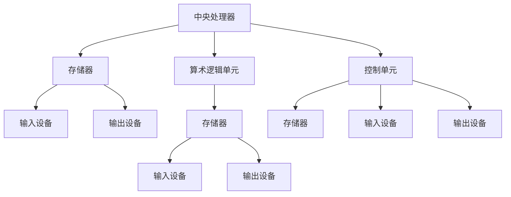

                 

### 1.1 冯诺伊曼体系架构的起源

冯诺伊曼体系架构的起源可以追溯到1940年代初期。在这个时期，世界上第一台电子数字计算机ENIAC（Electronic Numerical Integrator and Computer）在美国诞生。ENIAC的成功标志着电子计算机时代的开始，但它的设计理念并不完善。ENIAC采用的是程序控制方式，但程序和数据存储在一起，缺乏模块化设计。

1945年，匈牙利物理学家约翰·冯诺伊曼（John von Neumann）提出了著名的冯诺伊曼体系架构，这一架构对现代计算机的设计产生了深远的影响。冯诺伊曼认为，计算机系统应该包括五大组成部分：存储器、算术逻辑单元、控制单元、输入输出设备和通信接口。这一体系架构的特点是将程序和数据分开存储，并且通过指令控制计算机的运行。

为了更好地理解冯诺伊曼体系架构，我们可以使用Mermaid流程图来展示其核心组成部分：

**图1-1：冯诺伊曼体系架构的Mermaid流程图**

在这个流程图中，中央处理器（A）包括算术逻辑单元（E）和控制单元（F），存储器（G）和输入输出设备（H、I）通过通信接口（未在图中展示）与中央处理器相连。这种模块化设计使得计算机系统更加灵活，易于扩展和维护。

### 1.2 冯诺伊曼体系架构的核心组成部分

冯诺伊曼体系架构的核心组成部分包括存储器、算术逻辑单元（ALU）、控制单元和输入输出设备。以下是对这些组成部分的详细描述：

#### 1.2.1 存储器

存储器是计算机系统中用于存储程序和数据的组件。存储器可以分为内存和外部存储器。

- **内存**：内存是临时存储器，用于存储正在运行的程序和数据。内存分为随机存取存储器（RAM）和只读存储器（ROM）。RAM用于存储正在执行的数据和指令，断电后数据会丢失；ROM用于存储系统启动时必需的固件和BIOS，断电后数据不会丢失。

- **外部存储器**：外部存储器用于长期存储数据和程序。常见的外部存储器包括硬盘（HDD）、固态硬盘（SSD）、光盘等。硬盘和固态硬盘通过机械或电子方式存储数据，具有不同的读写速度和存储容量；光盘则通过激光读取和写入数据，适用于存储大量数据。

#### 1.2.2 算术逻辑单元（ALU）

算术逻辑单元（ALU）是计算机系统中的核心组件之一，负责执行算术运算和逻辑运算。ALU的主要功能包括：

- **算术运算**：如加法、减法、乘法、除法等。
- **逻辑运算**：如与、或、非、异或等。
- **位操作**：如移位、循环移位等。

ALU的设计通常基于一系列的硬件组件，包括加法器、比较器、逻辑门和寄存器。这些组件协同工作，实现复杂的运算功能。

#### 1.2.3 控制单元

控制单元（Control Unit，CU）是计算机系统中的核心组件，负责协调计算机各个部件的运行。控制单元的主要功能包括：

- **指令解码**：从存储器中读取指令，并将其解码为操作码和操作数。
- **指令执行**：根据操作码和操作数，控制计算机执行相应的操作，如数据传输、算术运算等。
- **控制流管理**：根据程序的控制结构，控制程序的执行流程，如跳转、分支等。
- **中断处理**：响应外部设备的中断请求，处理中断事件。

控制单元通常由程序计数器（PC）、指令寄存器（IR）、时序和控制逻辑组成。

#### 1.2.4 输入输出设备

输入输出设备（Input/Output Devices，I/O Devices）是计算机系统与外界进行交互的组件。输入设备用于将数据从外界输入到计算机系统中，如键盘、鼠标、扫描仪等；输出设备用于将计算机系统的处理结果输出到外界，如显示器、打印机、音响等。

输入输出设备通过输入输出接口与计算机系统相连，输入输出接口的设计和实现需要考虑数据传输速度、可靠性、兼容性等因素。

### 1.3 冯诺伊曼体系架构对现代计算机的影响

冯诺伊曼体系架构对现代计算机的发展产生了深远的影响。以下是一些关键点：

- **统一存储概念**：冯诺伊曼体系架构将程序和数据存储在同一存储器中，这一概念为计算机编程提供了灵活性，使得程序员可以更方便地访问和处理数据。

- **指令驱动模式**：冯诺伊曼体系架构采用指令驱动模式，通过执行指令来控制计算机的操作。这种模式使得计算机可以自动化执行任务，提高了计算效率和灵活性。

- **模块化设计**：冯诺伊曼体系架构的模块化设计使得计算机系统可以方便地进行扩展和维护。现代计算机系统通常采用模块化设计，以适应不断变化的技术需求。

- **广泛的应用**：冯诺伊曼体系架构的通用性使得它适用于各种计算任务，包括科学计算、商业计算、个人计算等。现代计算机系统普遍采用冯诺伊曼体系架构，这为计算机技术的普及和应用奠定了基础。

### 1.4 经典计算范式的定义与特点

经典计算范式是指基于冯诺伊曼体系架构的计算方式，具有以下特点：

- **顺序执行**：计算机按照程序中指令的顺序逐条执行。每条指令执行完成后，程序计数器（PC）指向下一条指令的地址。

- **确定性**：给定相同的输入，经典计算范式总是产生相同的结果。这是由于指令的顺序和指令集的确定性所决定的。

- **串行处理**：经典计算范式一次只能处理一条指令或一条数据。这限制了计算机系统的并行处理能力。

- **图灵完备性**：经典计算范式是图灵完备的，意味着它可以模拟任何可计算的过程。这为计算机技术提供了广泛的应用基础。

经典计算范式是计算机科学和工程中的基础，它奠定了现代计算机系统的基础。然而，随着计算任务的复杂度和规模不断增加，经典计算范式也暴露出了一些局限性，如并行处理能力有限、功耗和散热问题等。为了克服这些局限性，研究者们提出了并行计算、分布式计算和量子计算等新型计算范式。

### 1.5 经典计算范式与冯诺伊曼体系架构的联系

经典计算范式与冯诺伊曼体系架构有着紧密的联系。经典计算范式是建立在冯诺伊曼体系架构基础上的，两者之间有以下几个关键联系：

- **硬件实现**：经典计算范式需要依靠冯诺伊曼体系架构的硬件实现，如存储器、算术逻辑单元（ALU）、控制单元等。这些硬件组件共同构成了经典计算范式的基础。

- **指令集**：经典计算范式的指令集定义了计算机能够执行的操作类型。指令集通常依赖于冯诺伊曼体系架构的指令集体系，如操作码和操作数等。

- **编程语言**：经典计算范式的编程语言（如汇编语言和高级编程语言）依赖于冯诺伊曼体系架构的指令集和硬件特性。编程语言的设计和编译过程需要与冯诺伊曼体系架构相兼容。

- **软件支持**：经典计算范式需要软件支持，包括操作系统、编译器、解释器等。这些软件组件负责管理计算机资源、解释和执行指令、提供编程接口等。

总之，经典计算范式是冯诺伊曼体系架构在软件层面的体现，两者共同构成了现代计算机系统的核心。理解经典计算范式与冯诺伊曼体系架构的联系，对于深入理解计算机系统的工作原理和设计方法至关重要。

### 1.6 经典计算范式的局限性

尽管经典计算范式在计算机科学和工程中发挥了重要作用，但它也存在一些局限性，这些局限性在处理现代复杂计算任务时变得尤为突出。

#### 并行处理能力有限

经典计算范式主要采用顺序执行的方式，这意味着计算机一次只能处理一条指令或一条数据。这种串行处理方式在处理大量并行任务时显得低效。现代计算任务往往具有高度的并行性，例如图像处理、大数据分析、科学模拟等。这些任务可以通过并行计算技术来显著提高处理速度。然而，经典计算范式缺乏对并行处理的天然支持，这使得它难以充分利用现代多核处理器和并行计算硬件的优势。

#### 功耗和散热问题

随着计算任务的复杂度增加，经典计算范式所需的计算资源也不断增加，这导致功耗和散热问题变得日益严重。现代计算机系统通常包含大量高性能处理器和高速存储设备，这些设备的运行需要大量电能，并且会产生大量热量。如果不能有效管理功耗和散热，计算机系统可能会因过热而性能下降甚至损坏。因此，经典计算范式在处理大规模计算任务时面临着功耗和散热方面的挑战。

#### 计算资源限制

经典计算范式依赖于有限的计算资源，如内存、CPU和存储器。在处理海量数据和高维问题时，这些资源限制变得尤为明显。例如，在大数据分析和人工智能领域，数据量通常非常庞大，需要大量的内存和计算资源来处理。经典计算范式在处理这些任务时可能因资源不足而性能瓶颈。为了克服这一限制，研究者们提出了分布式计算和云计算等新型计算范式，通过利用网络和分布式系统来扩展计算资源。

#### 硬件和软件的依赖性

经典计算范式高度依赖于特定的硬件和软件配置，这使得它在面对新技术和新需求时表现出一定的滞后性。随着新型计算硬件（如GPU、FPGA、量子计算机等）和新型编程语言（如Python、Rust等）的出现，经典计算范式需要不断调整和优化以适应这些变化。这种依赖性可能导致经典计算范式在应对新兴技术和需求时显得不够灵活。

### 1.7 经典计算范式的未来发展方向

为了克服经典计算范式的局限性，研究者们提出了多种未来发展方向，包括并行计算、量子计算、生物计算等。以下是这些方向的一些具体内容和潜在影响：

#### 量子计算

量子计算利用量子位（qubit）和量子叠加、量子纠缠等量子力学原理，具有超强的并行性和计算能力。量子计算机在解决某些特定问题（如整数分解、量子模拟等）上比经典计算机快得多。未来，量子计算有望在密码学、材料科学、药物设计等领域发挥重要作用。然而，量子计算还面临着稳定性、误差纠正和编程语言等挑战。

#### 生物计算

生物计算利用生物分子和生物系统的特性进行计算。例如，利用DNA的存储能力和蛋白质的计算能力来构建生物计算机。生物计算在处理大规模数据和复杂计算任务时具有独特的优势，如高存储密度、低能耗和生物兼容性。未来，生物计算有望在医学、生物学、环境科学等领域发挥作用。

#### 并行计算

并行计算通过将任务分解为多个子任务，并在多个处理器上同时执行，从而提高了计算效率和速度。未来的并行计算将利用多核处理器、GPU、FPGA等硬件，并结合分布式计算和云计算技术，实现更高的并行度和计算能力。并行计算在科学计算、大数据处理、人工智能等领域具有广泛的应用前景。

#### 新型编程语言和工具

随着计算范式的变化，新型编程语言和工具的开发将成为未来发展方向之一。这些语言和工具将更加适合新型计算硬件和计算范式，如量子编程语言、生物计算模拟器等。这些工具将帮助开发者更高效地利用新型计算资源，开发新的计算应用。

综上所述，经典计算范式的未来发展方向多样且充满挑战。通过不断创新和探索，计算机科学和工程领域将不断突破经典计算范式的局限性，开辟新的计算领域和应用场景。

### 2.1 存储器的分类与功能

存储器是计算机系统中的关键组成部分，用于存储程序和数据。根据功能和特性，存储器可以分为内存（Memory）和外部存储器（External Storage）两大类。以下是详细分类和功能介绍：

#### 2.1.1 内存

内存是计算机系统中用于临时存储数据和程序的存储器，分为以下几种类型：

1. **随机存取存储器（RAM）**

   RAM是一种易失性存储器，即断电后数据会丢失。RAM用于存储正在运行的程序和数据，其读写速度较快，但容量相对较小。

   - **静态RAM（SRAM）**：SRAM的速度较快，但成本较高。它通常用于高速缓存和处理器内部寄存器。
   - **动态RAM（DRAM）**：DRAM的存储密度较高，但速度较慢。DRAM广泛用于主内存，是现代计算机系统中最主要的内存类型。

2. **只读存储器（ROM）**

   ROM是一种非易失性存储器，即断电后数据不会丢失。ROM通常用于存储系统启动时的基本输入输出系统（BIOS）或固件。

   - **掩膜ROM（MROM）**：MROM是在制造过程中被永久编程的，无法更改。
   - **可编程ROM（PROM）**：PROM可以通过编程器一次性编程。
   - **可擦写可编程ROM（EPROM）**：EPROM可以通过紫外线擦除并重新编程。
   - **电可擦写可编程ROM（EEPROM）**：EEPROM可以通过电信号擦除并重新编程，但速度较慢。
   - **闪存（Flash Memory）**：Flash Memory是EEPROM的一种变种，具有更高的存储密度和更快的读写速度。

#### 2.1.2 外部存储器

外部存储器是计算机系统中用于长期存储数据和程序的存储器，分为以下几种类型：

1. **硬盘驱动器（HDD）**

   HDD是一种机械硬盘，使用磁盘和磁头来存储数据。HDD具有大容量、高可靠性的特点，但速度较慢，且机械结构容易损坏。

2. **固态硬盘（SSD）**

   SSD是一种使用闪存存储数据的硬盘，具有速度快、功耗低、抗震性强的特点。SSD的读写速度远高于HDD，成为现代计算机系统中的主流外部存储器。

3. **光盘**

   光盘是一种使用光学原理存储数据的存储介质，包括CD、DVD、蓝光光盘等。光盘具有大容量、可重复写入的特点，但读取速度相对较慢。

4. **固态盘（SSD）**

   固态盘是一种使用闪存存储数据的存储设备，与固态硬盘类似，但通常具有更小的尺寸和更高的性能。固态盘广泛应用于移动设备和嵌入式系统。

#### 2.1.3 存储器的功能

存储器的功能包括数据的读写、存储和检索。内存主要用于存储当前运行的程序和数据，而外部存储器则用于存储长期数据和程序。以下是一些关键功能：

1. **数据读写**：存储器支持数据的快速读写操作，使得计算机可以高效地访问和处理数据。

2. **数据存储**：存储器提供大量的存储空间，使得计算机可以存储大量的程序和数据。

3. **数据检索**：存储器支持快速检索操作，使得计算机可以快速找到所需的数据和程序。

4. **数据备份**：外部存储器提供数据备份功能，使得计算机可以将数据复制到其他存储设备中，以防止数据丢失。

5. **数据压缩**：某些存储器支持数据压缩功能，可以在不损失数据的前提下减少存储空间的占用。

6. **数据加密**：某些存储器支持数据加密功能，以保护数据的安全性。

通过合理选择和使用存储器，计算机系统可以实现高效的存储和管理，满足各种计算任务的需求。

### 2.2 数据流的基本原理

数据流是计算机系统中数据流动的过程，它描述了数据在系统内部和外部设备之间的传输、处理和存储。理解数据流的基本原理对于设计高效的计算机系统至关重要。以下是对数据流基本原理的详细描述：

#### 2.2.1 数据输入

数据输入是指从外部设备（如键盘、鼠标、网络接口等）将数据传输到计算机系统中。数据输入过程通常包括以下几个步骤：

1. **数据捕获**：外部设备捕获用户输入或网络数据，并将其转换为计算机可以理解的格式。

2. **数据预处理**：计算机系统对捕获的数据进行预处理，包括数据校验、格式转换等，以确保数据的有效性和准确性。

3. **数据传输**：预处理后的数据通过输入接口（如USB、串口、网络接口等）传输到计算机系统中。

4. **数据存储**：计算机系统将输入数据存储到内存或其他存储设备中，以供后续处理。

#### 2.2.2 数据处理

数据处理是指计算机系统对存储的数据进行操作和计算的过程。数据处理过程通常包括以下几个步骤：

1. **数据读取**：计算机系统从内存或其他存储设备中读取需要处理的数据。

2. **数据运算**：计算机系统根据程序指令对数据进行运算，包括算术运算、逻辑运算、数据处理等。

3. **数据存储**：处理后的数据被存储回内存或其他存储设备中，以供后续使用或输出。

#### 2.2.3 数据输出

数据输出是指将处理后的数据从计算机系统传输到外部设备或存储设备。数据输出过程通常包括以下几个步骤：

1. **数据检索**：计算机系统从内存或其他存储设备中检索需要输出的数据。

2. **数据格式化**：计算机系统对输出数据格式化，使其符合外部设备或存储设备的格式要求。

3. **数据传输**：格式化后的数据通过输出接口（如USB、串口、网络接口等）传输到外部设备或存储设备。

4. **数据显示或存储**：外部设备或存储设备显示或存储输出数据，以供用户查看或进一步使用。

#### 2.2.4 数据流的交互机制

数据流的交互机制是确保数据在计算机系统内部和外部设备之间正确传输和处理的关键。以下是一些常见的数据流交互机制：

1. **缓冲区**：缓冲区用于临时存储数据，以减少数据传输的延迟。缓冲区可以位于输入输出接口、内存或外部存储器中。

2. **队列**：队列用于管理数据的顺序传输和存储。数据通常按照先入先出（FIFO）的顺序进行处理。

3. **中断**：中断是一种硬件或软件信号，用于通知计算机系统有数据需要处理。中断机制可以实时响应外部设备的状态变化。

4. **DMA（直接内存访问）**：DMA控制器允许外部设备直接访问内存，从而减少CPU的负担。DMA可以显著提高数据传输速度。

5. **同步机制**：同步机制确保数据在传输和处理过程中的一致性。同步机制包括锁、信号量、条件变量等。

通过合理设计和实现数据流的交互机制，计算机系统可以高效地处理大量数据，提高系统的性能和响应速度。

### 2.3 存储器与数据流的交互机制

存储器与数据流的交互机制是计算机系统正常运行的关键部分。它涉及到数据在存储器中的读写、存储和检索过程，以及如何优化这些操作以提高系统性能。以下是存储器与数据流交互机制的详细解析：

#### 2.3.1 存储器地址

存储器地址是存储器中每个存储单元的唯一标识符。地址由一系列二进制位组成，通常由内存管理单元（MMU）负责分配和管理。存储器地址分为逻辑地址和物理地址：

1. **逻辑地址**：逻辑地址是程序在运行时使用的地址，它由程序计数器（PC）、基址寄存器（BR）和偏移量（位移量）计算得出。逻辑地址使程序员可以独立于物理存储器布局进行编程。

2. **物理地址**：物理地址是存储器中实际存储数据的地址。MMU负责将逻辑地址转换为物理地址，以确保数据可以在正确的存储单元中读写。

#### 2.3.2 内存管理单元（MMU）

内存管理单元（MMU）是负责逻辑地址到物理地址转换的关键组件。MMU的功能包括：

1. **地址映射**：MMU将逻辑地址转换为物理地址，允许程序访问正确的存储单元。

2. **内存保护**：MMU通过设置访问权限，防止程序访问非授权的存储区域，从而提高系统的安全性。

3. **缓存管理**：MMU管理存储器的缓存，提高数据访问速度。

#### 2.3.3 存储器访问协议

存储器访问协议定义了数据在存储器中的读写操作流程，包括请求发送、响应接收和数据传输等。常见的存储器访问协议有：

1. **内存请求**：当CPU需要从存储器中读取或写入数据时，它会向MMU发送一个内存请求，包括逻辑地址和操作类型（读或写）。

2. **地址转换**：MMU根据内存请求的逻辑地址，查找内存映射表，将逻辑地址转换为物理地址。

3. **数据传输**：数据通过存储器总线传输到或从存储器中读取。在读取操作中，数据被传递给CPU；在写入操作中，数据从CPU传递到存储器。

4. **响应信号**：存储器完成数据读写操作后，向MMU发送一个响应信号，表示操作完成。

#### 2.3.4 缓存（Cache）

缓存是一种高速存储器，位于CPU和主存储器（RAM）之间。缓存的作用是减少CPU访问主存储器的时间，提高系统性能。缓存的工作原理包括：

1. **数据缓存**：当CPU访问存储器时，MMU首先检查缓存是否包含所需数据。如果缓存命中，数据可以直接从缓存中读取，从而加快访问速度。

2. **缓存一致性协议**：在多处理器系统中，缓存的一致性管理至关重要。缓存一致性协议（如MESI协议）确保不同处理器的缓存保持数据的一致性。

#### 2.3.5 数据存储与检索

数据存储与检索是存储器与数据流交互的核心过程。以下是一些优化数据存储与检索的策略：

1. **预取技术**：预取技术预测CPU未来的数据访问需求，并提前从存储器中读取数据，减少数据访问延迟。

2. **数据压缩**：数据压缩技术减少存储器占用的空间，提高存储器的利用率和数据访问速度。

3. **分层存储**：通过将数据分布在不同的存储层次（如RAM、SSD、HDD等），可以优化数据访问速度和成本。

4. **写缓冲区**：写缓冲区用于临时存储即将写入的数据，以提高写入速度。数据在写缓冲区中积累到一定程度后，再批量写入到存储器中。

通过优化存储器与数据流的交互机制，计算机系统可以实现高效的存储和检索操作，从而提高整体性能。

### 3.1 控制单元的功能与设计

控制单元（Control Unit，CU）是计算机系统的核心部件之一，负责协调各个部件的运行，确保指令的正确执行。控制单元的主要功能包括指令解码、指令执行、控制流管理和中断处理。以下是控制单元的具体功能与设计要点。

#### 3.1.

