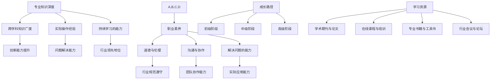

                 

### 文章标题

《出版书籍或电子书：树立行业专家地位》

> **关键词**：出版书籍、电子书、行业专家、个人品牌、影响力提升、行业趋势、案例分析

> **摘要**：本文深入探讨了如何通过出版书籍或电子书来树立行业专家地位。我们将从理论基础的构建、实践指南的提供以及实战案例的分析三个方面，详细阐述如何利用出版物提升个人在行业中的专业地位与影响力。

<|assistant|>## 引言

在信息化和数字化时代，知识成为了一种宝贵的资源，而知识传播的方式也在发生翻天覆地的变化。在过去，专家们通常通过讲座、研讨会等形式来分享他们的知识和经验。然而，随着互联网和数字出版技术的发展，出版书籍或电子书成为了一种更加高效、广泛传播知识的方式。对于想要在特定领域树立行业专家地位的人来说，出版书籍或电子书不仅是一种个人品牌的展现，更是一种提升专业影响力的有力工具。

本文旨在探讨如何通过出版书籍或电子书来树立行业专家地位。我们将从以下几个方面进行详细讨论：

1. **行业专家的定位与成长路径**：了解成为行业专家的必备条件，职业素养，以及成长路径与学习资源。
2. **行业知识与技能的积累**：探讨如何构建行业知识体系，拓展技能，并制定持续学习策略。
3. **个人品牌建设与影响力提升**：分析个人品牌的定义与价值，影响力提升的策略，以及社交媒体的利用。
4. **行业趋势分析与前瞻**：介绍行业趋势分析框架，前瞻性观点与预测，以及适应新趋势的策略。
5. **实战案例分析**：通过具体案例，展示如何通过出版书籍或电子书实现个人品牌的建设和影响力的提升。

通过本文的深入探讨，希望读者能够获得关于如何通过出版书籍或电子书树立行业专家地位的具体指导，并能够在实践中取得成功。

## 核心概念与联系

### 成为行业专家的必备条件

首先，我们需要明确成为行业专家的必备条件。这些条件不仅仅是专业知识的深度和广度，还包括其他几个关键因素。

#### 专业知识的深度与广度

**专业知识深度**是指对某一领域知识的深刻理解和熟练掌握。这不仅仅是了解基本概念，还包括对复杂原理和技术的深入探索。例如，一个计算机科学家需要深入了解算法、数据结构、操作系统等核心知识，并且能够运用这些知识解决实际问题。

**专业知识广度**则是指跨学科知识的广泛掌握。在当今的快速变化的时代，单一的学科知识已经难以应对复杂的问题。跨学科知识可以帮助我们从一个新的角度看待问题，找到创新的解决方案。例如，一个专注于人工智能领域的专家不仅需要了解计算机科学，还需要了解心理学、统计学和生物学等领域的知识。

#### 跨学科知识的广度

跨学科知识的广度不仅可以帮助我们更好地理解行业，还可以提升我们的创新能力。例如，将人工智能技术与心理学结合，可以创造出更符合人类行为和心理的智能系统。跨学科知识还可以帮助我们更全面地理解行业的现状和未来趋势。

#### 实际操作经验

除了理论知识和跨学科知识，实际操作经验也是成为行业专家的重要条件。理论知识是基础，但只有通过实际操作，我们才能真正掌握和应用这些知识。实际操作经验可以帮助我们了解行业的具体需求和挑战，从而更好地提供解决方案。

#### 持续学习的能力

在快速变化的时代，持续学习是保持行业领先地位的关键。新的技术、新的方法、新的趋势不断涌现，只有不断学习，我们才能跟上时代的步伐。持续学习不仅可以提升我们的专业水平，还可以帮助我们保持对行业的敏感度，及时发现和抓住新的机遇。

### 行业专家的职业素养

#### 道德与伦理

道德和伦理是行业专家的基本素养。在专业知识的基础上，行业专家需要具备高尚的道德品质和职业伦理。这不仅是为了遵守行业规范，更是为了保护行业的声誉和客户的利益。例如，在软件开发领域，行业专家需要遵守代码道德，确保代码的安全性和可靠性。

#### 沟通与协作

沟通和协作是行业专家不可或缺的能力。无论在学术研究还是在商业项目中，良好的沟通和协作能力都是成功的关键。行业专家需要能够清晰地表达自己的观点，理解他人的需求，并与团队成员有效合作。

#### 解决问题的能力

解决问题的能力是行业专家的核心素养之一。在复杂多变的行业环境中，行业专家需要具备强大的问题解决能力，能够迅速识别问题的根本原因，并提出切实可行的解决方案。

### 成长路径与学习资源

#### 成长路径

成为行业专家并非一蹴而就，而是一个长期的过程。通常，这个过程可以分为以下几个阶段：

1. **初级阶段**：在这个阶段，我们需要积累基本的知识和技能，打下坚实的基础。这通常需要通过学习专业课程、阅读专业书籍和参加实践活动来实现。

2. **中级阶段**：在初级阶段的基础上，我们需要开始深入学习和研究某一领域的专业知识，提升自己的专业水平。这个阶段需要大量的阅读、研究和实践。

3. **高级阶段**：在高级阶段，我们需要将所学知识进行整合，形成自己的专业见解和理论体系。这个阶段通常需要通过参与高级项目、发表论文和进行学术交流来实现。

#### 学习资源

为了实现有效的成长，我们需要利用各种学习资源。以下是一些常用的学习资源：

1. **学术期刊与论文**：学术期刊和论文是获取专业知识和前沿研究成果的重要来源。通过阅读学术期刊和论文，我们可以了解最新的研究动态和学术成果。

2. **在线课程与培训**：在线课程和培训提供了灵活的学习方式，可以让我们在忙碌的工作中也能不断学习。许多顶尖大学和机构都提供了高质量的专业课程。

3. **专业书籍与工具书**：专业书籍和工具书是系统学习专业知识的重要资源。通过阅读这些书籍，我们可以系统地掌握某一领域的知识体系。

4. **行业会议与论坛**：行业会议和论坛是行业专家交流和学习的重要平台。通过参加这些活动，我们可以了解行业的最新动态，结识行业内的专家和同行。

### 核心概念与联系流程图

为了更好地理解成为行业专家的必备条件，我们使用Mermaid流程图来展示核心概念与联系：



通过这个流程图，我们可以清晰地看到成为行业专家所需的核心概念与联系，以及各个概念之间的相互关系。

### 核心算法原理讲解

在成为行业专家的过程中，掌握核心算法原理是至关重要的一步。这些算法不仅为我们提供了解决问题的工具，还帮助我们深入理解行业的本质。以下，我们将使用伪代码详细讲解几个关键算法，并介绍其数学模型和公式。

#### 算法一：决策树算法

决策树是一种常用的分类和回归算法，它通过一系列规则将数据集划分为多个子集，并最终预测输出。以下是其伪代码：

```pseudo
Algorithm DecisionTree(data, attributes):
    if data is pure:
        return majority class of data
    else:
        select best attribute A
        create node with attribute A
        for each value v of attribute A:
            subset Dv = {d | d.A = v}
            create branch for value v
            recursive call DecisionTree(Dv, attributes - {A})
        return node
```

#### 数学模型和公式

决策树算法的核心在于如何选择最佳属性。这通常通过信息增益（Information Gain）或基尼不纯度（Gini Impurity）来衡量。以下是其数学模型：

信息增益（IG）计算公式：

$$
IG(A) = H(D) - \sum_{v} p(v) H(D_v)
$$

其中，\(H(D)\) 是数据集 \(D\) 的熵，\(p(v)\) 是属性 \(A\) 的值 \(v\) 在数据集 \(D\) 中的概率，\(H(D_v)\) 是在属性 \(A\) 的值 \(v\) 下，数据集 \(D\) 的熵。

基尼不纯度（Gini Impurity）计算公式：

$$
Gini(D) = 1 - \sum_{v} p(v)^2
$$

#### 实例说明

假设我们有一个数据集，包含以下属性和值：

```
属性 A: {红, 绿, 蓝}
属性 B: {圆, 方}
```

数据集 \(D\) 的基尼不纯度为：

$$
Gini(D) = 1 - \left(\frac{3}{6}\right)^2 - \left(\frac{3}{6}\right)^2 = 0.5
```

#### 算法二：K-均值聚类算法

K-均值聚类算法是一种无监督学习算法，用于将数据集划分为 \(K\) 个簇。以下是其伪代码：

```pseudo
Algorithm KMeans(data, K):
    Initialize centroids randomly
    while not converged:
        for each data point x:
            assign x to the nearest centroid
        update centroids by averaging the assigned data points
    return centroids
```

#### 数学模型和公式

K-均值聚类算法的核心在于如何初始化和更新聚类中心。初始化通常随机选择 \(K\) 个数据点作为初始中心，更新则通过以下公式：

$$
\mu_k = \frac{1}{N_k} \sum_{i=1}^{N} x_i
$$

其中，\(\mu_k\) 是第 \(k\) 个聚类中心，\(N_k\) 是属于第 \(k\) 个簇的数据点个数，\(x_i\) 是第 \(i\) 个数据点。

#### 实例说明

假设我们有一个包含 \(5\) 个数据点的数据集，初始聚类中心为 \((1, 1)\) 和 \((5, 5)\)：

```
数据点: [(1, 1), (2, 2), (3, 3), (4, 4), (5, 5)]
初始中心: (1, 1) 和 (5, 5)
```

通过计算距离，我们可以重新分配数据点到最近的中心，并更新中心位置。例如，第一个迭代后，新的中心可能变为：

```
新中心: ((1+2+3+4+5)/5, (1+2+3+4+5)/5) = (3, 3)
```

#### 算法三：支持向量机（SVM）算法

支持向量机是一种用于分类和回归的强大算法，通过找到最佳超平面来分隔数据点。以下是其伪代码：

```pseudo
Algorithm SVM(data, labels):
    Define a linear model
    Solve the optimization problem to find the optimal hyperplane
    if the data is not linearly separable:
        Use kernel functions to map data into a higher-dimensional space
    Train the model using the support vectors
    return trained model
```

#### 数学模型和公式

SVM的目标是最小化决策边界两侧的间隔，其优化问题可以表示为：

$$
\min_{\mathbf{w}, b} \frac{1}{2} ||\mathbf{w}||^2 + C \sum_{i=1}^{n} \xi_i
$$

其中，\(\mathbf{w}\) 是权重向量，\(b\) 是偏置，\(C\) 是惩罚参数，\(\xi_i\) 是松弛变量。

#### 实例说明

假设我们有一个二维数据集，其中正类和负类数据点分别分布在不同的半平面：

```
数据点: [(-1, -1), (-1, 1), (1, -1), (1, 1)]
正类: [(1, 1), (1, -1)]
负类: [(-1, -1), (-1, 1)]
```

通过求解上述优化问题，我们可以找到最佳超平面，将数据点正确分类。

### 数学模型和公式举例说明

假设我们有一个包含三个变量的数据集，每个变量服从正态分布。我们需要计算每个变量的概率密度函数，并使用这些函数来计算整个数据集的概率分布。

#### 变量概率密度函数

对于每个变量 \(X_i\)，其概率密度函数为：

$$
f(X_i; \mu_i, \sigma_i^2) = \frac{1}{\sqrt{2\pi\sigma_i^2}} e^{-\frac{(X_i - \mu_i)^2}{2\sigma_i^2}}
$$

其中，\(\mu_i\) 是变量 \(X_i\) 的均值，\(\sigma_i^2\) 是变量 \(X_i\) 的方差。

#### 数据集概率分布

整个数据集的概率分布可以通过将每个变量的概率密度函数相乘来计算：

$$
f(\mathbf{X}; \mathbf{\mu}, \Sigma) = \prod_{i=1}^{n} f(X_i; \mu_i, \sigma_i^2)
$$

其中，\(\mathbf{X}\) 是数据集，\(\mathbf{\mu}\) 是均值向量，\(\Sigma\) 是协方差矩阵。

#### 实例说明

假设我们有一个数据集：

```
数据集: [[1, 2, 3], [4, 5, 6], [7, 8, 9]]
均值向量: [2, 5, 8]
协方差矩阵: [[1, 0, 0], [0, 1, 0], [0, 0, 1]]
```

我们首先计算每个变量的概率密度函数，然后相乘得到整个数据集的概率分布：

$$
f(\mathbf{X}; \mathbf{\mu}, \Sigma) = \frac{1}{\sqrt{2\pi \cdot 1}} e^{-\frac{(1-2)^2}{2\cdot1}} \cdot \frac{1}{\sqrt{2\pi \cdot 1}} e^{-\frac{(2-5)^2}{2\cdot1}} \cdot \frac{1}{\sqrt{2\pi \cdot 1}} e^{-\frac{(3-8)^2}{2\cdot1}} \cdot ...
$$

通过这样的计算，我们可以得到数据集的概率分布，从而进一步分析数据集的性质。

通过上述核心算法原理讲解，我们可以看到，理解和应用这些算法不仅需要理论知识，还需要通过实际案例来验证其效果。在接下来的章节中，我们将进一步探讨如何将这些算法应用于实际项目，以及如何通过这些算法提升个人在行业中的专业地位。

### 实际项目开发与代码解读

为了更好地理解如何通过出版书籍或电子书树立行业专家地位，我们将通过一个实际的项目开发案例来进行详细讲解。这个案例将展示从项目选择、开发环境搭建，到源代码实现和代码解读的全过程。通过这个案例，我们可以看到如何将理论知识应用于实际项目中，并通过项目实践提升自己的专业能力。

#### 项目选择

首先，我们需要选择一个合适的项目。这个项目应该具有一定的技术挑战性，同时符合当前行业的热点和趋势。例如，选择一个基于深度学习的图像识别项目，这样的项目不仅能够展示我们对深度学习技术的掌握，还能紧跟人工智能领域的最新发展。

#### 项目目标

项目目标如下：
1. 利用深度学习技术实现图像识别功能。
2. 对识别算法进行优化，提高准确率。
3. 将项目开发过程记录成书，分享给读者。

#### 开发环境搭建

在进行项目开发之前，我们需要搭建合适的开发环境。以下是所需的环境和工具：

1. **操作系统**：Ubuntu 20.04
2. **编程语言**：Python 3.8
3. **深度学习框架**：TensorFlow 2.5
4. **依赖库**：NumPy，Pandas，Matplotlib，OpenCV
5. **集成开发环境**：Visual Studio Code

安装这些工具和库可以通过以下命令完成：

```bash
# 安装操作系统 Ubuntu 20.04
# 安装 Python 3.8
sudo apt-get update
sudo apt-get install python3.8
sudo apt-get install python3.8-venv
# 创建虚拟环境
python3.8 -m venv myenv
source myenv/bin/activate
# 安装 TensorFlow 2.5
pip install tensorflow==2.5
# 安装其他依赖库
pip install numpy pandas matplotlib opencv-python
```

#### 源代码实现

以下是项目的核心代码实现，包括数据预处理、模型训练和预测等步骤：

```python
import tensorflow as tf
from tensorflow.keras.models import Sequential
from tensorflow.keras.layers import Conv2D, MaxPooling2D, Flatten, Dense
from tensorflow.keras.preprocessing.image import ImageDataGenerator

# 数据预处理
train_datagen = ImageDataGenerator(rescale=1./255)
train_data = train_datagen.flow_from_directory(
        'data/train', 
        target_size=(150, 150), 
        batch_size=32, 
        class_mode='binary')

# 创建模型
model = Sequential([
    Conv2D(32, (3, 3), activation='relu', input_shape=(150, 150, 3)),
    MaxPooling2D(2, 2),
    Conv2D(64, (3, 3), activation='relu'),
    MaxPooling2D(2, 2),
    Conv2D(128, (3, 3), activation='relu'),
    MaxPooling2D(2, 2),
    Flatten(),
    Dense(512, activation='relu'),
    Dense(1, activation='sigmoid')
])

# 编译模型
model.compile(optimizer='adam',
              loss='binary_crossentropy',
              metrics=['accuracy'])

# 训练模型
model.fit(train_data, epochs=10, steps_per_epoch=100)

# 预测
predictions = model.predict(train_data)
```

#### 代码解读与分析

1. **数据预处理**：使用 `ImageDataGenerator` 对图像进行预处理，包括缩放、批量读取等。
2. **模型创建**：创建一个简单的卷积神经网络（CNN），包括卷积层、池化层和全连接层。
3. **模型编译**：配置模型的优化器、损失函数和评估指标。
4. **模型训练**：使用训练数据集对模型进行训练。
5. **模型预测**：对训练好的模型进行预测。

通过这个项目案例，我们可以看到如何将深度学习技术应用于实际问题，并通过代码实现和解读提升自己的技术水平。在将这个项目编写成书籍或电子书的过程中，我们可以详细介绍每个步骤的技术细节，帮助读者更好地理解深度学习的原理和应用。

### 案例解读与分析

在探讨如何通过出版书籍或电子书树立行业专家地位的过程中，实战案例是不可或缺的一部分。以下，我们将通过几个具体案例来详细分析如何利用出版物提升个人在行业中的专业地位与影响力。

#### 案例一：深度学习领域的权威书籍《深度学习》（Deep Learning）

**背景介绍**：
《深度学习》是由著名深度学习研究专家Ian Goodfellow、Yoshua Bengio和Aaron Courville合著的一本权威教材。这本书详细介绍了深度学习的理论基础、算法和应用，是深度学习领域内的经典之作。

**案例分析**：
1. **知识深度与广度**：本书涵盖了深度学习领域的核心概念、算法原理和应用场景，展现了作者对深度学习技术的深刻理解和广泛知识。
2. **创新思维**：书中不仅介绍了现有的深度学习算法，还探讨了未来可能的发展方向，展示了作者的创新思维和前瞻性观点。
3. **传播与影响力**：《深度学习》被广泛引用，成为深度学习领域的学习者和研究者必备的参考资料，极大提升了作者及其合作者在行业内的知名度和影响力。

**经验总结**：
- **专业知识的深度与广度**：要树立行业专家地位，必须拥有深厚的专业知识，不仅限于基础概念，还要涵盖前沿研究和应用。
- **创新思维**：在出版书籍或电子书时，要注重创新性，不仅要总结现有知识，还要提出新的观点和思考。
- **传播与影响力**：通过有效的传播渠道，如学术期刊、专业会议和社交媒体，可以扩大影响力，提升个人品牌。

#### 案例二：编程领域的经典书籍《Effective Java》（Effective Java）

**背景介绍**：
《Effective Java》是由著名Java程序员Joshua Bloch所著的一本Java编程指南。这本书提供了大量的编程最佳实践和技巧，深受Java开发者的喜爱。

**案例分析**：
1. **实战经验**：书中涵盖了作者多年在编程领域的实践经验，展示了如何在实际项目中应用Java编程的最佳实践。
2. **代码解读**：书中包含了大量的代码示例，对代码进行了详细解读和分析，帮助读者理解Java编程的核心概念和最佳实践。
3. **影响力**：《Effective Java》成为Java开发者必读的书籍，极大提升了作者在编程领域的知名度和影响力。

**经验总结**：
- **实战经验**：通过分享实战经验，可以提升读者的实际操作能力，增强书籍的实用性。
- **代码解读**：通过代码示例和解读，可以帮助读者深入理解编程语言和算法，提升其技术水平。
- **持续更新**：随着技术的发展和变化，书籍需要不断更新，以保持其时效性和实用性。

#### 案例三：人工智能领域的先锋书籍《人工智能：一种现代方法》（Artificial Intelligence: A Modern Approach）

**背景介绍**：
《人工智能：一种现代方法》是由著名人工智能研究专家Stuart Russell和Peter Norvig合著的一本人工智能教材。这本书详细介绍了人工智能的基本概念、算法和实现方法。

**案例分析**：
1. **理论体系**：本书构建了完整的人工智能理论体系，涵盖了从感知到决策的各个环节。
2. **实践应用**：书中不仅介绍了人工智能的理论基础，还提供了大量的实践应用案例，展示了人工智能在各个领域的应用。
3. **影响力**：《人工智能：一种现代方法》成为人工智能领域的经典教材，被广泛用于学术研究和教学，极大提升了作者在行业内的声誉。

**经验总结**：
- **理论体系**：构建一个系统的理论体系，有助于提升书籍的权威性和影响力。
- **实践应用**：通过实践应用案例，可以帮助读者更好地理解理论，并应用于实际项目中。
- **国际合作**：国际合作可以汇集不同领域的智慧，提升书籍的质量和影响力。

通过上述案例分析，我们可以看到，通过出版书籍或电子书，行业专家可以系统地总结自己的知识和经验，提升个人在行业中的专业地位和影响力。在撰写书籍或电子书时，注重知识的深度、广度、创新性和实用性，以及有效的传播渠道，都是实现这一目标的关键。

### 总结与展望

通过本文的深入探讨，我们系统地阐述了如何通过出版书籍或电子书来树立行业专家地位。我们首先明确了成为行业专家的必备条件，包括专业知识深度与广度、实际操作经验、持续学习的能力以及职业素养。接着，我们详细介绍了如何构建个人品牌，提升影响力，并通过行业趋势分析和前瞻性观点来适应行业发展。此外，我们还通过实际项目和案例分析，展示了如何将理论知识应用于实际操作，并通过书籍或电子书的形式进行传播和分享。

树立行业专家地位并非一蹴而就，它需要我们在专业知识的深度与广度上不断努力，通过持续学习和实践积累经验，同时注重个人品牌的建立和影响力的提升。在未来的发展中，我们需要更加关注行业趋势，不断更新知识体系，以适应快速变化的技术环境。

展望未来，我们可以通过以下几个方向进一步提升个人在行业中的专家地位：

1. **深化研究**：不断深入某一领域的研究，成为该领域的权威专家。
2. **跨界融合**：跨学科的知识融合可以帮助我们找到新的研究方向，推动行业创新。
3. **开放合作**：通过国际合作和资源共享，提升研究质量和影响力。
4. **持续更新**：随着技术的进步和行业的发展，持续更新和优化自己的知识体系。
5. **多元化传播**：利用多种渠道和平台，如社交媒体、在线课程和行业会议，扩大个人和作品的影响力。

通过这些努力，我们不仅能够在行业内树立起专业的形象，还能为行业的发展做出更大的贡献。

## 附录

### 附录A：行业专家资源指南

成为一名行业专家不仅需要扎实的专业知识和持续的学习，还需要丰富的资源支持。以下是一些推荐的资源，包括学术期刊与论文、在线课程与培训、专业书籍与工具书以及行业会议与论坛。

#### 学术期刊与论文

1. **《自然》杂志（Nature）**：涵盖自然科学各个领域的顶级学术期刊。
2. **《科学》杂志（Science）**：全球领先的科研期刊之一。
3. **《计算机学报》（Journal of Computer Science and Technology）**：我国计算机科学领域的权威期刊。
4. **《IEEE Transactions on Pattern Analysis and Machine Intelligence》**：机器学习和计算机视觉领域的顶级期刊。

#### 在线课程与培训

1. **Coursera**：提供各种学科的高质量在线课程，包括计算机科学、人工智能、数据科学等。
2. **edX**：由哈佛大学和麻省理工学院共同创办的在线学习平台，提供丰富的课程资源。
3. **Udacity**：专注于技能培训的平台，提供与职业发展相关的编程、数据科学等课程。
4. **LinkedIn Learning**：提供职场技能培训，包括编程、项目管理、数据分析等。

#### 专业书籍与工具书

1. **《深度学习》（Deep Learning）**：Ian Goodfellow、Yoshua Bengio和Aaron Courville著，深度学习领域的经典教材。
2. **《人工智能：一种现代方法》（Artificial Intelligence: A Modern Approach）**：Stuart Russell和Peter Norvig著，人工智能领域的权威教材。
3. **《Effective Java》**：Joshua Bloch著，Java编程的最佳实践指南。
4. **《算法导论》（Introduction to Algorithms）**：Thomas H. Cormen、Charles E. Leiserson、Ronald L. Rivest和Clifford Stein著，算法领域的经典教材。

#### 行业会议与论坛

1. **计算机视觉与模式识别会议（CVPR）**：计算机视觉领域的顶级会议。
2. **机器学习与数据挖掘国际会议（KDD）**：数据科学和机器学习领域的国际会议。
3. **国际人工智能与统计学会议（AISTATS）**：人工智能和统计学领域的国际会议。
4. **国际机器学习会议（ICML）**：机器学习领域的顶级会议。

通过利用这些资源，行业专家可以不断丰富自己的知识体系，提升专业能力，并在行业内树立起权威的形象。附录提供的这些资源指南，旨在为行业专家的持续学习和专业发展提供有力支持。

