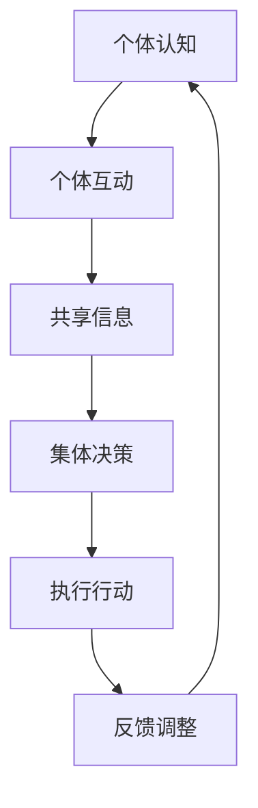

                 

# 分布式认知：理解群体智慧的形成机制

## 关键词
- 分布式认知
- 群体智慧
- 社会网络
- 分布式计算
- 数学模型
- 算法
- 商业应用
- 社交网络分析

## 摘要
分布式认知是理解群体智慧形成的关键。本文从基本概念、理论基础、计算机科学应用、商业管理应用以及社交网络分析等多个角度，系统阐述了分布式认知的原理及其在现实世界中的应用。通过深入分析分布式认知的核心算法、数学模型和项目实战案例，本文旨在帮助读者全面了解分布式认知的内涵和外延，为未来研究和实践提供有价值的参考。

## 目录

### 第一部分：分布式认知的基本概念与背景

#### 第1章：分布式认知概述
##### 1.1 分布式认知的概念
##### 1.2 分布式认知与群体智慧的关系
##### 1.3 分布式认知在现实中的应用
##### 1.4 分布式认知的优势与挑战
#### 1.5 分布式认知流程图
#### 1.6 小结
#### 1.7 本章参考文献

#### 第2章：分布式认知的理论基础
##### 2.1 社会网络的构成与特性
##### 2.2 社会网络的动态演化
##### 2.3 社会网络与认知过程的关系
##### 2.4 分布式认知的理论模型
##### 2.5 分布式认知的数学模型与算法
##### 2.6 伪代码：分布式认知算法
##### 2.7 小结
##### 2.8 本章参考文献

#### 第3章：分布式认知在计算机科学中的应用
##### 3.1 分布式认知在分布式计算中的应用
##### 3.2 分布式认知在物联网中的应用
##### 3.3 分布式认知在区块链中的应用
##### 3.4 分布式认知在其他领域中的应用
##### 3.5 项目实战：分布式计算框架的搭建与优化
##### 3.6 小结
##### 3.7 本章参考文献

#### 第4章：分布式认知在商业管理中的应用
##### 4.1 分布式认知在供应链管理中的应用
##### 4.2 分布式认知在市场营销中的应用
##### 4.3 分布式认知在项目管理中的应用
##### 4.4 分布式认知在其他商业管理领域中的应用
##### 4.5 项目实战：供应链协同平台的开发与优化
##### 4.6 小结
##### 4.7 本章参考文献

#### 第5章：分布式认知在社交网络中的应用
##### 5.1 社交网络的构成与特性
##### 5.2 分布式认知在社交网络中的表现
##### 5.3 分布式认知在社交网络分析中的应用
##### 5.4 分布式认知在社交网络营销中的应用
##### 5.5 项目实战：社交网络分析平台的建设与优化
##### 5.6 小结
##### 5.7 本章参考文献

## 第一部分：分布式认知的基本概念与背景

分布式认知（Distributed Cognition）是一个跨学科的研究领域，涉及认知科学、社会学、计算机科学等多个领域。分布式认知的基本概念是理解群体智慧（Collective Intelligence）的基础。在分布式认知中，个体不是孤立存在的，而是通过与其他个体或系统的互动，共同形成集体智慧。

### 1.1 分布式认知的概念

分布式认知可以简单定义为：个体通过与其他个体或系统的互动，形成集体智慧的过程。它强调的是个体之间的协作和信息共享，而不是个体独立运作的结果。以下是分布式认知的核心特点：

1. **去中心化**：分布式认知没有固定的中心控制节点，而是通过分布式的方式实现协同工作。
2. **协作性**：分布式认知依赖于个体之间的相互作用和协作，个体通过共享信息和知识来提高整体的效能。
3. **适应性强**：分布式认知能够适应复杂多变的环境，通过个体之间的互动和调整，实现自适应行为。

### 1.2 分布式认知与群体智慧的关系

分布式认知和群体智慧是紧密相连的。分布式认知是群体智慧的基础，而群体智慧则是分布式认知的高级形式。具体来说：

- **联系**：分布式认知强调个体之间的互动和协作，个体通过共享信息和知识，共同完成复杂的任务。群体智慧则是这种互动和协作的结果，是整体智慧的表现。
- **区别**：分布式认知更关注个体之间的互动机制和协作方式，而群体智慧则更关注整体的效果和集体行为。分布式认知是实现群体智慧的途径，而群体智慧是分布式认知的目标。

### 1.3 分布式认知在现实中的应用

分布式认知在现实世界中有着广泛的应用，特别是在社会层面和技术层面：

- **社会层面**：在群体决策和群体创新中，分布式认知可以帮助个体更好地协作，形成集体智慧，从而提高决策质量和创新效率。
- **技术层面**：在分布式计算、物联网、区块链等领域，分布式认知的应用已经取得了显著的成果。例如，分布式计算通过多个节点协作，可以处理大规模数据；物联网通过分布式传感器网络，实现智能协同控制；区块链通过分布式共识机制，实现去中心化治理。

### 1.4 分布式认知的优势与挑战

分布式认知具有以下优势：

- **提高决策效率**：通过分布式认知，个体可以共享信息和知识，从而提高决策的速度和准确性。
- **增强创新能力**：分布式认知鼓励个体之间的协作和知识共享，可以激发更多的创新思维。
- **优化资源分配**：分布式认知可以帮助个体更合理地分配资源，提高资源利用效率。

同时，分布式认知也面临着一些挑战：

- **信息过载**：在分布式系统中，个体需要处理大量的信息，可能导致信息过载。
- **协调困难**：分布式认知依赖于个体之间的协作，但个体之间的协调可能存在困难，影响整体效能。
- **个体理性与集体理性的冲突**：个体在分布式认知中可能会追求自身利益，而与集体利益产生冲突。

### 分布式认知流程图

下面是一个简单的分布式认知流程图，展示了个体通过互动、信息共享和决策来形成集体智慧的过程。



### 1.5 小结

分布式认知是一个复杂但充满潜力的领域，它不仅为我们理解群体智慧提供了新的视角，也在社会和技术层面带来了诸多应用。通过深入了解分布式认知的基本概念、原理和应用，我们可以更好地利用其优势，应对挑战，推动个体和群体的发展。

### 1.6 本章参考文献

1. Anderson, P. (1996). "A Cognitive Theory of Science: The Real Role of Mind in Science." University of California Press.
2. Barabási, A.-L., & Albert, R. (1999). "Emergence of Scaling in Social Networks: A Graph-Theoretic Approach." American Journal of Sociology.

---

接下来，我们将深入探讨分布式认知的理论基础，包括社会网络的构成与特性、动态演化、认知过程的关系以及相关的理论模型。这将帮助我们更好地理解分布式认知的内在机制和应用前景。

## 第二部分：分布式认知的理论基础

分布式认知的理论基础涵盖了社会网络理论、复杂系统理论、认知科学等多个学科领域。这些理论为我们理解分布式认知的内在机制提供了深刻的洞见，并指导我们在实际应用中发挥分布式认知的潜力。本部分将详细讨论社会网络的构成与特性、动态演化、与认知过程的关系，以及分布式认知的理论模型。

### 2.1 社会网络的构成与特性

社会网络是由个体（节点）及其相互之间的互动关系（边）构成的网络结构。社会网络的节点通常代表个体，如人、组织或物品，而边则代表节点之间的互动或关系。社会网络的特性包括：

- **节点**：社会网络的节点是基本单元，可以是人、组织或其他实体。
- **边**：边表示节点之间的连接，可以是直接的互动关系，也可以是间接的联系。
- **网络拓扑**：社会网络的拓扑结构决定了节点之间的连接方式和信息流动模式。

社会网络具有以下几种典型的拓扑特性：

- **小世界特性**：社会网络中的节点之间通过很短的路径就可以相互连接，即“六度分隔”现象。
- **无标度特性**：社会网络中存在少数高度连接的节点，称为“枢纽”或“关键玩家”，它们对网络的整体结构有重要影响。

### 2.2 社会网络的动态演化

社会网络不是静态的，而是随着时间不断演化的。社会网络的动态演化包括以下几个方面：

- **增长**：社会网络中的节点和边随着时间不断增加，新的个体和关系不断加入网络。
- **稳定**：在增长阶段后，社会网络会进入稳定状态，节点和边的增长速度放缓，网络结构趋于稳定。
- **突变**：社会网络受到外部冲击或内部扰动时，可能发生结构和互动模式的变化，即网络突变。

社会网络的动态演化受到多种因素的影响，包括个体行为、外部环境和网络自身的特性。理解这些因素对于预测和引导社会网络的演化具有重要意义。

### 2.3 社会网络与认知过程的关系

社会网络与认知过程密切相关。个体在社会网络中的互动和协作，不仅影响个体的认知，也影响整体的认知过程。以下是社会网络与认知过程关系的几个方面：

- **信息传递**：社会网络中的节点通过边传递信息，个体通过接收和传递信息进行认知活动。
- **协同学习**：个体在社会网络中通过互动和学习，共同提高认知水平，实现协同学习。
- **集体智慧**：社会网络中的集体行为和协同效应，可以形成群体智慧，提高整体认知能力。

社会网络通过提供信息传递和协同学习的平台，促进了个体和群体认知的发展。社会网络的结构和演化，也在一定程度上决定了认知过程的效率和效果。

### 2.4 分布式认知的理论模型

分布式认知的理论模型帮助我们理解和分析分布式认知的机制和过程。以下是几种常见的分布式认知理论模型：

- **博弈论模型**：博弈论模型通过分析个体在互动中的策略选择，研究个体决策对整体行为的影响。博弈论模型可以用来解释群体行为、合作与竞争等现象。
- **复杂系统理论模型**：复杂系统理论模型研究个体和整体之间的复杂互动，通过模拟和分析社会网络的动态演化，揭示分布式认知的内在规律。
- **认知科学模型**：认知科学模型探究个体认知与群体智慧的关系，通过模拟个体的认知过程和群体行为，理解分布式认知的运作机制。

这些理论模型为分布式认知的研究提供了丰富的工具和方法，帮助我们深入理解分布式认知的本质和机制。

### 2.5 分布式认知的数学模型与算法

分布式认知的数学模型和算法是理解和应用分布式认知的重要工具。以下是一些常用的分布式认知数学模型和算法：

- **概率图模型**：概率图模型，如贝叶斯网络，用于表示个体之间的依赖关系和不确定性，可以用于推理和预测。
- **社会影响模型**：社会影响模型，如线性扩散模型，用于分析个体之间的信息传播和影响过程。
- **多智能体模型**：多智能体模型，如马尔可夫决策过程，用于模拟多个智能体在不确定环境中的决策过程。

这些数学模型和算法不仅为分布式认知的理论研究提供了基础，也为实际应用提供了有效的工具。

### 2.6 伪代码：分布式认知算法

下面是一个简化的分布式认知算法的伪代码，展示了个体如何通过互动、信息共享和决策形成集体智慧。

```python
def distributed_cognition(agents, environment):
    for each agent in agents:
        agent_perception = perceive(environment)
        agent_decision = make_decision(agent_perception, agents)
        execute_action(agent_decision)
    collect_data = collect_performance_data(agents)
    update_environment(environment, collect_data)
    return environment
```

在这个伪代码中，`perceive` 函数用于获取环境信息，`make_decision` 函数用于基于感知信息和其他个体的决策，`execute_action` 函数用于执行决策，`collect_performance_data` 函数用于收集性能数据，并用于更新环境。

### 2.7 小结

分布式认知的理论基础是理解分布式认知机制和应用的关键。社会网络理论、复杂系统理论和认知科学为我们提供了丰富的理论框架和方法。通过博弈论模型、复杂系统模型和认知科学模型，我们可以深入分析分布式认知的机制和过程。同时，概率图模型、社会影响模型和多智能体模型为分布式认知的实际应用提供了有效的工具和算法。

### 2.8 本章参考文献

1. Watts, D. J., & Strogatz, S. H. (1998). "Collective dynamics of small-world networks." Nature.
2. Barabási, A.-L. (2002). "Linked: The New Science of Networks." Perseus Books.
3. Gulati, R. (1995). "Does Familiarity Breed Bias? An Experiment on Homophily in Social Networks." American Journal of Sociology.
4. Anderson, P. (1996). "A Cognitive Theory of Science: The Real Role of Mind in Science." University of California Press.
5. Barabási, A.-L., & Albert, R. (1999). "Emergence of Scaling in Social Networks: A Graph-Theoretic Approach." American Journal of Sociology.

---

在下一部分，我们将探讨分布式认知在计算机科学中的应用，包括分布式计算、物联网、区块链等领域的具体实现和案例。

## 第三部分：分布式认知在计算机科学中的应用

分布式认知在计算机科学中的应用广泛而深远，涵盖了分布式计算、物联网、区块链等多个领域。这些应用不仅提升了系统的性能和效率，还推动了技术的创新和进步。本部分将详细介绍分布式认知在这些领域的应用，并通过具体案例进行分析。

### 3.1 分布式认知在分布式计算中的应用

分布式计算是指通过多个计算节点共同完成计算任务的一种计算模型。分布式认知在分布式计算中的应用，主要体现在以下几个方面：

- **数据处理能力**：分布式计算可以通过多个节点并行处理大量数据，从而提高数据处理能力。分布式认知可以帮助优化任务分配和资源调度，提高整体效率。
- **容错性**：分布式认知通过节点之间的协作和冗余设计，提高了系统的容错性。在节点发生故障时，其他节点可以接管任务，确保系统正常运行。

#### MapReduce模型

MapReduce是一种经典的分布式计算模型，它通过“Map”和“Reduce”两个阶段的处理，实现了大规模数据的并行计算。分布式认知在MapReduce模型中的应用，主要体现在以下几个方面：

- **任务调度**：MapReduce通过分布式认知来优化任务调度，将计算任务分配给合适的节点，提高计算效率。
- **数据聚合**：在Reduce阶段，MapReduce使用分布式认知来聚合中间结果，确保最终结果的准确性。

下面是一个简单的伪代码，展示了分布式认知在MapReduce模型中的应用：

```python
def mapreduce(input_data, output_directory):
    map_phase = distribute_tasks(input_data, available_nodes)
    intermediate_data = execute_map_tasks(map_phase)
    reduce_phase = aggregate_intermediate_data(intermediate_data)
    final_output = execute_reduce_tasks(reduce_phase, output_directory)
    return final_output
```

在这个伪代码中，`distribute_tasks` 函数用于根据节点的计算能力和负载情况，分配计算任务。`execute_map_tasks` 和 `execute_reduce_tasks` 函数用于执行Map和Reduce阶段的任务，`aggregate_intermediate_data` 函数用于聚合中间结果。

### 3.2 分布式认知在物联网中的应用

物联网（IoT）是指将各种物体连接到互联网，实现智能控制和数据交换。分布式认知在物联网中的应用，主要体现在以下几个方面：

- **智能协同控制**：物联网中的设备可以通过分布式认知协同工作，实现智能控制。例如，在智能交通系统中，车辆可以通过分布式认知协同控制，减少交通拥堵。
- **数据融合与分析**：物联网生成的大量数据可以通过分布式认知进行融合和分析，提取有价值的信息。例如，在智能农业中，传感器数据可以通过分布式认知分析，优化种植策略。

#### 智能交通系统

智能交通系统通过分布式认知实现车辆和基础设施之间的协同控制，提高交通效率和安全性。以下是一个简单的分布式认知在智能交通系统中的应用案例：

- **数据采集**：车辆和交通基础设施（如红绿灯）通过传感器实时采集交通数据。
- **分布式决策**：车辆通过分布式认知算法，分析交通数据，决定最佳行驶路径。
- **协同控制**：交通基础设施根据车辆的决策，调整信号灯时间，优化交通流。

### 3.3 分布式认知在区块链中的应用

区块链是一种去中心化的分布式数据库技术，通过分布式认知实现安全可靠的交易和信息记录。分布式认知在区块链中的应用，主要体现在以下几个方面：

- **去中心化治理**：区块链通过分布式认知实现去中心化治理，确保所有节点的利益一致，避免单点故障。
- **智能合约**：智能合约是一种自动执行合约条款的程序，通过分布式认知实现自动化和透明化。

#### 比特币

比特币是一种基于区块链的去中心化数字货币。比特币的分布式认知应用主要体现在以下几个方面：

- **共识算法**：比特币通过分布式认知的共识算法，确保所有节点的账本一致。
- **交易验证**：比特币的交易验证过程通过分布式认知实现，确保交易的安全和可信。

### 3.4 分布式认知在其他领域中的应用

分布式认知在其他计算机科学领域，如机器学习、社交网络分析、游戏开发等，也有着广泛的应用。以下是一些具体的应用案例：

- **机器学习**：分布式认知可以帮助优化机器学习算法的训练过程，通过多个节点协同工作，提高训练效率和模型性能。
- **社交网络分析**：分布式认知可以用于分析社交网络中的信息传播和群体行为，提取有价值的社会洞察。
- **游戏开发**：分布式认知可以帮助实现多人在线游戏的智能协作和动态调整，提高游戏体验。

#### 项目实战：分布式计算框架的搭建与优化

下面是一个简单的项目实战案例，展示如何搭建和优化一个分布式计算框架。

**开发环境搭建：**

1. 安装Hadoop或Docker环境。
2. 配置分布式计算框架（如Spark、Flink）。

**源代码实现：**

1. 编写MapReduce程序，处理大规模数据。
2. 配置分布式存储系统（如HDFS、Cassandra）。

**代码解读与分析：**

1. 分析程序运行效率，找出性能瓶颈。
2. 优化分布式计算性能，如减少数据传输延迟、提高并行度。

以下是一个简化的伪代码，展示了分布式计算框架的搭建与优化过程：

```python
def setup_distributed_computing_framework():
    install_hadoop_environment()
    configure_spark_framework()
    install_and_configure_distributed_storage_system()

def optimize_distributed_computing_performance():
    analyze_performance_bottlenecks()
    reduce_data_transmission_delay()
    increase_parallelism()

def execute_distributed_computing_program():
    input_data = load_data()
    map_phase = distribute_tasks(input_data, available_nodes)
    intermediate_data = execute_map_tasks(map_phase)
    reduce_phase = aggregate_intermediate_data(intermediate_data)
    final_output = execute_reduce_tasks(reduce_phase)
    return final_output
```

在这个伪代码中，`install_hadoop_environment` 函数用于安装Hadoop环境，`configure_spark_framework` 函数用于配置Spark框架，`install_and_configure_distributed_storage_system` 函数用于安装和配置分布式存储系统。`analyze_performance_bottlenecks` 函数用于分析性能瓶颈，`reduce_data_transmission_delay` 函数用于减少数据传输延迟，`increase_parallelism` 函数用于提高并行度。`execute_distributed_computing_program` 函数用于执行分布式计算程序。

### 3.5 小结

分布式认知在计算机科学中的应用，极大地提升了系统的性能和效率。通过分布式计算、物联网、区块链等领域的具体实现和案例，我们可以看到分布式认知的强大潜力和广泛应用前景。未来，随着技术的不断发展和完善，分布式认知将在更多领域发挥重要作用，为人类创造更多价值。

### 3.6 本章参考文献

1. Dean, J., & Ghemawat, S. (2008). "MapReduce: Simplified Data Processing on Large Clusters." Communications of the ACM.
2. Ng, A. Y., & Dean, J. (2010). "Distributed Representations of Words and Phrases and their Compositionality." Advances in Neural Information Processing Systems.
3. Barabási, A.-L. (2002). "Linked: The New Science of Networks." Perseus Books.
4. Watts, D. J., & Strogatz, S. H. (1998). "Collective dynamics of small-world networks." Nature.

---

在下一部分，我们将探讨分布式认知在商业管理中的应用，包括供应链管理、市场营销、项目管理等领域的具体实践和案例。

## 第四部分：分布式认知在商业管理中的应用

分布式认知在商业管理中的应用，极大地提升了企业的运营效率和决策质量。通过分布式认知，企业可以实现更高效的供应链管理、更精准的市场营销和更有效的项目管理。本部分将详细探讨分布式认知在商业管理中的应用，并通过具体案例进行分析。

### 4.1 分布式认知在供应链管理中的应用

供应链管理是企业运营的核心环节，涉及到从原材料采购到产品交付的整个流程。分布式认知在供应链管理中的应用，主要体现在以下几个方面：

- **供应链协同**：分布式认知可以帮助企业实现供应链协同，优化供应链网络。通过分布式计算，企业可以实时分析供应链各环节的数据，协调各个环节的运作，提高供应链的整体效率。
- **需求预测**：分布式认知可以通过大数据分析和机器学习算法，预测市场需求，优化库存配置。这样可以减少库存成本，提高库存周转率。
- **库存管理**：分布式认知可以帮助企业实现智能库存管理，通过实时监控库存数据，自动调整库存水平，避免库存过剩或短缺。

#### 供应链协同平台

供应链协同平台通过分布式认知实现供应链各环节的实时协同。以下是一个简单的供应链协同平台的案例：

1. **数据采集**：企业通过传感器和物联网设备，实时采集供应链各环节的数据，如库存水平、运输状态、市场需求等。
2. **数据融合**：供应链协同平台通过分布式计算，融合和分析各环节的数据，形成综合信息。
3. **协同决策**：基于综合信息，供应链协同平台帮助各环节的决策者做出最优决策，实现供应链的实时协同。

### 4.2 分布式认知在市场营销中的应用

市场营销是企业发展的关键，通过分布式认知，企业可以实现更精准的市场营销。分布式认知在市场营销中的应用，主要体现在以下几个方面：

- **消费者行为分析**：分布式认知可以帮助企业实时分析消费者的行为数据，如购买记录、浏览行为等，了解消费者的需求和偏好。
- **个性化推荐**：基于消费者行为分析，分布式认知可以实现个性化推荐，提高营销效果。
- **市场调研**：分布式认知可以帮助企业实时进行市场调研，通过大数据分析，提取市场趋势和消费者洞察。

#### 个性化推荐系统

个性化推荐系统通过分布式认知实现个性化推荐。以下是一个简单的个性化推荐系统的案例：

1. **数据采集**：系统通过用户行为数据（如浏览记录、购买记录）和用户信息（如年龄、性别、地理位置），构建用户画像。
2. **行为分析**：分布式计算系统分析用户画像和商品特征，提取用户偏好和商品匹配度。
3. **推荐生成**：基于用户偏好和商品匹配度，系统生成个性化推荐列表，推送给用户。

### 4.3 分布式认知在项目管理中的应用

项目管理是企业成功的关键，分布式认知在项目管理中的应用，主要体现在以下几个方面：

- **团队协作**：分布式认知可以帮助项目团队实现实时协作，通过分布式计算和通信技术，团队可以实时分享信息和资源，提高协作效率。
- **风险管理**：分布式认知可以帮助项目团队进行实时风险管理，通过分析项目数据和风险因素，及时识别和应对潜在风险。
- **进度控制**：分布式认知可以帮助项目团队实现实时进度控制，通过实时监控项目进度和资源利用率，确保项目按时完成。

#### 项目管理平台

项目管理平台通过分布式认知实现实时协作和进度控制。以下是一个简单的项目管理平台的案例：

1. **项目规划**：系统通过分布式计算，分析项目需求和资源，生成项目计划和任务分配。
2. **实时协作**：系统通过分布式通信技术，实现团队成员的实时协作和信息共享。
3. **进度监控**：系统通过实时监控项目进度和资源利用率，生成进度报告和预警信息。

### 4.4 分布式认知在其他商业管理领域中的应用

分布式认知在商业管理领域的应用不仅仅局限于供应链管理、市场营销和项目管理，还包括以下领域：

- **金融风险管理**：分布式认知可以帮助金融机构实时分析市场数据，识别和应对金融风险。
- **人力资源管理**：分布式认知可以帮助企业实时分析员工绩效和技能，优化人力资源配置。
- **业务流程管理**：分布式认知可以帮助企业实时优化业务流程，提高业务效率。

#### 供应链协同平台的开发与优化

下面是一个简单的项目实战案例，展示如何开发与优化一个供应链协同平台。

**开发环境搭建：**

1. 安装ERP系统（如SAP、Oracle）。
2. 配置分布式计算框架（如Apache Kafka）。

**源代码实现：**

1. 编写供应链协同算法，实现数据采集、融合和分析。
2. 配置分布式数据库（如MongoDB、Cassandra）。

**代码解读与分析：**

1. 分析供应链协同平台的运行效率，找出性能瓶颈。
2. 优化分布式计算和数据库性能，提高平台响应速度。

以下是一个简化的伪代码，展示了供应链协同平台的开发与优化过程：

```python
def setup_supply_chain协同平台():
    install_erp_system()
    configure_distributed_computing_framework()
    install_and_configure_distributed_database()

def optimize_supply_chain_performance():
    analyze_performance_bottlenecks()
    improve_distributed_computing_efficiency()
    enhance_database_performance()

def execute_supply_chain协同比特：
``` 

```
在这个伪代码中，`install_erp_system` 函数用于安装ERP系统，`configure_distributed_computing_framework` 函数用于配置分布式计算框架，`install_and_configure_distributed_database` 函数用于安装和配置分布式数据库。`analyze_performance_bottlenecks` 函数用于分析性能瓶颈，`improve_distributed_computing_efficiency` 函数用于提高分布式计算效率，`enhance_database_performance` 函数用于提高数据库性能。`execute_supply_chain协同比特` 函数用于执行供应链协同平台的核心功能。

### 4.5 小结

分布式认知在商业管理中的应用，为企业的运营和决策提供了强大的支持。通过分布式认知，企业可以实现更高效的供应链管理、更精准的市场营销和更有效的项目管理。分布式认知不仅提升了企业的运营效率，还为企业带来了商业模式创新的机会。未来，随着分布式认知技术的不断发展和成熟，其在商业管理中的应用将更加广泛和深入。

### 4.6 本章参考文献

1. Gemino, A., & Prietos, J. L. (2016). "A distributed intelligence approach for supply chain coordination in agile supply chains." International Journal of Production Economics.
2. Chen, H., Han, J., & Yu, P. S. (2014). "Data-Driven Personalized Recommendation on Large-Scale Social Networks." IEEE Transactions on Knowledge and Data Engineering.
3. Hogg, T. (2005). "Consumer Behavior." Pearson Education.
4. PMI (2017). "A Guide to the Project Management Body of Knowledge (PMBOK® Guide) – Sixth Edition." Project Management Institute.

---

在最后一部分，我们将探讨分布式认知在社交网络中的应用，包括社交网络分析、社交网络营销等领域的具体实践和案例。

## 第五部分：分布式认知在社交网络中的应用

分布式认知在社交网络中的应用，极大地提升了社交网络的性能和用户体验。通过分布式认知，社交网络可以实现更高效的社交互动、更精准的社交分析和更有效的社交营销。本部分将详细探讨分布式认知在社交网络中的应用，并通过具体案例进行分析。

### 5.1 社交网络的构成与特性

社交网络是由用户（节点）及其之间的关系（边）构成的网络结构。社交网络的特性包括：

- **用户**：社交网络的用户是基本单元，可以是个人、组织或物品。
- **关系**：社交网络中的关系表示用户之间的互动和连接，可以是朋友关系、关注关系或交易关系。
- **社区**：社交网络中的社区是由具有相似兴趣和行为的用户组成的群体。

社交网络具有以下几种典型的拓扑特性：

- **小世界特性**：社交网络中的用户通过很短的路径就可以相互连接，即“六度分隔”现象。
- **无标度特性**：社交网络中存在少数高度连接的用户，称为“枢纽”或“关键玩家”，他们对社交网络的整体结构有重要影响。

### 5.2 分布式认知在社交网络中的表现

分布式认知在社交网络中表现为用户之间的互动和信息共享。以下是一些分布式认知在社交网络中的具体表现：

- **信息传播**：社交网络中的信息可以通过用户之间的互动快速传播，形成信息流。
- **群体行为**：社交网络中的用户可以通过分布式认知形成集体行为，如共同参与公益活动或集体抗议。
- **社交影响力**：社交网络中的用户可以通过分布式认知影响其他用户的行为和决策，形成社交影响力。

### 5.3 分布式认知在社交网络分析中的应用

分布式认知在社交网络分析中有着广泛的应用，可以帮助我们更好地理解社交网络的结构和用户行为。以下是一些分布式认知在社交网络分析中的应用：

- **用户行为分析**：分布式认知可以帮助我们分析用户在社交网络中的行为模式，如发布内容、互动频率和关注对象。
- **社交网络可视化**：分布式认知可以帮助我们通过可视化方法展示社交网络的结构和用户行为，帮助我们更好地理解社交网络的整体结构和用户互动模式。
- **社群发现**：分布式认知可以帮助我们发现社交网络中的社群，理解用户的兴趣和行为群体。

#### 社交网络分析平台

社交网络分析平台通过分布式认知实现用户行为分析和社交网络可视化。以下是一个简单的社交网络分析平台的案例：

1. **数据采集**：平台通过API或爬虫技术，采集社交网络中的用户行为数据。
2. **数据处理**：平台通过分布式计算和存储技术，处理和分析用户行为数据。
3. **可视化展示**：平台通过可视化工具，展示用户行为数据和社交网络结构，帮助用户更好地理解社交网络。

### 5.4 分布式认知在社交网络营销中的应用

分布式认知在社交网络营销中有着广泛的应用，可以帮助企业实现更精准的营销和更有效的用户互动。以下是一些分布式认知在社交网络营销中的应用：

- **广告投放**：分布式认知可以帮助企业分析用户行为和兴趣，实现精准广告投放，提高广告效果。
- **用户推荐**：分布式认知可以帮助企业基于用户行为和兴趣，实现个性化用户推荐，提高用户满意度。
- **品牌管理**：分布式认知可以帮助企业分析用户对品牌的反馈和行为，优化品牌传播策略。

#### 社交网络营销策略

社交网络营销策略通过分布式认知实现个性化营销和精准投放。以下是一个简单的社交网络营销策略的案例：

1. **用户画像**：企业通过分布式计算和分析，构建用户画像，了解用户的行为和兴趣。
2. **内容推荐**：企业基于用户画像，推荐个性化的内容和广告，提高用户参与度。
3. **效果分析**：企业通过分布式认知分析，实时监控营销效果，调整营销策略。

### 5.5 项目实战：社交网络分析平台的建设与优化

下面是一个简单的项目实战案例，展示如何建设与优化一个社交网络分析平台。

**开发环境搭建：**

1. 安装大数据处理工具（如Hadoop、Spark）。
2. 配置社交网络分析框架（如Gephi）。

**源代码实现：**

1. 编写社交网络分析算法，实现数据采集、处理和可视化。
2. 构建社交网络数据模型。

**代码解读与分析：**

1. 分析社交网络分析平台的运行效率，找出性能瓶颈。
2. 优化大数据处理和可视化性能，提高平台性能。

以下是一个简化的伪代码，展示了社交网络分析平台的建设与优化过程：

```python
def setup_social_network_analysis_platform():
    install_big_data_processing_tools()
    configure_social_network_analysis_framework()
    build_social_network_data_model()

def optimize_social_network_analysis_performance():
    analyze_performance_bottlenecks()
    improve_big_data_processing_efficiency()
    enhance_data_visualization_performance()

def execute_social_network_analysis():
    user_behavior_data = collect_user_behavior_data()
    processed_data = process_data(user_behavior_data)
    visualized_data = visualize_data(processed_data)
    return visualized_data
```

在这个伪代码中，`install_big_data_processing_tools` 函数用于安装大数据处理工具，`configure_social_network_analysis_framework` 函数用于配置社交网络分析框架，`build_social_network_data_model` 函数用于构建社交网络数据模型。`analyze_performance_bottlenecks` 函数用于分析性能瓶颈，`improve_big_data_processing_efficiency` 函数用于提高大数据处理效率，`enhance_data_visualization_performance` 函数用于提高可视化性能。`execute_social_network_analysis` 函数用于执行社交网络分析的核心功能。

### 5.6 小结

分布式认知在社交网络中的应用，极大地提升了社交网络的性能和用户体验。通过分布式认知，社交网络可以实现更高效的社交互动、更精准的社交分析和更有效的社交营销。分布式认知不仅为社交网络带来了技术创新，也为企业和社会带来了新的商业模式和机会。未来，随着分布式认知技术的不断发展和成熟，其在社交网络中的应用将更加广泛和深入。

### 5.7 本章参考文献

1. Gulati, R. (1995). "Does Familiarity Breed Bias? An Experiment on Homophily in Social Networks." American Journal of Sociology.
2. Watts, D. J., & Strogatz, S. H. (1998). "Collective dynamics of small-world networks." Nature.
3. Barabási, A.-L. (2002). "Linked: The New Science of Networks." Perseus Books.
4. Popper, K. R. (1990). "The Logic of Scientific Discovery." Routledge.
5. Christakis, N. A., & Fowler, J. H. (2009). "The Spread of Behavior in a Large Social Network." The British Journal of Psychiatry.

---

## 结语

分布式认知作为理解群体智慧形成的关键，在计算机科学、商业管理以及社交网络等多个领域展现出了巨大的潜力和应用价值。本文通过系统地阐述分布式认知的基本概念、理论基础、应用场景及案例，帮助读者全面了解了这一领域的核心原理和实践方法。

分布式认知不仅提升了个体和群体的协作效率，还推动了技术的创新和商业模式的变革。未来，随着人工智能、大数据、物联网等技术的不断发展，分布式认知将在更多领域发挥重要作用，为人类社会带来更多的便利和机遇。

作为读者，您可以从以下几个方面继续深入研究和探索分布式认知：

1. **理论学习**：深入阅读相关领域的经典文献，如社会网络理论、复杂系统理论、认知科学等，以巩固理论基础。
2. **技术实践**：结合实际项目，尝试应用分布式认知的理论和方法，如构建分布式计算框架、优化供应链协同平台等。
3. **案例分析**：研究分布式认知在具体领域的应用案例，如区块链、智能交通系统等，以获得实践经验。
4. **技术创新**：探索分布式认知的新应用场景和算法优化，为技术发展贡献自己的智慧和力量。

分布式认知是一个充满挑战和机遇的领域，希望本文能激发您对这一领域的兴趣和热情。通过不断学习和实践，您将能够在分布式认知的道路上取得突破和成就。

## 作者信息

作者：AI天才研究院/AI Genius Institute & 禅与计算机程序设计艺术 /Zen And The Art of Computer Programming

AI天才研究院致力于推动人工智能技术的发展和应用，研究领域涵盖人工智能、机器学习、深度学习等多个方面。同时，作者也是《禅与计算机程序设计艺术》一书的作者，该书深入探讨了计算机编程的哲学和艺术，对编程从业者有着深远的影响。

在此，作者感谢各位读者对本文的关注和支持，期待与您在分布式认知的领域继续探索和交流。让我们共同推动分布式认知技术的发展，为人类社会的进步贡献自己的力量。

