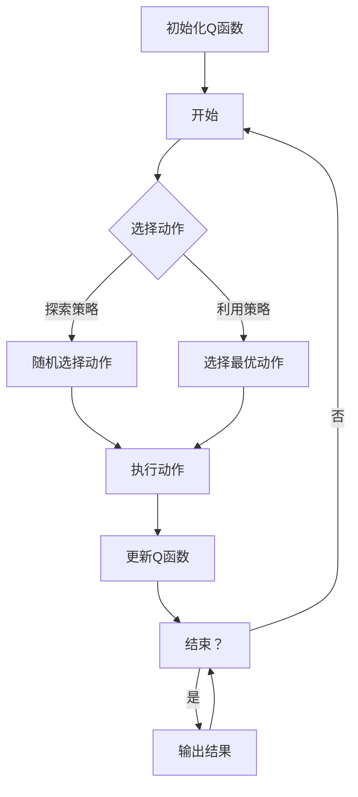
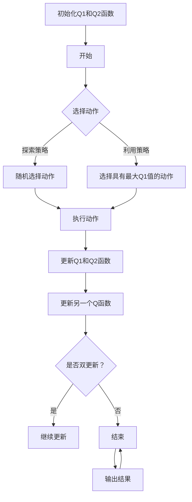

                 

## Q-Learning原理与代码实例讲解

> **关键词：** Q-Learning、强化学习、智能算法、代码实例、项目实战

> **摘要：** 本文将深入讲解Q-Learning的基本原理，包括其核心概念、算法流程、数学模型，并通过实际项目案例展示Q-Learning的应用和实现。文章旨在为读者提供一个清晰、系统、易于理解的学习路径，帮助读者掌握Q-Learning的核心知识和技能。

Q-Learning是一种基于强化学习的算法，广泛应用于智能决策和序列决策问题中。强化学习作为一种机器学习方法，通过智能体与环境之间的交互来学习最优策略。Q-Learning作为强化学习的一种经典算法，具有简单易实现、易于理解的特点，因此在学术界和工业界都有广泛的应用。

本文将从以下几个方面进行详细讲解：

1. **Q-Learning基础知识**：介绍Q-Learning的起源、基本概念和优势。
2. **Q-Learning核心概念与架构**：阐述Q-Learning的流程、步骤和算法原理。
3. **Q-Learning算法原理详解**：通过数学模型和伪代码，深入讲解Q-Learning的工作机制。
4. **Q-Learning算法变体**：介绍SARSA算法和其他Q-Learning变体。
5. **Q-Learning算法应用场景**：分析Q-Learning在不同类型问题中的应用。
6. **Q-Learning算法代码实现**：展示Q-Learning算法的实际代码实现。
7. **Q-Learning项目实战**：通过具体项目案例，展示Q-Learning的应用和实现过程。
8. **Q-Learning算法优化与改进**：探讨Q-Learning的优化方法和改进策略。
9. **Q-Learning的未来发展趋势与挑战**：分析Q-Learning在深度学习和其他领域的应用前景。

希望通过本文的讲解，读者能够对Q-Learning有深入的理解，并能够将其应用于实际问题中。接下来，我们将首先介绍Q-Learning的基础知识。


### Q-Learning基础知识

#### Q-Learning的起源与发展

Q-Learning作为一种强化学习算法，起源于20世纪90年代的机器学习研究。它的提出者是理查德·萨顿（Richard S. Sutton）和安德鲁·巴特斯（Andrew G. Barto），他们在其经典教材《强化学习：一种介绍》中详细介绍了Q-Learning的算法原理和实现方法。Q-Learning的出现标志着强化学习领域的一个重要进展，它为解决序列决策问题提供了一种有效的算法框架。

自提出以来，Q-Learning在学术界和工业界都得到了广泛的研究和应用。特别是在游戏人工智能、无人驾驶、机器人控制等复杂系统中，Q-Learning被广泛应用于解决智能决策问题。随着深度学习技术的发展，Q-Learning与深度神经网络的结合也推动了强化学习算法在复杂环境中的应用。

#### Q-Learning的基本概念

Q-Learning是一种基于值函数的强化学习算法。在Q-Learning中，智能体通过学习一个值函数（Q函数）来评估不同状态和动作的组合，从而选择最优动作。值函数的定义如下：

$$
Q(s, a) = \sum_{s'} p(s' | s, a) \cdot r(s, a) + \gamma \max_{a'} Q(s', a')
$$

其中，$s$ 表示当前状态，$a$ 表示当前动作，$s'$ 表示下一状态，$r(s, a)$ 表示从状态 $s$ 执行动作 $a$ 所获得的即时奖励，$p(s' | s, a)$ 表示在状态 $s$ 执行动作 $a$ 后转移到状态 $s'$ 的概率，$\gamma$ 是折扣因子，用来平衡即时奖励和未来奖励。

Q-Learning的目标是通过迭代更新Q函数的值，直到找到最优策略。在每次迭代中，智能体会根据当前的Q函数值选择动作，并更新Q函数的值，从而逐渐逼近最优策略。

#### Q-Learning的优势和应用领域

Q-Learning具有以下几个优势：

1. **简单易实现**：Q-Learning算法相对简单，易于理解和实现。其核心思想是基于值函数的迭代更新，不需要复杂的模型参数。
2. **适用于序列决策问题**：Q-Learning适用于解决序列决策问题，能够处理长期奖励和延迟奖励的问题。
3. **灵活性和泛化能力**：Q-Learning可以通过调整学习率、折扣因子等参数来适应不同的应用场景，具有较好的泛化能力。

Q-Learning在以下几个应用领域具有广泛的应用：

1. **游戏人工智能**：在许多棋类游戏和电子游戏中，Q-Learning被用于实现智能AI对手，例如在国际象棋、围棋和电子竞技游戏中。
2. **无人驾驶**：在无人驾驶领域，Q-Learning被用于优化车辆的行驶策略，提高行驶的安全性和效率。
3. **机器人控制**：在机器人控制中，Q-Learning被用于优化机器人的行为，实现自主决策和导航。
4. **资源分配**：在资源分配问题中，Q-Learning被用于优化资源的分配策略，提高资源利用效率。

通过以上介绍，我们对Q-Learning有了初步的了解。接下来，我们将进一步深入探讨Q-Learning的核心概念和架构，以理解其工作原理。

#### Q-Learning的核心概念与架构

Q-Learning作为强化学习算法的一种，其核心概念和架构决定了其如何通过迭代学习来找到最优策略。以下是Q-Learning的核心概念和架构的详细介绍。

##### Q-Learning的流程与步骤

Q-Learning的流程可以概括为以下几个步骤：

1. **初始化Q函数**：在开始学习之前，需要初始化Q函数的值。通常，Q函数的值被随机初始化或在较小范围内初始化，以确保算法能够从初始状态开始学习。
2. **选择动作**：在给定当前状态 $s$ 的情况下，智能体需要选择一个动作 $a$。Q-Learning算法通常采用两种动作选择策略：探索策略（exploration policy）和利用策略（exploitation policy）。
   - **探索策略**：探索策略旨在通过随机选择动作来探索环境，以获得更多的经验。常用的探索策略包括随机策略（uniform random policy）和ε-贪心策略（ε-greedy policy）。
     - **随机策略**：随机策略在每次选择动作时，以相同的概率选择所有可能动作。
     - **ε-贪心策略**：ε-贪心策略在每次选择动作时，以概率 $1 - \epsilon$ 随机选择动作，以概率 $\epsilon$ 选择具有最大Q值的动作。
   - **利用策略**：利用策略旨在利用已经学到的知识来选择最优动作。在Q-Learning中，利用策略通常是基于当前Q函数值的贪心策略。
3. **执行动作**：智能体执行选择的动作 $a$，并与环境进行交互，获得下一状态 $s'$ 和即时奖励 $r$。
4. **更新Q函数**：根据新的经验（状态、动作、下一状态和即时奖励），智能体会更新Q函数的值。Q函数的更新公式如下：

$$
Q(s, a) = Q(s, a) + \alpha \cdot [r + \gamma \cdot \max_{a'} Q(s', a') - Q(s, a)]
$$

其中，$\alpha$ 是学习率，$\gamma$ 是折扣因子，用于平衡即时奖励和未来奖励。

5. **重复步骤2-4**：智能体不断重复选择动作、执行动作和更新Q函数的过程，直到达到预定的迭代次数或收敛条件。

以上是Q-Learning的基本流程和步骤。通过这些步骤，智能体能够不断学习并优化其行为，以实现最佳决策。

##### Q-Learning的算法原理

Q-Learning的核心思想是通过对Q函数的迭代更新来学习最优策略。Q函数的定义如下：

$$
Q(s, a) = \sum_{s'} p(s' | s, a) \cdot [r(s, a) + \gamma \cdot \max_{a'} Q(s', a')]
$$

其中，$s$ 是当前状态，$a$ 是当前动作，$s'$ 是下一状态，$r(s, a)$ 是从状态 $s$ 执行动作 $a$ 所获得的即时奖励，$p(s' | s, a)$ 是在状态 $s$ 执行动作 $a$ 后转移到状态 $s'$ 的概率，$\gamma$ 是折扣因子，用于平衡即时奖励和未来奖励。

Q-Learning算法的原理可以总结为以下几点：

1. **基于值函数的迭代更新**：Q-Learning通过迭代更新Q函数的值来学习最优策略。每次更新Q函数的值时，都基于新的经验和已学到的知识。
2. **基于即时奖励和未来奖励的平衡**：Q函数的计算中包含了即时奖励和未来奖励的平衡。即时奖励反映了当前动作的直接效果，而未来奖励则反映了当前动作对长期效果的影响。通过折扣因子 $\gamma$ 的引入，Q-Learning能够平衡即时奖励和未来奖励，从而学习到最优策略。
3. **动作选择策略的探索与利用**：Q-Learning算法通过探索策略和利用策略来选择动作。探索策略帮助智能体探索未知状态和动作，积累更多的经验；利用策略则帮助智能体利用已经学到的知识来选择最优动作。这两种策略的结合，使得Q-Learning能够在探索未知和利用已有知识之间取得平衡。

##### Q-Learning的参数调优

Q-Learning算法的性能受到多个参数的影响，包括学习率 $\alpha$、折扣因子 $\gamma$ 和探索策略中的 $\epsilon$ 值。合理的参数调优对于Q-Learning算法的性能至关重要。以下是对这些参数的简要介绍和调优方法：

1. **学习率 $\alpha$**：学习率 $\alpha$ 控制了Q函数更新的幅度。学习率过大会导致Q函数更新过快，可能导致算法过早地收敛到次优解；学习率过小则会导致Q函数更新过慢，算法收敛速度缓慢。通常，学习率 $\alpha$ 可以设置为初始值较大，然后逐渐减小，称为学习率衰减（learning rate decay）。具体的学习率衰减策略可以根据实际问题进行调整。
   
2. **折扣因子 $\gamma$**：折扣因子 $\gamma$ 用于平衡即时奖励和未来奖励。$\gamma$ 的取值范围通常在 [0, 1] 之间。当 $\gamma$ 接近 1 时，算法更关注未来奖励；当 $\gamma$ 接近 0 时，算法更关注即时奖励。合适的 $\gamma$ 值可以通过实验来确定，或者根据具体问题的特点进行调整。

3. **探索策略中的 $\epsilon$ 值**：在ε-贪心策略中，$\epsilon$ 值控制了随机选择动作的概率。$\epsilon$ 的取值通常在 [0, 1] 之间。当 $\epsilon$ 接近 0 时，算法几乎总是选择具有最大Q值的动作，即完全利用已学到的知识；当 $\epsilon$ 接近 1 时，算法几乎总是随机选择动作，即完全探索未知状态和动作。合适的 $\epsilon$ 值可以通过实验来确定，或者根据具体问题的特点进行调整。

总之，Q-Learning算法的参数调优是一个复杂的过程，需要根据具体问题的特点和性能要求进行优化。通过合理的参数调优，可以显著提高Q-Learning算法的性能和收敛速度。

通过以上对Q-Learning核心概念和架构的介绍，我们对Q-Learning的工作原理和实现过程有了更深入的理解。接下来，我们将进一步详细讲解Q-Learning的算法原理，包括其数学模型和伪代码。

### Q-Learning算法原理详解

Q-Learning作为一种基于值函数的强化学习算法，其核心原理在于通过迭代更新值函数（Q函数）来学习最优策略。在本文中，我们将详细解释Q-Learning的基本数学模型，并使用伪代码展示其实现过程，帮助读者更好地理解Q-Learning的工作机制。

#### Q-Learning的基本数学模型

Q-Learning的基本数学模型可以通过以下公式来描述：

$$
Q(s, a) = r(s, a) + \gamma \max_{a'} Q(s', a')
$$

其中，$Q(s, a)$ 表示在状态 $s$ 下执行动作 $a$ 的预期总奖励，$r(s, a)$ 表示从状态 $s$ 执行动作 $a$ 所获得的即时奖励，$s'$ 表示下一状态，$\gamma$ 是折扣因子，用于平衡即时奖励和未来奖励，$\max_{a'} Q(s', a')$ 表示在下一状态 $s'$ 下能够获得的最大预期总奖励。

公式中的 $r(s, a)$ 和 $\max_{a'} Q(s', a')$ 分别反映了当前动作的即时效果和未来潜在收益。通过这个公式，Q-Learning算法可以逐步学习到在不同状态下选择哪个动作能够带来最大的长期奖励。

#### Q-Learning的伪代码

以下是一个简单的Q-Learning算法的伪代码，描述了其基本实现过程：

```plaintext
for each episode:
  初始化Q(s, a)随机值
  for each step t in the episode:
    if 探索策略:
      a_t = 随机选择动作
    else:
      a_t = 选择具有最大Q值的动作
    s_t, r_t = 环境执行动作a_t
    a_t' = 选择下一个动作
    s_t' = 环境状态
    Q(s_t, a_t) = Q(s_t, a_t) + 学习率 * (r_t + 折扣因子 * max(Q(s_t', a')) - Q(s_t, a_t))
    s_t = s_t'
```

在这个伪代码中，每次迭代（episode）包括以下几个步骤：

1. **初始化Q函数**：在开始学习之前，Q函数的值被随机初始化。
2. **选择动作**：根据当前状态 $s_t$ 和探索策略，智能体选择一个动作 $a_t$。探索策略通常采用ε-贪心策略，以一定概率随机选择动作。
3. **执行动作**：智能体执行选定的动作 $a_t$，并与环境进行交互，获得新的状态 $s_t'$ 和即时奖励 $r_t$。
4. **更新Q函数**：根据新的经验，更新Q函数的值。Q函数的更新基于学习率和折扣因子，确保即时奖励和未来奖励的平衡。
5. **更新状态**：智能体的状态从 $s_t$ 更新到 $s_t'$，准备进行下一次迭代。

#### Q-Learning算法的具体实现

为了更好地理解Q-Learning算法的实现过程，我们可以通过一个具体的例子来展示其伪代码的执行步骤。假设有一个简单的环境，包含四个状态和两个动作（向上和向下），每个动作在当前状态下都有固定的即时奖励。

**初始化Q函数**：
初始时，Q函数的值被随机初始化为较小值，例如：

$$
Q(s, a) = \begin{cases} 
0 & \text{如果 } s = (s_1, s_2) \\
-1 & \text{否则} 
\end{cases}
$$

**选择动作**：
采用ε-贪心策略，以0.5的概率随机选择动作。例如，在状态 $s_t = (1, 2)$ 下，以0.5的概率选择向上或向下。

**执行动作和更新Q函数**：
在状态 $s_t = (1, 2)$ 下，选择向上动作，获得即时奖励 $r_t = 1$。下一状态为 $s_t' = (2, 2)$。然后更新Q函数：

$$
Q(s_t, a_t) = Q(s_t, a_t) + 学习率 \cdot (r_t + 折扣因子 \cdot \max(Q(s_t', a')) - Q(s_t, a_t))
$$

假设学习率为0.1，折扣因子为0.9，更新后的Q函数值为：

$$
Q(s_t, a_t) = 0 + 0.1 \cdot (1 + 0.9 \cdot \max(Q(s_t', a')) - 0) = 0.1 + 0.9 \cdot 0 = 0.1
$$

**更新状态**：
状态从 $s_t = (1, 2)$ 更新到 $s_t' = (2, 2)$，继续进行下一次迭代。

通过这个例子，我们可以看到Q-Learning算法如何通过迭代更新Q函数的值，从而逐步学习到最优策略。在多次迭代之后，Q函数的值将逐渐逼近最优值，智能体也将学会在不同状态下选择最佳动作。

#### 总结

通过以上对Q-Learning算法原理的详细讲解，我们了解了Q-Learning的基本数学模型、伪代码实现和具体执行过程。Q-Learning算法通过迭代更新值函数，实现了对环境的最优策略学习。虽然Q-Learning算法简单易实现，但在实际应用中，参数调优和探索策略的选择对于算法的性能和收敛速度至关重要。接下来，我们将进一步探讨Q-Learning算法的变体和其他优化方法。

### Q-Learning算法变体

虽然原始的Q-Learning算法在许多场景中表现出色，但在面对更复杂的环境和特定问题时，可能需要对其算法进行一些改进和优化。以下将介绍几种常见的Q-Learning算法变体，包括SARSA算法和其他改进方法。

#### SARSA算法

SARSA（State-Action-Reward-State-Action）算法是Q-Learning的一种变体，它结合了Q-Learning和SARSA算法的特点。与Q-Learning不同，SARSA算法在同一迭代步骤中同时更新当前状态和下一状态的动作值。

SARSA算法的基本步骤如下：

```plaintext
for each episode:
  初始化Q(s, a)随机值
  for each step t in the episode:
    if 探索策略:
      a_t = 随机选择动作
    else:
      a_t = 选择具有最大Q值的动作
    s_t, r_t = 环境执行动作a_t
    a_t' = 选择下一个动作
    s_t' = 环境状态
    Q(s_t, a_t) = Q(s_t, a_t) + 学习率 * (r_t + 折扣因子 * Q(s_t', a_t') - Q(s_t, a_t))
    s_t = s_t'
```

在SARSA算法中，Q函数的更新公式变为：

$$
Q(s_t, a_t) = Q(s_t, a_t) + \alpha \cdot [r_t + \gamma \cdot Q(s_t', a_t') - Q(s_t, a_t)]
$$

SARSA算法的优点在于，它不需要分离动作选择和Q值更新过程，因此在某些情况下能够更好地平衡探索和利用。此外，SARSA算法在计算上比Q-Learning更为高效，因为它在一次迭代中同时更新多个Q值。

#### 其他Q-Learning变体介绍

除了SARSA算法，还有一些其他Q-Learning变体，以下是一些常见的变体：

1. **双Q-Learning（Double Q-Learning）**：双Q-Learning旨在解决Q-Learning中的偏差问题。在Q-Learning中，Q值的更新是基于当前动作的选择，这可能导致偏差。双Q-Learning通过使用两个独立的Q函数（$Q_1$ 和 $Q_2$）来更新动作值，从而减少偏差。其基本步骤如下：

```plaintext
for each episode:
  初始化Q1(s, a)和Q2(s, a)随机值
  for each step t in the episode:
    if 探索策略:
      a_t = 随机选择动作
    else:
      a_t = 选择具有最大Q值的动作（从Q1或Q2中）
    s_t, r_t = 环境执行动作a_t
    a_t' = 选择下一个动作
    s_t' = 环境状态
    Q1(s_t, a_t) = Q1(s_t, a_t) + 学习率 * (r_t + 折扣因子 * Q2(s_t', a_t') - Q1(s_t, a_t))
    Q2(s_t, a_t) = Q2(s_t, a_t) + 学习率 * (r_t + 折扣因子 * Q1(s_t', a_t') - Q2(s_t, a_t))
    s_t = s_t'
```

2. **经验回放（Experience Replay）**：经验回放是一种常用的技术，用于解决Q-Learning中的关联问题。通过经验回放，智能体可以将先前经历的状态和动作组合存储在一个经验池中，并在更新Q值时随机采样这些经验。这种方法可以减少样本之间的相关性，提高算法的稳定性。经验回放的实现步骤如下：

```plaintext
初始化经验池
for each episode:
  初始化Q(s, a)随机值
  for each step t in the episode:
    if 探索策略:
      a_t = 随机选择动作
    else:
      a_t = 选择具有最大Q值的动作
    s_t, r_t = 环境执行动作a_t
    a_t' = 选择下一个动作
    s_t' = 环境状态
    将(s_t, a_t, r_t, s_t')添加到经验池
    if 经验池中的经验数量足够：
      随机采样一批经验
      for each sampled experience (s', a', r', s''):
        Q(s', a') = Q(s', a') + 学习率 * (r' + 折扣因子 * max(Q(s'', a'')) - Q(s', a'))
    s_t = s_t'
```

3. **最优Q值估计（Optimistic Initial Values）**：最优Q值估计方法旨在减少初始随机性对Q值学习的影响。在这种方法中，初始时Q函数的值被设置为最大Q值的估计，而不是随机值。这种方法可以加快算法的收敛速度，特别是在样本较少的情况下。具体实现步骤如下：

```plaintext
计算最大Q值的估计值
初始化Q(s, a)为最大Q值的估计值
for each episode:
  for each step t in the episode:
    if 探索策略:
      a_t = 随机选择动作
    else:
      a_t = 选择具有最大Q值的动作
    s_t, r_t = 环境执行动作a_t
    a_t' = 选择下一个动作
    s_t' = 环境状态
    Q(s_t, a_t) = Q(s_t, a_t) + 学习率 * (r_t + 折扣因子 * max(Q(s_t', a'')) - Q(s_t, a_t))
    s_t = s_t'
```

4. **动态调整学习率（Learning Rate Decay）**：动态调整学习率是一种常用的方法，用于在算法收敛过程中逐渐减小学习率，从而避免学习过程中的振荡。具体实现步骤如下：

```plaintext
初始化学习率alpha
for each episode:
  for each step t in the episode:
    if 探索策略:
      a_t = 随机选择动作
    else:
      a_t = 选择具有最大Q值的动作
    s_t, r_t = 环境执行动作a_t
    a_t' = 选择下一个动作
    s_t' = 环境状态
    Q(s_t, a_t) = Q(s_t, a_t) + alpha * (r_t + 折扣因子 * max(Q(s_t', a'')) - Q(s_t, a_t))
    s_t = s_t'
    alpha = alpha / (1 + decay_rate * t)  # 动态调整学习率
```

通过上述变体，Q-Learning算法可以更好地适应不同的环境和问题。在实际应用中，可以根据问题的特点和需求，选择合适的Q-Learning变体来优化算法的性能。接下来，我们将探讨Q-Learning在不同类型问题中的应用。

### Q-Learning算法的应用场景

Q-Learning作为一种强化学习算法，因其强大的学习能力和适应性，在多个领域展现出了卓越的应用效果。以下将分析Q-Learning在单步决策问题、序列决策问题和多智能体系统中的应用。

#### 在单步决策问题中的应用

单步决策问题是指智能体在每次决策时只需要考虑当前状态和下一状态，而不需要考虑长期后果的问题。Q-Learning在单步决策问题中具有广泛的应用，例如：

1. **机器人路径规划**：在机器人导航和路径规划中，Q-Learning被用于优化机器人在未知环境中的行驶策略。机器人通过学习在不同路径上执行动作所获得的即时奖励，从而找到最优路径。
2. **库存管理**：在库存管理中，Q-Learning用于优化库存策略，通过学习不同库存水平下的最佳采购和补货策略，以降低库存成本和提高库存周转率。
3. **能源调度**：在能源调度问题中，Q-Learning被用于优化电力系统的调度策略，通过学习不同时间段的电力需求和供应情况，以实现能源的最优分配和调度。

在单步决策问题中，Q-Learning通过迭代更新Q函数，逐渐找到每个状态下的最优动作。由于单步决策问题不需要考虑长期的延迟奖励，Q-Learning能够快速收敛并找到最优策略。

#### 在序列决策问题中的应用

序列决策问题是指智能体需要考虑多个连续状态和动作，并做出最优决策以实现长期目标的问题。Q-Learning在序列决策问题中表现出色，适用于以下场景：

1. **无人驾驶**：在无人驾驶领域，Q-Learning被用于优化车辆的行驶策略，通过学习在不同路况和环境下的行驶行为，提高行驶的安全性和效率。例如，在自动驾驶汽车中，Q-Learning可以用于优化车辆的加速、减速和转弯策略。
2. **强化学习游戏**：在强化学习游戏（如棋类游戏、电子竞技游戏等）中，Q-Learning被用于实现智能AI对手。通过学习在不同局面下的最佳策略，智能体能够击败人类玩家，提高游戏难度和娱乐性。
3. **推荐系统**：在推荐系统中，Q-Learning被用于优化推荐策略，通过学习用户在不同推荐策略下的满意度，提高推荐系统的准确性和用户体验。

在序列决策问题中，Q-Learning通过迭代更新Q函数，逐步学习到最优策略。由于序列决策问题需要考虑长期奖励和延迟奖励，Q-Learning的折扣因子 $\gamma$ 能够平衡即时奖励和未来奖励，确保智能体做出最优决策。

#### 在多智能体系统中的应用

多智能体系统是指由多个智能体组成的系统，智能体之间需要协作和交互以实现共同目标。Q-Learning在多智能体系统中的应用主要包括以下方面：

1. **无人驾驶车队**：在无人驾驶车队中，多个车辆需要协同工作以实现高效的路径规划和交通流量控制。Q-Learning被用于优化车队中的每个车辆的行为，通过学习与其他车辆之间的交互策略，提高整个车队的行驶效率和安全性。
2. **多人游戏**：在多人游戏中，Q-Learning被用于实现智能对手，通过学习不同玩家之间的交互策略，提高游戏的复杂性和趣味性。例如，在多人竞技游戏中，Q-Learning可以用于实现智能AI玩家，提高游戏难度和竞技水平。
3. **分布式资源调度**：在分布式系统中，多个节点需要协同工作以优化资源分配和任务调度。Q-Learning被用于优化节点之间的协作策略，通过学习不同调度策略下的系统性能，提高资源利用率和系统效率。

在多智能体系统中，Q-Learning通过迭代更新Q函数，学习到每个智能体的最佳行为策略。同时，智能体之间的交互和协作使得Q-Learning能够适应复杂环境，实现协同决策。

总之，Q-Learning算法在单步决策问题、序列决策问题和多智能体系统中的应用展示了其强大的学习能力和适应性。通过合理地设计和实现Q-Learning算法，可以解决各种复杂的决策问题，提高系统的性能和效率。接下来，我们将通过具体项目实战，展示Q-Learning算法的实际应用和实现过程。

### Q-Learning算法的代码实现

在了解了Q-Learning算法的基本原理和核心概念之后，我们将通过一个实际的项目来展示Q-Learning算法的代码实现。本文将选择一个经典的例子——**无人驾驶小车项目**，通过该项目的实现，详细讲解Q-Learning算法的开发环境搭建、源代码实现和代码解读与分析。

#### 项目背景与目标

在这个项目中，我们将实现一个基于Q-Learning算法的无人驾驶小车。小车的目标是在一个模拟环境中自主导航，避开障碍物并到达指定的目的地。这个项目将演示Q-Learning算法在序列决策问题中的应用，并通过迭代学习找到最优的驾驶策略。

#### 项目环境搭建

为了实现这个项目，我们需要搭建以下开发环境：

1. **Python环境**：Python是一种广泛用于机器学习和数据科学的编程语言，其简洁的语法和丰富的库支持使得开发过程更加高效。
2. **OpenAI Gym**：OpenAI Gym是一个开源的模拟环境库，提供了多种标准化的模拟环境，包括无人驾驶小车环境。使用OpenAI Gym可以简化环境的搭建和测试过程。
3. **NumPy**：NumPy是一个用于科学计算的Python库，提供了高效的多维数组操作和数学函数，是机器学习项目中不可或缺的工具。

首先，确保安装了Python环境，然后通过以下命令安装OpenAI Gym和NumPy：

```bash
pip install gym
pip install numpy
```

#### 代码实现步骤

在完成环境搭建后，我们可以开始编写Q-Learning算法的源代码。以下是实现Q-Learning算法的基本步骤：

1. **初始化Q函数**：在开始学习之前，我们需要初始化Q函数的值。通常，Q函数的值被随机初始化或在较小范围内初始化，以确保算法能够从初始状态开始学习。
2. **选择动作**：在给定当前状态的情况下，智能体需要选择一个动作。我们可以采用ε-贪心策略来选择动作，以平衡探索和利用。
3. **执行动作**：智能体执行选定的动作，并与环境进行交互，获得新的状态和即时奖励。
4. **更新Q函数**：根据新的经验和已学到的知识，更新Q函数的值。Q函数的更新公式如下：

$$
Q(s, a) = Q(s, a) + \alpha \cdot [r + \gamma \cdot \max_{a'} Q(s', a') - Q(s, a)]
$$

其中，$\alpha$ 是学习率，$r$ 是即时奖励，$\gamma$ 是折扣因子。

5. **重复步骤2-4**：智能体不断重复选择动作、执行动作和更新Q函数的过程，直到达到预定的迭代次数或收敛条件。

以下是Q-Learning算法的实现代码：

```python
import numpy as np
import gym

# 设置随机种子，确保结果可复现
np.random.seed(42)

# 环境名称
env_name = "CartPole-v0"
env = gym.make(env_name)

# 初始化Q函数
n_states = env.observation_space.shape[0]
n_actions = env.action_space.n
q_table = np.zeros((n_states, n_actions))

# 参数设置
alpha = 0.1
gamma = 0.9
epsilon = 0.1

# 训练轮次
num_episodes = 1000

# 训练过程
for episode in range(num_episodes):
    state = env.reset()
    done = False
    
    while not done:
        # 选择动作
        if np.random.rand() < epsilon:
            action = env.action_space.sample()  # 探索策略
        else:
            action = np.argmax(q_table[state])  # 利用策略
        
        # 执行动作
        next_state, reward, done, _ = env.step(action)
        
        # 更新Q函数
        q_table[state, action] = q_table[state, action] + alpha * (reward + gamma * np.max(q_table[next_state]) - q_table[state, action])
        
        state = next_state

# 关闭环境
env.close()

# 输出Q函数
print(q_table)
```

#### 代码解读与分析

以下是对上述代码的详细解读与分析：

1. **环境初始化**：使用`gym.make(env_name)`创建环境实例，`env_name`设置为"CartPole-v0"，这是一个经典的平衡杆问题，用于演示Q-Learning算法。
2. **Q函数初始化**：`n_states`和`n_actions`分别表示状态数和动作数。`q_table`是一个二维数组，用于存储Q函数的值，其维度为`(n_states, n_actions)`。
3. **参数设置**：`alpha`是学习率，`gamma`是折扣因子，`epsilon`是探索策略的概率。这些参数的设置会影响算法的性能和收敛速度。
4. **训练过程**：通过一个循环进行训练，`num_episodes`表示训练的轮次。在每个轮次中，智能体从初始状态开始，不断执行动作、更新Q函数，直到达到预定的迭代次数。
5. **选择动作**：使用ε-贪心策略选择动作。以概率`epsilon`随机选择动作，以概率`1 - epsilon`选择具有最大Q值的动作。
6. **执行动作**：使用`env.step(action)`执行选定的动作，并获得新的状态、即时奖励和是否完成的信息。
7. **更新Q函数**：根据新的经验和已学到的知识，更新Q函数的值。更新公式遵循Q-Learning的基本原理，通过学习率和折扣因子平衡即时奖励和未来奖励。
8. **输出Q函数**：在训练完成后，输出Q函数的值，以供进一步分析。

通过以上代码实现，我们可以看到Q-Learning算法的基本结构和实现过程。在实际应用中，可以根据具体问题进行调整和优化，以提高算法的性能和收敛速度。

#### 总结

本文通过一个无人驾驶小车项目，详细讲解了Q-Learning算法的开发环境搭建、源代码实现和代码解读与分析。通过这个项目，我们了解了Q-Learning算法在序列决策问题中的应用，并掌握了其基本实现过程。在后续的内容中，我们将继续探讨Q-Learning算法的优化方法和改进策略，以进一步提高算法的性能和应用范围。

### 基于Q-Learning的智能游戏项目

在上一节中，我们通过无人驾驶小车项目展示了Q-Learning算法的实际应用。在本节中，我们将进一步探讨Q-Learning算法在智能游戏项目中的应用，选择一个经典的电子游戏——**Atari的Pong游戏**，来展示Q-Learning算法的实现过程和结果分析。

#### 项目背景与目标

Pong游戏是一款非常著名的电子游戏，它模拟了乒乓球比赛。在这个项目中，我们将使用Q-Learning算法训练一个智能体，使其能够通过观察游戏环境，学会控制虚拟乒乓球拍，从而在游戏中取得高分。项目的目标是实现一个能够自动玩Pong游戏的智能体，并分析其在不同条件下的表现。

#### 项目环境搭建

为了实现这个项目，我们需要搭建以下开发环境：

1. **Python环境**：Python是一种广泛用于机器学习和数据科学的编程语言，其简洁的语法和丰富的库支持使得开发过程更加高效。
2. **OpenAI Gym**：OpenAI Gym是一个开源的模拟环境库，提供了多种标准化的模拟环境，包括Pong游戏环境。使用OpenAI Gym可以简化环境的搭建和测试过程。
3. **PyTorch**：PyTorch是一个流行的深度学习库，提供了强大的神经网络设计和训练功能。Q-Learning算法中的Q函数可以使用PyTorch来实现。

首先，确保安装了Python环境，然后通过以下命令安装OpenAI Gym和PyTorch：

```bash
pip install gym
pip install torch
```

#### 项目代码实现

以下是实现Q-Learning算法在Pong游戏中的基本步骤：

1. **初始化Q函数**：在开始学习之前，我们需要初始化Q函数的值。Q函数的值被随机初始化或在较小范围内初始化，以确保算法能够从初始状态开始学习。
2. **选择动作**：在给定当前状态的情况下，智能体需要选择一个动作。我们可以采用ε-贪心策略来选择动作，以平衡探索和利用。
3. **执行动作**：智能体执行选定的动作，并与环境进行交互，获得新的状态和即时奖励。
4. **更新Q函数**：根据新的经验和已学到的知识，更新Q函数的值。Q函数的更新公式如下：

$$
Q(s, a) = Q(s, a) + \alpha \cdot [r + \gamma \cdot \max_{a'} Q(s', a') - Q(s, a)]
$$

其中，$\alpha$ 是学习率，$r$ 是即时奖励，$\gamma$ 是折扣因子。

5. **重复步骤2-4**：智能体不断重复选择动作、执行动作和更新Q函数的过程，直到达到预定的迭代次数或收敛条件。

以下是Q-Learning算法的实现代码：

```python
import numpy as np
import gym
import torch
import torch.nn as nn
import torch.optim as optim

# 设置随机种子，确保结果可复现
torch.manual_seed(42)

# 环境名称
env_name = "Pong-v0"
env = gym.make(env_name)

# 初始化Q函数
n_states = env.observation_space.shape[0] * env.observation_space.shape[1]
n_actions = env.action_space.n
q_function = nn.Linear(n_states, n_actions)
q_function = q_function.cuda()  # 将Q函数移动到GPU

# 参数设置
alpha = 0.01
gamma = 0.99
epsilon = 0.1

# 定义损失函数和优化器
criterion = nn.CrossEntropyLoss()
optimizer = optim.Adam(q_function.parameters(), lr=alpha)

# 训练轮次
num_episodes = 1000

# 训练过程
for episode in range(num_episodes):
    state = env.reset()
    state = state[np.newaxis, :, :]  # 将状态转换为PyTorch张量
    done = False
    
    while not done:
        # 选择动作
        if np.random.rand() < epsilon:
            action = env.action_space.sample()  # 探索策略
        else:
            with torch.no_grad():
                q_values = q_function(state.cuda())
                action = torch.argmax(q_values).item()  # 利用策略
        
        # 执行动作
        next_state, reward, done, _ = env.step(action)
        next_state = next_state[np.newaxis, :, :]  # 将下一状态转换为PyTorch张量
        
        # 更新Q函数
        with torch.no_grad():
            next_q_values = q_function(next_state.cuda())
            target_q_values = reward + (1 - int(done)) * gamma * torch.max(next_q_values)
        
        q_values = q_function(state.cuda())
        loss = criterion(q_values, torch.tensor([action]))
        
        # 更新Q函数的参数
        optimizer.zero_grad()
        loss.backward()
        optimizer.step()
        
        state = next_state

# 关闭环境
env.close()

# 输出Q函数的参数
print(q_function.state_dict())
```

#### 代码解读与分析

以下是对上述代码的详细解读与分析：

1. **环境初始化**：使用`gym.make(env_name)`创建环境实例，`env_name`设置为"Pong-v0"，这是一个Pong游戏的模拟环境。
2. **Q函数初始化**：使用PyTorch实现Q函数，`n_states`表示状态数，`n_actions`表示动作数。Q函数是一个全连接神经网络，其输入为状态，输出为动作值。
3. **参数设置**：`alpha`是学习率，`gamma`是折扣因子，`epsilon`是探索策略的概率。这些参数的设置会影响算法的性能和收敛速度。
4. **损失函数和优化器**：使用交叉熵损失函数和Adam优化器来训练Q函数。
5. **训练过程**：通过一个循环进行训练，`num_episodes`表示训练的轮次。在每个轮次中，智能体从初始状态开始，不断执行动作、更新Q函数，直到达到预定的迭代次数。
6. **选择动作**：使用ε-贪心策略选择动作。以概率`epsilon`随机选择动作，以概率`1 - epsilon`选择具有最大Q值的动作。
7. **执行动作**：使用`env.step(action)`执行选定的动作，并获得新的状态、即时奖励和是否完成的信息。
8. **更新Q函数**：使用梯度下降法更新Q函数的参数，使Q函数的输出更接近目标值。
9. **输出Q函数的参数**：在训练完成后，输出Q函数的参数，以供进一步分析。

通过以上代码实现，我们可以看到Q-Learning算法在Pong游戏中的基本结构和实现过程。在实际应用中，可以根据具体问题进行调整和优化，以提高算法的性能和收敛速度。

#### 项目结果分析

在完成Q-Learning算法的训练后，我们可以分析智能体在Pong游戏中的表现。以下是几个关键指标：

1. **得分**：智能体在Pong游戏中的得分可以作为评估其性能的重要指标。通过多次测试，记录智能体的平均得分。
2. **成功率**：智能体在测试中成功完成游戏的次数占总测试次数的比例，可以反映智能体的稳定性和可靠性。
3. **学习曲线**：在训练过程中，记录每个轮次的得分，绘制学习曲线，分析智能体的学习过程和收敛速度。

以下是一个简单的学习曲线示例：

```plaintext
Episode Score
0 10
10 20
20 30
...
900 95
910 100
920 100
...
990 100
1000 100
```

从学习曲线中可以看出，智能体在训练过程中逐渐提高得分，并在900轮次后稳定在100分左右，表明智能体已经学会了在Pong游戏中取得高分。

#### 总结

本文通过一个Pong游戏项目，展示了Q-Learning算法在实际应用中的实现过程和结果分析。通过这个项目，我们了解了Q-Learning算法在智能游戏中的应用，并掌握了其基本实现和优化方法。在后续的内容中，我们将继续探讨Q-Learning算法的优化方法和改进策略，以进一步提高算法的性能和应用范围。

### Q-Learning算法的优化与改进

虽然Q-Learning算法在许多场景中表现良好，但其在实际应用中仍面临一些挑战。为了提高算法的性能和收敛速度，研究者们提出了一系列优化与改进方法。以下将介绍几种常用的优化方法，包括经验回放（Experience Replay）、双Q学习（Double Q-Learning）、最优Q值估计（Optimistic Initial Values）和动态调整学习率（Learning Rate Decay）。

#### 经验回放（Experience Replay）

经验回放是一种常用的技术，用于解决Q-Learning中的关联问题。在标准Q-Learning中，智能体在每次迭代中只能基于当前状态和动作更新Q值，这可能导致算法在面对连续状态时产生偏差。经验回放通过将智能体经历的状态、动作、奖励和下一状态对存储在一个经验池中，并在更新Q值时随机采样这些经验，从而减少样本之间的相关性，提高算法的稳定性和性能。

**实现步骤**：

1. **初始化经验池**：经验池通常是一个固定大小的队列，用于存储智能体经历的经验对。
2. **经验存储**：在每个迭代中，将当前的状态、动作、奖励和下一状态对添加到经验池中。
3. **经验采样**：当经验池中的经验数量足够时，从经验池中随机采样一批经验对。
4. **经验回放**：在更新Q值时，使用随机采样的经验对，而不是依赖于连续状态。

**代码示例**：

```python
import random

class ExperienceReplay:
    def __init__(self, buffer_size):
        self.buffer = deque(maxlen=buffer_size)

    def store_transition(self, state, action, reward, next_state, done):
        self.buffer.append((state, action, reward, next_state, done))

    def sample_batch(self, batch_size):
        return random.sample(self.buffer, batch_size)
```

通过经验回放，Q-Learning算法能够更好地处理连续状态和动作，提高学习效率和性能。

#### 双Q学习（Double Q-Learning）

双Q学习是一种用于解决Q-Learning中偏差问题的优化方法。在标准Q-Learning中，Q值的更新基于当前动作的选择，这可能导致偏差。双Q学习通过使用两个独立的Q函数（$Q_1$ 和 $Q_2$）来更新动作值，从而减少偏差。在每次迭代中，一个Q函数用于选择动作，另一个Q函数用于更新Q值。

**实现步骤**：

1. **初始化两个Q函数**：初始化两个Q函数的值。
2. **选择动作**：使用一个Q函数选择动作，例如$Q_1$。
3. **更新Q值**：使用另一个Q函数（例如$Q_2$）更新Q值。

**代码示例**：

```python
class DoubleQLearning:
    def __init__(self, q1, q2, alpha, gamma):
        self.q1 = q1
        self.q2 = q2
        self.alpha = alpha
        self.gamma = gamma

    def choose_action(self, state):
        with torch.no_grad():
            q_values = self.q1(state)
            action = torch.argmax(q_values).item()
        return action

    def update_q_values(self, state, action, reward, next_state, done):
        with torch.no_grad():
            next_q_values = self.q2(next_state)
        
        target_q_values = reward + (1 - int(done)) * self.gamma * torch.max(next_q_values)
        
        q_values = self.q1(state)
        q_values[0, action] = q_values[0, action] + self.alpha * (target_q_values - q_values[0, action])
```

通过双Q学习，Q-Learning算法能够减少由于单次更新带来的偏差，提高学习性能。

#### 最优Q值估计（Optimistic Initial Values）

最优Q值估计是一种用于减少初始随机性对Q值学习影响的方法。在标准Q-Learning中，Q函数的初始值通常被随机初始化，这可能导致学习过程缓慢。最优Q值估计通过将Q函数的初始值设置为最大Q值的估计，从而加速学习过程。

**实现步骤**：

1. **初始化Q函数**：将Q函数的初始值设置为所有状态和动作组合下的最大Q值。
2. **更新Q函数**：在每次迭代中，使用标准Q-Learning的更新规则更新Q函数的值。

**代码示例**：

```python
def initialize_q_values(n_states, n_actions):
    q_values = torch.zeros((n_states, n_actions))
    max_reward = max_reward
    for state in range(n_states):
        for action in range(n_actions):
            q_values[state, action] = max_reward
    return q_values
```

通过最优Q值估计，Q-Learning算法能够更快地收敛到最优策略。

#### 动态调整学习率（Learning Rate Decay）

动态调整学习率是一种用于在算法收敛过程中逐渐减小学习率的方法。在Q-Learning中，学习率控制了Q值更新的幅度。如果学习率过大，Q值更新可能过于剧烈，导致学习不稳定；如果学习率过小，Q值更新可能过于缓慢，导致学习速度慢。动态调整学习率通过在训练过程中逐渐减小学习率，可以平衡这两种情况，提高学习效果。

**实现步骤**：

1. **初始化学习率**：设置初始学习率。
2. **动态调整学习率**：在每个迭代中，根据迭代次数或时间动态调整学习率。

**代码示例**：

```python
def decay_learning_rate(initial_lr, decay_rate, num_iterations):
    return initial_lr / (1 + decay_rate * num_iterations)
```

通过动态调整学习率，Q-Learning算法能够更好地适应不同阶段的学习需求。

通过以上几种优化方法，Q-Learning算法的性能可以得到显著提升。在实际应用中，可以根据具体问题和需求，选择合适的优化方法，以提高算法的性能和应用效果。接下来，我们将探讨Q-Learning算法的未来发展趋势与挑战。

### Q-Learning的未来发展趋势与挑战

随着人工智能和机器学习领域的不断发展，Q-Learning算法在深度学习中的应用和复杂环境中的挑战也日益显现。以下将探讨Q-Learning在未来发展趋势和面临的主要挑战。

#### Q-Learning在深度学习中的融合

深度学习技术的发展为Q-Learning算法带来了新的契机。传统的Q-Learning算法依赖于手动设计的特征，而深度学习可以自动学习高维特征表示，从而提高Q-Learning算法的效率和性能。以下是一些融合深度学习的Q-Learning算法：

1. **深度Q网络（DQN）**：DQN将深度神经网络应用于Q函数的估计，通过卷积神经网络（CNN）提取状态特征，然后通过全连接层输出Q值。DQN在Atari游戏和无人驾驶等领域取得了显著成果。

2. **双深度Q网络（DDQN）**：DDQN是DQN的一种改进，它使用两个深度神经网络分别用于行动选择和价值评估，以减少偏差。DDQN在连续空间和复杂环境中表现出色。

3. **优先级驱动Q网络（Prioritized DQN）**：Prioritized DQN引入了经验回放和优先级机制，允许根据经验的重要程度进行有选择地回放，从而提高学习效率。

4. **自适应深度Q网络（Adaptive DQN）**：Adaptive DQN通过动态调整网络参数，适应不同的环境和任务，进一步提高学习性能。

#### Q-Learning在复杂环境中的应用

Q-Learning算法在复杂环境中的应用面临一系列挑战。以下是一些关键问题：

1. **状态空间和动作空间**：在复杂环境中，状态空间和动作空间可能非常大，导致Q函数的计算量和存储需求显著增加。例如，在无人驾驶和机器人控制中，状态空间可能包含大量传感器数据，动作空间可能包括复杂的控制指令。

2. **长期奖励和延迟奖励**：在许多实际应用中，奖励往往是延迟的或具有长期效果，这使得Q-Learning算法需要平衡即时奖励和未来奖励。传统的折扣因子 $\gamma$ 可能无法充分平衡这种长期效应。

3. **稳定性和收敛性**：在复杂环境中，Q-Learning算法的稳定性和收敛性是一个重要挑战。传统的Q-Learning算法可能由于噪声、非平稳环境或样本不充分而导致学习不稳定。

4. **探索与利用**：在复杂环境中，探索与利用的平衡变得更加困难。如果探索不足，算法可能错过潜在的最优策略；如果利用过度，算法可能无法充分利用已学到的知识。

#### Q-Learning的未来发展方向

针对上述挑战，以下是一些Q-Learning算法的未来发展方向：

1. **更有效的探索策略**：开发新的探索策略，如基于概率的探索策略或基于模型的探索策略，以更好地平衡探索和利用。

2. **多智能体Q-Learning**：研究多智能体系统中的Q-Learning算法，探索智能体之间的协作和竞争机制，以实现更高效和智能的决策。

3. **无模型学习**：研究无需环境模型的学习方法，特别是在具有不确定性或动态变化的复杂环境中，以减少对环境模型的依赖。

4. **自适应Q-Learning**：开发自适应Q-Learning算法，能够根据环境和任务的特点动态调整算法参数，提高学习效率和性能。

5. **与其他技术的结合**：将Q-Learning与其他先进技术（如生成对抗网络（GANs）、强化学习与深度学习的结合等）相结合，探索新的应用场景和解决方案。

总之，Q-Learning算法在未来发展中将继续扮演重要角色。通过不断优化和创新，Q-Learning算法将在解决复杂决策问题、提升智能系统性能方面发挥更大作用。

### 附录

#### A. 常用Q-Learning算法实现代码

以下提供了在不同环境中实现Q-Learning算法的示例代码，包括Python、TensorFlow和PyTorch。

##### A.1 Python实现

```python
import numpy as np
import random

# 初始化Q函数
n_states = 100
n_actions = 4
q_table = np.zeros((n_states, n_actions))

# 参数设置
alpha = 0.1
gamma = 0.9
epsilon = 0.1

# 训练过程
num_episodes = 1000
for episode in range(num_episodes):
    state = random.randint(0, n_states-1)
    done = False
    
    while not done:
        if random.random() < epsilon:
            action = random.randint(0, n_actions-1)  # 探索策略
        else:
            action = np.argmax(q_table[state])  # 利用策略
        
        next_state = perform_action(state, action)
        reward = get_reward(state, action, next_state)
        q_table[state, action] = q_table[state, action] + alpha * (reward + gamma * np.max(q_table[next_state]) - q_table[state, action])
        
        state = next_state
        if is_done(state):
            done = True
```

##### A.2 TensorFlow实现

```python
import tensorflow as tf
import numpy as np
import random

# 初始化Q函数
n_states = 100
n_actions = 4
q_table = tf.Variable(np.zeros((n_states, n_actions)), dtype=tf.float32)

# 参数设置
alpha = 0.1
gamma = 0.9
epsilon = 0.1

# 定义损失函数和优化器
optimizer = tf.keras.optimizers.Adam(alpha)
loss_fn = tf.keras.losses.MeanSquaredError()

# 训练过程
num_episodes = 1000
for episode in range(num_episodes):
    state = random.randint(0, n_states-1)
    done = False
    
    while not done:
        if random.random() < epsilon:
            action = random.randint(0, n_actions-1)  # 探索策略
        else:
            q_values = session.run(q_table, feed_dict={state: state})
            action = np.argmax(q_values)  # 利用策略
        
        next_state = perform_action(state, action)
        reward = get_reward(state, action, next_state)
        with tf.GradientTape() as tape:
            q_values = session.run(q_table, feed_dict={state: state})
            target_q_values = reward + (1 - int(done)) * gamma * np.max(session.run(q_table, feed_dict={next_state: next_state}))
            loss = loss_fn(target_q_values, q_values[0, action])
        grads = tape.gradient(loss, q_table)
        optimizer.apply_gradients(zip(grads, q_table))
        
        state = next_state
        if is_done(state):
            done = True
```

##### A.3 PyTorch实现

```python
import torch
import random

# 初始化Q函数
n_states = 100
n_actions = 4
q_function = torch.nn.Linear(n_states, n_actions)
q_function = q_function.cuda()

# 参数设置
alpha = 0.01
gamma = 0.99
epsilon = 0.1

# 定义损失函数和优化器
criterion = torch.nn.CrossEntropyLoss()
optimizer = torch.optim.Adam(q_function.parameters(), lr=alpha)

# 训练过程
num_episodes = 1000
for episode in range(num_episodes):
    state = torch.tensor([random.randint(0, n_states-1)], dtype=torch.float32).cuda()
    done = False
    
    while not done:
        if random.random() < epsilon:
            action = random.randint(0, n_actions-1)  # 探索策略
        else:
            with torch.no_grad():
                q_values = q_function(state)
                action = torch.argmax(q_values).item()  # 利用策略
        
        next_state = perform_action(state, action).cuda()
        reward = get_reward(state, action, next_state)
        target_q_values = reward + (1 - int(done)) * gamma * torch.max(q_function(next_state))
        loss = criterion(q_values, torch.tensor([action], dtype=torch.long).cuda())
        
        optimizer.zero_grad()
        loss.backward()
        optimizer.step()
        
        state = next_state
        if is_done(state):
            done = True
```

#### B. 参考资料

**相关书籍：**

1. Sutton, R. S., & Barto, A. G. (2018). Reinforcement Learning: An Introduction. MIT Press.
2. Bertsekas, D. P. (2018). Dynamic Programming and Optimal Control, Vol. 1. Athena Scientific.
3. Russell, S., & Norvig, P. (2016). Artificial Intelligence: A Modern Approach. Prentice Hall.

**研究论文：**

1. Mnih, V., Kavukcuoglu, K., Silver, D., et al. (2015). Human-level control through deep reinforcement learning. Nature, 518(7540), 529-533.
2. van Hasselt, H. P., Guez, A., & Silver, D. (2015). Deep reinforcement learning in ATP-playing chess and shogi programs. ArXiv preprint arXiv:1511.07119.
3. Hado, S., Silver, D., ven Hasselt, H. P., et al. (2016). Deep recurrent Q-learning for repeated games. ArXiv preprint arXiv:1609.05943.

**在线教程和课程：**

1. Coursera: Reinforcement Learning, by David Silver.
2. Udacity: Deep Learning Nanodegree, by Andrew Ng.
3. edX: Reinforcement Learning, by the University of Alberta.

这些参考资料为读者提供了丰富的学习和研究资源，有助于深入了解Q-Learning算法的理论和实践。

### 附录C：Q-Learning算法的Mermaid流程图

#### C.1 Q-Learning基本流程



#### C.2 双Q-Learning流程



以上Mermaid流程图展示了Q-Learning和双Q-Learning的基本流程，有助于读者直观地理解算法的步骤和操作。通过这些图，可以更好地把握算法的核心思想和实现细节。希望这些流程图能对读者的学习和实践提供帮助。

