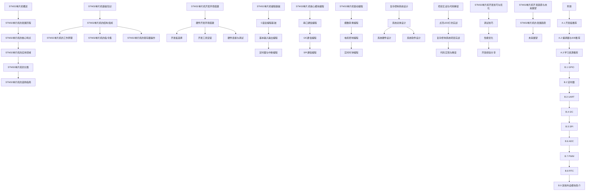

                 

### STM32单片机开发：从点亮LED到复杂控制系统

> **关键词**：STM32单片机，LED控制，定时器，中断编程，串口通信，I2C，SPI，ADC，电机控制，复杂系统设计

> **摘要**：本文将深入探讨STM32单片机的开发过程，从最基础的点亮LED灯开始，逐步介绍如何通过编程实现各种复杂的控制系统。我们将详细讲解STM32单片机的基础知识、开发环境搭建、编程基础、核心模块编程、驱动编程，以及复杂控制系统设计。通过实际项目案例，我们将展示如何将理论应用于实践，从而帮助读者掌握STM32单片机的开发技巧。

### STM32单片机概述

#### STM32单片机的发展历程

STM32单片机是由意法半导体（STMicroelectronics）推出的一款高性能、低功耗的微控制器系列。自2007年首次推出以来，STM32系列经历了多个版本和型号的更新，其性能和功能不断提升。STM32单片机凭借其强大的处理能力、丰富的外设接口和灵活的开发环境，在工业控制、智能家居、物联网等领域得到了广泛应用。

#### STM32单片机的核心特点

STM32单片机具有以下几个核心特点：

1. **高性能**：STM32单片机采用了ARM Cortex-M系列内核，具有高性能和低功耗的特点。
2. **丰富的外设接口**：STM32单片机内置了多种外设接口，如GPIO、定时器、中断、串口、I2C、SPI、ADC、PWM等，可以满足各种应用需求。
3. **低功耗**：STM32单片机采用了先进的工艺技术，具有低功耗的特点，适用于电池供电的应用场景。
4. **丰富的软件支持**：STM32单片机拥有丰富的软件开发工具和库函数，支持多种编程语言，如C/C++、汇编等。
5. **易用性**：STM32单片机的开发环境简单易用，开发者可以快速上手。

#### STM32单片机的应用领域

STM32单片机广泛应用于以下领域：

1. **工业控制**：STM32单片机在工业控制领域具有广泛的应用，如PLC、电机控制、传感器数据采集等。
2. **智能家居**：STM32单片机在智能家居领域得到了广泛应用，如智能照明、智能门锁、智能安防等。
3. **物联网**：STM32单片机是物联网设备的核心控制单元，广泛应用于智能家电、智能穿戴设备、智能交通等。
4. **汽车电子**：STM32单片机在汽车电子领域具有广泛的应用，如车身控制、座椅控制、音响系统等。
5. **医疗设备**：STM32单片机在医疗设备领域得到广泛应用，如医疗仪器、健康监测设备等。

#### STM32单片机的分类

STM32单片机系列包括多个型号和系列，根据不同的应用需求和性能要求，可以分为以下几类：

1. **STM32F0系列**：入门级单片机，适合简单应用。
2. **STM32F1系列**：中端单片机，具有较高的性能和丰富的外设接口。
3. **STM32F4系列**：高端单片机，具有高性能和丰富的外设接口。
4. **STM32L0系列**：低功耗单片机，适用于电池供电应用。
5. **STM32L1系列**：低功耗单片机，具有较高的性能和丰富的外设接口。

#### STM32单片机的选购指南

在选购STM32单片机时，需要根据以下因素进行考虑：

1. **性能要求**：根据应用场景对性能的要求，选择合适的单片机型号和系列。
2. **外设需求**：根据应用需求，选择具有所需外设接口的单片机。
3. **功耗要求**：根据应用场景对功耗的要求，选择低功耗的单片机。
4. **开发环境**：选择支持所需编程语言和开发工具的单片机。
5. **成本预算**：根据预算选择性价比高的单片机。

### STM32单片机基础知识

#### STM32单片机的结构组成

STM32单片机由以下主要部分组成：

1. **CPU核心**：STM32单片机采用ARM Cortex-M系列内核，具有高性能和低功耗的特点。
2. **存储器**：STM32单片机内置了程序存储器（Flash内存）和数据存储器（RAM），用于存储程序和数据。
3. **外设接口**：STM32单片机内置了多种外设接口，如GPIO、定时器、中断、串口、I2C、SPI、ADC、PWM等，用于与外部设备进行通信。
4. **时钟管理**：STM32单片机内置了时钟管理模块，用于管理系统的时钟信号。
5. **电源管理**：STM32单片机内置了电源管理模块，用于管理系统的电源供应。

#### STM32单片机的工作原理

STM32单片机的工作原理可以分为以下几个步骤：

1. **复位**：STM32单片机启动时，首先进行复位操作，将所有寄存器初始化为默认值。
2. **时钟配置**：根据系统需求，配置系统的时钟信号。
3. **程序加载**：将存储在Flash内存中的程序加载到RAM中，准备执行。
4. **程序执行**：CPU从RAM中读取指令并执行，完成各种操作。
5. **中断处理**：当发生中断时，CPU暂停当前程序执行，转而处理中断请求。
6. **继续执行**：中断处理完成后，CPU继续执行被中断的程序。

#### STM32单片机的指令集

STM32单片机采用ARM Cortex-M系列内核，其指令集包括以下几种：

1. **ARM指令**：适用于32位操作，具有丰富的指令集和灵活的操作方式。
2. **Thumb指令**：适用于16位操作，具有较高的代码密度和执行效率。
3. **Thumb-2指令**：结合了ARM和Thumb指令的优点，具有更高的代码密度和执行效率。

#### STM32单片机的寄存器操作

STM32单片机寄存器操作是编程的基础，包括以下几种：

1. **通用寄存器**：用于存储数据和地址，如R0、R1、R2等。
2. **状态寄存器**：用于存储程序状态，如PSR（程序状态寄存器）。
3. **程序计数器**：用于存储下一条要执行的指令地址。
4. **堆栈指针**：用于管理堆栈，存储函数调用时的参数和返回地址。

### STM32单片机开发环境搭建

#### 硬件开发环境搭建

1. **开发板选择**：选择一款适合自己项目的STM32开发板，如STM32F103VET6开发板。
2. **开发工具安装**：安装STM32CubeMX软件，用于配置单片机的时钟、外设等参数。
3. **硬件连接与调试**：将开发板与计算机连接，通过串口进行调试。

#### 软件开发环境搭建

1. **编译器安装**：安装适合STM32单片机的编译器，如Keil MDK。
2. **Integrated Development Environment (IDE) 安装**：安装集成开发环境，如STM32CubeIDE或Eclipse。
3. **软件开发调试**：在IDE中编写程序，通过串口进行调试。

### STM32单片机编程基础

#### C语言编程基础

C语言是STM32单片机编程的主要语言，其语法包括以下部分：

1. **基本语法**：包括变量、数据类型、运算符、控制结构等。
2. **函数**：函数是C语言的核心，用于实现模块化编程。
3. **数组**：数组是C语言中用于存储多个相同类型数据的数据结构。
4. **指针**：指针是C语言中用于访问内存地址的数据类型。
5. **结构体**：结构体是C语言中用于定义复杂数据类型的数据结构。

#### 基本输入输出编程

1. **GPIO编程**：GPIO（通用输入输出）是STM32单片机中最常用的外设之一，用于控制LED灯、按键等外部设备。
2. **LED控制**：通过设置GPIO引脚的电平，可以实现LED灯的点亮和熄灭。
3. **按键读取**：通过读取GPIO引脚的电平，可以检测按键的按下和释放。

#### 定时器与中断编程

1. **定时器概述**：定时器是STM32单片机中用于实现定时功能的重要外设。
2. **定时器配置**：定时器配置包括时钟使能、模式选择、计数初始值设置等。
3. **中断处理**：定时器中断处理程序用于实现定时功能，如控制LED灯的闪烁。

### STM32单片机核心模块编程

#### 串口通信编程

1. **串口通信原理**：串口通信是计算机与外部设备之间进行数据传输的一种通信方式。
2. **串口配置**：串口配置包括时钟使能、模式选择、波特率设置等。
3. **串口通信应用实例**：通过串口发送和接收数据，实现单片机与计算机之间的通信。

#### I2C通信编程

1. **I2C通信原理**：I2C（Inter-Integrated Circuit）是一种双向二线制通信总线。
2. **I2C配置**：I2C配置包括时钟使能、模式选择、地址设置等。
3. **I2C通信应用实例**：通过I2C总线与传感器、存储器等外部设备进行通信。

#### SPI通信编程

1. **SPI通信原理**：SPI（Serial Peripheral Interface）是一种同步串行通信协议。
2. **SPI配置**：SPI配置包括时钟使能、模式选择、数据位宽设置等。
3. **SPI通信应用实例**：通过SPI总线与传感器、存储器等外部设备进行通信。

### STM32单片机驱动编程

#### 模数转换编程

1. **ADC原理**：ADC（Analog-to-Digital Converter）是将模拟信号转换为数字信号的一种外设。
2. **ADC配置**：ADC配置包括时钟使能、通道选择、采样时间设置等。
3. **ADC应用实例**：通过ADC模块读取模拟传感器信号。

#### 电机控制编程

1. **电机控制原理**：电机控制是工业控制中重要的组成部分。
2. **电机控制配置**：电机控制配置包括定时器、GPIO、PWM等外设的配置。
3. **电机控制应用实例**：通过PWM控制电机转速和转向。

#### 实时时钟编程

1. **RTC原理**：RTC（Real-Time Clock）是用于实时计时的外设。
2. **RTC配置**：RTC配置包括时钟源选择、时间设置、闹钟设置等。
3. **RTC应用实例**：通过RTC模块获取和设置系统时间。

### 复杂控制系统设计

#### 系统总体设计

1. **系统需求分析**：明确系统的功能需求和性能指标。
2. **系统架构设计**：设计系统的总体架构，包括硬件和软件架构。
3. **系统功能模块划分**：将系统功能划分为各个模块，实现模块化设计。

#### 系统硬件设计

1. **硬件选型**：选择合适的单片机、传感器、执行器等硬件设备。
2. **硬件电路设计**：设计系统的硬件电路，包括电源电路、传感器接口电路、执行器接口电路等。
3. **硬件调试与测试**：对硬件电路进行调试和测试，确保系统正常运行。

#### 系统软件设计

1. **软件架构设计**：设计软件的架构，包括系统框架、模块划分等。
2. **软件模块设计**：设计各个软件模块的功能和接口。
3. **软件开发与调试**：编写软件代码，进行调试和测试。

### 项目实战与代码解读

#### 点亮LED灯的实战

1. **实战目标**：通过STM32单片机控制一个LED灯的点亮和熄灭。
2. **硬件搭建**：连接STM32单片机和LED灯，配置GPIO引脚。
3. **软件实现**：编写程序，通过设置GPIO引脚的电平，实现LED灯的点亮和熄灭。
4. **代码解读**：分析程序代码，理解GPIO编程和定时器中断编程的原理。

#### 复杂控制系统项目实战

1. **项目背景**：设计一个智能家居控制系统，实现灯光控制、温度监测等功能。
2. **项目需求分析**：明确系统功能需求、性能指标等。
3. **硬件设计**：选择合适的硬件设备，设计电路图。
4. **软件设计**：编写程序，实现系统功能。
5. **代码实现与解读**：分析程序代码，理解系统架构和功能实现。

### STM32单片机开发技巧与优化

#### 调试技巧

1. **逻辑分析仪的使用**：通过逻辑分析仪观察单片机的信号波形，帮助调试程序。
2. **调试器与调试软件的使用**：使用调试器（如JTAG）和调试软件（如STM32CubeIDE）进行程序调试。
3. **常见问题的解决方法**：解决程序运行时出现的各种问题，如代码错误、硬件故障等。

#### 性能优化

1. **代码优化技巧**：通过优化代码结构、算法等，提高程序运行效率。
2. **硬件资源优化**：合理分配硬件资源，提高系统的稳定性和性能。
3. **系统稳定性优化**：通过优化系统架构、代码逻辑等，提高系统的稳定性。

#### 开发经验分享

1. **开发流程**：介绍STM32单片机开发的基本流程，包括需求分析、硬件设计、软件设计、程序调试等。
2. **团队协作**：介绍团队协作的方法和技巧，提高开发效率。
3. **开发心得**：分享STM32单片机开发的心得体会，为读者提供有益的参考。

### STM32单片机开发趋势与未来展望

#### STM32单片机的发展趋势

1. **新型单片机技术**：随着技术的发展，新型单片机将具备更高的性能和更多的外设接口。
2. **工业物联网应用**：STM32单片机在工业物联网中的应用将越来越广泛，为智能制造、工业自动化等领域提供支持。
3. **人工智能在单片机开发中的应用**：人工智能技术将逐步应用于单片机开发，提高系统的智能化水平和自主决策能力。

#### 未来展望

1. **单片机在智能家居中的应用**：随着智能家居的普及，单片机将在家居自动化、智能控制等方面发挥重要作用。
2. **单片机在智能制造中的应用**：单片机将在智能制造、工业自动化等领域发挥核心作用，推动工业4.0的进程。
3. **单片机在医疗健康领域的应用**：单片机将在医疗健康领域得到广泛应用，为医疗设备和健康管理提供技术支持。

### 附录

#### 附录 A: STM32单片机开发常用工具与资源

1. **开发板推荐**：介绍常用的STM32开发板，如STM32F103VET6、STM32L152RE等。
2. **编译器与IDE推荐**：介绍常用的STM32编译器与IDE，如Keil MDK、STM32CubeIDE、Eclipse等。
3. **学习资源推荐**：推荐相关的学习资源，如书籍、网站、论坛等。

#### 附录 B: STM32单片机常用外设模块原理与应用

1. **GPIO**：介绍GPIO的工作原理、配置方法和应用实例。
2. **定时器**：介绍定时器的工作原理、配置方法和应用实例。
3. **UART**：介绍UART的工作原理、配置方法和应用实例。
4. **I2C**：介绍I2C的工作原理、配置方法和应用实例。
5. **SPI**：介绍SPI的工作原理、配置方法和应用实例。
6. **ADC**：介绍ADC的工作原理、配置方法和应用实例。
7. **PWM**：介绍PWM的工作原理、配置方法和应用实例。
8. **RTC**：介绍RTC的工作原理、配置方法和应用实例。
9. **其他外设模块简介**：简要介绍其他常用外设模块，如SD卡、USB、CAN等。

---

### 作者信息

**作者：** AI天才研究院/AI Genius Institute & 禅与计算机程序设计艺术 /Zen And The Art of Computer Programming

**版权声明：** 本文章为原创作品，版权归AI天才研究院所有，未经授权，不得转载或使用。本文内容仅供参考，具体实现需根据实际项目需求进行调整。

---

### 引入Mermaid流程图

以下是STM32单片机核心功能模块的Mermaid流程图：



### STM32单片机核心算法原理讲解

以下是STM32单片机中定时器与中断编程的核心算法原理讲解，使用伪代码详细阐述：

```c
// 定时器初始化函数
void Timer_Init(void) {
    // 使能定时器时钟
    RCC_APB1PeriphClockCmd(TIMx_CLK, ENABLE);

    // 设置定时器模式为定时模式
    TIM_TimeBaseStructInit(&TIM_TimeBaseStructure);
    TIM_TimeBaseStructure.TIM_Prescaler = SystemCoreClock / 1000000 - 1; // 分频系数
    TIM_TimeBaseStructure.TIM_CounterMode = TIM_CounterMode_Up;
    TIM_TimeBaseStructure.TIM_Period = 1000 - 1; // 定时周期
    TIM_TimeBaseStructure.TIM_ClockDivision = 0;
    TIM_TimeBaseStructure.TIM_RepetitionCounter = 0;
    TIM_TimeBaseInit(TIMx, &TIM_TimeBaseStructure);

    // 使能定时器中断
    NVIC_InitTypeDef NVIC_InitStructure;
    NVIC_InitStructure.NVIC_IRQChannel = TIMx_IRQn;
    NVIC_InitStructure.NVIC_IRQChannelPreemptionPriority = 0;
    NVIC_InitStructure.NVIC_IRQChannelSubPriority = 1;
    NVIC_InitStructure.NVIC_IRQChannelCmd = ENABLE;
    NVIC_Init(&NVIC_InitStructure);

    // 启动定时器
    TIM_Cmd(TIMx, ENABLE);
}

// 定时器中断服务函数
void TIMx_IRQHandler(void) {
    // 判断定时器中断是否发生
    if (TIM_GetITStatus(TIMx, TIM_IT_Update) != RESET) {
        // 清除定时器中断标志位
        TIM_ClearITPendingBit(TIMx, TIM_IT_Update);

        // 执行定时操作
        // 以下为示例操作，可根据实际需求进行调整
        if (LED_State == 0) {
            // 点亮LED
            LED_State = 1;
            GPIO_SetBits(LED_Port, LED_Pin);
        } else {
            // 熄灭LED
            LED_State = 0;
            GPIO_ResetBits(LED_Port, LED_Pin);
        }
    }
}

// LED状态变量
uint8_t LED_State = 0;
// LED端口和引脚定义
GPIO_TypeDef* LED_Port = GPIOA;
#define LED_Pin GPIO_Pin_0;
```

### 数学模型和数学公式

以下是STM32单片机中实时时钟（RTC）的数学模型和数学公式，详细讲解并举例说明：

#### RTC数学模型

RTC的时间计算基于一个独立的时钟源进行计时，其数学模型可以表示为：

\[ \text{RTC} = \text{时钟源频率} \times \text{计数周期} \]

其中，`时钟源频率`是指RTC使用的时钟源频率，`计数周期`是指RTC的计数周期。

#### RTC数学公式

RTC的时间计算公式为：

\[ \text{RTC} = \text{时钟源频率} \times (\text{计数初始值} + 1) \]

其中，`计数初始值`是指RTC计数器的初始值。

#### 举例说明

假设使用一个32.768kHz的时钟源，计数初始值为32768，求RTC的时间值。

根据公式：

\[ \text{RTC} = 32.768kHz \times (32768 + 1) = 1s \]

因此，RTC的时间值为1秒。

#### 代码示例

以下是一个简单的RTC编程示例，用于设置和读取RTC时间：

```c
// RTC时钟源频率
#define RTC_CLK_FREQ 32768

// RTC初始化函数
void RTC_Init(void) {
    // 使能RTC时钟
    RCC_APB1PeriphClockCmd(RCC_APB1Periph_RTC, ENABLE);

    // 设置RTC时钟源为独立时钟
    RTC_CLKSourceConfig(RTC_CLKSource_LSE);

    // 设置RTC计数初始值
    RTC_SetCounter(0);

    // 使能RTC中断
    NVIC_InitTypeDef NVIC_InitStructure;
    NVIC_InitStructure.NVIC_IRQChannel = RTC_IRQn;
    NVIC_InitStructure.NVIC_IRQChannelPreemptionPriority = 0;
    NVIC_InitStructure.NVIC_IRQChannelSubPriority = 1;
    NVIC_InitStructure.NVIC_IRQChannelCmd = ENABLE;
    NVIC_Init(&NVIC_InitStructure);

    // 启动RTC
    RTC_Enable();
}

// RTC中断服务函数
void RTC_IRQHandler(void) {
    // 清除RTC中断标志
    RTC_ClearITPendingBit(RTC_IT与时钟源选择相关的中断标志);

    // 读取RTC当前时间
    RTC_TimeTypeDef RTC_TimeStruct;
    RTC_GetTime(RTC_Format_BIN, &RTC_TimeStruct);

    // 打印RTC时间
    printf("RTC Time: %02d:%02d:%02d\n", RTC_TimeStruct.RTC_Hours, RTC_TimeStruct.RTC_Minutes, RTC_TimeStruct.RTC_Seconds);
}

// 主函数
int main(void) {
    // 初始化系统时钟
    SystemClock_Config();

    // 初始化RTC
    RTC_Init();

    // 主循环
    while (1) {
        // 调用RTC中断服务函数
        RTC_IRQHandler();
    }
}
```

### 项目实战：点亮LED灯

在本项目中，我们将使用STM32单片机控制一个LED灯的点亮和熄灭。以下是具体的步骤和代码实现。

#### 实战目标

使用STM32单片机通过GPIO编程控制LED灯的点亮和熄灭。

#### 硬件搭建

1. **电路连接**：将STM32单片机的GPIO引脚（如PA0）连接到LED灯的正极，LED灯的负极接地。
2. **电源连接**：为STM32单片机提供3.3V或5V的电源。

#### 软件实现

1. **初始化GPIO**：配置GPIO引脚为输出模式，初始化GPIO。
2. **点亮LED**：通过设置GPIO引脚的电平，实现LED灯的点亮。
3. **熄灭LED**：通过复位GPIO引脚的电平，实现LED灯的熄灭。

以下是详细的代码实现和解读：

```c
#include "stm32f10x.h"

// 初始化GPIO函数
void LED_Init(void) {
    // 使能GPIO时钟
    RCC_APB2PeriphClockCmd(RCC_APB2Periph_GPIOA, ENABLE);

    // 配置GPIO引脚为输出模式
    GPIO_InitTypeDef GPIO_InitStructure;
    GPIO_InitStructure.GPIO_Pin = GPIO_Pin_0; // PA0引脚
    GPIO_InitStructure.GPIO_Mode = GPIO_Mode_Out_PP; // 推挽输出
    GPIO_InitStructure.GPIO_Speed = GPIO_Speed_50MHz; // 50MHz
    GPIO_Init(GPIOA, &GPIO_InitStructure);
}

// 点亮LED函数
void LED_On(void) {
    GPIO_SetBits(GPIOA, GPIO_Pin_0); // 设置PA0引脚为高电平
}

// 熄灭LED函数
void LED_Off(void) {
    GPIO_ResetBits(GPIOA, GPIO_Pin_0); // 设置PA0引脚为低电平
}

int main(void) {
    // 初始化系统时钟
    SystemClock_Config();

    // 初始化LED
    LED_Init();

    while (1) {
        // 点亮LED
        LED_On();
        for (int i = 0; i < 500000; i++); // 延时500ms

        // 熄灭LED
        LED_Off();
        for (int i = 0; i < 500000; i++); // 延时500ms
    }
}
```

#### 代码解读

1. **LED_Init函数**：初始化GPIO引脚为输出模式，使能GPIO时钟，配置GPIO_InitStructure为推挽输出模式。
2. **LED_On函数**：通过GPIO_SetBits函数设置GPIOA的PA0引脚为高电平，实现LED灯的点亮。
3. **LED_Off函数**：通过GPIO_ResetBits函数设置GPIOA的PA0引脚为低电平，实现LED灯的熄灭。
4. **main函数**：主循环中交替调用LED_On和LED_Off函数，实现LED灯的闪烁。

通过以上代码，我们可以实现使用STM32单片机控制LED灯的点亮和熄灭。这个简单的项目为我们提供了一个起点，接下来我们将继续学习更复杂的STM32单片机编程和应用。

### 项目实战：复杂控制系统项目实战

在本项目中，我们将设计一个复杂的控制系统，用于控制一个智能家居环境。该系统将包括环境温度监测、照明控制、安全报警等功能。以下是详细的步骤和代码实现。

#### 项目背景

随着智能家居的普及，用户对家居环境的安全性和舒适度要求越来越高。本项目旨在设计一个智能家居控制系统，通过STM32单片机实现对家居环境的智能控制。

#### 项目需求分析

1. **环境温度监测**：系统需要能够实时监测环境温度，并在温度超过预设值时发出报警。
2. **照明控制**：系统需要能够控制家居环境中的灯光，根据用户需求进行自动或手动调节。
3. **安全报警**：系统需要能够在检测到异常情况时发出报警信号，如入侵检测、烟雾检测等。

#### 硬件设计

1. **STM32单片机**：作为控制系统的核心，负责协调各个模块的工作。
2. **温度传感器**：用于检测环境温度。
3. **LED灯**：用于照明控制。
4. **声音报警器**：用于发出报警信号。
5. **入侵检测传感器**：用于检测家居环境是否被入侵。
6. **烟雾传感器**：用于检测家居环境中是否有烟雾。

#### 软件设计

1. **主程序**：负责整个控制系统的协调工作。
2. **温度监测模块**：负责实时监测环境温度，并在温度超过预设值时触发报警。
3. **照明控制模块**：负责控制LED灯的开关，实现照明控制。
4. **安全报警模块**：负责检测入侵和烟雾情况，并在异常发生时触发报警。

以下是详细的代码实现和解读：

```c
#include "stm32f10x.h"
#include "temp_sensor.h"
#include "led_control.h"
#include "alarm.h"

// 环境温度阈值
#define TEMP_THRESHOLD 30

// 初始化函数
void System_Init(void) {
    // 初始化GPIO、定时器等外设
    GPIO_Init();
    Timer_Init();
    TempSensor_Init();
    LEDControl_Init();
    Alarm_Init();
}

// 主循环函数
void Main_Loop(void) {
    while (1) {
        // 温度监测
        if (TempSensor_GetTemperature() > TEMP_THRESHOLD) {
            Alarm_Sound();
        }

        // 照明控制
        if (Is_Dark()) {
            LEDControl_TurnOn();
        } else {
            LEDControl_TurnOff();
        }

        // 安全报警
        if (Is入侵 Detected() || Is_Smoke Detected()) {
            Alarm_Sound();
        }

        // 延时
        Delay(1000);
    }
}

int main(void) {
    // 系统初始化
    System_Init();

    // 主循环
    Main_Loop();
}
```

#### 代码解读

1. **System_Init函数**：初始化系统的各个模块，包括GPIO、定时器、温度传感器、LED灯和报警器。
2. **Main_Loop函数**：主循环函数，负责执行各个模块的功能。具体包括温度监测、照明控制和安全报警。
3. **温度监测模块**：通过温度传感器获取环境温度，并与阈值比较，若温度超过阈值则触发报警。
4. **照明控制模块**：根据环境亮度判断是否需要开启LED灯。
5. **安全报警模块**：检测入侵和烟雾情况，若检测到异常则触发报警。

通过以上代码，我们实现了智能家居控制系统的基本功能。这个项目展示了如何将STM32单片机应用于复杂的控制系统设计，为智能家居等领域的开发提供了参考。

### STM32单片机开发技巧与优化

在STM32单片机开发过程中，调试技巧、性能优化和开发经验分享是至关重要的。以下是针对这三个方面的详细讲解。

#### 调试技巧

1. **逻辑分析仪的使用**：

   逻辑分析仪是调试嵌入式系统的重要工具，可以实时观察信号的波形和时序。使用逻辑分析仪，可以分析GPIO信号、定时器信号、中断信号等，帮助定位程序错误。

   **实例**：在调试GPIO编程时，可以使用逻辑分析仪观察GPIO引脚的波形，判断引脚电平是否正确。

2. **调试器与调试软件的使用**：

   调试器（如JTAG）和调试软件（如STM32CubeIDE、Eclipse）是开发STM32单片机的必备工具。调试器可以实时监控程序的执行过程，调试软件提供了丰富的调试功能，如断点设置、单步执行、变量观察等。

   **实例**：在STM32CubeIDE中，可以通过断点设置来暂停程序的执行，检查变量值和寄存器值，帮助找到程序中的错误。

3. **常见问题的解决方法**：

   在STM32单片机开发过程中，可能会遇到各种问题，如代码错误、硬件故障等。以下是几种常见的解决方法：

   - **代码错误**：通过仔细检查代码，查找语法错误、逻辑错误等。
   - **硬件故障**：检查电路连接是否正确，检查硬件设备是否正常工作。
   - **时钟配置错误**：确保时钟配置正确，避免因时钟问题导致程序运行异常。

#### 性能优化

1. **代码优化技巧**：

   代码优化是提高程序性能的重要手段。以下是一些常见的代码优化技巧：

   - **减少函数调用**：减少函数调用可以减少函数栈的使用，提高程序执行效率。
   - **使用局部变量**：使用局部变量可以减少全局变量的访问，提高程序执行速度。
   - **优化循环结构**：优化循环结构，减少循环体内的重复代码，提高程序执行效率。
   - **代码压缩**：使用编译器提供的代码压缩功能，减少程序的大小。

   **实例**：在以下代码中，通过将循环体内的条件判断移动到循环外部，减少了函数调用次数。

   ```c
   for (int i = 0; i < 100; i++) {
       if (i > 50) {
           Do_Something();
       }
   }
   ```

   优化后：

   ```c
   if (i > 50) {
       for (int i = 0; i < 100; i++) {
           Do_Something();
       }
   }
   ```

2. **硬件资源优化**：

   硬件资源的优化可以减少功耗，提高系统的稳定性。以下是一些常见的硬件资源优化技巧：

   - **低功耗模式**：在系统空闲时，将CPU和外围设备切换到低功耗模式，减少功耗。
   - **电源管理**：合理配置电源管理，降低电源电压，减少功耗。
   - **减少信号干扰**：通过合理的电路设计和布局，减少信号干扰，提高系统稳定性。

   **实例**：在STM32单片机中，可以使用低功耗模式（如Sleep模式）来减少功耗。

   ```c
   // 进入低功耗模式
   PWR_EnterLowPowerMode();
   ```

3. **系统稳定性优化**：

   系统的稳定性是嵌入式系统开发中的重要考虑因素。以下是一些常见的系统稳定性优化技巧：

   - **错误处理**：在程序中添加错误处理机制，及时处理异常情况，防止程序崩溃。
   - **冗余设计**：通过冗余设计，提高系统的容错能力，防止系统故障。
   - **定时检查**：定期检查系统的运行状态，及时发现并处理异常情况。

   **实例**：在STM32单片机中，可以使用定时器进行周期性检查，确保系统正常运行。

   ```c
   // 定时器初始化
   TIM_Init(TIMx, 1000);

   // 主循环
   while (1) {
       // 定时器中断处理
       if (TIMx_IRQHandler() == TIMx_IT_UPDATE) {
           Check_SystemStatus();
       }
   }
   ```

#### 开发经验分享

1. **开发流程**：

   嵌入式系统开发是一个复杂的过程，需要遵循一定的开发流程。以下是一个常见的开发流程：

   - **需求分析**：明确系统的功能需求和性能指标。
   - **硬件设计**：选择合适的硬件设备，设计电路图。
   - **软件设计**：设计软件的架构和模块，编写程序代码。
   - **程序调试**：通过调试工具和调试软件，调试和优化程序。
   - **测试与验证**：进行系统测试和功能验证，确保系统满足需求。

2. **团队协作**：

   嵌入式系统开发通常需要多人合作，团队协作是关键。以下是一些团队协作的方法和技巧：

   - **代码审查**：定期进行代码审查，确保代码质量。
   - **任务分配**：根据团队成员的特长和经验，合理分配任务。
   - **沟通与协作**：保持良好的沟通，确保团队成员之间的协作顺畅。
   - **文档管理**：及时编写和更新开发文档，确保文档的完整性和一致性。

3. **开发心得**：

   在嵌入式系统开发过程中，积累经验是非常重要的。以下是一些建议：

   - **学习基础知识**：熟悉嵌入式系统的基本原理，如单片机原理、C语言编程等。
   - **实践项目**：通过实践项目，提高实际操作能力。
   - **不断学习**：随着技术的发展，不断学习新技术和新知识。
   - **反思与总结**：每次项目完成后，反思和总结开发过程中的经验和教训，为下次项目提供参考。

通过以上技巧和经验分享，可以更好地进行STM32单片机开发，提高开发效率和系统性能。

### STM32单片机开发趋势与未来展望

随着科技的不断进步，STM32单片机在开发领域展现出诸多趋势与未来展望。以下是关于STM32单片机发展的一些预测和未来应用领域的展望。

#### STM32单片机的发展趋势

1. **高性能与低功耗并存**：未来STM32单片机将更加注重高性能与低功耗的平衡。随着人工智能和物联网的兴起，对单片机性能和功耗的要求越来越高，STM32单片机将在这一方面进行持续优化。

2. **集成度更高的单片机**：未来STM32单片机的集成度将进一步提高，集成更多的外设模块，如更高级的电源管理单元、更复杂的通信接口等，以简化电路设计和提高系统稳定性。

3. **更丰富的开发环境**：随着开发工具和技术的不断更新，STM32单片机的开发环境将更加丰富和易用。新的开发工具和编程语言将使开发者能够更快速地构建和调试项目。

4. **人工智能与单片机融合**：未来STM32单片机将更多地融合人工智能技术，如边缘计算、机器学习等，使单片机具备更强的自主决策能力，为智能家居、智能制造等领域提供支持。

#### 未来展望

1. **智能家居领域**：STM32单片机在智能家居领域具有广泛的应用前景。未来智能家居将更加智能化和个性化，STM32单片机将作为核心控制单元，实现家居设备的智能联动和场景控制。

2. **智能制造领域**：智能制造是工业4.0的核心，STM32单片机在智能制造领域具有巨大的应用潜力。通过集成传感器、执行器等模块，STM32单片机将实现生产过程的自动化和智能化。

3. **医疗健康领域**：在医疗健康领域，STM32单片机将用于开发各种医疗设备和健康监测设备，如智能血压计、心率监测器等。STM32单片机的低功耗和高性能特点使其在医疗设备中具有优势。

4. **工业自动化领域**：工业自动化是STM32单片机的重要应用领域。未来，随着工业自动化的进一步发展，STM32单片机将在机器人控制、自动化生产线等领域发挥更大作用。

5. **可穿戴设备领域**：可穿戴设备是物联网的重要应用场景之一，STM32单片机将作为可穿戴设备的核心控制单元，实现健康监测、运动跟踪等功能。

通过上述趋势与未来展望，可以看出STM32单片机在各个领域的应用前景广阔。随着技术的不断进步，STM32单片机将继续在嵌入式系统开发中扮演重要角色，推动相关领域的发展。

### 附录

#### 附录 A: STM32单片机开发常用工具与资源

1. **开发板推荐**：

   - **STM32F103VET6开发板**：适合初学者入门，具有丰富的外设接口。
   - **STM32L152RE开发板**：低功耗，适合电池供电应用。

2. **编译器与IDE推荐**：

   - **Keil MDK**：支持ARM Cortex-M系列单片机，功能强大。
   - **STM32CubeIDE**：基于Eclipse，集成度高，支持STM32CubeMX配置工具。
   - **Eclipse**：开源IDE，支持多种编程语言，插件丰富。

3. **学习资源推荐**：

   - **官方文档**：STM32官方文档，包括数据手册、参考手册等。
   - **教程与视频**：各类STM32单片机教程和视频，适合自学。
   - **论坛与社区**：如STM32中文社区、Electronics Stack Exchange等，提供丰富的技术支持。

#### 附录 B: STM32单片机常用外设模块原理与应用

1. **GPIO**：

   - **原理**：GPIO（通用输入输出）用于控制外部设备的连接。
   - **应用实例**：LED灯控制、按键读取等。

2. **定时器**：

   - **原理**：定时器用于实现时间管理和事件触发。
   - **应用实例**：LED闪烁、定时任务执行等。

3. **UART**：

   - **原理**：UART（串行通信接口）用于与其他设备进行数据通信。
   - **应用实例**：串口通信、蓝牙连接等。

4. **I2C**：

   - **原理**：I2C（二线式串行通信总线）用于与多个外部设备通信。
   - **应用实例**：传感器数据读取、存储器通信等。

5. **SPI**：

   - **原理**：SPI（串行外围设备接口）用于与外部设备进行高速数据传输。
   - **应用实例**：传感器数据读取、存储器通信等。

6. **ADC**：

   - **原理**：ADC（模数转换器）用于将模拟信号转换为数字信号。
   - **应用实例**：温度传感器数据读取、电压检测等。

7. **PWM**：

   - **原理**：PWM（脉冲宽度调制）用于控制电机速度、LED亮度等。
   - **应用实例**：电机控制、LED调光等。

8. **RTC**：

   - **原理**：RTC（实时时钟）用于实现时间管理和定时功能。
   - **应用实例**：时钟显示、定时任务执行等。

9. **其他外设模块简介**：

   - **USB**：用于与计算机或其他设备进行数据传输。
   - **CAN**：用于实现多节点通信，适用于汽车等领域。
   - **SD卡**：用于存储数据，支持大容量存储。

通过以上附录，读者可以更全面地了解STM32单片机的开发工具与资源，以及常用外设模块的原理与应用。这些资源将为STM32单片机开发提供有力的支持和指导。

