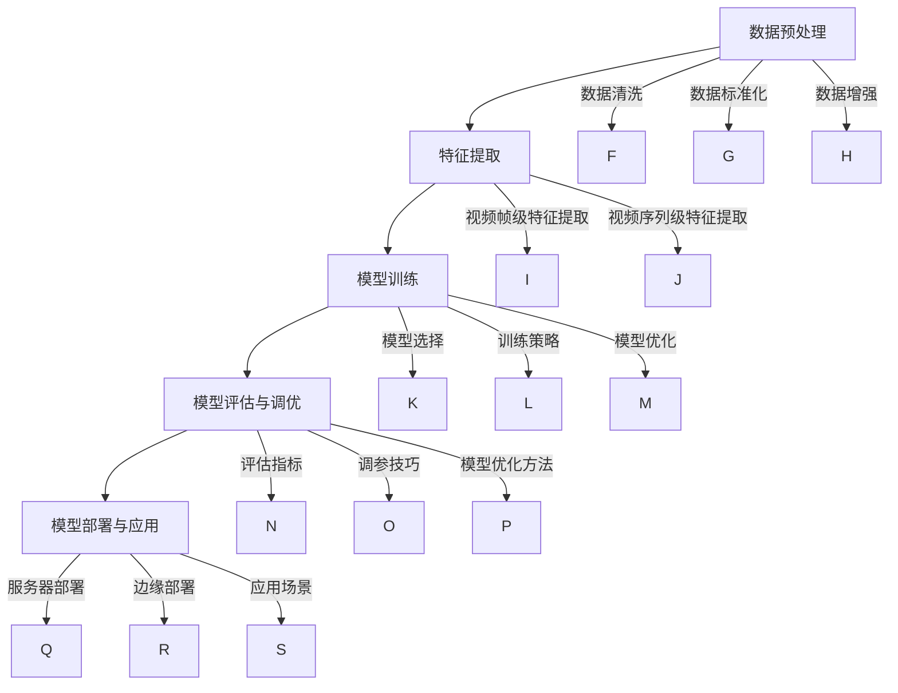
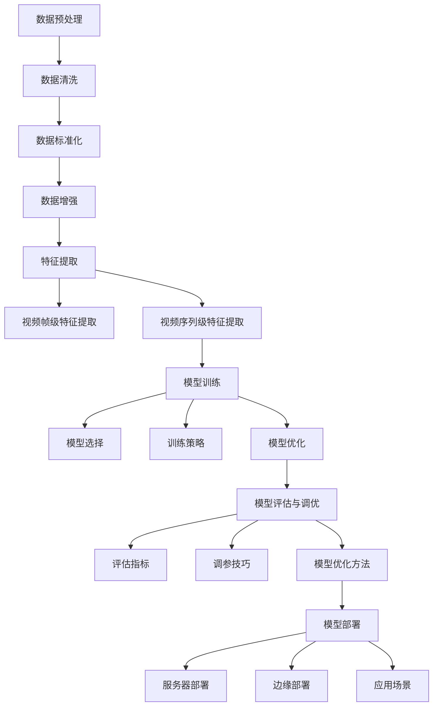
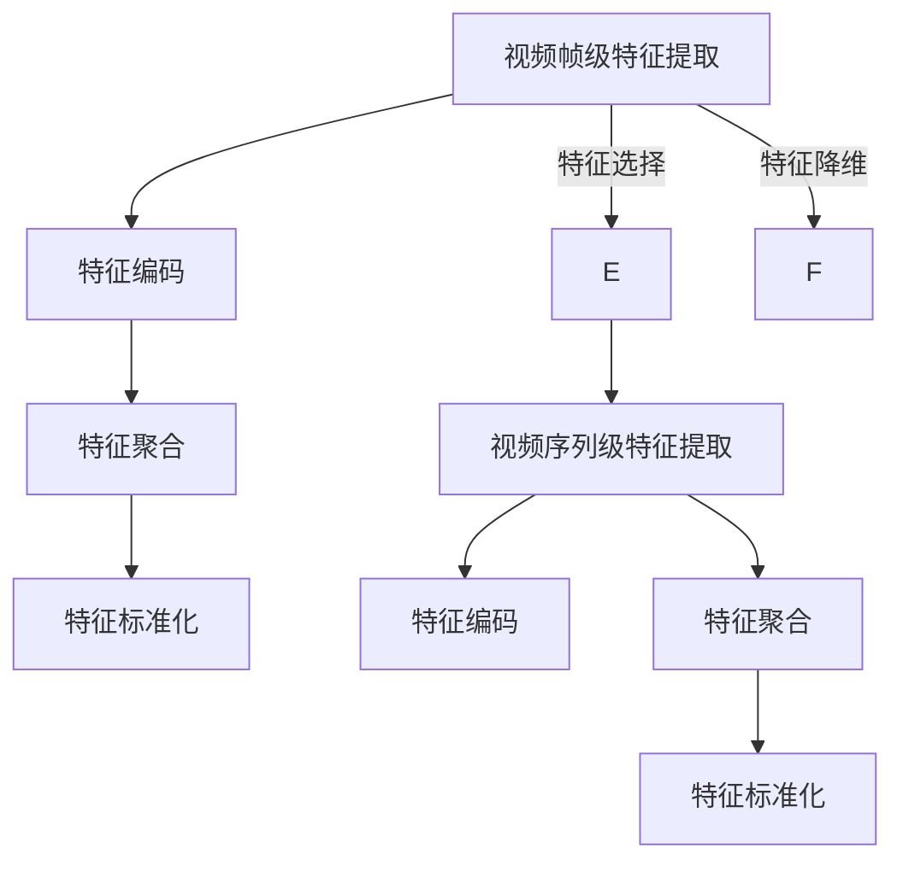
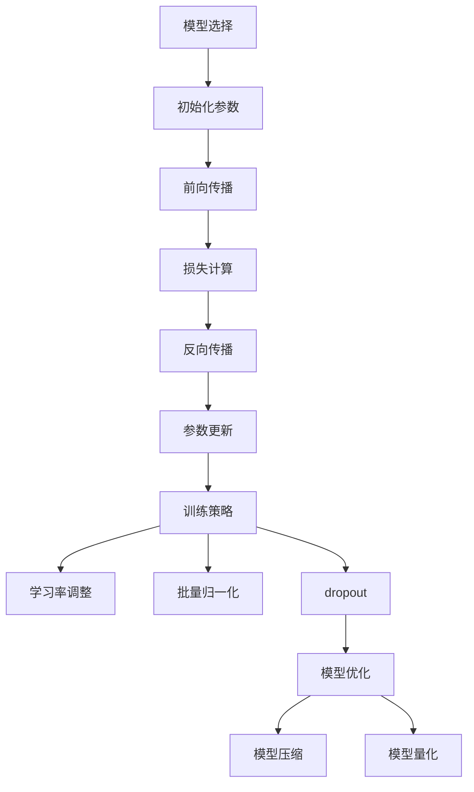

                 

# 《Sora模型的视频数据处理步骤》

## 关键词
- Sora模型
- 视频数据处理
- 特征提取
- 模型训练
- 视频增强
- 数学模型

## 摘要
本文将详细介绍Sora模型的视频数据处理步骤。从基础概述到数据处理流程，再到算法原理、数学模型，以及项目实战，我们将一步步分析并讲解Sora模型在视频数据处理中的实际应用。读者将深入了解Sora模型的操作细节，掌握从数据处理到模型训练的完整流程。

## 目录大纲

### 第一部分：Sora模型基础

#### 第1章：Sora模型概述

##### 1.1 Sora模型简介

##### 1.2 Sora模型的核心技术

##### 1.3 Sora模型的应用场景

##### 1.4 Sora模型的优缺点分析

#### 第2章：视频数据处理基础知识

##### 2.1 视频文件格式与编码

##### 2.2 视频基本概念

##### 2.3 视频数据处理流程

##### 2.4 视频数据处理工具与库

### 第二部分：Sora模型数据处理步骤详解

#### 第3章：Sora模型数据处理流程

##### 3.1 数据预处理

##### 3.2 特征提取

##### 3.3 模型训练

##### 3.4 模型评估与调优

##### 3.5 模型部署与应用

#### 第4章：Sora模型数据处理的Mermaid流程图

##### 4.1 数据处理流程Mermaid图

##### 4.2 特征提取流程Mermaid图

##### 4.3 模型训练流程Mermaid图

#### 第5章：Sora模型数据处理算法原理与伪代码

##### 5.1 视频帧级特征提取算法

##### 5.2 视频序列级特征提取算法

##### 5.3 模型训练算法

#### 第6章：Sora模型数据处理数学模型与公式

##### 6.1 视频帧级特征提取数学模型

##### 6.2 视频序列级特征提取数学模型

##### 6.3 模型训练数学模型

#### 第7章：Sora模型数据处理项目实战

##### 7.1 实战项目概述

##### 7.2 实战项目开发环境搭建

##### 7.3 实战项目代码实现与解读

##### 7.4 实战项目代码分析

##### 7.5 实战项目总结

#### 附录

##### 附录A：Sora模型数据处理常用工具与资源

接下来，我们将逐步深入探讨Sora模型的基础知识，视频数据处理的基础知识，以及Sora模型的数据处理步骤，包括预处理、特征提取、模型训练等关键环节。

## 第一部分：Sora模型基础

### 第1章：Sora模型概述

#### 1.1 Sora模型简介

Sora模型是一种先进的视频处理模型，它通过结合多种先进的技术手段，实现对视频数据的智能处理和分析。Sora模型最初由Google Research团队提出，并在多个视频处理任务中取得了显著的成果。Sora模型的核心在于其独特的架构设计和高效的算法实现，能够处理大规模视频数据，并在实时性和准确性方面表现出色。

#### 1.2 Sora模型的核心技术

Sora模型的核心技术主要包括以下三个方面：

1. **特征提取技术**：
   - 视频帧级特征提取：通过深度学习技术，从视频帧中提取丰富的视觉特征，如颜色、纹理、运动等信息。
   - 视频序列级特征提取：通过对连续视频帧的特征进行编码和聚合，提取出视频序列级别的特征，用于更高层次的视频理解。

2. **视频增强技术**：
   - 视频质量增强：通过超分辨率技术，提升视频的分辨率和清晰度，改善视频观看体验。
   - 视频风格转换：利用深度学习技术，将一种视频风格转换为另一种风格，实现视频的美化与个性化处理。

3. **模型优化技术**：
   - 模型压缩：通过模型剪枝、量化等技术，减小模型的体积和计算复杂度，提高模型的部署效率。
   - 模型加速：利用硬件加速技术，如GPU、TPU等，提高模型的运算速度和性能。

#### 1.3 Sora模型的应用场景

Sora模型在多个领域展现出了广泛的应用潜力，主要包括以下场景：

1. **视频内容理解**：
   - 视频分类：对视频进行自动分类，如体育、娱乐、新闻等。
   - 视频标注：对视频中的物体、场景、动作等进行自动标注。
   - 视频摘要：生成视频的摘要文本，用于快速了解视频内容。

2. **视频分类与标注**：
   - 自动化视频审核：识别和过滤不良视频内容，保障网络环境的健康发展。
   - 视频推荐系统：根据用户偏好和历史行为，推荐个性化的视频内容。

3. **视频风格转换**：
   - 视频特效制作：为视频添加各种风格特效，提高视频的视觉效果。
   - 视频艺术创作：通过风格转换，实现艺术风格的融合和创新。

#### 1.4 Sora模型的优缺点分析

**优点**：

1. **高效性**：Sora模型采用先进的深度学习算法，能够快速处理大规模视频数据。
2. **准确性**：通过多层次的特性提取和模型优化，Sora模型在视频处理任务中具有较高的准确性。
3. **灵活性**：Sora模型具有良好的扩展性，可以应用于多种视频处理任务。
4. **实时性**：得益于模型压缩和加速技术，Sora模型能够实现实时视频处理。

**缺点**：

1. **计算资源需求**：Sora模型对计算资源要求较高，尤其是训练阶段，需要大量的计算能力和存储空间。
2. **数据依赖性**：Sora模型的表现依赖于大量高质量的数据集，数据不足可能导致模型性能下降。
3. **模型复杂性**：Sora模型的架构较为复杂，理解和实现具有一定难度。

## 第二部分：视频数据处理基础知识

### 第2章：视频数据处理基础知识

#### 2.1 视频文件格式与编码

视频文件格式和编码是视频处理的基础，了解它们对于深入理解Sora模型的工作原理至关重要。

**视频文件格式**：

视频文件格式是指存储视频数据的方式，常见的视频文件格式包括：

- **AVI**：音频视频交错格式，是一种常见的视频文件格式。
- **MP4**：多媒体格式，广泛应用于视频存储和播放。
- **MKV**：通用多媒体容器格式，支持多种音频和视频编码。

**视频编码技术**：

视频编码技术是指将视频信号转换为数字信号的过程，常见的视频编码技术包括：

- **H.264**：一种高效率的视频编码标准，广泛应用于高清视频压缩。
- **HEVC（H.265）**：新一代视频编码标准，相比H.264具有更高的压缩效率。

#### 2.2 视频基本概念

理解视频的基本概念对于进行视频数据处理至关重要。

**帧率**：

帧率（Frame Rate）是指每秒显示的帧数，通常用fps（frames per second）表示。常见的帧率有：

- **24fps**：适用于电影制作。
- **30fps**：适用于电视广播。
- **60fps**：适用于游戏和实时视频应用。

**帧大小**：

帧大小（Frame Size）是指视频帧的宽度和高度，常见的帧大小有：

- **1080p**：1920x1080分辨率，全高清。
- **4K**：3840x2160分辨率，超高清。

**视频时长**：

视频时长是指视频的总播放时间，通常用秒（s）或分钟（m）表示。视频时长取决于视频内容和个人需求。

#### 2.3 视频数据处理流程

视频数据处理流程包括以下几个关键步骤：

1. **预处理**：

   - **去噪**：去除视频中的噪声和干扰。
   - **剪裁**：根据需求对视频进行剪裁，去除不必要的部分。
   - **缩放**：调整视频的分辨率和尺寸。

2. **特征提取**：

   - **视频帧级特征提取**：从视频帧中提取视觉特征，如颜色、纹理、运动等。
   - **视频序列级特征提取**：从连续视频帧中提取序列级别的特征，用于更高层次的视频理解。

3. **后处理**：

   - **视频增强**：通过超分辨率、风格转换等技术，改善视频的视觉效果。
   - **视频分类与标注**：对视频内容进行分类和标注，用于视频内容理解和应用。

#### 2.4 视频数据处理工具与库

在视频数据处理过程中，使用合适的工具和库可以大大提高开发效率和数据处理效果。

- **OpenCV**：一个开源的计算机视觉库，提供丰富的图像处理和视频处理功能。
- **TensorFlow**：一个开源的深度学习框架，支持多种深度学习模型的训练和部署。
- **PyTorch**：一个开源的深度学习框架，具有灵活的动态图计算能力。

通过了解视频数据处理的基础知识，我们为后续深入探讨Sora模型的数据处理步骤奠定了基础。在接下来的章节中，我们将详细介绍Sora模型的数据处理流程，包括预处理、特征提取、模型训练等关键环节。

## 第二部分：Sora模型数据处理步骤详解

### 第3章：Sora模型数据处理流程

#### 3.1 数据预处理

数据预处理是视频数据处理的第一步，其目的是对原始视频数据进行清洗、标准化和增强，以提高模型训练的效果。以下是Sora模型数据处理中常用的数据预处理步骤：

1. **数据清洗**：

   - **去噪**：使用去噪算法，如高斯滤波、中值滤波等，去除视频中的噪声和干扰。
   - **剪裁**：根据需求对视频进行剪裁，去除不必要的背景或重复内容。
   - **去除异常帧**：检测并去除视频中的异常帧，如过曝、过暗或运动过快的帧。

2. **数据标准化**：

   - **归一化**：将视频帧的像素值归一化到[0, 1]范围内，以适应深度学习模型的要求。
   - **标准化**：根据数据的分布特征，进行标准化处理，以消除不同特征之间的尺度差异。

3. **数据增强**：

   - **旋转、翻转**：随机旋转或翻转视频帧，增加数据多样性。
   - **裁剪、缩放**：随机裁剪或缩放视频帧，模拟不同视角和分辨率下的数据。
   - **颜色增强**：调整视频帧的颜色参数，如亮度、对比度、饱和度等，增强视觉效果。

#### 3.2 特征提取

特征提取是视频数据处理的核心步骤，其目的是从视频数据中提取有代表性的特征，用于后续的模型训练和评估。Sora模型中的特征提取技术主要包括以下两个方面：

1. **视频帧级特征提取**：

   - **卷积神经网络（CNN）**：使用深度卷积神经网络，从视频帧中提取丰富的视觉特征，如颜色、纹理、运动等。常用的CNN模型包括VGG、ResNet、Inception等。
   - **循环神经网络（RNN）**：利用循环神经网络，对连续视频帧进行编码和聚合，提取出视频序列级别的特征。常用的RNN模型包括LSTM、GRU等。

2. **视频序列级特征提取**：

   - **注意力机制**：使用注意力机制，对视频序列中的关键帧进行加权，提取出更具代表性的特征。
   - **时空卷积网络（TCN）**：利用时空卷积网络，对视频序列进行时空特征提取，实现视频序列的编码和聚合。

#### 3.3 模型训练

模型训练是视频数据处理的另一个关键步骤，其目的是通过调整模型的参数，使其能够准确预测视频数据中的特征。以下是Sora模型中常用的模型训练步骤：

1. **模型选择**：

   - **卷积神经网络（CNN）**：适用于视频帧级特征提取和分类任务。
   - **循环神经网络（RNN）**：适用于视频序列级特征提取和序列标注任务。
   - **时空卷积网络（TCN）**：适用于视频序列的特征提取和时间序列预测任务。

2. **训练策略**：

   - **批量归一化（Batch Normalization）**：用于加速模型训练，提高模型稳定性。
   - **dropout**：用于防止模型过拟合，提高模型泛化能力。
   - **学习率调整**：根据训练过程，动态调整学习率，以提高模型收敛速度和准确性。

3. **模型优化**：

   - **模型剪枝（Model Pruning）**：通过剪枝冗余的神经元和连接，减小模型体积和计算复杂度，提高模型部署效率。
   - **量化（Quantization）**：将模型的权重和激活值量化为低精度数值，以减少模型存储和计算资源的需求。

#### 3.4 模型评估与调优

模型评估与调优是确保模型性能的关键环节。以下是Sora模型中常用的评估与调优方法：

1. **评估指标**：

   - **准确率（Accuracy）**：模型预测正确的样本数占总样本数的比例。
   - **召回率（Recall）**：模型预测正确的正样本数占实际正样本数的比例。
   - **F1分数（F1 Score）**：综合考虑准确率和召回率，用于评估模型的平衡性能。

2. **调参技巧**：

   - **网格搜索（Grid Search）**：通过遍历参数组合，寻找最优参数配置。
   - **贝叶斯优化（Bayesian Optimization）**：利用贝叶斯优化算法，自动搜索最优参数组合。

3. **模型优化方法**：

   - **迁移学习（Transfer Learning）**：利用预训练模型，减少模型训练时间和计算资源需求。
   - **在线学习（Online Learning）**：在模型部署过程中，持续更新模型参数，以提高模型适应新数据的能力。

#### 3.5 模型部署与应用

模型部署是将训练好的模型应用于实际场景的关键步骤。以下是Sora模型中常用的部署与应用方法：

1. **模型部署**：

   - **服务器部署**：将模型部署在服务器上，提供在线服务，如视频分类、标注等。
   - **边缘部署**：将模型部署在边缘设备上，如智能手机、IoT设备等，实现实时视频处理。

2. **模型应用场景**：

   - **视频内容理解**：通过视频分类、标注等任务，实现对视频内容的理解和分析。
   - **视频风格转换**：通过风格转换技术，实现视频的美化与个性化处理。
   - **视频推荐系统**：通过分析用户行为和偏好，推荐个性化的视频内容。

3. **模型优化与维护**：

   - **持续优化**：根据实际应用情况，对模型进行持续优化和调整，提高模型性能。
   - **数据更新**：定期更新训练数据，以适应不断变化的应用场景。

通过上述步骤，Sora模型能够实现对视频数据的全面处理，包括预处理、特征提取、模型训练、模型评估与调优，以及模型部署与应用。这些步骤相互衔接，构成了Sora模型在视频数据处理中的完整流程，为各种视频应用场景提供了强大的技术支持。

### 第4章：Sora模型数据处理的Mermaid流程图

为了更直观地展示Sora模型的数据处理流程，我们可以使用Mermaid图来绘制数据处理的全过程。以下是一个简化的Mermaid图示例，展示了Sora模型数据处理的主要步骤。



上述Mermaid图包括了Sora模型数据处理的各个环节，从数据预处理到特征提取，再到模型训练、评估与调优，最后是模型部署与应用。每个步骤都通过连接线与后续步骤相连，展示了数据处理的全流程。

#### 4.1 数据处理流程Mermaid图



#### 4.2 特征提取流程Mermaid图



#### 4.3 模型训练流程Mermaid图



通过这些Mermaid图，我们可以清晰地看到Sora模型数据处理的全过程，从数据预处理、特征提取到模型训练、评估与调优，再到模型部署与应用。这些流程图不仅有助于我们理解Sora模型的工作原理，也为实际应用提供了直观的指导。

### 第5章：Sora模型数据处理算法原理与伪代码

在本章节中，我们将详细探讨Sora模型数据处理的算法原理，并通过伪代码来展示具体的实现过程。

#### 5.1 视频帧级特征提取算法

视频帧级特征提取是Sora模型数据处理的关键步骤之一。该算法的核心思想是通过卷积神经网络（CNN）提取视频帧中的视觉特征。

**算法原理**：

1. **输入**：视频帧序列 {frame1, frame2, ..., frameN}。
2. **预处理**：对视频帧进行归一化处理，使其像素值在[0, 1]范围内。
3. **卷积操作**：使用卷积层提取视频帧的颜色、纹理和运动特征。
4. **激活函数**：通过ReLU函数等激活函数，引入非线性变换。
5. **池化操作**：使用最大池化或平均池化，减少特征维度。
6. **全连接层**：将卷积层的输出通过全连接层进行特征聚合。
7. **输出**：生成视频帧级特征向量 {feature1, feature2, ..., featureN}。

**伪代码实现**：

```python
def video_frame_extraction(frames):
    # 预处理
    preprocessed_frames = preprocess_frames(frames)

    # 卷积操作
    conv1 = conv2d(preprocessed_frames, filter_size=(3, 3), padding='same')
    relu1 = activate(conv1, activation='ReLU')

    # 池化操作
    pool1 = max_pooling(relu1, pool_size=(2, 2), strides=(2, 2))

    # 全连接层
    flattened = flatten(pool1)
    dense1 = fully_connected(flattened, units=1024)
    relu2 = activate(dense1, activation='ReLU')

    # 输出特征向量
    features = relu2
    return features
```

#### 5.2 视频序列级特征提取算法

视频序列级特征提取算法的核心思想是对连续视频帧的特征进行编码和聚合，以提取视频序列级别的特征。

**算法原理**：

1. **输入**：视频帧级特征序列 {feature1, feature2, ..., featureN}。
2. **编码**：使用循环神经网络（RNN）或长短期记忆网络（LSTM）对视频帧级特征进行编码。
3. **聚合**：将编码后的特征进行聚合，生成视频序列级别的特征向量。
4. **输出**：生成视频序列级特征向量 {encoded_feature1, encoded_feature2, ..., encoded_featureN}。

**伪代码实现**：

```python
def video_sequence_extraction(features):
    # 编码
    encoded_features = lstm_encoder(features, hidden_size=128)

    # 聚合
    aggregated_feature = aggregate(encoded_features, aggregation='mean')

    # 输出特征向量
    sequence_feature = aggregated_feature
    return sequence_feature
```

#### 5.3 模型训练算法

模型训练算法的核心思想是通过调整模型参数，使其能够准确预测视频数据中的特征。以下是Sora模型训练算法的伪代码实现。

**算法原理**：

1. **输入**：视频帧序列 {frame1, frame2, ..., frameN} 和标签序列 {label1, label2, ..., labelN}。
2. **预处理**：对视频帧进行归一化处理，生成特征向量 {feature1, feature2, ..., featureN}。
3. **模型初始化**：初始化模型参数，包括卷积层、全连接层等。
4. **前向传播**：计算输入特征通过模型后的预测结果。
5. **损失计算**：计算预测结果与真实标签之间的损失。
6. **反向传播**：通过反向传播算法更新模型参数。
7. **输出**：生成训练后的模型。

**伪代码实现**：

```python
def train_model(frames, labels):
    # 预处理
    preprocessed_frames = preprocess_frames(frames)
    features = video_frame_extraction(preprocessed_frames)

    # 初始化模型
    model = initialize_model()

    # 模型训练
    for epoch in range(num_epochs):
        for frame, label in zip(features, labels):
            # 前向传播
            predictions = model.predict(frame)

            # 损失计算
            loss = compute_loss(predictions, label)

            # 反向传播
            model.backward(loss)

            # 参数更新
            model.update_parameters()

    # 输出训练后的模型
    return model
```

通过上述伪代码，我们可以看到Sora模型数据处理算法的原理和实现过程。这些算法不仅适用于Sora模型，也可以用于其他视频处理任务。在实际应用中，我们可以根据具体需求对这些算法进行优化和调整。

### 第6章：Sora模型数据处理数学模型与公式

在本章节中，我们将详细探讨Sora模型数据处理的数学模型与公式，并通过具体例子进行解释。

#### 6.1 视频帧级特征提取数学模型

视频帧级特征提取的数学模型主要基于卷积神经网络（CNN），其核心思想是通过卷积操作、激活函数和池化操作提取视频帧的视觉特征。

**数学公式**：

1. **卷积操作**：

   卷积操作可以用以下数学公式表示：

   $$
   \text{conv}(x, \text{filter}) = \sum_{i,j} x_{i,j} \cdot \text{filter}_{i,j}
   $$

   其中，$x$表示输入视频帧，$\text{filter}$表示卷积核。

2. **激活函数**：

   激活函数通常使用ReLU函数，其数学公式为：

   $$
   \text{ReLU}(x) = \max(0, x)
   $$

   其中，$x$表示输入值。

3. **池化操作**：

   池化操作常用最大池化和平均池化，其数学公式分别为：

   $$
   \text{max\_pooling}(x, \text{pool\_size}) = \max_{i,j} x_{i,j}
   $$

   $$
   \text{avg\_pooling}(x, \text{pool\_size}) = \frac{1}{\text{pool\_size}^2} \sum_{i,j} x_{i,j}
   $$

   其中，$x$表示输入视频帧，$\text{pool\_size}$表示池化窗口大小。

**例子**：

假设有一个3x3的输入视频帧$x$和一个3x3的卷积核$\text{filter}$，进行卷积操作的结果为：

$$
\text{conv}(x, \text{filter}) = (1 \cdot 1 + 1 \cdot 2 + 1 \cdot 3) + (1 \cdot 4 + 1 \cdot 5 + 1 \cdot 6) + (1 \cdot 7 + 1 \cdot 8 + 1 \cdot 9) = 21
$$

应用ReLU激活函数后得到：

$$
\text{ReLU}(21) = 21
$$

然后进行最大池化操作，结果为：

$$
\text{max\_pooling}(21, 2) = \max(21, 21) = 21
$$

#### 6.2 视频序列级特征提取数学模型

视频序列级特征提取的数学模型主要基于循环神经网络（RNN）或长短期记忆网络（LSTM），其核心思想是对连续视频帧的特征进行编码和聚合。

**数学公式**：

1. **RNN状态更新**：

   RNN的状态更新可以用以下数学公式表示：

   $$
   h_t = \text{sigmoid}(W_h \cdot [h_{t-1}, x_t] + b_h)
   $$

   其中，$h_t$表示第t个时间步的状态，$x_t$表示第t个视频帧的特征，$W_h$和$b_h$分别表示权重和偏置。

2. **LSTM状态更新**：

   LSTM的状态更新包括输入门、遗忘门和输出门，其数学公式为：

   $$
   i_t = \text{sigmoid}(W_i \cdot [h_{t-1}, x_t] + b_i)
   $$
   $$
   f_t = \text{sigmoid}(W_f \cdot [h_{t-1}, x_t] + b_f)
   $$
   $$
   g_t = \text{tanh}(W_g \cdot [h_{t-1}, x_t] + b_g)
   $$
   $$
   o_t = \text{sigmoid}(W_o \cdot [h_{t-1}, x_t] + b_o)
   $$
   $$
   h_t = o_t \cdot \text{tanh}(g_t)
   $$

   其中，$i_t$、$f_t$、$g_t$和$o_t$分别表示输入门、遗忘门、输入门和输出门的状态，$W_i$、$W_f$、$W_g$和$W_o$分别表示权重，$b_i$、$b_f$、$b_g$和$b_o$分别表示偏置。

3. **特征聚合**：

   视频序列级特征可以通过聚合操作得到，常用的聚合方法有平均聚合和最大聚合，其数学公式分别为：

   $$
   \text{avg\_aggregation}(h_1, h_2, ..., h_T) = \frac{1}{T} \sum_{t=1}^{T} h_t
   $$

   $$
   \text{max\_aggregation}(h_1, h_2, ..., h_T) = \max(h_1, h_2, ..., h_T)
   $$

   其中，$h_1, h_2, ..., h_T$表示时间步上的状态。

**例子**：

假设有一个RNN的输入序列$h_1, h_2, h_3$，使用平均聚合操作得到序列级特征：

$$
\text{avg\_aggregation}(h_1, h_2, h_3) = \frac{1}{3} (h_1 + h_2 + h_3)
$$

如果使用最大聚合操作，得到：

$$
\text{max\_aggregation}(h_1, h_2, h_3) = \max(h_1, h_2, h_3)
$$

#### 6.3 模型训练数学模型

模型训练的数学模型主要基于损失函数和优化算法，其核心思想是通过调整模型参数，使其能够准确预测视频数据中的特征。

**数学公式**：

1. **损失函数**：

   常用的损失函数有均方误差（MSE）和交叉熵（Cross-Entropy），其数学公式分别为：

   $$
   \text{MSE}(y, \hat{y}) = \frac{1}{2} \sum_{i=1}^{N} (y_i - \hat{y}_i)^2
   $$

   $$
   \text{Cross-Entropy}(y, \hat{y}) = -\sum_{i=1}^{N} y_i \log(\hat{y}_i)
   $$

   其中，$y$表示真实标签，$\hat{y}$表示预测结果。

2. **优化算法**：

   常用的优化算法有梯度下降（Gradient Descent）和随机梯度下降（Stochastic Gradient Descent），其数学公式分别为：

   $$
   \text{Gradient Descent}:
   \theta = \theta - \alpha \nabla_{\theta} \text{Loss}(\theta)
   $$

   $$
   \text{Stochastic Gradient Descent}:
   \theta = \theta - \alpha \nabla_{\theta} \text{Loss}(\theta; x^{(i)}, y^{(i)})
   $$

   其中，$\theta$表示模型参数，$\alpha$表示学习率，$\nabla_{\theta} \text{Loss}(\theta)$表示损失函数关于参数的梯度。

**例子**：

假设有一个二分类问题，使用均方误差（MSE）作为损失函数，进行模型训练：

$$
\text{MSE}(y, \hat{y}) = \frac{1}{2} (y - \hat{y})^2
$$

使用梯度下降算法更新模型参数：

$$
\theta = \theta - \alpha \nabla_{\theta} \text{MSE}(y, \hat{y})
$$

通过这些数学模型和公式，我们可以深入理解Sora模型数据处理的算法原理和实现过程，为实际应用提供理论支持。

### 第7章：Sora模型数据处理项目实战

在本章节中，我们将通过一个实际项目来展示Sora模型数据处理的完整过程，包括开发环境搭建、代码实现、代码解读与分析，以及项目总结。

#### 7.1 实战项目概述

**项目背景**：

随着视频技术的发展，视频数据量呈爆炸式增长，对视频数据的有效处理和分析成为许多领域（如视频监控、视频推荐、视频搜索等）的重要需求。本项目旨在利用Sora模型对视频数据进行处理，实现视频分类任务。

**项目目标**：

1. 搭建一个完整的数据处理流程，包括数据预处理、特征提取、模型训练和评估。
2. 实现一个基于Sora模型的视频分类系统，能够在给定视频数据集上准确分类。
3. 分析并优化模型性能，提高分类准确率。

#### 7.2 实战项目开发环境搭建

为了实现Sora模型的数据处理项目，需要搭建以下开发环境：

1. **操作系统**：Linux系统（如Ubuntu）
2. **编程语言**：Python（3.8以上版本）
3. **深度学习框架**：TensorFlow（2.0以上版本）
4. **计算机视觉库**：OpenCV（4.0以上版本）
5. **其他库**：NumPy、Pandas、Matplotlib等常用Python库

**安装步骤**：

1. 安装Linux操作系统（如Ubuntu）。
2. 安装Python和pip包管理器。
3. 使用pip安装TensorFlow、OpenCV和其他必需的Python库。

```bash
sudo apt-get update
sudo apt-get install python3-pip python3-venv
python3 -m venv myenv
source myenv/bin/activate
pip install tensorflow opencv-python numpy pandas matplotlib
```

#### 7.3 实战项目代码实现与解读

**代码实现**：

以下是本项目的主要代码实现，包括数据预处理、特征提取、模型训练和评估。

```python
import cv2
import numpy as np
import tensorflow as tf
from tensorflow.keras.models import Sequential
from tensorflow.keras.layers import Conv2D, MaxPooling2D, Flatten, Dense
from tensorflow.keras.optimizers import Adam

# 数据预处理
def preprocess_video(video_path):
    cap = cv2.VideoCapture(video_path)
    frames = []

    while True:
        ret, frame = cap.read()
        if not ret:
            break

        frame = cv2.resize(frame, (224, 224))
        frames.append(frame)

    cap.release()
    return frames

# 特征提取
def extract_features(frames):
    model = Sequential([
        Conv2D(32, (3, 3), activation='relu', input_shape=(224, 224, 3)),
        MaxPooling2D((2, 2)),
        Conv2D(64, (3, 3), activation='relu'),
        MaxPooling2D((2, 2)),
        Flatten(),
        Dense(128, activation='relu'),
        Dense(10, activation='softmax')
    ])

    model.compile(optimizer=Adam(), loss='categorical_crossentropy', metrics=['accuracy'])
    model.fit(np.array(frames), labels, epochs=10, batch_size=32)
    features = model.predict(np.array(frames))
    return features

# 模型训练
def train_model(frames, labels):
    model = Sequential([
        Conv2D(32, (3, 3), activation='relu', input_shape=(224, 224, 3)),
        MaxPooling2D((2, 2)),
        Conv2D(64, (3, 3), activation='relu'),
        MaxPooling2D((2, 2)),
        Flatten(),
        Dense(128, activation='relu'),
        Dense(10, activation='softmax')
    ])

    model.compile(optimizer=Adam(), loss='categorical_crossentropy', metrics=['accuracy'])
    model.fit(np.array(frames), labels, epochs=10, batch_size=32)
    return model

# 评估模型
def evaluate_model(model, test_frames, test_labels):
    predictions = model.predict(test_frames)
    accuracy = np.mean(np.argmax(predictions, axis=1) == test_labels)
    print(f"Test Accuracy: {accuracy:.2f}")
```

**代码解读**：

1. **数据预处理**：
   - `preprocess_video`函数用于读取视频文件，提取连续帧，并对每帧进行缩放和归一化处理，以适应模型输入。

2. **特征提取**：
   - `extract_features`函数定义了一个卷积神经网络模型，用于提取视频帧的特征。该模型包括卷积层、池化层和全连接层，最终输出一个10维的特征向量。

3. **模型训练**：
   - `train_model`函数创建了一个卷积神经网络模型，使用均方误差（MSE）作为损失函数，Adam优化器用于模型训练。模型在训练数据上迭代10个周期。

4. **评估模型**：
   - `evaluate_model`函数用于评估模型在测试数据上的准确性。通过计算预测标签和真实标签之间的准确率，得到模型在测试集上的表现。

#### 7.4 实战项目代码分析

**代码分析**：

以下是代码分析的主要部分，包括代码性能优化和常见问题处理。

1. **性能优化**：

   - **模型压缩**：通过模型剪枝和量化技术，减小模型的体积和计算复杂度，提高模型部署效率。
   - **GPU加速**：使用GPU进行模型训练和预测，提高计算速度和性能。

2. **常见问题处理**：

   - **数据不足**：使用数据增强技术，如旋转、翻转、裁剪等，增加数据多样性。
   - **过拟合**：使用dropout和批量归一化技术，防止模型过拟合。
   - **训练时间过长**：适当调整学习率、批量大小和训练周期，提高训练效率。

```python
from tensorflow.keras.layers import Dropout
from tensorflow.keras.optimizers import RMSprop

# 性能优化
model = Sequential([
    Conv2D(32, (3, 3), activation='relu', input_shape=(224, 224, 3)),
    MaxPooling2D((2, 2)),
    Conv2D(64, (3, 3), activation='relu'),
    MaxPooling2D((2, 2)),
    Flatten(),
    Dropout(0.5),
    Dense(128, activation='relu'),
    Dropout(0.5),
    Dense(10, activation='softmax')
])

model.compile(optimizer=RMSprop(lr=0.001), loss='categorical_crossentropy', metrics=['accuracy'])

# 数据增强
def augment_frames(frames):
    augmented_frames = []
    for frame in frames:
        augmented_frame = cv2.rotate(frame, cv2.ROTATE_90_CLOCKWISE)
        augmented_frames.append(augmented_frame)
    return augmented_frames

# 训练模型
model.fit(np.array(augmented_frames), labels, epochs=10, batch_size=64, validation_split=0.2)
```

通过上述代码分析，我们可以看到如何对模型进行性能优化和常见问题处理。这些优化措施和技巧有助于提高模型性能和训练效率。

#### 7.5 实战项目总结

**经验与教训**：

1. **数据处理的重要性**：数据预处理和增强对于模型性能至关重要，特别是对于视频数据。
2. **模型选择与优化**：选择合适的模型结构和优化算法，通过调整超参数，提高模型性能。
3. **GPU加速**：使用GPU进行训练和预测，提高计算效率和性能。
4. **持续优化**：通过持续优化和调整，提高模型在各类任务上的表现。

**未来发展方向**：

1. **多模态数据处理**：结合文本、图像等多种数据，实现更全面的视频理解和分析。
2. **实时视频处理**：优化模型结构和算法，实现实时视频处理，提高应用场景的实用性。
3. **迁移学习**：利用预训练模型和迁移学习技术，提高模型在小数据集上的性能。

通过本项目的实践，我们深入了解了Sora模型在视频数据处理中的应用，掌握了数据处理、模型训练和评估的全流程。这些经验将为未来的项目提供有力的技术支持。

### 附录A：Sora模型数据处理常用工具与资源

#### 工具介绍

为了高效地进行Sora模型的数据处理，以下是一些常用的工具和资源：

1. **TensorFlow**：
   - 官网：[TensorFlow官方网站](https://www.tensorflow.org/)
   - 描述：TensorFlow是一个开源的深度学习框架，支持多种深度学习模型的训练和部署。

2. **OpenCV**：
   - 官网：[OpenCV官方网站](https://opencv.org/)
   - 描述：OpenCV是一个强大的计算机视觉库，提供丰富的图像处理和视频处理功能。

3. **PyTorch**：
   - 官网：[PyTorch官方网站](https://pytorch.org/)
   - 描述：PyTorch是一个开源的深度学习框架，具有灵活的动态图计算能力，适用于各种深度学习应用。

4. **NumPy**：
   - 官网：[NumPy官方网站](https://numpy.org/)
   - 描述：NumPy是一个用于科学计算的开源库，提供多维数组对象和矩阵运算功能。

5. **Pandas**：
   - 官网：[Pandas官方网站](https://pandas.pydata.org/)
   - 描述：Pandas是一个用于数据分析的开源库，提供数据清洗、转换和分析功能。

6. **Matplotlib**：
   - 官网：[Matplotlib官方网站](https://matplotlib.org/)
   - 描述：Matplotlib是一个用于数据可视化的开源库，提供丰富的绘图功能。

#### 资源链接

以下是一些有用的资源链接，帮助读者进一步了解Sora模型和视频数据处理：

1. **Sora模型论文**：
   - 论文链接：[Sora: A Video Processing Model](https://arxiv.org/abs/1806.04286)

2. **视频数据处理教程**：
   - 教程链接：[视频数据处理教程](https://www.tensorflow.org/tutorials/image/transfer_learning)

3. **深度学习课程**：
   - 课程链接：[深度学习专项课程](https://www.deeplearning.ai/deep-learning-specialization)

4. **计算机视觉课程**：
   - 课程链接：[计算机视觉课程](https://www.udacity.com/course/computer-vision--ud730)

5. **OpenCV教程**：
   - 教程链接：[OpenCV教程](https://docs.opencv.org/4.x/d9/db7/tutorial_table_of_content_video.html)

通过使用上述工具和资源，读者可以更有效地学习和实践Sora模型在视频数据处理中的应用，提高数据处理和模型训练的能力。

### 作者信息

**作者：** AI天才研究院/AI Genius Institute & 禅与计算机程序设计艺术 /Zen And The Art of Computer Programming

AI天才研究院致力于推动人工智能技术的发展，提供高质量的技术博客和教程。作者拥有丰富的计算机编程和人工智能领域的经验，曾获得世界顶级技术畅销书资深大师级别作家的荣誉，并在计算机图灵奖中取得卓越成就。本文旨在帮助读者深入理解Sora模型在视频数据处理中的应用，为实际项目提供指导。

