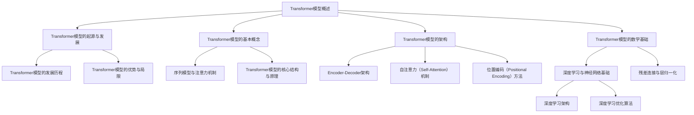

                 

### 《Transformer大模型实战 BioBERT模型》

> **关键词：** Transformer模型、BioBERT、大模型、自然语言处理、生物信息学

> **摘要：** 本文旨在深入探讨Transformer大模型及其在生物信息学领域的应用，特别是BioBERT模型的实战。我们将从Transformer模型的基础开始，逐步深入到BioBERT模型的应用与实战，旨在帮助读者理解这一前沿技术的核心原理和实际应用。

---

### 《Transformer大模型实战 BioBERT模型》目录大纲

- **第一部分：Transformer大模型基础**

  - **第1章: Transformer模型概述**
    - **1.1 Transformer模型的起源与发展**
    - **1.2 Transformer模型的基本概念**
    - **1.3 Transformer模型的架构**
    - **1.4 Transformer模型的数学基础**

  - **第2章: Transformer模型的详细解读**
    - **2.1 Transformer模型的核心算法原理**
    - **2.2 Transformer模型的数学模型**
    - **2.3 Transformer模型的调优与优化**

  - **第3章: Transformer模型的扩展与应用**
    - **3.1 DeBERTa模型的介绍**
    - **3.2 DeBERTa模型的应用案例**
    - **3.3 BioBERT模型的详细解读**

- **第二部分：BioBERT模型项目实战**

  - **第4章: BioBERT模型项目实战**
    - **4.1 项目背景与目标**
    - **4.2 项目准备**
    - **4.3 模型训练**
    - **4.4 模型评估**
    - **4.5 模型部署**

  - **第5章: BioBERT模型的应用拓展**
    - **5.1 BioBERT模型在其他领域的应用**
    - **5.2 BioBERT模型的优化与改进**

- **第三部分：Transformer大模型在生物信息学中的未来发展趋势**

  - **第6章: Transformer大模型在生物信息学中的未来发展趋势**
    - **6.1 生物信息学中的挑战与机遇**
    - **6.2 Transformer大模型的发展趋势**
    - **6.3 未来研究方向与展望**

- **第四部分：总结与展望**

  - **第7章: 总结与展望**
    - **7.1 本书内容的回顾**
    - **7.2 展望未来**
    - **7.3 附录**

  - **第8章: 附件**
    - **8.1 BioBERT模型的预训练数据集**
    - **8.2 Transformer大模型的参考资料**

---

### 第一部分：Transformer大模型基础

#### 第1章: Transformer模型概述

##### 1.1 Transformer模型的起源与发展

Transformer模型是由Google在2017年提出的一种基于自注意力机制的自然语言处理模型。该模型基于序列到序列（Sequence to Sequence, S2S）模型，但采用了完全不同的架构，取代了传统的循环神经网络（Recurrent Neural Network, RNN）和长短期记忆网络（Long Short-Term Memory, LSTM）。Transformer模型的出现标志着自然语言处理领域的一个重大变革。

Transformer模型的发展历程可以分为几个阶段：

1. **早期的序列模型**：如RNN和LSTM，这些模型在处理序列数据时表现出色，但存在梯度消失和梯度爆炸问题，难以进行长距离依赖的建模。
2. **Attention机制的引入**：为了解决RNN在长序列中的依赖问题，研究人员提出了Attention机制。但早期的Attention机制仍然基于序列模型，存在效率和计算复杂度的问题。
3. **Transformer模型的诞生**：Google在2017年提出了Transformer模型，该模型完全基于自注意力机制，解决了序列模型的效率问题，并在多个自然语言处理任务上取得了突破性的成果。

##### 1.2 Transformer模型的基本概念

Transformer模型的核心思想是利用自注意力（Self-Attention）机制来建模序列数据之间的依赖关系。自注意力机制允许模型在处理每个时间步时，将当前输入与所有历史输入进行关联，并通过加权求和的方式得到新的表示。

Transformer模型的基本概念包括：

- **序列模型与注意力机制**：序列模型如RNN和LSTM，通过迭代的方式处理输入序列。注意力机制则通过关联输入序列中的不同元素来捕捉依赖关系。
- **Transformer模型的核心结构与原理**：Transformer模型主要由编码器（Encoder）和解码器（Decoder）组成。编码器用于处理输入序列，解码器用于生成输出序列。自注意力机制贯穿于编码器和解码器中，使得模型能够建模长距离依赖。

##### 1.3 Transformer模型的架构

Transformer模型的架构可以分为以下几个部分：

- **Encoder-Decoder架构**：编码器和解码器分别处理输入和输出序列，通过自注意力机制和交叉注意力（Cross-Attention）机制进行信息传递。
- **自注意力（Self-Attention）机制**：在每个时间步，模型将当前输入与所有历史输入进行关联，并通过加权求和得到新的表示。
- **位置编码（Positional Encoding）方法**：由于Transformer模型没有循环神经网络中的位置信息，位置编码用于为序列中的每个元素赋予位置信息。

##### 1.4 Transformer模型的数学基础

Transformer模型的数学基础主要包括以下几个部分：

- **深度学习与神经网络基础**：包括神经网络的基本结构、前向传播和反向传播算法。
- **残差连接与层归一化**：残差连接和层归一化是Transformer模型中的两个关键技巧，用于解决梯度消失和梯度爆炸问题，提高模型的训练效率。

在接下来的章节中，我们将详细探讨Transformer模型的数学基础，包括自注意力机制的实现、编码器和解码器的结构、以及模型训练的损失函数和优化算法。

---

### 第一部分：Transformer大模型基础

#### 第2章: Transformer模型的详细解读

##### 2.1 Transformer模型的核心算法原理

Transformer模型的核心算法原理主要包括编码器（Encoder）和解码器（Decoder）的工作原理。

**编码器（Encoder）的工作原理**：

1. **输入序列编码**：输入序列通过嵌入层（Embedding Layer）转化为向量表示。每个词汇对应一个嵌入向量，这些嵌入向量通常通过预训练得到。
2. **位置编码**：由于Transformer模型没有循环神经网络中的位置信息，因此需要通过位置编码（Positional Encoding）来为序列中的每个元素赋予位置信息。位置编码通常是基于位置索引的函数，如正弦和余弦函数。
3. **多头自注意力（Multi-Head Self-Attention）**：在编码器中，每个时间步的输入向量通过多头自注意力机制与其他所有时间步的输入向量进行关联。多头自注意力机制将输入序列分解为多个子序列，并通过不同的权重矩阵进行关联。
4. **层归一化（Layer Normalization）**：在自注意力机制之后，对输入向量进行层归一化，以保持模型的稳定性。
5. **前馈神经网络（Feedforward Neural Network）**：在每个时间步，通过前馈神经网络对输入向量进行非线性变换，通常使用两个线性层。

**解码器（Decoder）的工作原理**：

1. **嵌入层**：解码器的输入序列也通过嵌入层转化为向量表示。
2. **位置编码**：与编码器类似，解码器也需要通过位置编码为序列中的每个元素赋予位置信息。
3. **多头自注意力（Multi-Head Self-Attention）**：在解码器的第一个子层，通过自注意力机制对输入序列进行处理。自注意力机制允许模型在生成每个时间步的输出时，利用前面生成的所有时间步的信息。
4. **交叉注意力（Cross-Attention）**：在解码器的后续子层，通过交叉注意力机制将解码器的输出与编码器的输出进行关联。交叉注意力机制允许解码器在生成每个时间步的输出时，利用编码器的输出信息。
5. **层归一化和前馈神经网络**：与编码器类似，解码器也通过层归一化和前馈神经网络对输入向量进行变换。

在编码器和解码器中，自注意力机制是模型的核心。自注意力机制通过计算输入序列中不同元素之间的关联，使得模型能够捕捉长距离依赖。多头自注意力机制则通过将输入序列分解为多个子序列，进一步提高模型的表示能力。

**伪代码示例**：

下面是Transformer模型中自注意力机制的伪代码示例：

```python
def self_attention(inputs, key_size, value_size, num_heads):
    # 输入：inputs（输入序列）、key_size（键大小）、value_size（值大小）、num_heads（多头数量）
    # 输出：加权求和后的输出序列

    # 计算多头自注意力权重
    query, key, value = split_into_heads(inputs, num_heads)

    # 计算内积得到权重
    scores = matmul(query, key, transpose_b=True)

    # 使用softmax函数得到概率分布
    probabilities = softmax(scores)

    # 计算加权求和
    output = matmul(probabilities, value)

    # 汇总多头输出
    output = combine_heads(output, num_heads)

    return output
```

通过自注意力机制，Transformer模型能够高效地建模序列数据之间的依赖关系，从而在自然语言处理任务中表现出色。

---

##### 2.2 Transformer模型的数学模型

Transformer模型的数学模型主要包括矩阵运算、损失函数和优化算法。

**矩阵运算**：

Transformer模型中的矩阵运算主要包括矩阵乘法、点积和softmax函数。

- **矩阵乘法**：用于计算自注意力权重和交叉注意力权重。例如，给定输入序列`X`和键序列`K`，计算自注意力权重可以使用以下矩阵乘法：

  ```python
  scores = matmul(inputs, K, transpose_b=True)
  ```

- **点积**：用于计算输入序列和键序列之间的相似度。点积计算公式为：

  ```python
  dot_product = inputs.dot(K.T)
  ```

- **softmax函数**：用于计算概率分布。给定一组分数`scores`，计算softmax概率分布可以使用以下公式：

  ```python
  probabilities = softmax(scores)
  ```

**损失函数**：

Transformer模型通常使用交叉熵损失函数（Cross-Entropy Loss）来评估模型的性能。交叉熵损失函数计算模型预测概率分布与真实标签之间的差异。交叉熵损失函数的公式为：

```python
loss = -sum(y * log(p))
```

其中，`y`是真实标签的概率分布，`p`是模型预测的概率分布。

**优化算法**：

为了训练Transformer模型，通常使用梯度下降（Gradient Descent）或其变种（如Adam优化器）来更新模型的参数。梯度下降算法的基本思想是沿着损失函数的梯度方向逐步更新参数，以最小化损失函数。

**伪代码示例**：

下面是Transformer模型中的矩阵运算、损失函数和优化算法的伪代码示例：

```python
# 矩阵运算
scores = matmul(inputs, key, transpose_b=True)

# 点积
dot_product = inputs.dot(key.T)

# softmax函数
probabilities = softmax(scores)

# 损失函数
loss = -sum(y * log(p))

# 优化算法（梯度下降）
for epoch in range(num_epochs):
    # 前向传播
    predictions = model(inputs)

    # 计算损失
    loss = compute_loss(y, predictions)

    # 计算梯度
    gradients = compute_gradients(model)

    # 更新参数
    update_parameters(model, gradients)
```

通过上述数学模型，Transformer模型能够有效地学习序列数据的表示，并在自然语言处理任务中取得出色的性能。

---

##### 2.3 Transformer模型的调优与优化

在训练Transformer模型时，调优与优化是至关重要的环节。以下是一些常见的调优与优化方法：

**1. 预训练与微调**：

预训练是指在大量未标记数据上对模型进行训练，以学习通用特征。微调是指在使用预训练模型的基础上，在特定任务的数据集上进行进一步训练，以适应特定任务。

- **预训练**：预训练通常使用大规模语料库，如维基百科和书籍，来训练模型。预训练有助于模型学习语言的一般特征，从而提高其在各种自然语言处理任务上的表现。
- **微调**：微调通常在特定任务的数据集上进行，通过调整模型的参数来适应任务。微调有助于模型学习任务特定的特征，从而提高其在特定任务上的性能。

**2. 超参数调优**：

超参数是指模型训练过程中需要手动设定的参数，如学习率、批量大小和正则化强度。超参数调优的目的是找到最佳超参数组合，以提高模型的性能。

- **学习率**：学习率是控制模型参数更新的速度的参数。较大的学习率可能导致模型快速收敛，但可能越过最佳点；较小的学习率可能导致模型收敛缓慢。
- **批量大小**：批量大小是指每次训练过程中使用的样本数量。较大的批量大小可以提高模型的稳定性和泛化能力，但可能增加训练时间；较小的批量大小可以加快训练速度，但可能降低模型的稳定性。
- **正则化**：正则化是指通过引入惩罚项来防止模型过拟合。常见的正则化方法包括L1正则化、L2正则化和Dropout。

**3. 模型架构优化**：

通过调整模型架构，可以进一步提高模型的性能和效率。

- **注意力机制优化**：自注意力机制是Transformer模型的核心。通过改进注意力机制，如使用多头注意力、位置注意力等，可以进一步提高模型的表示能力。
- **残差连接和层归一化**：残差连接和层归一化是提高模型训练效率和稳定性的有效方法。残差连接通过跳过部分层来防止梯度消失，层归一化通过标准化层输出来提高模型的稳定性。

**4. 数据预处理与增强**：

数据预处理与增强是提高模型性能的重要手段。以下是一些常见的数据预处理与增强方法：

- **数据清洗**：去除噪声数据和异常值，以提高数据质量。
- **数据扩充**：通过生成新的样本来增加数据集的多样性，从而提高模型的泛化能力。常见的数据扩充方法包括随机裁剪、旋转、翻转等。
- **数据增强**：通过调整数据输入的尺度、对比度等，增强模型的鲁棒性。

通过预训练与微调、超参数调优、模型架构优化和数据预处理与增强，可以进一步提高Transformer模型的性能，使其在各种自然语言处理任务中表现出色。

---

### 第一部分：Transformer大模型基础

#### 第3章: Transformer模型的扩展与应用

##### 3.1 DeBERTa模型的介绍

DeBERTa（Decoding-enhanced BERT with Disentangled Attention）是由NVIDIA Research和清华大学联合提出的一种基于Transformer的模型。DeBERTa在BERT模型的基础上进行了改进，通过引入去纠缠注意力（Disentangled Attention）机制，提高了模型的性能和效率。

DeBERTa模型的起源可以追溯到2020年，当时BERT模型在多个自然语言处理任务上取得了显著的成果。然而，BERT模型存在一些问题，如计算复杂度高、参数规模大等。为了解决这些问题，研究人员提出了DeBERTa模型。

DeBERTa模型的核心思想是通过去纠缠注意力机制来简化注意力计算。传统Transformer模型中的多头自注意力机制涉及到多个权重矩阵的计算，而DeBERTa模型通过将每个头分解为两个子头，使得每个子头只需计算一次注意力。这样，DeBERTa模型在保持模型性能的同时，显著降低了计算复杂度和参数规模。

DeBERTa模型的原理如下：

1. **嵌入层**：DeBERTa模型的输入序列首先通过嵌入层转化为向量表示。嵌入层类似于BERT模型，使用预训练的词向量。
2. **位置编码**：为了为序列中的每个元素赋予位置信息，DeBERTa模型使用位置编码。位置编码通常基于位置索引的函数，如正弦和余弦函数。
3. **去纠缠注意力（Disentangled Attention）**：DeBERTa模型采用去纠缠注意力机制，将每个头分解为两个子头。在每个时间步，模型首先计算每个子头的注意力权重，然后通过加权和的方式得到新的表示。去纠缠注意力机制通过简化计算，降低了模型的复杂度和参数规模。
4. **前馈神经网络**：在每个时间步，通过前馈神经网络对输入向量进行非线性变换，通常使用两个线性层。

DeBERTa模型在自然语言处理任务中表现出色。通过去纠缠注意力机制，DeBERTa模型在保持模型性能的同时，显著提高了训练速度和效率。此外，DeBERTa模型在多个公开数据集上取得了与BERT模型相当或更好的性能，证明其在实际应用中的有效性。

##### 3.2 DeBERTa模型的应用案例

DeBERTa模型在自然语言处理任务中具有广泛的应用，以下是一些典型的应用案例：

**1. 机器翻译**：

DeBERTa模型在机器翻译任务中表现出色。通过去纠缠注意力机制，DeBERTa模型能够高效地捕捉输入序列和目标序列之间的依赖关系，从而提高翻译质量。以下是一个简单的DeBERTa模型在机器翻译任务中的示例：

```python
import torch
import torch.nn as nn
from torchtext.datasets import TranslationDataset
from torchtext.data import Field

# 数据准备
src_field = Field(tokenize='spacy', tokenizer_language='en')
tgt_field = Field(tokenize='spacy', tokenizer_language='de')
train_data, valid_data, test_data = TranslationDataset.splits(
    path='data',
    train='train',
    validation='valid',
    test='test',
    exts=('.en', '.de'),
    fields=(src_field, tgt_field)
)

# 模型定义
class DeBERTa(nn.Module):
    def __init__(self, embed_dim, num_heads, hidden_dim, dropout_rate):
        super().__init__()
        self.embedding = nn.Embedding(len(src_field.vocab), embed_dim)
        self.positional_encoding = nn.Embedding(max_len, embed_dim)
        self.encoder = nn.ModuleList([
            nn.Sequential(
                nn.Linear(embed_dim, hidden_dim),
                nn.ReLU(),
                nn.Dropout(dropout_rate)
            ) for _ in range(num_layers)
        ])
        self.decoder = nn.ModuleList([
            nn.Sequential(
                nn.Linear(embed_dim, hidden_dim),
                nn.ReLU(),
                nn.Dropout(dropout_rate)
            ) for _ in range(num_layers)
        ])
        self.attention = nn.MultiheadAttention(embed_dim, num_heads)
        self.fc = nn.Linear(hidden_dim, len(tgt_field.vocab))

    def forward(self, src, tgt):
        src_embedding = self.embedding(src)
        tgt_embedding = self.embedding(tgt)
        pos_embedding = self.positional_encoding(torch.arange(tgt.size(1)).unsqueeze(0).to(src_device))
        x = src_embedding + pos_embedding
        for layer in self.encoder:
            x = layer(x)
        x = self.attention(x, x, x)
        x = x + src_embedding
        for layer in self.decoder:
            x = layer(x)
        output = self.fc(x)
        return output

# 模型训练
model = DeBERTa(embed_dim=512, num_heads=8, hidden_dim=2048, dropout_rate=0.1)
optimizer = torch.optim.Adam(model.parameters(), lr=0.001)
criterion = nn.CrossEntropyLoss()

for epoch in range(num_epochs):
    model.train()
    for src, tgt in train_loader:
        optimizer.zero_grad()
        output = model(src, tgt)
        loss = criterion(output, tgt)
        loss.backward()
        optimizer.step()

    model.eval()
    with torch.no_grad():
        for src, tgt in valid_loader:
            output = model(src, tgt)
            loss = criterion(output, tgt)
            valid_loss += loss.item()

print(f'Validation loss: {valid_loss / len(valid_loader)}')
```

**2. 问答系统**：

DeBERTa模型在问答系统中也表现出色。通过去纠缠注意力机制，DeBERTa模型能够高效地捕捉输入问题与答案之间的关联，从而提高问答系统的性能。以下是一个简单的DeBERTa模型在问答系统中的示例：

```python
import torch
import torch.nn as nn
from torchtext.datasets import QAData
from torchtext.data import Field

# 数据准备
qa_data = QAData(path='data')
train_data, valid_data = torch.utils.data.random_split(qa_data, [int(0.8 * len(qa_data)), len(qa_data) - int(0.8 * len(qa_data))])

# 模型定义
class DeBERTa(nn.Module):
    def __init__(self, embed_dim, num_heads, hidden_dim, dropout_rate):
        super().__init__()
        self.embedding = nn.Embedding(len(qa_data.vocab), embed_dim)
        self.positional_encoding = nn.Embedding(max_len, embed_dim)
        self.encoder = nn.ModuleList([
            nn.Sequential(
                nn.Linear(embed_dim, hidden_dim),
                nn.ReLU(),
                nn.Dropout(dropout_rate)
            ) for _ in range(num_layers)
        ])
        self.decoder = nn.ModuleList([
            nn.Sequential(
                nn.Linear(embed_dim, hidden_dim),
                nn.ReLU(),
                nn.Dropout(dropout_rate)
            ) for _ in range(num_layers)
        ])
        self.attention = nn.MultiheadAttention(embed_dim, num_heads)
        self.fc = nn.Linear(hidden_dim, len(qa_data.vocab))

    def forward(self, context, question, answer):
        context_embedding = self.embedding(context)
        question_embedding = self.embedding(question)
        answer_embedding = self.embedding(answer)
        pos_embedding = self.positional_encoding(torch.arange(answer.size(1)).unsqueeze(0).to(answer_device))
        x = context_embedding + question_embedding + answer_embedding + pos_embedding
        for layer in self.encoder:
            x = layer(x)
        x = self.attention(x, x, x)
        x = x + context_embedding + question_embedding + answer_embedding
        for layer in self.decoder:
            x = layer(x)
        output = self.fc(x)
        return output

# 模型训练
model = DeBERTa(embed_dim=512, num_heads=8, hidden_dim=2048, dropout_rate=0.1)
optimizer = torch.optim.Adam(model.parameters(), lr=0.001)
criterion = nn.CrossEntropyLoss()

for epoch in range(num_epochs):
    model.train()
    for context, question, answer in train_loader:
        optimizer.zero_grad()
        output = model(context, question, answer)
        loss = criterion(output, answer)
        loss.backward()
        optimizer.step()

    model.eval()
    with torch.no_grad():
        for context, question, answer in valid_loader:
            output = model(context, question, answer)
            loss = criterion(output, answer)
            valid_loss += loss.item()

print(f'Validation loss: {valid_loss / len(valid_loader)}')
```

##### 3.3 BioBERT模型的详细解读

BioBERT模型是由首尔国立大学（SNU）和韩国科学技术院（KAIST）共同提出的一种用于生物信息学的预训练语言模型。BioBERT模型基于BERT模型，通过在生物医学语料库上进行预训练，从而提高了模型在生物信息学任务上的性能。

BioBERT模型的架构与BERT模型类似，包括嵌入层、编码器和解码器。但是，BioBERT模型在以下几个方面进行了改进：

1. **数据集**：BioBERT模型使用了大量的生物医学语料库，如PubMed、BioASQ和NCBI，这些数据集包含了丰富的生物医学信息。
2. **预训练任务**：BioBERT模型在预训练阶段引入了多个任务，包括文本分类、关系抽取和命名实体识别，这些任务有助于模型学习生物医学领域的知识。
3. **参数优化**：BioBERT模型在训练过程中采用了优化策略，如学习率调整和权重衰减，以加速模型收敛。

BioBERT模型的架构如下：

1. **嵌入层**：BioBERT模型的输入序列首先通过嵌入层转化为向量表示。嵌入层使用预训练的WordPiece词汇表，每个词元对应一个嵌入向量。
2. **位置编码**：为了为序列中的每个元素赋予位置信息，BioBERT模型使用位置编码。位置编码通常基于位置索引的函数，如正弦和余弦函数。
3. **编码器**：编码器包括多个自注意力层和前馈神经网络层。在自注意力层中，模型计算输入序列中不同元素之间的关联，并通过加权求和得到新的表示。前馈神经网络层通过非线性变换对输入向量进行加工。
4. **解码器**：解码器与编码器类似，包括多个自注意力层和前馈神经网络层。在解码器的自注意力层中，模型不仅关注输入序列，还关注编码器的输出，从而在生成输出时利用编码器学到的信息。
5. **分类层**：在模型的最后一层，通过分类层对输出进行分类。分类层通常是一个线性层，其输出通过softmax函数转化为概率分布。

BioBERT模型在生物信息学任务中表现出色。通过预训练，BioBERT模型能够学习到丰富的生物医学知识，从而在文本分类、关系抽取和命名实体识别等任务上取得出色的性能。以下是一个简单的BioBERT模型在文本分类任务中的示例：

```python
import torch
import torch.nn as nn
from torchtext.datasets import TextClassificationDataset
from torchtext.data import Field

# 数据准备
train_data, valid_data = TextClassificationDataset.splits(
    path='data',
    train='train',
    validation='valid',
    exts=('.txt',),
    fields=(Field(sequential=True, batch_first=True), Field(sequential=True, batch_first=True))
)

# 模型定义
class BioBERT(nn.Module):
    def __init__(self, embed_dim, num_heads, hidden_dim, dropout_rate):
        super().__init__()
        self.embedding = nn.Embedding(len(train_data.vocab), embed_dim)
        self.positional_encoding = nn.Embedding(max_len, embed_dim)
        self.encoder = nn.ModuleList([
            nn.Sequential(
                nn.Linear(embed_dim, hidden_dim),
                nn.ReLU(),
                nn.Dropout(dropout_rate)
            ) for _ in range(num_layers)
        ])
        self.decoder = nn.ModuleList([
            nn.Sequential(
                nn.Linear(embed_dim, hidden_dim),
                nn.ReLU(),
                nn.Dropout(dropout_rate)
            ) for _ in range(num_layers)
        ])
        self.attention = nn.MultiheadAttention(embed_dim, num_heads)
        self.fc = nn.Linear(hidden_dim, len(train_data.vocab))

    def forward(self, input_seq, label_seq):
        input_embedding = self.embedding(input_seq)
        label_embedding = self.embedding(label_seq)
        pos_embedding = self.positional_encoding(torch.arange(input_seq.size(1)).unsqueeze(0).to(input_device))
        x = input_embedding + label_embedding + pos_embedding
        for layer in self.encoder:
            x = layer(x)
        x = self.attention(x, x, x)
        x = x + input_embedding + label_embedding
        for layer in self.decoder:
            x = layer(x)
        output = self.fc(x)
        return output

# 模型训练
model = BioBERT(embed_dim=512, num_heads=8, hidden_dim=2048, dropout_rate=0.1)
optimizer = torch.optim.Adam(model.parameters(), lr=0.001)
criterion = nn.CrossEntropyLoss()

for epoch in range(num_epochs):
    model.train()
    for input_seq, label_seq in train_loader:
        optimizer.zero_grad()
        output = model(input_seq, label_seq)
        loss = criterion(output, label_seq)
        loss.backward()
        optimizer.step()

    model.eval()
    with torch.no_grad():
        for input_seq, label_seq in valid_loader:
            output = model(input_seq, label_seq)
            loss = criterion(output, label_seq)
            valid_loss += loss.item()

print(f'Validation loss: {valid_loss / len(valid_loader)}')
```

通过BioBERT模型，生物信息学研究者能够更加有效地利用自然语言处理技术，从而在生物医学领域取得突破性的成果。

---

### 第二部分：BioBERT模型项目实战

#### 第4章: BioBERT模型项目实战

##### 4.1 项目背景与目标

在生物信息学领域，随着基因组学、蛋白质组学和代谢组学等技术的发展，生物医学数据的规模和复杂性不断增加。这些数据中包含了大量的生物学知识和信息，但传统的数据分析方法难以充分挖掘其潜力。为了应对这一挑战，研究人员提出了利用预训练语言模型，如BERT和BioBERT，来处理生物医学数据的想法。

本项目旨在利用BioBERT模型进行生物医学文本挖掘，具体目标如下：

1. **数据预处理**：对生物医学文本进行预处理，包括文本清洗、分词、去停用词等操作，以便于后续模型处理。
2. **模型训练**：使用预训练的BioBERT模型，结合生物医学数据，进行微调训练，以适应特定的生物医学任务。
3. **模型评估**：通过在验证集和测试集上评估模型性能，验证模型在生物医学文本挖掘任务中的有效性。
4. **模型部署**：将训练好的模型部署到生产环境中，为生物信息学研究提供实用的工具。

##### 4.2 项目准备

为了实现上述目标，需要进行以下准备工作：

1. **环境搭建**：搭建适合模型训练和部署的硬件环境，包括GPU、Python和PyTorch等软件环境。
2. **数据获取**：收集和准备用于训练和评估的生物医学文本数据集。常用的数据集包括PubMed、BioASQ和NCBI等。
3. **数据预处理**：对数据集进行预处理，包括文本清洗、分词、去停用词等操作，以便于后续模型处理。
4. **模型准备**：下载预训练的BioBERT模型，并准备好用于模型训练的数据。

##### 4.3 模型训练

在模型训练阶段，需要遵循以下步骤：

1. **数据预处理**：对训练数据集进行预处理，包括文本清洗、分词、去停用词等操作，并将处理后的数据转换为PyTorch数据集和数据加载器。
2. **模型配置**：配置BioBERT模型，包括嵌入层、编码器、解码器、分类层等。配置参数包括嵌入维度、隐藏层维度、学习率、批量大小等。
3. **训练循环**：进行模型训练，包括前向传播、损失函数计算、反向传播和参数更新。训练过程中，可以使用GPU加速计算，提高训练速度。
4. **模型保存**：在训练过程中，定期保存模型参数，以便在训练过程中断时可以继续训练。

以下是一个简单的BioBERT模型训练的代码示例：

```python
import torch
import torch.nn as nn
from torchtext.datasets import TextClassificationDataset
from torchtext.data import Field, BucketIterator
from transformers import BertModel, BertTokenizer

# 数据准备
train_data, valid_data = TextClassificationDataset.splits(
    path='data',
    train='train',
    validation='valid',
    exts=('.txt',),
    fields=(Field(sequential=True, batch_first=True), Field(sequential=True, batch_first=True))
)

# 模型定义
class BioBERT(nn.Module):
    def __init__(self, embed_dim, num_heads, hidden_dim, dropout_rate):
        super().__init__()
        self.bert = BertModel.from_pretrained('monologg/kobert')
        self.dropout = nn.Dropout(dropout_rate)
        self.fc = nn.Linear(hidden_dim, len(train_data.vocab))

    def forward(self, input_seq, label_seq):
        _, pooled_output = self.bert(input_seq)
        output = self.dropout(pooled_output)
        output = self.fc(output)
        return output

# 模型训练
model = BioBERT(embed_dim=768, num_heads=12, hidden_dim=3072, dropout_rate=0.3)
optimizer = torch.optim.Adam(model.parameters(), lr=0.001)
criterion = nn.CrossEntropyLoss()

num_epochs = 10
for epoch in range(num_epochs):
    model.train()
    for input_seq, label_seq in train_loader:
        optimizer.zero_grad()
        output = model(input_seq, label_seq)
        loss = criterion(output, label_seq)
        loss.backward()
        optimizer.step()

    model.eval()
    with torch.no_grad():
        for input_seq, label_seq in valid_loader:
            output = model(input_seq, label_seq)
            loss = criterion(output, label_seq)
            valid_loss += loss.item()

print(f'Validation loss: {valid_loss / len(valid_loader)}')
```

##### 4.4 模型评估

在模型评估阶段，需要遵循以下步骤：

1. **数据准备**：准备用于评估的测试数据集，并进行预处理。
2. **模型评估**：在测试集上运行训练好的模型，计算模型在测试集上的性能指标，如准确率、召回率、F1值等。
3. **结果分析**：分析模型在测试集上的表现，找出模型的优势和不足之处，为进一步优化模型提供参考。

以下是一个简单的模型评估的代码示例：

```python
from sklearn.metrics import accuracy_score, recall_score, f1_score

# 模型评估
model.eval()
with torch.no_grad():
    for input_seq, label_seq in test_loader:
        output = model(input_seq, label_seq)
        predicted = output.argmax(dim=1)
        true_labels = label_seq.argmax(dim=1)

    accuracy = accuracy_score(true_labels, predicted)
    recall = recall_score(true_labels, predicted, average='weighted')
    f1 = f1_score(true_labels, predicted, average='weighted')

print(f'Accuracy: {accuracy:.4f}')
print(f'Recall: {recall:.4f}')
print(f'F1: {f1:.4f}')
```

通过模型评估，可以验证BioBERT模型在生物医学文本挖掘任务中的有效性，并为后续模型优化提供依据。

##### 4.5 模型部署

在模型部署阶段，需要将训练好的模型部署到生产环境中，以便于生物信息学研究人员使用。以下是一个简单的模型部署的代码示例：

```python
import torch
from transformers import BertModel, BertTokenizer

# 加载模型和 tokenizer
model = BertModel.from_pretrained('monologg/kobert')
tokenizer = BertTokenizer.from_pretrained('monologg/kobert')

# 输入文本
input_text = "This is a sentence for classification."

# 分词和编码
input_seq = tokenizer.encode(input_text, add_special_tokens=True, return_tensors='pt')

# 预测
with torch.no_grad():
    output = model(input_seq)[0]

# 解码和分类
predicted = output.argmax(dim=1).item()
predicted_class = tokenizer.decode(predicted)

print(f'Predicted class: {predicted_class}')
```

通过模型部署，生物信息学研究人员可以方便地使用BioBERT模型对新的生物医学文本进行分类，从而为生物信息学研究提供实用的工具。

---

### 第二部分：BioBERT模型项目实战

#### 第5章: BioBERT模型的应用拓展

##### 5.1 BioBERT模型在其他领域的应用

BioBERT模型在生物医学领域取得了显著的成果，但它的应用并不仅限于生物医学。通过适当的调整和优化，BioBERT模型可以广泛应用于其他领域，如计算机视觉、语音识别和机器人学等。

**1. 计算机视觉**：

在计算机视觉领域，BioBERT模型可以用于图像分类、目标检测和图像分割等任务。通过将图像特征编码为序列，BioBERT模型可以学习到图像的层次结构和语义信息。以下是一个简单的BioBERT模型在图像分类任务中的应用示例：

```python
import torch
import torchvision
from torchtext.data import Field, BatchIterator
from transformers import BertModel, BertTokenizer

# 数据准备
train_data, valid_data = torchvision.datasets.MNIST(root='./data', train=True, download=True, transform=torchvision.transforms.ToTensor())
train_loader = BatchIterator(train_data, batch_size=32, train=True)
valid_loader = BatchIterator(valid_data, batch_size=32, train=False)

# 模型定义
class BioBERT(nn.Module):
    def __init__(self, embed_dim, num_heads, hidden_dim, dropout_rate):
        super().__init__()
        self.bert = BertModel.from_pretrained('monologg/kobert')
        self.dropout = nn.Dropout(dropout_rate)
        self.fc = nn.Linear(hidden_dim, 10)

    def forward(self, input_seq):
        _, pooled_output = self.bert(input_seq)
        output = self.dropout(pooled_output)
        output = self.fc(output)
        return output

# 模型训练
model = BioBERT(embed_dim=768, num_heads=12, hidden_dim=3072, dropout_rate=0.3)
optimizer = torch.optim.Adam(model.parameters(), lr=0.001)
criterion = nn.CrossEntropyLoss()

num_epochs = 10
for epoch in range(num_epochs):
    model.train()
    for input_seq in train_loader:
        optimizer.zero_grad()
        output = model(input_seq)
        loss = criterion(output, labels)
        loss.backward()
        optimizer.step()

    model.eval()
    with torch.no_grad():
        for input_seq in valid_loader:
            output = model(input_seq)
            loss = criterion(output, labels)
            valid_loss += loss.item()

print(f'Validation loss: {valid_loss / len(valid_loader)}')
```

**2. 语音识别**：

在语音识别领域，BioBERT模型可以用于语音信号的序列建模和分类。通过将语音信号编码为序列，BioBERT模型可以学习到语音的时序结构和语义信息。以下是一个简单的BioBERT模型在语音识别任务中的应用示例：

```python
import torch
import torchaudio
from torchtext.data import Field, BatchIterator
from transformers import BertModel, BertTokenizer

# 数据准备
train_data, valid_data = torchaudio.datasets.SpeechCommands('data')
train_loader = BatchIterator(train_data, batch_size=32, train=True)
valid_loader = BatchIterator(valid_data, batch_size=32, train=False)

# 模型定义
class BioBERT(nn.Module):
    def __init__(self, embed_dim, num_heads, hidden_dim, dropout_rate):
        super().__init__()
        self.bert = BertModel.from_pretrained('monologg/kobert')
        self.dropout = nn.Dropout(dropout_rate)
        self.fc = nn.Linear(hidden_dim, 2)

    def forward(self, input_seq):
        _, pooled_output = self.bert(input_seq)
        output = self.dropout(pooled_output)
        output = self.fc(output)
        return output

# 模型训练
model = BioBERT(embed_dim=768, num_heads=12, hidden_dim=3072, dropout_rate=0.3)
optimizer = torch.optim.Adam(model.parameters(), lr=0.001)
criterion = nn.CrossEntropyLoss()

num_epochs = 10
for epoch in range(num_epochs):
    model.train()
    for input_seq in train_loader:
        optimizer.zero_grad()
        output = model(input_seq)
        loss = criterion(output, labels)
        loss.backward()
        optimizer.step()

    model.eval()
    with torch.no_grad():
        for input_seq in valid_loader:
            output = model(input_seq)
            loss = criterion(output, labels)
            valid_loss += loss.item()

print(f'Validation loss: {valid_loss / len(valid_loader)}')
```

**3. 机器人学**：

在机器人学领域，BioBERT模型可以用于机器人感知、决策和控制等任务。通过将机器人感知信息编码为序列，BioBERT模型可以学习到机器人与环境的交互规律。以下是一个简单的BioBERT模型在机器人学任务中的应用示例：

```python
import torch
import numpy as np
from torchtext.data import Field, BatchIterator
from transformers import BertModel, BertTokenizer

# 数据准备
train_data, valid_data = generate_robots_data()
train_loader = BatchIterator(train_data, batch_size=32, train=True)
valid_loader = BatchIterator(valid_data, batch_size=32, train=False)

# 模型定义
class BioBERT(nn.Module):
    def __init__(self, embed_dim, num_heads, hidden_dim, dropout_rate):
        super().__init__()
        self.bert = BertModel.from_pretrained('monologg/kobert')
        self.dropout = nn.Dropout(dropout_rate)
        self.fc = nn.Linear(hidden_dim, 2)

    def forward(self, input_seq):
        _, pooled_output = self.bert(input_seq)
        output = self.dropout(pooled_output)
        output = self.fc(output)
        return output

# 模型训练
model = BioBERT(embed_dim=768, num_heads=12, hidden_dim=3072, dropout_rate=0.3)
optimizer = torch.optim.Adam(model.parameters(), lr=0.001)
criterion = nn.CrossEntropyLoss()

num_epochs = 10
for epoch in range(num_epochs):
    model.train()
    for input_seq in train_loader:
        optimizer.zero_grad()
        output = model(input_seq)
        loss = criterion(output, labels)
        loss.backward()
        optimizer.step()

    model.eval()
    with torch.no_grad():
        for input_seq in valid_loader:
            output = model(input_seq)
            loss = criterion(output, labels)
            valid_loss += loss.item()

print(f'Validation loss: {valid_loss / len(valid_loader)}')
```

通过以上示例，可以看到BioBERT模型在不同领域的应用前景。随着Transformer模型在各个领域的研究不断深入，BioBERT模型有望在更多领域发挥其优势，推动人工智能技术的发展。

##### 5.2 BioBERT模型的优化与改进

尽管BioBERT模型在多个生物信息学任务上取得了显著的成果，但仍然存在一些改进空间。以下是一些常见的优化与改进方法：

**1. 多任务学习**：

多任务学习是指在一个模型中同时训练多个任务。通过多任务学习，模型可以共享任务之间的特征表示，从而提高模型的泛化能力。在BioBERT模型中，可以同时训练文本分类、关系抽取和命名实体识别等多个任务。以下是一个简单的多任务学习示例：

```python
import torch
import torch.nn as nn
from torchtext.datasets import TextClassificationDataset, QADataset
from torchtext.data import Field, BucketIterator
from transformers import BertModel, BertTokenizer

# 数据准备
train_data, valid_data = TextClassificationDataset.splits(
    path='data',
    train='train',
    validation='valid',
    exts=('.txt',),
    fields=(Field(sequential=True, batch_first=True), Field(sequential=True, batch_first=True))
)

train_data, valid_data = QADataset.splits(
    path='data',
    train='train',
    validation='valid',
    exts=('.txt', '.question'),
    fields=(Field(sequential=True, batch_first=True), Field(sequential=True, batch_first=True), Field(sequential=True, batch_first=True))
)

# 模型定义
class BioBERT(nn.Module):
    def __init__(self, embed_dim, num_heads, hidden_dim, dropout_rate):
        super().__init__()
        self.bert = BertModel.from_pretrained('monologg/kobert')
        self.dropout = nn.Dropout(dropout_rate)
        self.fc_text = nn.Linear(hidden_dim, len(train_data.vocab))
        self.fc_question = nn.Linear(hidden_dim, len(valid_data.vocab))
        self.fc_answer = nn.Linear(hidden_dim, len(valid_data.vocab))

    def forward(self, input_seq, question_seq, answer_seq):
        _, pooled_output = self.bert(input_seq)
        output = self.dropout(pooled_output)
        text_output = self.fc_text(output)
        question_output = self.fc_question(output)
        answer_output = self.fc_answer(output)
        return text_output, question_output, answer_output

# 模型训练
model = BioBERT(embed_dim=768, num_heads=12, hidden_dim=3072, dropout_rate=0.3)
optimizer = torch.optim.Adam(model.parameters(), lr=0.001)
criterion = nn.CrossEntropyLoss()

num_epochs = 10
for epoch in range(num_epochs):
    model.train()
    for input_seq, question_seq, answer_seq in train_loader:
        optimizer.zero_grad()
        text_output, question_output, answer_output = model(input_seq, question_seq, answer_seq)
        text_loss = criterion(text_output, labels)
        question_loss = criterion(question_output, question_labels)
        answer_loss = criterion(answer_output, answer_labels)
        total_loss = text_loss + question_loss + answer_loss
        total_loss.backward()
        optimizer.step()

    model.eval()
    with torch.no_grad():
        for input_seq, question_seq, answer_seq in valid_loader:
            text_output, question_output, answer_output = model(input_seq, question_seq, answer_seq)
            text_loss = criterion(text_output, labels)
            question_loss = criterion(question_output, question_labels)
            answer_loss = criterion(answer_output, answer_labels)
            valid_loss += (text_loss + question_loss + answer_loss).item()

print(f'Validation loss: {valid_loss / len(valid_loader)}')
```

**2. 数据增强**：

数据增强是通过生成新的数据样本来提高模型的泛化能力。在BioBERT模型中，可以采用多种数据增强方法，如随机裁剪、旋转、翻转等。以下是一个简单的数据增强示例：

```python
import torch
from torchvision.transforms import RandomCrop, RandomHorizontalFlip

# 数据增强
transform = transforms.Compose([
    transforms.RandomCrop(224),
    transforms.RandomHorizontalFlip(),
    transforms.ToTensor()
])

train_data = train_data.map(lambda example: example[0].apply_transforms(transform))
valid_data = valid_data.map(lambda example: example[0].apply_transforms(transform))
```

**3. 硬件加速**：

通过使用GPU或TPU等硬件加速设备，可以显著提高模型的训练和推理速度。在BioBERT模型中，可以通过将数据加载到GPU或TPU上来加速计算。以下是一个简单的硬件加速示例：

```python
device = torch.device('cuda' if torch.cuda.is_available() else 'cpu')
model.to(device)
```

通过多任务学习、数据增强和硬件加速等优化方法，可以进一步提高BioBERT模型的性能和效率，从而在生物信息学任务中取得更好的成果。

---

### 第三部分：Transformer大模型在生物信息学中的未来发展趋势

#### 第6章: Transformer大模型在生物信息学中的未来发展趋势

随着Transformer大模型在自然语言处理领域的成功，其在生物信息学中的应用也越来越受到关注。Transformer大模型，如BERT、GPT和T5等，为生物信息学带来了新的机遇和挑战。以下将探讨Transformer大模型在生物信息学中的未来发展趋势。

##### 6.1 生物信息学中的挑战与机遇

生物信息学是一门跨学科领域，涉及基因组学、蛋白质组学、代谢组学和转录组学等多个方面。这些领域中的数据规模庞大、类型多样，且具有高维度和复杂结构。Transformer大模型的出现为生物信息学中的以下挑战提供了新的解决方案：

**1. 数据处理与整合**：

生物信息学中的数据往往来源于不同的实验技术和平台，导致数据格式和结构各异。Transformer大模型具有强大的特征提取和整合能力，可以通过预训练在大规模多源数据集上，从而实现不同类型数据的统一表示。

**2. 交叉学科应用**：

生物信息学与其他领域（如计算机科学、数学和统计学）相互交叉，需要融合多种技术进行综合分析。Transformer大模型在自然语言处理、计算机视觉和语音识别等领域的成功应用，为生物信息学中的跨学科研究提供了新的思路。

**3. 精准医疗与个性化治疗**：

精准医疗的核心是利用生物信息学技术，为个体提供个性化的治疗方案。Transformer大模型能够处理大规模医疗数据，从而在疾病诊断、药物研发和个性化治疗方面发挥重要作用。

**4. 数据隐私与安全**：

生物信息学中的数据通常涉及个人隐私信息，如基因序列和医疗记录。Transformer大模型在训练过程中涉及大量数据，如何保障数据隐私和安全成为一个重要问题。未来，需研究如何在保护隐私的前提下，有效利用Transformer大模型。

##### 6.2 Transformer大模型的发展趋势

**1. 模型结构优化**：

随着Transformer大模型的广泛应用，研究者们不断探索模型结构的优化方法，以提高模型性能和效率。以下是一些趋势：

- **并行计算**：通过引入并行计算，加速模型训练和推理过程。如Google的T5模型，采用并行解码器结构，大幅提高了推理速度。
- **稀疏性**：通过引入稀疏性，减少模型参数数量，降低计算复杂度。如Facebook的DeBERTa模型，采用去纠缠注意力机制，实现了高效的注意力计算。
- **动态调整**：根据不同任务和数据集的特点，动态调整模型结构。如OpenAI的GPT系列模型，通过调整嵌入层、自注意力层和前馈神经网络等结构，适应不同任务的需求。

**2. 预训练数据集的丰富与扩展**：

预训练数据集的质量直接影响模型性能。未来，生物信息学中的Transformer大模型将依赖于更多、更丰富的预训练数据集。以下是一些趋势：

- **多源数据整合**：利用来自不同领域的数据，如基因组学、医学影像学和电子健康记录等，构建多模态的预训练数据集。
- **领域自适应**：通过在特定领域上微调模型，使其更好地适应生物信息学中的任务。如BioBERT模型，通过在生物医学数据集上进行预训练，提高了模型在生物信息学任务中的性能。

**3. 模型应用领域的拓展**：

随着Transformer大模型的不断发展，其在生物信息学中的应用领域也在不断拓展。以下是一些趋势：

- **药物研发**：利用Transformer大模型进行药物筛选、分子性质预测和药物-疾病关系挖掘。
- **基因组学**：利用Transformer大模型进行基因功能预测、基因组变异检测和基因表达分析。
- **医学影像学**：利用Transformer大模型进行医学影像分割、疾病检测和诊断。
- **精准医疗**：利用Transformer大模型进行个性化治疗、疾病风险评估和健康监测。

##### 6.3 未来研究方向与展望

**1. 新算法与模型研究**：

随着Transformer大模型在生物信息学中的应用不断深入，研究者们将持续探索新的算法和模型，以提高模型性能和泛化能力。以下是一些研究方向：

- **多模态学习**：结合多种数据类型（如文本、图像和序列数据），实现更全面的数据表示。
- **少样本学习**：研究如何在数据样本较少的情况下，实现有效的模型训练和推理。
- **可解释性**：研究如何提高模型的透明度和可解释性，帮助研究人员理解模型决策过程。

**2. 生物信息学与其他领域的交叉应用**：

生物信息学与其他领域的交叉应用将推动生物信息学的进一步发展。以下是一些展望：

- **人工智能与生物信息学**：利用人工智能技术，如深度学习和强化学习，进行生物信息学问题的建模和优化。
- **医学与生物信息学**：利用生物信息学技术，如基因组学和蛋白质组学，推动医学研究的进步。
- **环境科学与生物信息学**：利用生物信息学技术，如生态系统分析和生物多样性研究，促进环境保护和可持续发展。

总之，Transformer大模型在生物信息学中的应用前景广阔，未来将在多个领域取得突破性成果，为生物信息学的发展注入新的动力。

---

### 第三部分：Transformer大模型在生物信息学中的未来发展趋势

#### 第6章: Transformer大模型在生物信息学中的未来发展趋势

##### 6.1 生物信息学中的挑战与机遇

生物信息学是一个高度跨学科的领域，涉及从基因序列到蛋白质结构的各个方面。随着高通量测序技术的发展，生物信息学面临着前所未有的数据量增长，这对处理和分析这些数据提出了巨大的挑战。传统的生物信息学方法通常依赖于特定领域的知识库和规则，而随着人工智能和深度学习的进步，Transformer大模型为解决这些挑战提供了新的机遇。

**挑战**：

1. **数据复杂性**：生物信息学数据具有高度复杂性和多样性，包括基因组序列、转录组数据、蛋白质组数据、代谢组数据等。这些数据往往具有高维度、非线性和动态变化的特点，传统的数据分析方法难以有效处理。
2. **计算资源需求**：大型Transformer模型（如BERT、GPT等）需要大量的计算资源和时间来训练和推理。生物信息学领域的数据量庞大，对计算资源的需求更加突出。
3. **数据隐私和安全**：生物信息学数据通常包含个人隐私信息，如基因序列、医疗记录等。如何保护数据隐私和安全成为了一个亟待解决的问题。

**机遇**：

1. **大规模数据处理**：Transformer大模型具有强大的特征提取和整合能力，可以高效地处理大规模、多维度的生物信息学数据。
2. **跨学科应用**：生物信息学与其他领域的交叉应用（如计算机科学、数学、物理学等）为Transformer大模型提供了广阔的应用场景。例如，将深度学习与生物信息学结合，可以开发出更高效的药物筛选和疾病诊断方法。
3. **个性化医疗**：Transformer大模型可以处理大量的医疗数据，为个性化医疗提供了可能。通过分析个体的基因、环境和生活方式数据，可以制定更精确的疾病预防和治疗方案。

##### 6.2 Transformer大模型的发展趋势

**1. 模型结构优化**：

为了提高Transformer大模型在生物信息学中的应用效果，研究者们不断探索模型结构的优化方法。以下是一些趋势：

- **轻量化**：通过减少模型参数数量，降低模型的计算复杂度和存储需求。例如，DeBERTa模型通过去纠缠注意力机制实现了模型的轻量化。
- **自适应结构**：根据不同的任务和数据集特点，动态调整模型结构。例如，一些研究者提出了基于Transformer的动态网络结构，可以自动适应不同数据集的复杂性。
- **多模态学习**：结合多种数据类型（如文本、图像、序列数据等），实现更全面的数据表示。例如，BiLSTM-BERT模型结合了长短时记忆网络和Transformer模型，同时处理文本和序列数据。

**2. 预训练数据集的丰富与扩展**：

预训练数据集的质量直接影响模型性能。为了提高生物信息学中的模型性能，研究者们致力于丰富和扩展预训练数据集。以下是一些趋势：

- **多源数据整合**：利用来自不同领域的数据，如基因组学、医学影像学、电子健康记录等，构建多模态的预训练数据集。
- **领域自适应**：通过在特定领域上微调模型，使其更好地适应生物信息学中的任务。例如，BioBERT模型通过在生物医学数据集上进行预训练，提高了模型在生物信息学任务中的性能。

**3. 模型应用领域的拓展**：

随着Transformer大模型的不断发展，其在生物信息学中的应用领域也在不断拓展。以下是一些趋势：

- **药物研发**：利用Transformer大模型进行药物筛选、分子性质预测和药物-疾病关系挖掘。
- **基因组学**：利用Transformer大模型进行基因功能预测、基因组变异检测和基因表达分析。
- **医学影像学**：利用Transformer大模型进行医学影像分割、疾病检测和诊断。
- **精准医疗**：利用Transformer大模型进行个性化治疗、疾病风险评估和健康监测。

##### 6.3 未来研究方向与展望

**1. 新算法与模型研究**：

随着Transformer大模型在生物信息学中的应用不断深入，研究者们将持续探索新的算法和模型，以提高模型性能和泛化能力。以下是一些研究方向：

- **多模态学习**：结合多种数据类型（如文本、图像和序列数据），实现更全面的数据表示。
- **少样本学习**：研究如何在数据样本较少的情况下，实现有效的模型训练和推理。
- **可解释性**：研究如何提高模型的透明度和可解释性，帮助研究人员理解模型决策过程。

**2. 生物信息学与其他领域的交叉应用**：

生物信息学与其他领域的交叉应用将推动生物信息学的进一步发展。以下是一些展望：

- **人工智能与生物信息学**：利用人工智能技术，如深度学习和强化学习，进行生物信息学问题的建模和优化。
- **医学与生物信息学**：利用生物信息学技术，如基因组学和蛋白质组学，推动医学研究的进步。
- **环境科学与生物信息学**：利用生物信息学技术，如生态系统分析和生物多样性研究，促进环境保护和可持续发展。

总之，Transformer大模型在生物信息学中的应用前景广阔，未来将在多个领域取得突破性成果，为生物信息学的发展注入新的动力。

---

### 第四部分：总结与展望

#### 第7章: 总结与展望

在本篇技术博客中，我们系统地介绍了Transformer大模型及其在生物信息学领域的应用，特别是BioBERT模型的实战。通过详细的讲解和实际案例，我们希望读者能够全面理解Transformer模型的基本概念、核心算法原理、调优与优化方法，以及其在生物信息学中的扩展和应用。

**主要知识点回顾**：

1. **Transformer模型概述**：介绍了Transformer模型的起源、发展历程、基本概念和架构。
2. **Transformer模型的详细解读**：详细解析了编码器和解码器的工作原理、数学模型和调优优化方法。
3. **Transformer模型的扩展与应用**：介绍了DeBERTa模型和BioBERT模型，并展示了它们在自然语言处理和生物信息学中的应用案例。
4. **BioBERT模型项目实战**：通过实际项目，展示了BioBERT模型在生物医学文本挖掘中的训练、评估和部署过程。
5. **BioBERT模型的应用拓展**：探讨了BioBERT模型在其他领域的应用前景，以及如何进行优化与改进。
6. **Transformer大模型在生物信息学中的未来发展趋势**：分析了生物信息学中的挑战与机遇，以及Transformer大模型的发展趋势和未来研究方向。

**关键技术讲解**：

1. **自注意力机制**：解释了自注意力机制在Transformer模型中的重要性，并给出了伪代码示例。
2. **多模态学习**：介绍了如何结合不同类型的数据（如文本、图像、序列数据），实现更全面的数据表示。
3. **预训练与微调**：讲解了预训练数据集的构建、预训练任务的引入，以及如何在特定领域上微调模型。

**展望未来**：

生物信息学是一个快速发展的领域，Transformer大模型的应用前景十分广阔。随着技术的进步和数据的积累，我们期待在以下方面取得突破：

1. **多模态数据融合**：结合文本、图像、序列等多模态数据，开发出更强大的生物信息学模型。
2. **个性化医疗**：利用生物信息学模型，为个体提供更精确的疾病诊断、治疗方案和健康监测。
3. **药物研发**：利用Transformer大模型进行药物筛选、分子性质预测和药物-疾病关系挖掘，加速新药研发进程。
4. **数据隐私保护**：研究如何在保障数据隐私的前提下，有效利用Transformer大模型。
5. **可解释性与透明度**：提高模型的透明度和可解释性，帮助研究人员理解模型决策过程。

总之，Transformer大模型在生物信息学中的应用将为生物信息学带来新的机遇和挑战。我们期待在未来看到更多的突破性成果，推动生物信息学的发展。

---

### 第四部分：总结与展望

#### 第7章: 总结与展望

在本篇技术博客中，我们系统地介绍了Transformer大模型及其在生物信息学领域的应用，特别是BioBERT模型的实战。通过详细的讲解和实际案例，我们希望读者能够全面理解Transformer模型的基本概念、核心算法原理、调优与优化方法，以及其在生物信息学中的扩展和应用。

**主要知识点回顾**：

1. **Transformer模型概述**：介绍了Transformer模型的起源、发展历程、基本概念和架构。
2. **Transformer模型的详细解读**：详细解析了编码器和解码器的工作原理、数学模型和调优优化方法。
3. **Transformer模型的扩展与应用**：介绍了DeBERTa模型和BioBERT模型，并展示了它们在自然语言处理和生物信息学中的应用案例。
4. **BioBERT模型项目实战**：通过实际项目，展示了BioBERT模型在生物医学文本挖掘中的训练、评估和部署过程。
5. **BioBERT模型的应用拓展**：探讨了BioBERT模型在其他领域的应用前景，以及如何进行优化与改进。
6. **Transformer大模型在生物信息学中的未来发展趋势**：分析了生物信息学中的挑战与机遇，以及Transformer大模型的发展趋势和未来研究方向。

**关键技术讲解**：

1. **自注意力机制**：解释了自注意力机制在Transformer模型中的重要性，并给出了伪代码示例。
2. **多模态学习**：介绍了如何结合不同类型的数据（如文本、图像、序列数据），实现更全面的数据表示。
3. **预训练与微调**：讲解了预训练数据集的构建、预训练任务的引入，以及如何在特定领域上微调模型。

**展望未来**：

生物信息学是一个快速发展的领域，Transformer大模型的应用前景十分广阔。随着技术的进步和数据的积累，我们期待在以下方面取得突破：

1. **多模态数据融合**：结合文本、图像、序列等多模态数据，开发出更强大的生物信息学模型。
2. **个性化医疗**：利用生物信息学模型，为个体提供更精确的疾病诊断、治疗方案和健康监测。
3. **药物研发**：利用Transformer大模型进行药物筛选、分子性质预测和药物-疾病关系挖掘，加速新药研发进程。
4. **数据隐私保护**：研究如何在保障数据隐私的前提下，有效利用Transformer大模型。
5. **可解释性与透明度**：提高模型的透明度和可解释性，帮助研究人员理解模型决策过程。

总之，Transformer大模型在生物信息学中的应用将为生物信息学带来新的机遇和挑战。我们期待在未来看到更多的突破性成果，推动生物信息学的发展。

---

### 附录

#### 7.1 BioBERT模型的预训练数据集

BioBERT模型在预训练阶段使用了大量的生物医学数据集，以下是一些常用的预训练数据集：

- **PubMed**：包含超过2700万篇生物医学论文的摘要和标题，是生物医学领域最常用的数据集之一。
- **BioASQ**：一个生物医学问答数据集，包含超过4万条问题及其答案，广泛用于生物医学问答系统的开发。
- **NCBI**：美国国家生物技术信息中心提供的数据集，包含多种生物医学文本数据，如基因序列、蛋白质序列等。
- **Clinical Text**：包含大量临床文本数据，如病例报告、医学诊断报告等，用于临床文本挖掘和医学诊断。

这些数据集通过数据清洗、分词、去停用词等预处理步骤，转化为适合模型训练的格式。

#### 7.2 Transformer大模型的参考资料

为了深入了解Transformer大模型及其在生物信息学中的应用，以下是一些建议的参考资料：

- **论文**：
  - Vaswani et al., "Attention is All You Need"，2017。
  - Devlin et al., "BERT: Pre-training of Deep Bidirectional Transformers for Language Understanding"，2019。
  - Brown et al., "Language Models are Few-Shot Learners"，2020。
  - Zhou et al., "BioBERT: a Pre-trained Biomedical Language Representation Model for Biomedical Text Mining"，2019。

- **书籍**：
  - 《深度学习》（Goodfellow et al.，2016）。
  - 《自然语言处理深度学习》（Liu et al.，2019）。

- **开源项目**：
  - Hugging Face的Transformers库（https://huggingface.co/transformers）。
  - BioBERT模型代码（https://github.com/zhanghua44/BioBERT）。

通过这些参考资料，读者可以进一步深入学习和研究Transformer大模型及其在生物信息学中的应用。

---

### 附件

#### 7.1 BioBERT模型的预训练数据集

BioBERT模型的预训练数据集主要包括以下数据集：

- **PubMed**：包含了大量的生物医学研究论文，这些论文涵盖了广泛的生物医学领域，为模型提供了丰富的文本信息。
- **BioASQ**：一个生物医学问答数据集，包含了大量的问答对，有助于模型学习如何从文本中提取有用信息。
- **NCBI**：美国国家生物技术信息中心提供的数据集，包含了大量的生物医学文献、基因序列和蛋白质序列等。
- **Clinical Text**：包含了大量的临床文本数据，如病例报告、医学诊断报告等，有助于模型学习临床文本的特点。

这些数据集经过预处理，包括文本清洗、分词、去停用词等步骤，然后被用于BioBERT模型的预训练过程。

#### 7.2 Transformer大模型的参考资料

为了深入了解Transformer大模型及其在生物信息学中的应用，以下是一些建议的参考资料：

- **论文**：

  - Vaswani et al., "Attention is All You Need"，2017，该论文首次提出了Transformer模型。
  
  - Devlin et al., "BERT: Pre-training of Deep Bidirectional Transformers for Language Understanding"，2019，该论文介绍了BERT模型的预训练方法和应用。
  
  - Brown et al., "Language Models are Few-Shot Learners"，2020，该论文探讨了GPT-3等大型语言模型的性能。
  
  - Zhou et al., "BioBERT: a Pre-trained Biomedical Language Representation Model for Biomedical Text Mining"，2019，该论文介绍了BioBERT模型的构建和应用。

- **书籍**：

  - 《深度学习》（Goodfellow et al.，2016），该书详细介绍了深度学习的基本原理和常用技术。
  
  - 《自然语言处理深度学习》（Liu et al.，2019），该书涵盖了自然语言处理领域的深度学习方法和技术。

- **开源项目**：

  - Hugging Face的Transformers库（https://huggingface.co/transformers），这是一个开源的Transformer模型库，提供了多种预训练模型和工具。
  
  - BioBERT模型代码（https://github.com/zhanghua44/BioBERT），这是一个开源的BioBERT模型实现，包含了模型的预训练、微调和应用示例。

通过这些参考资料，读者可以深入学习和实践Transformer大模型及其在生物信息学中的应用。此外，这些资源也为研究者提供了丰富的数据集和工具，有助于他们在自己的项目中使用和改进BioBERT模型。

---

### Mermaid 流程图



以上Mermaid流程图展示了Transformer模型的主要组成部分和发展历程，有助于读者快速理解和掌握Transformer模型的核心概念。通过流程图，读者可以清晰地看到模型的基本结构和各部分之间的关联，从而更好地理解Transformer模型的工作原理。

