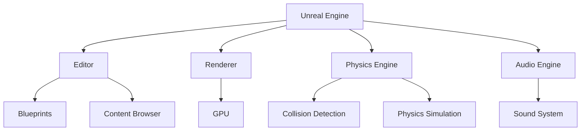
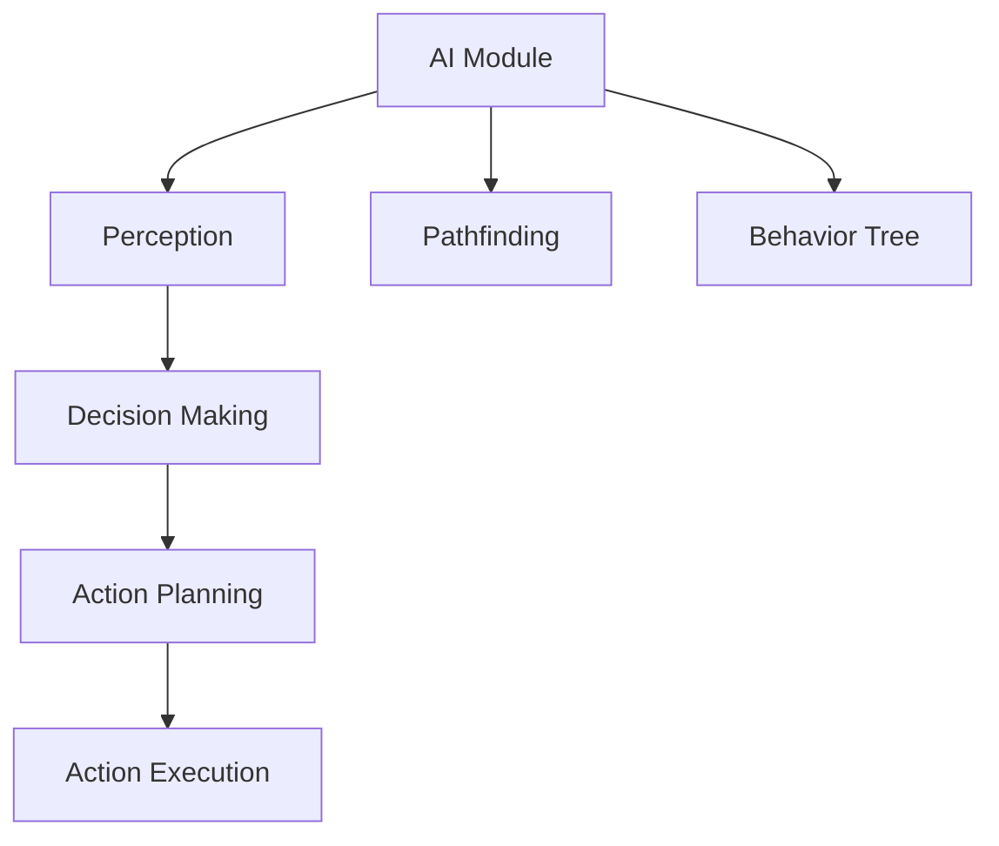
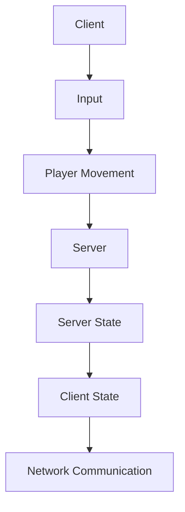

                 

### 《Unreal Engine游戏引擎开发入门》

#### 关键词：
- Unreal Engine
- 游戏开发
- 3D模型
- 动画
- 材质
- 光照
- 粒子系统
- 物理系统
- AI
- 网络同步
- 性能优化

> **摘要：**
本文旨在为初学者提供一份全面的Unreal Engine游戏引擎开发入门指南。通过系统的讲解和实战案例，我们将深入探讨Unreal Engine的基础知识、高级应用以及性能优化等关键领域，帮助读者从零开始，逐步掌握游戏引擎开发的技能。文章涵盖了从项目创建到游戏测试与发布的全过程，是游戏开发爱好者和专业人士的不二之选。

## 第一部分：Unreal Engine基础知识

### 目录大纲

## 第一部分：Unreal Engine基础知识

### 第1章：Unreal Engine概述

#### 1.1 Unreal Engine的发展历程
#### 1.2 Unreal Engine的核心特性
#### 1.3 Unreal Engine的应用场景

### 第2章：Unreal Engine基础设置

#### 2.1 Unreal Engine的安装与环境配置
#### 2.2 项目创建与编辑器界面
#### 2.3 常用工具与面板介绍

### 第3章：基本3D模型与动画

#### 3.1 3D模型的基本概念
#### 3.2 导入与处理3D模型
#### 3.3 动画的基础知识与实现

### 第4章：材质与光照

#### 4.1 材质的基本概念
#### 4.2 创建与编辑材质
#### 4.3 光照的基本原理与设置

### 第5章：粒子系统与特效

#### 5.1 粒子系统概述
#### 5.2 创建与编辑粒子系统
#### 5.3 常见特效的实现与优化

### 第1章：Unreal Engine概述

#### 1.1 Unreal Engine的发展历程

Unreal Engine是一款由Epic Games开发和维护的高级游戏引擎，它的首个版本——Unreal Engine 1于1998年发布。从那时起，Unreal Engine经历了多个版本的迭代，每个版本都带来了革命性的技术革新和功能增强。以下是其主要的发展历程：

- **Unreal Engine 1**（1998年）：这是Unreal Engine的诞生之作，主要用于开发第一人称射击游戏《异形战士》（Alien Versus Predator）。它引入了实时渲染、细节纹理和复杂动画等关键技术。

- **Unreal Engine 2**（2003年）：随着版本升级，Unreal Engine 2带来了更好的物理引擎、更丰富的光照效果和更高效的渲染技术。这一版本广泛应用于《战争机器》（Gears of War）等知名游戏。

- **Unreal Engine 3**（2008年）：这一版本引入了高级物理模拟、AI系统和网络同步技术，使得游戏开发变得更加高效。它广泛应用于《侠盗猎车手：圣安地列斯》（Grand Theft Auto: San Andreas）和《战地：现代战争》（Call of Duty: Modern Warfare）等经典游戏。

- **Unreal Engine 4**（2014年）：这一版本的发布标志着Unreal Engine进入了一个全新的时代。它引入了实时光线追踪、动态全局光照和虚拟现实（VR）支持等功能。UE4的广泛应用包括《堡垒之夜》（Fortnite）和《无尽之剑：西格玛》（Infinity Blade: X）等。

- **Unreal Engine 5**（2020年）：最新版本的Unreal Engine带来了前所未有的视觉效果和性能提升。它引入了Nanite虚拟微细节技术、Lumen实时全局光照系统和虚拟现实交互功能，为游戏开发带来了无限可能。

#### 1.2 Unreal Engine的核心特性

Unreal Engine之所以成为游戏开发领域的事实标准，离不开其卓越的核心特性：

- **高性能渲染引擎**：Unreal Engine 5采用了最新的渲染技术，包括实时光线追踪、动态全局光照和虚拟现实交互等，使得游戏场景更加逼真。

- **全面的物理引擎**：Unreal Engine的物理引擎支持刚体、软体、流体和粒子等不同类型的物理效果，可以实现高度真实的交互和动画。

- **强大的AI系统**：Unreal Engine提供了丰富的AI工具和框架，包括行为树、黑盒AI和神经网络等，可以轻松实现复杂的行为逻辑和角色控制。

- **跨平台支持**：Unreal Engine支持多种主流平台，包括Windows、Mac、Linux、iOS和Android等，使得游戏可以轻松发布到各种设备。

- **丰富的社区资源**：Unreal Engine拥有庞大的开发者社区，提供了大量的教程、文档、开源项目和商业资源，为开发者提供全方位的支持。

#### 1.3 Unreal Engine的应用场景

Unreal Engine在游戏开发中有着广泛的应用，以下是一些典型的应用场景：

- **大型多人在线游戏**：Unreal Engine的高性能渲染和物理引擎使得它成为开发大型多人在线游戏（MMO）的理想选择。例如，《堡垒之夜》和《无尽之剑：西格玛》都是基于Unreal Engine 4和Unreal Engine 5开发的。

- **虚拟现实应用**：Unreal Engine 5的实时光线追踪和虚拟现实交互功能为虚拟现实（VR）应用提供了强大的支持。例如，《节奏世界》（Beat Saber）和《半衰期：爱莉克斯》（Half-Life: Alyx）都是基于Unreal Engine 5开发的VR游戏。

- **建筑可视化**：Unreal Engine的实时渲染功能可以快速创建和预览建筑模型，使得建筑可视化变得更加高效。许多建筑师和设计师选择使用Unreal Engine来展示他们的设计方案。

- **教育模拟**：Unreal Engine可以用于开发教育模拟软件，用于教学和实践。例如，《星际探险家》（Starsector）是一款基于Unreal Engine的教学模拟游戏，用于教授太空探索和船舰设计。

### 总结

Unreal Engine是一款功能强大、易于使用的游戏引擎，它为游戏开发提供了丰富的工具和资源。通过本文的概述，我们了解了Unreal Engine的发展历程、核心特性和应用场景。接下来，我们将深入探讨Unreal Engine的基础设置，帮助读者开始他们的游戏开发之旅。

---

### 第2章：Unreal Engine基础设置

#### 2.1 Unreal Engine的安装与环境配置

要在计算机上安装和配置Unreal Engine，需要遵循以下步骤：

1. **下载Unreal Engine安装程序**：访问Epic Games的官方网站[Unreal Engine下载页面](https://www.unrealengine.com/zh-CN/download)，选择适合您的操作系统（Windows、macOS或Linux）的安装包进行下载。

2. **运行安装程序**：双击下载的安装程序文件，根据提示完成安装过程。在安装过程中，您可以自定义安装路径和其他设置。

3. **配置Epic Games账户**：安装完成后，首次启动Unreal Engine编辑器时，您需要创建或登录Epic Games账户。如果您没有账户，可以点击“创建账户”按钮，按照提示完成注册。

4. **安装必要的插件和模块**：Unreal Engine提供了大量的插件和模块，用于扩展其功能。您可以在“编辑器设置”中的“插件”选项卡中查看和安装这些插件。例如，如果您想要开发VR游戏，可以安装“Unreal VR”插件。

#### 2.2 项目创建与编辑器界面

创建一个新项目是开始游戏开发的第一步。以下是创建项目的步骤：

1. **启动编辑器**：双击桌面上的Unreal Engine快捷方式，启动编辑器。

2. **创建新项目**：在编辑器界面中，点击“文件”菜单，选择“新建项目”。在弹出的“新建项目”窗口中，选择合适的模板（例如“3D游戏”或“VR游戏”），然后设置项目名称和存储路径。

3. **配置项目设置**：在创建新项目的过程中，您需要配置一些基础设置，如项目名称、项目类型、目标平台和开发语言等。

4. **启动编辑器**：完成项目设置后，点击“创建”按钮，编辑器将加载新创建的项目。此时，您可以在编辑器界面中开始开发。

#### 2.3 常用工具与面板介绍

Unreal Engine编辑器提供了丰富的工具和面板，帮助开发者高效地进行游戏开发。以下是编辑器中一些常用的工具和面板：

- **场景编辑器**：场景编辑器是编辑器的主要界面，用于创建和编辑游戏世界。您可以使用工具栏中的工具进行选择、移动、缩放和旋转等操作。

- **内容浏览器**：内容浏览器用于浏览和管理项目中的所有资源，如3D模型、动画、材质和声音等。您可以在内容浏览器中导入、预览和编辑资源。

- **蓝图编辑器**：蓝图编辑器是一种可视化编程工具，用于创建和编辑游戏逻辑。通过拖放节点和连接线，您可以构建复杂的逻辑和行为。

- **世界大纲**：世界大纲是编辑器中用于组织和管理场景中的对象和组件的面板。您可以在世界大纲中查看和编辑对象的属性和行为。

- **细节面板**：细节面板用于显示和编辑当前选中的对象或组件的属性。您可以通过细节面板来调整对象的参数和设置。

- **工具栏**：工具栏位于编辑器的顶部，提供了常用的工具和功能按钮，如新建、打开、保存、预览等。

- **输出面板**：输出面板显示编辑器的日志和错误信息。在开发过程中，输出面板对于调试和诊断问题非常有用。

通过以上介绍，读者应该对Unreal Engine的基础设置有了初步了解。在接下来的章节中，我们将深入探讨3D模型与动画、材质与光照等基础知识，帮助读者逐步掌握游戏引擎开发的技能。

### 第3章：基本3D模型与动画

#### 3.1 3D模型的基本概念

3D模型是游戏开发中不可或缺的组成部分，它用于创建游戏世界中的物体和环境。一个3D模型通常包括几何形状、材质、纹理和动画等元素。以下是3D模型的基本概念：

- **几何形状**：3D模型的几何形状决定了模型的外观和形状。常见的几何形状有立方体、圆柱体、球体和多面体等。

- **材质**：材质用于定义3D模型的外观和质感。材质可以包括颜色、光泽度、透明度等属性。

- **纹理**：纹理是贴在3D模型表面上的图像，用于增强模型的真实感。常见的纹理类型有漫反射纹理、法线纹理和镜面纹理等。

- **动画**：动画是3D模型的运动和变化。通过动画，可以使模型表现出不同的动作和姿态，如行走、跑步、跳跃等。

#### 3.2 导入与处理3D模型

在Unreal Engine中导入和处理3D模型是游戏开发的基本技能。以下是导入和处理3D模型的步骤：

1. **导入3D模型**：
   - 在内容浏览器中，右键点击“内容”文件夹，选择“导入”。
   - 在弹出的“导入文件”窗口中，选择要导入的3D模型文件（常见格式有OBJ、PLY、FBX等）。
   - 设置导入选项，如名称、文件夹和命名规则等。
   - 点击“导入”按钮，3D模型将导入到项目中。

2. **处理3D模型**：
   - 在内容浏览器中，找到导入的3D模型，双击打开。
   - 在场景编辑器中，选择3D模型，可以在细节面板中调整其属性，如位置、旋转和缩放等。
   - 如果需要，可以添加和调整材质和纹理。
   - 对于复杂的模型，可以使用编辑器中的工具对模型进行优化，如合并网格、减少多边形数量等。

#### 3.3 动画的基础知识与实现

动画是游戏开发中的重要组成部分，它可以让游戏角色和物体表现出丰富的动作和表情。以下是动画的基础知识与实现方法：

1. **基础知识**：
   - **关键帧**：关键帧是动画中的重要时间点，用于定义模型在特定时间点的位置、形状和属性。通过关键帧，可以创建出平滑的动画效果。
   - **动画曲线**：动画曲线用于描述模型在动画过程中的变化。通过调整动画曲线的形状，可以控制模型的运动速度、加速度和姿态变化。

2. **实现方法**：
   - **创建动画**：在Unreal Engine中，可以使用动画蓝图或动画编辑器来创建动画。
     - **动画蓝图**：使用蓝图编辑器创建动画逻辑，通过拖放节点和连接线来定义动画的行为和流程。
     - **动画编辑器**：在动画编辑器中，可以直接编辑动画的关键帧和曲线，调整动画的细节和表现。

   - **设置动画**：将创建好的动画设置到模型上，使其具备动画效果。
     - 在场景编辑器中，选择模型，在细节面板中找到“动画”选项。
     - 在动画列表中，选择要应用的动画，然后点击“设置”按钮。
     - 在弹出的“设置动画”窗口中，选择动画的播放模式（例如循环、播放一次等）。

   - **动画控制器**：动画控制器用于管理模型的不同动画。通过动画控制器，可以切换和组合动画，实现更复杂的动画效果。

   - **动画混合**：动画混合是一种将多个动画组合在一起的技术，用于创建平滑的过渡效果。通过动画混合，可以使模型在不同的动画之间切换时，保持流畅的动作。

### 实例讲解

以下是一个简单的动画实例，展示如何创建和设置动画：

1. **创建动画**：
   - 在内容浏览器中，右键点击“动画”文件夹，选择“新建动画”。
   - 在弹出的“新建动画”窗口中，输入动画名称，如“Walk Animation”。
   - 点击“创建”按钮，创建一个新动画。

2. **添加关键帧**：
   - 在动画编辑器中，找到“位置”和“旋转”关键帧。
   - 在时间轴上拖动时间指针到合适的位置，添加关键帧。
   - 设置关键帧的时间点和值，定义模型在不同时间点的位置和旋转。

3. **调整动画曲线**：
   - 在动画编辑器中，选择要调整的关键帧，可以调整其形状和参数，以控制动画的速度和加速度。

4. **设置动画**：
   - 在场景编辑器中，选择要应用动画的模型。
   - 在细节面板中，找到“动画”选项，选择“Walk Animation”。
   - 在播放模式中选择“循环”，使动画无限循环。

通过以上步骤，您已经成功创建了一个简单的行走动画。接下来，您可以进一步优化动画，添加更多的关键帧和细节，使其更加自然和流畅。

通过本章的学习，读者应该对3D模型和动画的基础知识有了深入了解。在接下来的章节中，我们将继续探讨材质与光照、粒子系统与特效等基础知识，帮助读者逐步掌握游戏引擎开发的技能。

### 第4章：材质与光照

#### 4.1 材质的基本概念

材质是3D模型外观的抽象表示，它决定了模型的颜色、纹理、反射、透明度等视觉属性。在Unreal Engine中，材质是构成游戏场景的关键元素之一。以下是材质的基本概念：

- **基础材质**：基础材质是最简单的材质类型，用于定义模型的颜色和纹理。它通常包含漫反射颜色、光泽度、透明度等基本属性。

- **复合材质**：复合材质是由多个基础材质组合而成的，可以创建更复杂的视觉效果。复合材质可以包含遮罩、混合、光照等效果。

- **贴图**：贴图是用于覆盖在3D模型表面的图像，用于增强模型的真实感。常见的贴图类型有漫反射贴图、法线贴图、高光贴图等。

- **材质参数**：材质参数是用于调整材质属性的可配置参数。例如，漫反射颜色、光泽度、透明度等。

#### 4.2 创建与编辑材质

在Unreal Engine中，创建和编辑材质是游戏开发的基础技能。以下是创建和编辑材质的步骤：

1. **创建材质**：
   - 在内容浏览器中，右键点击“材质”文件夹，选择“新建材质”。
   - 在弹出的“新建材质”窗口中，输入材质名称，选择材质的类型（例如基础材质或复合材质）。
   - 点击“创建”按钮，创建一个新材质。

2. **编辑材质**：
   - 在内容浏览器中，找到创建的材质，双击打开。
   - 在材质编辑器中，可以调整材质的参数，如漫反射颜色、光泽度、透明度等。
   - 可以添加和编辑贴图，为材质添加细节和真实感。

3. **应用材质**：
   - 在场景编辑器中，选择要应用材质的3D模型。
   - 在细节面板中，找到“材质”选项，选择要应用的材质。

#### 4.3 光照的基本原理与设置

光照是游戏场景的关键元素，它决定了场景的视觉效果和氛围。以下是光照的基本原理和设置方法：

1. **光照的基本原理**：
   - **光源**：光源是发光的物体，用于照亮场景中的物体。常见的光源有点光源、方向光源和聚光灯等。
   - **光照类型**：光照类型决定了光照对物体的作用方式。常见的光照类型有漫反射光、镜面光、阴影等。
   - **光照强度**：光照强度决定了光照的亮度。较高的光照强度会使场景更明亮，较低的光照强度则使场景更暗淡。

2. **设置光照**：
   - **添加光源**：在场景编辑器中，右键点击场景，选择“添加新对象”，然后选择要添加的光源类型（例如点光源或方向光源）。
   - **调整光源属性**：在细节面板中，可以调整光源的属性，如位置、方向、光照强度和颜色等。
   - **设置阴影**：在细节面板中，可以启用或禁用阴影，并调整阴影的参数，如阴影质量、范围和颜色等。

通过以上步骤，您可以创建和编辑材质，并设置光照来增强游戏场景的视觉效果。在接下来的章节中，我们将继续探讨粒子系统与特效等基础知识，帮助读者逐步掌握游戏引擎开发的技能。

### 第5章：粒子系统与特效

#### 5.1 粒子系统概述

粒子系统是Unreal Engine中用于创建动态效果和视觉特效的重要工具。它通过生成和模拟大量的小型物体（称为粒子），可以创造出丰富的视觉效果，如火焰、烟雾、雨滴、爆炸等。以下是粒子系统的一些关键概念：

- **粒子**：粒子是粒子系统的基本单位，每个粒子都具有位置、大小、颜色、速度等属性。粒子通常在场景中随机生成，并按照预定的规则进行运动和变化。

- **粒子发射器**：粒子发射器是粒子系统的核心组件，用于控制粒子的生成位置、速度、发射方向等属性。通过调整发射器的参数，可以控制粒子系统的行为和效果。

- **粒子材质**：粒子材质是用于定义粒子外观的材质。它可以包含颜色、纹理、发光效果等属性，通过调整粒子材质，可以改变粒子的视觉表现。

- **粒子模拟**：粒子模拟是粒子系统的计算过程，用于生成和更新粒子的状态。粒子模拟可以实时进行，也可以预先计算，以便在游戏运行时使用。

#### 5.2 创建与编辑粒子系统

在Unreal Engine中创建和编辑粒子系统是游戏开发中的基本技能。以下是创建和编辑粒子系统的步骤：

1. **创建粒子系统**：
   - 在场景编辑器中，右键点击场景，选择“添加新对象”，然后选择“粒子系统”。
   - 在细节面板中，为粒子系统设置基本参数，如发射速率、寿命、大小等。

2. **编辑粒子系统**：
   - 在内容浏览器中，找到创建的粒子系统，双击打开。
   - 在粒子系统编辑器中，可以调整粒子的属性，如位置、速度、颜色等。
   - 可以添加和编辑粒子材质，为粒子添加纹理、发光效果等。

3. **应用粒子系统**：
   - 在场景编辑器中，选择要应用粒子系统的物体或场景。
   - 在细节面板中，为该物体或场景添加粒子系统组件。

#### 5.3 常见特效的实现与优化

粒子系统可以用于实现各种常见特效，如火焰、烟雾、雨滴、爆炸等。以下是这些特效的实现方法和优化技巧：

1. **火焰特效**：
   - **实现方法**：
     - 创建一个粒子系统，设置粒子发射器为圆形或球形。
     - 调整粒子的颜色和纹理，使用发光效果来模拟火焰的颜色。
     - 设置粒子的速度和加速度，使粒子在场景中随机运动，模拟火焰的波动。
   - **优化技巧**：
     - 减少粒子数量，降低渲染负担。
     - 使用低分辨率纹理，减少纹理的渲染开销。
     - 使用粒子实例，将多个粒子合并为一个渲染对象，提高渲染效率。

2. **烟雾特效**：
   - **实现方法**：
     - 创建一个粒子系统，设置粒子发射器为线形或面形。
     - 使用雾效贴图作为粒子纹理，模拟烟雾的颜色和质感。
     - 设置粒子的速度和加速度，使粒子在场景中随机飘动。
   - **优化技巧**：
     - 调整粒子发射速率和寿命，使烟雾效果更加自然。
     - 使用粒子混合模式，如“叠加”或“颜色加深”，增强烟雾的视觉效果。
     - 减少粒子数量，降低渲染负担。

3. **雨滴特效**：
   - **实现方法**：
     - 创建一个粒子系统，设置粒子发射器为点形。
     - 使用透明纹理作为粒子纹理，模拟雨滴的形状和透明度。
     - 设置粒子的速度和加速度，使粒子垂直下落，模拟雨滴的流动。
   - **优化技巧**：
     - 调整粒子发射速率和寿命，使雨滴效果更加自然。
     - 使用粒子发射器模拟雨滴的起始位置和方向。
     - 减少粒子数量，降低渲染负担。

4. **爆炸特效**：
   - **实现方法**：
     - 创建一个粒子系统，设置粒子发射器为点形或球形。
     - 使用爆炸纹理作为粒子纹理，模拟爆炸的火焰和冲击波。
     - 设置粒子的速度和加速度，使粒子在场景中快速飞散。
   - **优化技巧**：
     - 调整粒子发射速率和寿命，使爆炸效果更加震撼。
     - 使用粒子混合模式，如“色彩发光”或“亮度”，增强爆炸的视觉效果。
     - 减少粒子数量，降低渲染负担。

通过本章的学习，读者应该对粒子系统与特效的实现方法和优化技巧有了深入了解。在接下来的章节中，我们将继续探讨物理系统与碰撞检测、AI与行为树等高级应用，帮助读者逐步掌握游戏引擎开发的技能。

### 第6章：物理系统与碰撞检测

#### 6.1 物理系统的基础知识

物理系统是游戏引擎的核心组成部分之一，它用于模拟现实世界中的物理现象，如物体间的碰撞、运动和变形等。在Unreal Engine中，物理系统提供了丰富的工具和功能，帮助开发者实现高度真实的物理效果。以下是物理系统的基础知识：

- **刚体**：刚体是具有固定形状和大小的物体，它不发生形变。在物理系统中，刚体可以通过碰撞检测和运动计算来模拟真实世界的运动。例如，一个刚体可以模拟为一个跌落的苹果或一个碰撞的汽车。

- **软体**：软体是具有变形能力的物体，它在受到外力作用时会发生形变。软体的运动和变形是通过物理模拟来实现的。例如，一个软体可以模拟为一个弹跳的气球或一个变形的橡皮筋。

- **流体**：流体是具有流动特性的物体，它在物理系统中通过模拟流体的运动来产生水流、烟雾等效果。流体模拟通常用于创造真实的自然现象和视觉效果。

- **碰撞检测**：碰撞检测是物理系统的重要组成部分，用于检测物体间的碰撞。通过碰撞检测，游戏引擎可以实时计算物体间的碰撞效果，如反弹、穿透和变形等。

#### 6.2 碰撞检测的实现与优化

碰撞检测是物理系统中的关键步骤，它决定了物体间的交互和运动效果。在Unreal Engine中，碰撞检测提供了高效的实现方法，以下是碰撞检测的基本实现方法和优化技巧：

1. **基本实现方法**：
   - **创建刚体组件**：在Unreal Engine中，每个刚体都需要一个刚体组件。通过将刚体组件添加到对象上，可以使其具备物理属性。
   - **设置刚体属性**：在细节面板中，可以设置刚体的质量、惯性张量、碰撞半径等属性。这些属性决定了刚体的运动和碰撞行为。
   - **启用碰撞检测**：在场景编辑器中，选择要启用碰撞检测的对象，在细节面板中启用“碰撞检测”选项。

2. **优化技巧**：
   - **空间分割**：空间分割是一种优化碰撞检测的方法，通过将场景分割为多个区域，可以减少碰撞检测的计算量。常见的空间分割技术有八叉树和四面体划分。
   - **延迟碰撞检测**：延迟碰撞检测是一种在游戏运行过程中延迟碰撞检测的方法，通过在对象移动或更新后进行碰撞检测，可以减少计算开销。
   - **优化碰撞体形状**：通过优化碰撞体的形状和大小，可以减少碰撞检测的计算量。例如，使用简单的几何形状（如球体或立方体）代替复杂的模型。
   - **禁用不必要的碰撞检测**：在某些情况下，可以禁用一些不必要的碰撞检测，以减少计算负担。例如，如果两个物体之间没有物理交互，可以禁用它们之间的碰撞检测。

#### 6.3 交互式物理场景的实现

交互式物理场景是游戏开发中的重要部分，它允许玩家与游戏世界中的物体进行互动。以下是交互式物理场景的实现方法和示例：

1. **实现方法**：
   - **玩家控制**：通过键盘、游戏手柄或其他输入设备，实现玩家的移动、跳跃和交互操作。
   - **碰撞检测**：在场景编辑器中，设置玩家角色和其他对象之间的碰撞检测，以实现物理交互。
   - **物理响应**：当玩家角色与其他对象发生碰撞时，根据物理系统的规则，实现相应的物理响应，如反弹、穿透或变形。

2. **示例**：
   - **跳跃**：当玩家按下跳跃键时，通过计算玩家的速度和重力，实现跳跃效果。
   - **推力**：当玩家与一个物体发生碰撞时，可以施加一个推力，使物体产生移动。
   - **碰撞伤害**：当玩家与敌对物体发生碰撞时，可以计算碰撞伤害，影响玩家的生命值。

通过本章的学习，读者应该对物理系统和碰撞检测的基础知识有了深入理解，并掌握了实现交互式物理场景的方法。在接下来的章节中，我们将继续探讨AI与行为树等高级应用，帮助读者逐步掌握游戏引擎开发的技能。

### 第7章：AI与行为树

#### 7.1 AI在游戏开发中的应用

人工智能（AI）是游戏开发中的重要技术，它使游戏角色能够表现出更智能的行为和交互。以下是AI在游戏开发中的主要应用：

- **导航网格**：导航网格是AI用于路径规划和导航的数据结构，通过它，AI角色可以在复杂的地图中找到最短的路径。例如，在《侠盗猎车手》系列游戏中，角色的路径规划依赖于导航网格。

- **行为树**：行为树是一种用于定义AI行为的图形化工具，它通过一系列条件和动作来构建复杂的决策逻辑。例如，在《星际争霸》系列游戏中，AI使用行为树来控制单位的行为和战斗策略。

- **黑盒AI**：黑盒AI是一种不需要了解内部逻辑的AI系统，它通过输入和输出数据来训练模型。例如，在《双人成行》游戏中，AI通过黑盒AI学习玩家的行为模式，并做出相应的反应。

- **神经网络**：神经网络是一种用于模拟人类大脑的算法，它通过多层神经元进行数据传递和处理。例如，在《Minecraft》游戏中，AI神经网络用于模拟游戏世界的动态变化和玩家行为。

#### 7.2 行为树的基本概念

行为树是一种用于构建和表示AI决策逻辑的图形化工具。以下是行为树的基本概念：

- **节点**：行为树的基本组成单元是节点，每个节点代表一个行为或决策。常见的节点类型有条件节点、动作节点、组合节点和并行节点等。

- **条件节点**：条件节点用于根据特定条件决定是否执行某个动作。例如，如果玩家距离敌人过近，则条件节点会返回真，否则返回假。

- **动作节点**：动作节点代表一个具体的操作，如移动到某个位置、攻击敌人等。

- **组合节点**：组合节点用于组合多个子节点，以实现更复杂的决策逻辑。常见的组合节点有“序列”（按照顺序执行子节点）和“选择”（随机执行子节点）等。

- **并行节点**：并行节点用于同时执行多个子节点，每个子节点可以独立运行。例如，在战斗中，AI角色可以同时进行攻击、防御和移动。

- **执行路径**：行为树的执行路径是指AI角色在运行行为树时，从根节点到叶子节点所经过的路径。执行路径决定了AI角色的行为和决策。

#### 7.3 使用行为树实现复杂AI

使用行为树可以轻松实现复杂AI行为，以下是使用行为树实现复杂AI的步骤：

1. **设计行为树**：
   - **定义目标**：明确AI角色的目标，如寻找敌人、攻击敌人、撤退等。
   - **确定行为**：根据目标，确定AI角色需要执行的行为，如移动、攻击、躲避等。
   - **构建树结构**：使用组合节点和条件节点构建行为树，定义AI角色的决策逻辑。

2. **实现行为树**：
   - **添加节点**：在行为树编辑器中，根据设计，添加条件节点、动作节点和组合节点。
   - **设置参数**：为每个节点设置参数，如条件表达式的值、动作节点的目标位置等。
   - **连接节点**：通过连接线将条件节点和动作节点连接起来，定义行为树的执行路径。

3. **测试与优化**：
   - **运行行为树**：在场景编辑器中，运行行为树，观察AI角色的行为是否符合预期。
   - **调试与修正**：根据测试结果，调试和修正行为树，确保AI行为准确无误。

通过以上步骤，您可以使用行为树实现复杂的AI行为。接下来，我们将继续探讨网络同步与多人游戏等高级应用，帮助读者逐步掌握游戏引擎开发的技能。

### 第8章：网络同步与多人游戏

#### 8.1 网络同步的基本原理

网络同步是多人游戏开发中的关键技术，它确保了在不同客户端上运行的玩家看到的是一致的游戏状态。以下是网络同步的基本原理：

- **状态同步**：状态同步是指将游戏中的状态信息（如角色位置、健康值、武器状态等）实时传输到所有客户端。通过状态同步，确保所有玩家看到的是一致的游戏状态。

- **数据传输**：数据传输是指通过网络将状态信息从服务器传输到客户端。常见的传输方式有客户端-服务器（Client-Server）模式和游戏环（Game Loop）模式。

- **时间戳**：时间戳是一种标记事件发生顺序的机制。在网络同步中，时间戳用于确保事件按正确的顺序在客户端上执行。例如，如果一个玩家在服务器上进行了攻击，服务器会为该事件分配一个时间戳，并确保在所有客户端上按时间戳顺序执行。

- **网络延迟**：网络延迟是指数据在网络中传输所需的时间。网络延迟会导致客户端上的游戏状态与服务器上的状态不一致。为了解决网络延迟问题，可以使用预测、回滚和补偿等技术。

#### 8.2 多人游戏架构

多人游戏架构是确保多人游戏稳定性和可扩展性的关键。以下是常见的多人游戏架构：

- **客户端-服务器架构**：客户端-服务器架构是一种最常见的多人游戏架构，它将游戏逻辑分为客户端和服务器两部分。客户端负责渲染和处理输入，服务器负责处理游戏逻辑和状态同步。

- **去中心化架构**：去中心化架构是一种将游戏逻辑分散到多个服务器上的架构。这种架构可以提供更高的可扩展性和容错能力。在去中心化架构中，每个服务器负责一部分游戏逻辑和状态同步。

- **游戏环架构**：游戏环架构是一种将游戏逻辑分布在多个客户端之间的架构。在游戏环架构中，每个客户端不仅负责渲染和处理输入，还负责处理部分游戏逻辑和状态同步。

#### 8.3 网络通信与数据同步

网络通信和数据同步是实现多人游戏的关键步骤。以下是网络通信与数据同步的方法：

1. **网络通信**：
   - **传输协议**：网络通信使用传输协议（如TCP或UDP）来确保数据在网络中可靠传输。TCP提供可靠的传输，但可能引入较高的延迟，而UDP提供快速的传输，但可能丢失数据。
   - **数据包**：网络通信通过数据包（如UDP数据包或TCP数据包）来传输数据。数据包包含数据的内容和相关的控制信息。

2. **数据同步**：
   - **状态同步**：状态同步是指将游戏状态（如角色位置、健康值、武器状态等）实时传输到所有客户端。状态同步可以分为全同步（所有状态信息都传输到客户端）和部分同步（只传输必要的状态信息）。
   - **事件同步**：事件同步是指将游戏中的事件（如攻击、死亡、聊天等）实时传输到所有客户端。事件同步可以确保所有玩家看到一致的游戏事件。

3. **同步策略**：
   - **预测**：预测是一种在客户端上预测服务器上即将发生的事件的方法。通过预测，可以减少客户端和服务器之间的延迟。
   - **回滚**：回滚是一种在客户端上撤销已执行操作的方法。当服务器上的状态与客户端上的状态不一致时，可以通过回滚将客户端状态恢复到服务器上的状态。
   - **补偿**：补偿是一种在客户端上执行额外操作的方法。当服务器上的状态与客户端上的状态不一致时，可以通过补偿来纠正客户端状态。

通过以上方法，可以确保多人游戏中的网络通信和数据同步，实现稳定和流畅的游戏体验。

### 第9章：游戏性能优化

#### 9.1 性能分析工具的使用

游戏性能优化是确保游戏在多种硬件平台上稳定运行的关键步骤。性能分析工具可以帮助开发者识别和解决性能瓶颈。以下是常用的性能分析工具及其使用方法：

1. **Unreal Engine Profiler**：
   - **功能**：Unreal Engine Profiler是内置的性能分析工具，用于监控和优化游戏性能。
   - **使用方法**：
     - 启动Profiler：在编辑器中，选择“视图”菜单，然后选择“Profiler”。
     - 设置捕获范围：在Profiler窗口中，选择要捕获的性能数据，如CPU、GPU和内存使用情况。
     - 分析数据：在Profiler窗口中，查看和分析了捕获的性能数据，识别性能瓶颈。

2. **Visual Studio**：
   - **功能**：Visual Studio是一款强大的开发环境，内置了性能分析工具。
   - **使用方法**：
     - 启动分析器：在Visual Studio中，选择“调试”菜单，然后选择“性能分析”。
     - 选择配置：在性能分析器中，选择要分析的配置（如Debug或Release）。
     - 分析数据：运行游戏，然后分析捕获的性能数据，识别性能瓶颈。

3. **Third-Party Tools**：
   - **功能**：Third-Party Tools是第三方性能分析工具，如GPU-profiler、Frames Per Second (FPS) Counter等。
   - **使用方法**：
     - 安装工具：从官方网站下载并安装Third-Party Tools。
     - 配置工具：根据工具的文档配置工具，以捕获和显示性能数据。
     - 分析数据：运行游戏，并使用Third-Party Tools分析捕获的性能数据。

#### 9.2 游戏性能优化策略

游戏性能优化需要从多个方面进行，以下是一些常见的优化策略：

1. **降低多边形数量**：
   - **优化模型**：通过简化模型、合并网格和减少细节，可以降低多边形数量。
   - **LOD技术**：使用Level of Detail（LOD）技术，在不同距离下显示不同复杂度的模型，以减少计算开销。

2. **纹理优化**：
   - **纹理压缩**：使用纹理压缩技术，如DXT或ETC，可以减少纹理的存储和渲染开销。
   - **纹理贴图**：使用多级贴图（Mipmap）技术，可以优化纹理的渲染性能。

3. **光照优化**：
   - **动态光照**：使用动态光照技术，如光线追踪和体积光照，可以创建更真实的光照效果。
   - **光照缓存**：使用光照缓存技术，可以减少动态光照的计算开销。

4. **碰撞检测**：
   - **空间分割**：使用空间分割技术，如八叉树和四面体划分，可以优化碰撞检测的计算效率。
   - **简化碰撞体**：使用简单的几何形状（如球体或立方体）作为碰撞体，可以降低碰撞检测的计算量。

5. **物理模拟**：
   - **物理优化**：优化物理模拟的参数，如刚体质量、碰撞体形状等，可以降低物理模拟的计算开销。
   - **延迟物理计算**：在游戏运行过程中，延迟物理计算，以降低游戏运行时的CPU负担。

6. **内存管理**：
   - **对象池**：使用对象池技术，可以减少对象的创建和销毁开销。
   - **内存优化**：优化内存使用，如减少内存分配、释放和复制等操作，可以降低内存开销。

#### 9.3 常见性能瓶颈分析及解决方案

在游戏开发过程中，常见的性能瓶颈包括CPU负载、GPU负载和内存使用等。以下是常见性能瓶颈的分析及解决方案：

1. **CPU负载过高**：
   - **瓶颈分析**：CPU负载过高可能由于复杂的逻辑计算、频繁的碰撞检测和物理模拟等引起。
   - **解决方案**：优化逻辑计算，减少碰撞检测的频率，使用延迟物理计算等技术。

2. **GPU负载过高**：
   - **瓶颈分析**：GPU负载过高可能由于复杂的光照计算、大量的粒子系统或高分辨率的纹理等引起。
   - **解决方案**：优化光照计算，减少粒子系统数量，使用纹理压缩和LOD技术。

3. **内存使用过高**：
   - **瓶颈分析**：内存使用过高可能由于大量的对象创建、内存泄漏或不必要的内存分配等引起。
   - **解决方案**：优化对象池技术，减少内存分配和复制操作，使用内存优化工具。

通过以上性能分析工具和优化策略，开发者可以有效地识别和解决游戏性能瓶颈，提高游戏的稳定性和流畅度。在接下来的章节中，我们将继续探讨项目实战和附录部分，为读者提供更全面的游戏开发指南。

### 第10章：项目实战

#### 10.1 项目实战概述

通过前面的章节，我们学习了Unreal Engine的基础知识和高级应用。现在，是时候将这些知识付诸实践，通过一个实际项目来巩固和提升我们的技能。本节将介绍一个简单的游戏项目，从开发环境搭建、项目配置、游戏开发流程与技巧，到游戏测试与发布，全面展示游戏开发的全过程。

#### 10.2 开发环境搭建与项目配置

1. **开发环境搭建**：
   - **安装Unreal Engine**：首先，确保您已经正确安装了Unreal Engine。按照第二章中的安装步骤进行，如果您是第一次使用，可以下载并安装最新版本。
   - **安装必要的插件和模块**：根据项目的需求，安装必要的插件和模块。例如，如果您计划开发VR游戏，可以安装“Unreal VR”插件。

2. **项目配置**：
   - **创建新项目**：在Unreal Engine编辑器中，点击“文件”菜单，选择“新建项目”。选择合适的模板（如“3D游戏”或“VR游戏”），并设置项目名称和存储路径。
   - **配置项目设置**：在创建新项目的过程中，配置项目的设置，包括目标平台、开发语言和编译选项等。确保项目设置符合您的开发需求。

#### 10.3 游戏开发流程与技巧

1. **场景设计和布局**：
   - **设计场景**：设计游戏场景的布局，确定游戏世界的基本结构和元素。可以使用场景编辑器进行设计，添加环境、障碍物、角色等。
   - **布局优化**：根据游戏玩法和用户体验，优化场景布局。确保场景既美观又实用，便于玩家操作。

2. **角色和物体创建**：
   - **创建角色**：创建游戏中的主角和NPC（非玩家角色）。使用3D模型编辑工具创建角色模型，并导入到项目中。
   - **设置行为**：为角色设置行为逻辑，使用蓝图或C++编写代码。例如，为角色设置移动、跳跃、攻击等行为。

3. **游戏逻辑实现**：
   - **编写脚本**：使用蓝图或C++编写游戏逻辑脚本。蓝图是一种可视化编程工具，易于学习和使用，适用于简单和中等复杂度的游戏。
   - **AI实现**：使用行为树或其他AI框架实现角色的智能行为。例如，设置敌对角色的巡逻、攻击和逃避行为。

4. **用户界面（UI）设计**：
   - **设计UI**：设计游戏中的用户界面，包括菜单、提示、分数板等。可以使用Unreal Engine的UI工具创建和编辑UI元素。
   - **实现交互**：实现UI与游戏逻辑的交互，例如，当玩家点击按钮时触发相应的游戏行为。

5. **游戏测试与调试**：
   - **内部测试**：在开发过程中，不断进行内部测试，检查游戏的稳定性、性能和用户体验。修复发现的问题，优化游戏逻辑。
   - **用户测试**：邀请一些玩家进行测试，收集他们的反馈和建议。根据用户的反馈进行优化和改进。

#### 10.4 游戏测试与发布

1. **游戏测试**：
   - **功能测试**：测试游戏的功能是否按预期工作，包括角色行为、UI交互、场景切换等。
   - **性能测试**：测试游戏在不同硬件平台上的性能，确保游戏在多种设备上运行稳定。
   - **崩溃测试**：使用工具模拟各种异常情况，检查游戏是否能够正确处理错误和崩溃。

2. **游戏发布**：
   - **打包游戏**：在Unreal Engine编辑器中，将游戏打包为可执行文件。根据目标平台（如Windows、macOS、Android等），选择合适的打包选项。
   - **发布平台**：选择游戏发布平台，如Steam、Epic Games Store、App Store等。根据平台要求，提交游戏文件和相关的资料。
   - **发布更新**：根据用户反馈和游戏更新计划，定期发布游戏更新，修复问题并添加新功能。

通过以上步骤，您已经完成了一个简单的游戏项目。这个项目不仅帮助您巩固了Unreal Engine的知识，还为您提供了一个实践的机会，提高了游戏开发技能。在接下来的附录中，我们将提供更多资源和工具，帮助您继续提升开发能力。

### 附录A：常用Unreal Engine资源与工具

#### A.1 官方文档与教程

Unreal Engine提供了丰富的官方文档和教程，是开发者学习和使用Unreal Engine的绝佳资源。以下是官方文档和教程的一些推荐：

- **官方文档**：Epic Games官网提供的官方文档包含了Unreal Engine的所有功能和使用方法。您可以通过访问[Unreal Engine文档中心](https://docs.unrealengine.com/)获取详细信息。
- **教程视频**：Epic Games还提供了一系列的教程视频，从基础入门到高级应用，涵盖了Unreal Engine的各个方面。您可以在YouTube上搜索“Unreal Engine教程”找到这些视频。
- **官方论坛**：Unreal Engine官方论坛是一个活跃的社区，开发者可以在论坛上提问、分享经验和获取帮助。[Unreal Engine论坛](https://forums.unrealengine.com/)是开发者交流的好去处。

#### A.2 开源项目与社区

开源项目是Unreal Engine开发者的重要资源，通过开源项目，您可以学习他人的代码和经验，甚至贡献自己的代码。以下是几个推荐的Unreal Engine开源项目：

- **Unreal Engine Marketplace**：Epic Games提供的市场，您可以在这里找到大量的免费和付费资源，包括3D模型、材质、蓝图脚本等。
- **GitHub**：GitHub上有许多由Unreal Engine开发者创建的开源项目，您可以在这里找到各种示例代码、工具和插件。
- **Unreal Engine社区**：Epic Games官方社区是开发者交流和分享经验的地方，您可以在这里找到大量的教程、论坛和讨论组。

#### A.3 付费资源与培训课程

除了开源资源和免费教程，还有许多付费资源与培训课程可以帮助您更深入地学习Unreal Engine：

- **Unreal Engine培训课程**：许多在线教育和培训平台提供了专门的Unreal Engine培训课程，例如Udemy、Coursera等。这些课程通常由经验丰富的开发者授课，内容涵盖从基础到高级的各个方面。
- **专业书籍**：市面上有许多关于Unreal Engine的专业书籍，这些书籍详细讲解了Unreal Engine的各个方面，适合希望深入学习的开发者。
- **私人教练和辅导**：一些专业开发者和教练提供一对一的辅导和培训服务，可以帮助您快速掌握Unreal Engine，解决特定问题。

通过利用这些资源，您可以不断提升自己的Unreal Engine开发技能，成为一个更加熟练和专业的游戏开发者。

### 附录B：Unreal Engine Mermaid 流程图

#### B.1 Unreal Engine架构流程图



#### B.2 AI系统流程图



#### B.3 网络同步流程图



通过这些流程图，您可以更直观地理解Unreal Engine的架构、AI系统和网络同步机制。

### 附录C：核心算法与数学模型

#### C.1 物理引擎算法

物理引擎是游戏引擎的重要组成部分，它用于模拟物体在游戏世界中的运动和相互作用。以下是物理引擎中常用的算法和数学模型：

1. **碰撞检测算法**：
   - **分离轴定理（SAT）**：用于检测两个凸多面体是否相交。
   - **AABB（Axis-Aligned Bounding Boxes）**：通过轴对齐的边界框进行快速碰撞检测。
   - **OBB（Oriented Bounding Boxes）**：用于更精确的碰撞检测，通过旋转的边界框。

2. **刚体动力学**：
   - **牛顿第二定律**：\( F = m \cdot a \)，其中\( F \)是力，\( m \)是质量，\( a \)是加速度。
   - **惯性张量**：描述刚体的旋转惯性，用于计算刚体的旋转运动。

3. **软体动力学**：
   - **弹簧模型**：用于模拟软体物体的变形。
   - **有限元方法**：用于解决复杂的软体模拟问题。

#### C.2 AI算法

AI算法在游戏开发中用于模拟智能行为，以下是常用的AI算法：

1. **路径规划算法**：
   - **A*算法**：用于寻找从起点到终点的最短路径。
   - **Dijkstra算法**：用于计算图中的最短路径。
   - **贪婪算法**：用于快速找到一条近似最优的路径。

2. **行为树**：
   - **条件节点**：根据特定条件执行或跳过子节点。
   - **动作节点**：执行特定的动作。
   - **组合节点**：组合多个子节点，以实现更复杂的决策逻辑。

3. **神经网络**：
   - **前馈神经网络**：用于分类和回归问题。
   - **卷积神经网络（CNN）**：用于图像识别。
   - **递归神经网络（RNN）**：用于序列数据处理。

#### C.3 网络同步算法

网络同步是多人游戏中确保数据一致性的关键技术，以下是常用的网络同步算法：

1. **客户端-服务器模式**：
   - **状态同步**：将游戏状态从服务器发送到客户端，确保客户端状态与服务器一致。
   - **事件同步**：将游戏中的事件从服务器发送到客户端，确保客户端上的事件顺序与服务器一致。

2. **预测-回滚算法**：
   - **预测**：客户端根据收到的服务器数据预测即将发生的事件。
   - **回滚**：当预测错误时，客户端回滚到之前的状态，并重新应用服务器发送的数据。

3. **补偿算法**：
   - **补偿**：客户端在处理本地事件时，对已发送到服务器的事件进行补偿，以确保数据一致性。

通过了解这些核心算法和数学模型，您可以更好地理解和实现游戏中的物理、AI和网络同步功能。

### 附录D：项目实战源代码与解析

#### D.1 源代码结构

在一个简单的Unreal Engine项目结构中，通常包括以下文件和文件夹：

- **ProjectName.uproject**：项目配置文件，包含项目的设置和依赖项。
- **Source**：源代码文件夹，包含C++和蓝图脚本。
  - **Core**：核心功能模块。
    - **Gameplay**：游戏逻辑。
      - **Player**：玩家角色。
      - **Enemy**：敌对角色。
    - **UI**：用户界面。
  - **Runtime**：运行时模块，包含游戏的基本框架。
  - **Content**：资源文件夹，包含3D模型、动画、材质和声音等。
- **Build**：编译生成的可执行文件和库文件。
- **Config**：配置文件，包含编辑器和游戏的设置。

#### D.2 关键代码解析

以下是一个简单的玩家角色移动功能的代码示例：

```cpp
// PlayerMovement.h
#pragma once

#include "CoreMinimal.h"
#include "GameFramework/GameFramework.h"
#include "PlayerMovement.generated.h"

UCLASS()
class PLAYERGEAR_API APlayerMovement : public AActor
{
    GENERATED_BODY()

public:
    APlayerMovement();

    virtual void OnActivated() override;
    virtual void OnDeactivated() override;

    virtual void MoveForward(float Value);
    virtual void MoveRight(float Value);

protected:
    UPROPERTY(EditDefaultsOnly, Category = "Movement")
    float MovementSpeed;

    UPROPERTY(EditDefaultsOnly, Category = "Input")
    UDelegateCache InputDelegateForward;
    UPROPERTY(EditDefaultsOnly, Category = "Input")
    UDelegateCache InputDelegateRight;

private:
    float CurrentSpeed;
};

// PlayerMovement.cpp
#include "PlayerMovement.h"
#include "GameFramework/PlayerController.h"

APlayerMovement::APlayerMovement()
{
    PrimaryActorTick.bCanEverTick = true;
    CurrentSpeed = MovementSpeed;

    // Bind input functions
    InputDelegateForward.BindUFunction(this, "MoveForward");
    InputDelegateRight.BindUFunction(this, "MoveRight");
}

void APlayerMovement::OnActivated()
{
    APlayerController* PlayerController = GetWorld()->GetFirstPlayerController();
    if (PlayerController)
    {
        PlayerController->SetInputMode(FInputModeGameOnly);
        PlayerController->bShowMouseCursor = true;
    }
}

void APlayerMovement::OnDeactivated()
{
    APlayerController* PlayerController = GetWorld()->GetFirstPlayerController();
    if (PlayerController)
    {
        PlayerController->SetInputMode(FInputModeUIOnly);
        PlayerController->bShowMouseCursor = false;
    }
}

void APlayerMovement::MoveForward(float Value)
{
    if (Value != 0.0f)
    {
        AddMovementInput(GetActorForwardVector() * Value * CurrentSpeed);
    }
}

void APlayerMovement::MoveRight(float Value)
{
    if (Value != 0.0f)
    {
        AddMovementInput(GetActorRightVector() * Value * CurrentSpeed);
    }
}
```

在上面的代码中，`APlayerMovement`类是一个用于控制玩家角色移动的组件。它包含一个`MovementSpeed`属性，用于设置角色的移动速度。通过绑定输入函数（`MoveForward`和`MoveRight`），角色可以响应玩家的键盘输入并移动。

#### D.3 项目优化与改进建议

在项目开发过程中，性能优化是一个持续的过程。以下是一些常见的优化建议：

1. **减少多边形数量**：优化3D模型，减少不必要的细节和复杂的几何形状，以提高渲染性能。

2. **使用LOD技术**：为不同距离下的模型使用不同的细节级别（LOD），以减少渲染开销。

3. **优化纹理**：使用纹理压缩和纹理贴图技术，减少纹理的存储和渲染开销。

4. **优化光照**：减少动态光照的计算，使用静态光照或光照贴图，以提高渲染效率。

5. **减少碰撞检测**：优化碰撞检测算法，仅对重要的物体进行碰撞检测，减少不必要的计算。

6. **优化物理模拟**：优化物理参数，减少复杂物体的物理模拟，以提高游戏性能。

7. **使用异步加载**：对于大型场景和资源，使用异步加载技术，以减少游戏加载时间和资源占用。

通过以上优化措施，您可以显著提高游戏项目的性能，提供更好的用户体验。

---

### 总结

通过本文的详细讲解，我们从基础知识到高级应用，逐步探讨了Unreal Engine游戏引擎开发的各个方面。首先，我们了解了Unreal Engine的发展历程、核心特性和应用场景。接着，我们深入介绍了基础设置、3D模型与动画、材质与光照、粒子系统与特效、物理系统与碰撞检测、AI与行为树、网络同步与多人游戏、性能优化以及项目实战。最后，我们提供了丰富的附录，包括官方文档、开源项目、核心算法、源代码解析和优化建议。

Unreal Engine是一款功能强大、易于使用的游戏引擎，它为游戏开发提供了丰富的工具和资源。通过本文的学习，您应该对Unreal Engine有了更深入的理解，并掌握了开发游戏所需的基本技能。

在未来的学习和实践中，建议您：

1. **不断实践**：通过实际项目来巩固所学知识，尝试不同的功能和应用场景，提升自己的开发能力。
2. **学习开源项目**：参与开源项目，阅读他人代码，学习先进的开发方法和经验。
3. **社区交流**：加入Unreal Engine社区，与其他开发者交流，分享经验，解决开发过程中遇到的问题。
4. **持续学习**：关注Unreal Engine的最新动态和新技术，不断学习和掌握新的开发技能。

希望本文能对您的游戏开发之旅有所帮助，祝您在Unreal Engine的世界中探索出属于自己的精彩！

### 作者信息

**作者：AI天才研究院/AI Genius Institute & 禅与计算机程序设计艺术 /Zen And The Art of Computer Programming**

本文由AI天才研究院撰写，我们致力于探索人工智能在各个领域的应用，并分享最新的研究成果和实践经验。同时，我们深受《禅与计算机程序设计艺术》的启发，认为编程不仅是技术，更是一种艺术和哲学的体现。通过本文，我们希望能为游戏开发者提供有价值的知识和指导，帮助他们在游戏开发的道路上不断前行。感谢您的阅读，期待与您在技术领域的更多交流。

