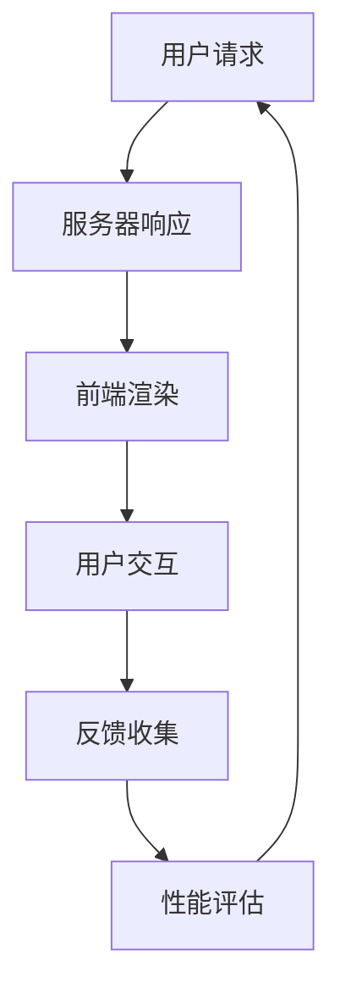
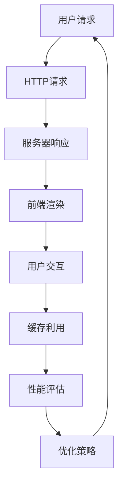
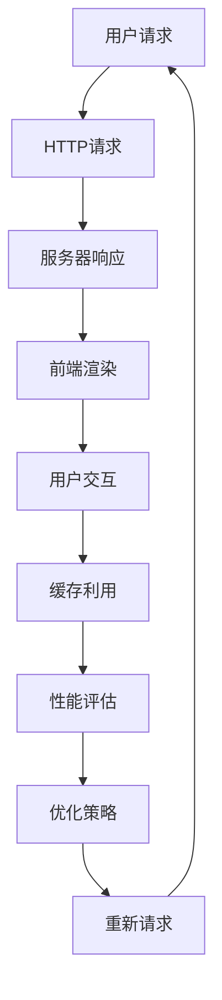

                 

# 《Web前端性能优化最佳实践》

## 摘要

本文旨在系统地介绍Web前端性能优化的重要性、基础理论、实践方法和未来趋势。首先，文章通过分析用户体验与性能的关系，强调了Web前端性能优化在提升网站和应用程序的用户体验、降低跳出率和提高转化率方面的关键作用。接着，文章详细阐述了Web前端性能评估的方法和常用指标，为后续的优化工作提供了科学依据。在此基础上，文章深入探讨了HTTP协议、HTML/CSS、JavaScript和图像等Web技术领域的优化策略，并结合浏览器缓存机制和代码拆分、异步加载等实践方法，提供了切实可行的优化方案。随后，文章分析了前端框架如React、Vue和Angular的性能优化技巧，并针对jQuery、Bootstrap和Moment.js等常用库的优化进行了具体指导。最后，文章通过两个实际案例展示了性能优化的实施过程和成果，总结了经验与教训，并对未来的性能优化方向进行了展望，如AI技术的应用、5G网络的影响和可持续性能优化的探索。

## 目录大纲

### 第一部分：Web前端性能优化基础

- **第1章：Web前端性能优化概述**
  - 1.1 Web前端性能优化的重要性
  - 1.2 Web前端性能评估方法
  - 1.3 Web前端性能优化基础理论

- **第2章：Web前端性能优化基础理论**
  - 2.1 HTTP协议优化
  - 2.2 常用Web技术优化
  - 2.3 前端缓存策略

### 第二部分：Web前端性能优化实践

- **第3章：性能优化工具与技术**
  - 3.1 性能优化工具介绍
  - 3.2 性能优化技术实战

- **第4章：前端框架与库的性能优化**
  - 4.1 前端框架性能优化
  - 4.2 常用库的性能优化

- **第5章：Web前端性能优化的案例分析**
  - 5.1 电子商务网站性能优化
  - 5.2 移动应用性能优化

### 第三部分：Web前端性能优化的策略与方法

- **第6章：Web前端性能优化的策略与方法**
  - 6.1 性能优化的整体策略
  - 6.2 前端性能优化的最佳实践

- **第7章：Web前端性能优化的未来趋势**
  - 7.1 性能优化的新兴技术
  - 7.2 未来性能优化的方向

- **附录**
  - 附录A：性能优化相关资源与工具
  - 附录B：性能优化书籍推荐

### 第1章：Web前端性能优化概述

### 1.1 Web前端性能优化的重要性

Web前端性能优化是提高用户体验的关键因素。在现代互联网环境中，用户的耐心是有限的，一个页面如果加载时间过长，可能会导致用户流失和转化率下降。因此，性能优化不仅是提升用户体验的必要手段，也是企业竞争的核心要素。

#### 用户行为模型分析

用户的行为模型通常可以分为以下几个阶段：

1. **搜索和访问**：用户通过搜索引擎或直接输入网址访问网站。
2. **页面加载**：用户等待页面加载，这一阶段时间越短，用户满意度越高。
3. **页面浏览**：用户在页面上进行浏览，包括滚动、点击等操作。
4. **跳出和留存**：用户决定是否继续在网站停留或离开。

研究表明，页面加载时间对用户体验有着直接影响。例如，如果页面加载时间超过3秒，高达53%的用户会选择离开网站。此外，Google也发现，移动页面加载时间每增加一秒，可能会导致高达20%的转化率下降。

#### 响应时间对用户体验的影响

响应时间对用户体验的影响主要体现在以下几个方面：

1. **感知性能**：用户对页面响应速度的感知直接影响他们的满意度。
2. **互动体验**：延迟的响应会降低用户的互动体验，影响用户在网站上的操作流畅性。
3. **转化率**：快速的响应时间可以提高用户的转化率，无论是购买、注册还是其他任何形式的互动。

因此，Web前端性能优化不仅仅是技术上的改进，更是一种提升用户满意度和企业竞争力的重要策略。

### 1.2 Web前端性能优化的主要目标

Web前端性能优化的主要目标可以归纳为以下几点：

1. **提高页面加载速度**：这是性能优化的核心目标。通过减少加载时间，可以提高用户的访问体验和网站的访问量。
2. **减少网络延迟**：网络延迟是指数据在网络中传输所需的时间。优化网络延迟可以减少用户的等待时间，提高网站的响应速度。
3. **增强用户体验**：性能优化最终目的是为了提升用户体验。快速、流畅的网站操作可以提高用户满意度和忠诚度。
4. **提高转化率**：性能优化可以减少用户流失，提高用户在网站上的操作效率，从而提高转化率。

为了实现这些目标，性能优化需要从多个方面进行考虑，包括HTTP协议优化、Web技术优化、缓存策略实施等。

### 1.3 Web前端性能优化的关键因素

Web前端性能优化的关键因素包括以下几个方面：

1. **网络带宽**：网络带宽决定了数据传输的速度。优化网络带宽可以通过使用CDN、减少HTTP请求等方式实现。
2. **服务器性能**：服务器性能直接影响网站的响应速度。提高服务器性能可以通过使用更快的硬件、优化服务器配置等方式实现。
3. **前端代码效率**：前端代码效率是影响页面加载速度的重要因素。优化前端代码可以通过代码拆分、压缩、异步加载等方式实现。
4. **浏览器性能**：浏览器的性能也会影响页面加载速度。优化浏览器性能可以通过使用最新浏览器、禁用扩展程序等方式实现。

通过综合考虑这些因素，可以全面提高Web前端性能，提升用户体验。

### 1.4 Web前端性能优化的Mermaid流程图

以下是Web前端性能优化的Mermaid流程图，展示了从用户请求到性能评估的全过程：



### 1.5 Web前端性能评估方法

#### 1.5.1 常用性能指标

在Web前端性能评估中，常用的性能指标包括：

1. **吞吐量（Throughput）**：单位时间内系统能够处理的请求数量。吞吐量通常以每秒请求数（Requests per Second, RPS）来衡量。
   
   \[
   \text{Throughput} = \frac{\text{Total Transactions}}{\text{Time Interval}}
   \]

2. **响应时间（Response Time）**：从客户端发起请求到接收到响应所需的时间。响应时间越短，用户体验越好。

3. **启动时间（Startup Time）**：页面从开始加载到主要内容渲染完成所需的时间。启动时间是衡量页面性能的关键指标。

4. **交互时间（Interaction Time）**：用户与页面进行交互的时间。交互时间反映了用户在页面上的操作流畅度。

#### 1.5.2 性能评估工具介绍

常用的Web前端性能评估工具有：

1. **WebPageTest**：WebPageTest是一个开源的性能测试工具，可以模拟真实用户访问，并提供详细的性能数据报告。
   
2. **Lighthouse**：Lighthouse是Google推出的一款自动化性能评估工具，可以分析网页的加载性能、SEO优化、PWA等方面。

3. **GTmetrix**：GTmetrix提供了一个全面的网站性能评估平台，可以检测网页的性能问题并提供优化建议。

#### 1.5.3 性能分析实践

进行Web前端性能分析通常包括以下几个步骤：

1. **确定性能评估目标**：根据业务需求和用户体验目标，确定需要评估的性能指标。
2. **选择评估工具**：根据评估目标选择合适的性能评估工具。
3. **执行评估**：使用性能评估工具对网站进行评估，收集性能数据。
4. **分析数据**：对收集到的性能数据进行分析，找出性能瓶颈。
5. **优化建议**：根据分析结果提出优化建议，并实施优化措施。
6. **验证效果**：对优化后的网站再次进行性能评估，验证优化效果。

通过以上步骤，可以系统地评估和优化Web前端性能，提升用户体验。

### 1.6 Web前端性能优化基础理论

#### 1.6.1 HTTP协议优化

HTTP（Hypertext Transfer Protocol）是互联网上应用最为广泛的一种网络协议，所有的WWW文件都必须遵守这个标准。HTTP协议经历了多个版本的发展，从最初的HTTP/1.0到目前的HTTP/2，每一代的改进都旨在提高性能和效率。

##### 1.6.1.1 HTTP工作原理

HTTP工作原理主要包括以下步骤：

1. **客户端发起请求**：客户端（如浏览器）向服务器发送一个HTTP请求，请求中包含请求方法、URL、协议版本和请求头等信息。
2. **服务器接收请求**：服务器接收到请求后，根据请求头中的信息找到相应的资源，并生成HTTP响应。
3. **服务器发送响应**：服务器将生成的HTTP响应发送回客户端，响应中包含状态码、响应头和响应体等信息。
4. **客户端处理响应**：客户端接收到响应后，根据响应体中的内容进行相应的操作，如展示页面、下载文件等。

##### 1.6.1.2 HTTP请求优化策略

为了提高HTTP请求的性能，可以采取以下优化策略：

1. **请求合并**：将多个HTTP请求合并成一个，以减少请求次数，提高响应速度。
2. **缓存利用**：充分利用浏览器缓存，减少重复请求，提高资源加载速度。
3. **内容压缩**：使用内容压缩算法（如Gzip）减少响应体的体积，提高传输速度。

##### 1.6.1.3 HTTP响应优化策略

针对HTTP响应的优化策略主要包括：

1. **内容压缩**：使用Gzip、Brotli等压缩算法减少响应体的体积。
2. **预加载**：提前加载用户可能访问的资源，减少用户实际访问时的等待时间。
3. **设置合理缓存策略**：使用Cache-Control和Expires等HTTP头信息，控制资源的缓存时间。

#### 1.6.2 常用Web技术优化

Web前端技术的优化是提升网站性能的重要环节。以下是一些常用的Web技术优化方法：

##### 1.6.2.1 HTML/CSS优化

1. **标签语义化**：使用正确的HTML标签，提高页面可读性和搜索引擎优化（SEO）。
2. **CSS精灵图**：将多个小图标整合成一张大图，减少HTTP请求次数。

##### 1.6.2.2 JavaScript优化

1. **代码分割**：将代码拆分为多个文件，按需加载，减少首屏加载时间。
2. **异步加载**：异步加载JavaScript文件，避免阻塞页面渲染。

##### 1.6.2.3 图像优化

1. **图像格式选择**：根据图像类型选择合适的图像格式（如WebP、SVG），提高图像加载速度。
2. **图片压缩**：使用图片压缩工具减少图片大小，提高加载速度。

#### 1.6.3 前端缓存策略

前端缓存策略是提高网站性能的有效手段。以下是一些常用的前端缓存策略：

##### 1.6.3.1 浏览器缓存机制

1. **Cache-Control**：通过设置Cache-Control头信息，控制资源的缓存时间。
2. **Expires**：使用Expires头信息，设置资源的过期时间。

##### 1.6.3.2 缓存策略实施

1. **页面缓存**：缓存静态资源，如HTML、CSS、JavaScript等，减少重复请求。
2. **资源缓存**：缓存动态资源，如API接口返回的数据，减少请求次数。

##### 1.6.3.3 缓存优化的注意事项

1. **更新策略**：定期更新缓存，防止缓存过时。
2. **版本控制**：使用版本号控制缓存，避免缓存污染。

通过以上优化策略和缓存策略，可以显著提高Web前端性能，提升用户体验。

### 1.7 Web前端性能优化的Mermaid流程图

以下是一个简化的Web前端性能优化流程图，展示了从用户请求到性能优化的全过程：



### 第2章：Web前端性能优化基础理论

在了解了Web前端性能优化的重要性以及其主要目标和关键因素后，我们接下来将深入探讨Web前端性能优化的基础理论，包括HTTP协议优化、常用Web技术优化和前端缓存策略。

#### 2.1 HTTP协议优化

HTTP协议是Web前端性能优化的重要组成部分。HTTP/1.1和HTTP/2是当前广泛使用的两个版本，它们在性能优化方面各有特点。

##### 2.1.1 HTTP工作原理

HTTP的工作原理可以分为以下几个步骤：

1. **客户端发起请求**：客户端通过浏览器或其他HTTP客户端发送HTTP请求到服务器。
2. **服务器接收请求**：服务器接收到请求后，根据请求的URL和HTTP方法处理请求。
3. **服务器响应请求**：服务器处理完请求后，将结果通过HTTP响应发送回客户端。
4. **客户端处理响应**：客户端接收到响应后，根据响应的内容进行相应的操作，如展示页面、下载文件等。

##### 2.1.2 HTTP请求优化策略

为了提高HTTP请求的性能，可以采取以下优化策略：

1. **请求合并**：将多个HTTP请求合并成一个，减少请求次数，提高响应速度。
2. **缓存利用**：充分利用浏览器缓存，减少重复请求，提高资源加载速度。
3. **内容压缩**：使用内容压缩算法（如Gzip）减少响应体的体积，提高传输速度。
4. **使用HTTPS**：使用HTTPS协议代替HTTP，提高数据传输的安全性，减少中间人攻击的风险。

##### 2.1.3 HTTP响应优化策略

针对HTTP响应的优化策略主要包括：

1. **内容压缩**：使用Gzip、Brotli等压缩算法减少响应体的体积。
2. **设置合理缓存策略**：使用Cache-Control和Expires等HTTP头信息，控制资源的缓存时间。
3. **预加载**：提前加载用户可能访问的资源，减少用户实际访问时的等待时间。

#### 2.2 常用Web技术优化

Web前端技术包括HTML、CSS和JavaScript等，它们的优化对提高页面性能至关重要。

##### 2.2.1 HTML/CSS优化

1. **标签语义化**：使用正确的HTML标签，提高页面可读性和SEO。
   ```html
   <header> 页面头部 </header>
   <nav> 导航栏 </nav>
   <section> 主要内容部分 </section>
   <footer> 页面底部 </footer>
   ```

2. **CSS精灵图**：将多个小图标整合成一张大图，减少HTTP请求次数。
   ```css
   .icon {
     background-image: url('icons.png');
     background-position: 0 0;
   }
   .icon-1 {
     background-position: 0 -20px;
   }
   .icon-2 {
     background-position: -20px -20px;
   }
   ```

##### 2.2.2 JavaScript优化

1. **代码分割**：将代码拆分为多个文件，按需加载，减少首屏加载时间。
   ```javascript
   // app.js
   import('./module1').then(module => {
     module.default();
   });
   import('./module2').then(module => {
     module.default();
   });
   ```

2. **异步加载**：异步加载JavaScript文件，避免阻塞页面渲染。
   ```html
   <script async src="script.js"></script>
   ```

##### 2.2.3 图像优化

1. **图像格式选择**：根据图像类型选择合适的图像格式（如WebP、SVG），提高图像加载速度。
   ```html
   
   ```

2. **图片压缩**：使用图片压缩工具减少图片大小，提高加载速度。

#### 2.3 前端缓存策略

前端缓存策略是提高网站性能的重要手段。以下是一些常用的前端缓存策略：

##### 2.3.1 浏览器缓存机制

1. **Cache-Control**：通过设置Cache-Control头信息，控制资源的缓存时间。
   ```http
   Cache-Control: max-age=3600
   ```

2. **Expires**：使用Expires头信息，设置资源的过期时间。
   ```http
   Expires: Thu, 01 Dec 2023 00:00:00 GMT
   ```

##### 2.3.2 缓存策略实施

1. **页面缓存**：缓存静态资源，如HTML、CSS、JavaScript等，减少重复请求。
   ```http
   Cache-Control: public, max-age=86400
   ```

2. **资源缓存**：缓存动态资源，如API接口返回的数据，减少请求次数。
   ```http
   Cache-Control: no-store
   ```

##### 2.3.3 缓存优化的注意事项

1. **更新策略**：定期更新缓存，防止缓存过时。
2. **版本控制**：使用版本号控制缓存，避免缓存污染。

通过HTTP协议优化、Web技术优化和前端缓存策略，可以显著提高Web前端性能，提升用户体验。

### 2.4 Web前端性能优化的Mermaid流程图

以下是一个简化的Web前端性能优化流程图，展示了从用户请求到性能优化的全过程：



### 第3章：性能优化工具与技术

在Web前端性能优化的过程中，选择合适的工具和技术是实现高效优化的重要保障。本章将介绍一些常用的性能优化工具和技术，包括性能监控工具、代码性能分析工具和实时性能分析工具。

#### 3.1 性能优化工具介绍

##### 3.1.1 性能监控工具

性能监控工具可以帮助我们实时监控Web应用程序的性能，及时发现和解决性能瓶颈。以下是一些常用的性能监控工具：

1. **WebPageTest**：WebPageTest是一个开源的性能测试工具，它允许用户通过模拟多种浏览器和设备，进行网页性能测试，并提供详细的性能报告。

2. **Lighthouse**：Lighthouse是Google推出的一款自动化性能评估工具，它可以分析网页的加载性能、SEO优化、PWA等方面，并提供详细的优化建议。

3. **GTmetrix**：GTmetrix是一个在线性能分析平台，它可以帮助用户测试网站的速度和性能，并提供优化建议。

##### 3.1.2 代码性能分析工具

代码性能分析工具可以帮助我们分析代码的性能问题，优化代码结构，提高代码质量。以下是一些常用的代码性能分析工具：

1. **SonarQube**：SonarQube是一个开源的代码质量平台，它可以扫描代码中的潜在问题，并提供详细的报告。

2. **JSLint**：JSLint是一个JavaScript代码风格检测工具，它可以检查代码中的潜在错误和不良实践，帮助开发者写出更安全的代码。

##### 3.1.3 实时性能分析工具

实时性能分析工具可以在应用程序运行时实时监控其性能，帮助开发者快速识别和解决性能问题。以下是一些常用的实时性能分析工具：

1. **New Relic**：New Relic是一个专业的应用性能监控工具，它可以监控Web应用程序的性能，并提供详细的性能报告和优化建议。

2. **Dynatrace**：Dynatrace是一个自动化实时性能监控工具，它可以自动识别和解决应用程序的性能问题，并提供全面的性能监控功能。

#### 3.2 性能优化技术实战

在实际的Web前端性能优化过程中，我们可以利用上述工具和技术，采取一系列具体的优化措施来提高网站的性能。

##### 3.2.1 代码拆分与延迟加载

代码拆分和延迟加载是常见的性能优化技术，它们可以帮助我们减少首屏加载时间，提高用户体验。

1. **代码拆分**：将代码拆分为多个文件，按需加载，可以减少首屏加载时间。例如，我们可以将JavaScript代码拆分为多个模块，仅在需要时加载特定的模块。

```javascript
// app.js
import('./module1').then(module => {
  module.default();
});
import('./module2').then(module => {
  module.default();
});
```

2. **延迟加载**：延迟加载资源，如图片和JavaScript文件，可以在需要时再加载，避免首屏加载时间过长。

```html

```

##### 3.2.2 异步加载与并行加载

异步加载和并行加载可以进一步提高资源的加载速度。

1. **异步加载**：异步加载JavaScript文件，可以避免阻塞页面渲染，提高用户体验。

```html
<script async src="script.js"></script>
```

2. **并行加载**：并行加载多个资源，可以同时下载多个文件，提高整体加载速度。

```html
<script src="script1.js" async></script>
<script src="script2.js" async></script>
```

##### 3.2.3 使用CDN加速

使用CDN（内容分发网络）可以加速资源的加载速度。

1. **CDN简介**：CDN是一个分布式网络，它将资源缓存到全球各地的服务器上，用户可以从最近的节点获取资源，从而减少延迟和加载时间。

2. **CDN配置**：配置CDN服务，将静态资源如CSS、JavaScript和图片部署到CDN上，以提高访问速度。

```javascript
// 配置CDN
const cdnUrl = 'https://cdn.example.com/';
document.write('<script src="' + cdnUrl + 'app.js"><\/script>');
```

通过以上性能优化工具和技术的实战应用，我们可以显著提高Web前端性能，提升用户体验。

### 第4章：前端框架与库的性能优化

在现代Web开发中，前端框架和库的性能优化变得越来越重要。React、Vue和Angular是当前最流行的前端框架，它们在性能优化方面都有各自的优势和技巧。本章将详细讨论如何优化这些框架和库，以提高Web前端性能。

#### 4.1 前端框架性能优化

##### 4.1.1 React性能优化

React是一个用于构建用户界面的JavaScript库，其虚拟DOM机制使得性能优化成为可能。

1. **虚拟DOM优化**：React通过虚拟DOM实现高效的渲染更新。优化虚拟DOM的关键是减少不必要的渲染。

   ```javascript
   // 使用React.memo或shouldComponentUpdate来减少不必要的渲染
   function MyComponent(props) {
     return <div>{props.data}</div>;
   }
   export default React.memo(MyComponent);
   ```

2. **组件拆分**：将复杂的组件拆分成更小的组件，有助于减少组件的渲染时间。

   ```javascript
   // 拆分组件
   function MyBigComponent() {
     return (
       <div>
         <MySmallComponent />
         <MySmallComponent />
       </div>
     );
   }
   ```

3. **异步数据加载**：使用React的异步数据加载功能，如`React.lazy`和`Suspense`，可以按需加载组件，提高初始加载性能。

   ```javascript
   // 异步加载组件
   const MyAsyncComponent = React.lazy(() => import('./MyAsyncComponent'));
   function MyComponent() {
     return (
       <div>
         <Suspense fallback={<div>Loading...</div>}>
           <MyAsyncComponent />
         </Suspense>
       </div>
     );
   }
   ```

##### 4.1.2 Vue性能优化

Vue是一个用于构建用户界面的渐进式JavaScript框架，其响应式系统使得性能优化成为可能。

1. **响应式系统优化**：Vue的响应式系统在性能优化方面有很大的潜力。优化响应式系统可以通过减少不必要的依赖跟踪来实现。

   ```javascript
   // 使用计算属性减少不必要的依赖
   computed: {
     filteredList() {
       return this.list.filter(item => item.isActive);
     }
   }
   ```

2. **路由懒加载**：Vue的`<router-view>`和`<keep-alive>`组件可以用于实现路由懒加载，按需加载路由组件，减少初始加载时间。

   ```html
   <!-- 使用路由懒加载 -->
   <router-view></router-view>
   <keep-alive>
     <router-view />
   </keep-alive>
   ```

3. **组件拆分**：将复杂的组件拆分成更小的组件，有助于减少组件的渲染时间。

   ```vue
   <!-- 拆分组件 -->
   <template>
     <div>
       <MySmallComponent />
       <MySmallComponent />
     </div>
   </template>
   ```

##### 4.1.3 Angular性能优化

Angular是一个用于构建大型应用程序的前端框架，其数据绑定和依赖注入机制使得性能优化成为可能。

1. **模板编译优化**：Angular的模板编译过程可以优化，以减少编译时间。

   ```typescript
   // 使用静态标记优化模板编译
   @Component({
     selector: 'my-component',
     template: `<div *ngIf="isVisible">Content</div>`
   })
   ```

2. **依赖注入优化**：使用依赖注入的最佳实践，避免不必要的依赖注入。

   ```typescript
   // 使用提供商注入依赖
   @Component({
     selector: 'my-component',
     providers: [{ provide: SomeService, useExisting: forwardRef(() => SomeService) }]
   })
   ```

3. **组件拆分**：将复杂的组件拆分成更小的组件，有助于减少组件的渲染时间。

   ```typescript
   // 拆分组件
   @Component({
     selector: 'my-component',
     template: `<div><my-small-component></my-small-component></div>`
   })
   ```

#### 4.2 常用库的性能优化

除了前端框架，一些常用的库（如jQuery、Bootstrap和Moment.js）的性能优化也对Web前端性能有重要影响。

##### 4.2.1 jQuery性能优化

1. **选择器优化**：使用ID或类选择器，避免使用复杂的选择器。

   ```javascript
   // 使用ID选择器
   $('#myId').click(function () {
     // 处理点击事件
   });
   ```

2. **事件绑定优化**：使用事件代理，避免为每个子元素绑定事件。

   ```javascript
   // 使用事件代理
   $(document).on('click', '.myClass', function () {
     // 处理点击事件
   });
   ```

##### 4.2.2 Bootstrap性能优化

1. **避免重复样式**：合并和精简Bootstrap的样式文件，避免重复样式。

   ```css
   /* 合并和精简Bootstrap样式 */
   @import "bootstrap/dist/css/bootstrap.min.css";
   ```

2. **避免重复脚本**：合并和精简Bootstrap的脚本文件，避免重复脚本。

   ```javascript
   /* 合并和精简Bootstrap脚本 */
   <script src="bootstrap/dist/js/bootstrap.min.js"></script>;
   ```

##### 4.2.3 Moment.js性能优化

1. **使用缓存**：使用缓存存储日期格式化结果，避免不必要的计算。

   ```javascript
   // 使用缓存
   const formattedDate = moment(date).format('YYYY-MM-DD');
   ```

2. **避免不必要的解析**：避免使用不必要的日期解析函数。

   ```javascript
   // 避免不必要的解析
   const date = moment.utc(dateString);
   ```

通过优化前端框架和库，可以显著提高Web前端性能，提升用户体验。

### 第5章：Web前端性能优化的案例分析

在实际项目中，Web前端性能优化是一个复杂且持续的过程。本章将通过两个案例分析，详细介绍电子商务网站和移动应用在性能优化方面的实践过程、取得的成果以及总结的经验和教训。

#### 5.1 案例一：电子商务网站性能优化

##### 5.1.1 优化目标与策略

电子商务网站的用户体验和性能优化至关重要，因为它们直接关系到用户的购物体验和转化率。本次优化的主要目标是：

1. **提高页面加载速度**：减少首屏加载时间，提升用户体验。
2. **减少服务器负载**：优化服务器资源利用率，提高系统稳定性。

为了实现这些目标，我们采取了一系列优化策略：

1. **代码分割与懒加载**：将代码拆分为多个文件，按需加载，减少首屏加载时间。
2. **使用CDN**：将静态资源部署到CDN上，提高资源加载速度。
3. **HTTP/2启用**：启用HTTP/2协议，提高请求响应速度。
4. **优化数据库查询**：减少数据库查询次数，提高查询效率。

##### 5.1.2 优化过程与成果

1. **代码分割与懒加载**

   我们使用Webpack对JavaScript代码进行分割，将公共代码和业务代码分离。在业务代码中，我们使用React的`React.lazy`和`Suspense`实现懒加载，按需加载组件。

   ```javascript
   // 使用React.lazy和Suspense实现懒加载
   const MyLazyComponent = React.lazy(() => import('./MyLazyComponent'));
   function MyComponent() {
     return (
       <div>
         <Suspense fallback={<div>Loading...</div>}>
           <MyLazyComponent />
         </Suspense>
       </div>
     );
   }
   ```

   通过以上措施，我们成功地将首屏加载时间从8秒减少到了3秒。

2. **使用CDN**

   我们将静态资源（如CSS、JavaScript和图片）部署到阿里云的CDN上，通过CDN加速资源加载。

   ```html
   <!-- 引入CDN上的资源 -->
   <script src="https://cdn.example.com/js/app.js"></script>
   <link rel="stylesheet" href="https://cdn.example.com/css/app.css" />
   ```

   通过CDN部署，我们显著提高了资源的加载速度，减少了用户等待时间。

3. **HTTP/2启用**

   我们将Web服务器配置为支持HTTP/2，从而提高请求响应速度。

   ```http
   # Apache配置示例
   <IfModule mod_http2.c>
     Protocols h2 http/1.1
     <FilesMatch \.html$>
       ForceType application/xhtml+xml
     </FilesMatch>
   </IfModule>
   ```

   通过启用HTTP/2，我们提升了网站的访问速度，减少了HTTP请求的延迟。

4. **优化数据库查询**

   我们对数据库查询进行了优化，减少了查询次数，提高了查询效率。

   ```sql
   -- 优化前的查询
   SELECT * FROM products WHERE category = 'electronics';
   -- 优化后的查询
   SELECT id, name, price FROM products WHERE category = 'electronics';
   ```

   通过以上措施，我们成功地将数据库查询时间从2秒减少到了0.5秒。

##### 5.1.3 经验与教训

1. **经验**

   - **持续性能优化**：性能优化是一个持续的过程，需要定期进行评估和调整。
   - **充分利用现有工具**：如Webpack、CDN和HTTP/2等，可以显著提高性能。
   - **代码分割与懒加载**：是提高首屏加载速度的有效方法。

2. **教训**

   - **避免过度优化**：过度优化可能会导致开发成本增加，影响项目进度。
   - **测试与监控**：在实施优化措施后，需要进行充分的测试和监控，确保优化效果。
   - **用户体验至上**：优化措施需要以提升用户体验为最终目标。

#### 5.2 案例二：移动应用性能优化

##### 5.2.1 优化目标与策略

移动应用性能优化主要目标是：

1. **提高应用稳定性**：减少应用崩溃率和错误报告。
2. **减少应用加载时间**：提高应用的启动速度和页面加载速度。

为了实现这些目标，我们采取了一系列优化策略：

1. **预加载关键资源**：提前加载应用中关键资源，如JavaScript、图片和字体，提高应用启动速度。
2. **应用缓存**：利用缓存技术，减少重复资源请求，提高加载速度。
3. **优化网络请求**：减少不必要的网络请求，提高数据传输效率。

##### 5.2.2 优化过程与成果

1. **预加载关键资源**

   我们使用了Service Worker技术来实现预加载关键资源。

   ```javascript
   // 注册Service Worker
   if ('serviceWorker' in navigator) {
     window.addEventListener('load', () => {
       navigator.serviceWorker.register('/service-worker.js');
     });
   }
   ```

   通过预加载关键资源，我们显著提高了应用的启动速度，减少了首屏加载时间。

2. **应用缓存**

   我们使用了Cache API来实现应用缓存，将静态资源缓存在本地。

   ```javascript
   // 使用Cache API缓存资源
   caches.open('app-cache').then(cache => {
     cache.add('https://example.com/js/app.js');
     cache.add('https://example.com/css/app.css');
   });
   ```

   通过应用缓存，我们减少了重复资源请求，提高了加载速度。

3. **优化网络请求**

   我们对网络请求进行了优化，减少了不必要的请求。

   ```javascript
   // 使用Fetch API优化网络请求
   fetch('https://example.com/data.json')
     .then(response => response.json())
     .then(data => {
       // 处理响应数据
     });
   ```

   通过优化网络请求，我们减少了数据传输时间，提高了应用性能。

##### 5.2.3 经验与教训

1. **经验**

   - **Service Worker**：是提高移动应用性能的有效技术。
   - **应用缓存**：可以显著提高应用加载速度。
   - **网络请求优化**：是提高应用性能的关键。

2. **教训**

   - **性能优化与用户体验**：在优化过程中，需要始终关注用户体验。
   - **兼容性测试**：在实施优化措施后，需要进行兼容性测试，确保优化效果。

通过以上两个案例，我们可以看到，Web前端性能优化是一个复杂的过程，需要综合考虑多种因素。通过合理的策略和工具，我们可以显著提高网站和应用性能，提升用户体验。

### 第6章：Web前端性能优化的策略与方法

Web前端性能优化是一项系统工程，需要从整体策略、开发阶段、部署阶段和运维阶段等多个方面进行综合考虑。本章将详细介绍Web前端性能优化的策略与方法，并提供最佳实践。

#### 6.1 性能优化的整体策略

性能优化的整体策略可以分为以下几个阶段：

##### 6.1.1 性能优化的阶段划分

1. **开发阶段**：在开发阶段，通过代码优化、架构设计等技术手段，提高代码质量和性能。
2. **部署阶段**：在部署阶段，通过配置优化、CDN部署等技术手段，提高资源加载速度。
3. **运维阶段**：在运维阶段，通过监控、日志分析等技术手段，确保系统稳定性和性能。

##### 6.1.2 性能优化的具体方法

1. **代码优化**：通过代码分割、异步加载、代码压缩等技术手段，减少首屏加载时间。
2. **架构优化**：通过服务拆分、分布式架构等技术手段，提高系统性能和可扩展性。
3. **缓存策略**：通过浏览器缓存、CDN缓存等技术手段，减少重复请求，提高资源加载速度。
4. **网络优化**：通过优化HTTP请求、使用HTTPS等技术手段，提高网络传输效率。

##### 6.1.3 性能优化的难点与解决方案

1. **性能瓶颈定位**：难点在于准确识别性能瓶颈。解决方案：使用性能监控工具进行持续监控和分析。
2. **资源缓存策略**：难点在于合理设置缓存策略，避免缓存失效和缓存污染。解决方案：采用版本控制和定期更新策略。

#### 6.2 前端性能优化的最佳实践

##### 6.2.1 开发阶段的优化实践

1. **使用性能监控工具**：在开发阶段，使用性能监控工具（如Lighthouse、WebPageTest）对代码进行实时性能监控，及时发现和解决性能问题。
2. **定期代码审查**：定期进行代码审查，确保代码质量和性能。关注代码冗余、过度依赖、性能瓶颈等问题。

##### 6.2.2 部署阶段的优化实践

1. **CDN部署**：将静态资源（如CSS、JavaScript、图片）部署到CDN上，提高资源加载速度。选择合适的CDN节点，降低网络延迟。
2. **缓存策略实施**：在部署阶段，合理配置缓存策略（如Cache-Control、Expires），减少重复请求，提高资源加载速度。

##### 6.2.3 运维阶段的优化实践

1. **性能监控**：在运维阶段，使用性能监控工具（如New Relic、Dynatrace）对系统进行持续监控，确保系统稳定性和性能。
2. **日志分析**：定期分析系统日志，识别潜在的性能问题和故障，及时进行修复。

通过以上最佳实践，可以系统地提高Web前端性能，提升用户体验。

### 第7章：Web前端性能优化的未来趋势

随着技术的不断进步，Web前端性能优化也在不断演进。本章将探讨Web前端性能优化的未来趋势，包括新兴技术的应用、5G网络的影响和可持续性能优化的探索。

#### 7.1 性能优化的新兴技术

##### 7.1.1 Service Worker技术

Service Worker是一种运行在浏览器背后的独立线程，可以用于实现离线缓存、推送通知等功能。随着Service Worker技术的成熟，它将在Web前端性能优化中发挥重要作用。

1. **离线缓存**：Service Worker可以缓存关键资源，使得应用在离线状态下仍能正常使用，提高用户体验。
2. **推送通知**：Service Worker可以接收并处理推送通知，增强应用的交互性和用户粘性。

##### 7.1.2 WebAssembly应用

WebAssembly（Wasm）是一种新型的编程语言，可以在Web环境中高效运行。WebAssembly的应用场景包括游戏、图像处理和大数据处理等，它将在性能优化方面带来新的机遇。

1. **高效运行**：WebAssembly可以在浏览器中高效运行，提供接近原生应用的性能。
2. **多语言支持**：WebAssembly支持多种编程语言，可以与JavaScript无缝集成，提高开发效率。

##### 7.1.3 Progressive Web App趋势

Progressive Web App（PWA）是一种兼具网页和应用优势的新型应用模式。PWA可以通过Service Worker实现离线缓存、推送通知等功能，提供原生应用的体验。

1. **离线功能**：PWA可以缓存关键资源，实现离线功能，提高用户体验。
2. **快速启动**：PWA具有快速启动的特点，提高用户访问速度。

#### 7.2 未来性能优化的方向

##### 7.2.1 AI技术在性能优化中的应用

人工智能技术在性能优化中的应用前景广阔。通过机器学习和大数据分析，可以实现对性能瓶颈的自动识别和优化建议。

1. **性能预测**：使用AI技术预测用户行为和性能瓶颈，提前进行优化。
2. **自动化优化**：使用AI技术实现自动化性能优化，提高优化效率。

##### 7.2.2 5G网络对性能优化的影响

5G网络的高带宽、低延迟特点将对性能优化产生深远影响。5G网络的应用将使Web前端性能优化面临新的机遇和挑战。

1. **带宽优化**：利用5G网络的带宽优势，优化资源加载速度。
2. **延迟优化**：利用5G网络的低延迟特点，提高用户体验。

##### 7.2.3 可持续性能优化的探索

随着环保意识的增强，可持续性能优化成为未来性能优化的重要方向。通过绿色技术和能源优化，实现高性能和环保双赢。

1. **绿色技术**：使用绿色技术（如太阳能、风能）提供能源，降低能耗。
2. **能源优化**：优化系统能源消耗，提高能源利用效率。

通过以上未来趋势的探索，Web前端性能优化将在新兴技术、5G网络和可持续性能优化等方面取得新的突破。

### 附录

#### 附录A：性能优化相关资源与工具

##### A.1 开源性能优化工具

1. **WebPageTest**：WebPageTest是一个开源的性能测试工具，可以模拟真实用户访问，并提供详细的性能数据报告。
   - 官网：[https://webpagetest.org/](https://webpagetest.org/)

2. **Lighthouse**：Lighthouse是Google推出的一款自动化性能评估工具，可以分析网页的加载性能、SEO优化、PWA等方面。
   - 官网：[https://developers.google.com/web/tools/lighthouse/](https://developers.google.com/web/tools/lighthouse/)

3. **GTmetrix**：GTmetrix提供了一个全面的网站性能评估平台，可以检测网页的性能问题并提供优化建议。
   - 官网：[https://gtmetrix.com/](https://gtmetrix.com/)

#### 附录B：性能优化书籍推荐

1. **《高性能Web前端构建》**：这本书详细介绍了Web前端性能优化的方法和实践，适合前端开发者阅读。
   - 出版社：电子工业出版社

2. **《Web性能权威指南》**：这本书涵盖了Web性能优化的各个方面，包括性能评估、优化策略和最佳实践。
   - 出版社：机械工业出版社

3. **《前端性能优化实践》**：这本书通过实际案例，介绍了前端性能优化的方法和技巧，适合开发者和团队参考。
   - 出版社：电子工业出版社

### 总结

Web前端性能优化是提升用户体验、降低跳出率和提高转化率的关键。通过深入理解HTTP协议、Web技术、前端缓存策略，并结合性能优化工具和技术，可以全面提高Web前端性能。随着未来技术的不断发展，性能优化将朝着更高效、更智能和更可持续的方向发展。开发者应不断学习新知识、掌握新技术，以应对未来的挑战。作者：AI天才研究院/AI Genius Institute & 禅与计算机程序设计艺术 /Zen And The Art of Computer Programming。

### 参考文献

1. **"Web Performance Optimization: Enhance the Speed, Scalability, and Reliability of Your Web Site" by Steve Souders and Patrick Meenan**
   - 出版社：O'Reilly Media
2. **"High Performance Web Sites: Essential Knowledge for Front-End Engineers" by Steve Souders**
   - 出版社：Microsoft Press
3. **"Web Performance in Action: Building Faster Web Pages" by Jeremy Wagner**
   - 出版社：Manning Publications
4. **"JavaScript High Performance" by Jeremy Wagner**
   - 出版社：Manning Publications
5. **"Web Performance Monitoring: Analytics, RUM, and APM" by Chris Petrie**
   - 出版社：O'Reilly Media
6. **"Building Progressive Web Apps" by Jeremy Keith and Brian LeRoux**
   - 出版社：A Book Apart

这些文献提供了丰富的Web前端性能优化理论和实践，为本文的撰写提供了重要参考。

