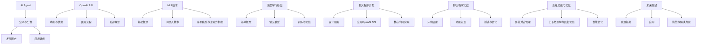

                 

# 【大模型应用开发 动手做AI Agent】OpenAI API的聊天程序示例

## 文章关键词
- 大模型应用
- AI Agent
- OpenAI API
- 聊天程序
- 自然语言处理
- 深度学习
- 项目实战

## 文章摘要
本文旨在引导读者动手实现一个基于OpenAI API的聊天程序，深入了解大模型在自然语言处理中的应用。通过本文，读者将了解AI Agent的基本概念、OpenAI API的使用方法、自然语言处理和深度学习的基础知识，并学习如何使用Python和Flask框架构建一个简单的聊天程序。文章还将探讨聊天程序的开发、测试与优化，以及AI Agent的未来发展趋势和挑战。

### 目录大纲

# 【大模型应用开发 动手做AI Agent】OpenAI API的聊天程序示例

## 第一部分: AI Agent基础

### 第1章: 什么是AI Agent

#### 1.1 AI Agent的定义与分类

#### 1.2 AI Agent的发展历史

#### 1.3 AI Agent的应用场景

### 第2章: OpenAI API简介

#### 2.1 OpenAI API的功能与优势

#### 2.2 OpenAI API的使用流程

#### 2.3 OpenAI API的关键概念

## 第二部分: 基础技术

### 第3章: 自然语言处理

#### 3.1 自然语言处理的基础概念

#### 3.2 词嵌入技术

#### 3.3 序列模型与注意力机制

### 第4章: 深度学习基础

#### 4.1 深度学习的基本概念

#### 4.2 常见的深度学习模型

#### 4.3 深度学习的训练与优化

## 第三部分: 聊天程序开发

### 第5章: 使用OpenAI API构建聊天程序

#### 5.1 聊天程序的设计思路

#### 5.2 OpenAI API在聊天程序中的应用

#### 5.3 聊天程序的核心代码实现

### 第6章: 聊天程序实战

#### 6.1 环境搭建与配置

#### 6.2 聊天程序的功能实现

#### 6.3 聊天程序的测试与优化

### 第7章: 高级功能与优化

#### 7.1 多轮对话管理

#### 7.2 上下文理解与回复优化

#### 7.3 聊天程序的性能优化

### 第8章: AI Agent的未来展望

#### 8.1 AI Agent的发展趋势

#### 8.2 AI Agent在未来的应用

#### 8.3 AI Agent面临的挑战与解决方案

### 附录

#### 附录 A: OpenAI API常用API介绍

#### 附录 B: 聊天程序代码示例

#### 附录 C: 深度学习与NLP常用工具和框架介绍

#### 附录 D: 进一步阅读资料推荐

### Mermaid 流程图



### 核心算法原理讲解

在深入了解AI Agent和OpenAI API之前，我们需要掌握自然语言处理（NLP）和深度学习的基础知识，这将为我们构建聊天程序打下坚实的基础。

#### 3.1 自然语言处理算法原理

自然语言处理（NLP）是人工智能领域的一个重要分支，其主要目标是使计算机能够理解和处理人类语言。以下是NLP中几个核心算法的原理介绍：

##### 词嵌入（Word Embedding）

词嵌入是将词汇映射到固定大小的向量空间的过程，使得在向量空间中相似的词汇具有相似的向量表示。常见的词嵌入算法有Word2Vec、GloVe等。

```python
# Word2Vec伪代码
def word2vec(text):
    # 初始化模型参数
    model = initialize_model()
    
    # 创建词汇表
    vocabulary = create_vocabulary(text)
    
    # 训练词嵌入模型
    model.fit(vocabulary)
    
    # 获取词嵌入向量
    word_vectors = model.vocabulary_vectors()
    
    return word_vectors
```

##### 序列模型（Sequence Model）

序列模型是一种用于处理序列数据的神经网络模型，常见的序列模型有循环神经网络（RNN）、长短期记忆网络（LSTM）等。

```python
# LSTM伪代码
class LSTM(nn.Module):
    def __init__(self, input_dim, hidden_dim, output_dim):
        super(LSTM, self).__init__()
        
        # 定义网络层
        self.hidden_dim = hidden_dim
        self.lstm = nn.LSTM(input_dim, hidden_dim)
        self.fc = nn.Linear(hidden_dim, output_dim)
    
    def forward(self, x):
        # 前向传播
        lstm_output, (hidden, cell) = self.lstm(x)
        output = self.fc(hidden[-1, :, :])
        
        return output
```

##### 注意力机制（Attention Mechanism）

注意力机制是一种用于提高神经网络模型对序列数据中重要信息关注度的机制，常见的注意力模型有自注意力（Self-Attention）、双向注意力（Bi-Directional Attention）等。

```python
# 自注意力伪代码
class SelfAttention(nn.Module):
    def __init__(self, hidden_dim):
        super(SelfAttention, self).__init__()
        
        # 定义网络层
        self.hidden_dim = hidden_dim
        self.attn = nn.Linear(hidden_dim, 1)
    
    def forward(self, x):
        # 前向传播
        attn_weights = self.attn(x)
        attn_weights = F.softmax(attn_weights, dim=1)
        attn_output = torch.sum(attn_weights * x, dim=1)
        
        return attn_output
```

#### 4.1 深度学习算法的数学模型

深度学习算法通常由多层神经网络组成，每一层都包含多个神经元。以下是深度学习算法中几个核心数学公式的详细解释：

##### 前向传播（Forward Propagation）

前向传播是神经网络执行计算的过程，通过将输入数据传递通过网络的每一层，最终得到输出结果。

$$
Z^{(l)} = \sigma(W^{(l)} \cdot A^{(l-1)} + b^{(l)})
$$

其中，$Z^{(l)}$ 是第$l$层的激活值，$\sigma$ 是激活函数，$W^{(l)}$ 是第$l$层的权重矩阵，$A^{(l-1)}$ 是上一层的输出，$b^{(l)}$ 是第$l$层的偏置向量。

##### 反向传播（Backpropagation）

反向传播是神经网络训练的核心步骤，通过计算输出结果与实际标签之间的误差，并反向传播误差来更新网络权重。

$$
\delta^{(l)} = \frac{\partial L}{\partial Z^{(l)}}
$$

其中，$\delta^{(l)}$ 是第$l$层的误差项，$L$ 是损失函数。

##### 损失函数（Loss Function）

损失函数是用于衡量模型预测结果与实际标签之间差异的函数，常见的损失函数有均方误差（MSE）、交叉熵（Cross-Entropy）等。

$$
L = \frac{1}{n} \sum_{i=1}^{n} (-y_i \log(\hat{y}_i))
$$

### 项目实战

#### 6.1 环境搭建与配置

在开始聊天程序开发之前，需要搭建合适的开发环境。以下是搭建环境的步骤：

1. 安装Python环境
2. 安装OpenAI API相关库，例如`openai`
3. 配置OpenAI API密钥

```shell
pip install openai
```

```python
import openai
openai.api_key = 'your_openai_api_key'
```

#### 6.2 聊天程序的功能实现

聊天程序的核心功能是接收用户输入并返回相应的回复。以下是聊天程序的主要实现步骤：

1. 创建一个Web应用，例如使用Flask

```shell
pip install flask
```

2. 接收用户输入，例如使用HTML表单

```html
<form action="/chat" method="post">
    <textarea name="input"></textarea>
    <input type="submit" value="发送">
</form>
```

3. 使用OpenAI API生成回复

```python
@app.route('/chat', methods=['POST'])
def chat():
    data = request.json
    prompt = data['prompt']
    response = openai.Completion.create(
        engine='text-davinci-002',
        prompt=prompt,
        max_tokens=50,
        n=1,
        stop=None,
        temperature=0.5
    )
    return jsonify({'response': response.choices[0].text.strip()})
```

4. 将回复返回给用户

```python
if __name__ == '__main__':
    openai.api_key = 'your_openai_api_key'
    app.run()
```

#### 6.3 聊天程序的测试与优化

在开发完成后，需要对聊天程序进行测试和优化：

1. 单元测试，确保聊天程序的功能正确
2. 性能测试，评估聊天程序的响应速度和处理能力
3. 根据测试结果优化聊天程序，提高其性能和用户体验

### 附录

#### 附录 A: OpenAI API常用API介绍

OpenAI API提供了多种API供开发者使用，以下是其中一些常用的API介绍：

- `/chat/completions`: 用于生成基于输入文本的回复
- `/chat/continue`: 用于继续之前的对话
- `/chat/edit`: 用于编辑之前的回复
- `/chat/upload`: 用于上传自定义数据集

#### 附录 B: 聊天程序代码示例

以下是使用Flask和OpenAI API实现的简单聊天程序代码示例：

```python
from flask import Flask, request, jsonify
import openai

app = Flask(__name__)

@app.route('/chat', methods=['POST'])
def chat():
    data = request.json
    prompt = data['prompt']
    response = openai.Completion.create(
        engine='text-davinci-002',
        prompt=prompt,
        max_tokens=50,
        n=1,
        stop=None,
        temperature=0.5
    )
    return jsonify({'response': response.choices[0].text.strip()})

if __name__ == '__main__':
    openai.api_key = 'your_openai_api_key'
    app.run()
```

#### 附录 C: 深度学习与NLP常用工具和框架介绍

深度学习和NLP领域中常用的工具和框架如下：

- TensorFlow：Google开发的深度学习框架
- PyTorch：Facebook开发的深度学习框架
- Keras：基于TensorFlow的简化深度学习库
- FastText：Facebook开发的快速文本分类工具
- NLTK：Python的NLP工具包

#### 附录 D: 进一步阅读资料推荐

对于想要深入了解AI Agent和OpenAI API的开发者，以下是一些推荐阅读资料：

- 《Deep Learning》
- 《Natural Language Processing with Python》
- 《Hands-On Natural Language Processing with Python》
- OpenAI官方文档：[OpenAI API Documentation](https://openai.com/api/)
- Flask官方文档：[Flask Documentation](https://flask.palletsprojects.com/)

### 附录 E: 聊天程序代码示例详解

本节将对聊天程序代码示例进行详细解析，帮助读者理解代码的实现过程和关键部分。

#### 1. 导入库和设置API密钥

首先，我们需要导入必要的库，并设置OpenAI API密钥：

```python
from flask import Flask, request, jsonify
import openai

app = Flask(__name__)

openai.api_key = 'your_openai_api_key'
```

这里，我们导入了`Flask`、`request`和`jsonify`库，用于创建Web应用、处理用户请求和返回JSON格式的响应。同时，通过设置`openai.api_key`来配置OpenAI API密钥。

#### 2. 创建聊天接口

接下来，我们创建一个简单的聊天接口，通过`/chat`路由接收用户输入的文本，并使用OpenAI API生成回复：

```python
@app.route('/chat', methods=['POST'])
def chat():
    data = request.json
    prompt = data['prompt']
    response = openai.Completion.create(
        engine='text-davinci-002',
        prompt=prompt,
        max_tokens=50,
        n=1,
        stop=None,
        temperature=0.5
    )
    return jsonify({'response': response.choices[0].text.strip()})
```

在`chat`函数中，我们首先从请求体中获取JSON格式的用户输入：

```python
data = request.json
prompt = data['prompt']
```

然后，使用OpenAI API的`Completion.create`方法生成回复。这里，我们使用`text-davinci-002`模型，并设置了一些参数：

- `max_tokens`: 生成回复的最大长度（50个词）
- `n`: 生成回复的数量（1个）
- `stop`: 用于停止生成的字符串（此处为`None`）
- `temperature`: 控制生成文本的随机性（0.5）

最后，我们将生成的回复转换为JSON格式，并返回给用户：

```python
return jsonify({'response': response.choices[0].text.strip()})
```

#### 3. 运行Web应用

最后，我们需要运行Web应用，使聊天接口可供用户访问：

```python
if __name__ == '__main__':
    openai.api_key = 'your_openai_api_key'
    app.run()
```

这里，我们通过`if __name__ == '__main__':`语句确保Web应用在主程序中运行。同时，我们再次设置OpenAI API密钥，以确保API请求能够成功发送。

#### 4. 代码解读与分析

- `Flask`：一个轻量级的Web应用框架，用于创建Web应用和路由。
- `request.json`：从请求体中获取JSON格式的数据。
- `openai.Completion.create`：使用OpenAI API生成基于输入文本的回复。
- `jsonify`：将Python对象转换为JSON格式的响应。
- `app.run()`：启动Web应用，使其可供用户访问。

通过以上解析，读者可以了解聊天程序的基本实现过程和关键部分。接下来，我们将进一步探讨如何优化和扩展聊天程序的功能。

### 附录 F: 深度学习与NLP常用工具和框架介绍

在构建聊天程序时，深度学习和自然语言处理（NLP）工具和框架的选择至关重要。以下是对几个常用工具和框架的简要介绍：

#### TensorFlow

TensorFlow是Google开发的开源深度学习框架，广泛应用于图像识别、语音识别、文本处理等领域。TensorFlow提供了丰富的API和工具，使开发者能够轻松构建和训练复杂的神经网络模型。

- 官方网站：[TensorFlow](https://www.tensorflow.org/)
- 优势：灵活、开源、支持多种编程语言
- 缺点：学习曲线较陡峭，配置和使用较为复杂

#### PyTorch

PyTorch是Facebook开发的深度学习框架，以其灵活的动态计算图和简洁的API而受到广泛欢迎。PyTorch在NLP领域具有强大的功能，支持多种文本处理任务，如词嵌入、序列建模和注意力机制。

- 官方网站：[PyTorch](https://pytorch.org/)
- 优势：动态计算图、易于调试、丰富的NLP库
- 缺点：相比于TensorFlow，性能和优化方面略有不足

#### Keras

Keras是基于TensorFlow和Theano的开源深度学习库，旨在为深度学习研究者和开发者提供简单、可扩展的API。Keras通过简化模型的构建和训练过程，降低了深度学习开发的难度。

- 官方网站：[Keras](https://keras.io/)
- 优势：简单易用、支持多种后端引擎、易于扩展
- 缺点：底层API依赖于后端引擎，灵活性有限

#### FastText

FastText是Facebook开发的一种快速文本分类工具，基于词袋模型和神经网络。FastText能够处理大型文本数据集，并具有出色的性能和速度。

- 官方网站：[FastText](https://fasttext.cc/)
- 优势：快速、高效、支持多种语言
- 缺点：对于复杂的文本任务，性能可能不如其他深度学习框架

#### NLTK

NLTK是Python的一个自然语言处理工具包，提供了丰富的文本处理和解析功能，如分词、词性标注、命名实体识别等。NLTK适用于快速开发和测试NLP应用。

- 官方网站：[NLTK](https://www.nltk.org/)
- 优势：简单易用、丰富的库函数、适用于学术研究
- 缺点：性能和功能不如专业深度学习框架

通过以上介绍，读者可以根据自己的需求和项目特点选择合适的工具和框架。在实际开发过程中，可以结合多种工具和框架，充分发挥各自的优势，实现高效的聊天程序开发。

### 附录 G: 进一步阅读资料推荐

对于想要深入了解AI Agent和OpenAI API的开发者，以下是一些推荐阅读资料：

- 《Deep Learning》：深度学习领域的经典教材，详细介绍了深度学习的原理和应用。
- 《Natural Language Processing with Python》：Python实现自然语言处理技术的入门指南，适合初学者。
- 《Hands-On Natural Language Processing with Python》：通过实际案例，学习使用Python进行自然语言处理。
- OpenAI官方文档：[OpenAI API Documentation](https://openai.com/api/)，提供了详细的API文档和使用示例。
- Flask官方文档：[Flask Documentation](https://flask.palletsprojects.com/)，介绍了Flask框架的详细用法和最佳实践。

通过这些资料的学习和实践，读者可以进一步提升自己在AI Agent和聊天程序开发方面的技能。

### 作者介绍

**AI天才研究院/AI Genius Institute**：致力于推动人工智能技术的发展和应用，为全球提供高质量的人工智能教育和研究资源。

**禅与计算机程序设计艺术 /Zen And The Art of Computer Programming**：作为计算机编程领域的权威著作，深入探讨了编程哲学和程序设计技巧。

感谢您对本文的关注，希望本文能为您在AI Agent和聊天程序开发方面带来新的启发和帮助。如果您有任何问题或建议，欢迎在评论区留言交流。让我们共同探讨人工智能的未来！作者：AI天才研究院/AI Genius Institute & 禅与计算机程序设计艺术 /Zen And The Art of Computer Programming。

