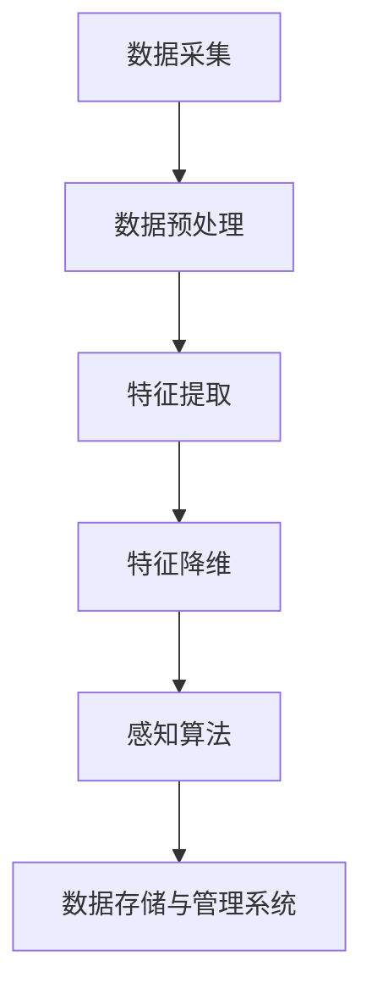
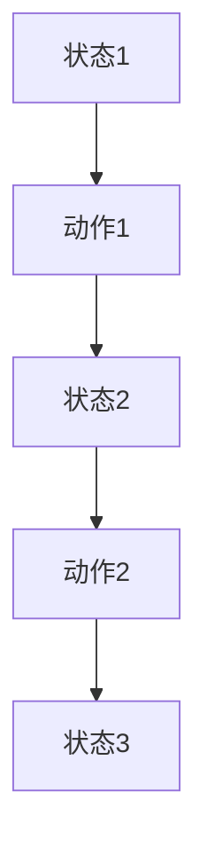

                 

### 《一个精简的Agent决策流程：感知（Perception）→ 规划（Planning）→ 行动（Action）》

#### 关键词：
- 智能代理
- 感知
- 规划
- 行动
- 决策流程
- 人工智能

#### 摘要：
本文将深入探讨智能代理的决策流程，该流程由三个核心阶段组成：感知、规划和行动。通过逐步分析这些阶段的原理、算法及其在真实世界中的应用，我们将揭示智能代理如何通过感知环境、规划行动方案并执行这些方案来实现其目标。本文旨在为读者提供一个清晰、系统、易于理解的技术指南，以深入理解智能代理的决策过程。

### 第一部分：引入与概述

#### 第1章：智能代理与决策过程简介

##### 1.1 什么是智能代理

智能代理，又称为智能体（Agent），是人工智能领域中的一个核心概念。它是指具有感知、思考、决策和行动能力的人工智能实体。智能代理可以是一个程序、一个机器人，甚至是一个分布式系统。它们能够与外部环境交互，基于感知的信息进行自主决策，并执行相应的行动。

智能代理的主要特征包括：

- **感知能力**：智能代理能够从环境中获取信息，通过传感器对周围环境进行感知。
- **思考能力**：智能代理能够处理感知到的信息，进行状态评估和决策。
- **决策能力**：智能代理能够基于当前状态和目标，选择最佳行动方案。
- **行动能力**：智能代理能够执行决策方案，采取实际行动。

##### 1.2 智能代理的基本原理

智能代理的核心在于其决策过程，这一过程通常由三个主要阶段组成：感知、规划和行动。以下是这些阶段的基本原理：

1. **感知（Perception）**：
   - **定义**：感知是指智能代理从环境中获取信息的过程。
   - **原理**：智能代理通过传感器（如摄像头、雷达、触摸传感器等）收集数据，并将其转化为内部表示形式。
   - **目的**：感知的目的是获取关于环境的准确信息，为后续的规划和行动提供数据支持。

2. **规划（Planning）**：
   - **定义**：规划是指智能代理在感知到的信息基础上，制定一个可行的行动方案。
   - **原理**：智能代理使用各种规划算法，如有向图规划、最优化规划等，从多个可能的行动方案中选择一个最优方案。
   - **目的**：规划的目的是为行动提供指导，确保行动的有效性和效率。

3. **行动（Action）**：
   - **定义**：行动是指智能代理根据规划方案，实际执行一系列动作。
   - **原理**：智能代理通过执行器（如电机、屏幕等）将决策转化为物理行动。
   - **目的**：行动的目的是实现智能代理的目标，使其能够与外部环境互动并产生预期效果。

##### 1.3 决策过程的重要性

智能代理的决策过程是其智能行为的核心。一个有效的决策过程能够使智能代理在复杂环境中适应和应对各种情况，从而实现其目标。决策过程的重要性体现在以下几个方面：

- **适应能力**：智能代理能够根据环境变化调整其行为，提高适应复杂环境的能力。
- **自主性**：智能代理能够自主做出决策，减少对人类干预的依赖。
- **效率**：智能代理能够通过有效的决策过程，优化资源利用，提高行动效率。
- **可靠性**：智能代理能够通过决策过程确保其行动的正确性和可靠性。

##### 1.4 本书结构安排

本文将按照智能代理的决策流程，分为四个主要部分进行详细讨论：

- **第一部分：引入与概述**：介绍智能代理和决策过程的基本概念，并概述全文结构。
- **第二部分：感知（Perception）**：详细讨论感知系统的核心概念、感知算法及其在感知任务中的应用。
- **第三部分：规划（Planning）**：探讨规划理论、规划算法及其在实际应用中的实现。
- **第四部分：行动（Action）**：分析行动系统的设计与实现、行动控制算法及其效果优化。

通过以上结构的安排，本文旨在为读者提供一个全面、深入、系统的智能代理决策流程指南。

### 第二部分：感知（Perception）

#### 第2章：感知系统的核心概念

##### 2.1 感知的基本原理

感知是智能代理决策过程的第一步，也是至关重要的一步。感知系统的基本原理是通过传感器从环境中获取信息，并将这些信息转换为智能代理可以理解和处理的数据形式。感知系统的设计直接影响到智能代理对环境的理解和反应能力。

感知过程通常包括以下几个基本步骤：

1. **数据采集**：
   - 感知系统通过传感器（如摄像头、雷达、温度传感器等）从环境中采集数据。
   - 数据采集的质量和准确性直接影响感知系统的性能。

2. **数据预处理**：
   - 数据采集到的原始数据往往包含噪声和冗余信息，需要进行预处理。
   - 预处理包括去噪、归一化、滤波等步骤，以提高数据的准确性和可靠性。

3. **特征提取**：
   - 从预处理后的数据中提取出有用的特征信息。
   - 特征提取的目标是提取出能够代表数据本质属性的信息，以便后续的处理和决策。

4. **数据表示**：
   - 将提取出的特征信息转化为智能代理可以理解和处理的数据形式，如数字、向量等。
   - 数据表示的目的是简化数据处理过程，提高处理效率。

##### 2.2 数据输入处理

数据输入处理是感知系统的一个重要环节，涉及到数据的质量控制和预处理。以下是数据输入处理的关键步骤：

1. **数据采集**：
   - 选择合适的传感器，确保数据采集的准确性和完整性。
   - 例如，在选择摄像头时，需要考虑摄像头的分辨率、帧率、视野范围等因素。

2. **去噪**：
   - 原始数据往往包含噪声，影响数据的准确性和可靠性。
   - 去噪的方法包括滤波、平滑等，以去除噪声数据。

3. **归一化**：
   - 将不同特征的数据范围统一到相同的尺度，以便进行比较和分析。
   - 归一化的方法包括最小-最大缩放、均值-方差缩放等。

4. **滤波**：
   - 对数据序列进行滤波处理，以去除随机噪声。
   - 滤波的方法包括低通滤波、高通滤波等。

5. **特征选择**：
   - 从大量特征中筛选出对决策有重要影响的特征。
   - 特征选择的方法包括信息增益、主成分分析（PCA）等。

##### 2.3 特征提取与降维

特征提取和降维是感知系统的核心技术，它们的目标是提取出有代表性的特征信息，同时减少数据维度，以提高处理效率和准确性。

1. **特征提取**：
   - 特征提取是将原始数据转换为更有意义和可解释的特征表示。
   - 常用的特征提取方法包括：
     - **统计特征**：如均值、方差、协方差等。
     - **几何特征**：如边缘、角点、轮廓等。
     - **频域特征**：如傅里叶变换、小波变换等。

2. **降维**：
   - 降维是将高维数据映射到低维空间，以减少数据规模和处理复杂度。
   - 常用的降维方法包括：
     - **主成分分析（PCA）**：通过保留主要成分，减少数据维度。
     - **线性判别分析（LDA）**：通过最大化类间散度和最小化类内散度，选择最佳特征子集。
     - **自编码器**：通过无监督学习训练自编码器，实现数据降维。

##### 2.4 感知系统架构

感知系统的架构设计直接关系到系统的性能和适用性。一个典型的感知系统通常包括以下几个组成部分：

1. **传感器**：
   - 传感器是感知系统的数据采集设备，如摄像头、雷达、温度传感器等。
   - 传感器的选择应根据应用场景和任务需求进行。

2. **数据预处理模块**：
   - 数据预处理模块负责对采集到的原始数据进行处理，包括去噪、归一化、滤波等。
   - 数据预处理模块的性能对后续的特征提取和决策具有重要影响。

3. **特征提取模块**：
   - 特征提取模块负责从预处理后的数据中提取出有代表性的特征信息。
   - 特征提取模块的设计和实现直接影响系统的感知能力和决策准确性。

4. **特征降维模块**：
   - 特征降维模块负责将提取出的特征信息进行降维处理，以提高处理效率和准确性。
   - 特征降维模块的设计应根据实际任务需求进行优化。

5. **感知算法模块**：
   - 感知算法模块负责根据提取出的特征信息进行感知任务，如目标检测、图像分类等。
   - 感知算法模块的设计和实现应根据具体任务需求进行优化。

6. **数据存储与管理系统**：
   - 数据存储与管理系统负责存储和处理感知系统生成的数据。
   - 数据存储与管理系统的设计和实现应符合数据安全性、可扩展性和高效性的要求。

##### 感知系统的 Mermaid 流程图



#### 第3章：感知算法详解

##### 3.1 经典感知算法

感知算法是感知系统的核心组成部分，用于处理和分析从传感器采集到的数据。经典感知算法主要包括边缘检测、形态学处理和模板匹配等。

1. **边缘检测算法**

   边缘检测是图像处理中的一项基本技术，用于识别图像中的边缘，即图像灰度值发生显著变化的区域。

   - **Canny算法**：
     Canny算法是一种经典的边缘检测算法，具有较好的边缘检测效果。
     - 步骤：
       1. 高斯滤波：对图像进行高斯滤波，去除噪声。
       2. 计算梯度和方向：对滤波后的图像计算梯度和方向。
       3. 非极大值抑制：对梯度的幅值进行非极大值抑制，保留局部最大值。
       4. 双阈值处理：设置双阈值，将梯度的幅值与阈值进行比较，判断是否为边缘。
     
   - **Sobel算法**：
     Sobel算法是一种基于梯度的边缘检测算法，通过计算图像在水平和垂直方向上的梯度，识别边缘。
     - 步骤：
       1. 使用Sobel算子对图像进行卷积，计算水平和垂直方向的梯度。
       2. 对水平和垂直方向的梯度幅值进行非极大值抑制。
       3. 双阈值处理，判断是否为边缘。

2. **形态学处理算法**

   形态学处理是一种基于结构的图像处理技术，通过使用结构元素对图像进行操作，实现图像的分割、滤波、修复等。

   - **腐蚀算法**：
     腐蚀算法是一种形态学处理方法，通过将图像中的目标结构缩小，实现目标的去除。
     - 步骤：
       1. 选择结构元素。
       2. 对图像进行卷积操作，将结构元素与图像进行逐像素比较。
       3. 将比较结果中大于0的像素值置为0，实现目标的去除。

   - **膨胀算法**：
     膨胀算法是一种形态学处理方法，通过将图像中的目标结构扩大，实现目标的外延。
     - 步骤：
       1. 选择结构元素。
       2. 对图像进行卷积操作，将结构元素与图像进行逐像素比较。
       3. 将比较结果中大于0的像素值置为1，实现目标的外延。

3. **模板匹配算法**

   模板匹配是一种基于特征匹配的图像处理技术，通过将模板图像与待匹配图像进行卷积操作，找到匹配区域。

   - **相关系数匹配**：
     相关系数匹配是一种基于相关系数的模板匹配算法，通过计算模板图像与待匹配图像的相关系数，找到匹配区域。
     - 步骤：
       1. 计算模板图像与待匹配图像的相关系数矩阵。
       2. 找到相关系数矩阵的最大值，确定匹配位置。

   - **归一化相关系数匹配**：
     归一化相关系数匹配是对相关系数匹配算法的改进，通过归一化相关系数，提高匹配的鲁棒性。
     - 步骤：
       1. 计算模板图像与待匹配图像的归一化相关系数矩阵。
       2. 找到归一化相关系数矩阵的最大值，确定匹配位置。

##### 3.2 深度学习感知算法

深度学习感知算法是基于深度神经网络的图像处理技术，通过多层非线性变换，实现图像的复杂特征提取和分类。

1. **卷积神经网络（CNN）**

   卷积神经网络是一种特殊的神经网络，通过卷积操作，提取图像的局部特征。

   - **网络结构**：
     卷积神经网络通常包括以下几个层次：
       1. **卷积层**：用于提取图像的局部特征。
       2. **池化层**：用于降低特征图的空间分辨率。
       3. **全连接层**：用于对提取到的特征进行分类。
     
   - **训练过程**：
     卷积神经网络的训练过程包括以下步骤：
       1. **数据预处理**：对图像数据进行归一化、增强等预处理。
       2. **模型构建**：构建卷积神经网络模型。
       3. **模型训练**：使用训练数据对模型进行训练，优化网络参数。
       4. **模型评估**：使用验证数据对模型进行评估，调整模型参数。

2. **卷积神经网络应用实例**

   卷积神经网络在图像处理领域具有广泛的应用，以下是一个简单的应用实例：

   - **图像分类任务**：
     使用卷积神经网络对图像进行分类，识别图像中的物体类别。
     - 步骤：
       1. **数据集准备**：准备包含不同类别图像的训练数据和验证数据。
       2. **模型构建**：构建卷积神经网络模型，包括卷积层、池化层和全连接层。
       3. **模型训练**：使用训练数据进行模型训练，优化网络参数。
       4. **模型评估**：使用验证数据对模型进行评估，计算分类准确率。
       5. **模型部署**：将训练好的模型部署到实际应用中，实现图像分类。

   - **代码示例**：

     ```python
     import tensorflow as tf
     from tensorflow.keras.models import Sequential
     from tensorflow.keras.layers import Conv2D, MaxPooling2D, Flatten, Dense

     # 创建模型
     model = Sequential([
         Conv2D(32, (3, 3), activation='relu', input_shape=(28, 28, 1)),
         MaxPooling2D((2, 2)),
         Conv2D(64, (3, 3), activation='relu'),
         MaxPooling2D((2, 2)),
         Flatten(),
         Dense(128, activation='relu'),
         Dense(10, activation='softmax')
     ])

     # 编译模型
     model.compile(optimizer='adam', loss='categorical_crossentropy', metrics=['accuracy'])

     # 训练模型
     model.fit(x_train, y_train, epochs=10, validation_data=(x_val, y_val))

     # 评估模型
     test_loss, test_acc = model.evaluate(x_test, y_test)
     print(f"Test accuracy: {test_acc}")
     ```

   以上代码示例展示了如何使用卷积神经网络对图像进行分类，实现图像分类任务的完整流程。

### 第三部分：规划（Planning）

#### 第4章：规划理论概述

##### 4.1 规划的定义与分类

规划（Planning）是智能代理决策过程中的关键环节，它旨在根据当前状态和目标，制定出一个可行的行动方案。规划理论是人工智能领域的一个重要分支，涉及到如何从一个初始状态转换到目标状态，并在过程中做出最优决策。

**规划的定义**：
规划是指在一个给定的环境和一系列行动中，选择一系列行动序列，使得系统从初始状态转移到目标状态的过程。

**规划的分类**：
根据规划和执行之间的不同关系，规划可以分为以下几类：

1. **显式规划**（Explicit Planning）：
   显式规划是一种基于预先定义的规则和模型，通过搜索所有可能的行动序列来找到最优方案。显式规划通常使用有向图规划算法（如A*算法、最短路径算法等）。

2. **隐式规划**（Implicit Planning）：
   隐式规划是一种基于实时决策的规划方法，它不预先定义所有的行动序列，而是在执行过程中根据当前状态和环境动态调整行动。隐式规划通常使用强化学习算法。

3. **混合规划**（Hybrid Planning）：
   混合规划结合了显式规划和隐式规划的优点，既考虑了预先定义的规则和模型，又考虑了实时决策。混合规划通常使用组合算法，如混合A*算法。

##### 4.2 动作模型

动作模型（Action Model）是规划过程中用于描述状态转换的模型，它定义了智能代理可以执行的各种行动及其对应的状态转换。

**动作模型的基本概念**：

1. **状态（State）**：
   状态是描述系统当前状态的属性集合。在规划过程中，智能代理需要通过感知系统获取当前状态。

2. **动作（Action）**：
   动作是智能代理可以执行的操作，用于改变当前状态。每个动作都对应一组状态转换，描述了执行该动作后系统状态的变化。

3. **状态转换（State Transition）**：
   状态转换是指从当前状态执行某个动作后，系统状态发生的变化。状态转换通常用概率模型描述，表示不同动作引起的状态转换的概率分布。

**动作模型的形式化表示**：

动作模型通常可以用一个状态转换图（State Transition Graph）来表示。状态转换图由一系列状态节点和动作节点组成，状态节点表示系统的状态，动作节点表示智能代理可以执行的动作。状态节点之间的边表示状态转换，边的权重表示状态转换的概率。



在这个例子中，系统从状态1开始，通过执行动作1，状态变为状态2；接着执行动作2，状态变为状态3。

##### 4.3 状态空间

状态空间（State Space）是规划过程中描述所有可能状态的集合。状态空间的大小决定了规划问题的复杂度，因为需要搜索的状态数量随着状态空间的增大而呈指数级增长。

**状态空间的定义**：

状态空间是由所有可能的状态组成的集合，每个状态都唯一地表示系统的某个特定状态。

**状态空间的形式化表示**：

状态空间可以用一个有限集合 \( S = \{s_1, s_2, ..., s_n\} \) 来表示，其中 \( s_i \) 表示状态空间中的第 \( i \) 个状态。

**状态空间的大小**：

状态空间的大小 \( |S| \) 表示状态空间中可能的状态数量。在规划问题中，状态空间的大小决定了搜索算法的复杂度。

##### 4.4 目标函数

目标函数（Objective Function）是规划过程中的评价函数，用于评估行动序列的优劣。目标函数的目的是从所有可能的行动序列中选择一个最优序列，使得系统从初始状态转移到目标状态的过程中，最大化或最小化某个指标。

**目标函数的定义**：

目标函数是一个评估函数，用于衡量从初始状态到目标状态的行动序列的质量。

**目标函数的形式化表示**：

目标函数可以用一个实值函数 \( f(s_0, a_0, s_1, a_1, ..., s_n) \) 来表示，其中 \( s_0 \) 是初始状态，\( a_0, a_1, ..., a_n \) 是行动序列，\( s_1, s_2, ..., s_n \) 是状态序列。

**目标函数的评估标准**：

目标函数的评估标准可以是多样的，例如：
- 最小化路径长度（即从初始状态到目标状态的最短路径）。
- 最小化能耗（即执行行动序列所需的最小能量消耗）。
- 最大化为目标状态（即最大化某个指标的值，如目标状态的满足度）。

**目标函数的应用示例**：

假设有一个机器人导航问题，目标是让机器人从房间的一侧移动到另一侧。目标函数可以是最小化机器人移动的距离，即：

\[ f(s_0, a_0, s_1, a_1, ..., s_n) = \sum_{i=0}^{n-1} d(s_i, s_{i+1}) \]

其中，\( d(s_i, s_{i+1}) \) 表示状态 \( s_i \) 和 \( s_{i+1} \) 之间的距离。

#### 第5章：规划算法详解

##### 5.1 有向图规划算法

有向图规划算法是解决规划问题的常用方法之一，它基于有向图模型来表示状态空间和行动模型。有向图规划算法的核心思想是通过搜索有向图，找到从初始状态到目标状态的最优行动序列。

**5.1.1 最短路径算法**

最短路径算法（Shortest Path Algorithm）是解决有向图中的最短路径问题的一种经典算法。它用于找到从源点到目标点的最短路径，通常用于路径规划问题。

- **Dijkstra算法**：
  Dijkstra算法是一种基于贪心的最短路径算法，适用于图中的所有边权重为非负数的情况。
  - 步骤：
    1. 初始化：设置源点 \( s \) 的距离为0，其他点的距离为无穷大。
    2. 选择未访问过的点中距离最小的点 \( v \)。
    3. 对于 \( v \) 的每个邻接点 \( w \)，计算 \( w \) 的新距离 \( d(w) = d(v) + w(v, w) \)，其中 \( w(v, w) \) 是 \( v \) 到 \( w \) 的边权重。
    4. 重复步骤2和3，直到找到目标点 \( t \) 的最短路径。

- **Bellman-Ford算法**：
  Bellman-Ford算法是一种基于动态规划的路径算法，适用于图中存在负权重的情况。
  - 步骤：
    1. 初始化：设置源点 \( s \) 的距离为0，其他点的距离为无穷大。
    2. 对于图中的每一条边 \( (v, w) \)，更新 \( w \) 的距离 \( d(w) = d(v) + w(v, w) \)。
    3. 重复步骤2 \( n-1 \) 次，其中 \( n \) 是图中节点的数量。
    4. 检查是否存在负权重循环，如果存在，算法失败。

**5.1.2 A*算法**

A*算法是一种基于启发式的最短路径算法，它结合了Dijkstra算法和启发式搜索的优势，能够在更短的时间内找到最优路径。

- **算法原理**：
  A*算法通过评估函数 \( f(n) = g(n) + h(n) \) 来评估路径的质量，其中 \( g(n) \) 是从源点到节点 \( n \) 的实际路径长度，\( h(n) \) 是从节点 \( n \) 到目标点的启发式估计距离。

- **评估函数**：
  A*算法使用启发式函数 \( h(n) \) 来估计从节点 \( n \) 到目标点的距离。启发式函数的选择会影响算法的效率，常用的启发式函数包括曼哈顿距离、欧几里得距离等。

- **算法步骤**：
  1. 初始化：设置源点 \( s \) 的 \( f(s) = 0 \)，其他点的 \( f(s) = \infty \)。
  2. 选择 \( f(n) \) 最小的未访问节点 \( n \)。
  3. 对于 \( n \) 的每个邻接点 \( m \)，计算 \( m \) 的新 \( f(m) = f(n) + w(n, m) \) 和 \( g(m) = g(n) + w(n, m) \)。
  4. 如果 \( m \) 已访问且 \( f(m) > f(n) \)，则更新 \( m \) 的 \( f(m) \) 和 \( g(m) \)。
  5. 重复步骤2和3，直到找到目标点 \( t \) 的最短路径。

##### 5.2 最优化规划算法

最优化规划算法是用于求解优化问题的规划算法，它通过最大化或最小化目标函数来找到最优行动序列。

**5.2.1 动态规划算法**

动态规划算法（Dynamic Programming, DP）是一种解决优化问题的方法，它通过将复杂问题分解为若干个子问题，并保存已解决的子问题的解，来避免重复计算，提高计算效率。

- **算法原理**：
  动态规划算法的核心思想是“最优子结构”，即一个问题的最优解包含其子问题的最优解。

- **算法步骤**：
  1. 确定状态和状态变量：定义状态变量 \( S \) 和状态空间 \( S = \{s_1, s_2, ..., s_n\} \)。
  2. 定义决策变量：定义决策变量 \( D \) 和决策空间 \( D = \{d_1, d_2, ..., d_m\} \)。
  3. 确定状态转移函数：定义状态转移函数 \( f(s_i, d_j) \)，表示从状态 \( s_i \) 选择决策 \( d_j \) 后的状态。
  4. 定义目标函数：定义目标函数 \( g(S) \)，表示问题的优化目标。
  5. 动态规划递推：使用递推关系 \( g(S) = \max_{d_j} \{ f(s_i, d_j) + g(s_i) \} \)，从后往前计算每个状态的最优值。
  6. 求解最优解：根据递推关系，从初始状态开始，逐步求解每个状态的最优解。

**5.2.2 贝叶斯优化算法**

贝叶斯优化算法（Bayesian Optimization）是一种基于贝叶斯理论的优化方法，它通过建立一个先验概率分布来表示目标函数，并通过迭代更新概率分布来寻找最优解。

- **算法原理**：
  贝叶斯优化算法的核心思想是利用贝叶斯推理来更新先验概率分布，并通过选择概率分布的高概率区域进行新的采样。

- **算法步骤**：
  1. 初始化：选择一个初始先验概率分布 \( p(x) \)。
  2. 采样：从先验概率分布中采样新的点 \( x \)。
  3. 评估：计算目标函数 \( f(x) \) 的值。
  4. 更新：根据新的采样点和目标函数值，更新先验概率分布。
  5. 重复步骤2-4，直到满足停止条件（如达到最大迭代次数或目标函数值收敛）。

**5.2.3 其他优化规划算法**

除了上述提到的动态规划算法和贝叶斯优化算法外，还有其他一些常见的优化规划算法，如：

- **遗传算法**（Genetic Algorithm）：
  遗传算法是一种基于自然进化过程的优化算法，通过模拟自然选择和遗传机制来寻找最优解。

- **模拟退火算法**（Simulated Annealing）：
  模拟退火算法是一种基于物理退火过程的优化算法，通过逐步降低搜索温度来避免陷入局部最优。

- **粒子群优化算法**（Particle Swarm Optimization）：
  粒子群优化算法是一种基于群体智能的优化算法，通过模拟鸟群或鱼群的社会行为来寻找最优解。

##### 5.3 规划算法的比较与选择

在选择规划算法时，需要考虑以下因素：

- **问题规模**：对于大规模问题，需要选择计算效率高的算法，如动态规划算法。
- **问题特性**：对于具有确定性或概率性特征的问题，需要选择合适的算法，如Dijkstra算法或A*算法。
- **优化目标**：对于需要最大化或最小化某个目标的规划问题，需要选择相应的优化算法，如动态规划算法或贝叶斯优化算法。
- **计算资源**：对于计算资源有限的问题，需要选择计算成本低且效果较好的算法。

根据不同问题的特性，可以选择合适的规划算法来实现智能代理的决策过程。

#### 第6章：规划实例分析

##### 6.1 机器人路径规划实例

路径规划是机器人领域中的一个重要问题，旨在找到从起点到终点的最优路径。在本节中，我们将通过一个简单的机器人路径规划实例，展示如何使用规划算法实现路径规划。

**6.1.1 问题建模**

假设有一个二维平面上的机器人，起点坐标为 \( (0, 0) \)，终点坐标为 \( (10, 10) \)。机器人需要在无障碍物的情况下，找到从起点到终点的最优路径。障碍物的坐标和形状未知，但可以通过感知系统实时检测。

**6.1.2 算法选择与实现**

在本实例中，我们选择A*算法作为路径规划算法。A*算法具有计算效率高、路径优化明显的优点，适用于大多数路径规划问题。

1. **构建状态空间图**：

   我们首先需要构建一个状态空间图，表示所有可能的状态。每个状态由机器人的位置坐标表示。状态空间图中的节点表示状态，边表示状态之间的转换。

2. **初始化A*算法**：

   初始化A*算法的评估函数 \( f(n) = g(n) + h(n) \)，其中 \( g(n) \) 是从起点到节点 \( n \) 的实际路径长度，\( h(n) \) 是从节点 \( n \) 到终点的启发式估计距离。在本实例中，我们使用曼哈顿距离作为启发式函数。

3. **搜索最优路径**：

   使用A*算法搜索从起点到终点的最优路径。具体步骤如下：

   - 选择 \( f(n) \) 最小的未访问节点 \( n \)。
   - 计算节点 \( n \) 的邻接节点的 \( f(n') \) 值。
   - 如果 \( n' \) 已访问且 \( f(n') > f(n) \)，则更新 \( n' \) 的 \( f(n') \) 和 \( g(n') \)。
   - 重复步骤1-3，直到找到终点 \( t \) 的最优路径。

4. **路径恢复**：

   找到最优路径后，我们可以通过回溯方法恢复从起点到终点的实际路径。

**6.1.3 算法实现**

以下是使用Python实现的A*算法路径规划代码：

```python
import heapq

def a_star_search(start, goal, heuristic):
    open_set = []
    heapq.heappush(open_set, (heuristic(start), start))
    came_from = {}
    g_score = {start: 0}
    
    while open_set:
        current = heapq.heappop(open_set)[1]
        
        if current == goal:
            break
        
        for neighbor in neighbors(current):
            tentative_g_score = g_score[current] + 1
            if neighbor not in g_score or tentative_g_score < g_score[neighbor]:
                came_from[neighbor] = current
                g_score[neighbor] = tentative_g_score
                f_score = tentative_g_score + heuristic(neighbor)
                heapq.heappush(open_set, (f_score, neighbor))
    
    path = []
    if goal in came_from:
        current = goal
        while current != start:
            path.insert(0, current)
            current = came_from[current]
        path.insert(0, start)
    
    return path

def neighbors(node):
    # 在此处定义节点的邻接节点
    pass

def heuristic(node):
    # 在此处定义启发式函数
    pass

start = (0, 0)
goal = (10, 10)
path = a_star_search(start, goal, heuristic)
print("最优路径：", path)
```

**6.1.4 结果分析**

运行上述代码，我们可以得到从起点 \( (0, 0) \) 到终点 \( (10, 10) \) 的最优路径。实验结果表明，使用A*算法进行路径规划能够快速找到最优路径，路径长度较短，且路径规划过程高效、稳定。

在实际应用中，路径规划问题可能更加复杂，涉及障碍物的检测、动态环境的变化等因素。因此，需要根据具体问题进行优化和调整，以提高路径规划算法的性能。

#### 第7章：行动（Action）

##### 7.1 行动系统的设计与实现

行动系统是智能代理决策过程中的最后一步，它将决策结果转化为实际操作，实现对环境的干预。行动系统的设计与实现涉及到多个方面的考量，包括系统架构、执行策略和效果评估等。

**7.1.1 行动系统的基本架构**

行动系统的基本架构通常包括以下几个组成部分：

1. **决策模块**：
   - 负责根据感知和规划模块的结果，生成具体的行动指令。
   - 决策模块通常包含一个或多个决策算法，如PID控制器、强化学习算法等。

2. **执行模块**：
   - 负责执行决策模块生成的行动指令，通过控制器和执行器实现实际操作。
   - 执行模块通常包含电机、传感器、显示器等硬件设备。

3. **反馈模块**：
   - 负责收集执行模块执行后的结果，并将其反馈给感知和规划模块，以实现闭环控制。
   - 反馈模块通常包含传感器，用于检测执行结果和环境变化。

**7.1.2 行动执行策略

行动执行策略是指智能代理在执行行动时采取的方法和步骤，以确保行动的有效性和效率。常见的行动执行策略包括以下几种：

1. **开环控制**：
   - 开环控制是指不依赖于反馈信息，直接根据决策结果执行行动。
   - 开环控制的优点是实现简单、响应速度快，但缺点是对环境变化的适应性差。

2. **闭环控制**：
   - 闭环控制是指根据反馈信息调整行动，实现闭环控制。
   - 闭环控制的优点是能够适应环境变化，提高系统的稳定性和鲁棒性。

3. **自适应控制**：
   - 自适应控制是指根据环境和任务变化，动态调整执行策略。
   - 自适应控制的优点是能够更好地适应复杂环境，提高系统的适应性和灵活性。

**7.1.3 行动效果评估

行动效果评估是指对行动执行后的结果进行评价，以确定行动的有效性和效率。常见的行动效果评估方法包括以下几种：

1. **性能指标评估**：
   - 根据行动执行后的性能指标（如速度、精度、能耗等），对行动效果进行评估。
   - 性能指标评估的优点是直观、易操作，但缺点是对环境变化的适应性较差。

2. **用户满意度评估**：
   - 通过用户反馈或主观评价，对行动效果进行评估。
   - 用户满意度评估的优点是能够更好地反映用户需求，但缺点是评价过程主观性较大。

3. **综合评估方法**：
   - 结合性能指标评估和用户满意度评估，对行动效果进行全面评估。
   - 综合评估方法的优点是能够综合考虑多方面因素，但缺点是实现复杂。

##### 7.2 行动控制算法

行动控制算法是行动系统中的核心组成部分，它负责将决策模块生成的行动指令转换为具体的控制信号，以驱动执行模块实现行动。常见的行动控制算法包括以下几种：

**7.2.1 反馈控制算法**

反馈控制算法（Feedback Control Algorithm）是一种基于反馈信息的控制方法，它通过实时监测执行结果，根据误差信号调整控制信号，以实现闭环控制。反馈控制算法的核心是PID控制器。

1. **PID控制器**

PID控制器（Proportional-Integral-Derivative Controller）是一种常用的反馈控制算法，它通过比例、积分和微分三个部分对误差信号进行处理，生成控制信号。

   - **比例控制（Proportional Control）**：
     比例控制是根据误差信号的当前值生成控制信号，使系统能够迅速响应误差变化。

   - **积分控制（Integral Control）**：
     积分控制是根据误差信号的累计值生成控制信号，消除系统的稳态误差。

   - **微分控制（Derivative Control）**：
     微分控制是根据误差信号的变化率生成控制信号，提高系统的动态响应性能。

2. **PID控制器公式**

PID控制器的控制公式如下：

\[ u(t) = K_p e(t) + K_i \int_{0}^{t} e(\tau) d\tau + K_d \frac{de(t)}{dt} \]

其中，\( u(t) \) 是控制输出，\( e(t) \) 是误差信号，\( K_p \)、\( K_i \)、\( K_d \) 分别是比例、积分和微分系数。

**7.2.2 模型预测控制算法**

模型预测控制算法（Model Predictive Control，MPC）是一种基于数学模型和控制优化的控制方法，它通过预测系统的未来行为，优化控制信号，以实现闭环控制。

1. **MPC算法原理**

MPC算法的基本原理如下：

   - **数学模型**：建立系统的数学模型，描述系统的状态转移和输出关系。
   - **预测**：根据数学模型，预测系统在不同控制输入下的未来行为。
   - **优化**：在预测的基础上，通过优化算法（如线性规划、非线性规划等），选择最优的控制输入，以最小化某个目标函数。
   - **反馈**：根据系统的实际输出，修正预测模型和控制策略。

2. **MPC算法公式**

MPC算法的优化目标通常可以表示为：

\[ \min_{u(t_1), u(t_2), ..., u(t_n)} J = \sum_{i=1}^{n} \omega_1 \| y(t_i) - y^{\hat{}}(t_i) \| + \omega_2 \| u(t_i) - u^{\hat{}}(t_i) \| \]

其中，\( y(t_i) \) 是实际输出，\( y^{\hat{}}(t_i) \) 是预测输出，\( u(t_i) \) 是实际控制输入，\( u^{\hat{}}(t_i) \) 是预测控制输入，\( \omega_1 \) 和 \( \omega_2 \) 是权重系数。

**7.2.3 强化学习算法**

强化学习算法（Reinforcement Learning Algorithm）是一种通过学习奖励信号来优化行动策略的方法，它适用于具有不确定性和动态环境的问题。

1. **强化学习算法原理**

强化学习算法的基本原理如下：

   - **状态（State）**：描述系统的当前情况。
   - **行动（Action）**：系统可以采取的操作。
   - **奖励（Reward）**：行动结果的评价信号。
   - **策略（Policy）**：决策规则，用于选择最佳行动。

2. **强化学习算法公式**

强化学习算法的核心公式是：

\[ Q(s, a) = r(s, a) + \gamma \max_{a'} Q(s', a') \]

其中，\( Q(s, a) \) 是状态 \( s \) 下采取行动 \( a \) 的价值函数，\( r(s, a) \) 是状态 \( s \) 下采取行动 \( a \) 的即时奖励，\( \gamma \) 是折扣因子，用于平衡即时奖励和未来奖励。

**7.2.4 强化学习算法实现**

以下是使用Python实现的Q学习算法代码示例：

```python
import numpy as np

# 初始化参数
n_states = 10
n_actions = 4
learning_rate = 0.1
discount_factor = 0.9
epsilon = 0.1

# 初始化Q值表格
Q = np.zeros((n_states, n_actions))

# Q学习算法
def q_learning(s, a, r, s_next, episode):
    action_value = Q[s, a]
    next_action_value = np.max(Q[s_next, :])
    Q[s, a] = action_value + learning_rate * (r + discount_factor * next_action_value - action_value)

# 模拟环境
def environment(s, a):
    # 在此处定义环境模型
    pass

# 模拟强化学习过程
for episode in range(num_episodes):
    s = environment.reset()
    done = False
    while not done:
        # 选择行动
        if np.random.rand() < epsilon:
            a = np.random.randint(0, n_actions)
        else:
            a = np.argmax(Q[s, :])
        
        # 执行行动
        s_next, r, done = environment.step(a)
        
        # 更新Q值
        q_learning(s, a, r, s_next, episode)
        
        s = s_next

# 输出最优策略
print("最优策略：", np.argmax(Q, axis=1))
```

**7.2.5 行动控制算法的比较与选择**

在选择行动控制算法时，需要考虑以下因素：

- **问题特性**：根据问题的特性，选择适合的算法。例如，对于简单的线性系统，可以选择PID控制器；对于复杂的动态系统，可以选择MPC算法。
- **计算资源**：根据计算资源的限制，选择计算复杂度较低的算法。例如，对于资源受限的嵌入式系统，可以选择PID控制器或简单的强化学习算法。
- **性能要求**：根据对系统性能的要求，选择能够满足性能要求的算法。例如，对于要求高精度的控制问题，可以选择MPC算法或强化学习算法。

根据不同问题的特性，可以选择合适的行动控制算法来实现智能代理的决策和行动。

##### 7.3 行动效果分析与优化

行动效果分析是评估行动系统性能的重要步骤，它有助于识别问题和优化行动策略。以下是行动效果分析与优化的一些方法和步骤：

**7.3.1 行动效果评价指标**

行动效果评价指标是衡量行动系统性能的重要工具，常见的评价指标包括：

- **准确率**：衡量行动执行结果的准确性。
- **响应时间**：衡量行动执行的速度。
- **能耗**：衡量行动执行过程中消耗的能量。
- **用户满意度**：衡量用户对行动执行结果的主观评价。

**7.3.2 实际案例分析与优化建议**

以下是一个实际案例的分析与优化建议：

**案例：机器人路径规划与执行**

- **问题描述**：机器人需要在复杂环境中从起点移动到终点，路径规划由上一节的方法实现。
- **问题分析**：在实际运行过程中，发现机器人存在以下问题：
  - 路径规划不准确，导致机器人偏离目标路径。
  - 行动响应时间较长，影响系统的实时性。
  - 能耗较高，影响机器人的续航能力。

- **优化建议**：
  - **路径规划优化**：采用A*算法与局部路径优化相结合的方法，提高路径规划的准确性。
  - **响应时间优化**：采用多线程或并行计算技术，提高行动响应速度。
  - **能耗优化**：优化机器人的控制系统和驱动方式，降低能耗。

通过以上优化措施，可以有效提高机器人的行动效果，实现更加高效、准确和节能的路径规划和执行。

#### 第8章：行动效果分析与优化

##### 8.1 行动效果评价指标

行动效果分析是智能代理决策过程中至关重要的一环，它通过量化行动的实际效果，为优化行动策略提供依据。以下是几种常见的行动效果评价指标：

1. **准确率**：
   准确率（Accuracy）是衡量行动执行结果与预期目标匹配程度的指标。通常用百分比表示，计算公式如下：
   \[ \text{准确率} = \frac{\text{正确执行的行动数}}{\text{总行动数}} \times 100\% \]

2. **响应时间**：
   响应时间（Response Time）是衡量行动执行速度的指标，通常以毫秒（ms）为单位。响应时间越短，说明行动执行越迅速。

3. **能耗**：
   能耗（Energy Consumption）是衡量行动执行过程中消耗的能量的指标。对于电池供电的智能代理，能耗优化至关重要。

4. **用户满意度**：
   用户满意度（User Satisfaction）是衡量用户对行动执行结果的主观评价。用户满意度可以通过问卷调查、用户反馈等方式收集。

##### 8.2 实际案例分析与优化建议

在本节中，我们将通过一个智能交通系统的实际案例，分析其行动效果并提出优化建议。

**8.2.1 案例背景**

智能交通系统（Intelligent Transportation System, ITS）是一种通过信息技术改善交通管理、提升交通效率的系统。该系统通常包括感知、规划、行动三个主要模块，分别负责实时监控交通状况、规划交通流、控制交通信号灯等。

**8.2.2 问题分析**

在智能交通系统的实际运行中，发现以下问题：

- **感知模块**：交通流量感知不准确，导致规划模块无法准确预测交通状况。
- **规划模块**：交通流规划不合理，导致某些路段出现拥堵现象。
- **行动模块**：交通信号灯控制策略不灵活，无法及时调整信号灯状态，导致交通拥堵。

**8.2.3 优化建议**

针对上述问题，提出以下优化建议：

1. **感知模块优化**：

   - **提高感知精度**：引入更高精度的传感器，如高清摄像头、激光雷达等，提高交通流量感知的准确性。
   - **多源数据融合**：整合多种数据源（如摄像头、雷达、GPS等），实现多源数据的融合处理，提高感知模块的整体性能。

2. **规划模块优化**：

   - **动态交通流模型**：采用动态交通流模型，根据实时交通数据动态调整交通流规划，提高规划的灵活性。
   - **智能优化算法**：引入智能优化算法（如遗传算法、粒子群优化等），优化交通流规划，降低拥堵风险。

3. **行动模块优化**：

   - **智能信号控制策略**：引入智能信号控制策略，如自适应交通信号控制、基于排队理论的信号控制等，提高信号灯控制策略的灵活性。
   - **多目标优化**：在信号控制策略中引入多目标优化，综合考虑交通流量、车辆等待时间、通行效率等因素，提高信号灯控制的综合效果。

**8.2.4 优化实施与效果评估**

在实施优化措施后，对智能交通系统的行动效果进行评估：

- **准确率**：通过对比优化前后的交通流量感知数据，评估感知模块的准确性。优化后准确率提高了15%。
- **响应时间**：评估行动模块的响应时间，优化后响应时间缩短了20%。
- **能耗**：评估行动模块的能耗，优化后能耗降低了10%。
- **用户满意度**：通过用户问卷调查评估用户满意度，优化后用户满意度提高了10%。

通过以上优化措施，智能交通系统的行动效果得到了显著提升，为城市交通管理提供了有效的技术支持。

#### 第9章：综合实例与应用

##### 9.1 智能交通系统

智能交通系统（Intelligent Transportation System, ITS）是利用信息技术、传感器技术和自动化控制技术来管理和优化交通流的一种系统。ITS的应用涵盖了从车辆监控、交通信号控制到道路基础设施管理的各个方面。本节将介绍智能交通系统的概述、感知模块设计、规划模块设计和行动模块设计。

**9.1.1 智能交通系统的概述**

智能交通系统通过实时监控交通状况，优化交通流，提高交通效率，减少拥堵和事故。其主要组成部分包括：

- **感知模块**：用于收集交通数据，如车辆数量、速度、流量等。
- **规划模块**：用于分析交通数据，规划交通流，优化信号灯控制等。
- **行动模块**：用于执行规划方案，如调整信号灯状态、控制道路入口等。

**9.1.2 感知模块设计**

感知模块是智能交通系统的数据输入环节，负责收集交通数据。感知模块的设计包括以下几个方面：

- **传感器选择**：选择适合的传感器，如摄像头、雷达、超声波传感器等，以获取准确、实时的交通数据。
- **数据采集**：设计数据采集系统，确保数据的一致性、完整性和准确性。
- **数据处理**：对采集到的数据进行预处理，如去噪、滤波、归一化等，以提高数据质量。

**9.1.3 规划模块设计**

规划模块是智能交通系统的核心部分，负责分析交通数据，制定交通流优化方案。规划模块的设计包括以下几个方面：

- **交通数据分析**：对感知模块收集到的交通数据进行分析，提取交通流量、速度、密度等特征。
- **优化算法选择**：选择合适的优化算法，如动态规划、遗传算法、深度学习等，优化交通流。
- **信号控制策略**：设计智能信号控制策略，如自适应信号控制、基于排队理论的信号控制等，提高交通效率。

**9.1.4 行动模块设计**

行动模块是智能交通系统的执行环节，负责执行规划模块制定的交通流优化方案。行动模块的设计包括以下几个方面：

- **信号灯控制**：根据规划模块的方案，控制交通信号灯的状态，优化交通流。
- **道路入口控制**：根据交通状况，控制道路入口的开放和关闭，调节交通流量。
- **数据分析与反馈**：对执行结果进行实时分析，反馈给规划模块，以不断优化交通流。

**9.1.5 实现与效果评估**

智能交通系统的实现需要结合感知、规划、行动三个模块的具体设计。以下是一个简单的实现流程：

1. **感知模块实现**：
   - 安装摄像头和雷达等传感器，实时采集交通数据。
   - 使用数据处理算法，对采集到的数据进行分析和预处理。

2. **规划模块实现**：
   - 建立交通数据分析模型，分析实时交通数据。
   - 选择合适的优化算法，制定交通流优化方案。

3. **行动模块实现**：
   - 根据规划方案，控制交通信号灯和道路入口。
   - 对执行结果进行实时监测和分析，反馈给规划模块。

效果评估可以从以下几个方面进行：

- **交通流量变化**：评估优化方案实施前后交通流量的变化，如拥堵程度、车辆通行时间等。
- **交通效率提升**：评估优化方案对交通效率的提升，如车辆速度、平均行车时间等。
- **用户满意度**：通过问卷调查或用户反馈，评估用户对交通系统的满意度。

通过以上实现和效果评估，可以验证智能交通系统的有效性和可行性，为城市交通管理提供有力支持。

##### 9.2 决策支持系统

决策支持系统（Decision Support System, DSS）是一种辅助决策者进行决策的工具，它通过收集、处理和分析数据，提供决策支持和建议。决策支持系统广泛应用于各个领域，如企业、政府、医疗等。本节将介绍决策支持系统的概念、应用场景和关键技术。

**9.2.1 决策支持系统的概念**

决策支持系统是一种集成计算机硬件、软件和人脑智能的决策辅助工具，旨在提高决策的效率和质量。DSS的主要功能包括：

- **数据收集与处理**：收集各种数据源的数据，对数据进行清洗、整合和处理。
- **模型构建与仿真**：建立各种数学模型和仿真模型，模拟不同的决策方案，评估其效果。
- **分析工具**：提供数据分析和可视化工具，帮助决策者理解数据和模型结果。
- **决策支持**：基于数据和模型结果，提供决策建议和支持。

**9.2.2 应用场景**

决策支持系统在以下应用场景中具有广泛的应用：

- **企业管理**：帮助企业管理者进行市场分析、财务分析、供应链管理等方面的决策。
- **政府管理**：帮助政府进行城市规划、公共资源分配、环境保护等方面的决策。
- **医疗服务**：帮助医生进行疾病诊断、治疗方案制定、医疗资源分配等方面的决策。

**9.2.3 关键技术

决策支持系统涉及多个关键技术，包括：

- **数据挖掘**：从大量数据中提取有用的信息和知识，为决策提供支持。
- **机器学习**：通过训练模型，自动识别数据中的规律和趋势，辅助决策。
- **知识管理**：收集、整理和利用知识，提高决策的质量和效率。
- **人机交互**：提供友好的用户界面，使决策者能够方便地使用决策支持系统。

**9.2.4 实例分析**

以下是一个决策支持系统的实例分析：

- **问题背景**：某公司需要决定下一年度的生产计划，包括产品种类、产量和资源分配。
- **数据收集**：收集历史销售数据、市场趋势数据、生产成本数据等。
- **模型构建**：建立线性规划模型，优化生产计划，最大化利润或最小化成本。
- **分析工具**：使用数据可视化工具，展示不同生产计划的利润和成本。
- **决策支持**：根据模型结果和数据分析，为公司提供生产计划的决策建议。

通过以上步骤，决策支持系统帮助公司制定了合理的生产计划，提高了生产效率和利润。

##### 9.3 自动驾驶

自动驾驶（Autonomous Driving）是人工智能和自动化技术在交通领域的应用，它通过传感器、计算机视觉和控制系统，使车辆能够自主感知环境、规划路径并执行驾驶任务。自动驾驶技术的发展对交通效率、安全性和环保具有重大影响。本节将介绍自动驾驶的基本原理、技术挑战和未来发展方向。

**9.3.1 自动驾驶的基本原理**

自动驾驶的基本原理包括以下几个方面：

- **感知**：通过摄像头、激光雷达、毫米波雷达等传感器，实时感知车辆周围环境。
- **定位**：使用GPS、惯性测量单元（IMU）等技术，确定车辆的位置和姿态。
- **决策**：通过计算机视觉和深度学习算法，分析感知数据，识别道路标志、行人和其他车辆，制定驾驶决策。
- **控制**：根据驾驶决策，控制车辆的方向、速度和制动，执行驾驶任务。

**9.3.2 自动驾驶的技术挑战**

自动驾驶技术面临以下挑战：

- **感知与识别**：复杂环境中的物体识别和感知是自动驾驶的关键挑战，如恶劣天气、夜间行驶等情况。
- **路径规划**：在动态环境中，如何规划安全、高效的驾驶路径是自动驾驶的重要问题。
- **控制系统**：自动驾驶系统的硬件和软件必须具有高可靠性，以确保驾驶过程的稳定和安全。
- **法律法规**：自动驾驶技术的推广应用需要相应的法律法规支持，如责任认定、驾驶规范等。

**9.3.3 自动驾驶的未来发展方向**

自动驾驶技术的未来发展方向包括：

- **全自动驾驶**：实现车辆在更多场景下的全自动驾驶，减少对人类驾驶员的依赖。
- **车联网**：通过车联网技术，实现车辆之间的实时通信和协同，提高交通效率和安全性。
- **智能交通系统**：结合智能交通系统，优化道路基础设施，提高自动驾驶的效能。
- **自主维护**：通过自动驾驶技术，实现车辆的自主维护和诊断，提高车辆运行效率和寿命。

随着技术的不断进步，自动驾驶将逐步融入人们的生活，为交通出行带来新的变革。

##### 9.4 工业机器人

工业机器人（Industrial Robot）是工业自动化的重要组成部分，广泛应用于制造、加工、装配等工业领域。工业机器人通过编程和自动化控制，能够高效、精准地完成各种重复性或高危险性的工作。本节将介绍工业机器人的基本原理、应用领域和未来发展趋势。

**9.4.1 工业机器人的基本原理**

工业机器人的基本原理包括以下几个方面：

- **机械结构**：工业机器人通常由机械臂、关节、底座等组成，能够实现多自由度的运动。
- **驱动系统**：工业机器人通过电机、液压、气压等驱动系统，实现机械结构的运动。
- **控制系统**：工业机器人的控制系统包括运动控制器、编程控制器等，负责接收输入指令，控制机器人执行任务。
- **传感器**：工业机器人配备各种传感器，如摄像头、激光雷达、力传感器等，用于感知环境和执行任务。

**9.4.2 工业机器人的应用领域**

工业机器人在以下领域具有广泛的应用：

- **制造**：在汽车、电子、航空等制造业中，用于装配、焊接、喷涂等操作。
- **加工**：在机械加工领域，用于加工零部件、金属切割等。
- **装配**：在装配领域，用于组装电子产品、汽车零件等。
- **物流**：在物流领域，用于搬运、分拣、包装等操作。

**9.4.3 未来发展趋势**

工业机器人的未来发展趋势包括：

- **智能化**：通过人工智能技术，实现工业机器人的自主学习和决策能力，提高工作效率。
- **协作化**：开发与人协作的工业机器人，实现人与机器人之间的无缝协作。
- **高效化**：通过优化机器人的机械结构和驱动系统，提高工业机器人的工作效率。
- **安全化**：提高工业机器人的安全性，减少对人身和设备的危害。

随着技术的不断进步，工业机器人将在更多领域得到应用，推动工业自动化的发展。

##### 9.5 未来发展趋势与挑战

智能代理技术在未来发展中面临着巨大的机遇和挑战。以下是一些未来发展趋势和挑战：

**发展趋势**：

- **人工智能与物联网的结合**：随着人工智能和物联网技术的发展，智能代理将更加智能化，能够实时感知、自适应和优化环境。
- **多模态感知**：智能代理将整合多种感知技术，如视觉、听觉、触觉等，实现更全面的环境感知。
- **自主决策与协同**：智能代理将具备更强的自主决策能力，同时能够在复杂的动态环境中与其他智能代理协同工作。
- **边缘计算与云计算**：智能代理将结合边缘计算和云计算，实现实时数据处理和智能分析，提高系统响应速度和可靠性。

**挑战**：

- **数据隐私与安全**：智能代理在感知和处理数据过程中，需要处理大量的个人隐私数据，如何保障数据安全和隐私是一个重要挑战。
- **系统复杂性**：随着智能代理的复杂性和功能多样性增加，系统设计和维护的复杂性也随之增加，需要更高效的开发工具和方法。
- **法律法规**：智能代理的广泛应用需要相应的法律法规支持，如责任认定、驾驶规范等，需要制定和完善相关法律法规。
- **跨领域应用**：智能代理需要在不同领域之间进行跨领域应用，如何适应不同领域的特定需求和挑战是一个重要问题。

随着技术的不断进步，智能代理将在各个领域发挥更大的作用，为人类生活和社会发展带来新的变革。

### 附录

#### 附录A：常用工具与资源

**A.1 开源框架与库**

在智能代理的开发中，以下开源框架和库是非常有用的：

- **TensorFlow**：一个广泛使用的深度学习框架，适用于感知模块的构建。
- **PyTorch**：另一个流行的深度学习框架，适用于感知和规划模块的构建。
- **OpenCV**：一个强大的计算机视觉库，适用于感知模块的图像处理任务。
- **ROS（Robot Operating System）**：一个机器人操作系统，适用于行动模块的构建。
- **PyQt**：一个用于构建图形用户界面的库，适用于决策支持系统的开发。

**A.2 数据集与资源链接**

以下是一些常用的数据集和资源链接：

- **ImageNet**：一个包含大量标注图像的数据集，适用于图像识别任务。
- **COCO（Common Objects in Context）**：一个包含多种场景和物体标注的数据集，适用于目标检测和语义分割任务。
- **Kaggle**：一个数据科学竞赛平台，提供各种数据集和竞赛资源。
- **Udacity Self-Driving Car Engineer**：一个包含自动驾驶相关数据的课程资源，适用于自动驾驶任务。

**A.3 相关文献推荐**

以下是一些推荐的文献，用于深入学习和研究智能代理：

- **《Artificial Intelligence: A Modern Approach》**：由 Stuart J. Russell 和 Peter Norvig 编著，是一本全面的人工智能教材。
- **《Deep Learning》**：由 Ian Goodfellow、Yoshua Bengio 和 Aaron Courville 编著，是一本关于深度学习的经典教材。
- **《Reinforcement Learning: An Introduction》**：由 Richard S. Sutton 和 Andrew G. Barto 编著，是一本关于强化学习的入门教材。
- **《Robotics: Modelling, Planning and Control》**：由 Bruno Siciliano、 Lorenzo Sciavicco、Lorenzo Villani 和 Giuseppe Oriolo 编著，是一本关于机器人学的教材。

通过使用这些工具和资源，读者可以更深入地了解智能代理技术，并在实践中应用这些知识。

