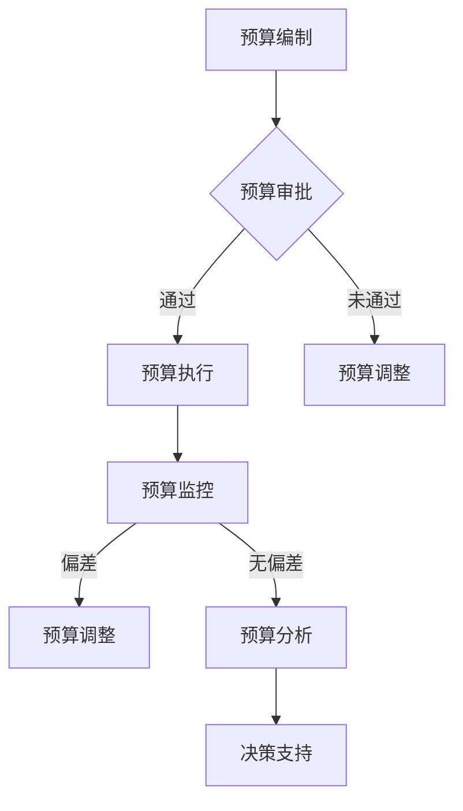

                 

# 一人公司的敏捷财务管理与预算控制

> **关键词：** 敏捷财务管理、预算控制、一人公司、数字化工具、自动化、成本管理

> **摘要：** 本文旨在探讨敏捷财务管理与预算控制在小型一人公司中的重要性及其实践方法。通过深入分析敏捷财务管理的概念、架构、工具与方法，以及敏捷预算控制的核心概念、实施技巧和实践案例，本文为读者提供了一套完整的敏捷财务管理与预算控制解决方案，帮助一人公司实现高效的财务管理和预算控制。

### 第一部分：敏捷财务管理与预算控制概述

#### 第1章：敏捷财务管理的概念与意义

**1.1 敏捷财务管理的起源与背景**

敏捷财务管理起源于20世纪80年代，最初应用于软件开发领域，旨在通过快速迭代和持续反馈的方式，提高项目开发效率和质量。随着管理理念的演进，敏捷财务管理逐渐扩展到企业财务管理的各个方面，成为现代企业管理的重要工具。

敏捷财务管理的起源与背景可以追溯到以下几个关键点：

1. **软件开发领域的敏捷实践**：敏捷开发模式强调快速迭代、客户反馈和团队协作，这种方法在软件开发项目中取得了显著成效。企业开始思考如何将这种高效的工作方式引入财务管理领域。

2. **企业竞争压力的增大**：全球化、市场竞争加剧和客户需求多样化，要求企业具备快速响应和调整能力。传统财务管理模式往往难以满足这些需求，企业需要一种更加灵活、高效的管理方法。

3. **管理理论的创新**：随着管理理论的不断演进，企业管理者开始关注如何通过优化管理流程、提升管理效率，来增强企业的竞争力。敏捷财务管理理念应运而生。

**1.2 敏捷财务管理的核心目标**

敏捷财务管理的核心目标是实现财务数据的实时性、准确性和透明性，从而支持企业快速决策和持续优化。具体而言，敏捷财务管理的核心目标包括以下几个方面：

1. **实时性**：通过自动化工具和系统，实现财务数据的实时采集、处理和报告，确保企业能够及时了解财务状况。

2. **准确性**：通过精细化的数据管理和校验机制，提高财务数据的准确性，避免数据错误和遗漏。

3. **透明性**：通过开放的财务数据和流程，提高财务信息的透明度，促进内部沟通和外部信任。

4. **决策支持**：通过实时、准确的财务数据，为企业管理者提供有力的决策支持，帮助企业抓住市场机遇、规避风险。

**1.3 敏捷财务管理与传统财务管理的关系**

敏捷财务管理与传统财务管理并非完全对立，而是在传统财务管理的基础上进行创新和改进。传统财务管理注重合规性、稳定性和长期性，而敏捷财务管理则更加强调灵活性、速度和适应性。

两者的关系可以概括为以下几点：

1. **互补性**：敏捷财务管理可以在不改变传统财务管理合规性的基础上，提高财务管理的效率和灵活性。

2. **融合性**：通过将敏捷财务管理理念和方法融入传统财务管理流程中，可以实现财务管理的全面升级。

3. **阶段性**：在企业的不同发展阶段，传统财务管理与敏捷财务管理可以相互转化和补充，帮助企业实现持续成长。

**1.4 敏捷财务管理对企业的重要性**

敏捷财务管理对企业的意义重大，主要体现在以下几个方面：

1. **提高决策效率**：实时、准确的财务数据有助于企业管理者快速做出决策，抓住市场机遇。

2. **优化资源配置**：通过精细化的数据分析和预算控制，企业可以更好地分配资源，提高资源利用效率。

3. **降低运营成本**：自动化工具和系统可以减少人工操作，降低运营成本，提高财务管理效率。

4. **增强竞争力**：敏捷财务管理有助于企业提高市场响应速度和灵活性，增强竞争力。

5. **提升企业信誉**：透明的财务数据和流程可以增强投资者、客户和合作伙伴的信任，提升企业信誉。

#### 第2章：敏捷财务管理的架构与实施

**2.1 敏捷财务管理的基本架构**

敏捷财务管理的基本架构包括以下几个关键组成部分：

1. **财务数据采集与处理系统**：实现财务数据的实时采集、处理和存储，为实时分析和决策提供数据基础。

2. **预算控制系统**：包括预算编制、执行、监控和调整等功能，实现财务数据的实时反馈和调整。

3. **财务分析系统**：通过对财务数据的分析和挖掘，为企业提供决策支持和经营优化建议。

4. **财务报告系统**：生成各类财务报告，满足内外部审计和监管要求。

5. **自动化与智能化系统**：包括自动化工具和智能算法，实现财务数据的自动化处理和分析。

**2.2 敏捷财务管理的实施步骤**

敏捷财务管理的实施步骤可以分为以下几个阶段：

1. **需求分析**：明确企业财务管理的需求和目标，确定实施范围和优先级。

2. **架构设计**：根据需求分析结果，设计敏捷财务管理的整体架构和系统模块。

3. **系统选型**：选择适合企业需求的财务管理系统和工具，包括财务数据采集与处理系统、预算控制系统、财务分析系统和财务报告系统等。

4. **系统开发与部署**：按照架构设计进行系统开发，并进行部署和测试。

5. **培训与推广**：对相关人员进行培训，确保系统得到有效应用。

6. **持续优化**：根据实施效果和用户反馈，对系统进行优化和升级，提高系统性能和用户体验。

**2.3 敏捷财务管理的关键成功因素**

敏捷财务管理的成功实施需要关注以下几个关键因素：

1. **领导层的支持**：领导层的支持和推动是敏捷财务管理成功实施的关键。

2. **全员参与**：全员参与和协作是确保系统有效应用和持续优化的基础。

3. **数据质量**：准确、完整的财务数据是敏捷财务管理的核心，因此数据质量至关重要。

4. **系统稳定性**：系统稳定性是保障实时分析和决策的基础。

5. **持续改进**：持续改进和优化是提升敏捷财务管理效率和效果的关键。

**2.4 敏捷财务管理中的团队协作与沟通**

敏捷财务管理强调团队协作和沟通，以下是一些关键点：

1. **跨部门协作**：财务部门需要与业务部门、技术部门等密切合作，确保财务数据准确、完整。

2. **定期会议**：定期召开团队会议，讨论财务数据、预算执行情况和优化建议。

3. **信息共享**：建立信息共享平台，确保团队成员能够及时获取相关数据和报告。

4. **反馈机制**：建立有效的反馈机制，及时收集和解决团队在实施过程中遇到的问题。

#### 第3章：敏捷财务管理的工具与方法

**3.1 敏捷财务管理工具的选择**

选择适合的敏捷财务管理工具对于实现高效财务管理至关重要。以下是一些常用的敏捷财务管理工具：

1. **ERP系统**：企业资源计划（ERP）系统集成了财务、人力资源、供应链等多个模块，能够实现财务数据的实时采集、处理和分析。

2. **预算管理软件**：专业的预算管理软件能够帮助企业快速编制、执行和监控预算，提高预算控制效率。

3. **数据分析工具**：如Excel、Power BI等数据分析工具，可以帮助企业深入挖掘财务数据，提供决策支持。

4. **自动化工具**：如RPA（机器人流程自动化）工具，可以实现财务数据的自动化处理和分析，降低人工成本。

5. **智能算法**：利用机器学习和数据挖掘技术，可以实现财务预测、风险评估和优化等高级功能。

**3.2 敏捷财务管理方法的应用**

敏捷财务管理方法包括以下几个关键环节：

1. **数据驱动决策**：基于实时、准确的财务数据，进行决策分析和决策支持，提高决策效率。

2. **实时监控与反馈**：通过实时监控和反馈机制，确保财务数据的准确性和及时性，支持持续优化。

3. **预算控制与调整**：通过实时预算控制和调整，确保预算执行的有效性和灵活性。

4. **成本管理**：通过精细化的成本管理，降低运营成本，提高资源利用效率。

5. **风险管理**：通过风险识别、评估和控制，降低企业财务风险。

**3.3 敏捷财务管理中的数据分析和可视化**

数据分析和可视化是敏捷财务管理的重要手段。以下是一些关键点：

1. **数据采集与处理**：通过自动化工具和系统，实现财务数据的实时采集、处理和存储。

2. **数据可视化**：利用可视化工具，将财务数据以图表、仪表盘等形式展示，帮助企业管理者直观了解财务状况。

3. **数据分析**：通过对财务数据的分析，发现财务数据背后的趋势、异常和机会，为决策提供支持。

4. **数据报表**：生成各类数据报表，满足内外部审计和监管要求。

**3.4 敏捷财务管理中的风险管理**

风险管理是敏捷财务管理的重要组成部分。以下是一些关键点：

1. **风险识别**：通过数据分析和风险评估，识别企业面临的财务风险。

2. **风险评估**：评估各类财务风险的严重程度和发生概率。

3. **风险控制**：制定和实施风险控制措施，降低企业财务风险。

4. **风险监测**：建立风险监测体系，及时发现和处理财务风险。

5. **风险报告**：定期生成风险报告，向企业管理者提供风险信息。

#### 第4章：敏捷预算控制的核心概念

**4.1 预算控制的基本概念**

预算控制是指通过编制、执行、监控和调整预算，实现企业财务目标的过程。预算控制的基本概念包括以下几个方面：

1. **预算编制**：根据企业战略和业务计划，编制预算，包括收入预算、成本预算、利润预算等。

2. **预算执行**：根据预算编制结果，实施预算执行，包括收入实现、成本控制、利润管理等。

3. **预算监控**：通过实时监控和反馈，了解预算执行情况，及时发现和纠正偏差。

4. **预算调整**：根据预算执行情况和外部环境变化，对预算进行调整，确保预算目标的实现。

**4.2 预算控制的目标与作用**

预算控制的目标包括以下几个方面：

1. **实现财务目标**：通过预算控制，确保企业实现预期的财务目标，包括收入目标、成本目标和利润目标等。

2. **优化资源配置**：通过预算控制，合理配置企业资源，提高资源利用效率，降低运营成本。

3. **提高管理效率**：通过预算控制，提高企业管理效率，减少决策失误，降低管理风险。

4. **增强企业竞争力**：通过预算控制，提高企业市场响应速度和灵活性，增强企业竞争力。

预算控制的作用主要体现在以下几个方面：

1. **指导经营决策**：预算控制为企业管理者提供决策依据，帮助其制定合理的经营策略。

2. **控制成本支出**：预算控制有助于企业控制成本支出，降低运营成本，提高盈利能力。

3. **监控经营状况**：预算控制有助于企业实时了解经营状况，及时发现问题和风险，采取措施应对。

4. **优化财务管理**：预算控制有助于企业优化财务管理流程，提高财务管理效率和效果。

**4.3 预算控制的方法与流程**

预算控制的方法主要包括以下几个方面：

1. **目标管理法**：根据企业战略和业务计划，确定预算目标，将预算目标分解到各部门和岗位，实现全员参与。

2. **滚动预算法**：定期对预算进行调整和优化，以适应外部环境和内部需求的变化。

3. **零基预算法**：从零开始编制预算，对每一项支出进行详细分析和论证，确保支出的合理性和必要性。

4. **弹性预算法**：根据业务量的变化，调整预算编制和执行，确保预算的灵活性和适应性。

预算控制的流程主要包括以下几个环节：

1. **预算编制**：根据企业战略和业务计划，编制预算草案，并进行初步审核。

2. **预算审批**：对预算草案进行审核和调整，确定最终预算。

3. **预算执行**：按照预算执行方案，实施预算执行，包括收入实现、成本控制、利润管理等。

4. **预算监控**：通过实时监控和反馈，了解预算执行情况，及时发现和纠正偏差。

5. **预算调整**：根据预算执行情况和外部环境变化，对预算进行调整，确保预算目标的实现。

**4.4 预算控制与敏捷财务管理的融合**

预算控制与敏捷财务管理相互融合，可以实现以下效果：

1. **提高预算效率**：敏捷财务管理强调实时性、准确性和透明性，有助于提高预算编制、执行和监控的效率。

2. **优化预算质量**：通过数据驱动决策和实时反馈，确保预算编制的科学性和合理性，提高预算质量。

3. **降低预算风险**：敏捷财务管理有助于实时识别和监控预算风险，降低预算执行过程中出现的问题和风险。

4. **提升预算效果**：通过实时调整和优化，确保预算目标的实现，提高预算的效果和贡献。

#### 第5章：敏捷预算控制的实施技巧

**5.1 预算编制与调整**

预算编制与调整是敏捷预算控制的重要环节。以下是一些实施技巧：

1. **目标明确**：在预算编制前，明确企业战略目标和经营计划，确保预算编制有据可依。

2. **数据支持**：充分利用历史数据和行业数据，为预算编制提供依据，提高预算的准确性。

3. **全员参与**：鼓励各部门和员工参与预算编制，确保预算目标的合理性和可行性。

4. **定期评审**：定期对预算编制进行评审和调整，确保预算的适应性和前瞻性。

5. **弹性调整**：在预算执行过程中，根据实际情况和市场变化，及时调整预算，确保预算的灵活性。

**5.2 预算执行与监控**

预算执行与监控是确保预算目标实现的关键。以下是一些实施技巧：

1. **明确责任**：将预算责任落实到具体部门和员工，确保预算执行有据可循。

2. **实时监控**：通过自动化工具和系统，实时监控预算执行情况，确保预算执行的透明性和实时性。

3. **定期反馈**：定期对预算执行情况进行反馈和沟通，确保各部门了解预算执行情况，及时调整预算执行策略。

4. **预警机制**：建立预算预警机制，提前发现预算执行中的问题和风险，采取措施应对。

5. **数据驱动**：基于实时数据，对预算执行进行动态分析和调整，确保预算执行的准确性。

**5.3 预算分析报告与反馈**

预算分析报告与反馈是优化预算控制的重要手段。以下是一些实施技巧：

1. **全面分析**：对预算执行结果进行全面分析，包括收入、成本、利润等方面，找出预算执行中的问题和原因。

2. **重点突出**：对预算执行中的重点问题和关键环节进行深入分析，提出针对性的改进措施。

3. **定期报告**：定期生成预算分析报告，向企业管理层提供预算执行情况和分析结果，确保决策有据可依。

4. **反馈机制**：建立有效的反馈机制，及时收集和解决预算执行中的问题和建议，持续优化预算控制。

5. **持续改进**：根据预算分析报告和反馈，对预算控制流程和策略进行持续改进，提高预算控制效果。

**5.4 预算控制中的成本管理**

成本管理是预算控制的重要组成部分。以下是一些实施技巧：

1. **成本分解**：将成本分解为直接成本、间接成本等，明确成本构成和责任，提高成本控制的有效性。

2. **成本分析**：对成本进行分析，找出成本构成中的不合理部分，制定降低成本的措施。

3. **成本控制**：通过制定预算、严格执行预算和优化成本结构，实现成本的有效控制。

4. **成本考核**：建立成本考核机制，对各部门和员工进行成本考核，激励降低成本和提高效益。

5. **成本优化**：根据市场变化和业务需求，不断优化成本结构，提高成本效益。

#### 第6章：敏捷预算控制的实践案例

**6.1 案例一：小型创业公司的预算控制实践**

【背景介绍】
ABC公司是一家小型创业公司，专注于移动互联网应用开发。随着公司业务的快速扩展，财务管理的需求日益增加，ABC公司决定引入敏捷预算控制体系，以提升财务管理效率和预算控制能力。

【解决方案】
1. **预算编制与调整**
   - ABC公司采用滚动预算法，每季度对预算进行调整，确保预算与实际业务需求相匹配。
   - 公司管理层与各部门负责人共同参与预算编制，明确预算目标和责任。
   - 预算编制过程中，充分收集历史数据和行业信息，以提高预算的准确性。

2. **预算执行与监控**
   - 利用财务管理系统，实现预算的实时监控和反馈。
   - 每月进行预算执行情况分析，及时发现偏差并调整预算执行策略。
   - 建立预警机制，提前发现潜在的财务风险。

3. **成本管理**
   - 对各项成本进行详细分解，明确成本构成和责任。
   - 通过成本分析，找出成本控制的关键点，制定降低成本的措施。
   - 建立成本考核机制，激励员工降低成本和提高效益。

【实施效果】
- 通过引入敏捷预算控制体系，ABC公司的财务管理效率和预算控制能力显著提升。
- 预算编制更加准确，预算执行更加高效，成本控制更加严格。
- 公司管理层对财务状况有了更加清晰的认识，能够及时做出经营决策。

**6.2 案例二：大型跨国公司的预算控制实践**

【背景介绍】
XYZ公司是一家大型跨国公司，业务涵盖多个国家和地区。随着公司规模的扩大和市场环境的变化，XYZ公司面临越来越大的预算控制挑战，决定引入敏捷预算控制体系，以提升全球财务管理水平。

【解决方案】
1. **预算编制与调整**
   - XYZ公司采用零基预算法，对每一项支出进行详细分析和论证，确保支出的合理性和必要性。
   - 公司管理层与各部门负责人共同参与预算编制，明确预算目标和责任。
   - 预算编制过程中，充分收集各国家和地区的市场数据和经济数据，以提高预算的准确性。

2. **预算执行与监控**
   - 利用全球财务管理系统，实现预算的实时监控和反馈。
   - 每月进行预算执行情况分析，及时发现偏差并调整预算执行策略。
   - 建立预警机制，提前发现潜在的财务风险。

3. **成本管理**
   - 对各项成本进行详细分解，明确成本构成和责任。
   - 通过成本分析，找出成本控制的关键点，制定降低成本的措施。
   - 建立成本考核机制，激励员工降低成本和提高效益。

【实施效果】
- 通过引入敏捷预算控制体系，XYZ公司的财务管理效率和预算控制能力显著提升。
- 预算编制更加科学合理，预算执行更加高效，成本控制更加严格。
- 公司管理层对全球财务状况有了更加清晰的认识，能够及时做出全球经营决策。

**6.3 案例三：不同行业背景下的预算控制实践分析**

【背景介绍】
行业背景不同，预算控制的需求和方式也会有所不同。本案例将对制造业、服务业和互联网行业等不同行业背景下的预算控制实践进行分析。

【解决方案】
1. **制造业**
   - 预算编制与调整：制造业预算编制需考虑生产计划、原材料采购、库存管理等因素，采用滚动预算法和目标管理法。
   - 预算执行与监控：通过实时监控生产进度、原材料库存和产品销售情况，确保预算执行的有效性。
   - 成本管理：对生产成本、原材料成本等进行详细分解，通过成本分析和优化，降低生产成本。

2. **服务业**
   - 预算编制与调整：服务业预算编制需考虑客户需求、人员配置、服务项目等因素，采用弹性预算法和零基预算法。
   - 预算执行与监控：通过实时监控客户满意度、人员绩效和服务项目成本，确保预算执行的有效性。
   - 成本管理：对服务成本、人员成本等进行详细分解，通过成本分析和优化，降低服务成本。

3. **互联网行业**
   - 预算编制与调整：互联网行业预算编制需考虑技术研发、市场推广、客户服务等因素，采用滚动预算法和目标管理法。
   - 预算执行与监控：通过实时监控项目进度、市场反馈和运营成本，确保预算执行的有效性。
   - 成本管理：对技术研发成本、市场推广成本等进行详细分解，通过成本分析和优化，降低运营成本。

【实施效果】
- 不同行业背景下，敏捷预算控制体系都能显著提升财务管理效率和预算控制能力。
- 制造业通过优化生产成本，提高生产效益；服务业通过优化服务成本，提升客户满意度；互联网行业通过优化运营成本，增强市场竞争力。

#### 第7章：敏捷财务管理与预算控制的未来发展趋势

**7.1 数字化技术在敏捷财务管理中的应用**

随着数字化技术的快速发展，人工智能、大数据、区块链等技术在敏捷财务管理中得到了广泛应用。以下是一些关键趋势：

1. **人工智能**：人工智能技术在财务数据处理、预测分析和风险控制等方面具有巨大潜力。例如，利用机器学习算法，可以自动识别异常交易、预测现金流和评估信用风险。

2. **大数据**：大数据技术可以帮助企业收集、存储和分析海量财务数据，挖掘数据背后的价值。通过大数据分析，企业可以更准确地预测市场趋势、优化成本结构和制定战略。

3. **区块链**：区块链技术具有去中心化、不可篡改和安全可靠等特点，可以应用于财务数据的存储和传输。例如，区块链可以用于记录交易流水、管理电子发票和实现供应链金融。

**7.2 自动化与智能化在预算控制中的角色**

自动化和智能化技术在预算控制中发挥着越来越重要的作用。以下是一些关键趋势：

1. **自动化工具**：利用RPA（机器人流程自动化）工具，可以实现财务数据的自动化采集、处理和报告，降低人工成本和错误率。例如，RPA可以自动完成报销审批、发票核对和报表生成等重复性工作。

2. **智能化算法**：利用机器学习和数据挖掘技术，可以实现对预算数据的智能分析和预测。例如，通过智能算法，可以自动调整预算、预测收入和成本变化，提高预算控制的效果。

3. **智能决策支持**：通过智能算法和大数据分析，可以为企业管理者提供智能化的决策支持。例如，智能决策支持系统可以帮助企业优化预算编制、监控预算执行和评估预算效果。

**7.3 敏捷财务管理与预算控制的国际化趋势**

随着全球化进程的加快，敏捷财务管理与预算控制在国际范围内的应用越来越广泛。以下是一些关键趋势：

1. **跨国企业财务管理**：跨国企业面临复杂的财务环境和多变的政策法规，需要通过敏捷财务管理与预算控制，提高财务管理效率和合规性。例如，跨国企业可以利用全球财务管理系统，实现跨国财务数据的实时采集、处理和分析。

2. **国际化财务报告**：随着国际财务报告准则（IFRS）的推广，企业需要遵循国际财务报告标准，编制符合国际标准的财务报告。敏捷财务管理与预算控制可以帮助企业实现国际化财务报告的规范化和标准化。

3. **全球风险管理**：跨国企业面临多种风险，包括汇率风险、政治风险和业务风险等。敏捷财务管理与预算控制可以帮助企业建立全球风险管理框架，提高风险识别、评估和应对能力。

**7.4 敏捷财务管理与预算控制的可持续发展路径**

敏捷财务管理与预算控制是实现企业可持续发展的重要手段。以下是一些关键趋势：

1. **绿色财务管理**：随着可持续发展理念的普及，企业需要关注绿色财务管理。例如，企业可以通过节能降耗、绿色采购和环保投资等方式，降低环境成本和财务风险。

2. **社会责任预算**：企业需要承担社会责任，将社会责任预算纳入整体预算体系。例如，企业可以通过公益捐赠、环保项目和员工福利等方式，实现社会责任与财务管理的有机融合。

3. **长期战略规划**：敏捷财务管理与预算控制需要与企业的长期战略规划相结合，确保财务管理与企业发展的协同效应。例如，企业可以通过战略预算编制、绩效评估和战略调整等手段，实现长期战略目标的实现。

### 附录

**A.1 敏捷财务管理与预算控制常用工具和资源介绍**

以下是一些常用的敏捷财务管理与预算控制工具和资源：

1. **ERP系统**：常见的ERP系统包括SAP、Oracle、Microsoft Dynamics等，它们可以集成财务、供应链、人力资源等多个模块，实现全面的企业资源管理。

2. **预算管理软件**：常见的预算管理软件包括Anaplan、Oracle Budgeting and Planning、Workday Planning等，它们可以提供预算编制、执行和监控等功能。

3. **数据分析工具**：常见的数据分析工具包括Excel、Power BI、Tableau等，它们可以帮助企业进行数据可视化和数据分析。

4. **自动化工具**：常见的自动化工具包括RPA（机器人流程自动化）软件，如UiPath、Blue Prism、Automation Anywhere等，它们可以自动化重复性工作，提高工作效率。

5. **财务管理资源**：可以参考以下网站和资源，获取更多关于敏捷财务管理与预算控制的信息：

   - **CFO.com**：提供丰富的财务管理相关文章、报告和案例研究。
   - **Harvard Business Review**：提供关于企业管理、战略规划、财务管理等方面的优秀文章。
   - **Finnhub**：提供实时股票市场数据，用于分析和预测财务指标。
   - **Budgeting for Business**：提供预算编制、执行和监控的实用指南和模板。

**A.2 敏捷财务管理与预算控制的 Mermaid 流程图**

以下是一个敏捷财务管理与预算控制的 Mermaid 流程图示例：



**A.3 敏捷预算控制的核心算法原理讲解（伪代码示例）**

以下是一个敏捷预算控制的核心算法原理讲解的伪代码示例：

```python
def agile_budget_control(forecast_income, actual_income, budget_cost, actual_cost):
    # 计算预算执行偏差
    income_deviation = actual_income - forecast_income
    cost_deviation = actual_cost - budget_cost
    
    # 判断是否需要调整预算
    if abs(income_deviation) > threshold or abs(cost_deviation) > threshold:
        # 调整预算收入和成本
        adjusted_income = forecast_income + income_deviation
        adjusted_cost = budget_cost + cost_deviation
        
        # 更新预算
        new_budget = {
            "income": adjusted_income,
            "cost": adjusted_cost
        }
    else:
        # 维持原预算
        new_budget = {
            "income": forecast_income,
            "cost": budget_cost
        }
    
    return new_budget
```

**A.4 敏捷预算控制的数学模型和公式讲解（LaTeX格式）**

以下是一个敏捷预算控制的数学模型和公式讲解的 LaTeX 格式示例：

```latex
\documentclass{article}
\usepackage{amsmath}
\begin{document}

\section{敏捷预算控制数学模型}

在敏捷预算控制中，我们使用以下数学模型来评估预算执行偏差和调整预算：

\begin{align*}
\text{收入偏差} &= \text{实际收入} - \text{预算收入} \\
\text{成本偏差} &= \text{实际成本} - \text{预算成本}
\end{align*}

如果收入偏差或成本偏差超过阈值，我们将对预算进行调整：

\begin{align*}
\text{调整收入} &= \text{预算收入} + \text{收入偏差} \\
\text{调整成本} &= \text{预算成本} + \text{成本偏差}
\end{align*}

\end{document}
```

**A.5 敏捷财务管理与预算控制项目实战代码示例与分析**

以下是一个敏捷财务管理与预算控制项目的实战代码示例与分析：

**代码示例：**

```python
import pandas as pd

# 读取预算数据和实际数据
budget_data = pd.read_excel("budget.xlsx")
actual_data = pd.read_excel("actual.xlsx")

# 计算预算执行偏差
income_deviation = actual_data["收入"].sum() - budget_data["收入"].sum()
cost_deviation = actual_data["成本"].sum() - budget_data["成本"].sum()

# 打印预算执行偏差
print("收入偏差：", income_deviation)
print("成本偏差：", cost_deviation)

# 根据偏差调整预算
if abs(income_deviation) > 10000 or abs(cost_deviation) > 10000:
    # 调整预算收入和成本
    adjusted_income = budget_data["收入"].sum() + income_deviation
    adjusted_cost = budget_data["成本"].sum() + cost_deviation
    
    # 更新预算文件
    budget_data["收入"] = adjusted_income
    budget_data["成本"] = adjusted_cost
    
    budget_data.to_excel("adjusted_budget.xlsx", index=False)
else:
    # 维持原预算
    print("维持原预算")

# 打印调整后的预算
print(budget_data)
```

**代码分析：**

1. **数据读取**：使用 Pandas 库读取预算数据和实际数据，分别存储在 `budget_data` 和 `actual_data` 中。

2. **计算偏差**：计算收入偏差和成本偏差，使用 `sum()` 方法计算实际数据和预算数据的总和，然后计算二者之差。

3. **判断调整条件**：判断收入偏差或成本偏差是否超过阈值（此处为 10000），如果超过阈值，则调整预算。

4. **更新预算文件**：根据偏差调整预算，将调整后的预算存储在新的 Excel 文件中。

5. **打印结果**：打印预算执行偏差和调整后的预算。

**实战场景：**

- **场景一**：实际收入和成本均高于预算，超过阈值，调整预算，增加收入和成本。

- **场景二**：实际收入和成本均低于预算，未超过阈值，维持原预算。

通过以上实战代码示例，读者可以了解如何使用 Python 实现敏捷预算控制的核心功能，包括数据读取、偏差计算、预算调整和结果打印等步骤。

### 作者信息

**作者：** AI天才研究院/AI Genius Institute & 禅与计算机程序设计艺术 /Zen And The Art of Computer Programming

**联系方式：** [ai_genius_institute@example.com](mailto:ai_genius_institute@example.com)

