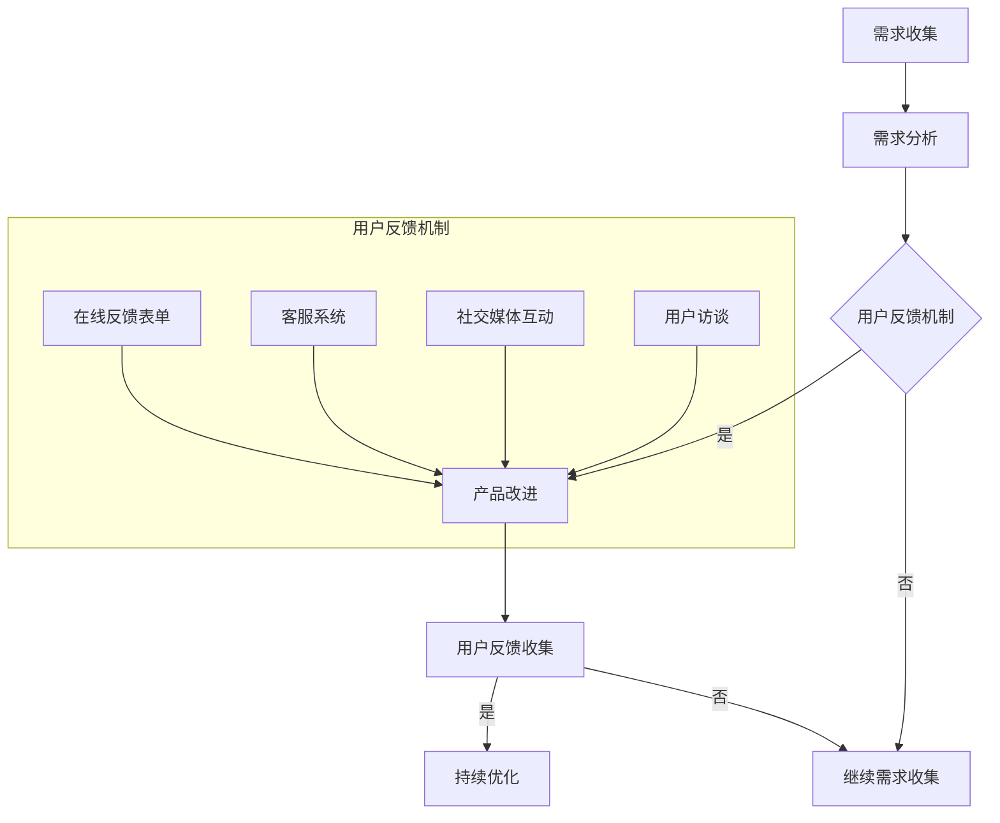
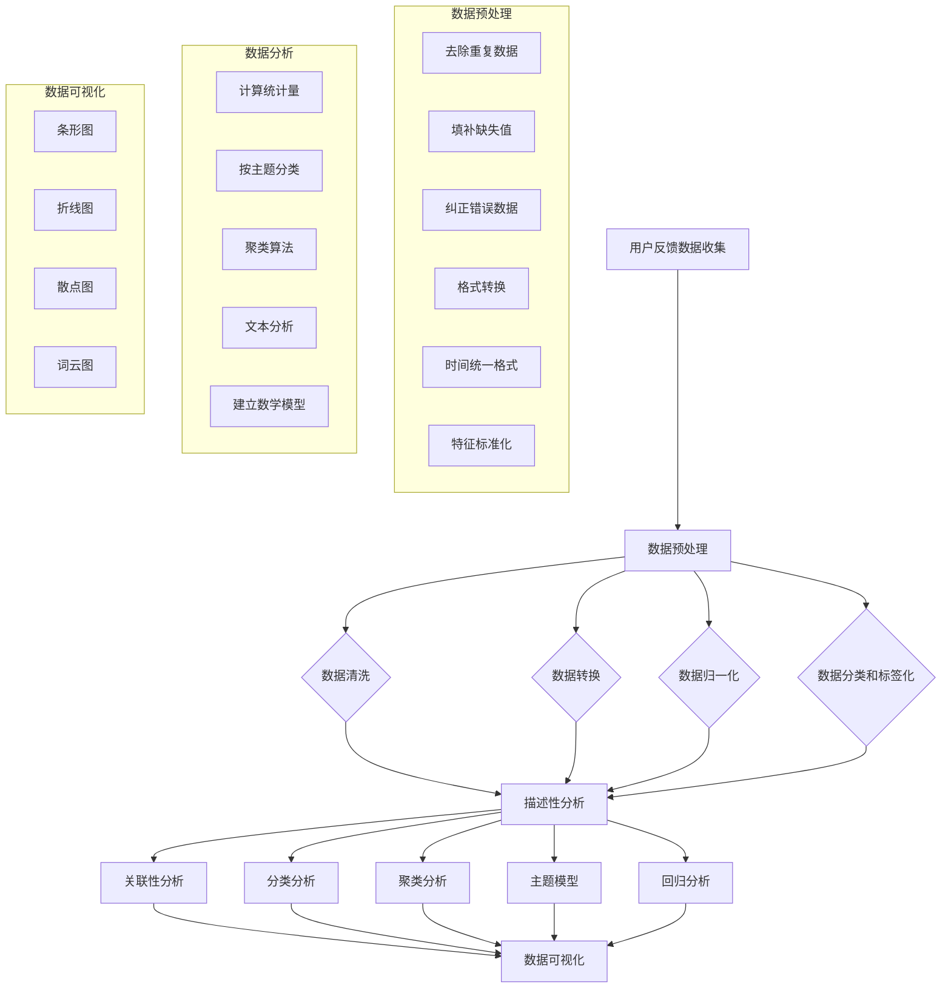
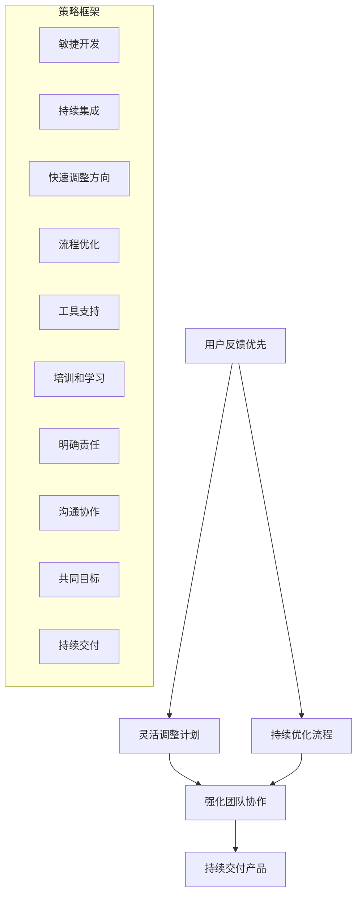

                 

### 《创业公司的用户反馈loop与快速迭代》

> **关键词：**用户反馈loop、快速迭代、敏捷开发、需求分析、数据预处理、项目实战案例

> **摘要：**本文将深入探讨创业公司在产品开发过程中如何通过建立用户反馈loop和实现快速迭代来提升产品质量和用户满意度。我们将首先介绍用户反馈loop的核心概念和架构，接着详细分析用户反馈数据的处理与分析方法，然后讨论快速迭代的概念和实现策略。最后，通过实际案例展示如何将用户反馈loop与快速迭代相结合，从而为创业公司提供有效的产品开发指南。

### 目录

#### 第1章 引言  
1.1 书籍主题与目标  
1.2 用户反馈loop的重要性  
1.3 快速迭代的方法与策略

#### 第2章 用户反馈loop原理与架构  
2.1 用户反馈loop的定义  
2.2 用户反馈loop的工作机制  
2.3 用户反馈loop的Mermaid流程图

#### 第3章 用户反馈数据的处理与分析  
3.1 用户反馈数据的收集  
3.2 用户反馈数据的分析  
3.3 用户反馈数据分析的Mermaid流程图

#### 第4章 快速迭代的原理与实践  
4.1 快速迭代的概念与优势  
4.2 快速迭代的方法  
4.3 快速迭代的实战案例

#### 第5章 创业公司快速迭代的策略  
5.1 创业公司的特点与挑战  
5.2 快速迭代的策略  
5.3 创业公司快速迭代的成功案例

#### 第6章 用户反馈loop与快速迭代的融合实践  
6.1 融合实践的目标  
6.2 融合实践的实施步骤  
6.3 融合实践的成功案例

#### 第7章 总结与展望  
7.1 用户反馈loop与快速迭代的总结  
7.2 未来发展趋势与挑战  
7.3 对创业公司的建议

#### 附录

#### 附录A：用户反馈loop与快速迭代的工具与资源

### 第1章 引言

#### 1.1 书籍主题与目标

在当今快速变化的商业环境中，创业公司面临着巨大的竞争压力和市场需求的变化。为了在竞争激烈的市场中生存并取得成功，创业公司需要不断优化其产品和服务，以满足用户的需求。用户反馈loop和快速迭代成为了创业公司成功的关键因素。

本文的目标是深入探讨创业公司在产品开发过程中如何通过建立用户反馈loop和实现快速迭代来提升产品质量和用户满意度。我们将从以下几个方面展开讨论：

1. **用户反馈loop的定义和架构**：介绍用户反馈loop的核心概念、组成部分和工作机制。
2. **用户反馈数据的处理与分析**：详细分析用户反馈数据的收集、处理和分析方法。
3. **快速迭代的原理与实践**：讨论快速迭代的概念、方法和实际应用。
4. **创业公司快速迭代的策略**：分析创业公司的特点与挑战，并提出相应的快速迭代策略。
5. **用户反馈loop与快速迭代的融合实践**：展示如何将用户反馈loop与快速迭代相结合，实现产品开发的高效性。
6. **总结与展望**：总结用户反馈loop与快速迭代的重要性，并探讨未来的发展趋势与挑战。

通过本文的讨论，希望能够为创业公司在产品开发过程中提供一些实用的指导和策略，帮助他们在激烈的市场竞争中取得成功。

#### 1.2 用户反馈loop的重要性

用户反馈loop在创业公司的产品开发过程中具有至关重要的作用。它不仅可以帮助公司了解用户的需求和满意度，还可以驱动产品的持续改进，提高产品的质量和竞争力。以下是用户反馈loop的重要性：

1. **深入了解用户需求**：用户反馈loop使得公司能够直接从用户那里获取反馈，从而深入了解用户的需求和期望。这种直接性确保了公司能够快速响应市场变化，并根据用户需求进行产品的调整和优化。

2. **持续改进产品质量**：通过用户反馈loop，公司可以及时发现产品中的问题和不满意之处，并进行针对性的改进。这种持续改进的机制有助于提升产品的质量，增强用户对产品的信任和满意度。

3. **提高市场竞争力**：在竞争激烈的市场中，能够迅速响应用户需求并进行产品迭代的公司具有明显的竞争优势。用户反馈loop使得公司能够快速调整产品策略，抢占市场份额，提高市场竞争力。

4. **优化用户体验**：用户反馈loop有助于公司了解用户的真实体验，从而优化产品的设计和功能，提高用户体验。通过持续优化，公司可以提供更好的产品和服务，增强用户忠诚度和口碑。

5. **增强团队凝聚力**：用户反馈loop不仅有助于产品改进，还可以增强团队成员之间的沟通和协作。通过共同分析和解决用户问题，团队成员可以更好地理解用户需求和公司目标，提高团队凝聚力和工作效率。

总之，用户反馈loop是创业公司成功的关键因素。通过建立有效的用户反馈loop，公司可以更快速地响应市场需求，持续改进产品质量，提高市场竞争力，并优化用户体验。这些优势将帮助创业公司在激烈的市场竞争中脱颖而出，实现长期发展。

#### 1.3 快速迭代的方法与策略

快速迭代是创业公司在产品开发过程中的一种高效方法，旨在通过快速反馈和调整来优化产品，满足用户需求。以下是快速迭代的核心方法和策略：

1. **用户故事地图**：
   用户故事地图是一种用于规划和展示产品需求的工具。通过用户故事地图，团队可以清晰地了解用户的需求和期望，并将这些需求分解为具体的任务和功能。用户故事地图不仅有助于团队集中精力解决关键问题，还可以确保所有团队成员都理解并共同追求相同的目标。

2. **敏捷开发流程**：
   敏捷开发是一种以用户需求为中心的软件开发方法。它强调团队协作、持续交付和快速反馈。敏捷开发流程通常包括迭代计划、每日站立会议、代码审查、测试和发布等环节。通过这种流程，团队可以快速响应变化，持续改进产品。

3. **快速迭代的方法**：
   - **需求收集**：通过用户调研、用户访谈和反馈渠道收集用户需求。
   - **需求分析**：对收集到的需求进行筛选和排序，确定优先级。
   - **设计**：根据需求进行产品设计，包括界面设计、数据库设计和功能规划。
   - **开发**：按照敏捷开发流程进行编码和单元测试。
   - **测试**：进行集成测试、性能测试和用户验收测试，确保产品满足需求。
   - **发布**：将产品发布到生产环境，并收集用户反馈。
   - **优化迭代**：根据用户反馈进行产品优化和功能迭代。

4. **快速迭代的伪代码**：

    ```mermaid
    flowchart LR
    A[开始] --> B[需求收集]
    B --> C[需求分析]
    C --> D[设计]
    D --> E[开发]
    E --> F[测试]
    F --> G[用户反馈]
    G --> H[优化迭代]
    H --> A
    ```

   通过上述伪代码，我们可以清晰地看到快速迭代的各个环节及其之间的关联。这种闭环的迭代流程使得团队能够不断优化产品，满足用户需求。

5. **快速迭代的优势**：
   - **快速响应市场需求**：快速迭代方法使得团队能够快速响应市场需求，及时调整产品方向。
   - **持续改进产品质量**：通过快速迭代，团队能够不断发现和解决产品中的问题，提高产品质量。
   - **提高团队协作效率**：敏捷开发流程强调团队协作，有助于提高工作效率和团队凝聚力。
   - **增强用户满意度**：快速迭代使得团队能够更好地满足用户需求，提高用户满意度和忠诚度。

总之，快速迭代是创业公司实现产品成功的关键策略。通过用户故事地图、敏捷开发流程和快速迭代方法，团队可以高效地优化产品，满足用户需求，并在竞争激烈的市场中脱颖而出。接下来，我们将进一步探讨用户反馈loop的原理与架构，以便更好地理解其在快速迭代中的应用。

### 第2章 用户反馈loop原理与架构

#### 2.1 用户反馈loop的定义

用户反馈loop，又称为“用户反馈循环”或“反馈循环”，是一种通过不断收集、分析和响应用户反馈来优化产品或服务的方法。它是一个动态的、闭环的流程，旨在确保产品开发与用户需求保持一致，从而提高用户满意度和产品质量。

用户反馈loop的基本概念包括以下几个方面：

1. **用户需求收集**：通过问卷调查、用户访谈、在线反馈等形式，收集用户对产品或服务的需求、期望和建议。
2. **需求分析**：对收集到的用户需求进行分析和排序，确定优先级和改进方向。
3. **用户反馈机制**：建立有效的反馈机制，如用户论坛、客服热线、在线反馈表单等，以便用户能够方便地提交反馈。
4. **产品改进**：根据用户反馈进行产品改进，包括功能优化、界面调整、性能提升等。
5. **用户反馈收集**：在产品改进后，再次收集用户反馈，评估改进效果。
6. **持续优化**：基于用户反馈进行持续的改进和优化，形成闭环反馈。

用户反馈loop的核心在于其闭环特性，即通过不断循环反馈来推动产品优化。这一过程不仅有助于提高产品质量，还能增强用户参与感和满意度。

#### 2.2 用户反馈loop的组成部分

用户反馈loop由以下几个关键组成部分构成：

1. **需求收集模块**：该模块负责收集用户的需求和反馈，通常包括在线调查、用户访谈、客服反馈等多种方式。需求收集模块是用户反馈loop的起点，决定了反馈的质量和数量。

2. **需求分析模块**：该模块对收集到的用户需求进行分析和分类，确定需求的优先级和改进方向。需求分析模块确保用户需求能够高效地转化为具体的改进计划。

3. **用户反馈机制**：这是用户反馈loop的反馈渠道，包括用户论坛、在线反馈表单、客服系统等。用户反馈机制的设计决定了用户反馈的便捷性和有效性。

4. **产品改进模块**：根据用户需求分析和反馈，该模块负责进行产品改进，包括功能优化、界面调整、性能提升等。产品改进模块是用户反馈loop的核心，直接影响到产品的质量。

5. **用户反馈收集模块**：该模块负责在产品改进后收集用户的新反馈，以便评估改进效果并进行进一步的优化。这一环节确保了用户反馈loop的持续性和闭环性。

#### 2.3 用户反馈loop与敏捷开发的关系

用户反馈loop与敏捷开发方法有着密切的联系。敏捷开发强调快速响应变化、持续交付和用户参与，这与用户反馈loop的理念高度一致。

1. **用户反馈loop支持敏捷开发**：
   - **快速响应需求变化**：用户反馈loop使得团队能够快速收集用户反馈，及时调整产品方向，满足用户需求。
   - **持续交付产品**：用户反馈loop确保产品在每次迭代后都能得到改进，从而实现持续交付。
   - **用户参与**：用户反馈loop鼓励用户参与产品改进过程，提高用户满意度和参与感。

2. **敏捷开发支持用户反馈loop**：
   - **灵活性和适应性**：敏捷开发强调灵活性和适应性，使得团队能够迅速响应市场变化和用户反馈。
   - **快速迭代**：敏捷开发方法通过迭代的方式实现快速反馈和改进，与用户反馈loop的闭环特性相契合。

总之，用户反馈loop与敏捷开发方法相辅相成，共同推动了产品开发的高效性和用户满意度。通过用户反馈loop，敏捷开发团队能够更好地了解用户需求，持续优化产品，从而在竞争激烈的市场中脱颖而出。

#### 2.4 用户反馈loop的工作机制

用户反馈loop的工作机制是一个动态的、闭环的过程，通过不断收集、分析和响应用户反馈来优化产品或服务。以下是用户反馈loop的工作机制：

1. **需求收集**：这是用户反馈loop的起点。公司通过多种渠道收集用户的需求和反馈，如在线调查、用户访谈、社交媒体、客服系统等。这一步骤的目的是获取真实的用户声音，了解用户在使用产品或服务时的满意度和不满意度。

   - **在线调查**：公司可以在网站或应用程序中嵌入在线调查，收集用户对产品功能、界面设计、性能等方面的意见。
   - **用户访谈**：公司可以通过电话或在线访谈的方式与用户直接交流，深入了解用户的需求和痛点。
   - **社交媒体**：公司可以通过社交媒体平台（如Facebook、Twitter、Instagram等）收集用户对产品或服务的反馈和评论。

2. **需求分析**：在收集到用户反馈后，公司需要对反馈进行分析和分类，以确定哪些需求是最重要的，并制定相应的改进计划。需求分析的过程通常包括以下步骤：

   - **数据清洗**：对收集到的用户反馈进行初步筛选，去除无效或不准确的数据。
   - **分类和标签**：将用户反馈按照主题、类型、优先级等进行分类和标签化，便于后续分析和处理。
   - **统计和分析**：使用数据分析和统计方法（如图表、关键词云等）对用户反馈进行可视化，以便更好地理解用户的意见和需求。

3. **用户反馈机制**：建立有效的用户反馈机制，确保用户能够方便地提交反馈。用户反馈机制的设计应考虑以下因素：

   - **便捷性**：用户应能够快速、方便地提交反馈，如在线反馈表单、短信反馈、社交媒体互动等。
   - **反馈渠道多样化**：提供多种反馈渠道，以满足不同用户的需求，如客服电话、电子邮件、在线论坛等。
   - **反馈跟踪**：确保用户提交的反馈能够被及时处理和跟踪，让用户知道他们的意见已被公司关注。

4. **产品改进**：根据用户反馈进行产品改进，包括功能优化、界面调整、性能提升等。产品改进的过程通常包括以下步骤：

   - **需求优先级排序**：根据用户反馈的重要性、紧急性和可行性，对需求进行排序，确定优先级。
   - **规划改进计划**：制定详细的改进计划，包括任务分配、时间表和资源需求。
   - **实施改进**：根据改进计划进行具体的产品改进工作，如代码修改、界面设计调整、测试等。
   - **验证改进效果**：在改进完成后，对产品进行测试和评估，确保改进方案的有效性和可行性。

5. **用户反馈收集**：在产品改进后，公司需要再次收集用户反馈，以评估改进效果并确定下一步的优化方向。这一步骤通常包括以下内容：

   - **再次调查**：在改进完成后，公司可以再次进行用户调查，收集用户对改进后的产品或服务的反馈。
   - **用户访谈**：通过用户访谈的方式，深入了解用户对改进方案的反应和满意度。
   - **在线反馈**：在产品中嵌入在线反馈表单或用户论坛，让用户能够随时提交新的反馈。

6. **持续优化**：基于用户反馈进行持续的改进和优化，形成闭环反馈。持续优化的过程应遵循以下原则：

   - **定期反馈**：定期收集用户反馈，确保反馈机制的持续性和有效性。
   - **快速响应**：对用户反馈进行快速响应和处理，确保用户的问题和需求能够得到及时解决。
   - **持续改进**：基于用户反馈不断优化产品或服务，提高用户体验和满意度。

通过上述工作机制，用户反馈loop能够有效地促进产品改进和用户满意度提升。这一过程不仅帮助公司更好地了解用户需求，还能增强用户参与感和忠诚度，从而在竞争激烈的市场中脱颖而出。

#### 2.5 用户反馈loop的Mermaid流程图

为了更好地展示用户反馈loop的工作机制，我们可以使用Mermaid绘制一个流程图。以下是一个简化的用户反馈loop流程图：



在这个流程图中，我们可以看到：

- **需求收集**（A）：公司通过各种渠道收集用户的需求和反馈。
- **需求分析**（B）：对收集到的用户反馈进行初步分析和分类。
- **用户反馈机制**（C）：建立多渠道的反馈机制，确保用户能够方便地提交反馈。
- **产品改进**（D）：根据用户反馈进行产品的改进和优化。
- **用户反馈收集**（F）：在产品改进后，再次收集用户的反馈，评估改进效果。
- **持续优化**（G）：基于用户反馈持续改进产品，形成闭环反馈。

通过这个流程图，我们可以清晰地看到用户反馈loop的各个环节及其之间的关联，有助于更好地理解用户反馈loop的工作机制。

### 第3章 用户反馈数据的处理与分析

#### 3.1 用户反馈数据的收集

用户反馈数据的收集是用户反馈loop的关键环节，其质量和数量直接影响到后续的分析和改进效果。以下介绍几种常见的用户反馈数据收集方法及其特点：

1. **在线调查**：
   在线调查是最常用的用户反馈数据收集方法之一，可以通过问卷星、金数据等工具在线创建调查问卷，然后通过电子邮件、社交媒体、网站链接等方式邀请用户参与。这种方法的优势在于数据量大、成本低、效率高，但需要注意的是，调查问卷的设计需简洁明了，避免用户因问卷复杂度而放弃填写。

2. **用户访谈**：
   用户访谈是一种深入了解用户需求和痛点的有效方法。通过与用户进行面对面的交流或在线视频会议，可以获取更为详细和深入的反馈信息。用户访谈的优点在于能够获取质性数据，深入了解用户需求和行为模式，但缺点是成本较高、耗时较长。

3. **社交媒体互动**：
   通过社交媒体平台（如微博、知乎、Twitter等）与用户进行互动，收集用户的反馈和意见。这种方法的优势在于实时性强、用户参与度高，可以通过评论、私信等方式获取大量反馈。但需要注意的是，社交媒体上的用户反馈可能存在主观性和情绪化，需要筛选和验证。

4. **客服系统**：
   通过客服系统（如在线客服、电话客服等）收集用户在服务过程中的反馈和问题。客服系统记录了用户的问题、建议和满意度等信息，可以用于后续的分析和改进。这种方法的优势在于数据真实可靠，但需要保证客服人员的专业性和服务质量。

5. **用户行为数据**：
   通过分析用户在使用产品或服务过程中的行为数据（如点击率、停留时间、转化率等），可以获取用户对产品功能的反馈和使用习惯。这种方法的优势在于数据量大、分析全面，但需要专业的数据分析和处理能力。

#### 3.2 用户反馈数据的类型

用户反馈数据可以分为以下几种类型：

1. **功能性反馈**：
   功能性反馈关注产品功能的可用性和实用性，如用户对特定功能的满意度、功能的易用性等。这类反馈有助于了解用户对产品功能的实际需求和使用体验。

2. **性能反馈**：
   性能反馈关注产品的性能表现，如响应速度、稳定性、兼容性等。这类反馈有助于识别产品在技术层面的优化空间，提高产品的稳定性和用户体验。

3. **用户体验反馈**：
   用户体验反馈关注用户在使用产品过程中的整体感受和满意度，如界面设计、操作流程、内容丰富度等。这类反馈有助于优化产品的用户体验，提高用户黏性。

4. **行为数据**：
   行为数据是通过分析用户在使用产品或服务过程中的行为和操作记录得到的，如用户点击路径、页面停留时间、转化路径等。这类数据有助于深入了解用户行为模式，优化产品功能和用户体验。

5. **建议性反馈**：
   建议性反馈是用户对产品或服务提出的具体改进建议，如增加新功能、改进界面设计、优化操作流程等。这类反馈有助于团队快速响应用户需求，提高产品的竞争力和用户满意度。

#### 3.3 用户反馈数据的预处理

在用户反馈数据的分析之前，通常需要进行预处理，以确保数据的质量和准确性。以下介绍几种常见的用户反馈数据预处理方法：

1. **数据清洗**：
   数据清洗是数据预处理的重要步骤，包括去除重复数据、填补缺失值、纠正错误数据等。通过数据清洗，可以确保数据的一致性和完整性，提高数据的质量。

2. **数据转换**：
   数据转换是将不同格式的数据转换为统一格式，如将文本数据转换为结构化数据、将不同时间格式的数据统一为同一种格式等。数据转换有助于后续的数据分析和处理。

3. **数据归一化**：
   数据归一化是将不同特征的数据进行标准化处理，使其处于同一量级。通过数据归一化，可以消除不同特征之间的尺度差异，提高算法的性能和效果。

4. **数据分类和标签化**：
   将用户反馈按照主题、类型、优先级等进行分类和标签化，便于后续的分析和处理。通过分类和标签化，可以更好地组织和管理数据，提高数据分析的效率。

5. **数据可视化**：
   通过数据可视化，可以直观地展示用户反馈数据的分布、趋势和关联关系。数据可视化有助于团队更好地理解数据，发现潜在问题和优化方向。

#### 3.4 用户反馈数据的分析

用户反馈数据的分析是用户反馈loop的核心环节，通过数据分析和挖掘，可以深入了解用户需求和行为模式，为产品改进和优化提供有力支持。以下介绍几种常用的用户反馈数据分析方法：

1. **描述性分析**：
   描述性分析是对用户反馈数据进行统计分析，获取数据的分布、均值、标准差等基本统计量。通过描述性分析，可以初步了解用户反馈的整体情况，为后续的深度分析提供基础。

2. **关联性分析**：
   关联性分析是研究不同变量之间的关系，通过关联性分析，可以识别出用户反馈中可能存在的关联关系，如功能满意度与用户体验之间的关系。关联性分析有助于发现用户反馈中的潜在规律和趋势。

3. **分类分析**：
   分类分析是将用户反馈按照特定的标准进行分类，如按照功能、主题、优先级等分类。通过分类分析，可以更细致地了解不同类型用户反馈的特点和需求，为产品改进提供针对性建议。

4. **聚类分析**：
   聚类分析是一种无监督学习方法，通过将用户反馈数据进行聚类，可以将相似的用户反馈归为一类。通过聚类分析，可以识别出具有相似需求的用户群体，为产品优化提供个性化建议。

5. **主题模型**：
   主题模型是一种自然语言处理方法，通过分析用户反馈文本，可以提取出潜在的主题和关键词。通过主题模型，可以深入了解用户的关注点和需求，为产品改进提供方向。

6. **回归分析**：
   回归分析是一种统计方法，通过建立用户反馈与产品质量、用户满意度等变量之间的数学模型，可以预测用户反馈对产品质量的影响。通过回归分析，可以量化用户反馈的价值，为产品改进提供依据。

#### 3.5 用户反馈数据分析的Mermaid流程图

为了更好地展示用户反馈数据的处理和分析过程，我们可以使用Mermaid绘制一个流程图。以下是一个简化的用户反馈数据分析流程图：



在这个流程图中，我们可以看到：

- **数据预处理**（B）：包括数据清洗、数据转换、数据归一化和数据分类和标签化。
- **数据分析**（G）：包括描述性分析、关联性分析、分类分析、聚类分析、主题模型和回归分析。
- **数据可视化**（M）：通过条形图、折线图、散点图和词云图等可视化方法，展示分析结果。

通过这个流程图，我们可以清晰地看到用户反馈数据的处理和分析过程，有助于更好地理解数据分析在用户反馈loop中的作用。

### 第4章 快速迭代的原理与实践

#### 4.1 快速迭代的概念与优势

快速迭代，即通过频繁的、小规模的迭代来优化产品或服务，是一种以用户需求为中心的软件开发方法。快速迭代的核心在于缩短开发周期、提高交付频率，以便及时响应用户反馈和市场变化。以下是快速迭代的基本概念和优势：

1. **基本概念**：
   - **迭代**：迭代是指在一定周期内进行的一系列有序的活动，如需求收集、设计、开发、测试等。
   - **快速迭代**：快速迭代是指在较短的周期内（如每周或每两周）进行多次迭代，以实现快速交付和持续改进。

2. **优势**：
   - **快速响应市场需求**：快速迭代使得团队能够更快速地交付产品或功能，并及时根据市场变化进行优化，从而提高市场竞争力。
   - **持续改进产品质量**：通过快速迭代，团队能够不断收集用户反馈，及时发现问题并进行改进，提高产品的质量和用户体验。
   - **降低开发风险**：快速迭代方法通过频繁的小规模交付，降低了单个迭代失败的风险，有助于更好地管理项目风险。
   - **提高团队协作效率**：快速迭代方法强调团队协作和沟通，有助于提高团队工作效率和凝聚力。
   - **增强用户参与感**：快速迭代使得用户能够更早地参与到产品开发过程中，提供反馈和建议，提高用户满意度和忠诚度。

总之，快速迭代方法通过缩短开发周期、提高交付频率和持续改进产品质量，为创业公司在竞争激烈的市场中提供了有效的应对策略。接下来，我们将进一步探讨快速迭代的方法和实践。

#### 4.2 快速迭代的方法

快速迭代的方法主要包括以下几种：

1. **用户故事地图**：
   用户故事地图是一种用于规划和展示产品需求的工具。它通过将用户需求分解为具体的故事，并按照优先级进行排列，帮助团队集中精力解决关键问题。用户故事地图的步骤如下：
   
   - **确定用户角色**：明确目标用户群体，如学生、职场人士、老年人等。
   - **识别用户目标**：描述用户想要实现的目标，如购买商品、学习知识、保持健康等。
   - **编写用户故事**：根据用户角色和目标，编写具体的用户故事，如“作为用户，我希望能够方便地在线购物”。
   - **排序用户故事**：按照优先级对用户故事进行排序，确定哪些需求是必须优先实现的。

   用户故事地图的示例：

   ```mermaid
   graph TD
       A[用户角色：学生] --> B[目标：学习知识]
       B --> C[故事1：在线学习课程]
       B --> D[故事2：获取学习资料]
       B --> E[故事3：参加学习社群]
       C --> F[优先级：高]
       D --> F
       E --> F
   ```

   通过用户故事地图，团队可以清晰地了解用户需求，并按照优先级进行产品开发。

2. **敏捷开发流程**：
   敏捷开发是一种以用户需求为中心的软件开发方法，强调快速响应变化和持续交付。敏捷开发流程通常包括以下环节：

   - **迭代计划**：在每次迭代开始时，团队会确定本次迭代的目标和任务，并制定迭代计划。
   - **每日站立会议**：每天团队会进行短暂的站立会议，讨论进展、问题和解决方案。
   - **代码审查**：在开发过程中，团队成员会进行代码审查，确保代码质量。
   - **测试**：每次迭代结束后，进行功能测试和性能测试，确保产品符合预期。
   - **发布**：将产品或功能发布到生产环境，供用户使用。

   敏捷开发流程的伪代码如下：

   ```mermaid
   flowchart LR
       A[开始] --> B[迭代计划]
       B --> C[每日站立会议]
       C --> D[代码审查]
       D --> E[测试]
       E --> F[发布]
       F --> G[用户反馈]
       G --> H[优化迭代]
       H --> A
   ```

   通过敏捷开发流程，团队可以确保产品的质量和交付效率。

3. **快速迭代的方法**：
   - **需求收集**：通过用户调研、用户访谈和在线反馈等方式，收集用户需求。
   - **需求分析**：对收集到的需求进行分析和排序，确定优先级。
   - **设计**：根据需求进行产品设计，包括界面设计、数据库设计和功能规划。
   - **开发**：按照敏捷开发流程进行编码和单元测试。
   - **测试**：进行集成测试、性能测试和用户验收测试，确保产品满足需求。
   - **发布**：将产品发布到生产环境，并收集用户反馈。
   - **优化迭代**：根据用户反馈进行产品优化和功能迭代。

   快速迭代的伪代码如下：

   ```mermaid
   flowchart LR
       A[开始] --> B[需求收集]
       B --> C[需求分析]
       C --> D[设计]
       D --> E[开发]
       E --> F[测试]
       F --> G[用户反馈]
       G --> H[优化迭代]
       H --> A
   ```

   通过上述方法，团队可以快速响应用户需求，持续优化产品。

#### 4.3 快速迭代的实战案例

为了更好地展示快速迭代的方法和实践，以下是一个实际项目案例：

**项目背景**：某创业公司开发了一款面向职场人士的在线学习平台，旨在提供高质量的在线课程和知识分享。

**迭代计划**：公司决定采用快速迭代方法，每两周进行一次迭代，每次迭代的目标是发布一个新功能或优化现有功能。

**迭代1**：
- **需求收集**：通过用户调研和在线反馈，了解到用户最期望的功能是“在线问答”。
- **需求分析**：将“在线问答”功能确定为一个高优先级需求。
- **设计**：根据需求进行界面设计和功能规划。
- **开发**：开发团队在两周内完成了“在线问答”功能。
- **测试**：进行了功能测试和性能测试，确保功能正常。
- **发布**：将“在线问答”功能发布到生产环境。
- **用户反馈**：通过用户反馈和在线调查，了解到用户对“在线问答”功能的满意度较高，并提出了一些优化建议。
- **优化迭代**：根据用户反馈，对“在线问答”功能进行优化。

**迭代2**：
- **需求收集**：通过用户访谈，了解到用户希望在课程页面增加“课程推荐”功能。
- **需求分析**：将“课程推荐”功能确定为一个高优先级需求。
- **设计**：根据需求进行界面设计和功能规划。
- **开发**：开发团队在两周内完成了“课程推荐”功能。
- **测试**：进行了功能测试和性能测试，确保功能正常。
- **发布**：将“课程推荐”功能发布到生产环境。
- **用户反馈**：通过用户反馈和在线调查，了解到用户对“课程推荐”功能的满意度较高，并提出了一些优化建议。
- **优化迭代**：根据用户反馈，对“课程推荐”功能进行优化。

通过上述案例，我们可以看到快速迭代方法在实际项目中的应用效果。通过频繁的迭代和用户反馈，公司能够快速优化产品功能，提高用户满意度，从而在竞争激烈的市场中脱颖而出。

### 第5章 创业公司快速迭代的策略

#### 5.1 创业公司的特点与挑战

创业公司通常具有以下特点：

1. **资源有限**：创业公司往往在资金、人力和技术资源方面有限，需要高效利用现有资源来实现目标。
2. **市场竞争激烈**：创业公司面临激烈的市场竞争，需要快速响应市场变化和用户需求，以保持竞争力。
3. **团队高度灵活**：创业公司团队通常较小，成员之间高度协作和灵活调整，能够快速应对变化。
4. **快速迭代**：创业公司需要快速迭代产品，以验证市场需求和优化用户体验。

然而，创业公司在快速迭代过程中也面临一些挑战：

1. **资源瓶颈**：由于资源有限，创业公司在快速迭代时可能面临人力、资金和设备等方面的瓶颈，影响迭代速度和质量。
2. **需求变化频繁**：创业公司在快速迭代过程中，可能面临市场需求和用户需求的变化，需要不断调整产品方向和策略。
3. **团队沟通协作**：创业公司团队通常较小，沟通协作效率直接影响迭代效果。团队成员需要保持高水平的沟通和协作，以确保快速响应和交付。
4. **技术风险**：快速迭代过程中，技术实现可能存在风险，如代码质量、系统稳定性和安全性等问题，需要重点关注和解决。

#### 5.2 快速迭代的策略

为了克服上述挑战，创业公司可以采取以下快速迭代的策略：

1. **用户反馈优先**：
   - **建立反馈渠道**：建立多种反馈渠道，如用户论坛、在线反馈表单、社交媒体互动等，方便用户随时提交反馈。
   - **定期收集反馈**：定期收集用户反馈，包括功能需求、性能反馈和用户体验等，以便快速识别问题和优化方向。
   - **快速响应反馈**：对用户反馈进行快速响应，及时解决问题，提高用户满意度。

2. **灵活调整计划**：
   - **敏捷开发**：采用敏捷开发方法，通过迭代计划、每日站立会议和代码审查等环节，确保团队能够高效协作和快速交付。
   - **持续集成**：采用持续集成和持续部署（CI/CD）方法，自动化构建、测试和部署流程，提高交付速度和稳定性。
   - **快速调整方向**：根据市场变化和用户反馈，灵活调整产品方向和策略，以快速适应市场变化。

3. **持续优化流程**：
   - **流程优化**：不断优化开发流程，如需求管理、任务分配、代码审查和测试等，以提高开发效率和产品质量。
   - **工具支持**：采用合适的工具和平台，如项目管理工具、代码管理工具和自动化测试工具等，以提高团队协作和开发效率。
   - **培训和学习**：定期进行团队培训和学习，提高团队成员的技术能力和协作效率。

4. **强化团队协作**：
   - **明确责任**：明确团队成员的职责和任务，确保每个成员都清楚自己的工作内容和目标。
   - **沟通协作**：建立有效的沟通机制，如每日站立会议、即时通讯工具和项目管理平台等，确保团队成员之间的信息畅通。
   - **共同目标**：确保团队成员共同追求公司的目标和愿景，增强团队凝聚力和工作效率。

通过上述策略，创业公司可以克服快速迭代过程中的挑战，实现高效的产品开发和持续优化。以下是一个快速迭代的策略框架图：



通过这个策略框架，创业公司可以系统地规划和实施快速迭代，从而在激烈的市场竞争中脱颖而出。

#### 5.3 创业公司快速迭代的成功案例

为了更好地展示创业公司如何通过快速迭代取得成功，我们来看两个实际案例。

**案例一：公司A**

公司A是一家提供在线教育平台服务的创业公司。在快速迭代过程中，公司A采取了以下策略：

1. **用户反馈优先**：公司A通过在线调查、用户访谈和社交媒体互动等渠道，收集用户对课程内容、学习体验和功能需求的反馈。

2. **灵活调整计划**：根据用户反馈，公司A制定了灵活的迭代计划，每次迭代周期为两周。在每次迭代中，团队会优先解决用户反馈中的关键问题。

3. **持续优化流程**：公司A不断优化需求管理、任务分配和代码审查等流程，以提高开发效率。同时，公司A采用了持续集成和持续部署（CI/CD）工具，确保快速交付和稳定运行。

4. **强化团队协作**：公司A通过每日站立会议、即时通讯工具和项目管理平台等手段，强化团队沟通和协作。团队成员共同追求公司的目标和愿景，增强了团队的凝聚力和工作效率。

通过快速迭代，公司A在短时间内优化了多个关键功能，如课程推荐、学习进度跟踪和互动讨论区等。用户满意度显著提升，公司A的市场份额也逐渐扩大。

**案例二：公司B**

公司B是一家提供移动健康管理应用的创业公司。在快速迭代过程中，公司B采取了以下策略：

1. **用户反馈优先**：公司B通过用户调研、用户访谈和在线反馈表单等渠道，收集用户对应用功能、界面设计和用户体验的反馈。

2. **灵活调整计划**：公司B制定了灵活的迭代计划，每次迭代周期为三周。团队会根据用户反馈，优先解决用户提出的问题和需求。

3. **持续优化流程**：公司B不断优化开发流程，如需求管理、任务分配和测试等。同时，公司B采用了自动化测试工具，确保产品质量和稳定性。

4. **强化团队协作**：公司B通过每日站立会议、即时通讯工具和项目管理平台等手段，加强团队沟通和协作。团队成员共同参与产品设计和开发，提高了团队的整体效率。

通过快速迭代，公司B成功推出了多个受欢迎的功能，如个性化健身计划、饮食建议和健康数据跟踪等。用户数量迅速增长，公司B在市场上获得了较高的知名度。

通过这两个案例，我们可以看到创业公司通过快速迭代策略，在短时间内实现了产品的优化和用户满意度提升。这些成功案例为其他创业公司提供了有益的借鉴和启示。

### 第6章 用户反馈loop与快速迭代的融合实践

#### 6.1 融合实践的目标

在创业公司的产品开发过程中，将用户反馈loop与快速迭代方法相结合，是为了实现以下目标：

1. **快速响应市场需求**：通过用户反馈loop，公司能够及时收集用户需求和市场动态，快速调整产品方向，以保持市场竞争力。
2. **持续优化产品质量**：快速迭代方法使得团队能够在每次迭代中持续优化产品功能、性能和用户体验，提高产品质量。
3. **增强用户参与感**：用户反馈loop鼓励用户参与到产品改进过程中，提高用户的参与度和忠诚度。
4. **提高团队协作效率**：快速迭代方法强调团队协作和沟通，有助于提高团队工作效率和凝聚力。

通过将用户反馈loop与快速迭代相结合，创业公司能够实现高效的产品开发和持续优化，从而在激烈的市场竞争中取得成功。

#### 6.2 融合实践的实施步骤

为了将用户反馈loop与快速迭代方法有效结合，创业公司可以按照以下步骤实施：

1. **建立用户反馈loop**：
   - **定义反馈渠道**：建立多种反馈渠道，如在线调查、用户访谈、社交媒体互动、客服系统等，确保用户能够方便地提交反馈。
   - **定期收集反馈**：制定定期收集用户反馈的计划，如每周或每月收集一次，确保反馈数据的及时性和完整性。
   - **反馈数据分析**：对收集到的用户反馈进行整理、分类和分析，识别用户的主要需求和问题。

2. **实施快速迭代**：
   - **用户故事地图**：使用用户故事地图规划每次迭代的需求和任务，确保团队集中精力解决关键问题。
   - **敏捷开发流程**：采用敏捷开发方法，通过迭代计划、每日站立会议、代码审查和测试等环节，确保高效的产品开发和交付。
   - **快速调整方向**：根据用户反馈和市场变化，灵活调整产品开发计划，以快速响应用户需求。

3. **用户反馈与迭代的结合**：
   - **反馈收集与需求分析**：在每次迭代开始时，根据用户反馈进行需求分析，确定本次迭代的目标和任务。
   - **迭代结果反馈**：在每次迭代结束后，收集用户对迭代结果的反馈，评估改进效果，为下一次迭代提供依据。
   - **持续优化**：根据用户反馈和迭代结果，持续优化产品功能、性能和用户体验。

4. **强化团队协作**：
   - **明确责任和角色**：确保每个团队成员都清楚自己的职责和任务，提高团队协作效率。
   - **沟通和协作工具**：采用合适的沟通和协作工具，如即时通讯工具、项目管理平台和代码管理工具，确保信息畅通和团队协作。
   - **培训和学习**：定期进行团队培训和学习，提高团队成员的技术能力和协作效率。

通过上述步骤，创业公司可以将用户反馈loop与快速迭代方法有效结合，实现高效的产品开发和持续优化。

#### 6.3 融合实践的成功案例

为了更好地展示用户反馈loop与快速迭代方法在实际项目中的应用效果，以下是一个成功案例：

**案例一：公司C**

公司C是一家提供企业级协作工具的创业公司。在产品开发过程中，公司C采取了以下策略：

1. **建立用户反馈loop**：
   - **定义反馈渠道**：公司C在产品中嵌入了在线反馈表单和用户论坛，方便用户提交反馈。
   - **定期收集反馈**：每周收集一次用户反馈，确保及时了解用户需求和市场动态。
   - **反馈数据分析**：对用户反馈进行分类和分析，识别出用户关注的功能和问题。

2. **实施快速迭代**：
   - **用户故事地图**：使用用户故事地图规划每次迭代的需求和任务，确保团队集中精力解决关键问题。
   - **敏捷开发流程**：采用敏捷开发方法，通过迭代计划、每日站立会议和代码审查等环节，确保高效的产品开发和交付。
   - **快速调整方向**：根据用户反馈和市场变化，灵活调整产品开发计划，以快速响应用户需求。

3. **用户反馈与迭代的结合**：
   - **反馈收集与需求分析**：在每次迭代开始时，根据用户反馈进行需求分析，确定本次迭代的目标和任务。
   - **迭代结果反馈**：在每次迭代结束后，收集用户对迭代结果的反馈，评估改进效果，为下一次迭代提供依据。
   - **持续优化**：根据用户反馈和迭代结果，持续优化产品功能、性能和用户体验。

4. **强化团队协作**：
   - **明确责任和角色**：确保每个团队成员都清楚自己的职责和任务，提高团队协作效率。
   - **沟通和协作工具**：采用即时通讯工具和项目管理平台，确保信息畅通和团队协作。
   - **培训和学习**：定期进行团队培训和学习，提高团队成员的技术能力和协作效率。

通过将用户反馈loop与快速迭代方法相结合，公司C成功推出了多个受欢迎的功能，如实时协作、任务管理和文档共享等。用户满意度显著提升，公司C在市场上获得了较高的知名度。

**案例二：公司D**

公司D是一家提供移动健康监测应用的创业公司。在产品开发过程中，公司D采取了以下策略：

1. **建立用户反馈loop**：
   - **定义反馈渠道**：公司D通过用户调研、用户访谈和社交媒体互动等渠道，收集用户对应用功能、界面设计和用户体验的反馈。
   - **定期收集反馈**：每月收集一次用户反馈，确保及时了解用户需求和市场动态。
   - **反馈数据分析**：对用户反馈进行分类和分析，识别出用户的主要需求和问题。

2. **实施快速迭代**：
   - **用户故事地图**：使用用户故事地图规划每次迭代的需求和任务，确保团队集中精力解决关键问题。
   - **敏捷开发流程**：采用敏捷开发方法，通过迭代计划、每日站立会议和测试等环节，确保高效的产品开发和交付。
   - **快速调整方向**：根据用户反馈和市场变化，灵活调整产品开发计划，以快速响应用户需求。

3. **用户反馈与迭代的结合**：
   - **反馈收集与需求分析**：在每次迭代开始时，根据用户反馈进行需求分析，确定本次迭代的目标和任务。
   - **迭代结果反馈**：在每次迭代结束后，收集用户对迭代结果的反馈，评估改进效果，为下一次迭代提供依据。
   - **持续优化**：根据用户反馈和迭代结果，持续优化产品功能、性能和用户体验。

4. **强化团队协作**：
   - **明确责任和角色**：确保每个团队成员都清楚自己的职责和任务，提高团队协作效率。
   - **沟通和协作工具**：采用即时通讯工具和项目管理平台，确保信息畅通和团队协作。
   - **培训和学习**：定期进行团队培训和学习，提高团队成员的技术能力和协作效率。

通过将用户反馈loop与快速迭代方法相结合，公司D成功推出了多个受欢迎的功能，如睡眠监测、运动分析和健康建议等。用户数量迅速增长，公司D在市场上取得了显著的成功。

通过这两个案例，我们可以看到创业公司如何通过将用户反馈loop与快速迭代方法相结合，实现高效的产品开发和用户满意度提升。这些成功经验为其他创业公司提供了有益的借鉴和启示。

### 第7章 总结与展望

#### 7.1 用户反馈loop与快速迭代的总结

在创业公司的产品开发过程中，用户反馈loop和快速迭代方法发挥着至关重要的作用。通过用户反馈loop，公司能够实时了解用户需求和市场动态，快速调整产品方向和策略。快速迭代方法则确保了团队能够高效地开发和优化产品，提高产品质量和用户满意度。

用户反馈loop的核心在于其闭环特性，通过不断收集、分析和响应用户反馈，公司能够持续改进产品，提高用户满意度。快速迭代方法则强调快速交付和持续改进，使得团队能够及时响应用户需求和市场变化。

两者相辅相成，共同推动了创业公司的成功。用户反馈loop为快速迭代提供了需求和改进方向，快速迭代则确保了用户反馈能够及时转化为产品改进。

#### 7.2 未来发展趋势与挑战

随着科技的发展和市场竞争的加剧，用户反馈loop和快速迭代方法在未来将面临以下发展趋势和挑战：

1. **人工智能与机器学习的应用**：人工智能和机器学习技术将在用户反馈数据处理和分析中发挥更大作用，提高反馈分析的准确性和效率。

2. **数据分析与挖掘的深化**：数据分析和挖掘技术将更加深入，帮助公司更好地理解用户需求和行为模式，为产品改进提供更精准的依据。

3. **用户体验的提升**：随着用户对产品体验的要求越来越高，公司需要更加注重用户体验，通过个性化推荐、智能客服等方式提高用户满意度。

4. **团队协作与沟通的优化**：快速迭代过程中，团队协作和沟通的效率将直接影响产品开发效果。未来，将会有更多工具和方法应用于团队协作和沟通，提高团队整体效率。

5. **市场竞争的加剧**：随着市场的不断变化和竞争的加剧，创业公司需要更加敏捷和灵活，快速调整产品策略和市场定位。

#### 7.3 对创业公司的建议

为了更好地利用用户反馈loop和快速迭代方法，创业公司可以采取以下建议：

1. **重视用户反馈**：建立有效的用户反馈机制，确保用户能够方便地提交反馈，并定期收集和分析用户反馈。

2. **敏捷开发**：采用敏捷开发方法，通过迭代计划、每日站立会议和代码审查等环节，确保团队高效协作和快速交付。

3. **持续优化**：不断优化产品功能、性能和用户体验，根据用户反馈和市场变化进行快速调整。

4. **团队协作**：建立高效的团队协作和沟通机制，确保团队成员之间信息畅通，提高整体效率。

5. **数据驱动**：利用数据分析与挖掘技术，深入了解用户需求和行为模式，为产品改进提供精准依据。

通过采取上述建议，创业公司可以更好地利用用户反馈loop和快速迭代方法，实现高效的产品开发和用户满意度提升，从而在激烈的市场竞争中脱颖而出。

### 附录A：用户反馈loop与快速迭代的工具与资源

#### A.1 常用工具介绍

**用户反馈收集工具**：
- **问卷调查工具**：如问卷星、金数据等，用于在线创建和分发问卷。
- **用户访谈工具**：如Zoom、Skype等，用于进行远程用户访谈。
- **社交媒体互动工具**：如微博、知乎、Twitter等，用于收集用户在社交媒体上的反馈。

**数据分析工具**：
- **数据可视化工具**：如Tableau、Power BI等，用于数据分析和可视化。
- **数据分析库**：如Python的Pandas库、R语言等，用于数据清洗、转换和分析。
- **数据分析平台**：如Google Analytics、Mixpanel等，用于跟踪和分析用户行为数据。

**快速迭代管理工具**：
- **项目管理工具**：如Trello、JIRA等，用于任务分配、进度跟踪和协作。
- **代码管理工具**：如Git、GitHub等，用于代码版本控制和协作。
- **自动化测试工具**：如Selenium、Jenkins等，用于自动化测试和部署。

#### A.2 开源资源与代码示例

**用户反馈数据分析代码**：

```python
import pandas as pd
from sklearn.feature_extraction.text import TfidfVectorizer
from sklearn.cluster import KMeans

# 加载用户反馈数据
feedback_data = pd.read_csv('user_feedback.csv')

# 数据预处理
feedback_data['cleaned_feedback'] = feedback_data['feedback'].apply(lambda x: x.lower().replace('\n', ' ').strip())

# 文本向量表示
vectorizer = TfidfVectorizer(stop_words='english')
X = vectorizer.fit_transform(feedback_data['cleaned_feedback'])

# K-means聚类
kmeans = KMeans(n_clusters=5)
kmeans.fit(X)

# 聚类结果
clusters = kmeans.predict(X)

# 保存聚类结果
feedback_data['cluster'] = clusters
feedback_data.to_csv('user_feedback_clusters.csv', index=False)
```

**快速迭代管理代码**：

```python
import subprocess
import os

# 检查代码是否有未提交的更改
if subprocess.run(['git', 'status'], capture_output=True).stdout:
    print("代码有未提交的更改，请先提交。")
else:
    # 拉取最新代码
    subprocess.run(['git', 'pull'])
    # 编译代码
    subprocess.run(['make', 'build'])
    # 运行测试
    subprocess.run(['make', 'test'])
    # 部署代码
    subprocess.run(['make', 'deploy'])
    print("迭代完成，部署成功。")
```

#### A.3 相关阅读推荐

- **《精益创业》**：艾利·高德曼著，介绍精益创业方法，帮助创业者快速验证和优化产品。
- **《敏捷软件开发：原则、实践与模式》**：杰夫·萨瑟兰著，详细介绍敏捷开发方法，包括用户故事地图、迭代计划等。
- **《用户故事地图：产品经理的实战手册》**：史蒂夫·布兰克著，介绍用户故事地图的原理和应用。
- **《数据挖掘：实用工具与技术》**：余松煜等著，介绍数据挖掘的基本原理和应用技术，包括文本分析和聚类分析等。
- **《敏捷数据分析：实现快速、准确的商业洞察》**：约翰·亨利著，介绍如何在敏捷开发中实现高效的数据分析。

通过上述工具和资源的介绍，希望读者能够更好地理解和应用用户反馈loop与快速迭代方法，为创业公司的产品开发提供有力支持。

### 作者

作者：AI天才研究院/AI Genius Institute & 禅与计算机程序设计艺术 /Zen And The Art of Computer Programming

感谢读者对本文的关注。通过深入探讨用户反馈loop与快速迭代的方法和策略，我们希望为创业公司在产品开发过程中提供了一些实用的指导和启示。在激烈的市场竞争中，创业公司需要不断优化产品，满足用户需求，以实现可持续发展。本文所介绍的方法和案例，希望能够为读者提供一些有益的借鉴和参考。未来，我们将继续关注人工智能和软件开发领域的前沿动态，为广大读者带来更多有价值的技术文章。感谢您的阅读，祝您在创业路上取得辉煌成就！

