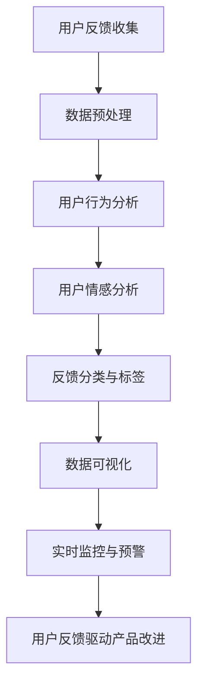
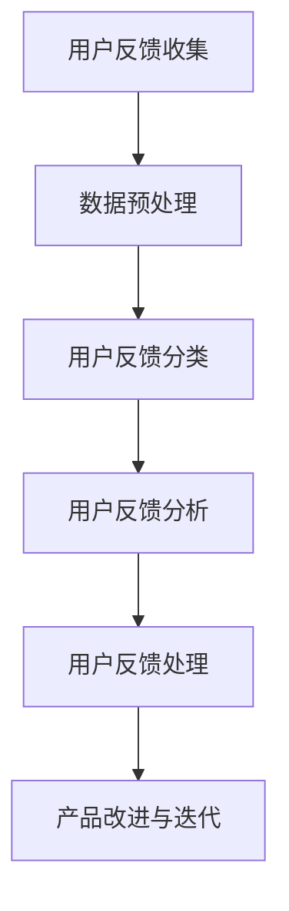

                 

### 《创业公司的用户反馈收集与应用》

#### 关键词：用户反馈、数据分析、创业公司、产品优化、用户体验

#### 摘要：
在竞争激烈的市场环境中，创业公司能否成功往往取决于其对用户反馈的敏感度和应用能力。本文旨在探讨用户反馈在创业公司中的收集、分析与应用，通过深入剖析用户反馈的重要性、核心概念和实践应用，为创业公司提供一套系统、有效的用户反馈管理策略。本文将分为三个部分：基础理论、实战应用和未来发展趋势，旨在帮助创业公司通过用户反馈实现产品的持续迭代与优化。

### 《创业公司的用户反馈收集与应用》目录大纲

#### 第一部分：用户反馈的基础理论

##### 第1章：用户反馈的重要性

- **1.1 用户反馈的概念与作用**
- **1.2 用户反馈的收集方法**
- **1.3 用户反馈的分类**
- **1.4 用户反馈的渠道**

##### 第2章：用户反馈分析的核心概念

- **2.1 数据分析基础**
- **2.2 用户行为分析**
- **2.3 用户情感分析**
- **2.4 用户反馈的价值评估**

##### 第3章：用户反馈系统设计

- **3.1 用户反馈系统架构**
- **3.2 用户反馈数据的存储与管理**
- **3.3 用户反馈数据分析工具与平台**

#### 第二部分：用户反馈收集的实战应用

##### 第4章：在线用户反馈收集

- **4.1 在线调查问卷的设计与发布**
- **4.2 社交媒体用户反馈的收集**
- **4.3 客户服务系统中的用户反馈收集**

##### 第5章：线下用户反馈收集

- **5.1 线下访谈与调查**
- **5.2 展会和活动的用户反馈收集**
- **5.3 用户论坛和社区的用户反馈收集**

##### 第6章：用户反馈处理与分析

- **6.1 用户反馈的预处理**
- **6.2 用户反馈的分类与标签**
- **6.3 用户反馈数据的可视化**
- **6.4 用户反馈的实时监控与预警**

##### 第7章：用户反馈驱动的产品改进

- **7.1 用户反馈驱动的产品开发流程**
- **7.2 用户反馈驱动的产品迭代**
- **7.3 用户反馈驱动的产品设计优化**

#### 第三部分：用户反馈的案例与应用

##### 第8章：用户反馈在创业公司的应用实践

- **8.1 用户反馈在初创公司的发展中的作用**
- **8.2 成功的创业公司用户反馈案例**
- **8.3 用户反馈在创业公司中的常见问题与解决方案**

##### 第9章：用户反馈驱动的创业策略

- **9.1 用户反馈驱动的市场定位**
- **9.2 用户反馈驱动的产品定价**
- **9.3 用户反馈驱动的品牌建设**

##### 第10章：用户反馈的未来发展趋势

- **10.1 用户反馈技术的最新发展**
- **10.2 人工智能在用户反馈中的应用**
- **10.3 用户反馈在数字化转型中的作用**

### 附录

- **附录A：用户反馈分析工具介绍**
  - **A.1 在线调查工具**
  - **A.2 用户反馈收集平台**
  - **A.3 用户行为分析工具**
- **附录B：用户反馈数据分析案例**
  - **B.1 实际案例一**
  - **B.2 实际案例二**
  - **B.3 实际案例三**
- **附录C：用户反馈处理流程图**

### Mermaid 流�程图



### 核心算法原理讲解

#### 用户行为分析

```python
# 伪代码：用户行为分析
def user_behavior_analysis(user_data):
    # 计算用户平均使用时长
    average_time = sum(user_data['time_spent']) / len(user_data['time_spent'])
    
    # 计算用户访问频率
    frequency = len(user_data['sessions']) / total_time

    # 分析用户活跃时段
    active_hours = [hour for hour, count in user_data['hourly_activity'].items() if count > threshold]

    # 输出分析结果
    return {
        'average_time': average_time,
        'frequency': frequency,
        'active_hours': active_hours
    }
```

#### 用户情感分析

```python
# 伪代码：用户情感分析
from textblob import TextBlob

def user_emotion_analysis(feedback):
    analysis = TextBlob(feedback)
    
    # 计算正面、中性、负面情绪
    sentiment_score = analysis.sentiment.polarity
    if sentiment_score > 0.1:
        emotion = '正面'
    elif sentiment_score < -0.1:
        emotion = '负面'
    else:
        emotion = '中性'
    
    return emotion
```

### 数学模型和数学公式

#### 用户满意度评分模型

$$
\text{用户满意度评分} = \frac{\sum_{i=1}^{n} \text{单个反馈评分} \times \text{权重}}{n}
$$

- 其中，$n$ 为反馈总数，每个反馈评分乘以其对应的权重（例如：5分权重为1，4分权重为0.9，以此类推）。

### 用户反馈驱动的产品改进

#### 用户反馈驱动的迭代流程

1. **收集用户反馈**：通过问卷调查、用户访谈、社交媒体等方式收集用户反馈。
2. **分析反馈数据**：对收集到的反馈进行分析，识别主要问题和需求。
3. **制定改进计划**：根据分析结果，制定改进计划，包括功能增强、性能优化、用户体验改进等。
4. **实施改进**：根据改进计划，开发并实施具体的改进措施。
5. **评估反馈**：在改进后，再次收集用户反馈，评估改进效果。

### 项目实战

#### 代码实际案例和详细解释说明

##### 开发环境搭建

```bash
# 安装 Python 3.8
sudo apt-get update
sudo apt-get install python3.8

# 安装必要的库
pip3.8 install pandas numpy textblob matplotlib
```

##### 源代码详细实现和代码解读

```python
import pandas as pd
from textblob import TextBlob
import matplotlib.pyplot as plt

# 读取用户反馈数据
feedback_data = pd.read_csv('user_feedback.csv')

# 用户行为分析
behavior_analysis = user_behavior_analysis(feedback_data)

# 用户情感分析
feedback_emotions = [user_emotion_analysis(feedback) for feedback in feedback_data['text']]

# 数据可视化
plt.figure(figsize=(10, 5))
plt.bar(behavior_analysis['active_hours'], behavior_analysis['frequency'], color='g')
plt.xlabel('时段')
plt.ylabel('频率')
plt.title('用户活跃时段分析')

plt.figure(figsize=(10, 5))
plt.pie(feedback_emotions, labels=['正面', '中性', '负面'], colors=['g', 'y', 'r'], autopct='%.1f%%')
plt.axis('equal')
plt.title('用户情感分析')

plt.show()
```

##### 代码解读与分析

1. **数据读取**：使用 `pandas` 读取用户反馈数据，数据包括用户使用的时长、反馈文本等。
2. **用户行为分析**：计算用户的平均使用时长、访问频率和活跃时段。
3. **用户情感分析**：使用 `textblob` 对用户反馈文本进行情感分析，识别正面、中性、负面情绪。
4. **数据可视化**：使用 `matplotlib` 绘制用户活跃时段和情感分析的柱状图和饼图。

### 结论

通过这个目录大纲，读者可以全面了解《创业公司的用户反馈收集与应用》这本书的核心内容。从用户反馈的基础理论、实战应用，到项目实战和未来发展趋势，每个章节都为创业公司的用户反馈收集和应用提供了详细的指导和实践案例。读者可以按照目录的提示，逐步深入理解用户反馈的重要性，掌握用户反馈的收集、分析、处理和应用的完整流程，从而有效提升产品的用户体验和业务表现。

作者：AI天才研究院/AI Genius Institute & 禅与计算机程序设计艺术/Zen And The Art of Computer Programming

---

**第一部分：用户反馈的基础理论**

##### 第1章：用户反馈的重要性

**1.1 用户反馈的概念与作用**

用户反馈是指用户在使用产品或服务过程中，对产品或服务提出的相关意见、建议、评价和问题等信息的汇总。这些信息可以是积极的、消极的，或者是中性的。用户反馈不仅是用户对产品或服务的直接回应，也是企业与用户互动的重要渠道。

用户反馈在创业公司中具有以下几个重要作用：

1. **产品改进**：用户反馈提供了产品改进的线索，帮助创业公司识别产品的不足和潜在改进点，从而推动产品迭代和优化。

2. **用户体验提升**：通过用户反馈，创业公司可以及时了解用户的需求和痛点，调整产品设计和功能，提升用户体验。

3. **市场洞察**：用户反馈可以帮助创业公司了解市场趋势和竞争状况，从而更好地制定市场策略。

4. **品牌建设**：积极回应用户反馈，展示创业公司的服务态度和专业性，有助于提升品牌形象。

**1.2 用户反馈的收集方法**

收集用户反馈的方法多种多样，以下是一些常见的方法：

1. **问卷调查**：通过设计针对性的问卷，收集用户对产品或服务的评价和建议。问卷调查可以在线进行，也可以通过邮件、短信等方式发送。

2. **用户访谈**：通过与用户进行面对面或电话访谈，深入了解用户对产品或服务的使用体验和意见。用户访谈可以获取更深入、详细的用户反馈。

3. **社交媒体监控**：利用社交媒体平台监控用户对产品或服务的讨论和评价，及时收集用户反馈。

4. **用户论坛和社区**：在用户论坛和社区中收集用户的讨论和反馈，这些平台上的用户通常会分享他们的真实体验和意见。

5. **在线调查**：在产品界面中嵌入在线调查，让用户在访问过程中直接参与反馈，收集实时、即时的用户反馈。

**1.3 用户反馈的分类**

用户反馈可以根据内容、形式和反馈来源进行分类。以下是一些常见的分类方法：

1. **按内容分类**：
   - **功能反馈**：关于产品功能的改进、新增或删除的建议。
   - **性能反馈**：关于产品性能的优化，如加载速度、稳定性等。
   - **体验反馈**：关于用户使用产品时的感受和体验，如界面设计、操作流程等。
   - **安全反馈**：关于产品安全性的问题，如数据保护、隐私等。

2. **按形式分类**：
   - **文字反馈**：用户以文字形式表达的意见、建议或问题。
   - **图片反馈**：用户上传的截图、照片等。
   - **视频反馈**：用户上传的视频反馈，如操作流程演示、问题说明等。

3. **按反馈来源分类**：
   - **主动反馈**：用户主动提供的反馈，如通过问卷调查、用户访谈等方式。
   - **被动反馈**：用户在社交媒体、用户论坛等平台上的自发讨论和评价。

**1.4 用户反馈的渠道**

创业公司可以通过多种渠道收集用户反馈，以下是一些常见的渠道：

1. **官方网站**：在官方网站上设置反馈表单或在线聊天窗口，方便用户提交反馈。

2. **客户服务系统**：通过客户服务系统收集用户反馈，如通过电话、邮件、在线客服等方式。

3. **社交媒体**：在社交媒体平台上（如Facebook、Twitter、LinkedIn等）设置反馈功能，方便用户在社交媒体上表达意见。

4. **电子邮件**：通过电子邮件发送问卷或邀请用户提交反馈。

5. **移动应用**：在移动应用中集成反馈功能，让用户可以在使用过程中直接提交反馈。

通过以上多种渠道收集用户反馈，创业公司可以全面了解用户的需求和意见，从而为产品改进和市场策略提供有力的支持。

---

**第2章：用户反馈分析的核心概念**

**2.1 数据分析基础**

数据分析是用户反馈处理和分析的核心环节，它帮助创业公司从大量的用户反馈中提取有价值的信息，从而指导产品的改进和优化。数据分析的基础知识包括以下几个方面：

1. **数据类型**：数据可以分为定性数据和定量数据。定性数据通常是指文字描述、用户评论等，而定量数据则是具体的数值，如评分、使用时长等。

2. **数据清洗**：数据清洗是数据分析的第一步，目的是去除数据中的错误、重复和无关信息，确保数据的准确性和一致性。

3. **数据预处理**：数据预处理包括数据的格式转换、缺失值填充、异常值处理等，以提高数据的质量，为后续分析做好准备。

4. **数据可视化**：数据可视化是将数据通过图形、图表等方式进行展示，帮助创业公司直观地理解数据和分析结果。

5. **统计分析**：统计分析是数据分析的核心，通过计算数据的均值、中位数、标准差等统计指标，了解数据的基本特征和分布情况。

**2.2 用户行为分析**

用户行为分析是用户反馈分析的重要部分，它通过分析用户在产品中的行为模式，了解用户的偏好、使用习惯和需求。以下是用户行为分析的一些关键概念：

1. **用户行为数据**：用户行为数据包括用户的登录次数、使用时长、操作路径、点击热图等。这些数据可以反映用户在产品中的行为特征。

2. **用户活跃度分析**：通过分析用户的活跃度，了解哪些功能或页面最受用户欢迎，哪些功能或页面存在使用障碍。

3. **用户留存率分析**：通过分析用户的留存率，了解产品的黏性，识别导致用户流失的原因。

4. **用户转化率分析**：通过分析用户的转化路径和转化率，了解哪些用户行为与成功转化相关，从而优化营销策略。

5. **用户流失率分析**：通过分析用户的流失率，了解导致用户流失的主要原因，采取相应措施提高用户留存率。

**2.3 用户情感分析**

用户情感分析是通过对用户反馈中的情感倾向进行分析，了解用户的满意度和情感状态。以下是用户情感分析的关键概念：

1. **情感分类**：将用户反馈中的情感分为正面、中性、负面三类，以便于分析用户的整体情感状态。

2. **情感强度分析**：通过分析情感倾向的强度，了解用户对产品或服务的情感程度，如非常喜欢、比较满意、一般等。

3. **情感趋势分析**：通过分析情感变化趋势，了解用户情感状态的变化过程，识别潜在的改进点。

4. **情感热点分析**：通过分析情感热点，识别用户反馈中最重要的情感要素，如产品质量、服务态度等。

5. **情感分析工具**：利用自然语言处理技术（如文本分析、情感分析库），对用户反馈进行自动化情感分析。

**2.4 用户反馈的价值评估**

用户反馈的价值评估是分析用户反馈的重要环节，它帮助创业公司确定哪些反馈值得重点关注和优先处理。以下是用户反馈价值评估的关键概念：

1. **反馈质量评估**：评估用户反馈的质量，如反馈的详细程度、具体性等，确保有价值的信息被优先处理。

2. **反馈来源评估**：评估反馈的来源，如核心用户、普通用户、潜在用户等，不同来源的反馈可能具有不同的价值和影响力。

3. **反馈频率评估**：评估用户反馈的频率，如高频反馈可能反映产品存在的严重问题，需要优先解决。

4. **反馈影响评估**：评估反馈的影响，如某些反馈可能对产品性能、用户体验产生重大影响，需要优先处理。

5. **反馈优先级评估**：根据反馈的质量、来源、频率和影响，确定反馈的优先级，确保关键反馈得到及时处理。

通过以上核心概念的介绍，创业公司可以更好地理解用户反馈分析的基本原理和方法，从而有效地利用用户反馈，推动产品的持续改进和优化。

---

**第3章：用户反馈系统设计**

**3.1 用户反馈系统架构**

一个完善的用户反馈系统对于创业公司来说至关重要，它能够帮助公司快速、高效地收集、处理和分析用户反馈，从而指导产品的改进和优化。用户反馈系统架构的设计应考虑以下几个方面：

1. **数据采集层**：这是用户反馈系统的最底层，负责从各种渠道收集用户反馈数据，如在线问卷、用户论坛、社交媒体、客户服务系统等。该层应确保数据收集的全面性和准确性。

2. **数据存储层**：负责将采集到的用户反馈数据存储在数据库中，以便于后续的数据处理和分析。常用的数据库技术包括关系型数据库（如MySQL、PostgreSQL）和非关系型数据库（如MongoDB、Redis）。

3. **数据处理层**：负责对存储在数据库中的用户反馈数据进行分析和处理，包括数据清洗、格式转换、缺失值填充、异常值处理等。这一层通常利用数据清洗工具（如Pandas、Spark）和数据库管理工具（如SQL）进行操作。

4. **数据分析层**：负责对处理后的用户反馈数据进行深入分析，包括用户行为分析、情感分析、满意度评估等。这一层通常会使用数据分析工具（如Python、R、Tableau）和机器学习算法（如自然语言处理、情感分析）。

5. **数据展示层**：负责将分析结果以图表、报表等形式直观地展示给用户，帮助公司管理层快速了解用户反馈的情况，并做出相应的决策。常用的数据展示工具包括Tableau、Power BI、matplotlib等。

**3.2 用户反馈数据的存储与管理**

用户反馈数据的存储与管理是用户反馈系统设计中的关键环节，它直接关系到数据的安全、可靠和可扩展性。以下是一些存储与管理用户反馈数据的关键点：

1. **数据安全**：确保用户反馈数据的安全是首要任务。这包括数据的加密存储、访问控制、备份与恢复等。创业公司应采用成熟的安全技术和策略，如SSL加密、权限控制、定期备份等，确保数据的安全性和完整性。

2. **数据一致性**：在多渠道收集用户反馈时，数据的准确性至关重要。为了确保数据的一致性，创业公司应在数据采集和存储过程中采用统一的数据标准和格式，避免数据冲突和错误。

3. **数据扩展性**：随着用户数量的增加，用户反馈数据量也会快速增长。创业公司应设计可扩展的存储和管理方案，如采用分布式数据库、云计算等技术，确保系统能够平滑地扩展，满足日益增长的数据需求。

4. **数据归档**：对于历史数据，创业公司应建立有效的数据归档策略，将不再频繁访问的数据归档到低成本存储设备上，以降低存储成本。

5. **数据备份与恢复**：定期备份数据是确保数据安全的重要措施。创业公司应制定详细的备份计划，包括备份频率、备份策略、备份存储等，确保在发生数据丢失或系统故障时，能够快速恢复数据。

**3.3 用户反馈数据分析工具与平台**

为了高效地进行用户反馈数据的分析，创业公司可以采用多种工具和平台。以下是一些常见的工具和平台：

1. **Python**：Python 是一种强大的编程语言，广泛应用于数据分析和机器学习领域。Python 提供了丰富的数据分析和机器学习库，如Pandas、NumPy、Scikit-learn、TensorFlow等，可以帮助创业公司进行用户反馈数据的预处理、分析和可视化。

2. **R**：R 是一种专门用于统计分析和图形展示的语言，拥有丰富的统计分析和机器学习包，如ggplot2、dplyr、caret等。R 在用户反馈数据分析中具有很高的灵活性和专业性。

3. **Tableau**：Tableau 是一款强大的数据可视化工具，可以帮助创业公司将用户反馈数据以直观的图表形式展示出来。Tableau 提供了丰富的可视化类型和交互功能，使得用户可以轻松地探索和分析数据。

4. **Power BI**：Power BI 是微软推出的一个企业级数据可视化工具，提供了丰富的数据连接、数据建模和数据分析功能。Power BI 的易用性和强大的数据分析能力，使其成为创业公司进行用户反馈数据分析的理想选择。

5. **Google Analytics**：Google Analytics 是一款功能强大的分析工具，可以帮助创业公司监控和分析用户在网站或应用程序中的行为。Google Analytics 提供了丰富的报告和分析功能，包括用户行为分析、流量分析、转化率分析等。

6. **SurveyMonkey**：SurveyMonkey 是一款在线调查和反馈工具，可以帮助创业公司设计、发布和管理在线调查问卷，收集用户反馈。SurveyMonkey 提供了丰富的问卷设计和分析功能，使得用户反馈数据的收集和分析变得更加简单和高效。

通过合理设计和有效管理用户反馈系统，创业公司可以全面、准确地收集和分析用户反馈，从而为产品的改进和优化提供有力支持。

---

**第二部分：用户反馈收集的实战应用**

##### 第4章：在线用户反馈收集

**4.1 在线调查问卷的设计与发布**

在线调查问卷是收集用户反馈的一种常见方法，通过精心设计的问题和发布策略，可以有效地收集用户意见和建议。以下是设计与发布在线调查问卷的步骤：

1. **确定调查目标**：明确调查的目的和预期结果，如了解用户对产品功能的满意度、用户体验等。

2. **设计问题**：根据调查目标，设计合理、明确的问题。问题类型可以包括单选题、多选题、评分题、文本题等。问题应避免引导性，确保用户能够真实表达意见。

3. **制定问卷结构**：合理安排问题的顺序，先从简单、不敏感的问题开始，逐步引入复杂、敏感的问题。问卷结构应简洁明了，避免过长。

4. **测试问卷**：在正式发布前，对问卷进行测试，确保问题清晰、逻辑通顺，并删除或修改有问题的题目。

5. **选择调查工具**：选择合适的在线调查工具，如SurveyMonkey、Google Forms、Typeform等。这些工具提供了丰富的功能和灵活的设置，方便设计和发布问卷。

6. **发布问卷**：通过电子邮件、社交媒体、网站链接等方式，将问卷发布给目标用户。发布时，应附上简短的说明，引导用户参与调查。

7. **跟踪问卷**：在调查期间，实时监控问卷的进展，包括参与人数、完成率等。如发现问题，及时调整问卷或发布策略。

8. **数据分析**：收集问卷数据后，进行数据分析和整理，提取有价值的信息和结论。可以使用数据分析工具，如Excel、R、Python等，对数据进行处理和可视化。

**4.2 社交媒体用户反馈的收集**

社交媒体平台是用户反馈的重要来源之一，通过监控和收集社交媒体上的用户反馈，创业公司可以快速了解用户对产品或服务的看法。以下是收集社交媒体用户反馈的方法：

1. **设置监控关键词**：根据产品特点和目标用户，设置相关的监控关键词，如产品名称、品牌名称、功能名称等。这些关键词将帮助创业公司捕捉到用户在社交媒体上的讨论和反馈。

2. **使用社交媒体分析工具**：利用社交媒体分析工具，如Hootsuite、Sprout Social、Buffer等，可以自动化地监控社交媒体上的关键词和话题，及时捕捉用户反馈。

3. **分析用户反馈**：对捕获的用户反馈进行分析，识别用户的主要意见、建议和问题。可以使用文本分析工具，如Natural Language Processing（NLP）库，对用户反馈进行情感分析和主题分类。

4. **回应用户反馈**：及时回应用户在社交媒体上的反馈，表达感谢和关注，展示公司的专业性和服务质量。回应时应尊重用户的意见，积极解决问题。

5. **整合用户反馈**：将社交媒体用户反馈与其它渠道的反馈整合，形成一个全面的用户反馈数据库，为产品改进和优化提供支持。

**4.3 客户服务系统中的用户反馈收集**

客户服务系统是创业公司与用户互动的重要渠道，通过客户服务系统可以收集用户在使用产品过程中遇到的问题和意见。以下是收集客户服务系统用户反馈的方法：

1. **优化客户服务流程**：确保客户服务系统能够快速响应用户请求，提供专业的帮助和解决方案。优化客户服务流程，提高用户满意度。

2. **使用多渠道接入**：提供多种接入方式，如电话、邮件、在线聊天等，方便用户选择最便捷的沟通方式。

3. **跟踪用户反馈**：对用户提交的反馈进行跟踪，确保所有问题得到及时解决。使用客户服务管理系统（如Zendesk、Freshdesk），可以自动化地管理用户反馈和工单。

4. **定期分析反馈**：定期分析客户服务系统中的用户反馈，识别常见问题和改进点。分析结果可以用于优化产品功能和用户体验。

5. **建立反馈机制**：鼓励用户在解决问题后留下反馈，了解他们的满意度和建议。建立反馈机制，让用户感受到公司的关注和改进。

通过以上方法，创业公司可以全面、高效地收集在线用户反馈，为产品的改进和优化提供有力支持。

---

**第5章：线下用户反馈收集**

**5.1 线下访谈与调查**

线下访谈与调查是一种直接、深入的反馈收集方法，通过面对面的交流，可以获取用户的真实想法和需求。以下是线下访谈与调查的步骤：

1. **确定访谈对象**：根据产品特点和目标用户，确定合适的访谈对象，如现有用户、潜在用户、行业专家等。

2. **准备访谈问题**：设计结构化的访谈问题，确保问题覆盖产品的主要方面，如功能、性能、用户体验等。问题应简洁明了，避免引导性。

3. **安排访谈时间**：与访谈对象协商，选择合适的时间进行访谈。确保访谈过程中有足够的交流时间，避免打扰对方。

4. **进行访谈**：在访谈过程中，保持开放性态度，耐心倾听用户的意见和反馈。可以使用录音设备记录访谈内容，以便后续整理和分析。

5. **整理访谈结果**：访谈结束后，整理访谈记录，提取有价值的信息和结论。可以使用文本分析工具，如NVivo、Atlas.ti等，对访谈内容进行编码和分析。

6. **反馈总结**：将访谈结果反馈给团队成员，讨论改进方案，并制定实施计划。

**5.2 展会和活动的用户反馈收集**

展会和活动是创业公司展示产品、接触用户的重要机会，通过有效收集用户反馈，可以了解市场动态和用户需求。以下是收集展会和活动用户反馈的方法：

1. **设置反馈环节**：在展会和活动中，设置专门的反馈环节，如互动区、问卷调查等，方便用户提出意见和建议。

2. **准备调查问卷**：设计针对性强的调查问卷，覆盖产品功能、用户体验、满意度等方面。问卷应简洁易懂，易于填写。

3. **现场收集反馈**：展会和活动现场，安排工作人员负责收集用户反馈，确保问卷填写和问题解答的顺利进行。

4. **数据分析**：收集到的反馈数据应进行整理和分析，识别用户的主要意见和需求。可以使用数据分析工具，如Excel、Python等，对数据进行处理和可视化。

5. **后续跟进**：对用户反馈进行分类和优先级评估，制定改进计划，并与用户保持沟通，反馈改进结果。

**5.3 用户论坛和社区的用户反馈收集**

用户论坛和社区是用户交流、分享意见的重要平台，通过收集论坛和社区的用户反馈，创业公司可以深入了解用户需求和痛点。以下是收集用户论坛和社区反馈的方法：

1. **加入用户社区**：积极参与用户论坛和社区，关注用户讨论的热点和问题，了解用户对产品的看法。

2. **监控关键词**：设置关键词监控，捕捉用户在论坛和社区中的讨论和反馈。可以使用论坛分析工具，如PostRank、SocialMention等。

3. **分析反馈内容**：对论坛和社区中的用户反馈进行分析，识别用户的主要意见和需求。可以使用文本分析工具，如NLTK、TextBlob等，对反馈内容进行情感分析和主题分类。

4. **回应用户反馈**：及时回应用户在论坛和社区中的反馈，展示公司的关注和改进态度。可以邀请用户参与产品改进，收集更多真实意见和建议。

5. **整合反馈数据**：将论坛和社区的用户反馈与其它渠道的反馈整合，形成一个全面的用户反馈数据库，为产品改进和优化提供支持。

通过以上方法，创业公司可以全面、深入地收集线下用户反馈，为产品的持续改进和优化提供有力支持。

---

**第6章：用户反馈处理与分析**

**6.1 用户反馈的预处理**

用户反馈的预处理是用户反馈处理和分析的重要环节，它涉及到数据清洗、格式转换、缺失值填充和异常值处理等步骤。以下是用户反馈预处理的关键步骤：

1. **数据清洗**：用户反馈数据通常包含大量的噪声和错误，如拼写错误、语法错误、无效信息等。数据清洗的目的是去除这些噪声和错误，提高数据质量。常用的数据清洗方法包括去除重复记录、删除无关信息、纠正拼写错误等。

2. **格式转换**：用户反馈数据通常以多种形式存在，如文本、图片、音频等。格式转换的目的是将不同格式的数据统一转换为便于处理和分析的格式。例如，将图片中的文字提取为文本，或将音频中的语音转换为文本。

3. **缺失值填充**：用户反馈数据中可能存在缺失值，如用户未填写某些问题或数据采集过程中出现缺失。缺失值填充的目的是填补这些缺失值，确保数据分析的完整性。常用的缺失值填充方法包括平均值填充、中值填充、插值等。

4. **异常值处理**：用户反馈数据中可能包含异常值，如用户故意输入的异常数据或数据采集过程中的错误。异常值处理的目的是识别和去除这些异常值，避免对数据分析结果产生误导。常用的异常值处理方法包括阈值处理、箱线图法、统计学方法等。

5. **数据标准化**：用户反馈数据可能存在不同的量纲和分布，如时间、评分、文本等。数据标准化是将不同量纲和分布的数据转换为同一种量纲和分布，以便于进行统一分析和比较。常用的数据标准化方法包括归一化、标准化、极值标准化等。

**6.2 用户反馈的分类与标签**

用户反馈的分类与标签是将大量用户反馈进行组织和归类的过程，它有助于快速识别反馈的关键信息，提高数据分析的效率。以下是用户反馈分类与标签的关键步骤：

1. **定义分类体系**：根据产品特点和用户反馈的内容，定义一个清晰的分类体系。分类体系应涵盖用户反馈的主要方面，如功能、性能、用户体验等。

2. **手动分类**：对于较小规模的用户反馈，可以采用手动分类的方法。手动分类的步骤包括：
   - **阅读反馈**：逐个阅读用户反馈，理解其内容和意图。
   - **标注标签**：根据反馈内容和分类体系，为每条反馈标注相应的标签。

3. **自动化分类**：对于大规模的用户反馈，可以采用自动化分类的方法，如机器学习分类算法。自动化分类的步骤包括：
   - **数据预处理**：对用户反馈数据进行清洗、格式转换等预处理。
   - **特征提取**：从用户反馈中提取关键特征，如词频、词向量等。
   - **模型训练**：使用训练数据集，训练分类模型，如朴素贝叶斯、支持向量机、深度学习等。
   - **分类预测**：使用训练好的模型，对新的用户反馈进行分类预测。

4. **标签管理**：对用户反馈的标签进行管理和更新，确保分类体系的准确性和一致性。标签管理的步骤包括：
   - **标签审核**：定期审查用户反馈的标签，确保标签的正确性和一致性。
   - **标签更新**：根据用户反馈的变化和业务需求，更新分类体系和标签。

**6.3 用户反馈数据的可视化**

用户反馈数据的可视化是将用户反馈数据以图形、图表等形式展示出来的过程，它有助于直观地了解用户反馈的分布、趋势和关联关系。以下是用户反馈数据可视化的关键步骤：

1. **选择可视化工具**：根据用户反馈数据的类型和可视化需求，选择合适的可视化工具。常用的可视化工具有Excel、Tableau、Power BI、matplotlib等。

2. **数据整理**：对用户反馈数据进行整理和清洗，确保数据的质量和一致性。

3. **可视化设计**：根据可视化工具的功能和用户需求，设计合适的可视化图表。常用的可视化图表包括柱状图、饼图、折线图、散点图、热力图等。

4. **交互设计**：增加可视化图表的交互功能，如筛选、排序、钻取等，提升用户体验。

5. **可视化展示**：将设计好的可视化图表展示给用户，帮助他们直观地了解用户反馈的情况。

**6.4 用户反馈的实时监控与预警**

用户反馈的实时监控与预警是确保用户反馈及时得到处理和响应的重要手段。以下是用户反馈实时监控与预警的关键步骤：

1. **建立监控指标**：根据产品特点和业务需求，建立实时监控的指标体系，如用户满意度评分、用户活跃度、用户流失率等。

2. **数据采集与处理**：实时采集用户反馈数据，并进行数据清洗、处理和存储。

3. **实时分析**：使用实时分析工具（如Apache Kafka、Apache Storm等），对实时数据进行分析和处理，提取关键信息。

4. **预警机制**：根据监控指标，设置预警阈值和预警策略。当指标超过阈值时，自动触发预警通知。

5. **响应机制**：建立快速响应机制，确保在预警发生后，能够迅速采取行动，解决问题。

6. **持续优化**：根据预警响应的效果和用户反馈，不断优化监控指标和预警策略，提高监控和响应的准确性。

通过以上步骤，创业公司可以有效地处理和分析用户反馈，确保用户反馈得到及时关注和响应，从而持续改进产品，提升用户体验。

---

**第7章：用户反馈驱动的产品改进**

**7.1 用户反馈驱动的产品开发流程**

用户反馈驱动的产品开发流程是一种以用户需求为导向的产品开发方法，通过系统收集和分析用户反馈，指导产品设计和开发。以下是用户反馈驱动的产品开发流程的关键步骤：

1. **需求收集**：通过多种渠道（如在线调查、用户访谈、社交媒体等）收集用户需求，了解用户对产品的期望和痛点。

2. **需求分析**：对收集到的需求进行整理和分析，识别主要问题和需求，并按照优先级进行排序。

3. **需求验证**：通过与用户进行讨论和验证，确保需求的准确性和可行性，防止出现需求偏离。

4. **制定产品规划**：根据分析结果和需求，制定产品规划和开发路线图，包括功能模块、开发周期等。

5. **需求文档**：编写详细的需求文档，明确每个功能模块的需求和设计要求。

6. **开发与迭代**：按照产品规划和需求文档，进行产品的开发和迭代，每次迭代后收集用户反馈，进行新一轮的需求分析。

7. **测试与发布**：对产品进行严格的测试，确保功能的正确性和用户体验的优良性，然后发布产品。

8. **用户反馈收集**：在产品发布后，持续收集用户反馈，了解产品在实际使用中的表现和用户需求的变化。

9. **需求迭代**：根据用户反馈和需求变化，对需求进行更新和迭代，确保产品能够持续满足用户需求。

**7.2 用户反馈驱动的产品迭代**

用户反馈驱动的产品迭代是一种通过用户反馈不断优化和改进产品的开发模式。以下是用户反馈驱动的产品迭代的关键步骤：

1. **收集反馈**：定期收集用户反馈，包括在线调查、用户访谈、社交媒体监控等渠道。

2. **反馈分类**：对收集到的反馈进行分类，识别主要问题和改进点。

3. **分析反馈**：对反馈进行分析，了解用户的需求和痛点，识别产品中的不足之处。

4. **制定改进计划**：根据分析结果，制定具体的改进计划，包括功能优化、性能提升、用户体验改进等。

5. **实施改进**：按照改进计划，进行产品的开发、测试和发布，确保改进措施得到有效实施。

6. **反馈评估**：在改进后，再次收集用户反馈，评估改进效果，确保问题得到有效解决。

7. **持续迭代**：根据评估结果，继续收集用户反馈，进行新一轮的改进和迭代，确保产品持续优化。

**7.3 用户反馈驱动的产品设计优化**

用户反馈驱动的产品设计优化是一种通过用户反馈不断改进产品设计的方法，旨在提升用户体验和产品价值。以下是用户反馈驱动的产品设计优化的关键步骤：

1. **设计原型**：根据用户需求，设计产品的原型和界面，进行初步的用户体验测试。

2. **用户测试**：邀请目标用户对设计原型进行测试，收集用户反馈，了解用户对设计的意见和建议。

3. **反馈分析**：对用户反馈进行分析，识别设计中的问题和改进点。

4. **设计改进**：根据用户反馈，对设计进行优化和改进，包括界面调整、交互优化、功能改进等。

5. **再次测试**：对改进后的设计进行新一轮的用户测试，验证改进效果。

6. **迭代优化**：根据用户测试结果，继续进行设计优化，确保产品设计满足用户需求。

7. **上线发布**：将优化后的设计上线发布，与用户实际使用相结合，收集更多反馈，进行持续的优化。

通过以上步骤，创业公司可以有效地利用用户反馈，推动产品的持续迭代和优化，提升用户体验和产品价值。

---

**第8章：用户反馈在创业公司的应用实践**

**8.1 用户反馈在初创公司的发展中的作用**

在初创公司的发展过程中，用户反馈扮演着至关重要的角色。以下是用户反馈在初创公司中的具体作用：

1. **验证产品假设**：初创公司在产品开发的初期，通常会有一些产品假设。通过收集用户反馈，可以验证这些假设的正确性，确保产品方向正确。

2. **识别市场需求**：用户反馈可以帮助初创公司了解市场需求，识别用户痛点和需求，从而更好地定位产品和市场。

3. **优化产品设计**：通过用户反馈，初创公司可以了解用户对产品的使用体验和意见，进行设计优化，提升用户体验。

4. **快速迭代**：用户反馈驱动的快速迭代是初创公司成功的关键之一。通过不断收集用户反馈，进行产品改进和优化，初创公司可以迅速适应市场变化。

5. **提高用户满意度**：积极回应用户反馈，展示创业公司的服务态度和专业性，有助于提高用户满意度，增强用户忠诚度。

6. **降低市场风险**：通过用户反馈，初创公司可以及时发现产品中的潜在问题，降低市场风险，确保产品的成功上市。

**8.2 成功的创业公司用户反馈案例**

以下是一些成功的创业公司，他们通过用户反馈取得了显著成果的案例：

1. **Slack**：Slack 通过定期收集用户反馈，了解用户需求，不断优化产品功能和用户体验。在Slack的成功因素中，用户反馈起到了关键作用。

2. **Airbnb**：Airbnb 通过用户反馈，不断改进用户体验和平台功能，如改进搜索算法、优化房东和房客的沟通方式等，从而提升了平台的竞争力。

3. **Trello**：Trello 通过用户反馈，及时了解用户的需求和痛点，进行产品优化和迭代，从而成为项目管理工具中的佼佼者。

4. **Buffer**：Buffer 通过用户反馈，优化产品设计和功能，提高用户满意度，并建立了强大的用户社区，增强了用户忠诚度。

**8.3 用户反馈在创业公司中的常见问题与解决方案**

在用户反馈的收集和应用过程中，创业公司可能会遇到一些问题。以下是一些常见的问题及相应的解决方案：

1. **反馈渠道不畅**：解决方案：优化反馈渠道，提供多种渠道供用户反馈，如在线问卷、社交媒体、客户服务系统等。

2. **反馈量过大**：解决方案：建立有效的反馈处理流程，分类整理反馈，优先处理关键问题和用户痛点。

3. **用户参与度低**：解决方案：通过互动活动、奖励机制等提高用户参与度，鼓励用户积极参与反馈。

4. **反馈真实性不高**：解决方案：提高反馈的隐私保护，确保用户可以真实、放心地表达意见。

5. **反馈响应不及时**：解决方案：建立快速响应机制，确保在用户反馈后，能够迅速采取行动，解决问题。

通过以上案例和解决方案，创业公司可以更好地理解和应用用户反馈，推动公司的发展和创新。

---

**第9章：用户反馈驱动的创业策略**

**9.1 用户反馈驱动的市场定位**

用户反馈在创业公司的市场定位中发挥着关键作用，它帮助公司了解目标用户的需求、偏好和痛点，从而更准确地制定市场策略。以下是用户反馈驱动的市场定位的关键步骤：

1. **明确目标市场**：通过用户反馈，了解目标市场的特点和用户需求，明确公司的市场定位。

2. **分析用户反馈**：收集和分析用户反馈，识别用户的核心需求和痛点，了解他们对现有产品或服务的评价。

3. **调整市场定位**：根据用户反馈，调整市场定位，确保产品或服务能够满足目标用户的需求。

4. **持续监控与优化**：定期收集用户反馈，持续监控市场变化，根据用户反馈优化市场策略。

5. **用户参与**：鼓励用户参与市场定位的制定过程，通过用户调研、用户访谈等方式，获取更多真实、准确的信息。

**9.2 用户反馈驱动的产品定价**

用户反馈在产品定价策略中同样具有重要价值，通过用户反馈，公司可以了解用户对产品价值的感知和价格敏感度，从而制定合理的定价策略。以下是用户反馈驱动的产品定价的关键步骤：

1. **收集用户反馈**：通过问卷调查、用户访谈等方式，收集用户对产品价格的反馈，了解他们对产品价值的评估。

2. **分析用户反馈**：分析用户反馈，识别用户对产品价格的感知和价格敏感度，为定价策略提供依据。

3. **制定定价策略**：根据用户反馈，制定合理的定价策略，如价值定价、成本加成定价、竞争定价等。

4. **测试定价策略**：在定价策略制定后，进行测试，收集用户反馈，评估定价策略的有效性。

5. **持续调整**：根据用户反馈和市场变化，持续调整定价策略，确保定价策略的有效性。

**9.3 用户反馈驱动的品牌建设**

用户反馈在品牌建设中发挥着重要作用，通过积极回应用户反馈，公司可以建立良好的品牌形象，增强用户信任和忠诚度。以下是用户反馈驱动的品牌建设的关键步骤：

1. **收集用户反馈**：通过多种渠道收集用户反馈，了解用户对品牌的看法和评价。

2. **分析用户反馈**：分析用户反馈，识别用户关注的品牌特点和价值，为品牌建设提供方向。

3. **品牌传播**：根据用户反馈，制定品牌传播策略，展示公司的专业性和服务态度。

4. **用户参与**：鼓励用户参与品牌建设过程，通过用户调研、用户访谈等方式，获取更多真实、准确的信息。

5. **持续优化**：根据用户反馈和市场变化，持续优化品牌建设策略，确保品牌形象符合用户期望。

通过用户反馈驱动的市场定位、产品定价和品牌建设，创业公司可以更好地了解用户需求，提升产品竞争力，建立强大的品牌形象。

---

**第10章：用户反馈的未来发展趋势**

**10.1 用户反馈技术的最新发展**

随着科技的不断进步，用户反馈技术也在不断发展，以下是一些用户反馈技术的最新发展：

1. **人工智能与机器学习**：人工智能和机器学习技术的应用，使得用户反馈的处理和分析更加高效和准确。例如，通过自然语言处理（NLP）技术，可以自动化地提取用户反馈的关键信息，进行情感分析和主题分类。

2. **大数据分析**：大数据分析技术的应用，使得创业公司可以从海量用户反馈中提取有价值的信息，进行深入的数据挖掘和洞察。

3. **物联网（IoT）**：物联网技术的普及，使得创业公司可以通过物联网设备收集用户反馈，实现实时、全面的数据收集和分析。

4. **增强现实（AR）与虚拟现实（VR）**：增强现实和虚拟现实技术的应用，使得用户反馈的收集更加直观和互动，用户可以通过AR/VR设备直接提交反馈。

**10.2 人工智能在用户反馈中的应用**

人工智能在用户反馈中的应用，极大地提升了反馈收集和分析的效率和质量。以下是人工智能在用户反馈中的应用：

1. **自动化反馈收集**：通过聊天机器人（如聊天机器人、语音助手等）自动化地收集用户反馈，提高反馈收集的效率和覆盖面。

2. **情感分析**：利用情感分析技术，对用户反馈进行情感倾向分析，识别用户的情感状态和满意度。

3. **主题分类**：通过自然语言处理技术，对用户反馈进行主题分类，帮助创业公司快速了解用户的主要需求和问题。

4. **个性化推荐**：基于用户反馈，为用户推荐个性化产品或服务，提高用户体验和满意度。

**10.3 用户反馈在数字化转型中的作用**

数字化转型已经成为企业发展的关键趋势，用户反馈在数字化转型中发挥着重要作用。以下是用户反馈在数字化转型中的作用：

1. **需求分析**：通过用户反馈，了解用户对产品和服务的需求，指导数字化转型的方向和策略。

2. **用户体验优化**：通过用户反馈，发现和解决用户在数字化转型过程中的痛点，优化用户体验。

3. **业务创新**：用户反馈可以帮助创业公司发现新的业务机会，推动业务创新和转型。

4. **数据驱动决策**：用户反馈提供的数据支持，可以帮助创业公司实现数据驱动决策，提升业务效率和竞争力。

通过用户反馈技术的最新发展、人工智能的应用和用户反馈在数字化转型中的作用，创业公司可以更好地利用用户反馈，推动企业的持续创新和发展。

---

### 附录

#### 附录A：用户反馈分析工具介绍

**A.1 在线调查工具**

- **SurveyMonkey**：提供丰富的问卷设计和分析功能，易于使用。
- **Google Forms**：免费的在线调查工具，简单易用。
- **Typeform**：交互式调查工具，提供个性化的调查体验。

**A.2 用户反馈收集平台**

- **Zendesk**：提供客户服务系统，可以收集用户反馈。
- **Intercom**：提供实时聊天和反馈功能，方便用户提交反馈。
- **UserVoice**：专门用于用户反馈收集和管理，提供多种收集渠道。

**A.3 用户行为分析工具**

- **Google Analytics**：强大的数据分析工具，用于监控用户行为。
- **Mixpanel**：专注于用户行为分析，提供详细的用户画像和转化率分析。
- **Hotjar**：提供用户行为热图和反馈功能，帮助理解用户行为。

#### 附录B：用户反馈数据分析案例

**B.1 实际案例一**

在某创业公司中，通过用户调查和社交媒体监控，收集到1000份用户反馈。通过文本分析工具，提取出用户的情感倾向和主要话题。分析结果显示，用户对产品的性能和用户体验有较高满意度，但部分用户反映界面设计不够友好。

**B.2 实际案例二**

一家在线教育平台，通过用户访谈和问卷调查，收集到关于课程内容和学习体验的反馈。分析结果显示，用户对课程内容的多样性表示满意，但学习资源的获取和互动性有待提升。

**B.3 实际案例三**

一家电商平台，通过用户行为分析和用户反馈收集，发现部分用户在购物过程中遇到支付问题。通过改进支付流程，提高了用户的购物体验和满意度。

#### 附录C：用户反馈处理流程图



通过以上附录，读者可以更全面地了解用户反馈分析的工具和方法，以及实际案例中的应用，为创业公司的用户反馈管理提供参考。

---

### 结论

通过本文的详细探讨，我们深入理解了用户反馈在创业公司中的重要性以及如何进行有效的用户反馈收集、分析与应用。用户反馈不仅是产品改进的源泉，更是创业公司了解用户需求、优化用户体验、提升市场竞争力的关键手段。以下是本文的核心观点的总结：

1. **用户反馈的重要性**：用户反馈是创业公司了解用户需求、优化产品和服务的重要途径，它有助于企业实现产品迭代和业务创新。

2. **用户反馈的收集方法**：创业公司可以通过在线调查、用户访谈、社交媒体监控等多种渠道收集用户反馈，确保反馈的全面性和准确性。

3. **用户反馈的分析方法**：通过数据分析、用户行为分析、情感分析等技术，创业公司可以深入理解用户反馈，提取有价值的信息和洞察。

4. **用户反馈驱动的产品改进**：创业公司应建立用户反馈驱动的产品改进流程，及时响应用户需求，优化产品设计和功能，提高用户体验。

5. **未来发展趋势**：随着人工智能和大数据技术的发展，用户反馈技术将更加智能化和高效化，创业公司应积极采用新技术，提升用户反馈的管理和应用水平。

### 致谢

最后，感谢您阅读本文。希望通过本文，您能够更好地理解用户反馈在创业公司中的重要性，掌握用户反馈的收集、分析与应用方法，为创业公司的持续创新和发展提供有力支持。如果您有任何疑问或建议，欢迎随时与我们联系。

**作者：AI天才研究院/AI Genius Institute & 禅与计算机程序设计艺术/Zen And The Art of Computer Programming**

