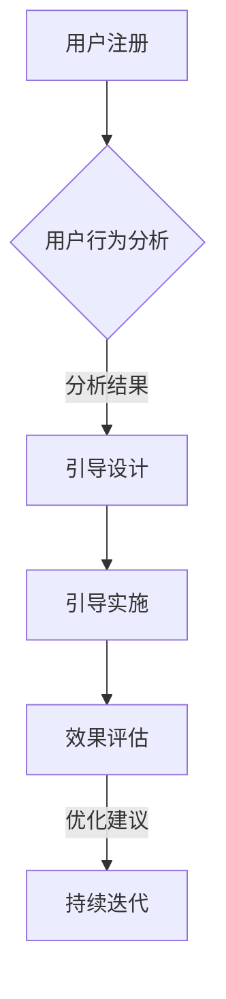

                 

# 《创业公司的用户引导策略》

## 摘要

在当今激烈的市场竞争中，创业公司要想脱颖而出，不仅需要优秀的商业模式和产品功能，更需要一套高效的用户引导策略。本文将详细探讨创业公司如何设计和实施用户引导策略，从而提升用户体验、降低用户流失率，并最终实现商业成功。文章将从用户行为分析、用户引导设计、用户引导实施、实战案例、评估与优化等多个方面展开，结合实际案例和代码解析，为创业者提供一套系统、实用的用户引导策略指南。

## 关键词

- 用户引导策略
- 创业公司
- 用户行为分析
- 用户界面设计
- 实战案例
- 效果评估与优化

## 引言

### 1.1 书籍目的与背景

创业公司的成功往往取决于其在市场中的定位、创新能力和持续迭代。而用户引导策略作为一种提升用户满意度和黏性的有效手段，对于创业公司尤其重要。本书记录了作者多年在创业公司中从事用户引导策略设计和实施的经验，旨在为读者提供一套实战性、系统性的用户引导策略指南。

### 1.2 用户引导的重要性

用户引导策略能够帮助创业公司：

1. **提升用户体验**：通过引导用户正确使用产品，减少用户的学习成本，提高用户满意度。
2. **降低用户流失率**：有效引导用户，降低由于操作困难或找不到功能而导致的新用户流失。
3. **增加用户转化率**：清晰的引导流程能够促进用户从免费用户向付费用户的转化。
4. **优化产品设计**：通过分析用户引导过程中的反馈，发现产品设计的不足，持续改进产品。

### 1.3 书籍结构安排

本书分为八个章节：

- **第1章 引言**：介绍书籍目的与背景，用户引导的重要性。
- **第2章 用户引导策略基础**：定义用户引导、目标、关键要素及设计原则。
- **第3章 用户行为分析**：探讨用户行为分析方法、用户画像、用户路径分析等。
- **第4章 用户引导设计**：详细讲解用户界面、信息架构、导航、交互、内容设计。
- **第5章 用户引导实施**：阐述用户引导实施策略、流程、工具选择等。
- **第6章 创业公司用户引导实战案例**：分析社交媒体、电子商务、在线教育、企业服务等领域的用户引导实践。
- **第7章 用户引导策略评估与优化**：介绍效果评估方法、优化流程、反馈机制建设。
- **第8章 结论**：总结全书内容，展望未来发展趋势。

接下来，我们将深入探讨用户引导策略的各个方面，帮助创业公司实现用户引导的最佳实践。

### 2.1 用户引导的定义

用户引导是指通过一系列设计手段，引导用户正确、高效地使用产品或服务，使其快速上手并达到预期目标的过程。用户引导不仅仅是提供帮助信息，更是通过引导策略激发用户的兴趣、提升用户黏性和满意度。

用户引导的核心要素包括：

- **引导内容**：提供清晰、简洁、有针对性的指导信息。
- **引导形式**：如文字、图片、动画、视频等。
- **引导时机**：在用户需要帮助的关键时刻出现，如新手教程、使用提示、操作步骤等。
- **引导交互**：与用户的互动，如提问、反馈、引导操作等。

### 2.2 用户引导的目标

用户引导的主要目标如下：

1. **提升用户体验**：通过引导减少用户的学习成本，使产品或服务更易于使用，提高用户满意度。
2. **降低用户流失率**：通过有效的引导，减少用户因为操作困难或找不到功能而流失的情况。
3. **促进用户转化**：引导用户完成特定的操作，如注册、购买、使用高级功能等，提高转化率。
4. **优化产品设计**：通过用户引导过程中的反馈，发现产品设计的不足，进行改进。

### 2.3 用户引导的关键要素

设计用户引导策略时，需要关注以下几个关键要素：

1. **用户需求**：深入了解用户的需求和使用场景，确保引导内容与用户需求相匹配。
2. **用户体验**：设计简洁、直观、易于操作的引导流程，减少用户的认知负担。
3. **引导内容**：内容需要准确、清晰、有针对性，避免信息过载。
4. **引导时机**：在用户需要帮助的关键时刻出现，如新手教程、使用提示等。
5. **引导形式**：结合多种引导形式，如文字、图片、动画等，提高引导效果。
6. **引导交互**：与用户的互动，如提问、反馈等，增强用户的参与感和满意度。

### 2.4 用户引导策略的类型

用户引导策略可以分为以下几种类型：

1. **新手引导**：适用于新用户，帮助其快速了解和上手产品或服务。
2. **情境引导**：根据用户的使用情境，提供针对性的引导，如购物流程、订单操作等。
3. **任务引导**：引导用户完成特定的任务，如注册、购买、使用高级功能等。
4. **交互式引导**：与用户进行互动，如提问、反馈等，增强用户的参与感。
5. **提示性引导**：在用户操作过程中，提供必要的提示和帮助，如操作步骤、使用技巧等。

### 2.5 用户引导流程概述

用户引导流程可以分为以下几个步骤：

1. **需求分析**：了解用户需求，确定引导目标和关键要素。
2. **设计引导内容**：设计清晰、简洁、有针对性的引导内容。
3. **选择引导形式**：根据用户需求和引导内容，选择合适的引导形式。
4. **制定引导策略**：确定引导时机、引导交互等策略。
5. **实施引导**：在产品或服务中嵌入引导内容，进行用户引导。
6. **反馈与优化**：收集用户反馈，优化引导策略，提升引导效果。

### 2.6 用户引导策略设计原则

设计用户引导策略时，应遵循以下原则：

1. **以用户为中心**：深入了解用户需求，设计简洁、直观、易于操作的引导流程。
2. **内容准确**：引导内容要准确、清晰、有针对性，避免信息过载。
3. **简洁高效**：引导流程要简洁，避免过多的步骤和复杂的操作。
4. **适时适度**：在用户需要帮助的关键时刻出现，提供必要的提示和帮助。
5. **可扩展性**：引导策略应具有可扩展性，以适应不同用户和场景。
6. **测试与优化**：通过测试和用户反馈，不断优化引导策略，提升用户体验。

### 3.1 用户行为分析概述

用户行为分析是用户引导策略设计的基础，它通过收集、分析和理解用户在产品或服务中的行为数据，为用户引导提供依据。用户行为分析主要包括以下几个方面：

1. **用户流量分析**：分析用户访问产品的渠道、来源、流量分布等，了解用户的入口和流失点。
2. **用户路径分析**：分析用户在产品中的行为路径，了解用户的使用习惯和偏好。
3. **用户行为事件**：分析用户在产品中的操作行为，如点击、浏览、购买等，了解用户的操作模式和决策过程。
4. **用户留存与流失分析**：分析用户的留存率和流失原因，为产品改进和用户引导提供参考。

### 3.2 用户行为分析方法

用户行为分析方法主要包括以下几种：

1. **定量分析**：通过数据分析工具，对用户行为数据进行量化分析，如用户留存率、活跃度、转化率等。
2. **定性分析**：通过访谈、问卷等方式，收集用户对产品或服务的反馈和意见，深入了解用户的需求和痛点。
3. **A/B测试**：通过对比不同版本的引导策略，分析用户行为数据，找到最优的引导方案。
4. **机器学习**：利用机器学习算法，对用户行为数据进行分析和预测，为用户引导策略提供决策支持。

### 3.3 用户行为数据收集

用户行为数据的收集是用户行为分析的关键，以下是一些常见的用户行为数据收集方法：

1. **日志数据**：通过服务器日志，收集用户访问产品或服务的详细信息，如IP地址、访问时间、页面访问等。
2. **前端监控**：通过在前端嵌入监控代码，收集用户在产品中的操作行为，如点击、浏览、购买等。
3. **用户调查**：通过在线问卷、电话访谈等方式，收集用户对产品或服务的反馈和意见。
4. **用户访谈**：通过面对面的访谈，深入了解用户的需求、使用习惯和痛点。

### 3.4 用户画像构建

用户画像是指通过对用户行为数据的分析，构建出用户的基本属性、兴趣爱好、行为模式等特征。用户画像的构建主要包括以下几个步骤：

1. **数据清洗**：对收集到的用户行为数据进行清洗，去除重复、错误和不完整的数据。
2. **特征提取**：从用户行为数据中提取关键特征，如年龄、性别、地域、兴趣爱好、购买行为等。
3. **模型构建**：利用机器学习算法，构建用户画像模型，对用户进行分类和标注。
4. **模型优化**：通过不断优化模型，提高用户画像的准确性和有效性。

### 3.5 用户路径分析

用户路径分析是指通过对用户在产品或服务中的行为路径进行分析，了解用户的使用习惯和偏好。用户路径分析主要包括以下几个步骤：

1. **数据收集**：收集用户在产品或服务中的行为数据，如页面访问、操作行为、停留时间等。
2. **数据预处理**：对收集到的行为数据进行分析和清洗，去除重复、错误和不完整的数据。
3. **路径提取**：利用数据挖掘算法，从行为数据中提取出用户路径。
4. **路径分析**：对提取出的用户路径进行分析，了解用户的使用习惯和偏好。
5. **路径优化**：根据用户路径分析的结果，对产品或服务的界面布局、导航等进行优化，提高用户体验。

### 3.6 用户反馈收集与分析

用户反馈是了解用户需求、优化产品功能的重要途径。以下是一些常见的用户反馈收集方法：

1. **在线问卷**：通过在线问卷，收集用户对产品或服务的满意度、建议和意见。
2. **用户访谈**：通过面对面的访谈，深入了解用户的需求、使用习惯和痛点。
3. **社区论坛**：在社区论坛中收集用户的问题和建议，及时回复并解决问题。
4. **反馈机制**：在产品或服务中嵌入反馈机制，如意见反馈按钮、弹窗等，方便用户提出问题和建议。

用户反馈的分析主要包括以下几个步骤：

1. **数据收集**：收集用户反馈的数据，如问卷结果、访谈记录等。
2. **数据分析**：对用户反馈进行分类、整理和分析，提取出关键信息和问题。
3. **问题定位**：根据用户反馈，定位产品或服务中存在的问题和瓶颈。
4. **优化建议**：根据分析结果，提出优化建议和改进方案。

### 4.1 用户界面设计

用户界面（UI）设计是用户引导策略的核心环节之一。一个良好的用户界面不仅能够提升用户体验，还能有效引导用户完成特定操作。以下是一些用户界面设计的最佳实践：

1. **简洁性**：保持界面简洁，避免过多的装饰和冗余元素，确保用户能够快速找到所需功能。
2. **一致性**：保持界面元素和交互的一致性，如颜色、字体、图标等，降低用户的学习成本。
3. **响应性**：设计响应式界面，确保产品在不同设备和屏幕尺寸上都能提供良好的用户体验。
4. **可用性**：注重可用性设计，确保用户能够轻松、高效地完成操作。
5. **指导性**：在关键操作环节提供明确的指导，如提示、操作步骤等，引导用户顺利完成操作。

### 4.2 信息架构设计

信息架构（IA）设计是用户引导策略的重要基础。一个良好的信息架构能够帮助用户快速找到所需信息，提高产品的易用性。以下是一些信息架构设计的最佳实践：

1. **层次结构**：建立清晰的层次结构，将信息分为不同的层级，便于用户浏览和查找。
2. **逻辑性**：设计逻辑清晰的信息架构，确保用户能够按照预期的方式浏览和操作。
3. **导航设计**：设计直观、易用的导航系统，帮助用户快速找到所需信息。
4. **内容组织**：合理组织内容，确保信息之间的关联性，提高用户的使用效率。
5. **可访问性**：确保信息架构对各种用户（包括视觉障碍者）都是可访问的。

### 4.3 导航设计

导航设计是用户引导策略的关键组成部分。一个良好的导航系统能够帮助用户快速找到所需功能，提高产品的易用性。以下是一些导航设计的最佳实践：

1. **直观性**：设计直观的导航系统，确保用户能够快速理解并使用导航功能。
2. **一致性**：保持导航元素和交互的一致性，降低用户的学习成本。
3. **简洁性**：避免复杂的导航结构，确保导航系统简洁、易于使用。
4. **位置**：将导航放置在用户期望的位置，如页面顶部、左侧或右侧，提高导航的可用性。
5. **搜索功能**：提供强大的搜索功能，帮助用户快速找到所需信息。

### 4.4 动画与交互设计

动画和交互设计在用户引导策略中发挥着重要作用。一个良好的动画和交互设计能够提升用户的操作体验，增强用户引导的效果。以下是一些动画与交互设计的最佳实践：

1. **直观性**：确保动画和交互设计直观，用户能够快速理解并操作。
2. **一致性**：保持动画和交互的一致性，降低用户的学习成本。
3. **反馈性**：在用户操作过程中提供及时的反馈，如提示、动画等，增强用户引导效果。
4. **响应性**：设计响应式动画和交互，确保产品在不同设备和屏幕尺寸上都能提供良好的用户体验。
5. **适度性**：避免过度使用动画和交互，以免用户感到疲劳。

### 4.5 内容设计

内容设计是用户引导策略的重要组成部分。一个良好的内容设计能够提高用户的理解和操作效率，增强用户引导的效果。以下是一些内容设计的最佳实践：

1. **准确性**：确保内容准确、清晰、有针对性，避免信息过载。
2. **简洁性**：保持内容简洁，避免过多的文字和冗长的解释，提高用户的阅读效率。
3. **一致性**：保持内容风格和语言的一致性，降低用户的学习成本。
4. **可读性**：设计易读的内容，如合适的字体大小、行距、颜色对比等，提高用户的阅读体验。
5. **实用性**：确保内容具有实用性，为用户提供有价值的信息和操作指南。

### 4.6 用户体验测试

用户体验测试是用户引导策略设计过程中不可或缺的一环。通过用户体验测试，可以发现产品中存在的问题，优化用户引导策略，提高用户体验。以下是一些用户体验测试的最佳实践：

1. **目标明确**：在测试前明确测试目标，确保测试过程中能够集中精力解决问题。
2. **代表性用户**：选择具有代表性的用户参与测试，确保测试结果的广泛性和可靠性。
3. **测试环境**：模拟真实的用户使用环境，确保测试结果具有实际意义。
4. **反馈收集**：通过访谈、问卷、观察等方式，收集用户的反馈和意见，为改进产品提供依据。
5. **持续迭代**：根据测试结果，不断优化产品设计和用户引导策略，提高用户体验。

### 5.1 用户引导实施策略

用户引导实施策略是指在实际操作中，如何有效地将用户引导策略应用到产品或服务中。以下是一些用户引导实施策略的步骤：

1. **确定目标用户**：明确用户引导的目标群体，了解其需求和痛点。
2. **制定实施计划**：根据用户引导策略，制定详细的实施计划，包括时间表、责任人等。
3. **设计引导内容**：根据用户需求和实施计划，设计有针对性的引导内容。
4. **选择引导形式**：根据用户特点和引导内容，选择合适的引导形式，如文字、图片、动画等。
5. **嵌入引导内容**：在产品或服务中嵌入引导内容，确保用户在关键时刻能够接收到引导。
6. **测试与优化**：通过测试和用户反馈，不断优化引导策略，提高引导效果。
7. **培训与推广**：对团队成员进行用户引导策略的培训，确保其能够正确实施和推广。

### 5.2 用户引导实施流程

用户引导实施流程可以分为以下几个阶段：

1. **需求分析**：了解用户需求，确定引导目标和关键要素。
2. **设计引导内容**：根据用户需求和实施计划，设计有针对性的引导内容。
3. **选择引导形式**：根据用户特点和引导内容，选择合适的引导形式，如文字、图片、动画等。
4. **开发与测试**：将引导内容嵌入产品或服务中，进行测试和优化，确保引导效果。
5. **发布与推广**：将用户引导策略应用到实际产品或服务中，对团队成员进行培训，确保正确实施和推广。

### 5.3 用户引导工具选择

选择合适的用户引导工具是实施用户引导策略的关键。以下是一些常见的用户引导工具及其特点：

1. **滚动条引导**：适用于简单的新手引导，如产品介绍、功能演示等。
2. **浮层引导**：适用于需要用户关注的关键操作，如注册、登录等。
3. **轮播图引导**：适用于需要展示多个引导内容的情况，如产品亮点、促销活动等。
4. **弹出式窗口引导**：适用于需要用户确认或操作的情况，如确认操作、填写表单等。
5. **视频引导**：适用于复杂的新手引导或教学视频，如教程、使用方法等。

选择用户引导工具时，应考虑以下因素：

1. **用户体验**：工具应不影响用户操作，确保良好的用户体验。
2. **易用性**：工具应易于使用和定制，降低开发和维护成本。
3. **可扩展性**：工具应具有可扩展性，能够满足不同场景的需求。
4. **兼容性**：工具应支持多种设备和浏览器，确保兼容性。

### 5.4 用户引导测试与优化

用户引导测试与优化是确保用户引导策略有效性的关键环节。以下是一些用户引导测试与优化的方法：

1. **A/B测试**：通过对比不同版本的引导策略，分析用户行为数据，找到最优的引导方案。
2. **用户反馈**：通过收集用户反馈，了解用户对引导策略的满意度和建议，优化引导内容。
3. **行为分析**：利用数据分析工具，对用户行为进行深入分析，找出引导策略中的问题和瓶颈。
4. **迭代优化**：根据测试结果和用户反馈，不断优化引导策略，提高引导效果。

### 5.5 用户引导文档编写

用户引导文档是帮助用户了解产品或服务的重要资料。以下是一些用户引导文档编写的最佳实践：

1. **目标明确**：明确文档的目标，确保用户能够快速找到所需信息。
2. **结构清晰**：采用清晰的章节结构，确保文档易于阅读和理解。
3. **内容准确**：确保内容准确、清晰、有针对性，避免信息过载。
4. **简洁明了**：保持文档简洁，避免过多的文字和冗长的解释。
5. **可操作性强**：提供具体的操作步骤和指南，帮助用户顺利完成操作。

### 5.6 用户引导成本控制

用户引导成本控制是创业公司必须重视的问题。以下是一些用户引导成本控制的建议：

1. **预算规划**：在项目初期制定合理的预算规划，确保用户引导策略的实施有足够资金支持。
2. **资源优化**：充分利用现有资源，如内部员工、合作伙伴等，降低外部成本。
3. **分阶段实施**：根据项目进度和需求，分阶段实施用户引导策略，避免资源浪费。
4. **效果评估**：定期评估用户引导效果，根据评估结果调整预算和使用计划。
5. **持续优化**：通过不断优化用户引导策略，提高引导效果，降低长期成本。

### 6.1 案例一：社交媒体应用的用户引导

社交媒体应用的用户引导主要关注如何帮助新用户快速了解和熟悉平台功能，提高用户黏性和活跃度。以下是一个社交媒体应用用户引导的实战案例：

1. **引导目标**：帮助新用户快速注册、完善资料、关注感兴趣的人和内容，以及掌握平台的基本操作。

2. **引导内容**：设计一套简洁、直观的新手引导流程，包括注册引导、资料完善引导、关注引导、操作引导等。

3. **引导形式**：采用滚动条引导、浮层引导、视频引导等多种形式，确保用户能够清晰理解和使用。

4. **实施效果**：通过用户引导，显著提高了新用户的注册率和活跃度，降低了用户流失率。

### 6.2 案例二：电子商务平台的用户引导

电子商务平台的用户引导主要关注如何帮助用户完成购物流程，提高购买转化率和用户满意度。以下是一个电子商务平台用户引导的实战案例：

1. **引导目标**：帮助用户快速找到商品、加入购物车、选择支付方式、完成购买等。

2. **引导内容**：设计一套详细的购物流程引导，包括商品搜索引导、购物车引导、支付引导、订单确认引导等。

3. **引导形式**：采用滚动条引导、弹窗引导、视频引导等形式，确保用户能够清晰了解购物流程。

4. **实施效果**：通过用户引导，显著提高了购买转化率和用户满意度，降低了购物过程中的困扰和困惑。

### 6.3 案例三：在线教育平台的用户引导

在线教育平台的用户引导主要关注如何帮助用户快速上手使用平台，掌握学习方法和技巧，提高学习效果。以下是一个在线教育平台用户引导的实战案例：

1. **引导目标**：帮助新用户快速注册、选择课程、学习课程、完成作业等。

2. **引导内容**：设计一套详细的用户引导流程，包括注册引导、课程选择引导、学习引导、作业提交引导等。

3. **引导形式**：采用滚动条引导、弹窗引导、视频引导、直播引导等多种形式，确保用户能够清晰了解和学习流程。

4. **实施效果**：通过用户引导，显著提高了用户的学习效果和满意度，降低了用户流失率。

### 6.4 案例四：企业服务软件的用户引导

企业服务软件的用户引导主要关注如何帮助用户快速掌握软件功能，提高工作效率。以下是一个企业服务软件用户引导的实战案例：

1. **引导目标**：帮助新用户快速注册、登录、掌握软件的基本功能和使用方法。

2. **引导内容**：设计一套详细的用户引导流程，包括注册引导、登录引导、功能演示引导、操作指南等。

3. **引导形式**：采用滚动条引导、弹窗引导、视频引导等形式，确保用户能够清晰了解软件功能和使用方法。

4. **实施效果**：通过用户引导，显著提高了用户对软件的掌握程度和工作效率，降低了用户流失率。

### 6.5 案例分析与总结

通过对上述四个实战案例的分析，可以发现：

1. **目标明确**：成功的用户引导策略都明确了引导目标，确保引导内容与用户需求相匹配。
2. **内容简洁**：简洁、直观的引导内容能够降低用户的学习成本，提高用户满意度。
3. **形式多样**：结合多种引导形式，如文字、图片、动画、视频等，可以提高引导效果。
4. **反馈机制**：建立有效的反馈机制，及时收集用户反馈，优化引导策略。

成功经验可以总结为以下几点：

1. **以用户为中心**：深入了解用户需求，确保引导内容符合用户实际需求。
2. **持续优化**：根据用户反馈和测试结果，不断优化引导策略，提高引导效果。
3. **团队协作**：团队协作，确保引导策略的顺利实施和持续优化。
4. **数据驱动**：利用数据分析工具，对用户行为和引导效果进行深入分析，为优化提供依据。

### 7.1 用户引导效果评估方法

评估用户引导效果是优化用户引导策略的关键环节。以下是一些常见的用户引导效果评估方法：

1. **用户行为分析**：通过分析用户在引导过程中的行为数据，如页面访问量、操作频率、停留时间等，评估引导效果。
2. **用户满意度调查**：通过在线问卷、访谈等方式，收集用户对引导策略的满意度评价，了解用户对引导策略的接受程度。
3. **转化率分析**：通过分析引导策略实施前后的转化率数据，评估引导策略对用户转化的影响。
4. **留存率分析**：通过分析引导策略实施前后的留存率数据，评估引导策略对用户留存的影响。
5. **A/B测试**：通过对比不同版本的引导策略，分析用户行为数据，找出最优的引导方案。

### 7.2 用户引导策略优化流程

用户引导策略优化流程可以分为以下几个步骤：

1. **确定评估指标**：根据业务目标和用户需求，确定评估用户引导效果的指标。
2. **数据收集**：收集用户引导策略实施过程中的数据，如用户行为数据、用户反馈等。
3. **数据分析**：对收集到的数据进行分析，找出用户引导策略中的问题和瓶颈。
4. **优化方案设计**：根据分析结果，设计优化方案，包括引导内容的改进、引导形式的调整等。
5. **实施优化**：将优化方案应用到实际产品或服务中，进行测试和评估。
6. **持续迭代**：根据优化效果，不断调整和改进用户引导策略，提高引导效果。

### 7.3 数据驱动的用户引导优化

数据驱动的用户引导优化是通过分析用户行为数据，找出用户引导策略中的不足，并进行针对性优化。以下是一些数据驱动的用户引导优化方法：

1. **用户路径分析**：通过分析用户在产品中的行为路径，找出用户在关键环节的流失点和困惑点，优化引导内容。
2. **用户行为事件分析**：通过分析用户在引导过程中的行为事件，找出用户操作中的难点和痛点，优化引导形式。
3. **A/B测试**：通过对比不同版本的引导策略，分析用户行为数据，找到最优的引导方案。
4. **机器学习**：利用机器学习算法，对用户行为数据进行分析和预测，为优化提供决策支持。

### 7.4 用户引导反馈机制建设

用户引导反馈机制是收集用户对引导策略的意见和建议的重要手段。以下是一些用户引导反馈机制建设的建议：

1. **在线问卷**：通过在线问卷，收集用户对引导策略的满意度、建议和意见。
2. **用户访谈**：通过面对面的访谈，深入了解用户对引导策略的感受和需求。
3. **社区论坛**：在社区论坛中收集用户的问题和建议，及时回复并解决问题。
4. **反馈按钮**：在产品或服务中嵌入反馈按钮，方便用户提出问题和建议。
5. **数据分析**：通过分析用户反馈数据，找出用户关注的问题和需求，优化引导策略。

### 7.5 持续优化的实践建议

持续优化用户引导策略是提高用户体验和业务成果的关键。以下是一些持续优化的实践建议：

1. **定期评估**：定期评估用户引导效果，发现问题和瓶颈，及时进行优化。
2. **数据驱动**：利用数据分析工具，对用户行为数据进行分析，为优化提供依据。
3. **用户反馈**：重视用户反馈，及时收集并分析用户对引导策略的意见和建议。
4. **团队协作**：加强团队协作，确保优化方案的有效实施和持续改进。
5. **持续迭代**：根据评估结果和用户反馈，不断调整和优化用户引导策略，提高引导效果。

### 8.1 总结与展望

本文从用户引导策略的基础知识、用户行为分析、用户引导设计、用户引导实施、实战案例、效果评估与优化等方面，系统地阐述了创业公司如何设计和实施用户引导策略。用户引导策略不仅能够提升用户体验、降低用户流失率，还能促进用户转化，提高业务成果。

未来，随着人工智能和大数据技术的发展，用户引导策略将更加智能化、个性化。创业公司应不断关注用户需求，利用先进的技术手段，优化用户引导策略，提高用户满意度和业务成果。

### 8.2 常见问题与解决方案

在设计和实施用户引导策略的过程中，创业公司可能会遇到以下常见问题：

**问题一：用户引导内容过于复杂**
- **解决方案**：简化引导内容，突出关键信息，使用简洁、直观的语言和形式。

**问题二：用户引导时机不当**
- **解决方案**：根据用户行为数据，确定最佳的引导时机，避免打扰用户。

**问题三：用户引导效果不佳**
- **解决方案**：通过A/B测试、用户反馈等方式，不断优化引导策略，提高引导效果。

**问题四：用户引导成本过高**
- **解决方案**：合理规划预算，优化资源利用，分阶段实施用户引导策略。

### 8.3 未来发展趋势

未来，用户引导策略将呈现以下发展趋势：

1. **智能化**：借助人工智能技术，实现个性化、智能化的用户引导。
2. **大数据驱动**：利用大数据分析，深入了解用户需求和行为，优化引导策略。
3. **跨平台融合**：实现多平台、多终端的用户引导，提高用户体验。
4. **持续优化**：通过持续迭代和优化，不断提升用户引导策略的效果。

作者：AI天才研究院/AI Genius Institute & 禅与计算机程序设计艺术 /Zen And The Art of Computer Programming

## 附录

### 附录A：Mermaid流程图示例



### 附录B：伪代码示例

```python
# 伪代码：用户引导流程
1. 收集用户行为数据
2. 分析用户行为数据
3. 根据分析结果设计用户引导内容
4. 选择用户引导形式
5. 在产品中嵌入引导内容
6. 进行用户引导测试
7. 根据测试结果优化引导策略
8. 持续迭代和优化引导策略
```

### 附录C：数学模型和公式示例

```latex
$$
\text{用户满意度} = \frac{\text{用户得到的价值}}{\text{用户付出的成本}}
$$

$$
\text{用户留存率} = \frac{\text{第n天仍使用产品的用户数}}{\text{第1天注册的用户数}}
$$
```

### 附录D：代码实际案例和解析

```python
# 示例：用户引导系统实现
class UserGuideSystem:
    def __init__(self):
        self.user_data = []

    def collect_user_data(self, user行为数据):
        self.user_data.append(user行为数据)

    def analyze_user_data(self):
        # 分析用户行为数据
        pass

    def design_guide_content(self):
        # 根据分析结果设计用户引导内容
        pass

    def implement_guide(self):
        # 在产品中嵌入引导内容
        pass

    def test_guide(self):
        # 进行用户引导测试
        pass

    def optimize_guide(self):
        # 根据测试结果优化引导策略
        pass

    def iterate_guide(self):
        # 持续迭代和优化引导策略
        pass

if __name__ == "__main__":
    user_guide_system = UserGuideSystem()
    user_guide_system.collect_user_data(...)
    user_guide_system.analyze_user_data(...)
    user_guide_system.design_guide_content(...)
    user_guide_system.implement_guide(...)
    user_guide_system.test_guide(...)
    user_guide_system.optimize_guide(...)
    user_guide_system.iterate_guide(...)
```

### 附录E：代码解读与分析

```python
# 代码解读

class UserGuideSystem:
    # 用户引导系统类

    def __init__(self):
        # 初始化用户引导系统
        self.user_data = []  # 存储用户行为数据

    def collect_user_data(self, user行为数据):
        # 收集用户行为数据
        self.user_data.append(user行为数据)

    def analyze_user_data(self):
        # 分析用户行为数据
        # 这里可以加入数据分析算法，如统计用户行为、路径等
        pass

    def design_guide_content(self):
        # 设计用户引导内容
        # 根据分析结果，设计适合用户群体的引导内容
        pass

    def implement_guide(self):
        # 实施用户引导
        # 将引导内容嵌入到产品界面中
        pass

    def test_guide(self):
        # 测试用户引导效果
        # 可以通过A/B测试等方法，评估引导策略的效果
        pass

    def optimize_guide(self):
        # 优化用户引导策略
        # 根据测试结果，调整引导内容、形式和时机
        pass

    def iterate_guide(self):
        # 持续迭代和优化
        # 通过不断测试和优化，提升用户引导效果
        pass

if __name__ == "__main__":
    # 主函数
    user_guide_system = UserGuideSystem()
    # 执行用户引导系统的各个功能模块
    user_guide_system.collect_user_data(...)
    user_guide_system.analyze_user_data(...)
    user_guide_system.design_guide_content(...)
    user_guide_system.implement_guide(...)
    user_guide_system.test_guide(...)
    user_guide_system.optimize_guide(...)
    user_guide_system.iterate_guide(...)
```

通过以上代码示例和解读，我们可以清楚地看到用户引导系统的实现框架和各功能模块的作用。在实际开发过程中，可以根据业务需求和用户行为数据，不断完善和优化用户引导系统，提升用户体验和业务成果。

