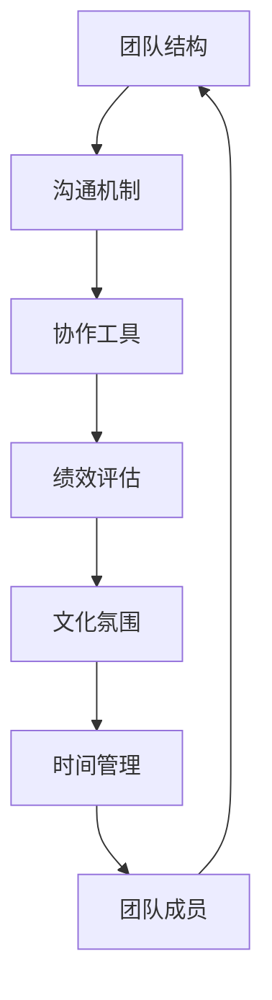

                 

### 《创业初期的远程团队管理：在虚拟环境中建立高效团队的技巧》

#### 目录大纲：

**核心概念与联系：** 在远程团队管理中，有几个核心概念是必须理解的，这些概念相互联系，共同构成了高效远程团队的基础。我们使用Mermaid流程图来展示这些核心概念及其相互关系。



- **团队结构**：明确团队的角色和职责，确保每个成员都有明确的任务和期望。
- **沟通机制**：建立高效的沟通渠道，确保信息传递的及时性和准确性。
- **协作工具**：选择合适的协作工具，如Slack、Trello、Zoom等，以支持团队的工作流程。
- **绩效评估**：建立合理的绩效评估体系，以量化团队成员的表现。
- **文化氛围**：营造积极向上的团队文化，提高团队的凝聚力和工作效率。
- **时间管理**：帮助团队成员合理规划时间，提高工作效率。

**核心算法原理讲解：** 

### 3.1 远程工作绩效评估体系

远程工作绩效评估是确保团队成员高效工作的关键环节。在这一节中，我们将详细讲解如何设计一个远程工作绩效评估体系。

**伪代码如下：**

```python
def evaluate_performance(employee, project):
    # 获取量化的工作成果
    quantifiable_results = get_quantifiable_results(employee, project)
    
    # 获取工作过程中的反馈
    process_feedback = get_process_feedback(employee, project)
    
    # 获取团队成员的反馈
    team_feedback = get_team_feedback(employee, project)
    
    # 计算绩效得分
    performance_score = calculate_performance_score(quantifiable_results, process_feedback, team_feedback)
    
    return performance_score
```

**数学模型和数学公式：**

为了更全面地评估员工的绩效，我们可以使用一个综合评分模型。假设有三个主要指标：任务完成率、工作效率和工作质量。

综合评分模型公式如下：

$$
\text{绩效评分} = w_1 \times \text{任务完成率} + w_2 \times \text{工作效率} + w_3 \times \text{工作质量}
$$

其中，$w_1, w_2, w_3$ 分别代表任务完成率、工作效率和工作质量的权重。

**项目实战：** 

### 4.1 成功的远程团队管理案例分享

#### 案例背景与挑战

某创业公司成立于2020年，由于团队成员分布在全球，团队管理面临如下挑战：

- **沟通困难**：不同时区的员工难以进行实时沟通。
- **工作进度不一致**：团队成员之间的工作进度难以统一。
- **文化冲突**：团队成员来自不同的文化背景，需要适应同一工作环境。

#### 团队管理策略与实践

1. **建立清晰的沟通机制**：

   - **每日站立会议**：每天早晨举行10分钟的站立会议，每个团队成员报告前一天的工作进展和当天计划。
   - **每周全面会议**：每周举行一次全面会议，讨论项目进展、问题和解决方案。

2. **制定详细的项目计划**：

   - **明确目标**：每个项目都设定明确的目标、里程碑和时间表。
   - **使用项目管理工具**：使用Trello等项目管理工具，确保每个任务都有明确的负责人和截止日期。

3. **绩效评估**：

   - **量化的绩效指标**：设定量化的绩效指标，如任务完成率、工作效率和工作质量。
   - **定期评估**：每月进行一次绩效评估，反馈给团队成员，并进行相应的调整。

4. **文化氛围建设**：

   - **团队文化建设**：定期组织团队活动，如线上聚会、团队游戏等，增强团队成员之间的联系。
   - **文化多样性**：鼓励团队成员分享自己的文化和经验，增进相互理解。

#### 案例效果与经验总结

通过以上措施，该创业公司成功提升了团队的工作效率，项目进度得到统一，团队成员之间的沟通更加顺畅。经验总结如下：

- **沟通是关键**：确保团队成员之间有足够的沟通，减少误解和冲突。
- **计划和跟踪**：明确的项目计划和进度监控是确保工作高效进行的必要条件。
- **灵活适应**：面对文化差异和时区问题，团队成员需要具备灵活适应的能力。

---

在接下来的部分，我们将继续探讨如何在虚拟环境中建立高效团队的其他关键因素，包括团队协作与沟通、时间管理、绩效评估和培训与发展。

### 《创业初期的远程团队管理：在虚拟环境中建立高效团队的技巧》

#### 目录大纲：

# {文章标题}

> {关键词：(远程工作、团队管理、虚拟环境、高效团队、协作工具、沟通技巧、绩效评估、时间管理、文化氛围、培训与发展)}

> {摘要：(本文将探讨创业初期远程团队管理的挑战与机会，通过分析核心概念、算法原理和实践案例，为读者提供建立高效远程团队的实用技巧。)}

---

## 第一部分：创业初期远程团队管理概述

### 1.1 远程工作与创业初期的关系

**1.1.1 创业初期远程工作的优势**

在创业初期，远程工作为团队成员提供了更多的灵活性和便利。以下是远程工作的一些主要优势：

1. **降低成本**：无需支付高昂的办公室租金和水电费。
2. **提高效率**：团队成员可以在最适合自己工作的时间和地点工作。
3. **全球招聘**：远程工作使得招聘范围不再受地域限制，可以吸引全球优秀人才。
4. **适应性强**：在面对突发情况（如疫情）时，远程工作可以迅速切换，减少业务中断。

**1.1.2 创业初期远程工作的挑战**

然而，远程工作也带来了一些挑战，特别是在创业初期：

1. **沟通困难**：团队成员可能处于不同的时区，导致沟通不畅。
2. **工作进度不一致**：团队成员的工作进度可能存在差异，导致项目进展不稳定。
3. **文化冲突**：团队成员来自不同的文化背景，可能存在价值观和沟通方式的差异。
4. **管理难度**：远程团队的管理相比现场团队更加复杂，需要更多的沟通协调。

### 1.2 远程团队管理的核心原则

为了克服上述挑战，建立高效的远程团队，以下是一些核心原则：

**1.2.1 透明沟通**

透明沟通是远程团队管理的基础。团队成员需要确保信息的及时传递和共享，避免误解和冲突。以下是实现透明沟通的一些方法：

1. **实时沟通工具**：使用Slack、Zoom、Microsoft Teams等实时沟通工具，保持团队之间的快速交流。
2. **定期会议**：定期举行团队会议，讨论项目进展、问题和解决方案。
3. **文档共享**：使用Google Docs、Notion等文档共享工具，确保团队成员可以随时查看和更新重要文档。

**1.2.2 目标与绩效管理**

明确的目标和绩效管理是确保团队成员工作高效的关键。以下是实现这一目标的方法：

1. **明确目标**：每个项目或任务都应该设定明确的目标和里程碑。
2. **绩效评估**：建立合理的绩效评估体系，定期对团队成员的表现进行评估。
3. **反馈机制**：及时给予团队成员反馈，帮助他们改进工作表现。

**1.2.3 文化和团队氛围的营造**

文化和团队氛围是远程团队成功的重要因素。以下是营造积极团队氛围的方法：

1. **团队活动**：定期组织线上聚会、团队游戏等活动，增强团队凝聚力。
2. **文化多样性**：鼓励团队成员分享自己的文化和经验，增进相互理解。
3. **员工关怀**：关注团队成员的生活和工作状态，提供必要的支持和帮助。

### 1.3 初始团队的构建与管理

**1.3.1 成员选拔与技能匹配**

在构建初始团队时，成员选拔至关重要。以下是选拔成员时应考虑的因素：

1. **技能匹配**：确保团队成员具备完成项目所需的技能。
2. **团队协作能力**：选择具备良好团队协作能力的成员。
3. **远程工作适应性**：成员需要具备较强的自我管理和自律能力。

**1.3.2 团队结构设计**

合理的团队结构可以提升团队效率。以下是几种常见的团队结构：

1. **职能型结构**：按照职能划分团队，如开发、设计、市场等。
2. **项目型结构**：按照项目划分团队，每个项目有一个项目经理负责。
3. **矩阵型结构**：结合职能型和项目型结构的优点，适用于复杂项目。

**1.3.3 初期团队的工作流程和协作工具**

明确的工作流程和协作工具是团队高效运作的保障。以下是初期团队应考虑的工作流程和协作工具：

1. **工作流程**：制定清晰的工作流程，确保团队成员了解各自的角色和责任。
2. **协作工具**：选择适合团队的协作工具，如Trello、Asana、JIRA等，以支持团队的工作流程。

---

在第一部分中，我们探讨了创业初期远程工作的优势和挑战，以及远程团队管理的核心原则和团队构建与管理的要点。在接下来的部分，我们将深入探讨虚拟环境中的团队协作与沟通、时间管理、绩效评估和培训与发展，帮助读者更全面地理解远程团队管理。

### 《创业初期的远程团队管理：在虚拟环境中建立高效团队的技巧》

#### 目录大纲：

## 第二部分：虚拟环境中的团队协作与沟通

### 2.1 虚拟团队协作工具与技术

在虚拟环境中，选择合适的协作工具是确保团队高效协作的关键。以下是一些常用的协作工具及其特点：

**2.1.1 云协作平台介绍**

云协作平台为团队提供了集中管理项目、任务和文档的统一环境。以下是一些流行的云协作平台：

1. **Trello**：一个基于看板的任务管理工具，适合小型团队。
2. **Asana**：一个功能全面的任务管理工具，适合大型团队和复杂项目。
3. **JIRA**：一个专业的敏捷项目管理工具，适合软件开发团队。

**2.1.2 实时沟通工具选择与应用**

实时沟通工具是保持团队成员紧密联系的重要手段。以下是一些流行的实时沟通工具：

1. **Slack**：一个集成了多种功能的沟通平台，支持消息、视频会议、文件共享等。
2. **Zoom**：一个功能强大的视频会议工具，适合远程团队进行实时沟通。
3. **Microsoft Teams**：一个集成了聊天、视频会议、文档共享的统一沟通平台。

**2.1.3 文档管理系统的使用**

文档管理系统可以帮助团队集中管理和分享文档，提高工作效率。以下是一些常用的文档管理系统：

1. **Google Workspace**：包括Google Docs、Sheets、Slides等，支持实时协作和版本控制。
2. **Notion**：一个灵活的笔记和项目管理工具，适合创建知识库和文档。
3. **Confluence**：一个专业的文档管理系统，适合企业级团队。

### 2.2 沟通技巧与团队动态管理

**2.2.1 沟通障碍与解决方案**

在远程团队中，沟通障碍是常见问题。以下是一些沟通障碍及其解决方案：

1. **时区差异**：解决方案：使用工具如World Time Buddy来规划会议时间，确保团队成员都能参加。
2. **语言障碍**：解决方案：鼓励团队成员使用共同的母语进行沟通，或者使用翻译工具来减少误解。
3. **技术问题**：解决方案：确保所有团队成员都熟悉使用相关工具，定期检查网络和设备。

**2.2.2 非语言沟通的重要性**

非语言沟通在远程团队中同样重要。以下是一些非语言沟通的技巧：

1. **使用表情符号和表情包**：帮助表达情感，减少误解。
2. **文字简洁明了**：避免使用过于复杂或模糊的语言。
3. **使用视频会议**：视频会议可以帮助团队成员更好地理解彼此的情绪和意图。

**2.2.3 团队冲突的预防与解决**

团队冲突在远程团队中同样存在，以下是一些预防与解决冲突的策略：

1. **预防策略**：建立明确的沟通和协作规范，避免误解和冲突。
2. **解决策略**：及时识别和解决冲突，使用中立的方式进行沟通，确保问题得到妥善处理。

### 2.3 虚拟团队的项目管理

**2.3.1 项目计划的制定**

项目计划是确保项目按时完成的关键。以下是如何制定项目计划的步骤：

1. **明确项目目标**：确保所有团队成员都了解项目的目标和预期成果。
2. **分解任务**：将项目分解为具体的任务，并分配给合适的团队成员。
3. **设定时间表**：为每个任务设定明确的开始和结束时间，确保项目按时完成。

**2.3.2 进度监控与风险管理**

进度监控和风险管理是确保项目顺利进行的重要环节。以下是一些建议：

1. **定期检查进度**：使用协作工具监控任务进度，及时发现和解决问题。
2. **风险评估**：识别项目中的潜在风险，并制定相应的应对措施。
3. **及时调整计划**：根据实际情况调整项目计划，确保项目按时完成。

**2.3.3 团队成员的角色分配与职责**

明确团队成员的角色和职责是确保项目成功的关键。以下是一些建议：

1. **角色定义**：为每个团队成员定义明确的角色和职责。
2. **沟通与协作**：确保团队成员之间有充分的沟通和协作，确保任务顺利完成。
3. **绩效评估**：定期对团队成员的表现进行评估，激励团队成员不断提升。

---

在第二部分中，我们探讨了虚拟环境中的团队协作工具与技术、沟通技巧与团队动态管理、以及虚拟团队的项目管理。这些技巧和策略将帮助创业初期的远程团队更高效地协作和沟通。在下一部分，我们将深入探讨如何提升远程团队的效率，包括时间管理、绩效评估和培训与发展。

### 《创业初期的远程团队管理：在虚拟环境中建立高效团队的技巧》

#### 目录大纲：

## 第三部分：提升远程团队效率的策略

### 3.1 时间管理与工作平衡

时间管理是提升远程团队效率的关键因素。以下是一些时间管理和工作平衡的策略：

**3.1.1 远程工作的时间管理方法**

1. **制定工作时间表**：为每天的工作制定详细的时间表，确保工作有序进行。
2. **避免多任务处理**：专注于单一任务，避免分心，提高工作效率。
3. **使用时间追踪工具**：如Toggl或RescueTime，帮助监控和优化工作时间。

**3.1.2 工作与生活平衡的技巧**

1. **设定工作界限**：在家办公并不意味着随时都在工作，设定清晰的工作界限有助于平衡工作和生活。
2. **合理安排休息时间**：定期休息，避免长时间连续工作，保持良好的身心状态。
3. **保持健康的生活方式**：定期锻炼、保持健康的饮食习惯，有助于提高工作效率和保持良好的工作状态。

**3.1.3 帮助团队成员管理工作压力**

1. **提供心理支持**：建立员工心理支持系统，提供必要的心理辅导和咨询服务。
2. **鼓励交流**：鼓励团队成员之间进行开放、坦诚的交流，减少工作压力。
3. **灵活的工作安排**：在特殊情况下，如团队成员遇到紧急情况时，提供灵活的工作安排，帮助其平衡工作和生活。

### 3.2 绩效评估与激励

绩效评估是确保团队高效运作的重要环节。以下是一些绩效评估和激励的策略：

**3.2.1 远程工作绩效评估体系**

1. **量化的绩效指标**：设定明确的绩效指标，如任务完成率、工作效率、工作质量等。
2. **定期评估**：定期对团队成员的表现进行评估，确保绩效评估的公平性和透明性。
3. **反馈与改进**：及时给予团队成员反馈，帮助他们了解自己的表现，并提供改进的建议。

**3.2.2 绩效评估工具的选择**

1. **使用在线评估工具**：如Lattice或Quantum Workplace，这些工具可以方便地进行绩效评估和反馈。
2. **自定义评估模板**：根据团队的特点和需求，自定义评估模板，确保评估的准确性和针对性。
3. **结合多种评估方法**：如360度评估、KPI评估等，结合多种方法进行绩效评估，提高评估的全面性和准确性。

**3.2.3 激励措施与文化建设**

1. **奖励与认可**：定期举行表彰活动，对表现出色的团队成员进行奖励和认可。
2. **职业发展机会**：提供职业发展机会，帮助团队成员提升技能和职业素养。
3. **团队文化建设**：营造积极向上的团队文化，增强团队成员的归属感和凝聚力。

### 3.3 培训与发展

培训与发展是提升团队效率和竞争力的重要手段。以下是一些培训与发展的策略：

**3.3.1 远程团队的学习与培训**

1. **在线学习平台**：如LinkedIn Learning、Udemy等，提供丰富的在线课程和培训资源。
2. **内部培训**：组织内部培训，由经验丰富的团队成员分享知识和经验。
3. **定期知识分享会**：定期举行知识分享会，促进团队成员之间的知识交流和分享。

**3.3.2 成员职业发展的支持**

1. **职业规划**：为团队成员提供职业规划指导，帮助他们明确职业发展目标。
2. **培训机会**：提供培训机会，帮助团队成员提升专业技能和职业素养。
3. **晋升机制**：建立明确的晋升机制，鼓励团队成员不断进步和成长。

**3.3.3 人才梯队建设策略**

1. **储备人才**：提前储备优秀人才，为未来的人才需求做好准备。
2. **继任计划**：制定继任计划，确保关键岗位的人才衔接。
3. **人才培养计划**：实施人才培养计划，提升团队成员的整体素质和团队竞争力。

---

在第三部分中，我们探讨了提升远程团队效率的策略，包括时间管理、工作与生活平衡、绩效评估与激励、以及培训与发展。这些策略将帮助创业初期的远程团队在虚拟环境中保持高效运作。在下一部分，我们将通过实践案例分析，进一步探讨成功的远程团队管理经验和教训。

### 《创业初期的远程团队管理：在虚拟环境中建立高效团队的技巧》

#### 目录大纲：

## 第四部分：实践案例分析

### 4.1 成功的远程团队管理案例分享

**4.1.1 案例背景与挑战**

某创业公司在2021年成立，由于团队成员分布在不同的城市和国家，团队管理面临以下挑战：

1. **沟通不畅**：团队成员处于不同时区，沟通效率低下。
2. **工作进度不一致**：团队成员的工作进度难以统一，导致项目延误。
3. **文化差异**：团队成员来自不同的文化背景，沟通和协作存在障碍。

**4.1.2 团队管理策略与实践**

为了克服这些挑战，该创业公司采取了以下策略：

1. **建立清晰的沟通机制**：

   - **实时沟通工具**：使用Slack和Zoom，确保团队成员可以实时沟通。
   - **定期会议**：每周举行一次全面会议，讨论项目进展、问题和解决方案。

2. **制定详细的项目计划**：

   - **明确目标**：为每个项目设定明确的目标、里程碑和时间表。
   - **任务分配**：使用Trello，将任务分配给合适的团队成员，并设定截止日期。

3. **绩效评估与激励**：

   - **量化绩效指标**：设定量化的绩效指标，如任务完成率、工作效率和工作质量。
   - **定期评估**：每月进行一次绩效评估，对团队成员的表现进行反馈和改进。
   - **奖励与认可**：对表现优异的团队成员进行奖励和认可，提高团队士气。

4. **文化氛围建设**：

   - **团队活动**：定期组织线上聚会、团队游戏等，增强团队凝聚力。
   - **文化多样性**：鼓励团队成员分享自己的文化和经验，增进相互理解。

**4.1.3 案例效果与经验总结**

通过以上措施，该创业公司成功提升了团队的工作效率，项目进度得到统一，团队成员之间的沟通更加顺畅。经验总结如下：

1. **沟通是关键**：确保团队成员之间有足够的沟通，减少误解和冲突。
2. **计划和跟踪**：明确的项目计划和进度监控是确保工作高效进行的必要条件。
3. **灵活适应**：面对文化差异和时区问题，团队成员需要具备灵活适应的能力。

### 4.2 失败的远程团队管理案例分析

**4.2.1 案例背景与原因**

某创业公司成立于2019年，由于远程团队管理不善，最终导致团队解散。以下是该案例的背景和原因：

1. **缺乏明确的沟通机制**：团队成员之间的沟通不畅通，导致信息传递延迟。
2. **任务分配不合理**：任务分配不明确，团队成员之间工作负担不均。
3. **缺乏有效的绩效评估体系**：团队成员的表现无法得到及时反馈，导致工作效率低下。
4. **文化冲突**：团队成员来自不同的文化背景，沟通和协作困难。

**4.2.2 问题分析与改进措施**

针对上述问题，以下是一些建议的改进措施：

1. **建立明确的沟通机制**：

   - **实时沟通工具**：使用Slack、Zoom等实时沟通工具，确保团队成员可以随时交流。
   - **定期会议**：定期举行团队会议，讨论项目进展、问题和解决方案。

2. **任务分配与职责明确**：

   - **明确任务分配**：为每个任务设定明确的负责人和截止日期。
   - **工作负担平衡**：确保团队成员的工作负担均衡，避免过度劳累。

3. **建立有效的绩效评估体系**：

   - **量化的绩效指标**：设定量化的绩效指标，如任务完成率、工作效率和工作质量。
   - **定期评估与反馈**：定期对团队成员的表现进行评估，并提供及时的反馈和改进建议。

4. **文化冲突处理**：

   - **文化多样性培训**：组织文化多样性培训，提高团队成员的文化敏感性。
   - **开放沟通**：鼓励团队成员之间进行开放、坦诚的沟通，减少误解和冲突。

**4.2.3 避免类似失败的策略**

为了避免类似失败，以下是一些建议：

1. **重视沟通与协作**：确保团队成员之间有足够的沟通和协作，减少误解和冲突。
2. **合理分配任务**：确保任务分配公平合理，避免团队成员过度劳累。
3. **建立有效的绩效评估体系**：定期对团队成员的表现进行评估，激励团队成员不断提升。
4. **关注团队成员的文化背景**：尊重并理解团队成员的文化差异，促进团队文化的融合。

---

通过以上实践案例分析，我们可以看到成功的远程团队管理需要建立清晰的沟通机制、合理的任务分配和绩效评估体系，以及关注团队成员的文化背景。而失败的远程团队管理往往由于沟通不畅、任务分配不合理、绩效评估体系缺失等原因导致。在第五部分，我们将探讨远程工作的发展趋势和创新方向，帮助读者更好地应对未来远程团队管理的挑战。

### 《创业初期的远程团队管理：在虚拟环境中建立高效团队的技巧》

#### 目录大纲：

## 第五部分：未来展望

### 5.1 远程工作的发展趋势

远程工作在疫情之后迅速普及，其发展趋势如下：

**5.1.1 远程工作环境的变化**

1. **数字化办公**：越来越多的企业采用数字化工具，如云计算、AI等，支持远程工作。
2. **灵活办公**：企业越来越倾向于提供灵活的办公方式，如远程办公、弹性工作时间等。

**5.1.2 技术对远程团队管理的影响**

1. **协作工具的升级**：随着技术的发展，协作工具越来越智能化，如自动化的任务分配、智能的沟通工具等。
2. **数据分析与监控**：利用数据分析技术，企业可以更好地了解团队的工作效率和绩效，进行更科学的决策。

**5.1.3 未来远程团队管理的挑战与机遇**

1. **技术挑战**：如何利用新技术提高远程工作的效率，解决技术问题（如网络延迟、数据安全等）。
2. **文化融合**：如何处理文化差异，促进团队文化的融合。
3. **人才管理**：如何吸引、培养和留住远程工作人才。

### 5.2 创新与实践的未来方向

未来远程团队管理的创新方向主要包括：

**5.2.1 新兴技术如何改进远程团队管理**

1. **人工智能**：利用人工智能技术，自动化处理一些重复性工作，如任务分配、进度监控等。
2. **区块链**：通过区块链技术，提高远程工作的透明度和可信度，如智能合约的自动执行。
3. **虚拟现实（VR）**：利用VR技术，模拟真实的会议和工作环境，增强团队的互动和协作。

**5.2.2 创新方法在远程团队管理中的应用**

1. **敏捷管理**：采用敏捷管理方法，快速响应市场变化，提高团队的灵活性和响应能力。
2. **人本管理**：关注团队成员的需求和感受，建立以人为中心的管理模式，提高团队满意度和工作效率。

**5.2.3 持续实践与优化的重要性**

1. **定期回顾**：定期回顾团队的工作表现，发现问题，进行改进。
2. **持续学习**：鼓励团队成员持续学习和成长，不断提升个人和团队的能力。
3. **灵活调整**：根据实际情况，灵活调整管理策略和工作流程，确保团队始终处于最佳状态。

---

在第五部分中，我们探讨了远程工作的发展趋势和未来方向，包括技术对远程团队管理的影响、创新方法的应用以及持续实践与优化的重要性。这些内容为创业初期的远程团队提供了宝贵的参考和指导。在附录部分，我们将提供远程团队管理常用工具与资源，以及相关书籍推荐，帮助读者进一步了解和掌握远程团队管理的实用技巧。

### 附录

#### 附录A：远程团队管理常用工具与资源

**协作工具：**

1. **Trello**：任务管理工具，支持看板模式。
2. **Asana**：项目管理工具，功能全面。
3. **JIRA**：敏捷项目管理工具，适用于软件开发团队。
4. **Slack**：实时沟通工具，支持消息、视频会议、文件共享。
5. **Zoom**：视频会议工具，适合远程团队实时沟通。
6. **Microsoft Teams**：集成了聊天、视频会议、文档共享的统一沟通平台。

**文档管理系统：**

1. **Google Workspace**：包括Google Docs、Sheets、Slides等，支持实时协作和版本控制。
2. **Notion**：灵活的笔记和项目管理工具，适合创建知识库和文档。
3. **Confluence**：专业的文档管理系统，适合企业级团队。

**时间追踪工具：**

1. **Toggl**：时间追踪工具，帮助团队成员监控工作时间。
2. **RescueTime**：自动追踪时间使用情况，提供时间管理建议。

**学习资源：**

1. **远程工作最佳实践**：GitHub上的远程工作资源，包括指南、工具和技巧。
2. **远程工作社群**：如LinkedIn上的远程工作群组，提供交流和学习的机会。

#### 附录B：远程团队管理相关书籍推荐

1. **《远程工作革命》**：作者：梅勒妮·帕克
   - 介绍了远程工作的优势、挑战和管理方法，提供了实用的建议和案例。

2. **《团队协作的艺术》**：作者：迈克尔·马博特
   - 讨论了团队协作的重要性，提供了有效的团队协作策略和方法。

3. **《敏捷团队管理》**：作者：艾米丽·普兰特
   - 介绍了敏捷管理方法，如何应用敏捷原则提高团队的效率和协作能力。

4. **《远程工作的挑战与机遇》**：作者：本·沃伦
   - 探讨了远程工作带来的挑战和机遇，提供了应对策略和实践经验。

---

通过附录部分提供的工具和资源，以及书籍推荐，读者可以更全面地了解远程团队管理的实用技巧和方法。这些资料将帮助创业初期的远程团队在虚拟环境中建立高效、协同的工作氛围，实现团队的成功和发展。

### 附录C：远程团队管理专业术语解释

**远程团队管理**：指在虚拟环境中，通过技术工具和方法，对分布在不同地理位置的团队成员进行协作、沟通、管理和协调的工作过程。

**协作工具**：指用于远程团队协作的软件工具，如Trello、Asana、Slack等，帮助团队成员进行任务分配、进度追踪、沟通和文件共享。

**虚拟会议**：指通过视频会议工具，如Zoom、Microsoft Teams等，进行的在线会议，支持远程团队成员实时沟通和互动。

**工作流程**：指团队在工作中遵循的一系列步骤和规则，确保任务能够按时、高效地完成。

**绩效评估**：指对团队成员的工作表现进行量化和评估的过程，以确定其工作成果、效率和质量。

**文化氛围**：指团队内部的文化价值观、行为规范和工作环境，影响团队成员的满意度和工作效率。

**远程工作适应性**：指员工适应远程工作环境的能力，包括自我管理、沟通协作和解决问题的能力。

**数字化办公**：指利用计算机技术、互联网和数字化工具，实现办公自动化和远程办公。

**敏捷管理**：指一种灵活、迭代的管理方法，强调快速响应变化、持续改进和团队合作。

---

通过附录C，我们为读者提供了远程团队管理中的专业术语解释，帮助读者更好地理解相关概念，并在实际工作中应用这些术语。这些术语的解释为读者提供了一个全面的远程团队管理知识体系，有助于提高团队的管理水平和工作效率。

