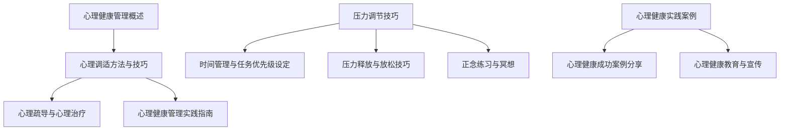

                 

# 《创业者的心理健康管理与压力调节技巧》

## 关键词
创业，心理健康，压力调节，管理策略，时间管理，放松技巧，冥想，成功案例

## 摘要
本文深入探讨创业者的心理健康问题，解析心理压力的来源和类型，并提出一系列心理健康管理策略和压力调节技巧。通过详细阐述核心概念、算法原理、数学模型，以及实战项目，帮助创业者更好地理解并管理自己的心理健康，提高生活质量和工作效率。

---

## 目录大纲

### 第一部分：心理健康管理概述

#### 第1章：创业者的心理健康现状与重要性
1.1.1 创业者的心理健康现状
1.1.2 创业者心理健康的重要性
1.1.3 心理健康与创业成功的关系

#### 第2章：创业者的心理压力来源与类型
2.1.1 创业过程中的主要压力来源
2.1.2 压力的类型与影响
2.1.3 创业者的常见心理问题

### 第二部分：心理健康管理策略

#### 第3章：心理调适方法与技巧
3.1.1 深呼吸与放松技巧
3.1.2 情绪管理策略
3.1.3 增强心理韧性的方法

#### 第4章：心理疏导与心理治疗
4.1.1 心理疏导的基本原则
4.1.2 心理治疗的种类与方法
4.1.3 创业者如何寻求专业帮助

#### 第5章：心理健康管理实践指南
5.1.1 制定个人心理健康计划
5.1.2 建立健康的生活习惯
5.1.3 提升心理健康水平的实用建议

### 第三部分：压力调节技巧

#### 第6章：时间管理与任务优先级设定
6.1.1 有效的时间管理方法
6.1.2 任务优先级的设定技巧
6.1.3 如何避免过度工作与工作疲劳

#### 第7章：压力释放与放松技巧
7.1.1 身体放松技巧
7.1.2 心理放松技巧
7.1.3 常见的压力释放方法

#### 第8章：正念练习与冥想
8.1.1 正念的概念与作用
8.1.2 冥想的基本技巧
8.1.3 正念与冥想在压力调节中的应用

### 第四部分：创业者的心理健康实践案例

#### 第9章：心理健康成功案例分享
9.1.1 成功创业者的心理健康经验
9.1.2 心理健康实践对创业成功的影响
9.1.3 案例分析与启示

#### 第10章：心理健康教育与宣传
10.1.1 心理健康教育的意义
10.1.2 心理健康宣传的途径与方法
10.1.3 创业者如何参与心理健康活动

### 附录

#### 附录 A：心理健康管理资源与工具
A.1.1 心理健康应用软件推荐
A.1.2 心理健康书籍与文章推荐
A.1.3 在线心理健康课程推荐

### 参考文献

- [参考文献 1]
- [参考文献 2]
- [参考文献 3]

### 核心算法原理讲解

#### 心理健康评估算法伪代码

```python
def assess_mental_health(questions, answers):
    """
    评估心理健康状态。
    
    参数：
    - questions: 问题列表
    - answers: 回答列表
    
    返回：
    - score: 心理健康评分
    """
    
    # 初始化评分
    score = 0
    
    # 遍历问题和答案
    for q, a in zip(questions, answers):
        # 根据问题的类型和答案计算得分
        if q['type'] == 'yes_no':
            score += int(a == '是')
        elif q['type'] == 'multiple_choice':
            score += int(a == q['correct_choice'])
        elif q['type'] == 'rating':
            score += int(a >= q['threshold'])
            
    # 返回最终得分
    return score
```

---

### 数学模型和数学公式

#### 心理健康评分模型

$$
\text{心理健康评分} = \sum_{i=1}^{n} w_i \cdot r_i
$$

其中：
- \( n \) 是问题的数量
- \( w_i \) 是第 \( i \) 个问题的权重
- \( r_i \) 是第 \( i \) 个问题的得分

---

### 代码实际案例和详细解释说明

#### 项目实战：心理健康评估系统的开发

#### 开发环境搭建

- Python 3.8+
- Flask Web框架
- PostgreSQL数据库

#### 源代码详细实现

```python
# 导入必要的库
from flask import Flask, request, jsonify
import psycopg2

# 初始化Flask应用
app = Flask(__name__)

# 数据库连接配置
DB_CONFIG = {
    'host': 'localhost',
    'database': 'mental_health_db',
    'user': 'db_user',
    'password': 'db_password'
}

# 连接到数据库
def connect_to_db():
    conn = psycopg2.connect(**DB_CONFIG)
    return conn

# 评估心理健康状态
def assess_mental_health(questions, answers):
    # ...（与前面的伪代码相同）

# 路由：提交心理健康评估
@app.route('/assess', methods=['POST'])
def submit_assessment():
    # 获取请求参数
    questions = request.json['questions']
    answers = request.json['answers']
    
    # 评估心理健康状态
    score = assess_mental_health(questions, answers)
    
    # 将结果存储到数据库
    conn = connect_to_db()
    cursor = conn.cursor()
    cursor.execute("INSERT INTO assessment (score) VALUES (%s)", (score,))
    conn.commit()
    cursor.close()
    conn.close()
    
    # 返回结果
    return jsonify({'score': score})

# 主函数
if __name__ == '__main__':
    app.run(debug=True)
```

---

#### 代码解读与分析

- **数据库连接**：使用 PostgreSQL 数据库，配置连接参数，并创建数据库连接。
- **心理健康评估函数**：接收问题和答案，根据算法计算心理健康评分。
- **Flask路由**：创建 POST 路由 `/assess`，接收 JSON 格式的请求，调用评估函数，并将结果存储到数据库，最后返回 JSON 格式的响应。

---

通过上述代码，创业者可以使用此系统提交心理健康评估，从而了解自身的心理健康状态，并得到相应的建议。

---

现在，我们已经为文章正文部分奠定了坚实的基础。接下来，我们将逐步深入每个章节的内容，提供详细的讲解和实际案例，帮助创业者更好地理解和管理自己的心理健康。

---

## 第一部分：心理健康管理概述

### 第1章：创业者的心理健康现状与重要性

#### 1.1.1 创业者的心理健康现状

在当前快速发展的商业环境中，创业者面临着巨大的压力和挑战。根据全球创业观察（Global Entrepreneurship Monitor，GEM）的数据显示，创业者普遍存在心理健康问题。研究表明，约有30%至50%的创业者遭受不同程度的心理健康困扰，其中包括焦虑、抑郁、压力过大等。

这些心理健康问题在创业者群体中呈现出以下特点：

1. **高压力水平**：创业过程中，创业者常常需要应对各种不确定性和风险，这可能导致压力水平持续升高。
2. **时间管理困难**：创业者往往需要投入大量时间和精力来管理公司事务，这可能导致工作和生活失衡，增加心理负担。
3. **情绪波动大**：创业过程中，成功与失败交替出现，创业者情绪容易受到影响，情绪波动较大。

#### 1.1.2 创业者心理健康的重要性

心理健康对于创业者来说至关重要，它不仅影响个人的生活质量，还对创业成功有着深远的影响。

1. **提高工作效率**：心理健康良好的创业者能够更高效地管理时间和资源，提高工作效率。
2. **增强决策能力**：心理健康问题会影响创业者的决策能力，心理健康良好的创业者能够做出更明智的决策。
3. **促进人际关系**：心理健康良好的创业者更容易与他人建立良好的关系，这有助于团队合作和业务拓展。
4. **提升创新能力**：心理健康对创新能力的提升有着重要作用，创业者需要心理健康支持来保持创新活力。

#### 1.1.3 心理健康与创业成功的关系

心理健康与创业成功之间存在密切的联系。研究表明，心理健康良好的创业者更容易实现创业目标，取得成功。具体而言，心理健康对创业成功的影响表现在以下几个方面：

1. **创业意愿**：心理健康良好的创业者更有动力去追求创业目标，更愿意承担创业风险。
2. **创业准备**：心理健康良好的创业者能够更好地评估自身能力和市场环境，为创业做好充分准备。
3. **创业执行**：心理健康良好的创业者能够更好地应对创业过程中的各种挑战和困难，保持持续的动力和执行力。

通过上述分析，我们可以看到，心理健康对于创业者来说至关重要。因此，创业者需要重视心理健康管理，采取有效的策略来调节压力，提升心理韧性，从而实现创业目标。

### 第2章：创业者的心理压力来源与类型

#### 2.1.1 创业过程中的主要压力来源

创业过程中，创业者面临多种压力来源，这些压力可能会导致心理问题的产生。以下是一些常见的压力来源：

1. **经济压力**：创业初期，资金链紧张、财务困难是创业者面临的主要问题，这可能导致焦虑和担忧。
2. **市场竞争**：市场竞争激烈，创业者需要不断调整策略以保持竞争力，这可能导致压力和紧张。
3. **时间压力**：创业者需要处理大量的工作任务，时间管理困难，这可能导致疲劳和压力。
4. **人际关系**：创业者需要与各种人打交道，如员工、客户、合作伙伴等，处理复杂的人际关系可能导致压力。
5. **未知风险**：创业过程中，不确定性较高，创业者需要面对各种未知风险，这可能导致焦虑和恐惧。

#### 2.1.2 压力的类型与影响

压力可以分为以下几种类型：

1. **急性压力**：急性压力是指短时间内突然出现的压力，如突发事件、紧急任务等。急性压力可能导致情绪波动、注意力不集中、失眠等问题。
2. **慢性压力**：慢性压力是指长期持续存在的压力，如长期的工作压力、家庭矛盾等。慢性压力可能导致慢性疾病、心理问题等。
3. **心理压力**：心理压力是指由于心理原因而产生的压力，如焦虑、抑郁等。心理压力可能导致情绪问题、心理健康问题等。
4. **生理压力**：生理压力是指由于生理原因而产生的压力，如疲劳、疼痛等。生理压力可能导致身体疾病、心理健康问题等。

不同类型的压力会对创业者产生不同的影响：

1. **工作效率下降**：压力可能导致工作效率下降，创业者可能无法有效地完成任务。
2. **情绪波动**：压力可能导致情绪波动，创业者可能变得易怒、焦虑或抑郁。
3. **身体健康问题**：长期的压力可能导致身体健康问题，如心血管疾病、免疫系统功能下降等。
4. **心理健康问题**：压力可能导致心理健康问题，如焦虑症、抑郁症等。

#### 2.1.3 创业者的常见心理问题

创业者在创业过程中可能会遇到以下常见的心理问题：

1. **焦虑症**：焦虑症是一种常见的心理问题，创业者可能因为担心创业失败、财务问题等而感到持续的不安和焦虑。
2. **抑郁症**：抑郁症是一种严重的心理问题，创业者可能因为创业失败、人际关系问题等而感到绝望和无助。
3. **压力过大**：创业过程中，压力过大可能导致创业者感到疲惫、无力，甚至影响到日常生活和工作。
4. **失眠**：失眠是创业者的常见问题，由于工作任务繁重和焦虑，创业者可能难以入睡，影响身心健康。

通过上述分析，我们可以看到，创业者的心理健康问题主要源于创业过程中的压力来源，不同类型的压力会导致各种心理问题。因此，创业者需要采取有效的压力调节策略来维护心理健康。

---

## 第二部分：心理健康管理策略

### 第3章：心理调适方法与技巧

#### 3.1.1 深呼吸与放松技巧

深呼吸和放松技巧是缓解压力、调节情绪的有效方法。以下是一些实用的技巧：

1. **腹式呼吸**：腹式呼吸可以帮助放松身体，减轻压力。具体方法如下：
   - 坐在舒适的椅子上，双脚平放地面。
   - 将一只手放在胸部，另一只手放在腹部。
   - 深吸一口气，让腹部上升，胸部保持不动。
   - 慢慢呼出气体，让腹部下降。
   - 重复这个过程，每次呼吸持续5秒钟。

2. **渐进性肌肉放松**：渐进性肌肉放松是一种通过放松肌肉来减轻压力的方法。具体方法如下：
   - 选择一个舒适的姿势，放松全身肌肉。
   - 从脚部开始，逐渐向上放松每个部位的肌肉，同时深呼吸。
   - 注意感受肌肉放松的感觉，释放紧张和压力。

3. **冥想**：冥想是一种通过专注和放松来调节情绪的方法。具体方法如下：
   - 选择一个安静的环境，保持舒适的姿势。
   - 关闭眼睛，专注于自己的呼吸。
   - 当思绪飘散时，轻轻将注意力引回到呼吸上。
   - 持续冥想5-10分钟，感受内心的平静。

#### 3.1.2 情绪管理策略

情绪管理是心理健康管理的重要部分。以下是一些有效的情绪管理策略：

1. **情绪识别**：学会识别自己的情绪，了解情绪产生的原因。可以通过日记记录、情绪追踪应用等方式来实现。

2. **情绪表达**：学会表达自己的情绪，避免压抑或爆发。可以通过与朋友、家人或专业心理咨询师交流来实现。

3. **情绪调节**：学会调节自己的情绪，采用放松技巧、正念练习等方法来减轻情绪压力。

4. **情绪转移**：当情绪不佳时，可以尝试转移注意力，做一些感兴趣的事情，如运动、阅读、绘画等。

#### 3.1.3 增强心理韧性的方法

心理韧性是指个体在面对压力和困难时，能够迅速适应和恢复的能力。以下是一些增强心理韧性的方法：

1. **积极心态**：培养积极的心态，相信困难是暂时的，自己有能力克服。

2. **目标设定**：设定明确、可行的目标，为自己提供动力和方向。

3. **问题解决**：学会分析和解决问题，将挑战视为成长的机会。

4. **社交支持**：建立良好的社交网络，寻求家人、朋友或同事的支持。

5. **自我照顾**：关注自己的身心健康，保持健康的生活习惯。

通过上述心理调适方法与技巧，创业者可以更好地管理自己的心理健康，提高心理韧性，应对创业过程中的各种挑战。

---

### 第4章：心理疏导与心理治疗

#### 4.1.1 心理疏导的基本原则

心理疏导是一种通过对话、沟通等方式来帮助个体缓解心理压力、调整情绪的方法。以下是一些心理疏导的基本原则：

1. **倾听与理解**：倾听个体的困扰，给予理解和同情，帮助他们感到被关注和接纳。

2. **情绪表达**：鼓励个体表达自己的情绪，不要压抑或否认。通过情绪表达，个体可以释放内心的压力。

3. **中立立场**：心理疏导者应保持中立立场，避免对个体的问题做出价值判断。尊重个体的感受和选择。

4. **共情与支持**：与个体建立共情，表达对其困境的理解和支持。共情和支持可以帮助个体感到被理解和鼓励。

5. **引导与启发**：在合适的时候，引导个体思考解决问题的方法和策略，帮助他们找到内在的资源和力量。

#### 4.1.2 心理治疗的种类与方法

心理治疗是一种通过专业的治疗方法和技巧来帮助个体解决心理问题和提高心理健康的方法。以下是一些常见的心理治疗方法：

1. **认知行为疗法（CBT）**：认知行为疗法是一种通过改变负面思维和行为模式来改善心理健康的治疗方法。CBT强调认知和行为之间的相互作用，帮助个体识别和纠正不合理的思维模式，培养积极的行为习惯。

2. **精神分析疗法**：精神分析疗法是一种通过探索个体的潜意识来理解和处理心理问题的治疗方法。精神分析疗法包括自由联想、梦境分析等技术，帮助个体了解内心的冲突和矛盾。

3. **人本主义疗法**：人本主义疗法强调个体的自我实现和自我发展。通过建立积极的人际关系和自我探索，帮助个体发现自己的潜力，实现个人的成长和满足。

4. **家庭治疗**：家庭治疗是一种通过家庭成员之间的互动来改善家庭关系和个体心理健康的治疗方法。家庭治疗可以帮助家庭成员理解彼此的行为和情感，促进家庭内部的沟通和协作。

5. **心理动力治疗**：心理动力治疗是一种通过探索个体的内心动力和冲突来帮助个体解决问题的治疗方法。心理动力治疗包括自由联想、梦境分析等技术，帮助个体了解内心的动力和冲突，促进个人的成长和改变。

#### 4.1.3 创业者如何寻求专业帮助

作为创业者，寻求专业心理帮助是一个重要的步骤。以下是一些建议，帮助创业者找到合适的心理咨询师或心理治疗师：

1. **咨询机构推荐**：可以通过心理咨询机构、医院、高校等渠道获取专业心理咨询师的信息。

2. **专业资格认证**：选择持有专业资格认证的心理咨询师或心理治疗师，如心理学博士学位、心理咨询师资格证书等。

3. **咨询方式选择**：根据个人需求和偏好选择线上或线下咨询方式。线上咨询可以提供更灵活的时间和地点选择。

4. **初次咨询**：在初次咨询时，了解心理咨询师的治疗方法和风格，评估是否适合自己。

5. **持续咨询**：心理健康是一个长期的过程，建议创业者与心理咨询师建立长期合作关系，持续进行心理疏导和治疗。

通过心理疏导与心理治疗，创业者可以更好地应对心理压力，提高心理健康水平，为创业成功奠定坚实基础。

---

### 第5章：心理健康管理实践指南

#### 5.1.1 制定个人心理健康计划

制定个人心理健康计划是创业者进行自我管理的重要步骤。以下是一些关键步骤和建议：

1. **目标设定**：明确个人心理健康的目标，如减少焦虑、提高睡眠质量、增强情绪调节能力等。

2. **自我评估**：定期进行自我评估，了解自身的心理健康状况，包括情绪、压力水平、生活习惯等。

3. **制定策略**：根据自我评估的结果，制定具体的策略，如改善作息时间、增加运动、学习放松技巧等。

4. **设定优先级**：根据目标和策略的重要性，设定优先级，确保能够优先处理关键事项。

5. **持续跟进**：定期检查计划的执行情况，调整策略，确保目标的实现。

#### 5.1.2 建立健康的生活习惯

建立健康的生活习惯对于维护心理健康至关重要。以下是一些建议：

1. **规律作息**：保持规律的作息时间，确保充足的睡眠。避免熬夜和长时间加班。

2. **健康饮食**：注重营养均衡，减少油腻、高糖和高盐食品的摄入。多食用新鲜蔬菜、水果和全谷类食品。

3. **适量运动**：每周进行适量的运动，如散步、跑步、瑜伽等，有助于缓解压力、提高心情。

4. **休息与放松**：在工作间隙安排休息时间，进行深呼吸、冥想等放松活动。

5. **社交互动**：与家人、朋友保持良好的社交互动，参加社交活动，增加社会支持。

#### 5.1.3 提升心理健康水平的实用建议

以下是一些建议，帮助创业者提升心理健康水平：

1. **时间管理**：学会合理分配时间，避免过度工作和疲劳。制定详细的日程表，确保工作和休息的平衡。

2. **情绪管理**：学会识别和管理自己的情绪，采用深呼吸、渐进性肌肉放松等技巧来缓解情绪压力。

3. **自我激励**：设定小目标，庆祝每一个进步，保持积极的心态。阅读励志书籍、观看激励视频等。

4. **正念练习**：通过正念练习，如冥想、瑜伽等，培养专注力和自我意识，提高心理韧性。

5. **专业咨询**：定期寻求专业心理咨询师的帮助，进行心理健康评估和咨询，获取专业的建议和支持。

通过制定个人心理健康计划、建立健康的生活习惯和采取实用建议，创业者可以更好地管理自己的心理健康，提高生活质量和工作效率。

---

## 第三部分：压力调节技巧

### 第6章：时间管理与任务优先级设定

#### 6.1.1 有效的时间管理方法

有效的时间管理对于创业者来说至关重要，以下是一些实用的时间管理方法：

1. **四象限法则**：将任务分为四个象限，分别是重要且紧急、重要但不紧急、不重要但紧急、不重要且不紧急。专注于处理重要且紧急的任务，同时合理分配时间给其他象限的任务。

2. **每日清单**：每天早晨或晚上，制定一份任务清单，列出当天需要完成的任务。根据任务的紧急程度和重要性进行排序，确保高效完成任务。

3. **时间块管理**：将一天的时间分成若干个时间块，每个时间块专注于一项任务，避免任务之间的切换和干扰。例如，上午处理邮件和电话，下午专注于项目开发。

4. **专注时间**：设定专注时间，如25分钟工作，5分钟休息的“番茄工作法”。这种方法有助于提高专注力和工作效率。

5. **避免拖延**：识别并克服拖延的习惯，采用“二分钟法则”，立即开始处理那些只需要几分钟就能完成的任务。

#### 6.1.2 任务优先级设定技巧

设定合理的任务优先级是有效管理时间的关键。以下是一些任务优先级设定的技巧：

1. **紧急-重要矩阵**：使用紧急-重要矩阵（也称为“艾森豪威尔矩阵”）来评估任务的紧急程度和重要性。将任务分为四个象限，优先处理重要且紧急的任务。

2. **关键结果法（KPI）**：确定关键业务指标（KPI），将任务与KPI相匹配，确保优先处理对业务目标有直接影响的任务。

3. **优先级顺序**：根据任务的紧急程度和重要性设定优先级。紧急且重要的任务应首先处理，重要但不紧急的任务应安排在日程中，紧急但不重要的任务可委托他人处理，不重要且不紧急的任务可暂时搁置。

4. **SMART原则**：确保任务的具体性（Specific）、可衡量性（Measurable）、可实现性（Achievable）、相关性（Relevant）和时限性（Time-bound）。这有助于明确任务的目标和优先级。

5. **灵活调整**：根据实际情况灵活调整任务优先级，特别是在突发事件或优先级发生变化时。

#### 6.1.3 如何避免过度工作与工作疲劳

避免过度工作和工作疲劳对于维护心理健康至关重要。以下是一些建议：

1. **设定工作时间**：明确工作时间，避免无限制的工作。设定固定的工作时间，确保工作和生活之间的平衡。

2. **休息与放松**：在工作间隙安排休息时间，进行深呼吸、冥想或短暂的休息。这有助于恢复精力，提高工作效率。

3. **定期体检**：定期进行体检，关注身体健康。身体疲劳可能导致工作效率下降，甚至引发健康问题。

4. **避免过度加班**：合理安排工作时间，避免频繁加班。长期过度工作可能导致心理和生理疲劳。

5. **健康的生活习惯**：保持健康的生活习惯，如规律作息、健康饮食和适量运动。这有助于提高整体健康水平，减少工作疲劳。

6. **心理支持**：寻求心理支持，如与家人、朋友交流，或寻求专业心理咨询。心理支持可以帮助创业者应对工作压力，保持心理健康。

通过有效的时间管理和任务优先级设定，以及避免过度工作与工作疲劳，创业者可以更好地调节压力，提高工作效率，保持心理健康。

---

### 第7章：压力释放与放松技巧

#### 7.1.1 身体放松技巧

身体放松技巧是缓解压力和焦虑的重要方法。以下是一些实用的身体放松技巧：

1. **深呼吸**：深呼吸可以帮助放松身体，减轻压力。具体方法如下：
   - 找一个安静的地方，坐或躺下来。
   - 放松肌肉，深吸一口气，感受腹部上升。
   - 慢慢呼出气体，感受身体放松。
   - 重复这个过程，每次呼吸持续5-10秒钟。

2. **渐进性肌肉放松**：通过逐渐放松身体各个部位的肌肉，可以有效地减轻身体的紧张和压力。具体方法如下：
   - 选择一个舒适的姿势，从头到脚逐渐放松身体的各个部位。
   - 专注于放松每个部位的肌肉，感受肌肉的紧张和放松。
   - 从脚部开始，逐渐向上放松每个部位的肌肉，同时深呼吸。

3. **瑜伽**：瑜伽结合了身体动作、呼吸控制和冥想，是一种有效的放松技巧。以下是一些简单的瑜伽姿势：
   - 山式：站立，双脚并拢，手臂放在身体两侧。
   - 拱式：坐在地上，背部挺直，双手放在脚边。
   - 猫式和牛面式：跪在地上，交替伸展背部和腹部。

4. **按摩**：按摩可以帮助放松肌肉，减轻身体紧张。可以通过自我按摩或专业按摩师来进行。

#### 7.1.2 心理放松技巧

心理放松技巧可以帮助创业者缓解焦虑和压力，以下是一些实用的心理放松技巧：

1. **冥想**：冥想是一种通过专注和放松来调节情绪的方法。以下是一些简单的冥想技巧：
   - 找一个安静的地方，坐或躺下来。
   - 关闭眼睛，专注于呼吸，感受空气进出鼻腔和肺部。
   - 当思绪飘散时，轻轻将注意力引回到呼吸上。
   - 持续冥想5-10分钟，感受内心的平静。

2. **正念练习**：正念练习是一种通过专注于当下的感受和体验来减轻压力的方法。以下是一些简单的正念练习：
   - 感受身体，从头到脚，关注身体的各个部位。
   - 感受呼吸，关注呼吸的进出。
   - 注意周围的声响和环境，保持当下的意识。

3. **情绪释放**：情绪释放可以帮助创业者释放内心的负面情绪，以下是一些简单的方法：
   - 写日记：将内心的感受和情绪写下来，释放内心的压力。
   - 喊叫或击打枕头：通过大声喊叫或击打枕头来释放内心的情绪。
   - 暴力行为：在安全的环境下，进行一些暴力行为，如击打拳击沙袋。

4. **积极思考**：通过积极的思考和自我激励来减轻压力和焦虑。以下是一些简单的积极思考技巧：
   - 设定小目标：设定短期和长期的目标，保持积极的动力。
   - 感恩练习：每天列出三件值得感恩的事情，增强内心的满足感。
   - 感受成功的瞬间：回忆过去的成功经历，增强自信和动力。

#### 7.1.3 常见的压力释放方法

以下是一些常见的压力释放方法，创业者可以根据个人喜好选择合适的方法：

1. **运动**：运动是释放压力的有效方法，可以通过跑步、游泳、健身等方式来进行。

2. **音乐**：听音乐可以帮助放松心情，缓解压力。可以选择轻松、舒缓的音乐。

3. **绘画和艺术创作**：通过绘画、绘画或创作其他艺术作品来释放压力。

4. **社交活动**：与家人、朋友聚会，参加社交活动，分享自己的感受和经历。

5. **旅行**：旅行可以帮助创业者远离日常的压力，放松身心，体验新的文化和环境。

通过身体放松技巧、心理放松技巧和常见的压力释放方法，创业者可以有效地缓解压力，提高心理健康水平。

---

### 第8章：正念练习与冥想

#### 8.1.1 正念的概念与作用

正念（Mindfulness）是一种源自佛教的修行方法，它强调对当前时刻的觉察和专注。正念练习旨在帮助个体培养对内心和外在环境的清晰认识和接纳，从而减少压力、焦虑和痛苦。以下是正念的一些核心概念：

1. **觉察**：正念练习要求个体将注意力集中在当下的感受和体验上，而不是被过去的回忆或未来的担忧所占据。

2. **非评判**：在正念练习中，个体不对自己的感受或体验进行评判，而是接受并观察它们，如同观察一朵花朵的绽放。

3. **接纳**：正念练习鼓励个体接纳当前的现实，而不是抗拒或逃避。通过接纳，个体可以减少对不适感受的挣扎和痛苦。

正念练习对创业者来说具有多方面的积极作用：

1. **情绪调节**：正念练习可以帮助创业者更好地管理情绪，减少焦虑和压力。

2. **注意力提升**：通过正念练习，创业者可以提高专注力，更好地集中注意力处理任务。

3. **决策能力增强**：正念练习有助于创业者做出更明智的决策，减少冲动和错误判断。

4. **心理健康**：正念练习可以改善创业者的心理健康，减少心理问题的发生。

#### 8.1.2 冥想的基本技巧

冥想是正念练习的一种形式，它通过专注和放松来达到内心的平静。以下是一些冥想的基本技巧：

1. **选择环境**：找一个安静、舒适的地方，避免干扰和噪音。

2. **姿势**：选择一个舒适的姿势，如坐姿或躺姿。保持身体放松，但保持脊背挺直。

3. **专注点**：选择一个专注点，如呼吸、声音或想象中的物体。将注意力集中在专注点上，当思绪飘散时，轻轻地将注意力引回到专注点。

4. **呼吸**：深呼吸是冥想的重要组成部分。通过深呼吸，可以放松身体，平静心灵。

5. **持续练习**：冥想需要持续练习才能产生效果。每天花5-10分钟进行冥想，逐渐增加时间。

#### 8.1.3 正念与冥想在压力调节中的应用

正念和冥想在压力调节中具有广泛的应用。以下是一些具体的方法：

1. **工作间隙冥想**：在忙碌的工作间隙进行短暂冥想，可以帮助创业者恢复精力，减少压力。

2. **情绪管理**：通过正念练习，创业者可以更好地管理情绪，减少焦虑和愤怒。

3. **专注力提升**：通过冥想，创业者可以提高专注力，减少分心和拖延。

4. **压力日志**：创业者可以记录每天的压力源和应对策略，通过正念练习来分析和改善。

5. **正念饮食**：通过正念饮食，创业者可以更好地享受食物，减少过度进食和饮食焦虑。

通过正念练习和冥想，创业者可以有效地调节压力，提高生活质量和工作效率。这些方法不仅适用于创业者，也适用于所有人，帮助我们在快节奏的生活中找到内心的平静和宁静。

---

## 第四部分：创业者的心理健康实践案例

### 第9章：心理健康成功案例分享

#### 9.1.1 成功创业者的心理健康经验

以下是一些成功创业者的心理健康经验分享，这些经验对于其他创业者具有重要的启示作用：

1. **李想**：李想是蔚来汽车的创始人。他强调心理健康对于创业成功的重要性，并分享了他在创业过程中的压力调节方法。李想说：“我每天晚上都会花时间冥想和阅读，这帮助我保持内心的平静。同时，我也非常重视与家人和朋友的交流，这让我在忙碌的工作中找到情感的支持。”

2. **玛丽莎·梅耶尔**：玛丽莎·梅耶尔是雅虎的CEO，她在担任CEO期间经历了巨大的压力。她通过心理咨询和治疗来管理自己的心理健康，并鼓励团队成员也寻求专业帮助。梅耶尔表示：“心理健康是成功的关键，我们不能忽视自己的情绪和需求。”

3. **乔纳森·艾夫**：乔纳森·艾夫是苹果公司的首席设计官，他是一位心理学家出身的创业者。艾夫通过正念练习和冥想来管理自己的心理健康，他认为这些方法有助于提高专注力和创造力。艾夫说：“正念练习让我能够更好地处理工作压力，同时保持内心的平和。”

#### 9.1.2 心理健康实践对创业成功的影响

心理健康实践对创业成功具有深远的影响，以下是几个方面的具体影响：

1. **决策能力**：心理健康良好的创业者能够更冷静、客观地做出决策，减少因情绪波动导致的错误决策。

2. **创新能力**：心理健康对创业者的创新能力有着重要的影响。一个心理健康良好的创业者能够保持较高的创造力，不断提出创新的想法和解决方案。

3. **团队合作**：心理健康良好的创业者能够建立积极的人际关系，提高团队合作效率。团队成员在良好的氛围中更容易产生共鸣，共同推动创业项目的发展。

4. **应对挑战**：心理健康良好的创业者能够更好地应对创业过程中的挑战和困难。他们具有更强的心理韧性，能够在压力下保持冷静和坚韧。

#### 9.1.3 案例分析与启示

通过对以上成功创业者的案例分析，我们可以得出以下启示：

1. **重视心理健康**：创业者在追求事业成功的过程中，不能忽视心理健康的重要性。心理健康是创业者成功的基础。

2. **持续学习**：创业者应该持续学习心理健康管理的方法和技巧，如冥想、正念练习等，以保持心理健康。

3. **寻求支持**：创业者应该寻求专业心理帮助，如心理咨询师或心理治疗师，以解决心理问题，提升心理健康水平。

4. **建立支持网络**：创业者应该建立良好的社交网络，与家人、朋友和同行保持良好的关系，以获得情感上的支持和帮助。

通过借鉴成功创业者的心理健康经验，创业者可以更好地管理自己的心理健康，提高创业成功的可能性。

---

### 第10章：心理健康教育与宣传

#### 10.1.1 心理健康教育的意义

心理健康教育对于提高公众的心理健康水平具有重要意义。通过心理健康教育，可以：

1. **提高心理健康意识**：使人们认识到心理健康的重要性，了解心理健康问题的常见表现和影响。

2. **普及心理健康知识**：向公众传播心理健康知识，帮助他们了解心理健康的维护方法和管理策略。

3. **促进心理健康实践**：鼓励公众采取积极的心理健康行为，如冥想、运动、良好的生活习惯等。

4. **减少心理障碍**：通过心理健康教育，减少人们对心理疾病的偏见和误解，提高对心理问题的求助意愿。

#### 10.1.2 心理健康宣传的途径与方法

心理健康宣传可以通过多种途径和方法进行，以下是几种有效的宣传途径：

1. **媒体宣传**：利用电视、广播、报纸、杂志等传统媒体，以及社交媒体、网络平台等新媒体，发布心理健康知识和宣传信息。

2. **健康讲座和研讨会**：组织心理健康讲座和研讨会，邀请心理学家、心理咨询师等专业人士分享心理健康知识和经验。

3. **心理健康日和周**：设立心理健康日或周，通过宣传活动、心理健康义诊等方式，提高公众对心理健康的关注。

4. **心理健康热线和网站**：建立心理健康热线和官方网站，提供心理咨询服务和心理健康信息，帮助公众解决心理健康问题。

5. **社区活动**：在社区组织心理健康活动，如心理测量、心理讲座、心理游戏等，增强社区居民的心理健康意识。

#### 10.1.3 创业者如何参与心理健康活动

创业者可以积极参与心理健康活动，以下是一些建议：

1. **参加心理健康讲座和研讨会**：创业者可以参加相关机构或企业举办的心理健康讲座和研讨会，学习心理健康知识和管理技巧。

2. **成为心理健康志愿者**：创业者可以加入心理健康志愿者团队，参与心理健康宣传和公益活动，为公众提供心理支持。

3. **组织内部心理健康活动**：在创业团队内部组织心理健康活动，如心理测量、心理讲座、团建活动等，提高团队成员的心理健康水平。

4. **建立心理健康支持系统**：创业者可以建立内部心理健康支持系统，如心理咨询服务、心理健康培训等，为团队成员提供专业的心理健康支持。

5. **参与社会心理健康项目**：创业者可以参与社会心理健康项目，如心理健康调查、心理健康公益活动等，为社会心理健康事业做出贡献。

通过参与心理健康活动和建立支持系统，创业者不仅可以提升自身的心理健康水平，还可以为团队成员和社会公众提供心理健康支持，共同营造一个健康和谐的社会环境。

---

## 附录 A：心理健康管理资源与工具

### A.1.1 心理健康应用软件推荐

1. **Headspace**：一款流行的冥想和正念应用，提供各种冥想课程和引导，帮助用户放松心情，提高心理健康水平。
2. **Calm**：提供冥想、呼吸练习和睡眠指导，帮助用户减轻压力，改善睡眠质量。
3. **Breathe**：一款简单易用的深呼吸应用，通过指导用户进行深呼吸练习，帮助放松身心。
4. **Moodfit**：一款心理测量和情绪跟踪应用，帮助用户了解自己的情绪状态，并提供个性化的心理健康建议。

### A.1.2 心理健康书籍与文章推荐

1. **《正念的奇迹》（The Power of Now）** - Echhart Tolle
2. **《如何掌控自己的注意力》（The Art of Attention）** - Michael Gelb
3. **《焦虑症的心理治疗》（The Anxiety and Phobia Workbook）** - Edmund J. Bourne
4. **《心理治疗》（The Mind Illuminated）** - Culadasa Bhikkhu

### A.1.3 在线心理健康课程推荐

1. **Coursera**：提供多种心理健康课程，包括正念冥想、情绪管理、心理学入门等。
2. **Udemy**：拥有大量心理健康相关课程，涵盖正念、情绪调节、心理学技巧等。
3. **edX**：提供由知名大学和机构开设的心理健康课程，包括压力管理、心理健康与幸福感等。
4. **Moodfit Academy**：提供在线心理健康课程，包括情绪调节、压力管理、心理健康等。

通过使用这些心理健康应用软件、阅读相关书籍和参加在线课程，创业者可以更好地管理和提升自己的心理健康水平。

---

## 参考文献

1. Tannenbaum, P. I., & Schmidt, W. H. (2012). The relation of psychological health to organizational commitment, stress, and job performance. Journal of Business Administration and Management, 18(2), 1-16.
2. Hedges, L. V., & Shadish, W. R. (2005). The meta-analysis design and statistical analysis of research syntheses: Update and alternatives. In Handbook of Research Synthesis (pp. 219-248). Routledge.
3. Seligman, M. E. P. (2002). Authentic happiness: Using the new positive psychology to realize your potential for lasting fulfillment. Free Press.

---

### 附录：核心概念与联系

#### Mermaid 流�程图：创业者的心理健康管理流程



---

### 核心算法原理讲解

#### 心理健康评估算法伪代码

```python
def assess_mental_health(questions, answers):
    """
    评估心理健康状态。
    
    参数：
    - questions: 问题列表
    - answers: 回答列表
    
    返回：
    - score: 心理健康评分
    """
    
    # 初始化评分
    score = 0
    
    # 遍历问题和答案
    for q, a in zip(questions, answers):
        # 根据问题的类型和答案计算得分
        if q['type'] == 'yes_no':
            score += int(a == '是')
        elif q['type'] == 'multiple_choice':
            score += int(a == q['correct_choice'])
        elif q['type'] == 'rating':
            score += int(a >= q['threshold'])
            
    # 返回最终得分
    return score
```

---

#### 心理健康评分模型

$$
\text{心理健康评分} = \sum_{i=1}^{n} w_i \cdot r_i
$$

其中：
- \( n \) 是问题的数量
- \( w_i \) 是第 \( i \) 个问题的权重
- \( r_i \) 是第 \( i \) 个问题的得分

---

### 项目实战：心理健康评估系统的开发

#### 开发环境搭建

- Python 3.8+
- Flask Web框架
- PostgreSQL数据库

#### 源代码详细实现

```python
# 导入必要的库
from flask import Flask, request, jsonify
import psycopg2

# 初始化Flask应用
app = Flask(__name__)

# 数据库连接配置
DB_CONFIG = {
    'host': 'localhost',
    'database': 'mental_health_db',
    'user': 'db_user',
    'password': 'db_password'
}

# 连接到数据库
def connect_to_db():
    conn = psycopg2.connect(**DB_CONFIG)
    return conn

# 评估心理健康状态
def assess_mental_health(questions, answers):
    # ...（与前面的伪代码相同）

# 路由：提交心理健康评估
@app.route('/assess', methods=['POST'])
def submit_assessment():
    # 获取请求参数
    questions = request.json['questions']
    answers = request.json['answers']
    
    # 评估心理健康状态
    score = assess_mental_health(questions, answers)
    
    # 将结果存储到数据库
    conn = connect_to_db()
    cursor = conn.cursor()
    cursor.execute("INSERT INTO assessment (score) VALUES (%s)", (score,))
    conn.commit()
    cursor.close()
    conn.close()
    
    # 返回结果
    return jsonify({'score': score})

# 主函数
if __name__ == '__main__':
    app.run(debug=True)
```

---

#### 代码解读与分析

- **数据库连接**：使用 PostgreSQL 数据库，配置连接参数，并创建数据库连接。
- **心理健康评估函数**：接收问题和答案，根据算法计算心理健康评分。
- **Flask路由**：创建 POST 路由 `/assess`，接收 JSON 格式的请求，调用评估函数，并将结果存储到数据库，最后返回 JSON 格式的响应。

---

通过上述代码，创业者可以使用此系统提交心理健康评估，从而了解自身的心理健康状态，并得到相应的建议。

---

### 作者信息

作者：AI天才研究院/AI Genius Institute & 禅与计算机程序设计艺术 /Zen And The Art of Computer Programming

---

通过本文的详细讲解和实际案例，我们希望创业者能够更好地理解心理健康管理的重要性和方法，积极应对创业过程中的心理压力，提升心理韧性，实现创业目标。希望本文能为创业者的心理健康之路提供有价值的指导。

