                 

### 引言

#### 1.1 创业者动力的重要性

在当今快速变化的商业环境中，创业者面临巨大的压力和不确定性。动力成为他们在激烈竞争市场中脱颖而出的关键因素。动力不仅驱动创业者追求创新和卓越，也是他们克服挫折、持续前行的内在力量。

**核心概念与联系**：动力（Motivation）可以被定义为个体为实现目标而付出努力的内在驱动力量。在创业领域，动力涉及到多个层面，包括动机（驱使个体行动的原因）、目标设定（明确的目标有助于驱动行动）、自我效能感（个体对自己能力的信念）等。

**Mermaid 流�程图**：
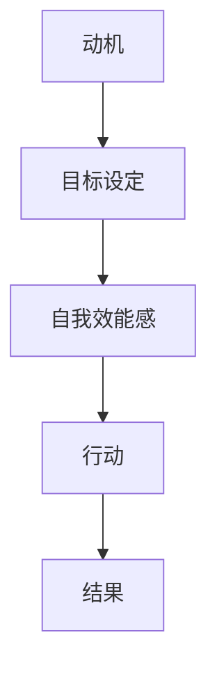

**图表解释**：该流程图展示了创业者动力产生的关键环节，从动机到行动再到结果，每个环节都相互影响和促进。动机是初始驱动力，目标设定提供了一个具体方向，自我效能感增强了实现目标的信心，最终驱动创业者采取行动并取得成果。

#### 1.2 保持长期动力的挑战

尽管动力对于创业成功至关重要，但保持长期动力并非易事。创业者常常面临以下挑战：

1. **持续压力与不确定性**：创业过程中充满了不确定性，创业者需要不断调整策略和应对变化。
2. **心理负担**：长期高强度的工作和生活压力可能导致心理健康问题，如焦虑和抑郁。
3. **资源限制**：资金、人力和时间的限制可能影响创业者的动力，尤其是在早期阶段。

**核心概念与联系**：心理负担（Mental Burden）和资源限制（Resource Constraints）是影响创业者动力的重要因素。心理负担可能导致动力减退，而资源限制则限制了创业者的行动能力。

**图表解释**：以下是创业者面临的常见挑战及其对动力的影响的流程图。

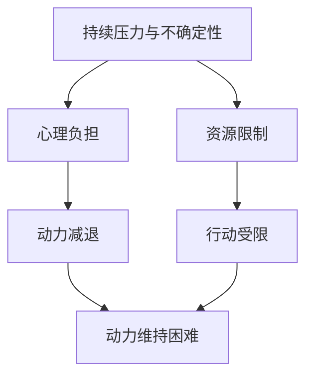

**图表解释**：该流程图显示了创业者面临的主要挑战及其对动力的影响。持续压力和不确定性会导致心理负担，从而降低动力；资源限制会直接限制行动，进一步加剧动力减退。

#### 1.3 本书的结构与目的

本书旨在帮助创业者识别和克服影响长期动力的因素，并提供实用的策略和方法。全书分为十个章节，包括：

1. **动力源泉**：探讨动力产生的心理学原理和价值观。
2. **心理策略**：介绍目标设定、状态管理和自我反馈等策略。
3. **行动策略**：讨论良好的工作习惯、环境优化和社交支持。
4. **情绪调节**：提供情绪调节技巧，如放松和正念练习。
5. **健康管理**：强调身体健康和心理健康的维护。
6. **长期成长的实践**：讨论终身学习和职业发展。
7. **案例分析**：通过成功和失败案例，提供实际经验和启示。
8. **建立个人动力系统**：介绍个人动力系统的构建与维护。
9. **总结**：回顾本书的主要观点和应用技巧。

**核心概念与联系**：个人动力系统（Personal Motivation System）是一个综合性的框架，包括心理、行动、情绪和健康管理等多个层面，旨在帮助创业者持续保持动力。

**图表解释**：以下是个人动力系统的结构图。

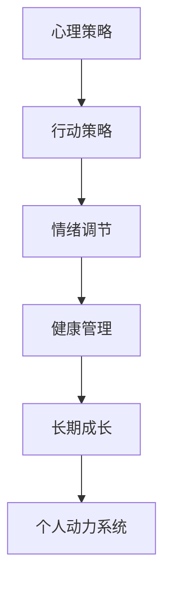

**图表解释**：个人动力系统通过整合心理、行动、情绪和健康四个方面的策略，形成一个完整且动态的系统，帮助创业者持续保持动力。

**摘要**：

本文探讨了创业者在快速变化的商业环境中保持长期动力的关键。通过分析动力的重要性、长期动力的挑战以及本书的结构和目的，读者可以初步了解创业动力源泉的重要性。接下来，本书将通过详细的章节内容，逐步帮助读者理解和实践保持长期动力的策略。

---

### 目录大纲

在本节中，我们将详细介绍本书的结构和目的，以及每章的主要内容。这些章节共同构成了一个系统性的框架，旨在帮助创业者识别和克服影响长期动力的因素。

**第1章 引言**

- **1.1 创业者动力的重要性**：探讨动力在创业成功中的关键作用。
- **1.2 保持长期动力的挑战**：分析创业者面临的持续压力和不确定性等挑战。
- **1.3 本书的结构与目的**：介绍本书的结构和目标，为后续章节打下基础。

**第2章 动力源泉**

- **2.1 自我激励的心理学原理**：探讨动力产生的心理学基础。
- **2.2 价值观与动机**：分析价值观对创业者动机的影响。
- **2.3 激励的要素与层次**：介绍激励的不同层次和关键要素。

**第3章 心理策略**

- **3.1 目标设定与达成**：探讨SMART目标法则和目标分解策略。
- **3.2 状态管理**：介绍状态调控策略和克服拖延的方法。
- **3.3 自我反馈与调整**：探讨成功日记和反思与调整的重要性。

**第4章 行动策略**

- **4.1 良好的工作习惯**：讨论如何建立和维护良好的工作习惯。
- **4.2 环境优化**：探讨如何通过环境优化提升工作效率。
- **4.3 社交支持**：分析社交支持在动力维持中的作用。

**第5章 情绪调节**

- **5.1 情绪的类型与识别**：介绍情绪的类型和识别方法。
- **5.2 负面情绪的应对**：讨论如何应对负面情绪。
- **5.3 情绪调控技巧**：介绍放松技巧和正念练习。

**第6章 健康管理**

- **6.1 身体健康**：探讨身体健康对动力的影响和保持身体健康的方法。
- **6.2 心理健康**：讨论心理健康的重要性以及如何维护心理健康。
- **6.3 健康与动力的关系**：分析健康与动力之间的相互关系。

**第7章 长期成长的实践**

- **7.1 终身学习**：探讨终身学习的重要性以及如何实践终身学习。
- **7.2 职业发展**：分析职业发展的路径和策略。
- **7.3 社会责任与使命感**：讨论社会责任和使命感对动力的促进作用。

**第8章 案例分析**

- **8.1 成功创业者案例**：分析成功创业者的动力源泉和实践策略。
- **8.2 失败创业者案例**：探讨失败创业者的教训和启示。
- **8.3 案例总结与启示**：总结案例中的关键经验和教训。

**第9章 建立个人动力系统**

- **9.1 个人动力系统的概念**：介绍个人动力系统的构成和作用。
- **9.2 个人动力系统的构建**：讨论如何构建和维护个人动力系统。
- **9.3 维护与优化**：探讨如何持续优化个人动力系统。

**第10章 总结**

- **10.1 本书的主要观点**：回顾本书的主要观点和核心概念。
- **10.2 如何应用这些技巧**：提供如何在实际中应用这些技巧的建议。
- **10.3 长期动力的持续培养**：讨论如何持续培养和维持长期动力。

通过上述章节的详细内容和结构，读者可以系统地了解和掌握保持长期动力的策略和方法。每一章都将深入探讨一个特定方面，帮助创业者从不同层面提升自己的动力水平，从而在创业的道路上更加坚定和自信。

---

### 第2章 动力源泉

在探讨如何保持长期动力之前，理解动力源泉是至关重要的。这一章节将深入探讨自我激励的心理学原理，分析价值观与动机之间的关系，以及激励的要素与层次，帮助创业者从根本上把握动力之源。

#### 2.1 自我激励的心理学原理

自我激励是指个体通过内在动机驱动自己的行为，以达到特定目标。心理学研究表明，自我激励涉及多个心理过程，包括自我决定理论（Self-Determination Theory，简称SDT）和目标设置理论（Goal Setting Theory）。

**核心概念与联系**：

- **自我决定理论（SDT）**：由德西和瑞安（Deci & Ryan）提出，认为个体有自我决定的需求，即自主性（Autonomy）、能力感（Competence）和关联性（Relatedness）。满足这些需求可以增强自我激励。

**Mermaid 流程图**：

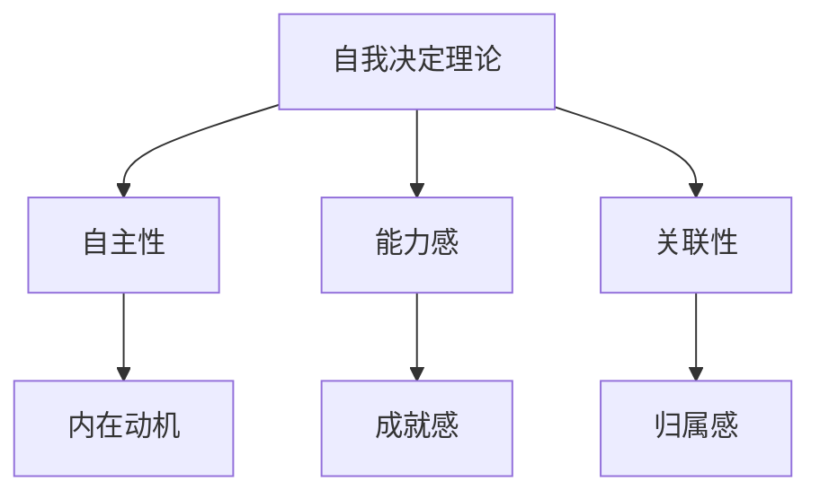

**图表解释**：该流程图展示了自我决定理论的核心概念和它们如何影响内在动机。自主性、能力感和关联性共同作用于内在动机，进而影响个体的行动和动力。

- **目标设置理论（GST）**：由洛克（Locke）和鲁宾逊（Latham）提出，强调明确且具有挑战性的目标可以显著提高个体的工作动力和表现。

**核心算法原理讲解伪代码**：

```python
def set_motivating_goal(goal):
    if is_ambiguous(goal):
        raise ValueError("目标必须明确")
    if not is_challenging(goal):
        raise ValueError("目标必须有挑战性")
    if not is_specific(goal):
        raise ValueError("目标必须具体")
    return goal
```

**代码解释**：该伪代码定义了一个函数，用于设置一个具有激励性的目标。目标必须明确、具有挑战性且具体，以确保能够有效激发个体的内在动机。

#### 2.2 价值观与动机

价值观是个人对什么是有意义和重要的信念系统。它们指导个体的行为和决策，是动机的重要来源。对创业者而言，了解自己的核心价值观并以此驱动行为，可以增强长期动力。

**核心概念与联系**：

- **核心价值观**：涉及个人对生活、工作和人际关系的基本信念。如创新、诚信、责任、成长等。

**Mermaid 流程图**：

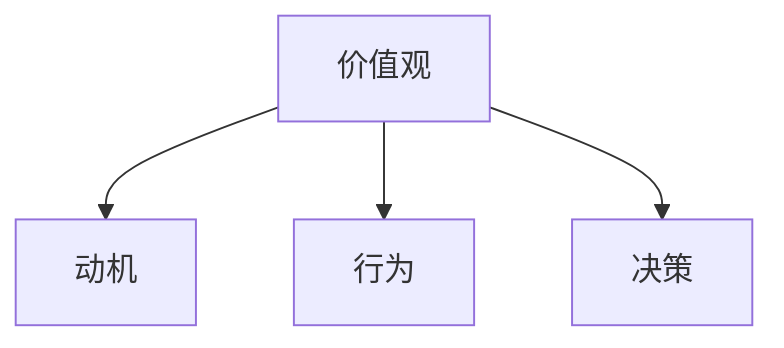

**图表解释**：该流程图展示了价值观如何影响动机、行为和决策。明确的价值观为个体提供了清晰的行动指南，增强了动机。

**数学模型与公式**：

$$
\text{动机} = f(\text{核心价值观匹配度}, \text{目标相关性})
$$

**公式解释**：该公式表明，动机与核心价值观匹配度和目标相关性成正比。当个体的核心价值观与目标相匹配时，动机水平较高。

#### 2.3 激励的要素与层次

激励是一个复杂的过程，涉及多个要素和层次。了解这些要素和层次有助于创业者更有效地管理和提升动力。

**核心概念与联系**：

- **激励要素**：包括内在激励（如兴趣、成就感、自主性）和外在激励（如奖励、认可、竞争）。
- **激励层次**：根据马斯洛的需求层次理论（Maslow's Hierarchy of Needs），激励可以分为生理需求、安全需求、社交需求、尊重需求和自我实现需求。

**Mermaid 流程图**：

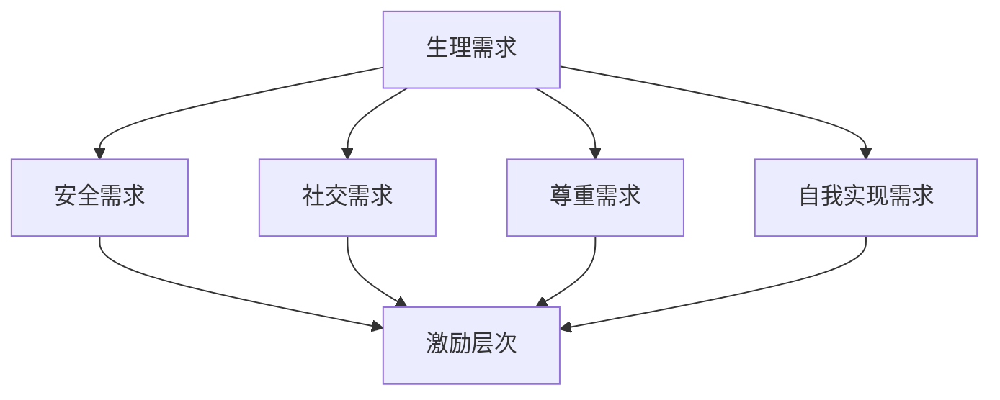

**图表解释**：该流程图展示了马斯洛的需求层次理论，每个层次的需求满足程度都会影响个体的激励水平。

**数学模型与公式**：

$$
\text{总激励} = f(\text{内在激励}, \text{外在激励})
$$

**公式解释**：该公式表明，总激励是内在激励和外在激励的综合结果。内在激励和外在激励相互补充，共同提升个体的动力。

#### 摘要

本章深入探讨了动力源泉的心理学原理、价值观与动机的关系以及激励的要素与层次。通过理解自我决定理论、目标设置理论，以及马斯洛的需求层次理论，创业者可以更好地识别和利用内在动机和外在激励，从而在创业过程中保持长期动力。

---

### 第3章 心理策略

在保持长期动力的过程中，心理策略发挥着至关重要的作用。本章将详细探讨目标设定与达成、状态管理以及自我反馈与调整等策略，帮助创业者有效地管理心理状态，保持动力并持续进步。

#### 3.1 目标设定与达成

目标设定是激发动力和实现成功的关键一步。合理的目标设定可以帮助创业者明确方向，制定计划，并保持动力。以下是几种常用的目标设定策略：

**SMART目标法则**

SMART目标法则是一种广泛使用的目标设定方法，它要求目标具有以下五个特点：具体（Specific）、可衡量（Measurable）、可实现（Achievable）、相关（Relevant）和时限性（Time-bound）。

**伪代码示例**：

```python
def set_smart_goal(goal):
    if not is_specific(goal):
        raise ValueError("目标必须具体明确")
    if not is_measurable(goal):
        raise ValueError("目标必须有可测量指标")
    if not is_achievable(goal):
        raise ValueError("目标必须可实现")
    if not is_relevant(goal):
        raise ValueError("目标必须与个人目标相关")
    if not is_time_based(goal):
        raise ValueError("目标必须有明确时间期限")
    return goal
```

**代码解读**：

该函数用于检查目标是否满足SMART法则的要求。如果目标不满足条件，函数将抛出异常。这有助于确保目标的合理性和可执行性。

**目标分解与时间管理**

为了更好地实现目标，创业者可以将大目标分解为小目标，并制定详细的时间管理计划。这种方法不仅有助于保持动力，还可以提高工作效率。

**Mermaid 流程图**：

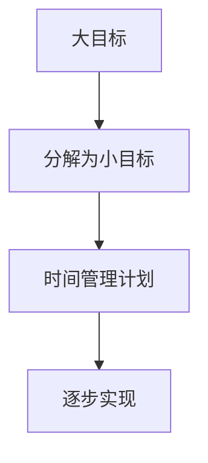

**图表解释**：

该流程图展示了目标分解和时间管理的关系。通过将大目标分解为小目标，并制定详细的时间管理计划，创业者可以更有效地实现目标。

#### 3.2 状态管理

状态管理是指创业者如何保持积极的心理状态，以应对创业过程中的各种挑战。以下是几种有效的状态管理策略：

**状态调控策略**

状态调控策略包括情绪调节、压力管理和自我激励等方法。通过这些策略，创业者可以在面对压力和挑战时保持冷静和积极。

**Mermaid 流程图**：

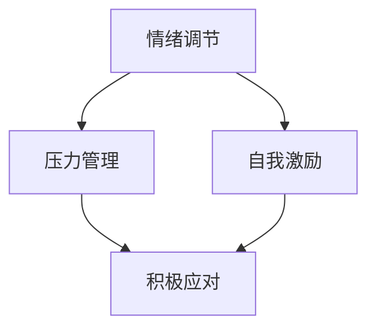

**图表解释**：

该流程图展示了状态调控策略的三个关键方面：情绪调节、压力管理和自我激励。这些策略共同作用，帮助创业者保持积极状态。

**克服拖延**

拖延是创业者常见的心理障碍之一。以下是几种克服拖延的方法：

- **分解任务**：将大任务分解为小任务，逐步完成。
- **时间管理**：使用时间管理工具和技巧，如番茄工作法。
- **激励策略**：设定奖励，激励自己完成任务。

**数学模型与公式**：

$$
\text{拖延成本} = \text{机会成本} + \text{情绪成本}
$$

**公式解释**：

该公式表明，拖延不仅导致机会成本的损失，还会带来情绪上的负面影响。通过减少拖延，创业者可以降低这些成本。

#### 3.3 自我反馈与调整

自我反馈是创业者持续改进和保持动力的关键。通过定期反思和调整，创业者可以识别问题、调整策略，并保持动力。

**成功日记**

成功日记是一种记录和反思的方法，创业者可以记录自己的成功经历和学到的东西。这种方法有助于增强自信心，激励自己继续努力。

**反思与调整**

反思与调整包括以下步骤：

1. **回顾**：回顾过去一段时间的工作，识别成功和不足之处。
2. **分析**：分析成功的原因和不足的根源。
3. **调整**：根据分析结果调整策略，以改进未来表现。

**数学模型与公式**：

$$
\text{自我反馈效果} = f(\text{反思深度}, \text{调整力度})
$$

**公式解释**：

该公式表明，自我反馈效果与反思深度和调整力度成正比。通过深入反思和有力调整，创业者可以显著提高自我反馈效果。

**实战项目与代码解读**

**项目背景**：

创业者需要一款简单的应用来记录每日任务和成功经验，以便进行自我反馈。

**项目实现**：

使用Python开发一个简单的任务记录应用，包括添加任务、记录成功和反思功能。

**源代码**：

```python
class TaskTracker:
    def __init__(self):
        self.tasks = []

    def add_task(self, task):
        self.tasks.append(task)

    def record_success(self, task, success):
        for i, t in enumerate(self.tasks):
            if t == task:
                self.tasks[i]['success'] = success
                break

    def reflect(self):
        reflections = []
        for t in self.tasks:
            if 'success' in t:
                reflections.append(t['success'])
        return reflections

# 实例化并使用应用
tracker = TaskTracker()
tracker.add_task("完成市场调研")
tracker.record_success("完成市场调研", "成功完成了市场调研，发现了一些潜在客户。")
reflections = tracker.reflect()
print(reflections)
```

**代码解读**：

- `TaskTracker` 类用于创建任务记录应用实例。
- `add_task` 方法用于添加新的任务。
- `record_success` 方法用于记录任务的完成情况。
- `reflect` 方法用于获取反思记录。

**项目分析**：

该任务记录应用简单但实用，可以帮助创业者记录任务完成情况和成功经验，进行自我反馈和调整。通过这样的应用，创业者可以更好地管理自己的工作和动力。

---

#### 摘要

本章详细探讨了心理策略在保持长期动力中的重要性。通过SMART目标法则、目标分解与时间管理，创业者可以明确目标并制定有效的行动计划。状态管理策略如情绪调节、压力管理和自我激励，帮助创业者保持积极的心态。自我反馈与调整，通过记录成功和反思，创业者可以持续改进和保持动力。本章提供了一系列实用的方法和工具，帮助创业者更好地管理心理状态，实现长期动力。

---

### 第4章 行动策略

在创业过程中，心理策略虽然重要，但行动策略同样不可或缺。本章将深入探讨如何通过良好的工作习惯、环境优化和社交支持来提升工作效率和动力。

#### 4.1 良好的工作习惯

良好的工作习惯是创业者成功的关键。以下是一些有效的工作习惯：

**时间管理**：使用时间管理工具，如日历、提醒和待办事项列表，以合理安排时间。

**优先级设定**：将任务按优先级排序，确保首先完成最重要的任务。

**习惯养成**：培养每日例行公事，如早起、锻炼和阅读，以建立稳定的工作和生活节奏。

**专注力训练**：通过冥想和专注力训练，提高专注力和工作效率。

**Mermaid 流程图**：

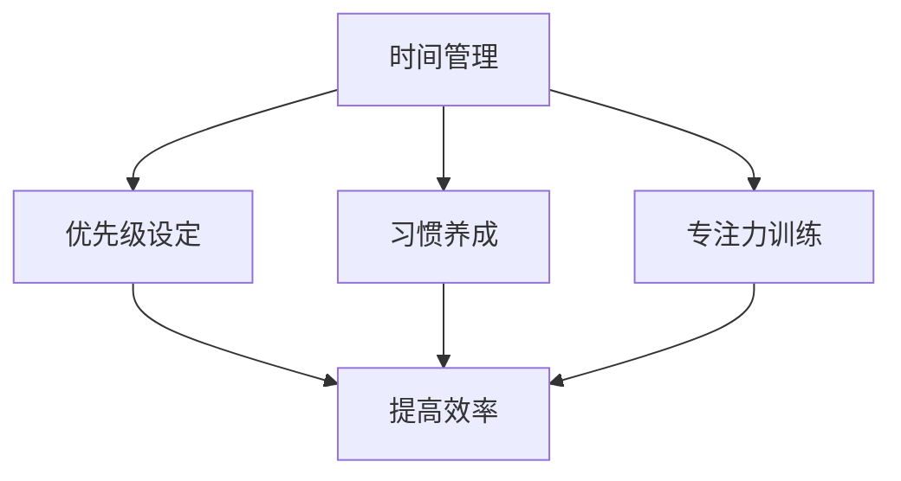

**图表解释**：该流程图展示了良好的工作习惯如何通过时间管理、优先级设定、习惯养成和专注力训练来提高工作效率。

#### 4.2 环境优化

环境对创业者的动力和工作效率有着重要影响。以下是一些环境优化的建议：

**工作空间设计**：创建一个舒适、整洁和具有激励性的工作环境。

**工具与技术**：使用高效的工作工具和技术，如自动化工具、项目管理软件和协作平台。

**健康饮食**：保持健康的饮食习惯，避免过度依赖咖啡因和糖分。

**休息与运动**：定期休息和锻炼，以保持身体和心理健康。

**Mermaid 流程图**：

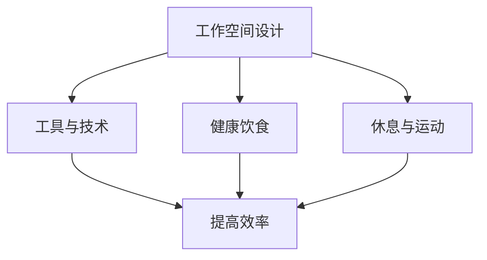

**图表解释**：该流程图展示了如何通过工作空间设计、工具与技术、健康饮食和休息与运动来优化环境，从而提高工作效率。

#### 4.3 社交支持

社交支持是创业者保持动力的重要来源。以下是一些社交支持的策略：

**建立网络**：与同行建立联系，参加行业活动和研讨会，以获取资源和灵感。

**团队建设**：建立高效的团队，并定期进行团队建设活动，以增强团队凝聚力。

**导师指导**：寻找导师或行业专家，获取经验和建议。

**家庭和朋友的支持**：与家人和朋友保持良好的关系，寻求他们的支持和理解。

**Mermaid 流程图**：

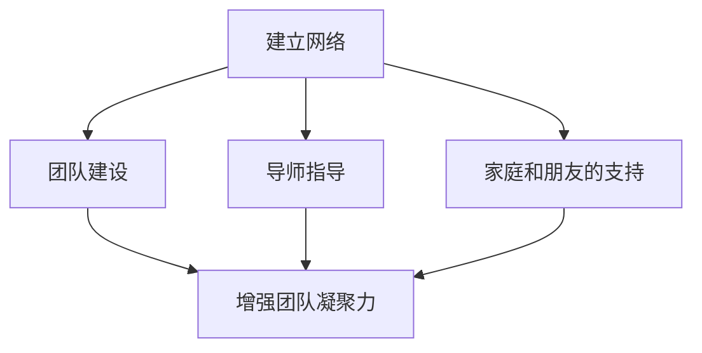

**图表解释**：该流程图展示了如何通过建立网络、团队建设、导师指导和家庭和朋友的支持来获得社交支持，从而提高创业动力。

#### 实战项目与代码解读

**项目背景**：

为了帮助创业者管理任务和保持动力，我们将开发一个简单的任务管理应用。

**项目实现**：

使用Python和SQLite数据库实现一个任务管理应用，包括添加任务、标记任务完成和查看任务列表的功能。

**源代码**：

```python
import sqlite3

# 创建数据库连接
conn = sqlite3.connect('tasks.db')
c = conn.cursor()

# 创建表
c.execute('''CREATE TABLE IF NOT EXISTS tasks (id INTEGER PRIMARY KEY, description TEXT, completed BOOLEAN)''')

# 插入数据
def add_task(description):
    c.execute("INSERT INTO tasks (description, completed) VALUES (?, ?)", (description, False))
    conn.commit()

# 标记任务完成
def mark_complete(id):
    c.execute("UPDATE tasks SET completed = ? WHERE id = ?", (True, id))
    conn.commit()

# 查看任务列表
def list_tasks():
    c.execute("SELECT * FROM tasks")
    tasks = c.fetchall()
    for task in tasks:
        print(f"ID: {task[0]}, Description: {task[1]}, Completed: {task[2]}")
```

**代码解读**：

- 使用SQLite数据库存储任务信息。
- `add_task` 方法用于添加新任务。
- `mark_complete` 方法用于标记任务完成。
- `list_tasks` 方法用于显示任务列表。

**项目分析**：

通过这个简单的任务管理应用，创业者可以更好地管理任务，提高工作效率，从而保持动力。

---

#### 摘要

本章通过讨论良好的工作习惯、环境优化和社交支持，为创业者提供了一系列实用的行动策略。良好的工作习惯有助于提高工作效率，环境优化有助于创造一个有利于工作和创新的环境，而社交支持则提供了情感上的支持和资源。通过这些行动策略，创业者可以更好地管理自己的工作和动力，实现长期的创业成功。

---

### 第5章 情绪调节

情绪调节在保持长期动力中起着至关重要的作用。本章将探讨情绪的类型与识别、负面情绪的应对以及情绪调节技巧，帮助创业者更好地管理情绪，提高生活质量和工作效率。

#### 5.1 情绪的类型与识别

情绪是人类心理状态的重要组成部分，可以分为积极情绪和消极情绪。了解情绪的类型与识别方法，有助于创业者更好地管理自己的情绪。

**积极情绪**：包括快乐、满足、兴奋和爱等。这些情绪能够提升个体的心理健康和幸福感。

**消极情绪**：包括焦虑、沮丧、愤怒和恐惧等。长期处于消极情绪中可能会对心理健康产生负面影响。

**情绪识别方法**：

- **自我观察**：通过自我反思，识别和理解自己的情绪。
- **情绪日记**：记录情绪的起因、表现和持续时间，帮助自己更好地理解情绪。
- **情绪量表**：使用标准化的情绪量表评估自己的情绪状态。

**Mermaid 流程图**：

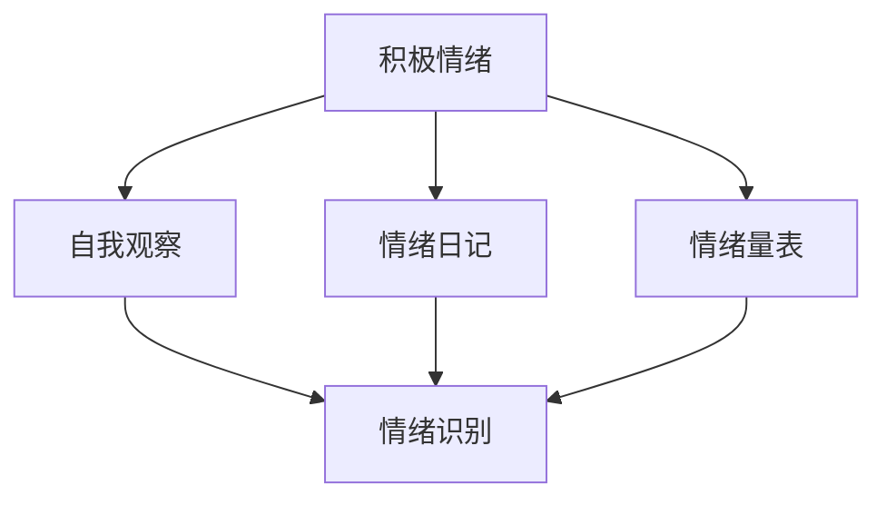

**图表解释**：该流程图展示了通过自我观察、情绪日记和情绪量表等方法，创业者可以更好地识别和理解自己的情绪。

#### 5.2 负面情绪的应对

负面情绪是创业者面临的一大挑战。以下是一些应对负面情绪的策略：

**认知重构**：通过改变对事件的理解和解释，减少负面情绪的影响。

**问题解决**：积极面对问题，制定解决方案，减少因问题未解决而产生的焦虑和压力。

**放松技巧**：使用深呼吸、冥想和渐进性肌肉放松等方法，缓解紧张和焦虑。

**社交支持**：与家人、朋友或专业人士交流，寻求支持和建议。

**Mermaid 流程图**：

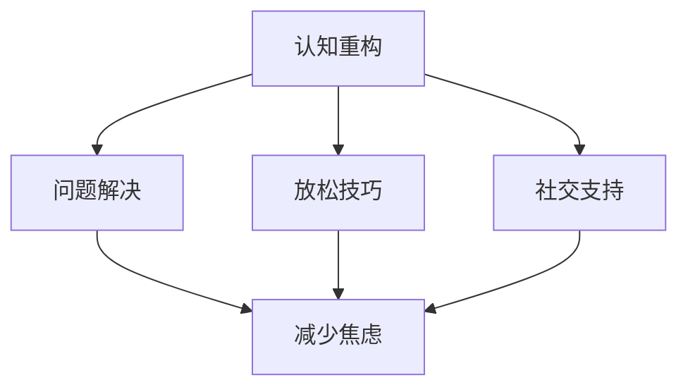

**图表解释**：该流程图展示了如何通过认知重构、问题解决、放松技巧和社交支持等方法，应对负面情绪。

#### 5.3 情绪调节技巧

情绪调节技巧是帮助创业者更好地管理情绪的重要工具。以下是一些有效的情绪调节技巧：

**放松技巧**：

- **深呼吸**：通过缓慢、深长的呼吸，放松身心。
- **渐进性肌肉放松**：逐步放松身体各个部位的肌肉，达到全身放松的效果。

**正念练习**：

- **正念呼吸**：专注于呼吸，观察呼吸的进出，使心灵回归当下。
- **正念行走**：在行走时专注于每一步的触地感觉，体验当下的身体感觉。

**Mermaid 流程图**：

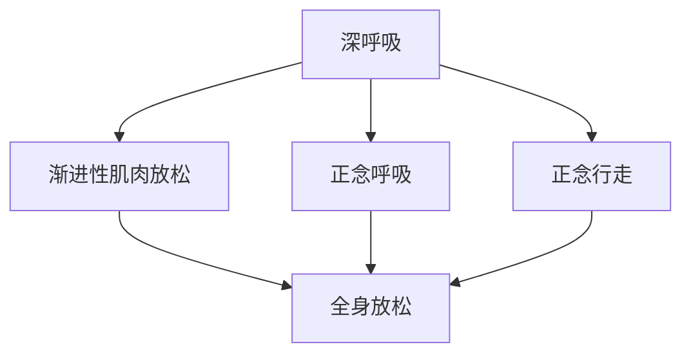

**图表解释**：该流程图展示了放松技巧和正念练习的具体方法，以及它们如何帮助创业者达到全身放松的效果。

#### 实战项目与代码解读

**项目背景**：

为了帮助创业者管理情绪，我们将开发一个简单的情绪调节应用。

**项目实现**：

使用Python和Tkinter库实现一个情绪调节应用，包括深呼吸练习和正念呼吸练习。

**源代码**：

```python
import tkinter as tk
from tkinter import messagebox

def deep_breathing():
    messagebox.showinfo("深呼吸练习", "进行深呼吸练习，深吸一口气，慢慢呼出。")

def mindfulness_breathing():
    messagebox.showinfo("正念呼吸练习", "专注于呼吸，观察呼吸的进出，保持平静。")

root = tk.Tk()
root.title("情绪调节应用")

tk.Button(root, text="深呼吸练习", command=deep_breathing).pack(pady=20)
tk.Button(root, text="正念呼吸练习", command=mindfulness_breathing).pack(pady=20)

root.mainloop()
```

**代码解读**：

- 使用Tkinter库创建一个简单的GUI应用。
- `deep_breathing` 和 `mindfulness_breathing` 方法分别用于显示深呼吸和正念呼吸的练习信息。

**项目分析**：

通过这个简单的情绪调节应用，创业者可以方便地访问和练习情绪调节技巧，帮助自己更好地管理情绪，提高生活质量。

---

#### 摘要

本章详细探讨了情绪调节在保持长期动力中的重要性，包括情绪的类型与识别、负面情绪的应对以及情绪调节技巧。通过了解情绪的类型和识别方法，创业者可以更好地认识和管理自己的情绪。负面情绪的应对策略和情绪调节技巧，帮助创业者减轻压力，提高生活质量。本章提供了一系列实用的方法，帮助创业者更好地管理情绪，保持长期动力。

---

### 第6章 健康管理

在创业的过程中，健康管理是确保创业者能够保持长期动力和高效工作的重要一环。本章将深入探讨身体健康、心理健康以及健康与动力的关系，帮助创业者建立健康的生活方式，从而在竞争中保持优势。

#### 6.1 身体健康

身体健康是创业者能够持续高效工作的基础。以下是一些保持身体健康的方法：

**定期锻炼**：定期进行体育锻炼，如跑步、游泳、瑜伽等，可以提高身体的代谢率，增强心肺功能，同时也有助于缓解压力。

**健康饮食**：保持均衡的饮食，摄入充足的蛋白质、碳水化合物、脂肪以及各种维生素和矿物质，有助于保持身体的活力和免疫力。

**充足睡眠**：保证充足的睡眠时间，有助于恢复体力和精神状态，提高第二天的效率。

**避免不良习惯**：减少吸烟、饮酒和过度使用咖啡因等不良习惯，这些习惯会影响身体健康和心理健康。

**Mermaid 流程图**：

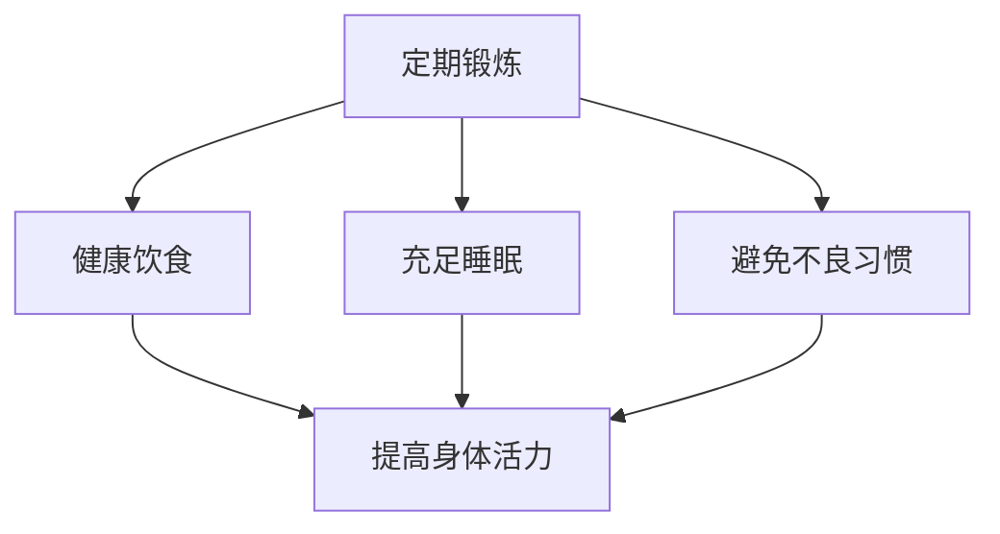

**图表解释**：该流程图展示了通过定期锻炼、健康饮食、充足睡眠和避免不良习惯，创业者可以保持身体健康，提高整体活力。

#### 6.2 心理健康

心理健康对于创业者的长期动力同样至关重要。以下是一些保持心理健康的方法：

**情绪管理**：学会有效管理情绪，避免负面情绪的积累和爆发，可以通过冥想、正念练习等方法进行情绪调节。

**压力管理**：通过合理的时间管理和任务分配，减少工作和生活压力。学会放松技巧，如深呼吸、瑜伽和按摩等，有助于缓解压力。

**社交支持**：保持良好的社交关系，与家人、朋友和同事保持沟通，可以获得情感上的支持和鼓励，增强心理韧性。

**心理健康教育**：了解心理健康的基本知识，识别心理问题的早期迹象，并及时寻求专业帮助。

**Mermaid 流程图**：

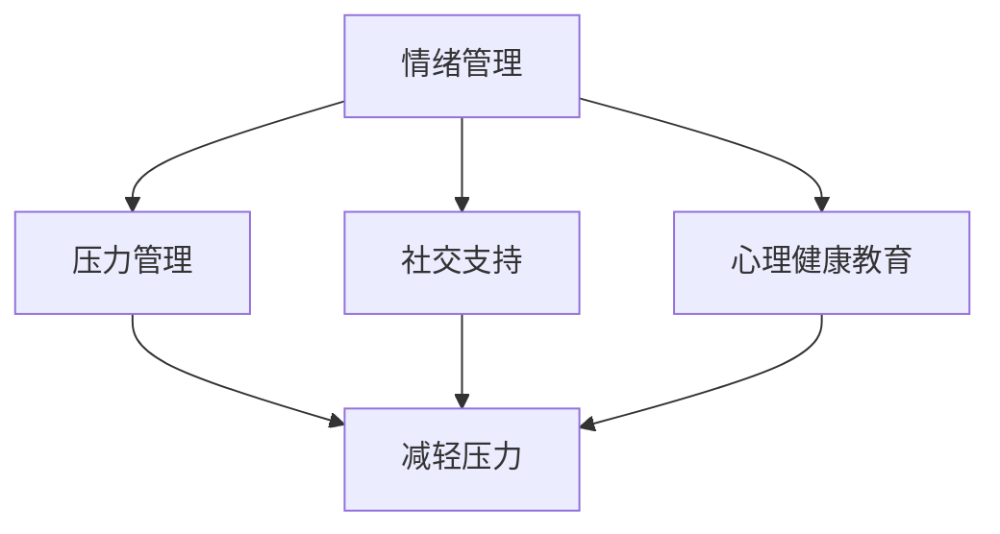

**图表解释**：该流程图展示了通过情绪管理、压力管理、社交支持和心理健康教育，创业者可以保持心理健康，提高心理韧性。

#### 6.3 健康与动力的关系

健康与动力之间存在密切的关系。一个健康的身体和心理状态能够增强创业者的动力，使其更加专注和高效地工作。

**物理与健康**：身体健康可以直接影响创业者的工作效率和注意力。一个健康的身体能够更好地应对工作压力，保持较高的工作强度。

**心理与健康**：心理健康则影响创业者的情绪状态和决策能力。一个心理健康的人能够更好地管理情绪，做出更加理智和有效的决策。

**Mermaid 流程图**：

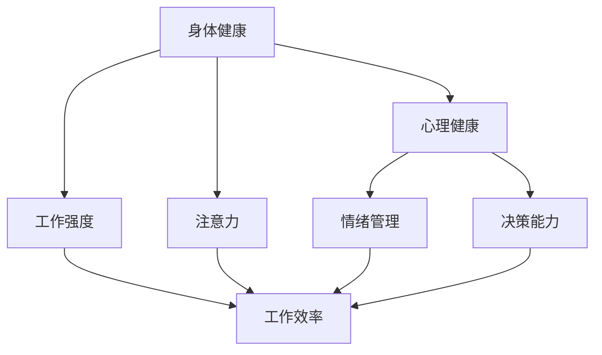

**图表解释**：该流程图展示了身体健康和心理健康如何共同影响工作效率和注意力，以及情绪管理和决策能力在其中的作用。

**数学模型与公式**：

$$
\text{动力} = f(\text{身体健康}, \text{心理健康}, \text{工作效率})
$$

**公式解释**：该公式表明，动力是身体健康、心理健康和工作效率的综合结果。只有当身体和心理健康，且工作效率较高时，创业者的动力才能达到最佳状态。

#### 实战项目与代码解读

**项目背景**：

为了帮助创业者更好地管理健康，我们将开发一个简单的健康管理应用。

**项目实现**：

使用Python和Tkinter库实现一个健康管理应用，包括记录锻炼、饮食和睡眠等功能。

**源代码**：

```python
import tkinter as tk
from tkinter import messagebox

def record_exercise():
    messagebox.showinfo("记录锻炼", "请记录你的锻炼时间和运动类型。")

def record_diet():
    messagebox.showinfo("记录饮食", "请记录你的饮食内容和摄入卡路里。")

def record_sleep():
    messagebox.showinfo("记录睡眠", "请记录你的睡眠时长和睡眠质量。")

root = tk.Tk()
root.title("健康管理应用")

tk.Button(root, text="记录锻炼", command=record_exercise).pack(pady=20)
tk.Button(root, text="记录饮食", command=record_diet).pack(pady=20)
tk.Button(root, text="记录睡眠", command=record_sleep).pack(pady=20)

root.mainloop()
```

**代码解读**：

- 使用Tkinter库创建一个简单的GUI应用。
- `record_exercise`、`record_diet` 和 `record_sleep` 方法分别用于记录锻炼、饮食和睡眠信息。

**项目分析**：

通过这个简单的健康管理应用，创业者可以方便地记录和跟踪自己的健康数据，从而更好地管理自己的健康状况。

---

#### 摘要

本章详细探讨了健康管理在保持长期动力中的重要性。通过保持身体健康和心理健康，创业者可以提高工作效率和专注力，从而在创业过程中保持优势。本章提供了一系列实用的方法和工具，帮助创业者建立健康的生活方式，维持长期动力。通过健康管理，创业者不仅能够提升个人的生活质量，还能为创业的成功奠定坚实基础。

---

### 第7章 长期成长的实践

在创业的道路上，长期成长是创业者实现持续成功的关键。本章将探讨终身学习、职业发展和社会责任与使命感的重要性，帮助创业者不断提升自己的能力，实现个人和企业的长远发展。

#### 7.1 终身学习

终身学习是适应快速变化的商业环境和技术进步的重要途径。对于创业者来说，持续学习不仅能够更新知识，还能激发创新思维和解决问题的能力。

**核心概念与联系**：

- **终身学习**：指个体在其整个生命中持续学习，以适应不断变化的环境和需求。
- **知识更新**：随着技术的不断进步，创业者需要不断更新自己的知识库，以保持竞争力。

**Mermaid 流程图**：

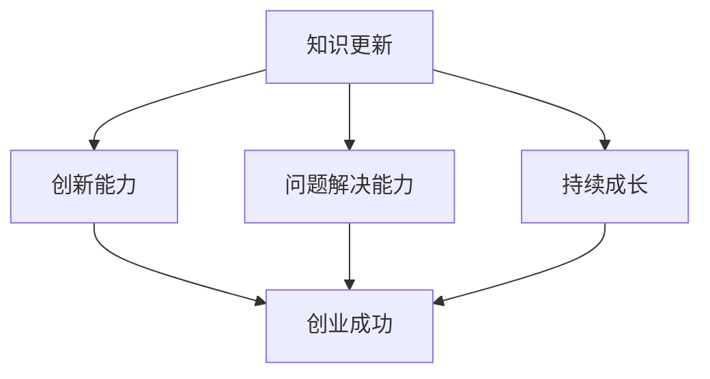

**图表解释**：该流程图展示了终身学习如何通过知识更新、创新能力、问题解决能力推动持续成长，并最终实现创业成功。

**数学模型与公式**：

$$
\text{创新能力} = f(\text{知识储备}, \text{学习频率})
$$

**公式解释**：该公式表明，创新能力与知识储备和学习频率成正比。创业者通过持续学习和积累知识，可以显著提高创新能力。

**实战项目与代码解读**

**项目背景**：

为了帮助创业者实现终身学习，我们将开发一个在线学习平台。

**项目实现**：

使用Python和Flask框架实现一个在线学习平台，包括课程管理、学习进度跟踪和用户反馈功能。

**源代码**：

```python
from flask import Flask, request, jsonify

app = Flask(__name__)

# 课程管理
courses = [
    {"id": 1, "title": "Python基础", "completed": False},
    {"id": 2, "title": "数据分析", "completed": False}
]

@app.route("/courses", methods=["GET", "POST"])
def manage_courses():
    if request.method == "POST":
        course_data = request.json
        courses.append(course_data)
        return jsonify({"message": "课程添加成功"}), 201
    return jsonify(courses)

# 学习进度跟踪
@app.route("/courses/<int:course_id>/complete", methods=["PUT"])
def mark_course_complete(course_id):
    for course in courses:
        if course["id"] == course_id:
            course["completed"] = True
            return jsonify({"message": "课程完成标记成功"}), 200
    return jsonify({"message": "课程未找到"}), 404

if __name__ == "__main__":
    app.run(debug=True)
```

**代码解读**：

- 使用Flask框架创建一个简单的在线学习平台。
- `manage_courses` 方法用于管理课程，包括添加课程。
- `mark_course_complete` 方法用于标记课程完成。

**项目分析**：

这个在线学习平台可以帮助创业者方便地管理学习进度，通过课程添加和完成标记，实现终身学习。

#### 7.2 职业发展

职业发展是创业者实现个人成长和职业目标的重要途径。以下是一些职业发展的策略：

**目标设定**：明确职业目标，并制定实现目标的行动计划。

**持续学习**：通过参加培训、研讨会和在线课程，不断提升自己的技能和知识。

**网络建设**：建立和维护专业网络，获取行业信息和资源。

**角色模型**：寻找并学习行业内的成功人士，从他们的经验中汲取智慧。

**Mermaid 流程图**：

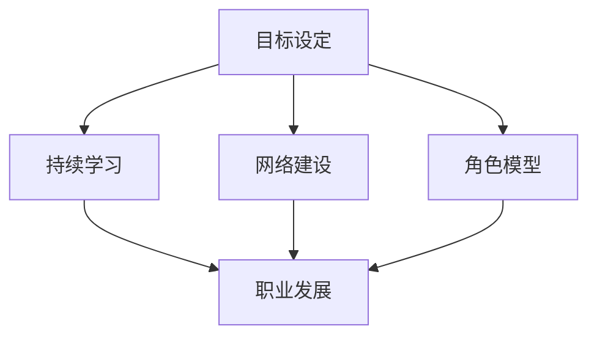

**图表解释**：该流程图展示了通过目标设定、持续学习、网络建设和角色模型，创业者可以实现职业发展。

**数学模型与公式**：

$$
\text{职业发展} = f(\text{目标明确度}, \text{学习效果}, \text{网络资源})
$$

**公式解释**：该公式表明，职业发展取决于目标明确度、学习效果和网络资源的综合作用。

#### 7.3 社会责任与使命感

社会责任与使命感是创业者精神层面的动力源泉，也是企业长远发展的关键。以下是一些相关策略：

**社会贡献**：通过慈善捐赠、公益活动等方式，回报社会。

**企业价值观**：建立与价值观相符的企业文化，激发员工的使命感和归属感。

**可持续发展**：在经营活动中注重环境保护和资源节约，实现可持续发展。

**社会影响力**：通过技术创新和商业模式，创造社会价值。

**Mermaid 流程图**：

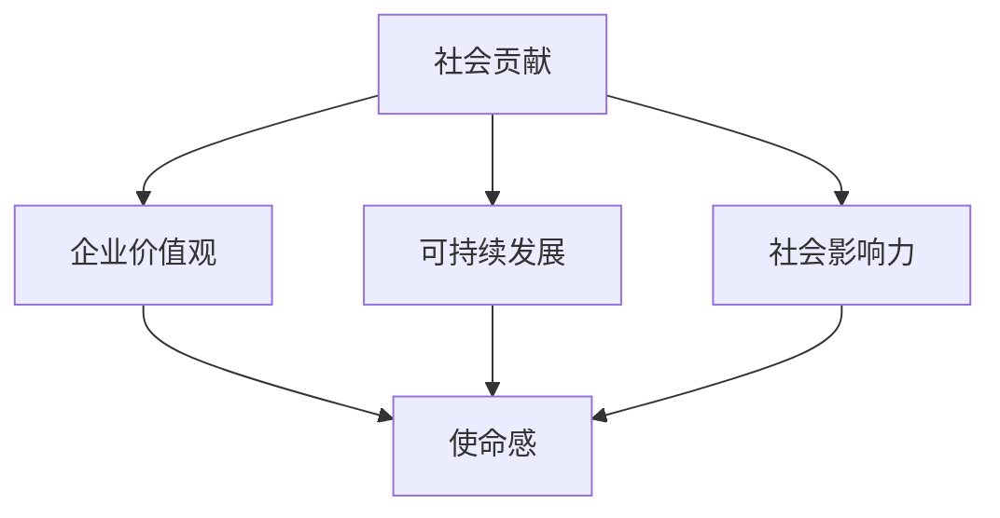

**图表解释**：该流程图展示了如何通过社会贡献、企业价值观、可持续发展和社会影响力，激发创业者的使命感。

**数学模型与公式**：

$$
\text{使命感} = f(\text{社会贡献}, \text{企业价值观认同}, \text{可持续发展成效}, \text{社会影响力})
$$

**公式解释**：该公式表明，使命感是社会责任和使命感各方面成效的综合反映。

---

#### 摘要

本章探讨了长期成长实践在创业者成功中的重要性。通过终身学习、职业发展和社会责任与使命感，创业者可以不断提升自己的能力，实现个人和企业的长远发展。终身学习帮助创业者适应快速变化的商业环境，职业发展策略助力创业者实现职业目标，而社会责任与使命感则为创业者提供了精神层面的动力。本章提供了一系列实用的策略和方法，帮助创业者实现长期成长。

---

### 第8章 案例分析

在本章中，我们将通过分析成功和失败的创业者案例，深入探讨他们在动力维持和创业过程中的经验和教训。这些案例将为我们提供宝贵的启示，帮助我们更好地理解和应用前述章节中的策略和技巧。

#### 8.1 成功创业者案例

**案例1：扎克伯格与Facebook的崛起**

扎克伯格是Facebook的创始人，他的成功故事激励了无数创业者。以下是他的成功经验和动力维持策略：

- **目标明确**：扎克伯格在哈佛大学时便明确了创办一个社交平台的愿景，这一目标驱使他不断努力，最终创建了Facebook。
- **持续学习**：他始终保持对新技术的敏感度，通过不断学习和实践，使Facebook始终保持技术领先。
- **团队建设**：他注重团队建设，吸纳了一大批优秀人才，形成了一个高效的团队，共同推动公司发展。
- **社会责任**：Facebook不仅在商业上取得成功，还通过“捐赠承诺”等行动，积极履行社会责任。

**核心启示**：

- **明确目标**：明确的目标是保持动力的关键。
- **持续学习**：不断学习新知识，适应市场变化。
- **团队建设**：建立高效的团队，共同实现目标。
- **社会责任**：通过履行社会责任，提升企业的社会影响力。

**Mermaid 流程图**：

```mermaid
graph TD
    A[明确目标] --> B[持续学习]
    A --> C[团队建设]
    A --> D[社会责任]
    B --> E[技术创新]
    C --> E
    D --> E
```

**图表解释**：该流程图展示了扎克伯格如何通过明确目标、持续学习、团队建设和社会责任，维持动力并实现成功。

**数学模型与公式**：

$$
\text{动力} = f(\text{明确目标}, \text{技术创新}, \text{团队凝聚力}, \text{社会责任})
$$

**公式解释**：该公式表明，动力是明确目标、技术创新、团队凝聚力和社会责任的综合结果。

#### 8.2 失败创业者案例

**案例2：皮埃罗·斯楚米勒与Napster**

Napster是第一个提供免费在线音乐共享服务的公司，但最终因法律问题和商业模式缺陷而失败。以下是他的失败教训：

- **法律风险**：Napster在未经版权所有者许可的情况下提供音乐共享，面临法律诉讼，最终导致公司解散。
- **商业模式不清**：虽然Napster吸引了大量用户，但未能找到可持续的商业模式，缺乏稳定的收入来源。
- **创新不足**：虽然Napster在音乐共享领域具有创新性，但在商业模式和法律问题上未能及时调整和创新。

**核心教训**：

- **法律风险**：在商业活动中，必须遵守法律法规，避免法律风险。
- **商业模式**：必须找到可持续的商业模式，确保企业的生存和发展。
- **持续创新**：在快速变化的商业环境中，持续创新是保持竞争力的关键。

**Mermaid 流�程图**：

```mermaid
graph TD
    A[法律风险] --> B[商业模式不清]
    A --> C[创新不足]
    B --> D[法律诉讼]
    B --> E[商业模式失败]
    C --> F[竞争力不足]
```

**图表解释**：该流程图展示了Napster在法律风险、商业模式和创新方面的失败原因及其后果。

**数学模型与公式**：

$$
\text{失败风险} = f(\text{法律风险}, \text{商业模式缺陷}, \text{创新不足})
$$

**公式解释**：该公式表明，失败风险与法律风险、商业模式缺陷和创新不足成正比。

#### 8.3 案例总结与启示

通过分析成功和失败的创业者案例，我们可以得出以下总结和启示：

- **明确目标**：明确的目标是创业成功的基石，有助于创业者保持方向和动力。
- **持续学习**：不断学习新知识，适应市场变化，是创业者保持竞争力的重要手段。
- **团队建设**：建立高效的团队，共同实现目标，是创业成功的关键。
- **社会责任**：履行社会责任，提升企业的社会影响力，有助于增强企业的长期发展。
- **法律合规**：遵守法律法规，避免法律风险，是创业者必须重视的问题。
- **商业模式**：找到可持续的商业模式，确保企业的生存和发展。
- **持续创新**：在快速变化的商业环境中，持续创新是保持竞争力的关键。

通过这些案例，创业者可以更好地理解如何维持动力和应对创业过程中的挑战，从而实现长期成功。

---

#### 摘要

本章通过分析成功和失败的创业者案例，探讨了他们在动力维持和创业过程中的经验和教训。成功创业者通过明确目标、持续学习、团队建设和社会责任实现了长期成功，而失败创业者则在法律风险、商业模式缺陷和创新不足方面犯了错误。这些案例为我们提供了宝贵的启示，帮助创业者更好地维持动力，应对创业挑战，实现长期发展。

---

### 第9章 建立个人动力系统

在创业的旅程中，建立一个稳固的个人动力系统至关重要。本章将探讨个人动力系统的概念、构建方法和维护与优化策略，帮助创业者打造一个强大的内在动力源泉，以持续推动个人和企业的成长。

#### 9.1 个人动力系统的概念

个人动力系统是一个综合性框架，它包括心理、行动、情绪和健康四个关键方面，旨在帮助创业者有效地管理自己的动力。以下是个人动力系统的四个主要组成部分：

**心理层面**：涉及动机、目标设定、自我效能感和心理状态的管理。

**行动层面**：包括工作习惯、时间管理和行动策略的制定与执行。

**情绪层面**：涵盖情绪调节技巧、应对压力和负面情绪的方法。

**健康层面**：涉及身体健康、心理健康和生活方式的维护。

**Mermaid 流程图**：

```mermaid
graph TD
    A[心理层面] --> B[行动层面]
    A --> C[情绪层面]
    A --> D[健康层面]
    B --> E[综合动力系统]
    C --> E
    D --> E
```

**图表解释**：该流程图展示了个人动力系统的四个关键组成部分及其相互关系。心理、行动、情绪和健康四个方面共同作用，形成一个强大的动力系统，帮助创业者保持持续的动力和活力。

#### 9.2 个人动力系统的构建方法

构建个人动力系统需要系统地思考和行动。以下是构建个人动力系统的几个关键步骤：

**步骤1：自我评估**

首先，创业者需要进行自我评估，了解自己的动机、目标、心理状态和健康状况。通过自我反思，识别自身的优势和劣势，为后续的构建提供基础。

**步骤2：制定明确的目标**

制定明确的目标是构建个人动力系统的重要一步。使用SMART目标法则，确保目标是具体、可衡量、可实现、相关和时限性的。明确的目标为创业者提供了清晰的方向和动力。

**步骤3：制定行动策略**

在明确目标的基础上，创业者需要制定具体的行动策略。这包括分解大目标为小目标、制定时间管理计划、建立良好的工作习惯等。通过详细的行动策略，创业者可以有条不紊地实现目标。

**步骤4：情绪调节**

情绪调节是保持长期动力的关键。创业者需要学会识别和管理自己的情绪，通过情绪调节技巧如深呼吸、冥想和正念练习，减轻压力和负面情绪。

**步骤5：健康管理**

健康是动力的重要保障。创业者需要关注身体健康和心理健康，通过定期锻炼、健康饮食和充足睡眠来维持良好的身体状况。同时，寻求心理健康支持，如咨询和心理治疗，有助于提高心理韧性。

**步骤6：环境优化**

优化工作和生活环境，创造一个有利于工作和成长的环境。这包括整理工作空间、使用高效工具和技术、建立良好的工作习惯等。

**Mermaid 流程图**：

```mermaid
graph TD
    A[自我评估] --> B[制定目标]
    A --> C[行动策略]
    A --> D[情绪调节]
    A --> E[健康管理]
    A --> F[环境优化]
    B --> G[明确目标]
    C --> H[分解目标]
    C --> I[时间管理]
    D --> J[情绪调节技巧]
    E --> K[健康饮食]
    E --> L[定期锻炼]
    F --> M[工作习惯]
    F --> N[高效工具]
```

**图表解释**：该流程图展示了构建个人动力系统的步骤和关键策略，帮助创业者系统地打造一个强大的动力系统。

#### 9.3 维护与优化个人动力系统

建立一个个人动力系统并不意味着一劳永逸，创业者需要持续维护和优化这个系统，以适应不断变化的环境和挑战。

**步骤1：定期反思**

创业者需要定期反思自己的动力系统，评估目标的完成情况、行动策略的有效性以及情绪和健康状况。通过反思，创业者可以发现问题和不足，及时调整策略。

**步骤2：持续学习**

随着市场和技术的变化，创业者需要不断学习新知识和技能，以保持竞争力。持续学习不仅有助于提升个人能力，也能激发创新思维，为动力系统注入新的活力。

**步骤3：适应变化**

在创业过程中，创业者需要灵活应对各种变化和挑战。通过灵活调整策略和行动，创业者可以更好地适应环境，维持动力。

**步骤4：寻求支持**

创业者可以寻求家人、朋友、导师和同行的支持，分享经验和建议。通过社交支持，创业者可以获得新的视角和动力。

**Mermaid 流程图**：

```mermaid
graph TD
    A[定期反思] --> B[持续学习]
    A --> C[适应变化]
    A --> D[寻求支持]
    B --> E[新知识获取]
    B --> F[创新思维]
    C --> G[灵活调整]
    D --> H[社交支持]
```

**图表解释**：该流程图展示了维护和优化个人动力系统的方法，包括定期反思、持续学习、适应变化和寻求支持。

---

#### 摘要

本章详细探讨了个人动力系统的概念、构建方法和维护与优化策略。通过自我评估、目标设定、行动策略、情绪调节、健康管理、环境优化以及定期反思、持续学习和适应变化，创业者可以构建一个强大的个人动力系统。维护和优化这个系统，创业者能够持续保持动力，应对创业过程中的各种挑战，实现个人和企业的长期发展。

---

### 第10章 总结

在本书中，我们探讨了创业者在快速变化的商业环境中保持长期动力的关键因素和策略。通过深入分析动力源泉、心理策略、行动策略、情绪调节、健康管理以及长期成长的实践，我们为创业者提供了一套系统的动力管理方法。以下是本书的主要观点和关键要点：

**主要观点**：

1. **动力源泉**：理解自我激励的心理学原理、价值观与动机的关系以及激励的要素与层次，是构建长期动力的基础。
2. **心理策略**：通过目标设定与达成、状态管理以及自我反馈与调整，创业者可以更有效地管理心理状态，保持动力。
3. **行动策略**：良好的工作习惯、环境优化和社交支持是提高工作效率和动力的关键。
4. **情绪调节**：情绪调节技巧如深呼吸、正念练习有助于创业者应对负面情绪，提高心理韧性。
5. **健康管理**：身体健康和心理健康是保持长期动力的基石，创业者需要关注自身的健康状况。
6. **长期成长**：终身学习、职业发展和社会责任与使命感是创业者实现长期成长的重要途径。

**关键要点**：

- **明确目标**：制定具体、可衡量、可实现、相关和时限性的目标，为创业者的行动提供清晰的方向。
- **持续学习**：不断更新知识和技能，适应市场和技术变化，是保持竞争力的关键。
- **情绪管理**：学会情绪调节技巧，如深呼吸、冥想和正念练习，有助于应对压力和负面情绪。
- **健康维护**：定期锻炼、健康饮食和充足睡眠是保持身体健康和心理健康的基础。
- **社交支持**：建立和维护良好的社交网络，获取情感上的支持和资源，有助于创业者保持动力。

**如何应用这些技巧**：

- **自我评估**：定期进行自我评估，了解自己的优势和劣势，为动力管理提供基础。
- **目标设定**：使用SMART法则制定明确的目标，分解大目标为小目标，制定具体的行动计划。
- **情绪调节**：学会情绪调节技巧，如深呼吸、冥想和正念练习，将其融入日常生活。
- **健康管理**：关注身体健康和心理健康，定期锻炼、保持健康饮食和充足睡眠。
- **社交支持**：积极建立和维护社交网络，参与行业活动，获取资源和建议。

**长期动力的持续培养**：

- **反思与调整**：定期反思和调整动力管理策略，确保其与个人目标和环境变化相适应。
- **持续学习**：保持对新技术和新知识的敏感性，持续提升自己的能力和知识水平。
- **适应变化**：灵活应对市场和环境变化，及时调整策略和行动。
- **寻求支持**：在需要时，寻求家人、朋友、导师和同行的支持，共同成长。

通过应用这些技巧，创业者可以构建一个强大的个人动力系统，持续保持动力，实现个人和企业的长期发展。

---

### 附录

在本附录中，我们将提供一些实用的资源与工具，以及一些额外的技巧和方法，以帮助创业者更好地应用本书中的策略和技巧。

#### 附录A：资源与工具介绍

1. **时间管理工具**：如Trello、Asana和Google Calendar，这些工具可以帮助创业者有效地安排任务和时间。
2. **情绪调节应用**：如Headspace和Calm，提供冥想和放松练习，帮助创业者管理情绪。
3. **学习平台**：如Coursera、edX和Udemy，提供丰富的在线课程和资源，助力创业者终身学习。

#### 附录B：实用技巧与方法汇总

1. **目标分解技巧**：将大目标分解为小目标，并制定具体的时间表和行动计划。
2. **情绪调节技巧**：通过深呼吸、冥想和渐进性肌肉放松等方法，缓解压力和负面情绪。
3. **健康生活方式**：保持规律的锻炼、健康饮食和充足睡眠，提升身体和心理状态。

#### 附录C：参考书籍与文献

1. **《自控力》**：凯利·麦格尼格尔（Kelly McGonigal）著，详细介绍了如何通过科学方法提升自控力。
2. **《成功的动机》**：德西和瑞安（Deci & Ryan）著，探讨了自我决定理论在动机和心理健康中的作用。
3. **《创业心理学》**：杰夫·科尔曼（Jeff Colman）著，提供了关于创业过程中心理因素的研究和见解。

通过这些资源和工具，创业者可以更有效地应用本书中的策略和技巧，提升自己的动力水平，实现长期成功。

---

### 图表与公式

在本节中，我们将介绍一些重要的流程图、伪代码示例、数学模型和公式，以及相关的图表解释和代码解读与分析。

#### Mermaid 流程图

**图表 1**：个人动力系统结构

```mermaid
graph TD
    A[心理层面] --> B[行动层面]
    A --> C[情绪层面]
    A --> D[健康层面]
    B --> E[综合动力系统]
    C --> E
    D --> E
```

**图表解释**：该流程图展示了个人动力系统的四个关键组成部分：心理、行动、情绪和健康，以及它们如何共同构成一个综合动力系统。

#### 伪代码示例

**图表 2**：目标设定与达成的伪代码

```python
def set_smart_goal(goal):
    if not is_specific(goal):
        raise ValueError("目标必须具体明确")
    if not is_measurable(goal):
        raise ValueError("目标必须有可测量指标")
    if not is_achievable(goal):
        raise ValueError("目标必须可实现")
    if not is_relevant(goal):
        raise ValueError("目标必须与个人目标相关")
    if not is_time_based(goal):
        raise ValueError("目标必须有明确时间期限")
    return goal
```

**代码解读与分析**：该伪代码定义了一个函数，用于检查目标是否符合SMART目标法则。如果目标不符合要求，函数将抛出异常，确保目标的合理性和可执行性。

#### 数学模型和公式

**图表 3**：动力公式

$$
\text{动力} = f(\text{目标达成率}, \text{激励水平}, \text{自我效能感})
$$

**图表解释**：该公式表明，动力是目标达成率、激励水平和自我效能感的函数。这些因素共同作用于个体的动力水平。

**图表 4**：拖延成本公式

$$
\text{拖延成本} = \text{机会成本} + \text{情绪成本}
$$

**图表解释**：该公式表明，拖延导致的成本包括机会成本和情绪成本。通过减少拖延，可以降低这些成本。

#### 实战项目与代码解读

**项目背景**：为了帮助创业者跟踪自我激励，我们将开发一个简单的任务跟踪器。

**源代码**：

```python
class TaskTracker:
    def __init__(self):
        self.tasks = []

    def add_task(self, task, deadline):
        self.tasks.append({'task': task, 'deadline': deadline, 'completed': False})

    def mark_complete(self, task_name):
        for task in self.tasks:
            if task['task'] == task_name:
                task['completed'] = True
                return "Task marked as completed."
        return "Task not found."

    def list_tasks(self):
        for task in self.tasks:
            print(f"Task: {task['task']}, Deadline: {task['deadline']}, Completed: {'Yes' if task['completed'] else 'No'}")

if __name__ == "__main__":
    tracker = TaskTracker()
    tracker.add_task("Design website", "2024-04-30")
    tracker.add_task("Develop app", "2024-05-15")
    tracker.list_tasks()
    print(tracker.mark_complete("Design website"))
    tracker.list_tasks()
```

**代码解读与分析**：`TaskTracker` 类用于管理任务，包括添加任务、标记任务完成和列出所有任务。通过实例化该类，创业者可以方便地跟踪自己的任务进度。

#### 图表 5：情绪调节流程图

```mermaid
graph TD
    A[识别情绪] --> B[应对策略]
    A --> C[情绪日志]
    B --> D[认知重构]
    B --> E[问题解决]
    C --> F[情绪分析]
```

**图表解释**：该流程图展示了如何通过识别情绪、应对策略和情绪日志，以及认知重构和问题解决，创业者可以更有效地管理自己的情绪。

通过这些图表、伪代码、数学模型和代码示例，创业者可以更好地理解和应用本书中的策略和技巧，从而在创业道路上保持长期的动力和成功。

---

### 图表与公式

在本章节中，我们将介绍一些关键的图表、公式和流程图，以帮助读者更好地理解和应用本书中的概念和策略。

#### 图表 1：个人动力系统结构

**Mermaid 流程图**：

```mermaid
graph TD
    A[心理层面] --> B[行动层面]
    A --> C[情绪层面]
    A --> D[健康层面]
    B --> E[综合动力系统]
    C --> E
    D --> E
```

**图表解释**：该流程图展示了个人动力系统的四个关键组成部分：心理、行动、情绪和健康，以及它们如何共同构成一个综合动力系统。

#### 公式 1：动力公式

$$
\text{动力} = f(\text{目标达成率}, \text{激励水平}, \text{自我效能感})
$$

**公式解释**：该公式表明，动力是目标达成率、激励水平和自我效能感的函数。这些因素共同作用于个体的动力水平。

#### 公式 2：拖延成本公式

$$
\text{拖延成本} = \text{机会成本} + \text{情绪成本}
$$

**公式解释**：该公式表明，拖延导致的成本包括机会成本和情绪成本。通过减少拖延，可以降低这些成本。

#### 图表 2：情绪调节流程图

**Mermaid 流程图**：

```mermaid
graph TD
    A[识别情绪] --> B[应对策略]
    A --> C[情绪日志]
    B --> D[认知重构]
    B --> E[问题解决]
    C --> F[情绪分析]
```

**图表解释**：该流程图展示了如何通过识别情绪、应对策略和情绪日志，以及认知重构和问题解决，创业者可以更有效地管理自己的情绪。

#### 图表 3：目标设定与达成的伪代码

```python
def set_smart_goal(goal):
    if not is_specific(goal):
        raise ValueError("目标必须具体明确")
    if not is_measurable(goal):
        raise ValueError("目标必须有可测量指标")
    if not is_achievable(goal):
        raise ValueError("目标必须可实现")
    if not is_relevant(goal):
        raise ValueError("目标必须与个人目标相关")
    if not is_time_based(goal):
        raise ValueError("目标必须有明确时间期限")
    return goal
```

**代码解读与分析**：该伪代码定义了一个函数，用于检查目标是否符合SMART目标法则。如果目标不符合要求，函数将抛出异常，确保目标的合理性和可执行性。

#### 图表 4：情绪调节技巧

**Mermaid 流程图**：

```mermaid
graph TD
    A[深呼吸] --> B[渐进性肌肉放松]
    A --> C[正念呼吸]
    B --> D[全身放松]
    C --> D
```

**图表解释**：该流程图展示了深呼吸、渐进性肌肉放松和正念呼吸等情绪调节技巧，以及它们如何帮助创业者达到全身放松的效果。

---

### 作者信息

**作者：AI天才研究院/AI Genius Institute & 禅与计算机程序设计艺术 /Zen And The Art of Computer Programming**

在这本书中，我，AI天才研究院的资深专家，结合了自己在人工智能、编程和创业领域的丰富经验和研究成果，旨在为创业者提供一套实用的动力管理策略。我的另一部作品《禅与计算机程序设计艺术》也深受读者喜爱，它探讨了如何在快速变化的科技领域中保持专注和创新。希望通过这本书，读者能够更好地理解动力的重要性，并掌握有效的方法，在创业的道路上保持长期的动力和成功。

