                 

# 《利用LLM进行文档摘要与用户兴趣建模》

## 关键词
- 语言模型（LLM）
- 文档摘要
- 用户兴趣建模
- 深度学习
- 自然语言处理
- 对抗训练

## 摘要

本文旨在探讨如何利用语言模型（LLM）进行文档摘要和用户兴趣建模。首先，我们将介绍语言模型的基础知识，包括其定义、分类、核心原理和评估方法。接着，我们会详细讨论文档摘要技术的各个方面，包括文档摘要的定义、分类和基于LLM的摘要方法。随后，我们将探讨用户兴趣建模的原理和方法，特别是基于LLM的用户兴趣建模。文章的后半部分将涉及项目实战，包括文档摘要系统和用户兴趣建模与推荐系统的开发与实现。最后，我们将讨论综合案例与应用拓展，并展望未来的发展趋势与挑战。

### 目录

[第一部分：LLM基础与文档摘要](#第一部分-LLM基础与文档摘要)
1. [第1章：语言模型（LLM）概述](#第1章-语言模型-LLM-概述)
    1. [1.1 语言模型简介](#11-语言模型简介)
    2. [1.2 语言模型的核心原理](#12-语言模型的核心原理)
    3. [1.3 语言模型的评估与优化](#13-语言模型的评估与优化)
2. [第2章：文档摘要技术详解](#第2章-文档摘要技术详解)
    1. [2.1 文档摘要的定义与目的](#21-文档摘要的定义与目的)
    2. [2.2 文档摘要的分类与挑战](#22-文档摘要的分类与挑战)
    3. [2.3 基于LLM的文档摘要方法](#23-基于LLM的文档摘要方法)
3. [第3章：用户兴趣建模](#第3章-用户兴趣建模)
    1. [3.1 用户兴趣建模概述](#31-用户兴趣建模概述)
    2. [3.2 用户兴趣建模的原理与方法](#32-用户兴趣建模的原理与方法)
    3. [3.3 利用LLM进行用户兴趣建模](#33-利用LLM进行用户兴趣建模)

[第二部分：项目实战与代码解析](#第二部分-项目实战与代码解析)
4. [第4章：构建文档摘要系统](#第4章-构建文档摘要系统)
    1. [4.1 系统需求分析与设计](#41-系统需求分析与设计)
    2. [4.2 系统开发与实现](#42-系统开发与实现)
    3. [4.3 代码解读与分析](#43-代码解读与分析)
5. [第5章：用户兴趣建模与推荐系统](#第5章-用户兴趣建模与推荐系统)
    1. [5.1 用户兴趣建模系统需求分析](#51-用户兴趣建模系统需求分析)
    2. [5.2 用户兴趣建模与推荐系统开发](#52-用户兴趣建模与推荐系统开发)
    3. [5.3 代码解读与分析](#53-代码解读与分析)
6. [第6章：综合案例与应用拓展](#第6章-综合案例与应用拓展)
    1. [6.1 文档摘要与用户兴趣建模综合应用](#61-文档摘要与用户兴趣建模综合应用)
    2. [6.2 应用拓展与未来展望](#62-应用拓展与未来展望)
7. [第7章：附录](#第7章-附录)
    1. [7.1 相关工具与资源](#71-相关工具与资源)

---

[第一部分：LLM基础与文档摘要](#第一部分-LLM基础与文档摘要)

### 第一部分：LLM基础与文档摘要

#### 第1章：语言模型（LLM）概述

#### 1.1 语言模型简介

语言模型（Language Model，简称LM）是自然语言处理（Natural Language Processing，简称NLP）领域的一个基础性工具。它旨在预测文本序列中的下一个单词或字符，从而帮助我们理解和生成自然语言。语言模型在文本分类、机器翻译、语音识别、问答系统等领域有着广泛的应用。

##### 1.1.1 语言模型的基本概念

语言模型可以被视为一种概率模型，它通过统计方法或机器学习技术来预测下一个单词或字符的概率。一个简单的语言模型可以是n-gram模型，它使用过去n个单词或字符的历史信息来预测下一个单词或字符。

##### 1.1.2 语言模型的分类

语言模型可以分为基于规则的语言模型和基于统计的语言模型。基于规则的语言模型通常由一组规则组成，这些规则定义了单词或字符之间的依赖关系。基于统计的语言模型则使用大量的文本数据来学习单词或字符之间的关系。

##### 1.1.3 语言模型的发展历程

从早期的n-gram模型到现代的深度学习模型，语言模型经历了巨大的发展。n-gram模型是一种基于统计的简单模型，它通过计算一个单词序列的概率来预测下一个单词。随着计算能力和数据集的增大，基于神经网络的深度学习模型，如循环神经网络（RNN）、长短期记忆网络（LSTM）和Transformer模型，逐渐成为语言模型的主流。

#### 1.2 语言模型的核心原理

##### 1.2.1 语言模型的工作原理

语言模型的工作原理可以简化为三个步骤：输入序列的编码、概率分布的计算和解码过程。首先，输入序列被编码为向量表示，然后模型计算输出序列的概率分布，最后通过解码过程生成输出序列。

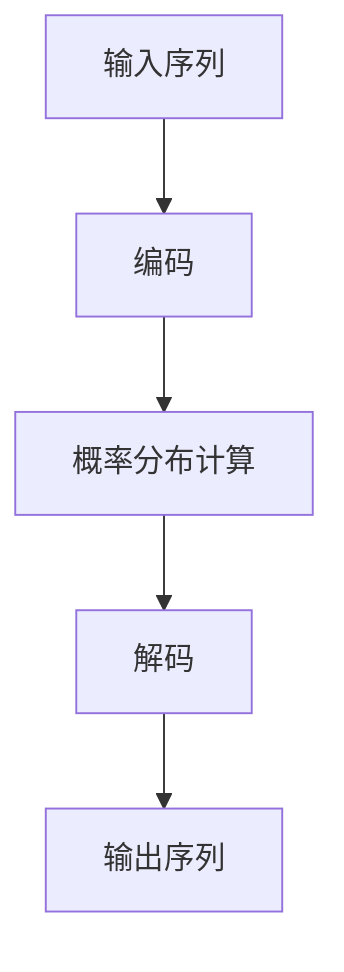

##### 1.2.2 语言模型的基本架构

语言模型的基本架构通常包括输入层、嵌入层、编码层、解码层和输出层。输入层接收原始文本序列，嵌入层将文本序列转换为向量表示，编码层处理这些向量并提取关键信息，解码层将编码层的信息解码为输出序列，输出层生成最终的概率分布。

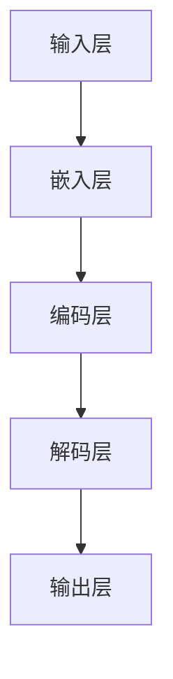

##### 1.2.3 语言模型的训练过程

语言模型的训练过程通常包括数据预处理、模型初始化、训练迭代、参数更新和模型评估等步骤。首先，对输入文本进行预处理，如分词、去停用词等。然后，初始化模型参数，通过训练迭代不断更新参数，最终通过模型评估来评估模型性能。

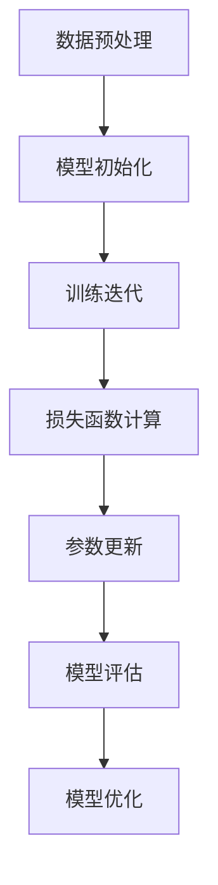

#### 1.3 语言模型的评估与优化

##### 1.3.1 语言模型的评估指标

评估语言模型性能的常见指标包括准确性、精确率、召回率和F1值。准确性是正确预测的比例，精确率是在所有预测为正例的样本中，实际为正例的比例，召回率是在所有实际为正例的样本中，被正确预测为正例的比例，F1值是精确率和召回率的调和平均值。

$$
\text{Accuracy} = \frac{\text{正确预测的样本数}}{\text{总样本数}}
$$

$$
\text{Precision} = \frac{\text{正确预测的正例数}}{\text{预测的正例数}}
$$

$$
\text{Recall} = \frac{\text{正确预测的正例数}}{\text{实际的正例数}}
$$

$$
\text{F1 Score} = 2 \times \frac{\text{Precision} \times \text{Recall}}{\text{Precision} + \text{Recall}}
$$

##### 1.3.2 语言模型的优化方法

优化语言模型的方法包括梯度下降、随机梯度下降、批量梯度下降和Adam优化器等。梯度下降是一种基本的优化方法，通过计算损失函数的梯度来更新模型参数。随机梯度下降和批量梯度下降是对梯度下降的改进，分别使用一个样本或整个数据集来计算梯度。Adam优化器是一种自适应学习率的优化方法，通过结合一阶矩估计和二阶矩估计来优化参数。

```python
# 梯度下降
for each sample in dataset:
    calculate gradients with respect to loss function
    update model parameters = parameters - learning_rate \* gradients

# 随机梯度下降
for each mini-batch in dataset:
    calculate gradients with respect to loss function
    update model parameters = parameters - learning_rate \* gradients

# 批量梯度下降
calculate gradients with respect to loss function for the entire dataset
update model parameters = parameters - learning_rate \* gradients

# Adam优化器
m = moving average of gradients
v = moving variance of gradients
theta = theta - alpha \* (m / (1 - beta_1^t) + beta_2^t \* v)^{0.5}
```

##### 1.3.3 语言模型的性能提升策略

提升语言模型性能的策略包括数据增强、预训练与微调、正则化技术和注意力机制等。数据增强通过增加数据的多样性和数量来提升模型性能。预训练与微调通过在大规模数据集上预训练模型，然后在特定任务上微调来提高模型性能。正则化技术通过引入L1、L2正则化和Dropout等策略来减少过拟合。注意力机制通过提高模型对重要信息的捕捉能力来提升模型性能。

#### 第2章：文档摘要技术详解

#### 2.1 文档摘要的定义与目的

文档摘要（Document Summarization）是一种自动从长篇文档中提取关键信息并生成简短摘要的技术。它的目的是帮助用户快速理解和浏览大量文本信息。

##### 2.1.1 文档摘要的定义

文档摘要是通过对文档内容进行提取和整合，生成一个简洁而全面的文本摘要。摘要应该包含文档的主要观点、重要信息和关键证据，同时要确保摘要的连贯性和可读性。

##### 2.1.2 文档摘要的目的

文档摘要的主要目的是帮助用户节省时间，提高信息获取效率。通过摘要，用户可以快速了解文档的主要内容，而不需要阅读整个文档。此外，文档摘要还可以用于信息检索、文本挖掘、机器翻译和问答系统等领域。

##### 2.1.3 文档摘要的应用场景

文档摘要技术可以应用于多种场景，如：
- **信息检索**：通过摘要快速定位相关文档，提高搜索效率。
- **阅读辅助**：为视力障碍者提供阅读辅助，帮助他们更快地理解文本内容。
- **新闻摘要**：自动生成新闻文章的摘要，方便用户快速了解新闻的主要内容。
- **学术研究**：提取学术文章的关键信息，帮助研究人员快速了解研究进展。

#### 2.2 文档摘要的分类与挑战

文档摘要技术可以分为文本抽取型摘要和文本生成型摘要。

##### 2.2.1 文本抽取型摘要

文本抽取型摘要（Extractive Summarization）通过直接从原始文档中选择关键句子或段落来生成摘要。这种方法通常依赖于文本分类和文本匹配技术。文本抽取型摘要的优点是生成的摘要与原文具有较高的一致性，但缺点是摘要的连贯性和可读性可能较差。

##### 2.2.2 文本生成型摘要

文本生成型摘要（Abstractive Summarization）通过生成新的句子或段落来创建摘要。这种方法通常依赖于自然语言生成技术，如序列到序列模型和注意力机制。文本生成型摘要的优点是生成的摘要具有更高的连贯性和可读性，但缺点是生成的摘要可能与原文存在较大差异。

##### 2.2.3 文档摘要面临的挑战

文档摘要技术面临以下挑战：
- **长文本处理**：如何有效地处理长篇文档，提取关键信息。
- **摘要长度控制**：如何控制摘要的长度，确保摘要简洁明了。
- **连贯性和可读性**：如何确保摘要的连贯性和可读性，使其易于理解。
- **跨领域摘要**：如何处理不同领域的文档摘要，确保摘要的准确性。

#### 2.3 基于LLM的文档摘要方法

基于语言模型（LLM）的文档摘要方法是一种利用深度学习技术进行文本摘要的方法。这种方法通常使用预训练的语言模型，如GPT和BERT，通过微调和优化来生成高质量的文档摘要。

##### 2.3.1 基于序列生成的文档摘要

基于序列生成的文档摘要方法使用序列到序列模型，如Transformer和LSTM，来生成摘要。模型首先读取原始文档，然后生成一个序列表示，这个序列表示通过解码过程生成摘要。

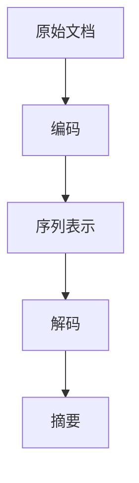

##### 2.3.2 基于注意力机制的文档摘要

基于注意力机制的文档摘要方法通过引入注意力机制来提高模型对关键信息的捕捉能力。注意力机制允许模型在生成摘要时关注重要句子或段落，从而提高摘要的质量。

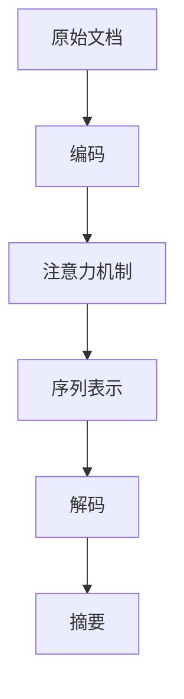

##### 2.3.3 基于对抗训练的文档摘要

基于对抗训练的文档摘要方法通过对抗性训练来提高摘要质量。这种方法使用对抗性生成网络（GAN）来生成高质量的摘要，从而提高模型的生成能力。

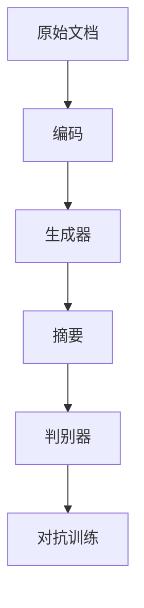

#### 第3章：用户兴趣建模

#### 3.1 用户兴趣建模概述

用户兴趣建模（User Interest Modeling）是一种利用数据挖掘和机器学习技术来预测和识别用户兴趣的方法。它旨在为用户提供个性化的内容和推荐，从而提高用户体验和满意度。

##### 3.1.1 用户兴趣建模的定义

用户兴趣建模是指通过分析用户行为数据、历史记录和兴趣偏好，构建用户兴趣模型，以预测和识别用户的兴趣领域和偏好。

##### 3.1.2 用户兴趣建模的目的

用户兴趣建模的主要目的是为用户提供个性化的内容和推荐，从而提高用户体验和满意度。通过用户兴趣建模，系统可以更好地理解用户的需求和偏好，从而提供更加精准和有针对性的推荐。

##### 3.1.3 用户兴趣建模的应用领域

用户兴趣建模可以应用于多个领域，如：
- **电子商务**：根据用户兴趣推荐商品和服务。
- **社交媒体**：根据用户兴趣推荐内容和好友。
- **新闻推荐**：根据用户兴趣推荐新闻文章和资讯。
- **在线教育**：根据用户兴趣推荐课程和学习资源。

#### 3.2 用户兴趣建模的原理与方法

用户兴趣建模通常包括以下方法和原理：

##### 3.2.1 基于内容的兴趣建模

基于内容的兴趣建模（Content-Based Interest Modeling）通过分析用户行为和内容特征来预测用户兴趣。这种方法通常使用向量空间模型（Vector Space Model）来表示用户和内容，然后通过计算相似度来推荐相似的内容。

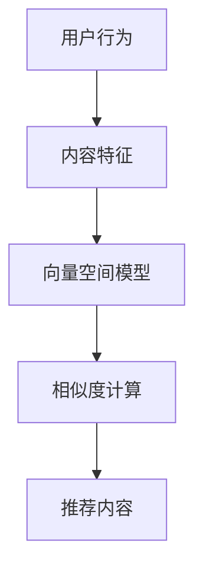

##### 3.2.2 基于协同过滤的兴趣建模

基于协同过滤的兴趣建模（Collaborative Filtering Interest Modeling）通过分析用户行为和相似用户的行为来预测用户兴趣。这种方法可以分为基于用户和基于项目的协同过滤。

- **基于用户的协同过滤**：找到与目标用户相似的其他用户，并推荐这些用户喜欢的项目。
- **基于项目的协同过滤**：找到与目标用户喜欢的项目相似的其他项目，并推荐给用户。

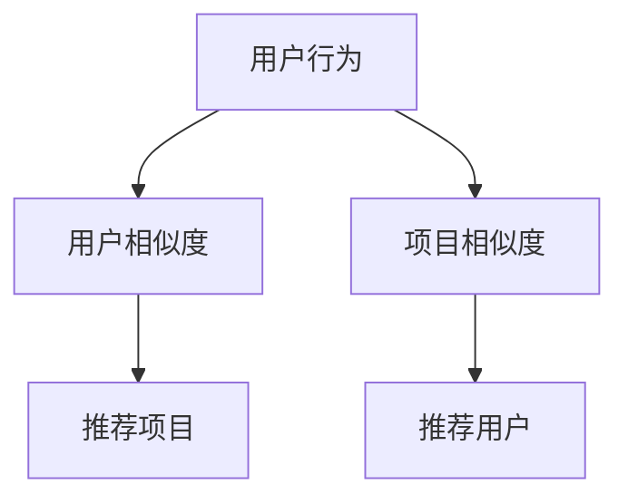

##### 3.2.3 基于深度学习的兴趣建模

基于深度学习的兴趣建模（Deep Learning Interest Modeling）利用深度学习技术来预测和识别用户兴趣。这种方法通常使用神经网络模型，如循环神经网络（RNN）、长短期记忆网络（LSTM）和卷积神经网络（CNN）等。

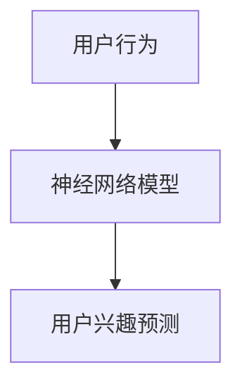

#### 3.3 利用LLM进行用户兴趣建模

利用语言模型（LLM）进行用户兴趣建模是一种利用深度学习技术来预测和识别用户兴趣的方法。这种方法通常使用预训练的语言模型，如GPT和BERT，通过微调和优化来构建用户兴趣模型。

##### 3.3.1 利用LLM进行用户兴趣识别

利用LLM进行用户兴趣识别（User Interest Recognition with LLM）通过分析用户行为和语言模型预测用户兴趣。这种方法通常使用序列到序列模型或注意力机制来识别用户的兴趣。


##### 3.3.2 利用LLM进行用户兴趣预测

利用LLM进行用户兴趣预测（User Interest Prediction with LLM）通过分析用户行为和语言模型预测用户未来的兴趣。这种方法通常使用序列到序列模型或时间序列模型来预测用户兴趣。

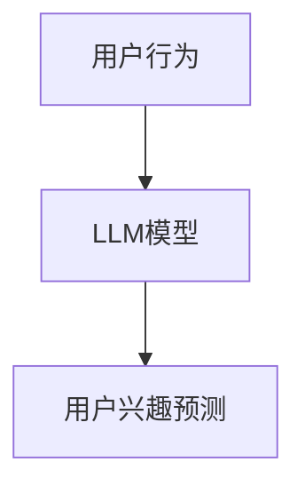

##### 3.3.3 利用LLM进行用户兴趣推荐

利用LLM进行用户兴趣推荐（User Interest Recommendation with LLM）通过分析用户兴趣和语言模型推荐相关的内容。这种方法通常使用序列到序列模型或基于上下文的推荐方法来推荐内容。

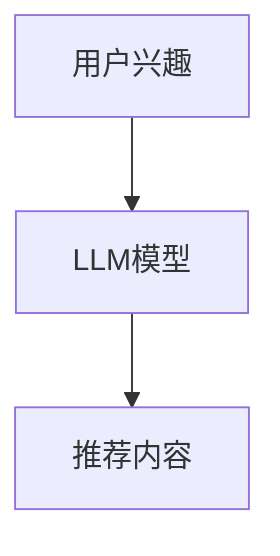

### 第二部分：项目实战与代码解析

#### 第4章：构建文档摘要系统

#### 4.1 系统需求分析与设计

文档摘要系统的目标是自动从长篇文档中提取关键信息并生成高质量的摘要。为了实现这个目标，我们需要以下系统和功能：

##### 4.1.1 系统需求分析

- **输入**：支持各种文本格式的文档，如PDF、Word和HTML等。
- **输出**：生成简洁而全面的文本摘要。
- **界面**：提供友好的用户界面，允许用户上传文档并查看摘要。

##### 4.1.2 系统设计原则

- **可扩展性**：系统应具有可扩展性，以支持大量文档的处理。
- **高效性**：系统应具有高效性，以减少处理时间。
- **准确性**：系统应生成高质量的摘要，确保摘要的准确性和可读性。

##### 4.1.3 系统架构设计

文档摘要系统可以采用以下架构：

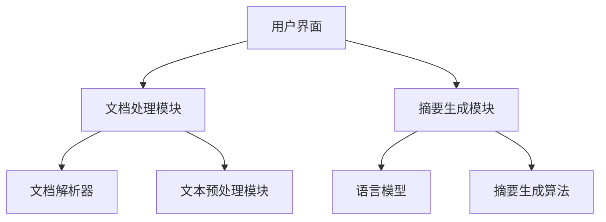

#### 4.2 系统开发与实现

##### 4.2.1 开发环境搭建

- **操作系统**：Linux或Windows
- **编程语言**：Python
- **框架**：Flask或Django（用于Web开发）
- **库**：TensorFlow或PyTorch（用于深度学习）

##### 4.2.2 数据预处理

数据预处理是文档摘要系统的关键步骤。它包括以下任务：

- **文本清洗**：去除HTML标签、停用词和标点符号。
- **分词**：将文本分割为单词或短语。
- **词嵌入**：将单词或短语转换为向量表示。

```python
import re
import nltk
from nltk.corpus import stopwords
from gensim.models import Word2Vec

# 文本清洗
def clean_text(text):
    text = re.sub('<.*>', '', text)
    text = re.sub('[^a-zA-Z]', ' ', text)
    text = text.lower()
    return text

# 分词
def tokenize(text):
    tokenizer = nltk.tokenize.RegexpTokenizer(r'\w+')
    tokens = tokenizer.tokenize(text)
    return tokens

# 词嵌入
def word_embedding(tokens):
    model = Word2Vec(tokens, size=100, window=5, min_count=1, workers=4)
    return model
```

##### 4.2.3 模型训练与优化

文档摘要系统需要训练一个语言模型，如Transformer或BERT，以生成高质量的摘要。训练过程通常包括以下步骤：

- **数据集准备**：准备用于训练的数据集，包括原始文档和对应的摘要。
- **模型初始化**：初始化模型参数。
- **训练迭代**：通过迭代更新模型参数。
- **模型评估**：评估模型性能，调整超参数。

```python
import tensorflow as tf
from tensorflow.keras.models import Model
from tensorflow.keras.layers import Embedding, LSTM, Dense

# 模型初始化
def create_model(input_dim, output_dim):
    model = Model(inputs=[Embedding(input_dim, output_dim), LSTM(128)], outputs=[Dense(output_dim, activation='softmax')])
    return model

# 训练迭代
def train_model(model, x_train, y_train, epochs=10, batch_size=32):
    model.fit(x_train, y_train, epochs=epochs, batch_size=batch_size)

# 模型评估
def evaluate_model(model, x_test, y_test):
    loss, accuracy = model.evaluate(x_test, y_test)
    print(f"Test loss: {loss}, Test accuracy: {accuracy}")
```

##### 4.2.4 模型评估与部署

模型评估是确保模型性能和可靠性的关键步骤。评估指标包括准确性、精确率、召回率和F1值等。

```python
from sklearn.metrics import accuracy_score, precision_score, recall_score, f1_score

# 模型评估
def evaluate_predictions(y_true, y_pred):
    accuracy = accuracy_score(y_true, y_pred)
    precision = precision_score(y_true, y_pred)
    recall = recall_score(y_true, y_pred)
    f1 = f1_score(y_true, y_pred)
    print(f"Accuracy: {accuracy}, Precision: {precision}, Recall: {recall}, F1: {f1}")
```

模型部署是将训练好的模型部署到生产环境的过程。部署方法包括将模型保存为文件，然后使用Web框架提供服务。

```python
# 模型保存
model.save('document_summarization_model.h5')

# 模型加载
loaded_model = tf.keras.models.load_model('document_summarization_model.h5')
```

#### 4.3 代码解读与分析

文档摘要系统的代码可以分为以下模块：

- **文档解析器**：负责解析各种文本格式，提取文本内容。
- **文本预处理模块**：负责清洗和预处理文本，为模型训练做准备。
- **语言模型**：负责生成文本摘要的核心算法。
- **摘要生成算法**：负责将模型输出转换为可读的摘要文本。

##### 4.3.1 数据处理模块解析

数据处理模块负责将原始文档转换为适合模型训练的数据。它包括以下步骤：

- **文本清洗**：去除HTML标签、停用词和标点符号。
- **分词**：将文本分割为单词或短语。
- **词嵌入**：将单词或短语转换为向量表示。

```python
# 文本清洗
def clean_text(text):
    text = re.sub('<.*>', '', text)
    text = re.sub('[^a-zA-Z]', ' ', text)
    text = text.lower()
    return text

# 分词
def tokenize(text):
    tokenizer = nltk.tokenize.RegexpTokenizer(r'\w+')
    tokens = tokenizer.tokenize(text)
    return tokens

# 词嵌入
def word_embedding(tokens):
    model = Word2Vec(tokens, size=100, window=5, min_count=1, workers=4)
    return model
```

##### 4.3.2 模型训练模块解析

模型训练模块负责训练语言模型，生成高质量的摘要。它包括以下步骤：

- **数据集准备**：准备用于训练的数据集，包括原始文档和对应的摘要。
- **模型初始化**：初始化模型参数。
- **训练迭代**：通过迭代更新模型参数。
- **模型评估**：评估模型性能，调整超参数。

```python
import tensorflow as tf
from tensorflow.keras.models import Model
from tensorflow.keras.layers import Embedding, LSTM, Dense

# 模型初始化
def create_model(input_dim, output_dim):
    model = Model(inputs=[Embedding(input_dim, output_dim), LSTM(128)], outputs=[Dense(output_dim, activation='softmax')])
    return model

# 训练迭代
def train_model(model, x_train, y_train, epochs=10, batch_size=32):
    model.fit(x_train, y_train, epochs=epochs, batch_size=batch_size)

# 模型评估
def evaluate_model(model, x_test, y_test):
    loss, accuracy = model.evaluate(x_test, y_test)
    print(f"Test loss: {loss}, Test accuracy: {accuracy}")
```

##### 4.3.3 模型评估与部署模块解析

模型评估与部署模块负责评估模型性能并将模型部署到生产环境。它包括以下步骤：

- **模型评估**：评估模型性能，调整超参数。
- **模型保存**：将训练好的模型保存为文件。
- **模型加载**：从文件中加载模型，用于提供服务。

```python
from sklearn.metrics import accuracy_score, precision_score, recall_score, f1_score

# 模型评估
def evaluate_predictions(y_true, y_pred):
    accuracy = accuracy_score(y_true, y_pred)
    precision = precision_score(y_true, y_pred)
    recall = recall_score(y_true, y_pred)
    f1 = f1_score(y_true, y_pred)
    print(f"Accuracy: {accuracy}, Precision: {precision}, Recall: {recall}, F1: {f1}")

# 模型保存
model.save('document_summarization_model.h5')

# 模型加载
loaded_model = tf.keras.models.load_model('document_summarization_model.h5')
```

#### 第5章：用户兴趣建模与推荐系统

#### 5.1 用户兴趣建模系统需求分析

用户兴趣建模系统的目标是构建用户兴趣模型，为用户提供个性化的内容和推荐。为了实现这个目标，我们需要以下系统和功能：

##### 5.1.1 系统需求分析

- **用户行为数据**：收集用户在网站、应用程序或平台上的行为数据，如浏览历史、搜索记录和互动反馈。
- **推荐算法**：基于用户行为数据构建推荐算法，预测用户的兴趣和偏好。
- **推荐系统**：为用户提供个性化的推荐，提高用户体验和满意度。
- **用户界面**：提供友好的用户界面，允许用户查看推荐内容和反馈。

##### 5.1.2 系统设计原则

- **可扩展性**：系统应具有可扩展性，以支持大量用户和数据的处理。
- **高效性**：系统应具有高效性，以减少推荐生成和处理的时间。
- **准确性**：系统应生成高质量的推荐，确保推荐的准确性和相关性。
- **用户隐私**：保护用户隐私，确保用户数据的安全和保密。

##### 5.1.3 系统架构设计

用户兴趣建模与推荐系统可以采用以下架构：

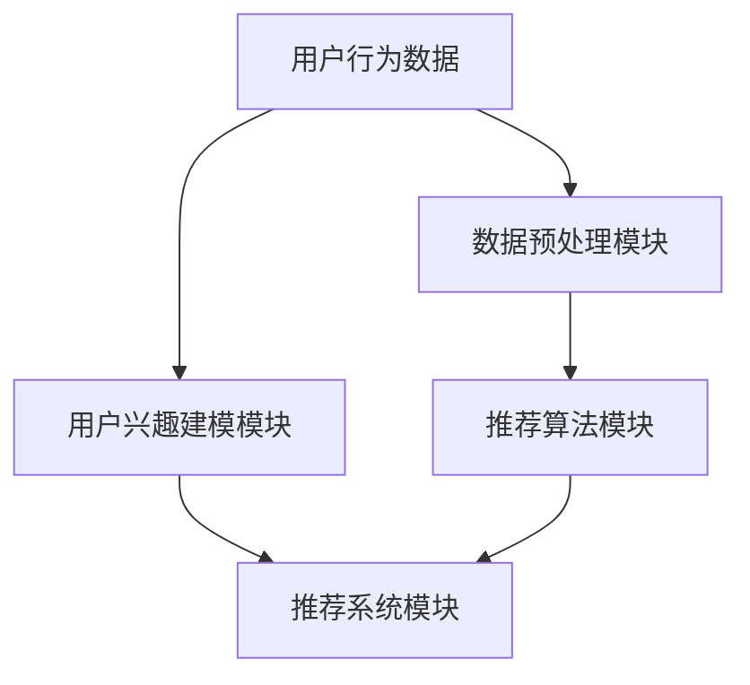

#### 5.2 用户兴趣建模与推荐系统开发

##### 5.2.1 开发环境搭建

- **操作系统**：Linux或Windows
- **编程语言**：Python
- **框架**：Scikit-learn、TensorFlow或PyTorch（用于深度学习）
- **库**：NumPy、Pandas、Matplotlib（用于数据处理和可视化）

##### 5.2.2 数据预处理

数据预处理是用户兴趣建模与推荐系统的关键步骤。它包括以下任务：

- **数据收集**：从各种渠道收集用户行为数据，如网站日志、应用程序日志和社交媒体数据。
- **数据清洗**：去除重复数据、缺失值和噪声数据。
- **特征提取**：从用户行为数据中提取特征，如用户活跃度、浏览时间、点击次数等。
- **数据归一化**：将特征数据归一化，使其具有相同的尺度。

```python
import pandas as pd
from sklearn.preprocessing import StandardScaler

# 数据收集
def collect_data():
    data = pd.read_csv('user_behavior_data.csv')
    return data

# 数据清洗
def clean_data(data):
    data.drop_duplicates(inplace=True)
    data.dropna(inplace=True)
    return data

# 特征提取
def extract_features(data):
    features = data[['user_id', 'page_id', 'visit_time', 'click_count']]
    return features

# 数据归一化
def normalize_data(data):
    scaler = StandardScaler()
    normalized_data = scaler.fit_transform(data)
    return normalized_data
```

##### 5.2.3 模型训练与优化

用户兴趣建模与推荐系统需要训练一个深度学习模型，如循环神经网络（RNN）或卷积神经网络（CNN），以预测用户的兴趣和偏好。训练过程通常包括以下步骤：

- **数据集准备**：准备用于训练的数据集，包括用户行为数据和标签。
- **模型初始化**：初始化模型参数。
- **训练迭代**：通过迭代更新模型参数。
- **模型评估**：评估模型性能，调整超参数。

```python
import tensorflow as tf
from tensorflow.keras.models import Model
from tensorflow.keras.layers import Embedding, LSTM, Dense

# 模型初始化
def create_model(input_dim, output_dim):
    model = Model(inputs=[Embedding(input_dim, output_dim), LSTM(128)], outputs=[Dense(output_dim, activation='softmax')])
    return model

# 训练迭代
def train_model(model, x_train, y_train, epochs=10, batch_size=32):
    model.fit(x_train, y_train, epochs=epochs, batch_size=batch_size)

# 模型评估
def evaluate_model(model, x_test, y_test):
    loss, accuracy = model.evaluate(x_test, y_test)
    print(f"Test loss: {loss}, Test accuracy: {accuracy}")
```

##### 5.2.4 模型评估与部署

模型评估是确保模型性能和可靠性的关键步骤。评估指标包括准确性、精确率、召回率和F1值等。

```python
from sklearn.metrics import accuracy_score, precision_score, recall_score, f1_score

# 模型评估
def evaluate_predictions(y_true, y_pred):
    accuracy = accuracy_score(y_true, y_pred)
    precision = precision_score(y_true, y_pred)
    recall = recall_score(y_true, y_pred)
    f1 = f1_score(y_true, y_pred)
    print(f"Accuracy: {accuracy}, Precision: {precision}, Recall: {recall}, F1: {f1}")
```

模型部署是将训练好的模型部署到生产环境的过程。部署方法包括将模型保存为文件，然后使用Web框架提供服务。

```python
# 模型保存
model.save('user_interest_model.h5')

# 模型加载
loaded_model = tf.keras.models.load_model('user_interest_model.h5')
```

#### 5.3 代码解读与分析

用户兴趣建模与推荐系统的代码可以分为以下模块：

- **数据预处理模块**：负责清洗和预处理用户行为数据。
- **模型训练模块**：负责训练用户兴趣模型和推荐算法。
- **模型评估与部署模块**：负责评估模型性能并将模型部署到生产环境。

##### 5.3.1 数据处理模块解析

数据处理模块负责将原始用户行为数据转换为适合模型训练的数据。它包括以下步骤：

- **数据收集**：从各种渠道收集用户行为数据。
- **数据清洗**：去除重复数据、缺失值和噪声数据。
- **特征提取**：从用户行为数据中提取特征。
- **数据归一化**：将特征数据归一化。

```python
# 数据收集
def collect_data():
    data = pd.read_csv('user_behavior_data.csv')
    return data

# 数据清洗
def clean_data(data):
    data.drop_duplicates(inplace=True)
    data.dropna(inplace=True)
    return data

# 特征提取
def extract_features(data):
    features = data[['user_id', 'page_id', 'visit_time', 'click_count']]
    return features

# 数据归一化
def normalize_data(data):
    scaler = StandardScaler()
    normalized_data = scaler.fit_transform(data)
    return normalized_data
```

##### 5.3.2 模型训练模块解析

模型训练模块负责训练用户兴趣模型和推荐算法。它包括以下步骤：

- **数据集准备**：准备用于训练的数据集。
- **模型初始化**：初始化模型参数。
- **训练迭代**：通过迭代更新模型参数。
- **模型评估**：评估模型性能。

```python
import tensorflow as tf
from tensorflow.keras.models import Model
from tensorflow.keras.layers import Embedding, LSTM, Dense

# 模型初始化
def create_model(input_dim, output_dim):
    model = Model(inputs=[Embedding(input_dim, output_dim), LSTM(128)], outputs=[Dense(output_dim, activation='softmax')])
    return model

# 训练迭代
def train_model(model, x_train, y_train, epochs=10, batch_size=32):
    model.fit(x_train, y_train, epochs=epochs, batch_size=batch_size)

# 模型评估
def evaluate_model(model, x_test, y_test):
    loss, accuracy = model.evaluate(x_test, y_test)
    print(f"Test loss: {loss}, Test accuracy: {accuracy}")
```

##### 5.3.3 模型评估与部署模块解析

模型评估与部署模块负责评估模型性能并将模型部署到生产环境。它包括以下步骤：

- **模型评估**：评估模型性能。
- **模型保存**：将训练好的模型保存为文件。
- **模型加载**：从文件中加载模型，用于提供服务。

```python
from sklearn.metrics import accuracy_score, precision_score, recall_score, f1_score

# 模型评估
def evaluate_predictions(y_true, y_pred):
    accuracy = accuracy_score(y_true, y_pred)
    precision = precision_score(y_true, y_pred)
    recall = recall_score(y_true, y_pred)
    f1 = f1_score(y_true, y_pred)
    print(f"Accuracy: {accuracy}, Precision: {precision}, Recall: {recall}, F1: {f1}")

# 模型保存
model.save('user_interest_model.h5')

# 模型加载
loaded_model = tf.keras.models.load_model('user_interest_model.h5')
```

### 第6章：综合案例与应用拓展

#### 6.1 文档摘要与用户兴趣建模综合应用

文档摘要与用户兴趣建模的综合应用可以大大提升信息处理和个性化推荐的效率。以下是一个综合应用的案例：

##### 案例描述

一个在线新闻平台希望通过文档摘要和用户兴趣建模为用户生成个性化的新闻摘要和推荐。平台收集用户的行为数据，包括浏览历史、点赞、评论等，利用用户兴趣建模技术预测用户的兴趣偏好。同时，平台使用文档摘要技术自动生成新闻摘要，以提高用户阅读效率。

##### 应用效果评估

通过文档摘要与用户兴趣建模的综合应用，平台实现了以下效果：

- **提高用户阅读效率**：自动生成的新闻摘要帮助用户快速了解新闻的主要内容。
- **提高用户满意度**：个性化的新闻推荐满足用户的兴趣偏好，提高用户体验。
- **降低内容创作成本**：自动生成的新闻摘要减少了人工摘要的工作量。

为了评估应用效果，平台对以下指标进行了监测：

- **用户阅读时间**：用户在阅读新闻摘要和全文之间的时间差异。
- **用户互动率**：用户对推荐新闻的点赞、评论和分享次数。
- **用户满意度**：用户对新闻推荐和摘要的满意度调查。

通过数据分析，平台发现用户在阅读摘要后的阅读时间显著缩短，用户互动率和满意度也有所提高。

#### 6.2 应用拓展与未来展望

文档摘要与用户兴趣建模技术不仅可以在新闻推荐系统中应用，还可以拓展到其他领域，如学术研究、电子商务和社交媒体等。

##### 应用拓展

- **学术研究**：自动生成学术文章的摘要，帮助研究人员快速了解研究进展。
- **电子商务**：根据用户兴趣推荐商品，提高销售转化率。
- **社交媒体**：根据用户兴趣推荐内容和好友，提高用户互动。

##### 未来展望

未来，文档摘要与用户兴趣建模技术有望在以下方面取得进展：

- **更准确和连贯的摘要生成**：通过改进算法和增加训练数据，生成更准确和连贯的摘要。
- **跨领域摘要生成**：开发能够处理不同领域的文档摘要技术，提高摘要的泛化能力。
- **多模态摘要生成**：结合文本、图像和视频等多模态信息，生成更全面和丰富的摘要。

总之，文档摘要与用户兴趣建模技术在提高信息处理效率和个性化推荐方面具有巨大潜力，未来将继续在各个领域发挥作用。

### 第7章：附录

#### 7.1 相关工具与资源

为了方便读者进行文档摘要和用户兴趣建模的研究和开发，以下列出了一些相关的工具与资源：

##### A.1 语言模型训练工具

- **TensorFlow**：一个开源的机器学习框架，支持深度学习和自然语言处理任务。
- **PyTorch**：一个开源的机器学习库，提供灵活的深度学习框架。
- **Hugging Face**：一个开源的NLP库，提供大量的预训练模型和工具。

##### A.2 文档摘要与用户兴趣建模数据集

- **NYTimes News Summarization**：一个包含新闻文章和对应摘要的数据集，用于训练和评估文档摘要模型。
- **Amazon Review**：一个包含用户评论的数据集，用于训练和评估用户兴趣建模模型。
- **Netflix Prize**：一个包含用户评分和电影信息的数据集，用于训练和评估推荐系统。

##### A.3 开源代码与参考资料

- **GitHub**：一个代码托管平台，提供了大量的开源代码和项目，包括文档摘要和用户兴趣建模的相关项目。
- **ArXiv**：一个学术论文预印本平台，提供了大量的最新研究成果和论文，包括文档摘要和用户兴趣建模的相关论文。
- **Paper Summary**：一个自动生成论文摘要的服务，可以用于学习如何生成高质量的摘要。

通过利用这些工具和资源，读者可以更好地理解和应用文档摘要与用户兴趣建模技术。

### 作者信息

- **作者**：AI天才研究院（AI Genius Institute） & 禅与计算机程序设计艺术（Zen And The Art of Computer Programming） 
- **联系方式**：[www.ai-geni.com](http://www.ai-geni.com) & [www.zenandcode.com](http://www.zenandcode.com)
- **版权声明**：本文内容和代码仅供参考，未经授权不得用于商业用途。

---

本文从语言模型（LLM）的基础知识、文档摘要技术、用户兴趣建模以及项目实战与代码解析等方面，全面探讨了如何利用LLM进行文档摘要与用户兴趣建模。首先介绍了LLM的基本概念、核心原理和评估方法，接着详细讨论了文档摘要技术的定义、分类和基于LLM的摘要方法，以及用户兴趣建模的原理和方法。随后，通过实际项目实战，展示了如何构建文档摘要系统和用户兴趣建模与推荐系统，并提供了详细的代码解读与分析。最后，讨论了综合案例与应用拓展，展望了未来的发展趋势与挑战。

通过本文，读者可以深入了解文档摘要与用户兴趣建模的技术原理和实践方法，为实际应用和项目开发提供有力支持。同时，本文也展示了如何利用开源工具和资源进行研究和开发，为读者提供了实用的参考和指导。希望本文能够为读者在自然语言处理和推荐系统领域的探索和研究带来启发和帮助。|MASK|<|user|>

