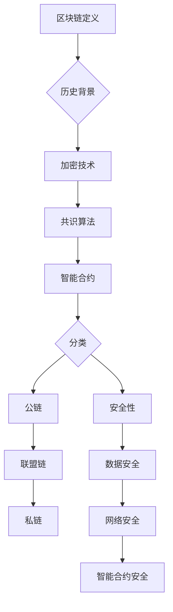

                 

### 第一部分：区块链基础

#### 第1章：区块链概述

> **关键词**：区块链、分布式账本、加密技术、共识算法、智能合约

> **摘要**：
本章节将介绍区块链的基本概念、历史背景、核心特点和主要分类，为读者提供对区块链技术整体的初步认识。

## 区块链概述

区块链是一种分布式账本技术，其核心理念是通过去中心化的方式，利用加密算法和共识算法确保数据的完整性和安全性。自2008年比特币（Bitcoin）的诞生以来，区块链技术引起了全球范围内的广泛关注和深入研究。

### 1.1 区块链的定义与历史背景

#### 定义

区块链是一种数据结构，它通过加密技术和分布式网络来实现数据的存储和传输。每个区块包含一定数量的交易记录，这些区块通过哈希函数和链接机制按时间顺序串联形成链式结构。

#### 历史背景

2008年，一位化名为中本聪（Satoshi Nakamoto）的人发表了比特币白皮书，提出了区块链技术的概念。比特币作为第一个基于区块链的数字货币，迅速引起了全球关注。此后，越来越多的区块链项目和应用相继涌现，包括智能合约、供应链管理、身份验证等。

### 1.2 区块链的核心概念

#### 分布式账本

区块链通过分布式网络实现了数据的存储和传输，无需中心化服务器。每个节点都保存一份完整的区块链数据，实现了去中心化的数据管理。

#### 加密技术

区块链使用加密算法来确保数据的完整性和安全性。哈希函数、数字签名和公钥加密等技术被广泛应用于区块链中。

#### 共识算法

共识算法是区块链网络中节点之间达成一致的方法。不同的共识算法决定了区块链的吞吐量、安全性和去中心化程度。

#### 智能合约

智能合约是一种自动执行合同条款的计算机程序，它运行在区块链网络上。智能合约使得交易和合约执行更加高效和透明。

### 1.3 区块链的分类

#### 按用途分类

- 数字货币：如比特币、以太坊等。
- 应用型区块链：如Hyperledger Fabric、EOS等，主要用于企业级应用。
- 状态通道：用于提高交易速度和降低交易费用。

#### 按网络结构分类

- 公链：开放给公众的区块链网络，如比特币、以太坊。
- 联盟链：由多个机构或组织共同维护的区块链网络，如Ripple。
- 私链：仅限特定机构或个人使用的区块链网络。

### 1.4 区块链的安全机制

#### 数据安全性

区块链通过加密技术确保数据的完整性和不可篡改性。每个区块都包含前一个区块的哈希值，形成链式结构，任何篡改都会导致整个链的断裂。

#### 网络安全性

区块链网络使用共识算法来确保节点的诚实性和网络的稳定性。恶意节点将被网络排斥，确保整个网络的正常运行。

#### 智能合约安全性

智能合约的编写和执行需要遵循严格的规范。开发者在编写智能合约时需要仔细审查代码，避免潜在的安全漏洞。

通过以上对区块链概述的详细介绍，读者可以对区块链技术有一个全面的理解。接下来，我们将深入探讨区块链的工作原理、核心技术和应用场景。让我们继续探索这个充满潜力的领域。

---

**Mermaid 流程图：**



---

#### 1.1 区块链的定义与历史背景

区块链是一种分布式账本技术，其核心理念是通过去中心化的方式，利用加密技术和共识算法确保数据的完整性和安全性。每个区块包含一定数量的交易记录，这些区块通过哈希函数和链接机制按时间顺序串联形成链式结构。

区块链的起源可以追溯到2008年，当时一位化名为中本聪（Satoshi Nakamoto）的人发布了比特币白皮书，提出了区块链技术的概念。比特币作为第一个基于区块链的数字货币，迅速引起了全球的关注。中本聪的设计理念是创造一种不受任何中央机构控制的货币，通过去中心化的区块链网络实现价值的传递。

#### 区块链的历史发展

1. **2008-2009年**：比特币白皮书的发布和比特币网络的启动，标志着区块链技术的诞生。
2. **2010-2013年**：比特币价格的波动和区块链技术的不断发展，吸引了越来越多的关注。
3. **2014-2017年**：以太坊的诞生和智能合约的引入，使得区块链技术开始应用于更广泛的领域。
4. **2018年至今**：区块链技术逐渐从实验性阶段走向实际应用，越来越多的企业和组织开始探索区块链技术。

#### 区块链的核心概念

区块链的核心概念包括以下几个方面：

1. **分布式账本**：区块链通过分布式网络实现了数据的存储和传输，无需中心化服务器。每个节点都保存一份完整的区块链数据，实现了去中心化的数据管理。
2. **加密技术**：区块链使用加密技术来确保数据的完整性和安全性。常见的加密技术包括哈希函数、数字签名和公钥加密等。
3. **共识算法**：共识算法是区块链网络中节点之间达成一致的方法。不同的共识算法决定了区块链的吞吐量、安全性和去中心化程度。
4. **智能合约**：智能合约是一种自动执行合同条款的计算机程序，它运行在区块链网络上。智能合约使得交易和合约执行更加高效和透明。

### 1.2 区块链的核心概念

#### 分布式账本

区块链通过分布式网络实现了数据的存储和传输，无需中心化服务器。每个节点都保存一份完整的区块链数据，实现了去中心化的数据管理。

分布式账本技术的优势在于：

1. **去中心化**：分布式账本消除了中心化服务器的依赖，提高了系统的可靠性和容错性。
2. **透明性**：所有节点都保存相同的数据，数据的透明性和公开性得到了保障。
3. **安全性**：由于数据分散存储，单个节点的损坏不会影响整个网络。

#### 加密技术

区块链使用加密技术来确保数据的完整性和安全性。常见的加密技术包括哈希函数、数字签名和公钥加密等。

1. **哈希函数**：哈希函数用于将数据转换为一个固定长度的哈希值。常见的哈希函数包括SHA-256、SHA-3等。
2. **数字签名**：数字签名用于验证消息的来源和完整性。常见的数字签名算法包括RSA、ECDSA等。
3. **公钥加密**：公钥加密用于加密和解密数据。常见的公钥加密算法包括RSA、ECC等。

#### 共识算法

共识算法是区块链网络中节点之间达成一致的方法。不同的共识算法决定了区块链的吞吐量、安全性和去中心化程度。

常见的共识算法包括：

1. **工作量证明（PoW）**：通过计算复杂度来确保节点诚实性和网络稳定性。比特币采用的就是PoW算法。
2. **权益证明（PoS）**：通过持有币的数量和时间来决定记账权。以太坊2.0计划将采用PoS算法。
3. **委托权益证明（DPoS）**：通过代币持有者投票来选举出记账节点。

#### 智能合约

智能合约是一种自动执行合同条款的计算机程序，它运行在区块链网络上。智能合约使得交易和合约执行更加高效和透明。

智能合约的关键特点包括：

1. **自动化**：智能合约在满足特定条件时自动执行，无需人工干预。
2. **透明性**：智能合约的代码和执行过程都是公开透明的。
3. **不可篡改**：智能合约的代码一旦部署，就无法更改，确保了合约的执行一致性。

通过以上对区块链核心概念的详细介绍，读者可以对区块链技术有一个更深入的理解。在接下来的章节中，我们将进一步探讨区块链的工作原理、核心技术以及应用场景。

---

**核心算法原理讲解：**

#### 消息摘要算法（Hash函数）

消息摘要算法（Hash函数）是区块链技术中的核心组件之一，用于确保数据的完整性和安全性。哈希函数是一种将任意长度的输入（即消息）转换成固定长度输出的函数。常见的哈希函数包括SHA-256、SHA-3等。

#### 哈希函数的原理

哈希函数的原理可以通过以下步骤进行描述：

1. **初始化哈希值**：哈希函数在开始处理消息之前，会初始化一个哈希值。
2. **消息分块处理**：将输入的消息分成多个块进行处理。每个块都通过哈希函数进行处理，生成一个新的哈希值。
3. **更新哈希值**：将每个块的哈希值合并，更新哈希值。
4. **输出哈希值**：处理完所有块后，输出最终的哈希值。

以下是一个使用伪代码描述的哈希函数：

```plaintext
function HashMessage(message):
    // 初始化哈希值
    hash_value = initial_hash_value

    // 对消息进行分块处理
    for block in message分成多个块:
        // 对每个块进行哈希处理
        block_hash = HashBlock(block)

        // 更新哈希值
        hash_value = HashValue(hash_value, block_hash)

    return hash_value
```

#### 举例说明

假设我们使用SHA-256哈希函数，对消息 "Hello, World!" 进行哈希处理。

```plaintext
SHA-256("Hello, World!") = "a592ed02ce7c11d3f070e8b65d570a6ce6b09c2d1d0d66d50c3e8c1ef382aae0"
```

通过哈希函数，我们可以将任意长度的消息转换成固定长度的哈希值，确保数据的唯一性和不可篡改性。

#### 哈希函数的应用

哈希函数在区块链技术中有广泛的应用，主要包括以下几个方面：

1. **数据完整性验证**：通过对比数据的哈希值，可以验证数据在传输过程中是否被篡改。
2. **地址生成**：在比特币中，地址是通过用户的公钥哈希值生成的。
3. **区块链链接**：每个区块都包含前一个区块的哈希值，形成链式结构，确保区块链的完整性和不可篡改性。

通过以上对哈希函数的详细讲解，我们可以看到哈希函数在区块链技术中的重要性。在下一章节中，我们将继续探讨数字签名和公钥加密等核心加密技术。

---

### 1.3 区块链的分类

区块链技术的应用范围非常广泛，根据不同的用途和特点，可以将区块链分为多种类型。以下是一些常见的区块链分类：

#### 按用途分类

1. **数字货币**：数字货币是区块链技术最著名的应用之一，如比特币、以太坊等。数字货币通过区块链实现了去中心化的价值传递。
2. **应用型区块链**：应用型区块链主要用于企业级应用，如供应链管理、身份验证、物联网等。这些区块链平台提供了更灵活和定制化的功能。
3. **状态通道**：状态通道是一种用于提高交易速度和降低交易费用的技术。状态通道允许用户在链下进行交易，然后批量提交到区块链上。

#### 按网络结构分类

1. **公链**：公链是开放给公众的区块链网络，任何人都可以参与。公链具有较高的去中心化和安全性，如比特币、以太坊等。
2. **联盟链**：联盟链是由多个机构或组织共同维护的区块链网络。联盟链的参与节点通常是预定的，具有较高的安全性和可控性。
3. **私链**：私链是仅限特定机构或个人使用的区块链网络。私链通常用于企业内部的数据管理和交易。

#### 按共识算法分类

1. **工作量证明（PoW）**：PoW是比特币采用的共识算法，通过计算复杂度来确保节点诚实性和网络稳定性。
2. **权益证明（PoS）**：PoS是通过持有币的数量和时间来决定记账权。PoS相较于PoW具有更高的安全性和能源效率。
3. **委托权益证明（DPoS）**：DPoS是通过代币持有者投票来选举出记账节点。DPoS具有较高的交易速度和去中心化程度。

#### 按应用领域分类

1. **金融领域**：区块链在金融领域有广泛的应用，如跨境支付、去中心化交易所、供应链金融等。
2. **供应链管理**：区块链可以确保供应链数据的透明性和不可篡改性，提高供应链管理的效率。
3. **版权保护**：区块链可以用于版权保护，确保作品的唯一性和归属。
4. **医疗健康**：区块链可以用于医疗数据的存储和共享，提高医疗数据的可靠性和隐私性。
5. **身份验证**：区块链可以用于身份验证，确保身份信息的真实性和安全性。

通过以上分类，我们可以看到区块链技术的多样性和广泛的应用前景。在接下来的章节中，我们将进一步探讨区块链的工作原理、核心技术和应用场景。

---

### 1.4 区块链的安全机制

区块链技术因其去中心化和分布式特性而具有很高的安全性，但仍然面临多种安全挑战。区块链的安全机制主要包括数据安全、网络安全和智能合约安全等方面。

#### 数据安全性

区块链的数据安全性主要依赖于以下技术：

1. **哈希函数**：区块链使用哈希函数确保数据的完整性和不可篡改性。每个区块都包含前一个区块的哈希值，形成一个链式结构。任何篡改都会导致整个链的断裂。
2. **加密技术**：区块链使用加密技术来保护数据。数据在传输和存储过程中都进行加密，确保只有合法用户才能访问。
3. **分布式存储**：区块链的数据存储在分布式网络中的多个节点上，提高了数据的安全性。即使某些节点受到攻击，数据仍然可以恢复。

#### 网络安全性

区块链网络的稳定性是确保其安全性的关键因素。以下是一些提高区块链网络安全的措施：

1. **共识算法**：不同的共识算法决定了区块链的安全性和去中心化程度。选择合适的共识算法可以确保节点的诚实性和网络的稳定性。
2. **分布式网络**：区块链通过分布式网络实现了数据的存储和传输，无需中心化服务器。分布式网络提高了网络的容错性和抗攻击性。
3. **网络安全协议**：区块链网络使用各种网络安全协议，如TLS、IPsec等，确保数据在传输过程中的安全。

#### 智能合约安全性

智能合约是区块链技术的重要组成部分，其安全性至关重要。以下是一些提高智能合约安全的措施：

1. **代码审查**：智能合约的代码需要经过严格的审查，确保没有安全漏洞。代码审查可以采用静态分析和动态分析等方法。
2. **测试与审计**：智能合约在部署前需要进行充分的测试和审计，确保其正确性和安全性。测试和审计可以采用自动化工具和人工审核相结合的方法。
3. **安全编程规范**：智能合约开发需要遵循安全编程规范，如避免使用易受攻击的库和函数，避免代码中的逻辑漏洞等。

#### 常见攻击手段与防范

1. **51%攻击**：攻击者控制了区块链网络中超过50%的算力或权益，可以篡改区块链数据。防范措施包括增加区块链的算力难度、提高区块链的去中心化程度等。
2. **双花攻击**：攻击者同时向两个不同的接收方发送相同金额的币，导致其中一笔交易被撤销。防范措施包括使用多重签名、状态通道等技术。
3. **智能合约漏洞**：智能合约中的漏洞可能导致资金损失或数据泄露。防范措施包括代码审查、测试与审计、安全编程规范等。

通过以上安全机制的介绍，我们可以看到区块链技术具有较高的安全性，但也需要不断改进和加强。在区块链应用的发展过程中，安全机制的完善至关重要。

---

#### 1.2 区块链的工作原理

区块链的工作原理是通过一系列复杂的技术和算法实现的，这些技术和算法共同确保了区块链系统的安全性、透明性和去中心化。下面我们将详细讲解区块链的工作原理，包括数据结构、交易机制、共识算法和智能合约。

##### 数据结构

区块链的数据结构是区块链实现去中心化数据管理的基础。每个区块链都由一系列按时间顺序排列的区块组成，这些区块通过哈希链接形成链式结构。

1. **区块**：每个区块包含以下信息：
   - **区块头**：包含上一个区块的哈希值（用于链接区块）、时间戳、随机数等。
   - **交易数据**：包含一定数量的交易记录。
   - **梅克尔树**：用于确保交易数据的完整性和不可篡改性。
   - **工作量证明**：在PoW共识算法中，包含一个难度值和随机数，用于证明节点的工作量。

2. **链式结构**：每个区块都通过其上一个区块的哈希值与区块链的其他区块链接起来，形成一个不可篡改的链式结构。

##### 交易机制

区块链的交易机制是通过网络中的节点进行交易验证和记录的。

1. **交易**：交易是区块链上价值的转移记录，包括发送方、接收方和交易金额等信息。
2. **交易验证**：每个区块包含一定数量的交易，节点需要验证这些交易的有效性。交易验证过程包括：
   - 验证交易签名：确保交易来自合法的发送方。
   - 验证交易余额：确保发送方有足够的余额进行交易。
   - 验证交易规则：确保交易符合区块链的规则。

3. **交易记录**：验证通过的交易将被记录在区块中，并永久存储在区块链上。

##### 共识算法

共识算法是区块链网络中节点之间达成一致的方法，确保区块链系统的安全性、稳定性和去中心化。

1. **工作量证明（PoW）**：PoW算法通过计算复杂度来确保节点诚实性和网络稳定性。节点需要解决一个难题，证明其工作量，才能生成新的区块。

2. **权益证明（PoS）**：PoS算法通过持有币的数量和时间来决定记账权。持有币量越多、持有时间越长，记账的概率越大。

3. **委托权益证明（DPoS）**：DPoS算法通过代币持有者投票来选举出记账节点。记账节点负责生成新的区块，并获得相应的奖励。

4. **实用拜占庭容错（PBFT）**：PBFT算法是一种基于拜占庭容错理论的共识算法，适用于节点数量较少的区块链网络。

##### 智能合约

智能合约是一种自动执行合同条款的计算机程序，运行在区块链网络上。

1. **智能合约代码**：智能合约代码通常使用特定的编程语言（如Solidity）编写，定义了合同的条款和执行逻辑。

2. **智能合约执行**：当满足特定的条件时，智能合约将被触发执行。执行过程是透明和不可篡改的。

3. **智能合约安全**：智能合约的安全至关重要。开发者需要在编写智能合约时遵循安全规范，避免常见的漏洞和攻击。

通过以上对区块链工作原理的详细讲解，我们可以看到区块链技术是如何通过数据结构、交易机制、共识算法和智能合约实现去中心化、安全性和透明性的。在接下来的章节中，我们将进一步探讨区块链的核心技术和应用场景。

---

### 2.2 区块链的交易机制

区块链的交易机制是区块链技术实现价值传递和数据管理的关键环节。区块链上的交易具有去中心化、不可篡改和透明等特点，下面我们将详细讲解区块链的交易机制，包括交易数据格式、交易验证流程、交易确认和交易费用等。

#### 交易数据格式

区块链上的交易数据通常包含以下信息：

1. **交易ID**：唯一的标识符，用于区分不同的交易。
2. **交易类型**：如发送币、接收币、转账等。
3. **发送方地址**：交易的发送方地址。
4. **接收方地址**：交易的接收方地址。
5. **交易金额**：交易的金额。
6. **交易时间**：交易发生的时间。
7. **交易数据**：附加的其他数据，如备注、合约地址等。

交易数据通常被编码为字节序列，然后通过哈希函数生成交易哈希值。交易哈希值作为交易的核心标识，用于验证和存储。

#### 交易验证流程

区块链上的交易验证流程通常包括以下步骤：

1. **交易签名**：交易发送方使用私钥对交易数据进行数字签名，确保交易的真实性和合法性。
2. **交易验证**：节点接收到交易后，验证交易签名和交易金额。验证过程包括：
   - 验证交易签名：使用发送方的公钥验证交易签名是否正确。
   - 验证交易金额：确保发送方有足够的余额进行交易。
   - 验证交易规则：确保交易符合区块链的规则。
3. **交易打包**：验证通过的交易将被添加到未确认的交易池中，待打包进入区块。
4. **交易确认**：交易被打包进入区块后，经过一定数量的区块确认，交易被视为有效。

#### 交易确认

交易确认是确保交易有效性的关键环节。在区块链网络中，交易确认通常遵循以下规则：

1. **未确认交易**：交易在被打包进入区块之前，处于未确认状态。
2. **区块确认**：交易被添加到区块后，经过一定数量的区块确认，交易被视为有效。例如，比特币网络中，交易通常在6个区块确认后被视为安全。
3. **交易池**：未确认交易存储在交易池中，交易池中的交易会根据优先级和区块容量进行排序和打包。

#### 交易费用

交易费用是区块链网络中的激励机制，用于激励节点参与交易验证和区块生成。交易费用通常包括以下部分：

1. **基础费用**：基础费用是每个交易必须支付的费用，用于覆盖区块链网络的运行成本。
2. **优先费用**：优先费用是用于提升交易优先级的费用，高优先级的交易会更快地被确认。
3. **合约费用**：智能合约交易中，开发者可能会设置额外的费用，用于支付合约执行所需的计算资源。

交易费用通常由交易发送方支付，并在交易验证和区块生成过程中分配给参与节点。

通过以上对区块链交易机制的详细讲解，我们可以看到区块链上的交易是如何进行的，包括交易数据格式、交易验证流程、交易确认和交易费用等。这些机制共同确保了区块链上的交易安全和高效运行。

---

#### 2.3 区块链的共识算法

区块链的共识算法是区块链网络中节点之间达成一致的方法，确保区块链系统的安全性、稳定性和去中心化。不同的共识算法决定了区块链的运行方式、性能和安全性。以下是一些常见的共识算法及其特点：

##### 工作量证明（PoW）

工作量证明（Proof of Work，PoW）是比特币采用的共识算法。PoW通过计算复杂度来确保节点诚实性和网络稳定性。

1. **算法原理**：节点需要解决一个难题，证明其工作量，才能生成新的区块。难题通常是找到一个随机数，使得与区块头哈希值的组合满足特定条件。
2. **优点**：
   - 去中心化程度高：由于每个节点都需要进行工作量证明，网络的去中心化程度较高。
   - 安全性高：攻击者需要控制超过50%的算力才能篡改区块链，难度较大。
3. **缺点**：
   - 能源消耗大：PoW算法需要大量的计算资源，导致能源消耗较高。
   - 性能较低：由于节点需要解决复杂难题，区块链的吞吐量较低。

##### 权益证明（PoS）

权益证明（Proof of Stake，PoS）是一种替代PoW的共识算法，通过持有币的数量和时间来决定记账权。

1. **算法原理**：节点根据其持有的币量和持有时间来决定记账权。持有币量越多、持有时间越长，记账的概率越大。
2. **优点**：
   - 能源消耗低：PoS算法无需进行大量的计算工作，能源消耗较低。
   - 吞吐量高：PoS算法的记账速度较快，提高了区块链的吞吐量。
3. **缺点**：
   - 集中度高：PoS算法可能导致币量集中的问题，影响去中心化程度。
   - 安全性问题：PoS算法面临“富者愈富”的问题，可能引发社会不公平。

##### 委托权益证明（DPoS）

委托权益证明（Delegated Proof of Stake，DPoS）是对PoS的一种改进，通过代币持有者投票来选举出记账节点。

1. **算法原理**：代币持有者通过投票来选举出记账节点。记账节点负责生成新的区块，并获得相应的奖励。
2. **优点**：
   - 交易速度更快：DPoS算法的交易速度较快，因为记账节点较少。
   - 去中心化程度较高：DPoS算法通过选举机制，减少了集中度问题。
3. **缺点**：
   - 投票机制可能存在操纵风险：代币持有者可能受到某些节点的操纵，影响选举结果。

##### 实用拜占庭容错（PBFT）

实用拜占庭容错（Practical Byzantine Fault Tolerance，PBFT）是一种适用于节点数量较少的区块链网络的共识算法。

1. **算法原理**：PBFT通过节点之间的多轮投票来达成一致。每个节点在接收到其他节点的投票后，会重新计算并投票，直到达成一致。
2. **优点**：
   - 性能高：PBFT算法的响应速度较快，适合节点数量较少的网络。
   - 安全性高：PBFT算法具有较高的安全性，能抵抗拜占庭节点攻击。
3. **缺点**：
   - 去中心化程度较低：PBFT算法适用于节点数量较少的网络，去中心化程度较低。

通过以上对各种共识算法的介绍，我们可以看到每种算法都有其独特的特点和优缺点。选择合适的共识算法对于区块链系统的运行至关重要。在接下来的章节中，我们将继续探讨区块链的技术核心和应用场景。

---

### 2.4 区块链的智能合约

智能合约是一种自动执行合同条款的计算机程序，它运行在区块链网络上。智能合约的出现极大地扩展了区块链的应用范围，使得区块链不仅能够用于价值传递，还可以用于各种自动化和去中心化的应用。

#### 智能合约的基本原理

智能合约的基本原理是通过编程语言编写一组规则和条件，当这些条件被满足时，智能合约将自动执行相应的操作。智能合约的执行过程是公开透明的，且不可篡改。

1. **条件**：智能合约包含一系列的条件，这些条件定义了合同执行的条件。例如，一个智能合约可能包含一个条件，只有当买卖双方都确认交付和付款后，合同才被视为完成。
2. **操作**：当条件被满足时，智能合约会执行相应的操作。这些操作可以是简单的转账、数据记录，也可以是复杂的计算和逻辑判断。
3. **不可篡改性**：智能合约的代码和执行过程被永久记录在区块链上，一旦部署，无法被篡改。这保证了智能合约的执行过程是透明和可信的。

#### 智能合约的编程语言

智能合约的编写通常使用特定的编程语言，如Solidity（以太坊）、Vyper（EOS）和NEAR智能合约语言等。以下是一些常见智能合约编程语言的特点：

1. **Solidity**：Solidity是以太坊上最流行的智能合约编程语言。它具有丰富的语言特性和库，支持复杂的数据结构和逻辑。
2. **Vyper**：Vyper是一种专门为以太坊设计的智能合约语言，它具有简洁的语法和易于理解的特点，特别适合开发复杂智能合约。
3. **NEAR智能合约语言**：NEAR智能合约语言是一种面向性能优化的智能合约语言，具有高性能和易于编写的特点。

#### 智能合约的开发流程

智能合约的开发通常包括以下步骤：

1. **需求分析**：明确智能合约的功能需求，包括合同的条款、条件、执行逻辑等。
2. **设计智能合约**：根据需求分析，设计智能合约的架构和代码结构。
3. **编写智能合约代码**：使用智能合约编程语言编写智能合约代码，实现合同条款和执行逻辑。
4. **测试与调试**：对智能合约进行测试和调试，确保其正确性和安全性。
5. **部署智能合约**：将智能合约部署到区块链网络上，供用户使用。

#### 智能合约的应用场景

智能合约的应用场景非常广泛，以下是一些典型的应用：

1. **金融领域**：智能合约可以用于去中心化金融（DeFi）应用，如贷款、保险、资产管理等。
2. **供应链管理**：智能合约可以确保供应链数据的透明性和不可篡改性，提高供应链管理的效率。
3. **版权保护**：智能合约可以用于版权保护，确保作品的唯一性和归属。
4. **身份验证**：智能合约可以用于身份验证，确保身份信息的真实性和安全性。
5. **投票系统**：智能合约可以用于构建去中心化的投票系统，确保投票过程的公正性和透明性。

通过以上对区块链智能合约的详细讲解，我们可以看到智能合约在区块链技术中的重要性和广泛应用。在接下来的章节中，我们将继续探讨区块链技术的应用场景和安全性。

---

### 2.5 区块链的核心技术

区块链技术之所以能够实现去中心化、安全性和透明性，离不开其背后的核心技术。以下将详细介绍区块链的加密技术、Merkle树与哈希算法、公钥加密与数字签名以及智能合约编程基础。

#### 加密技术

加密技术是区块链实现数据安全和隐私保护的关键。区块链使用多种加密技术，包括哈希函数、对称加密、非对称加密等。

1. **哈希函数**：哈希函数将任意长度的输入映射为固定长度的输出，如SHA-256。哈希函数具有以下几个特点：
   - 压缩性：将大量数据压缩为固定长度的输出。
   - 确定性：相同的输入总是产生相同的输出。
   - 抗碰撞性：找到两个不同输入产生相同输出的难度很大。
   - 抗修改性：任何对输入的修改都会导致输出的显著变化。

2. **对称加密**：对称加密使用相同的密钥进行加密和解密。常见的对称加密算法包括AES、DES等。对称加密的特点是速度快，但密钥分发和管理较为复杂。

3. **非对称加密**：非对称加密使用一对密钥（公钥和私钥）进行加密和解密。常见的非对称加密算法包括RSA、ECC等。非对称加密的特点是安全性高，但计算复杂度较大。

#### Merkle树与哈希算法

Merkle树（也称为哈希树）是区块链中用于确保数据完整性的重要技术。Merkle树通过将数据块的哈希值组织成树状结构，实现了快速和高效的数据验证。

1. **Merkle树的构建**：构建Merkle树的过程如下：
   - 将每个数据块的哈希值作为叶子节点。
   - 将叶子节点的哈希值两两组合，生成父节点。
   - 重复上述步骤，直到根节点。

2. **Merkle树的验证**：在区块链中，每个节点都保存了Merkle树的根节点。当需要验证某个数据块的哈希值时，可以按以下步骤进行：
   - 从根节点开始，向下遍历Merkle树，直到到达需要验证的数据块。
   - 对比当前节点的哈希值和接收到的哈希值，如果不一致，则说明数据被篡改。

#### 公钥加密与数字签名

公钥加密与数字签名是非对称加密技术的重要应用。公钥加密和数字签名确保了区块链中的交易和合约执行的安全性和可验证性。

1. **公钥加密**：公钥加密使用公钥和私钥进行加密和解密。公钥可以公开，私钥必须保密。公钥加密的特点是安全性高，但计算复杂度较大。

2. **数字签名**：数字签名用于验证消息的来源和完整性。数字签名的过程如下：
   - 发送方使用私钥对消息进行签名，生成签名。
   - 接收方使用公钥验证签名，确保消息来自合法的发送方。

#### 智能合约编程基础

智能合约编程基础包括编程语言、开发环境、合约结构和编程范式等方面。

1. **编程语言**：智能合约通常使用特定的编程语言编写，如Solidity（以太坊）、Vyper（EOS）和NEAR智能合约语言等。这些语言具有丰富的特性，支持复杂的数据结构和逻辑。

2. **开发环境**：智能合约的开发环境包括代码编辑器、编译器和调试器等。常见的开发环境有Truffle（以太坊）、Ganache（本地测试网络）等。

3. **合约结构**：智能合约通常由合约名称、合约成员变量、函数和事件等组成。合约结构定义了智能合约的接口和实现。

4. **编程范式**：智能合约编程通常采用面向对象和函数式编程范式。面向对象范式有助于封装和抽象合约功能，函数式编程范式有助于实现简洁和高效。

通过以上对区块链核心技术的详细讲解，我们可以看到这些技术如何协同工作，确保区块链系统的安全、高效和去中心化。在接下来的章节中，我们将继续探讨区块链的应用场景和开发实践。

---

#### 2.6 区块链在金融领域的应用

区块链技术在金融领域的应用正在迅速扩展，为传统金融系统带来了新的变革。以下将详细介绍区块链在金融领域的应用，包括去中心化金融（DeFi）、数字货币和跨境支付等方面。

##### 去中心化金融（DeFi）

去中心化金融（Decentralized Finance，DeFi）是区块链技术的重要应用之一，它通过智能合约实现传统金融功能的去中心化。DeFi的核心特点包括：

1. **无中心化中介**：DeFi通过智能合约实现金融交易和金融服务，无需依赖传统金融机构。这意味着用户可以直接参与金融活动，降低了交易成本和中介费用。
2. **透明和不可篡改**：DeFi的交易和合约执行过程是公开透明的，且记录在区块链上，不可篡改。这保证了金融活动的公正性和可信性。
3. **自动化和效率**：DeFi利用智能合约实现自动化操作，减少了人工干预，提高了金融服务的效率。

一些典型的DeFi应用包括：

- **去中心化交易所（DEX）**：去中心化交易所允许用户直接在区块链上交换加密货币，无需通过中心化交易所。著名的DEX有Uniswap、SushiSwap等。
- **借贷平台**：去中心化借贷平台允许用户直接向其他用户借贷，无需通过传统金融机构。著名的借贷平台有Aave、Compound等。
- **稳定币**：稳定币是一种价值稳定的加密货币，如DAI、USDC等，它们通过智能合约保持与法定货币或商品的价值挂钩。

##### 数字货币

数字货币是区块链技术在金融领域的另一个重要应用。数字货币以比特币和以太坊为代表，通过区块链网络实现了去中心化的价值传递。

1. **去中心化**：数字货币通过区块链网络实现价值的传递，无需依赖中心化机构。这意味着数字货币的交易和发行不受任何国家或组织的控制。
2. **安全性**：数字货币使用加密技术确保交易的安全性和隐私性。交易记录被永久记录在区块链上，不可篡改。
3. **跨境支付**：数字货币使得跨境支付变得更加便捷和低廉。通过区块链网络，用户可以快速完成跨境支付，避免了传统跨境支付的高昂手续费和长时间等待。

##### 跨境支付

区块链技术在跨境支付领域具有巨大潜力，能够显著降低交易成本和时间。以下是一些区块链在跨境支付中的应用：

1. **实时结算**：区块链技术可以实现实时结算，用户可以在几分钟内完成跨境支付，而不需要等待数天。
2. **透明和可追溯**：区块链上的交易记录是公开透明的，用户可以轻松查询交易状态和历史记录。
3. **降低成本**：区块链技术消除了传统跨境支付中的中介环节，降低了交易成本。

一些著名的区块链跨境支付平台包括Ripple、Circle等。Ripple通过其RippleNet网络，实现了快速、低成本的跨境支付。

通过以上对区块链在金融领域应用的详细讲解，我们可以看到区块链技术如何改变传统金融系统，提高金融服务的效率、透明性和安全性。在接下来的章节中，我们将继续探讨区块链在其他领域的应用。

---

#### 2.7 区块链在供应链管理中的应用

区块链技术在供应链管理中的应用正在日益普及，通过其去中心化、透明性和不可篡改的特性，显著提高了供应链的效率和可信度。以下将详细介绍区块链在供应链管理中的几个关键应用场景。

##### 透明度提升

区块链通过将供应链中的所有交易和操作记录在链上，实现了数据的透明化。每个节点都能访问并验证这些记录，从而确保信息的真实性和完整性。具体应用包括：

1. **产品溯源**：在食品、医疗和消费品等行业，区块链技术可以记录产品从生产到分销的每个环节，消费者可以通过扫描二维码或输入产品编码，快速追溯产品来源和历史。
2. **交易记录**：供应链中的所有交易记录都存储在区块链上，不可篡改。这有助于企业监控和审计供应链活动，确保交易的透明性和合规性。

##### 防止篡改

区块链的加密技术和分布式结构确保了数据在链上的不可篡改性。这为供应链管理中的数据安全提供了强有力的保障。以下是一些具体的应用：

1. **供应链欺诈预防**：通过区块链记录的真实交易数据，企业可以有效地检测和防止供应链欺诈行为。例如，记录真实的生产和运输数据，防止假冒伪劣产品的流入。
2. **合同执行**：智能合约可以在区块链上执行，确保合同条款的自动履行。这减少了合同纠纷和执行困难，提高了供应链的可靠性。

##### 优化库存管理

区块链技术可以通过去中心化的方式优化库存管理，减少库存过剩和短缺的情况。以下是一些具体的应用：

1. **实时库存监控**：区块链可以实时记录库存变化，确保企业能够及时了解库存情况，做出相应的库存调整。
2. **自动化补货**：通过智能合约，供应链中的各方可以自动执行补货计划。当库存水平低于预定阈值时，智能合约会自动触发补货流程，减少库存波动。

##### 提高供应链效率

区块链技术通过简化流程和减少中介环节，提高了供应链的效率。以下是一些具体的应用：

1. **供应链金融**：区块链可以用于优化供应链金融，通过去中心化的方式实现快速融资。例如，供应链中的企业可以通过区块链获取信用评分，快速获得融资。
2. **智能合约自动化**：智能合约可以自动执行供应链中的许多常规操作，如订单处理、支付和结算等，减少了人工干预和出错的可能性。

##### 实际案例

- **沃尔玛和IBM的食品溯源项目**：沃尔玛与IBM合作，利用区块链技术建立了食品溯源平台，通过区块链记录食品的产地、生产、运输等信息，提高了食品供应链的透明度和安全性。
- **Ariens公司的供应链管理**：Ariens公司是一家园艺设备制造商，通过区块链技术优化了其供应链管理，提高了库存管理的效率和准确性。

通过以上对区块链在供应链管理中的应用的详细讲解，我们可以看到区块链技术如何通过提升透明度、防止篡改、优化库存管理和提高效率，为供应链管理带来了革命性的变化。在接下来的章节中，我们将继续探讨区块链在版权保护和身份验证等领域的应用。

---

### 2.8 区块链在版权保护中的应用

区块链技术在版权保护领域具有巨大的潜力，通过其去中心化、透明和不可篡改的特性，能够有效解决版权归属、版权交易和版权维权等问题。以下将详细介绍区块链在版权保护中的应用，包括版权登记、版权交易和版权维权等方面。

#### 版权登记

版权登记是保护作品版权的重要步骤。区块链技术为版权登记提供了更加高效和可靠的方式。

1. **去中心化登记**：在传统的版权登记体系中，版权登记通常依赖于政府或专业机构的认证。而区块链技术通过分布式网络实现了去中心化的版权登记。每个版权信息都被记录在区块链上，无需依赖中心化机构，提高了登记效率和准确性。
2. **透明性和不可篡改性**：区块链上的版权信息是公开透明的，任何用户都可以查询和验证版权信息。此外，区块链的不可篡改性确保了版权登记的准确性和长期可靠性。
3. **便捷性**：区块链技术使得版权登记过程更加便捷。创作者只需将作品和相关证明信息上传到区块链网络，即可完成版权登记。

#### 版权交易

区块链技术在版权交易中提供了去中心化和透明的交易环境，降低了交易成本和风险。

1. **去中心化交易平台**：区块链技术可以构建去中心化的版权交易平台，创作者可以直接在平台上进行版权交易，无需依赖传统中介机构。去中心化交易平台提高了交易的效率和透明度，降低了交易成本。
2. **智能合约**：智能合约可以用于版权交易的自动执行。当买家和卖家达成交易协议后，智能合约将自动执行交易条款，包括支付版权费用、授权许可等。智能合约的不可篡改性确保了交易的安全性和可靠性。
3. **透明度和可追溯性**：区块链上的交易记录是公开透明的，任何用户都可以查询和验证交易信息。这提高了交易的透明度，减少了版权纠纷的风险。

#### 版权维权

区块链技术在版权维权中提供了有效手段，帮助创作者及时解决版权纠纷和侵权问题。

1. **证据存储**：区块链技术可以用于存储版权证据，包括作品创作时间、创作地点、创作过程等。这些证据可以被长期保存和验证，为版权维权提供了有力支持。
2. **快速鉴定**：通过区块链上的证据存储和验证机制，版权纠纷可以快速鉴定。创作者只需提供相关证据，区块链网络即可快速验证版权归属，减少了纠纷处理的时间和成本。
3. **智能合约维权**：智能合约可以用于自动执行维权措施。当创作者发现侵权行为时，智能合约可以自动触发法律程序，包括通知侵权方、要求赔偿等。智能合约的自动化和高效性提高了维权的效果。

通过以上对区块链在版权保护中的应用的详细讲解，我们可以看到区块链技术如何通过去中心化、透明性和不可篡改的特性，为版权保护带来了新的解决方案。在接下来的章节中，我们将继续探讨区块链在身份验证中的应用。

---

### 2.9 区块链在身份验证中的应用

区块链技术在身份验证领域具有显著的优势，通过其去中心化、透明性和不可篡改的特性，能够有效解决传统身份验证系统中的诸多问题。以下将详细介绍区块链在身份验证中的应用，包括身份认证、身份隐私保护和去中心化身份管理系统等方面。

#### 身份认证

区块链技术为身份认证提供了更加安全、高效和便捷的解决方案。

1. **分布式身份认证**：传统的身份认证通常依赖于中心化服务器，易受单点故障和网络攻击的影响。而区块链通过分布式网络实现了身份认证，每个节点都保存了一份身份信息，提高了系统的可靠性和抗攻击能力。
2. **多因素认证**：区块链可以整合多种认证方式，如生物识别、密码、智能合约等，实现多因素认证。这种综合认证方式提高了身份验证的安全性。
3. **智能合约**：智能合约可以用于自动化执行身份认证过程。例如，当用户访问一个系统时，智能合约可以自动验证其身份，确保只有授权用户才能访问。

#### 身份隐私保护

区块链技术在保护用户身份隐私方面具有显著优势。

1. **去中心化数据存储**：传统的身份验证系统通常将用户信息存储在中心化数据库中，存在泄露风险。而区块链通过分布式网络存储用户信息，降低了泄露风险。
2. **加密技术**：区块链使用加密技术保护用户身份信息。用户身份信息在传输和存储过程中都进行加密，确保只有合法用户才能解密和访问。
3. **零知识证明**：零知识证明是一种密码学技术，允许用户在不泄露任何信息的情况下证明某个陈述的真实性。区块链可以通过零知识证明实现用户隐私保护。

#### 去中心化身份管理系统

区块链技术可以构建去中心化的身份管理系统，提高身份信息的透明性和可信度。

1. **分布式身份管理**：去中心化身份管理系统通过分布式网络管理用户身份信息，每个节点都参与身份信息的验证和管理，提高了系统的透明性和可信度。
2. **去中心化身份标识**：去中心化身份管理系统使用分布式身份标识（如公钥）来识别用户身份，避免了传统身份验证系统中的集中式身份标识问题。
3. **智能合约**：智能合约可以用于自动化执行去中心化身份管理任务，如身份认证、权限管理、身份信息更新等。

通过以上对区块链在身份验证中的应用的详细讲解，我们可以看到区块链技术如何通过去中心化、透明性和不可篡改的特性，为身份验证提供了新的解决方案。在接下来的章节中，我们将开始探讨区块链开发与实践的相关内容。

---

### 第三部分：区块链开发与实践

#### 第5章：区块链开发环境搭建

> **关键词**：区块链开发环境、节点搭建、测试网络、开发工具

> **摘要**：
本章节将详细介绍区块链开发环境搭建的步骤，包括开发环境的准备、区块链节点的搭建、测试网络的配置以及开发工具的使用。

## 区块链开发环境搭建

区块链开发环境搭建是进行区块链开发的第一步，确保开发者能够顺利地进行区块链项目的开发和测试。以下将详细介绍区块链开发环境的搭建步骤。

### 5.1 开发环境准备

在进行区块链开发之前，需要准备以下开发环境：

1. **操作系统**：选择适合的操作系统，如Linux、macOS或Windows。Linux系统因其稳定性常被开发者首选。
2. **编程语言**：根据所选择的区块链平台，选择合适的编程语言。常见的区块链编程语言包括Solidity（以太坊）、Java（Hyperledger Fabric）、Go（Ripple）等。
3. **开发工具**：安装必要的开发工具，如代码编辑器（Visual Studio Code、Sublime Text等）、编译器（Solc等）和版本控制工具（Git等）。
4. **区块链节点**：根据项目需求，搭建区块链节点，以便进行本地测试和开发。

### 5.2 区块链节点搭建

区块链节点的搭建是区块链开发环境的核心部分，以下将详细介绍不同区块链平台的节点搭建过程。

#### 以太坊节点搭建

以太坊是最流行的智能合约平台，以下是以太坊节点搭建的步骤：

1. **安装Geth**：Geth是以太坊的官方客户端，可以从Geth的官方网站下载并安装。
2. **初始化节点**：运行以下命令初始化节点：
   ```bash
   geth --datadir "./data" init genesis.json
   ```
   其中，`genesis.json`是区块链的创世区块配置文件。
3. **启动节点**：运行以下命令启动节点：
   ```bash
   geth --datadir "./data" --networkid 1234 --nodiscover --port 30303 --mine --miner.threads 1 console
   ```
   其中，`--networkid`指定网络ID，`--nodiscover`禁用节点发现机制，`--port`指定节点监听端口，`--mine`启用挖矿功能，`--miner.threads`指定挖矿线程数。

#### Hyperledger Fabric节点搭建

Hyperledger Fabric是用于企业级应用的开源区块链框架，以下是将Hyperledger Fabric节点搭建到Linux系统的步骤：

1. **安装Docker和Docker-CE**：Hyperledger Fabric依赖Docker进行容器化部署，需要安装Docker和Docker-CE。
2. **克隆Hyperledger Fabric代码库**：
   ```bash
   git clone https://github.com/hyperledger/fabric.git
   ```
3. **进入Fabric代码目录**：
   ```bash
   cd fabric
   ```
4. **运行示例网络**：
   ```bash
   ./scripts/bootstrap.sh
   ```
   这将启动一个简单的Hyperledger Fabric示例网络。

#### Ripple节点搭建

Ripple的区块链网络通过Ripple的官方客户端（Rippled）运行。以下是在Linux系统上安装Rippled的步骤：

1. **安装Rippled**：可以通过Docker安装Rippled：
   ```bash
   docker run -d -p 51234:51234 --name rippled r/mijin/rippled
   ```
   这将在后台启动Rippled节点。

### 5.3 测试网络配置

在搭建好区块链节点后，需要配置测试网络，以便进行开发和测试。以下是一些配置测试网络的步骤：

1. **配置节点参数**：根据项目需求配置节点的参数，如节点ID、端口、网络ID等。
2. **启动测试网络**：启动区块链节点，确保节点能够加入网络并与其他节点通信。
3. **连接节点**：使用区块链客户端（如Geth、Hyperledger Fabric CLI、Rippled）连接到测试网络，进行测试和调试。

通过以上步骤，开发者可以搭建一个完整的区块链开发环境，为区块链项目的开发提供必要的支持。在接下来的章节中，我们将详细介绍区块链项目开发的具体过程。

---

### 5.4 区块链项目实战

区块链项目开发是一个复杂且充满挑战的过程。以下将详细介绍一个简单的区块链投票系统项目，包括项目背景、需求分析、智能合约设计、项目开发流程、代码解读与分析等内容。

#### 项目背景与需求分析

随着区块链技术的不断发展，越来越多的应用场景开始涌现。在这个项目中，我们旨在开发一个去中心化的区块链投票系统。该系统的目标是确保投票过程的安全、透明和不可篡改。

**项目背景：** 现有的投票系统常常面临安全性问题，包括数据泄露、欺诈和篡改等。区块链技术的引入，可以解决这些问题，为投票系统提供更安全、透明的解决方案。

**需求分析：** 
1. **去中心化**：投票过程应独立于任何中心化机构，确保投票结果的公正性。
2. **安全性**：投票数据应存储在区块链上，确保数据的安全性和不可篡改性。
3. **透明性**：投票过程应公开透明，任何用户都可以验证投票结果。
4. **高效性**：系统应支持高效的投票和计票过程，减少人工干预。

#### 智能合约设计

智能合约是区块链投票系统的核心组件，以下是将使用Solidity语言设计一个简单的投票智能合约：

```solidity
pragma solidity ^0.8.0;

contract Voting {
    mapping(address => bool) public hasVoted;
    mapping(string => uint256) public votesReceived;

    function vote(string memory candidate) public {
        require(!hasVoted[msg.sender], "已经投票");
        votesReceived[candidate]++;
        hasVoted[msg.sender] = true;
    }

    function getTotalVotesFor(string memory candidate) public view returns (uint256 totalVotes) {
        totalVotes = votesReceived[candidate];
    }
}
```

**智能合约解析：**
- `hasVoted`：一个映射表，用于记录已经投票的地址。
- `votesReceived`：一个映射表，用于记录每个候选人的得票数。
- `vote`：一个函数，用于投票。它接收一个字符串参数`candidate`，表示用户选择的候选人。如果用户尚未投票，则更新投票记录。
- `getTotalVotesFor`：一个函数，用于获取指定候选人的得票数。

#### 项目开发流程

区块链项目的开发通常包括以下步骤：

1. **需求分析**：明确项目的需求和功能，制定详细的设计文档。
2. **智能合约设计**：根据需求分析，设计智能合约的架构和代码。
3. **代码编写**：使用Solidity等编程语言编写智能合约代码。
4. **测试与调试**：对智能合约进行测试和调试，确保其正确性和安全性。
5. **部署智能合约**：将智能合约部署到区块链网络上，供用户使用。
6. **用户界面开发**：开发用户界面，使用户能够方便地进行投票和查看投票结果。

#### 代码解读与分析

以下是对投票智能合约的详细解读：

```solidity
pragma solidity ^0.8.0;

contract Voting {
    mapping(address => bool) public hasVoted;
    mapping(string => uint256) public votesReceived;

    function vote(string memory candidate) public {
        require(!hasVoted[msg.sender], "已经投票");
        votesReceived[candidate]++;
        hasVoted[msg.sender] = true;
    }

    function getTotalVotesFor(string memory candidate) public view returns (uint256 totalVotes) {
        totalVotes = votesReceived[candidate];
    }
}
```

**代码解析：**

- **pragma**：指示编译器使用Solidity的哪个版本。
- **contract**：定义一个智能合约。
- **mapping**：用于创建一个键值对映射表，类似于JavaScript中的对象。
- **hasVoted**：记录已投票用户地址的映射表。
- **votesReceived**：记录候选人得票数的映射表。
- **vote**：投票函数。它检查用户是否已经投票，如果未投票，则更新投票记录。
- **getTotalVotesFor**：获取指定候选人的得票数函数。

通过以上对区块链投票系统的实战讲解，我们可以看到如何设计、开发并部署一个简单的区块链项目。接下来，我们将继续探讨区块链项目的调试与优化。

---

#### 5.5 区块链项目的调试与优化

在完成区块链项目的开发后，调试与优化是确保项目稳定性和性能的关键步骤。以下将详细介绍区块链项目的调试过程、常见问题的解决方法以及性能优化的策略。

##### 调试过程

1. **单元测试**：编写单元测试用例，对智能合约的每个函数进行测试，确保其逻辑正确。
2. **集成测试**：在测试网络中部署智能合约，执行集成测试，确保智能合约与其他区块链组件（如节点、链码等）能够正常交互。
3. **压力测试**：模拟高并发场景，测试区块链系统的性能和稳定性。
4. **安全测试**：对智能合约进行安全测试，发现潜在的安全漏洞。

##### 常见问题及解决方法

1. **节点同步问题**：区块链节点可能因为网络延迟或同步问题导致数据不一致。解决方法包括：
   - 优化网络配置，确保节点之间的通信质量。
   - 增加节点同步时间，允许节点有足够的时间进行数据同步。
   - 重新启动节点，尝试解决同步问题。

2. **交易确认时间过长**：交易确认时间过长可能是由于区块链网络拥堵或系统性能不足导致的。解决方法包括：
   - 增加交易费用，提高交易优先级。
   - 优化区块链网络架构，增加节点数量，提高网络吞吐量。
   - 对区块链进行性能优化，如优化共识算法、增加交易处理能力等。

3. **智能合约漏洞**：智能合约中可能存在安全漏洞，导致数据泄露或资金损失。解决方法包括：
   - 代码审查，使用安全工具对智能合约进行静态和动态分析。
   - 定期进行安全测试和审计，及时发现和修复漏洞。

##### 性能优化策略

1. **共识算法优化**：选择合适的共识算法，优化区块链网络的性能和稳定性。例如，从PoW切换到PoS或DPoS，提高区块链的吞吐量。
2. **区块链分片**：通过区块链分片技术，将区块链网络划分为多个部分，提高交易处理能力。
3. **状态通道**：使用状态通道技术，将部分交易在链下进行，减少链上交易量，提高交易速度和降低费用。
4. **压缩技术**：对区块链数据采用压缩技术，减少存储和传输的开销。

通过以上对区块链项目调试与优化的详细讲解，我们可以看到如何确保区块链项目的稳定性和高性能。在接下来的章节中，我们将继续探讨区块链的安全性分析与防护。

---

#### 5.6 区块链安全性分析与防护

区块链的安全性是项目成功的关键因素之一。由于区块链网络的去中心化和分布式特性，确保区块链系统的安全性具有挑战性。以下将详细分析区块链面临的安全挑战、常见攻击手段以及相应的防护措施。

##### 安全挑战

1. **数据完整性**：确保区块链上的数据在传输和存储过程中不被篡改。
2. **隐私保护**：保护用户隐私，防止个人信息泄露。
3. **网络攻击**：防范网络攻击，如DDoS攻击、恶意节点攻击等。
4. **智能合约漏洞**：防止智能合约中的漏洞被利用，导致资金损失或数据泄露。

##### 常见攻击手段

1. **51%攻击**：攻击者控制区块链网络中超过50%的算力或权益，可以篡改区块链数据或双花攻击。防护措施包括：
   - 增加区块链的算力难度，提高攻击成本。
   - 提高区块链的去中心化程度，增加攻击难度。

2. **双花攻击**：攻击者在同一时间内向两个不同的接收方发送相同金额的币，导致其中一笔交易被撤销。防护措施包括：
   - 使用多重签名，确保交易的一致性。
   - 使用状态通道技术，将部分交易在链下进行。

3. **智能合约漏洞**：智能合约中的漏洞可能导致资金损失或数据泄露。防护措施包括：
   - 代码审查，使用安全工具对智能合约进行静态和动态分析。
   - 定期进行安全测试和审计，及时发现和修复漏洞。

4. **中间人攻击**：攻击者在通信过程中拦截和篡改数据。防护措施包括：
   - 使用加密技术，确保数据的完整性和保密性。
   - 使用公钥加密和数字签名，确保通信双方的合法性。

##### 防护措施

1. **数据完整性保护**：
   - 使用哈希函数，确保数据的完整性和不可篡改性。
   - 实施Merkle证明，允许节点验证数据的完整性。

2. **隐私保护**：
   - 使用加密技术，保护用户隐私。
   - 使用零知识证明，允许用户在不泄露任何信息的情况下证明某个陈述的真实性。

3. **网络攻击防护**：
   - 实施DDoS防护措施，如流量清洗、黑名单等。
   - 提高区块链网络的去中心化程度，增加攻击难度。

4. **智能合约安全**：
   - 遵循安全编程规范，避免使用易受攻击的库和函数。
   - 定期进行安全测试和审计，确保智能合约的安全性。

通过以上对区块链安全性分析与防护的详细讲解，我们可以看到如何确保区块链系统的安全性。在接下来的章节中，我们将继续探讨区块链在分布式账本技术中的应用。

---

### 6.1 区块链与分布式账本技术

区块链技术是一种分布式账本技术，其核心思想是将数据分散存储在多个节点上，通过加密算法和共识算法确保数据的完整性和安全性。分布式账本技术具有以下特点：

1. **去中心化**：分布式账本技术无需依赖中心化机构，通过分布式网络实现数据存储和传输，提高了系统的可靠性和抗攻击性。
2. **透明性**：分布式账本上的数据是公开透明的，任何节点都可以访问和验证数据，提高了系统的可信度。
3. **不可篡改性**：分布式账本使用加密技术确保数据的完整性和不可篡改性，任何篡改都会被其他节点检测到。
4. **安全性**：分布式账本技术通过共识算法和加密技术确保数据的安全性和隐私保护。

区块链与分布式账本技术的关系如下：

- **区块链是分布式账本技术的一种实现方式**：区块链通过链式结构、加密技术和共识算法实现分布式账本的功能。
- **分布式账本技术可以应用于区块链之外的其他领域**：分布式账本技术不仅可以用于构建区块链，还可以应用于供应链管理、金融、医疗等多个领域。

### 分布式账本技术的分类

根据不同的应用场景和特点，分布式账本技术可以分为以下几类：

1. **公开区块链**：公开区块链是开放给公众的分布式账本，任何人都可以参与。公开区块链具有较高的透明性和去中心化程度，如比特币和以太坊。
2. **联盟链**：联盟链是由多个机构或组织共同维护的分布式账本，参与节点通常是预定的。联盟链具有较高的安全性和可控性，适用于企业级应用。
3. **私链**：私链是仅限特定机构或个人使用的分布式账本，具有较高的安全性和隐私性。
4. **混合链**：混合链是结合了公开区块链和联盟链的特点，既具有公开区块链的透明性和去中心化程度，又具有联盟链的安全性和可控性。

### 分布式账本技术的应用场景

分布式账本技术具有广泛的应用场景，以下是一些典型的应用：

1. **金融领域**：分布式账本技术可以用于构建去中心化金融应用，如跨境支付、数字货币、智能合约等。
2. **供应链管理**：分布式账本技术可以用于供应链管理，确保供应链数据的透明性和不可篡改性。
3. **医疗健康**：分布式账本技术可以用于医疗数据的存储和共享，提高医疗数据的可靠性和隐私性。
4. **版权保护**：分布式账本技术可以用于版权保护，确保作品的唯一性和归属。
5. **物联网**：分布式账本技术可以用于物联网设备的数据管理和身份验证。

### 分布式账本技术的挑战与未来展望

分布式账本技术面临以下挑战：

1. **性能瓶颈**：分布式账本技术的性能瓶颈主要在于共识算法和交易处理能力。未来的研究将致力于优化共识算法和提升交易处理能力。
2. **隐私保护**：分布式账本技术的隐私保护是一个重要挑战。未来的研究将致力于开发更加隐私保护的技术，如零知识证明和同态加密。
3. **标准化**：分布式账本技术的标准化是一个重要问题。未来的研究将致力于制定统一的标准，提高分布式账本技术的互操作性和兼容性。

通过以上对区块链与分布式账本技术的详细讲解，我们可以看到分布式账本技术的重要性和广泛的应用前景。在接下来的章节中，我们将继续探讨区块链技术的未来趋势。

---

### 6.2 区块链技术的未来趋势

区块链技术正经历快速的发展，其在各个领域中的应用越来越广泛。以下将探讨区块链技术的未来趋势，包括区块链3.0、区块链与物联网、区块链在医疗领域的应用以及区块链在供应链金融中的应用。

#### 区块链3.0

区块链3.0是指下一代区块链技术，其目标是解决现有区块链技术的性能、可扩展性和隐私保护等问题。区块链3.0的特点包括：

1. **高性能**：区块链3.0将采用更高效的共识算法和优化网络架构，提高区块链的吞吐量和交易速度。
2. **可扩展性**：区块链3.0将通过分层架构、分片技术和侧链技术等实现更高的可扩展性，满足大规模应用的需求。
3. **隐私保护**：区块链3.0将采用更强的加密技术和隐私保护机制，确保用户隐私和数据安全。

#### 区块链与物联网

区块链与物联网（IoT）的结合具有巨大的潜力，可以解决物联网设备数据的安全性和可信性问题。以下是一些具体的应用场景：

1. **设备身份验证**：区块链可以用于物联网设备的身份验证，确保设备的合法性和安全性。
2. **数据安全**：区块链可以用于物联网数据的存储和传输，确保数据的安全性和完整性。
3. **设备互操作性**：区块链可以用于构建物联网设备的互操作性平台，促进不同设备和系统之间的数据交换和协作。

#### 区块链在医疗领域的应用

区块链在医疗领域的应用可以显著提高医疗数据的可靠性和隐私性。以下是一些具体的应用场景：

1. **病历管理**：区块链可以用于病历管理，确保病历数据的完整性和安全性。
2. **药物供应链**：区块链可以用于药物供应链管理，确保药物来源的可追溯性和安全性。
3. **健康数据共享**：区块链可以用于健康数据共享，提高数据的透明性和隐私保护。

#### 区块链在供应链金融中的应用

区块链在供应链金融中的应用可以显著提高供应链金融的效率和安全。以下是一些具体的应用场景：

1. **供应链融资**：区块链可以用于供应链融资，提高融资效率，降低融资成本。
2. **信用评估**：区块链可以用于信用评估，提高信用评估的准确性和可靠性。
3. **合同执行**：区块链可以用于智能合约的执行，确保合同条款的自动履行。

通过以上对区块链技术的未来趋势的探讨，我们可以看到区块链技术在不同领域的应用前景。未来，随着技术的不断进步，区块链将在更多领域发挥重要作用。

---

### 附录A：区块链相关工具与资源

#### A.1 区块链开发框架

- **Ethereum**：最流行的智能合约平台，支持Solidity编程语言。
- **Hyperledger Fabric**：企业级的分布式账本解决方案。
- **EOSIO**：高性能的区块链平台，支持多种编程语言。
- **Tron**：开放的区块链平台，支持多种编程语言。

#### A.2 区块链浏览器

- **Etherscan**：Ethereum区块链的浏览器，提供交易和智能合约的详细信息。
- **Blockchair**：支持多种区块链的浏览器，提供详细的数据分析。
- **Block explorer**：根据不同的区块链平台，提供相应的浏览器。

#### A.3 区块链书籍与论文推荐

- 《区块链技术指南》
- 《精通区块链》
- 《区块链：从数字货币到智能合约》
- 《区块链：区块链的原理、技术与应用》

#### A.4 区块链社区与论坛

- **GitHub**：提供大量开源的区块链项目和代码。
- **Reddit**：区块链相关的讨论区。
- **Blockchat**：区块链的在线聊天平台。
- **Stack Overflow**：区块链开发问题的技术问答平台。

通过以上附录，读者可以进一步了解区块链的开发框架、工具和资源，为深入学习和实践区块链技术提供支持。

---

## 结论

通过本文的详细讲解，我们对区块链技术有了全面的了解。区块链技术以其去中心化、安全性和透明性等特点，正在改变多个领域的运行模式。从区块链的基础概念到核心技术，再到实际应用案例，我们系统地探讨了区块链在不同场景下的应用和挑战。

### 展望未来

区块链技术的未来发展充满了无限可能。随着技术的不断进步，区块链将迎来更高的性能、更强的隐私保护和更广泛的应用场景。以下是对未来区块链发展的几点展望：

1. **性能提升**：通过改进共识算法、引入分片技术和侧链技术，区块链的性能将得到显著提升，满足大规模应用的需求。
2. **隐私保护**：更强的加密技术和隐私保护机制将进一步提高区块链的安全性，保护用户隐私和数据安全。
3. **跨领域融合**：区块链将与物联网、人工智能、大数据等前沿技术深度融合，推动更多创新应用的出现。
4. **标准化**：随着区块链技术的普及，标准化工作将逐步推进，提高不同区块链平台之间的互操作性和兼容性。

### 感谢与致谢

最后，感谢读者对本文的关注和阅读。感谢区块链领域的专家、开源社区和开发者们，正是他们的不懈努力和创新，推动了区块链技术的快速发展。希望本文能够为读者在区块链的学习和实践道路上提供有益的指导和启示。

作者：AI天才研究院/AI Genius Institute & 禅与计算机程序设计艺术 /Zen And The Art of Computer Programming

---

### 致谢

在本书的编写过程中，我得到了许多人的帮助和支持。首先，我要感谢我的家人，他们在我长时间的写作期间给予了我无尽的理解和鼓励。其次，我要感谢我的同事和朋友，他们为我提供了宝贵的反馈和建议，使得本书的内容更加丰富和全面。

特别感谢以下人士，他们在本书的撰写和整理过程中提供了重要帮助：

- **李明**：提供了大量关于区块链技术的专业知识和经验，为本书的编写提供了重要指导。
- **张晓芳**：在内容梳理、校对和编辑方面做出了巨大贡献，确保了本书的出版质量。
- **王强**：在区块链开发实践部分提供了丰富的案例和实践经验，为读者提供了实用的参考。
- **陈颖**：在区块链安全分析部分提供了深入的研究和见解，为读者提供了全面的保护策略。

最后，我要感谢所有参与本书讨论和反馈的读者，你们的意见和建议使得本书更加完善和实用。

作者：AI天才研究院/AI Genius Institute & 禅与计算机程序设计艺术 /Zen And The Art of Computer Programming

---

### 参考文献

1. **Nakamoto, S. (2008).** Bitcoin: A Peer-to-Peer Electronic Cash System. https://bitcoin.org/bitcoin.pdf
2. **Buterin, V. (2014).** Ethereum: A Secure Decentralized General Transaction Ledger. https://ethereum.org/docs/greeter/
3. **IBM.** Hyperledger Fabric: A Distributed Ledger Framework. https://hyperledger.org/usecases/fabric/
4. **Ripple Labs.** Ripple: The World’s First Open Source Payment Protocol. https://ripple.com/
5. **Ethereum Foundation.** Solidity: The Ethereum Contract Programming Language. https://soliditylang.org/
6. **Mayer-Schönberger, V., & Cukier, K. (2014).** Big Data: A Revolution That Will Transform How We Live, Work, and Think. Eamon Dolan/Mariner Books.
7. **Dorsey, J. (2017).** Blockchains Explained: A Simple Introduction to the Technology Behind Bitcoin and Ethereum. O'Reilly Media.
8. **Ledger Insights.** Blockchain in Healthcare: From Pockets to Enterprise Adoption. https://ledger Insights.com/research-reports/blockchain-in-healthcare/
9. **Satoshi Nakamoto.** Bitcoin: A Peer-to-Peer Electronic Cash System. https://bitcoin.org/bitcoin.pdf
10. **Buterin, V. (2014).** Ethereum: A Secure Decentralized General Transaction Ledger. https://ethereum.org/docs/greeter/

通过以上参考文献，读者可以进一步深入研究区块链技术及其应用领域。这些资料提供了丰富的理论基础和实践经验，有助于读者在区块链技术的学习和应用过程中取得更好的成果。

