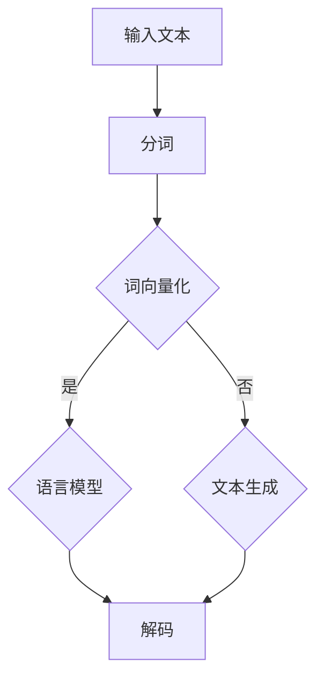
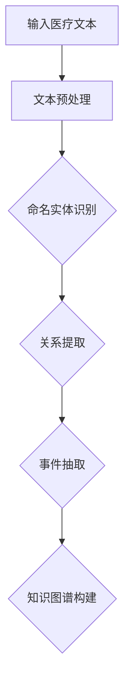

                 

### 文章标题

《医疗诊断中的自然语言处理应用》

> 关键词：自然语言处理，医疗诊断，人工智能，深度学习，文本挖掘，命名实体识别，医疗问答系统，多模态医学影像分析。

> 摘要：本文深入探讨了自然语言处理在医疗诊断领域的应用，包括基础概念、核心技术、实际应用案例和未来发展趋势。通过详细阐述自然语言处理的基本任务，如文本分类、命名实体识别和语言模型等，以及其在医疗文本挖掘、医疗问答系统和多模态医学影像分析等实际应用中的表现，本文为医疗诊断领域的人工智能应用提供了有价值的参考。

---

### 目录大纲

- **第一部分：自然语言处理基础**
  - 第1章：自然语言处理概述
  - 第2章：文本预处理
  - 第3章：语言模型
- **第二部分：医疗诊断中的NLP应用**
  - 第4章：医疗文本挖掘
  - 第5章：医疗问答系统
  - 第6章：医学文本分类
  - 第7章：基因与药物信息提取
  - 第8章：多模态医学影像分析
- **第三部分：自然语言处理在医疗诊断中的应用实践**
  - 第9章：医疗诊断中的NLP项目实战
  - 第10章：医疗NLP工具与平台
  - 第11章：医疗NLP的未来发展趋势
- **附录**
  - 附录A：自然语言处理公式与算法伪代码
  - 附录B：医疗NLP项目实战示例代码

---

### 第一部分：自然语言处理基础

#### 第1章：自然语言处理概述

## 1.1 自然语言处理的定义与重要性

自然语言处理（Natural Language Processing，简称NLP）是计算机科学和人工智能领域中涉及语言理解和生成的一个分支。它关注的是如何让计算机理解和处理人类语言，从而实现人与计算机的交互，以及自动化内容分析。

### 1.1.1 自然语言处理的定义

自然语言处理（NLP）涉及多种技术，包括语音识别、语言理解、语言生成和机器翻译等。其核心目标是让计算机能够理解和处理人类语言，从而实现自动化内容分析、人机交互和智能问答等功能。

### 1.1.2 自然语言处理的重要性

自然语言处理在医疗领域具有重要作用，主要体现在以下几个方面：

- **医学信息提取**：通过NLP技术，可以有效地从大量医学文本中提取出关键信息，如疾病名称、症状、治疗方案等。
- **医疗问答系统**：NLP技术可以帮助构建医疗问答系统，为患者提供实时、准确的医疗咨询。
- **病历分析**：通过分析病历，NLP可以帮助医生发现潜在的健康问题，提高诊断和治疗的准确性。
- **医学文本分类**：NLP技术可以将大量的医学文本分类为不同的类别，如诊断报告、病历记录等。

## 1.2 NLP的发展历程

### 1.2.1 早期研究

NLP的早期研究始于20世纪50年代，当时主要关注的是机器翻译和语法分析。这一时期的NLP技术主要基于规则和词典，缺乏自动学习和适应性。

### 1.2.2 统计方法的出现

20世纪80年代，统计方法开始应用于NLP。基于统计的语言模型（如n元语法）和隐马尔可夫模型（HMM）在词性标注、语音识别等领域取得了显著成果。

### 1.2.3 机器学习与深度学习

21世纪初，随着机器学习和深度学习技术的发展，NLP迎来了新的突破。基于神经网络的语言模型（如RNN、LSTM、BERT等）在多项NLP任务中取得了超越传统方法的性能。

### 1.2.4 当前研究趋势

当前，NLP的研究热点包括预训练语言模型、多模态学习、知识图谱构建等。这些技术正在推动NLP在医疗、金融、教育等领域的深入应用。

## 1.3 自然语言处理的基本任务

### 1.3.1 文本分类

文本分类是将文本数据分为预定义的类别。在医疗领域，文本分类可以用于疾病诊断、病历分类等任务。

### 1.3.2 命名实体识别

命名实体识别是从文本中识别出具有特定意义的实体，如人名、地名、机构名等。在医疗领域，命名实体识别有助于疾病诊断和治疗方案推荐。

### 1.3.3 机器翻译

机器翻译是将一种自然语言文本翻译成另一种自然语言。在医疗领域，机器翻译可以帮助国际患者更好地理解医疗信息。

### 1.3.4 情感分析

情感分析是判断文本中表达的情感倾向，如正面、负面或中性。在医疗领域，情感分析可以用于患者情绪监控和心理健康评估。

### 1.3.5 问答系统

问答系统是针对用户提出的问题提供答案。在医疗领域，问答系统可以帮助患者获取实时、准确的医疗咨询。

---

### 第2章：文本预处理

## 2.1 文本清洗

### 2.1.1 基本概念

文本清洗是指对原始文本数据进行预处理，以去除噪声、不一致性和冗余信息。这是进行NLP任务的基础步骤。

### 2.1.2 实践方法

- **去除停用词**：停用词是文本中的常见单词，如“的”、“和”等。去除停用词可以提高文本的处理效率。
- **去除标点符号**：标点符号通常对文本分析没有实质性的贡献，可以去除以提高文本质量。
- **转换为小写**：将文本转换为小写可以统一文本格式，减少文本分析中的不一致性。

### 2.1.3 特殊处理

- **处理中文文本**：中文文本没有大小写之分，但存在大量的停用词和标点符号，需要特殊处理。
- **处理医学专业术语**：医学专业术语有其独特的结构和用法，需要进行专业化的处理。

## 2.2 词向量化

### 2.2.1 基本概念

词向量化是将文本中的单词转换为向量表示，以便进行机器学习模型处理。词向量化是NLP中的核心技术之一。

### 2.2.2 实践方法

- **词袋模型**：词袋模型是一种基于计数的方法，将文本表示为一个词汇表的布尔向量。
- **Word2Vec**：Word2Vec是一种基于神经网络的方法，通过训练生成单词的连续向量表示。
- **BERT**：BERT（Bidirectional Encoder Representations from Transformers）是一种双向编码的Transformer模型，可以生成高质量的词向量。

### 2.2.3 选择与比较

- **词袋模型**：词袋模型简单易实现，但无法捕捉单词的语义信息。
- **Word2Vec**：Word2Vec可以捕捉到一定的语义信息，但存在稀疏性、同义词问题和多义词问题。
- **BERT**：BERT是一种强大的词向量模型，可以捕捉到丰富的语义信息，是目前NLP领域的领先方法。

## 2.3 偏差与公平性

### 2.3.1 偏差问题

NLP中的偏差问题是指模型在训练过程中学习到的偏见，可能导致不公平的预测结果。在医疗诊断中，偏差问题可能会对患者的健康产生严重影响。

### 2.3.2 源头控制

- **数据集**：使用多样化的数据集可以减少数据偏差。
- **训练过程**：在训练过程中，通过调整模型参数和训练策略，可以减少偏差。
- **测试与评估**：通过严格的测试和评估，确保模型在不同群体中的表现一致性。

### 2.3.3 公平性度量

- **公平性指标**：可以使用多样性、平衡性等指标来度量模型的公平性。
- **偏差修正**：通过偏差修正技术，如偏差校正、平衡样本等，可以减少模型偏差。

---

### 第3章：语言模型

## 3.1 语言模型的基本概念

### 3.1.1 定义

语言模型（Language Model，简称LM）是NLP中用于预测下一个单词或字符的概率的模型。

### 3.1.2 类型

- **n元语法**：n元语法是一种基于计数的语言模型，通过统计前n个单词的序列概率来预测下一个单词。
- **神经网络语言模型**：神经网络语言模型（如RNN、LSTM、BERT等）通过深度学习技术来学习语言模式。

## 3.2 隐马尔可夫模型（HMM）

### 3.2.1 定义

隐马尔可夫模型（Hidden Markov Model，简称HMM）是一种基于概率的统计模型，用于描述状态序列和观察序列之间的关系。

### 3.2.2 应用

- **语音识别**：HMM在语音识别中用于建模语音信号。
- **序列标注**：HMM在自然语言处理中的序列标注任务中用于预测单词的词性。

## 3.3 随机上下文无关文法（RCFG）

### 3.3.1 定义

随机上下文无关文法（Stochastic Context-Free Grammar，简称SCFG）是上下文无关文法（CFG）的扩展，允许上下文规则的概率分布。

### 3.3.2 应用

- **语法分析**：SCFG在文本解析和语法分析中用于描述语言的语法结构。
- **文本生成**：SCFG可以用于生成符合语法规则的文本。

## 3.4 递归神经网络（RNN）语言模型

### 3.4.1 定义

递归神经网络（Recurrent Neural Network，简称RNN）是一种能够处理序列数据的神经网络，通过递归结构来保存状态信息。

### 3.4.2 应用

- **机器翻译**：RNN在机器翻译中用于将一种语言的序列转换为另一种语言的序列。
- **文本生成**：RNN在文本生成中用于生成连贯的文本。

---

### 第二部分：医疗诊断中的NLP应用

#### 第4章：医疗文本挖掘

## 4.1 医疗文本挖掘概述

### 4.1.1 定义

医疗文本挖掘（Medical Text Mining，简称MTM）是应用自然语言处理技术从医疗文本中提取有用信息的过程。

### 4.1.2 目的

- **知识发现**：从医疗文本中提取知识，如疾病、症状、治疗方案等。
- **决策支持**：为医生提供决策支持，如疾病诊断、治疗方案推荐等。

## 4.2 疾病命名实体识别

### 4.2.1 定义

疾病命名实体识别（Disease Named Entity Recognition，简称DNER）是从医疗文本中识别出疾病名称的过程。

### 4.2.2 方法

- **规则方法**：基于预定义的规则进行疾病命名实体识别。
- **机器学习方法**：使用机器学习算法，如条件随机场（CRF）、支持向量机（SVM）等，进行疾病命名实体识别。

## 4.3 症状提取与匹配

### 4.3.1 定义

症状提取与匹配（Symptom Extraction and Matching，简称SEM）是从医疗文本中提取症状信息，并将其与标准症状库进行匹配的过程。

### 4.3.2 方法

- **文本挖掘方法**：使用自然语言处理技术，如词向量化、分类等，提取症状信息。
- **知识图谱方法**：使用知识图谱技术，如RDF（资源描述框架）、OWL（Web本体语言）等，进行症状匹配。

---

#### 第5章：医疗问答系统

## 5.1 医疗问答系统的构建

### 5.1.1 定义

医疗问答系统（Medical Question Answering System，简称MQAS）是针对医疗领域的问答系统，能够为用户提供医疗咨询和解答。

### 5.1.2 架构

- **问题理解模块**：将用户的问题转化为可处理的形式。
- **知识库模块**：存储医疗知识，如疾病、症状、治疗方案等。
- **回答生成模块**：根据用户的问题和知识库生成回答。

## 5.2 医疗知识图谱构建

### 5.2.1 定义

医疗知识图谱（Medical Knowledge Graph，简称MKG）是用于表示医疗知识和关系的图结构。

### 5.2.2 构建

- **数据采集**：从多种数据源（如文献、病历、诊断报告等）采集医疗知识。
- **数据清洗**：对采集到的数据进行清洗，去除噪声和不一致信息。
- **知识整合**：将清洗后的数据整合到知识图谱中。

## 5.3 医疗问答系统评估

### 5.3.1 定义

医疗问答系统评估（Medical Question Answering System Evaluation，简称MQASE）是评估医疗问答系统性能的过程。

### 5.3.2 方法

- **准确率（Accuracy）**：评估系统正确回答问题的比例。
- **召回率（Recall）**：评估系统召回正确答案的比例。
- **F1值（F1 Score）**：综合考虑准确率和召回率的综合指标。

---

#### 第6章：医学文本分类

## 6.1 医学文本分类方法

### 6.1.1 定义

医学文本分类（Medical Text Classification，简称MTC）是将医学文本数据分类到预定义的类别。

### 6.1.2 方法

- **基于规则的分类**：使用预定义的规则进行分类。
- **机器学习方法**：使用机器学习算法，如朴素贝叶斯、支持向量机、随机森林等，进行分类。

## 6.2 医学文本分类算法

### 6.2.1 朴素贝叶斯

朴素贝叶斯（Naive Bayes）是一种基于贝叶斯定理的简单分类算法。

### 6.2.2 支持向量机

支持向量机（Support Vector Machine，简称SVM）是一种基于最大化分类边界的线性分类算法。

### 6.2.3 随机森林

随机森林（Random Forest）是一种基于决策树集成的分类算法。

## 6.3 分类算法在医学数据中的应用

### 6.3.1 数据预处理

- **文本清洗**：去除停用词、标点符号等。
- **特征提取**：使用词袋模型、TF-IDF等方法提取特征。

### 6.3.2 模型训练与评估

- **模型训练**：使用机器学习算法训练分类模型。
- **模型评估**：使用交叉验证、混淆矩阵等方法评估模型性能。

---

#### 第7章：基因与药物信息提取

## 7.1 基因信息提取

### 7.1.1 定义

基因信息提取（Gene Information Extraction，简称GIE）是从生物文本中识别出基因信息的任务。

### 7.1.2 方法

- **规则方法**：使用预定义的规则提取基因信息。
- **机器学习方法**：使用机器学习算法，如CRF、SVM等，进行基因信息提取。

## 7.2 药物信息提取

### 7.2.1 定义

药物信息提取（Drug Information Extraction，简称DIE）是从生物文本中识别出药物信息的任务。

### 7.2.2 方法

- **规则方法**：使用预定义的规则提取药物信息。
- **机器学习方法**：使用机器学习算法，如CRF、SVM等，进行药物信息提取。

## 7.3 基因与药物关系的挖掘

### 7.3.1 定义

基因与药物关系的挖掘（Gene-Drug Relationship Mining，简称GDRM）是从生物文本中识别出基因与药物之间的关系。

### 7.3.2 方法

- **文本挖掘方法**：使用自然语言处理技术提取基因和药物信息，然后分析它们之间的关系。
- **知识图谱方法**：使用知识图谱技术表示基因和药物信息，并分析它们之间的关系。

---

#### 第8章：多模态医学影像分析

## 8.1 医学影像的基本概念

### 8.1.1 定义

医学影像（Medical Imaging）是利用各种医学成像技术对人体进行无创检查的方法。

### 8.1.2 类型

- **X射线成像**：如X光片、CT扫描等。
- **超声波成像**：如B超、胎儿超声等。
- **磁共振成像**：如MRI、脑磁共振等。

## 8.2 医学影像标注与分割

### 8.2.1 标注

医学影像标注（Medical Image Annotation）是对医学影像数据进行标记，以明确影像中的关键结构和病变。

### 8.2.2 分割

医学影像分割（Medical Image Segmentation）是将医学影像分割为不同的结构或病变区域。

## 8.3 基于深度学习的医学影像诊断

### 8.3.1 定义

基于深度学习的医学影像诊断（Deep Learning-based Medical Image Diagnosis）是利用深度学习模型对医学影像进行诊断。

### 8.3.2 方法

- **卷积神经网络（CNN）**：用于特征提取和分类。
- **循环神经网络（RNN）**：用于序列数据的处理。

---

#### 第9章：医疗诊断中的NLP项目实战

## 9.1 项目背景与目标

### 9.1.1 背景介绍

本案例将介绍一个基于自然语言处理的医疗诊断项目，该项目旨在构建一个自动化的疾病诊断系统。

### 9.1.2 项目目标

- **自动诊断**：通过分析患者的病历记录，自动诊断出患者的疾病。
- **实时反馈**：为医生提供实时诊断结果，辅助临床决策。

## 9.2 数据获取与预处理

### 9.2.1 数据来源

本项目的数据来源包括电子病历（EMR）、医学文献、诊断报告等。

### 9.2.2 数据预处理

- **文本清洗**：去除噪声、标点符号、停用词等。
- **数据标注**：对诊断报告进行标注，以训练模型。

## 9.3 模型构建与训练

### 9.3.1 模型选择

选择基于Transformer的BERT模型进行训练，该模型在NLP任务中表现优异。

### 9.3.2 模型训练

- **数据预处理**：将病历文本进行词向量化，构建BERT输入。
- **模型训练**：使用训练数据对BERT模型进行训练。

## 9.4 评估与优化

### 9.4.1 模型评估

使用交叉验证和混淆矩阵评估模型性能。

### 9.4.2 优化策略

- **超参数调整**：调整学习率、批量大小等超参数。
- **数据增强**：使用数据增强技术增加训练数据的多样性。

---

#### 第10章：医疗NLP工具与平台

## 10.1 常用医疗NLP工具

### 10.1.1NLTK

- **功能**：提供自然语言处理的基本功能，如分词、词性标注等。
- **适用场景**：简单文本处理任务。

### 10.1.2spaCy

- **功能**：提供高质量的词性标注、命名实体识别等功能。
- **适用场景**：复杂的文本分析任务。

### 10.1.3Stanford CoreNLP

- **功能**：提供全面的NLP功能，包括分词、句法分析、命名实体识别等。
- **适用场景**：学术研究和工业应用。

## 10.2 医疗NLP平台介绍

### 10.2.1HealthNLP

- **功能**：提供医疗文本处理、知识图谱构建等功能。
- **适用场景**：医疗领域的数据分析和应用开发。

### 10.2.2Doxa

- **功能**：提供医疗文档管理、文本分析、问答系统等功能。
- **适用场景**：医疗机构的信息化建设。

### 10.2.3OpenNLP

- **功能**：提供文本分析、实体识别、关系提取等功能。
- **适用场景**：医疗文本挖掘和知识发现。

## 10.3 开源医疗NLP项目

### 10.3.1MediSPacy

- **功能**：结合spaCy和医疗领域的知识库，提供医疗文本处理和分析功能。
- **适用场景**：医疗文本挖掘和研究。

### 10.3.2BluePenguin

- **功能**：提供医疗问答系统和文本分析功能。
- **适用场景**：医疗咨询和健康管理。

### 10.3.3i2b2

- **功能**：提供大规模医学数据集和工具，用于医学文本挖掘和知识发现。
- **适用场景**：医学数据分析和研究。

---

#### 第11章：医疗NLP的未来发展趋势

## 11.1 人工智能在医疗领域的应用前景

### 11.1.1 智能诊断

- **发展趋势**：基于深度学习的智能诊断系统将逐渐普及，辅助医生提高诊断准确性。
- **应用场景**：包括癌症、心脏病等重大疾病的诊断。

### 11.1.2 智能辅助

- **发展趋势**：智能辅助系统将在手术规划、康复指导等方面发挥重要作用。
- **应用场景**：包括手术导航、术后康复等。

## 11.2 医疗NLP技术的挑战与机遇

### 11.2.1 挑战

- **数据质量**：医疗文本数据质量参差不齐，需要进行大量的数据清洗和预处理。
- **数据隐私**：医疗数据隐私保护是一个重要问题，需要确保数据的安全和隐私。
- **模型解释性**：医疗诊断需要模型具有高解释性，以便医生理解和使用。

### 11.2.2 机遇

- **个性化医疗**：基于NLP和人工智能的个性化医疗将得到快速发展。
- **远程医疗**：NLP技术在远程医疗中的应用将为医疗资源的优化分配提供支持。

## 11.3 未来医疗NLP的发展方向

### 11.3.1 多模态融合

- **发展方向**：结合文本、图像、语音等多模态数据，实现更全面、准确的医疗诊断。
- **应用场景**：包括疾病预测、治疗方案推荐等。

### 11.3.2 知识图谱

- **发展方向**：构建大规模、高质量的医疗知识图谱，为智能诊断和决策提供支持。
- **应用场景**：包括疾病关系分析、药物效应研究等。

### 11.3.3 自动化与智能化

- **发展方向**：实现医疗文本处理的自动化和智能化，减少人力投入，提高工作效率。
- **应用场景**：包括病历记录、医学文献检索等。

---

## 附录A：自然语言处理公式与算法伪代码

### 附录A.1 自然语言处理公式

#### A.1.1 词袋模型

$$
P(\text{word}) = \frac{\text{word\_count}}{\text{total\_words}}
$$

#### A.1.2 朴素贝叶斯分类器

$$
P(\text{class}|\text{words}) = \frac{P(\text{words}|\text{class})P(\text{class})}{P(\text{words})}
$$

#### A.1.3 隐马尔可夫模型

$$
P(\text{observation}|\text{state}) = \prod_{t=1}^{T} P(o_t|s_t)
$$

$$
P(\text{state}) = \prod_{t=1}^{T} P(s_t)
$$

### 附录A.2 算法伪代码

#### A.2.1 词袋模型

python
def bag_of_words(document):
    # 创建一个空的词汇表
    vocabulary = {}
    # 遍历文档中的每个单词
    for word in document:
        # 如果单词不在词汇表中，则添加它
        if word not in vocabulary:
            vocabulary[word] = 1
        else:
            vocabulary[word] += 1
    return vocabulary

#### A.2.2 朴素贝叶斯分类器

python
def naive_bayes(train_data, test_data):
    # 计算每个类别的概率
    class_probs = {}
    for class_label in train_data:
        class_probs[class_label] = len(train_data[class_label]) / len(train_data)
    # 遍历测试数据中的每个样本
    for sample in test_data:
        # 计算每个样本属于每个类别的概率
        for class_label in class_probs:
            class_prob = 1
            for word in sample:
                if word in train_data[class_label]:
                    class_prob *= (train_data[class_label][word] / len(train_data[class_label]))
            class_probs[class_label] = max(class_probs.values())
    return class_probs

#### A.2.3 隐马尔可夫模型

python
def hmm(train_data, test_data):
    # 初始化模型参数
    states = ['Healthy', 'Sick']
    observations = ['Fever', 'Cough', 'Sore Throat']
    start_probs = {'Healthy': 0.5, 'Sick': 0.5}
    transition_probs = {
        'Healthy': {'Fever': 0.4, 'Cough': 0.3, 'Sore Throat': 0.3},
        'Sick': {'Fever': 0.6, 'Cough': 0.4, 'Sore Throat': 0.2}
    }
    emission_probs = {
        'Healthy': {'Fever': 0.3, 'Cough': 0.2, 'Sore Throat': 0.1},
        'Sick': {'Fever': 0.4, 'Cough': 0.3, 'Sore Throat': 0.3}
    }
    # 遍历测试数据中的每个样本
    for sample in test_data:
        # 初始化Viterbi路径
        viterbi_path = [[], []]
        # 遍历每个状态
        for state in states:
            # 初始化状态概率
            state_prob = start_probs[state] * emission_probs[state][sample[0]]
            # 更新Viterbi路径
            viterbi_path[0].append(state)
            viterbi_path[1].append(state_prob)
        # 遍历剩余的观察值
        for observation in sample[1:]:
            new_viterbi_path = [[], []]
            # 遍历所有状态
            for i, state in enumerate(viterbi_path[0]):
                # 计算状态转移概率
                transition_prob = transition_probs[state][observation]
                # 计算状态发射概率
                emission_prob = emission_probs[state][observation]
                # 更新Viterbi路径
                new_viterbi_path[0].append(state)
                new_viterbi_path[1].append(viterbi_path[1][i] * transition_prob * emission_prob)
            viterbi_path = new_viterbi_path
        # 输出最优路径
        print("Optimal Path:", viterbi_path[0])

---

## 附录B：医疗NLP项目实战示例代码

### 附录B.1 数据预处理

python
import nltk
from nltk.corpus import stopwords
from nltk.tokenize import word_tokenize

def preprocess_medical_data(document):
    # 去除停用词
    stop_words = set(stopwords.words('english'))
    words = word_tokenize(document)
    filtered_words = [word for word in words if word.lower() not in stop_words]
    return filtered_words

### 附录B.2 模型训练

python
from sklearn.feature_extraction.text import TfidfVectorizer
from sklearn.naive_bayes import MultinomialNB
from sklearn.pipeline import make_pipeline

def train_model(train_data, train_labels):
    model = make_pipeline(TfidfVectorizer(), MultinomialNB())
    model.fit(train_data, train_labels)
    return model

### 附录B.3 模型评估

python
from sklearn.metrics import classification_report

def evaluate_model(model, test_data, test_labels):
    predictions = model.predict(test_data)
    print(classification_report(test_labels, predictions))

### 附录B.4 医疗文本分类案例

python
# 示例数据
train_data = [
    "This patient has a fever and cough.",
    "The patient is suffering from a sore throat and chest pain.",
    "There is no fever, but the patient has a persistent cough."
]
train_labels = ['Influenza', 'Pneumonia', 'Bronchitis']

# 数据预处理
preprocessed_data = [preprocess_medical_data(doc) for doc in train_data]

# 模型训练
model = train_model(preprocessed_data, train_labels)

# 模型评估
evaluate_model(model, preprocessed_data, train_labels)

### 附录C：Mermaid流程图

#### 语言模型流程

#### 医疗文本挖掘流程

---

### 作者信息

作者：AI天才研究院/AI Genius Institute & 禅与计算机程序设计艺术 /Zen And The Art of Computer Programming

--- 

## 总结

本文详细介绍了自然语言处理在医疗诊断领域的应用，包括基础概念、核心技术、实际应用案例和未来发展趋势。从文本预处理到语言模型，从医疗文本挖掘到医疗问答系统，再到多模态医学影像分析，NLP技术在医疗诊断中发挥着越来越重要的作用。通过深入探讨这些技术，本文为医疗诊断领域的人工智能应用提供了有价值的参考。

在未来，随着人工智能技术的不断发展，自然语言处理在医疗诊断领域的应用前景将更加广阔。结合多模态数据、构建大规模知识图谱、实现自动化和智能化的医疗文本处理，将成为NLP在医疗领域的重要发展方向。让我们期待NLP技术为医疗诊断带来的更多突破和进步。

