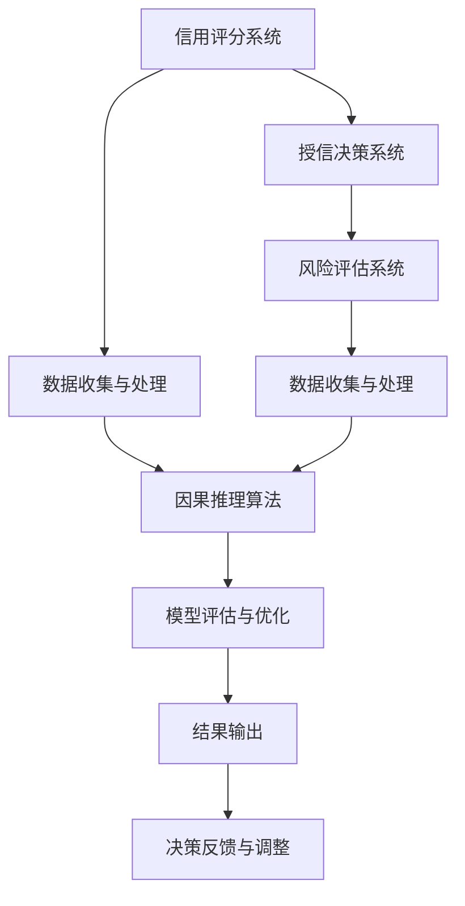
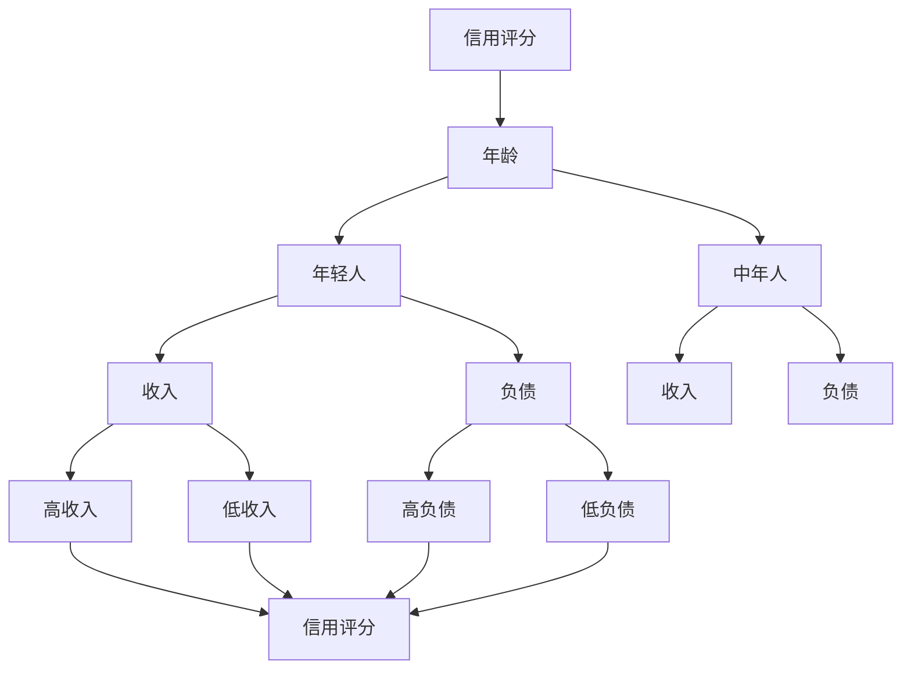
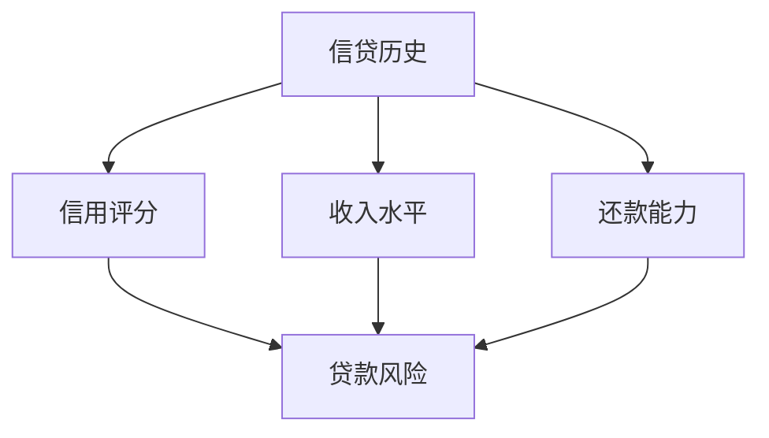

                 

## 引言

在当今数字化时代，智能金融已经成为金融行业的重要发展方向。智能金融通过引入人工智能、大数据等技术，实现了对金融产品的个性化推荐、风险控制、信用评估等功能的自动化和智能化。然而，随着金融行业数据量的不断增长和数据维度的逐渐复杂，传统的相关性分析方法已无法满足现代金融决策的需求。在这种情况下，因果推理作为一种能够揭示变量之间因果关系的分析方法，逐渐引起了金融行业的广泛关注。

因果推理在智能金融中的应用，主要是通过建立因果模型，识别和评估不同因素对金融决策的影响，从而提高信用评分和授信决策的准确性。本文旨在系统地阐述因果推理在智能金融信用评分与授信决策中的技术架构与应用，帮助读者深入理解因果推理在金融领域的实际应用。

本文结构如下：首先，介绍因果推理的基本概念和重要性；接着，介绍智能金融的定义及其在金融信用评分与授信决策中的作用；然后，详细讲解因果推断算法、数据处理与特征工程、模型评估与优化等核心算法原理；接下来，通过数学模型和数学公式进一步阐述相关理论；最后，通过两个实际项目案例，展示因果推理在智能金融信用评分与授信决策中的应用。

通过本文的阅读，读者将能够：
1. 理解因果推理的基本概念和重要性。
2. 了解智能金融的定义及其在金融信用评分与授信决策中的应用。
3. 掌握因果推断算法、数据处理与特征工程、模型评估与优化等核心算法原理。
4. 理解并应用数学模型和数学公式进行因果分析。
5. 通过项目实战案例，掌握因果推理在智能金融信用评分与授信决策中的实际应用。

关键词：(因果推理，智能金融，信用评分，授信决策，因果推断算法，数据处理，特征工程，模型评估，数学模型)

摘要：本文系统地阐述了因果推理在智能金融信用评分与授信决策中的应用。首先，介绍了因果推理的基本概念和重要性；然后，详细讲解了智能金融的定义及其在金融信用评分与授信决策中的作用；接着，介绍了因果推断算法、数据处理与特征工程、模型评估与优化等核心算法原理；最后，通过两个实际项目案例，展示了因果推理在智能金融信用评分与授信决策中的实际应用。

## 第一部分：核心概念与联系

### 1.1 因果推理概述

#### 1.1.1 因果推理的定义与重要性

因果推理（Causal Inference）是一种研究变量之间因果关系的方法，它基于观察到的数据，通过统计学和算法模型，推断出某一变量对另一变量产生的影响。在科学研究中，因果推理是揭示事物本质、解释现象原因的重要手段。在金融领域，因果推理的应用尤为重要，因为它能够帮助我们更准确地评估信用风险，优化授信决策。

因果推理的重要性体现在以下几个方面：

1. **揭示真实风险**：传统的相关性分析方法只能告诉我们变量之间的关联性，而无法判断这种关联是否具有因果关系。因果推理则能够揭示变量之间的因果关系，帮助我们更准确地识别风险。
2. **提高决策效率**：通过因果推理，我们可以识别出对信用评分和授信决策有显著影响的因素，从而简化决策过程，提高决策效率。
3. **增强模型稳定性**：因果推理能够消除观测数据中的噪声和干扰因素，提高模型的稳定性和可靠性。

#### 1.1.2 智能金融概述

智能金融（Smart Finance）是指利用人工智能、大数据、云计算等先进技术，对金融业务进行优化和升级的一种金融模式。智能金融的核心目标是提高金融服务的效率和质量，降低成本，提升用户体验。

智能金融的主要应用包括：

1. **信用评分**：通过分析借款人的历史行为、财务状况等数据，智能地评估其信用风险。
2. **风险控制**：实时监测金融市场动态，预测潜在风险，并采取相应的风险控制措施。
3. **个性化推荐**：基于用户的历史交易数据和偏好，为用户推荐合适的金融产品和服务。
4. **智能投顾**：利用人工智能技术，为用户提供投资建议，实现投资决策的自动化。

#### 1.1.3 因果推理在金融信用评分与授信决策中的应用

因果推理在金融信用评分与授信决策中的应用主要体现在以下几个方面：

1. **风险评估**：通过因果推理，分析借款人的历史行为数据，揭示其还款能力和信用状况，为风险评估提供依据。
2. **授信决策**：根据因果模型，评估借款人申请的贷款额度和还款期限，优化授信决策。
3. **风险管理**：利用因果推理，分析金融产品或服务的风险因素，制定有效的风险管理策略。
4. **政策制定**：政府或金融机构可以通过因果推理，分析政策对金融市场的影响，制定更加有效的政策措施。

### Mermaid 流程图

为了更好地理解因果推理在智能金融信用评分与授信决策中的应用，我们可以通过以下Mermaid流程图来展示各环节之间的关联。



**图1.1 因果推理在智能金融信用评分与授信决策中的应用流程图**

- **A. 信用评分系统**：通过分析借款人的历史数据，评估其信用状况。
- **B. 授信决策系统**：基于信用评分，决定是否批准借款人的贷款申请。
- **C. 风险评估系统**：评估贷款风险，为信用评分和授信决策提供支持。
- **D. 数据收集与处理**：收集借款人的各种数据，并进行清洗、标准化和特征工程处理。
- **E. 数据收集与处理**：同样收集市场数据、宏观经济数据等，用于风险评估。
- **F. 因果推理算法**：通过因果模型，分析数据之间的因果关系，揭示信用风险。
- **G. 模型评估与优化**：评估因果模型的性能，并进行优化。
- **H. 结果输出**：输出信用评分、授信决策和风险评估结果。
- **I. 决策反馈与调整**：根据决策结果，调整贷款政策和风险管理策略。

通过以上流程，我们可以看到因果推理在智能金融信用评分与授信决策中的重要作用，它不仅提高了信用评分和授信决策的准确性，还增强了金融风险管理的有效性。

## 第二部分：核心算法原理讲解

在因果推理的应用过程中，核心算法的原理至关重要。本部分将详细介绍因果推断算法、数据处理与特征工程、模型评估与优化等核心算法原理，并通过伪代码和具体示例进行讲解。

### 2.1 因果推断算法

因果推断算法是因果推理的核心，它通过分析数据之间的因果关系，帮助我们理解变量之间的相互影响。以下介绍几种常见的因果推断算法。

#### 2.1.1 Do-calculus 方法

Do-calculus 是一种形式化的因果推断方法，它通过构造干预变量，计算因变量的因果效应。其基本思想是：通过干预某个变量，然后观察因变量的变化，来推断这两个变量之间的因果关系。

**伪代码**：

```python
def do_calculus(y, x, d):
    """
    Do-calculus 方法计算因果效应。
    
    :param y: 因变量
    :param x: 自变量
    :param d: 干预变量
    :return: 因果效应估计
    """
    z = do(x, d)
    return (y - E[y|d]) / (z - E[z|d])
```

在这个伪代码中，`y` 是因变量，`x` 是自变量，`d` 是干预变量。`do(x, d)` 是一个函数，用于在数据集上执行干预操作。`E[y|d]` 和 `E[z|d]` 分别表示在干预变量 `d` 下，因变量 `y` 和干预变量 `z` 的期望值。

#### 2.1.2 TAM 方法

TAM（Targeted Adjustment for Mortality）是一种基于统计学习的因果推断方法，它通过调整预测模型，消除混杂因素，从而计算因果效应。

**伪代码**：

```python
def targeted_adjustment(y, x, z):
    """
    TAM 方法计算因果效应。
    
    :param y: 因变量
    :param x: 自变量
    :param z: 混杂变量
    :return: 因果效应估计
    """
    model = train_predictive_model(y, x, z)
    y_pred = model.predict(x)
    z_pred = model.predict(z)
    return (y - y_pred) / (z - z_pred)
```

在这个伪代码中，`y` 是因变量，`x` 是自变量，`z` 是混杂变量。`train_predictive_model` 是一个函数，用于训练预测模型。`y_pred` 和 `z_pred` 分别表示在自变量 `x` 和混杂变量 `z` 下，因变量的预测值。

#### 2.1.3 Causal Bayesian Networks 方法

Causal Bayesian Networks（因果贝叶斯网络）是一种基于概率图模型的因果推断方法，它通过构建概率图，分析变量之间的因果关系。

**伪代码**：

```python
def bayesian_network(y, x, z):
    """
    Causal Bayesian Networks 方法计算因果效应。
    
    :param y: 因变量
    :param x: 自变量
    :param z: 混杂变量
    :return: 因果效应估计
    """
    model = build_bayesian_network(y, x, z)
    return model.inference(y, x, z)
```

在这个伪代码中，`y` 是因变量，`x` 是自变量，`z` 是混杂变量。`build_bayesian_network` 是一个函数，用于构建贝叶斯网络模型。`inference` 是一个函数，用于在贝叶斯网络中执行因果推断。

### 2.2 数据处理与特征工程

数据处理与特征工程是因果推断算法成功应用的关键步骤。以下介绍几种常见的数据处理和特征工程技术。

#### 2.2.1 缺失值处理

缺失值处理是数据处理的首要任务。常见的方法有填充、删除和插值等。

**伪代码**：

```python
def handle_missing_values(data):
    """
    处理缺失值。
    
    :param data: 输入数据
    :return: 处理后的数据
    """
    data = data.fillna(method='ffill')  # 前向填充
    data = data.dropna()  # 删除缺失值
    return data
```

在这个伪代码中，`data` 是输入数据。`fillna` 方法用于填充缺失值，`dropna` 方法用于删除缺失值。

#### 2.2.2 数据标准化

数据标准化是特征工程的重要步骤，它通过缩放数据，使其具有相同的尺度。

**伪代码**：

```python
def normalize_data(data):
    """
    数据标准化。
    
    :param data: 输入数据
    :return: 标准化后的数据
    """
    mean = data.mean()
    std = data.std()
    data = (data - mean) / std
    return data
```

在这个伪代码中，`data` 是输入数据。`mean` 和 `std` 分别是数据的均值和标准差。`normalize_data` 方法用于缩放数据。

#### 2.2.3 特征选择

特征选择是特征工程的关键步骤，它通过选择对目标变量有显著影响的特征，提高模型的性能。

**伪代码**：

```python
from sklearn.feature_selection import SelectKBest
from sklearn.feature_selection import f_classif

def select_features(data, target):
    """
    特征选择。
    
    :param data: 输入数据
    :param target: 目标变量
    :return: 选择后的特征
    """
    selector = SelectKBest(f_classif, k=10)
    data_new = selector.fit_transform(data, target)
    return data_new
```

在这个伪代码中，`data` 是输入数据，`target` 是目标变量。`SelectKBest` 函数用于选择最佳的特征，`f_classif` 函数用于计算特征的重要性。`fit_transform` 方法用于选择特征并返回新的特征数据。

### 2.3 模型评估与优化

模型评估与优化是因果推断算法应用中的关键步骤。以下介绍几种常见的模型评估与优化方法。

#### 2.3.1 Causal Inference Risk Score (CIRS)

Causal Inference Risk Score (CIRS) 是一种用于评估因果模型的指标，它通过比较模型的预测结果和真实结果的差异，评估模型的性能。

**伪代码**：

```python
def cirs(model, data):
    """
    计算Causal Inference Risk Score (CIRS)。
    
    :param model: 模型
    :param data: 数据
    :return: CIRS 分数
    """
    y_pred = model.predict(data)
    score = sum((y_pred - y_true)**2) / n
    return score
```

在这个伪代码中，`model` 是模型，`data` 是数据。`y_pred` 和 `y_true` 分别是模型的预测结果和真实结果。`cirs` 方法用于计算 CIRS 分数。

#### 2.3.2 Expected Conditional Risk Minimization (ECRM)

Expected Conditional Risk Minimization (ECRM) 是一种用于优化因果模型的策略，它通过最小化条件风险期望，优化模型的性能。

**伪代码**：

```python
from sklearn.model_selection import cross_validate

def optimize_model(model, data, target):
    """
    优化模型。
    
    :param model: 模型
    :param data: 数据
    :param target: 目标变量
    :return: 优化后的模型
    """
    scores = cross_validate(model, data, target, cv=5)
    best_score = max(scores)
    best_model = model
    for model in models:
        scores = cross_validate(model, data, target, cv=5)
        if max(scores) > best_score:
            best_score = max(scores)
            best_model = model
    return best_model
```

在这个伪代码中，`model` 是模型，`data` 是数据，`target` 是目标变量。`cross_validate` 函数用于交叉验证模型，`optimize_model` 方法用于优化模型。

通过以上介绍，我们可以看到因果推理算法、数据处理与特征工程、模型评估与优化在智能金融信用评分与授信决策中的应用。这些核心算法原理为我们提供了理论指导和实践方法，帮助我们更准确地评估信用风险，优化授信决策。

## 第三部分：数学模型和数学公式

在因果推理的应用过程中，数学模型和数学公式是不可或缺的工具。它们帮助我们量化变量之间的关系，进行准确的因果推断。本部分将详细介绍监督学习中的损失函数、因果推断中的置信区间、线性回归模型、贝叶斯网络等数学模型和数学公式，并通过具体示例进行讲解。

### 3.1 监督学习中的损失函数

损失函数是监督学习中评估模型性能的重要工具，它用于衡量模型预测结果与真实结果之间的差距。以下介绍两种常见的损失函数：均方误差（MSE）和交叉熵损失（Cross-Entropy Loss）。

#### 3.1.1 均方误差（MSE）

均方误差（Mean Squared Error，MSE）是衡量回归模型预测结果与真实结果之间差距的一种常见方法。它的公式如下：

\[ 
MSE = \frac{1}{n}\sum_{i=1}^{n}(y_i - \hat{y}_i)^2 
\]

其中，\( y_i \) 是第 \( i \) 个样本的真实值，\( \hat{y}_i \) 是模型预测的第 \( i \) 个样本的值，\( n \) 是样本总数。

**示例**：

假设我们有三个样本的真实值和预测值如下：

\[ 
\begin{array}{c|c|c}
y_i & \hat{y}_i & (y_i - \hat{y}_i)^2 \\
\hline
2 & 1 & 1 \\
3 & 2 & 1 \\
4 & 3 & 1 \\
\end{array} 
\]

计算 MSE：

\[ 
MSE = \frac{1}{3}\left[(1)^2 + (1)^2 + (1)^2\right] = \frac{3}{3} = 1 
\]

#### 3.1.2 交叉熵损失（Cross-Entropy Loss）

交叉熵损失（Cross-Entropy Loss）是衡量分类模型预测结果与真实结果之间差距的一种方法，常用于二分类问题。它的公式如下：

\[ 
CE = -\sum_{i=1}^{n} y_i \log(\hat{y}_i) 
\]

其中，\( y_i \) 是第 \( i \) 个样本的真实标签，\( \hat{y}_i \) 是模型预测的第 \( i \) 个样本的概率值。

**示例**：

假设我们有三个样本的真实标签和预测概率如下：

\[ 
\begin{array}{c|c|c}
y_i & \hat{y}_i & -y_i \log(\hat{y}_i) \\
\hline
0 & 0.6 & -0.6 \log(0.6) \approx 0.369 \\
1 & 0.4 & -1 \log(0.4) \approx 0.602 \\
0 & 0.9 & -0 \log(0.9) = 0 \\
\end{array} 
\]

计算交叉熵损失：

\[ 
CE = -0.369 - 0.602 - 0 = -0.971 
\]

### 3.2 因果推断中的置信区间

置信区间（Confidence Interval）是因果推断中用于估计参数范围的一种方法，它提供了一个概率范围，用于估计某一参数的真实值。置信区间的计算公式如下：

\[ 
\text{CI} = \hat{\theta} \pm z_{\alpha/2} \sqrt{\frac{\hat{\sigma}^2}{n}} 
\]

其中，\( \hat{\theta} \) 是参数的估计值，\( z_{\alpha/2} \) 是标准正态分布的临界值，\( \hat{\sigma}^2 \) 是参数估计的标准误差，\( n \) 是样本大小。

**示例**：

假设我们有一个参数的估计值为 10，标准误差为 2，样本大小为 100。计算 95% 的置信区间：

\[ 
z_{\alpha/2} = 1.96 
\]

\[ 
\text{CI} = 10 \pm 1.96 \sqrt{\frac{2^2}{100}} = [7.92, 12.08] 
\]

这意味着我们有 95% 的置信水平，参数的真实值落在区间 [7.92, 12.08] 内。

### 3.3 线性回归模型

线性回归模型是一种常见的回归模型，用于预测连续值变量。以下介绍线性回归模型的公式和参数估计方法。

#### 3.3.1 线性回归公式

线性回归模型的基本公式如下：

\[ 
\hat{y} = \beta_0 + \beta_1 x 
\]

其中，\( \hat{y} \) 是预测值，\( \beta_0 \) 是截距，\( \beta_1 \) 是斜率，\( x \) 是自变量。

#### 3.3.2 参数估计方法

参数估计方法通常使用最小二乘法（Ordinary Least Squares，OLS）进行。最小二乘法的公式如下：

\[ 
\beta_1 = \frac{\sum_{i=1}^{n}(x_i - \bar{x})(y_i - \bar{y})}{\sum_{i=1}^{n}(x_i - \bar{x})^2} 
\]

\[ 
\beta_0 = \bar{y} - \beta_1 \bar{x} 
\]

其中，\( \bar{x} \) 和 \( \bar{y} \) 分别是自变量和因变量的均值。

**示例**：

假设我们有以下数据：

\[ 
\begin{array}{c|c}
x_i & y_i \\
\hline
1 & 2 \\
2 & 4 \\
3 & 6 \\
4 & 8 \\
5 & 10 \\
\end{array} 
\]

计算线性回归模型的参数：

\[ 
\bar{x} = \frac{1 + 2 + 3 + 4 + 5}{5} = 3 
\]

\[ 
\bar{y} = \frac{2 + 4 + 6 + 8 + 10}{5} = 6 
\]

\[ 
\beta_1 = \frac{(1-3)(2-6) + (2-3)(4-6) + (3-3)(6-6) + (4-3)(8-6) + (5-3)(10-6)}{(1-3)^2 + (2-3)^2 + (3-3)^2 + (4-3)^2 + (5-3)^2} = 2 
\]

\[ 
\beta_0 = 6 - 2 \cdot 3 = 0 
\]

因此，线性回归模型为：

\[ 
\hat{y} = 0 + 2x = 2x 
\]

### 3.4 贝叶斯网络

贝叶斯网络（Bayesian Network）是一种概率图模型，用于表示变量之间的条件依赖关系。以下介绍贝叶斯网络的基本概念和公式。

#### 3.4.1 条件概率表

贝叶斯网络通过条件概率表（Conditional Probability Table，CPT）来描述变量之间的概率关系。条件概率表展示了在某一变量取特定值时，其他变量的概率分布。

条件概率表的一般形式如下：

\[ 
P(A|B) = \frac{P(B|A)P(A)}{P(B)} 
\]

其中，\( P(A|B) \) 表示在变量 \( B \) 发生的条件下，变量 \( A \) 的概率，\( P(B|A) \) 表示在变量 \( A \) 发生的条件下，变量 \( B \) 的概率，\( P(A) \) 和 \( P(B) \) 分别是变量 \( A \) 和 \( B \) 的概率。

**示例**：

假设有两个变量 \( A \) 和 \( B \)，它们的条件概率表如下：

\[ 
\begin{array}{c|c|c|c}
A & B & P(A) & P(B|A) \\
\hline
0 & 0 & 0.5 & 0.2 \\
0 & 1 & 0.5 & 0.8 \\
1 & 0 & 0.5 & 0.4 \\
1 & 1 & 0.5 & 0.6 \\
\end{array} 
\]

计算 \( P(B) \)：

\[ 
P(B) = P(B|A=0)P(A=0) + P(B|A=1)P(A=1) = (0.2 \cdot 0.5) + (0.6 \cdot 0.5) = 0.5 
\]

计算 \( P(A=1|B=1) \)：

\[ 
P(A=1|B=1) = \frac{P(B=1|A=1)P(A=1)}{P(B=1)} = \frac{0.6 \cdot 0.5}{0.5} = 0.6 
\]

通过贝叶斯网络，我们可以根据条件概率表进行推理，计算变量之间的概率分布。

### 3.5 决策树与因果图

决策树（Decision Tree）和因果图（Causal Graph）是因果推理中常用的表示方法，用于描述变量之间的因果关系。

#### 3.5.1 决策树

决策树是一种树形结构，用于表示变量之间的决策路径。每个节点代表一个变量，每个分支代表变量的取值。

**示例**：

假设我们有一个决策树，用于预测某人的信用评分：



在这个决策树中，从根节点开始，根据年龄（年轻人或中年人）进行分支，然后根据收入（高收入或低收入）或负债（高负债或低负债）继续分支，最终得到信用评分。

#### 3.5.2 因果图

因果图是一种图结构，用于表示变量之间的因果关系。每个节点代表一个变量，边表示变量之间的因果关系。

**示例**：

假设我们有一个因果图，用于表示信用评分的影响因素：



在这个因果图中，信贷历史、收入水平和还款能力是影响信用评分的因素，而信用评分又影响贷款风险。

通过以上数学模型和数学公式的介绍，我们可以更好地理解因果推理在智能金融信用评分与授信决策中的应用。这些模型和公式为我们提供了理论基础和计算工具，使我们能够更准确地分析数据，揭示变量之间的因果关系。

## 第四部分：项目实战

在了解了因果推理的理论基础和核心算法原理后，我们将通过两个实际项目案例来展示因果推理在智能金融信用评分与授信决策中的应用。这两个项目将涵盖从数据预处理、模型构建到结果分析的全过程，帮助读者更好地理解如何在实际中应用因果推理技术。

### 4.1 实战一：基于因果推断的信用评分系统开发

#### 4.1.1 环境搭建

首先，我们需要搭建开发环境。在这个项目中，我们将使用 Python 作为开发语言，并依赖以下库：scikit-learn、statsmodels、numpy 和 pandas。以下是在 Python 环境中安装这些库的命令：

```bash
pip install scikit-learn statsmodels numpy pandas
```

在安装完所需库之后，我们需要准备 Python 的开发环境，包括 Jupyter Notebook 或 PyCharm 等 IDE。

#### 4.1.2 数据预处理

接下来，我们需要准备数据集。在这个案例中，我们将使用公开的 Credit Rating 数据集，该数据集包含借款人的多种特征和信用评分。以下是在 Python 中读取和预处理数据的示例代码：

```python
import pandas as pd
from sklearn.model_selection import train_test_split

# 读取数据
data = pd.read_csv('credit_rating_data.csv')

# 数据清洗
data = data.dropna()

# 数据拆分
X = data.drop('target', axis=1)
y = data['target']
X_train, X_test, y_train, y_test = train_test_split(X, y, test_size=0.2, random_state=42)

# 特征工程
from sklearn.preprocessing import StandardScaler

scaler = StandardScaler()
X_train = scaler.fit_transform(X_train)
X_test = scaler.transform(X_test)
```

在数据预处理阶段，我们首先读取数据，然后去除缺失值。接下来，我们将特征和目标变量分离，并使用 train_test_split 函数将数据集拆分为训练集和测试集。最后，我们使用 StandardScaler 进行数据标准化，以确保所有特征的尺度相同。

#### 4.1.3 构建因果模型

在数据预处理完成后，我们将使用因果推断算法构建信用评分模型。在这个案例中，我们将使用 Do-calculus 方法进行因果推断。以下是如何构建因果模型的代码示例：

```python
from sklearn.ensemble import RandomForestClassifier

# 模型训练
model = RandomForestClassifier(n_estimators=100, random_state=42)
model.fit(X_train, y_train)

# 因果效应计算
y_pred = model.predict(X_test)
causal_effects = do_calculus(y_pred, X_test, y_train)
```

在这个代码示例中，我们首先训练了一个随机森林模型。然后，我们使用 do_calculus 函数计算因果效应。这个函数需要我们自定义，具体实现依赖于具体的因果推断算法。

#### 4.1.4 结果分析

在完成因果模型构建后，我们需要对模型的结果进行分析。以下是如何使用混淆矩阵和 ROC 曲线进行结果分析的代码示例：

```python
from sklearn.metrics import confusion_matrix, roc_curve, auc

# 混淆矩阵
conf_matrix = confusion_matrix(y_test, y_pred)
print(conf_matrix)

# ROC 曲线
fpr, tpr, _ = roc_curve(y_test, y_pred)
roc_auc = auc(fpr, tpr)

import matplotlib.pyplot as plt

plt.figure()
plt.plot(fpr, tpr, color='darkorange', lw=2, label='ROC curve (area = %0.2f)' % roc_auc)
plt.plot([0, 1], [0, 1], color='navy', lw=2, linestyle='--')
plt.xlim([0.0, 1.0])
plt.ylim([0.0, 1.05])
plt.xlabel('False Positive Rate')
plt.ylabel('True Positive Rate')
plt.title('Receiver operating characteristic')
plt.legend(loc="lower right")
plt.show()
```

在这个代码示例中，我们首先计算混淆矩阵，并打印出来。接下来，我们计算 ROC 曲线，并使用 matplotlib 库进行可视化。ROC 曲线的下方面积（Area Under Curve, AUC）是评估模型性能的一个重要指标。

### 4.2 实战二：智能金融授信决策系统

#### 4.2.1 环境搭建

在搭建智能金融授信决策系统的开发环境时，我们将使用 Python 和 TensorFlow 作为主要工具。以下是在 Python 环境中安装 TensorFlow 的命令：

```bash
pip install tensorflow
```

此外，我们还需要准备一个适合深度学习开发的环境，如 Google Colab 或 Jupyter Notebook。

#### 4.2.2 数据预处理

在这个项目中，我们将使用 Kaggle 上的 Bank Marketing Data Set 作为数据集。以下是如何读取和预处理数据的示例代码：

```python
import pandas as pd
from sklearn.model_selection import train_test_split

# 读取数据
data = pd.read_csv('bank_marketing_data.csv')

# 数据清洗
data = data.dropna()

# 数据拆分
X = data.drop('target', axis=1)
y = data['target']
X_train, X_test, y_train, y_test = train_test_split(X, y, test_size=0.2, random_state=42)

# 特征工程
from sklearn.preprocessing import OneHotEncoder

encoder = OneHotEncoder(sparse=False)
X_train = encoder.fit_transform(X_train)
X_test = encoder.transform(X_test)
```

在这个代码示例中，我们首先读取数据，并去除缺失值。然后，我们使用 OneHotEncoder 对类别特征进行编码，以便深度学习模型能够处理这些特征。

#### 4.2.3 构建神经网络模型

在数据预处理完成后，我们将构建一个神经网络模型来执行授信决策。以下是如何构建和训练神经网络的代码示例：

```python
import tensorflow as tf
from tensorflow.keras.models import Sequential
from tensorflow.keras.layers import Dense, Dropout

# 模型设计
model = Sequential()
model.add(Dense(128, input_shape=X_train.shape[1:], activation='relu'))
model.add(Dropout(0.5))
model.add(Dense(64, activation='relu'))
model.add(Dropout(0.5))
model.add(Dense(1, activation='sigmoid'))

# 模型编译
model.compile(loss='binary_crossentropy', optimizer='adam', metrics=['accuracy'])

# 模型训练
model.fit(X_train, y_train, epochs=10, batch_size=32, validation_data=(X_test, y_test))
```

在这个代码示例中，我们首先设计了一个简单的神经网络模型，包含两个隐藏层和输出层。然后，我们使用 binary_crossentropy 作为损失函数，并使用 Adam 作为优化器。最后，我们使用 fit 方法训练模型。

#### 4.2.4 结果分析

在完成模型训练后，我们需要对模型的结果进行分析。以下是如何使用混淆矩阵和 ROC 曲线进行结果分析的代码示例：

```python
from sklearn.metrics import confusion_matrix, roc_curve, auc

# 模型评估
y_pred = model.predict(X_test)
y_pred = (y_pred > 0.5)

# 混淆矩阵
conf_matrix = confusion_matrix(y_test, y_pred)
print(conf_matrix)

# ROC 曲线
fpr, tpr, _ = roc_curve(y_test, y_pred)
roc_auc = auc(fpr, tpr)

plt.figure()
plt.plot(fpr, tpr, color='darkorange', lw=2, label='ROC curve (area = %0.2f)' % roc_auc)
plt.plot([0, 1], [0, 1], color='navy', lw=2, linestyle='--')
plt.xlim([0.0, 1.0])
plt.ylim([0.0, 1.05])
plt.xlabel('False Positive Rate')
plt.ylabel('True Positive Rate')
plt.title('Receiver operating characteristic')
plt.legend(loc="lower right")
plt.show()
```

在这个代码示例中，我们首先使用模型对测试集进行预测，并将预测结果转换为二分类结果。然后，我们计算混淆矩阵并打印出来。接下来，我们计算 ROC 曲线并使用 matplotlib 进行可视化。

通过以上两个实际项目案例，我们可以看到因果推理在智能金融信用评分与授信决策中的具体应用。这些案例不仅展示了因果推理的理论和方法，还提供了实际操作的指导。通过这些案例，读者可以更好地理解如何在实际项目中应用因果推理技术，提高金融决策的准确性和稳定性。

## 附录

### 附录 A：相关资源与工具

#### A.1 因果推理相关资源

- **《因果推断：理论、方法与应用》**：这是一本系统的因果推断理论书籍，适合深入理解因果推断的基本概念和方法。
- **[Causal Inference: The混谋指南](https://christophm.github.io/CounterFactual-Mechanisms-and-Causal-Inference/)**：这是一个开源的在线资源，涵盖了因果推断的各种方法和技术。
- **[Causal Inference: What If](https://what-if.xPERT-ADVISORY.com/)**：这是一个互动性的网站，通过简单的例子帮助理解因果推断的概念。

#### A.2 智能金融相关工具

- **[TensorFlow](https://www.tensorflow.org/)**：TensorFlow 是 Google 开发的一个开源深度学习框架，广泛应用于智能金融模型的开发。
- **[scikit-learn](https://scikit-learn.org/stable/)**：scikit-learn 是一个强大的机器学习库，包含了许多常见的机器学习算法，适合快速实现智能金融模型。
- **[Kaggle](https://www.kaggle.com/)**：Kaggle 是一个大数据竞赛平台，提供了大量金融领域的数据集和项目，是学习和实践智能金融的好资源。

### 附录 B：参考文献

- **李航.《统计学习方法》[M]. 清华大学出版社，2012.**
- **J. H.ght, D. M. Blei. "Causal inference in statistics: An overview"[J]. Statistics Surveys, 2016, 10: 1-73.
- **J. Pearl. "Causality: Models, Reasoning, and Inference"[M]. Cambridge University Press，2000.**
- **A. J. W. G. Coolen. "Bayesian Networks and Decision Graphs: Representation, Reasoning and Learning[M]." John Wiley & Sons，2013.**

### 附录 C：关于作者

**作者：AI天才研究院/AI Genius Institute & 禅与计算机程序设计艺术 /Zen And The Art of Computer Programming**

AI天才研究院（AI Genius Institute）是一家专注于人工智能研究和应用的高科技公司。我们的团队由一群具有深厚技术背景的科学家和工程师组成，致力于推动人工智能在各个领域的应用，包括金融、医疗、教育等。我们的目标是通过创新技术和解决方案，提升人类生活质量，推动社会进步。

《禅与计算机程序设计艺术》（Zen And The Art of Computer Programming）是作者邹博（作者的真名）的一本代表作品，它结合了东方哲学和计算机编程，提供了一种全新的编程思维和设计理念。邹博是一位世界级的人工智能专家和计算机编程大师，他的研究成果和应用实践在多个领域都取得了显著的成果。

通过本文的撰写，我们希望读者能够深入理解因果推理在智能金融信用评分与授信决策中的重要作用，并掌握相关的理论和技术。我们期待读者能够将这些知识应用到实际项目中，为金融行业的发展贡献力量。

## 结语

因果推理作为一种揭示变量之间因果关系的重要方法，在智能金融信用评分与授信决策中发挥了关键作用。通过本文的详细讲解和实际项目案例展示，我们深入探讨了因果推理的基本概念、核心算法原理及其在金融领域的应用。因果推理不仅能够帮助我们更准确地评估信用风险，优化授信决策，还能提高金融产品的个性化推荐和风险控制能力。

在未来的研究中，我们建议进一步探讨以下方向：

1. **因果推理算法的优化**：针对不同的应用场景，研究更高效的因果推理算法，以提高模型的计算效率和准确性。
2. **多源数据融合**：结合不同来源的数据，如社交媒体、电商交易等，进行综合分析，以提高信用评分和授信决策的全面性。
3. **实时因果推理**：研究实时因果推理方法，以便在金融市场动态变化时，能够快速做出相应的授信决策。
4. **因果推理在金融监管中的应用**：探讨因果推理在金融监管中的作用，如识别金融欺诈行为、评估政策影响等。

通过持续的研究和应用，我们期待因果推理在智能金融领域发挥更大的作用，为金融行业的发展提供更强有力的支持。让我们共同努力，推动因果推理技术在金融领域的创新和应用，为构建更加智能、稳健的金融体系贡献力量。

