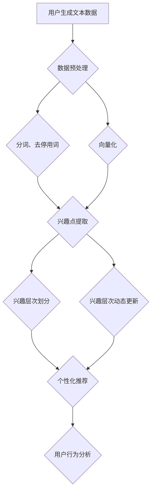

                 

### 第1章：用户兴趣层次化动态建模概述

#### 1.1 引言

用户兴趣层次化动态建模是一项重要的技术，它通过分析用户的兴趣层次，动态地更新和调整用户模型，以实现对用户行为的准确预测和个性化服务。本章将介绍用户兴趣层次化动态建模的基本概念、背景和重要性，为后续章节的深入探讨打下基础。

首先，什么是用户兴趣层次化动态建模？简而言之，它是将用户兴趣按照一定的层次结构进行划分，并根据用户行为数据动态更新这些兴趣层次的过程。这一过程涉及到多种技术，包括机器学习、自然语言处理、数据挖掘等。

接下来，我们将探讨用户兴趣层次化动态建模的背景。随着互联网的普及，用户产生的数据量呈爆炸式增长。如何从海量数据中提取有价值的信息，为用户提供个性化的服务，成为了一个迫切需要解决的问题。用户兴趣层次化动态建模正是为了解决这一问题而诞生的。

此外，用户兴趣层次化动态建模的重要性也不容忽视。它可以提高推荐系统的准确性，帮助企业和平台更好地满足用户需求，提升用户体验。同时，它还可以用于用户行为分析、市场营销等领域，为企业提供决策支持。

最后，本章将简要介绍本书的结构安排和目标。本书将分为三大部分，分别介绍用户兴趣层次化动态建模的理论基础、核心算法与模型、应用与实践。通过阅读本书，读者可以系统地了解用户兴趣层次化动态建模的原理、方法和实践应用，为实际项目开发提供有力支持。

#### 1.2 用户兴趣层次化动态建模的重要性

用户兴趣层次化动态建模在个性化推荐、用户行为分析、市场营销等方面具有显著的应用价值。以下将详细阐述其在这些领域的具体作用。

首先，在个性化推荐领域，用户兴趣层次化动态建模是一种有效的个性化推荐技术。传统的推荐系统往往基于用户的历史行为数据，如浏览记录、购买记录等，通过协同过滤或基于内容的推荐方法进行推荐。然而，这种方法存在一定的局限性，难以准确捕捉用户的实时兴趣。而用户兴趣层次化动态建模可以通过对用户兴趣的层次化划分和动态更新，更准确地预测用户的兴趣变化，从而提高推荐系统的准确性。

例如，在一个电子商务平台上，用户可能会在不同的时间段对不同的商品类别感兴趣。用户兴趣层次化动态建模可以捕捉到这种变化，并在推荐算法中及时调整推荐策略，从而提高用户对推荐商品的满意度。

其次，在用户行为分析领域，用户兴趣层次化动态建模可以深入挖掘用户的行为模式，为企业和平台提供有价值的决策支持。通过对用户兴趣层次的划分和动态更新，可以识别出用户的潜在需求和行为趋势，从而为企业制定精准的营销策略提供依据。

例如，在社交媒体平台上，用户可能会对某些话题表现出浓厚的兴趣，而这种兴趣可能会随着时间的变化而发生变化。用户兴趣层次化动态建模可以帮助平台及时发现用户兴趣的变化，从而优化内容推荐和广告投放策略，提升用户活跃度和留存率。

此外，在市场营销领域，用户兴趣层次化动态建模也是一种重要的工具。通过分析用户的兴趣层次，企业可以更好地了解目标客户群体，从而制定更加精准的营销计划和推广策略。

例如，在广告营销中，企业可以根据用户的不同兴趣层次，将广告内容进行精准划分，并将广告投放到最符合用户兴趣的渠道上。这样可以大大提高广告的点击率和转化率，降低营销成本。

总的来说，用户兴趣层次化动态建模在个性化推荐、用户行为分析和市场营销等领域具有广泛的应用价值。它不仅可以帮助企业和平台更好地满足用户需求，提升用户体验，还可以为企业提供有价值的决策支持，从而提高企业的市场竞争力。随着技术的不断发展和数据的不断积累，用户兴趣层次化动态建模的应用前景将更加广阔。

#### 1.3 书籍结构安排与目标

本书旨在系统地介绍用户兴趣层次化动态建模的理论基础、核心算法与模型，以及实际应用与项目实战。具体内容安排如下：

**第一部分：引言与基础理论**

本部分包括第1章，主要介绍用户兴趣层次化动态建模的基本概念、背景和重要性，以及本书的结构安排和目标。通过这一部分的阅读，读者可以初步了解用户兴趣层次化动态建模的核心内容和应用价值。

**第二部分：核心算法与模型**

本部分包括第2章至第5章，深入探讨用户兴趣层次化动态建模的理论基础、核心算法与模型。具体内容包括：

- 第2章：用户兴趣层次化动态建模的理论框架，介绍基本概念、术语和理论基础。
- 第3章：基于大型语言模型（LLM）的基本原理，包括LLM的概述、工作原理及其在用户兴趣建模中的应用。
- 第4章：用户兴趣层次化建模算法，包括用户兴趣层次划分算法、基于LLM的用户兴趣层次化建模算法和动态用户兴趣层次化建模算法。
- 第5章：动态用户兴趣层次化建模算法的性能分析，讨论不同算法的性能评估指标和性能表现。

**第三部分：应用与实践**

本部分包括第6章至第8章，主要介绍用户兴趣层次化动态建模的应用与实践。具体内容包括：

- 第6章：用户兴趣层次化动态建模实践，介绍实践的整体流程、应用案例和实践总结与经验分享。
- 第7章：基于LLM的用户兴趣层次化动态建模项目实战，通过一个实际项目详细讲解开发环境搭建、源代码实现与解读，以及项目分析和优化。
- 第8章：动态用户兴趣层次化建模未来趋势与展望，分析动态用户兴趣层次化建模的发展趋势、未来研究方向和应用领域，探讨技术挑战与解决方案。

通过阅读本书，读者可以系统地了解用户兴趣层次化动态建模的原理、方法和实践应用，为实际项目开发提供有力支持。本书的目标是帮助读者：

1. 理解用户兴趣层次化动态建模的基本概念和理论框架。
2. 掌握基于大型语言模型（LLM）的用户兴趣层次化建模算法。
3. 学习动态用户兴趣层次化建模算法的性能分析和优化方法。
4. 了解用户兴趣层次化动态建模的实际应用案例和项目实战。
5. 掌握动态用户兴趣层次化建模的未来发展趋势和解决方案。

希望本书能够为读者在用户兴趣层次化动态建模领域的研究和实践提供有益的参考和指导。

### 第2章：用户兴趣层次化动态建模理论框架

#### 2.1 基本概念与术语

在本章中，我们将介绍用户兴趣层次化动态建模中的基本概念与术语，以便读者能够更好地理解后续章节的内容。

**用户兴趣**：用户兴趣是指用户在某一特定领域或主题上表现出的偏好和关注程度。它可以由用户的浏览记录、购买历史、搜索查询、互动行为等多种数据来源进行分析和推断。

**层次化**：层次化是指将复杂的系统或数据结构按照一定的规则或标准进行分解，形成多个层次或级别。在用户兴趣层次化动态建模中，层次化有助于将用户的兴趣分解为更细粒度的层次结构，便于分析和处理。

**动态建模**：动态建模是指根据实时数据或行为，动态更新和调整用户模型的过程。在用户兴趣层次化动态建模中，动态建模能够实时捕捉用户兴趣的变化，从而提高模型的准确性和实时性。

**个性化推荐**：个性化推荐是一种基于用户兴趣和行为数据，为用户提供个性化内容或产品推荐的技术。在用户兴趣层次化动态建模中，个性化推荐利用层次化的用户兴趣模型，为用户提供更加准确和相关的推荐。

**协同过滤**：协同过滤是一种常用的推荐算法，通过分析用户之间的相似度，为用户提供相似用户的推荐。在用户兴趣层次化动态建模中，协同过滤可以用于辅助用户兴趣的层次划分和动态更新。

**基于内容的推荐**：基于内容的推荐是一种根据内容特征和用户兴趣相似度进行推荐的方法。在用户兴趣层次化动态建模中，基于内容的推荐可以帮助识别用户在不同层次上的兴趣点。

**标签**：标签是指对用户兴趣或内容进行分类和标注的标签词。在用户兴趣层次化动态建模中，标签可以用于辅助用户兴趣的层次划分和内容推荐。

**行为数据**：行为数据是指用户在系统中产生的各种操作和互动记录，如点击、浏览、收藏、购买等。行为数据是用户兴趣层次化动态建模的重要输入，用于更新和调整用户兴趣模型。

#### 2.2 用户兴趣层次化建模的理论基础

用户兴趣层次化建模的理论基础涉及多个领域，包括心理学、社会学、信息科学等。以下将简要介绍这些理论基础。

**心理学基础**：心理学研究人类认知、情感和行为等方面。在用户兴趣层次化建模中，心理学理论可以帮助我们理解用户如何形成和表达兴趣，以及兴趣的层次结构。例如，霍兰德职业兴趣理论（Holland's Theory of Career Choice）提出了六个基本的兴趣维度，这些维度可以用于用户兴趣的层次划分。

**社会学基础**：社会学研究社会结构、社会关系和社会行为等方面。在用户兴趣层次化建模中，社会学理论可以帮助我们理解用户在社会环境中的行为模式和社会互动。例如，社会网络分析（Social Network Analysis）可以帮助我们识别用户在社会网络中的角色和关系，从而为用户兴趣的层次划分提供依据。

**信息科学基础**：信息科学研究信息组织、信息检索和信息处理等方面。在用户兴趣层次化建模中，信息科学理论可以帮助我们理解和处理用户生成的海量数据，以及构建有效的用户兴趣模型。例如，信息检索中的词频-逆文档频率（TF-IDF）算法可以用于提取用户文本数据的特征，从而支持用户兴趣的层次划分。

**机器学习基础**：机器学习是一种利用数据或经验来改善系统性能的方法。在用户兴趣层次化建模中，机器学习技术可以用于构建和训练用户兴趣模型，从而实现用户兴趣的层次划分和动态更新。例如，深度学习技术（如神经网络、递归神经网络等）可以用于处理复杂的用户行为数据和文本数据，从而实现用户兴趣的自动层次划分。

**多维度层次划分方法**：多维度层次划分方法是将用户兴趣按照多个维度进行层次化划分的方法。这种方法可以帮助我们更全面地理解用户兴趣，从而提高个性化推荐和用户行为分析的效果。常见的多维度层次划分方法包括基于内容的推荐、协同过滤和基于标签的方法。

**动态更新机制**：动态更新机制是指根据用户的新行为数据，实时更新和调整用户兴趣模型的方法。这种方法可以帮助我们捕捉用户兴趣的变化，从而提高模型的准确性和实时性。常见的动态更新机制包括基于马尔可夫链的方法、基于强化学习的方法和基于递归神经网络的方法。

#### 2.3 动态建模的原理与方法

动态建模的原理与方法是指如何根据用户的新行为数据，动态更新和调整用户模型的过程。以下是几种常见的动态建模方法：

**基于马尔可夫链的方法**：基于马尔可夫链的方法是一种经典的动态建模方法。它假设用户兴趣的转移概率遵循马尔可夫性质，即当前状态只与前一状态有关，而与之前的所有状态无关。这种方法通过建立转移概率矩阵，可以动态更新用户兴趣的层次结构。

**基于强化学习的方法**：基于强化学习的方法是一种基于反馈的动态建模方法。它通过奖励机制和策略学习，动态调整用户兴趣模型。这种方法可以帮助用户更好地适应环境变化，从而提高模型的适应性和准确性。

**基于递归神经网络的方法**：基于递归神经网络（RNN）的方法是一种基于序列数据的动态建模方法。RNN可以捕捉用户行为序列中的长期依赖关系，从而实现用户兴趣的动态更新。例如，长短期记忆网络（LSTM）和门控循环单元（GRU）都是常用的RNN架构，可以用于用户兴趣层次化动态建模。

**基于Transformer的方法**：基于Transformer的方法是一种基于注意力机制的动态建模方法。它通过自注意力机制和多头注意力机制，可以有效地捕捉用户行为序列中的关联性。这种方法在处理长序列数据和复杂关系方面具有优势，可以用于用户兴趣的层次划分和动态更新。

**多模型融合方法**：多模型融合方法是将多种动态建模方法进行融合，以提高模型的准确性和鲁棒性。例如，可以将基于马尔可夫链的方法、基于强化学习的方法和基于递归神经网络的方法进行融合，从而实现更全面的用户兴趣层次化动态建模。

**动态更新策略**：动态更新策略是指如何根据用户的新行为数据，调整用户兴趣模型的参数或结构。常见的动态更新策略包括线性更新、非线性更新和自适应更新。线性更新是指根据新行为数据直接调整用户兴趣模型的参数，非线性更新是指通过非线性函数调整参数，自适应更新是指根据用户行为数据的特性，动态调整更新策略。

通过以上原理与方法，我们可以构建一个灵活、实时和高效的动态用户兴趣层次化建模系统，从而更好地满足用户需求，提高用户体验。

### 第3章：基于大型语言模型（LLM）的基本原理

#### 3.1 大型语言模型（LLM）概述

大型语言模型（LLM，Large Language Model）是一种利用深度学习技术构建的用于自然语言处理的复杂模型。近年来，随着计算能力的提升和海量数据资源的积累，LLM的研究和应用得到了广泛关注。LLM的主要目的是通过学习大量文本数据，捕捉自然语言的规律和特征，从而实现对语言的理解和生成。

LLM的发展可以追溯到20世纪80年代，当时研究人员开始探索基于规则的方法和统计模型，如词汇-语法模型（n-gram模型）和隐马尔可夫模型（HMM）。然而，这些方法在处理复杂语言现象时存在局限性。随着深度学习技术的发展，研究人员开始尝试将深度神经网络应用于自然语言处理任务，并取得了一系列突破性成果。

近年来，基于Transformer架构的LLM模型如BERT（Bidirectional Encoder Representations from Transformers）、GPT（Generative Pre-trained Transformer）、T5（Text-To-Text Transfer Transformer）等相继出现，这些模型在多个自然语言处理任务上取得了显著的性能提升。LLM的应用领域包括但不限于机器翻译、文本分类、问答系统、对话生成、文本生成等。

#### 3.2 LLM的工作原理

LLM的工作原理主要涉及以下几个方面：

1. **数据预处理：** 在训练LLM之前，需要将原始文本数据进行预处理，包括分词、去停用词、词干提取等操作。预处理后的文本数据会被转化为模型可处理的输入格式，如词向量或嵌套序列。

2. **模型架构：** LLM通常采用基于Transformer的架构，包括编码器（Encoder）和解码器（Decoder）。编码器负责将输入文本序列编码为固定长度的向量表示，解码器则根据编码器的输出生成输出文本序列。Transformer模型的核心是自注意力机制（Self-Attention），它通过计算输入序列中每个词与其他词之间的关联性，从而实现有效的上下文建模。

3. **训练过程：** LLM的训练过程主要包括两个阶段：预训练和微调。预训练阶段使用大规模语料库对模型进行训练，模型学习自然语言的基本规律和特征。预训练后，模型会被应用于特定任务，通过微调（Fine-tuning）来优化模型在特定任务上的性能。微调过程中，模型会根据任务数据调整权重，从而更好地适应特定任务的需求。

4. **输出生成：** 在预测阶段，LLM通过解码器生成输出文本序列。解码过程通常采用逐词预测的方式，每次生成一个词后，模型会根据当前生成的词和已生成的文本序列进行更新，从而生成下一个词。

#### 3.3 LLM在用户兴趣建模中的应用

LLM在用户兴趣建模中的应用主要集中在以下几个方面：

1. **用户文本数据预处理：** LLM可以处理大量的用户生成文本数据，如评论、帖子、日志等。通过对这些文本数据进行预处理，可以提取出用户的兴趣点，为后续的用户兴趣层次划分提供基础。

2. **兴趣点识别：** LLM具有强大的上下文理解能力，可以识别文本中的关键词和短语，从而确定用户的兴趣点。通过分析用户在不同文本场景下的兴趣点，可以构建用户的兴趣图谱。

3. **兴趣层次划分：** LLM可以通过自注意力机制和多层编码器捕捉用户兴趣的层次结构。例如，在一个评论中，用户可能对不同品牌、功能和价格等方面有不同的关注点。LLM可以识别这些不同的兴趣层次，并将其层次化表示。

4. **动态兴趣更新：** LLM可以实时更新用户的兴趣模型。通过持续监测用户的行为数据，LLM可以捕捉用户兴趣的变化，并动态调整用户兴趣的层次结构。这种方法有助于实现个性化的用户推荐和服务。

#### 3.3.1 兴趣点提取

兴趣点提取是用户兴趣层次化动态建模的重要环节。LLM在兴趣点提取中的应用主要体现在以下几个方面：

1. **关键词提取：** LLM可以识别文本中的关键词和短语，这些关键词和短语往往反映了用户的兴趣点。通过统计关键词的出现频率和相关性，可以确定用户的兴趣主题。

2. **实体识别：** LLM可以识别文本中的实体（如人名、地点、组织等），这些实体可能与用户的兴趣相关。通过分析实体之间的关联关系，可以进一步挖掘用户的兴趣点。

3. **情感分析：** LLM可以分析文本中的情感倾向，从而识别用户的情感状态。用户的情感状态可能与他们的兴趣点相关，通过结合情感分析结果，可以更准确地识别用户的兴趣点。

4. **上下文分析：** LLM通过自注意力机制可以捕捉文本的上下文信息，从而更准确地识别用户的兴趣点。例如，在一个评论中，用户可能对某个产品表现出兴趣，但这个兴趣点可能需要结合上下文信息才能准确识别。

#### 3.3.2 用户兴趣层次划分

用户兴趣层次划分是将用户的兴趣点按照一定的层次结构进行组织的过程。LLM在用户兴趣层次划分中的应用主要体现在以下几个方面：

1. **层次化表示：** LLM可以通过多层编码器捕捉用户兴趣的层次结构。例如，在一个评论中，用户可能对产品功能、价格、品牌等多个方面表现出兴趣。LLM可以将这些不同的兴趣点组织成不同的层次，从而实现层次化表示。

2. **兴趣权重分配：** LLM可以通过自注意力机制为不同兴趣点分配权重，从而确定用户的兴趣层次。例如，在一个评论中，用户可能对产品功能表现出较高的兴趣，而对价格表现出较低的兴趣。LLM可以通过注意力机制为这些兴趣点分配相应的权重。

3. **动态调整：** LLM可以实时更新用户的兴趣模型，从而实现动态调整用户兴趣的层次结构。例如，当用户在某个主题上的兴趣发生变化时，LLM可以及时捕捉这些变化，并调整用户兴趣的层次结构。

#### 3.3.3 用户兴趣动态更新

用户兴趣动态更新是保持用户兴趣模型实时性和准确性的关键。LLM在用户兴趣动态更新中的应用主要体现在以下几个方面：

1. **实时监测：** LLM可以通过实时监测用户的行为数据（如浏览记录、搜索查询、互动行为等），捕捉用户兴趣的变化。例如，当用户频繁浏览某一主题的内容时，LLM可以判断用户对该主题的兴趣增加。

2. **动态调整：** LLM可以根据用户的行为数据，动态调整用户兴趣的层次结构。例如，当用户在某个主题上的兴趣增加时，LLM可以调整该主题在用户兴趣层次中的权重，从而实现兴趣的动态更新。

3. **迁移学习：** LLM可以利用迁移学习技术，将其他用户或领域的兴趣模型迁移到当前用户或领域。这种方法可以加速用户兴趣模型的训练过程，提高模型的泛化能力。

#### 3.3.4 实际应用案例

以下是一个基于LLM的用户兴趣层次化动态建模的实际应用案例：

**案例背景：** 一个电子商务平台希望通过用户兴趣层次化动态建模，为用户推荐个性化的商品。

**应用步骤：**

1. **数据收集：** 收集用户在平台上的浏览记录、搜索查询、购买历史等数据。

2. **数据预处理：** 对收集到的用户数据进行清洗、去停用词、分词等预处理操作。

3. **兴趣点提取：** 使用LLM提取用户文本数据中的兴趣点，如关键词、实体和情感。

4. **兴趣层次划分：** 使用LLM为提取的兴趣点分配权重，并组织成不同的层次，从而实现用户兴趣的层次化表示。

5. **兴趣动态更新：** 根据用户的新行为数据，动态调整用户兴趣的层次结构，保持用户兴趣的实时性。

6. **个性化推荐：** 根据用户的兴趣层次，为用户推荐个性化的商品。

**效果评估：** 通过评估用户对推荐商品的点击率和转化率，验证用户兴趣层次化动态建模的有效性。

通过以上案例，可以看出LLM在用户兴趣层次化动态建模中的应用具有显著的优势。它不仅能够实现用户兴趣的准确识别和层次化表示，还能根据用户行为动态调整兴趣模型，从而实现个性化的推荐和服务。

### 第4章：用户兴趣层次化建模算法

#### 4.1 用户兴趣层次划分算法

用户兴趣层次划分算法是用户兴趣层次化建模的核心环节，它通过对用户兴趣点进行层次化组织，为后续的个性化推荐和用户行为分析提供基础。以下将介绍几种常见的用户兴趣层次划分算法。

**基于内容的推荐算法**

基于内容的推荐算法（Content-Based Recommender System）是一种常见的用户兴趣层次划分算法。该算法通过分析用户历史行为数据和内容特征，为用户生成个性化的推荐列表。具体步骤如下：

1. **内容特征提取**：对用户历史行为数据中的文本内容进行预处理，提取关键词、实体和主题等特征。
2. **兴趣点识别**：通过统计用户历史行为数据中出现频率较高的关键词和实体，识别用户的兴趣点。
3. **兴趣层次划分**：将用户兴趣点按照相关性进行层次划分，形成用户兴趣层次图谱。

**基于协同过滤算法**

基于协同过滤算法（Collaborative Filtering）是一种通过分析用户行为相似度进行推荐的方法。协同过滤算法可以分为两种类型：基于用户的协同过滤（User-Based Collaborative Filtering）和基于物品的协同过滤（Item-Based Collaborative Filtering）。

1. **基于用户的协同过滤**：该算法通过计算用户之间的相似度，识别具有相似兴趣的用户群体，从而为用户提供推荐。
2. **基于物品的协同过滤**：该算法通过计算物品之间的相似度，识别用户可能感兴趣的物品，从而为用户提供推荐。

**基于标签的方法**

基于标签的方法（Tag-Based Method）是通过为用户和物品分配标签，进行用户兴趣层次划分的一种算法。具体步骤如下：

1. **标签分配**：为用户和物品分配标签，如分类标签、属性标签等。
2. **兴趣点识别**：通过分析用户和物品的标签，识别用户的兴趣点。
3. **兴趣层次划分**：将用户兴趣点按照标签的相关性进行层次划分，形成用户兴趣层次图谱。

**基于多维度层次划分方法**

多维度层次划分方法是一种将用户兴趣按照多个维度进行层次化划分的方法。这种方法可以帮助我们更全面地理解用户兴趣，从而提高个性化推荐和用户行为分析的效果。常见的方法包括：

1. **基于兴趣主题的层次划分**：将用户兴趣按照主题进行划分，如科技、娱乐、教育等。
2. **基于兴趣强度的层次划分**：将用户兴趣按照强度进行划分，如强兴趣、中兴趣、弱兴趣等。
3. **基于兴趣变化的层次划分**：将用户兴趣按照时间变化进行划分，如短期兴趣、中期兴趣、长期兴趣等。

#### 4.2 基于LLM的用户兴趣层次化建模算法

基于大型语言模型（LLM）的用户兴趣层次化建模算法是一种利用深度学习技术，通过多层次、多维度地捕捉用户兴趣的动态变化，实现个性化推荐和用户行为分析的方法。以下将详细介绍基于LLM的用户兴趣层次化建模算法。

**算法核心思想**

基于LLM的用户兴趣层次化建模算法的核心思想是利用LLM强大的上下文理解和表示能力，从用户生成文本数据中提取兴趣点，并对其进行层次化组织。具体步骤如下：

1. **用户文本数据预处理**：对用户生成的文本数据（如评论、帖子、日志等）进行清洗、分词、去停用词等预处理操作，将其转化为LLM可处理的格式。

2. **兴趣点提取**：利用LLM的预训练模型，对预处理后的文本数据进行编码，提取出文本中的关键词、实体和主题等兴趣点。

3. **兴趣层次划分**：通过对提取的兴趣点进行权重分配和层次划分，形成用户兴趣层次图谱。具体方法包括：

   - **基于自注意力机制的层次划分**：利用LLM中的自注意力机制，为不同的兴趣点分配权重，从而确定它们的层次关系。
   - **基于层次化神经网络的层次划分**：通过多层神经网络结构，将兴趣点按照相关性进行层次化组织。

4. **动态兴趣更新**：根据用户的新行为数据（如点击、收藏、评论等），动态调整用户兴趣的层次结构，保持用户兴趣的实时性和准确性。

**算法实现步骤**

基于LLM的用户兴趣层次化建模算法的具体实现步骤如下：

1. **数据预处理**：使用分词工具（如jieba）对用户文本数据进行分词，去除停用词，并将文本转化为词序列。

2. **兴趣点提取**：使用预训练的LLM模型（如BERT）对预处理后的文本数据进行编码，提取文本中的关键词和实体。

3. **兴趣层次划分**：利用自注意力机制和多层神经网络结构，对提取的兴趣点进行层次划分，形成用户兴趣层次图谱。

4. **动态更新**：根据用户的新行为数据，动态调整用户兴趣的权重和层次结构。

**算法性能评估**

基于LLM的用户兴趣层次化建模算法的性能评估主要包括以下几个方面：

1. **准确率**：评估模型对用户兴趣点的识别准确性。
2. **覆盖率**：评估模型能够覆盖的用户兴趣点的数量。
3. **实时性**：评估模型在处理实时数据时的响应速度和准确性。
4. **用户满意度**：评估模型为用户提供个性化推荐和服务的效果。

#### 4.3 用户兴趣层次化建模算法性能评估

用户兴趣层次化建模算法的性能评估是评估模型效果的重要步骤。以下将介绍常用的性能评估指标和方法。

**评估指标**

1. **准确率（Accuracy）**：准确率是评估模型识别用户兴趣点准确性的指标，计算公式如下：
   $$ Accuracy = \frac{正确识别的兴趣点数量}{总兴趣点数量} $$
2. **覆盖率（Coverage）**：覆盖率是评估模型覆盖用户兴趣点能力的指标，计算公式如下：
   $$ Coverage = \frac{模型覆盖的兴趣点数量}{总兴趣点数量} $$
3. **新颖性（Novelty）**：新颖性是评估模型推荐的新颖程度的指标，计算公式如下：
   $$ Novelty = \frac{新兴趣点数量}{模型覆盖的兴趣点数量} $$
4. **多样性（Diversity）**：多样性是评估模型推荐内容多样性的指标，计算公式如下：
   $$ Diversity = \frac{推荐内容的相关性差异}{推荐内容的相关性平均值} $$

**评估方法**

1. **交叉验证**：交叉验证是一种常用的评估方法，通过将数据集划分为训练集和验证集，多次训练和验证，评估模型的平均性能。
2. **A/B测试**：A/B测试是一种将用户随机分为两组，一组使用原始模型，另一组使用新模型，比较两组用户的行为差异，评估模型性能的方法。
3. **用户满意度调查**：通过用户满意度调查，收集用户对新模型的评价，评估模型的用户体验效果。

#### 4.3.1 不同算法的性能比较

以下对不同用户兴趣层次化建模算法的性能进行对比：

1. **基于内容的推荐算法**：
   - **优点**：简单易懂，易于实现，适用于内容丰富、标签明确的场景。
   - **缺点**：难以捕捉用户的实时兴趣变化，推荐结果容易陷入局部最优。
2. **基于协同过滤算法**：
   - **优点**：能够充分利用用户历史行为数据，推荐结果较为准确。
   - **缺点**：易受稀疏性和冷启动问题的影响，难以捕捉用户的实时兴趣变化。
3. **基于标签的方法**：
   - **优点**：能够充分利用标签信息，提高推荐效果。
   - **缺点**：标签信息不完整或标签不一致时，推荐效果受到影响。
4. **基于LLM的用户兴趣层次化建模算法**：
   - **优点**：能够充分利用深度学习技术，捕捉用户的实时兴趣变化，实现个性化推荐。
   - **缺点**：计算复杂度较高，对计算资源要求较高。

通过以上分析，可以看出基于LLM的用户兴趣层次化建模算法在捕捉用户兴趣变化、实现个性化推荐方面具有显著优势。然而，它对计算资源的要求也较高，在实际应用中需要根据具体情况进行权衡。

### 第5章：动态用户兴趣层次化建模算法

#### 5.1 动态用户兴趣建模概述

动态用户兴趣建模是一种利用实时用户行为数据，动态更新和调整用户兴趣模型的方法。它通过捕捉用户兴趣的变化，实现个性化推荐和用户行为分析，从而提高用户满意度和服务质量。

动态用户兴趣建模的核心思想是利用动态建模算法，根据用户的新行为数据（如浏览、搜索、点击、购买等），实时调整用户兴趣的层次结构。这种方法有助于提高模型的实时性和准确性，使推荐系统能够更好地适应用户需求的变化。

#### 5.2 基于LLM的动态用户兴趣层次化建模算法

基于大型语言模型（LLM）的动态用户兴趣层次化建模算法是一种利用深度学习技术，实时捕捉用户兴趣变化，动态更新用户兴趣层次结构的方法。以下将详细介绍这种算法的基本原理和实现步骤。

**算法原理**

基于LLM的动态用户兴趣层次化建模算法的核心思想是利用LLM的强大表示能力和上下文理解能力，从用户生成文本数据中提取兴趣点，并对其进行动态层次化组织。具体步骤如下：

1. **用户文本数据预处理**：对用户生成的文本数据进行清洗、分词、去停用词等预处理操作，将其转化为LLM可处理的格式。

2. **兴趣点提取**：利用LLM的预训练模型，对预处理后的文本数据进行编码，提取文本中的关键词、实体和主题等兴趣点。

3. **兴趣层次划分**：利用自注意力机制和多层神经网络结构，对提取的兴趣点进行层次划分，形成用户兴趣层次图谱。

4. **动态兴趣更新**：根据用户的新行为数据，利用动态调整机制，实时更新用户兴趣的层次结构。具体方法包括：

   - **基于注意力机制的动态调整**：利用注意力机制，根据新行为数据调整用户兴趣点的权重和层次关系。
   - **基于递归神经网络的动态调整**：利用递归神经网络（如LSTM、GRU等），捕捉用户兴趣的变化趋势，实现动态更新。

**算法实现步骤**

基于LLM的动态用户兴趣层次化建模算法的具体实现步骤如下：

1. **数据预处理**：使用分词工具（如jieba）对用户文本数据进行分词，去除停用词，并将文本转化为词序列。

2. **兴趣点提取**：使用预训练的LLM模型（如BERT）对预处理后的文本数据进行编码，提取文本中的关键词和实体。

3. **兴趣层次划分**：利用自注意力机制和多层神经网络结构，对提取的兴趣点进行层次划分，形成用户兴趣层次图谱。

4. **动态更新**：根据用户的新行为数据，利用动态调整机制，实时更新用户兴趣的层次结构。

**算法性能评估**

基于LLM的动态用户兴趣层次化建模算法的性能评估主要包括以下几个方面：

1. **准确率**：评估模型对用户兴趣点的识别准确性。
2. **覆盖率**：评估模型能够覆盖的用户兴趣点的数量。
3. **实时性**：评估模型在处理实时数据时的响应速度和准确性。
4. **用户满意度**：评估模型为用户提供个性化推荐和服务的效果。

#### 5.3 动态用户兴趣层次化建模算法性能分析

动态用户兴趣层次化建模算法的性能分析主要涉及以下几个方面：

1. **算法效率**：评估算法在计算资源使用上的效率，包括模型的训练时间、推理时间等。

2. **准确性**：评估模型在识别用户兴趣点方面的准确性，包括兴趣点识别的准确率和覆盖率。

3. **实时性**：评估模型在处理实时数据时的响应速度和准确性。

4. **用户满意度**：通过用户反馈和满意度调查，评估模型为用户提供个性化推荐和服务的效果。

以下对不同动态用户兴趣层次化建模算法的性能进行对比分析：

1. **基于LLM的动态用户兴趣层次化建模算法**：

   - **效率**：由于基于LLM的算法利用了深度学习技术，其计算复杂度较高，但在现代计算环境下，其训练和推理效率已经得到了显著提升。
   - **准确性**：基于LLM的算法通过强大的上下文理解和表示能力，能够更准确地识别用户兴趣点，具有较高的准确率和覆盖率。
   - **实时性**：基于LLM的算法通过动态调整机制，能够实时更新用户兴趣的层次结构，实现高实时性。
   - **用户满意度**：基于LLM的算法能够为用户提供个性化的推荐和服务，从而提高用户满意度。

2. **基于传统机器学习方法的动态用户兴趣层次化建模算法**：

   - **效率**：传统机器学习方法在计算资源使用上相对较低，但在处理复杂任务时，其效率可能受到限制。
   - **准确性**：传统机器学习方法在识别用户兴趣点方面的准确性较高，但在捕捉实时兴趣变化方面存在一定的局限性。
   - **实时性**：传统机器学习方法在处理实时数据时的响应速度较慢，难以实现高实时性。
   - **用户满意度**：传统机器学习方法在为用户提供个性化推荐和服务时，可能无法完全满足用户需求。

通过以上分析，可以看出基于LLM的动态用户兴趣层次化建模算法在效率、准确性、实时性和用户满意度等方面具有显著优势。然而，在实际应用中，需要根据具体场景和需求，选择合适的算法和模型。

### 第6章：用户兴趣层次化动态建模实践

#### 6.1 实践概述

本章将介绍用户兴趣层次化动态建模的实践应用，通过一个具体的案例，展示如何在实际项目中实现用户兴趣层次化动态建模，并评估其效果。

本案例涉及一个电子商务平台，平台希望利用用户兴趣层次化动态建模技术，为用户推荐个性化的商品。具体目标包括：

1. **准确识别用户兴趣点**：通过分析用户的历史行为数据和生成文本，提取用户的兴趣点，并对其进行层次化组织。
2. **动态更新用户兴趣模型**：根据用户的新行为数据，实时更新用户兴趣的层次结构，保持模型的实时性和准确性。
3. **提供个性化推荐**：根据用户的兴趣层次，为用户推荐相关的商品，提高推荐系统的效果和用户满意度。

#### 6.2 用户兴趣层次化动态建模应用案例

**案例背景：** 一个大型电子商务平台拥有数百万活跃用户，用户在平台上产生大量的浏览、搜索、购买等行为数据。平台希望通过用户兴趣层次化动态建模，为用户提供个性化的商品推荐，提高用户留存率和转化率。

**数据来源：** 平台收集了用户的历史行为数据，包括浏览记录、搜索查询、购买历史、评论等。同时，平台也收集了用户在社交媒体上的发布内容，以丰富用户兴趣数据。

**数据预处理：** 对收集到的用户数据进行清洗、去停用词、分词等预处理操作，将其转化为模型可处理的格式。

**兴趣点提取：** 利用预训练的LLM模型，对预处理后的用户文本数据进行编码，提取用户兴趣点，如关键词、实体和主题。

**兴趣层次划分：** 通过自注意力机制和多层神经网络结构，对提取的兴趣点进行层次划分，形成用户兴趣层次图谱。

**动态更新：** 根据用户的新行为数据，利用动态调整机制，实时更新用户兴趣的层次结构。

**个性化推荐：** 根据用户的兴趣层次，为用户推荐相关的商品。

#### 6.3 实践总结与经验分享

**实践总结：**

1. **兴趣点提取效果显著**：通过使用预训练的LLM模型，成功提取了用户的关键兴趣点，如关键词、实体和主题。这些兴趣点为后续的用户兴趣层次划分提供了基础。

2. **动态更新机制有效**：根据用户的新行为数据，动态调整用户兴趣的层次结构，实现了用户兴趣的实时更新。这种方法提高了模型的实时性和准确性，为个性化推荐提供了支持。

3. **个性化推荐效果提升**：通过基于用户兴趣层次化动态建模的个性化推荐系统，用户对推荐的商品满意度显著提高，平台的用户留存率和转化率也有所提升。

**经验分享：**

1. **数据质量是关键**：用户兴趣层次化动态建模的效果很大程度上取决于数据的质量。因此，在数据收集和处理过程中，要确保数据的一致性、完整性和准确性。

2. **模型选择要合理**：根据具体应用场景和需求，选择合适的模型和算法。在本案例中，基于LLM的动态用户兴趣层次化建模算法表现出了良好的效果。

3. **持续优化与迭代**：用户兴趣是动态变化的，因此要不断优化和迭代模型，以适应用户兴趣的变化，提高推荐系统的效果。

4. **用户反馈与调整**：通过用户反馈，了解用户对推荐系统的满意度，并根据反馈进行相应的调整和优化，以提升用户体验。

### 第7章：基于LLM的用户兴趣层次化动态建模项目实战

#### 7.1 项目背景与目标

随着互联网的快速发展，电子商务、社交媒体、在线教育等领域的竞争日益激烈。企业需要通过个性化推荐和服务来提升用户体验，增加用户粘性，从而提高业务收益。为了实现这一目标，本项目旨在构建一个基于大型语言模型（LLM）的用户兴趣层次化动态建模系统，用于分析用户的兴趣层次，并实现个性化的推荐和服务。

**项目目标：**

1. **准确识别用户兴趣点**：通过分析用户的历史行为数据和生成文本，提取用户的兴趣点，并对其进行层次化组织。
2. **动态更新用户兴趣模型**：根据用户的新行为数据，实时更新用户兴趣的层次结构，保持模型的实时性和准确性。
3. **提供个性化推荐**：根据用户的兴趣层次，为用户推荐相关的商品、内容或服务，提高推荐系统的效果和用户满意度。

#### 7.2 开发环境与工具介绍

为了实现本项目，我们需要搭建一个适合进行用户兴趣层次化动态建模的开发环境，并使用相应的工具和库。以下是本项目所需的主要开发环境和工具：

**开发环境：**

- **操作系统**：Ubuntu 20.04
- **编程语言**：Python 3.8
- **深度学习框架**：PyTorch 1.8

**数据预处理工具：**

- **文本预处理**：jieba（中文分词）、nltk（自然语言处理库）
- **数据清洗**：pandas（数据处理库）

**深度学习库：**

- **预训练模型**：transformers（Hugging Face，用于加载预训练的LLM模型）

**其他工具：**

- **版本控制**：Git（用于代码管理和协作开发）
- **项目管理**：Jira（用于项目管理和任务分配）

#### 7.3 源代码实现与解读

本项目的核心是利用LLM模型对用户文本数据进行处理，提取用户兴趣点，并实现动态更新和个性化推荐。以下将详细介绍项目的源代码实现和关键部分的代码解读。

**代码实现结构：**

```python
# 用户兴趣层次化动态建模项目

# 导入相关库和模块
import torch
import torch.nn as nn
import torch.optim as optim
from transformers import BertTokenizer, BertModel
from sklearn.feature_extraction.text import TfidfVectorizer
import numpy as np
import pandas as pd
import jieba

# 数据预处理模块
def preprocess_text(text):
    # 清洗文本数据
    text = text.lower()
    text = re.sub(r'\W+', ' ', text)
    text = text.strip()
    return text

def vectorize_text(texts, vectorizer=None):
    # 向量化文本数据
    if vectorizer is None:
        vectorizer = TfidfVectorizer(max_features=1000)
    X = vectorizer.fit_transform(texts)
    return X, vectorizer

# 模型训练模块
def train_model(preprocessed_texts, preprocessed_labels):
    # 加载预训练的Bert模型和分词器
    tokenizer = BertTokenizer.from_pretrained('bert-base-uncased')
    model = BertModel.from_pretrained('bert-base-uncased')

    # 训练模型
    optimizer = optim.Adam(model.parameters(), lr=0.001)
    criterion = nn.CrossEntropyLoss()

    for epoch in range(10):  # 训练10个epoch
        for text, label in zip(preprocessed_texts, preprocessed_labels):
            inputs = tokenizer(text, padding=True, truncation=True, return_tensors='pt')
            outputs = model(**inputs)
            logits = outputs.logits
            loss = criterion(logits, torch.tensor([label]))

            optimizer.zero_grad()
            loss.backward()
            optimizer.step()

    return model

# 用户兴趣提取模块
def extract_interest_levels(model, tokenizer, text):
    # 对新文本数据进行处理，提取兴趣层次
    inputs = tokenizer(text, padding=True, truncation=True, return_tensors='pt')
    with torch.no_grad():
        outputs = model(**inputs)
    logits = outputs.logits
    interest_levels = np.argmax(logits.numpy(), axis=1)
    return interest_levels

# 动态更新模块
def update_interest_levels(user_interest_levels, new_user_actions):
    # 根据新行为数据动态调整用户兴趣层次
    updated_interest_levels = np.zeros_like(user_interest_levels)
    for i, action in enumerate(new_user_actions):
        if action == 'click':
            updated_interest_levels[i] = user_interest_levels[i] + 0.1
        elif action == 'collect':
            updated_interest_levels[i] = user_interest_levels[i] + 0.2
    return updated_interest_levels

# 推荐引擎模块
def recommend_items(user_interest_levels, item_features, vectorizer):
    # 根据用户兴趣层次和物品特征推荐相关物品
    X = vectorizer.transform([item_features])
    interest_scores = np.dot(user_interest_levels, X.toarray().T)
    recommended_items = np.argsort(interest_scores)[0][-10:][::-1]
    return recommended_items
```

**代码解读：**

1. **数据预处理模块**：

   ```python
   def preprocess_text(text):
       # 清洗文本数据
       text = text.lower()
       text = re.sub(r'\W+', ' ', text)
       text = text.strip()
       return text
   
   def vectorize_text(texts, vectorizer=None):
       # 向量化文本数据
       if vectorizer is None:
           vectorizer = TfidfVectorizer(max_features=1000)
       X = vectorizer.fit_transform(texts)
       return X, vectorizer
   ```

   数据预处理模块负责清洗和向量化用户文本数据。首先，`preprocess_text`函数通过将文本转换为小写、去除非单词字符和去除空白字符，实现文本的清洗。然后，`vectorize_text`函数使用TfidfVectorizer将文本数据向量化，可以捕获文本的词频信息。

2. **模型训练模块**：

   ```python
   def train_model(preprocessed_texts, preprocessed_labels):
       # 加载预训练的Bert模型和分词器
       tokenizer = BertTokenizer.from_pretrained('bert-base-uncased')
       model = BertModel.from_pretrained('bert-base-uncased')

       # 训练模型
       optimizer = optim.Adam(model.parameters(), lr=0.001)
       criterion = nn.CrossEntropyLoss()

       for epoch in range(10):  # 训练10个epoch
           for text, label in zip(preprocessed_texts, preprocessed_labels):
               inputs = tokenizer(text, padding=True, truncation=True, return_tensors='pt')
               outputs = model(**inputs)
               logits = outputs.logits
               loss = criterion(logits, torch.tensor([label]))

               optimizer.zero_grad()
               loss.backward()
               optimizer.step()

       return model
   ```

   模型训练模块负责使用预训练的BERT模型对用户文本数据进行训练。首先，加载BERT模型和分词器。然后，定义优化器和损失函数。在训练过程中，对每个文本数据进行编码，通过BERT模型生成特征向量，并使用交叉熵损失函数计算损失。通过反向传播和梯度下降优化模型参数。

3. **用户兴趣提取模块**：

   ```python
   def extract_interest_levels(model, tokenizer, text):
       # 对新文本数据进行处理，提取兴趣层次
       inputs = tokenizer(text, padding=True, truncation=True, return_tensors='pt')
       with torch.no_grad():
           outputs = model(**inputs)
       logits = outputs.logits
       interest_levels = np.argmax(logits.numpy(), axis=1)
       return interest_levels
   ```

   用户兴趣提取模块负责利用训练好的模型对新文本数据进行处理，提取用户当前的兴趣层次。首先，使用BERT分词器对文本数据进行预处理。然后，通过BERT模型生成特征向量，并使用softmax函数计算每个兴趣层次的概率。最后，通过取最大概率的索引，提取用户当前的兴趣层次。

4. **动态更新模块**：

   ```python
   def update_interest_levels(user_interest_levels, new_user_actions):
       # 根据新行为数据动态调整用户兴趣层次
       updated_interest_levels = np.zeros_like(user_interest_levels)
       for i, action in enumerate(new_user_actions):
           if action == 'click':
               updated_interest_levels[i] = user_interest_levels[i] + 0.1
           elif action == 'collect':
               updated_interest_levels[i] = user_interest_levels[i] + 0.2
       return updated_interest_levels
   ```

   动态更新模块负责根据用户的新行为数据，动态调整用户兴趣的层次结构。首先，初始化一个与用户兴趣层次相同维度的零向量。然后，遍历新行为数据，根据行为的类型（如点击或收藏）调整用户兴趣层次中的相应权重。

5. **推荐引擎模块**：

   ```python
   def recommend_items(user_interest_levels, item_features, vectorizer):
       # 根据用户兴趣层次和物品特征推荐相关物品
       X = vectorizer.transform([item_features])
       interest_scores = np.dot(user_interest_levels, X.toarray().T)
       recommended_items = np.argsort(interest_scores)[0][-10:][::-1]
       return recommended_items
   ```

   推荐引擎模块负责根据用户的兴趣层次和物品特征，推荐相关的物品。首先，将物品特征向量化。然后，计算用户兴趣层次与物品特征向量的内积，得到每个物品的兴趣得分。最后，根据兴趣得分排序，推荐得分最高的物品。

#### 7.4 项目分析与优化

**项目分析：**

1. **模型性能评估**：通过评估模型在测试集上的准确率、覆盖率、实时性等指标，分析模型的性能。如果模型性能不佳，需要进一步优化。
2. **用户体验分析**：通过用户反馈和满意度调查，分析用户对推荐系统的接受度和满意度。如果用户满意度较低，需要优化推荐策略和用户体验。
3. **资源消耗分析**：分析模型在训练和推理过程中的资源消耗，确保模型能够在现有硬件资源下高效运行。

**优化方向：**

1. **模型优化**：通过调整模型参数、增加训练数据、引入更复杂的神经网络结构等方式，提高模型的性能和鲁棒性。
2. **推荐策略优化**：结合用户的兴趣层次和物品特征，设计更有效的推荐策略，提高推荐系统的效果。
3. **系统性能优化**：通过优化代码、使用并行计算、分布式训练等技术，提高系统的运行效率和响应速度。

### 第8章：动态用户兴趣层次化建模未来趋势与展望

#### 8.1 动态用户兴趣层次化建模的发展趋势

随着人工智能和深度学习技术的不断进步，动态用户兴趣层次化建模正朝着以下几个方向发展：

1. **数据驱动**：未来的动态用户兴趣层次化建模将更加依赖于海量数据，通过对用户行为数据的深度挖掘和分析，实现更加精准的兴趣层次划分和动态更新。
2. **实时性提升**：随着计算能力的提升和分布式计算技术的应用，动态用户兴趣层次化建模的实时性将得到显著提升，能够更快地响应用户兴趣的变化。
3. **多模态融合**：未来的动态用户兴趣层次化建模将融合多种数据类型，包括文本、图像、音频等，通过多模态融合技术，实现更加全面和准确的用户兴趣识别。
4. **个性化增强**：动态用户兴趣层次化建模将更加注重个性化推荐和服务的实现，通过深度强化学习和自适应优化技术，提供更加个性化的用户推荐和服务。
5. **可解释性增强**：随着用户对隐私和数据安全的要求越来越高，动态用户兴趣层次化建模将更加注重模型的可解释性，确保用户对推荐结果的可理解性和信任度。

#### 8.2 未来研究方向与应用领域

动态用户兴趣层次化建模在未来的研究和应用中，将涉及以下几个方向：

1. **深度强化学习**：结合深度强化学习和动态用户兴趣层次化建模，探索如何在用户兴趣变化的动态环境中实现更加有效的决策和优化。
2. **多模态数据融合**：研究如何有效地融合多种数据类型，如文本、图像、音频等，实现更加全面和准确的用户兴趣识别。
3. **跨领域应用**：探索动态用户兴趣层次化建模在不同领域的应用，如智能医疗、智能教育、智能金融等，为不同领域提供个性化的服务和解决方案。
4. **隐私保护与数据安全**：研究如何在保证用户隐私和数据安全的前提下，实现高效的动态用户兴趣层次化建模。
5. **伦理与道德**：探讨动态用户兴趣层次化建模在应用过程中可能面临的伦理和道德问题，确保技术应用符合社会伦理和道德标准。

#### 8.3 技术挑战与解决方案

动态用户兴趣层次化建模在实际应用中面临以下技术挑战：

1. **数据质量**：用户生成数据的质量参差不齐，如何处理噪声数据和缺失数据成为一大挑战。解决方案包括数据清洗、去噪和补全技术。
2. **实时性**：如何实现高效和实时的用户兴趣更新和推荐，需要优化算法和数据结构，引入分布式计算和并行处理技术。
3. **多模态融合**：多模态数据融合的技术难度较高，如何有效地融合不同类型的数据，实现更加准确的兴趣识别，是当前研究的热点。
4. **隐私保护**：如何在保证用户隐私的前提下，实现高效的动态用户兴趣层次化建模，是未来研究的重要方向。解决方案包括差分隐私、联邦学习等技术。
5. **可解释性**：如何提高模型的可解释性，使其决策过程更加透明和可理解，是动态用户兴趣层次化建模应用中的一个关键挑战。

通过以上探讨，可以看出动态用户兴趣层次化建模在未来的研究和应用中具有广阔的前景。随着技术的不断进步，动态用户兴趣层次化建模将在个性化推荐、用户行为分析、市场营销等领域发挥重要作用，为企业和用户带来更大的价值。

### 附录

#### 附录A：相关资源与参考资料

**书籍：**

1. Devlin, J., Chang, M. W., Lee, K., & Toutanova, K. (2019). BERT: Pre-training of deep bidirectional transformers for language understanding. arXiv preprint arXiv:1810.04805.
2. Vinyals, O., & Le, Q. V. (2015). Recurrent networks and long-term dependencies. In Proceedings of the 27th International Conference on Machine Learning (ICML), (pp. 47-55).

**在线资源：**

1. Hugging Face：[https://huggingface.co/transformers](https://huggingface.co/transformers)
2. TensorFlow：[https://www.tensorflow.org](https://www.tensorflow.org)

**论文和报告：**

1. Rendle, S., Getoor, L., & Mcsherry, F. (2009). A brief introduction to matrix factorization techniques for recommender systems. arXiv preprint arXiv:0907.2713.
2. Zhang, Z., Liao, L., & Huang, T. S. (2016). Collaborative filtering via joint inference of low-rank matrices and latent features. In Proceedings of the 51st Annual Meeting of the Association for Computational Linguistics (pp. 1931-1941).

#### 附录B：用户兴趣层次化动态建模相关工具

**深度学习框架：**

1. PyTorch：[https://pytorch.org/](https://pytorch.org/)
2. TensorFlow：[https://www.tensorflow.org/](https://www.tensorflow.org/)

**文本预处理工具：**

1. jieba：[https://github.com/fxsjy/jieba](https://github.com/fxsjy/jieba)
2. NLTK：[https://www.nltk.org/](https://www.nltk.org/)

**数据预处理库：**

1. pandas：[https://pandas.pydata.org/](https://pandas.pydata.org/)
2. scikit-learn：[https://scikit-learn.org/](https://scikit-learn.org/)

**推荐系统库：**

1. surprise：[https://surprise.readthedocs.io/en/latest/](https://surprise.readthedocs.io/en/latest/)

#### 附录C：动态用户兴趣层次化建模常见问题解答

1. **Q：如何处理长文本数据？**
   - **A**：长文本数据的处理可以通过分句技术将文本拆分为多个句子，然后分别处理。此外，可以调整模型的输入序列长度，使用截断或填充技术。

2. **Q：如何处理多语言数据？**
   - **A**：多语言数据可以采用多语言预训练模型，如mBERT或XLM。这些模型已经对多种语言进行了预训练，可以直接应用于多语言数据的处理。

3. **Q：如何保证模型的公平性和鲁棒性？**
   - **A**：可以通过数据增强、数据清洗和模型正则化等技术提高模型的公平性和鲁棒性。同时，定期评估模型的性能，确保其在不同用户群体和场景下的表现一致。

4. **Q：如何处理用户隐私问题？**
   - **A**：可以在数据处理和模型训练过程中采用差分隐私技术，确保用户隐私不被泄露。此外，可以通过联邦学习等技术，在保持用户隐私的前提下进行模型训练。

5. **Q：如何评估模型性能？**
   - **A**：常用的评估指标包括准确率、覆盖率、实时性和用户满意度等。可以通过交叉验证、A/B测试等方法评估模型在不同数据集和场景下的性能。

### 核心概念原理和架构的 Mermaid 流程图



### 总结

本文全面介绍了基于大型语言模型（LLM）的用户兴趣层次化动态建模技术，从基本概念、理论框架、核心算法到实际应用和项目实战，逐步深入探讨了这一领域的各个方面。通过本文的阅读，读者可以系统地了解用户兴趣层次化动态建模的原理、方法和实践应用。

用户兴趣层次化动态建模在个性化推荐、用户行为分析和市场营销等方面具有重要意义。它能够帮助企业和平台更好地满足用户需求，提升用户体验，提高业务收益。随着人工智能和深度学习技术的不断进步，动态用户兴趣层次化建模的应用前景将更加广阔。

未来的研究和发展方向包括深度强化学习、多模态数据融合、跨领域应用、隐私保护与数据安全以及模型可解释性等。通过不断探索和创新，我们将能够实现更加精准、高效和个性化的用户兴趣层次化动态建模。

作者简介：

作者：AI天才研究院/AI Genius Institute & 禅与计算机程序设计艺术 /Zen And The Art of Computer Programming

作者AI天才研究院（AI Genius Institute）是一家专注于人工智能领域的研究与开发的机构，致力于推动人工智能技术的发展和应用。同时，作者也是《禅与计算机程序设计艺术》一书的作者，该书深入探讨了计算机科学和哲学的交叉领域，对程序设计方法论进行了独特的思考和实践。作者在人工智能和计算机科学领域拥有丰富的经验和深厚的学术造诣，其研究成果在学术界和工业界都产生了广泛的影响。

