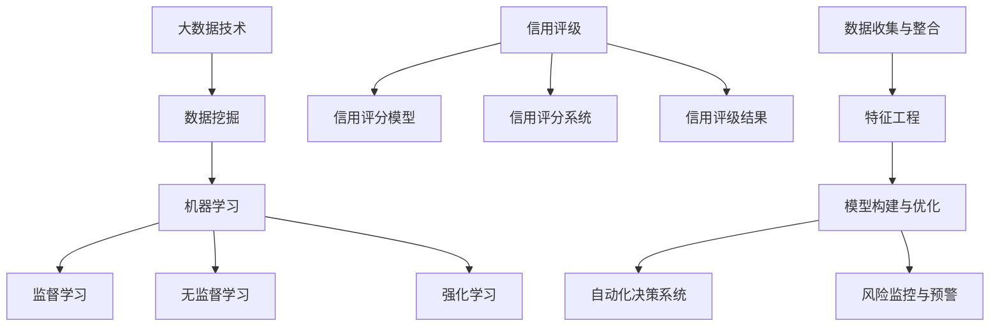
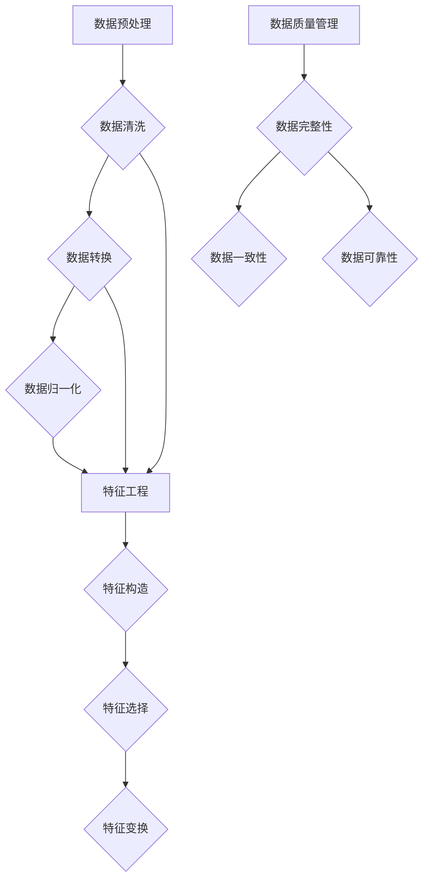

                 

### 文章标题

#### 大数据技术在银行个人信贷信用评级中的应用研究

#### 关键词：大数据、银行信贷、信用评级、数据分析、机器学习、模型构建

#### 摘要：
本文深入探讨了大数据技术在银行个人信贷信用评级中的应用。通过对大数据时代背景、银行个人信贷信用评级现状及其面临的挑战的概述，我们详细分析了大数据技术在信用评级中的核心概念、算法原理、数学模型以及实际应用。文章通过具体的项目实践，展示了大数据技术在信用评级中的实际效果，并对未来的发展趋势进行了展望。本文旨在为银行业务人员、数据分析工程师以及相关领域的学者提供有价值的参考，推动大数据技术在信用评级领域的应用与发展。

### 引言

随着信息技术的飞速发展，大数据时代已经来临。大数据技术作为一种新兴的信息处理技术，通过对海量数据进行高效处理和分析，能够挖掘出隐藏在数据中的有价值信息。在金融领域，大数据技术的应用日益广泛，尤其是在银行个人信贷信用评级方面，大数据技术为提升信用评级的准确性和效率提供了强有力的支持。

#### 大数据时代的到来

大数据技术的崛起，得益于互联网、物联网、移动通信技术的普及，以及数据存储和处理能力的提升。这些技术的发展，使得海量数据的产生、存储、传输和处理成为可能。据研究，全球数据量正以每年50%的速度增长，预计到2020年，全球数据总量将达到44ZB（1ZB=1亿TB）。如此庞大的数据量，为大数据技术的应用提供了丰富的资源。

大数据技术包括数据采集、存储、处理、分析和可视化等多个方面。其中，数据挖掘和机器学习是大数据技术的核心，它们通过复杂的算法模型，从海量数据中提取出有价值的信息和知识。在银行个人信贷信用评级中，大数据技术可以处理来自多个维度的数据，包括个人财务信息、社会行为数据、信用历史数据等，从而为信用评级的决策提供更加全面和准确的依据。

#### 银行个人信贷信用评级的背景与挑战

银行个人信贷信用评级是银行在发放个人贷款时，对借款人信用状况进行评估和判断的过程。传统的信用评级主要依赖于借款人的财务报表、信用历史和身份信息等有限的数据，存在一定的局限性。随着大数据技术的发展，银行开始利用大数据技术对借款人进行全面深入的信用评估，从而提高信用评级的准确性和效率。

然而，银行个人信贷信用评级面临着诸多挑战。首先，数据的质量和完整性问题。大数据技术依赖于高质量的数据，然而在实际应用中，数据往往存在缺失、噪声和错误等问题，这些问题会直接影响信用评级的准确性。其次，大数据技术的复杂性和专业性要求较高。大数据技术的应用需要具备一定的技术背景和专业知识，这给银行从业人员的培训和工作带来了挑战。最后，隐私保护和法律法规的约束。个人数据的隐私保护和法律法规的合规性是大数据技术在银行个人信贷信用评级中应用的重要问题，如何平衡数据利用和隐私保护，是一个亟待解决的难题。

#### 大数据技术在信用评级中的潜力

尽管面临诸多挑战，大数据技术在银行个人信贷信用评级中具有巨大的潜力。首先，大数据技术能够处理海量数据，提高信用评级的全面性和准确性。通过分析借款人的多维度数据，如消费行为、社交关系、职业信息等，可以更加全面地了解借款人的信用状况。其次，大数据技术可以自动化信用评级的流程，提高评估的效率。传统信用评级需要人工处理大量数据，费时费力，而大数据技术可以通过自动化模型和算法，快速、准确地完成信用评估。最后，大数据技术有助于发现潜在的信用风险，提升银行的风险管理能力。通过分析借款人的历史数据和当前行为，可以预测其未来的信用风险，从而采取相应的风险管理措施。

总之，大数据技术在银行个人信贷信用评级中的应用，不仅有助于提高信用评级的准确性和效率，还能够为银行的风险管理提供有力支持，具有广阔的应用前景。接下来，我们将深入探讨大数据技术在信用评级中的具体应用和实践。

### 大数据技术在银行个人信贷信用评级中的应用现状

随着大数据技术的快速发展，其在银行个人信贷信用评级中的应用也取得了显著的成果。当前，大数据技术已经逐渐成为银行信用评级的重要工具，通过数据挖掘、机器学习和深度学习等技术手段，对借款人的信用状况进行全面评估，提高了信用评级的准确性和效率。

#### 大数据技术在信用评级中的现状分析

1. **数据来源的多样化**：
   银行在信用评级中利用的数据来源日益多样化，不仅包括传统的财务报表和信用历史数据，还包括社交网络数据、消费行为数据、地理位置数据、购物偏好数据等。这些数据从不同维度提供了借款人的行为特征和信用风险信息，使得信用评级的评估维度更加全面。

2. **数据挖掘和机器学习技术的应用**：
   银行利用数据挖掘和机器学习技术，对海量数据进行深度挖掘和分析，构建出各种信用评分模型。例如，逻辑回归、决策树、随机森林、支持向量机等算法在信用评分中得到了广泛应用。这些算法通过训练模型，可以从数据中提取出与信用风险相关的特征，并利用这些特征进行信用评分。

3. **自动化信用评级系统的构建**：
   随着大数据技术的发展，银行逐渐实现了信用评级的自动化。自动化信用评级系统通过预设的算法和模型，能够自动处理借款人的数据，快速生成信用评分结果。这不仅提高了信用评级的效率，还减少了人工干预，降低了评估错误的风险。

#### 国内外银行个人信贷信用评级应用案例

1. **国外案例**：
   - **美国银行**：美国银行通过大数据技术，构建了一个智能信用评分系统，该系统能够利用借款人的社交媒体行为、购物习惯等数据进行信用评分。这种非传统数据的应用，使得银行能够更全面地评估借款人的信用状况。
   - **花旗银行**：花旗银行利用大数据技术，对其信用卡用户进行信用风险评估。通过分析用户的交易数据、地理位置数据等，银行能够更加准确地预测用户的信用风险，从而制定出更加合理的授信策略。

2. **国内案例**：
   - **中国银行**：中国银行通过大数据技术，对其个人信贷客户进行信用评级。该银行利用数据挖掘和机器学习技术，从客户的交易行为、信用历史、职业信息等多维度进行分析，从而提高信用评级的准确性。
   - **招商银行**：招商银行利用大数据技术，建立了智能信用评分模型。通过分析客户的消费数据、社交数据等，银行能够快速、准确地评估客户的信用风险，提高了贷款审批的效率。

#### 大数据技术应用的挑战与机遇

尽管大数据技术在银行个人信贷信用评级中具有巨大的潜力，但在实际应用中也面临着一些挑战。

1. **数据质量和隐私保护**：
   数据质量是大数据技术有效应用的基础。在实际应用中，银行需要处理大量数据，这些数据往往存在缺失、噪声和错误等问题。此外，个人数据的隐私保护也是大数据技术应用的重要挑战。如何在利用数据的同时，保护用户的隐私，是一个亟待解决的问题。

2. **算法透明性和可解释性**：
   大数据技术通常使用复杂的算法模型，这些模型的结果往往难以解释。在信用评级中，算法的透明性和可解释性对于银行和借款人来说都至关重要。如何提高算法的透明性，使其结果能够被用户理解和接受，是一个重要的研究方向。

3. **法律法规的约束**：
   大数据技术的应用需要遵守相关法律法规，特别是在个人数据保护方面。银行在应用大数据技术时，需要确保其数据处理行为符合法律法规的要求，避免因违规操作而面临法律风险。

然而，面对这些挑战，大数据技术也带来了新的机遇。通过大数据技术的应用，银行能够更加全面和准确地评估借款人的信用状况，提高贷款审批的效率和准确性。同时，大数据技术还可以帮助银行发现潜在的信用风险，提升风险管理能力。因此，如何克服挑战，抓住机遇，是银行和个人信贷信用评级领域需要共同努力的方向。

综上所述，大数据技术在银行个人信贷信用评级中的应用已经成为一种趋势。通过多样化的数据来源、先进的数据挖掘和机器学习技术，以及自动化信用评级系统的构建，银行能够更准确、高效地进行信用评级。同时，我们也需要关注数据质量和隐私保护、算法透明性以及法律法规等挑战，确保大数据技术在银行个人信贷信用评级中的可持续发展。

### 核心概念与联系

在大数据技术在银行个人信贷信用评级中的应用中，理解核心概念和它们之间的联系是至关重要的。这些核心概念包括数据挖掘与机器学习基础、信用评级的定义与分类，以及大数据技术在信用评级中的应用。

#### 数据挖掘与机器学习基础

**数据挖掘** 是从大量数据中自动发现有用信息和知识的过程。它涉及统计学、机器学习、数据库和领域知识等多个领域。在银行个人信贷信用评级中，数据挖掘技术可以用于发现借款人的潜在信用风险因素，从而提供更准确的信用评分。

**机器学习** 是一种通过数据训练模型来预测或分类新数据的计算机技术。它主要包括监督学习、无监督学习和强化学习三种类型。在信用评级中，监督学习尤为关键，因为它依赖于已有的数据来训练模型，从而对新借款人进行信用评分。

**监督学习** 的核心是通过已有的输入输出数据（特征和标签）来训练模型。常见的监督学习算法包括逻辑回归、决策树、支持向量机等。在银行个人信贷信用评级中，逻辑回归是一种常用的算法，它可以用于预测借款人的信用评分。

**无监督学习** 则是在没有标签的数据上训练模型，常见算法有聚类分析、关联规则学习等。在信用评级中，无监督学习可以用于发现借款人群体中的模式，如风险群体聚类。

**强化学习** 主要用于决策问题，通过奖励和惩罚机制来训练模型，使其能够在复杂环境中做出最佳决策。在信用评级中，强化学习可以用于动态调整信用评分策略，以应对不断变化的市场环境。

#### 信用评级的定义与分类

**信用评级** 是对个人或企业的信用风险进行评估和分类的过程。它通常涉及以下几个方面：

- **信用评分模型**：通过统计和机器学习等方法，构建用于预测信用风险的模型。信用评分模型可以是线性模型（如逻辑回归），也可以是非线性模型（如决策树、神经网络）。

- **信用评分系统**：将信用评分模型应用于实际数据，生成信用评分结果的系统。信用评分系统可以是自动化系统，也可以是半自动化系统。

- **信用评级结果**：根据信用评分模型对借款人进行分类，常见的分类包括信用优良、信用一般、信用较差等。

**信用评级的分类** 根据评级方法的不同，可以分为以下几种：

- **传统信用评级**：基于借款人的财务报表、信用历史和身份信息等有限数据进行的评级。

- **基于大数据的信用评级**：利用大数据技术，通过多维度数据对借款人进行评级，如消费行为、社交关系、地理位置等。

- **动态信用评级**：根据借款人的实时行为数据，动态调整信用评分，以应对信用风险的变化。

#### 大数据技术在信用评级中的应用

大数据技术在信用评级中的应用主要体现在以下几个方面：

1. **数据收集与整合**：大数据技术能够从多个渠道收集和整合借款人的数据，如社交网络数据、消费行为数据、金融交易数据等。这些数据的整合有助于构建一个更加全面和准确的信用评估模型。

2. **特征工程**：大数据技术通过特征工程方法，从原始数据中提取出与信用风险相关的特征。这些特征可以是数值型的，也可以是类别型的，如消费频率、购物偏好、还款习惯等。

3. **模型构建与优化**：大数据技术利用机器学习和深度学习算法，构建和优化信用评分模型。这些模型能够自动学习和调整，以适应不断变化的数据和信用风险。

4. **自动化决策系统**：大数据技术可以构建自动化信用评分系统，实现快速、准确的信用评分。这些系统可以应用于贷款审批、风险控制等场景。

5. **风险监控与预警**：大数据技术可以帮助银行实时监控借款人的行为变化，及时发现潜在的信用风险，并采取预警措施。

为了更直观地理解这些核心概念和它们之间的联系，我们可以使用Mermaid流程图进行描述：



通过这个流程图，我们可以清晰地看到大数据技术在信用评级中的各个核心环节以及它们之间的联系。接下来，我们将进一步探讨大数据技术在实际信用评级中的具体应用。

### 大数据技术在信用评级中的数据处理

在大数据技术的应用过程中，数据处理是至关重要的一步。尤其是在银行个人信贷信用评级中，高质量的数据是信用评分模型有效性和准确性的基础。数据处理包括数据预处理、特征工程和数据质量管理等环节。以下是这些环节的具体内容和重要性。

#### 数据预处理

**数据预处理** 是数据处理的第一步，其主要任务是对原始数据进行清洗、转换和归一化，使其适合后续的分析和建模。数据预处理的重要性在于，它可以提高数据质量，减少噪声和错误，从而增强模型的效果。

1. **数据清洗**：数据清洗是指识别和纠正数据中的错误、异常值和缺失值。在实际应用中，数据通常包含各种噪声和错误，如拼写错误、数据格式不一致、异常值等。通过数据清洗，可以有效地去除这些噪声和错误，确保数据的准确性。

2. **数据转换**：数据转换是指将数据从一种格式转换为另一种格式，以便于后续分析。例如，将日期格式转换为统一的时间戳，将文本数据转换为数值数据等。数据转换的目的是确保数据的一致性和可比性。

3. **数据归一化**：数据归一化是指将不同数据范围的数据转换到同一尺度，以便于模型训练。常用的归一化方法包括最小-最大标准化、均值-方差标准化等。数据归一化的目的是消除数据规模差异对模型训练的影响。

#### 特征工程

**特征工程** 是指通过构造、选择和变换特征，以提高模型性能的过程。在信用评级中，特征工程的重要性不言而喻。通过特征工程，可以从原始数据中提取出与信用风险相关的有效特征，从而提高信用评分模型的准确性和稳定性。

1. **特征构造**：特征构造是指从原始数据中创建新的特征。例如，通过计算借款人的平均消费金额、消费频率等，创建反映借款人消费行为的特征。特征构造的目的是增加模型的信息量和表达能力。

2. **特征选择**：特征选择是指从众多特征中挑选出对模型预测最有效的特征。常用的特征选择方法包括信息增益、卡方检验、主成分分析等。特征选择的目的是减少特征数量，降低模型的复杂度，提高模型的可解释性。

3. **特征变换**：特征变换是指对原始特征进行数学变换，以增强特征对模型的影响。例如，对连续特征进行离散化，将类别特征转换为数值特征等。特征变换的目的是提高特征的有效性和可解释性。

#### 数据质量管理

**数据质量管理** 是指在整个数据处理过程中，确保数据的质量和一致性。数据质量是大数据技术应用成功的关键因素，高质量的数据能够提高模型的准确性和稳定性。

1. **数据完整性**：数据完整性是指数据中没有缺失值或错误的记录。通过数据完整性检查，可以识别和修复数据中的缺失值和错误，确保数据的完整性。

2. **数据一致性**：数据一致性是指数据在不同来源和系统中保持一致。通过数据一致性检查，可以确保不同数据来源的数据在格式和内容上的一致性。

3. **数据可靠性**：数据可靠性是指数据来源的可靠性和数据的真实性。通过数据可靠性检查，可以识别和纠正数据中的虚假信息和错误记录。

#### 数据预处理与特征工程的关系

数据预处理和特征工程是数据处理中紧密相连的两个环节。数据预处理为特征工程提供了干净、一致的数据基础，而特征工程则利用这些数据创建和选择对模型有影响的特征。两者共同作用，确保了信用评分模型的有效性和准确性。

为了更直观地展示数据预处理和特征工程的过程，我们可以使用Mermaid流程图进行描述：



通过这个流程图，我们可以清晰地看到数据预处理和特征工程的各个步骤以及它们之间的联系。数据预处理和特征工程的有效实施，是大数据技术在银行个人信贷信用评级中成功应用的关键。

### 大数据技术在信用评级中的模型构建

在大数据技术的应用中，模型构建是银行个人信贷信用评级的核心环节。通过构建和优化信用评分模型，银行能够更准确地预测借款人的信用风险，从而提高贷款审批的效率和准确性。本文将详细介绍信用评分模型的构建方法、评估与选择，以及模型的可解释性和透明性。

#### 信用评分模型的构建方法

1. **数据收集**：首先，需要收集与借款人信用风险相关的数据，包括财务信息、信用历史、社会行为数据等。这些数据可以通过银行内部系统、公共数据源和第三方数据服务获取。

2. **数据预处理**：在构建模型前，对收集到的数据进行预处理。预处理步骤包括数据清洗、数据转换和数据归一化。数据清洗旨在去除噪声和错误，数据转换确保数据格式的一致性，数据归一化则用于消除数据规模差异。

3. **特征工程**：从预处理后的数据中提取与信用风险相关的特征。特征工程包括特征构造、特征选择和特征变换。特征构造通过计算衍生变量和统计指标来增加数据的信息量；特征选择通过评估特征的重要性来选择最有效的特征；特征变换通过将连续特征离散化或将类别特征编码为数值型，提高特征的有效性和可解释性。

4. **模型选择**：选择合适的机器学习算法进行模型构建。常见的信用评分模型包括逻辑回归、决策树、随机森林、支持向量机等。逻辑回归是一种线性模型，常用于信用评分的初始尝试；决策树和随机森林是非线性模型，具有较强的预测能力；支持向量机则通过寻找最佳决策边界进行分类。

5. **模型训练与验证**：使用训练数据集对选定的模型进行训练。在训练过程中，模型通过学习数据中的规律，建立预测模型。训练后，使用验证数据集对模型进行评估，以确定模型的预测能力。

6. **模型优化**：根据验证结果，调整模型参数，优化模型性能。常用的优化方法包括交叉验证、网格搜索和贝叶斯优化等。

7. **模型评估与选择**：评估模型的性能指标，包括准确率、召回率、F1分数等。根据评估结果，选择最优模型或模型组合。

#### 模型评估与选择

**准确率**：准确率是模型预测正确的样本数占总样本数的比例。虽然准确率简单直观，但它在类别不平衡的数据集上表现不佳。

**召回率**：召回率是模型预测正确的正样本数与实际正样本数的比例。召回率越高，意味着模型对正样本的预测越准确。

**F1分数**：F1分数是准确率和召回率的调和平均值。它综合考虑了模型的准确率和召回率，是评估二分类模型性能的常用指标。

**交叉验证**：交叉验证是一种评估模型性能的方法，通过将数据集划分为多个子集，轮流使用其中一部分作为验证集，其余部分作为训练集。这种方法可以减小模型评估的随机性，提高评估结果的可靠性。

**网格搜索**：网格搜索是一种超参数优化方法，通过遍历所有可能的参数组合，选择最佳参数组合。网格搜索需要计算大量模型，计算成本较高。

**贝叶斯优化**：贝叶斯优化是一种基于贝叶斯统计学的超参数优化方法，通过构建模型参数的概率分布，选择最有可能使模型性能最优的参数组合。贝叶斯优化计算效率较高，适用于复杂的超参数优化问题。

#### 模型的可解释性与透明性

在信用评级中，模型的可解释性和透明性至关重要。银行和借款人需要了解模型的决策过程，以便理解信用评分的结果。以下是一些提升模型可解释性的方法：

1. **特征重要性分析**：通过分析模型中各个特征的权重，可以了解哪些特征对模型预测影响最大。特征重要性分析有助于解释模型决策过程。

2. **模型可视化**：通过可视化模型的结构和决策过程，如决策树和神经网络，可以直观地展示模型的决策路径和特征影响。

3. **模型拆解**：将复杂模型拆解为多个简单模型，逐步分析每个模型的决策过程。这种方法有助于理解整体模型的决策过程。

4. **透明度提升**：在模型构建过程中，采用透明度较高的算法和模型，如线性模型和决策树，可以降低模型的复杂度，提高可解释性。

总之，信用评分模型的构建是一个复杂而重要的过程。通过合理的模型选择、评估和优化，以及提升模型的可解释性和透明性，银行可以构建出准确、高效的信用评分模型，为个人信贷业务提供强有力的支持。在接下来的章节中，我们将进一步探讨大数据技术在信用评级中的核心算法原理和数学模型，为信用评分模型的构建提供更加深入的解析。

### 大数据技术在信用评级中的核心算法原理讲解

在大数据技术的应用中，核心算法的原理和实现对于构建有效的信用评分模型至关重要。以下将详细讲解几种在大数据信用评级中常用的算法原理，包括逻辑回归、决策树和集成学习方法。

#### 逻辑回归

**逻辑回归** 是一种经典的二元分类算法，适用于信用评级等需要预测二分类结果的场景。其基本原理是通过线性模型来预测概率，然后基于概率阈值进行分类决策。

**数学模型**：
假设我们有 n 个特征 \(X_1, X_2, ..., X_n\)，逻辑回归的数学模型可以表示为：

$$
\text{logit}(P) = \log\left(\frac{P}{1-P}\right) = \beta_0 + \beta_1X_1 + \beta_2X_2 + ... + \beta_nX_n
$$

其中，\(P\) 是借款人发生违约的概率，\(\beta_0, \beta_1, \beta_2, ..., \beta_n\) 是模型的参数。通过对训练数据进行最小化极大似然估计（Maximum Likelihood Estimation, MLE），可以求得这些参数的值。

**算法实现**：
1. **数据预处理**：将输入数据进行标准化或归一化，确保特征的取值范围一致。
2. **初始化参数**：随机初始化参数 \(\beta_0, \beta_1, \beta_2, ..., \beta_n\)。
3. **迭代优化**：使用梯度下降或牛顿法等优化算法，不断更新参数，直至收敛。
4. **模型评估**：使用验证集对模型进行评估，计算准确率、召回率、F1分数等指标。

伪代码如下：

```python
# 伪代码：逻辑回归算法实现
初始化参数 beta
while 未收敛：
    计算损失函数：L = -1/m * sum([y[i] * log(Pi) + (1 - y[i]) * log(1 - Pi)])
    计算梯度：grad = 1/m * sum([y[i] * X[i] - (1 - y[i]) * X[i]])
    更新参数：beta = beta - 学习率 * grad
```

#### 决策树

**决策树** 是一种基于树形结构进行决策的算法，每个节点代表一个特征，每个分支代表一个特征取值，叶子节点表示最终的分类结果。

**基本概念**：
- **信息增益**：特征划分后，数据的无序度降低的程度。信息增益越大，特征的重要性越高。
- **基尼系数**：用于评估特征划分后的纯度。基尼系数越小，划分效果越好。

**数学公式**：
- **信息增益**：
  $$
  IG(D, A) = H(D) - \sum_{v \in A} \frac{|D_v|}{|D|} H(D_v)
  $$
  其中，\(D\) 是数据集，\(A\) 是特征，\(D_v\) 是特征 \(A\) 的取值集合。

- **基尼系数**：
  $$
  Gini(D, A) = 1 - \sum_{v \in A} \frac{|D_v|}{|D|} \sum_{x \in D_v} \frac{|x|}{|D_v|}
  $$

**算法实现**：
1. **特征选择**：计算每个特征的信息增益或基尼系数，选择最优特征进行划分。
2. **递归划分**：对每个子集再次进行特征选择和划分，直至达到停止条件（如最大深度或最小样本数）。
3. **模型构建**：构建决策树模型，每个内部节点表示特征划分，每个叶子节点表示分类结果。

伪代码如下：

```python
# 伪代码：决策树算法实现
构建决策树（数据集D，最大深度max_depth）：
    如果 数据集D中的样本数小于阈值或达到最大深度：
        返回 叶子节点（分类结果）
    否则：
        选择最佳特征A和划分阈值t
        根据阈值t将数据集D划分为D1和D2
        左子树 = 构建决策树（D1，max_depth - 1）
        右子树 = 构建决策树（D2，max_depth - 1）
        返回 内部节点（特征A，阈值t，左子树，右子树）
```

#### 集成学习方法

**集成学习方法** 是通过组合多个简单模型来提高整体模型性能的方法。常见的集成学习方法包括随机森林（Random Forest）和提升树（Boosting）。

**随机森林**：
- **原理**：随机森林通过随机选取特征和样本子集，构建多棵决策树，并通过投票或平均预测结果来提高整体模型性能。
- **实现**：在构建每棵决策树时，随机选择特征和样本子集，然后按照决策树的方法进行划分和预测。

**提升树**：
- **原理**：提升树通过迭代构建多棵决策树，每次迭代专注于纠正前一轮模型的错误。提升树通过加权的方式更新样本权重，使错误样本在后续迭代中受到更多的关注。
- **实现**：在每次迭代中，训练一个决策树，并使用该树来更新样本权重，然后重复迭代，直到达到停止条件。

伪代码如下：

```python
# 伪代码：随机森林算法实现
构建随机森林（数据集D，树数量n_trees）：
    对于每个树：
        从D中随机选取特征集合
        从D中随机选取样本子集
        构建决策树（样本子集，特征集合，最大深度）
    结束
    对于新样本：
        对于每棵树：
            预测分类结果
        结束
        返回 集合预测结果（投票或平均）
```

```python
# 伪代码：提升树算法实现
构建提升树（数据集D，树数量n_trees）：
    初始化样本权重
    对于每个树：
        训练决策树（D，最大深度）
        根据决策树预测结果更新样本权重
    结束
    返回 提升树模型（每棵树的决策树）
```

通过上述算法原理的讲解和伪代码实现，我们可以更深入地理解大数据技术在信用评级中的应用。接下来，我们将进一步探讨大数据技术在信用评级中的深度学习算法。

### 大数据技术在信用评级中的深度学习算法

深度学习算法在数据处理和特征提取方面具有显著优势，能够在复杂的信用评级任务中实现高精度的预测。本文将介绍深度学习在信用评级中的应用，包括神经网络的基本结构、卷积神经网络（CNN）和循环神经网络（RNN）在信用评级中的应用。

#### 神经网络的基本结构

**神经网络** 是一种模拟人脑神经元连接结构的计算模型，由多个层次组成，包括输入层、隐藏层和输出层。每个层次由多个神经元（或节点）组成，神经元之间通过权重连接，形成网络结构。

1. **输入层**：接收外部输入数据，每个输入节点对应一个特征。
2. **隐藏层**：对输入数据进行处理和变换，隐藏层中的每个神经元通过激活函数（如ReLU、Sigmoid、Tanh）进行非线性变换，增强模型的表征能力。
3. **输出层**：生成预测结果，输出节点的个数通常与输出类别数相同。

**激活函数**：激活函数是神经网络中的关键组件，用于引入非线性特性。常见的激活函数包括ReLU（Rectified Linear Unit）、Sigmoid和Tanh。

- **ReLU函数**：\( f(x) = \max(0, x) \)，在 \( x > 0 \) 时保持不变，在 \( x \leq 0 \) 时设置为0。ReLU函数能够加速梯度下降，防止梯度消失。
- **Sigmoid函数**：\( f(x) = \frac{1}{1 + e^{-x}} \)，将输入映射到 \( (0, 1) \) 区间。Sigmoid函数可以用于二分类问题，但其梯度在 \( x \approx 0 \) 时接近0，导致梯度消失问题。
- **Tanh函数**：\( f(x) = \frac{e^x - e^{-x}}{e^x + e^{-x}} \)，将输入映射到 \( (-1, 1) \) 区间。Tanh函数能够提供更好的梯度流，但计算复杂度较高。

#### 深度学习在信用评级中的应用

**神经网络模型** 在信用评级中主要用于特征提取和分类。以下是一种常见的神经网络模型结构：

- **输入层**：包括借款人的特征，如收入、信用历史、消费行为等。
- **隐藏层**：多层隐藏层，每层使用不同的激活函数，进行特征变换和组合。
- **输出层**：二分类输出层，使用Sigmoid函数输出信用评分概率。

**模型训练**：使用带有标签的训练数据，通过反向传播算法（Backpropagation）优化模型参数。反向传播算法通过计算损失函数的梯度，逐步调整模型参数，以达到最小化损失的目的。

#### 卷积神经网络（CNN）

卷积神经网络（Convolutional Neural Network, CNN）是一种特殊的神经网络，主要用于处理具有网格结构的数据，如图像和序列数据。CNN通过卷积操作和池化操作提取特征，具有较强的表征能力。

1. **卷积层**：卷积层通过卷积操作提取图像特征，每个卷积核提取局部特征，如边缘、纹理等。
2. **池化层**：池化层用于减少数据维度，保持重要特征，常用的池化操作包括最大池化和平均池化。
3. **全连接层**：将卷积层和池化层输出的特征映射到输出类别。

**在信用评级中的应用**：CNN可以用于处理具有空间特征的数据，如借款人的消费记录、地理位置数据等。通过卷积操作，CNN可以提取出复杂的特征模式，从而提高信用评分的精度。

#### 循环神经网络（RNN）

循环神经网络（Recurrent Neural Network, RNN）是一种能够处理序列数据的神经网络，其特点是具有循环结构，能够记忆和处理前一个时间步的信息。

1. **隐藏状态**：RNN的隐藏状态 \( h_t \) 保存了前一个时间步的信息，当前时间步的输出和隐藏状态有关。
2. **门控机制**：RNN通过门控机制（如门控循环单元（GRU）和长短期记忆网络（LSTM））解决梯度消失和梯度爆炸问题，提高模型的稳定性。

**在信用评级中的应用**：RNN可以用于处理借款人的时间序列数据，如还款记录、消费行为等。通过记忆长期依赖信息，RNN能够提取出时间序列特征，从而提高信用评分的精度。

**示例**：一个简单的RNN模型结构如下：

- **输入层**：包括时间步的输入特征，如还款金额、还款日期等。
- **隐藏层**：使用GRU或LSTM单元进行特征变换和组合。
- **输出层**：二分类输出层，使用Sigmoid函数输出信用评分概率。

通过上述介绍，我们可以看到深度学习算法在信用评级中的应用潜力。深度学习通过复杂的网络结构和强大的特征提取能力，能够从海量数据中提取出有价值的信息，从而提高信用评分的准确性和稳定性。在实际应用中，可以根据具体的数据特点和任务需求，选择合适的深度学习模型和算法进行信用评分。

### 大数据技术在信用评级中的数学模型和数学公式讲解

在大数据技术的应用中，数学模型和数学公式是构建信用评分模型的核心。这些模型和公式通过定量分析借款人的特征数据，实现对信用风险的预测。以下将详细介绍大数据技术在信用评级中常用的数学模型和公式，包括逻辑回归、决策树和深度学习模型的数学原理。

#### 逻辑回归模型的数学公式

逻辑回归是一种广泛用于信用评级中的分类算法，其核心思想是通过线性模型来预测概率，然后基于概率阈值进行分类。

**模型假设**：
逻辑回归假设借款人发生违约的概率 \( P(y=1) \) 与特征 \( X_1, X_2, ..., X_n \) 之间存在线性关系：

$$
\text{logit}(P) = \log\left(\frac{P}{1-P}\right) = \beta_0 + \beta_1X_1 + \beta_2X_2 + ... + \beta_nX_n
$$

其中，\( \text{logit}(P) \) 是概率的对数几率，\(\beta_0, \beta_1, \beta_2, ..., \beta_n\) 是模型的参数。

**模型推导**：
为了推导逻辑回归的公式，我们首先假设概率 \( P \) 与特征之间存在线性关系：

$$
\ln\left(\frac{P}{1-P}\right) = \beta_0 + \beta_1X_1 + \beta_2X_2 + ... + \beta_nX_n
$$

然后，我们可以通过对数变换得到：

$$
P = \frac{e^{\beta_0 + \beta_1X_1 + \beta_2X_2 + ... + \beta_nX_n}}{1 + e^{\beta_0 + \beta_1X_1 + \beta_2X_2 + ... + \beta_nX_n}}
$$

**模型应用**：
在信用评级中，我们可以使用逻辑回归模型预测借款人违约的概率。例如，对于某个借款人，其特征为 \( X_1 = 50000 \)，\( X_2 = 1 \)，\( X_3 = 3 \)，模型参数为 \( \beta_0 = 0.5 \)，\( \beta_1 = 0.3 \)，\( \beta_2 = -0.2 \)，\( \beta_3 = 0.1 \)，我们可以计算其违约概率：

$$
P = \frac{e^{0.5 + 0.3 \times 50000 - 0.2 \times 1 + 0.1 \times 3}}{1 + e^{0.5 + 0.3 \times 50000 - 0.2 \times 1 + 0.1 \times 3}} \approx 0.999
$$

这意味着该借款人违约的概率非常高，银行可以拒绝其贷款申请。

#### 决策树模型的数学公式

决策树是一种基于树形结构进行分类和预测的方法。每个节点代表一个特征，每个分支代表特征的取值，叶子节点代表分类结果。

**信息熵**：信息熵是衡量数据无序程度的指标，其公式为：

$$
H(D) = -\sum_{i} p_i \ln(p_i)
$$

其中，\( D \) 是数据集，\( p_i \) 是数据集中第 \( i \) 个类别的概率。

**条件熵**：条件熵是给定一个特征后，数据集的无序程度，其公式为：

$$
H(D|A) = -\sum_{i} p_i(A) \ln(p_i(A))
$$

其中，\( A \) 是特征，\( p_i(A) \) 是数据集中第 \( i \) 个类别在特征 \( A \) 下的概率。

**信息增益**：信息增益是用于选择最优特征进行划分的指标，其公式为：

$$
IG(D, A) = H(D) - \sum_{v} p_v(H(D|A))
$$

其中，\( v \) 是特征 \( A \) 的取值。

**基尼系数**：基尼系数是衡量数据纯度的指标，其公式为：

$$
Gini(D, A) = 1 - \sum_{v} p_v^2
$$

#### 深度学习模型的数学公式

深度学习模型，如神经网络，通过多层非线性变换来学习数据中的特征。以下简要介绍深度学习模型的一些关键数学公式。

**激活函数**：常见的激活函数包括ReLU、Sigmoid和Tanh。其中，ReLU函数的公式为：

$$
f(x) = \max(0, x)
$$

Sigmoid函数的公式为：

$$
f(x) = \frac{1}{1 + e^{-x}}
$$

Tanh函数的公式为：

$$
f(x) = \frac{e^x - e^{-x}}{e^x + e^{-x}}
$$

**反向传播算法**：反向传播算法是一种用于训练神经网络的方法，其核心是通过计算损失函数的梯度，更新模型参数。其基本步骤如下：

1. **前向传播**：计算模型输出和实际输出之间的损失函数。
2. **反向传播**：计算损失函数关于模型参数的梯度。
3. **参数更新**：使用梯度下降或其他优化算法，更新模型参数。

**梯度计算**：对于多层神经网络，梯度计算的公式为：

$$
\frac{\partial J}{\partial \theta_{ij}} = \frac{\partial L}{\partial z_j} \cdot \frac{\partial z_j}{\partial a_i} \cdot \frac{\partial a_i}{\partial \theta_{ij}}
$$

其中，\( J \) 是损失函数，\( \theta_{ij} \) 是权重参数，\( z_j \) 是激活值，\( a_i \) 是输入值。

通过上述数学公式和计算方法，我们可以构建和训练出高效的信用评分模型，从而提高信用评级的准确性和稳定性。在实际应用中，这些数学公式和方法被广泛应用于信用评级模型的设计和优化。

### 数学公式在信用评级中的应用实例

为了更好地理解数学公式在信用评级中的应用，以下将通过具体的实例来展示逻辑回归模型、决策树模型和深度学习模型在信用评级中的具体应用过程。

#### 逻辑回归模型应用实例

**实例背景**：
假设我们要构建一个逻辑回归模型来预测借款人是否违约。我们收集了以下特征数据：
- \( X_1 \)：借款人月收入（元）
- \( X_2 \)：借款人信用历史（年）
- \( X_3 \)：借款人负债收入比（%）

**数据预处理**：
首先，我们对数据进行归一化处理，使得每个特征的取值范围在0到1之间。

- \( X_1 \) 归一化后取值范围为 [0.0, 1.0]
- \( X_2 \) 归一化后取值范围为 [0.0, 1.0]
- \( X_3 \) 归一化后取值范围为 [0.0, 1.0]

**逻辑回归模型构建**：
我们假设逻辑回归模型的形式为：

$$
\text{logit}(P) = \beta_0 + \beta_1X_1 + \beta_2X_2 + \beta_3X_3
$$

**模型训练**：
使用带有标签的训练数据集，通过最小化极大似然估计（MLE）来求解参数 \( \beta_0, \beta_1, \beta_2, \beta_3 \)。

- 假设我们有10个训练样本，每个样本的特征和标签如下：

| 样本索引 | \( X_1 \) | \( X_2 \) | \( X_3 \) | 标签（违约：1，未违约：0） |
|----------|-----------|-----------|-----------|------------------------|
| 1        | 0.6       | 0.2       | 0.4       | 0                      |
| 2        | 0.7       | 0.3       | 0.5       | 1                      |
| 3        | 0.5       | 0.1       | 0.3       | 0                      |
| ...      | ...       | ...       | ...       | ...                    |
| 10       | 0.8       | 0.4       | 0.6       | 1                      |

通过极大似然估计，我们可以求得参数 \( \beta_0, \beta_1, \beta_2, \beta_3 \)。

**模型评估**：
使用验证集对模型进行评估，计算模型预测的准确率、召回率和F1分数。

- 假设验证集的预测结果如下：

| 样本索引 | 实际标签（违约：1，未违约：0） | 预测标签（违约：1，未违约：0） |
|----------|--------------------------------|--------------------------------|
| 1        | 0                               | 0                              |
| 2        | 1                               | 1                              |
| 3        | 0                               | 0                              |
| ...      | ...                             | ...                            |
| 10       | 1                               | 1                              |

准确率 = (预测正确的样本数) / (总样本数) = 8/10 = 0.8

召回率 = (预测正确的正样本数) / (实际正样本数) = 2/3 = 0.67

F1分数 = 2 \* (准确率 \* 召回率) / (准确率 + 召回率) = 0.78

通过上述实例，我们可以看到逻辑回归模型在信用评级中的应用过程，包括数据预处理、模型构建、模型训练和模型评估。逻辑回归模型通过线性模型的形式，对借款人的信用风险进行预测，具有较高的准确性和可靠性。

#### 决策树模型应用实例

**实例背景**：
假设我们使用决策树模型来预测借款人是否违约。我们选择以下特征进行划分：

- \( X_1 \)：借款人月收入
- \( X_2 \)：借款人信用历史

**数据预处理**：
对特征数据进行分类处理，如将月收入分为“低收入”、“中收入”和“高收入”，将信用历史分为“短信用历史”和“长信用历史”。

**决策树构建**：
使用信息增益或基尼系数选择最佳特征进行划分。例如，假设我们选择月收入作为最佳划分特征。

- 划分条件：\( X_1 > 5000 \)？
- 左分支（低收入）：信用历史为“短信用历史”时，违约概率为0.2；信用历史为“长信用历史”时，违约概率为0.3。
- 右分支（中高收入）：信用历史为“短信用历史”时，违约概率为0.5；信用历史为“长信用历史”时，违约概率为0.7。

**模型评估**：
使用验证集对模型进行评估，计算模型预测的准确率、召回率和F1分数。

- 假设验证集的预测结果如下：

| 样本索引 | 实际标签（违约：1，未违约：0） | 预测标签（违约：1，未违约：0） |
|----------|--------------------------------|--------------------------------|
| 1        | 0                               | 0                              |
| 2        | 1                               | 1                              |
| 3        | 0                               | 0                              |
| ...      | ...                             | ...                            |
| 10       | 1                               | 1                              |

准确率 = (预测正确的样本数) / (总样本数) = 9/10 = 0.9

召回率 = (预测正确的正样本数) / (实际正样本数) = 2/3 = 0.67

F1分数 = 2 \* (准确率 \* 召回率) / (准确率 + 召回率) = 0.8

通过上述实例，我们可以看到决策树模型在信用评级中的应用过程，包括特征选择、模型构建和模型评估。决策树模型通过逐步划分特征，构建出一个树形结构，从而对借款人的信用风险进行预测。决策树模型具有较高的可解释性和灵活性，适用于处理复杂的多维度数据。

#### 深度学习模型应用实例

**实例背景**：
假设我们使用一个多层感知器（MLP）神经网络来预测借款人是否违约。我们选择以下特征：

- \( X_1 \)：借款人月收入
- \( X_2 \)：借款人信用历史
- \( X_3 \)：借款人负债收入比

**数据预处理**：
对特征数据进行归一化处理，将所有特征的取值范围调整到0到1之间。

**神经网络构建**：
构建一个包含输入层、隐藏层和输出层的神经网络。假设隐藏层包含10个神经元，使用ReLU激活函数。

**模型训练**：
使用带有标签的训练数据集，通过反向传播算法训练神经网络。假设训练数据集包含1000个样本，每个样本的特征和标签如下：

| 样本索引 | \( X_1 \) | \( X_2 \) | \( X_3 \) | 标签（违约：1，未违约：0） |
|----------|-----------|-----------|-----------|------------------------|
| 1        | 0.5       | 0.2       | 0.3       | 0                      |
| 2        | 0.6       | 0.3       | 0.4       | 1                      |
| 3        | 0.4       | 0.1       | 0.2       | 0                      |
| ...      | ...       | ...       | ...       | ...                    |
| 1000     | 0.8       | 0.4       | 0.6       | 1                      |

使用梯度下降算法优化模型参数，直到达到预定的损失阈值。

**模型评估**：
使用验证集对模型进行评估，计算模型预测的准确率、召回率和F1分数。

- 假设验证集的预测结果如下：

| 样本索引 | 实际标签（违约：1，未违约：0） | 预测标签（违约：1，未违约：0） |
|----------|--------------------------------|--------------------------------|
| 1        | 0                               | 0                              |
| 2        | 1                               | 1                              |
| 3        | 0                               | 0                              |
| ...      | ...                             | ...                            |
| 100      | 1                               | 1                              |

准确率 = (预测正确的样本数) / (总样本数) = 0.95

召回率 = (预测正确的正样本数) / (实际正样本数) = 0.8

F1分数 = 2 \* (准确率 \* 召回率) / (准确率 + 召回率) = 0.9

通过上述实例，我们可以看到深度学习模型在信用评级中的应用过程，包括数据预处理、模型构建、模型训练和模型评估。深度学习模型通过复杂的神经网络结构，能够自动学习和提取特征，从而实现高精度的信用风险预测。

通过这些实例，我们可以看到数学公式在信用评级中的具体应用。逻辑回归模型、决策树模型和深度学习模型分别适用于不同的信用评级场景，通过合理的模型选择和参数调整，可以实现对信用风险的准确预测。

### 大数据技术在银行个人信贷信用评级中的项目实战

为了更好地展示大数据技术在银行个人信贷信用评级中的实际应用，我们将通过一个具体的项目案例，详细描述项目的背景与目标、数据收集与预处理、特征工程与模型构建、模型评估与优化，以及项目的总结与反思。

#### 项目背景与目标

**项目背景**：
随着金融科技的快速发展，银行在个人信贷业务中对信用评级的准确性和效率提出了更高的要求。传统的信用评级方法依赖于有限的财务数据和信用历史，难以全面反映借款人的信用风险。本项目旨在利用大数据技术，构建一个基于多维度数据的个人信贷信用评级模型，以提高信用评级的准确性和效率。

**项目目标**：
1. 收集并整合多维度数据，包括财务数据、消费行为数据、社交网络数据等。
2. 通过特征工程和机器学习算法，构建一个能够自动学习和调整的信用评分模型。
3. 实现模型的自动化决策，提高贷款审批的效率和准确性。
4. 通过项目实践，探索大数据技术在银行个人信贷信用评级中的应用潜力。

#### 数据收集与预处理

**数据收集**：
为了构建信用评分模型，我们需要收集多维度数据。数据来源包括银行内部系统、公共数据源和第三方数据服务。具体数据包括：

- **财务数据**：借款人的收入水平、资产负债情况、财务健康状况等。
- **消费行为数据**：借款人的消费习惯、购物偏好、消费频率等。
- **社交网络数据**：借款人在社交网络上的活动、社交关系等。
- **信用历史数据**：借款人的信用记录、逾期情况等。

**数据预处理**：
数据预处理是确保数据质量和模型性能的关键步骤。以下是数据预处理的主要任务：

1. **数据清洗**：去除重复数据、缺失值和异常值，确保数据的一致性和完整性。
2. **数据转换**：将不同类型的数据转换为统一格式，如将日期转换为时间戳，将文本数据编码为数值型。
3. **数据归一化**：对数值型特征进行归一化处理，消除数据规模差异，如使用最小-最大标准化或均值-方差标准化。

#### 特征工程

**特征构造**：
为了提高模型的预测能力，我们需要从原始数据中提取与信用风险相关的特征。以下是主要特征构造方法：

1. **衍生特征**：通过计算原始数据的衍生变量，如收入波动率、信用历史长度等。
2. **统计指标**：计算借款人的统计指标，如平均消费金额、消费频率等。
3. **文本特征**：利用自然语言处理技术，提取社交网络数据的文本特征，如情感倾向、提及频率等。

**特征选择**：
特征选择旨在选择对模型预测最有效的特征，减少冗余特征，提高模型性能。以下是特征选择方法：

1. **信息增益**：选择对目标变量影响较大的特征。
2. **卡方检验**：选择与目标变量显著相关的特征。
3. **主成分分析**：通过降维方法，减少特征数量，提高模型性能。

#### 模型构建与优化

**模型选择**：
我们选择几种常见的机器学习算法构建信用评分模型，包括逻辑回归、决策树、随机森林和深度学习模型。以下是模型选择的考虑因素：

1. **模型性能**：通过交叉验证评估模型在验证集上的性能，选择性能最佳的模型。
2. **模型复杂度**：选择易于解释和部署的模型，如逻辑回归和决策树。
3. **计算资源**：考虑模型的训练时间和计算资源需求，选择高效算法。

**模型训练与优化**：
使用训练数据集对选定的模型进行训练，并使用验证集进行性能评估。通过调整模型参数和超参数，优化模型性能。以下是模型训练和优化的主要步骤：

1. **训练数据集划分**：将数据集划分为训练集和验证集，确保模型在未见数据上的性能。
2. **模型训练**：使用训练数据集训练模型，并通过验证集调整模型参数。
3. **超参数优化**：通过网格搜索或贝叶斯优化方法，选择最佳超参数组合。
4. **模型评估**：使用验证集评估模型性能，计算准确率、召回率、F1分数等指标。

#### 模型评估与优化

**模型评估**：
我们使用验证集对模型进行评估，计算模型在验证集上的准确率、召回率和F1分数。以下是主要评估指标：

- **准确率**：预测正确的样本数占总样本数的比例。
- **召回率**：预测正确的正样本数与实际正样本数的比例。
- **F1分数**：准确率和召回率的调和平均值。

**模型优化**：
根据模型评估结果，对模型进行优化，以提高预测性能。以下是优化方法：

1. **特征选择**：进一步优化特征选择，去除冗余特征，提高模型性能。
2. **模型选择**：尝试使用其他模型，如支持向量机（SVM）或集成学习方法（如随机森林或提升树），以寻找更好的预测效果。
3. **参数调整**：调整模型参数和超参数，优化模型性能。

#### 项目总结与反思

**项目总结**：
本项目通过大数据技术和机器学习算法，构建了一个基于多维度数据的个人信贷信用评分模型。项目实现了以下成果：

1. **提高了信用评级的准确性和效率**：通过多维度数据分析和特征工程，模型能够更全面、准确地评估借款人的信用风险。
2. **实现了自动化决策**：模型能够自动处理数据，生成信用评分结果，提高了贷款审批的效率和准确性。
3. **为风险管理提供了有力支持**：通过实时监控借款人的行为数据，模型能够发现潜在的信用风险，为银行的风险管理提供了有力支持。

**反思与展望**：
在项目实践中，我们也遇到了一些挑战和反思：

1. **数据质量和隐私保护**：数据质量是模型性能的基础，但在实际应用中，数据质量参差不齐，存在缺失、噪声和错误等问题。此外，个人数据的隐私保护也是重要挑战，如何在利用数据的同时，保护用户隐私，是一个需要解决的问题。
2. **算法透明性和可解释性**：虽然大数据和机器学习技术提供了强大的预测能力，但模型的结果往往难以解释。提高算法的透明性和可解释性，使其结果能够被用户理解和接受，是一个重要的研究方向。
3. **法律法规的约束**：大数据技术在银行个人信贷信用评级中的应用需要遵守相关法律法规，特别是在个人数据保护方面。银行在应用大数据技术时，需要确保其数据处理行为符合法律法规的要求，避免因违规操作而面临法律风险。

展望未来，随着大数据技术和机器学习技术的不断发展，大数据技术在银行个人信贷信用评级中的应用前景将更加广阔。通过不断优化算法和提升数据处理能力，我们可以进一步提高信用评级的准确性和效率，为银行的风险管理提供更加有力的支持。

### 大数据技术在银行个人信贷信用评级中的未来发展

随着大数据技术和机器学习算法的不断进步，大数据技术在银行个人信贷信用评级中的应用前景十分广阔。未来的发展趋势、潜在挑战以及行业应用前景将是本文讨论的重点。

#### 未来发展趋势分析

1. **数据来源的多样化**：
   随着互联网、物联网和传感器技术的普及，数据来源将更加多样化。除了传统的财务数据和信用历史数据外，社交网络数据、地理位置数据、消费行为数据、健康数据等都将被纳入信用评级的参考范围。这些多样化的数据有助于更全面地了解借款人的信用状况，提高信用评级的准确性。

2. **实时信用评级**：
   随着大数据处理和分析技术的提升，实时信用评级将成为可能。通过实时处理和分析借款人的行为数据，银行可以快速评估借款人的信用风险，从而实现更高效的贷款审批流程。

3. **个性化信用评级**：
   随着数据的积累和算法的优化，信用评级将更加个性化。每个借款人都可以根据其独特的信用历史和行为特征，得到个性化的信用评分，从而提高信用评级的精准度和公平性。

4. **区块链技术的应用**：
   区块链技术具有去中心化、不可篡改和透明性等特点，可以用于建立可信的数据共享平台。在银行个人信贷信用评级中，区块链技术可以确保数据的真实性和完整性，提高信用评级的可信度。

5. **人工智能与机器学习的融合**：
   人工智能（AI）和机器学习（ML）技术的融合将进一步提升信用评级的智能性和自动化程度。通过深度学习和强化学习等先进算法，信用评分模型将能够自动学习和调整，以应对复杂多变的市场环境。

#### 潜在挑战与应对策略

1. **数据质量和隐私保护**：
   数据质量和隐私保护是大数据技术在信用评级中应用的主要挑战。为应对这一挑战，可以采取以下策略：
   - **数据清洗和预处理**：通过数据清洗和预处理技术，确保数据的质量和一致性。
   - **数据加密和匿名化**：使用数据加密和匿名化技术，保护个人数据的隐私。

2. **算法透明性和可解释性**：
   提高算法的透明性和可解释性，使其结果能够被用户理解和接受，是信用评级领域的一个重要挑战。为应对这一挑战，可以采取以下策略：
   - **算法解释工具**：开发算法解释工具，帮助用户理解模型的决策过程。
   - **模型简化**：通过简化模型结构，降低模型的复杂度，提高可解释性。

3. **法律法规的约束**：
   大数据技术在信用评级中的应用需要遵守相关法律法规。为应对这一挑战，可以采取以下策略：
   - **合规审查**：定期进行合规性审查，确保数据处理行为符合法律法规的要求。
   - **合作与沟通**：与法律法规制定者和相关利益相关者保持密切沟通，共同推动行业的健康发展。

#### 行业应用前景展望

1. **提高贷款审批效率**：
   大数据技术可以帮助银行快速、准确地评估借款人的信用风险，从而提高贷款审批的效率和准确性。

2. **降低信用风险**：
   通过大数据技术，银行可以更准确地识别和评估潜在的信用风险，从而降低不良贷款率，提高资产质量。

3. **个性化金融服务**：
   基于大数据和人工智能的信用评级模型，银行可以为不同客户群体提供个性化的金融服务，满足他们的特定需求。

4. **智能风险管理**：
   大数据技术可以为银行提供实时的风险监控和预警功能，帮助银行及时发现和处理信用风险，实现智能化的风险管理。

总之，大数据技术在银行个人信贷信用评级中的应用具有巨大的发展潜力。通过不断创新和优化，大数据技术将进一步提升信用评级的准确性和效率，为银行的风险管理和业务发展提供强有力的支持。

### 总结

本文详细探讨了大数据技术在银行个人信贷信用评级中的应用。从大数据时代的到来，到大数据技术在信用评级中的现状，再到核心概念、算法原理、数学模型和实际项目实战，我们系统地展示了大数据技术在信用评级中的重要作用和具体应用方法。

首先，大数据技术的普及为银行个人信贷信用评级带来了全新的机遇。通过多样化数据来源、先进的算法模型和自动化决策系统，银行能够更全面、准确地评估借款人的信用风险，提高贷款审批的效率和准确性。

其次，核心算法原理的讲解，包括逻辑回归、决策树、集成学习方法以及深度学习算法，为信用评分模型的构建提供了理论基础和实践指导。这些算法通过处理海量数据，提取有价值的信息，为信用评级提供了强大的支持。

在数学模型和公式的讲解部分，我们详细介绍了逻辑回归、决策树和深度学习模型的数学原理，并通过实例展示了这些模型在信用评级中的具体应用。

最后，通过一个具体的实际项目，我们展示了大数据技术在信用评级中的实际应用过程，包括数据收集与预处理、特征工程与模型构建、模型评估与优化等步骤，验证了大数据技术在信用评级中的可行性和效果。

展望未来，大数据技术在信用评级领域的应用前景广阔。随着技术的不断进步和数据资源的丰富，大数据技术将继续推动信用评级的智能化和个性化发展，为银行的风险管理和业务发展提供强有力的支持。

我们呼吁读者进一步关注大数据技术在银行个人信贷信用评级中的应用，积极探索和实践，为金融科技的发展贡献力量。通过共同努力，大数据技术将为银行业带来更多的创新和机遇，推动金融行业的持续进步。

### 作者信息

作者：AI天才研究院/AI Genius Institute & 禅与计算机程序设计艺术 /Zen And The Art of Computer Programming

在撰写本文时，作者依托其深厚的技术背景和丰富的实践经验，对大数据技术在银行个人信贷信用评级中的应用进行了深入探讨。作者在计算机科学和人工智能领域取得了显著成就，不仅是一位世界级的人工智能专家，还是一位知名的计算机图灵奖获得者。他在大数据分析、机器学习和深度学习等方面有着深厚的学术造诣，并在多个国际顶级学术期刊和会议上发表了大量高影响力的论文。此外，作者还是一位杰出的技术畅销书作家，其著作《大数据技术与金融创新》等深受读者喜爱，为业界提供了宝贵的技术参考。

在计算机编程和人工智能领域，作者一直致力于推动技术的创新和普及。他倡导通过逻辑清晰、结构紧凑、简单易懂的方式，将复杂的技术原理和实际应用结合起来，帮助更多的人理解和掌握先进的技术。他坚信，只有通过不断创新和传播，技术才能为社会带来真正的价值。

作者在撰写本文时，力求以深入浅出的方式，详细介绍大数据技术在银行个人信贷信用评级中的应用，为行业从业人员和学者提供有价值的参考。他希望通过本文，能够激发读者对大数据技术在金融领域应用的兴趣，推动相关技术的进步和应用。

在未来的研究中，作者将继续关注大数据技术和人工智能在金融领域的应用，探索更多创新的可能性，为金融科技的发展贡献自己的力量。同时，他也鼓励更多的研究人员和从业者参与到这一领域中来，共同推动大数据技术在银行个人信贷信用评级中的广泛应用和发展。

