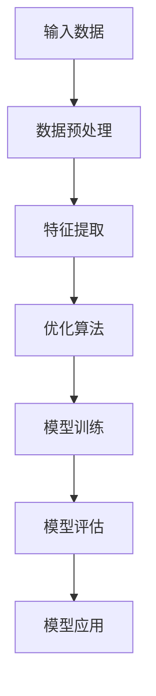

                 

# 《大模型创业的波折与变化》

## 关键词

大模型创业，人工智能，深度学习，技术挑战，市场机遇，团队建设，融资策略，项目实施，市场推广，波折与变化。

## 摘要

本文深入探讨了在大模型创业过程中所经历的波折与变化。首先，我们回顾了大模型创业的背景与发展历程，介绍了大模型技术的基础及其在各个领域的应用。接着，本文详细分析了大模型创业的实践过程，包括团队建设、融资策略、项目实施及市场推广等关键环节。在此基础上，我们讨论了创业过程中常见的挑战与问题，并通过失败与成功的案例分析，总结了创业经验与启示。最后，本文展望了大模型创业的未来发展趋势，为创业者提供了宝贵的参考和指导。

---

## 目录大纲

### 第一部分：大模型创业背景与基础

- **第1章：大模型创业概述**
  - 1.1 大模型创业的发展历程
  - 1.2 大模型创业的关键因素
  - 1.3 大模型创业的机遇与挑战
  - 1.4 大模型创业的核心要素
  - 1.5 大模型创业的成功案例分析

- **第2章：大模型技术基础**
  - 2.1 大模型的基本原理
  - 2.2 大模型的架构设计
  - 2.3 大模型的训练与优化
  - 2.4 大模型的应用场景

### 第二部分：大模型创业实践

- **第3章：大模型创业团队建设**
  - 3.1 大模型创业团队的组织架构
  - 3.2 大模型创业团队的技能需求
  - 3.3 大模型创业团队的管理方法
  - 3.4 大模型创业团队的激励机制

- **第4章：大模型创业融资策略**
  - 4.1 大模型创业的融资渠道
  - 4.2 大模型创业的融资策略
  - 4.3 大模型创业的融资风险与应对
  - 4.4 大模型创业的成功融资案例

- **第5章：大模型创业项目实施**
  - 5.1 大模型创业项目的启动
  - 5.2 大模型创业项目的规划
  - 5.3 大模型创业项目的执行
  - 5.4 大模型创业项目的监控与调整

- **第6章：大模型创业市场推广**
  - 6.1 大模型创业市场的定位
  - 6.2 大模型创业产品的推广策略
  - 6.3 大模型创业产品的市场调研
  - 6.4 大模型创业产品的用户反馈与改进

- **第7章：大模型创业的波折与变化**
  - 7.1 大模型创业过程中的常见问题
  - 7.2 大模型创业失败案例分析
  - 7.3 大模型创业的成功经验与启示
  - 7.4 大模型创业的未来发展趋势

### 附录

- **附录A：大模型创业常用工具与资源**
- **附录B：大模型创业相关法律法规**

---

### 第一部分：大模型创业背景与基础

#### 第1章：大模型创业概述

大模型创业，即围绕大型人工智能模型（如深度学习模型、自然语言处理模型等）的开发和应用进行创业活动。这一领域在过去几年中经历了飞速的发展，吸引了大量创业者、投资者以及学术界的关注。

## 1.1 大模型创业的发展历程

大模型创业的发展历程可以追溯到20世纪80年代，当时神经网络和深度学习的概念首次被提出。然而，由于计算能力和数据资源的限制，这些模型在当时并没有得到广泛应用。

随着计算能力的提升和大数据技术的发展，深度学习在21世纪初开始逐步崛起。特别是2012年，AlexNet在ImageNet比赛中取得了突破性的成绩，这标志着深度学习时代的到来。自此之后，大模型创业进入了快速发展的阶段。

## 1.2 大模型创业的关键因素

大模型创业的成功离不开以下几个关键因素：

1. **技术实力**：创业者需要具备深厚的计算机科学和人工智能技术背景，能够设计和实现高效的大模型。
2. **数据资源**：大模型需要大量的数据来训练和优化，因此创业者需要获取和整合足够的数据资源。
3. **计算能力**：大模型的训练和推理需要强大的计算能力，创业者需要具备或获取高性能的计算资源。
4. **市场需求**：创业者需要深入了解市场需求，将技术优势转化为实际的产品和服务。

## 1.3 大模型创业的机遇与挑战

大模型创业面临巨大的机遇和挑战：

1. **机遇**：
   - **人工智能技术进步**：深度学习、自然语言处理等技术的不断进步为创业提供了广阔的空间。
   - **市场需求的增加**：随着人工智能应用的普及，各个领域对大模型的需求日益增长。
   - **数据资源的丰富**：互联网和物联网的发展带来了海量的数据，为创业者提供了丰富的数据资源。

2. **挑战**：
   - **技术门槛**：大模型的开发需要深厚的技术积累，对于创业者来说是一个挑战。
   - **计算资源**：大模型的训练和推理需要大量的计算资源，这对于创业初期的创业者来说是一个重大的挑战。
   - **市场竞争**：随着大模型创业的兴起，市场上出现了大量的竞争者，创业者需要具备独特的优势才能脱颖而出。

## 1.4 大模型创业的核心要素

1. **人才团队**：一个高效的人才团队是创业成功的关键。团队成员应具备跨学科的知识结构，包括计算机科学、数据科学、人工智能等领域。
2. **技术能力**：创业者需要具备先进的技术能力，包括大模型的设计与实现、算法优化等。
3. **市场洞察**：创业者需要具备敏锐的市场洞察力，能够准确把握市场趋势和用户需求。
4. **商业模式**：创业者需要构建一个可行的商业模式，确保大模型的商业化应用。

## 1.5 大模型创业的成功案例分析

以下是一些大模型创业的成功案例：

1. **DeepMind**：DeepMind通过深度强化学习技术，开发了AlphaGo等世界级的人工智能产品，成为人工智能领域的领军企业。
2. **OpenAI**：OpenAI通过大规模的深度学习模型，开发了GPT系列模型，为自然语言处理领域带来了革命性的进步。
3. **Salesforce**：Salesforce通过深度学习技术，优化了其客户关系管理（CRM）系统，提高了客户满意度和服务效率。

这些案例表明，大模型创业不仅需要先进的技术，还需要对市场需求的深刻理解，以及灵活的商业策略。

在接下来的章节中，我们将深入探讨大模型技术的基础、创业团队的构建、融资策略、项目实施以及市场推广等关键环节，帮助读者更好地理解大模型创业的实践过程。

#### 第2章：大模型技术基础

大模型技术是当前人工智能领域的重要研究方向之一。本章将介绍大模型的基本原理、架构设计、训练与优化方法以及应用场景，帮助读者了解大模型技术的核心概念和基础。

## 2.1 大模型的基本原理

大模型，通常指的是具有数十亿乃至数千亿参数的神经网络模型。这些模型通过学习大量的数据，可以自动提取特征，进行预测、分类和生成等任务。大模型的基本原理包括以下几个方面：

1. **神经网络**：神经网络是构建大模型的基础。它由大量神经元组成，通过前向传播和反向传播算法，实现数据的输入和输出。
2. **深度学习**：深度学习是一种多层神经网络的学习方法。通过增加网络层数，深度学习模型可以提取更高层次的特征，从而实现更复杂的任务。
3. **优化算法**：大模型的训练过程涉及到大量的优化问题。常用的优化算法包括梯度下降、Adam优化器等，这些算法可以加快模型的收敛速度，提高模型的性能。
4. **注意力机制**：注意力机制是近年来在自然语言处理领域取得突破的一种关键技术。它通过动态调整模型对输入数据的关注程度，提高模型的建模能力。

## 2.2 大模型的架构设计

大模型的架构设计是构建高效、可扩展模型的关键。以下是一些常见的大模型架构：

1. **卷积神经网络（CNN）**：CNN是处理图像数据的经典架构。它通过卷积层、池化层和全连接层等结构，实现图像的特征提取和分类。
2. **循环神经网络（RNN）**：RNN是处理序列数据的常用架构。它通过隐藏状态和反馈连接，实现序列数据的建模。
3. **变换器（Transformer）**：Transformer是近年来在自然语言处理领域取得重大突破的架构。它通过自注意力机制，实现高效的特征提取和建模。
4. **生成对抗网络（GAN）**：GAN是一种生成模型，通过对抗训练，实现数据的生成和判别。

## 2.3 大模型的训练与优化

大模型的训练与优化是确保模型性能的关键环节。以下是一些常见的训练与优化方法：

1. **数据预处理**：数据预处理包括数据清洗、归一化、数据增强等步骤，可以提高模型的训练效率和性能。
2. **超参数调优**：超参数调优是模型训练过程中的一项重要任务。通过调整学习率、批量大小、正则化参数等超参数，可以提高模型的性能和泛化能力。
3. **训练策略**：训练策略包括批量归一化、学习率调度、梯度裁剪等，可以加速模型的训练过程。
4. **优化算法**：优化算法的选择对模型的训练效率和性能有重要影响。常见的优化算法包括梯度下降、Adam优化器等。

## 2.4 大模型的应用场景

大模型的应用场景非常广泛，包括图像识别、自然语言处理、推荐系统、自动驾驶等多个领域。以下是一些典型的大模型应用案例：

1. **图像识别**：大模型在图像识别领域取得了显著的成果，如Google的Inception模型、Facebook的ResNet模型等。
2. **自然语言处理**：大模型在自然语言处理领域也有着广泛的应用，如OpenAI的GPT系列模型、BERT模型等。
3. **推荐系统**：大模型可以帮助构建高效的推荐系统，如Amazon、Netflix等公司使用深度学习技术优化其推荐算法。
4. **自动驾驶**：自动驾驶技术依赖于大模型进行环境感知和决策，如Waymo、Tesla等公司使用深度学习技术实现自动驾驶。

## 图1：大模型的基本架构

## 表1：常见的大模型架构及其特点

| 架构类型 | 特点 | 应用场景 |
| :------: | :--- | :------: |
|  CNN     | 卷积、池化 | 图像识别 |
|  RNN     | 反馈连接 | 序列建模 |
| Transformer | 自注意力 | 自然语言处理 |
|  GAN     | 对抗训练 | 数据生成 |

通过本章的介绍，读者可以初步了解大模型技术的基础知识，为后续章节的深入探讨打下基础。在接下来的章节中，我们将继续探讨大模型创业的团队建设、融资策略、项目实施和市场推广等关键环节。

#### 第3章：大模型创业团队建设

大模型创业的成功离不开一个高效、协作的团队。团队建设是创业初期的一项关键任务，它不仅决定了项目的进度和质量，还影响了团队的士气和创新能力。本章将详细探讨大模型创业团队的组织架构、技能需求、管理方法和激励机制。

## 3.1 大模型创业团队的组织架构

一个高效的大模型创业团队应该具备清晰的组织架构，以确保团队成员之间的有效沟通和协作。以下是一个典型的大模型创业团队组织架构：

1. **项目领导层**：项目领导层包括项目经理、技术总监和业务总监等，负责整体项目的规划、管理和协调。
2. **技术团队**：技术团队是团队的核心，包括数据科学家、机器学习工程师、软件工程师等，负责大模型的设计、开发和优化。
3. **数据团队**：数据团队负责数据的收集、处理和存储，确保模型训练所需的数据质量和数量。
4. **产品团队**：产品团队负责产品的设计和开发，包括用户界面、用户体验和功能模块等。
5. **市场与销售团队**：市场与销售团队负责市场调研、产品推广和销售策略的制定与执行。
6. **运营团队**：运营团队负责项目的日常运营，包括技术支持、客户服务和运维保障等。

## 3.2 大模型创业团队的技能需求

大模型创业团队需要具备多方面的技能，以满足不同岗位的需求。以下是一些关键岗位的技能要求：

1. **数据科学家**：数据科学家需要具备强大的数学和统计背景，熟悉深度学习框架（如TensorFlow、PyTorch）和数据处理工具（如Pandas、NumPy）。
2. **机器学习工程师**：机器学习工程师需要具备机器学习理论知识和编程技能，能够设计和实现高效的机器学习算法。
3. **软件工程师**：软件工程师需要熟练掌握编程语言（如Python、Java）和开发框架（如Django、Spring），负责构建和维护大模型的应用程序。
4. **产品经理**：产品经理需要具备用户洞察和市场分析能力，能够制定产品策略和需求文档，确保产品的市场需求和技术可行性。
5. **市场与销售人员**：市场与销售人员需要具备市场推广和销售技巧，能够制定有效的营销策略和销售计划，开拓和扩大市场。
6. **数据工程师**：数据工程师需要熟悉数据存储和处理技术（如Hadoop、Spark），负责搭建和管理大数据平台。

## 3.3 大模型创业团队的管理方法

有效的管理方法对于保持团队的高效和创新能力至关重要。以下是一些大模型创业团队的管理方法：

1. **目标明确**：明确团队的目标和任务，确保每个成员都了解自己的职责和期望成果。
2. **任务分配**：根据团队成员的技能和兴趣，合理分配任务，确保任务的完成质量和效率。
3. **沟通协作**：建立高效的沟通机制，鼓励团队成员之间的交流和合作，提高团队的协作效率。
4. **激励机制**：建立激励机制，奖励团队成员的突出贡献，激发团队的积极性和创造力。
5. **持续学习**：鼓励团队成员不断学习新知识和技能，提升团队的整体技术水平。

## 3.4 大模型创业团队的激励机制

激励机制是保持团队活力和创新能力的重要手段。以下是一些有效的激励机制：

1. **绩效奖金**：根据团队成员的绩效表现，发放奖金，激励成员提高工作效率。
2. **股权激励**：为团队成员提供股权激励，让团队成员分享公司的成功和成长。
3. **项目奖励**：对成功完成的项目进行奖励，鼓励团队成员积极参与项目开发。
4. **培训与进修**：为团队成员提供培训和学习机会，提升团队成员的专业技能。
5. **团队活动**：定期组织团队活动，增强团队成员之间的凝聚力和团队精神。

## 表2：大模型创业团队的岗位技能需求

| 岗位 | 技能需求 |
| :---: | :--- |
| 数据科学家 | 数学、统计学、深度学习、数据处理 |
| 机器学习工程师 | 机器学习理论、编程、算法实现 |
| 软件工程师 | 编程、框架、系统设计 |
| 产品经理 | 用户洞察、市场分析、产品设计 |
| 市场与销售人员 | 市场推广、销售技巧、战略制定 |
| 数据工程师 | 数据存储、处理、大数据平台 |

通过有效的团队建设和激励机制，大模型创业团队可以充分发挥其优势，提高项目的成功率。在下一章中，我们将探讨大模型创业的融资策略，帮助创业者筹集所需资金，支持项目的可持续发展。

#### 第4章：大模型创业融资策略

融资策略对于大模型创业项目的成功至关重要。本章将详细探讨大模型创业的主要融资渠道、融资策略、融资风险与应对措施以及成功融资案例，为创业者提供宝贵的融资指导。

## 4.1 大模型创业的融资渠道

大模型创业项目通常需要大量的资金投入，因此选择合适的融资渠道至关重要。以下是一些常见的融资渠道：

1. **天使投资**：天使投资是指个人投资者对初创企业的早期投资。天使投资者通常具有丰富的行业经验和资金实力，可以为创业项目提供资金、资源和指导。
2. **风险投资**：风险投资是指专业投资机构对高风险、高回报的创业项目的投资。风险投资机构通常关注技术创新和市场潜力，愿意为创业项目提供资金和战略支持。
3. **政府支持**：许多国家和地区都设有政府支持的计划和基金，为科技型创业项目提供资金支持。创业者可以通过申请政府的科技项目资金、创新基金等，获得部分资金支持。
4. **众筹**：众筹是一种通过互联网平台向公众筹集资金的方式。创业者可以通过众筹平台展示项目方案和产品原型，吸引投资者和支持者，筹集项目所需的资金。
5. **银行贷款**：创业者可以向银行申请创业贷款，利用银行提供的低息贷款解决资金问题。但是，银行贷款通常需要较高的担保和审批流程，对于初创企业来说可能存在一定难度。

## 4.2 大模型创业的融资策略

为了有效地筹集资金，创业者需要制定合理的融资策略。以下是一些常见的融资策略：

1. **分阶段融资**：分阶段融资是指根据项目的进展和需求，逐步筹集资金。创业初期，创业者可以寻求天使投资或小规模的风险投资，用于技术研发和产品原型开发。在项目进入成长期，创业者可以寻求更大规模的风险投资或政府支持资金，用于市场推广和规模化生产。
2. **多渠道融资**：创业者在融资过程中，应该尽可能地利用多种渠道筹集资金，以降低单一渠道的风险。创业者可以通过天使投资、风险投资、政府支持、众筹等多种方式筹集资金，确保项目的资金链稳定。
3. **股权融资**：股权融资是指创业者通过出让公司股份来换取投资资金。股权融资有助于引入有经验和资源的投资者，同时也可以减轻债务负担。然而，股权融资也会稀释创业者的股权，需要创业者权衡利弊。
4. **债务融资**：债务融资是指创业者通过借款来筹集资金。债务融资通常包括银行贷款、债券发行等。债务融资的利率较低，但需要按时偿还本金和利息，否则可能导致严重的财务风险。

## 4.3 大模型创业的融资风险与应对措施

大模型创业项目在融资过程中可能会面临多种风险，创业者需要提前识别和应对这些风险。以下是一些常见的融资风险及应对措施：

1. **市场风险**：市场风险是指市场环境变化导致项目失败的风险。应对措施包括：
   - **市场调研**：在项目启动前进行充分的市场调研，了解市场需求和竞争状况。
   - **灵活调整**：根据市场变化，灵活调整项目方向和策略，降低市场风险。

2. **技术风险**：技术风险是指项目技术不可行或技术更新导致的风险。应对措施包括：
   - **技术储备**：在技术实现上留有一定的余地，确保技术方案的可行性。
   - **持续研发**：持续进行技术研发，跟踪行业技术动态，及时调整技术路线。

3. **财务风险**：财务风险是指资金链断裂或财务状况不佳导致的风险。应对措施包括：
   - **财务规划**：制定详细的财务规划，确保资金的合理使用和有效管理。
   - **风险控制**：建立风险控制机制，及时发现和解决财务问题。

4. **法律风险**：法律风险是指项目涉及的法律问题导致的法律纠纷。应对措施包括：
   - **法律咨询**：在项目启动前进行法律咨询，确保项目的法律合规性。
   - **风险规避**：通过合同条款和法律手段，规避或降低法律风险。

## 4.4 大模型创业的成功融资案例

以下是一些大模型创业的成功融资案例，供创业者参考：

1. **DeepMind**：DeepMind在创业初期获得了风险投资机构的支持，通过多轮融资，筹集了数千万美元的资金。DeepMind的成功融资与其技术创新和市场前景密切相关，吸引了多家顶级风险投资机构的关注。

2. **OpenAI**：OpenAI在成立之初就获得了多家顶级风险投资机构的支持，包括微软、软银等。OpenAI通过多轮融资，筹集了数十亿美元的资金，用于大模型的研发和推广。

3. **Salesforce**：Salesforce通过天使投资和风险投资等多渠道融资，成功地完成了公司的初创和成长。Salesforce的融资策略包括分阶段融资、多渠道融资和股权融资等，确保了公司的资金链稳定。

通过有效的融资策略和风险控制，大模型创业项目可以获得所需的资金支持，实现项目的可持续发展。在下一章中，我们将探讨大模型创业项目的实施过程，包括项目启动、规划、执行、监控和调整等关键环节。

#### 第5章：大模型创业项目实施

大模型创业项目的成功实施是一个系统性的过程，涉及到多个关键环节。本章将详细讨论大模型创业项目的启动、规划、执行、监控与调整，帮助读者了解项目实施的具体步骤和策略。

## 5.1 大模型创业项目的启动

项目启动是创业项目的第一步，也是最重要的一步。成功的启动需要充分准备和细致的规划。以下是项目启动的关键步骤：

1. **项目立项**：项目立项是项目启动的起点，需要明确项目的目标、范围、预期成果和所需资源。项目经理应该与团队成员和利益相关者进行充分的沟通，确保项目目标和预期成果的明确性。

2. **组建团队**：根据项目需求，组建合适的团队。团队成员应该具备相关的技能和经验，能够胜任各自的角色和职责。组建团队时，需要考虑团队的规模、结构和协作机制，确保团队成员之间的有效沟通和协作。

3. **制定项目计划**：制定详细的项目计划，包括项目的进度安排、任务分配、资源需求和预算等。项目计划应该明确项目的里程碑、关键节点和交付物，为后续的项目执行提供指导。

4. **资源准备**：确保项目所需的资源到位，包括资金、技术设备、人力资源等。在资源准备过程中，需要与利益相关者进行沟通，争取必要的支持和资源。

5. **风险识别与评估**：在项目启动阶段，进行风险识别和评估，制定相应的风险应对措施。风险识别和评估可以帮助团队提前预见可能的问题，并采取预防措施。

## 5.2 大模型创业项目的规划

项目规划是项目实施的关键环节，它为项目提供了详细的指导。以下是项目规划的主要内容：

1. **项目目标**：明确项目的目标，确保项目团队和利益相关者对项目目标有共同的理解和认同。项目目标应该具体、可衡量、可实现、相关性强和时限性。

2. **范围管理**：确定项目的范围，明确项目的工作内容和边界。范围管理包括项目的需求分析、功能定义和优先级排序等，确保项目团队在正确的工作方向上努力。

3. **进度计划**：制定项目的进度计划，包括项目的时间表、里程碑和关键节点。进度计划应该详细、可行，并留有一定的缓冲时间，以应对项目中的不确定性。

4. **资源规划**：确定项目所需的资源，包括人力、设备、资金等。资源规划应该合理分配资源，确保项目在资源充足的情况下顺利进行。

5. **质量管理**：制定项目的质量管理计划，确保项目的交付物符合质量标准。质量管理包括质量目标、质量控制和质量保证等。

6. **风险管理**：制定项目风险管理计划，识别可能的风险，制定相应的应对措施。风险管理计划应该包括风险的识别、评估、监控和应对策略。

## 5.3 大模型创业项目的执行

项目执行是项目实施的核心环节，涉及到任务的执行、监控和协调。以下是项目执行的关键步骤：

1. **任务分配**：根据项目计划和资源情况，将任务分配给合适的团队成员。任务分配应该充分考虑团队成员的技能和兴趣，确保任务的顺利完成。

2. **团队协作**：鼓励团队成员之间的协作和沟通，确保团队成员能够共同解决问题、共享资源和知识。团队协作可以通过定期的会议、报告和协作工具来实现。

3. **进度监控**：定期监控项目进度，确保项目按照计划进行。项目监控包括关键节点的检查、任务的跟踪和资源的调配等。

4. **问题解决**：及时识别和解决项目中出现的问题，确保项目不受影响。问题解决包括问题的识别、分析和解决策略的制定。

5. **变更管理**：在项目执行过程中，可能会出现一些变更需求。变更管理包括变更的识别、评估、批准和实施等，确保项目的变更得到有效控制。

## 5.4 大模型创业项目的监控与调整

项目监控与调整是确保项目成功的关键环节。以下是项目监控与调整的主要内容：

1. **进度监控**：定期监控项目的进度，确保项目按照计划进行。进度监控可以通过项目报告、里程碑评审和进度跟踪来实现。

2. **质量监控**：监控项目的质量，确保项目交付物符合质量标准。质量监控可以通过质量检查、测试和评估来实现。

3. **成本监控**：监控项目的成本，确保项目的资金使用合理、有效。成本监控可以通过预算管理、成本分析和成本控制来实现。

4. **风险监控**：监控项目中的风险，确保风险得到有效控制。风险监控可以通过风险识别、风险评估和风险应对来实现。

5. **调整与优化**：根据监控结果，及时调整项目计划和管理策略，优化项目执行。调整与优化包括计划调整、资源调配和管理策略优化等。

通过有效的项目监控与调整，大模型创业项目可以及时发现和解决问题，确保项目顺利推进。在下一章中，我们将探讨大模型创业的市场推广策略，帮助创业者扩大市场影响力，实现产品的商业化。

#### 第6章：大模型创业市场推广

市场推广是大模型创业成功的关键环节之一。本章将详细讨论大模型创业市场的定位、产品推广策略、市场调研和用户反馈与改进，帮助创业者了解如何有效推广产品，提升市场竞争力。

## 6.1 大模型创业市场的定位

市场定位是市场推广的第一步，决定了产品在市场中的定位和目标用户群体。以下是市场定位的关键步骤：

1. **目标市场选择**：明确目标市场，确定产品的潜在用户群体。目标市场应该具有足够的规模和增长潜力，符合公司的战略方向。

2. **市场细分**：对目标市场进行细分，识别不同的细分市场和目标客户群体。市场细分可以帮助公司更有针对性地开发产品和制定推广策略。

3. **竞争分析**：分析竞争对手的产品、市场策略和市场份额，了解市场格局和竞争态势。竞争分析有助于公司制定差异化策略，提升市场竞争力。

4. **定位策略**：根据目标市场和竞争态势，确定产品的定位策略。定位策略应该突出产品的独特价值，满足目标用户的需求。

## 6.2 大模型创业产品的推广策略

推广策略决定了产品在市场中的传播速度和覆盖范围。以下是一些有效的推广策略：

1. **内容营销**：通过发布高质量的技术博客、案例分析、白皮书等内容，提升产品的知名度和专业形象。内容营销可以帮助建立品牌权威，吸引潜在用户。

2. **社交媒体推广**：利用社交媒体平台（如微博、微信、LinkedIn等）进行推广，发布产品信息、使用教程、用户案例等，与用户进行互动，增强品牌影响力。

3. **合作推广**：与其他行业内的知名企业、研究机构、媒体等合作，通过联合推广、联合发布等形式，扩大产品的知名度和影响力。

4. **线下活动**：举办研讨会、论坛、展会等活动，展示产品的优势和应用场景，吸引潜在用户和合作伙伴。

5. **广告投放**：根据目标市场和用户群体，选择合适的广告渠道（如搜索引擎广告、社交媒体广告等）进行投放，提高产品的曝光率。

## 6.3 大模型创业产品的市场调研

市场调研是了解市场需求和用户反馈的重要手段。以下是一些常用的市场调研方法：

1. **问卷调查**：通过设计问卷，收集目标用户的反馈和需求，了解用户对产品的看法和期望。

2. **用户访谈**：与目标用户进行面对面访谈，深入了解用户的使用习惯、需求痛点和对产品的期望。

3. **竞品分析**：分析竞争对手的产品功能、用户评价和市场表现，了解市场趋势和用户需求。

4. **数据分析**：通过数据分析工具，收集用户行为数据、市场数据等，分析用户行为和市场趋势。

## 6.4 大模型创业产品的用户反馈与改进

用户反馈是产品改进的重要依据。以下是如何收集用户反馈和进行产品改进的方法：

1. **用户反馈收集**：通过用户调研、在线评价、社交媒体互动等方式，收集用户的反馈和意见。

2. **反馈分析**：对用户反馈进行分类和分析，识别用户的主要需求和痛点。

3. **产品改进**：根据用户反馈，对产品进行改进和优化。改进过程中，应充分考虑用户体验和需求，确保产品符合用户期望。

4. **迭代发布**：将改进后的产品进行迭代发布，持续收集用户反馈，不断优化产品。

## 表3：大模型创业产品推广策略

| 推广策略 | 优点 | 缺点 |
| :------: | :-- | :-- |
| 内容营销 | 提升品牌权威，吸引潜在用户 | 需要持续产出高质量内容 |
| 社交媒体推广 | 快速传播，增强品牌影响力 | 成本较高，效果难以量化 |
| 合作推广 | 扩大影响力，吸引更多用户 | 需要寻找合适的合作伙伴 |
| 线下活动 | 突出产品优势，吸引潜在用户 | 成本较高，覆盖范围有限 |
| 广告投放 | 提高产品曝光率，快速吸引用户 | 成本较高，效果难以控制 |

通过有效的市场推广策略和用户反馈机制，大模型创业产品可以迅速占领市场，赢得用户的认可。在下一章中，我们将探讨大模型创业过程中可能遇到的波折与变化，以及如何应对这些问题，为创业者的持续发展提供指导。

#### 第7章：大模型创业的波折与变化

大模型创业的过程并非一帆风顺，创业者往往会面临各种波折与变化。本章将分析大模型创业过程中常见的挑战和问题，通过失败与成功的案例分析，总结创业经验与启示，并展望大模型创业的未来发展趋势。

## 7.1 大模型创业过程中的常见问题

在大模型创业过程中，创业者可能会遇到以下常见问题：

1. **技术难题**：大模型的开发需要深厚的计算机科学和人工智能技术背景。许多创业者在技术实现过程中会遇到算法优化、数据质量、计算资源不足等技术难题。

2. **数据挑战**：大模型训练需要大量的高质量数据。创业者需要面对数据获取、数据清洗和数据标注等挑战，确保模型训练的数据质量和数量。

3. **计算资源**：大模型的训练和推理需要强大的计算能力。许多创业者在计算资源方面面临限制，可能需要依赖云计算服务或合作获得高性能计算资源。

4. **市场竞争**：大模型创业领域竞争激烈，创业者需要面对竞争对手的挑战。如何在激烈的市场环境中脱颖而出，成为创业者需要思考的问题。

5. **商业模式**：构建可持续的商业模式是创业成功的关键。许多创业者在商业模式设计上存在困惑，如何将技术优势转化为商业价值，是创业者需要解决的问题。

## 7.2 大模型创业失败案例分析

以下是一些大模型创业失败案例，分析其失败原因：

1. **案例1：数据质量问题**  
   一个初创公司开发了一款基于深度学习的图像识别应用，但在实际应用中，模型的表现不佳。经过调查，发现数据集质量低下，存在大量错误和缺失的数据，导致模型训练效果不佳。最终，该公司因数据问题而失败。

2. **案例2：技术实现问题**  
   另一家初创公司开发了一款自然语言处理产品，但由于技术实现问题，产品在用户体验和性能上存在明显缺陷。公司无法吸引到足够用户，最终因无法持续运营而失败。

3. **案例3：市场竞争问题**  
   一家专注于自动驾驶技术的初创公司，在市场竞争中面临来自行业巨头和新兴企业的强大压力。由于资金和资源有限，该公司无法在竞争中保持竞争力，最终失败。

4. **案例4：商业模式问题**  
   一家开发智能医疗诊断系统的初创公司，在商业模式设计上存在缺陷。公司无法找到合适的商业模式，无法实现盈利，最终因资金链断裂而失败。

## 7.3 大模型创业的成功经验与启示

以下是一些大模型创业成功案例，总结其成功经验：

1. **案例1：技术创新**  
   DeepMind通过技术创新，开发了AlphaGo等世界级的人工智能产品。公司成功的原因在于其强大的技术实力和持续的研发投入。

2. **案例2：市场定位**  
   OpenAI在自然语言处理领域取得了显著成就。公司成功的原因在于其对市场的敏锐洞察和精准的市场定位。

3. **案例3：团队协作**  
   Salesforce通过高效的团队协作和持续的产品迭代，成为了客户关系管理（CRM）领域的领军企业。公司成功的原因在于其强大的团队协作和创新能力。

4. **案例4：商业模式**  
   Airbnb通过创新的商业模式，颠覆了传统住宿行业。公司成功的原因在于其独特的商业模式和用户价值主张。

成功经验启示：

- 技术创新是创业成功的关键。创业者需要持续关注技术发展趋势，不断优化产品和技术。
- 市场定位和用户洞察是创业成功的重要前提。创业者需要深入了解市场需求，精准定位目标用户。
- 团队协作和创新能力是创业成功的重要保障。创业者需要构建高效团队，激发团队的创造力和创新能力。
- 商业模式是创业成功的基础。创业者需要设计可持续的商业模式，确保公司的盈利和可持续发展。

## 7.4 大模型创业的未来发展趋势

大模型创业的未来发展趋势包括以下几个方面：

1. **技术创新**：随着人工智能技术的不断进步，大模型将变得更加智能和高效。深度学习、强化学习、多模态学习等新技术将不断涌现，推动大模型技术的进一步发展。

2. **行业应用**：大模型将在更多行业得到广泛应用，如医疗、金融、制造业、交通运输等。行业解决方案将不断涌现，为各行业提供智能化、高效化的解决方案。

3. **数据隐私与安全**：随着数据隐私和安全问题的日益突出，创业者需要关注数据隐私保护技术，确保用户数据的安全和合规。

4. **计算资源优化**：大模型的训练和推理将需要更高的计算资源。云计算、边缘计算等新技术将得到广泛应用，优化计算资源的利用效率。

5. **可持续发展**：创业者需要关注可持续发展的理念，通过绿色技术和节能措施，降低创业项目对环境的影响。

通过以上分析，我们可以看到，大模型创业领域充满机遇和挑战。创业者需要不断学习和适应，把握市场趋势，应对各种挑战，实现创业梦想。在未来的创业道路上，大模型技术将继续发挥重要作用，为创业者提供无限可能。

### 附录A：大模型创业常用工具与资源

- **深度学习框架**：TensorFlow、PyTorch、Keras、MXNet
- **数据处理工具**：Pandas、NumPy、Scikit-learn、Scrapy
- **大数据平台**：Hadoop、Spark、Flink
- **云计算服务**：Amazon Web Services (AWS)、Microsoft Azure、Google Cloud Platform (GCP)
- **数据集**：Kaggle、UCI Machine Learning Repository、Google Dataset Search
- **AI研究论文**：arXiv、NeurIPS、ICLR、JMLR
- **在线课程与教程**：Coursera、Udacity、edX、fast.ai

### 附录B：大模型创业相关法律法规

- **知识产权保护**：《专利法》、《商标法》、《著作权法》
- **数据隐私保护**：《通用数据保护条例（GDPR）》、《加州消费者隐私法案（CCPA）》
- **行业规范**：各国和地区的AI行业标准和规范，如欧盟的AI伦理准则、美国的AI透明度和公平性标准
- **融资监管**：各国和地区的金融监管法规，如美国的《证券法》、《投资顾问法》等

---

作者：AI天才研究院/AI Genius Institute & 禅与计算机程序设计艺术 /Zen And The Art of Computer Programming

通过本文的探讨，我们系统地分析了大模型创业的各个方面，从背景与基础、团队建设、融资策略到市场推广，以及面临的波折与变化。希望本文能够为创业者提供有价值的参考和指导，帮助他们在大模型创业的道路上取得成功。在未来的发展中，随着人工智能技术的不断进步，大模型创业将迎来更多的机遇和挑战。创业者需要持续学习、创新和适应，把握市场动态，迎接未来的发展机遇。

