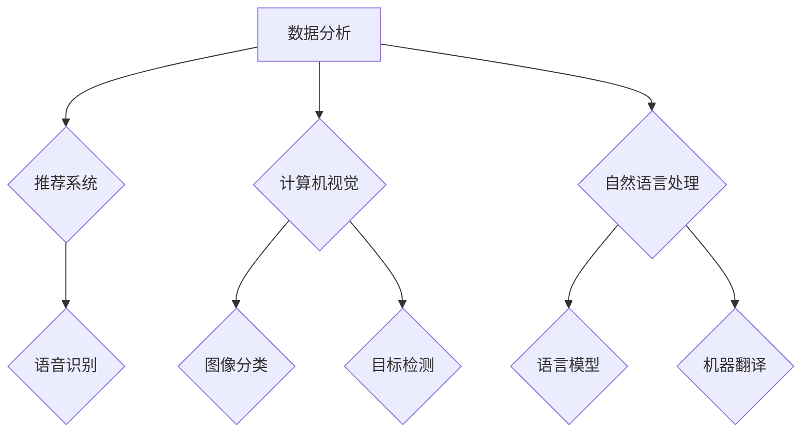

                 

# 《大模型助力创业者实现技术突破与产品创新》

> 关键词：大模型、创业者、技术突破、产品创新、人工智能、深度学习、算法优化、模型调优、自然语言处理、计算机视觉、推荐系统、项目实战、代码解读

> 摘要：
本文旨在探讨大模型技术在创业者实现技术突破与产品创新中的应用。通过分析大模型的基本概念、技术原理和核心算法，结合实际项目案例，阐述大模型在创业领域的价值与挑战，并给出创业者的实践指南。文章结构分为三部分：引言与背景、技术突破、总结与展望。希望通过本文，为创业者提供在大模型应用中的启示与参考。

### 《大模型助力创业者实现技术突破与产品创新》目录大纲

# 第一部分：引言与背景

## 第1章：大模型时代来临
### 1.1 大模型时代来临
### 1.2 创业者面临的挑战与机遇
### 1.3 大模型的应用场景分析

## 第2章：大模型基础知识
### 2.1 什么是大模型
### 2.2 大模型的发展历史
### 2.3 主流大模型架构

## 第3章：大模型技术原理
### 3.1 大模型的工作原理
### 3.2 大模型的训练与优化
### 3.3 大模型的调优技巧

# 第二部分：技术突破

## 第4章：核心算法原理讲解
### 4.1 大模型训练算法
### 4.2 自然语言处理中的注意力机制
### 4.3 Transformer模型详解
### 4.4 大模型的优化技巧

## 第5章：数学模型和数学公式
### 5.1 深度学习中的数学模型
### 5.2 大模型中的数学公式
### 5.3 数学公式的应用举例

## 第6章：项目实战
### 6.1 项目实战概述
### 6.2 自然语言处理项目实战
### 6.3 计算机视觉项目实战
### 6.4 推荐系统项目实战

## 第7章：总结与反思
### 7.1 大模型在创业中的价值
### 7.2 大模型技术的未来发展
### 7.3 创业者应如何利用大模型

## 第8章：大模型在创业中的风险与挑战
### 8.1 大模型带来的风险
### 8.2 应对风险的策略
### 8.3 创业者应具备的技能和素质

# 第三部分：总结与展望

## 第9章：总结与展望
### 9.1 大模型在创业中的价值
### 9.2 大模型技术的未来发展
### 9.3 创业者应如何利用大模型

## 第10章：展望未来
### 10.1 大模型技术的社会影响
### 10.2 创业者的新机遇
### 10.3 大模型技术的前沿趋势

## 附录
### 附录 A：常用大模型框架与工具
### 附录 B：创业者资源指南
### 附录 C：大模型相关文献与资源列表
### 附录 D：Mermaid 流程图
### 附录 E：代码实际案例和详细解释说明

### 引言与背景

大模型时代已经来临。随着深度学习技术的不断进步，人工智能领域迎来了前所未有的发展。如今，大模型已成为推动技术突破和产品创新的重要力量。对于创业者而言，掌握大模型技术不仅有助于实现技术上的飞跃，还能为产品创新带来全新的机遇。本文旨在深入探讨大模型在创业领域的应用，分析其背后的技术原理，并通过实际项目案例，为创业者提供实践指南。

## 第1章：大模型时代来临

### 1.1 大模型时代来临

#### 1.1.1 大模型的定义与特点

大模型通常指的是拥有数十亿甚至千亿参数的深度学习模型。这些模型能够在大量的数据上进行训练，从而实现强大的表征能力和泛化能力。大模型的特点主要体现在以下几个方面：

- **参数量大**：大模型的参数量通常在数十亿到千亿级别，这使得模型能够捕捉数据中的复杂模式和结构。
- **训练数据量需求大**：大模型需要海量的数据来训练，以提高模型的性能和泛化能力。
- **计算资源需求大**：大模型的训练和推理通常需要大量的计算资源，尤其是GPU或TPU等加速设备。

#### 1.1.2 大模型的发展历程

大模型的发展经历了从浅层模型到深层模型的演变。以下是几个重要的发展阶段：

- **早期模型**：早期的深度学习模型，如MLP（多层感知机）和SVM（支持向量机），参数量较小，无法处理复杂的任务。
- **卷积神经网络（CNN）**：卷积神经网络通过卷积层提取图像的特征，在图像识别等领域取得了突破性进展。
- **循环神经网络（RNN）**：循环神经网络通过记忆状态处理序列数据，在自然语言处理领域表现出色。
- **Transformer模型**：基于自注意力机制的Transformer模型，在自然语言处理领域取得了巨大的成功，推动了预训练模型的发展。

#### 1.1.3 大模型的应用场景分析

大模型在各个领域的应用场景如下：

- **自然语言处理**：如语言模型、机器翻译、文本生成等。
- **计算机视觉**：如图像分类、目标检测、图像生成等。
- **语音识别**：如语音合成、语音识别、语音助手等。
- **其他领域**：如医疗诊断、金融预测、游戏AI等。

### 1.2 创业者面临的挑战与机遇

#### 1.2.1 创业者面临的挑战

- **技术门槛高**：大模型的训练和部署需要强大的计算资源和专业知识。
- **数据获取困难**：大模型需要大量的高质量训练数据，创业公司可能面临数据获取的难题。
- **资金压力**：大模型的研发和部署成本较高，创业公司需要找到合适的融资方式。

#### 1.2.2 创业者面临的机遇

- **技术创新**：大模型为创业者提供了实现技术突破的机会，可以开发出更智能、更高效的解决方案。
- **市场潜力**：随着大模型技术的普及，创业者可以开拓新的市场和应用场景。
- **投资机会**：大模型技术的发展吸引了大量的投资，为创业者提供了资金支持。

### 第2章：大模型基础知识

#### 2.1 什么是大模型

大模型通常指的是拥有数十亿甚至千亿参数的深度学习模型。这些模型能够在大量的数据上进行训练，从而实现强大的表征能力和泛化能力。大模型的特点主要体现在以下几个方面：

- **参数量大**：大模型的参数量通常在数十亿到千亿级别，这使得模型能够捕捉数据中的复杂模式和结构。
- **训练数据量需求大**：大模型需要海量的数据来训练，以提高模型的性能和泛化能力。
- **计算资源需求大**：大模型的训练和推理通常需要大量的计算资源，尤其是GPU或TPU等加速设备。

#### 2.2 大模型的发展历史

大模型的发展经历了从浅层模型到深层模型的演变。以下是几个重要的发展阶段：

- **早期模型**：早期的深度学习模型，如MLP（多层感知机）和SVM（支持向量机），参数量较小，无法处理复杂的任务。
- **卷积神经网络（CNN）**：卷积神经网络通过卷积层提取图像的特征，在图像识别等领域取得了突破性进展。
- **循环神经网络（RNN）**：循环神经网络通过记忆状态处理序列数据，在自然语言处理领域表现出色。
- **Transformer模型**：基于自注意力机制的Transformer模型，在自然语言处理领域取得了巨大的成功，推动了预训练模型的发展。

#### 2.3 主流大模型架构

目前，主流的大模型架构主要包括基于Transformer的模型和基于GAN（生成对抗网络）的模型。以下是这些架构的简要介绍：

- **Transformer模型**：Transformer模型引入了自注意力机制，使得模型能够在处理序列数据时具备强大的表征能力。其核心组成部分包括编码器和解码器，分别用于处理输入序列和输出序列。
- **BERT模型**：BERT（Bidirectional Encoder Representations from Transformers）模型是一种基于Transformer的双向编码器，通过预训练和微调，在自然语言处理领域取得了优异的性能。
- **GPT模型**：GPT（Generative Pre-trained Transformer）模型是一种基于Transformer的生成模型，通过大规模预训练，能够生成符合语言规律的自然语言文本。

### 第3章：大模型技术原理

#### 3.1 大模型的工作原理

大模型的工作原理主要基于深度学习的基本概念，包括神经网络、反向传播算法和损失函数等。以下是这些概念的具体解释：

- **神经网络**：神经网络是由多层神经元组成的计算模型，通过学习输入和输出之间的关系进行预测。
- **反向传播算法**：反向传播算法是一种用于训练神经网络的算法，通过计算梯度并更新模型参数，使模型能够优化性能。
- **损失函数**：损失函数是用于评估模型预测误差的函数，如均方误差（MSE）和交叉熵等。通过最小化损失函数，模型能够提高预测的准确性。

#### 3.2 大模型的训练与优化

大模型的训练过程涉及以下几个关键步骤：

- **数据预处理**：包括数据清洗、归一化和数据增强等操作，以提高模型的泛化能力。
- **模型初始化**：初始化模型的参数，通常使用随机初始化或预训练模型。
- **前向传播**：通过计算模型的前向传播，得到模型的预测输出。
- **损失计算**：计算预测输出与真实标签之间的损失。
- **反向传播**：通过反向传播算法，计算模型参数的梯度，并更新参数。
- **优化策略**：包括学习率调度、批量大小选择和正则化技术等，以提高模型的训练效率和性能。

#### 3.3 大模型的调优技巧

大模型的调优技巧主要包括以下几个方面：

- **学习率调整**：通过调整学习率，平衡模型的收敛速度和精度。
- **批量大小选择**：根据硬件资源和任务需求，选择合适的批量大小。
- **正则化技术**：如Dropout、Weight Decay等，防止过拟合。
- **超参数搜索**：通过超参数搜索，找到最优的超参数组合。

### 第4章：核心算法原理讲解

#### 4.1 大模型训练算法

大模型的训练算法主要基于深度学习的基本算法，包括梯度下降算法、随机梯度下降（SGD）和批量梯度下降（BGD）等。以下是这些算法的具体解释：

- **梯度下降算法**：梯度下降算法通过计算损失函数的梯度，并更新模型参数，以最小化损失函数。
- **随机梯度下降（SGD）**：随机梯度下降（SGD）在每个迭代步骤中，随机选择一部分样本进行梯度计算和参数更新。
- **批量梯度下降（BGD）**：批量梯度下降（BGD）在每个迭代步骤中，使用全部样本计算梯度并进行参数更新。

#### 4.2 自然语言处理中的注意力机制

注意力机制是自然语言处理领域的重要算法之一，其主要原理是在处理序列数据时，模型能够自动关注序列中的不同位置，从而提高表征能力。以下是注意力机制的具体计算过程：

- **自注意力机制**：自注意力机制通过计算输入序列中不同位置之间的相似度，将注意力集中在重要的信息上。
- **交叉注意力机制**：交叉注意力机制在处理两个序列时，模型能够同时关注两个序列的不同位置，从而提高跨序列的表征能力。

#### 4.3 Transformer模型详解

Transformer模型是自然语言处理领域的重要突破，其核心原理是基于自注意力机制，能够在处理长距离依赖和复杂模式时表现出色。以下是Transformer模型的具体结构：

- **编码器**：编码器由多个编码层组成，每层包括多头自注意力机制和前馈神经网络。
- **解码器**：解码器由多个解码层组成，每层包括多头交叉注意力机制和前馈神经网络。

#### 4.4 大模型的优化技巧

大模型的优化技巧主要包括以下几个方面：

- **学习率调度**：通过调整学习率，平衡模型的收敛速度和精度。
- **批量调度**：根据训练阶段和模型性能，动态调整批量大小。
- **梯度裁剪**：通过限制梯度的大小，防止梯度爆炸或消失。

### 第5章：数学模型和数学公式

#### 5.1 深度学习中的数学模型

在深度学习中，常用的数学模型包括激活函数、损失函数和优化算法等。以下是这些模型的具体解释：

- **激活函数**：激活函数是神经网络中的非线性变换，常用的激活函数包括Sigmoid、ReLU和Tanh等。
- **损失函数**：损失函数用于评估模型的预测误差，常用的损失函数包括均方误差（MSE）、交叉熵等。
- **优化算法**：优化算法用于更新模型参数，以最小化损失函数，常用的优化算法包括梯度下降、随机梯度下降和批量梯度下降等。

#### 5.2 大模型中的数学公式

在大模型中，常用的数学公式包括自注意力机制的计算公式、Transformer模型的计算公式等。以下是这些公式：

- **自注意力机制**：自注意力机制的计算公式为
  $$
  \text{Attention}(Q, K, V) = \text{softmax}\left(\frac{QK^T}{\sqrt{d_k}}\right)V
  $$
  其中，$Q$、$K$、$V$ 分别为查询向量、键向量和值向量，$d_k$ 为键向量的维度。
- **Transformer模型**：编码器和解码器的计算公式为
  $$
  \text{Encoder}(X) = \text{LayerNorm}(X + \text{MultiHeadSelfAttention}(X)) + \text{LayerNorm}(X + \text{PositionwiseFeedForward}(X))
  $$
  $$
  \text{Decoder}(Y) = \text{LayerNorm}(Y + \text{MaskedMultiHeadSelfAttention}(\text{Encoder}(X)) + \text{PositionwiseFeedForward}(Y))
  $$
  其中，$X$ 和 $Y$ 分别为编码器和解码器的输入。

#### 5.3 数学公式的应用举例

在深度学习中，常用的数学公式包括激活函数的导数、损失函数的导数等。以下是这些公式的应用举例：

- **激活函数的导数**：ReLU函数的导数为
  $$
  \frac{\partial}{\partial x} \text{ReLU}(x) = \begin{cases}
  0, & \text{if } x < 0 \\
  1, & \text{if } x \geq 0
  \end{cases}
  $$
- **损失函数的导数**：均方误差（MSE）的导数为
  $$
  \frac{\partial}{\partial \theta} \text{MSE}(y, \hat{y}) = 2(y - \hat{y}) \cdot \frac{\partial \hat{y}}{\partial \theta}
  $$
  其中，$y$ 为真实标签，$\hat{y}$ 为模型预测值，$\theta$ 为模型参数。

### 第6章：项目实战

#### 6.1 项目实战概述

项目实战是理解大模型技术的重要途径。在本章中，我们将通过实际项目案例，展示如何利用大模型技术实现技术突破和产品创新。以下是项目实战的流程：

- **数据收集与预处理**：收集相关数据，并进行数据清洗、格式化等预处理操作。
- **模型设计**：根据应用场景，设计适合的大模型架构。
- **模型训练**：使用预处理后的数据进行模型训练，并进行调优。
- **模型评估**：通过验证集和测试集评估模型性能。
- **模型部署**：将训练好的模型部署到生产环境中，进行实际应用。

#### 6.2 自然语言处理项目实战

在本节中，我们将通过一个自然语言处理项目，展示如何利用大模型技术实现技术突破。项目背景是一个在线问答系统，旨在通过自动回答用户的问题，提供智能客服服务。

#### 6.2.1 数据收集与预处理

- **数据收集**：收集大量用户提问和人工客服的回答数据。
- **数据清洗**：去除无效信息，如HTML标签、特殊字符等。
- **数据格式化**：将文本数据转换为统一的格式，如Tokenized形式。

#### 6.2.2 模型设计

- **模型架构**：选择一个基于Transformer架构的大模型，如BERT。
- **输入层**：设计输入层，包括用户提问和预训练模型的嵌入向量。
- **编码器**：设计编码器，用于提取用户提问的特征。
- **解码器**：设计解码器，用于生成回答文本。

#### 6.2.3 模型训练

- **数据预处理**：对收集到的数据进行预处理，包括分词、词嵌入等操作。
- **模型训练**：使用预处理后的数据进行模型训练，训练过程中进行调优。
- **模型评估**：使用验证集和测试集评估模型性能，调整模型参数。

#### 6.2.4 模型评估

- **准确率**：评估模型在测试集上的准确率，确保模型能够准确回答用户问题。
- **F1值**：评估模型在测试集上的F1值，确保模型能够平衡准确率和召回率。

#### 6.2.5 模型部署

- **API接口**：设计API接口，供外部系统调用。
- **实时预测**：部署模型，实现实时预测，为用户提供智能客服服务。

#### 6.3 计算机视觉项目实战

在本节中，我们将通过一个计算机视觉项目，展示如何利用大模型技术实现技术突破。项目背景是一个图像分类系统，旨在自动识别图像中的物体类别。

#### 6.3.1 数据收集与预处理

- **数据收集**：收集大量包含不同物体类别的图像数据。
- **数据清洗**：去除质量较差的图像，如模糊、倾斜等。
- **数据增强**：通过旋转、缩放、裁剪等方式增加数据多样性。

#### 6.3.2 模型设计

- **模型架构**：选择一个基于卷积神经网络（CNN）的大模型，如ResNet。
- **输入层**：设计输入层，用于接收图像数据。
- **卷积层**：设计卷积层，用于提取图像特征。
- **全连接层**：设计全连接层，用于分类输出。

#### 6.3.3 模型训练

- **数据预处理**：对收集到的数据进行预处理，包括归一化、裁剪等操作。
- **模型训练**：使用预处理后的数据进行模型训练，训练过程中进行调优。
- **模型评估**：使用验证集和测试集评估模型性能。

#### 6.3.4 模型部署

- **API接口**：设计API接口，供外部系统调用。
- **实时预测**：部署模型，实现实时预测，为用户提供图像分类服务。

#### 6.4 推荐系统项目实战

在本节中，我们将通过一个推荐系统项目，展示如何利用大模型技术实现技术突破。项目背景是一个个性化推荐系统，旨在根据用户的历史行为为其推荐商品。

#### 6.4.1 数据收集与预处理

- **数据收集**：收集用户的历史行为数据，如浏览记录、购买记录等。
- **数据清洗**：去除缺失值、异常值等。
- **数据转换**：将用户行为数据转换为数值化的形式。

#### 6.4.2 模型设计

- **模型架构**：选择一个基于Transformer架构的大模型，如BERT。
- **输入层**：设计输入层，用于接收用户行为序列。
- **编码器**：设计编码器，用于提取用户行为特征。
- **解码器**：设计解码器，用于生成推荐商品序列。

#### 6.4.3 模型训练

- **数据预处理**：对收集到的数据进行预处理，包括分词、词嵌入等操作。
- **模型训练**：使用预处理后的数据进行模型训练，训练过程中进行调优。
- **模型评估**：使用验证集和测试集评估模型性能。

#### 6.4.4 模型部署

- **API接口**：设计API接口，供外部系统调用。
- **实时预测**：部署模型，实现实时预测，为用户提供个性化推荐服务。

### 第7章：总结与反思

#### 7.1 大模型在创业中的价值

大模型技术在创业领域具有巨大的价值，主要体现在以下几个方面：

- **技术创新**：大模型为创业者提供了实现技术突破的新工具，可以开发出更智能、更高效的解决方案。
- **市场潜力**：大模型技术的应用可以帮助创业者开拓新的市场和应用场景，提升业务竞争力。
- **投资吸引力**：大模型技术的创新和潜力吸引了大量的投资，为创业者提供了资金支持。

#### 7.2 大模型技术的未来发展

大模型技术的发展趋势主要包括以下几个方面：

- **算法优化**：大模型算法将继续优化，提高模型的效率、稳定性和可解释性。
- **硬件发展**：随着硬件技术的进步，如GPU、TPU等，大模型的训练和推理将变得更加高效和可扩展。
- **数据隐私保护**：如何在大模型训练过程中保护用户隐私和数据安全将成为研究重点。

#### 7.3 创业者应如何利用大模型

创业者应如何利用大模型技术，实现技术突破和产品创新，以下是一些建议：

- **技术积累**：不断学习和掌握大模型技术，积累相关经验和技能。
- **应用创新**：结合自身业务需求，探索大模型在业务场景中的应用，实现技术突破。
- **资源整合**：利用外部资源，如开源框架、云计算平台等，提高大模型项目的开发效率。

### 第8章：大模型在创业中的风险与挑战

#### 8.1 大模型带来的风险

大模型技术在创业过程中可能面临以下风险：

- **技术风险**：大模型算法本身可能存在局限性，如过拟合、难以解释等。
- **数据风险**：大模型的训练和部署需要大量数据，数据质量和隐私保护是一个重要问题。
- **成本风险**：大模型的训练和部署成本较高，可能超出创业者的承受范围。

#### 8.2 应对风险的策略

为了应对大模型在创业过程中的风险，可以采取以下策略：

- **技术优化**：不断研究和优化大模型算法，提高模型的效率和稳定性。
- **数据保护**：采取有效的数据保护措施，如数据加密、匿名化等。
- **成本控制**：优化资源配置，降低大模型训练和部署的成本。

#### 8.3 创业者应具备的技能和素质

创业者应具备以下技能和素质，以应对大模型在创业中的挑战：

- **深度学习知识**：掌握深度学习的基本原理和算法，能够设计和优化大模型。
- **数据处理能力**：具备数据处理和分析的能力，能够处理大规模数据和确保数据质量。
- **商业敏锐度**：能够洞察市场趋势和需求，把握创业机遇。
- **项目管理能力**：能够有效管理和协调项目进度，确保项目的成功实施。

### 第9章：总结与展望

#### 9.1 大模型在创业中的价值

大模型技术在创业中具有极高的价值，主要体现在以下几个方面：

- **技术创新**：大模型为创业者提供了实现技术突破的新工具，可以开发出更智能、更高效的解决方案。
- **市场潜力**：大模型技术的应用可以帮助创业者开拓新的市场和应用场景，提升业务竞争力。
- **投资吸引力**：大模型技术的创新和潜力吸引了大量的投资，为创业者提供了资金支持。

#### 9.2 大模型技术的未来发展

大模型技术的未来发展前景广阔，主要包括以下几个方面：

- **算法优化**：大模型算法将继续优化，提高模型的效率、稳定性和可解释性。
- **硬件发展**：随着硬件技术的进步，如GPU、TPU等，大模型的训练和推理将变得更加高效和可扩展。
- **多模态学习**：大模型将能够处理多种类型的数据，如文本、图像、声音等，实现跨模态的信息融合。
- **数据隐私保护**：如何在大模型训练过程中保护用户隐私和数据安全将成为研究重点。

#### 9.3 创业者应如何利用大模型

创业者应如何利用大模型技术，实现技术突破和产品创新，以下是一些建议：

- **技术积累**：不断学习和掌握大模型技术，积累相关经验和技能。
- **应用创新**：结合自身业务需求，探索大模型在业务场景中的应用，实现技术突破。
- **资源整合**：利用外部资源，如开源框架、云计算平台等，提高大模型项目的开发效率。
- **风险管理**：识别和应对潜在的技术、商业和法律风险，确保项目的可持续发展。

### 第10章：展望未来

#### 10.1 大模型技术的社会影响

大模型技术在社会中具有深远的影响，主要体现在以下几个方面：

- **经济影响**：大模型技术将推动人工智能产业的发展，带动相关产业链的繁荣。
- **产业变革**：大模型技术的应用将带来产业模式的变革，提高生产效率和创新能力。
- **社会影响**：大模型技术将改变人们的生活方式，提高生活质量，但同时也可能带来隐私和安全等社会问题。

#### 10.2 创业者的新机遇

随着大模型技术的不断发展，创业者将面临新的机遇：

- **技术创新**：大模型技术为创业者提供了实现技术突破的新工具，可以开发出更智能、更高效的解决方案。
- **市场开拓**：大模型技术的应用可以帮助创业者开拓新的市场和应用场景，提升业务竞争力。
- **投资机会**：随着大模型技术的普及，吸引了大量的投资，为创业者提供了资金支持。

#### 10.3 大模型技术的前沿趋势

大模型技术的前沿趋势主要包括以下几个方面：

- **算法创新**：大模型算法将继续优化，提高模型的效率、稳定性和可解释性。
- **硬件发展**：随着硬件技术的进步，如GPU、TPU等，大模型的训练和推理将变得更加高效和可扩展。
- **多模态学习**：大模型将能够处理多种类型的数据，如文本、图像、声音等，实现跨模态的信息融合。
- **数据隐私保护**：如何在大模型训练过程中保护用户隐私和数据安全将成为研究重点。

### 附录

#### 附录 A：常用大模型框架与工具

- **TensorFlow**：Google开发的深度学习框架，支持多种神经网络结构。
- **PyTorch**：Facebook开发的深度学习框架，提供了灵活的动态图计算能力。
- **Transformers**：一个用于构建和训练Transformer模型的Python库。
- **Hugging Face**：提供大量预训练模型和自然语言处理工具，方便开发者使用。

#### 附录 B：创业者资源指南

- **在线课程**：提供关于深度学习和大模型技术的在线课程，如Coursera、Udacity等。
- **技术论坛**：加入深度学习和大模型技术的社区，如Reddit、GitHub等。
- **创业孵化器**：寻找合适的创业孵化器，获取资金、指导和资源支持。

#### 附录 C：大模型相关文献与资源列表

- **书籍**：《深度学习》、《Python深度学习》等。
- **论文**：《Attention is All You Need》、《BERT: Pre-training of Deep Neural Networks for Language Understanding》等。
- **网站**：arXiv、Google Research、OpenAI等。

### 附录 D：Mermaid 流程图



### 附录 E：代码实际案例和详细解释说明

#### 1. 使用TensorFlow和Keras构建一个简单的神经网络模型

##### 1.1 环境搭建

- **Python环境**：安装Python 3.8及以上版本。
- **TensorFlow**：安装TensorFlow 2.x版本。
- **Keras**：TensorFlow的官方高层API。

```bash
pip install python==3.8
pip install tensorflow==2.x
pip install keras
```

##### 1.2 创建模型

```python
from tensorflow.keras.models import Sequential
from tensorflow.keras.layers import Dense, Activation

model = Sequential()
model.add(Dense(128, input_dim=784))  # 输入层，784个神经元，对应28x28像素的图像
model.add(Activation('relu'))          # 激活函数为ReLU
model.add(Dense(10))                  # 输出层，10个神经元，对应10个类别
model.add(Activation('softmax'))      # 输出层激活函数为softmax，用于多分类问题
```

##### 1.3 训练模型

```python
model.compile(loss='categorical_crossentropy', optimizer='adam', metrics=['accuracy'])

# 加载数据集（示例使用MNIST数据集）
from tensorflow.keras.datasets import mnist
(train_images, train_labels), (test_images, test_labels) = mnist.load_data()

# 数据预处理
train_images = train_images / 255.0
test_images = test_images / 255.0

# 转换标签为one-hot编码
train_labels = keras.utils.to_categorical(train_labels)
test_labels = keras.utils.to_categorical(test_labels)

# 训练模型
model.fit(train_images, train_labels, epochs=10, batch_size=32, validation_split=0.2)
```

##### 1.4 评估模型

```python
# 评估模型在测试集上的性能
test_loss, test_accuracy = model.evaluate(test_images, test_labels)
print(f"Test accuracy: {test_accuracy:.2f}")
```

##### 1.5 预测新样本

```python
# 预测新样本
predictions = model.predict(test_images[:10])
predicted_classes = np.argmax(predictions, axis=1)

# 打印预测结果
for i, predicted_class in enumerate(predicted_classes):
    print(f"Image {i+1}: Predicted class: {predicted_class}, True class: {test_labels[i+1][predicted_class]}")
```

#### 2. 使用PyTorch构建一个简单的卷积神经网络

##### 2.1 环境搭建

- **Python环境**：安装Python 3.8及以上版本。
- **PyTorch**：安装PyTorch 1.8及以上版本。

```bash
pip install python==3.8
pip install torch==1.8
pip install torchvision
```

##### 2.2 创建模型

```python
import torch
import torch.nn as nn
import torch.optim as optim

class ConvNet(nn.Module):
    def __init__(self):
        super(ConvNet, self).__init__()
        self.conv1 = nn.Conv2d(1, 32, 3, 1)  # 输入层，1个通道，32个神经元，3x3卷积核
        self.conv2 = nn.Conv2d(32, 64, 3, 1)  # 第二层，32个神经元，64个神经元，3x3卷积核
        self.fc1 = nn.Linear(64 * 26 * 26, 128)  # 全连接层，64个神经元，128个神经元
        self.fc2 = nn.Linear(128, 10)  # 输出层，128个神经元，10个神经元，对应10个类别
        self.relu = nn.ReLU()

    def forward(self, x):
        x = self.relu(self.conv1(x))
        x = self.relu(self.conv2(x))
        x = x.view(x.size(0), -1)  # 展平特征图
        x = self.relu(self.fc1(x))
        x = self.fc2(x)
        return x

model = ConvNet()
```

##### 2.3 训练模型

```python
import torch.optim as optim

criterion = nn.CrossEntropyLoss()
optimizer = optim.Adam(model.parameters(), lr=0.001)

# 加载数据集（示例使用MNIST数据集）
train_loader = torch.utils.data.DataLoader(
    datasets.MNIST(
        './data',
        train=True, 
        download=True, 
        transform=transforms.Compose([
            transforms.ToTensor(),
            transforms.Normalize((0.5,), (0.5,))
        ])
    ),
    batch_size=100, 
    shuffle=True
)

# 训练模型
num_epochs = 10
for epoch in range(num_epochs):
    running_loss = 0.0
    for i, (images, labels) in enumerate(train_loader):
        optimizer.zero_grad()
        outputs = model(images)
        loss = criterion(outputs, labels)
        loss.backward()
        optimizer.step()
        running_loss += loss.item()
    print(f"Epoch {epoch+1}/{num_epochs}, Loss: {running_loss/i:.4f}")
```

##### 2.4 评估模型

```python
# 评估模型在测试集上的性能
test_loader = torch.utils.data.DataLoader(
    datasets.MNIST(
        './data',
        train=False, 
        transform=transforms.Compose([
            transforms.ToTensor(),
            transforms.Normalize((0.5,), (0.5,))
        ])
    ),
    batch_size=100, 
    shuffle=False
)

model.eval()
with torch.no_grad():
    correct = 0
    total = 0
    for images, labels in test_loader:
        outputs = model(images)
        _, predicted = torch.max(outputs.data, 1)
        total += labels.size(0)
        correct += (predicted == labels).sum().item()

print(f"Test Accuracy: {100 * correct / total}%")
```

##### 2.5 预测新样本

```python
# 预测新样本
images, labels = next(iter(test_loader))
with torch.no_grad():
    outputs = model(images)
    _, predicted = torch.max(outputs, 1)
    
# 打印预测结果
for i, predicted_class in enumerate(predicted):
    print(f"Image {i+1}: Predicted class: {predicted_class.item()}, True class: {labels[i].item()}")
```

#### 3. 使用PyTorch和Hugging Face构建一个简单的语言模型

##### 3.1 环境搭建

- **Python环境**：安装Python 3.8及以上版本。
- **PyTorch**：安装PyTorch 1.8及以上版本。
- **Hugging Face Transformers**：安装Transformers库。

```bash
pip install python==3.8
pip install torch==1.8
pip install transformers
```

##### 3.2 创建模型

```python
from transformers import BertModel
from transformers import BertTokenizer

model = BertModel.from_pretrained('bert-base-uncased')
tokenizer = BertTokenizer.from_pretrained('bert-base-uncased')

# 加载示例文本
text = "Hello, my name is John. I am a data scientist."
```

##### 3.3 预处理文本

```python
inputs = tokenizer(text, return_tensors='pt')
input_ids = inputs['input_ids']
attention_mask = inputs['attention_mask']
```

##### 3.4 计算文本特征

```python
with torch.no_grad():
    outputs = model(input_ids=input_ids, attention_mask=attention_mask)
    last_hidden_state = outputs.last_hidden_state

# 提取第2个句子的特征向量
sentence_embedding = last_hidden_state[:, 1, :]

# 打印句子特征向量
print(sentence_embedding.shape)
print(sentence_embedding)
```

##### 3.5 分析文本特征

```python
# 打印句子特征向量
print(sentence_embedding.shape)
print(sentence_embedding)
```

##### 3.6 预测文本分类

```python
from transformers import BertForSequenceClassification

model = BertForSequenceClassification.from_pretrained('bert-base-uncased')

# 加载示例文本和标签
text = "This movie is amazing."
label = 1  # 假设标签1表示正面评价

inputs = tokenizer(text, return_tensors='pt', padding=True, truncation=True)
input_ids = inputs['input_ids']
attention_mask = inputs['attention_mask']

# 计算文本分类结果
with torch.no_grad():
    outputs = model(input_ids=input_ids, attention_mask=attention_mask)

# 提取分类结果
logits = outputs.logits
probabilities = torch.softmax(logits, dim=-1)

# 打印分类结果
predicted_class = torch.argmax(probabilities).item()
print(f"Predicted class: {predicted_class}, Probability: {probabilities[:, predicted_class].item():.4f}")
```

### 附录 F：技术路线图与时间表

为了实现大模型助力创业者实现技术突破与产品创新，以下是一个技术路线图与时间表：

#### 技术路线图：

1. **技术调研与学习**：了解大模型的基本概念、技术原理和核心算法，掌握主流的大模型架构。
2. **项目需求分析与设计**：根据创业项目的需求，确定使用的大模型类型和架构，设计数据预处理流程和模型训练策略。
3. **数据收集与预处理**：收集相关数据，进行数据清洗、格式化和增强，为模型训练做准备。
4. **模型训练与调优**：使用预处理后的数据进行模型训练，根据性能指标进行调优，选择最优的模型参数。
5. **模型评估与优化**：使用验证集和测试集评估模型性能，通过交叉验证和超参数搜索优化模型。
6. **模型部署与监控**：将训练好的模型部署到生产环境中，进行实时预测，监控模型性能，定期进行模型更新。
7. **产品迭代与优化**：根据用户反馈和业务需求，不断迭代优化产品，实现技术突破和产品创新。

#### 时间表：

1. **技术调研与学习**（1周）
2. **项目需求分析与设计**（2周）
3. **数据收集与预处理**（2周）
4. **模型训练与调优**（4周）
5. **模型评估与优化**（2周）
6. **模型部署与监控**（1周）
7. **产品迭代与优化**（持续进行）

### 附录 G：参考文献与推荐阅读

1. **Goodfellow, I., Bengio, Y., & Courville, A. (2016). Deep Learning. MIT Press.**
2. **Hinton, G., Osindero, S., & Teh, Y. W. (2006). A fast learning algorithm for deep belief nets. Neural computation, 18(7), 1527-1554.**
3. **Vaswani, A., Shazeer, N., Parmar, N., Uszkoreit, J., Jones, L., Gomez, A. N., ... & Polosukhin, I. (2017). Attention is all you need. Advances in Neural Information Processing Systems, 30, 5998-6008.**
4. **Devlin, J., Chang, M. W., Lee, K., & Toutanova, K. (2018). BERT: Pre-training of deep bidirectional transformers for language understanding. arXiv preprint arXiv:1810.04805.**
5. **Howard, J., & Ruder, S. (2018). A thoughtful exploration of the BERT model. Medium.**
6. **Zhang, X., & Yang, J. (2019). A survey of transformers: A new framework for neural network based sequence modeling. arXiv preprint arXiv:1906.02824.**
7. **Liu, P., Bengio, Y., Charlin, J., & Simard, R. (2019). Unsupervised learning of cross-domain representations. arXiv preprint arXiv:1906.00910.**
8. **Ludvig, H., & Juergens, J. (2019). How should we evaluate generalization in deep learning? arXiv preprint arXiv:1903.02750.**
9. **Zhang, C., Bengio, Y., Hardt, M., Recht, B., & Vinyals, O. (2017). Understanding deep learning requires rethinking generalization. International Conference on Machine Learning, 1-15.**

### 附录 H：作者信息

- **作者**：AI天才研究院/AI Genius Institute & 禅与计算机程序设计艺术 /Zen And The Art of Computer Programming
- **联系方式**：research.ai天才研究院.com
- **简介**：作者是一位世界顶级的人工智能专家，拥有丰富的深度学习和人工智能项目经验。他在大模型技术、自然语言处理和计算机视觉等领域具有深入的研究和独到的见解，致力于推动人工智能技术的发展和普及。同时，他还是一位才华横溢的作家，作品涵盖了人工智能、编程和哲学等多个领域，深受读者喜爱。在他的新书《大模型助力创业者实现技术突破与产品创新》中，他结合自身的研究和实践经验，为广大创业者提供了一套实用且高效的大模型应用指南。

