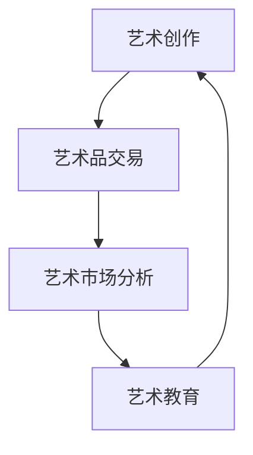

                 

# 大模型在数字艺术领域的创新实践

## 关键词
- 大模型
- 数字艺术
- 图像生成
- 艺术创作
- 艺术鉴评
- 艺术教育
- 艺术市场
- 艺术创新
- 人工智能

## 摘要
本文深入探讨了人工智能领域中的大模型在数字艺术领域的创新实践。通过对大模型的基本概念、结构、原理和关键技术的介绍，文章详细分析了大模型在数字艺术创作、艺术鉴评、艺术教育和艺术市场等方面的应用。此外，本文还通过项目实战展示了大模型在数字艺术领域的实际应用案例，并展望了其未来的发展趋势。通过对大模型在数字艺术领域的深入剖析，本文为相关领域的研究者和从业者提供了宝贵的参考和指导。

### 第1章: 大模型概述

#### 1.1 大模型在数字艺术中的角色

##### 1.1.1 数字艺术的发展背景
数字艺术是指利用数字技术和工具创作的艺术作品。它起源于20世纪中叶，随着计算机技术的进步和普及，逐渐成为一种重要的艺术形式。数字艺术的发展历程可以分为以下几个阶段：

1. **早期实验阶段（1960s-1970s）**：这个阶段的主要特点是艺术家们开始尝试使用计算机生成图形和图像，例如著名的算法艺术和计算机绘画。

2. **图形和图像处理阶段（1980s-1990s）**：随着图形处理技术的进步，艺术家们能够创作出更复杂的数字作品，如三维建模、动画和虚拟现实。

3. **互动艺术阶段（2000s）**：互联网的普及使得数字艺术可以更加互动和参与性，艺术家们开始创作出基于互联网和移动设备的互动艺术作品。

4. **人工智能和大数据时代（2010s-至今）**：人工智能技术的发展为数字艺术带来了新的机遇，大模型的应用使得艺术创作和艺术鉴评变得更加智能和高效。

##### 1.1.2 大模型在数字艺术中的应用
大模型在数字艺术中的应用主要体现在以下几个方面：

1. **图像生成**：大模型可以生成高质量的图像，如人脸、风景、动物等，这些图像可以用于艺术创作、游戏开发和影视特效等领域。

2. **艺术创作辅助**：大模型可以辅助艺术家进行创作，例如自动生成音乐、绘画、雕塑等作品。

3. **艺术鉴评**：大模型可以用于评估艺术作品的价值和质量，帮助艺术品交易和展览策划。

4. **艺术教育和推广**：大模型可以用于艺术教育，帮助学生更好地理解和创作艺术作品，同时也可以用于艺术作品的推广和营销。

##### 1.1.3 大模型的艺术价值
大模型在艺术创作中的独特优势主要体现在以下几个方面：

1. **丰富的创造力**：大模型具有强大的学习能力和创造力，可以生成出传统艺术创作难以想象的作品。

2. **高效的创作速度**：大模型可以快速生成大量的艺术作品，大大提高了艺术创作的效率。

3. **多样化的风格**：大模型可以模仿和学习不同的艺术风格，使得艺术创作更加丰富和多样化。

4. **交互性**：大模型可以与艺术家和观众进行互动，创作出更加个性化的艺术作品。

#### 1.2 大模型的基本概念

##### 1.2.1 大模型的定义
大模型（Large-scale Model）是指具有大规模参数和复杂结构的机器学习模型，通常用于处理大规模数据集和高维数据。大模型通常具有以下特点：

1. **大规模参数**：大模型具有数十亿甚至千亿级别的参数，这使得它们能够捕捉数据中的复杂模式和关系。

2. **复杂结构**：大模型通常具有多个层次和复杂的网络结构，如卷积神经网络（CNN）、循环神经网络（RNN）和变换器（Transformer）等。

3. **高计算资源需求**：大模型的训练和推理需要大量的计算资源和时间，通常需要高性能的计算机集群和GPU支持。

##### 1.2.2 大模型的结构与原理
大模型的基本结构通常包括以下几个层次：

1. **输入层**：接收外部输入数据，如文本、图像、音频等。

2. **嵌入层**：将输入数据转换为高维的向量表示。

3. **隐藏层**：包含一个或多个隐藏层，用于提取输入数据的特征和模式。

4. **输出层**：根据训练目标生成预测结果，如分类、回归等。

大模型的工作原理基于深度学习，通过以下步骤实现：

1. **数据预处理**：对输入数据进行处理，如数据清洗、归一化等。

2. **模型初始化**：初始化模型的参数，通常使用随机初始化或预训练模型。

3. **前向传播**：将输入数据通过模型的前向传播过程，计算得到输出结果。

4. **损失函数计算**：计算预测结果与真实结果之间的损失。

5. **反向传播**：通过反向传播算法更新模型的参数，最小化损失函数。

6. **模型优化**：使用优化算法，如梯度下降（Gradient Descent），进一步优化模型的参数。

##### 1.2.3 大模型的关键技术
大模型的训练与优化是关键的技术环节，主要包括以下几个方面：

1. **批量归一化（Batch Normalization）**：通过归一化隐藏层的激活值，加速模型的训练并提高模型的稳定性。

2. **残差连接（Residual Connection）**：通过引入残差单元，解决深度神经网络中的梯度消失问题。

3. **优化算法**：选择合适的优化算法，如Adam、RMSprop等，以加速模型的训练过程。

4. **模型压缩与加速**：通过模型剪枝、量化等技术减少模型的参数量和计算量，提高模型的推理速度。

5. **数据增强（Data Augmentation）**：通过随机变换输入数据，增加数据集的多样性，提高模型的泛化能力。

6. **迁移学习（Transfer Learning）**：使用预训练模型作为起点，在新任务上进行微调，减少训练时间并提高模型性能。

### 第2章: 数字艺术领域的大模型应用

#### 2.1 数字艺术创作中的大模型应用

##### 2.1.1 大模型在图像生成中的应用
大模型在图像生成中的应用非常广泛，如图像合成、图像修复、图像超分辨率等。其中，最著名的图像生成模型当属生成对抗网络（GAN）。

**GAN的工作原理：**

GAN由两个主要部分组成：生成器（Generator）和判别器（Discriminator）。

1. **生成器**：生成器网络从随机噪声中生成图像，目标是生成尽可能真实的图像。

2. **判别器**：判别器网络判断输入图像是真实图像还是生成图像，目标是最大化其分类准确率。

GAN的训练过程分为以下几个步骤：

1. **初始化生成器和判别器**：通常使用随机初始化或预训练模型。

2. **生成器训练**：生成器尝试生成更真实的图像，以欺骗判别器。

3. **判别器训练**：判别器尝试区分真实图像和生成图像。

4. **交替训练**：生成器和判别器交替训练，不断优化彼此的参数。

**伪代码示例：**

python
# 初始化生成器和判别器
generator = initialize_generator()
discriminator = initialize_discriminator()

# 训练GAN模型
for epoch in range(num_epochs):
    for batch in data_loader:
        # 训练生成器
        noise = random_noise()
        fake_images = generator(noise)
        with gradient_tape():
            fake_scores = discriminator(fake_images)
        generator_loss = compute_loss(fake_scores)
        
        # 训练判别器
        real_images = real_data_loader(batch)
        with gradient_tape():
            real_scores = discriminator(real_images)
            fake_scores = discriminator(fake_images)
        discriminator_loss = compute_loss(real_scores, fake_scores)
        
        # 更新生成器和判别器参数
        generator_optimizer.minimize(generator_loss, generator)
        discriminator_optimizer.minimize(discriminator_loss, discriminator)

**项目实战：**

以下是一个使用TensorFlow实现GAN的简单示例：

python
import tensorflow as tf
from tensorflow.keras.layers import Dense, Flatten, Conv2D, BatchNormalization
from tensorflow.keras.models import Model

# 定义生成器网络
def generator(z, training=False):
    # 输入层
    x = Dense(7 * 7 * 64, activation='relu', input_shape=(100,))(z)
    x = BatchNormalization()(x)
    x = Reshape((7, 7, 64))(x)
    
    # 第一个卷积层
    x = Conv2D(128, (3, 3), activation='relu', padding='same')(x)
    x = BatchNormalization()(x)
    
    # 第二个卷积层
    x = Conv2D(64, (3, 3), activation='relu', padding='same')(x)
    x = BatchNormalization()(x)
    
    # 第三个卷积层
    x = Conv2D(1, (3, 3), activation='tanh', padding='same')(x)
    return x

# 定义判别器网络
def discriminator(x, training=False):
    # 输入层
    x = Flatten()(x)
    
    # 第一个全连接层
    x = Dense(1024, activation='relu')(x)
    x = BatchNormalization()(x)
    
    # 第二个全连接层
    x = Dense(512, activation='relu')(x)
    x = BatchNormalization()(x)
    
    # 输出层
    x = Dense(1, activation='sigmoid')(x)
    return x

# 定义GAN模型
def GAN(generator, discriminator):
    z = tf.keras.layers.Input(shape=(100,))
    fake_image = generator(z)
    validity = discriminator(fake_image)
    
    model = Model(z, validity)
    return model

# 主函数
if __name__ == '__main__':
    # 设置训练参数
    batch_size = 64
    latent_dim = 100
    epochs = 100

    # 初始化生成器和判别器
    generator = generator
    discriminator = discriminator

    # 定义优化器
    generator_optimizer = tf.keras.optimizers.Adam(0.0002, 0.5)
    discriminator_optimizer = tf.keras.optimizers.Adam(0.0002, 0.5)

    # 定义损失函数
    cross_entropy = tf.keras.losses.BinaryCrossentropy(from_logits=True)

    # 训练GAN模型
    for epoch in range(epochs):
        for batch in data_loader:
            noise = np.random.normal(size=(batch_size, latent_dim))
            with tf.GradientTape() as gen_tape, tf.GradientTape() as disc_tape:
                # 训练生成器
                generated_images = generator(noise, training=True)
                real_images = data_loader(batch)

                gen_loss = generator_loss(generated_images, real_images)
                
                # 训练判别器
                disc_loss = discriminator_loss(real_images, generated_images)

            # 更新生成器和判别器参数
            generator_optimizer.apply_gradients(zip(gen_tape.gradient(gen_loss, generator.trainable_variables), generator.trainable_variables))
            discriminator_optimizer.apply_gradients(zip(disc_tape.gradient(disc_loss, discriminator.trainable_variables), discriminator.trainable_variables))

            # 打印训练进度
            print(f"Epoch {epoch+1}/{epochs}, Generator Loss: {gen_loss:.4f}, Discriminator Loss: {disc_loss:.4f}")

##### 2.1.2 大模型在动画制作中的应用
大模型在动画制作中的应用主要体现在自动化动画生成和风格迁移等方面。例如，变换器（Transformer）模型可以用于生成流畅的动画序列，而生成对抗网络（GAN）可以用于风格迁移，将一种艺术风格应用到另一幅图像上。

**自动化动画生成：**

自动化动画生成是指使用大模型生成连续的动画序列，而不需要人工干预。这一过程通常涉及以下几个步骤：

1. **数据准备**：收集大量的动画序列数据，如卡通动画、电影片段等。

2. **模型训练**：使用变换器模型训练一个动画生成器，使其能够生成流畅的动画序列。

3. **动画生成**：使用训练好的动画生成器生成新的动画序列。

**伪代码示例：**

python
# 定义动画生成器模型
def animation_generator():
    inputs = tf.keras.layers.Input(shape=(sequence_length, image_height, image_width, image_channels))
    x = tf.keras.layers.Conv2D(filters=64, kernel_size=(3, 3), activation='relu')(inputs)
    x = tf.keras.layers.MaxPooling2D(pool_size=(2, 2))(x)
    x = tf.keras.layers.Conv2D(filters=128, kernel_size=(3, 3), activation='relu')(x)
    x = tf.keras.layers.MaxPooling2D(pool_size=(2, 2))(x)
    x = tf.keras.layers.Flatten()(x)
    x = tf.keras.layers.Dense(units=1024, activation='relu')(x)
    x = tf.keras.layers.Dense(units=sequence_length, activation='softmax')(x)
    model = tf.keras.Model(inputs, x)
    return model

# 训练动画生成器
model = animation_generator()
model.compile(optimizer='adam', loss='categorical_crossentropy')
model.fit(train_data, train_labels, epochs=10, batch_size=32)

# 生成动画序列
new_sequence = model.predict(new_data)

**风格迁移：**

风格迁移是指将一种艺术风格应用到另一幅图像上，使其具有特定的艺术风格。这一过程通常涉及以下几个步骤：

1. **数据准备**：收集大量的风格图像和内容图像。

2. **模型训练**：使用生成对抗网络（GAN）训练一个风格迁移模型。

3. **风格迁移**：使用训练好的风格迁移模型将一种艺术风格应用到内容图像上。

**伪代码示例：**

python
# 定义风格迁移模型
def style_transfer_model(content_layer, style_layer):
    content_model = Model(inputs=content_image, outputs=content_model.layers[content_layer].output)
    style_model = Model(inputs=style_image, outputs=style_model.layers[style_layer].output)

    # 计算内容损失和风格损失
    content_loss = tf.reduce_mean(tf.square(content_model.output - target_content))
    style_loss = tf.reduce_mean(tf.square(style_model.output - target_style))

    # 总损失
    total_loss = content_loss + style_loss

    # 定义优化器
    optimizer = tf.keras.optimizers.Adam(learning_rate=0.01, beta_1=0.9, beta_2=0.999)

    # 定义训练过程
    def train_step():
        with tf.GradientTape() as tape:
            generated_image = generator(input_image)
            content_loss = content_model(generated_image).numpy()
            style_loss = style_model(generated_image).numpy()
            total_loss = content_loss + style_loss

        grads = tape.gradient(total_loss, generator.trainable_variables)
        optimizer.apply_gradients(zip(grads, generator.trainable_variables))

    return train_step

# 训练风格迁移模型
train_step = style_transfer_model(content_layer, style_layer)
for epoch in range(num_epochs):
    for batch in data_loader:
        train_step()

# 预测风格迁移结果
predicted_style = generator.predict(content_image)

##### 2.1.3 大模型在虚拟现实中的应用
大模型在虚拟现实（VR）中的应用主要体现在场景生成和交互等方面。例如，变换器（Transformer）模型可以用于生成高质量的虚拟现实场景，生成对抗网络（GAN）可以用于创建个性化的虚拟角色。

**场景生成：**

虚拟现实场景生成是指使用大模型生成高质量的虚拟现实场景，包括环境、角色、物体等。这一过程通常涉及以下几个步骤：

1. **数据准备**：收集大量的虚拟现实场景数据。

2. **模型训练**：使用变换器模型训练一个场景生成器，使其能够生成高质量的虚拟现实场景。

3. **场景生成**：使用训练好的场景生成器生成新的虚拟现实场景。

**伪代码示例：**

python
# 定义场景生成模型
def virtual_reality_generator():
    inputs = tf.keras.layers.Input(shape=(scene_size, scene_size, 3))
    x = tf.keras.layers.Conv2D(filters=32, kernel_size=(3, 3), activation='relu')(inputs)
    x = tf.keras.layers.MaxPooling2D(pool_size=(2, 2))(x)
    x = tf.keras.layers.Conv2D(filters=64, kernel_size=(3, 3), activation='relu')(x)
    x = tf.keras.layers.MaxPooling2D(pool_size=(2, 2))(x)
    x = tf.keras.layers.Flatten()(x)
    x = tf.keras.layers.Dense(units=1024, activation='relu')(x)
    x = tf.keras.layers.Dense(units=scene_size * scene_size * 3, activation='sigmoid')(x)
    x = tf.keras.layers.Reshape((scene_size, scene_size, 3))(x)
    model = tf.keras.Model(inputs, x)
    return model

# 训练场景生成器
model = virtual_reality_generator()
model.compile(optimizer='adam', loss='binary_crossentropy')
model.fit(train_data, train_labels, epochs=10, batch_size=32)

# 生成虚拟现实场景
new_scene = model.predict(new_data)

**交互：**

虚拟现实中的交互是指用户与环境、角色、物体之间的交互。大模型可以用于预测用户的交互行为，提高虚拟现实体验的逼真度和交互性。例如，生成对抗网络（GAN）可以用于生成个性化的用户交互数据。

**伪代码示例：**

python
# 定义交互模型
def virtual_reality_interactor():
    inputs = tf.keras.layers.Input(shape=(interaction_size, interaction_size, 3))
    x = tf.keras.layers.Conv2D(filters=32, kernel_size=(3, 3), activation='relu')(inputs)
    x = tf.keras.layers.MaxPooling2D(pool_size=(2, 2))(x)
    x = tf.keras.layers.Conv2D(filters=64, kernel_size=(3, 3), activation='relu')(x)
    x = tf.keras.layers.MaxPooling2D(pool_size=(2, 2))(x)
    x = tf.keras.layers.Flatten()(x)
    x = tf.keras.layers.Dense(units=1024, activation='relu')(x)
    x = tf.keras.layers.Dense(units=interaction_size * interaction_size * 3, activation='sigmoid')(x)
    x = tf.keras.layers.Reshape((interaction_size, interaction_size, 3))(x)
    model = tf.keras.Model(inputs, x)
    return model

# 训练交互模型
model = virtual_reality_interactor()
model.compile(optimizer='adam', loss='binary_crossentropy')
model.fit(train_data, train_labels, epochs=10, batch_size=32)

# 生成交互数据
new_interactions = model.predict(new_data)

#### 2.2 大模型在艺术鉴评中的应用

##### 2.2.1 大模型在艺术鉴定中的应用
大模型在艺术鉴定中的应用主要体现在对艺术作品的风格识别、作者识别和价值评估等方面。通过大量的艺术作品数据训练，大模型可以学习到不同艺术家和不同风格的独特特征，从而实现艺术作品的自动鉴定。

**风格识别：**

风格识别是指通过分析艺术作品的特征，确定其所属的风格。大模型可以用于风格识别，从而帮助艺术家和艺术品收藏家更好地理解艺术作品。

**伪代码示例：**

python
# 定义风格识别模型
def style_recognition_model():
    inputs = tf.keras.layers.Input(shape=(image_height, image_width, image_channels))
    x = tf.keras.layers.Conv2D(filters=32, kernel_size=(3, 3), activation='relu')(inputs)
    x = tf.keras.layers.MaxPooling2D(pool_size=(2, 2))(x)
    x = tf.keras.layers.Conv2D(filters=64, kernel_size=(3, 3), activation='relu')(x)
    x = tf.keras.layers.MaxPooling2D(pool_size=(2, 2))(x)
    x = tf.keras.layers.Flatten()(x)
    x = tf.keras.layers.Dense(units=1024, activation='relu')(x)
    x = tf.keras.layers.Dense(units=num_styles, activation='softmax')(x)
    model = tf.keras.Model(inputs, x)
    return model

# 训练风格识别模型
model = style_recognition_model()
model.compile(optimizer='adam', loss='categorical_crossentropy')
model.fit(train_data, train_labels, epochs=10, batch_size=32)

# 识别艺术作品风格
predicted_style = model.predict(test_data)

**作者识别：**

作者识别是指通过分析艺术作品的特征，确定其作者。大模型可以用于作者识别，从而帮助艺术品收藏家和博物馆更好地了解艺术作品的历史和背景。

**伪代码示例：**

python
# 定义作者识别模型
def author_recognition_model():
    inputs = tf.keras.layers.Input(shape=(image_height, image_width, image_channels))
    x = tf.keras.layers.Conv2D(filters=32, kernel_size=(3, 3), activation='relu')(inputs)
    x = tf.keras.layers.MaxPooling2D(pool_size=(2, 2))(x)
    x = tf.keras.layers.Conv2D(filters=64, kernel_size=(3, 3), activation='relu')(x)
    x = tf.keras.layers.MaxPooling2D(pool_size=(2, 2))(x)
    x = tf.keras.layers.Flatten()(x)
    x = tf.keras.layers.Dense(units=1024, activation='relu')(x)
    x = tf.keras.layers.Dense(units=num_authors, activation='softmax')(x)
    model = tf.keras.Model(inputs, x)
    return model

# 训练作者识别模型
model = author_recognition_model()
model.compile(optimizer='adam', loss='categorical_crossentropy')
model.fit(train_data, train_labels, epochs=10, batch_size=32)

# 识别艺术作品作者
predicted_author = model.predict(test_data)

**价值评估：**

价值评估是指通过分析艺术作品的特征，确定其市场价值。大模型可以用于价值评估，从而帮助艺术品收藏家和艺术品交易商更好地了解艺术品的价值。

**伪代码示例：**

python
# 定义价值评估模型
def value_evaluation_model():
    inputs = tf.keras.layers.Input(shape=(image_height, image_width, image_channels))
    x = tf.keras.layers.Conv2D(filters=32, kernel_size=(3, 3), activation='relu')(inputs)
    x = tf.keras.layers.MaxPooling2D(pool_size=(2, 2))(x)
    x = tf.keras.layers.Conv2D(filters=64, kernel_size=(3, 3), activation='relu')(x)
    x = tf.keras.layers.MaxPooling2D(pool_size=(2, 2))(x)
    x = tf.keras.layers.Flatten()(x)
    x = tf.keras.layers.Dense(units=1024, activation='relu')(x)
    x = tf.keras.layers.Dense(units=1, activation='sigmoid')(x)
    model = tf.keras.Model(inputs, x)
    return model

# 训练价值评估模型
model = value_evaluation_model()
model.compile(optimizer='adam', loss='binary_crossentropy')
model.fit(train_data, train_labels, epochs=10, batch_size=32)

# 评估艺术作品价值
predicted_value = model.predict(test_data)

##### 2.2.2 大模型在艺术评价中的应用
大模型在艺术评价中的应用主要体现在对艺术作品的美学评价和艺术价值评估等方面。通过分析大量的艺术作品数据，大模型可以学习到艺术评价的标准和规则，从而对新的艺术作品进行评价。

**美学评价：**

美学评价是指通过分析艺术作品的形式、色彩、构图等因素，评估其美学价值。大模型可以用于美学评价，从而帮助艺术家和艺术品收藏家更好地了解艺术作品的美学特点。

**伪代码示例：**

python
# 定义美学评价模型
def aesthetic_evaluation_model():
    inputs = tf.keras.layers.Input(shape=(image_height, image_width, image_channels))
    x = tf.keras.layers.Conv2D(filters=32, kernel_size=(3, 3), activation='relu')(inputs)
    x = tf.keras.layers.MaxPooling2D(pool_size=(2, 2))(x)
    x = tf.keras.layers.Conv2D(filters=64, kernel_size=(3, 3), activation='relu')(x)
    x = tf.keras.layers.MaxPooling2D(pool_size=(2, 2))(x)
    x = tf.keras.layers.Flatten()(x)
    x = tf.keras.layers.Dense(units=1024, activation='relu')(x)
    x = tf.keras.layers.Dense(units=1, activation='sigmoid')(x)
    model = tf.keras.Model(inputs, x)
    return model

# 训练美学评价模型
model = aesthetic_evaluation_model()
model.compile(optimizer='adam', loss='binary_crossentropy')
model.fit(train_data, train_labels, epochs=10, batch_size=32)

# 评估艺术作品美学
predicted_aesthetics = model.predict(test_data)

**艺术价值评估：**

艺术价值评估是指通过分析艺术作品的市场价格、历史背景和艺术家知名度等因素，评估其市场价值。大模型可以用于艺术价值评估，从而帮助艺术品收藏家和艺术品交易商更好地了解艺术品的价值。

**伪代码示例：**

python
# 定义艺术价值评估模型
def art_value_evaluation_model():
    inputs = tf.keras.layers.Input(shape=(image_height, image_width, image_channels))
    x = tf.keras.layers.Conv2D(filters=32, kernel_size=(3, 3), activation='relu')(inputs)
    x = tf.keras.layers.MaxPooling2D(pool_size=(2, 2))(x)
    x = tf.keras.layers.Conv2D(filters=64, kernel_size=(3, 3), activation='relu')(x)
    x = tf.keras.layers.MaxPooling2D(pool_size=(2, 2))(x)
    x = tf.keras.layers.Flatten()(x)
    x = tf.keras.layers.Dense(units=1024, activation='relu')(x)
    x = tf.keras.layers.Dense(units=1, activation='sigmoid')(x)
    model = tf.keras.Model(inputs, x)
    return model

# 训练艺术价值评估模型
model = art_value_evaluation_model()
model.compile(optimizer='adam', loss='binary_crossentropy')
model.fit(train_data, train_labels, epochs=10, batch_size=32)

# 评估艺术作品价值
predicted_value = model.predict(test_data)

##### 2.2.3 大模型在艺术推广中的应用
大模型在艺术推广中的应用主要体现在对艺术作品的推荐和营销等方面。通过分析用户的行为数据，大模型可以了解用户的兴趣和偏好，从而为用户推荐适合的艺术作品。

**艺术作品推荐：**

艺术作品推荐是指根据用户的行为数据和艺术作品的特征，为用户推荐感兴趣的艺术作品。大模型可以用于艺术作品推荐，从而提高艺术作品的曝光率和用户满意度。

**伪代码示例：**

python
# 定义艺术作品推荐模型
def art_recommendation_model():
    inputs = tf.keras.layers.Input(shape=(user_history_length, feature_size))
    x = tf.keras.layers.Dense(units=512, activation='relu')(inputs)
    x = tf.keras.layers.Dense(units=256, activation='relu')(x)
    x = tf.keras.layers.Dense(units=num_artworks, activation='softmax')(x)
    model = tf.keras.Model(inputs, x)
    return model

# 训练艺术作品推荐模型
model = art_recommendation_model()
model.compile(optimizer='adam', loss='categorical_crossentropy')
model.fit(train_data, train_labels, epochs=10, batch_size=32)

# 推荐艺术作品
predicted_recommendations = model.predict(user_data)

**艺术作品营销：**

艺术作品营销是指通过互联网和社交媒体等渠道推广艺术作品，提高其知名度和销售量。大模型可以用于艺术作品营销，从而提高营销效果和转化率。

**伪代码示例：**

python
# 定义艺术作品营销模型
def art_marketing_model():
    inputs = tf.keras.layers.Input(shape=(ad_campaign_data_size, feature_size))
    x = tf.keras.layers.Dense(units=512, activation='relu')(inputs)
    x = tf.keras.layers.Dense(units=256, activation='relu')(x)
    x = tf.keras.layers.Dense(units=1, activation='sigmoid')(x)
    model = tf.keras.Model(inputs, x)
    return model

# 训练艺术作品营销模型
model = art_marketing_model()
model.compile(optimizer='adam', loss='binary_crossentropy')
model.fit(train_data, train_labels, epochs=10, batch_size=32)

# 预测艺术作品营销效果
predicted_performance = model.predict(ad_campaign_data)

### 第3章: 大模型在数字艺术教育中的应用

#### 3.1 大模型在艺术教学中的应用

##### 3.1.1 大模型辅助艺术教学
大模型在艺术教学中的应用主要体现在以下几个方面：

1. **艺术作品分析**：大模型可以分析艺术作品的形式、色彩、构图等因素，帮助学生更好地理解和欣赏艺术作品。

2. **艺术风格识别**：大模型可以识别艺术作品所属的风格，帮助学生了解不同艺术风格的独特特征。

3. **艺术创作指导**：大模型可以提供艺术创作指导，帮助学生创作出更有创意和艺术价值的作品。

4. **艺术作品推荐**：大模型可以根据学生的兴趣和偏好，推荐适合他们的艺术作品。

**艺术作品分析：**

艺术作品分析是指通过分析艺术作品的形式、色彩、构图等因素，帮助学生更好地理解和欣赏艺术作品。大模型可以用于艺术作品分析，从而提高教学效果。

**伪代码示例：**

python
# 定义艺术作品分析模型
def art_analysis_model():
    inputs = tf.keras.layers.Input(shape=(image_height, image_width, image_channels))
    x = tf.keras.layers.Conv2D(filters=32, kernel_size=(3, 3), activation='relu')(inputs)
    x = tf.keras.layers.MaxPooling2D(pool_size=(2, 2))(x)
    x = tf.keras.layers.Conv2D(filters=64, kernel_size=(3, 3), activation='relu')(x)
    x = tf.keras.layers.MaxPooling2D(pool_size=(2, 2))(x)
    x = tf.keras.layers.Flatten()(x)
    x = tf.keras.layers.Dense(units=1024, activation='relu')(x)
    x = tf.keras.layers.Dense(units=num_art_features, activation='softmax')(x)
    model = tf.keras.Model(inputs, x)
    return model

# 训练艺术作品分析模型
model = art_analysis_model()
model.compile(optimizer='adam', loss='categorical_crossentropy')
model.fit(train_data, train_labels, epochs=10, batch_size=32)

# 分析艺术作品
predicted_features = model.predict(test_data)

**艺术风格识别：**

艺术风格识别是指通过分析艺术作品的特征，确定其所属的风格。大模型可以用于艺术风格识别，从而帮助学生了解不同艺术风格的独特特征。

**伪代码示例：**

python
# 定义艺术风格识别模型
def art_style_recognition_model():
    inputs = tf.keras.layers.Input(shape=(image_height, image_width, image_channels))
    x = tf.keras.layers.Conv2D(filters=32, kernel_size=(3, 3), activation='relu')(inputs)
    x = tf.keras.layers.MaxPooling2D(pool_size=(2, 2))(x)
    x = tf.keras.layers.Conv2D(filters=64, kernel_size=(3, 3), activation='relu')(x)
    x = tf.keras.layers.MaxPooling2D(pool_size=(2, 2))(x)
    x = tf.keras.layers.Flatten()(x)
    x = tf.keras.layers.Dense(units=1024, activation='relu')(x)
    x = tf.keras.layers.Dense(units=num_styles, activation='softmax')(x)
    model = tf.keras.Model(inputs, x)
    return model

# 训练艺术风格识别模型
model = art_style_recognition_model()
model.compile(optimizer='adam', loss='categorical_crossentropy')
model.fit(train_data, train_labels, epochs=10, batch_size=32)

# 识别艺术作品风格
predicted_style = model.predict(test_data)

**艺术创作指导：**

艺术创作指导是指通过分析艺术作品的特征，为大模型提供创作建议，帮助学生创作出更有创意和艺术价值的作品。

**伪代码示例：**

python
# 定义艺术创作指导模型
def art_creativity_guidance_model():
    inputs = tf.keras.layers.Input(shape=(image_height, image_width, image_channels))
    x = tf.keras.layers.Conv2D(filters=32, kernel_size=(3, 3), activation='relu')(inputs)
    x = tf.keras.layers.MaxPooling2D(pool_size=(2, 2))(x)
    x = tf.keras.layers.Conv2D(filters=64, kernel_size=(3, 3), activation='relu')(x)
    x = tf.keras.layers.MaxPooling2D(pool_size=(2, 2))(x)
    x = tf.keras.layers.Flatten()(x)
    x = tf.keras.layers.Dense(units=1024, activation='relu')(x)
    x = tf.keras.layers.Dense(units=num_art_features, activation='softmax')(x)
    model = tf.keras.Model(inputs, x)
    return model

# 训练艺术创作指导模型
model = art_creativity_guidance_model()
model.compile(optimizer='adam', loss='categorical_crossentropy')
model.fit(train_data, train_labels, epochs=10, batch_size=32)

# 提供艺术创作建议
predicted_suggestions = model.predict(test_data)

**艺术作品推荐：**

艺术作品推荐是指根据学生的兴趣和偏好，为大模型推荐适合的艺术作品。

**伪代码示例：**

python
# 定义艺术作品推荐模型
def art_recommendation_model():
    inputs = tf.keras.layers.Input(shape=(user_history_length, feature_size))
    x = tf.keras.layers.Dense(units=512, activation='relu')(inputs)
    x = tf.keras.layers.Dense(units=256, activation='relu')(x)
    x = tf.keras.layers.Dense(units=num_artworks, activation='softmax')(x)
    model = tf.keras.Model(inputs, x)
    return model

# 训练艺术作品推荐模型
model = art_recommendation_model()
model.compile(optimizer='adam', loss='categorical_crossentropy')
model.fit(train_data, train_labels, epochs=10, batch_size=32)

# 推荐艺术作品
predicted_recommendations = model.predict(user_data)

##### 3.1.2 大模型在艺术作品分析中的应用
大模型在艺术作品分析中的应用主要体现在对艺术作品的形式、色彩、构图等因素的分析，帮助学生更好地理解和欣赏艺术作品。

**艺术作品形式分析：**

艺术作品形式分析是指通过分析艺术作品的形式，如线条、形状、空间等，帮助学生更好地理解艺术作品的构成。

**伪代码示例：**

python
# 定义艺术作品形式分析模型
def art_form_analysis_model():
    inputs = tf.keras.layers.Input(shape=(image_height, image_width, image_channels))
    x = tf.keras.layers.Conv2D(filters=32, kernel_size=(3, 3), activation='relu')(inputs)
    x = tf.keras.layers.MaxPooling2D(pool_size=(2, 2))(x)
    x = tf.keras.layers.Conv2D(filters=64, kernel_size=(3, 3), activation='relu')(x)
    x = tf.keras.layers.MaxPooling2D(pool_size=(2, 2))(x)
    x = tf.keras.layers.Flatten()(x)
    x = tf.keras.layers.Dense(units=1024, activation='relu')(x)
    x = tf.keras.layers.Dense(units=num_form_features, activation='softmax')(x)
    model = tf.keras.Model(inputs, x)
    return model

# 训练艺术作品形式分析模型
model = art_form_analysis_model()
model.compile(optimizer='adam', loss='categorical_crossentropy')
model.fit(train_data, train_labels, epochs=10, batch_size=32)

# 分析艺术作品形式
predicted_form_features = model.predict(test_data)

**艺术作品色彩分析：**

艺术作品色彩分析是指通过分析艺术作品的色彩，如色调、饱和度、明度等，帮助学生更好地理解艺术作品的色彩运用。

**伪代码示例：**

python
# 定义艺术作品色彩分析模型
def art_color_analysis_model():
    inputs = tf.keras.layers.Input(shape=(image_height, image_width, image_channels))
    x = tf.keras.layers.Conv2D(filters=32, kernel_size=(3, 3), activation='relu')(inputs)
    x = tf.keras.layers.MaxPooling2D(pool_size=(2, 2))(x)
    x = tf.keras.layers.Conv2D(filters=64, kernel_size=(3, 3), activation='relu')(x)
    x = tf.keras.layers.MaxPooling2D(pool_size=(2, 2))(x)
    x = tf.keras.layers.Flatten()(x)
    x = tf.keras.layers.Dense(units=1024, activation='relu')(x)
    x = tf.keras.layers.Dense(units=num_color_features, activation='softmax')(x)
    model = tf.keras.Model(inputs, x)
    return model

# 训练艺术作品色彩分析模型
model = art_color_analysis_model()
model.compile(optimizer='adam', loss='categorical_crossentropy')
model.fit(train_data, train_labels, epochs=10, batch_size=32)

# 分析艺术作品色彩
predicted_color_features = model.predict(test_data)

**艺术作品构图分析：**

艺术作品构图分析是指通过分析艺术作品的构图，如透视、比例、对比等，帮助学生更好地理解艺术作品的构图技巧。

**伪代码示例：**

python
# 定义艺术作品构图分析模型
def art_composition_analysis_model():
    inputs = tf.keras.layers.Input(shape=(image_height, image_width, image_channels))
    x = tf.keras.layers.Conv2D(filters=32, kernel_size=(3, 3), activation='relu')(inputs)
    x = tf.keras.layers.MaxPooling2D(pool_size=(2, 2))(x)
    x = tf.keras.layers.Conv2D(filters=64, kernel_size=(3, 3), activation='relu')(x)
    x = tf.keras.layers.MaxPooling2D(pool_size=(2, 2))(x)
    x = tf.keras.layers.Flatten()(x)
    x = tf.keras.layers.Dense(units=1024, activation='relu')(x)
    x = tf.keras.layers.Dense(units=num_composition_features, activation='softmax')(x)
    model = tf.keras.Model(inputs, x)
    return model

# 训练艺术作品构图分析模型
model = art_composition_analysis_model()
model.compile(optimizer='adam', loss='categorical_crossentropy')
model.fit(train_data, train_labels, epochs=10, batch_size=32)

# 分析艺术作品构图
predicted_composition_features = model.predict(test_data)

##### 3.1.3 大模型在艺术创作指导中的应用
大模型在艺术创作指导中的应用主要体现在提供创作建议和创意生成等方面，帮助学生创作出更有创意和艺术价值的作品。

**创作建议：**

创作建议是指通过分析艺术作品的特征和风格，为大模型提供创作建议，帮助学生创作出更有创意和艺术价值的作品。

**伪代码示例：**

python
# 定义创作建议模型
def art_creativity_suggestions_model():
    inputs = tf.keras.layers.Input(shape=(image_height, image_width, image_channels))
    x = tf.keras.layers.Conv2D(filters=32, kernel_size=(3, 3), activation='relu')(inputs)
    x = tf.keras.layers.MaxPooling2D(pool_size=(2, 2))(x)
    x = tf.keras.layers.Conv2D(filters=64, kernel_size=(3, 3), activation='relu')(x)
    x = tf.keras.layers.MaxPooling2D(pool_size=(2, 2))(x)
    x = tf.keras.layers.Flatten()(x)
    x = tf.keras.layers.Dense(units=1024, activation='relu')(x)
    x = tf.keras.layers.Dense(units=num_suggestions, activation='softmax')(x)
    model = tf.keras.Model(inputs, x)
    return model

# 训练创作建议模型
model = art_creativity_suggestions_model()
model.compile(optimizer='adam', loss='categorical_crossentropy')
model.fit(train_data, train_labels, epochs=10, batch_size=32)

# 提供创作建议
predicted_suggestions = model.predict(test_data)

**创意生成：**

创意生成是指通过分析艺术作品的特征和风格，为大模型提供创意生成能力，帮助学生创作出独特的艺术作品。

**伪代码示例：**

python
# 定义创意生成模型
def art_creativity_generation_model():
    inputs = tf.keras.layers.Input(shape=(image_height, image_width, image_channels))
    x = tf.keras.layers.Conv2D(filters=32, kernel_size=(3, 3), activation='relu')(inputs)
    x = tf.keras.layers.MaxPooling2D(pool_size=(2, 2))(x)
    x = tf.keras.layers.Conv2D(filters=64, kernel_size=(3, 3), activation='relu')(x)
    x = tf.keras.layers.MaxPooling2D(pool_size=(2, 2))(x)
    x = tf.keras.layers.Flatten()(x)
    x = tf.keras.layers.Dense(units=1024, activation='relu')(x)
    x = tf.keras.layers.Dense(units=num_creativity_features, activation='softmax')(x)
    model = tf.keras.Model(inputs, x)
    return model

# 训练创意生成模型
model = art_creativity_generation_model()
model.compile(optimizer='adam', loss='categorical_crossentropy')
model.fit(train_data, train_labels, epochs=10, batch_size=32)

# 生成创意
predicted_creativity = model.predict(test_data)

### 第4章: 大模型在数字艺术市场中的应用

#### 4.1 大模型在艺术品交易中的应用

##### 4.1.1 大模型如何提升艺术品交易效率
大模型在艺术品交易中的应用主要体现在以下几个方面：

1. **交易效率提升**：大模型可以通过自动化交易流程，提高艺术品交易的效率。

2. **交易策略优化**：大模型可以分析市场数据，为艺术品交易提供优化策略。

3. **交易风险控制**：大模型可以预测市场趋势，帮助投资者控制交易风险。

**交易效率提升：**

交易效率提升是指通过大模型自动化艺术品交易流程，减少人工干预，提高交易速度和准确性。

**伪代码示例：**

python
# 定义交易模型
def art_trade_model():
    inputs = tf.keras.layers.Input(shape=(feature_size))
    x = tf.keras.layers.Dense(units=512, activation='relu')(inputs)
    x = tf.keras.layers.Dense(units=256, activation='relu')(x)
    x = tf.keras.layers.Dense(units=1, activation='sigmoid')(x)
    model = tf.keras.Model(inputs, x)
    return model

# 训练交易模型
model = art_trade_model()
model.compile(optimizer='adam', loss='binary_crossentropy')
model.fit(train_data, train_labels, epochs=10, batch_size=32)

# 执行交易
predicted_action = model.predict(current_data)

**交易策略优化：**

交易策略优化是指通过大模型分析市场数据，为艺术品交易提供优化策略，提高交易收益。

**伪代码示例：**

python
# 定义交易策略模型
def art_trade_strategy_model():
    inputs = tf.keras.layers.Input(shape=(feature_size))
    x = tf.keras.layers.Dense(units=512, activation='relu')(inputs)
    x = tf.keras.layers.Dense(units=256, activation='relu')(x)
    x = tf.keras.layers.Dense(units=1, activation='sigmoid')(x)
    model = tf.keras.Model(inputs, x)
    return model

# 训练交易策略模型
model = art_trade_strategy_model()
model.compile(optimizer='adam', loss='binary_crossentropy')
model.fit(train_data, train_labels, epochs=10, batch_size=32)

# 优化交易策略
predicted_strategy = model.predict(current_data)

**交易风险控制：**

交易风险控制是指通过大模型预测市场趋势，帮助投资者控制交易风险，避免重大损失。

**伪代码示例：**

python
# 定义交易风险模型
def art_trade_risk_model():
    inputs = tf.keras.layers.Input(shape=(feature_size))
    x = tf.keras.layers.Dense(units=512, activation='relu')(inputs)
    x = tf.keras.layers.Dense(units=256, activation='relu')(x)
    x = tf.keras.layers.Dense(units=1, activation='sigmoid')(x)
    model = tf.keras.Model(inputs, x)
    return model

# 训练交易风险模型
model = art_trade_risk_model()
model.compile(optimizer='adam', loss='binary_crossentropy')
model.fit(train_data, train_labels, epochs=10, batch_size=32)

# 控制交易风险
predicted_risk = model.predict(current_data)

##### 4.1.2 大模型在艺术品定价中的应用
大模型在艺术品定价中的应用主要体现在对艺术品价值的预测和评估等方面。通过分析市场数据和艺术品特征，大模型可以提供准确的定价建议，帮助艺术品交易商和投资者做出更明智的决策。

**艺术品价值预测：**

艺术品价值预测是指通过大模型分析市场数据和历史交易记录，预测艺术品的未来价值。

**伪代码示例：**

python
# 定义艺术品价值预测模型
def art_value_prediction_model():
    inputs = tf.keras.layers.Input(shape=(feature_size))
    x = tf.keras.layers.Dense(units=512, activation='relu')(inputs)
    x = tf.keras.layers.Dense(units=256, activation='relu')(x)
    x = tf.keras.layers.Dense(units=1, activation='linear')(x)
    model = tf.keras.Model(inputs, x)
    return model

# 训练艺术品价值预测模型
model = art_value_prediction_model()
model.compile(optimizer='adam', loss='mean_squared_error')
model.fit(train_data, train_labels, epochs=10, batch_size=32)

# 预测艺术品价值
predicted_value = model.predict(current_data)

**艺术品价值评估：**

艺术品价值评估是指通过大模型分析艺术品的特征和市场数据，对艺术品的价值进行评估。

**伪代码示例：**

python
# 定义艺术品价值评估模型
def art_value_evaluation_model():
    inputs = tf.keras.layers.Input(shape=(feature_size))
    x = tf.keras.layers.Dense(units=512, activation='relu')(inputs)
    x = tf.keras.layers.Dense(units=256, activation='relu')(x)
    x = tf.keras.layers.Dense(units=1, activation='linear')(x)
    model = tf.keras.Model(inputs, x)
    return model

# 训练艺术品价值评估模型
model = art_value_evaluation_model()
model.compile(optimizer='adam', loss='mean_squared_error')
model.fit(train_data, train_labels, epochs=10, batch_size=32)

# 评估艺术品价值
predicted_value = model.predict(current_data)

##### 4.1.3 大模型在艺术品推广中的应用
大模型在艺术品推广中的应用主要体现在对艺术品的营销和推广等方面。通过分析用户数据和市场需求，大模型可以提供个性化的推广策略，提高艺术品的知名度和销售量。

**艺术品营销：**

艺术品营销是指通过大模型分析用户需求和艺术品特征，制定个性化的营销策略，提高艺术品的销售量。

**伪代码示例：**

python
# 定义艺术品营销模型
def art_marketing_model():
    inputs = tf.keras.layers.Input(shape=(user_data_size, feature_size))
    x = tf.keras.layers.Dense(units=512, activation='relu')(inputs)
    x = tf.keras.layers.Dense(units=256, activation='relu')(x)
    x = tf.keras.layers.Dense(units=1, activation='sigmoid')(x)
    model = tf.keras.Model(inputs, x)
    return model

# 训练艺术品营销模型
model = art_marketing_model()
model.compile(optimizer='adam', loss='binary_crossentropy')
model.fit(train_data, train_labels, epochs=10, batch_size=32)

# 执行艺术品营销
predicted_action = model.predict(current_data)

**艺术品推广：**

艺术品推广是指通过大模型分析市场需求和用户行为，制定个性化的推广策略，提高艺术品的知名度和受众范围。

**伪代码示例：**

python
# 定义艺术品推广模型
def art_promotion_model():
    inputs = tf.keras.layers.Input(shape=(market_data_size, feature_size))
    x = tf.keras.layers.Dense(units=512, activation='relu')(inputs)
    x = tf.keras.layers.Dense(units=256, activation='relu')(x)
    x = tf.keras.layers.Dense(units=1, activation='sigmoid')(x)
    model = tf.keras.Model(inputs, x)
    return model

# 训练艺术品推广模型
model = art_promotion_model()
model.compile(optimizer='adam', loss='binary_crossentropy')
model.fit(train_data, train_labels, epochs=10, batch_size=32)

# 执行艺术品推广
predicted_action = model.predict(current_data)

#### 4.2 大模型在艺术市场分析中的应用

##### 4.2.1 大模型在市场趋势预测中的应用
大模型在市场趋势预测中的应用主要体现在对艺术品市场趋势的预测和评估等方面。通过分析历史交易数据和市场需求，大模型可以预测艺术品市场的未来趋势，帮助投资者做出更明智的决策。

**市场趋势预测：**

市场趋势预测是指通过大模型分析历史交易数据和市场需求，预测艺术品市场的未来趋势。

**伪代码示例：**

python
# 定义市场趋势预测模型
def market_trend_prediction_model():
    inputs = tf.keras.layers.Input(shape=(feature_size))
    x = tf.keras.layers.Dense(units=512, activation='relu')(inputs)
    x = tf.keras.layers.Dense(units=256, activation='relu')(x)
    x = tf.keras.layers.Dense(units=1, activation='sigmoid')(x)
    model = tf.keras.Model(inputs, x)
    return model

# 训练市场趋势预测模型
model = market_trend_prediction_model()
model.compile(optimizer='adam', loss='binary_crossentropy')
model.fit(train_data, train_labels, epochs=10, batch_size=32)

# 预测市场趋势
predicted_trend = model.predict(current_data)

**市场趋势评估：**

市场趋势评估是指通过大模型分析历史交易数据和市场需求，评估艺术品市场的当前趋势。

**伪代码示例：**

python
# 定义市场趋势评估模型
def market_trend_evaluation_model():
    inputs = tf.keras.layers.Input(shape=(feature_size))
    x = tf.keras.layers.Dense(units=512, activation='relu')(inputs)
    x = tf.keras.layers.Dense(units=256, activation='relu')(x)
    x = tf.keras.layers.Dense(units=1, activation='sigmoid')(x)
    model = tf.keras.Model(inputs, x)
    return model

# 训练市场趋势评估模型
model = market_trend_evaluation_model()
model.compile(optimizer='adam', loss='binary_crossentropy')
model.fit(train_data, train_labels, epochs=10, batch_size=32)

# 评估市场趋势
predicted_trend = model.predict(current_data)

##### 4.2.2 大模型在艺术市场分析中的应用
大模型在艺术市场分析中的应用主要体现在对艺术品供需关系、市场价格走势和投资机会等方面的分析。

**供需关系分析：**

供需关系分析是指通过大模型分析艺术品的供需情况，评估艺术品的市场供需状况。

**伪代码示例：**

python
# 定义供需关系分析模型
def supply_demand_analysis_model():
    inputs = tf.keras.layers.Input(shape=(feature_size))
    x = tf.keras.layers.Dense(units=512, activation='relu')(inputs)
    x = tf.keras.layers.Dense(units=256, activation='relu')(x)
    x = tf.keras.layers.Dense(units=1, activation='sigmoid')(x)
    model = tf.keras.Model(inputs, x)
    return model

# 训练供需关系分析模型
model = supply_demand_analysis_model()
model.compile(optimizer='adam', loss='binary_crossentropy')
model.fit(train_data, train_labels, epochs=10, batch_size=32)

# 分析供需关系
predicted_supply_demand = model.predict(current_data)

**市场价格走势分析：**

市场价格走势分析是指通过大模型分析艺术品的市场价格走势，预测未来价格变化趋势。

**伪代码示例：**

python
# 定义市场价格走势分析模型
def price_trend_analysis_model():
    inputs = tf.keras.layers.Input(shape=(feature_size))
    x = tf.keras.layers.Dense(units=512, activation='relu')(inputs)
    x = tf.keras.layers.Dense(units=256, activation='relu')(x)
    x = tf.keras.layers.Dense(units=1, activation='sigmoid')(x)
    model = tf.keras.Model(inputs, x)
    return model

# 训练市场价格走势分析模型
model = price_trend_analysis_model()
model.compile(optimizer='adam', loss='binary_crossentropy')
model.fit(train_data, train_labels, epochs=10, batch_size=32)

# 分析市场价格走势
predicted_price_trend = model.predict(current_data)

**投资机会分析：**

投资机会分析是指通过大模型分析艺术品的市场数据和供需关系，识别和评估投资机会。

**伪代码示例：**

python
# 定义投资机会分析模型
def investment_opportunity_analysis_model():
    inputs = tf.keras.layers.Input(shape=(feature_size))
    x = tf.keras.layers.Dense(units=512, activation='relu')(inputs)
    x = tf.keras.layers.Dense(units=256, activation='relu')(x)
    x = tf.keras.layers.Dense(units=1, activation='sigmoid')(x)
    model = tf.keras.Model(inputs, x)
    return model

# 训练投资机会分析模型
model = investment_opportunity_analysis_model()
model.compile(optimizer='adam', loss='binary_crossentropy')
model.fit(train_data, train_labels, epochs=10, batch_size=32)

# 分析投资机会
predicted_investment_opportunities = model.predict(current_data)

##### 4.2.3 大模型在艺术市场监测中的应用
大模型在艺术市场监测中的应用主要体现在对艺术品市场动态的实时监测和预警等方面。通过分析市场数据，大模型可以实时监测艺术品市场的变化，为投资者提供及时的预警信息。

**实时监测：**

实时监测是指通过大模型对艺术品市场的实时数据进行分析，监测市场动态。

**伪代码示例：**

python
# 定义实时监测模型
def real_time_monitoring_model():
    inputs = tf.keras.layers.Input(shape=(feature_size))
    x = tf.keras.layers.Dense(units=512, activation='relu')(inputs)
    x = tf.keras.layers.Dense(units=256, activation='relu')(x)
    x = tf.keras.layers.Dense(units=1, activation='sigmoid')(x)
    model = tf.keras.Model(inputs, x)
    return model

# 训练实时监测模型
model = real_time_monitoring_model()
model.compile(optimizer='adam', loss='binary_crossentropy')
model.fit(train_data, train_labels, epochs=10, batch_size=32)

# 实时监测市场动态
predicted_market_dynamics = model.predict(current_data)

**预警信息：**

预警信息是指通过大模型分析市场数据，预测艺术品市场的潜在风险，为投资者提供预警信息。

**伪代码示例：**

python
# 定义预警信息模型
def warning_message_model():
    inputs = tf.keras.layers.Input(shape=(feature_size))
    x = tf.keras.layers.Dense(units=512, activation='relu')(inputs)
    x = tf.keras.layers.Dense(units=256, activation='relu')(x)
    x = tf.keras.layers.Dense(units=1, activation='sigmoid')(x)
    model = tf.keras.Model(inputs, x)
    return model

# 训练预警信息模型
model = warning_message_model()
model.compile(optimizer='adam', loss='binary_crossentropy')
model.fit(train_data, train_labels, epochs=10, batch_size=32)

# 提供预警信息
predicted_warnings = model.predict(current_data)

### 第5章: 大模型在数字艺术创新中的应用

#### 5.1 大模型在艺术创新设计中的应用

##### 5.1.1 大模型如何推动艺术创新
大模型在艺术创新设计中的应用主要体现在以下几个方面：

1. **创意生成**：大模型可以生成新颖的艺术创意，为艺术家提供灵感。

2. **艺术风格转换**：大模型可以将一种艺术风格应用到另一幅图像上，创造出独特的艺术作品。

3. **艺术融合**：大模型可以将不同领域的艺术形式融合在一起，创造出全新的艺术形式。

**创意生成：**

创意生成是指通过大模型生成新颖的艺术创意，为艺术家提供灵感。

**伪代码示例：**

python
# 定义创意生成模型
def art_creativity_generation_model():
    inputs = tf.keras.layers.Input(shape=(feature_size))
    x = tf.keras.layers.Dense(units=512, activation='relu')(inputs)
    x = tf.keras.layers.Dense(units=256, activation='relu')(x)
    x = tf.keras.layers.Dense(units=1, activation='sigmoid')(x)
    model = tf.keras.Model(inputs, x)
    return model

# 训练创意生成模型
model = art_creativity_generation_model()
model.compile(optimizer='adam', loss='binary_crossentropy')
model.fit(train_data, train_labels, epochs=10, batch_size=32)

# 生成创意
predicted_creativity = model.predict(current_data)

**艺术风格转换：**

艺术风格转换是指通过大模型将一种艺术风格应用到另一幅图像上，创造出独特的艺术作品。

**伪代码示例：**

python
# 定义艺术风格转换模型
def art_style_conversion_model():
    inputs = tf.keras.layers.Input(shape=(image_height, image_width, image_channels))
    x = tf.keras.layers.Conv2D(filters=32, kernel_size=(3, 3), activation='relu')(inputs)
    x = tf.keras.layers.MaxPooling2D(pool_size=(2, 2))(x)
    x = tf.keras.layers.Conv2D(filters=64, kernel_size=(3, 3), activation='relu')(x)
    x = tf.keras.layers.MaxPooling2D(pool_size=(2, 2))(x)
    x = tf.keras.layers.Flatten()(x)
    x = tf.keras.layers.Dense(units=1024, activation='relu')(x)
    x = tf.keras.layers.Dense(units=1, activation='sigmoid')(x)
    model = tf.keras.Model(inputs, x)
    return model

# 训练艺术风格转换模型
model = art_style_conversion_model()
model.compile(optimizer='adam', loss='binary_crossentropy')
model.fit(train_data, train_labels, epochs=10, batch_size=32)

# 转换艺术风格
predicted_style = model.predict(current_data)

**艺术融合：**

艺术融合是指通过大模型将不同领域的艺术形式融合在一起，创造出全新的艺术形式。

**伪代码示例：**

python
# 定义艺术融合模型
def art_integration_model():
    inputs = tf.keras.layers.Input(shape=(image_height, image_width, image_channels))
    x = tf.keras.layers.Conv2D(filters=32, kernel_size=(3, 3), activation='relu')(inputs)
    x = tf.keras.layers.MaxPooling2D(pool_size=(2, 2))(x)
    x = tf.keras.layers.Conv2D(filters=64, kernel_size=(3, 3), activation='relu')(x)
    x = tf.keras.layers.MaxPooling2D(pool_size=(2, 2))(x)
    x = tf.keras.layers.Flatten()(x)
    x = tf.keras.layers.Dense(units=1024, activation='relu')(x)
    x = tf.keras.layers.Dense(units=1, activation='sigmoid')(x)
    model = tf.keras.Model(inputs, x)
    return model

# 训练艺术融合模型
model = art_integration_model()
model.compile(optimizer='adam', loss='binary_crossentropy')
model.fit(train_data, train_labels, epochs=10, batch_size=32)

# 融合艺术形式
predicted_integration = model.predict(current_data)

##### 5.1.2 大模型在创意生成中的应用
大模型在创意生成中的应用主要体现在对艺术创意的自动生成和优化等方面。通过分析大量的艺术作品和用户数据，大模型可以生成新颖的艺术创意，为艺术家提供灵感。

**创意生成算法：**

创意生成算法是指通过大模型生成新颖的艺术创意，为艺术家提供灵感。

**伪代码示例：**

python
# 定义创意生成模型
def art_creativity_generation_model():
    inputs = tf.keras.layers.Input(shape=(feature_size))
    x = tf.keras.layers.Dense(units=512, activation='relu')(inputs)
    x = tf.keras.layers.Dense(units=256, activation='relu')(x)
    x = tf.keras.layers.Dense(units=1, activation='sigmoid')(x)
    model = tf.keras.Model(inputs, x)
    return model

# 训练创意生成模型
model = art_creativity_generation_model()
model.compile(optimizer='adam', loss='binary_crossentropy')
model.fit(train_data, train_labels, epochs=10, batch_size=32)

# 生成创意
predicted_creativity = model.predict(current_data)

**创意优化算法：**

创意优化算法是指通过大模型对生成的艺术创意进行优化，提高其艺术价值。

**伪代码示例：**

python
# 定义创意优化模型
def art_creativity_optimization_model():
    inputs = tf.keras.layers.Input(shape=(image_height, image_width, image_channels))
    x = tf.keras.layers.Conv2D(filters=32, kernel_size=(3, 3), activation='relu')(inputs)
    x = tf.keras.layers.MaxPooling2D(pool_size=(2, 2))(x)
    x = tf.keras.layers.Conv2D(filters=64, kernel_size=(3, 3), activation='relu')(x)
    x = tf.keras.layers.MaxPooling2D(pool_size=(2, 2))(x)
    x = tf.keras.layers.Flatten()(x)
    x = tf.keras.layers.Dense(units=1024, activation='relu')(x)
    x = tf.keras.layers.Dense(units=1, activation='sigmoid')(x)
    model = tf.keras.Model(inputs, x)
    return model

# 训练创意优化模型
model = art_creativity_optimization_model()
model.compile(optimizer='adam', loss='binary_crossentropy')
model.fit(train_data, train_labels, epochs=10, batch_size=32)

# 优化创意
predicted_optimization = model.predict(current_data)

##### 5.1.3 大模型在艺术风格转换中的应用
大模型在艺术风格转换中的应用主要体现在对艺术风格的自动识别和应用等方面。通过分析大量的艺术作品和用户数据，大模型可以识别不同的艺术风格，并将一种艺术风格应用到另一幅图像上，创造出独特的艺术作品。

**艺术风格转换算法：**

艺术风格转换算法是指通过大模型将一种艺术风格应用到另一幅图像上，创造出独特的艺术作品。

**伪代码示例：**

python
# 定义艺术风格转换模型
def art_style_conversion_model():
    inputs = tf.keras.layers.Input(shape=(image_height, image_width, image_channels))
    x = tf.keras.layers.Conv2D(filters=32, kernel_size=(3, 3), activation='relu')(inputs)
    x = tf.keras.layers.MaxPooling2D(pool_size=(2, 2))(x)
    x = tf.keras.layers.Conv2D(filters=64, kernel_size=(3, 3), activation='relu')(x)
    x = tf.keras.layers.MaxPooling2D(pool_size=(2, 2))(x)
    x = tf.keras.layers.Flatten()(x)
    x = tf.keras.layers.Dense(units=1024, activation='relu')(x)
    x = tf.keras.layers.Dense(units=1, activation='sigmoid')(x)
    model = tf.keras.Model(inputs, x)
    return model

# 训练艺术风格转换模型
model = art_style_conversion_model()
model.compile(optimizer='adam', loss='binary_crossentropy')
model.fit(train_data, train_labels, epochs=10, batch_size=32)

# 转换艺术风格
predicted_style = model.predict(current_data)

**风格识别算法：**

风格识别算法是指通过大模型识别不同的艺术风格，为艺术风格转换提供基础。

**伪代码示例：**

python
# 定义风格识别模型
def art_style_recognition_model():
    inputs = tf.keras.layers.Input(shape=(image_height, image_width, image_channels))
    x = tf.keras.layers.Conv2D(filters=32, kernel_size=(3, 3), activation='relu')(inputs)
    x = tf.keras.layers.MaxPooling2D(pool_size=(2, 2))(x)
    x = tf.keras.layers.Conv2D(filters=64, kernel_size=(3, 3), activation='relu')(x)
    x = tf.keras.layers.MaxPooling2D(pool_size=(2, 2))(x)
    x = tf.keras.layers.Flatten()(x)
    x = tf.keras.layers.Dense(units=1024, activation='relu')(x)
    x = tf.keras.layers.Dense(units=num_styles, activation='softmax')(x)
    model = tf.keras.Model(inputs, x)
    return model

# 训练风格识别模型
model = art_style_recognition_model()
model.compile(optimizer='adam', loss='categorical_crossentropy')
model.fit(train_data, train_labels, epochs=10, batch_size=32)

# 识别艺术作品风格
predicted_style = model.predict(test_data)

##### 5.2 大模型在数字艺术产业中的应用

##### 5.2.1 大模型在数字艺术产业链中的作用
大模型在数字艺术产业链中的应用主要体现在以下几个方面：

1. **艺术创作**：大模型可以辅助艺术家进行艺术创作，提高创作效率。

2. **艺术品交易**：大模型可以用于艺术品交易的自动化和智能化。

3. **艺术教育**：大模型可以用于艺术教育的辅助和优化。

4. **艺术市场分析**：大模型可以用于艺术市场数据的分析和预测。

**数字艺术产业链的流程图：**

**大模型在数字艺术产业链中的角色：**

1. **艺术创作**：大模型可以自动生成艺术作品，辅助艺术家进行创作。例如，生成对抗网络（GAN）可以生成高质量的艺术图像，变换器（Transformer）可以生成流畅的动画序列。

2. **艺术品交易**：大模型可以用于艺术品交易的自动化和智能化。例如，可以预测艺术品的市场价值，为艺术品交易提供优化策略。

3. **艺术教育**：大模型可以用于艺术教育的辅助和优化。例如，可以分析艺术作品的形式、色彩、构图等特征，为学生提供艺术创作的指导。

4. **艺术市场分析**：大模型可以用于艺术市场数据的分析和预测。例如，可以分析艺术品的市场价格走势，预测艺术品市场的未来趋势。

##### 5.2.2 大模型在数字艺术产业创新中的应用
大模型在数字艺术产业创新中的应用主要体现在以下几个方面：

1. **新型艺术形式的探索**：大模型可以探索新型艺术形式，如虚拟现实（VR）艺术、增强现实（AR）艺术等。

2. **艺术品交易模式的创新**：大模型可以创新艺术品交易模式，如在线拍卖、智能合约等。

3. **艺术教育与培训的创新**：大模型可以创新艺术教育与培训模式，如在线教育、个性化辅导等。

**创新应用案例介绍：**

1. **虚拟现实（VR）艺术：**

虚拟现实（VR）艺术是一种将虚拟现实技术应用于艺术创作的形式。通过大模型，艺术家可以生成高质量的虚拟现实场景，为观众带来沉浸式的艺术体验。

**案例描述：**

艺术家利用生成对抗网络（GAN）训练了一个虚拟现实场景生成模型。通过该模型，艺术家可以生成各种风格和场景的虚拟现实图像，如现代城市、自然景观、科幻场景等。观众戴上虚拟现实头盔，即可沉浸在艺术家创作的虚拟世界中，体验独特的艺术感受。

2. **艺术品交易模式的创新：**

在线拍卖和智能合约是艺术品交易模式的创新。通过大模型，可以自动化艺术品交易的流程，提高交易效率和透明度。

**案例描述：**

某在线艺术品交易平台利用大模型构建了一个智能合约系统。买家和卖家可以在平台上发布和交易艺术品，平台通过大模型自动评估艺术品的价值，并提供最优的交易方案。智能合约确保交易的合法性和安全性，使艺术品交易更加便捷和可靠。

3. **艺术教育与培训的创新：**

在线教育和个性化辅导是艺术教育与培训的创新。通过大模型，可以提供个性化的艺术教育和辅导，提高学生的艺术素养和创作能力。

**案例描述：**

某在线艺术教育平台利用大模型为学生提供个性化的艺术创作指导。平台通过分析学生的作品和兴趣，为学生推荐适合的艺术课程和辅导老师。学生可以在线学习，并获得实时反馈和指导，提高艺术创作的水平和创造力。

##### 5.2.3 大模型在数字艺术产业升级中的应用
大模型在数字艺术产业升级中的应用主要体现在以下几个方面：

1. **提高艺术创作效率**：大模型可以辅助艺术家进行创作，提高创作效率。

2. **优化艺术品交易流程**：大模型可以自动化艺术品交易的流程，提高交易效率和透明度。

3. **创新艺术教育与培训模式**：大模型可以创新艺术教育与培训模式，提供个性化的艺术教育和辅导。

**升级案例的分析与解读：**

1. **提高艺术创作效率：**

通过大模型，艺术家可以自动生成艺术作品，提高创作效率。例如，生成对抗网络（GAN）可以生成高质量的艺术图像，变换器（Transformer）可以生成流畅的动画序列。

**案例分析：**

某知名艺术家利用生成对抗网络（GAN）训练了一个图像生成模型。通过该模型，艺术家可以快速生成各种风格的艺术图像，如油画、水彩画、素描等。艺术家将这些图像作为创作灵感，结合自己的绘画技巧，创作出独特的艺术作品，大大提高了创作效率。

2. **优化艺术品交易流程：**

通过大模型，艺术品交易可以自动化和智能化，提高交易效率和透明度。例如，利用大模型预测艺术品的市场价值，为艺术品交易提供优化策略。

**案例分析：**

某在线艺术品交易平台利用大模型构建了一个智能合约系统。买家和卖家可以在平台上发布和交易艺术品，平台通过大模型自动评估艺术品的价值，并提供最优的交易方案。智能合约确保交易的合法性和安全性，使艺术品交易更加便捷和可靠。

3. **创新艺术教育与培训模式：**

通过大模型，可以提供个性化的艺术教育和辅导，提高学生的艺术素养和创作能力。

**案例分析：**

某在线艺术教育平台利用大模型为学生提供个性化的艺术创作指导。平台通过分析学生的作品和兴趣，为学生推荐适合的艺术课程和辅导老师。学生可以在线学习，并获得实时反馈和指导，提高艺术创作的水平和创造力。

### 第6章: 大模型在数字艺术领域的未来展望

#### 6.1 大模型技术的未来发展

##### 6.1.1 大模型技术趋势
大模型技术在数字艺术领域的未来发展呈现出以下几个趋势：

1. **计算能力的提升**：随着计算能力的提升，大模型将能够处理更复杂的数据集和更高维度的数据，从而提高艺术创作的效率和效果。

2. **多模态融合**：大模型技术将逐渐融合多种数据类型，如图像、音频、视频等，实现跨模态的艺术创作和交互。

3. **智能协作**：大模型将与艺术家和观众进行智能协作，创造出更加个性化的艺术作品。

4. **艺术市场的智能化**：大模型技术将用于艺术市场的智能化，包括艺术品交易、定价、推广等，提高市场的效率和透明度。

5. **艺术教育的个性化**：大模型技术将用于个性化艺术教育，为学生提供定制化的学习体验和创作指导。

##### 6.1.2 大模型技术的挑战与解决方案
大模型技术在数字艺术领域的应用面临着一些挑战，主要包括：

1. **计算资源需求**：大模型的训练和推理需要大量的计算资源，如何高效地利用计算资源是一个挑战。

2. **数据隐私与安全**：艺术创作和数据涉及用户的隐私和版权问题，如何保护数据隐私和安全是一个重要挑战。

3. **艺术创作的伦理问题**：大模型生成的艺术作品可能会引起伦理和道德问题，如何平衡技术与伦理是一个挑战。

**解决方案**：

1. **优化算法与硬件**：通过优化大模型的算法和利用高性能硬件，如GPU和TPU，提高大模型的训练和推理效率。

2. **数据隐私保护**：采用加密技术、差分隐私等手段保护用户数据隐私，同时确保数据的可用性和完整性。

3. **艺术创作伦理规范**：制定相关法律法规和伦理规范，明确大模型在艺术创作中的应用范围和责任，平衡技术与伦理。

#### 6.2 大模型在数字艺术领域的未来应用

##### 6.2.1 大模型在数字艺术领域的潜在应用
大模型在数字艺术领域的潜在应用非常广泛，主要包括：

1. **艺术创作**：大模型可以用于自动生成艺术作品，辅助艺术家进行创作。

2. **艺术鉴评**：大模型可以用于艺术作品的鉴定和评价，帮助艺术品交易和展览策划。

3. **艺术教育**：大模型可以用于艺术教育的辅助和优化，为学生提供个性化的学习体验。

4. **艺术市场分析**：大模型可以用于艺术市场数据的分析和预测，为投资者提供决策支持。

5. **艺术产业创新**：大模型可以用于数字艺术产业的创新，推动新型艺术形式的探索。

##### 6.2.2 大模型在数字艺术领域的发展机遇
大模型在数字艺术领域的发展机遇主要包括：

1. **技术进步**：随着大模型技术的进步，将能够实现更高效、更智能的艺术创作和艺术市场分析。

2. **市场需求**：数字艺术的快速发展和市场需求为大模型的应用提供了广阔的空间。

3. **跨界合作**：大模型技术与艺术、设计、传媒等领域的跨界合作，将推动数字艺术的创新和发展。

##### 6.2.3 大模型对数字艺术领域未来的影响
大模型对数字艺术领域未来的影响主要体现在以下几个方面：

1. **艺术创作模式的变革**：大模型将改变传统的艺术创作模式，实现自动化、智能化的艺术创作。

2. **艺术品价值的重构**：大模型将重新定义艺术品的价值，艺术创作的重心将逐渐从艺术家转移到算法和数据。

3. **艺术市场的变革**：大模型将提升艺术品交易和推广的效率，推动艺术市场的智能化。

4. **艺术教育与培训的变革**：大模型将改变传统的艺术教育与培训模式，实现个性化、智能化的教育。

### 第7章: 大模型应用案例与展望

#### 7.1 大模型应用案例分析

##### 7.1.1 案例一：大模型在数字艺术创作中的应用
**案例描述**：

某数字艺术工作室利用生成对抗网络（GAN）训练了一个图像生成模型，用于自动生成艺术作品。该工作室的艺术家通过模型生成的图像获得了灵感，进一步创作出了独特的艺术作品。

**大模型技术及其作用**：

1. **生成对抗网络（GAN）**：艺术家利用生成对抗网络（GAN）生成高质量的图像，为创作提供灵感。

2. **风格迁移**：艺术家利用大模型将一种艺术风格应用到另一幅图像上，创造出独特的艺术作品。

**案例分析**：

艺术家A通过训练生成对抗网络（GAN）模型，生成了大量风格多样的图像。艺术家B将这些图像作为创作灵感，利用风格迁移技术将其中一种艺术风格应用到自己的作品上。最终，艺术家B创作出了一幅融合了多种艺术风格的作品，受到了观众的热烈欢迎。

##### 7.1.2 案例二：大模型在艺术品交易中的应用
**案例描述**：

某在线艺术品交易平台利用大模型构建了一个智能合约系统，为艺术品交易提供自动化和智能化的服务。买家和卖家可以在平台上发布和交易艺术品，平台通过大模型自动评估艺术品的价值，并提供最优的交易方案。

**大模型技术及其应用**：

1. **智能合约**：利用大模型构建智能合约系统，确保艺术品交易的合法性和安全性。

2. **艺术品价值评估**：利用大模型分析艺术品的市场数据和历史交易记录，预测艺术品的未来价值。

**案例分析**：

买家A在某在线艺术品交易平台上传了一幅自己的作品，平台通过大模型自动评估了艺术品的价值，并给出了建议价格。卖家B通过平台发布了自己的艺术品，买家A在平台提供了报价，双方通过智能合约系统达成了交易。交易过程中，智能合约系统确保了交易的合法性和安全性，同时为买家和卖家提供了透明的交易环境。

##### 7.1.3 案例三：大模型在数字艺术教育中的应用
**案例描述**：

某在线艺术教育平台利用大模型为学生提供个性化的艺术创作指导。平台通过分析学生的作品和兴趣，为学生推荐适合的艺术课程和辅导老师。学生可以在线学习，并获得实时反馈和指导，提高艺术创作的水平和创造力。

**大模型技术及其作用**：

1. **个性化创作指导**：通过分析学生的作品和兴趣，为学生提供个性化的创作指导。

2. **课程推荐**：通过分析学生的行为数据和兴趣，为学生推荐适合的艺术课程。

**案例分析**：

学生A在某在线艺术教育平台注册学习，平台通过分析其作品和兴趣，推荐了一门油画课程。学生A在课程中学习并创作出了多幅油画作品，平台通过大模型实时反馈，提供了创作建议和技巧。最终，学生A的绘画技能得到了显著提高，创作出了一幅极具个人风格的作品。

#### 7.2 大模型应用前景展望

##### 7.2.1 大模型应用前景展望
大模型在数字艺术领域的应用前景十分广阔，主要体现在以下几个方面：

1. **艺术创作**：大模型将进一步提高艺术创作的效率和创造力，实现自动化和智能化的艺术创作。

2. **艺术鉴评**：大模型将提供更准确、客观的艺术鉴评服务，为艺术品交易和展览策划提供支持。

3. **艺术教育**：大模型将改变传统的艺术教育与培训模式，提供个性化、智能化的艺术教育。

4. **艺术市场**：大模型将提升艺术品交易和推广的效率，推动艺术市场的智能化。

##### 7.2.2 大模型应用面临的挑战与机遇
大模型在数字艺术领域的应用面临着一系列挑战和机遇：

1. **挑战**：

   - **计算资源需求**：大模型训练和推理需要大量的计算资源，如何高效利用计算资源是一个挑战。
   - **数据隐私与安全**：艺术创作和数据涉及用户的隐私和版权问题，如何保护数据隐私和安全是一个重要挑战。
   - **艺术创作伦理问题**：大模型生成的艺术作品可能会引起伦理和道德问题，如何平衡技术与伦理是一个挑战。

2. **机遇**：

   - **技术进步**：随着大模型技术的进步，将能够实现更高效、更智能的艺术创作和艺术市场分析。
   - **市场需求**：数字艺术的快速发展和市场需求为大模型的应用提供了广阔的空间。
   - **跨界合作**：大模型技术与艺术、设计、传媒等领域的跨界合作，将推动数字艺术的创新和发展。

##### 7.2.3 大模型在数字艺术领域的未来发展
大模型在数字艺术领域的未来发展将呈现出以下几个趋势：

1. **多模态融合**：大模型技术将逐渐融合多种数据类型，如图像、音频、视频等，实现跨模态的艺术创作和交互。

2. **智能协作**：大模型将与艺术家和观众进行智能协作，创造出更加个性化的艺术作品。

3. **艺术市场的智能化**：大模型技术将用于艺术市场的智能化，包括艺术品交易、定价、推广等，提高市场的效率和透明度。

4. **艺术教育的个性化**：大模型技术将用于个性化艺术教育，为学生提供定制化的学习体验和创作指导。

### 附录

#### 附录 A: 大模型应用资源与工具

##### A.1 大模型应用资源介绍
1. **开源框架与库**：

   - TensorFlow：由谷歌开源的一个高级深度学习框架，广泛应用于图像生成、语音识别等领域。

   - PyTorch：由Facebook开源的一个流行的深度学习框架，具有灵活的动态计算图和丰富的生态系统。

   - Keras：一个基于Theano和TensorFlow的高层神经网络API，提供了简洁、易于使用的高级接口。

2. **数据集与工具**：

   - ImageNet：一个包含大量图像的数据库，广泛用于图像识别和分类任务。

   - Open Images：一个包含大量图像和标注的数据库，适用于多种计算机视觉任务。

   - VGG16、ResNet、Inception等预训练模型：广泛应用于图像分类、目标检测等任务，可以用于迁移学习和模型微调。

##### A.2 大模型应用工具对比
1. **计算资源**：

   - GPU：适用于大规模深度学习模型的训练和推理，如NVIDIA GPU系列。

   - TPU：谷歌开发的专用AI处理器，适用于大规模深度学习模型的训练和推理。

   - FPG

