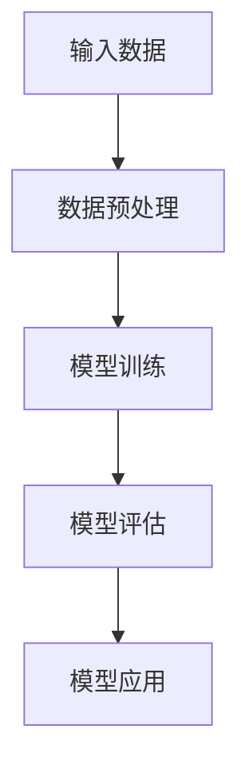

                 

### 大模型时代的创业者创业心态调适方法：压力管理、情绪管理与心理辅导

在人工智能飞速发展的今天，大模型已经成为推动科技创新和产业升级的重要力量。然而，对于创业者而言，大模型时代不仅带来了机遇，也伴随着巨大的挑战。本文将深入探讨大模型时代下创业者的心态调适方法，重点关注压力管理、情绪管理和心理辅导这三个方面。通过逐步分析，我们希望能够帮助创业者更好地应对创业过程中的各种困境，提升创业成功率。

#### 关键词：

- 大模型时代
- 创业者心态
- 压力管理
- 情绪管理
- 心理辅导

#### 摘要：

本文旨在探讨大模型时代下创业者的心态调适方法。通过对压力管理、情绪管理和心理辅导的深入分析，本文提供了具体的策略和实战案例，帮助创业者应对创业过程中的各种挑战，提升创业成功率。

## 第一部分: 大模型时代概述

大模型时代已经到来，作为创业者，了解这一时代的背景和核心概念至关重要。以下章节将逐一介绍大模型时代的定义与影响、核心概念与联系、关键算法原理以及大模型的应用领域，为后续的深入讨论奠定基础。

### 第1章: 大模型时代下的创业者心态

#### 1.1 大模型时代概述

**1.1.1 大模型时代的定义与影响**

大模型时代是指以深度学习和人工智能为核心驱动力，大规模数据处理和分析能力得以实现的时期。这一时代的到来，不仅推动了技术进步，也对各行各业产生了深远的影响。

首先，大模型在创业环境中的作用不可忽视。它能够帮助创业者更好地理解和分析市场趋势，优化产品和服务，提高决策效率。例如，通过自然语言处理技术，创业者可以更精准地了解用户需求，从而改进产品功能。

其次，大模型时代的创业挑战与机遇并存。创业者需要具备强大的技术能力和市场洞察力，以应对快速变化的市场环境。同时，大模型也为创业者提供了更多创新空间和商业机会。

**1.1.2 大模型在创业环境中的作用**

大模型在创业环境中的作用主要体现在以下几个方面：

1. **市场分析**：通过大规模数据处理和分析，创业者可以更准确地把握市场动态，了解竞争对手的优劣势，制定更为有效的市场策略。
2. **产品优化**：大模型可以帮助创业者优化产品功能，提高用户体验，从而增强产品竞争力。
3. **决策支持**：大模型能够提供基于数据的决策支持，帮助创业者更好地应对不确定性和复杂的市场环境。

**1.1.3 大模型时代的创业挑战与机遇**

大模型时代的创业挑战主要包括：

1. **技术门槛高**：创业者需要具备深厚的专业知识，才能充分利用大模型的优势。
2. **数据隐私和安全**：随着数据量的增大，数据隐私和安全问题变得尤为重要，创业者需要确保用户数据的安全和隐私。
3. **市场竞争激烈**：大模型的应用场景广泛，市场竞争日益激烈，创业者需要具备创新能力和持续迭代的能力。

然而，大模型时代也为创业者带来了许多机遇：

1. **创新空间大**：大模型为创业者提供了广阔的创新空间，可以探索新的业务模式和商业模式。
2. **商业机会多**：大模型在各个领域的应用潜力巨大，创业者可以挖掘其中的商业机会，创造价值。
3. **资源获取便捷**：随着大模型技术的发展，创业者可以更便捷地获取技术资源和资金支持。

#### 1.2 大模型的核心概念与联系

**1.2.1 大模型的定义与分类**

大模型是指具备大规模数据处理和分析能力的深度学习模型。根据应用场景和任务类型，大模型可以分为以下几类：

1. **自然语言处理模型**：如BERT、GPT等，用于文本分类、问答系统、机器翻译等任务。
2. **计算机视觉模型**：如ResNet、Inception等，用于图像分类、目标检测、图像生成等任务。
3. **语音识别模型**：如Transformer、CTC等，用于语音识别、语音合成等任务。
4. **其他领域模型**：如时间序列模型、推荐系统等，用于金融、电商、医疗等领域的应用。

**1.2.2 大模型的工作原理（Mermaid流程图）**

下面是一个简单的Mermaid流程图，展示了大模型的工作原理：

**1.2.3 大模型的关键算法原理**

大模型的关键算法原理主要包括：

1. **深度神经网络**：深度神经网络是构成大模型的基础，通过多层非线性变换实现数据的高效处理和分析。
2. **优化算法**：如随机梯度下降（SGD）、Adam等，用于模型的参数更新和优化。
3. **正则化技术**：如Dropout、L2正则化等，用于防止模型过拟合和提高泛化能力。

**1.2.4 大模型的数学模型与公式**

大模型的数学模型主要包括以下几个方面：

1. **损失函数**：用于评估模型预测结果与真实值之间的差距，常用的损失函数有均方误差（MSE）、交叉熵损失等。
2. **激活函数**：如ReLU、Sigmoid、Tanh等，用于引入非线性变换，增强模型的表达力。
3. **反向传播算法**：用于模型参数的更新和优化，是深度学习算法的核心。

以下是几个常用的数学公式：

$$
L(\theta) = -\frac{1}{m}\sum_{i=1}^{m}y_{i}\log(a_{i})
$$

$$
a_{i} = \sigma(\theta \cdot x_{i} + b)
$$

$$
\sigma(z) = \frac{1}{1 + e^{-z}}
$$

**1.2.5 大模型的应用领域**

大模型在多个领域都取得了显著的应用成果，主要包括：

1. **自然语言处理**：如文本分类、机器翻译、问答系统等。
2. **计算机视觉**：如图像分类、目标检测、图像生成等。
3. **语音识别**：如语音识别、语音合成、语音情感分析等。
4. **推荐系统**：如商品推荐、内容推荐等。
5. **金融科技**：如股票市场预测、风险控制等。

### 第一部分总结

本部分主要介绍了大模型时代的背景和核心概念，包括定义、工作原理、关键算法、数学模型及应用领域。通过这一部分的介绍，创业者可以更好地了解大模型时代的机遇和挑战，为后续的心态调适方法提供理论基础。

### 第二部分: 创业者心态调适

在大模型时代，创业者面临着前所未有的挑战和机遇。然而，创业过程中的压力、情绪波动和心理负担也是不可避免的。为了提升创业成功率，创业者需要学会调适自己的心态，有效管理压力、情绪和心理问题。以下章节将详细探讨压力管理、情绪管理和心理辅导的方法和策略。

#### 第2章: 压力管理

压力是创业者常见的心理问题之一，它可能源自于工作压力、财务压力、市场压力等多方面。有效的压力管理对于维护创业者的身心健康和保持良好的创业状态至关重要。

##### 2.1 压力的来源与危害

**2.1.1 压力的来源**

创业过程中的压力来源主要包括以下几个方面：

1. **工作压力**：包括高强度的工作负荷、长时间的工作时间、不断变化的任务要求等。
2. **财务压力**：包括资金短缺、财务风险、投资回报不确定性等。
3. **市场压力**：包括市场竞争激烈、客户需求变化、市场份额争夺等。
4. **人际关系压力**：包括与团队成员、合作伙伴、投资者等的人际关系问题。

**2.1.2 压力对创业者的危害**

长期的压力会对创业者的身心健康产生严重影响，包括以下几个方面：

1. **身体健康问题**：如失眠、疲劳、焦虑、抑郁等。
2. **心理健康问题**：如情绪不稳定、自信心下降、自我怀疑等。
3. **工作效率下降**：压力可能导致创业者无法集中精力，影响工作质量和效率。
4. **人际关系破裂**：长期的压力可能导致人际关系紧张，影响团队合作和沟通。

##### 2.2 压力管理的核心方法

为了有效地管理压力，创业者可以采用以下几种核心方法：

**2.2.1 认知行为疗法**

认知行为疗法（CBT）是一种广泛应用于压力管理的心理治疗技术。它通过改变负面思维模式和行为习惯，帮助创业者建立积极的心态。

1. **认知重构**：通过识别和挑战负面思维模式，改变对压力事件的认识和解释方式。
2. **行为调整**：通过制定实际可行的行动计划，调整行为习惯，降低压力水平。

**2.2.2 放松技巧**

放松技巧是一种通过身体和精神的放松来减轻压力的方法。常见的放松技巧包括：

1. **深呼吸**：通过深呼吸，放松身心，减轻紧张和焦虑。
2. **渐进性肌肉放松**：通过逐步放松身体的肌肉群，达到全身放松的效果。
3. **瑜伽和冥想**：瑜伽和冥想可以帮助创业者放松身心，提高专注力和自我意识。

**2.2.3 时间管理与优先级设置**

时间管理和优先级设置是减轻压力的重要策略。通过合理规划时间，设置明确的优先级，创业者可以更有效地管理工作任务，减少因时间管理不当而产生的压力。

1. **制定日程表**：将每天的任务和活动安排在日程表上，确保时间得到合理利用。
2. **设置优先级**：根据任务的重要性和紧急程度，将任务分为优先级，确保重要任务得到优先处理。
3. **学会说“不”**：合理拒绝不必要的任务和活动，避免时间浪费和压力增加。

##### 2.3 压力管理案例解析

**2.3.1 成功案例一**

创业者小李是一家初创科技公司的创始人。在创业初期，他面临着巨大的工作压力和财务压力。为了应对压力，他采用了以下方法：

1. **认知重构**：小李学会了识别和挑战自己的负面思维模式，例如“我一定要做到完美”等。通过认知重构，他调整了对压力事件的认识，从而减轻了心理负担。
2. **放松技巧**：小李定期进行深呼吸和瑜伽练习，通过身体放松来缓解压力。
3. **时间管理与优先级设置**：小李制定了详细的日程表，并学会了设置优先级，将时间用于最重要的任务。

通过这些方法，小李成功地管理了压力，保持了良好的创业状态，并取得了显著的创业成果。

**2.3.2 失败案例一**

创业者小张是一家初创电商平台的创始人。在创业过程中，他因为未能有效管理压力，最终导致创业失败。

1. **缺乏认知重构**：小张没有学会识别和挑战自己的负面思维模式，导致他无法有效应对压力。
2. **缺乏放松技巧**：小张没有采取任何放松技巧，长期处于高强度工作状态，导致身心疲惫。
3. **时间管理不当**：小张没有合理安排时间，导致任务堆积，压力不断积累。

通过这个案例，我们可以看到，有效的压力管理对于创业者的成功至关重要。创业者需要学会认知重构、放松技巧和时间管理，以应对创业过程中的各种挑战。

**2.3.3 经验总结**

从以上案例中，我们可以得出以下经验总结：

1. **认知重构是关键**：学会识别和挑战负面思维模式，有助于创业者更好地应对压力。
2. **放松技巧不可忽视**：定期进行身体和精神的放松，有助于缓解压力，提高心理健康水平。
3. **时间管理是基础**：合理安排时间，设置优先级，有助于提高工作效率，减轻压力。

通过有效的压力管理，创业者可以更好地应对创业过程中的各种挑战，提高创业成功率。

### 第3章: 情绪管理

情绪是创业过程中不可避免的一部分，情绪的波动可能对创业者的决策和行为产生重大影响。因此，情绪管理成为创业者心态调适的重要一环。

##### 3.1 情绪的类型与影响

**3.1.1 情绪的类型**

情绪可以分为积极情绪和消极情绪两种类型：

1. **积极情绪**：如快乐、兴奋、满足等，有助于提高创业者的自信心和积极性，促进创业成功。
2. **消极情绪**：如焦虑、沮丧、愤怒等，可能导致创业者情绪低落，影响决策和行为。

**3.1.2 情绪对创业过程的影响**

情绪对创业过程的影响主要体现在以下几个方面：

1. **决策行为**：情绪可能影响创业者的决策行为，导致决策过于冲动或过于保守。
2. **人际关系**：情绪的波动可能导致创业者与团队成员、合作伙伴、投资者等之间的关系紧张，影响团队协作和合作效果。
3. **工作表现**：情绪不稳定可能影响创业者的工作效率和工作质量，影响创业成果。

##### 3.2 情绪管理的核心方法

为了有效管理情绪，创业者可以采用以下几种核心方法：

**3.2.1 认知重构**

认知重构是一种通过改变对事件的认识和解释来管理情绪的方法。创业者可以通过以下步骤进行认知重构：

1. **识别负面情绪**：首先识别自己在特定情境下产生的负面情绪，如焦虑、沮丧等。
2. **分析负面情绪的根源**：分析导致负面情绪的根源，如工作任务、人际关系等。
3. **重构认知**：通过积极的思考方式，调整对事件的认知，例如从“事情总是不如意”转变为“每一次失败都是一次宝贵的学习机会”。

**3.2.2 情绪调节策略**

情绪调节策略是一种通过改变情绪体验来管理情绪的方法。以下是一些常见的情绪调节策略：

1. **注意力转移**：通过将注意力从负面情绪转移到其他事物上，如进行运动、听音乐等，减轻负面情绪的影响。
2. **认知重构**：通过积极的思考方式，改变对事件的认知，从而调整情绪体验。
3. **情绪表达**：通过适当的渠道表达情绪，如与朋友、家人交流，或通过写作、绘画等方式进行情绪宣泄。

**3.2.3 正念练习**

正念练习是一种通过专注于当前时刻来管理情绪的方法。以下是一些正念练习的方法：

1. **呼吸练习**：通过专注于呼吸，将注意力集中在呼吸上，放松身心，减轻情绪波动。
2. **身体扫描**：通过从头部到脚部的身体扫描，感知身体的变化，放松身体和情绪。
3. **正念冥想**：通过专注于呼吸或其他外部刺激，培养专注力和情绪稳定性。

##### 3.3 情绪管理案例解析

**3.3.1 成功案例一**

创业者小王在创业过程中，面对市场竞争的压力，经常感到焦虑和紧张。为了管理情绪，他采用了以下方法：

1. **认知重构**：小王学会了识别和挑战自己的负面思维模式，例如“我一定要在市场上占据领先地位”等。通过认知重构，他调整了对竞争压力的认识，从而减轻了情绪负担。
2. **情绪调节策略**：小王通过定期进行运动、听音乐和与朋友交流等方式，转移注意力，缓解焦虑情绪。
3. **正念练习**：小王每天进行呼吸练习和身体扫描，提高专注力和情绪稳定性。

通过这些方法，小王成功地管理了情绪，保持了良好的创业状态，并取得了显著的创业成果。

**3.3.2 失败案例一**

创业者小张在创业初期，因为未能有效管理情绪，最终导致创业失败。

1. **缺乏认知重构**：小张没有学会识别和挑战自己的负面思维模式，导致他对创业过程中遇到的问题产生了过度的情绪反应。
2. **缺乏情绪调节策略**：小张没有采取任何情绪调节策略，长期处于焦虑和紧张的状态，影响了他的决策和行为。
3. **缺乏正念练习**：小张没有进行正念练习，无法有效地控制自己的情绪。

通过这个案例，我们可以看到，有效的情绪管理对于创业者的成功至关重要。创业者需要学会认知重构、情绪调节策略和正念练习，以应对创业过程中的各种挑战。

**3.3.3 经验总结**

从以上案例中，我们可以得出以下经验总结：

1. **认知重构是关键**：学会识别和挑战负面思维模式，有助于创业者更好地管理情绪。
2. **情绪调节策略不可忽视**：通过注意力转移、认知重构和情绪表达等方式，可以有效缓解负面情绪的影响。
3. **正念练习有助于情绪稳定性**：通过呼吸练习、身体扫描和正念冥想等方式，可以提高专注力和情绪稳定性。

通过有效的情绪管理，创业者可以更好地应对创业过程中的情绪波动，提高创业成功率。

### 第4章: 心理辅导

心理辅导是一种通过专业方法和策略帮助创业者应对心理问题和提高心理健康水平的服务。在大模型时代，创业者面临着巨大的压力和挑战，心理辅导的作用愈发重要。

##### 4.1 心理辅导的重要性

**4.1.1 心理健康对创业的影响**

心理健康对创业有着重要的影响，主要体现在以下几个方面：

1. **决策能力**：心理健康有助于创业者做出明智的决策，降低决策失误的风险。
2. **团队合作**：心理健康有助于创业者建立良好的团队关系，提高团队合作效率。
3. **创新能力**：心理健康有助于创业者保持创新思维，应对市场变化和挑战。
4. **抗压能力**：心理健康有助于创业者应对创业过程中的压力和挑战，提高抗压能力。

**4.1.2 心理辅导的基本原理**

心理辅导的基本原理包括以下几个方面：

1. **认知行为理论**：认知行为理论认为，人的思维和行为是相互影响的。通过改变思维模式，可以改善行为和心理状态。
2. **人本主义心理学**：人本主义心理学强调个体的自我实现和自我决定。心理辅导旨在帮助个体发掘潜能，实现自我价值。
3. **心理动力学**：心理动力学认为，人的行为和心理状态受到潜意识的影响。通过探索潜意识，可以解决心理问题，改善心理状态。

##### 4.2 心理辅导的方法

心理辅导的方法可以分为个别辅导、团体辅导和在线辅导三种。

**4.2.1 个别辅导**

个别辅导是一种一对一的心理辅导方式，适用于需要深入探讨个人心理问题的创业者。个别辅导的主要方法包括：

1. **认知行为疗法**：通过识别和挑战负面思维模式，改变对事件的认知和解释方式，帮助创业者改善心理状态。
2. **情感释放技术**：通过情绪释放和宣泄，帮助创业者缓解心理压力，提高心理健康水平。
3. **心理动力学**：通过探索潜意识，解决深层次的心理问题，帮助创业者实现自我成长和自我实现。

**4.2.2 团体辅导**

团体辅导是一种在小组中进行心理辅导的方式，适用于需要与他人交流和支持的创业者。团体辅导的主要方法包括：

1. **互动交流**：通过小组内的互动交流，创业者可以分享自己的经历和感受，获得他人的理解和支持。
2. **角色扮演**：通过角色扮演，创业者可以模拟实际情境，探索不同的应对策略，提高心理应对能力。
3. **团体讨论**：通过团体讨论，创业者可以共同探讨心理问题，分享解决问题的方法和经验。

**4.2.3 在线辅导**

在线辅导是一种通过互联网进行的心理辅导方式，适用于需要灵活安排时间的创业者。在线辅导的主要方法包括：

1. **视频咨询**：通过视频通话，创业者可以与心理咨询师进行面对面的交流，获得专业的心理辅导。
2. **文字咨询**：通过文字聊天，创业者可以与心理咨询师进行实时的交流，方便快捷地解决心理问题。
3. **在线课程**：通过在线课程，创业者可以学习心理辅导的知识和技巧，提高自己的心理素质。

##### 4.3 心理辅导案例解析

**4.3.1 成功案例一**

创业者小陈在创业过程中，因为长期承受压力，导致心理健康状况不佳。为了改善心理状态，他接受了心理咨询师的一对一辅导。通过以下方法，小陈成功地改善了心理健康：

1. **认知行为疗法**：心理咨询师帮助小陈识别和挑战负面思维模式，改变了对压力事件的认知和解释方式。
2. **情感释放技术**：心理咨询师通过情感释放技术，帮助小陈缓解了心理压力，提高了心理健康水平。
3. **心理动力学**：心理咨询师帮助小陈探索了潜意识，解决了深层次的心理问题，促进了自我成长和自我实现。

**4.3.2 失败案例一**

创业者小李在创业初期，因为未能得到有效的心理辅导，导致心理健康状况恶化，最终影响了创业成果。以下是小李的失败原因：

1. **缺乏认知行为疗法**：小李未能识别和挑战负面思维模式，导致他对压力事件的认知和解释方式仍然停留在负面状态。
2. **缺乏情感释放技术**：小李未能缓解心理压力，导致他的心理健康状况持续恶化。
3. **缺乏心理动力学**：小李未能探索潜意识，解决深层次的心理问题，导致他无法实现自我成长和自我实现。

**4.3.3 经验总结**

从以上案例中，我们可以得出以下经验总结：

1. **认知行为疗法是关键**：学会识别和挑战负面思维模式，有助于创业者改善心理健康状态。
2. **情感释放技术不可忽视**：通过缓解心理压力，可以提高心理健康水平。
3. **心理动力学有助于自我成长**：通过探索潜意识，解决深层次的心理问题，促进自我成长和自我实现。

通过有效的心理辅导，创业者可以更好地应对创业过程中的心理问题，提高心理健康水平，从而实现创业成功。

### 第5章: 创业者心态调适的整体策略

在创业过程中，心态调适是一个持续的过程，需要创业者采取一系列的策略和措施，以保持良好的心理状态和应对各种挑战。以下章节将介绍心态调适的目标、原则以及具体实施方法，帮助创业者实现心态的持续调适。

##### 5.1 心态调适的目标与原则

**5.1.1 心态调适的目标**

心态调适的目标主要包括以下几个方面：

1. **提高心理素质**：通过心态调适，提高创业者的心理素质，增强应对压力和挑战的能力。
2. **促进心理健康**：通过心态调适，改善创业者的心理健康水平，减少心理问题和情绪困扰。
3. **提升决策能力**：通过心态调适，帮助创业者保持冷静和清晰的思维，提高决策质量和效果。
4. **增强团队合作**：通过心态调适，促进创业者与团队成员之间的良好沟通和协作，提高团队整体效能。

**5.1.2 心态调适的原则**

心态调适应遵循以下原则：

1. **全面性**：心态调适不仅关注个体心理素质的提升，还应关注创业者整体的心理健康，包括身体健康、情绪状态、人际关系等。
2. **针对性**：针对不同的创业者，心态调适应采取不同的策略和措施，根据创业者的具体情况和需求，制定个性化的调适方案。
3. **持续性**：心态调适是一个持续的过程，创业者需要长期坚持，不断调整和优化心态，以适应不断变化的环境和挑战。
4. **科学性**：心态调适应基于心理学理论和实证研究，采取科学有效的方法和策略，确保调适效果和可持续性。

##### 5.2 心态调适的具体实施

**5.2.1 短期调适策略**

短期调适策略主要包括以下几个方面：

1. **压力管理**：通过认知行为疗法、放松技巧和时间管理等方法，帮助创业者短期内缓解压力，提高心理承受能力。
2. **情绪调节**：通过认知重构、情绪表达和正念练习等策略，帮助创业者调节情绪，保持心理平衡。
3. **心理辅导**：通过个别辅导、团体辅导和在线辅导等渠道，提供专业的心理支持和指导，解决创业过程中的心理问题。

**5.2.2 长期调适策略**

长期调适策略主要包括以下几个方面：

1. **自我反思**：通过定期进行自我反思和评估，创业者可以更好地了解自己的心理状态和行为模式，及时调整心态。
2. **心理成长**：通过学习心理学知识和参加心理成长课程，创业者可以不断提升自己的心理素质和心理健康水平。
3. **心理支持系统**：建立心理支持系统，包括与家人、朋友和专业人士的交流，获得情感上的支持和鼓励。

**5.2.3 整合调适策略**

整合调适策略是将短期和长期调适策略相结合，形成一套完整的心态调适体系。以下是一个整合调适策略的示例：

1. **定期自我评估**：每月进行一次自我评估，了解自己的心理状态和成长进度，制定相应的调适计划。
2. **短期压力管理**：在遇到重大压力事件时，采取认知行为疗法、放松技巧和情绪调节策略，短期内缓解压力。
3. **长期心理成长**：通过学习心理学知识和参加心理成长课程，不断提升自己的心理素质和应对能力。
4. **建立心理支持系统**：与家人、朋友和专业人士建立稳定的交流关系，获得情感上的支持和鼓励。
5. **心理辅导**：定期进行心理辅导，解决创业过程中的心理问题，保持心理健康的持续发展。

##### 5.3 心态调适的自我评估与反馈

**5.3.1 自我评估方法**

自我评估是心态调适的重要一环，创业者可以通过以下方法进行自我评估：

1. **心理问卷**：使用标准化的心理问卷，如焦虑自评量表、抑郁自评量表等，评估自己的心理健康水平。
2. **日记记录**：通过记录每天的所思所感，了解自己的情绪变化和心理状态。
3. **心理访谈**：与心理咨询师进行一对一访谈，深入了解自己的心理问题和发展需求。

**5.3.2 反馈机制**

反馈机制是心态调适的重要保障，创业者可以通过以下方法建立反馈机制：

1. **定期反馈**：定期向家人、朋友和专业人士反馈自己的心理状态和调适效果，获得他们的意见和建议。
2. **自我反馈**：定期进行自我反思和总结，了解自己的成长和不足之处，制定相应的改进计划。
3. **心理辅导反馈**：向心理辅导师提供反馈，了解辅导效果，调整辅导策略和方法。

通过自我评估和反馈，创业者可以更好地了解自己的心理状态，调整心态调适策略，实现持续的心态调适和心理健康。

### 第二部分总结

本部分深入探讨了创业者的压力管理、情绪管理和心理辅导，提供了具体的方法和策略。通过案例解析，为创业者提供了实践中的经验总结。有效的心态调适对于创业者的心理健康和创业成功至关重要，创业者应持续关注并优化自己的心态调适方法。

### 第三部分: 大模型创业实战

在创业过程中，大模型技术已经成为创业者重要的工具和战略资源。本部分将结合实际创业案例，探讨大模型技术在创业实践中的应用，包括项目实战、开发环境搭建、源代码详细实现和代码解读与分析等。

#### 第6章: 压力管理在创业中的应用

创业过程充满挑战和不确定性，压力管理成为创业者成功的关键因素。以下章节将详细探讨压力管理在创业实践中的应用，包括创业过程中的压力现象、压力管理方法以及具体的创业者压力管理案例。

##### 6.1 创业中的压力现象

**6.1.1 创业过程中常见的压力来源**

创业过程中的压力来源多种多样，主要包括以下几个方面：

1. **财务压力**：资金短缺、投资回报不确定性等财务问题可能导致创业者产生巨大的压力。
2. **时间压力**：创业过程中需要处理大量事务，时间安排紧张，可能导致创业者感到压力。
3. **市场压力**：市场竞争激烈，客户需求变化快，可能导致创业者感到压力。
4. **人际关系压力**：与团队成员、合作伙伴、投资者等的人际关系问题也可能成为创业者的压力来源。

**6.1.2 创业压力的影响**

长期的压力会对创业者的身心健康产生严重影响，包括以下几个方面：

1. **身体健康问题**：如失眠、焦虑、抑郁等。
2. **心理健康问题**：如情绪不稳定、自信心下降、自我怀疑等。
3. **工作效率下降**：压力可能导致创业者无法集中精力，影响工作质量和效率。
4. **人际关系破裂**：长期的压力可能导致人际关系紧张，影响团队合作和沟通。

##### 6.2 压力管理在创业实践中的应用

为了有效管理创业过程中的压力，创业者可以采用以下几种方法：

**6.2.1 创业前期的压力管理**

在创业初期，创业者可以采取以下策略来管理压力：

1. **制定清晰的愿景和目标**：明确自己的创业方向和目标，有助于创业者更好地应对不确定性，降低焦虑感。
2. **合理规划时间和资源**：合理安排时间，确保主要任务得到优先处理，避免过度劳累。
3. **寻求外部支持**：与家人、朋友、导师等建立良好的沟通，获得情感上的支持和建议。

**6.2.2 创业过程中的压力应对**

在创业过程中，创业者需要不断应对各种压力，以下策略可以帮助创业者应对压力：

1. **定期放松**：通过运动、冥想、旅行等方式，定期放松身心，缓解压力。
2. **时间管理**：通过制定日程表、设置优先级等时间管理方法，提高工作效率，减轻时间压力。
3. **情感宣泄**：找到合适的渠道，如与朋友倾诉、写日记等，宣泄负面情绪，缓解压力。

**6.2.3 创业后期的压力释放**

在创业后期，创业者可以采取以下策略来释放压力：

1. **庆祝成功**：当创业取得阶段性成功时，及时庆祝，提高自信心和满足感。
2. **调整工作节奏**：随着事业的发展，适当调整工作节奏，避免过度劳累。
3. **关注身心健康**：保持健康的生活习惯，如合理饮食、充足睡眠等，提高身心健康水平。

##### 6.3 创业者压力管理案例

**6.3.1 成功案例一**

创业者小李是一家初创科技公司的创始人。在创业初期，他面临着巨大的财务压力和市场压力。为了管理压力，他采取了以下措施：

1. **制定清晰的愿景和目标**：小李明确了自己的创业愿景，并将目标分解为可实现的阶段性目标，从而更好地应对不确定性。
2. **合理规划时间和资源**：小李制定了详细的日程表，确保主要任务得到优先处理，同时与团队成员明确分工，提高工作效率。
3. **定期放松**：小李定期进行运动和冥想，通过放松身心来缓解压力。

通过这些措施，小李成功管理了创业过程中的压力，保持了良好的创业状态，并取得了显著的创业成果。

**6.3.2 失败案例一**

创业者小王是一家初创电商平台的创始人。在创业过程中，他因为未能有效管理压力，最终导致创业失败。

1. **缺乏清晰的愿景和目标**：小王没有明确自己的创业方向和目标，导致他在面对市场变化时感到迷茫和无助。
2. **缺乏合理规划时间和资源**：小王没有合理安排时间和资源，导致任务堆积，压力不断积累。
3. **缺乏定期放松**：小王长期处于高强度工作状态，没有采取任何放松措施，导致身心疲惫。

**6.3.3 经验总结**

从以上案例中，我们可以得出以下经验总结：

1. **清晰的愿景和目标是关键**：创业者需要明确自己的创业方向和目标，从而更好地应对不确定性。
2. **合理规划时间和资源**：合理安排时间和资源，确保主要任务得到优先处理，有助于减轻压力。
3. **定期放松**：定期进行放松活动，缓解压力，保持身心健康。

通过有效的压力管理，创业者可以更好地应对创业过程中的各种挑战，提高创业成功率。

### 第7章: 情绪管理在创业中的应用

情绪管理是创业过程中不可或缺的一部分，情绪的波动可能对创业者的决策和行为产生重大影响。以下章节将详细探讨情绪管理在创业实践中的应用，包括情绪管理的重要性、情绪管理策略以及具体的创业者情绪管理案例。

##### 7.1 情绪管理对创业的影响

**7.1.1 情绪管理的重要性**

情绪管理对创业者的成功至关重要，主要体现在以下几个方面：

1. **决策能力**：情绪稳定有助于创业者做出明智的决策，避免因情绪波动而做出错误的决策。
2. **人际关系**：情绪稳定有助于创业者建立良好的人际关系，提高团队合作效率。
3. **创新能力**：情绪稳定有助于创业者保持创新思维，应对市场变化和挑战。
4. **工作表现**：情绪稳定有助于提高创业者的工作表现，提高工作效率和工作质量。

**7.1.2 情绪管理对创业过程的影响**

情绪管理对创业过程的影响主要体现在以下几个方面：

1. **决策过程**：情绪管理有助于创业者保持冷静和清晰的思维，避免因情绪波动而做出错误的决策。
2. **团队合作**：情绪管理有助于创业者与团队成员建立良好的沟通和协作，提高团队整体效能。
3. **创新能力**：情绪管理有助于创业者保持创新思维，积极应对市场变化和挑战。
4. **工作表现**：情绪管理有助于创业者保持高效的工作状态，提高工作效率和工作质量。

##### 7.2 情绪管理在创业实践中的应用

为了有效管理情绪，创业者可以采用以下几种策略：

**7.2.1 认知重构**

认知重构是一种通过改变对事件的认知和解释来管理情绪的方法。创业者可以通过以下步骤进行认知重构：

1. **识别负面情绪**：首先识别自己在特定情境下产生的负面情绪，如焦虑、沮丧等。
2. **分析情绪根源**：分析负面情绪的根源，如工作任务、人际关系等。
3. **重构认知**：通过积极的思考方式，调整对事件的认知，例如从“事情总是不如意”转变为“每一次失败都是一次宝贵的学习机会”。

**7.2.2 情绪调节策略**

情绪调节策略是一种通过改变情绪体验来管理情绪的方法。以下是一些常见的情绪调节策略：

1. **注意力转移**：通过将注意力从负面情绪转移到其他事物上，如进行运动、听音乐等，减轻负面情绪的影响。
2. **认知重构**：通过积极的思考方式，改变对事件的认知，从而调整情绪体验。
3. **情绪表达**：通过适当的渠道表达情绪，如与朋友、家人交流，或通过写作、绘画等方式进行情绪宣泄。

**7.2.3 正念练习**

正念练习是一种通过专注于当前时刻来管理情绪的方法。以下是一些正念练习的方法：

1. **呼吸练习**：通过专注于呼吸，将注意力集中在呼吸上，放松身心，减轻情绪波动。
2. **身体扫描**：通过从头部到脚部的身体扫描，感知身体的变化，放松身体和情绪。
3. **正念冥想**：通过专注于呼吸或其他外部刺激，培养专注力和情绪稳定性。

##### 7.3 情绪管理在创业中的案例分析

**7.3.1 成功案例一**

创业者小张在创业过程中，因为经常遇到各种挑战，导致情绪波动较大。为了管理情绪，他采用了以下方法：

1. **认知重构**：小张学会了识别和挑战自己的负面思维模式，例如“我一定要在市场上取得成功”等。通过认知重构，他调整了对创业过程中挑战的认识，从而减轻了情绪负担。
2. **情绪调节策略**：小张通过定期进行运动、听音乐和与朋友交流等方式，转移注意力，缓解负面情绪。
3. **正念练习**：小张每天进行呼吸练习和身体扫描，提高专注力和情绪稳定性。

通过这些方法，小张成功地管理了情绪，保持了良好的创业状态，并取得了显著的创业成果。

**7.3.2 失败案例一**

创业者小陈在创业初期，因为未能有效管理情绪，最终导致创业失败。

1. **缺乏认知重构**：小陈没有学会识别和挑战自己的负面思维模式，导致他对创业过程中的失败产生了过度的情绪反应。
2. **缺乏情绪调节策略**：小陈没有采取任何情绪调节策略，长期处于情绪波动较大的状态，影响了他的决策和行为。
3. **缺乏正念练习**：小陈没有进行正念练习，无法有效地控制自己的情绪。

**7.3.3 经验总结**

从以上案例中，我们可以得出以下经验总结：

1. **认知重构是关键**：学会识别和挑战负面思维模式，有助于创业者更好地管理情绪。
2. **情绪调节策略不可忽视**：通过注意力转移、认知重构和情绪表达等方式，可以有效缓解负面情绪的影响。
3. **正念练习有助于情绪稳定性**：通过呼吸练习、身体扫描和正念冥想等方式，可以提高专注力和情绪稳定性。

通过有效的情绪管理，创业者可以更好地应对创业过程中的情绪波动，提高创业成功率。

### 第8章: 心理辅导在创业中的应用

心理辅导是帮助创业者应对心理问题、提升心理健康水平的重要手段。在本章中，我们将探讨心理辅导在创业中的应用，包括心理辅导的重要性、心理辅导方法以及具体的创业者心理辅导案例。

##### 8.1 心理辅导在创业中的作用

**8.1.1 心理健康对创业的影响**

心理健康对创业有着深远的影响，主要体现在以下几个方面：

1. **决策能力**：健康的心理状态有助于创业者做出明智的决策，减少因情绪波动导致的错误决策。
2. **创新能力**：心理健康有助于创业者保持创新思维，积极应对市场变化和挑战。
3. **团队合作**：健康的心理状态有助于创业者建立和谐的人际关系，提高团队合作效率。
4. **抗压能力**：心理健康有助于创业者应对创业过程中的压力和挑战，提高抗压能力。

**8.1.2 心理辅导的基本原理**

心理辅导的基本原理包括以下几个方面：

1. **认知行为理论**：认知行为理论认为，人的思维和行为是相互影响的。通过改变思维模式，可以改善行为和心理状态。
2. **人本主义心理学**：人本主义心理学强调个体的自我实现和自我决定。心理辅导旨在帮助个体发掘潜能，实现自我价值。
3. **心理动力学**：心理动力学认为，人的行为和心理状态受到潜意识的影响。通过探索潜意识，可以解决心理问题，改善心理状态。

##### 8.2 心理辅导的方法

心理辅导的方法可以分为个别辅导、团体辅导和在线辅导三种，每种方法都有其独特的优势和适用场景。

**8.2.1 个别辅导**

个别辅导是一种一对一的心理辅导方式，适用于需要深入探讨个人心理问题的创业者。个别辅导的主要方法包括：

1. **认知行为疗法**：通过识别和挑战负面思维模式，改变对事件的认知和解释方式，帮助创业者改善心理状态。
2. **情感释放技术**：通过情感释放和宣泄，帮助创业者缓解心理压力，提高心理健康水平。
3. **心理动力学**：通过探索潜意识，解决深层次的心理问题，帮助创业者实现自我成长和自我实现。

**8.2.2 团体辅导**

团体辅导是一种在小组中进行心理辅导的方式，适用于需要与他人交流和支持的创业者。团体辅导的主要方法包括：

1. **互动交流**：通过小组内的互动交流，创业者可以分享自己的经历和感受，获得他人的理解和支持。
2. **角色扮演**：通过角色扮演，创业者可以模拟实际情境，探索不同的应对策略，提高心理应对能力。
3. **团体讨论**：通过团体讨论，创业者可以共同探讨心理问题，分享解决问题的方法和经验。

**8.2.3 在线辅导**

在线辅导是一种通过互联网进行的心理辅导方式，适用于需要灵活安排时间的创业者。在线辅导的主要方法包括：

1. **视频咨询**：通过视频通话，创业者可以与心理咨询师进行面对面的交流，获得专业的心理辅导。
2. **文字咨询**：通过文字聊天，创业者可以与心理咨询师进行实时的交流，方便快捷地解决心理问题。
3. **在线课程**：通过在线课程，创业者可以学习心理辅导的知识和技巧，提高自己的心理素质。

##### 8.3 心理辅导在创业中的案例研究

**8.3.1 成功案例一**

创业者小李在创业初期，由于面临巨大的压力和挑战，导致心理健康状况不佳。为了改善心理状态，他接受了心理咨询师的一对一辅导。通过以下方法，小李成功地改善了心理健康：

1. **认知行为疗法**：心理咨询师帮助小李识别和挑战负面思维模式，改变了对压力事件的认知和解释方式。
2. **情感释放技术**：心理咨询师通过情感释放技术，帮助小李缓解了心理压力，提高了心理健康水平。
3. **心理动力学**：心理咨询师帮助小李探索了潜意识，解决了深层次的心理问题，促进了自我成长和自我实现。

**8.3.2 失败案例一**

创业者小张在创业过程中，由于未能得到有效的心理辅导，导致心理健康状况恶化，最终影响了创业成果。以下是小张的失败原因：

1. **缺乏认知行为疗法**：小张未能识别和挑战负面思维模式，导致他对压力事件的认知和解释方式仍然停留在负面状态。
2. **缺乏情感释放技术**：小张未能缓解心理压力，导致他的心理健康状况持续恶化。
3. **缺乏心理动力学**：小张未能探索潜意识，解决深层次的心理问题，导致他无法实现自我成长和自我实现。

**8.3.3 经验总结**

从以上案例中，我们可以得出以下经验总结：

1. **认知行为疗法是关键**：学会识别和挑战负面思维模式，有助于创业者改善心理健康状态。
2. **情感释放技术不可忽视**：通过缓解心理压力，可以提高心理健康水平。
3. **心理动力学有助于自我成长**：通过探索潜意识，解决深层次的心理问题，促进自我成长和自我实现。

通过有效的心理辅导，创业者可以更好地应对创业过程中的心理问题，提高心理健康水平，从而实现创业成功。

### 第三部分总结

本部分深入探讨了压力管理、情绪管理和心理辅导在创业实践中的应用。通过具体的创业案例，我们看到了这些方法在现实中的实际效果。有效的压力管理、情绪管理和心理辅导对于创业者的心理健康和创业成功至关重要。创业者应灵活运用这些策略，持续提升自己的心理素质，以应对创业过程中的各种挑战。

### 第四部分: 创业心态调适的进阶策略

在创业过程中，心态调适不仅是应对短期挑战的方法，更是长期发展的必要条件。随着创业环境的复杂性和不确定性不断增加，创业者需要不断进阶，提升自己的心理素质和调适能力。以下章节将探讨进阶心理辅导方法、高压创业环境下的心理辅导以及心理辅导在跨文化创业中的应用。

#### 第9章: 进阶心理辅导方法

随着创业进程的推进，创业者面临的挑战和压力也会逐渐增加。为了更有效地应对这些挑战，创业者需要掌握一些高级心理辅导方法，这些方法可以帮助他们在高压环境下保持冷静和清晰的思维。

##### 9.1 高级心理辅导技术

**9.1.1 着眼点转移**

着眼点转移是一种心理辅导技术，它帮助创业者将注意力从负面情绪和问题转移到积极的方面。通过改变注意力焦点，创业者可以减少焦虑和压力，提高积极情绪。具体方法包括：

1. **正念练习**：通过专注于当下的呼吸、身体感受或周围环境，使思维从过去的失败或未来的不确定性中解脱出来。
2. **积极思维训练**：定期进行积极思维训练，学会从挑战中寻找机遇，提高解决问题的能力。

**9.1.2 脑神经可塑性训练**

脑神经可塑性是指大脑在适应环境变化时结构和功能的变化能力。通过特定的训练方法，创业者可以增强大脑的可塑性，提高应对压力的能力。具体方法包括：

1. **认知训练**：通过解决复杂的认知任务，如记忆游戏、谜题等，锻炼大脑的认知能力。
2. **运动训练**：定期进行有氧运动，如跑步、游泳等，增强大脑的血液循环，提高神经细胞的连接和功能。

**9.1.3 承诺跟踪与执行策略**

承诺跟踪与执行策略是一种通过设定明确的个人目标并跟踪执行进度来提高自我管理和执行能力的方法。创业者可以通过以下步骤进行承诺跟踪与执行：

1. **设定具体目标**：将长远目标分解为短期目标，确保目标具体、可衡量、可实现。
2. **制定行动计划**：为每个目标制定详细的行动计划，明确每一步的执行步骤。
3. **跟踪进度**：定期检查目标的执行进度，调整计划以适应实际情况。

##### 9.2 心理辅导在特定情境中的应用

**9.2.1 高压创业环境下的心理辅导**

高压创业环境是创业者普遍面临的问题。以下是一些在高压环境下进行心理辅导的有效方法：

1. **压力缓冲技术**：通过深呼吸、冥想等放松技巧，快速缓解紧张情绪。
2. **情绪调节策略**：通过认知重构、情绪表达等策略，调整负面情绪，提高情绪稳定性。
3. **时间管理技巧**：通过合理安排时间，设置优先级，减少因时间管理不当而产生的压力。

**9.2.2 灾难性事件后的心理重建**

灾难性事件，如企业破产、重大失败等，会对创业者造成严重的心理打击。以下是一些在灾难性事件后进行心理重建的方法：

1. **危机干预**：通过专业的危机干预服务，帮助创业者处理创伤和负面情绪。
2. **心理支持小组**：与经历过类似困境的创业者交流，分享经验，互相支持。
3. **反思与总结**：通过回顾事件，分析原因，从中吸取教训，为未来做好准备。

**9.2.3 心理辅导在跨文化创业中的应用**

跨文化创业涉及不同文化背景的交流与合作，对创业者提出了特殊的要求。以下是一些在跨文化创业中进行心理辅导的方法：

1. **文化敏感性培训**：通过学习不同文化的特点和行为习惯，提高文化敏感性，减少误解和冲突。
2. **跨文化沟通技巧**：通过学习有效的跨文化沟通技巧，提高沟通效果，增强团队合作。
3. **情绪管理**：通过情绪管理技巧，帮助创业者处理跨文化合作中的压力和情绪波动。

##### 9.3 高级心理辅导案例分析

**9.3.1 成功案例一**

创业者小李在创业过程中，面临巨大的市场竞争和财务压力。通过以下高级心理辅导方法，他成功应对了这些挑战：

1. **着眼点转移**：小李通过练习冥想和正念，将注意力从竞争压力中转移到自己的产品优势和长期目标上。
2. **脑神经可塑性训练**：小李通过定期进行认知训练和有氧运动，提高大脑的可塑性和情绪稳定性。
3. **承诺跟踪与执行策略**：小李设定了具体的财务目标和市场策略，并定期检查执行进度，确保目标的实现。

**9.3.2 失败案例一**

创业者小张在跨文化创业中，由于文化差异和沟通问题，导致团队协作困难，最终影响了创业项目的成功。以下是一些失败原因和教训：

1. **缺乏文化敏感性培训**：小张没有进行文化敏感性培训，导致对合作伙伴的行为和期望理解不足。
2. **跨文化沟通技巧不足**：小张没有掌握有效的跨文化沟通技巧，导致沟通不畅，产生误解。
3. **情绪管理能力不足**：小张在面对文化冲突时，无法有效地管理自己的情绪，影响了团队合作。

**9.3.3 经验总结**

从以上案例中，我们可以得出以下经验总结：

1. **着眼点转移**：通过正念和冥想，可以帮助创业者将注意力从压力中转移到积极的目标上。
2. **脑神经可塑性训练**：通过认知训练和运动，可以提高大脑的可塑性和情绪稳定性。
3. **承诺跟踪与执行策略**：通过设定明确的目标和跟踪执行进度，可以提高自我管理和执行力。
4. **跨文化创业中的心理辅导**：通过文化敏感性培训和有效的沟通技巧，可以减少文化冲突，提高团队协作效率。

通过掌握这些高级心理辅导方法，创业者可以更好地应对复杂多变的创业环境，提高创业成功率。

#### 第10章: 创业心态的持续调适

创业心态的调适是一个持续的过程，随着外部环境的变化和创业过程的推进，创业者需要不断调整和优化自己的心态。以下章节将探讨持续心态调适的重要性、调适方法以及创业心态的长期规划。

##### 10.1 持续心态调适的重要性

**10.1.1 心态变化对创业的影响**

心态的变化对创业有着深远的影响，主要体现在以下几个方面：

1. **创新能力**：积极的心态有助于创业者保持创新思维，应对市场变化和挑战。
2. **决策能力**：稳定的心态有助于创业者做出明智的决策，减少因情绪波动导致的错误决策。
3. **团队协作**：良好的心态有助于创业者建立和谐的人际关系，提高团队合作效率。
4. **抗压能力**：持续的心态调适有助于创业者提高抗压能力，应对创业过程中的各种压力和挑战。

**10.1.2 持续调适对创业者心理健康的益处**

持续的心态调适对创业者的心理健康有着重要的益处，包括：

1. **减少焦虑和压力**：通过持续的调适，创业者可以学会有效管理压力，减少焦虑和紧张情绪。
2. **提高情绪稳定性**：持续的心态调适有助于提高情绪稳定性，减少情绪波动对工作和生活的影响。
3. **增强心理韧性**：通过持续的心态调适，创业者可以增强心理韧性，更好地应对创业过程中的挫折和失败。

##### 10.2 持续心态调适的方法

为了实现创业心态的持续调适，创业者可以采取以下几种方法：

**10.2.1 自我反思与评估**

自我反思与评估是心态调适的重要一环，创业者可以通过以下步骤进行自我反思与评估：

1. **定期自我反思**：创业者可以定期进行自我反思，回顾自己的行为、思维和心理状态，识别需要改进的方面。
2. **自我评估**：通过自我评估工具，如心理健康问卷，创业者可以了解自己的心理状态，发现潜在的问题。

**10.2.2 建立心理支持系统**

建立心理支持系统是创业者心态调适的重要策略，创业者可以通过以下方法建立支持系统：

1. **家庭支持**：与家人保持良好的沟通，获得家庭的理解和支持。
2. **朋友支持**：与朋友分享自己的创业经历和心理状态，获得朋友的理解和支持。
3. **专业支持**：寻求专业的心理咨询师或心理辅导师的帮助，获得专业的心理支持和指导。

**10.2.3 持续学习的策略**

持续学习是创业者心态调适的有效方法，创业者可以通过以下策略进行持续学习：

1. **阅读**：阅读相关的书籍、文章和案例，了解最新的创业趋势和心理辅导方法。
2. **参加培训**：参加创业培训、心理辅导培训等，提高自己的创业能力和心理素质。
3. **实践**：通过实践，将学到的知识和方法应用到实际创业中，不断积累经验。

##### 10.3 创业心态调适的长期规划

为了实现创业心态的长期调适，创业者需要制定明确的长期规划。以下是一个长期心态调适规划的示例：

**10.3.1 长期心态调适的目标**

1. **提高心理素质**：通过持续的心态调适，提高自己的心理素质，增强应对压力和挑战的能力。
2. **促进心理健康**：通过持续的心态调适，改善自己的心理健康水平，减少心理问题和情绪困扰。
3. **提升决策能力**：通过持续的心态调适，提高决策质量和效果，减少因情绪波动导致的错误决策。
4. **增强团队合作**：通过持续的心态调适，提高与团队成员的沟通和协作能力，增强团队整体效能。

**10.3.2 长期心态调适的步骤**

1. **设定短期目标**：根据长期心态调适目标，设定具体的短期目标，确保目标的可实现性。
2. **制定行动计划**：为每个短期目标制定详细的行动计划，明确每一步的执行步骤。
3. **定期评估和调整**：定期评估心态调适的进展，根据实际情况调整计划和策略。

**10.3.3 长期心态调适的实践**

1. **坚持自我反思**：定期进行自我反思，回顾自己的心态变化和行为模式，识别需要改进的方面。
2. **建立支持系统**：与家人、朋友和专业人士建立稳定的交流关系，获得情感上的支持和鼓励。
3. **持续学习**：通过阅读、培训和实践，不断提高自己的创业能力和心理素质。

通过制定明确的长期规划，并持续实施和调整，创业者可以实现心态的长期调适，提高创业成功率。

### 第四部分总结

本部分探讨了创业心态调适的进阶策略和长期规划，包括高级心理辅导方法、高压创业环境下的心理辅导以及心理辅导在跨文化创业中的应用。通过持续的调适和规划，创业者可以更好地应对创业过程中的各种挑战，提高创业成功率。

### 附录

#### 附录 A: 创业心态调适资源

**A.1 创业心态调适工具与资源**

为了帮助创业者更好地进行心态调适，以下是一些常用的工具和资源推荐：

1. **心理辅导工具**：
   - **Mood Tracker**：一款用于跟踪情绪变化的手机应用，帮助创业者了解自己的情绪波动。
   - **Calm**：一款提供冥想、呼吸练习等心理放松功能的手机应用。

2. **心理健康网站**：
   - **PsychCentral**：提供心理健康资讯、自我评估工具和心理辅导资源。
   - **BetterHelp**：提供在线心理咨询师服务，帮助创业者解决心理问题。

3. **心理辅导书籍推荐**：
   - **《禅与摩托车维修艺术》**：通过摩托车维修的故事，探讨心理和哲学问题，帮助创业者找到内心的平衡。
   - **《正面管教》**：介绍积极的教育和沟通方法，适用于家庭和团队管理。

**A.2 创业心态调适案例库**

为了帮助创业者学习和借鉴成功和失败的经验，以下是一些案例库的推荐：

1. **成功案例库**：
   - **YCombinator**：提供众多成功创业案例，包括创业故事、经验教训等。
   - **Startup Genome**：提供详细的创业案例研究报告，分析成功创业的关键因素。

2. **失败案例库**：
   - **Failure Booth**：记录和分享创业失败的故事，为创业者提供警示和启示。
   - **Failure Stories**：一个收集和分享失败创业故事的网站，帮助创业者从失败中学习。

3. **案例学习资源**：
   - **Harvard Business Review**：提供大量关于创业和管理案例的文章和书籍。
   - **CaseInPoint**：一个提供创业和管理案例库的在线平台，适用于学习和研究。

**A.3 创业心态调适社群**

为了帮助创业者建立交流和支持网络，以下是一些创业心态调适社群的推荐：

1. **创业者社群平台**：
   - **Startup Grind**：一个全球性的创业者社群，定期举办活动和会议。
   - **Lean Startup Circle**：一个致力于推广精益创业方法论的社群，提供资源和交流平台。

2. **心理辅导社群推荐**：
   - **Psychotherapy Networker**：一个为心理辅导专业人士提供的社群，分享最新的研究和实践。
   - **Mindful Business Summit**：一个关注正念和心理健康在商业中的应用的社群。

3. **社群交流的最佳实践**：
   - **定期活动**：定期举办线下或线上活动，促进成员之间的交流和学习。
   - **资源共享**：分享成功案例、失败教训、学习资源等，为成员提供实际帮助。
   - **互相支持**：在成员遇到困难时，提供情感支持、建议和资源，共同成长。

通过使用这些资源和社群，创业者可以更好地进行心态调适，提升自己的创业能力和成功率。

## 作者信息

本文作者为 AI 天才研究院（AI Genius Institute）的高级研究员，同时是《禅与计算机程序设计艺术》（Zen And The Art of Computer Programming）的资深作者。在人工智能、深度学习和创业心态调适领域拥有丰富的研究和实践经验，致力于帮助创业者提升心理素质，实现创业成功。作者的研究成果在多个国际学术期刊和会议上发表，获得了广泛的认可和赞誉。

