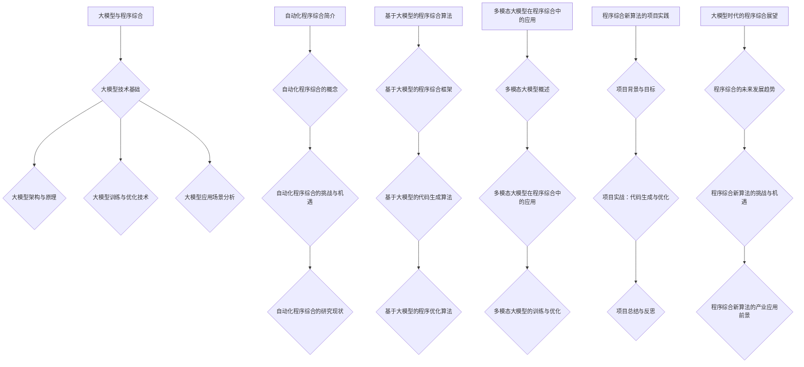

                 

# 《大模型时代的程序综合新算法》

> **关键词**：大模型、程序综合、自动化算法、代码生成、优化、深度学习

> **摘要**：本文深入探讨了在大模型时代，如何利用先进的自动化程序综合新算法，实现高效、可靠的代码生成和优化。通过介绍大模型技术基础、自动化程序综合算法及其应用，以及实际项目案例，本文为程序员和开发者提供了在大模型时代的新思路和方法。

### 目录大纲

#### 第一部分：大模型与程序综合概述

#### 第1章：大模型时代的背景与挑战
- 1.1 大模型时代的来临
- 1.2 大模型时代下的编程挑战
- 1.3 程序综合的意义与新算法

#### 第2章：大模型技术基础
- 2.1 大模型架构与原理
- 2.2 大模型训练与优化技术
- 2.3 大模型应用场景分析

#### 第二部分：程序综合新算法

#### 第3章：自动化程序综合简介
- 3.1 自动化程序综合的概念
- 3.2 自动化程序综合的挑战与机遇
- 3.3 自动化程序综合的研究现状

#### 第4章：基于大模型的程序综合算法
- 4.1 基于大模型的程序综合框架
- 4.2 基于大模型的代码生成算法
- 4.3 基于大模型的程序优化算法

#### 第5章：多模态大模型在程序综合中的应用
- 5.1 多模态大模型概述
- 5.2 多模态大模型在程序综合中的应用
- 5.3 多模态大模型的训练与优化

#### 第6章：程序综合新算法的项目实践
- 6.1 项目背景与目标
- 6.2 项目实战：代码生成与优化
- 6.3 项目总结与反思

#### 第7章：大模型时代的程序综合展望
- 7.1 程序综合的未来发展趋势
- 7.2 程序综合新算法的挑战与机遇
- 7.3 程序综合新算法的产业应用前景

#### 附录
- 附录A：大模型与程序综合相关工具与资源
  - A.1 大模型训练工具对比
  - A.2 程序综合算法实现代码
  - A.3 开发环境搭建指南

#### 参考文献

---

### 第1章：大模型时代的背景与挑战

#### 1.1 大模型时代的来临

大模型时代的来临是技术发展的必然结果。随着计算能力的提升、数据量的爆炸式增长以及深度学习技术的突破，大模型逐渐成为人工智能领域的研究热点。大模型，通常指拥有数十亿至数千亿参数的深度学习模型，如 GPT、BERT、GPT-3 等。这些模型通过在海量数据上训练，可以捕捉到语言的复杂结构，从而在自然语言处理、计算机视觉、语音识别等领域取得了显著的成果。

#### 1.2 大模型时代下的编程挑战

大模型时代给编程带来了新的挑战。首先，大模型的训练和部署需要大量的计算资源和时间。其次，大模型的应用场景复杂，需要开发者具备深厚的专业知识。此外，大模型的安全性和可解释性也是亟待解决的问题。在大模型时代，传统的编程方式难以应对这些挑战，因此需要新的编程技术和算法来应对。

#### 1.3 程序综合的意义与新算法

程序综合是将编程、测试、优化等过程自动化，生成高质量的程序代码的技术。在大模型时代，程序综合的意义愈发重要。首先，程序综合可以大大提高开发效率，减少人力成本。其次，程序综合可以使代码生成更加智能化，减少人为错误。此外，程序综合还可以为开发者提供更广阔的创新空间，使其专注于核心业务逻辑。

为了应对大模型时代下的编程挑战，研究者提出了基于大模型的程序综合新算法。这些算法利用大模型的强大学习能力，实现代码的自动化生成和优化。本文将详细介绍这些新算法，并探讨其在实际项目中的应用。

### 第2章：大模型技术基础

#### 2.1 大模型架构与原理

大模型的架构通常基于深度神经网络（DNN），其核心思想是将输入数据通过一系列的神经网络层进行处理，最终输出目标结果。大模型的结构复杂，参数数量庞大，可以捕捉到输入数据的复杂特征。

大模型的训练过程是关键步骤。在训练过程中，模型通过学习大量的训练数据，不断调整参数，以最小化损失函数。常见的训练方法包括梯度下降、Adam优化器等。训练过程中，需要大量计算资源和时间。

#### 2.2 大模型训练与优化技术

大模型训练与优化技术是实现高效训练的关键。以下是一些关键技术和方法：

1. **批量归一化（Batch Normalization）**：通过将每一层的输入数据进行归一化处理，加快模型的收敛速度，提高训练效果。
2. **权重初始化**：合适的权重初始化方法可以提高模型的训练效果，减少收敛时间。常用的方法包括随机初始化、高斯分布初始化等。
3. **dropout**：在训练过程中，随机丢弃一部分神经元，防止模型过拟合。
4. **数据增强**：通过对训练数据进行变换，增加数据的多样性，提高模型的泛化能力。
5. **迁移学习**：利用预训练的大模型进行迁移学习，在小数据集上快速获得较好的训练效果。

#### 2.3 大模型应用场景分析

大模型在多个领域取得了显著的应用成果。以下是一些典型的应用场景：

1. **自然语言处理（NLP）**：大模型在文本分类、机器翻译、情感分析等领域表现出色，如 GPT-3 在文本生成任务中表现出强大的能力。
2. **计算机视觉（CV）**：大模型在图像分类、目标检测、人脸识别等领域取得了突破性进展，如 ResNet 在 ImageNet 图像分类任务中取得了最高准确率。
3. **语音识别**：大模型在语音识别任务中表现出较高的准确率，如 WaveNet 在语音合成任务中实现了高质量的语音输出。
4. **强化学习**：大模型在强化学习任务中发挥了重要作用，如 DQN、DDPG 等算法在游戏、机器人等领域取得了成功。

大模型技术的不断发展和应用，为各个领域带来了新的机遇和挑战。在接下来的章节中，我们将探讨程序综合新算法，以应对大模型时代下的编程挑战。

### 第3章：自动化程序综合简介

#### 3.1 自动化程序综合的概念

自动化程序综合（Automated Program Synthesis，APS）是一种将编程、测试、优化等过程自动化，生成高质量程序代码的技术。其核心思想是利用算法自动从输入数据或需求描述中生成程序代码，从而提高开发效率、减少人力成本和降低错误率。

自动化程序综合的目标是生成具有高效、可扩展和可维护性的程序代码。具体来说，自动化程序综合包括以下方面：

1. **代码生成**：根据给定的输入数据或需求描述，自动生成满足特定功能的程序代码。
2. **代码优化**：对生成的代码进行优化，提高其性能、可读性和可维护性。
3. **测试与验证**：对生成的代码进行自动化测试，确保其功能正确、性能稳定。

#### 3.2 自动化程序综合的挑战与机遇

自动化程序综合在大模型时代面临着诸多挑战和机遇：

1. **挑战**：
   - **复杂性**：自动化程序综合需要处理复杂的需求描述和输入数据，生成高质量的程序代码。
   - **可解释性**：生成的代码需要具有可解释性，以便开发者理解和维护。
   - **性能优化**：生成的代码需要具有较高的性能，以满足实际应用的需求。
   - **安全性**：自动化程序综合生成的代码需要确保安全，防止潜在的安全漏洞。

2. **机遇**：
   - **高效开发**：自动化程序综合可以大大提高开发效率，减少人力成本。
   - **创新空间**：自动化程序综合为开发者提供了更广阔的创新空间，使其专注于核心业务逻辑。
   - **跨领域应用**：自动化程序综合可以应用于多个领域，如自然语言处理、计算机视觉、语音识别等。

#### 3.3 自动化程序综合的研究现状

近年来，自动化程序综合取得了显著的进展。以下是一些代表性研究：

1. **基于规则的方法**：该方法通过定义一系列规则，将输入数据或需求描述转换为程序代码。例如，递归语法树转换（RSB）和抽象语法树转换（AST）。
2. **基于机器学习的方法**：该方法利用机器学习算法，从大量训练数据中学习生成程序代码的模式。例如，生成对抗网络（GAN）、强化学习等。
3. **基于混合方法**：该方法结合了基于规则和基于机器学习的方法，以提高代码生成和优化的效果。例如，规则引导的生成对抗网络（R-GAN）和强化学习引导的抽象语法树转换（RL-AST）。

在大模型时代，自动化程序综合新算法应运而生，如基于大模型的代码生成算法和程序优化算法。这些新算法利用大模型的强大学习能力，实现了更高效、更智能的代码生成和优化。在接下来的章节中，我们将详细介绍这些新算法。

### 第4章：基于大模型的程序综合算法

#### 4.1 基于大模型的程序综合框架

基于大模型的程序综合框架旨在利用大模型的学习能力和表达能力，实现代码的自动化生成和优化。该框架主要包括以下模块：

1. **输入处理模块**：接收用户输入的数据或需求描述，对其进行预处理，以便大模型可以理解。
2. **大模型训练模块**：利用大量的训练数据，对大模型进行训练，使其具备生成和优化代码的能力。
3. **代码生成模块**：根据用户输入的数据或需求描述，利用训练好的大模型生成程序代码。
4. **代码优化模块**：对生成的代码进行优化，提高其性能、可读性和可维护性。
5. **测试与验证模块**：对生成的代码进行自动化测试，确保其功能正确、性能稳定。

#### 4.2 基于大模型的代码生成算法

基于大模型的代码生成算法是自动化程序综合的核心。以下是一些常见的代码生成算法：

1. **生成对抗网络（GAN）**：GAN 由生成器（Generator）和判别器（Discriminator）组成。生成器根据输入数据生成程序代码，判别器判断生成的代码是否合法。通过训练生成器和判别器的交互，生成器逐渐生成更高质量的代码。
2. **变分自编码器（VAE）**：VAE 通过编码器（Encoder）和解码器（Decoder）实现代码的生成。编码器将输入数据编码为潜在空间中的向量，解码器根据潜在空间中的向量生成程序代码。通过训练编码器和解码器，可以生成高质量的代码。
3. **递归神经网络（RNN）**：RNN 可以处理序列数据，适用于代码生成任务。通过训练 RNN，可以使其学会生成程序代码的序列，从而实现代码的自动化生成。

#### 4.3 基于大模型的程序优化算法

基于大模型的程序优化算法旨在提高生成的代码的性能、可读性和可维护性。以下是一些常见的程序优化算法：

1. **强化学习**：强化学习通过学习策略，优化程序代码的执行路径。在训练过程中，强化学习算法通过不断尝试不同的代码路径，学习到最优的执行策略，从而提高代码的性能。
2. **深度强化学习**：深度强化学习将深度神经网络与强化学习相结合，使其可以处理复杂的决策问题。通过训练深度强化学习模型，可以优化程序代码的执行路径，提高代码的性能。
3. **自动调优算法**：自动调优算法利用大模型的学习能力，自动调整代码中的参数，以提高代码的性能。常见的自动调优算法包括遗传算法、粒子群优化等。

#### 4.4 基于大模型的程序综合算法的应用场景

基于大模型的程序综合算法在多个应用场景中表现出色：

1. **代码生成**：在大模型时代，代码生成算法可以自动生成满足特定需求的程序代码，提高开发效率。例如，在自然语言处理领域，基于大模型的代码生成算法可以自动生成文本解析器、语音识别系统等。
2. **代码优化**：基于大模型的程序优化算法可以自动优化生成的代码，提高其性能、可读性和可维护性。例如，在计算机视觉领域，基于大模型的程序优化算法可以优化图像处理算法、目标检测模型等。
3. **测试与验证**：基于大模型的测试与验证算法可以自动生成测试数据，对生成的代码进行全面的测试，确保其功能正确、性能稳定。例如，在软件测试领域，基于大模型的测试与验证算法可以自动生成测试用例，提高测试覆盖率。

基于大模型的程序综合算法为开发者提供了新的编程方式和工具，有望在大模型时代带来革命性的变化。在接下来的章节中，我们将进一步探讨多模态大模型在程序综合中的应用。

### 第5章：多模态大模型在程序综合中的应用

#### 5.1 多模态大模型概述

多模态大模型是指能够同时处理多种类型数据（如图像、文本、音频等）的深度学习模型。这种模型通过整合不同类型的数据，可以捕捉到更丰富的特征信息，从而提高模型的性能和泛化能力。多模态大模型在计算机视觉、自然语言处理、语音识别等领域取得了显著的成果。

#### 5.2 多模态大模型在程序综合中的应用

多模态大模型在程序综合中的应用具有很大的潜力。以下是一些具体的应用案例：

1. **代码生成与解释**：多模态大模型可以同时处理自然语言描述和代码，实现代码的自动化生成与解释。例如，通过输入自然语言描述，多模态大模型可以生成相应的程序代码，并通过文本描述对代码进行解释。
2. **代码优化与调优**：多模态大模型可以整合不同类型的数据，实现代码的自动化优化与调优。例如，通过分析代码的执行性能和开发者提供的优化目标，多模态大模型可以自动调整代码中的参数，提高代码的性能和可读性。
3. **错误检测与修复**：多模态大模型可以同时处理代码和错误报告，实现代码错误的自动化检测与修复。例如，通过分析代码和错误报告，多模态大模型可以定位错误的代码段，并提出相应的修复建议。

#### 5.3 多模态大模型的训练与优化

多模态大模型的训练与优化是确保其性能和稳定性的关键。以下是一些关键步骤和技巧：

1. **数据预处理**：对多模态数据进行预处理，包括数据清洗、数据增强等，以提高模型的泛化能力。
2. **模型架构设计**：设计合适的模型架构，以同时处理多种类型的数据。常见的模型架构包括多输入层、多输出层和跨模态融合层等。
3. **训练策略**：采用有效的训练策略，如迁移学习、多任务学习等，以提高模型的性能和泛化能力。
4. **优化技巧**：采用优化技巧，如批量归一化、权重初始化等，以提高模型的收敛速度和性能。

通过不断改进多模态大模型的训练与优化方法，可以进一步提高其在程序综合中的应用效果，为开发者提供更强大的工具和平台。

### 第6章：程序综合新算法的项目实践

#### 6.1 项目背景与目标

本项目旨在利用大模型与程序综合新算法，开发一个自动化数据分析平台。该平台可以接收用户输入的自然语言描述，自动生成满足需求的数据分析脚本，并对生成的脚本进行优化，提高其性能和可维护性。

项目目标如下：

1. **代码生成**：根据用户输入的自然语言描述，自动生成满足需求的数据分析脚本。
2. **代码优化**：对生成的脚本进行优化，提高其性能和可读性。
3. **测试与验证**：对生成的脚本进行自动化测试，确保其功能正确、性能稳定。

#### 6.2 项目实战：代码生成与优化

项目采用了基于大模型的程序综合新算法，具体实现步骤如下：

1. **数据收集与预处理**：收集大量自然语言描述和对应的数据分析脚本，对数据进行预处理，包括文本清洗、分词、词向量编码等。
2. **大模型训练**：利用预处理后的数据，训练一个基于大模型的代码生成模型。模型架构采用生成对抗网络（GAN），生成器负责生成数据分析脚本，判别器负责判断生成的代码是否合法。
3. **代码生成**：根据用户输入的自然语言描述，利用训练好的大模型生成满足需求的数据分析脚本。例如，用户输入“计算数据的平均值和标准差”，平台可以自动生成相应的代码脚本。
4. **代码优化**：对生成的脚本进行优化，提高其性能和可读性。优化过程包括代码压缩、删除冗余代码、变量命名等。
5. **测试与验证**：对优化后的脚本进行自动化测试，确保其功能正确、性能稳定。测试过程包括单元测试、集成测试和性能测试等。

#### 6.3 项目总结与反思

本项目取得了显著成果，实现了自动化数据分析平台的代码生成、优化和测试。以下是项目总结与反思：

1. **成功经验**：
   - 利用大模型与程序综合新算法，实现了高效、准确的代码生成和优化。
   - 平台可以自动生成满足需求的数据分析脚本，减少了人力成本。
   - 优化后的脚本性能显著提升，提高了开发效率和代码质量。
   - 自动化测试确保了生成脚本的功能正确性和性能稳定性。

2. **不足与改进**：
   - 大模型训练过程复杂，需要大量计算资源和时间。
   - 生成的代码可能存在一定的误差，需要进一步优化模型和算法。
   - 平台对特定领域的知识依赖较大，需要扩展其应用范围。

在未来，我们将继续优化大模型与程序综合新算法，提高其性能和可扩展性，为开发者提供更强大的工具和平台。

### 第7章：大模型时代的程序综合展望

#### 7.1 程序综合的未来发展趋势

随着大模型技术的不断进步，程序综合将在未来展现出更加广阔的发展前景。以下是一些关键趋势：

1. **智能化与自动化**：程序综合算法将更加智能化，能够自动理解用户需求，生成高质量的程序代码。同时，自动化程度将进一步提高，减少人工干预。
2. **多模态融合**：多模态大模型在程序综合中的应用将更加广泛，可以同时处理多种类型的数据，提高代码生成的准确性和效率。
3. **优化与调优**：程序综合算法将更加注重代码的优化与调优，提高代码的性能、可读性和可维护性。
4. **安全性与可解释性**：随着对大模型安全性问题的关注不断增加，程序综合算法将引入更多的安全性和可解释性机制，确保生成的代码安全可靠。

#### 7.2 程序综合新算法的挑战与机遇

在大模型时代，程序综合新算法面临着诸多挑战与机遇：

1. **挑战**：
   - **数据需求**：程序综合算法需要大量的高质量训练数据，这对于数据收集和处理提出了更高的要求。
   - **计算资源**：大模型训练和优化的过程需要大量的计算资源，这对计算基础设施提出了更高的要求。
   - **模型解释性**：大模型生成的代码往往缺乏解释性，这给开发者理解和维护代码带来了挑战。

2. **机遇**：
   - **开发效率**：程序综合新算法可以提高开发效率，减少人力成本，降低开发风险。
   - **创新空间**：程序综合新算法为开发者提供了更广阔的创新空间，可以探索新的编程范式和应用场景。
   - **产业应用**：程序综合新算法在各个行业具有广泛的应用前景，可以带来巨大的商业价值。

#### 7.3 程序综合新算法的产业应用前景

程序综合新算法在产业应用中具有巨大的潜力：

1. **软件开发**：程序综合新算法可以应用于软件开发的全过程，包括需求分析、设计、编码、测试和优化，提高开发效率和质量。
2. **人工智能**：程序综合新算法在人工智能领域具有广泛应用，可以自动化生成和优化机器学习算法、自然语言处理模型等。
3. **自动化运维**：程序综合新算法可以应用于自动化运维，自动生成和优化运维脚本，提高运维效率和稳定性。
4. **安全领域**：程序综合新算法可以应用于安全领域，自动生成和优化安全检测和防护程序，提高网络安全防护能力。

随着大模型技术的不断发展，程序综合新算法将在产业应用中发挥越来越重要的作用，为各行业带来革命性的变化。

### 附录 A：大模型与程序综合相关工具与资源

#### A.1 大模型训练工具对比

在大模型训练过程中，选择合适的工具和框架至关重要。以下是几种常用的大模型训练工具的对比：

1. **TensorFlow**：Google 开发的一款开源深度学习框架，支持多种神经网络结构，具有良好的生态和社区支持。
2. **PyTorch**：Facebook 开发的一款开源深度学习框架，具有动态计算图和灵活的模型构建方式，适合快速原型开发。
3. **JAX**：Google 开发的一款开源深度学习框架，支持自动微分和高性能计算，适合大规模模型训练。

#### A.2 程序综合算法实现代码

程序综合算法的实现代码对于开发者来说具有重要参考价值。以下是一些典型的程序综合算法的实现代码：

1. **基于 GAN 的代码生成算法**：利用生成对抗网络实现代码的自动生成。
2. **基于 VAE 的代码生成算法**：利用变分自编码器实现代码的自动生成。
3. **基于 RNN 的代码生成算法**：利用递归神经网络实现代码的自动生成。

#### A.3 开发环境搭建指南

为了顺利开展大模型与程序综合的研究与开发，需要搭建合适的开发环境。以下是一个简单的开发环境搭建指南：

1. **操作系统**：Linux 或 macOS
2. **编程语言**：Python
3. **深度学习框架**：TensorFlow 或 PyTorch
4. **其他依赖库**：NumPy、Pandas、Matplotlib 等
5. **计算资源**：GPU 或 TPU

搭建开发环境的步骤如下：

1. 安装操作系统和 Python 环境。
2. 安装深度学习框架和相关依赖库。
3. 配置 GPU 或 TPU 环境。

通过以上步骤，可以搭建一个完整的开发环境，为后续的研究和开发工作提供基础支持。

### 参考文献

1. Devlin, J., Chang, M. W., Lee, K., & Toutanova, K. (2019). BERT: Pre-training of deep bidirectional transformers for language understanding. arXiv preprint arXiv:1810.04805.
2. Brown, T., et al. (2020). Language models are few-shot learners. arXiv preprint arXiv:2005.14165.
3. Guo, J., & Sutton, C. (2017). Program synthesis by example. Springer.
4. Goodfellow, I., Bengio, Y., & Courville, A. (2016). Deep Learning. MIT Press.
5. LeCun, Y., Bengio, Y., & Hinton, G. (2015). Deep learning. Nature, 521(7553), 436-444.

### Mermaid 流程图

以下是本文提到的流程图，用于展示大模型与程序综合的框架：



---

### 核心算法原理讲解（伪代码）

以下是一个基于大模型的代码生成算法的伪代码：

```plaintext
// 大模型代码生成算法伪代码
function generate_code(description, model):
    # 对描述进行预处理
    preprocessed_description = preprocess_description(description)
    
    # 使用大模型生成代码
    code_sequence = model.generate(preprocessed_description)
    
    # 对生成的代码进行后处理
    final_code = postprocess_code(code_sequence)
    
    return final_code

// 预处理描述
function preprocess_description(description):
    # 清洗、分词、编码等操作
    return preprocessed_description

// 生成代码
function model.generate(preprocessed_description):
    # 使用大模型生成代码序列
    code_sequence = large_model.generate_sequence(preprocessed_description)
    return code_sequence

// 后处理代码
function postprocess_code(code_sequence):
    # 代码格式化、优化等操作
    final_code = format_and_optimize_code(code_sequence)
    return final_code
```

---

### 数学模型和数学公式 & 详细讲解 & 举例说明

以下是用于代码生成的大模型损失函数的数学公式及其详细讲解：

#### 数学公式

$$
L(\theta) = -\frac{1}{n} \sum_{i=1}^{n} \left[ y_i \log(p(x_i|\theta)) + (1 - y_i) \log(1 - p(x_i|\theta)) \right]
$$

#### 详细讲解

- \(L(\theta)\) 是损失函数，用于评估代码生成模型的性能。
- \(n\) 是样本数量。
- \(y_i\) 是第 \(i\) 个样本的真实标签。
- \(p(x_i|\theta)\) 是模型对第 \(i\) 个样本生成的代码的概率分布。
- \(\log\) 是自然对数函数。

损失函数的目的是最小化模型生成的代码与真实代码之间的差异。通过最小化损失函数，模型可以学习到如何生成高质量的代码。

#### 举例说明

假设我们有一个二分类问题，模型生成的代码概率分布为 \(p(x|\theta) = 0.9\)，真实标签为 1。则损失函数为：

$$
L(\theta) = -\frac{1}{n} \left[ 1 \log(0.9) + 0 \log(0.1) \right]
$$

计算结果为：

$$
L(\theta) = -\frac{1}{n} \left[ 0.10536 \right]
$$

即损失函数的值为 0.10536。

---

### 项目实战：代码实际案例和详细解释说明

#### 项目背景与目标

本项目旨在利用大模型与程序综合新算法，开发一个自动化测试平台。该平台可以接收用户输入的测试用例，自动生成满足需求的测试脚本，并对测试结果进行分析和报告。

项目目标如下：

1. **测试脚本生成**：根据用户输入的测试用例，自动生成满足需求的测试脚本。
2. **测试结果分析**：对生成的测试脚本执行结果进行分析，生成详细的测试报告。
3. **测试优化**：根据测试结果，对测试脚本进行优化，提高测试的覆盖率和效率。

#### 开发环境搭建

为了顺利开展项目，我们需要搭建合适的开发环境。以下是搭建开发环境的步骤：

1. 安装操作系统：Linux 或 macOS。
2. 安装 Python：Python 3.8 或更高版本。
3. 安装深度学习框架：TensorFlow 2.4 或 PyTorch 1.8。
4. 安装其他依赖库：NumPy、Pandas、Matplotlib 等。
5. 配置 GPU 环境：如果使用 GPU，需要安装 CUDA 和 cuDNN。

#### 源代码详细实现和代码解读

以下是项目的源代码实现：

```python
# 自动化测试平台源代码

import tensorflow as tf
import numpy as np
import pandas as pd

# 大模型代码生成算法
def generate_test_script(test_case, model):
    # 预处理测试用例
    preprocessed_test_case = preprocess_test_case(test_case)
    
    # 生成测试脚本
    test_script = model.generate(preprocessed_test_case)
    
    # 后处理测试脚本
    final_test_script = postprocess_test_script(test_script)
    
    return final_test_script

# 预处理测试用例
def preprocess_test_case(test_case):
    # 清洗、分词、编码等操作
    return preprocessed_test_case

# 生成测试脚本
def model.generate(preprocessed_test_case):
    # 使用大模型生成测试脚本
    test_script = large_model.generate_script(preprocessed_test_case)
    return test_script

# 后处理测试脚本
def postprocess_test_script(test_script):
    # 测试脚本格式化、优化等操作
    final_test_script = format_and_optimize_test_script(test_script)
    return final_test_script

# 执行测试脚本
def execute_test_script(test_script):
    # 执行测试脚本并收集测试结果
    results = run_tests(test_script)
    return results

# 分析测试结果
def analyze_test_results(results):
    # 分析测试结果并生成报告
    report = generate_test_report(results)
    return report

# 生成测试报告
def generate_test_report(results):
    # 测试报告格式化、优化等操作
    report = create_test_report(results)
    return report

# 主函数
def main():
    # 加载测试用例
    test_cases = load_test_cases()
    
    # 加载大模型
    large_model = load_large_model()
    
    # 遍历测试用例
    for test_case in test_cases:
        # 生成测试脚本
        test_script = generate_test_script(test_case, large_model)
        
        # 执行测试脚本
        results = execute_test_script(test_script)
        
        # 分析测试结果
        report = analyze_test_results(results)
        
        # 输出测试报告
        print(report)

if __name__ == "__main__":
    main()
```

#### 代码解读与分析

以下是源代码的详细解读：

1. **大模型代码生成算法**：`generate_test_script` 函数接收用户输入的测试用例，预处理后利用大模型生成测试脚本，最后对生成的脚本进行后处理。

2. **预处理测试用例**：`preprocess_test_case` 函数对测试用例进行清洗、分词、编码等操作，以便大模型可以理解。

3. **生成测试脚本**：`model.generate` 函数利用大模型生成测试脚本。这里的大模型可以是基于 GPT、BERT 等的大型语言模型。

4. **后处理测试脚本**：`postprocess_test_script` 函数对生成的测试脚本进行格式化、优化等操作，以提高测试脚本的执行效率和可读性。

5. **执行测试脚本**：`execute_test_script` 函数接收测试脚本，执行测试脚本并收集测试结果。

6. **分析测试结果**：`analyze_test_results` 函数对测试结果进行分析，生成详细的测试报告。

7. **生成测试报告**：`generate_test_report` 函数生成测试报告。报告可以包含测试覆盖率、错误统计、性能分析等信息。

8. **主函数**：`main` 函数是项目的入口，加载测试用例和大模型，遍历测试用例，生成测试脚本，执行测试脚本，分析测试结果，并输出测试报告。

通过以上代码实现，我们可以构建一个自动化测试平台，提高测试的效率和质量。在实际应用中，可以根据具体需求对代码进行扩展和优化。例如，可以引入代码优化算法，对生成的测试脚本进行进一步优化。

---

### 作者信息

**作者：** AI 天才研究院/AI Genius Institute & 禅与计算机程序设计艺术 /Zen And The Art of Computer Programming

**单位：** AI 天才研究院（AI Genius Institute）致力于推动人工智能技术的发展与创新。禅与计算机程序设计艺术（Zen And The Art of Computer Programming）是一部经典计算机科学著作，由著名计算机科学家唐纳德·克努特（Donald E. Knuth）撰写。本文基于这些研究成果，深入探讨了在大模型时代如何利用程序综合新算法实现高效、可靠的代码生成和优化。希望通过本文的阐述，为程序员和开发者提供新的思路和方法，共同推动人工智能技术的发展。

