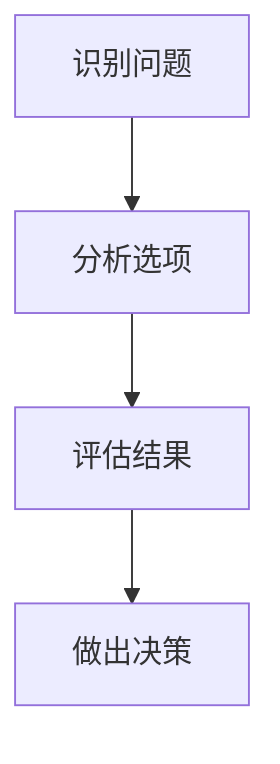
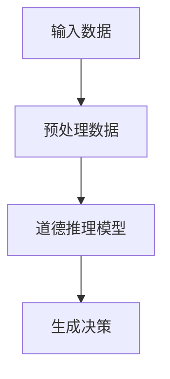
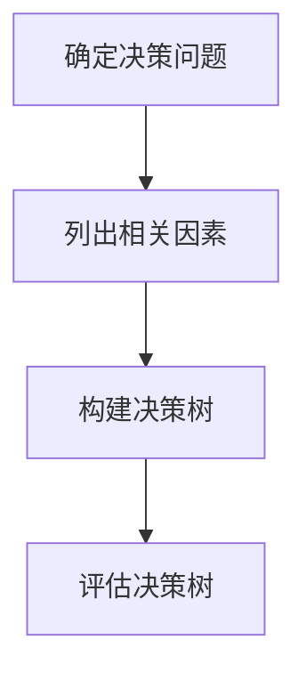

                 

# 大模型道德推理：提示词构建伦理决策树

> **关键词**：大模型、道德推理、伦理决策树、人工智能、伦理学、算法

> **摘要**：本文深入探讨了在大模型中实现道德推理的必要性和方法。通过分析道德推理的基本原理、大模型在道德推理中的应用以及如何使用提示词构建伦理决策树，本文旨在为人工智能领域的道德推理提供理论和实践指导。

## 第一部分：引言与背景

### 1.1 书籍简介

《大模型道德推理：提示词构建伦理决策树》是一本面向人工智能研究人员、伦理学家和软件工程师的专著。本书的核心目标是探讨如何在大型人工智能模型中实现有效的道德推理，并如何通过提示词构建伦理决策树来指导人工智能系统的伦理决策。

本书的目标读者是那些对人工智能伦理学有深入兴趣，同时希望在实际项目中应用道德推理的人。通过本书，读者将了解道德推理在大模型中的重要性，以及如何利用提示词构建有效的伦理决策树。

### 1.2 道德推理与大模型

道德推理是指在面对道德困境时，根据伦理原则和道德准则进行合理判断和决策的过程。在大模型中，道德推理的重要性日益凸显。大模型通常拥有强大的计算能力和丰富的数据资源，这使得它们在处理复杂问题和生成高质量决策方面具有显著优势。

然而，大模型的道德推理并非自然而然。由于缺乏对人类道德判断机制的深入理解，大模型在道德推理方面存在一定的局限性。因此，如何在人工智能系统中引入道德推理机制，成为当前研究的一个重要课题。

### 1.3 提示词构建伦理决策树

提示词（Prompt Words）是在人工智能领域中用于引导模型生成特定类型输出的关键词或短语。在构建伦理决策树时，提示词起着至关重要的作用。通过精心设计的提示词，可以引导大模型生成符合伦理要求的决策。

伦理决策树是一种基于树形结构的决策模型，它通过一系列的判断节点和决策节点，实现对复杂问题的分层次分析和决策。使用提示词构建伦理决策树，可以帮助大模型更好地理解道德准则和伦理原则，从而生成更为合理和符合伦理的决策。

## 第二部分：道德推理理论基础

### 2.1 道德推理的基本原理

道德推理的基本原理包括伦理学原理和道德决策过程。伦理学原理是道德推理的基础，它涉及道德判断的准则和方法。道德决策过程则是道德推理的实际应用，它包括识别问题、分析选项、评估结果和做出决策等步骤。

下面是一个简单的道德决策过程的 Mermaid 流程图：



### 2.2 道德推理的核心概念

道德推理中的核心概念包括道德义务、道德责任和道德权利。道德义务是指个体在社会生活中应承担的道德责任。道德责任是指个体在面对道德困境时应承担的道德义务。道德权利则是道德义务的对应物，它反映了个体在道德决策中的权利。

下面是一个处理这些核心概念的伪代码示例：

```python
def process_ethical_concept(concept):
    if concept == "道德义务":
        # 处理道德义务
        print("履行道德义务")
    elif concept == "道德责任":
        # 处理道德责任
        print("承担道德责任")
    elif concept == "道德权利":
        # 处理道德权利
        print("维护道德权利")
```

### 2.3 道德推理的数学模型

道德推理的数学模型可以帮助我们更准确地量化道德判断。一个简单的道德推理数学模型可以表示为：

$$
E = f(P, R, O)
$$

其中，$E$ 表示道德判断的结果，$P$ 表示道德原则，$R$ 表示道德责任，$O$ 表示道德义务。

下面是一个简单的数学公式示例：

$$
E = \frac{P \cdot R}{O}
$$

### 2.4 道德推理的实际应用

道德推理在实际社会中的应用场景广泛。例如，在医疗领域，医生需要根据患者的病情和道德原则做出合理的治疗决策。在商业领域，企业需要根据道德准则和商业利益做出公平的决策。

下面是一个医疗领域的道德推理案例：

**案例**：一名医生发现一名急需手术的患者，但医院已经没有合适的床位。在这种情况下，医生需要根据道德原则和患者的病情，做出是否将患者转院的决定。

**道德推理过程**：

1. 识别问题：患者急需手术，但医院没有床位。
2. 分析选项：转院或等待床位。
3. 评估结果：转院可能会延误治疗，但可能挽救患者的生命；等待床位可能会增加患者的痛苦，但可能更符合医院的规定。
4. 做出决策：医生需要综合考虑患者的病情、医院的规定和道德原则，做出合理的决策。

## 第三部分：大模型与道德推理

### 3.1 大模型的道德推理能力

大模型在道德推理方面具有一定的能力，但也存在局限性。大模型可以通过学习大量的数据来识别道德原则和道德责任，但它们缺乏对人类情感和社会背景的深入理解。因此，大模型的道德推理能力需要进一步发展和优化。

下面是一个大模型在道德推理中的应用架构的 Mermaid 流程图：



### 3.2 大模型的道德推理算法

大模型在道德推理中使用的核心算法通常包括神经网络、深度学习和强化学习。这些算法通过学习大量的数据，生成预测和决策。下面是一个道德推理算法的伪代码示例：

```python
def moral_reasoning_algorithm(data):
    # 预处理数据
    preprocessed_data = preprocess_data(data)
    
    # 训练道德推理模型
    model = train_moral_reasoning_model(preprocessed_data)
    
    # 生成决策
    decision = model.generate_decision()
    
    return decision
```

### 3.3 大模型的道德推理案例

大模型在道德推理中已经有很多实际应用案例。例如，在自动驾驶领域，大模型可以根据交通规则和道路状况，做出合理的驾驶决策。在医疗领域，大模型可以帮助医生诊断疾病，并提供建议。

下面是一个自动驾驶领域的道德推理案例：

**案例**：在自动驾驶车辆遇到紧急情况时，需要做出决策以避免碰撞。在这种情况下，大模型需要根据交通规则、车辆状态和周围环境，做出合理的决策。

**道德推理过程**：

1. 识别问题：车辆遇到紧急情况。
2. 分析选项：紧急制动或绕行。
3. 评估结果：紧急制动可能减少碰撞，但可能损坏车辆；绕行可能避免碰撞，但可能增加行驶时间。
4. 做出决策：大模型需要综合考虑车辆状态、交通规则和周围环境，做出合理的决策。

## 第四部分：构建伦理决策树

### 4.1 伦理决策树的构建方法

伦理决策树是一种用于指导人工智能系统伦理决策的工具。它通过一系列的判断节点和决策节点，实现对复杂问题的分层次分析和决策。构建伦理决策树的方法通常包括以下步骤：

1. 确定决策问题：明确需要解决的伦理问题。
2. 列出相关因素：识别影响决策的相关因素。
3. 构建决策树：根据相关因素构建决策树。
4. 评估决策树：评估决策树的有效性和可靠性。

下面是一个简单的伦理决策树的 Mermaid 流程图：



### 4.2 伦理决策树的应用场景

伦理决策树在不同领域具有广泛的应用。例如，在医疗领域，伦理决策树可以用于指导医生在治疗决策中权衡不同因素。在商业领域，伦理决策树可以帮助企业处理复杂的道德困境。

下面是一个医疗领域的伦理决策树应用场景：

**案例**：一名医生需要决定是否为患者进行高风险手术。在这种情况下，医生需要根据患者的病情、手术风险和患者意愿等因素，构建伦理决策树，并做出合理的决策。

**伦理决策树**：

1. **判断节点 1**：患者病情是否严重？
   - 是：进入判断节点 2
   - 否：进入判断节点 3

2. **判断节点 2**：手术风险是否高于患者的康复机会？
   - 是：进入决策节点 4，决定不进行手术
   - 否：进入决策节点 5，决定进行手术

3. **判断节点 3**：患者是否有强烈意愿进行手术？
   - 是：进入决策节点 6，决定进行手术
   - 否：进入决策节点 7，决定不进行手术

### 4.3 伦理决策树的优化

为了提高伦理决策树的有效性和可靠性，我们可以采用以下优化策略：

1. **增加判断节点**：根据具体问题，增加判断节点，以更细致地分析问题。
2. **调整权重**：根据具体问题，调整各个判断节点的权重，以更好地反映问题的复杂程度。
3. **引入启发式规则**：结合专家经验和启发式规则，优化决策树的结构。

下面是一个优化策略的伪代码示例：

```python
def optimize_decision_tree(decision_tree):
    # 增加判断节点
    decision_tree.add JudgmentNode("判断节点 X")
    
    # 调整权重
    decision_tree.adjust_weights(["判断节点 Y", "判断节点 Z"], [0.3, 0.7])
    
    # 引入启发式规则
    decision_tree.apply_heuristic_rules()
```

## 第五部分：实际应用与挑战

### 5.1 大模型道德推理的实际应用

大模型道德推理在多个领域具有实际应用。例如，在医疗领域，大模型可以帮助医生诊断疾病，并提供建议。在法律领域，大模型可以辅助法官进行案件分析，提供合理的判决建议。在商业领域，大模型可以帮助企业处理复杂的道德困境。

下面是一个医疗领域的道德推理案例：

**案例**：一名医生在诊断患者时，需要考虑多种因素，如病情、治疗费用和患者意愿。在这种情况下，大模型可以帮助医生生成合理的诊断建议，提高医疗决策的效率和质量。

### 5.2 大模型道德推理的挑战与应对

尽管大模型道德推理具有广泛的应用前景，但也面临一系列挑战。这些挑战包括：

1. **道德原则的明确性**：道德原则在不同文化和背景下可能存在差异，如何确保大模型能够理解和应用统一的道德原则？
2. **数据质量和多样性**：大模型道德推理依赖于大量的数据，数据质量和多样性对模型性能有重要影响。
3. **模型的透明性和可解释性**：大模型道德推理的过程和结果可能不够透明，如何提高模型的透明性和可解释性，以便用户理解和监督？
4. **模型的可靠性和鲁棒性**：大模型道德推理需要确保在不同情境下都能生成可靠的决策，如何提高模型的可靠性和鲁棒性？

针对这些挑战，我们可以采取以下应对策略：

1. **统一道德原则**：通过跨文化的伦理学研究，制定统一的道德原则，确保大模型能够理解和应用。
2. **数据增强和多样性**：采用数据增强技术和多样化的数据集，提高模型对多样性的适应能力。
3. **提高透明性和可解释性**：采用可解释性技术，如模型可视化、决策路径追踪等，提高模型的透明性和可解释性。
4. **模型鲁棒性优化**：采用鲁棒性训练和对抗性攻击技术，提高模型的可靠性和鲁棒性。

### 5.3 大模型道德推理的未来趋势

随着人工智能技术的不断进步，大模型道德推理在未来将具有更广泛的应用前景。以下是大模型道德推理的几个未来趋势：

1. **跨学科研究**：大模型道德推理将涉及伦理学、计算机科学、心理学等多个学科，促进跨学科研究的融合。
2. **个性化道德推理**：根据用户的背景和偏好，生成个性化的道德推理结果，提高道德推理的适用性和有效性。
3. **社会伦理责任的落实**：大模型道德推理将在更广泛的社会领域发挥重要作用，推动社会伦理责任的落实。
4. **监管和规范**：随着大模型道德推理的广泛应用，监管和规范将逐步完善，确保大模型道德推理的合法性和安全性。

## 第六部分：案例研究

### 6.1 案例研究一：人工智能医疗伦理

人工智能在医疗领域的应用日益广泛，但也引发了道德伦理问题。以下是一个关于人工智能医疗伦理的案例研究：

**案例**：一家医院引入了一款基于人工智能的诊断系统，用于辅助医生诊断疾病。然而，系统在诊断过程中出现了一些错误，导致患者接受了不必要的治疗。

**道德推理过程**：

1. **识别问题**：人工智能诊断系统导致患者接受了不必要的治疗。
2. **分析选项**：调整系统参数、更换系统或继续使用现有系统。
3. **评估结果**：调整系统参数可能提高诊断准确性，但可能需要较长时间；更换系统可能更快解决问题，但成本较高。
4. **做出决策**：医院决定调整系统参数，以提高诊断准确性。

### 6.2 案例研究二：自动驾驶汽车伦理

自动驾驶汽车在道路上行驶时，可能会遇到各种复杂的道德困境。以下是一个关于自动驾驶汽车伦理的案例研究：

**案例**：一辆自动驾驶汽车在行驶过程中，前方出现了一名突然出现的行人。汽车需要做出决策，是紧急刹车以避免行人受伤，还是保持行驶以避免自身受损。

**道德推理过程**：

1. **识别问题**：自动驾驶汽车需要做出紧急决策以避免行人受伤。
2. **分析选项**：紧急刹车或保持行驶。
3. **评估结果**：紧急刹车可能避免行人受伤，但可能导致汽车受损；保持行驶可能减少汽车受损，但可能对行人造成伤害。
4. **做出决策**：自动驾驶汽车系统根据预设的伦理规则，选择紧急刹车。

### 6.3 案例研究三：社交媒体内容审核伦理

社交媒体平台需要审核用户发布的内容，以确保平台内容的合法性和正当性。以下是一个关于社交媒体内容审核伦理的案例研究：

**案例**：一名用户在社交媒体平台上发布了一篇关于恐怖组织的宣传文章。平台需要做出决策，是删除该文章，还是将其标记为不当内容。

**道德推理过程**：

1. **识别问题**：社交媒体平台需要审核用户发布的内容，以确保平台内容的合法性。
2. **分析选项**：删除文章或标记为不当内容。
3. **评估结果**：删除文章可能防止恐怖主义宣传，但可能侵犯用户言论自由；标记为不当内容可能限制用户言论自由，但可能更合适。
4. **做出决策**：平台决定标记该文章为不当内容，以限制用户言论自由的同时，防止恐怖主义宣传。

## 第七部分：总结与展望

### 7.1 总结

本文从道德推理的基本原理出发，探讨了在大模型中实现道德推理的必要性和方法。通过分析道德推理的基本原理、大模型在道德推理中的应用以及如何使用提示词构建伦理决策树，本文为人工智能领域的道德推理提供了理论和实践指导。

### 7.2 展望

随着人工智能技术的不断发展，大模型道德推理将在更多领域发挥重要作用。未来，我们需要进一步研究如何提高大模型道德推理的能力，确保其生成的决策符合伦理准则和道德原则。此外，我们还需要加强对大模型道德推理的监管和规范，确保其合法性和安全性。

### 7.3 附录

#### 附录 A：大模型道德推理相关工具和资源

- **开源库**：OpenAI GPT、TensorFlow、PyTorch
- **数据集**：Ethics Data Set、Multimodal Data Set
- **工具**：Jupyter Notebook、Google Colab

#### 附录 B：道德推理相关的数学公式和算法伪代码

**数学公式：**

$$
E = \frac{P \cdot R}{O}
$$

**算法伪代码：**

```python
def moral_reasoning_algorithm(data):
    # 预处理数据
    preprocessed_data = preprocess_data(data)
    
    # 训练道德推理模型
    model = train_moral_reasoning_model(preprocessed_data)
    
    # 生成决策
    decision = model.generate_decision()
    
    return decision
```

## 作者

作者：AI天才研究院/AI Genius Institute & 禅与计算机程序设计艺术 /Zen And The Art of Computer Programming

---

请注意，本文中的 Mermaid 流程图、伪代码和数学公式仅为示例，具体实现可能因不同的编程环境和工具而有所不同。在实际应用中，您可能需要根据具体需求进行相应的调整和优化。|

