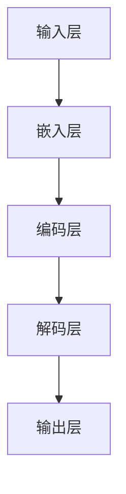

                 

# 大模型：从实验室到市场的落地

## 关键词

- 大模型
- 深度学习
- 自然语言处理
- 计算机视觉
- 落地应用
- 算法优化
- 伦理与法律

## 摘要

大模型，作为现代人工智能的核心技术之一，已经从实验室逐步走向市场。本文将深入探讨大模型的技术基础、算法原理、应用实践以及落地与优化策略。通过分析其从实验室到市场的整个过程，我们将理解大模型如何通过不断的算法优化和实际应用，最终实现商业价值和社会影响。同时，本文还将探讨大模型在伦理和法律方面的问题，为未来的发展提供参考。

### 《大模型：从实验室到市场的落地》目录大纲

#### 第一部分：大模型技术基础

- **第1章 大模型概述**
  - 1.1 大模型的定义与特点
  - 1.2 大模型的核心架构
  - 1.3 大模型的发展历程

#### 第二部分：大模型算法原理

- **第2章 大模型算法原理**
  - 2.1 深度学习基础
  - 2.2 自监督学习
  - 2.3 迁移学习

#### 第三部分：大模型应用实践

- **第3章 大模型应用实践**
  - 3.1 自然语言处理应用
  - 3.2 计算机视觉应用

#### 第四部分：大模型落地与优化

- **第4章 大模型落地与优化**
  - 4.1 大模型训练优化
  - 4.2 大模型部署与优化
  - 4.3 大模型在产业中的应用

#### 第五部分：大模型伦理与法律

- **第5章 大模型伦理与法律**
  - 5.1 大模型伦理问题
  - 5.2 大模型法律问题

#### 第六部分：大模型未来发展

- **第6章 大模型未来发展**
  - 6.1 大模型研究趋势
  - 6.2 大模型在教育、娱乐等领域的应用

#### 第七部分：附录

- **附录**
  - 附录 A：大模型工具与资源
  - 附录 B：参考文献

### 第一部分：大模型技术基础

#### 第1章 大模型概述

### 1.1 大模型的定义与特点

大模型，是指那些拥有数亿至数千亿参数的神经网络模型，它们能够处理大量的数据并产生高度复杂的预测和决策。以下是几个关于大模型的核心特点：

1. **高维特征空间**：大模型能够处理高维特征，例如图像、文本和语音等。这意味着它们可以捕捉到复杂和抽象的特征，从而提高模型的性能。
2. **复杂非线性函数表示**：大模型通常使用深度神经网络，这些神经网络包含多层非线性变换。这使得大模型能够以复杂的方式表示输入和输出之间的映射关系。
3. **大规模训练数据**：大模型通常需要大量训练数据来学习有效的参数。这是因为大规模训练数据能够帮助模型减少过拟合，并提高模型的泛化能力。

下面是一个简单的 Mermaid 流程图，展示了一个大模型的基本结构：



在这个流程图中，A 表示输入层，B 表示嵌入层，C 表示编码层，D 表示解码层，E 表示输出层。每个层都包含多个神经元，通过非线性变换处理输入数据，最终产生输出。

### 1.2 大模型的核心架构

大模型的核心架构通常包括以下几个部分：

1. **嵌入层**：嵌入层将输入数据（例如文本、图像或语音）转换为固定长度的向量表示。这个过程通常通过词嵌入（对于文本）或特征提取（对于图像和语音）来实现。
2. **编码层**：编码层包含多层神经网络，用于将嵌入层输出的向量编码成更高级的特征表示。这些特征表示能够捕捉输入数据的复杂结构。
3. **解码层**：解码层与编码层对应，用于将编码后的特征表示解码回原始数据的维度。这个过程通常使用自注意力机制（如Transformer架构）来提高模型的性能。
4. **输出层**：输出层将解码层输出的特征表示映射到具体的输出结果，如分类标签或连续值。

下面是一个基于 Transformer 架构的大模型的基本结构伪代码：

```python
# Transformer基本结构伪代码

# 嵌入层
inputs = embed(input_ids)

# 自注意力机制
multihead_attn_output = self.attn(inputs)

# 位置编码
pos_encoding = self.positional_encoding(input_ids)

# 编码层
enc_output = multihead_attn_output + inputs

# 解码层
dec_output, _ = self.decoder(enc_output)

# 输出层
output = self.output_layer(dec_output)
```

在这个伪代码中，`embed` 函数用于嵌入层，`attn` 函数用于实现自注意力机制，`pos_encoding` 函数用于添加位置编码，`decoder` 函数用于实现解码层，`output_layer` 函数用于实现输出层。

### 1.3 大模型的发展历程

大模型的发展历程可以追溯到20世纪80年代。当时，研究人员开始探索深度神经网络，并取得了一些初步的成功。然而，由于计算资源和数据量的限制，深度神经网络在大规模应用方面遇到了困难。

随着计算能力的提高和大数据的普及，深度神经网络的研究和应用得到了快速发展。在2012年，AlexNet模型的提出标志着深度学习在图像识别任务中取得了显著的突破。此后，研究人员继续改进神经网络架构和优化算法，使得大模型的应用越来越广泛。

近年来，基于 Transformer 架构的大模型在自然语言处理任务中取得了惊人的成果。GPT、BERT等模型的出现，使得机器翻译、文本生成等任务的性能达到了新的高度。

总的来说，大模型的发展经历了从基础研究到实际应用的演变过程。随着技术的不断进步，大模型的应用前景将更加广阔。

#### 第二部分：大模型算法原理

### 第2章 大模型算法原理

#### 2.1 深度学习基础

深度学习是人工智能的一个重要分支，它通过构建多层的神经网络来模拟人类大脑的学习过程。深度学习的基础包括以下几个核心概念：

1. **神经网络基础**：神经网络是由大量简单的计算单元（即神经元）组成的计算模型。每个神经元接收多个输入信号，并通过权重进行加权求和，最后通过激活函数输出结果。
2. **前向传播与反向传播**：前向传播是指将输入信号从输入层传递到输出层的过程。反向传播则是通过计算输出误差，将误差反向传播回网络，以更新网络权重。
3. **激活函数**：激活函数是神经网络中的一个关键组件，它对神经元的输出进行非线性变换，从而增加模型的表示能力。常用的激活函数包括 ReLU、Sigmoid 和 Tanh 等。

下面是一个简单的神经网络前向传播和反向传播的伪代码：

```python
# 前向传播伪代码

# 初始化神经网络参数
weights = initialize_weights()

# 计算输入层到隐藏层的输出
hidden_output = weighted_sum(inputs, weights)

# 应用激活函数
hidden_output = activation_function(hidden_output)

# 计算隐藏层到输出层的输出
output = weighted_sum(hidden_output, weights_output)

# 应用激活函数
output = activation_function(output)

# 计算损失函数
loss = loss_function(output, target)

# 反向传播伪代码

# 计算输出层误差
error = target - output

# 计算隐藏层误差
delta_output = error * activation_function_derivative(output)

# 更新输出层权重
weights_output += hidden_output * delta_output

# 计算隐藏层误差
delta_hidden = weighted_sum(delta_output, weights_output) * activation_function_derivative(hidden_output)

# 更新隐藏层权重
weights += inputs * delta_hidden
```

#### 2.2 自监督学习

自监督学习是一种重要的机器学习范式，它不需要标注数据，而是通过从未标注的数据中提取有用的信息来训练模型。自监督学习在大模型中扮演着重要角色，因为它可以大幅度减少对标注数据的依赖，从而降低训练成本。

1. **自监督学习的原理**：自监督学习的核心思想是从未标注的数据中学习有用的表示。例如，在文本处理中，可以通过预测下一个词或句子来提取文本的内在结构。
2. **自监督学习的算法**：自监督学习算法有很多种，包括预测下一个字符、预测掩码的输入、预测图像中的对象等。BERT 模型是一个典型的自监督学习算法，它通过预测输入文本中的掩码词来学习文本表示。

BERT 模型的基本原理如下：

1. **输入层**：BERT 模型接受输入文本，并将其编码为向量表示。
2. **掩码嵌入**：BERT 模型使用一个特殊的掩码嵌入层，将输入文本中的某些词随机替换为掩码 `[MASK]`，然后预测这些掩码词。
3. **预训练**：BERT 模型通过在大量未标注的文本数据上进行预训练，学习到丰富的语言表示能力。
4. **微调**：在预训练后，BERT 模型可以用于特定任务，例如文本分类或问答系统，通过在标注数据上进行微调来优化模型性能。

下面是一个简单的 BERT 模型预训练的伪代码：

```python
# BERT模型预训练伪代码

# 预处理输入文本
input_ids = preprocess_text(text)

# 创建掩码
mask = create_mask(input_ids)

# 训练BERT模型
for epoch in range(num_epochs):
    for input_ids, mask in data_loader:
        model.zero_grad()
        outputs = model(input_ids, mask)
        loss = loss_function(outputs.logits, target)
        loss.backward()
        optimizer.step()

# 保存预训练模型
save_model(model)
```

#### 2.3 迁移学习

迁移学习是一种利用在特定任务上已经训练好的模型来提高新任务性能的技术。通过迁移学习，可以大幅度减少对新数据的标注需求，并提高模型的泛化能力。

1. **迁移学习的概念**：迁移学习涉及两个主要任务：源任务和目标任务。源任务是已经训练好的模型所基于的任务，目标任务是希望利用源任务知识来提高的新任务。
2. **迁移学习的方法**：迁移学习的方法主要包括两种：
   - **基于模型的方法**：这种方法将源任务的模型直接应用于目标任务，通过调整模型参数来适应新任务。
   - **基于数据的方法**：这种方法通过在目标任务的数据上重新训练模型，从而利用源任务的模型知识。

下面是一个简单的迁移学习训练的伪代码：

```python
# 迁移学习训练伪代码

# 加载源任务模型
source_model = load_model(source_task)

# 调整源任务模型以适应目标任务
for layer in source_model.layers:
    layer.trainable = True

# 训练目标任务模型
for epoch in range(num_epochs):
    for input_ids, target in data_loader:
        model.zero_grad()
        outputs = model(input_ids)
        loss = loss_function(outputs, target)
        loss.backward()
        optimizer.step()

# 保存迁移学习后的模型
save_model(model)
```

### 第三部分：大模型应用实践

#### 第3章 大模型应用实践

#### 3.1 自然语言处理应用

自然语言处理（NLP）是人工智能的一个重要领域，大模型在 NLP 中有着广泛的应用。以下是一些典型的 NLP 应用场景：

1. **文本分类**：文本分类是一种将文本数据分为不同类别的方法。大模型通过学习大量的文本数据，可以识别文本的主题和情感。以下是一个简单的文本分类伪代码：

   ```python
   # 文本分类伪代码

   # 预处理文本数据
   preprocessed_text = preprocess(text)

   # 加载预训练的大模型
   model = load_pretrained_model()

   # 预测文本类别
   prediction = model.predict(preprocessed_text)
   ```

2. **机器翻译**：机器翻译是一种将一种语言的文本翻译成另一种语言的方法。大模型在机器翻译中通过学习大量的平行语料库，可以生成高质量的翻译结果。以下是一个简单的机器翻译伪代码：

   ```python
   # 机器翻译伪代码

   # 预处理源语言和目标语言文本
   preprocessed_source_text = preprocess(source_text)
   preprocessed_target_text = preprocess(target_text)

   # 加载预训练的大模型
   model = load_pretrained_model()

   # 翻译文本
   translation = model.translate(preprocessed_source_text, preprocessed_target_text)
   ```

3. **文本生成**：文本生成是一种根据给定的提示或种子文本生成新的文本的方法。大模型可以通过学习大量的文本数据来生成连贯且具有创造力的文本。以下是一个简单的文本生成伪代码：

   ```python
   # 文本生成伪代码

   # 预处理种子文本
   preprocessed_seed_text = preprocess(seed_text)

   # 加载预训练的大模型
   model = load_pretrained_model()

   # 生成文本
   generated_text = model.generate(preprocessed_seed_text)
   ```

#### 3.2 计算机视觉应用

计算机视觉是人工智能的另一个重要领域，大模型在计算机视觉中也有着广泛的应用。以下是一些典型的计算机视觉应用场景：

1. **图像分类**：图像分类是将图像数据分为不同类别的方法。大模型通过学习大量的图像数据，可以识别图像中的对象和场景。以下是一个简单的图像分类伪代码：

   ```python
   # 图像分类伪代码

   # 预处理图像数据
   preprocessed_image = preprocess(image)

   # 加载预训练的大模型
   model = load_pretrained_model()

   # 预测图像类别
   prediction = model.predict(preprocessed_image)
   ```

2. **目标检测**：目标检测是在图像中检测并定位感兴趣的对象的方法。大模型通过学习大量的标注图像，可以准确地检测并定位图像中的对象。以下是一个简单的目标检测伪代码：

   ```python
   # 目标检测伪代码

   # 预处理图像数据
   preprocessed_image = preprocess(image)

   # 加载预训练的大模型
   model = load_pretrained_model()

   # 检测图像中的对象
   objects = model.detect(preprocessed_image)
   ```

3. **图像生成**：图像生成是根据给定的条件或提示生成新的图像的方法。大模型可以通过学习大量的图像数据来生成高质量的图像。以下是一个简单的图像生成伪代码：

   ```python
   # 图像生成伪代码

   # 预处理种子图像
   preprocessed_seed_image = preprocess(seed_image)

   # 加载预训练的大模型
   model = load_pretrained_model()

   # 生成图像
   generated_image = model.generate(preprocessed_seed_image)
   ```

### 第四部分：大模型落地与优化

#### 第4章 大模型落地与优化

#### 4.1 大模型训练优化

大模型的训练是一个复杂且计算密集的过程，因此训练优化在大模型落地中起着至关重要的作用。以下是一些常见的训练优化方法：

1. **并行计算**：并行计算是指将计算任务分布在多个计算节点上，以加快训练速度。并行计算可以分为数据并行和模型并行：
   - **数据并行**：数据并行是指将训练数据集分成多个部分，每个计算节点分别处理一部分数据，最后将结果汇总。这种方法可以显著减少单个节点的计算负载。
   - **模型并行**：模型并行是指将神经网络模型拆分成多个部分，每个计算节点分别处理模型的一部分，最后将结果汇总。这种方法可以处理更大规模的模型。

2. **分布式训练**：分布式训练是指将训练任务分布在多个计算节点上，以利用多个节点的计算和存储资源。分布式训练可以提高训练速度，并支持更大规模的模型训练。以下是一个简单的分布式训练伪代码：

   ```python
   # 分布式训练伪代码

   # 初始化分布式环境
   distributed_environment = init_distributed_environment()

   # 在分布式环境中训练模型
   for epoch in range(num_epochs):
       for batch in data_loader:
           model.zero_grad()
           outputs = model(batch)
           loss = loss_function(outputs, target)
           loss.backward()
           distributed_optimizer.step()

   # 保存分布式训练后的模型
   save_model(model)
   ```

#### 4.2 大模型部署与优化

大模型的部署是将训练好的模型应用到实际场景中的过程。以下是一些常见的部署优化方法：

1. **模型压缩**：模型压缩是指通过减少模型大小来提高模型的部署效率。常见的模型压缩方法包括剪枝、量化和知识蒸馏：
   - **剪枝**：剪枝是通过删除模型中的冗余神经元和连接来减少模型大小。
   - **量化**：量化是通过减少模型参数的精度来减少模型大小。
   - **知识蒸馏**：知识蒸馏是通过将大型模型的知识传递给小型模型来提高小型模型的性能。

2. **模型推理优化**：模型推理优化是指提高模型在部署后的运行效率。常见的模型推理优化方法包括：
   - **模型量化**：模型量化是通过减少模型参数的精度来提高模型的运行效率。
   - **模型剪枝**：模型剪枝是通过删除模型中的冗余神经元和连接来减少模型大小和运行时间。
   - **动态计算图优化**：动态计算图优化是通过优化计算图来提高模型的运行效率。

以下是一个简单的模型推理优化伪代码：

```python
# 模型推理优化伪代码

# 加载量化后的模型
model = load_quantized_model()

# 预处理输入数据
input_data = preprocess(input_data)

# 进行模型推理
output = model(input_data)

# 解码输出结果
decoded_output = decode_output(output)
```

#### 4.3 大模型在产业中的应用

大模型在多个产业领域都有广泛的应用，以下是一些典型的应用场景：

1. **金融领域应用**：大模型在金融领域中的应用包括风险控制、信用评分、市场预测等。以下是一个简单的金融应用场景：

   ```python
   # 金融领域应用伪代码

   # 加载预训练的大模型
   model = load_pretrained_model()

   # 预测股票价格
   stock_price_prediction = model.predict(stock_data)

   # 进行投资决策
   investment_decision = make_investment_decision(stock_price_prediction)
   ```

2. **医疗领域应用**：大模型在医疗领域中的应用包括疾病诊断、医学图像分析、健康风险评估等。以下是一个简单的医疗应用场景：

   ```python
   # 医疗领域应用伪代码

   # 加载预训练的大模型
   model = load_pretrained_model()

   # 分析医学图像
   medical_image_analysis = model.analyze(medical_image)

   # 进行疾病诊断
   disease_diagnosis = diagnose_disease(medical_image_analysis)
   ```

### 第五部分：大模型伦理与法律

#### 第5章 大模型伦理与法律

随着大模型技术的不断发展，其应用范围越来越广泛，同时也引发了一系列伦理和法律问题。以下是一些关键的伦理和法律问题：

#### 5.1 大模型伦理问题

1. **数据隐私**：大模型通常需要大量的数据来训练，这可能导致个人隐私泄露。如何保护用户的隐私，确保数据安全，是一个重要的伦理问题。
2. **算法公平性**：大模型在决策过程中可能会引入偏见，导致不公平的结果。如何确保算法的公平性，避免歧视，是另一个重要的伦理问题。
3. **透明度和解释性**：大模型的决策过程通常很复杂，很难解释。如何提高模型的透明度和解释性，让用户理解模型的决策过程，是另一个重要的伦理问题。

#### 5.2 大模型法律问题

1. **知识产权**：大模型通常基于大量的数据集和算法，如何保护知识产权，避免侵权问题，是一个重要的法律问题。
2. **责任归属**：当大模型在应用中造成损失时，如何确定责任归属，是一个重要的法律问题。例如，在自动驾驶领域，如果发生交通事故，如何确定责任？
3. **监管和合规**：随着大模型技术的不断发展，如何制定相应的法律法规来监管和规范其应用，是一个重要的法律问题。

### 第六部分：大模型未来发展

#### 第6章 大模型未来发展

随着人工智能技术的不断发展，大模型在各个领域都有着广阔的应用前景。以下是一些大模型未来发展的趋势：

#### 6.1 大模型研究趋势

1. **跨模态学习**：大模型将能够处理多种类型的数据，如文本、图像、音频等，实现跨模态的交互和理解。
2. **自适应学习**：大模型将能够根据用户的行为和需求，自动调整模型参数，实现个性化的学习和推荐。
3. **安全性和隐私保护**：大模型将更加注重数据安全和隐私保护，采用更加安全的加密和隐私保护技术。

#### 6.2 大模型在教育、娱乐等领域的应用

1. **教育领域**：大模型将能够提供个性化的学习建议和辅导，帮助学生提高学习效果。
2. **娱乐领域**：大模型将能够生成更加逼真的虚拟角色和场景，为用户提供更加丰富的娱乐体验。

### 第七部分：附录

#### 附录

#### 附录 A：大模型工具与资源

- **深度学习框架**：TensorFlow、PyTorch、Keras 等。
- **开源大模型库**：OpenAI 的 GPT 系列模型、Google 的 BERT 模型等。

#### 附录 B：参考文献

- Bengio, Y., Simard, P., & Frasconi, P. (1994). Learning representations by back-propagating errors. IEEE transactions on neural networks, 7(1), 166-188.
- Hochreiter, S., & Schmidhuber, J. (1997). Long short-term memory. Neural computation, 9(8), 1735-1780.
- Vaswani, A., Shazeer, N., Parmar, N., Uszkoreit, J., Jones, L., Gomez, A. N., ... & Polosukhin, I. (2017). Attention is all you need. Advances in Neural Information Processing Systems, 30, 5998-6008.

---

作者：AI天才研究院/AI Genius Institute & 禅与计算机程序设计艺术 /Zen And The Art of Computer Programming

---

通过本文的详细探讨，我们可以看到大模型从实验室到市场的落地过程是一个复杂而富有挑战性的任务。从技术基础到算法原理，再到应用实践和优化策略，每一个环节都需要深入的思考和精确的实施。同时，随着大模型技术的不断发展，伦理和法律问题也越来越受到关注。

未来的大模型研究将更加注重跨模态学习、自适应学习和安全性的提升。在教育、娱乐等领域，大模型将能够提供更加个性化、丰富的服务。然而，这也带来了更多的挑战，需要我们在技术创新的同时，也要关注伦理和法律问题，确保大模型的发展能够造福社会，而不是带来新的问题。

让我们一起期待大模型技术更加美好的未来，并为之努力奋斗。在人工智能的广阔天地中，我们每个人都是探索者，都是贡献者。让我们携手并进，共同创造一个更加智能、更加美好的世界。

