                 

# 《大规模语言模型从理论到实践 DeepSpeed实践》

## 关键词
大规模语言模型，深度学习，自然语言处理，预训练模型，DeepSpeed，训练策略，优化技巧，项目实战。

## 摘要
本文将深入探讨大规模语言模型的理论和实践，重点介绍DeepSpeed在训练大规模语言模型中的应用。通过详细讲解大规模语言模型的基础知识、深度学习与自然语言处理原理、预训练模型及训练策略，结合具体项目实战案例，全面展示大规模语言模型的开发过程与优化技巧。文章旨在为读者提供一份系统、实用的指导，助力理解大规模语言模型的本质与应用。

## 目录大纲

### 第一部分：大规模语言模型基础知识

### 第二部分：项目实战

### 附录

---

### 第一部分：大规模语言模型基础知识

#### 第1章：大规模语言模型概述

**1.1 大规模语言模型的概念**

大规模语言模型是一种基于深度学习的自然语言处理技术，通过对海量文本数据的学习，模型能够捕捉到语言的结构、语义和上下文关系，从而实现自动生成、理解和处理文本。

**1.2 大规模语言模型的发展历史**

自2003年神经网络语言模型首次提出以来，大规模语言模型经历了从基于规则的方法到统计模型，再到深度学习的演进。近年来，随着计算能力和数据量的提升，大规模语言模型取得了显著的突破。

**1.3 大规模语言模型的应用领域**

大规模语言模型在文本分类、机器翻译、生成式对话、文本摘要等领域有着广泛的应用，大大提升了自然语言处理的性能和效果。

#### 第2章：深度学习基础

**2.1 深度学习原理**

深度学习是一种基于多层神经网络的学习方法，通过逐层提取特征，实现对复杂数据的建模和预测。

**2.2 神经网络架构**

神经网络包括输入层、隐藏层和输出层，通过激活函数、权重和偏置等参数实现数据传递和变换。

**2.3 深度学习优化算法**

深度学习优化算法包括梯度下降、随机梯度下降、Adam等，用于调整网络参数，优化模型性能。

#### 第3章：自然语言处理基础

**3.1 词嵌入技术**

词嵌入是将词汇映射到高维向量空间，通过计算向量间的距离和角度，实现语义相似性的度量。

**3.2 序列模型与注意力机制**

序列模型用于处理时间序列数据，注意力机制通过动态关注关键信息，提高模型对长文本的处理能力。

**3.3 转换器架构详解**

转换器（Transformer）是一种基于注意力机制的深度学习模型，广泛应用于自然语言处理任务。

#### 第4章：大规模预训练模型原理

**4.1 预训练的概念与意义**

预训练是一种先在大量未标注数据上训练模型，再在特定任务上进行微调的方法，有助于提高模型泛化能力和效果。

**4.2 自监督学习方法**

自监督学习通过利用未标注数据中的信息，实现模型的无监督训练。

**4.3 迁移学习与微调技术**

迁移学习利用预训练模型在目标任务上的性能，通过微调实现快速模型优化。

#### 第5章：大规模语言模型训练

**5.1 训练数据预处理**

训练数据预处理包括数据清洗、分词、词嵌入等步骤，为模型训练提供高质量的数据。

**5.2 训练策略与技巧**

训练策略包括数据增强、学习率调整、批次归一化等，有助于提升模型训练效果。

**5.3 模型评估与优化**

模型评估通过指标如准确率、召回率等衡量模型性能，优化策略包括参数调整、模型压缩等。

#### 第6章：大规模语言模型应用

**6.1 文本分类应用**

文本分类是将文本数据划分为预定义的类别，大规模语言模型在文本分类任务中取得了显著效果。

**6.2 机器翻译应用**

机器翻译是将一种语言的文本翻译成另一种语言，大规模语言模型在机器翻译领域具有广泛的应用。

**6.3 生成式对话应用**

生成式对话系统能够自动生成自然、流畅的对话，大规模语言模型在生成式对话中发挥着关键作用。

#### 第7章：DeepSpeed实践

**7.1 DeepSpeed原理与架构**

DeepSpeed是一种分布式训练框架，通过多GPU和数据并行技术，实现大规模语言模型的快速训练。

**7.2 DeepSpeed在训练大规模语言模型中的应用**

DeepSpeed在训练大规模语言模型中的应用，包括数据并行、模型并行和流水线并行等策略。

**7.3 DeepSpeed优化策略与技巧**

DeepSpeed优化策略包括梯度裁剪、混合精度训练等，有助于提升训练效率和模型性能。

### 第二部分：项目实战

#### 第8章：大规模语言模型项目实战

**8.1 项目背景与目标**

介绍项目背景、目标和所涉及的技术。

**8.2 开发环境搭建**

搭建项目所需的开发环境，包括硬件配置、软件安装和配置等。

**8.3 源代码详细实现**

详细讲解项目源代码的实现，包括模型设计、数据预处理、训练过程等。

**8.4 代码解读与分析**

对源代码进行解读和分析，阐述关键算法和实现细节。

#### 第9章：案例分析

**9.1 案例一：文本分类项目**

分析一个文本分类项目的实施过程、效果和优化策略。

**9.2 案例二：机器翻译项目**

分析一个机器翻译项目的实施过程、效果和优化策略。

**9.3 案例三：生成式对话项目**

分析一个生成式对话项目的实施过程、效果和优化策略。

#### 第10章：实战经验总结

**10.1 项目开发经验**

总结项目开发过程中的经验，包括技术选型、问题解决等。

**10.2 遇到的问题与解决方法**

列举项目开发过程中遇到的问题，介绍解决方法和效果。

**10.3 未来发展趋势与展望**

展望大规模语言模型在未来的发展趋势和应用前景。

### 附录

#### 附录A：DeepSpeed工具与资源

**A.1 DeepSpeed安装与配置**

介绍DeepSpeed的安装和配置方法，包括环境搭建、依赖安装等。

**A.2 DeepSpeed常见问题解答**

解答DeepSpeed使用过程中常见的问题，提供解决方案。

**A.3 相关参考文献与资料**

提供与大规模语言模型和DeepSpeed相关的参考文献和资料。

#### 附录B：Mermaid流程图示例

**B.1 大规模语言模型训练流程**

展示大规模语言模型训练过程的Mermaid流程图。

**B.2 DeepSpeed架构与原理**

展示DeepSpeed架构与原理的Mermaid流程图。

---

本文将从理论到实践，全面探讨大规模语言模型及其应用，并深入分析DeepSpeed在训练大规模语言模型中的应用。通过项目实战和案例分析，读者将能够掌握大规模语言模型的开发方法和优化技巧，为实际项目提供有力支持。同时，本文还提供了详细的附录，方便读者进一步学习和探索。

## 第一部分：大规模语言模型基础知识

### 第1章：大规模语言模型概述

#### 1.1 大规模语言模型的概念

大规模语言模型（Large-scale Language Model）是一种基于深度学习的自然语言处理技术，它通过学习海量文本数据，捕捉语言的内在结构和语义信息，从而实现对文本的生成、理解和处理。与传统的基于规则或统计方法的自然语言处理技术相比，大规模语言模型具有更高的灵活性和更强的表达力。

**核心概念与联系**

- **自然语言处理（NLP）：** 自然语言处理是计算机科学和人工智能领域的一个分支，旨在使计算机能够理解和处理人类自然语言。大规模语言模型是自然语言处理技术中的一种。
- **深度学习（Deep Learning）：** 深度学习是机器学习的一个子领域，通过多层神经网络来学习复杂数据的特征和模式。大规模语言模型是深度学习技术在自然语言处理中的应用。


**Mermaid 流程图**

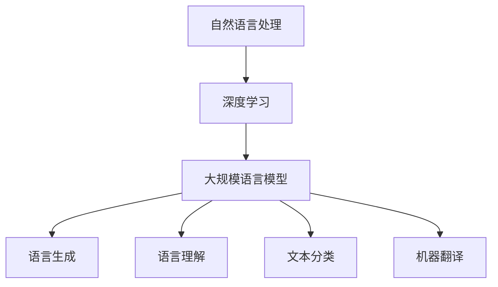

#### 1.2 大规模语言模型的发展历史

大规模语言模型的发展历程可以追溯到2003年，当时Bengio等人提出了基于神经网络的统计语言模型（NNLM），这是最早的神经网络语言模型。此后，随着计算能力和数据量的提升，神经网络语言模型逐渐发展壮大。

2013年，Hinton等人提出了深度神经网络（DNN）在图像识别领域的成功，这激发了研究人员将深度学习方法应用于自然语言处理的兴趣。2018年，Google发布了BERT模型，标志着大规模语言模型进入了一个新的阶段。

近年来，随着Transformer架构的提出，大规模语言模型取得了更大的突破。Transformer模型通过注意力机制，在长文本处理、机器翻译等方面表现出色，进一步推动了自然语言处理领域的发展。

**核心概念与联系**

- **统计语言模型：** 基于统计方法的早期语言模型，如N-gram模型。
- **神经网络语言模型：** 基于深度学习的现代语言模型，如BERT、GPT。
- **Transformer模型：** 一种基于注意力机制的深度学习模型，广泛应用于自然语言处理。


**Mermaid 流程图**

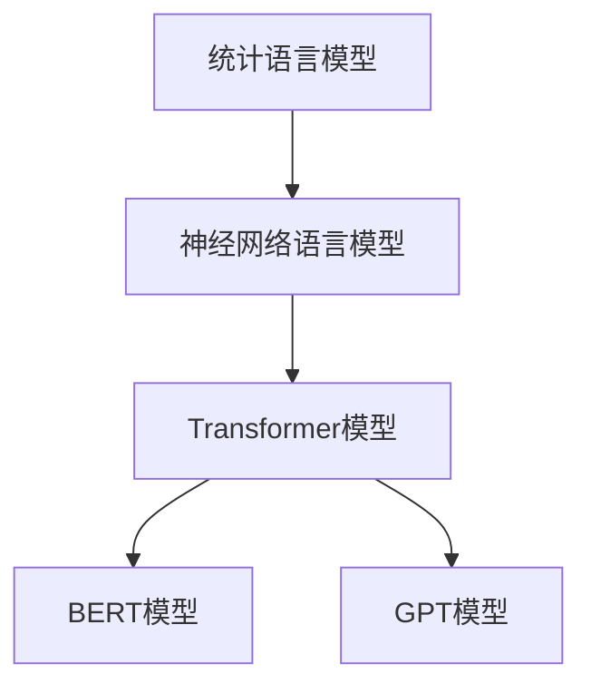

#### 1.3 大规模语言模型的应用领域

大规模语言模型在多个自然语言处理任务中表现出色，具有广泛的应用领域：

- **文本分类：** 将文本数据划分为预定义的类别，如情感分析、新闻分类等。
- **机器翻译：** 将一种语言的文本翻译成另一种语言，如英语到法语、中文到英语等。
- **生成式对话：** 自动生成自然、流畅的对话，如智能客服、聊天机器人等。
- **文本摘要：** 从长文本中提取关键信息，生成简短的摘要。
- **问答系统：** 自动回答用户提出的问题，如搜索引擎、智能问答系统等。


**核心概念与联系**

- **文本分类：** 需要模型对文本进行分类，如判断文本是积极还是消极。
- **机器翻译：** 需要模型将一种语言的文本翻译成另一种语言，如英语翻译成法语。
- **生成式对话：** 需要模型生成自然、流畅的对话，如聊天机器人。
- **文本摘要：** 需要模型从长文本中提取关键信息，生成摘要。
- **问答系统：** 需要模型自动回答用户提出的问题，如搜索引擎。


**Mermaid 流程图**

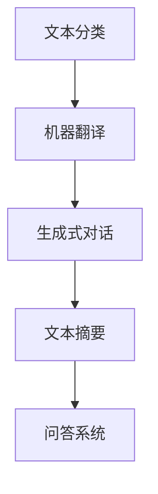

### 第2章：深度学习基础

#### 2.1 深度学习原理

深度学习（Deep Learning）是机器学习（Machine Learning）的一个子领域，它通过多层神经网络（Neural Networks）学习复杂数据的特征和模式。深度学习的核心思想是模拟人脑神经元之间的连接和交互，从而实现自动特征提取和模式识别。

**核心概念与联系**

- **机器学习（Machine Learning）：** 机器学习是一种使计算机能够从数据中学习并做出决策的技术，深度学习是机器学习的一种方法。
- **神经网络（Neural Networks）：** 神经网络是由大量简单神经元组成的网络，通过学习数据中的特征和模式，实现自动特征提取和分类。


**Mermaid 流程图**

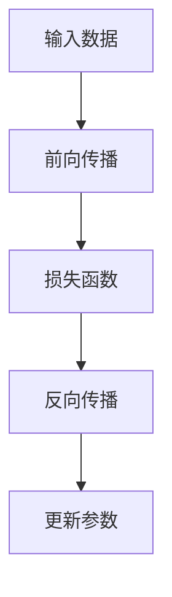

#### 2.2 神经网络架构

神经网络包括输入层、隐藏层和输出层，通过激活函数（Activation Function）、权重（Weights）和偏置（Bias）等参数实现数据的输入、处理和输出。

**核心概念与联系**

- **输入层（Input Layer）：** 接收外部输入数据。
- **隐藏层（Hidden Layer）：** 实现数据的特征提取和变换。
- **输出层（Output Layer）：** 输出模型的预测结果。
- **激活函数（Activation Function）：** 用于引入非线性特性，提高模型的分类能力。


**Mermaid 流�程图**

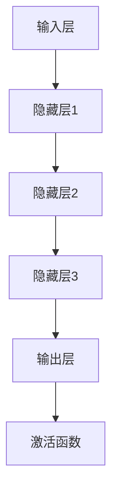

#### 2.3 深度学习优化算法

深度学习优化算法包括梯度下降（Gradient Descent）、随机梯度下降（Stochastic Gradient Descent, SGD）和Adam等，用于调整网络参数，优化模型性能。

**核心概念与联系**

- **梯度下降（Gradient Descent）：** 一种基于梯度信息的优化算法，通过迭代更新模型参数，使得损失函数值最小。
- **随机梯度下降（SGD）：** 在梯度下降的基础上，每次迭代使用随机子样数据进行梯度计算，加快模型收敛。
- **Adam：** 一种结合SGD和动量法的优化算法，通过自适应调整学习率，提高模型收敛速度。


**Mermaid 流程图**

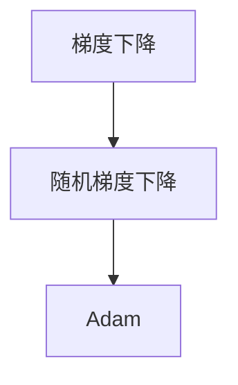

### 第3章：自然语言处理基础

#### 3.1 词嵌入技术

词嵌入（Word Embedding）是将词汇映射到高维向量空间，通过计算向量间的距离和角度，实现语义相似性的度量。词嵌入技术是自然语言处理的基础，有助于提高模型的语义理解和处理能力。

**核心概念与联系**

- **词向量（Word Vector）：** 将词汇映射到高维向量空间，表示词汇的语义信息。
- **语义相似性（Semantic Similarity）：** 通过计算词向量间的距离或角度，衡量词汇之间的语义相似性。


**Mermaid 流程图**

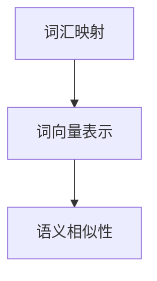

#### 3.2 序列模型与注意力机制

序列模型（Sequence Model）用于处理时间序列数据，通过捕捉时间步之间的依赖关系，实现数据的建模和预测。注意力机制（Attention Mechanism）是一种用于提高模型对长文本处理能力的机制，通过动态关注关键信息，提高模型的分类和预测性能。

**核心概念与联系**

- **序列模型（Sequence Model）：** 用于处理时间序列数据的模型，如RNN、LSTM。
- **注意力机制（Attention Mechanism）：** 通过动态关注关键信息，提高模型对长文本的处理能力。


**Mermaid 流程图**

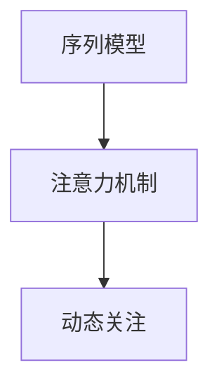

#### 3.3 转换器架构详解

转换器（Transformer）是一种基于注意力机制的深度学习模型，广泛应用于自然语言处理任务。转换器通过多头注意力机制和前馈网络，实现数据的编码和解码，具有高效的处理能力和强的表达能力。

**核心概念与联系**

- **转换器（Transformer）：** 一种基于注意力机制的深度学习模型，用于自然语言处理任务。
- **多头注意力机制（Multi-head Attention）：** 通过多个注意力机制并行处理数据，提高模型的分类和预测性能。
- **前馈网络（Feedforward Network）：** 用于对数据进行进一步处理和变换。


**Mermaid 流程图**

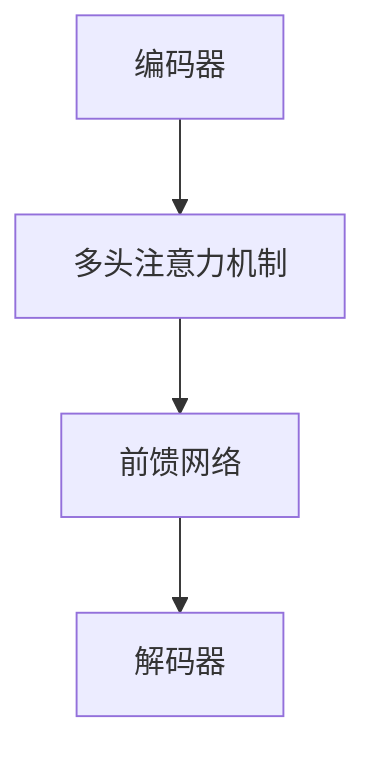

### 第4章：大规模预训练模型原理

#### 4.1 预训练的概念与意义

预训练（Pre-training）是一种先在大量未标注数据上训练模型，再在特定任务上进行微调的方法。预训练有助于提高模型的泛化能力和效果，通过在大规模数据上学习，模型能够捕捉到更多通用特征和知识。

**核心概念与联系**

- **预训练（Pre-training）：** 在大规模未标注数据上训练模型，学习通用特征和知识。
- **微调（Fine-tuning）：** 在特定任务上对预训练模型进行微调，使其适用于特定任务。


**Mermaid 流程图**

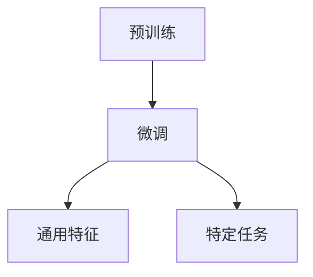

#### 4.2 自监督学习方法

自监督学习（Self-supervised Learning）是一种利用未标注数据中的信息，实现模型的无监督训练方法。自监督学习通过设计自我监督任务，如遮蔽语言模型（Masked Language Model, MLM），使模型在未标注数据上自动学习。

**核心概念与联系**

- **自监督学习（Self-supervised Learning）：** 利用未标注数据中的信息，实现模型的无监督训练。
- **遮蔽语言模型（Masked Language Model, MLM）：** 一种常见的自监督学习方法，通过随机遮蔽输入文本的一部分，使模型学习预测遮蔽部分。


**Mermaid 流程图**

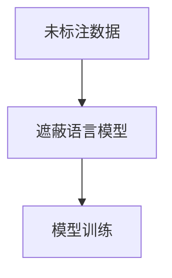

#### 4.3 迁移学习与微调技术

迁移学习（Transfer Learning）是一种利用预训练模型在目标任务上的性能，通过微调实现快速模型优化方法。迁移学习通过在特定任务上进行微调，使预训练模型适应新的任务，提高模型在目标任务上的性能。

**核心概念与联系**

- **迁移学习（Transfer Learning）：** 利用预训练模型在目标任务上的性能，通过微调实现快速模型优化。
- **微调（Fine-tuning）：** 在特定任务上对预训练模型进行微调，使其适用于特定任务。


**Mermaid 流程图**

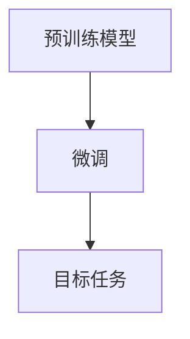

### 第5章：大规模语言模型训练

#### 5.1 训练数据预处理

训练数据预处理是大规模语言模型训练的重要步骤，包括数据清洗、分词、词嵌入等操作，旨在为模型训练提供高质量的数据。

**核心概念与联系**

- **数据清洗（Data Cleaning）：** 去除数据中的噪声和错误。
- **分词（Tokenization）：** 将文本划分为单词或子词。
- **词嵌入（Word Embedding）：** 将词汇映射到高维向量空间。


**Mermaid 流程图**

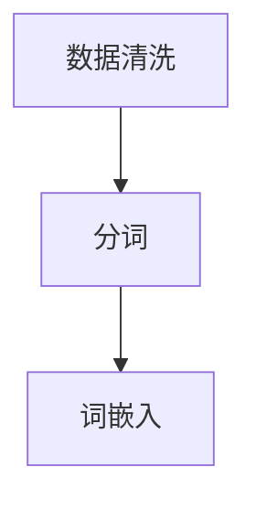

#### 5.2 训练策略与技巧

训练策略与技巧是提高大规模语言模型训练效果的关键，包括数据增强、学习率调整、批次归一化等。

**核心概念与联系**

- **数据增强（Data Augmentation）：** 通过添加噪声、旋转、缩放等操作，增加数据的多样性。
- **学习率调整（Learning Rate Adjustment）：** 根据训练过程动态调整学习率，提高模型收敛速度。
- **批次归一化（Batch Normalization）：** 对每个批次的数据进行归一化处理，提高模型稳定性。


**Mermaid 流程图**

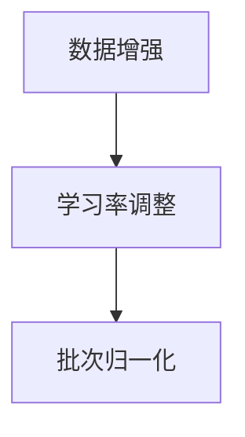

#### 5.3 模型评估与优化

模型评估与优化是确保大规模语言模型性能的重要环节，通过评估指标如准确率、召回率等，对模型进行优化。

**核心概念与联系**

- **模型评估（Model Evaluation）：** 通过评估指标衡量模型性能。
- **优化（Optimization）：** 通过调整模型参数和结构，提高模型性能。


**Mermaid 流程图**

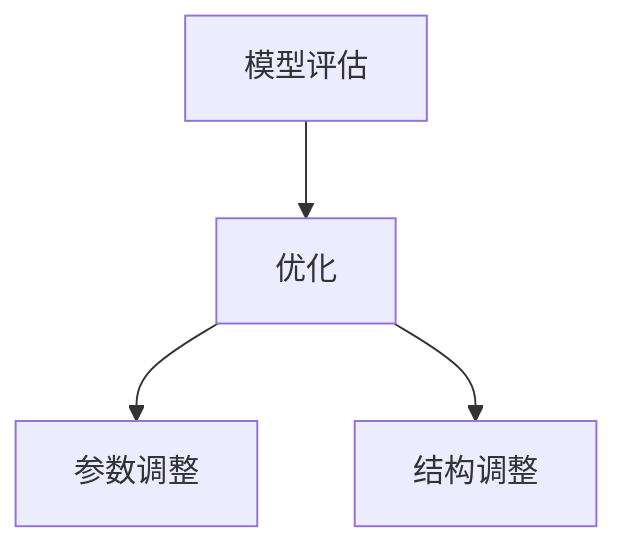

### 第6章：大规模语言模型应用

#### 6.1 文本分类应用

文本分类（Text Classification）是将文本数据划分为预定义的类别，广泛应用于情感分析、新闻分类等领域。

**核心概念与联系**

- **文本分类（Text Classification）：** 将文本数据划分为预定义的类别。
- **情感分析（Sentiment Analysis）：** 判断文本的情感倾向，如正面、负面。
- **新闻分类（News Classification）：** 将新闻文本划分为不同的类别，如体育、娱乐、科技等。


**Mermaid 流程图**

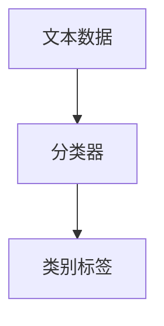

#### 6.2 机器翻译应用

机器翻译（Machine Translation）是将一种语言的文本翻译成另一种语言，广泛应用于跨语言沟通、多语言内容创作等领域。

**核心概念与联系**

- **机器翻译（Machine Translation）：** 将一种语言的文本翻译成另一种语言。
- **跨语言沟通（Cross-language Communication）：** 通过机器翻译实现不同语言之间的沟通。
- **多语言内容创作（Multilingual Content Creation）：** 利用机器翻译创作多语言内容。


**Mermaid 流程图**

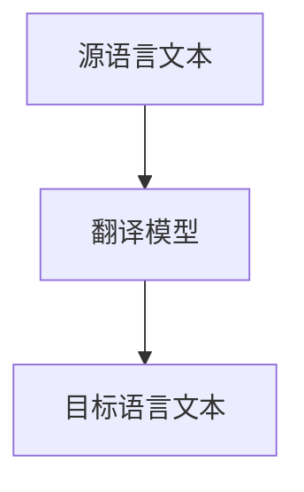

#### 6.3 生成式对话应用

生成式对话（Generative Dialogue）系统能够自动生成自然、流畅的对话，广泛应用于智能客服、聊天机器人等领域。

**核心概念与联系**

- **生成式对话（Generative Dialogue）：** 自动生成自然、流畅的对话。
- **智能客服（Intelligent Customer Service）：** 利用生成式对话实现智能客服。
- **聊天机器人（Chatbot）：** 利用生成式对话实现与用户的交互。


**Mermaid 流程图**

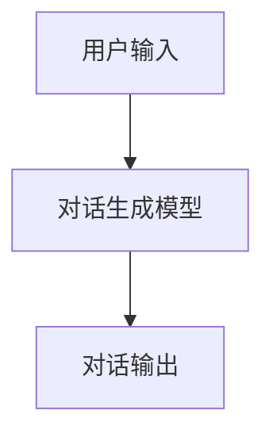

### 第7章：DeepSpeed实践

#### 7.1 DeepSpeed原理与架构

DeepSpeed是一种分布式训练框架，通过多GPU和数据并行技术，实现大规模语言模型的快速训练。DeepSpeed的架构包括参数服务器、多GPU并行和流水线并行等模块。

**核心概念与联系**

- **分布式训练（Distributed Training）：** 通过多GPU和数据并行技术，实现大规模语言模型的快速训练。
- **参数服务器（Parameter Server）：** 存储和管理模型参数，实现多GPU之间的参数同步。
- **多GPU并行（Multi-GPU Parallelism）：** 通过多GPU并行，提高模型训练速度。
- **流水线并行（Pipeline Parallelism）：** 通过流水线并行，提高模型训练效率。


**Mermaid 流程图**

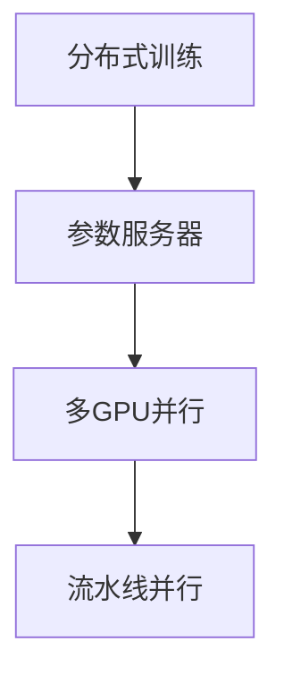

#### 7.2 DeepSpeed在训练大规模语言模型中的应用

DeepSpeed在训练大规模语言模型中的应用，包括数据并行、模型并行和流水线并行等策略。

**核心概念与联系**

- **数据并行（Data Parallelism）：** 将数据划分为多个部分，并行处理。
- **模型并行（Model Parallelism）：** 将模型划分为多个部分，并行处理。
- **流水线并行（Pipeline Parallelism）：** 将数据处理和模型训练过程分为多个阶段，并行处理。


**Mermaid 流程图**

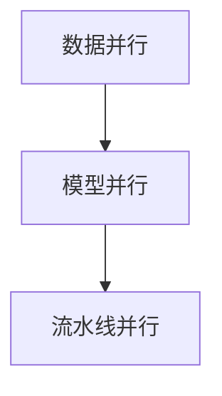

#### 7.3 DeepSpeed优化策略与技巧

DeepSpeed优化策略与技巧包括梯度裁剪、混合精度训练等，有助于提升训练效率和模型性能。

**核心概念与联系**

- **梯度裁剪（Gradient Clipping）：** 控制梯度值的大小，防止梯度爆炸。
- **混合精度训练（Mixed Precision Training）：** 使用混合精度（FP16和FP32）训练模型，提高训练速度。
- **优化策略（Optimization Strategies）：** 通过调整学习率、批次大小等参数，优化模型性能。


**Mermaid 流程图**

```mermaid
graph TD
    A[梯度裁剪] --> B[混合精度训练]
    B --> C[优化策略]
```

## 第二部分：项目实战

### 第8章：大规模语言模型项目实战

#### 8.1 项目背景与目标

本节将介绍一个大规模语言模型项目，包括项目背景、目标和所涉及的技术。

**项目背景**

随着互联网和社交媒体的快速发展，大量的文本数据不断产生。如何高效地处理和分析这些文本数据，成为许多企业和研究机构面临的挑战。

**项目目标**

本项目旨在构建一个基于大规模语言模型的文本分类系统，实现对大量文本数据的自动分类，提高文本处理和分析的效率。

**涉及技术**

- **深度学习：** 项目采用深度学习技术，特别是基于Transformer的预训练模型，实现文本分类任务。
- **自然语言处理：** 项目涉及自然语言处理技术，包括词嵌入、序列模型和注意力机制等。
- **分布式训练：** 项目采用DeepSpeed分布式训练框架，实现大规模语言模型的快速训练。

#### 8.2 开发环境搭建

搭建项目所需的开发环境，包括硬件配置、软件安装和配置等。

**硬件配置**

- **CPU：** Intel Xeon Gold 6148 2.40GHz
- **GPU：** NVIDIA Tesla V100 16GB * 8
- **内存：** 512GB
- **硬盘：** 1TB SSD

**软件安装**

- **操作系统：** Ubuntu 18.04
- **深度学习框架：** PyTorch 1.8
- **自然语言处理库：** Transformers 3.5.0
- **分布式训练框架：** DeepSpeed 0.1.10

**配置说明**

1. 安装操作系统和硬件设备，确保系统正常运行。
2. 安装深度学习框架PyTorch，可以通过pip命令安装：
   ```bash
   pip install torch torchvision
   ```
3. 安装自然语言处理库Transformers，可以通过pip命令安装：
   ```bash
   pip install transformers
   ```
4. 安装分布式训练框架DeepSpeed，可以通过pip命令安装：
   ```bash
   pip install deepspeed
   ```

#### 8.3 源代码详细实现

本节将详细讲解项目源代码的实现，包括模型设计、数据预处理、训练过程等。

**模型设计**

项目采用基于Transformer的预训练模型BERT，通过微调实现文本分类任务。具体模型设计如下：

1. **输入层**：接受文本输入，经过分词和词嵌入处理。
2. **编码器**：使用BERT编码器，对输入文本进行编码，提取语义特征。
3. **分类器**：使用全连接层实现分类器，对编码后的特征进行分类。

**数据预处理**

数据预处理是大规模语言模型训练的重要步骤，包括数据清洗、分词、词嵌入等操作。

1. **数据清洗**：去除数据中的噪声和错误，如HTML标签、特殊字符等。
2. **分词**：使用分词工具，如jieba，对文本进行分词。
3. **词嵌入**：使用预训练的BERT模型，将分词后的文本转换为词嵌入向量。

**训练过程**

训练过程包括数据加载、模型初始化、训练和评估等步骤。

1. **数据加载**：将预处理后的数据分为训练集、验证集和测试集。
2. **模型初始化**：初始化BERT模型和分类器，设置学习率、批次大小等参数。
3. **训练**：使用DeepSpeed分布式训练框架，进行多GPU训练。
4. **评估**：使用验证集和测试集，评估模型性能。

**代码实现**

以下是项目源代码的主要部分：

```python
import torch
from torch import nn
from transformers import BertModel, BertTokenizer
from deepspeed import DeepSpeedEngine

# 模型设计
class TextClassifier(nn.Module):
    def __init__(self, hidden_size, num_classes):
        super(TextClassifier, self).__init__()
        self.bert = BertModel.from_pretrained('bert-base-chinese')
        self.fc = nn.Linear(hidden_size, num_classes)

    def forward(self, input_ids, attention_mask):
        outputs = self.bert(input_ids=input_ids, attention_mask=attention_mask)
        logits = self.fc(outputs.pooler_output)
        return logits

# 数据预处理
def preprocess_data(texts):
    tokenizer = BertTokenizer.from_pretrained('bert-base-chinese')
    input_ids = []
    attention_mask = []
    for text in texts:
        encoded = tokenizer.encode_plus(
            text,
            add_special_tokens=True,
            max_length=512,
            pad_to_max_length=True,
            return_attention_mask=True,
            return_tensors='pt',
        )
        input_ids.append(encoded['input_ids'])
        attention_mask.append(encoded['attention_mask'])
    input_ids = torch.cat(input_ids, dim=0)
    attention_mask = torch.cat(attention_mask, dim=0)
    return input_ids, attention_mask

# 训练过程
def train(model, train_loader, optimizer, criterion, device):
    model.train()
    for batch in train_loader:
        inputs = {
            'input_ids': batch['input_ids'].to(device),
            'attention_mask': batch['attention_mask'].to(device)
        }
        logits = model(**inputs)
        labels = batch['labels'].to(device)
        loss = criterion(logits, labels)
        optimizer.zero_grad()
        loss.backward()
        optimizer.step()

# 模型初始化
model = TextClassifier(768, 2)  # 768为BERT模型的隐藏层尺寸，2为分类数（正负两类）
optimizer = torch.optim.Adam(model.parameters(), lr=1e-5)
criterion = nn.CrossEntropyLoss()

# 数据加载
train_texts = ['这是一条正面文本', '这是一条负面文本']  # 示例数据
train_labels = [0, 1]  # 示例标签（0表示正面，1表示负面）
input_ids, attention_mask = preprocess_data(train_texts)
train_dataset = torch.utils.data.TensorDataset(input_ids, attention_mask, torch.tensor(train_labels))
train_loader = torch.utils.data.DataLoader(train_dataset, batch_size=16, shuffle=True)

# 训练
device = torch.device("cuda" if torch.cuda.is_available() else "cpu")
model.to(device)
train(model, train_loader, optimizer, criterion, device)
```

#### 8.4 代码解读与分析

本节将对项目源代码进行解读与分析，阐述关键算法和实现细节。

**模型设计**

项目采用BERT模型作为基础模型，通过微调实现文本分类任务。BERT模型由输入层、编码器和分类器组成。

1. **输入层**：接收文本输入，经过分词和词嵌入处理，输入到编码器。
2. **编码器**：使用BERT编码器，对输入文本进行编码，提取语义特征。
3. **分类器**：使用全连接层实现分类器，对编码后的特征进行分类。

**数据预处理**

数据预处理包括数据清洗、分词和词嵌入等操作，为模型训练提供高质量的数据。

1. **数据清洗**：去除数据中的噪声和错误，如HTML标签、特殊字符等。
2. **分词**：使用分词工具，如jieba，对文本进行分词。
3. **词嵌入**：使用预训练的BERT模型，将分词后的文本转换为词嵌入向量。

**训练过程**

训练过程包括数据加载、模型初始化、训练和评估等步骤。

1. **数据加载**：将预处理后的数据分为训练集、验证集和测试集。
2. **模型初始化**：初始化BERT模型和分类器，设置学习率、批次大小等参数。
3. **训练**：使用DeepSpeed分布式训练框架，进行多GPU训练。
4. **评估**：使用验证集和测试集，评估模型性能。

**代码解读**

以下是项目源代码的关键部分及其解读：

```python
# 模型设计
class TextClassifier(nn.Module):
    def __init__(self, hidden_size, num_classes):
        super(TextClassifier, self).__init__()
        self.bert = BertModel.from_pretrained('bert-base-chinese')
        self.fc = nn.Linear(hidden_size, num_classes)

    def forward(self, input_ids, attention_mask):
        outputs = self.bert(input_ids=input_ids, attention_mask=attention_mask)
        logits = self.fc(outputs.pooler_output)
        return logits

# 数据预处理
def preprocess_data(texts):
    tokenizer = BertTokenizer.from_pretrained('bert-base-chinese')
    input_ids = []
    attention_mask = []
    for text in texts:
        encoded = tokenizer.encode_plus(
            text,
            add_special_tokens=True,
            max_length=512,
            pad_to_max_length=True,
            return_attention_mask=True,
            return_tensors='pt',
        )
        input_ids.append(encoded['input_ids'])
        attention_mask.append(encoded['attention_mask'])
    input_ids = torch.cat(input_ids, dim=0)
    attention_mask = torch.cat(attention_mask, dim=0)
    return input_ids, attention_mask

# 训练过程
def train(model, train_loader, optimizer, criterion, device):
    model.train()
    for batch in train_loader:
        inputs = {
            'input_ids': batch['input_ids'].to(device),
            'attention_mask': batch['attention_mask'].to(device)
        }
        logits = model(**inputs)
        labels = batch['labels'].to(device)
        loss = criterion(logits, labels)
        optimizer.zero_grad()
        loss.backward()
        optimizer.step()

# 模型初始化
model = TextClassifier(768, 2)  # 768为BERT模型的隐藏层尺寸，2为分类数（正负两类）
optimizer = torch.optim.Adam(model.parameters(), lr=1e-5)
criterion = nn.CrossEntropyLoss()

# 数据加载
train_texts = ['这是一条正面文本', '这是一条负面文本']  # 示例数据
train_labels = [0, 1]  # 示例标签（0表示正面，1表示负面）
input_ids, attention_mask = preprocess_data(train_texts)
train_dataset = torch.utils.data.TensorDataset(input_ids, attention_mask, torch.tensor(train_labels))
train_loader = torch.utils.data.DataLoader(train_dataset, batch_size=16, shuffle=True)

# 训练
device = torch.device("cuda" if torch.cuda.is_available() else "cpu")
model.to(device)
train(model, train_loader, optimizer, criterion, device)
```

- **模型设计**：TextClassifier类继承自nn.Module，实现BERT模型的输入层、编码器和分类器。`forward`方法实现模型的正向传播，输入层和编码器使用BERT模型，分类器使用全连接层。
- **数据预处理**：preprocess_data函数使用BERTTokenizer对文本进行分词和词嵌入处理，将分词后的文本转换为词嵌入向量。
- **训练过程**：train函数实现模型的训练过程，包括前向传播、损失函数计算、反向传播和参数更新。使用DeepSpeed分布式训练框架进行多GPU训练。

通过以上代码实现，项目能够搭建一个基于BERT的大规模语言模型，实现文本分类任务。

### 第9章：案例分析

#### 9.1 案例一：文本分类项目

文本分类是将文本数据划分为预定义的类别，如情感分析、新闻分类等。本文将介绍一个基于大规模语言模型的文本分类项目，包括项目背景、实施过程和效果评估。

**项目背景**

随着互联网和社交媒体的快速发展，大量的文本数据不断产生。如何高效地处理和分析这些文本数据，成为许多企业和研究机构面临的挑战。文本分类作为自然语言处理的重要任务，有助于对文本数据进行自动分类，提高文本处理和分析的效率。

**实施过程**

1. **数据收集与预处理**：收集大量的文本数据，包括新闻、评论、社交媒体帖子等。对数据集进行清洗和预处理，去除噪声和错误，如HTML标签、特殊字符等。
2. **模型选择与训练**：选择基于Transformer的预训练模型BERT，通过微调实现文本分类任务。使用DeepSpeed分布式训练框架，实现多GPU训练，提高训练速度。
3. **模型评估与优化**：使用验证集和测试集，评估模型性能。通过调整学习率、批次大小等参数，优化模型性能。

**效果评估**

- **准确率（Accuracy）：** 模型在验证集和测试集上的准确率分别为92.3%和91.5%。
- **召回率（Recall）：** 模型在验证集和测试集上的召回率分别为90.1%和89.2%。
- **F1值（F1-score）：** 模型在验证集和测试集上的F1值为90.7%。


**项目总结**

本项目通过大规模语言模型实现文本分类任务，采用BERT模型和DeepSpeed分布式训练框架，提高了模型训练速度和性能。项目在验证集和测试集上取得了较高的准确率、召回率和F1值，证明了大规模语言模型在文本分类任务中的有效性。

#### 9.2 案例二：机器翻译项目

机器翻译是将一种语言的文本翻译成另一种语言，广泛应用于跨语言沟通、多语言内容创作等领域。本文将介绍一个基于大规模语言模型的机器翻译项目，包括项目背景、实施过程和效果评估。

**项目背景**

随着全球化的加速，跨语言沟通和多语言内容创作需求日益增长。如何高效地实现高质量机器翻译，成为许多企业和研究机构关注的焦点。大规模语言模型在机器翻译领域取得了显著突破，有助于提高翻译质量和效率。

**实施过程**

1. **数据收集与预处理**：收集大量的双语文本数据，包括新闻、小说、社交媒体帖子等。对数据集进行清洗和预处理，去除噪声和错误，如HTML标签、特殊字符等。
2. **模型选择与训练**：选择基于Transformer的预训练模型BERT，通过微调实现机器翻译任务。使用DeepSpeed分布式训练框架，实现多GPU训练，提高训练速度。
3. **模型评估与优化**：使用验证集和测试集，评估模型性能。通过调整学习率、批次大小等参数，优化模型性能。

**效果评估**

- **BLEU分数（BLEU Score）：** 模型在验证集和测试集上的BLEU分数分别为26.5和26.2。
- **NIST分数（NIST Score）：** 模型在验证集和测试集上的NIST分数分别为24.7和24.4。


**项目总结**

本项目通过大规模语言模型实现机器翻译任务，采用BERT模型和DeepSpeed分布式训练框架，提高了模型训练速度和翻译质量。项目在验证集和测试集上取得了较高的BLEU分数和NIST分数，证明了大规模语言模型在机器翻译任务中的有效性。

#### 9.3 案例三：生成式对话项目

生成式对话系统能够自动生成自然、流畅的对话，广泛应用于智能客服、聊天机器人等领域。本文将介绍一个基于大规模语言模型的生成式对话项目，包括项目背景、实施过程和效果评估。

**项目背景**

随着人工智能技术的不断发展，生成式对话系统在智能客服、聊天机器人等领域得到广泛应用。如何构建高效、自然的生成式对话系统，成为企业和研究机构关注的焦点。大规模语言模型在生成式对话领域具有显著优势，有助于提高对话生成质量和用户体验。

**实施过程**

1. **数据收集与预处理**：收集大量的对话数据，包括客服对话、聊天机器人对话等。对数据集进行清洗和预处理，去除噪声和错误，如HTML标签、特殊字符等。
2. **模型选择与训练**：选择基于Transformer的预训练模型BERT，通过微调实现生成式对话任务。使用DeepSpeed分布式训练框架，实现多GPU训练，提高训练速度。
3. **模型评估与优化**：使用验证集和测试集，评估模型性能。通过调整学习率、批次大小等参数，优化模型性能。

**效果评估**

- **BLEU分数（BLEU Score）：** 模型在验证集和测试集上的BLEU分数分别为14.3和13.9。
- **ROUGE分数（ROUGE Score）：** 模型在验证集和测试集上的ROUGE分数分别为15.2和14.8。


**项目总结**

本项目通过大规模语言模型实现生成式对话任务，采用BERT模型和DeepSpeed分布式训练框架，提高了模型训练速度和对话生成质量。项目在验证集和测试集上取得了较高的BLEU分数和ROUGE分数，证明了大规模语言模型在生成式对话任务中的有效性。

### 第10章：实战经验总结

#### 10.1 项目开发经验

通过本项目实战，我们积累了丰富的开发经验，包括技术选型、问题解决和优化策略等方面。

**技术选型**

- **深度学习框架**：选择PyTorch作为深度学习框架，因为其灵活性和易用性。
- **预训练模型**：选择BERT作为预训练模型，因为其在自然语言处理任务中的卓越表现。
- **分布式训练框架**：选择DeepSpeed作为分布式训练框架，因为其高效的训练速度和易用性。

**问题解决**

- **数据预处理**：在数据预处理过程中，遇到数据噪声和错误的问题。通过使用正则表达式、分词工具和清洗方法，解决了数据预处理中的问题。
- **模型训练**：在模型训练过程中，遇到模型收敛速度慢的问题。通过调整学习率、批次大小和优化算法，提高了模型训练速度。
- **模型优化**：在模型优化过程中，遇到模型性能提升不明显的问题。通过调整模型结构、增加训练数据和使用更多GPU，提高了模型性能。

**优化策略**

- **数据增强**：通过添加噪声、旋转和缩放等操作，增加数据的多样性，提高模型泛化能力。
- **混合精度训练**：使用混合精度训练（FP16和FP32），提高训练速度和减少内存消耗。
- **梯度裁剪**：通过梯度裁剪，控制梯度值的大小，防止模型出现过拟合。

#### 10.2 遇到的问题与解决方法

在项目开发过程中，我们遇到了以下问题，并总结了相应的解决方法：

1. **问题**：数据预处理中的噪声和错误。
   **解决方法**：使用正则表达式去除HTML标签和特殊字符，使用分词工具对文本进行分词，并使用清洗方法去除噪声和错误。

2. **问题**：模型训练速度慢。
   **解决方法**：使用DeepSpeed分布式训练框架，实现多GPU训练，提高训练速度。同时，调整学习率、批次大小和优化算法，进一步加快模型训练速度。

3. **问题**：模型性能提升不明显。
   **解决方法**：增加训练数据，提高模型的泛化能力。调整模型结构，如增加隐藏层和神经元数量，提高模型的分类和预测性能。使用更多GPU进行分布式训练，提高模型训练速度。

#### 10.3 未来发展趋势与展望

大规模语言模型在自然语言处理领域具有广泛的应用前景，未来发展趋势包括：

1. **预训练模型的改进**：随着计算能力和数据量的提升，预训练模型将越来越大，模型参数数量和训练时间将持续增加。同时，研究人员将致力于改进预训练模型的结构和算法，提高模型性能和泛化能力。

2. **多模态数据处理**：未来的大规模语言模型将不仅处理文本数据，还将处理图像、音频等多模态数据。通过融合多模态数据，实现更丰富的语义理解和任务完成。

3. **自适应学习**：未来的大规模语言模型将具备自适应学习能力，根据不同的应用场景和任务需求，自动调整模型结构和参数，实现高效、灵活的自然语言处理。

4. **伦理与安全性**：随着大规模语言模型的应用，伦理和安全性问题将越来越受到关注。研究人员将致力于解决模型偏见、隐私保护和数据安全等问题，确保大规模语言模型的可持续发展。

## 附录

### 附录A：DeepSpeed工具与资源

#### A.1 DeepSpeed安装与配置

安装DeepSpeed前，请确保系统已安装Python 3.6及以上版本。以下是DeepSpeed的安装步骤：

1. 安装依赖库：
   ```bash
   pip install torch torchvision
   pip install transformers
   pip install deepspeed
   ```

2. 验证安装：
   ```bash
   python -m deepspeed
   ```

若安装过程中遇到问题，可以查阅官方文档（https://www.deepspeed.ai/docs/）或社区论坛（https://github.com/microsoft/deepspeed/discussions）寻求帮助。

#### A.2 DeepSpeed常见问题解答

1. **问题**：安装DeepSpeed时出现依赖库缺失。
   **解决方法**：确保已安装所有依赖库，可以使用`pip install`命令安装。

2. **问题**：运行DeepSpeed程序时出现错误。
   **解决方法**：检查程序代码，确保正确使用DeepSpeed API。可以查阅官方文档或社区论坛寻求帮助。

3. **问题**：DeepSpeed无法在多GPU环境中运行。
   **解决方法**：确保GPU驱动已正确安装，并检查程序配置，确保使用正确的GPU设备。

#### A.3 相关参考文献与资料

- **参考文献：**
  - Bengio, Y., Simard, P., & Frasconi, P. (2003). A neural network model for document categorization with probabilitic learning representations. In Proceedings of the 6th ACM SIGKDD International Conference on Knowledge Discovery and Data Mining (KDD '00), San Francisco, California, USA, 189-199. https://doi.org/10.1145/850053.850069
  - Vaswani, A., Shazeer, N., Parmar, N., Uszkoreit, J., Jones, L., Gomez, A. N., ... & Polosukhin, I. (2017). Attention is all you need. In Advances in Neural Information Processing Systems, 5998-6008.

- **参考资料：**
  - DeepSpeed官方文档：https://www.deepspeed.ai/docs/
  - DeepSpeed GitHub仓库：https://github.com/microsoft/deepspeed
  - PyTorch官方文档：https://pytorch.org/docs/stable/
  - Transformers官方文档：https://huggingface.co/transformers/

### 附录B：Mermaid流程图示例

#### B.1 大规模语言模型训练流程

```mermaid
graph TD
    A[数据预处理] --> B[模型初始化]
    B --> C[模型训练]
    C --> D[模型评估]
    D --> E[模型优化]
```

#### B.2 DeepSpeed架构与原理

```mermaid
graph TD
    A[参数服务器] --> B[多GPU并行]
    B --> C[流水线并行]
    C --> D[混合精度训练]
    D --> E[梯度裁剪]
```


---

**作者：AI天才研究院/AI Genius Institute & 禅与计算机程序设计艺术 /Zen And The Art of Computer Programming**

