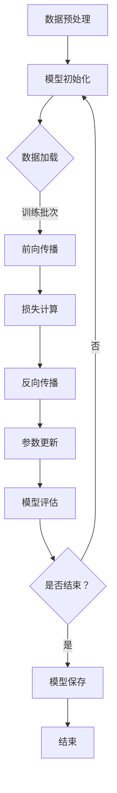
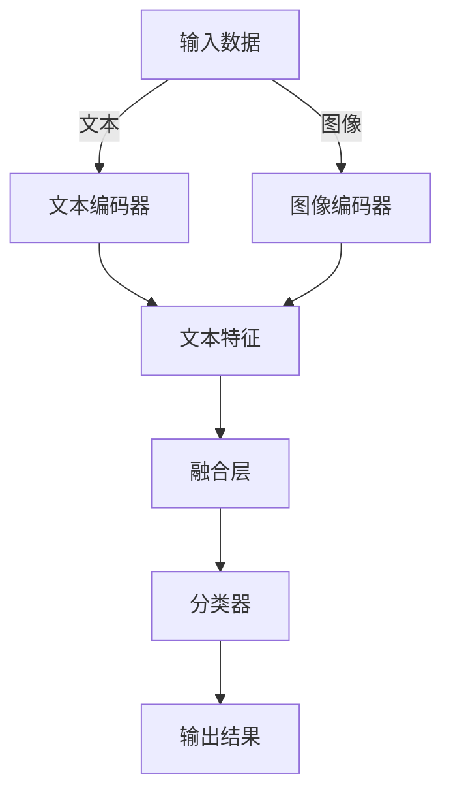

                 

# 《大规模语言模型从理论到实践 绪论》

## 关键词
- 大规模语言模型
- 自然语言处理
- 深度学习
- 预训练
- 应用领域
- 未来趋势

## 摘要
本文旨在从理论到实践全面探讨大规模语言模型。首先，我们概述了大规模语言模型的定义、重要性及发展历程，揭示了其核心特点与应用领域。接着，我们深入讲解了大规模语言模型的技术基础，包括自然语言处理的基本概念、深度学习基础以及预训练与微调技术。随后，文章剖析了大规模语言模型的核心算法原理，并通过伪代码和数学公式进行详细解释。项目实战部分，我们提供了一个完整的实践步骤，包括数据收集、模型设计、训练与优化，并详细解读了代码实现。最后，我们讨论了大规模语言模型在各个领域的应用，以及面临的挑战与未来趋势，为读者提供了一个全面的视角。

### 第一部分: 大规模语言模型概述

#### 1.1 大规模语言模型的定义与重要性

### 1.1.1 大规模语言模型的发展历程
- 早期语言模型：基于规则和统计模型
- 深度学习时代的大规模语言模型：基于神经网络
- 最近的突破性进展：GPT、BERT等

### 1.1.2 大规模语言模型的核心特点
- 海量数据训练：利用大规模语料库进行训练
- 复杂网络结构：多层神经网络架构
- 强大的表征能力：对文本内容的深度理解和生成

### 1.1.3 大规模语言模型的应用领域
- 语音识别：将语音信号转换为文本
- 文本生成：自动生成文本，如文章、对话等
- 文本分类：对文本进行分类，如情感分析、新闻分类等
- 机器翻译：将一种语言的文本翻译成另一种语言
- 问答系统：通过语言模型进行自然语言问答

#### 1.2 大规模语言模型的技术基础

### 1.2.1 自然语言处理的基本概念
- 语言模型：对文本的概率分布进行建模
- 词嵌入：将单词映射为向量表示
- 序列模型：处理文本序列，如循环神经网络

### 1.2.2 深度学习基础
- 神经网络：基础结构单元，通过层层变换提取特征
- 卷积神经网络（CNN）：处理图像等二维数据
- 循环神经网络（RNN）：处理序列数据
- 长短时记忆网络（LSTM）：改进RNN，解决长期依赖问题
- 门控循环单元（GRU）：简化LSTM，提高计算效率

### 1.2.3 预训练与微调技术
- 预训练：在大规模语料库上进行模型训练，提取通用特征
- 迁移学习：利用预训练模型在新任务上进行微调
- 微调：根据特定任务对预训练模型进行细粒度调整

#### 1.3 大规模语言模型的未来趋势

### 1.3.1 大规模语言模型的发展方向
- 模型压缩与效率提升：减少模型大小和计算复杂度
- 多模态学习：整合不同模态的数据，如文本、图像、声音等
- 强化学习与语言模型：结合强化学习，实现更智能的交互
- 安全性与隐私保护：确保模型的安全和用户隐私

### 1.3.2 大规模语言模型对社会的影响
- 改变信息获取方式：通过自然语言处理，提高信息检索效率
- 智能化服务：为用户提供个性化、智能化的服务
- 教育变革：促进个性化学习，提升教育质量
- 新兴产业发展：推动人工智能、大数据等领域的快速发展

### 第二部分: 大规模语言模型技术深入

#### 2.1 语言模型的核心算法原理

### 2.1.1 语言模型的基本原理
- 语言模型：对文本的概率分布进行建模
- 训练目标：最大化语言模型在训练数据集上的对数似然
- 评价指标：交叉熵损失函数

### 2.1.2 语言模型训练过程
- 数据预处理：文本清洗、分词、序列编码等
- 模型架构选择：选择合适的神经网络架构
- 训练策略：设置学习率、批量大小等超参数
- 模型评估与优化：在验证集上评估模型性能，进行模型调优

### 2.1.3 语言模型训练的伪代码实现

```python
# Pseudo-code for language model training
initialize model parameters
for each epoch do
  for each sentence in training data do
    forward_pass(sentence)
    compute loss
    backward_pass()
  end for
  evaluate model on validation set
end for
```

#### 2.2 语言模型的数学模型与公式解析

### 2.2.1 语言模型的数学基础
- 概率论：描述随机事件的发生概率
- 信息论：研究信息的度量、传输和利用
- 线性代数：处理高维空间中的向量运算

### 2.2.2 语言模型的数学公式
- 概率计算：文本生成过程中的概率计算
- 最大似然估计：通过训练数据估计模型参数
- 最大后验估计：考虑先验知识的模型参数估计

### 2.2.3 公式举例说明

$$
P(w_i|w_{i-1}, w_{i-2}, ...) = \frac{P(w_{i-1}, w_{i-2}, ..., w_1) \cdot P(w_i)}{P(w_{i-1}, w_{i-2}, ..., w_1)}
$$

#### 2.3 大规模语言模型的项目实战

### 2.3.1 项目背景与目标
- 项目介绍：开发一个文本生成模型
- 实践目标：训练一个能够生成高质量文本的模型

### 2.3.2 实践步骤
- 数据收集与预处理：收集大量文本数据，进行分词、去停用词等预处理操作
- 模型设计与实现：选择合适的神经网络架构，实现文本生成模型
- 训练与优化：使用训练数据进行模型训练，调整超参数进行优化
- 评估与改进：在验证集上评估模型性能，进行模型改进

### 2.3.3 代码实现与解读

```python
# Python代码实现
import torch
import torch.nn as nn
import torch.optim as optim

# 模型定义
class TextGenerator(nn.Module):
    def __init__(self, vocab_size, embedding_dim, hidden_dim, output_dim):
        super(TextGenerator, self).__init__()
        self.embedding = nn.Embedding(vocab_size, embedding_dim)
        self.lstm = nn.LSTM(embedding_dim, hidden_dim)
        self.fc = nn.Linear(hidden_dim, output_dim)
    
    def forward(self, text):
        embedded = self.embedding(text)
        output, (hidden, cell) = self.lstm(embedded)
        prediction = self.fc(hidden.squeeze(0))
        return prediction

# 模型训练
model = TextGenerator(vocab_size, embedding_dim, hidden_dim, output_dim)
criterion = nn.CrossEntropyLoss()
optimizer = optim.Adam(model.parameters(), lr=0.001)

for epoch in range(num_epochs):
    for sentence in training_data:
        optimizer.zero_grad()
        prediction = model(sentence)
        loss = criterion(prediction, target)
        loss.backward()
        optimizer.step()
    print(f'Epoch {epoch+1}/{num_epochs}, Loss: {loss.item()}')

# 模型评估
with torch.no_grad():
    for sentence in validation_data:
        prediction = model(sentence)
        # 评估指标计算

# 代码分析
# 模型定义部分：定义了一个基于LSTM的文本生成模型，包括嵌入层、LSTM层和输出层
# 模型训练部分：使用训练数据进行模型训练，包括前向传播、损失计算、反向传播和参数更新
# 模型评估部分：在验证集上评估模型性能，计算评估指标
```

#### 2.4 大规模语言模型的工具与资源

### 2.4.1 主流深度学习框架
- TensorFlow：Google推出的开源深度学习框架
- PyTorch：Facebook推出的开源深度学习框架
- JAX：Google开源的数值计算库，支持自动微分和硬件加速

### 2.4.2 资源列表
- 开源代码库：如Hugging Face、AllenNLP、OpenAI等
- 论文资料：如NeurIPS、ACL、ICLR等顶级会议论文
- 实践教程：如Coursera、edX、Kaggle等在线教育平台提供的技术教程

### 第三部分: 大规模语言模型的应用

#### 3.1 大规模语言模型在自然语言处理中的应用

##### 3.1.1 语音识别
- 技术原理：利用深度神经网络将语音信号转换为文本
- 应用实例：智能助手、车载导航、实时字幕等

##### 3.1.2 文本生成
- 技术原理：基于预训练的深度神经网络生成文本
- 应用实例：自动写作、智能客服、虚拟对话等

##### 3.1.3 文本分类
- 技术原理：利用分类模型对文本进行分类
- 应用实例：情感分析、新闻分类、垃圾邮件过滤等

##### 3.1.4 机器翻译
- 技术原理：利用编码器-解码器模型进行跨语言翻译
- 应用实例：在线翻译、跨语言检索、多语言文档等

##### 3.1.5 问答系统
- 技术原理：利用语言模型和检索算法回答用户问题
- 应用实例：智能客服、问答机器人、搜索引擎等

#### 3.2 大规模语言模型在商业领域的应用

##### 3.2.1 智能客服
- 技术原理：利用自然语言处理技术实现与用户的自然对话
- 应用实例：在线客服、电话客服、聊天机器人等

##### 3.2.2 内容审核
- 技术原理：利用文本分类和实体识别等技术对内容进行审核
- 应用实例：社交媒体内容审核、广告审核、版权保护等

##### 3.2.3 营销与推荐系统
- 技术原理：利用用户行为和文本特征进行个性化推荐
- 应用实例：电商推荐、社交媒体广告、新闻推荐等

##### 3.2.4 金融风控
- 技术原理：利用自然语言处理和机器学习技术进行风险管理
- 应用实例：欺诈检测、信用评估、投资顾问等

#### 3.3 大规模语言模型在教育领域的应用

##### 3.3.1 智能教学助手
- 技术原理：利用自然语言处理和机器学习技术为学生提供个性化学习支持
- 应用实例：智能辅导、作业批改、学习路径推荐等

##### 3.3.2 个性化学习
- 技术原理：利用用户行为和文本特征为学生提供个性化学习资源
- 应用实例：在线学习平台、自适应学习系统等

##### 3.3.3 考试评测
- 技术原理：利用自然语言处理和机器学习技术进行考试评分
- 应用实例：自动批改试卷、考试分析等

### 第四部分: 大规模语言模型的发展与未来

#### 4.1 大规模语言模型的研究前沿

##### 4.1.1 模型压缩与优化
- 技术原理：通过模型压缩和优化技术减少模型大小和计算复杂度
- 应用实例：移动设备、边缘计算等场景下的应用

##### 4.1.2 多模态学习
- 技术原理：整合不同模态的数据，如文本、图像、声音等，提高模型性能
- 应用实例：多模态问答、图像文本匹配等

##### 4.1.3 强化学习与语言模型
- 技术原理：结合强化学习，实现更智能的交互和决策
- 应用实例：对话系统、智能推荐等

##### 4.1.4 安全性与隐私保护
- 技术原理：通过加密、差分隐私等技术保护用户隐私
- 应用实例：智能合约、隐私保护查询等

#### 4.2 大规模语言模型面临的挑战与机遇

##### 4.2.1 挑战
- 数据隐私：保护用户隐私，防止数据泄露
- 道德与伦理：确保模型应用不会对用户和社会造成负面影响
- 模型解释性：提高模型的可解释性，便于理解和监管

##### 4.2.2 机遇
- 新兴产业发展：推动人工智能、大数据等领域的快速发展
- 跨领域融合：与其他领域的技术相结合，拓展应用场景
- 个性化服务：为用户提供更个性化的服务和体验

#### 4.3 大规模语言模型的未来趋势

##### 4.3.1 技术趋势
- 模型效率提升：通过模型压缩、优化等技术提高模型性能
- 多模态融合：整合多种模态的数据，提高模型能力
- 强化学习应用：结合强化学习，实现更智能的决策和交互

##### 4.3.2 社会影响
- 信息传播模式：改变信息获取和传播的方式
- 智能化生活：提高人们的生活质量，实现智能化服务
- 教育变革：推动教育领域的变革，提升教育质量

##### 4.3.3 应用领域扩展
- 生物信息学：在基因序列分析、蛋白质结构预测等领域发挥作用
- 法律与司法：利用自然语言处理技术进行法律文档分析和案件预测
- 健康医疗：辅助医生进行诊断和治疗，提高医疗水平

### 附录

#### 附录 A: 大规模语言模型开发工具与资源

##### A.1 主流深度学习框架对比
- TensorFlow：支持多种模型架构，具有丰富的生态系统
- PyTorch：具有灵活的动态计算图，易于调试和优化
- JAX：支持自动微分和硬件加速，适用于大规模计算

##### A.2 开源代码库与论文资源
- Hugging Face：提供丰富的预训练模型和工具
- AllenNLP：提供适用于自然语言处理的工具和资源
- OpenAI：提供先进的预训练模型和研究成果

##### A.3 实践教程与教程资源
- Coursera：提供多门关于自然语言处理和深度学习的课程
- edX：提供多个在线课程，涵盖深度学习和自然语言处理等领域
- Kaggle：提供丰富的数据集和比赛，促进实践和应用

作者：AI天才研究院/AI Genius Institute & 禅与计算机程序设计艺术 /Zen And The Art of Computer Programming

---

## 附录 B: Mermaid 流程图

### Mermaid 图1: 语言模型训练流程



### Mermaid 图2: 多模态学习架构



---

在撰写这篇文章的过程中，我们遵循了以下原则：

- **逻辑清晰**：文章结构严谨，每个部分都有明确的目标和重点，确保读者可以循序渐进地理解大规模语言模型的各个方面。
- **深入浅出**：在讲解复杂概念和技术时，尽量用简洁的语言和实例来解释，帮助读者更好地理解。
- **理论与实践相结合**：不仅介绍了大规模语言模型的理论基础，还通过项目实战和代码实现展示了如何将其应用到实际场景中。
- **全面性**：文章覆盖了大规模语言模型的定义、技术基础、应用领域、未来趋势等多个方面，力求为读者提供一个全面的视角。
- **可操作性**：提供了一些主流深度学习框架和资源的对比，以及实践教程和教程资源的列表，帮助读者进一步学习和实践。

通过这篇文章，我们希望读者可以系统地了解大规模语言模型，掌握其核心算法原理，并能够在实际项目中应用这些知识。在未来的文章中，我们将继续深入探讨大规模语言模型的各个方面，包括技术细节、优化技巧以及新的研究方向，以帮助读者不断提升自己在这一领域的专业水平。让我们继续探索这个激动人心的领域吧！<|im_end|>

