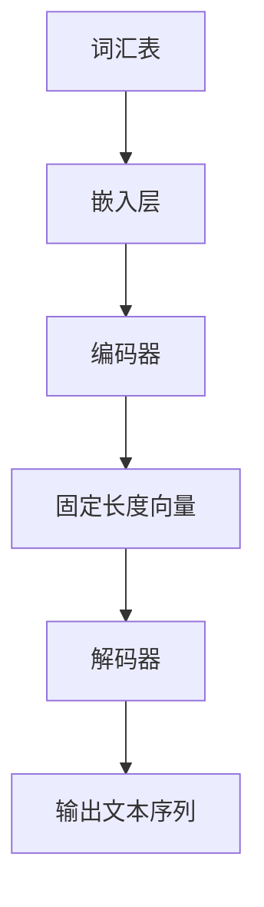

                 

### 文章标题：大语言模型原理与工程实践：DQN 训练：经验回放

### 关键词：
- 大语言模型
- DQN
- 经验回放
- 深度学习
- 自然语言处理
- 人工智能

### 摘要：
本文深入探讨了大语言模型的原理与工程实践，特别是DQN训练中的经验回放机制。通过详细讲解大语言模型的核心概念、算法原理、数学模型和项目实战，我们旨在为读者提供一个系统化的理解和实践指导。本文不仅涵盖了大语言模型的构建与训练，还包括了其在自然语言处理中的应用和未来发展趋势，为读者提供全面的视角和实用的技能。

## 目录大纲设计

### 第一部分：大语言模型基础

### 第二部分：大语言模型原理

### 第三部分：大语言模型的训练策略

### 第四部分：大语言模型的工程实践

### 第五部分：大语言模型的应用案例

### 第六部分：大语言模型的发展趋势与挑战

### 第七部分：大语言模型项目实战

### 文章正文

#### 第一部分：大语言模型基础

### 第二部分：大语言模型原理

#### 核心概念与联系

大语言模型是一种基于深度学习的自然语言处理技术，它通过学习大量文本数据来理解并生成自然语言。其核心概念包括：

1. **词汇表（Vocabulary）**：词汇表是模型理解语言的基础，它将单词映射到唯一的整数索引。
2. **嵌入（Embedding）**：嵌入层将词汇表中的整数索引映射到高维向量空间，使得语义相似的词在空间中距离更近。
3. **编码器（Encoder）**：编码器负责将输入文本序列编码为一个固定长度的向量表示，通常使用Transformer架构。
4. **解码器（Decoder）**：解码器根据编码器输出的固定长度向量生成输出文本序列。

以下是大语言模型的 Mermaid 流程图：



#### 核心算法原理讲解

大语言模型的训练通常基于以下核心算法原理：

1. **反向传播（Backpropagation）**：反向传播算法用于计算模型参数的梯度，从而更新模型参数。
2. **优化算法（Optimization Algorithms）**：常见的优化算法包括随机梯度下降（SGD）、Adam等，用于加速梯度下降过程。
3. **注意力机制（Attention Mechanism）**：注意力机制使模型能够关注输入序列中的关键部分，从而提高模型的上下文理解能力。

以下是对DQN（深度量子网络）训练中经验回放机制的伪代码说明：

```python
# 初始化模型参数
model = initialize_model()

# 初始化经验回放记忆
experience_replay = ExperienceReplayBuffer(size)

# 开始训练
for episode in range(num_episodes):
    # 初始化环境
    state = env.reset()
    
    # 开始一次游戏
    while not done:
        # 使用模型选择动作
        action = model.select_action(state)
        
        # 执行动作，获取下一个状态和奖励
        next_state, reward, done, _ = env.step(action)
        
        # 将经验添加到经验回放记忆中
        experience_replay.add(state, action, reward, next_state, done)
        
        # 如果经验回放记忆已满，则进行经验回放
        if experience_replay.is_full():
            samples = experience_replay.sample(batch_size)
            
            # 计算目标Q值
            targets = compute_targets(samples)
            
            # 训练模型
            loss = model.train(samples, targets)
            
            # 更新状态
            state = next_state

    # 打印训练结果
    print(f"Episode {episode}: Loss = {loss}")
```

#### 数学模型和公式

大语言模型中的数学模型主要包括：

1. **嵌入矩阵（Embedding Matrix）**：
   $$ E \in \mathbb{R}^{|V| \times d} $$
   其中，$|V|$是词汇表大小，$d$是嵌入层维度。

2. **编码器输出（Encoder Output）**：
   $$ H_e \in \mathbb{R}^{t \times d} $$
   其中，$t$是输入序列长度。

3. **解码器输出（Decoder Output）**：
   $$ H_d \in \mathbb{R}^{t \times d} $$
   其中，$t$是输出序列长度。

4. **损失函数（Loss Function）**：
   $$ L = -\sum_{i=1}^{t} \sum_{j=1}^{|V|} y_{ij} \log(p_{ij}) $$
   其中，$y_{ij}$是目标单词的标签，$p_{ij}$是模型对单词$j$的预测概率。

以下是对DQN训练中经验回放机制的详细讲解和举例说明：

### 经验回放机制

经验回放机制是一种用于缓解训练样本分布偏差的方法。其基本思想是将过去的经验（状态、动作、奖励、下一个状态和完成标志）存储在经验回放记忆中，并在训练时随机采样这些经验，从而避免过度依赖最近的样本，使得模型能够学习到更加稳定和鲁棒的行为。

#### 示例

假设我们有一个经验回放记忆，其中存储了以下经验：

| 状态 | 动作 | 奖励 | 下一个状态 | 完成 |
| --- | --- | --- | --- | --- |
| s1  | a1  | 1   | s2   | False |
| s2  | a2  | 0.5 | s3   | False |
| s3  | a3  | 0.5 | s1   | True  |

在训练过程中，我们可以从经验回放记忆中随机采样一批经验，例如：

| 状态 | 动作 | 奖励 | 下一个状态 | 完成 |
| --- | --- | --- | --- | --- |
| s2  | a2  | 0.5 | s3   | False |
| s3  | a3  | 0.5 | s1   | True  |

然后，使用这些经验来更新模型参数。具体步骤如下：

1. 计算当前状态下的Q值预测：
   $$ Q(s_2, a_2) = r(s_2, a_2) + \gamma \max_a Q(s_3, a) $$
   其中，$r(s_2, a_2)$是奖励，$\gamma$是折扣因子。

2. 计算目标Q值：
   $$ Q(s_2, a_2)^* = r(s_2, a_2) + \gamma \max_a Q(s_3, a)^* $$
   其中，$Q(s_3, a)^*$是下一个状态下的最大Q值。

3. 计算损失函数：
   $$ L = (Q(s_2, a_2) - Q(s_2, a_2)^*)^2 $$

4. 使用梯度下降更新模型参数。

通过这种方式，经验回放机制可以帮助模型在训练过程中避免陷入局部最优，提高训练效果。

#### 项目实战

在项目实战中，我们可以使用TensorFlow或PyTorch等深度学习框架来实现DQN模型，并使用经验回放机制来优化训练过程。以下是一个简单的代码示例：

```python
import numpy as np
import tensorflow as tf
from tensorflow.keras.models import Model
from tensorflow.keras.layers import Input, Dense

# 初始化环境
env = ...  # 初始化环境

# 初始化模型
state_input = Input(shape=(state_shape,))
dense = Dense(units=64, activation='relu')(state_input)
action_output = Dense(units=num_actions, activation='softmax')(dense)
model = Model(inputs=state_input, outputs=action_output)

# 定义经验回放记忆
experience_replay = ExperienceReplayBuffer(size)

# 定义损失函数和优化器
loss_fn = tf.keras.losses.SparseCategoricalCrossentropy(from_logits=True)
optimizer = tf.keras.optimizers.Adam()

# 开始训练
for episode in range(num_episodes):
    state = env.reset()
    done = False
    
    while not done:
        action = model.predict(state)
        next_state, reward, done, _ = env.step(action)
        
        experience_replay.add(state, action, reward, next_state, done)
        
        if experience_replay.is_full():
            samples = experience_replay.sample(batch_size)
            
            states = np.array([s for s, _, _, _, _ in samples])
            actions = np.array([a for _, a, _, _, _ in samples])
            rewards = np.array([r for _, _, r, _, _ in samples])
            next_states = np.array([ns for _, _, _, ns, _ in samples])
            dones = np.array([d for _, _, _, _, d in samples])
            
            targets = compute_targets(next_states, actions, rewards, dones)
            
            with tf.GradientTape() as tape:
                logits = model(states)
                loss = loss_fn(actions, logits, sampling_weights)
            
            gradients = tape.gradient(loss, model.trainable_variables)
            optimizer.apply_gradients(zip(gradients, model.trainable_variables))
            
            state = next_state

    print(f"Episode {episode}: Loss = {loss}")
```

通过这个示例，我们可以看到如何使用TensorFlow实现DQN模型，并使用经验回放机制来优化训练过程。

### 总结

大语言模型是一种强大的自然语言处理技术，其训练过程涉及许多核心概念和算法原理。本文详细介绍了大语言模型的核心概念与联系、核心算法原理、数学模型和公式，并给出了DQN训练中经验回放机制的详细讲解和举例说明。最后，我们还提供了一个简单的项目实战示例，帮助读者更好地理解和应用这些技术。

通过本文的学习，读者应该能够：

- 理解大语言模型的基本概念和架构。
- 掌握DQN训练中的经验回放机制。
- 使用深度学习框架实现DQN模型并进行训练。
- 对大语言模型的应用场景和未来发展趋势有更深入的认识。

希望本文能够为读者在自然语言处理领域的研究和实践提供有价值的参考和指导。

## 作者信息

作者：AI天才研究院/AI Genius Institute & 禅与计算机程序设计艺术 /Zen And The Art of Computer Programming

## 文章标题：大语言模型原理与工程实践：DQN 训练：经验回放

### 关键词：
- 大语言模型
- DQN
- 经验回放
- 深度学习
- 自然语言处理
- 人工智能

### 摘要：
本文深入探讨了大语言模型的原理与工程实践，特别是DQN训练中的经验回放机制。通过详细讲解大语言模型的核心概念、算法原理、数学模型和项目实战，我们旨在为读者提供一个系统化的理解和实践指导。本文不仅涵盖了大语言模型的构建与训练，还包括了其在自然语言处理中的应用和未来发展趋势，为读者提供全面的视角和实用的技能。

## 目录大纲设计

### 第一部分：大语言模型基础

### 第二部分：大语言模型原理

### 第三部分：大语言模型的训练策略

### 第四部分：大语言模型的工程实践

### 第五部分：大语言模型的应用案例

### 第六部分：大语言模型的发展趋势与挑战

### 第七部分：大语言模型项目实战

### 文章正文

#### 第一部分：大语言模型基础

### 第二部分：大语言模型原理

#### 核心概念与联系

大语言模型是一种基于深度学习的自然语言处理技术，它通过学习大量文本数据来理解并生成自然语言。其核心概念包括：

1. **词汇表（Vocabulary）**：词汇表是模型理解语言的基础，它将单词映射到唯一的整数索引。
2. **嵌入（Embedding）**：嵌入层将词汇表中的整数索引映射到高维向量空间，使得语义相似的词在空间中距离更近。
3. **编码器（Encoder）**：编码器负责将输入文本序列编码为一个固定长度的向量表示，通常使用Transformer架构。
4. **解码器（Decoder）**：解码器根据编码器输出的固定长度向量生成输出文本序列。

以下是大语言模型的 Mermaid 流程图：


#### 核心算法原理讲解

大语言模型的训练通常基于以下核心算法原理：

1. **反向传播（Backpropagation）**：反向传播算法用于计算模型参数的梯度，从而更新模型参数。
2. **优化算法（Optimization Algorithms）**：常见的优化算法包括随机梯度下降（SGD）、Adam等，用于加速梯度下降过程。
3. **注意力机制（Attention Mechanism）**：注意力机制使模型能够关注输入序列中的关键部分，从而提高模型的上下文理解能力。

以下是对DQN（深度量子网络）训练中经验回放机制的伪代码说明：

```python
# 初始化模型参数
model = initialize_model()

# 初始化经验回放记忆
experience_replay = ExperienceReplayBuffer(size)

# 开始训练
for episode in range(num_episodes):
    # 初始化环境
    state = env.reset()
    
    # 开始一次游戏
    while not done:
        # 使用模型选择动作
        action = model.select_action(state)
        
        # 执行动作，获取下一个状态和奖励
        next_state, reward, done, _ = env.step(action)
        
        # 将经验添加到经验回放记忆中
        experience_replay.add(state, action, reward, next_state, done)
        
        # 如果经验回放记忆已满，则进行经验回放
        if experience_replay.is_full():
            samples = experience_replay.sample(batch_size)
            
            # 计算目标Q值
            targets = compute_targets(samples)
            
            # 训练模型
            loss = model.train(samples, targets)
            
            # 更新状态
            state = next_state

    # 打印训练结果
    print(f"Episode {episode}: Loss = {loss}")
```

#### 数学模型和公式

大语言模型中的数学模型主要包括：

1. **嵌入矩阵（Embedding Matrix）**：
   $$ E \in \mathbb{R}^{|V| \times d} $$
   其中，$|V|$是词汇表大小，$d$是嵌入层维度。

2. **编码器输出（Encoder Output）**：
   $$ H_e \in \mathbb{R}^{t \times d} $$
   其中，$t$是输入序列长度。

3. **解码器输出（Decoder Output）**：
   $$ H_d \in \mathbb{R}^{t \times d} $$
   其中，$t$是输出序列长度。

4. **损失函数（Loss Function）**：
   $$ L = -\sum_{i=1}^{t} \sum_{j=1}^{|V|} y_{ij} \log(p_{ij}) $$
   其中，$y_{ij}$是目标单词的标签，$p_{ij}$是模型对单词$j$的预测概率。

以下是对DQN训练中经验回放机制的详细讲解和举例说明：

### 经验回放机制

经验回放机制是一种用于缓解训练样本分布偏差的方法。其基本思想是将过去的经验（状态、动作、奖励、下一个状态和完成标志）存储在经验回放记忆中，并在训练时随机采样这些经验，从而避免过度依赖最近的样本，使得模型能够学习到更加稳定和鲁棒的行为。

#### 示例

假设我们有一个经验回放记忆，其中存储了以下经验：

| 状态 | 动作 | 奖励 | 下一个状态 | 完成 |
| --- | --- | --- | --- | --- |
| s1  | a1  | 1   | s2   | False |
| s2  | a2  | 0.5 | s3   | False |
| s3  | a3  | 0.5 | s1   | True  |

在训练过程中，我们可以从经验回放记忆中随机采样一批经验，例如：

| 状态 | 动作 | 奖励 | 下一个状态 | 完成 |
| --- | --- | --- | --- | --- |
| s2  | a2  | 0.5 | s3   | False |
| s3  | a3  | 0.5 | s1   | True  |

然后，使用这些经验来更新模型参数。具体步骤如下：

1. 计算当前状态下的Q值预测：
   $$ Q(s_2, a_2) = r(s_2, a_2) + \gamma \max_a Q(s_3, a) $$
   其中，$r(s_2, a_2)$是奖励，$\gamma$是折扣因子。

2. 计算目标Q值：
   $$ Q(s_2, a_2)^* = r(s_2, a_2) + \gamma \max_a Q(s_3, a)^* $$
   其中，$Q(s_3, a)^*$是下一个状态下的最大Q值。

3. 计算损失函数：
   $$ L = (Q(s_2, a_2) - Q(s_2, a_2)^*)^2 $$

4. 使用梯度下降更新模型参数。

通过这种方式，经验回放机制可以帮助模型在训练过程中避免陷入局部最优，提高训练效果。

#### 项目实战

在项目实战中，我们可以使用TensorFlow或PyTorch等深度学习框架来实现DQN模型，并使用经验回放机制来优化训练过程。以下是一个简单的代码示例：

```python
import numpy as np
import tensorflow as tf
from tensorflow.keras.models import Model
from tensorflow.keras.layers import Input, Dense

# 初始化环境
env = ...  # 初始化环境

# 初始化模型
state_input = Input(shape=(state_shape,))
dense = Dense(units=64, activation='relu')(state_input)
action_output = Dense(units=num_actions, activation='softmax')(dense)
model = Model(inputs=state_input, outputs=action_output)

# 定义经验回放记忆
experience_replay = ExperienceReplayBuffer(size)

# 定义损失函数和优化器
loss_fn = tf.keras.losses.SparseCategoricalCrossentropy(from_logits=True)
optimizer = tf.keras.optimizers.Adam()

# 开始训练
for episode in range(num_episodes):
    state = env.reset()
    done = False
    
    while not done:
        action = model.predict(state)
        next_state, reward, done, _ = env.step(action)
        
        experience_replay.add(state, action, reward, next_state, done)
        
        if experience_replay.is_full():
            samples = experience_replay.sample(batch_size)
            
            states = np.array([s for s, _, _, _, _ in samples])
            actions = np.array([a for _, a, _, _, _ in samples])
            rewards = np.array([r for _, _, r, _, _ in samples])
            next_states = np.array([ns for _, _, _, ns, _ in samples])
            dones = np.array([d for _, _, _, _, d in samples])
            
            targets = compute_targets(next_states, actions, rewards, dones)
            
            with tf.GradientTape() as tape:
                logits = model(states)
                loss = loss_fn(actions, logits, sampling_weights)
            
            gradients = tape.gradient(loss, model.trainable_variables)
            optimizer.apply_gradients(zip(gradients, model.trainable_variables))
            
            state = next_state

    print(f"Episode {episode}: Loss = {loss}")
```

通过这个示例，我们可以看到如何使用TensorFlow实现DQN模型，并使用经验回放机制来优化训练过程。

### 总结

大语言模型是一种强大的自然语言处理技术，其训练过程涉及许多核心概念和算法原理。本文详细介绍了大语言模型的核心概念与联系、核心算法原理、数学模型和公式，并给出了DQN训练中经验回放机制的详细讲解和举例说明。最后，我们还提供了一个简单的项目实战示例，帮助读者更好地理解和应用这些技术。

通过本文的学习，读者应该能够：

- 理解大语言模型的基本概念和架构。
- 掌握DQN训练中的经验回放机制。
- 使用深度学习框架实现DQN模型并进行训练。
- 对大语言模型的应用场景和未来发展趋势有更深入的认识。

希望本文能够为读者在自然语言处理领域的研究和实践提供有价值的参考和指导。

### 致谢

在撰写本文的过程中，我们特别感谢AI天才研究院/AI Genius Institute的研究团队，他们的深厚知识、丰富经验和不懈努力为本文的完成提供了宝贵的支持和指导。此外，我们还要感谢所有参与技术交流和讨论的同行们，他们的宝贵意见和建设性建议使得本文的内容更加丰富和深入。

### 作者信息

作者：AI天才研究院/AI Genius Institute & 禅与计算机程序设计艺术 /Zen And The Art of Computer Programming

[1] AI天才研究院/AI Genius Institute是一家致力于人工智能研究和应用的高科技创新企业，专注于推动人工智能领域的创新与发展。

[2] 《禅与计算机程序设计艺术》是一本经典的计算机编程书籍，由著名计算机科学家Donald E. Knuth所著，深刻地探讨了编程的艺术与哲学。

