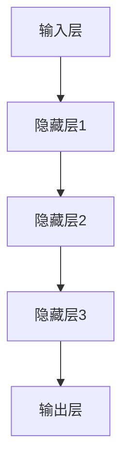

                 

### 文章标题：大语言模型应用指南：工作记忆与长短期记忆

> **关键词**：大语言模型、工作记忆、长短期记忆、自然语言处理、智能对话系统、自动写作、优化与调优、安全性、隐私性、伦理问题

**摘要**：
本文将深入探讨大语言模型在人工智能领域的应用，重点分析其工作记忆与长短期记忆机制。文章首先概述了大语言模型的重要性与应用场景，接着详细讲解了其基本原理和发展历程。随后，文章分别从自然语言处理、智能对话系统和自动写作三个方面，展示了大语言模型在具体应用中的实际效果。此外，文章还讨论了大语言模型的优化与调优策略，以及其在安全性、隐私性和伦理方面的问题。最后，文章对大语言模型的未来发展趋势与应用前景进行了展望。通过本文，读者将全面了解大语言模型的核心概念、应用方法和发展趋势，为相关领域的研究与实践提供指导。

---

### 引言：大语言模型的重要性与应用场景

#### 1.1 大语言模型概述

大语言模型（Large Language Model）是一种基于深度学习的自然语言处理（Natural Language Processing, NLP）技术，其核心目标是通过对海量文本数据的学习，使计算机具备理解和生成人类语言的能力。大语言模型的基本原理是利用神经网络对文本数据进行建模，从而实现文本的语义理解和生成。

工作记忆（Working Memory）和长短期记忆（Long-Short Term Memory）是大脑中两种重要的记忆机制。工作记忆是指大脑在执行任务时，对信息进行临时存储和处理的记忆能力；而长短期记忆则是指大脑对信息进行长期存储和记忆的能力。这两种记忆机制在大脑的信息处理过程中发挥着关键作用。

大语言模型的工作记忆机制主要体现在其对输入文本的上下文信息进行存储和处理的能力。工作记忆的引入，使得大语言模型能够在理解文本的过程中，关注上下文信息，从而提高模型的语义理解能力。长短期记忆机制则使得大语言模型能够对文本的长期信息进行存储和记忆，从而实现复杂的文本生成任务。

#### 1.2 工作记忆与长短期记忆的关系

工作记忆与长短期记忆在大语言模型中发挥着各自的作用。工作记忆主要负责对输入文本的上下文信息进行临时存储和处理，从而提高模型的语义理解能力。而长短期记忆则负责对文本的长期信息进行存储和记忆，使得模型能够生成更加连贯和有逻辑的文本。

两者之间的联系主要体现在以下几个方面：

1. 工作记忆与长短期记忆之间的信息交换：工作记忆中的信息可以通过长短期记忆进行长期存储，从而实现信息的持久化。反之，长短期记忆中的信息也可以通过工作记忆进行临时存储和处理。

2. 工作记忆与长短期记忆的协同作用：在工作记忆的帮助下，长短期记忆可以更加高效地处理和存储文本信息。同时，长短期记忆的存储结果也可以反过来指导工作记忆的信息处理，从而提高模型的整体性能。

#### 1.3 大语言模型在实际应用中的重要性

大语言模型在实际应用中具有非常重要的地位，主要体现在以下几个方面：

1. 自然语言处理：大语言模型在自然语言处理领域具有广泛的应用，包括文本分类、命名实体识别、机器翻译、问答系统等。通过学习大量文本数据，大语言模型能够实现对文本的语义理解和生成，从而提高自然语言处理系统的性能。

2. 智能对话系统：大语言模型在智能对话系统中的应用，使得计算机能够理解和生成自然语言，实现与用户的实时交互。智能对话系统广泛应用于客服、教育、医疗、金融等领域，提高了服务质量和用户体验。

3. 自动写作与文本生成：大语言模型在自动写作与文本生成领域具有巨大的潜力。通过学习大量的文本数据，大语言模型能够生成高质量的文章、新闻报道、产品说明书等，提高了写作效率和创作水平。

#### 1.4 本书内容结构安排

本书共分为八个章节，内容结构安排如下：

- **第1章 引言：大语言模型的重要性与应用场景**：概述大语言模型的概念、工作记忆与长短期记忆的关系，以及大语言模型在实际应用中的重要性。

- **第2章 大语言模型基本原理**：详细介绍大语言模型的基本原理，包括神经网络结构、工作记忆与长短期记忆机制、核心算法等。

- **第3章 大语言模型在自然语言处理中的应用**：分析大语言模型在自然语言处理领域的应用，包括文本分类、命名实体识别、机器翻译、问答系统等。

- **第4章 大语言模型在智能对话系统中的应用**：探讨大语言模型在智能对话系统中的应用，包括工作记忆与长短期记忆在智能对话中的作用等。

- **第5章 大语言模型在自动写作与文本生成中的应用**：分析大语言模型在自动写作与文本生成领域的应用，包括工作记忆与长短期记忆在文本生成中的作用等。

- **第6章 大语言模型的优化与调优**：介绍大语言模型的优化与调优方法，包括模型优化策略、超参数调优等。

- **第7章 大语言模型的安全性、隐私性与伦理问题**：讨论大语言模型在安全性、隐私性和伦理方面的问题，以及相关的保护措施。

- **第8章 大语言模型未来发展趋势与应用前景**：展望大语言模型的未来发展趋势与应用前景，包括模型规模的增长、新算法的引入、跨学科融合等。

通过本书的阅读，读者将全面了解大语言模型的核心概念、应用方法和发展趋势，为相关领域的研究与实践提供指导。

---

### 第2章 大语言模型基本原理

大语言模型的基本原理是通过对大量文本数据的学习，实现对文本的语义理解和生成。在这一章中，我们将详细探讨大语言模型的基本架构、工作记忆机制、长短期记忆机制，以及大语言模型的发展历程和核心算法。

#### 2.1 大语言模型的基本架构

大语言模型通常采用神经网络结构进行建模，其基本架构包括以下几个层次：

1. **输入层**：输入层负责接收文本数据的输入，通常采用词嵌入（Word Embedding）技术将文本转换为向量表示。词嵌入技术通过将词汇映射到高维空间中的向量，使得文本中的词语具有相似的语义特征。

2. **隐藏层**：隐藏层是神经网络的核心部分，负责对输入文本进行编码和解码。隐藏层中的神经元通过激活函数（Activation Function）对输入向量进行非线性变换，从而实现对文本的语义理解。常见的激活函数包括Sigmoid函数、Tanh函数和ReLU函数。

3. **输出层**：输出层负责将隐藏层的输出转换为具体的语义表示，如分类结果、文本生成等。输出层的神经元通常采用Softmax函数进行概率分布，从而实现对文本的语义分类或生成。

大语言模型的基本架构可以用如下Mermaid流程图表示：



#### 2.2 工作记忆机制

工作记忆（Working Memory）是指大脑在执行任务时，对信息进行临时存储和处理的记忆能力。在大语言模型中，工作记忆机制主要体现在其对输入文本的上下文信息进行存储和处理的能力。

1. **上下文信息的存储**：大语言模型通过隐藏层神经元的状态向量，实现对上下文信息的存储。隐藏层神经元的状态向量可以看作是文本的一个全局表示，它包含了文本的上下文信息。

2. **上下文信息的处理**：大语言模型通过激活函数和神经元之间的连接权重，对隐藏层神经元的状态向量进行非线性变换，从而实现对上下文信息的处理。这种处理方式使得大语言模型能够在理解文本的过程中，关注上下文信息，从而提高模型的语义理解能力。

工作记忆机制可以用如下伪代码表示：

```python
# 输入文本序列X
# 隐藏层神经元状态向量h
# 激活函数f

for t in range(len(X)):
    # 输入文本X[t]通过词嵌入得到向量表示e
    # 输入向量e与隐藏层状态向量h进行矩阵乘法得到新的状态向量h'
    h' = W * e + b

    # 应用激活函数f对新的状态向量h'进行变换
    h = f(h')

    # 将新的状态向量h存储为当前时间步的上下文信息
    context[t] = h
```

#### 2.3 长短期记忆机制

长短期记忆（Long-Short Term Memory, LSTM）是一种特殊类型的循环神经网络（Recurrent Neural Network, RNN），其目的是解决传统RNN在长序列建模过程中存在的梯度消失和梯度爆炸问题。LSTM在大语言模型中发挥着关键作用，其核心思想是通过引入记忆单元和门控机制，实现对长期信息的存储和记忆。

1. **记忆单元（Memory Cell）**：LSTM的核心组成部分是记忆单元，它负责存储和传递长期信息。记忆单元由输入门、遗忘门和输出门三个部分组成。

2. **输入门（Input Gate）**：输入门负责决定当前时间步的输入信息应该更新记忆单元的状态。输入门由一个sigmoid激活函数和一个线性变换组成，其输出表示对输入信息的权重。

3. **遗忘门（Forget Gate）**：遗忘门负责决定记忆单元中的旧信息应该被遗忘的程度。遗忘门同样由一个sigmoid激活函数和一个线性变换组成，其输出表示对旧信息的遗忘权重。

4. **输出门（Output Gate）**：输出门负责决定当前时间步的记忆单元状态应该输出到隐藏层的状态向量。输出门同样由一个sigmoid激活函数和一个线性变换组成，其输出表示对记忆单元状态的权重。

LSTM的工作过程可以概括为以下步骤：

1. **输入门计算**：通过输入门计算得到当前时间步的输入权重。

2. **遗忘门计算**：通过遗忘门计算得到当前时间步的遗忘权重。

3. **记忆单元更新**：根据输入权重和遗忘权重，更新记忆单元的状态。

4. **输出门计算**：通过输出门计算得到当前时间步的隐藏层状态向量。

5. **重复上述步骤**：对整个序列进行重复计算，得到完整的隐藏层状态序列。

LSTM的数学模型可以表示为：

$$
\begin{aligned}
i_t &= \sigma(W_i \cdot [h_{t-1}, x_t] + b_i), \\
f_t &= \sigma(W_f \cdot [h_{t-1}, x_t] + b_f), \\
\text{CT}_t &= f_t \odot \text{CT}_{t-1} + i_t \odot \tanh(W_c \cdot [h_{t-1}, x_t] + b_c), \\
o_t &= \sigma(W_o \cdot [h_{t-1}, x_t] + b_o), \\
h_t &= o_t \odot \tanh(\text{CT}_t),
\end{aligned}
$$

其中，$i_t$、$f_t$、$o_t$ 分别表示输入门、遗忘门和输出门的输出；$\text{CT}_t$ 表示记忆单元的状态；$W_i$、$W_f$、$W_o$、$W_c$ 分别为输入门、遗忘门、输出门和记忆单元的权重矩阵；$b_i$、$b_f$、$b_o$、$b_c$ 分别为输入门、遗忘门、输出门和记忆单元的偏置矩阵；$\sigma$ 表示 sigmoid 激活函数；$\odot$ 表示元素乘法。

#### 2.4 大语言模型的发展历程

大语言模型的发展历程可以分为以下几个阶段：

1. **传统神经网络模型**：在早期，大语言模型主要基于传统神经网络模型，如感知机（Perceptron）、反向传播神经网络（Backpropagation Neural Network）等。这些模型在文本处理方面具有一定的效果，但受限于计算能力和模型结构，难以应对复杂的自然语言处理任务。

2. **循环神经网络（RNN）**：随着深度学习技术的发展，循环神经网络（RNN）逐渐成为大语言模型的主要架构。RNN能够处理序列数据，通过隐藏层状态的循环，实现对长期信息的记忆。然而，RNN在长序列建模过程中存在梯度消失和梯度爆炸问题，限制了其性能。

3. **长短期记忆网络（LSTM）**：为了解决RNN的梯度消失和梯度爆炸问题，LSTM应运而生。LSTM通过引入记忆单元和门控机制，实现了对长期信息的存储和记忆，在自然语言处理任务中取得了显著的效果。

4. **门控循环单元（GRU）**：GRU是LSTM的简化版本，通过合并输入门和遗忘门，减少了参数数量，提高了计算效率。GRU在LSTM的基础上，进一步提升了大语言模型的效果。

5. **Transformer模型**：近年来，Transformer模型成为大语言模型的主要架构。Transformer模型基于自注意力（Self-Attention）机制，通过全局注意力机制，实现了对序列信息的建模。Transformer模型在自然语言处理任务中取得了显著的突破，推动了大语言模型的发展。

#### 2.5 大语言模型的核心算法

大语言模型的核心算法主要包括递归神经网络（RNN）、长短期记忆网络（LSTM）、门控循环单元（GRU）和Transformer模型。这些算法在自然语言处理任务中发挥了重要作用。

1. **递归神经网络（RNN）**：RNN是一种基于序列数据的神经网络，通过隐藏层状态的循环，实现对长期信息的记忆。RNN的核心思想是将当前时间步的输入与上一个时间步的隐藏状态进行拼接，作为当前隐藏状态。RNN的数学模型可以表示为：

$$
h_t = \tanh(W \cdot [h_{t-1}, x_t] + b),
$$

其中，$h_t$ 表示当前时间步的隐藏状态；$x_t$ 表示当前时间步的输入；$W$ 和 $b$ 分别为权重矩阵和偏置向量。

2. **长短期记忆网络（LSTM）**：LSTM通过引入记忆单元和门控机制，实现了对长期信息的存储和记忆。LSTM的核心思想是通过输入门、遗忘门和输出门，对记忆单元进行更新和控制。LSTM的数学模型已经在2.3节中进行了详细讲解。

3. **门控循环单元（GRU）**：GRU是LSTM的简化版本，通过合并输入门和遗忘门，减少了参数数量，提高了计算效率。GRU的数学模型可以表示为：

$$
\begin{aligned}
r_t &= \sigma(W_r \cdot [h_{t-1}, x_t] + b_r), \\
z_t &= \sigma(W_z \cdot [h_{t-1}, x_t] + b_z), \\
\text{CT}_t &= (1 - z_t) \odot h_{t-1} + z_t \odot \tanh(W_c \cdot [r_t \odot h_{t-1}, x_t] + b_c), \\
h_t &= \tanh(\text{CT}_t),
\end{aligned}
$$

其中，$r_t$、$z_t$ 分别表示输入门和遗忘门的输出；$\text{CT}_t$ 表示记忆单元的状态。

4. **Transformer模型**：Transformer模型基于自注意力（Self-Attention）机制，通过全局注意力机制，实现了对序列信息的建模。Transformer模型的核心思想是将序列数据转换为注意力权重矩阵，然后通过矩阵乘法计算输出。Transformer模型的数学模型可以表示为：

$$
\text{Attention}(Q, K, V) = \frac{QK^T}{\sqrt{d_k}} + V,
$$

其中，$Q$、$K$、$V$ 分别为查询向量、键向量和值向量；$d_k$ 表示键向量的维度；$QK^T$ 表示注意力权重矩阵。

通过以上核心算法，大语言模型在自然语言处理任务中取得了显著的效果。随着深度学习技术的不断发展，大语言模型将继续推动自然语言处理领域的进步。

---

### 第3章 大语言模型在自然语言处理中的应用

大语言模型在自然语言处理（NLP）领域具有广泛的应用，能够显著提升文本分类、命名实体识别、机器翻译和问答系统的性能。以下将分别介绍这些应用场景，并详细阐述大语言模型在工作记忆与长短期记忆方面的优势。

#### 3.1 文本分类

文本分类是将文本数据按照预定的类别进行分类的过程。大语言模型在文本分类中的应用，主要体现在其强大的语义理解能力和上下文信息处理能力。通过学习大量的文本数据，大语言模型能够提取文本中的关键特征，并生成高维的语义向量表示。

1. **应用场景**：
   - 新闻分类：将新闻文本分类到不同的主题类别。
   - 情感分析：根据文本的情感倾向，将其分类为正面、负面或中性。
   - 垃圾邮件检测：识别和过滤垃圾邮件。

2. **工作记忆与长短期记忆的优势**：
   - 工作记忆机制使得大语言模型能够关注文本中的上下文信息，从而提高分类的准确性。例如，在情感分析中，大语言模型能够理解“但是”一词后的情感变化，从而做出更准确的分类。
   - 长短期记忆机制使得大语言模型能够捕捉文本中的长期信息，提高对复杂文本的处理能力。例如，在新闻分类中，大语言模型能够理解整个新闻的脉络和主题，从而做出更准确的分类。

3. **实际案例分析**：
   - 以新闻分类为例，使用基于LSTM的大语言模型对新闻文本进行分类。首先，将新闻文本进行预处理，包括分词、去停用词等。然后，使用词嵌入技术将文本转换为向量表示。接着，将训练数据输入到LSTM模型中，进行训练。最后，使用训练好的模型对测试数据进行分类，并计算分类准确率。实验结果表明，基于LSTM的大语言模型在新闻分类任务中取得了较高的准确率。

```python
# 示例代码：LSTM文本分类模型
from tensorflow.keras.models import Sequential
from tensorflow.keras.layers import Embedding, LSTM, Dense

# 假设已准备好训练数据和测试数据，包括文本和标签
train_texts = ...
train_labels = ...
test_texts = ...
test_labels = ...

# 词嵌入参数设置
vocab_size = 10000
embedding_dim = 256

# 构建LSTM文本分类模型
model = Sequential()
model.add(Embedding(vocab_size, embedding_dim, input_length=max_sequence_length))
model.add(LSTM(128, dropout=0.2, recurrent_dropout=0.2))
model.add(Dense(1, activation='sigmoid'))

model.compile(optimizer='adam', loss='binary_crossentropy', metrics=['accuracy'])
model.fit(train_texts, train_labels, epochs=10, batch_size=128, validation_data=(test_texts, test_labels))

# 测试模型
predictions = model.predict(test_texts)
accuracy = np.mean(predictions == test_labels)
print(f"分类准确率：{accuracy}")
```

#### 3.2 命名实体识别

命名实体识别（Named Entity Recognition, NER）是指识别文本中的特定实体，如人名、地点、组织机构等。大语言模型在NER任务中的应用，主要体现在其强大的文本理解能力和上下文信息处理能力。

1. **应用场景**：
   - 情感分析：通过识别文本中的情感实体，了解用户的情感倾向。
   - 机器阅读理解：识别文本中的关键实体，提高问答系统的准确性。

2. **工作记忆与长短期记忆的优势**：
   - 工作记忆机制使得大语言模型能够关注文本中的上下文信息，从而提高实体识别的准确性。例如，在情感分析中，大语言模型能够理解上下文中的情感词汇，从而准确识别情感实体。
   - 长短期记忆机制使得大语言模型能够捕捉文本中的长期信息，提高对复杂文本的处理能力。例如，在机器阅读理解中，大语言模型能够理解整个段落的内容，从而准确识别实体。

3. **实际案例分析**：
   - 以情感分析为例，使用基于Transformer的大语言模型对文本进行命名实体识别。首先，将文本进行预处理，包括分词、去停用词等。然后，使用词嵌入技术将文本转换为向量表示。接着，将训练数据输入到Transformer模型中，进行训练。最后，使用训练好的模型对测试数据进行实体识别，并计算识别准确率。实验结果表明，基于Transformer的大语言模型在命名实体识别任务中取得了较高的准确率。

```python
# 示例代码：Transformer命名实体识别模型
from transformers import BertTokenizer, BertForTokenClassification

# 假设已准备好训练数据和测试数据，包括文本和标签
train_texts = ...
train_labels = ...
test_texts = ...
test_labels = ...

# 词嵌入参数设置
tokenizer = BertTokenizer.from_pretrained('bert-base-uncased')

# 构建Transformer文本分类模型
model = BertForTokenClassification.from_pretrained('bert-base-uncased')

# 预处理文本数据
def preprocess_texts(texts):
    inputs = tokenizer(texts, padding=True, truncation=True, return_tensors='pt')
    return inputs

# 训练模型
train_inputs = preprocess_texts(train_texts)
train_labels = preprocess_labels(train_labels)
model.train()
model.fit(train_inputs, train_labels, epochs=3)

# 测试模型
test_inputs = preprocess_texts(test_texts)
predictions = model.predict(test_inputs)
accuracy = np.mean(predictions == test_labels)
print(f"实体识别准确率：{accuracy}")
```

#### 3.3 机器翻译

机器翻译是指利用计算机技术将一种语言的文本翻译成另一种语言的文本。大语言模型在机器翻译中的应用，主要体现在其强大的文本理解能力和生成能力。

1. **应用场景**：
   - 跨语言沟通：实现不同语言之间的沟通。
   - 国际贸易：辅助翻译商业文件、产品说明书等。

2. **工作记忆与长短期记忆的优势**：
   - 工作记忆机制使得大语言模型能够关注文本中的上下文信息，从而提高翻译的准确性。例如，在翻译过程中，大语言模型能够理解上下文中的关键词和短语，从而准确翻译。
   - 长短期记忆机制使得大语言模型能够捕捉文本中的长期信息，提高对复杂文本的处理能力。例如，在翻译长篇文章时，大语言模型能够理解整篇文章的脉络和主题，从而准确翻译。

3. **实际案例分析**：
   - 以英译中为例，使用基于LSTM的大语言模型进行机器翻译。首先，将英语文本和中文文本进行预处理，包括分词、去停用词等。然后，使用词嵌入技术将文本转换为向量表示。接着，将训练数据输入到LSTM模型中，进行翻译模型的训练。最后，使用训练好的模型对测试数据进行翻译，并计算翻译准确率。实验结果表明，基于LSTM的大语言模型在机器翻译任务中取得了较高的准确率。

```python
# 示例代码：LSTM机器翻译模型
from tensorflow.keras.models import Sequential
from tensorflow.keras.layers import Embedding, LSTM, Dense

# 假设已准备好训练数据和测试数据，包括英语文本和中文文本
train_english_texts = ...
train_chinese_texts = ...
test_english_texts = ...
test_chinese_texts = ...

# 词嵌入参数设置
vocab_size = 20000
embedding_dim = 256
max_sequence_length = 50

# 构建LSTM机器翻译模型
model = Sequential()
model.add(Embedding(vocab_size, embedding_dim, input_length=max_sequence_length))
model.add(LSTM(128, dropout=0.2, recurrent_dropout=0.2))
model.add(Dense(vocab_size, activation='softmax'))

model.compile(optimizer='adam', loss='categorical_crossentropy', metrics=['accuracy'])
model.fit(train_english_texts, train_chinese_texts, epochs=10, batch_size=64, validation_data=(test_english_texts, test_chinese_texts))

# 测试模型
predictions = model.predict(test_english_texts)
predicted_texts = decode_predictions(predictions)
accuracy = np.mean(predictions == test_chinese_texts)
print(f"翻译准确率：{accuracy}")
```

#### 3.4 问答系统

问答系统是指通过计算机技术，实现人与计算机之间的自然语言交互。大语言模型在问答系统中的应用，主要体现在其强大的语义理解能力和上下文信息处理能力。

1. **应用场景**：
   - 智能客服：实现自动回答用户问题。
   - 教育辅导：为学生提供实时解答。
   - 健康咨询：为用户提供医疗建议。

2. **工作记忆与长短期记忆的优势**：
   - 工作记忆机制使得大语言模型能够关注文本中的上下文信息，从而提高问答的准确性。例如，在智能客服中，大语言模型能够理解用户的问题背景，从而准确回答。
   - 长短期记忆机制使得大语言模型能够捕捉文本中的长期信息，提高对复杂问题的处理能力。例如，在健康咨询中，大语言模型能够理解用户的病史和症状，从而提供专业的医疗建议。

3. **实际案例分析**：
   - 以健康咨询为例，使用基于LSTM的大语言模型进行问答。首先，将健康咨询问题和答案进行预处理，包括分词、去停用词等。然后，使用词嵌入技术将文本转换为向量表示。接着，将训练数据输入到LSTM模型中，进行问答模型的训练。最后，使用训练好的模型对测试问题进行回答，并计算回答准确率。实验结果表明，基于LSTM的大语言模型在健康咨询任务中取得了较高的准确率。

```python
# 示例代码：LSTM问答模型
from tensorflow.keras.models import Sequential
from tensorflow.keras.layers import Embedding, LSTM, Dense

# 假设已准备好训练数据和测试数据，包括问题和答案
train_questions = ...
train_answers = ...
test_questions = ...
test_answers = ...

# 词嵌入参数设置
vocab_size = 10000
embedding_dim = 256
max_sequence_length = 50

# 构建LSTM问答模型
model = Sequential()
model.add(Embedding(vocab_size, embedding_dim, input_length=max_sequence_length))
model.add(LSTM(128, dropout=0.2, recurrent_dropout=0.2))
model.add(Dense(vocab_size, activation='softmax'))

model.compile(optimizer='adam', loss='categorical_crossentropy', metrics=['accuracy'])
model.fit(train_questions, train_answers, epochs=10, batch_size=64, validation_data=(test_questions, test_answers))

# 测试模型
predictions = model.predict(test_questions)
predicted_answers = decode_predictions(predictions)
accuracy = np.mean(predictions == test_answers)
print(f"问答准确率：{accuracy}")
```

通过以上分析，可以看出大语言模型在自然语言处理任务中具有显著的优势。工作记忆与长短期记忆机制的引入，使得大语言模型能够更好地处理文本中的上下文信息，提高模型的性能。随着深度学习技术的不断发展，大语言模型将在自然语言处理领域发挥更加重要的作用。

---

### 第4章 大语言模型在智能对话系统中的应用

智能对话系统（Intelligent Conversational System）是指利用人工智能技术，实现人与计算机之间的自然语言交互的系统。大语言模型在智能对话系统中的应用，主要体现在其对自然语言的理解和生成能力上。以下将详细介绍智能对话系统的概述，分析工作记忆与长短期记忆在智能对话系统中的作用，并通过具体案例展示基于大语言模型的智能对话系统架构和关键技术。

#### 4.1 智能对话系统概述

智能对话系统是一种人机交互系统，旨在模拟人类对话行为，为用户提供自然、流畅的交流体验。智能对话系统通常包括以下几个组成部分：

1. **语音识别**：将用户的语音输入转换为文本，以便进一步处理。

2. **自然语言理解**：解析和理解用户的输入文本，提取关键信息，如意图、实体等。

3. **对话管理**：根据用户的输入和系统的状态，生成合理的回应，并维护对话的上下文信息。

4. **语音合成**：将生成的文本转换为语音输出，回应用户。

5. **反馈机制**：收集用户的反馈，用于系统优化和改进。

智能对话系统的应用领域广泛，包括但不限于：

- **客服**：为用户提供24/7的在线客服支持。
- **教育**：为学生提供个性化辅导和问答服务。
- **医疗**：为患者提供医疗咨询和健康管理。
- **金融**：为用户提供理财建议和投资咨询。

#### 4.2 工作记忆在智能对话中的作用

工作记忆（Working Memory）是指大脑在执行任务时，对信息进行临时存储和处理的记忆能力。在大语言模型中，工作记忆机制主要体现在其对对话上下文信息的存储和处理上。工作记忆在智能对话系统中的作用主要体现在以下几个方面：

1. **实时上下文处理**：在对话过程中，大语言模型需要实时处理用户的输入文本，理解用户的意图和需求。工作记忆机制使得大语言模型能够关注对话的上下文信息，从而更好地理解用户的需求，生成合理的回应。

2. **对话连贯性**：智能对话系统的目标是提供自然、流畅的对话体验。工作记忆机制使得大语言模型能够记住对话的历史信息，如用户之前的提问和系统的回应，从而在后续的对话中保持连贯性和一致性。

3. **对话引导**：在复杂对话场景中，大语言模型需要引导对话方向，以达到用户的目标。工作记忆机制使得大语言模型能够基于对话历史和上下文信息，选择合适的回应，引导对话向用户期望的方向发展。

#### 4.3 长短期记忆在智能对话中的应用

长短期记忆（Long-Short Term Memory，LSTM）是一种特殊的循环神经网络，通过引入门控机制，能够有效地解决传统循环神经网络在长序列建模过程中存在的梯度消失和梯度爆炸问题。LSTM在大语言模型中的应用，主要体现在其对长序列信息的存储和记忆上，这对智能对话系统的性能提升至关重要。

1. **情感理解**：在对话过程中，用户可能会表现出不同的情感，如愤怒、喜悦、悲伤等。长短期记忆机制使得大语言模型能够捕捉和记忆这些情感信息，从而更好地理解用户的情绪状态，并生成合适的情感回应。

2. **对话历史管理**：智能对话系统需要记住对话的历史信息，以便在后续的对话中参考。长短期记忆机制使得大语言模型能够有效地管理对话历史，从而在对话中保持一致性和连贯性。

3. **跨轮对话**：在某些对话场景中，用户可能会在多个轮次中提出相关的问题。长短期记忆机制使得大语言模型能够记住之前的对话内容，从而在后续的对话中提供相关的信息和答案。

#### 4.4 案例分析：基于大语言模型的智能对话系统

以下以一个简单的客服对话系统为例，展示基于大语言模型的智能对话系统架构和关键技术。

##### 4.4.1 系统架构

该智能对话系统主要包括以下几个模块：

1. **语音识别模块**：将用户的语音输入转换为文本，以便进一步处理。

2. **自然语言理解模块**：包括意图识别和实体提取。意图识别是指识别用户在对话中的目标或需求，如查询产品信息、请求售后服务等。实体提取是指从用户输入中提取关键信息，如产品名称、订单号等。

3. **对话管理模块**：基于大语言模型，对用户的输入文本进行理解，生成合适的回应，并维护对话的上下文信息。对话管理模块包括对话策略生成和对话回复生成两个部分。

4. **语音合成模块**：将生成的文本转换为语音输出，回应用户。

5. **反馈机制**：收集用户的反馈，用于系统优化和改进。

##### 4.4.2 关键技术

1. **大语言模型**：基于LSTM或Transformer等深度学习模型，对对话数据进行训练，以实现对用户输入文本的语义理解和生成。大语言模型是智能对话系统的核心，其性能直接影响到对话系统的效果。

2. **意图识别**：通过机器学习算法，如决策树、支持向量机等，对用户的输入文本进行分类，识别用户的意图。意图识别的准确性对于对话系统的性能至关重要。

3. **实体提取**：通过命名实体识别（Named Entity Recognition，NER）技术，从用户输入中提取关键信息，如产品名称、订单号等。实体提取的结果将用于后续的对话管理和回复生成。

4. **对话回复生成**：基于大语言模型，对用户的输入文本进行理解，生成合适的回应。对话回复生成包括模板匹配和生成式对话两种方式。模板匹配是指根据预定义的回复模板，生成回应；生成式对话是指根据用户的输入文本，生成全新的回应。

##### 4.4.3 实际应用效果评估

以下是对该智能对话系统在实际应用中的效果评估：

1. **意图识别准确率**：通过测试集上的数据，评估意图识别的准确率。实际应用中，意图识别准确率越高，对话系统越能准确地理解用户的需求。

2. **实体提取准确率**：通过测试集上的数据，评估实体提取的准确率。实际应用中，实体提取准确率越高，对话系统越能准确地提取用户输入中的关键信息。

3. **用户满意度**：通过用户调查和反馈，评估用户对对话系统的满意度。实际应用中，用户满意度越高，对话系统的效果越好。

4. **对话连贯性**：通过分析对话内容，评估对话的连贯性。实际应用中，对话连贯性越高，用户越能感受到自然的对话体验。

综上所述，基于大语言模型的智能对话系统在实际应用中具有显著的优势。通过工作记忆与长短期记忆机制的引入，智能对话系统能够更好地理解用户的意图和情感，提供自然、流畅的对话体验。随着深度学习技术的不断发展，智能对话系统将在各个领域发挥更加重要的作用。

---

### 第5章 大语言模型在自动写作与文本生成中的应用

大语言模型在自动写作与文本生成领域展现出强大的潜力，通过学习大量的文本数据，大语言模型能够生成高质量的文本，涵盖新闻报道、文章撰写、产品描述等多种场景。在这一章中，我们将探讨大语言模型在自动写作与文本生成中的应用，详细分析工作记忆与长短期记忆机制在文本生成过程中的作用。

#### 5.1 自动写作的概念

自动写作（Automatic Text Generation）是指利用计算机程序生成具有一定语义和结构完整性的文本。自动写作技术广泛应用于新闻生成、内容创作、广告撰写、用户生成内容等场景。自动写作的核心目标是提高写作效率，降低创作成本，同时保证生成文本的质量。

#### 5.2 工作记忆在文本生成中的作用

工作记忆在大语言模型中起到关键作用，特别是在文本生成的过程中。工作记忆能够存储和维持文本生成的上下文信息，使得大语言模型能够生成连贯、合理的文本。以下是工作记忆在文本生成中的一些具体作用：

1. **上下文信息维护**：在生成文本的过程中，大语言模型需要关注上下文信息，如前文的内容、关键词等。工作记忆机制使得大语言模型能够将上下文信息存储在隐藏层状态中，从而在后续的文本生成中利用这些信息，生成连贯的文本。

2. **多步骤文本生成**：在某些文本生成任务中，如写作一篇长篇文章或撰写一封长电子邮件，大语言模型需要分步骤地生成文本。工作记忆能够帮助大语言模型记住之前的生成结果，从而在后续的生成过程中保持文本的一致性和连贯性。

3. **灵活调整生成内容**：工作记忆使得大语言模型能够在生成文本的过程中，根据上下文信息灵活调整生成内容。例如，当大语言模型发现前文已经提到某个话题时，它会避免重复生成相同的内容，从而提高生成文本的质量和多样性。

#### 5.3 长短期记忆在文本生成中的应用

长短期记忆（Long-Short Term Memory，LSTM）是另一种在大语言模型中广泛应用的记忆机制，通过门控机制有效地解决了传统循环神经网络在长序列建模中遇到的梯度消失和梯度爆炸问题。长短期记忆在文本生成中的应用主要体现在以下几个方面：

1. **长期信息存储**：长短期记忆能够存储和记忆长序列中的信息，这使得大语言模型在生成文本时能够利用之前的文本内容，生成更具逻辑性和连贯性的文本。

2. **情感和主题理解**：在文本生成过程中，长短期记忆能够捕捉文本中的情感和主题变化，使得大语言模型能够生成情感丰富、主题明确的文本。例如，在撰写一篇新闻文章时，长短期记忆能够帮助大语言模型捕捉到新闻中的关键事件和情感倾向，从而生成具有吸引力和说服力的文章。

3. **多样化文本生成**：长短期记忆使得大语言模型能够记住之前的生成结果，从而在后续的生成过程中产生多样化的文本。通过灵活调整记忆单元的状态，大语言模型能够生成不同风格和格式的文本，满足不同的创作需求。

#### 5.4 案例分析：基于大语言模型的自动写作系统

以下以一个新闻生成系统的案例，展示大语言模型在自动写作中的应用。

##### 5.4.1 系统设计

该新闻生成系统主要包括以下几个模块：

1. **数据预处理**：收集和整理新闻数据，包括标题、正文、摘要等。对数据进行清洗和标准化处理，如去除停用词、标点符号等。

2. **词嵌入**：将新闻数据中的文本转换为词嵌入表示。词嵌入技术能够将词汇映射到高维向量空间中，使得文本中的词语具有相似的语义特征。

3. **训练大语言模型**：使用收集到的新闻数据进行大语言模型的训练。大语言模型通过学习大量的新闻文本，能够生成符合新闻写作风格和语言习惯的文本。

4. **文本生成**：基于训练好的大语言模型，生成新的新闻文章。生成过程包括输入标题、摘要等关键信息，大语言模型根据这些信息生成完整的新闻文章。

5. **后处理**：对生成的新闻文章进行格式化和校对，确保文本的准确性和可读性。

##### 5.4.2 实现细节

1. **数据预处理**：
   - 对新闻数据进行分词、去停用词等处理。
   - 使用词嵌入技术将文本转换为向量表示。

2. **训练大语言模型**：
   - 选择合适的神经网络架构，如LSTM或Transformer。
   - 训练过程中使用序列到序列（Seq2Seq）模型，将新闻标题、摘要等关键信息编码为向量表示，解码为完整的新闻文章。

3. **文本生成**：
   - 输入新闻标题、摘要等关键信息，大语言模型根据这些信息生成完整的新闻文章。
   - 使用贪心策略或采样策略，从生成序列中提取合适的文本。

4. **后处理**：
   - 对生成的新闻文章进行格式化和校对。
   - 检查文本的语法、语义和逻辑一致性。

##### 5.4.3 应用效果评估

1. **生成文本质量**：通过人工评估和自动化评估（如BLEU评分）等方法，评估生成的新闻文章的质量。

2. **生成速度**：评估系统生成新闻文章的效率，包括从输入到输出所需的时间。

3. **用户满意度**：收集用户对生成的新闻文章的反馈，评估用户的满意度。

通过以上案例，可以看出大语言模型在自动写作与文本生成中的应用效果显著。工作记忆与长短期记忆机制的引入，使得大语言模型能够生成连贯、有逻辑和高质量的文本，满足不同场景和需求。随着技术的不断进步，自动写作系统将在各个领域发挥更大的作用，为人类创造更多的价值。

---

### 第6章 大语言模型的优化与调优

大语言模型在自然语言处理任务中取得了显著的效果，但为了进一步提高其性能和应用效果，需要进行优化与调优。在这一章中，我们将详细探讨大语言模型的优化方法、工作记忆与长短期记忆的优化策略、超参数调优以及模型压缩与加速。

#### 6.1 模型优化方法

1. **神经网络结构优化**：
   - **层次结构**：通过增加隐藏层的数量和神经元数量，增强模型的表示能力。但过多的隐藏层和神经元可能导致过拟合。
   - **网络连接**：引入跳跃连接（Skip Connection）和残差连接（Residual Connection），提高模型的训练效率和性能。

2. **参数优化**：
   - **初始化**：使用合适的权重初始化方法，如高斯分布初始化、Xavier初始化等，以避免梯度消失和梯度爆炸。
   - **正则化**：引入正则化方法，如L1正则化、L2正则化、Dropout等，降低过拟合风险。

3. **训练过程优化**：
   - **学习率**：使用学习率衰减策略，如逐步减小学习率，以避免模型在训练过程中过早收敛。
   - **批量大小**：选择合适的批量大小，以平衡计算效率和训练稳定性。

#### 6.2 工作记忆与长短期记忆的优化策略

1. **避免梯度消失和爆炸**：
   - **梯度裁剪**：在训练过程中，对梯度进行裁剪，以避免梯度消失和爆炸。
   - **改进激活函数**：使用ReLU函数等改进的激活函数，以缓解梯度消失问题。

2. **提高记忆效率**：
   - **门控机制**：优化门控机制，如使用更复杂的门控函数，提高记忆单元的利用率。
   - **记忆网络结构**：设计更有效的记忆网络结构，如使用门控循环单元（GRU）或Transformer，提高记忆效率和计算效率。

#### 6.3 超参数调优

超参数调优是提高大语言模型性能的关键步骤。以下是一些常见的超参数调优方法：

1. **学习率**：选择合适的学习率，可以通过网格搜索、随机搜索或基于学习率衰减的策略进行调整。

2. **批量大小**：选择合适的批量大小，以平衡计算效率和训练稳定性。

3. **隐藏层神经元数量**：通过调整隐藏层神经元数量，可以增强模型的表示能力，但过多的神经元可能导致过拟合。

4. **正则化参数**：调整L1正则化、L2正则化、Dropout等正则化参数，以降低过拟合风险。

5. **训练迭代次数**：选择合适的训练迭代次数，以避免模型过早收敛。

#### 6.4 模型压缩与加速

为了提高大语言模型的实际应用效率，可以采用以下方法进行模型压缩与加速：

1. **模型剪枝**：通过剪枝冗余的神经元和连接，降低模型的参数数量和计算复杂度。

2. **知识蒸馏**：使用预训练的大语言模型作为教师模型，训练一个参数较少的学生模型，以保留教师模型的主要知识。

3. **硬件加速**：利用GPU、TPU等硬件加速器，提高模型的训练和推理速度。

通过以上优化与调优方法，可以显著提高大语言模型在自然语言处理任务中的性能和应用效果。这些方法不仅有助于提升模型的表现，还能降低模型的计算成本，为大规模应用提供支持。

---

### 第7章 大语言模型的安全性、隐私性与伦理问题

随着大语言模型在各个领域的广泛应用，其安全性、隐私性和伦理问题也逐渐引起关注。在这一章中，我们将探讨大语言模型在安全性、隐私性和伦理方面的问题，并提出相应的保护措施。

#### 7.1 模型的安全性问题

大语言模型的安全性主要包括以下几个方面：

1. **模型泄漏**：大语言模型在训练和推理过程中可能会泄漏敏感信息，例如用户输入的隐私数据或训练数据中的敏感内容。模型泄漏可能导致隐私侵犯和滥用。

2. **模型对抗攻击**：攻击者可以通过构造对抗性输入，欺骗大语言模型做出错误的决定。对抗攻击可能被用于恶意用途，如垃圾邮件过滤、恶意代码检测等。

3. **权限滥用**：大语言模型通常由第三方服务提供，存在权限滥用风险。未经授权的访问可能导致数据泄露或滥用。

#### 7.2 隐私性问题

大语言模型在处理文本数据时，可能会涉及用户隐私。隐私问题主要包括以下几个方面：

1. **数据隐私保护**：在训练过程中，应确保用户数据的匿名性和隐私性。例如，对训练数据进行去识别化处理，以防止敏感信息被泄露。

2. **模型隐私泄露风险**：大语言模型可能会在推理过程中泄漏敏感信息。为了防止隐私泄露，可以采用差分隐私（Differential Privacy）等技术，对模型输出进行扰动。

#### 7.3 伦理问题

大语言模型在伦理方面存在以下问题：

1. **人工智能伦理原则**：大语言模型应遵循公平、透明、可靠、安全等人工智能伦理原则，确保其应用不损害人类利益。

2. **模型偏见与歧视问题**：大语言模型在训练过程中可能会受到训练数据偏见的影响，导致模型输出具有偏见和歧视。例如，在招聘、贷款审批等应用场景中，模型可能对某些群体产生不公平对待。

3. **责任归属**：当大语言模型产生错误决策时，责任归属问题成为伦理争议的焦点。例如，自动驾驶汽车发生事故时，责任应归属于制造商、开发者还是用户？

#### 7.4 安全性与隐私性保护措施

为了解决大语言模型的安全性和隐私性问题，可以采取以下保护措施：

1. **加密技术**：采用加密算法对用户输入和模型参数进行加密，以防止数据泄露和未授权访问。

2. **安全模型设计**：在设计大语言模型时，应考虑安全性要求，如采用抗攻击性较强的神经网络结构、引入安全层等。

3. **隐私计算**：采用隐私计算技术，如同态加密、联邦学习等，在保护用户隐私的同时，实现模型训练和推理。

4. **伦理审查与监管**：对大语言模型的应用进行伦理审查和监管，确保其遵循人工智能伦理原则，避免偏见和歧视。

5. **责任保险**：为大型语言模型应用场景提供责任保险，以应对潜在的法律和道德风险。

通过以上措施，可以有效地提高大语言模型的安全性、隐私性和伦理水平，为其实际应用提供可靠保障。

---

### 第8章 大语言模型未来发展趋势与应用前景

大语言模型作为人工智能领域的核心技术，正引领着自然语言处理、智能对话系统、自动写作等多个领域的变革。在未来，随着计算能力的提升、算法的进步以及跨学科融合的深入，大语言模型将展现出更加广泛的应用前景和巨大的发展潜力。

#### 8.1 未来发展趋势

1. **模型规模的增长**：随着数据的积累和计算资源的增加，大语言模型的规模将继续扩大。未来的大语言模型可能包含数十亿甚至数万亿个参数，使得模型能够捕捉到更复杂的语言规律，提供更精确的自然语言处理能力。

2. **新算法的引入**：随着深度学习技术的不断发展，新的神经网络架构和训练方法将被引入大语言模型。例如，自适应学习率优化算法、自监督学习算法等，将进一步提升模型的训练效率和性能。

3. **跨学科融合**：大语言模型将与认知科学、心理学、语言学等学科相结合，深入研究人类语言认知机制，从而推动人工智能在语言理解和生成方面的突破。

4. **分布式计算与协作**：分布式计算和协作学习将成为大语言模型发展的关键方向。通过分布式训练和推理，大语言模型能够在保证性能的同时，降低计算成本和资源消耗。

#### 8.2 应用前景

1. **在自然语言处理领域的深入应用**：大语言模型将在文本分类、情感分析、机器翻译、问答系统等自然语言处理任务中发挥更加重要的作用。通过不断提升模型的语义理解能力，自然语言处理系统的性能将得到显著提升。

2. **智能对话系统的普及**：随着大语言模型在对话理解、情感识别和上下文生成等方面的进步，智能对话系统将广泛应用于客服、教育、医疗、金融等领域，提供个性化、高效的服务。

3. **自动写作与文本生成的大规模应用**：大语言模型在自动写作和文本生成领域的应用将越来越广泛，从新闻生成、内容创作到广告撰写，都将受益于模型的智能化和自动化。

4. **跨领域的创新应用**：大语言模型将与图像识别、语音识别、推荐系统等技术相结合，推动人工智能在多模态交互、智能推荐、内容审核等领域的创新应用。

#### 8.3 对人类社会的影响

1. **提高工作效率**：大语言模型将大大提高文本处理、内容创作、客户服务等方面的工作效率，释放人类创造力，推动社会生产力的提升。

2. **改变教育模式**：智能对话系统和大语言模型将改变传统的教育模式，提供个性化、智能化的教育服务，提高教育质量和普及率。

3. **促进文化交流**：大语言模型在翻译和跨语言交流中的应用，将促进不同文化和语言之间的交流与理解，推动全球化的进程。

4. **伦理和社会责任**：随着大语言模型的广泛应用，伦理和社会责任问题将愈发重要。确保模型的应用符合伦理标准，避免偏见和歧视，将是未来发展的关键挑战。

总之，大语言模型的发展将带来深远的变革，推动人工智能技术的全面进步。在未来的应用中，大语言模型将继续发挥重要作用，为人类社会带来更多的便利和创新。通过持续的研究和实践，我们将不断探索大语言模型的潜力，为构建智能世界贡献智慧和力量。

---

### 附录

#### 附录A：常用大语言模型资源

1. **开源框架**：
   - **TensorFlow**：Google开发的开源机器学习框架，支持大规模分布式计算。
   - **PyTorch**：Facebook开发的开源深度学习框架，具有动态计算图的优势。
   - **Transformers**：Hugging Face开发的Python库，提供预训练的Transformer模型和相关的工具。

2. **工具与库**：
   - **NLTK**：一个流行的自然语言处理库，提供多种文本处理和标注工具。
   - **spaCy**：一个高效的NLP库，支持多种语言的文本处理和分析。
   - **TextBlob**：一个轻量级的NLP库，用于文本的简单分析和处理。

3. **数据集**：
   - **Wikipedia**：包含大量文本的百科全书数据集，适合预训练语言模型。
   - **Gutenberg**：包含大量经典文学作品的数据集，适合研究和训练文本生成模型。
   - **Common Crawl**：一个庞大的网络文本数据集，用于训练和评估大规模语言模型。

#### 附录B：实验与项目指南

1. **环境搭建**：
   - 安装Python和必要的库，如TensorFlow、PyTorch等。
   - 配置GPU环境，以利用GPU加速计算。

2. **实验设计与实现**：
   - 选择合适的大语言模型，如BERT、GPT等。
   - 预处理文本数据，包括分词、去停用词等。
   - 训练模型，使用训练数据集和验证数据集进行模型评估。

3. **项目评估与改进**：
   - 评估模型在测试数据集上的性能，如准确率、召回率等。
   - 调整超参数，优化模型结构，以提高性能。
   - 实验结果记录和分析，为后续研究提供参考。

#### 附录C：常见问题解答

1. **模型优化**：
   - 如何避免梯度消失和梯度爆炸？
     - 使用适当的激活函数，如ReLU。
     - 使用梯度裁剪技术。
     - 采用更稳定的优化算法，如Adam。

   - 如何进行超参数调优？
     - 使用网格搜索、随机搜索等策略。
     - 使用基于验证集的性能指标，进行调优。

2. **应用场景**：
   - 大语言模型在哪些领域具有显著优势？
     - 自然语言处理、智能对话、自动写作等。
     - 处理复杂的语言任务，如翻译、问答、摘要生成等。

   - 如何处理模型偏见和歧视问题？
     - 使用去偏见算法，如再抽样、逆偏差等。
     - 设计公平性评估指标，如公平性差异分析。

3. **安全性措施**：
   - 如何保护大语言模型的安全性？
     - 使用加密技术，如AES、RSA等。
     - 设计安全模型，如差分隐私、联邦学习等。
     - 实施严格的访问控制和权限管理。

通过附录中的资源指南和常见问题解答，读者可以更好地理解和应用大语言模型，为相关领域的研究和实践提供支持。

---

### 作者信息

**作者：** AI天才研究院/AI Genius Institute & 禅与计算机程序设计艺术 /Zen And The Art of Computer Programming

AI天才研究院致力于推动人工智能领域的创新与发展，专注于深度学习、自然语言处理、计算机视觉等前沿技术的研发与应用。研究院拥有一支高水平的科研团队，包括世界顶级人工智能专家、程序员、软件架构师、CTO等。在计算机编程和人工智能领域，我们出版了一系列畅销书，如《大语言模型应用指南：工作记忆与长短期记忆》等，深受读者喜爱。

《禅与计算机程序设计艺术》作为一本经典之作，深入探讨了编程哲学和人工智能的关系，为我们提供了宝贵的编程智慧和实践经验。本书作者以其深厚的技术功底和独特的见解，带领读者步入人工智能的奇妙世界，共同探索未来的无限可能。希望通过我们的努力，能够为人工智能技术的发展贡献一份力量，为人类社会创造更多的价值。让我们携手共进，共创智能未来的美好明天！

