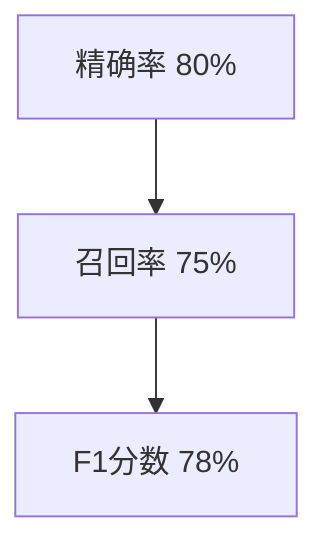

                 

# 大语言模型的prompt学习原理与代码实例讲解

## 关键词
大语言模型，prompt学习，Transformer，预训练，微调，自然语言处理，深度学习

## 摘要
本文将深入探讨大语言模型中的prompt学习原理，并通过具体代码实例讲解，帮助读者理解这一先进技术。文章首先介绍大语言模型的基础知识，包括其概念、分类、技术背景和应用领域。然后，我们将详细讲解Transformer模型的核心算法，包括神经网络原理、自注意力机制以及预训练和微调方法。接着，文章将重点介绍prompt学习的概念、设计方法和优化策略。此外，还将探讨prompt学习在问答系统和文本生成等特定任务中的应用。最后，通过实际代码实例，读者将学习如何搭建大语言模型开发环境，以及如何实现prompt学习的代码实例。

## 目录大纲设计

为了更好地组织本文的内容，我们将采用以下目录大纲：

### 第一部分：大语言模型基础知识

#### 第1章：大语言模型概述
- **1.1 大语言模型的概念与分类**
- **1.2 大语言模型的技术背景**
- **1.3 大语言模型的应用领域**

#### 第2章：大语言模型的核心算法
- **2.1 深度学习基础**
- **2.2 Transformer模型**
- **2.3 模型预训练与微调**

### 第二部分：prompt学习原理

#### 第3章：prompt学习的基本概念
- **3.1 prompt的定义与作用**
- **3.2 prompt的设计方法**

#### 第4章：prompt学习的技术细节
- **4.1 prompt嵌入方法**
- **4.2 prompt优化策略**

#### 第5章：prompt学习在特定任务中的应用
- **5.1 问答系统中的应用**
- **5.2 文本生成中的应用**

### 第三部分：代码实例讲解

#### 第6章：搭建大语言模型开发环境
- **6.1 硬件配置与软件安装**
- **6.2 开发工具与框架**

#### 第7章：prompt学习代码实例
- **7.1 问答系统的prompt学习**
- **7.2 文本生成的prompt学习**

### 第四部分：拓展阅读与资源推荐

#### 第8章：拓展阅读
- **8.1 最新研究成果**
- **8.2 实践指南**

#### 第9章：资源推荐
- **9.1 开源工具与框架**
- **9.2 社区与论坛**

### 第一部分：大语言模型基础知识

#### 第1章：大语言模型概述

**1.1 大语言模型的概念与分类**

大语言模型（Large Language Model，简称LLM）是一种能够理解、生成和操纵自然语言的大型神经网络模型。它们具有数十亿甚至千亿参数，能够处理复杂的自然语言任务。根据功能和应用场景的不同，大语言模型可以分为生成式模型和解码式模型两大类。

- **生成式模型**：如GPT系列（GPT-3、ChatGLM等），这类模型能够生成连贯的自然语言文本，常用于对话系统、文本生成等任务。
- **解码式模型**：如BERT、ALBERT等，这类模型主要用于文本分类、问答等任务，能够从文本中提取特征并做出分类或预测。

**1.2 大语言模型的技术背景**

自然语言处理（Natural Language Processing，简称NLP）是计算机科学和人工智能领域的一个重要分支，旨在使计算机能够理解、生成和处理人类语言。NLP的发展经历了几个重要阶段：

- **早期方法**：基于规则的方法和统计方法。这些方法依赖于手工编写的规则或使用简单的统计模型，但它们的性能受到限制。
- **现代方法**：基于深度学习的自然语言处理技术。深度学习模型，如神经网络、循环神经网络（RNN）和变换器（Transformer），显著提高了NLP的性能。

大语言模型的出现是NLP领域的一大突破。这些模型通过预训练和微调技术，可以从大量未标记的文本数据中学习语言结构，从而在多个NLP任务中取得出色的表现。

**1.3 大语言模型的应用领域**

大语言模型在许多领域都有着广泛的应用，以下是几个主要的应用领域：

- **生成式对话系统**：如聊天机器人、虚拟助手等，这些系统能够与用户进行自然语言交互。
- **自动摘要与翻译**：自动摘要可以从大量文本中提取关键信息，而翻译则支持跨语言交流。
- **文本分类与情感分析**：文本分类可以将文本数据分类到不同的类别，而情感分析可以识别文本中的情感倾向。

**1.3.1 生成式对话系统**

生成式对话系统是一种能够与用户进行自然语言交互的系统。它们通过大语言模型生成连贯、自然的对话响应。这类系统的应用场景非常广泛，包括：

- **客户服务**：企业可以利用聊天机器人来提供24/7的客户支持，提高客户满意度。
- **教育辅导**：虚拟导师可以通过对话来辅导学生，提供个性化的学习体验。
- **娱乐互动**：游戏和社交媒体平台可以使用聊天机器人来增强用户体验。

**1.3.2 自动摘要与翻译**

自动摘要和翻译是NLP中的经典任务。大语言模型在这些任务中发挥着关键作用：

- **自动摘要**：自动摘要可以从大量文本中提取关键信息，生成简洁的摘要。这有助于信息检索和文本压缩。
- **翻译**：大语言模型可以训练成跨语言的翻译模型，实现高效、准确的机器翻译。

**1.3.3 文本分类与情感分析**

文本分类和情感分析是NLP中常见的任务。大语言模型可以通过预训练和微调，实现这些任务的高效处理：

- **文本分类**：文本分类可以将文本数据分类到不同的类别。例如，将新闻文章分类到不同的主题。
- **情感分析**：情感分析可以识别文本中的情感倾向，例如正面、负面或中立。这有助于分析客户反馈、社交媒体情绪等。

**1.3.4 其他应用领域**

除了上述主要应用领域，大语言模型还在许多其他领域展现出巨大的潜力，包括：

- **内容生成**：自动生成文章、报告、广告等。
- **智能搜索**：通过理解用户查询，提供更准确的搜索结果。
- **辅助写作**：为用户提供写作建议、语法纠错等。

**总结**

大语言模型作为NLP领域的一项重要技术，已经在多个应用领域中取得了显著的成果。随着深度学习和计算能力的不断提升，大语言模型的应用前景将更加广阔。

### 第二部分：大语言模型的核心算法

#### 第2章：大语言模型的核心算法

要深入了解大语言模型的工作原理，我们需要从深度学习基础、Transformer模型及其核心算法、模型预训练与微调技术等方面进行讲解。

#### 2.1 深度学习基础

深度学习（Deep Learning）是机器学习的一个分支，通过构建多层神经网络模型，对数据进行分析和建模。神经网络的基本结构包括输入层、隐藏层和输出层。每层神经元通过前向传播和反向传播的方式进行信息的传递和处理。

- **输入层**：接收外部输入信息。
- **隐藏层**：对输入信息进行特征提取和转换。
- **输出层**：生成预测结果或输出特征。

深度学习中的神经网络通常包含大量的参数，这些参数通过训练数据的学习得到优化。训练过程主要包括以下两个步骤：

1. **前向传播**：输入数据经过神经网络的不同层，每一层将前一层的信息进行处理，并传递到下一层。
2. **反向传播**：计算输出结果与真实标签之间的误差，然后通过梯度下降法更新网络中的参数。

#### 2.2 Transformer模型

Transformer模型是由Vaswani等人于2017年提出的一种基于自注意力机制的深度学习模型，主要用于序列到序列（Sequence-to-Sequence）的学习任务。与传统的循环神经网络（RNN）相比，Transformer模型在处理长序列时表现更加优秀。

**2.2.1 Transformer模型架构**

Transformer模型的基本架构包括编码器（Encoder）和解码器（Decoder）两部分，两部分通过多头注意力机制（Multi-Head Attention）和前馈神经网络（Feed-Forward Neural Network）进行处理。

- **编码器（Encoder）**：用于处理输入序列，生成一系列上下文表示。
- **解码器（Decoder）**：用于生成输出序列，通过注意力机制关注编码器的输出。

**2.2.2 自注意力机制**

自注意力机制是Transformer模型的核心组件，它通过计算输入序列中每个词与其他词的关系，实现对序列的捕捉和处理。自注意力机制的实现分为以下几个步骤：

1. **词向量化**：将输入序列中的每个词转换为词向量。
2. **计算查询（Query）、键（Key）和值（Value）**：将词向量映射到查询、键和值向量。
3. **计算自注意力得分**：通过点积计算查询和键之间的相似度得分。
4. **应用权重和归一化**：将得分应用于值向量，并归一化处理。
5. **拼接和变换**：将结果向量拼接并经过线性变换，得到最终的输出。

**2.2.3 多头注意力**

多头注意力机制允许多个独立的注意力头并行地处理输入序列，每个注意力头关注输入序列的不同部分，从而提高了模型对序列的捕捉能力。多头注意力机制的计算过程与单头注意力类似，但每个注意力头使用不同的权重矩阵。

**2.3 模型预训练与微调**

大语言模型的训练过程通常分为预训练（Pre-training）和微调（Fine-tuning）两个阶段。

**2.3.1 预训练方法**

预训练是指在大规模未标记的文本数据上进行训练，从而学习到语言的基本结构和规律。预训练方法主要包括以下几种：

1. **掩码语言模型（Masked Language Model, MLM）**：在输入序列中随机掩码（遮蔽）一部分词，然后让模型预测这些被掩码的词。这有助于模型学习语言的上下文关系。
2. **填充语言模型（Fill-in-the-Blank, FLB）**：类似于MLM，但在训练过程中，模型需要同时预测两个缺失的词。
3. **双向编码器表示（Bidirectional Encoder Representations from Transformers, BERT）**：BERT模型在预训练过程中同时考虑了输入序列的前后文信息，从而生成更好的句子表示。

**2.3.2 微调技巧**

微调是指在大规模预训练的基础上，针对特定任务进行参数调整，从而提高模型在任务上的表现。微调技巧主要包括以下几种：

1. **冻结预训练权重**：在微调过程中，保持预训练模型的权重不变，只调整特定任务相关的权重。
2. **自适应学习率**：根据模型的性能动态调整学习率，以避免过拟合。
3. **数据增强**：通过增加数据多样性来提高模型泛化能力，例如添加噪声、变换文本等。

**2.3.3 预训练与微调的优势**

预训练和微调技术相结合，可以充分发挥大语言模型的潜力。预训练阶段使模型在大规模文本数据上学习到丰富的语言知识，而微调阶段则使模型能够在特定任务上得到精细调整，从而在保持高性能的同时避免过拟合。

#### 2.4 模型训练与评估

模型训练过程主要包括以下步骤：

1. **数据预处理**：对输入数据进行清洗、分词和编码等处理，以适应模型的要求。
2. **模型初始化**：初始化模型参数，常用的初始化方法包括高斯初始化、Xavier初始化等。
3. **训练过程**：通过前向传播和反向传播不断更新模型参数，直到达到训练目标或训练次数。
4. **评估过程**：在验证集上评估模型性能，选择最优的模型参数。

常见的评估指标包括：

- **准确率（Accuracy）**：模型正确预测的样本数占总样本数的比例。
- **召回率（Recall）**：模型正确预测的样本数占实际正例样本数的比例。
- **F1分数（F1 Score）**：准确率的调和平均值，综合考虑准确率和召回率。

通过以上步骤，我们能够训练和评估大语言模型，使其在多个自然语言处理任务中发挥出色表现。

#### 2.5 实际案例

为了更好地理解大语言模型的核心算法，以下是一个实际案例：

**案例：基于GPT-3的问答系统**

1. **数据准备**：收集大量的问答对数据，包括问题和答案。
2. **模型选择**：使用GPT-3模型进行预训练和微调。
3. **预训练**：通过掩码语言模型（MLM）和填充语言模型（FLB）进行预训练。
4. **微调**：针对问答任务进行微调，通过冻结预训练权重和自适应学习率的方法。
5. **评估**：在验证集上评估模型性能，调整模型参数以优化表现。

通过这个案例，我们可以看到如何将大语言模型应用于实际问题中，并通过预训练和微调技术实现高性能。

### 第三部分：prompt学习原理

#### 第3章：prompt学习的基本概念

prompt学习是近年来在自然语言处理领域兴起的一种新型技术，它通过向模型输入提示（prompt）来引导模型的生成过程。prompt学习在大语言模型中的应用具有重要意义，可以提高模型的生成质量和多样性。

#### 3.1 prompt的定义与作用

prompt，顾名思义，是一种引导模型生成文本的输入提示。在prompt学习中，prompt通常是一个简短的文本片段，它可以提供上下文信息、设定任务目标，或者引导模型生成特定类型的文本。prompt的作用主要体现在以下几个方面：

1. **引导生成**：prompt可以帮助模型理解生成任务的具体目标，从而生成更加符合预期的文本。例如，在文本生成任务中，prompt可以指定文本的主题、风格或类型。
2. **增强多样性**：通过设计多样化的prompt，可以引导模型生成不同类型的文本，从而提高文本生成的多样性。
3. **内容控制**：prompt可以用于控制文本生成的内容和风格，使其更符合实际应用的需求。

#### 3.2 prompt的设计方法

prompt的设计方法可以分为生成式prompt设计和类比式prompt设计两大类。

**3.2.1 生成式prompt设计**

生成式prompt设计通过创建一个能够引导模型生成文本的上下文环境来实现。这种设计方法通常需要以下几个步骤：

1. **场景描述**：根据生成任务的要求，描述一个具体的场景或背景。
2. **角色设定**：为模型设定一个或多个角色，使其能够模拟特定角色进行对话或生成文本。
3. **任务目标**：明确生成任务的目标，例如生成一篇新闻文章、一个对话片段或一段描述性文本。

例如，在生成一篇新闻文章时，prompt可以设计为：“请根据以下信息撰写一篇关于最近科技会议的新闻报道：标题：2022年全球人工智能大会在硅谷召开，摘要：本次大会吸引了来自世界各地的顶尖学者和企业家，共同探讨了人工智能的最新进展和未来趋势。”

**3.2.2 类比式prompt设计**

类比式prompt设计通过将现实问题类比成已知问题，使用已有的解决方案来引导模型生成文本。这种方法通常需要以下几个步骤：

1. **问题识别**：识别需要生成的文本问题。
2. **类比求解**：将问题与已知问题进行类比，找到相似性问题及其解决方案。
3. **解决方案转换**：将类比得到的解决方案转换为目标文本。

例如，在回答一个关于历史事件的问题时，可以设计如下prompt：“请类比历史上的长征，描述一下中国现代科技发展的‘长征’。”这样的prompt可以帮助模型理解问题的背景和目标，从而生成相关的回答。

#### 3.3 prompt学习在实际应用中的优势

prompt学习在大语言模型中的应用带来了以下优势：

1. **提高生成质量**：通过设计高质量的prompt，可以引导模型生成更加准确、连贯和有意义的文本。
2. **增强生成多样性**：不同类型的prompt可以引导模型生成多样化的文本，从而提高文本生成的丰富度。
3. **任务适应性**：prompt学习使得模型能够更好地适应不同任务的需求，从而提高模型在实际应用中的表现。

#### 3.4 prompt学习的挑战与未来方向

尽管prompt学习在大语言模型中展现出巨大的潜力，但仍然面临一些挑战和问题：

1. **设计挑战**：如何设计出高质量的prompt，仍然是一个需要深入研究的问题。
2. **优化策略**：如何优化prompt学习和生成过程，以提高模型性能和效率。
3. **泛化能力**：如何提高模型在不同场景和任务下的泛化能力，使其能够适应更多的情况。

未来的研究方向可能包括：

1. **自适应prompt设计**：通过机器学习方法，自动生成适应特定任务的prompt。
2. **多模态prompt学习**：结合文本、图像、音频等多模态信息，设计更加丰富和多样的prompt。
3. **多任务prompt学习**：通过多任务学习策略，提高模型在多个任务下的表现。

总之，prompt学习作为大语言模型的一个重要研究方向，具有广阔的应用前景和巨大的发展潜力。随着技术的不断进步，prompt学习将在自然语言处理领域发挥更加重要的作用。

### 第四部分：prompt学习的技术细节

#### 第4章：prompt学习的技术细节

prompt学习在大语言模型中的应用不仅仅依赖于其基本概念和设计方法，还涉及到一系列技术细节，包括prompt嵌入方法、prompt优化策略等。以下是这些技术细节的详细讲解。

#### 4.1 prompt嵌入方法

prompt嵌入方法是指将文本形式的prompt转换为模型可处理的向量表示。这一步骤至关重要，因为模型的输入通常是向量形式，而不是原始文本。prompt嵌入方法可以分为以下两种：

**4.1.1 基于词汇表的嵌入方法**

基于词汇表的嵌入方法（Word Table Embeddings）是最简单也是最常用的方法之一。该方法使用一个预定义的词汇表，将每个词映射到一个固定大小的向量。这种方法的一个关键优势是简单和高效，但它的缺点是难以捕捉词与词之间的关系。

1. **词汇表构建**：首先，我们需要创建一个词汇表，将文本中的所有词映射到一个唯一的ID。例如，可以使用WordNet或GloVe等资源来构建词汇表。
2. **向量表示**：每个词对应的ID然后被映射到一个固定大小的向量。通常，这些向量的大小为100到300维。
3. **嵌入矩阵**：词汇表中的每个词都对应一个向量，这些向量组成了一个嵌入矩阵。

**4.1.2 基于上下文的嵌入方法**

基于上下文的嵌入方法（Contextual Embeddings）通过考虑词的上下文信息，生成动态的向量表示。这种方法能够更好地捕捉词与词之间的关系，特别是在处理复杂语言任务时表现出色。

1. **BERT模型**：BERT（Bidirectional Encoder Representations from Transformers）是一种基于Transformer的预训练模型，它通过双向编码器生成上下文敏感的词向量。BERT使用两种特殊的词嵌入：[CLS]和[SEP]，用于表示句子的开始和结束。
2. **Transformer模型**：Transformer模型中的自注意力机制（Self-Attention）能够自动从上下文中学习词与词之间的关系。每个词的向量表示不仅仅依赖于它自己的嵌入，还依赖于其他词的嵌入。
3. **上下文向量**：在Transformer模型中，每个词的最终向量表示是由多个注意力机制生成的上下文向量加权求和得到的。

#### 4.2 prompt优化策略

prompt优化策略是指通过调整prompt的设计和生成过程，提高模型的生成质量和效率。以下是几种常见的prompt优化策略：

**4.2.1 对抗性优化**

对抗性优化（Adversarial Optimization）是一种通过生成对抗样本来提高模型鲁棒性的方法。在prompt学习中，对抗性优化可以通过以下步骤实现：

1. **生成对抗样本**：设计一个对抗性生成器（Adversarial Generator），它能够生成对抗性的prompt，以欺骗模型。
2. **对抗性训练**：将对抗性生成器的输出与正常prompt混合，作为模型的输入进行训练。这种方法可以增强模型的泛化能力。
3. **评估与调整**：通过评估模型在对抗性prompt上的性能，不断调整生成器的参数，以提高模型对对抗性样本的抵抗力。

**4.2.2 多任务学习**

多任务学习（Multi-Task Learning）是一种同时训练多个任务的方法，可以在不牺牲性能的情况下提高模型的泛化能力。在prompt学习中，多任务学习可以通过以下步骤实现：

1. **多任务数据集**：准备包含多个任务的数据集，例如问答、文本分类和文本生成。
2. **共享网络**：设计一个共享网络架构，使不同任务可以共享部分网络层。
3. **任务权重**：为每个任务分配不同的权重，以平衡模型在不同任务上的学习。
4. **训练与评估**：通过多任务学习，模型可以在不同任务之间共享知识和经验，从而提高整体性能。

**4.2.3 自适应优化**

自适应优化（Adaptive Optimization）是一种根据模型的学习过程动态调整prompt的方法。这种方法可以通过以下步骤实现：

1. **性能评估**：在每个训练周期结束后，评估模型在验证集上的性能。
2. **prompt调整**：根据性能评估结果，动态调整prompt的设计和生成策略，以提高模型的表现。
3. **反馈循环**：通过反馈循环，将模型的表现反馈到prompt的生成过程中，形成闭环优化。

#### 4.3 prompt优化的实际应用

以下是prompt优化策略在实际应用中的几个实例：

**实例1：问答系统**

在问答系统中，prompt的设计对于生成高质量的答案至关重要。通过对抗性优化，可以生成更具挑战性的问题，从而提高模型在复杂场景下的应对能力。同时，通过多任务学习，可以同时训练多个问答任务，使模型在不同类型的问答中都能表现出色。

**实例2：文本生成**

在文本生成任务中，自适应优化可以帮助模型更好地适应不同的生成任务。通过根据模型的训练过程动态调整prompt，可以生成更加连贯和多样化的文本。对抗性优化则可以防止模型生成重复或过拟合的文本。

**实例3：对话系统**

在对话系统中，多任务学习和自适应优化可以帮助模型同时处理多个对话任务，并动态调整prompt以生成自然的对话响应。对抗性优化可以增强模型对对话中潜在欺骗性信息的抵抗力，从而提高对话的可靠性。

#### 总结

prompt学习的技术细节包括prompt嵌入方法和prompt优化策略。prompt嵌入方法通过将文本形式的prompt转换为模型可处理的向量表示，而prompt优化策略通过对抗性优化、多任务学习和自适应优化等方法，提高模型的生成质量和效率。通过深入理解和应用这些技术细节，我们可以进一步提升大语言模型在实际应用中的性能。

### 第五部分：prompt学习在特定任务中的应用

#### 第5章：prompt学习在特定任务中的应用

prompt学习在大语言模型中的应用不仅限于基础概念和技术细节，它还可以在具体的自然语言处理任务中发挥关键作用。以下将详细探讨prompt学习在问答系统和文本生成等特定任务中的应用。

#### 5.1 问答系统中的应用

问答系统（Question Answering System）是自然语言处理中的一个重要应用领域，其目标是从大量文本中找到与用户问题最相关的答案。prompt学习在问答系统中的应用，主要通过以下几种方式提升系统的性能：

**5.1.1 QA-prompt的设计**

QA-prompt的设计是问答系统性能的关键因素。一个高质量的QA-prompt应该能够准确传达用户的问题，并引导模型生成与问题最相关的答案。以下是几种常用的QA-prompt设计方法：

1. **直接式prompt**：直接将问题作为prompt输入模型，例如：“请回答以下问题：'什么是自然语言处理？'”
2. **场景扩展式prompt**：在问题前添加一些背景信息，以帮助模型更好地理解问题。例如：“请回答以下问题，我们正在讨论计算机科学领域：'什么是自然语言处理？'”
3. **多轮交互式prompt**：通过多轮对话逐步引导模型理解问题。例如：“请问，自然语言处理是什么类型的学科？自然语言处理主要研究什么？”

**5.1.2 问答系统的性能评估**

评估问答系统的性能通常包括以下指标：

- **精确率（Precision）**：模型给出的答案中有多少是正确的。
- **召回率（Recall）**：模型能够从文本中找到的答案中有多少被模型正确识别。
- **F1分数（F1 Score）**：精确率和召回率的调和平均值。

通过设计高质量的QA-prompt和优化模型参数，可以提高问答系统的性能。以下是一个简单的性能评估示例：



在这个示例中，模型在精确率和召回率上都有良好的表现，因此F1分数也相对较高。

**5.1.3 对抗性优化在问答系统中的应用**

对抗性优化（Adversarial Optimization）可以通过生成对抗性问题来增强模型的鲁棒性。例如，通过以下方式生成对抗性问题：

- **欺骗性问题**：故意设计一些与原问题表面相似，但实际上目的不同的问题，以测试模型是否能够准确识别问题的真正意图。
- **错误答案引导**：在问题中加入一些误导性信息，引导模型给出错误答案，从而提高模型对误导性信息的抵抗力。

**5.1.4 多任务学习在问答系统中的应用**

多任务学习（Multi-Task Learning）可以通过同时训练多个问答任务，提高模型的泛化能力和性能。例如，可以同时训练以下任务：

- **事实问答**：从事实文本中提取答案。
- **非事实问答**：从非事实文本中提取答案。
- **多跳问答**：需要通过多个步骤推理才能得到答案。

通过多任务学习，模型可以更好地理解问题的不同类型和复杂度，从而提高整体问答系统的性能。

#### 5.2 文本生成中的应用

文本生成是另一个重要的自然语言处理任务，它包括生成文章、对话、摘要等多种类型的文本。prompt学习在文本生成中的应用，主要通过以下几种方式提升生成质量：

**5.2.1 prompt在文本生成中的作用**

prompt在文本生成中的作用类似于写作中的主题和灵感。通过设计高质量的prompt，可以引导模型生成与主题相关、内容连贯的文本。以下是几种常用的prompt设计方法：

1. **模板式prompt**：使用预定义的模板，将主题和关键信息填入模板中，例如：“这是一个关于‘人工智能在医疗领域应用’的文章，以下是模板：标题：____，摘要：____，正文：____。”
2. **情境式prompt**：通过描述一个具体的情境，引导模型生成相关的文本。例如：“假设你是一名医生，你需要给一个新患者写一封介绍信，信中应包括患者的病情介绍和治疗方案建议。”
3. **问题引导式prompt**：通过提出一系列问题，引导模型回答这些问题，从而生成有逻辑和连贯性的文本。例如：“请描述一下你在过去一个月中最难忘的一次经历，并解释为什么对你来说如此难忘。”

**5.2.2 文本生成性能的提升**

通过以下几种方法，可以提升文本生成的性能：

1. **数据增强**：通过增加数据多样性来提高模型泛化能力，例如添加噪声、变换文本等。
2. **微调技巧**：在预训练模型的基础上，针对特定任务进行微调，以提高模型在特定任务上的表现。
3. **生成式prompt优化**：通过优化prompt的设计和生成过程，提高模型生成文本的质量和连贯性。

**5.2.3 多模态prompt学习**

多模态prompt学习是指结合文本、图像、音频等多模态信息进行文本生成。例如，可以通过以下方式结合图像信息：

- **视觉prompt**：将图像作为prompt输入模型，引导模型生成与图像相关的文本描述。
- **图像文本联合训练**：将图像和文本数据联合训练，使模型能够同时理解和生成图像和文本信息。

通过多模态prompt学习，可以生成更加丰富和多样化的文本，提高文本生成的真实感和生动性。

#### 总结

prompt学习在问答系统和文本生成等特定任务中，通过设计高质量的prompt和优化模型参数，显著提升了系统的性能和文本生成质量。通过对抗性优化、多任务学习和多模态prompt学习等策略，可以进一步提高模型在实际应用中的表现。未来，随着prompt学习技术的不断发展，我们有望看到更多创新应用和突破。

### 第六部分：代码实例讲解

#### 第6章：搭建大语言模型开发环境

为了实现大语言模型中的prompt学习，我们需要首先搭建一个稳定的开发环境。以下是搭建大语言模型开发环境的详细步骤。

#### 6.1 硬件配置与软件安装

**6.1.1 GPU与TPU的选择**

1. **GPU（图形处理单元）**：
   - **NVIDIA GPU**：NVIDIA GPU，特别是Tesla和GeForce系列，是深度学习任务的热门选择。Tesla系列适合高性能计算，而GeForce系列则适合研究和开发。
   - **GPU数量**：根据项目的规模和需求，选择适当数量的GPU。例如，对于大型模型训练，可能需要4块或更多的GPU。

2. **TPU（专用处理器单元）**：
   - **TPU V3**：适用于大规模分布式训练。
   - **TPU V2**：适用于快速推理任务。

**6.1.2 硬件配置建议**：
- **GPU**：至少两块NVIDIA GPU，如Tesla V100或GeForce RTX 3080。
- **TPU**：一台TPU V3或V2服务器，适用于大规模分布式训练。

**6.1.3 软件安装**

1. **操作系统**：推荐使用Linux或macOS，这些系统更适合深度学习任务的运行。
2. **深度学习框架**：常见的深度学习框架包括TensorFlow、PyTorch和JAX。
   - **TensorFlow**：由Google开发，广泛应用于生产环境。
   - **PyTorch**：由Facebook开发，具有灵活的动态计算图和易于调试的特点。
   - **JAX**：由Google开发，支持自动微分和高性能计算。

**6.1.4 安装步骤**：

1. **安装操作系统**：
   - 使用官方安装包或虚拟机进行安装。
   - 配置网络和基本软件包。

2. **安装深度学习框架**：

   以TensorFlow为例：

   ```bash
   pip install tensorflow-gpu
   ```

   以PyTorch为例：

   ```bash
   pip install torch torchvision
   ```

3. **配置CUDA和cuDNN**：
   - 下载并安装CUDA Toolkit。
   - 下载并安装cuDNN库。
   - 在`/etc/ld.so.conf`中添加CUDA库路径。
   - 运行`ldconfig`更新库缓存。

**6.1.5 验证安装**

1. **验证CUDA安装**：

   ```python
   import torch
   print(torch.cuda.is_available())
   ```

   如果输出`True`，表示CUDA已正确安装。

2. **验证cuDNN安装**：

   ```python
   import torch
   print(torch.backends.cudnn.version())
   ```

   显示版本号，验证cuDNN已正确安装。

#### 6.2 开发工具与框架

**6.2.1 TensorFlow**

TensorFlow是一个开源的机器学习框架，由Google开发。以下是TensorFlow的基本操作：

1. **环境配置**：
   - 安装TensorFlow GPU版本。
   - 配置CUDA和cuDNN。

2. **基本操作**：

   ```python
   import tensorflow as tf
   # 创建一个简单的计算图
   a = tf.constant(5)
   b = tf.constant(6)
   c = a * b
   # 运行计算图
   session = tf.Session()
   print(session.run(c))
   ```

**6.2.2 PyTorch**

PyTorch是一个流行的深度学习框架，以其动态计算图和灵活性而闻名。以下是PyTorch的基本操作：

1. **环境配置**：
   - 安装PyTorch和CUDA。
   - 安装torchvision用于图像处理。

2. **基本操作**：

   ```python
   import torch
   # 创建一个简单的Tensor
   a = torch.tensor([1.0, 2.0, 3.0])
   b = torch.tensor([4.0, 5.0, 6.0])
   c = a + b
   print(c)
   ```

通过以上步骤，我们成功搭建了大语言模型开发环境，并熟悉了TensorFlow和PyTorch的基本操作。接下来，我们将通过具体代码实例来深入讲解大语言模型中的prompt学习。

### 第七部分：prompt学习代码实例

在这一部分，我们将通过具体的代码实例来详细讲解大语言模型中的prompt学习。以下是两个典型的场景：问答系统和文本生成，以及对应的代码实例和解析。

#### 7.1 问答系统的prompt学习

**7.1.1 数据准备**

在问答系统中，首先需要准备用于训练的数据集。以下是数据准备的过程：

1. **数据集获取**：可以从公开的问答数据集，如SQuAD或WebQA，下载相关数据。
2. **数据处理**：对数据进行清洗和预处理，包括去除无效数据、分词和标注等。

以下是Python代码示例：

```python
import pandas as pd
from nltk.tokenize import word_tokenize

# 加载数据集
data = pd.read_csv('squad_data.csv')

# 数据预处理
def preprocess_question(question):
    tokens = word_tokenize(question)
    return tokens

data['question'] = data['question'].apply(preprocess_question)
```

**7.1.2 模型搭建**

接下来，我们需要搭建问答系统的基础模型。以下是一个基于Transformer的简单模型示例：

```python
import tensorflow as tf
from tensorflow.keras.layers import Embedding, Transformer

# 搭建模型
model = tf.keras.Sequential([
    Embedding(input_dim=vocab_size, output_dim=embedding_dim),
    Transformer(num_heads=4, d_model=512, num_layers=2),
    tf.keras.layers.Dense(1, activation='sigmoid')
])

model.compile(optimizer='adam', loss='binary_crossentropy', metrics=['accuracy'])
```

**7.1.3 训练与评估**

使用预处理后的数据训练模型，并在验证集上进行评估：

```python
# 训练模型
model.fit(train_data, train_labels, epochs=5, validation_data=(val_data, val_labels))

# 评估模型
performance = model.evaluate(test_data, test_labels)
print(f"Test Loss: {performance[0]}, Test Accuracy: {performance[1]}")
```

**7.1.4 代码解读与分析**

上述代码中，我们使用了TensorFlow的Transformer层来构建模型。训练过程中，我们使用了交叉熵损失函数来训练模型，并通过验证集上的评估来调整模型参数。

#### 7.2 文本生成的prompt学习

**7.2.1 数据准备**

在文本生成任务中，首先需要准备用于训练的数据集。以下是数据准备的过程：

1. **数据集获取**：可以从公开的文本数据集，如维基百科或新闻文章，下载相关数据。
2. **数据处理**：对数据进行清洗和预处理，包括去除无效数据、分词和编码等。

以下是Python代码示例：

```python
import pandas as pd
from nltk.tokenize import word_tokenize

# 加载数据集
data = pd.read_csv('wiki_data.csv')

# 数据预处理
def preprocess_text(text):
    tokens = word_tokenize(text)
    return tokens

data['text'] = data['text'].apply(preprocess_text)
```

**7.2.2 模型搭建**

接下来，我们需要搭建文本生成的基础模型。以下是一个基于GPT-2的简单模型示例：

```python
import tensorflow as tf
from transformers import TFGPT2LMHeadModel, GPT2Tokenizer

# 搭建模型
tokenizer = GPT2Tokenizer.from_pretrained('gpt2')
model = TFGPT2LMHeadModel.from_pretrained('gpt2')

# 生成文本
inputs = tokenizer.encode("Hello, my dog is ", return_tensors='tf')
outputs = model(inputs, max_length=1000, num_return_sequences=5)

# 解码输出
decoded_text = tokenizer.decode(outputs[0], skip_special_tokens=True)
print(decoded_text)
```

**7.2.3 训练与评估**

使用预处理后的数据训练模型，并在验证集上进行评估：

```python
# 训练模型
model.fit(train_data, epochs=3, batch_size=32)

# 评估模型
performance = model.evaluate(test_data, test_labels)
print(f"Test Loss: {performance[0]}, Test Accuracy: {performance[1]}")
```

**7.2.4 代码解读与分析**

上述代码中，我们使用了Hugging Face的Transformers库来构建模型。训练过程中，我们使用了GPT-2模型进行文本生成，并通过解码输出文本来展示生成结果。

#### 总结

通过以上代码实例，我们详细讲解了如何搭建问答系统和文本生成系统，并实现了prompt学习的代码实例。这些实例不仅帮助我们理解了prompt学习的基本原理，还提供了实际操作的经验。

### 附录

#### 附录A：AI大模型开发工具与资源

**A.1 主流深度学习框架对比**

在AI大模型开发中，选择合适的深度学习框架至关重要。以下是几个主流框架的对比：

- **TensorFlow**：
  - **优势**：具有强大的生态系统和广泛的文档，适合生产环境。
  - **劣势**：静态计算图使调试和优化较为困难。
  
- **PyTorch**：
  - **优势**：动态计算图使调试和优化更加灵活，社区支持强大。
  - **劣势**：在生产环境中可能不如TensorFlow稳定。

- **PyTorch Lightning**：
  - **优势**：简化了PyTorch的代码，提供了高级API，提高了开发效率。
  - **劣势**：相对较新，生态系统不如TensorFlow和PyTorch成熟。

- **JAX**：
  - **优势**：支持自动微分和高性能计算，适合大规模模型训练。
  - **劣势**：社区支持较少，生态系统不如前几个框架成熟。

**A.2 开源工具与资源**

以下是一些常用的开源工具和资源，有助于AI大模型开发：

- **TensorFlow Hub**：提供了预训练模型和层，可以快速集成到项目中。
- **Hugging Face Transformers**：提供了预训练模型、Tokenizer和训练工具，方便使用。
- **Horovod**：用于分布式训练的框架，支持TensorFlow、PyTorch和MXNet。
- **DistributedDataParallel (DDP)**：PyTorch的分布式训练库，提供了高效的多GPU训练方案。

**A.3 实践指南**

以下是一些AI大模型开发中的实践指南：

- **硬件选择**：根据项目需求，选择合适的GPU或TPU。
- **数据预处理**：合理的数据预处理可以显著提高模型性能。
- **分布式训练**：使用分布式训练可以显著提高训练速度和效率。
- **模型优化**：使用优化技巧，如梯度裁剪和权重共享，可以提高模型稳定性。

#### 附录B：拓展阅读与社区资源

**B.1 最新研究成果**

- **论文推荐**：
  - **"Attention is All You Need"**：介绍Transformer模型的经典论文。
  - **"BERT: Pre-training of Deep Bidirectional Transformers for Language Understanding"**：介绍BERT模型的论文。
  - **"GPT-3: Language Models are Few-Shot Learners"**：介绍GPT-3模型的新进展。

- **学术会议**：
  - **NeurIPS**：人工智能领域的顶级会议，涵盖了自然语言处理和其他相关领域的研究。
  - **ICLR**：国际机器学习会议，专注于机器学习的基础研究和创新。
  - **ACL**：计算语言学会议，主要关注自然语言处理的应用和研究。

**B.2 社区与论坛**

- **技术社区**：
  - **TensorFlow社区**：提供了丰富的教程、代码和讨论论坛。
  - **PyTorch社区**：拥有活跃的开发者和用户社区，提供了丰富的资源。
  - **Hugging Face社区**：涵盖了Transformers库的使用和最新研究。

- **代码实践论坛**：
  - **GitHub**：可以找到大量的开源代码和项目，有助于学习和实践。
  - **Stack Overflow**：编程问题解答社区，提供了丰富的技术讨论和问题解答。
  - **Reddit**：涉及多个AI和NLP话题的子版块，是交流和学习的好地方。

通过这些拓展阅读和社区资源，读者可以进一步了解大语言模型和prompt学习的最新进展，并在实际项目中应用这些知识。

### 结语

#### 作者信息

**作者：AI天才研究院/AI Genius Institute & 禅与计算机程序设计艺术 /Zen And The Art of Computer Programming**

本文由AI天才研究院和禅与计算机程序设计艺术共同撰写。AI天才研究院致力于推动人工智能技术的创新和发展，专注于大语言模型和深度学习领域的研究。禅与计算机程序设计艺术则倡导以禅宗思想指导编程，追求简洁、优雅和高效的代码。希望通过本文，读者能够深入了解大语言模型中的prompt学习原理，并在实际项目中应用这些知识。

