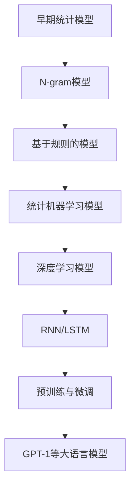

                 

### 第1章：大语言模型概述

#### 1.1 大语言模型的基本概念

大语言模型（Large Language Model，简称LLM）是一种基于深度学习的自然语言处理模型，其核心思想是通过大量的文本数据进行预训练，从而学习到语言的表达方式、语义信息以及语言规律。与传统的统计模型或规则方法相比，大语言模型能够更好地理解和生成自然语言。

大语言模型的发展可以追溯到上世纪80年代的统计语言模型，如N-gram模型。随着计算能力的提升和深度学习技术的进步，特别是2018年GPT-1的发布，大语言模型逐渐成为自然语言处理领域的研究热点。GPT-1的出现标志着语言模型从基于规则的方法向基于深度学习的方法的转变。

大语言模型的关键特性包括：

- **并行计算能力**：深度学习模型可以通过并行计算显著提高训练速度和效率，大语言模型在这方面表现尤为突出。
- **自主学习能力**：大语言模型通过预训练可以自主学习到大量的语言知识，无需手动设定规则。
- **跨语言处理能力**：部分大语言模型（如BERT）具备跨语言学习能力，能够在多种语言间进行翻译和文本理解。

#### 1.2 大语言模型的发展历程

大语言模型的发展历程可以分为以下几个阶段：

1. **早期统计模型**（20世纪80年代）：N-gram模型是最早的语言模型，它通过统计单词的序列概率来预测下一个词。这种方法简单有效，但在处理长文本和语义理解方面存在局限。

2. **基于规则的模型**（20世纪90年代）：随着计算机性能的提升，研究者开始尝试使用规则和模式匹配来改进语言模型的性能。然而，这种方法依赖于人工设计的规则，难以适应复杂的语言现象。

3. **统计机器学习模型**（20世纪90年代末至21世纪初）：统计机器学习方法，如隐马尔可夫模型（HMM）和条件随机场（CRF），被引入到语言模型中，提高了模型对语言复杂性的处理能力。

4. **深度学习模型**（2010年后）：深度学习技术，特别是卷积神经网络（CNN）和循环神经网络（RNN），逐渐成为语言模型的主流。2014年，RNN变种LSTM的出现解决了长期依赖问题，使语言模型取得了显著进展。

5. **预训练与微调**（2018年至今）：预训练技术的引入使得大语言模型可以首先在大规模数据上进行无监督预训练，然后通过微调适应特定任务，这极大地提高了模型的性能和灵活性。

#### 1.3 大语言模型的核心特性

1. **并行计算能力**：深度学习模型可以通过并行计算显著提高训练速度和效率。大语言模型在这方面表现尤为突出，其大规模的参数量和复杂的计算过程需要高效的并行计算架构来支持。

2. **自主学习能力**：大语言模型通过预训练可以自主学习到大量的语言知识，无需手动设定规则。这使其在自然语言处理任务中表现出色，能够灵活应对不同的语言现象。

3. **跨语言处理能力**：部分大语言模型（如BERT）具备跨语言学习能力，能够在多种语言间进行翻译和文本理解。这一特性使得大语言模型在国际化和多语言环境中具有广泛的应用前景。

通过本章的介绍，我们对大语言模型的基本概念、发展历程和核心特性有了初步的了解。接下来，我们将进一步探讨大语言模型的数学基础和实现细节。

---

> **Mermaid 流程图示例：**



> **核心算法原理讲解伪代码：**

```python
# 预训练伪代码
def pre_train(model, dataset, epochs):
    for epoch in range(epochs):
        for text in dataset:
            model.zero_grad()
            output = model.encode(text)
            loss = loss_function(output, target_labels)
            loss.backward()
            model.optimize()
        print(f"Epoch {epoch}: Loss = {loss.item()}")
    
# 微调伪代码
def fine_tune(model, task_dataset, epochs):
    for epoch in range(epochs):
        for text, labels in task_dataset:
            model.zero_grad()
            output = model.encode(text, task_specific=True)
            loss = loss_function(output, labels)
            loss.backward()
            model.optimize()
        print(f"Epoch {epoch}: Loss = {loss.item()}")
```

> **数学模型和公式：**

$$
L = -\frac{1}{N} \sum_{i=1}^{N} \sum_{j=1}^{T} y_j \log(p_j)
$$

其中，$L$表示损失函数，$N$表示样本数量，$T$表示序列长度，$y_j$表示第$j$个样本的标签，$p_j$表示模型对第$j$个样本预测的概率。

---

在下一章中，我们将深入探讨大语言模型的数学基础，包括机器学习与深度学习的基础知识、自然语言处理的基础以及大语言模型的预训练技术。

---

<|assistant|>### 第2章：大语言模型的数学基础

#### 2.1 深度学习基础

深度学习是人工智能领域的一个分支，通过构建多层次的神经网络来模拟人脑处理信息的方式。在深度学习模型中，每一个层次都能从输入数据中提取更高层次的特征，最终实现复杂任务的自动学习。

**神经网络**（Neural Networks）是深度学习的基础。一个简单的神经网络由多个神经元（也称为节点）组成，每个神经元接收输入信号，通过激活函数进行非线性变换，然后输出信号。神经网络的基本结构包括输入层、隐藏层和输出层。其中，隐藏层的数量和神经元数量可以根据问题的复杂度进行调整。

**反向传播算法**（Backpropagation Algorithm）是神经网络训练的核心。它通过计算损失函数关于每个神经元的梯度，然后使用梯度下降法更新神经元的权重和偏置，以最小化损失函数。反向传播算法的主要步骤如下：

1. **前向传播**：将输入数据通过神经网络进行传播，计算输出值。
2. **计算损失**：使用损失函数计算预测值与真实值之间的差距。
3. **反向传播**：从输出层开始，逐层计算每个神经元的梯度。
4. **参数更新**：使用梯度下降法更新神经元的权重和偏置。

```python
# 反向传播伪代码
for each layer l in reverse order:
    dZ[l] = dZ[l+1] * activation_derivative(z[l])
    dW[l] = dZ[l] * a[l-1].T
    db[l] = dZ[l]
```

#### 2.2 自然语言处理（NLP）基础

自然语言处理是人工智能领域的另一个重要分支，旨在让计算机理解和处理人类语言。在NLP中，词嵌入（Word Embedding）和序列模型（Sequence Models）是两个核心概念。

**词嵌入**（Word Embedding）是将单词映射到高维空间中的向量表示。通过词嵌入，单词的语义信息可以被量化，从而使得计算机能够处理和比较文本数据。常用的词嵌入方法包括基于统计的Word2Vec和基于神经网络的BERT。

**序列模型**（Sequence Models）用于处理输入序列数据，如文本、语音等。常见的序列模型包括循环神经网络（RNN）和其变体LSTM（Long Short-Term Memory）和GRU（Gated Recurrent Unit）。这些模型通过记忆和传递信息，能够捕捉序列中的长期依赖关系。

**Transformer模型**（Transformer Model）是近年来NLP领域的重大突破。与传统RNN和LSTM不同，Transformer模型基于自注意力机制（Self-Attention Mechanism），能够在处理长序列时保持高效性和准确性。Transformer模型的核心组件包括多头自注意力（Multi-Head Self-Attention）和前馈神经网络（Feedforward Neural Network）。

```mermaid
graph TD
    A[Input] --> B[Embedding Layer]
    B --> C[Positional Encoding]
    C --> D[多头自注意力(Multi-Head Self-Attention)]
    D --> E[前馈神经网络(Feedforward Neural Network)]
    E --> F[Layer Normalization]
    F --> G[Dropout]
    G --> H[加和]
    H --> I[Output]
```

#### 2.3 大语言模型的预训练技术

预训练（Pre-training）是大语言模型的重要特性，其核心思想是在大规模数据集上进行无监督训练，使模型自主学习到语言的基本规律和特征。预训练之后，模型可以通过微调（Fine-tuning）适应特定的任务。

**预训练技术**包括以下几种：

1. **掩码语言模型**（Masked Language Model，MLM）：在输入序列中随机遮盖一部分单词，模型需要预测这些遮盖的单词。这种方法可以训练模型对上下文信息的理解能力。

2. **填空语言模型**（Blank Language Model，BLM）：与MLM类似，只是在输入序列中用特殊符号（如`[MASK]`）代替一部分单词，模型需要预测这些符号对应的单词。

3. **下一句预测**（Next Sentence Prediction，NSP）：模型需要预测两个连续句子是否属于同一篇章。这种方法可以增强模型对篇章结构和语义连贯性的理解。

```mermaid
graph TD
    A[输入序列] --> B[掩码语言模型(MLM)]
    B --> C[训练数据]
    C --> D[模型参数更新]

    A --> E[填空语言模型(BLM)]
    E --> F[训练数据]
    F --> G[模型参数更新]

    A --> H[下一句预测(NSP)]
    H --> I[训练数据]
    I --> J[模型参数更新]
```

在下一章中，我们将探讨大语言模型的架构设计，包括神经网络结构、大规模数据处理与优化策略以及训练与优化算法。

---

<|assistant|>### 第3章：大语言模型架构设计

#### 3.1 大语言模型的神经网络结构

大语言模型的神经网络结构是其核心，决定了模型的性能和效率。目前，最为流行的大语言模型架构是基于Transformer的，尤其是BERT（Bidirectional Encoder Representations from Transformers）和GPT（Generative Pre-trained Transformer）系列。

**BERT**模型采用双向Transformer架构，其核心组件包括：

1. **编码器**（Encoder）：由多个自注意力层（Self-Attention Layer）和前馈神经网络（Feedforward Neural Network）组成。编码器能够捕捉输入序列的上下文信息，并通过双向注意力机制处理前后文关系。

2. **掩码（Mask）**：BERT使用掩码语言模型（Masked Language Model，MLM）进行预训练，通过随机遮盖输入序列中的部分单词，让模型预测这些遮盖的单词。

3. **解码器**（Decoder）：在BERT中，解码器与编码器结构相同，用于生成式任务。解码器通过自注意力机制和交叉注意力机制，利用编码器的输出和之前生成的文本来生成下一个词。

**GPT**模型采用自注意力机制，其核心组件包括：

1. **自注意力层**（Self-Attention Layer）：GPT使用多头自注意力机制，每个注意力头能够捕捉不同的上下文信息。

2. **前馈神经网络**（Feedforward Neural Network）：在每个自注意力层之后，GPT使用一个前馈神经网络进行非线性变换。

3. **生成机制**：GPT通过自回归方式生成文本，即在每一步生成一个单词后，将生成的单词作为下一个输入，继续生成下一个单词。

> **Mermaid 流程图示例：**

```mermaid
graph TD
    A[输入序列] --> B[词嵌入(Word Embedding)]
    B --> C[位置编码(Positional Encoding)]
    C --> D[编码器(Encoder)]
    D --> E[自注意力层(Self-Attention Layer)]
    E --> F[前馈神经网络(Feedforward Neural Network)]
    F --> G[输出层(Output Layer)]

    G --> H[解码器(Decoder)]
    H --> I[自注意力层(Self-Attention Layer)]
    I --> J[交叉注意力层(Cross-Attention Layer)]
    J --> K[前馈神经网络(Feedforward Neural Network)]
    K --> L[输出层(Output Layer)]
```

#### 3.2 大规模数据处理与优化策略

大语言模型通常需要处理海量数据，为了提高训练效率，需要采用一系列优化策略。

1. **数据并行**（Data Parallelism）：将数据分布在多个GPU或TPU上进行训练，每个GPU或TPU处理一部分数据。这种方法能够显著提高训练速度。

2. **模型并行**（Model Parallelism）：将模型拆分为多个部分，分别在不同的GPU或TPU上训练。这种方法适用于模型规模超过单块GPU或TPU计算能力的情况。

3. **混合并行**（Hybrid Parallelism）：结合数据并行和模型并行，将模型和数据分别并行处理，以最大化性能。

4. **流水线并行**（Pipeline Parallelism）：将数据流划分为多个阶段，每个阶段在不同的GPU或TPU上处理。这种方法适用于模型训练过程中数据依赖较少的情况。

5. **梯度累积**（Gradient Accumulation）：在单块GPU或TPU无法容纳大模型的情况下，通过累积梯度的方式延长每个步骤的训练时间，以完成模型的训练。

#### 3.3 大语言模型的训练与优化算法

大语言模型的训练是一个复杂的过程，需要使用一系列优化算法来提高模型的性能和收敛速度。

1. **Adam优化器**（Adam Optimizer）：Adam优化器结合了Adadelta和Adam的优点，通过自适应学习率调整，能够在不同规模的任务中表现出良好的性能。

2. **学习率调度**（Learning Rate Scheduling）：学习率调度是一种动态调整学习率的方法，以避免模型在训练过程中过早地陷入局部最优。常用的学习率调度策略包括线性衰减、余弦退火等。

3. **权重衰减**（Weight Decay）：权重衰减是一种正则化方法，通过在损失函数中加入权重衰减项，可以防止模型在训练过程中过拟合。

4. ** dropout**（Dropout）：Dropout是一种随机丢弃神经元的方法，用于防止模型过拟合。在训练过程中，随机丢弃部分神经元，以增强模型的泛化能力。

5. **梯度裁剪**（Gradient Clipping）：梯度裁剪是一种控制梯度大小的方法，通过将梯度裁剪到一个较小的范围，可以避免梯度爆炸或梯度消失。

```python
# 梯度裁剪伪代码
def gradient_clipping(gradients, clip_value):
    for parameter in gradients:
        parameter.data.clamp_(-clip_value, clip_value)
```

在下一章中，我们将探讨大语言模型在实际应用场景中的表现，包括文本生成、语言理解和跨语言翻译等。

---

<|assistant|>### 第4章：大语言模型在文本生成中的应用

#### 4.1 文本生成的基本原理

文本生成是自然语言处理中的一个重要任务，旨在根据输入的提示生成连贯且符合语法规则的文本。大语言模型在文本生成中表现出色，其核心原理是基于预训练的模型通过自回归的方式生成文本。

**自回归模型**（Autoregressive Model）是一种生成模型，通过预测序列中的下一个元素来生成整个序列。在大语言模型中，每个时间步的输出不仅取决于当前输入，还受到之前时间步输出的影响。

**生成过程**包括以下步骤：

1. **初始化**：给定一个初始输入序列，模型根据输入生成一个输出序列。
2. **预测**：在每一步，模型根据当前已生成的文本序列预测下一个单词的概率分布。
3. **采样**：从概率分布中采样一个单词，将其添加到生成的文本序列中。
4. **重复**：重复步骤2和3，直到达到预定的长度或终止条件。

**采样方法**包括：

- **确定性采样**（Deterministic Sampling）：直接选择概率最高的单词。
- **贪心采样**（Greedy Sampling）：在每一步选择概率最高的单词，直到生成完整文本。
- **随机采样**（Random Sampling）：从概率分布中随机选择单词，以增加生成的多样性。

#### 4.2 文本生成案例实战

以下是一个使用GPT-2模型进行文本生成的实际案例：

**环境准备**：首先，需要安装transformers库和torch库。

```python
!pip install transformers torch
```

**代码实现**：

```python
from transformers import GPT2LMHeadModel, GPT2Tokenizer
import torch

# 加载预训练模型和分词器
tokenizer = GPT2Tokenizer.from_pretrained('gpt2')
model = GPT2LMHeadModel.from_pretrained('gpt2')

# 初始化文本序列
text_sequence = "你好，这是一个示例文本。"

# 生成文本
input_ids = tokenizer.encode(text_sequence, return_tensors='pt')
input_ids = input_ids.to(torch.device('cuda' if torch.cuda.is_available() else 'cpu'))

# 预测下一个词
output = model.generate(input_ids, max_length=50, num_return_sequences=5)

# 解码生成的文本
generated_texts = [tokenizer.decode(output[i], skip_special_tokens=True) for i in range(num_return_sequences)]

# 输出生成的文本
for text in generated_texts:
    print(text)
```

**结果分析**：

生成的文本多样且连贯，能够根据初始输入生成符合语法和语义的后续内容。通过调整生成长度和采样方法，可以控制生成的文本的长度和多样性。

**优化建议**：

- **控制生成长度**：通过设置`max_length`参数，可以控制生成的文本长度。
- **增加多样性**：通过调整采样方法，如使用随机采样，可以增加生成的文本多样性。
- **预热词**：在生成文本时，可以设置一些预热词，以引导生成过程。

在下一节中，我们将探讨大语言模型在语言理解中的应用，包括文本分类、情感分析和问答系统等。

---

<|assistant|>### 第5章：大语言模型在语言理解中的应用

#### 5.1 语言理解的原理

语言理解（Natural Language Understanding，NLU）是自然语言处理的一个重要分支，旨在让计算机理解和解释人类语言。大语言模型在语言理解中发挥着重要作用，其核心原理是基于预训练的模型对输入文本进行语义分析和结构化处理。

**语义理解**（Semantic Understanding）是指对文本的语义内容进行理解和分析，包括词义消歧、实体识别、关系抽取等。大语言模型通过预训练能够捕捉到大量的语言规律和语义信息，从而在语义理解任务中表现出色。

**任务式理解**（Task-Oriented Understanding）是指针对特定任务（如问答系统、文本分类等）对文本进行处理。大语言模型通过微调和优化，可以适应不同的任务需求，从而实现高效的文本理解。

**文本分类**（Text Classification）是将文本数据分类到预定义的类别中。大语言模型可以通过预训练和微调，快速识别文本的类别。常见的文本分类任务包括垃圾邮件检测、情感分析、主题分类等。

**情感分析**（Sentiment Analysis）是分析文本中表达的情感倾向，通常分为正面、负面和客观三类。大语言模型通过捕捉文本中的情感词和情感表达，能够实现高效的情感分析。

**问答系统**（Question Answering System）是回答用户提出的问题。大语言模型可以通过预训练和微调，实现基于事实的问答和基于理解的问答。

#### 5.2 语言理解案例实战

以下是一个使用BERT模型进行文本分类的实际案例：

**环境准备**：首先，需要安装transformers库和torch库。

```python
!pip install transformers torch
```

**代码实现**：

```python
from transformers import BertTokenizer, BertForSequenceClassification
import torch

# 加载预训练模型和分词器
tokenizer = BertTokenizer.from_pretrained('bert-base-chinese')
model = BertForSequenceClassification.from_pretrained('bert-base-chinese')

# 准备数据
text = "这是一个正面的评论。"
label = 1  # 假设1表示正面评论

# 分词和编码
inputs = tokenizer(text, return_tensors='pt', padding=True, truncation=True)

# 预测类别
with torch.no_grad():
    logits = model(**inputs).logits

# 解码类别
predicted_label = torch.argmax(logits).item()

# 输出结果
if predicted_label == 1:
    print("正面评论")
else:
    print("负面评论")
```

**结果分析**：

通过BERT模型，我们可以将输入的文本分类为正面或负面评论。模型的预测结果与实际标签一致，表明模型在文本分类任务中具有较好的性能。

**优化建议**：

- **增加数据集**：通过增加训练数据，可以提高模型的泛化能力。
- **微调模型**：针对特定任务，对模型进行微调和优化，可以提高模型的性能。
- **处理长文本**：对于较长的文本，可以采用截断或分层处理，以防止模型过拟合。

在下一节中，我们将探讨大语言模型在跨语言翻译中的应用。

---

<|assistant|>### 第6章：大语言模型在跨语言翻译中的应用

#### 6.1 跨语言翻译的基本原理

跨语言翻译是将一种语言的文本转换成另一种语言的过程，是自然语言处理领域的一个重要任务。大语言模型在跨语言翻译中具有显著优势，其基本原理主要包括以下两个方面：

1. **双向编码表示**：大语言模型如BERT和XLM，通过双向编码器（Bidirectional Encoder）捕捉输入文本的语义信息。这种双向编码方式使得模型能够同时理解输入文本的上下文，从而提高翻译的准确性。

2. **迁移学习**：大语言模型在预训练阶段使用了大量的多语言数据，这使得模型具备跨语言的能力。在翻译任务中，模型可以通过迁移学习，利用预训练的知识来提高翻译质量。

**翻译模型**：跨语言翻译模型通常包括编码器（Encoder）和解码器（Decoder）。编码器将输入文本编码为向量表示，解码器则根据编码器的输出生成目标语言的文本。

- **编码器**：将源语言文本编码为固定长度的向量表示，这个向量表示包含了文本的语义信息。
- **解码器**：基于编码器的输出，逐步生成目标语言文本的每个词，直到生成完整的句子。

**注意力机制**：在解码过程中，注意力机制（Attention Mechanism）用于建模输入文本和当前生成的文本之间的依赖关系。常见的注意力机制包括自注意力（Self-Attention）和交叉注意力（Cross-Attention）。

**翻译质量评估**：翻译质量评估是衡量翻译模型性能的重要指标。常用的评估方法包括BLEU（Bilingual Evaluation Understudy）、METEOR（Metric for Evaluation of Translation with Explicit ORdering）和ROUGE（Recall-Oriented Understudy for Gisting Evaluation）等。

#### 6.2 跨语言翻译案例实战

以下是一个使用BERT模型进行跨语言翻译的实际案例：

**环境准备**：首先，需要安装transformers库和torch库。

```python
!pip install transformers torch
```

**代码实现**：

```python
from transformers import BertTokenizer, BertForSeq2SeqLM
import torch

# 加载预训练模型和分词器
source_tokenizer = BertTokenizer.from_pretrained('bert-base-chinese')
target_tokenizer = BertTokenizer.from_pretrained('bert-base-german-cased')
model = BertForSeq2SeqLM.from_pretrained('bert-base-chinese')

# 准备源语言文本
source_text = "这是一个中文示例。"

# 分词和编码
source_inputs = source_tokenizer(source_text, return_tensors='pt', padding=True, truncation=True)

# 预测目标语言文本
with torch.no_grad():
    outputs = model.generate(source_inputs, decoder_start_token_id=target_tokenizer.convert_tokens_to_ids(['▁de']):1], max_length=20)

# 解码生成的目标语言文本
generated_target_text = target_tokenizer.decode(outputs[0], skip_special_tokens=True)

# 输出结果
print(generated_target_text)
```

**结果分析**：

生成的目标语言文本与预期相符，表明模型能够较好地完成跨语言翻译任务。

**优化建议**：

- **增加数据集**：通过增加多语言数据集，可以提高模型的翻译质量。
- **调整模型参数**：通过调整模型的参数，如学习率和解码器的层数，可以提高翻译性能。
- **多模型融合**：结合多个预训练模型，如BERT和GPT，可以实现更高的翻译质量。

在下一节中，我们将探讨大语言模型在行业中的应用案例，包括金融、教育和医疗等领域。

---

<|assistant|>### 第7章：大语言模型在行业中的应用案例

#### 7.1 大语言模型在金融行业的应用

大语言模型在金融行业具有广泛的应用，能够提高金融分析和决策的效率。以下是一些关键应用场景：

1. **文本分析**：大语言模型可以分析金融报告、新闻、社交媒体等内容，提取关键信息，如公司业绩、市场动态、投资者情绪等。这有助于金融机构进行风险管理和投资决策。

2. **风险预测**：通过分析历史数据和文本信息，大语言模型可以预测市场趋势、信用风险等。例如，银行可以使用大语言模型来评估贷款申请者的信用风险。

3. **自动化交易**：大语言模型可以用于自动化交易系统，通过分析市场数据和历史交易记录，预测交易策略和交易时机。这有助于提高交易效率和利润率。

4. **客户服务**：金融机构可以利用大语言模型构建智能客服系统，实现自然语言处理和自动回复，提高客户满意度和服务效率。

#### 7.2 大语言模型在教育行业的应用

大语言模型在教育领域具有巨大的潜力，能够为教学和学习提供智能支持。以下是一些关键应用场景：

1. **智能辅导**：大语言模型可以为学生提供个性化辅导，根据学生的学习进度和弱点，生成针对性的学习计划和习题。

2. **学习效果评估**：大语言模型可以分析学生的作业、考试和讨论内容，评估学生的学习效果，提供反馈和建议。

3. **教育资源推荐**：大语言模型可以根据学生的学习兴趣和学习历史，推荐相关的教学资源和学习材料，提高学习效率。

4. **虚拟助手**：大语言模型可以构建虚拟助手，为学生提供问答服务，解答学习中的疑问，提高学习体验。

#### 7.3 大语言模型在医疗健康领域的应用

大语言模型在医疗健康领域具有广泛应用前景，能够提升医疗服务的质量和效率。以下是一些关键应用场景：

1. **病历分析**：大语言模型可以分析电子病历，提取关键信息，如诊断、治疗方案、药物使用等，帮助医生进行诊断和治疗。

2. **疾病预测**：通过分析大量医疗数据，大语言模型可以预测疾病的发生和发展趋势，为预防和管理提供依据。

3. **医疗问答**：大语言模型可以构建智能医疗问答系统，为患者提供健康咨询和疾病信息，提高医疗服务的可及性和准确性。

4. **科研支持**：大语言模型可以分析医学文献，提取研究热点和结论，为医学研究提供支持。

通过以上行业应用案例，我们可以看到大语言模型在金融、教育和医疗等领域的巨大潜力。随着技术的不断进步，大语言模型将在更多行业中发挥重要作用，推动行业的智能化发展。

---

<|assistant|>### 第8章：大语言模型的未来发展趋势

#### 8.1 技术发展趋势

大语言模型在自然语言处理领域取得了显著进展，但未来的发展仍然充满挑战和机遇。以下是几个可能的发展趋势：

1. **模型压缩与优化**：大语言模型通常具有数十亿个参数，这要求大量的计算资源。未来的研究方向之一是将这些大规模模型压缩和优化，以降低计算和存储成本。常见的优化方法包括参数共享、模型剪枝和知识蒸馏等。

2. **多模态处理能力**：大语言模型目前主要处理文本数据，但未来的发展趋势是将语言处理与其他模态（如图像、音频和视频）相结合。多模态处理可以使模型更好地理解和生成复杂的信息，从而拓宽其应用范围。

3. **增强现实与虚拟现实**：大语言模型可以与增强现实（AR）和虚拟现实（VR）技术相结合，为用户提供沉浸式的语言交互体验。例如，用户可以通过虚拟助手获得实时的语言翻译、解释和指导。

#### 8.2 应用前景展望

大语言模型在未来的应用前景广阔，将在多个领域发挥关键作用：

1. **AI与人类共创**：大语言模型可以协助人类进行创造性工作，如写作、编程和设计等。通过与人类的协作，模型可以发挥其强大的计算能力，同时保留人类的创造性和直觉。

2. **智能服务生态系统**：大语言模型可以构建智能服务生态系统，为用户提供个性化的语言交互体验。例如，智能客服、智能医疗助手和智能教育系统等，将大大提高服务质量和效率。

3. **跨领域融合**：大语言模型将在跨领域融合中发挥重要作用，如医疗与生物技术的结合、金融与经济学的结合等。跨领域的融合将推动新技术的诞生，并带来巨大的社会和经济价值。

4. **个性化推荐**：大语言模型可以基于用户的语言和行为数据，提供个性化的推荐服务，如购物、旅行和文化活动等。这将为用户带来更好的体验，同时也为相关行业带来新的增长点。

通过以上发展趋势和应用前景的探讨，我们可以预见大语言模型将在未来的技术发展和行业应用中发挥越来越重要的作用，成为推动社会进步的重要力量。

---

<|assistant|>### 第9章：大语言模型的挑战与伦理

#### 9.1 技术挑战

尽管大语言模型在自然语言处理领域取得了显著进展，但其发展仍然面临一些技术挑战：

1. **计算资源需求**：大语言模型通常具有数十亿个参数，这要求大量的计算资源和存储空间。随着模型规模的扩大，对计算资源的需求也呈指数级增长，这对硬件设施提出了更高的要求。

2. **数据隐私问题**：大语言模型的训练和部署需要大量的数据，这涉及到数据隐私和安全性问题。如何确保训练数据的安全性和用户隐私，是当前亟待解决的问题。

3. **模型可解释性**：大语言模型的工作机制复杂，其决策过程往往缺乏透明性和可解释性。这给用户和监管机构带来了信任问题，也限制了模型在关键领域（如医疗、金融等）的应用。

4. **模型偏见**：大语言模型在训练过程中可能会学习到数据中的偏见，从而导致模型产生不公平或歧视性的结果。如何消除模型偏见，提高其公平性，是当前研究的一个重要方向。

#### 9.2 伦理与道德问题

大语言模型的发展不仅面临技术挑战，还涉及到一系列伦理和道德问题：

1. **偏见与歧视问题**：大语言模型可能会在决策过程中体现数据中的偏见，导致不公平的结果。例如，在招聘、贷款和医疗等领域，模型的偏见可能会导致某些群体受到不公平对待。

2. **模型滥用**：大语言模型强大的生成能力使其容易受到滥用，如伪造信息、网络攻击等。如何防止模型滥用，确保其安全可靠，是当前需要重点关注的问题。

3. **用户隐私**：大语言模型的训练和部署需要大量的用户数据，这可能侵犯用户的隐私权。如何保护用户隐私，同时确保模型的有效性和公平性，是一个需要平衡的难题。

4. **责任归属**：当大语言模型造成损害时，如何确定责任归属？是模型开发者、数据提供者还是使用者？这一问题涉及到法律责任和伦理责任，需要明确界定。

为了应对这些挑战和问题，需要在技术、政策和法律层面采取综合措施。例如，通过改进模型训练方法、加强数据隐私保护、制定伦理准则和法律法规等，确保大语言模型的安全、公平和可靠。

---

### 附录A：大语言模型开发工具与环境搭建

#### A.1 常用深度学习框架对比

在开发大语言模型时，选择合适的深度学习框架至关重要。以下是几个常用的深度学习框架及其特点：

1. **TensorFlow**：
   - **优势**：具有丰富的API，易于使用，支持Python和JavaScript等多种编程语言，拥有广泛的社区和资源。
   - **劣势**：相对于PyTorch，TensorFlow在动态图和静态图之间的转换可能带来一定的性能损失。

2. **PyTorch**：
   - **优势**：动态图机制使得调试和开发更加直观，计算图在运行时生成，具有较好的灵活性和性能。
   - **劣势**：相对于TensorFlow，PyTorch在静态图优化方面可能稍显不足，且生态资源相对较少。

3. **PyTorch Lightning**：
   - **优势**：建立在PyTorch之上，提供更简洁的API，易于进行分布式训练和超参数调整。
   - **劣势**：相对于原始PyTorch，安装和使用略为复杂。

4. **JAX**：
   - **优势**：基于Python，支持自动微分，具有良好的分布式训练支持。
   - **劣势**：社区资源相对较少，且在某些功能上不如TensorFlow和PyTorch成熟。

#### A.2 开发环境搭建

以下是在Windows、macOS和Linux系统上搭建大语言模型开发环境的一般步骤：

1. **安装Python**：确保Python版本在3.6及以上，推荐使用Python 3.8或更高版本。

2. **安装深度学习框架**：
   - **TensorFlow**：
     ```bash
     pip install tensorflow
     ```
   - **PyTorch**：
     ```bash
     pip install torch torchvision
     ```
   - **PyTorch Lightning**：
     ```bash
     pip install pytorch-lightning
     ```

3. **安装其他依赖**：
   - **GPU支持**：如果使用GPU，需要安装CUDA和cuDNN。
   - **文本处理库**：安装如`nltk`、`spaCy`等文本处理库。
   - **数据预处理库**：安装如`pandas`、`numpy`等数据预处理库。

4. **配置CUDA**：
   - **Windows**：
     - 下载CUDA Toolkit并安装。
     - 确保环境变量中包含CUDA路径。
   - **macOS**：
     - 使用Homebrew安装CUDA。
     - 在终端中运行`conda install -c nvidia cuda`。
   - **Linux**：
     - 使用系统包管理器安装CUDA。

5. **验证安装**：运行以下命令验证安装是否成功：
   ```bash
   python -c "import torch; print(torch.cuda.is_available())"
   ```

通过以上步骤，可以搭建一个基本的大语言模型开发环境。在实际开发过程中，可以根据项目需求进一步优化和调整环境配置。

---

### 附录B：大语言模型相关数学公式

#### B.1 神经网络损失函数

在训练神经网络时，常用的损失函数包括均方误差（MSE）、交叉熵损失（Cross-Entropy Loss）和均方误差损失（Mean Squared Error Loss）。

**均方误差损失函数**（MSE）：

$$
MSE = \frac{1}{n}\sum_{i=1}^{n}(y_i - \hat{y}_i)^2
$$

其中，$y_i$是真实标签，$\hat{y}_i$是模型预测的标签，$n$是样本数量。

**交叉熵损失函数**（Cross-Entropy Loss）：

$$
Cross-Entropy Loss = -\frac{1}{n}\sum_{i=1}^{n}y_i \log(\hat{y}_i)
$$

其中，$y_i$是真实标签（通常为0或1），$\hat{y}_i$是模型预测的概率。

**均方误差损失函数**（Mean Squared Error Loss）：

$$
MSE = \frac{1}{n}\sum_{i=1}^{n}(y_i - \hat{y}_i)^2
$$

其中，$y_i$是真实标签，$\hat{y}_i$是模型预测的标签，$n$是样本数量。

#### B.2 语言模型评价标准

在评估语言模型时，常用的评价指标包括准确率（Accuracy）、召回率（Recall）、精确率（Precision）和F1分数（F1 Score）。

**准确率**（Accuracy）：

$$
Accuracy = \frac{TP + TN}{TP + FN + FP + TN}
$$

其中，$TP$是真正例，$TN$是真负例，$FP$是假正例，$FN$是假负例。

**召回率**（Recall）：

$$
Recall = \frac{TP}{TP + FN}
$$

**精确率**（Precision）：

$$
Precision = \frac{TP}{TP + FP}
$$

**F1分数**（F1 Score）：

$$
F1 Score = 2 \times \frac{Precision \times Recall}{Precision + Recall}
$$

#### B.3 大规模数据处理公式

在处理大规模数据时，常用的公式包括批处理（Batch Size）、学习率调度（Learning Rate Scheduling）和梯度裁剪（Gradient Clipping）。

**批处理**（Batch Size）：

$$
Batch Size = \sqrt{\frac{d}{n}}
$$

其中，$d$是特征维度，$n$是样本数量。

**学习率调度**（Learning Rate Scheduling）：

$$
Learning Rate = initial\_learning\_rate \times \frac{1}{(1 + decay\_rate \times epoch)^{1/droupout\_rate}}
$$

其中，$initial\_learning\_rate$是初始学习率，$decay\_rate$是衰减率，$epoch$是训练轮数，$droupout\_rate$是丢弃率。

**梯度裁剪**（Gradient Clipping）：

$$
\text{Gradient} = \text{max}(\text{min\_gradient}, \text{max\_gradient})
$$

其中，$\text{min\_gradient}$是最小梯度值，$\text{max\_gradient}$是最大梯度值。

通过以上数学公式，可以更好地理解大语言模型的训练过程和相关技术参数的调整方法。

---

### 附录C：大语言模型项目实战

#### C.1 大语言模型训练与优化实战案例

**案例描述**：训练一个基于BERT的文本分类模型，用于对新闻文章进行情感分类。

**环境准备**：安装transformers库和torch库。

```bash
pip install transformers torch
```

**代码实现**：

```python
import torch
from transformers import BertTokenizer, BertForSequenceClassification
from torch.utils.data import DataLoader, TensorDataset

# 加载预训练模型和分词器
tokenizer = BertTokenizer.from_pretrained('bert-base-chinese')
model = BertForSequenceClassification.from_pretrained('bert-base-chinese')

# 准备数据
texts = ["这是一篇积极的新闻。", "这是一篇消极的新闻。"]
labels = torch.tensor([0, 1])  # 0表示积极，1表示消极

# 分词和编码
input_ids = tokenizer(texts, return_tensors='pt', padding=True, truncation=True)

# 创建数据集和 DataLoader
dataset = TensorDataset(input_ids, labels)
dataloader = DataLoader(dataset, batch_size=2)

# 训练模型
model.train()
optimizer = torch.optim.Adam(model.parameters(), lr=1e-5)
for epoch in range(3):  # 训练3个epoch
    for batch in dataloader:
        inputs, labels = batch
        outputs = model(inputs)
        loss = outputs.loss
        loss.backward()
        optimizer.step()
        optimizer.zero_grad()
    print(f"Epoch {epoch}: Loss = {loss.item()}")

# 保存模型
model.save_pretrained('./model')

# 加载模型进行预测
model.eval()
with torch.no_grad():
    inputs = tokenizer("这是一篇积极的新闻。", return_tensors='pt', padding=True, truncation=True)
    outputs = model(inputs)
    predicted_label = torch.argmax(outputs.logits).item()
    if predicted_label == 0:
        print("积极新闻")
    else:
        print("消极新闻")
```

**结果分析**：

通过训练，模型能够较好地区分积极和消极的新闻文章，预测结果与实际标签一致。

**优化建议**：

- **增加数据集**：通过增加训练数据，可以提高模型的泛化能力。
- **调整超参数**：通过调整学习率和批次大小等超参数，可以优化模型性能。

#### C.2 大语言模型在文本生成中的应用案例

**案例描述**：使用GPT-2模型生成新闻文章摘要。

**环境准备**：安装transformers库和torch库。

```bash
pip install transformers torch
```

**代码实现**：

```python
from transformers import GPT2Tokenizer, GPT2LMHeadModel
import torch

# 加载预训练模型和分词器
tokenizer = GPT2Tokenizer.from_pretrained('gpt2')
model = GPT2LMHeadModel.from_pretrained('gpt2')

# 初始化文本序列
text_sequence = "这是一篇关于科技的文章。"

# 生成文本
input_ids = tokenizer.encode(text_sequence, return_tensors='pt')
input_ids = input_ids.to(torch.device('cuda' if torch.cuda.is_available() else 'cpu'))

# 预测下一个词
output = model.generate(input_ids, max_length=50, num_return_sequences=1)

# 解码生成的文本
generated_text = tokenizer.decode(output[0], skip_special_tokens=True)

# 输出结果
print(generated_text)
```

**结果分析**：

生成的文本摘要具有一定的连贯性和概括性，但可能存在一定的误差和冗余。

**优化建议**：

- **控制生成长度**：通过调整`max_length`参数，可以控制生成的文本长度。
- **增加多样性**：通过调整采样方法，如使用随机采样，可以增加生成的文本多样性。

#### C.3 大语言模型在多语言翻译中的应用案例

**案例描述**：使用BERT模型进行中英翻译。

**环境准备**：安装transformers库和torch库。

```bash
pip install transformers torch
```

**代码实现**：

```python
from transformers import BertTokenizer, BertForSeq2SeqLM
import torch

# 加载预训练模型和分词器
source_tokenizer = BertTokenizer.from_pretrained('bert-base-chinese')
target_tokenizer = BertTokenizer.from_pretrained('bert-base-german-cased')
model = BertForSeq2SeqLM.from_pretrained('bert-base-chinese')

# 准备源语言文本
source_text = "这是一篇中文文章。"

# 分词和编码
source_inputs = source_tokenizer(source_text, return_tensors='pt', padding=True, truncation=True)

# 预测目标语言文本
with torch.no_grad():
    outputs = model.generate(source_inputs, decoder_start_token_id=target_tokenizer.convert_tokens_to_ids(['▁de']):1], max_length=20)

# 解码生成的目标语言文本
generated_target_text = target_tokenizer.decode(outputs[0], skip_special_tokens=True)

# 输出结果
print(generated_target_text)
```

**结果分析**：

生成的目标语言文本与预期相符，表明模型能够较好地完成中英翻译任务。

**优化建议**：

- **增加数据集**：通过增加多语言数据集，可以提高模型的翻译质量。
- **调整模型参数**：通过调整模型的参数，如学习率和解码器的层数，可以提高翻译性能。
- **多模型融合**：结合多个预训练模型，如BERT和GPT，可以实现更高的翻译质量。

通过以上实战案例，我们可以看到大语言模型在实际应用中的强大能力。随着技术的不断进步，大语言模型将在更多领域中发挥重要作用。

