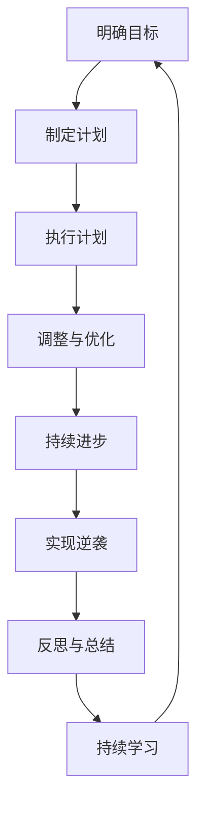

                 

### 《奋斗改变命运：如何在这个时代实现逆袭》

> **关键词：** 逆袭心态、目标设定、专业技能、软实力、职场规划、创业

> **摘要：** 本文将探讨如何在这个充满机遇与挑战的时代中，通过奋斗改变命运，实现人生的逆袭。文章从心态、技能、职场规划等多方面进行分析，结合实际案例，为广大读者提供实用的指导和建议。

#### 目录

1. **逆袭之路**
   1.1 逆袭心态与思维方式
   1.2 目标设定与计划制定
   1.3 自我认知与职业规划
   1.4 提升专业技能
   1.5 培养软实力
   1.6 提升领导力和团队协作能力

2. **逆袭行动**
   2.1 求职策略与技巧
   2.2 职场发展路径
   2.3 职场危机应对
   2.4 创业准备与规划
   2.5 创业项目选择与评估
   2.6 创业团队建设与管理

3. **逆袭案例与启示**
   3.1 科技行业逆袭案例
   3.2 传统行业逆袭案例
   3.3 多元跨界逆袭案例

4. **逆袭之路的反思与总结**
   4.1 逆袭成功的要素
   4.2 逆袭过程中的挑战与应对
   4.3 逆袭之路的持续进步

5. **未来逆袭之路**
   5.1 未来职场趋势分析
   5.2 如何应对未来挑战
   5.3 构建个人品牌与影响力

6. **附录**
   6.1 逆袭资源与工具
   6.2 参考文献

### 1.1 逆袭心态与思维方式

#### 1.1.1 心态决定一切

心态是成功逆袭的关键因素之一。一个积极的心态能够帮助我们克服困难，保持斗志，持续前行。在技术领域，心态尤为重要。它决定了我们在面对挑战时的态度，是否愿意不断学习新知识，是否愿意接受失败并从中吸取教训。

**积极心态的重要性：**

- **持续学习：** 积极的心态让我们愿意投入时间和精力去学习新技术、新知识。在技术领域，变化迅速，只有不断学习，才能保持竞争力。

- **面对失败：** 积极的心态使我们能够坦然面对失败，并将其视为成功路上的必经之路。通过失败，我们能够发现自身的不足，并不断改进。

- **保持动力：** 积极的心态让我们在面临困难和挫折时，仍能保持高昂的斗志，坚持不懈地追求目标。

**如何塑造积极的心态：**

- **设定明确的目标：** 明确的目标能够给我们带来动力和方向。通过设定短期和长期目标，我们能够更好地规划自己的学习和行动。

- **培养感恩心态：** 感恩能够让我们更加珍惜所拥有的一切，包括工作、家庭、朋友等。感恩的心态能够让我们更加积极面对生活和工作。

- **积极自我对话：** 我们需要时刻关注自己的内心对话，避免消极的自我否定。通过积极的自我对话，我们能够更好地鼓励自己，增强信心。

#### 1.1.2 塑造积极的心态

塑造积极的心态是一个持续的过程，需要我们在日常生活中不断练习和培养。

- **正面思维：** 尝试从积极的角度看待问题，将挑战视为成长的机会。

- **积极行动：** 积极的心态不仅体现在思考上，更体现在行动上。通过积极的行动，我们能够不断积累经验和成果。

- **与人交流：** 与积极的人交往，能够激发我们的积极心态。同时，分享自己的经历和感悟，也能够帮助我们更好地调整心态。

#### 1.1.3 调整思维方式

除了心态，思维方式也是影响我们逆袭的重要因素。一个正确的思维方式能够帮助我们更好地分析和解决问题，从而实现成功逆袭。

**批判性思维：** 批判性思维是一种能够帮助我们深入思考、评估和解决问题的能力。在技术领域，批判性思维尤为重要。通过批判性思维，我们能够更好地理解技术原理，发现技术的不足，并提出改进方案。

**系统思维：** 系统思维是一种能够帮助我们理解复杂系统、分析和解决复杂问题的能力。在技术领域，系统思维能够帮助我们更好地理解项目的整体架构，优化系统性能，提高系统的可靠性。

**创新思维：** 创新思维是一种能够帮助我们寻找新的解决方案、开拓新领域的能力。在技术领域，创新思维能够帮助我们不断突破技术瓶颈，推动技术进步。

#### 1.2 目标设定与计划制定

##### 1.2.1 设定明确的目标

设定明确的目标是实现逆袭的第一步。一个明确的目标能够给我们带来方向和动力，让我们更加专注于实现目标。

**设定目标的原则：**

- **具体性：** 目标要具体，明确知道自己要做什么。例如，而不是“提高编程能力”，而是“学习Python编程并完成一个小项目”。

- **可实现性：** 目标要具备可实现性，避免设定过高或过低的目标。

- **时限性：** 目标要设定明确的时限，以便我们能够更好地追踪进度。

- **挑战性：** 目标要具备一定的挑战性，激发我们的斗志和潜能。

**如何设定目标：**

- **自我反思：** 通过自我反思，了解自己的兴趣、优势和目标。

- **寻求反馈：** 向身边的朋友、同事或导师寻求反馈，了解他们的意见和建议。

- **制定目标清单：** 列出短期和长期的目标，明确每个目标的实现步骤。

##### 1.2.2 制定切实可行的计划

设定目标只是第一步，更重要的是制定切实可行的计划。一个良好的计划能够帮助我们更好地实现目标，提高效率。

**制定计划的步骤：**

- **明确目标：** 确认目标，确保计划与目标一致。

- **分解任务：** 将目标分解为具体的任务和行动步骤。

- **分配时间：** 根据任务的优先级和难度，合理分配时间。

- **设定里程碑：** 设定里程碑，以便我们能够及时了解进展情况。

- **执行与调整：** 按计划执行，并在执行过程中根据实际情况进行调整。

##### 1.2.3 持续跟踪与调整

计划制定后，我们需要持续跟踪进度，并根据实际情况进行调整。

**跟踪进度的方法：**

- **定期回顾：** 每周或每月回顾一次计划执行情况，总结经验和教训。

- **使用工具：** 使用日程表、任务管理工具等，帮助我们更好地跟踪进度。

**调整计划的方法：**

- **根据实际情况：** 根据实际情况，调整任务的优先级和时间分配。

- **学习与改进：** 从失败中学习，不断改进计划。

#### 1.3 自我认知与职业规划

##### 1.3.1 了解自己的优势与不足

自我认知是实现逆袭的重要一步。通过了解自己的优势与不足，我们能够更好地规划职业发展，发挥优势，弥补不足。

**优势分析：**

- **专业技能：** 我们的专业技能是我们在职场上的一大优势。了解自己的专业技能，能够帮助我们更好地定位职业发展方向。

- **兴趣爱好：** 兴趣爱好能够激发我们的潜能，使我们更加热爱工作，提高工作效率。

- **人际关系：** 良好的人际关系能够为我们的职业发展提供支持，帮助我们更好地融入团队，提高合作效率。

**不足分析：**

- **知识盲区：** 了解自己的知识盲区，能够帮助我们更好地制定学习计划，填补知识空白。

- **能力不足：** 了解自己的能力不足，能够帮助我们针对性地提升技能，提高竞争力。

##### 1.3.2 制定符合实际的职业规划

根据自我认知，制定符合实际的职业规划，是实现逆袭的关键。

**职业规划步骤：**

- **明确目标：** 确定长期和短期的职业目标。

- **评估现状：** 分析自己的优势和不足，了解市场趋势和行业需求。

- **制定计划：** 根据目标和现状，制定详细的职业发展计划。

- **执行与调整：** 按计划执行，并根据实际情况进行调整。

##### 1.3.3 持续学习与提升

持续学习与提升是实现逆袭的重要途径。在技术领域，知识更新迅速，只有不断学习，才能保持竞争力。

**学习方法：**

- **系统性学习：** 选择一门系统性的课程或书籍，从基础知识开始学习，逐步深入。

- **实践应用：** 将所学知识应用到实际项目中，通过实践来巩固和提升技能。

- **定期复盘：** 定期回顾自己的学习过程，总结经验和教训。

#### 1.4 提升专业技能

专业技能是实现逆袭的重要基石。在这个快速发展的时代，掌握一门或多门专业技能，能够为我们的职业发展提供强大的支持。

##### 1.4.1 学习专业技能的重要性

学习专业技能的重要性体现在以下几个方面：

- **提高竞争力：** 专业技能能够提高我们的职业竞争力，使我们在求职和职场中更具优势。

- **拓宽职业道路：** 掌握专业技能，能够拓宽我们的职业道路，为我们的职业发展提供更多的选择。

- **增加收入：** 专业技能能够提高我们的工作效率，使我们在工作中创造更多的价值，从而增加收入。

##### 1.4.2 主流职业技能介绍

在当前的技术领域，以下是一些主流职业技能：

- **编程技能：** 编程技能是技术人员必备的技能。掌握一门或多门编程语言，如Python、Java、C++等，能够帮助我们更好地应对工作需求。

- **数据库技能：** 数据库技能在各个行业都有广泛的应用。掌握SQL、NoSQL等数据库技术，能够帮助我们高效地处理和管理数据。

- **前端开发技能：** 前端开发技能包括HTML、CSS、JavaScript等，是网站和应用程序开发的基础。

- **后端开发技能：** 后端开发技能包括服务器、应用逻辑、数据库等，是网站和应用程序的核心。

- **人工智能技能：** 人工智能是当前的热门领域。掌握机器学习、深度学习等人工智能技术，能够帮助我们开发智能应用，提高工作效率。

##### 1.4.3 提升技能的方法与途径

提升技能的方法与途径多种多样，以下是一些常见的方法：

- **在线课程：** 在线课程是提升技能的一种便捷方式。通过在线课程，我们可以学习到最新的技术和知识。

- **自学：** 自学是一种自主性很强的学习方式。通过阅读书籍、观看视频、参加社区活动等，我们可以自主地学习技能。

- **实习：** 实习是提升技能的一种实践性很强的途径。通过实习，我们能够将所学知识应用到实际工作中，提高自己的实战能力。

- **参加培训：** 参加专业培训课程，能够系统地学习技能，并获得专业的指导。

#### 1.5 培养软实力

除了专业技能，软实力也是实现逆袭的重要因素。软实力是指我们在人际交往、沟通、团队合作等方面的能力。在技术领域，软实力同样重要，它能够帮助我们更好地融入团队，提高工作效率。

##### 1.5.1 软实力的定义与作用

软实力是指我们在人际交往、沟通、团队合作等方面的能力。它包括以下几个方面：

- **沟通能力：** 沟通能力是指我们与他人进行有效沟通、表达自己的观点和倾听他人意见的能力。

- **团队合作能力：** 团队合作能力是指我们与团队成员共同协作，共同完成项目的能力。

- **领导力：** 领导力是指我们带领团队、制定战略、解决问题和激励团队成员的能力。

- **自我管理能力：** 自我管理能力是指我们自我激励、自我调整、自我约束的能力。

软实力在技术领域的作用主要体现在以下几个方面：

- **提高工作效率：** 良好的软实力能够帮助我们更好地与团队成员沟通和协作，提高工作效率。

- **提升团队氛围：** 良好的软实力能够营造积极的团队氛围，增强团队的凝聚力。

- **推动职业发展：** 良好的软实力能够为我们的职业发展提供强大的支持，使我们更具竞争力。

##### 1.5.2 如何培养软实力

培养软实力需要我们在日常生活中不断练习和提升。以下是一些建议：

- **参加培训课程：** 参加专业的软实力培训课程，系统地学习软实力相关知识和技能。

- **阅读相关书籍：** 阅读关于软实力、人际交往、领导力等方面的书籍，丰富我们的知识和经验。

- **参与社区活动：** 参与社区活动，与更多的人交流和互动，提高自己的沟通和团队合作能力。

- **实际应用：** 将所学知识应用到实际工作中，通过实践来提升软实力。

##### 1.5.3 软实力的具体案例分析

以下是一个软实力在技术领域中的具体案例分析：

**案例：小张的逆袭之路**

小张是一名程序员，他在工作中发现自己缺乏团队合作和沟通能力，这使他在团队中难以发挥作用。为了提升自己的软实力，小张参加了团队合作的培训课程，学习了如何与团队成员有效沟通和协作。同时，他还积极参与社区活动，与更多的人交流和互动，提高了自己的沟通能力。

通过这些努力，小张逐渐在团队中发挥了重要作用，成为了团队的骨干成员。他的软实力的提升，不仅提高了工作效率，也推动了他在职业生涯中的发展。

#### 1.6 提升领导力和团队协作能力

在技术领域，领导力和团队协作能力是提升个人和团队绩效的关键因素。一个具备强大领导力和团队协作能力的人，能够更好地引领团队，克服困难，实现目标。

##### 1.6.1 领导力的重要性

领导力是指一个人在团队中引导、激励和影响他人的能力。在技术领域，领导力的重要性体现在以下几个方面：

- **提高团队绩效：** 强大的领导力能够激发团队成员的潜力，提高团队的整体绩效。

- **塑造团队文化：** 领导者能够塑造团队的价值观和文化，营造积极向上的工作氛围。

- **推动创新：** 领导者能够鼓励团队成员提出创新想法，推动技术进步。

##### 1.6.2 如何提升领导力

提升领导力需要我们在日常生活中不断练习和培养。以下是一些建议：

- **学习领导力理论：** 阅读领导力相关的书籍，学习领导力理论和方法。

- **实际应用：** 将所学知识应用到实际工作中，通过实践来提升领导力。

- **寻求反馈：** 向身边的朋友、同事或导师寻求反馈，了解自己的领导风格和改进方向。

- **参与领导力培训：** 参加专业的领导力培训课程，系统地学习领导力知识和技能。

##### 1.6.3 团队协作能力的培养

团队协作能力是指团队成员在共同目标下，相互支持、相互协作，共同完成任务的能力。以下是一些建议，帮助提升团队协作能力：

- **明确目标：** 确定团队的目标和期望，确保团队成员都清楚自己的职责和任务。

- **有效沟通：** 保持开放、积极的沟通，及时分享信息和反馈，避免误解和冲突。

- **相互信任：** 建立信任，鼓励团队成员相互支持和帮助，共同面对挑战。

- **分工协作：** 根据团队成员的能力和特长，合理分工，发挥每个人的优势。

- **共同进步：** 鼓励团队成员互相学习，共同进步，提高团队的总体能力。

#### 1.7 结束语

通过本章的讨论，我们了解到心态、技能、职业规划等因素在实现逆袭过程中的重要性。心态决定我们面对挑战的态度，技能决定我们的竞争力，职业规划决定我们的发展方向。在接下来的章节中，我们将进一步探讨如何在求职、职场发展和创业过程中，实现逆袭的目标。

### 2.1 求职策略与技巧

#### 2.1.1 求职前准备

求职是一个复杂而充满挑战的过程，充分的准备能够帮助我们更好地应对各种情况。以下是一些求职前准备的重要步骤：

**简历优化：**

简历是求职过程中的重要文档，它决定了我们能否获得面试机会。以下是简历优化的几个关键点：

- **内容真实：** 简历中的信息必须真实，避免夸大或虚构。诚实是求职的基础。

- **突出重点：** 突出自己的专业技能、工作经验和成果，让招聘者一眼就能看出我们的优势和潜力。

- **格式规范：** 使用清晰、规范的格式，确保简历易于阅读。避免使用过于花哨的设计，保持简洁明了。

- **定制化：** 针对每个职位，调整简历内容，使其与职位要求相匹配。

**求职信撰写：**

求职信是向招聘者展示我们诚意和沟通能力的重要途径。以下是一些建议：

- **简洁明了：** 求职信应简短、有力，避免冗长的叙述。

- **个性化：** 针对每个职位，撰写个性化的求职信，突出与职位相关的优势和经历。

- **表达诚意：** 表达自己对职位的热情和期望，展示出我们加入公司的决心。

- **规范格式：** 使用正式、规范的格式，确保求职信的专业性。

**网络形象管理：**

在互联网时代，我们的网络形象同样重要。以下是一些建议：

- **社交媒体：** 保持社交媒体的干净和正面，避免发布与求职不符的内容。

- **个人信息：** 避免在社交媒体上泄露过多个人信息，如地址、电话等。

- **专业头像：** 使用专业的头像，避免使用过于随意或非正式的照片。

**技能储备：**

在求职过程中，具备一定的技能储备能够帮助我们更好地应对各种挑战。以下是一些建议：

- **专业技能：** 提升自己在相关领域的专业技能，如编程、数据分析等。

- **软实力：** 培养良好的沟通、团队合作、领导力等软实力。

- **持续学习：** 不断学习新知识、新技能，保持自己的竞争力。

#### 2.1.2 求职渠道选择

选择合适的求职渠道能够帮助我们更高效地找到理想的职位。以下是一些常见的求职渠道：

**招聘网站：**

招聘网站是求职的主要渠道之一，以下是一些常用的招聘网站：

- **智联招聘**
- **前程无忧**
- **拉勾网**
- **猎聘网**

**社交媒体：**

社交媒体平台同样是一个重要的求职渠道，以下是一些建议：

- **LinkedIn：** LinkedIn 是一个专业的社交平台，适合寻找高薪职位和行业精英。
- **微信公众号：** 关注相关行业的微信公众号，了解最新的招聘信息和行业动态。
- **微信群和QQ群：** 加入行业相关的微信群和QQ群，与同行交流，获取招聘信息。

**校园招聘：**

对于在校学生或应届毕业生，校园招聘是一个重要的求职渠道。以下是一些建议：

- **校园宣讲会：** 参加各大公司的校园宣讲会，直接了解公司招聘信息。
- **校内就业服务：** 利用学校的就业服务中心，获取招聘信息和求职指导。
- **校友资源：** 利用校友资源，了解行业动态和求职机会。

**内部推荐：**

内部推荐是求职的一个高效途径，以下是一些建议：

- **建立人脉：** 通过参加各种活动、实习、项目等，建立广泛的人脉关系。
- **获取内推码：** 向朋友、同事或校友请求内部推荐，获取内推码，提高求职成功率。

**猎头服务：**

猎头服务是针对高薪职位的一种求职方式，以下是一些建议：

- **选择合适猎头公司：** 选择知名、专业的猎头公司，提高求职成功率。
- **提供详细简历：** 向猎头公司提供详细的简历，以便他们更好地为你推荐合适的职位。
- **保持沟通：** 与猎头公司保持良好沟通，及时反馈求职进展和需求。

#### 2.1.3 面试准备与技巧

面试是求职过程中至关重要的一环，充分的准备和技巧能够帮助我们更好地展示自己，提高求职成功率。以下是一些面试准备和技巧的建议：

**面试准备：**

- **了解公司和职位：** 在面试前，充分了解公司和职位的要求，以便更好地准备面试内容和展示自己的优势。

- **模拟面试：** 进行模拟面试，提高自己的面试表现和应对能力。

- **准备问题：** 准备一些关于公司和职位的问题，展示自己的热情和关注。

- **着装得体：** 根据公司和职位的要求，选择合适的着装，展现专业形象。

- **提前规划路线：** 确保面试当天能够准时到达面试地点，避免因交通问题影响面试。

**面试技巧：**

- **自信表达：** 保持自信，清晰、流畅地表达自己的观点和想法。

- **主动沟通：** 在面试过程中，主动与面试官沟通，展示自己的沟通能力和团队合作精神。

- **展现优势：** 突出自己的专业技能、工作经验和成果，展示自己的优势和潜力。

- **问题解答：** 准确、清晰地回答面试官的问题，避免模糊、含糊的回答。

- **注意非语言沟通：** 注意自己的表情、姿态和语言，保持礼貌和尊重。

- **反馈与感谢：** 面试结束后，及时向面试官表示感谢，展示自己的诚意和礼貌。

#### 2.2 职场发展路径

在职场中，发展路径的选择至关重要。正确的发展路径能够帮助我们充分发挥潜力，实现职业目标。以下是一些常见的职场发展路径：

**技术路线：**

技术路线是许多技术人才的首选发展路径。通过不断学习和提升专业技能，我们可以在技术领域中获得更高的职位和薪资。

**管理路线：**

管理路线适合那些具备领导能力和团队协作能力的人才。通过在管理岗位上积累经验，我们可以逐步晋升为部门经理、项目经理甚至公司高管。

**多元化发展：**

多元化发展是指我们在技术和管理等领域中，同时培养自己的多方面能力。这种发展路径能够帮助我们更好地适应职场变化，提高竞争力。

**跨行业转型：**

跨行业转型是指我们通过积累相关技能和经验，从技术或管理岗位转向其他行业。这种发展路径需要我们具备较强的适应能力和学习能力。

**创业：**

创业是一种具有挑战性但也充满机遇的发展路径。通过创业，我们可以实现自己的商业梦想，并在成功后获得丰厚的回报。

#### 2.2.1 初入职场

初入职场，我们面临着许多挑战和机遇。以下是一些初入职场的建议：

**适应环境：**

- **了解公司文化：** 在入职前，了解公司的文化和价值观，以便更好地适应工作环境。

- **积极沟通：** 与同事和上级保持良好的沟通，及时了解工作要求和期望。

- **主动学习：** 积极学习公司业务和技能，提高自己的工作效率和竞争力。

**建立人际关系：**

- **结识同事：** 通过参加公司活动、团队建设等，结识同事，建立良好的人际关系。

- **主动帮助：** 在工作中主动帮助同事，建立互助合作的团队氛围。

- **保持礼貌：** 在与同事交往中，保持礼貌和尊重，避免冲突和误解。

**提升技能：**

- **学习专业知识：** 通过培训、学习资源等，不断提升自己的专业技能。

- **实践经验：** 参与实际项目，通过实践来提高自己的能力和经验。

- **持续学习：** 跟进行业动态，学习新技术和新知识，保持竞争力。

**合理规划职业发展：**

- **设定目标：** 根据自己的兴趣和优势，设定明确的职业发展目标。

- **规划路径：** 制定合理的职业规划，逐步实现目标。

- **寻求指导：** 向上级或导师寻求指导和建议，帮助自己更好地发展。

#### 2.2.2 职场晋升策略

在职场中，晋升是我们职业发展的一个重要里程碑。以下是一些职场晋升策略的建议：

**提升专业技能：**

- **学习新技术：** 跟进行业发展趋势，学习新的技术和工具，提高自己的技能水平。

- **参与项目：** 积极参与各种项目，通过实践来提高自己的能力和经验。

- **专业认证：** 获得专业认证，证明自己的专业能力和水平。

**展现工作成果：**

- **完成任务：** 高质量地完成任务，展示自己的工作能力和价值。

- **积极反馈：** 向上级和同事分享工作成果，获得更多的认可和赞扬。

- **撰写报告：** 定期撰写工作总结和报告，展示自己的工作进展和成果。

**建立人际关系：**

- **维护人脉：** 与同事、上级和行业内的其他人士保持良好的关系。

- **主动沟通：** 在工作中主动与同事和上级沟通，展示自己的工作态度和能力。

- **团队合作：** 在团队中发挥自己的作用，与团队成员建立良好的合作关系。

**提升综合素质：**

- **沟通能力：** 提高自己的沟通能力，包括书面和口头沟通。

- **领导力：** 培养领导力，包括决策能力、团队管理能力和执行力。

- **自我管理：** 提高自我管理能力，包括时间管理、情绪管理和目标设定。

**积极寻求反馈：**

- **定期评估：** 定期与上级进行工作评估，了解自己的优势和不足。

- **反馈与改进：** 根据反馈，调整工作策略和方法，不断改进。

- **寻求指导：** 向上级或导师寻求指导和建议，帮助自己更好地发展。

#### 2.2.3 职场转型与规划

在职场中，随着个人发展和行业变化，转型与规划变得尤为重要。以下是一些职场转型与规划的建议：

**明确转型目标：**

- **自我评估：** 了解自己的兴趣、优势和专业技能，明确转型的方向和目标。

- **市场调研：** 分析市场需求和行业趋势，确定转型领域的发展前景。

- **设定目标：** 根据自身情况和市场调研结果，设定明确的转型目标。

**制定转型计划：**

- **学习新技能：** 根据转型目标，学习相关的新技能和知识。

- **获取证书：** 获得相关的职业证书，提高自己的专业水平。

- **实践经验：** 积累转型领域的实践经验，提高自己的实战能力。

**职业规划：**

- **长期目标：** 制定长期的职业规划，明确职业发展的方向和目标。

- **短期目标：** 设定短期目标，如学习新技能、完成项目等。

- **调整与优化：** 根据实际情况，不断调整和优化职业规划。

**寻求指导与支持：**

- **导师指导：** 寻求有经验的导师或职业规划师的帮助，获取专业的指导和建议。

- **内部推荐：** 利用公司内部资源，寻求内部推荐和转岗机会。

- **行业交流：** 参加行业交流活动和培训，拓宽人脉和视野。

#### 2.3 职场危机应对

在职场中，面对各种危机是不可避免的。以下是一些常见的职场危机以及应对策略：

**职业发展停滞：**

- **原因分析：** 分析导致职业发展停滞的原因，如技能不足、工作环境等。

- **自我提升：** 通过学习新技能、参加培训等，提高自己的能力和竞争力。

- **职业规划：** 根据自身情况和市场需求，重新规划职业发展路径。

**职场冲突：**

- **沟通解决：** 保持开放、积极的沟通，与冲突方进行坦诚的交流，寻找解决问题的方法。

- **求助于上级：** 如沟通无效，可寻求上级的帮助和介入，寻求公正的解决方案。

- **保持冷静：** 在冲突中保持冷静，避免情绪化的行为，以免加剧矛盾。

**工作压力：**

- **时间管理：** 学会时间管理，合理安排工作和休息时间，避免过度劳累。

- **寻求支持：** 与同事、朋友或家人分享压力，寻求情感支持和建议。

- **健康生活：** 保持健康的生活习惯，如适量运动、合理饮食，提高身体素质。

**职场失误：**

- **承认错误：** 勇敢地承认错误，避免逃避和推卸责任。

- **积极改进：** 分析失误的原因，制定改进措施，防止类似错误再次发生。

- **向上级汇报：** 及时向上级汇报失误情况，请求指导和帮助。

#### 2.4 创业准备与规划

创业是一条充满挑战和机遇的道路。成功的创业不仅需要专业的技能和知识，还需要充分的市场调研、商业计划和团队建设。以下是一些创业准备与规划的建议：

**市场调研：**

- **了解市场需求：** 通过市场调研，了解目标市场的需求、潜在客户和竞争对手。

- **分析竞争态势：** 分析竞争对手的优劣势，找到自己产品的独特卖点和竞争优势。

- **确定目标市场：** 根据市场调研结果，明确自己的目标市场和客户群体。

**商业计划书：**

- **明确商业目标：** 商业计划书应明确创业的目标、愿景和使命。

- **市场分析：** 详细分析市场需求、市场规模、市场趋势等。

- **产品与服务：** 描述产品或服务的特点、功能、市场定位和竞争优势。

- **营销策略：** 设计市场推广策略，包括广告、促销、渠道建设等。

- **运营计划：** 规划日常运营、人力资源、财务预算等。

- **风险评估：** 分析潜在的风险和挑战，并提出应对措施。

**资金筹备：**

- **个人储蓄：** 利用个人储蓄作为创业资金。

- **亲友借款：** 向亲友借款，需确保按时还款。

- **天使投资：** 寻找天使投资人，提供资金和资源支持。

- **风险投资：** 联系风险投资公司，寻求资金支持。

- **众筹平台：** 利用众筹平台，向社会公众筹集资金。

**团队建设：**

- **核心团队：** 建立核心团队，包括创始人、技术专家、市场营销专家等。

- **分工合作：** 明确团队成员的职责和角色，确保高效合作。

- **文化建设：** 塑造独特的团队文化，提高团队的凝聚力和执行力。

**法律法规：**

- **注册公司：** 了解相关法律法规，注册公司并办理营业执照。

- **知识产权：** 重视知识产权保护，申请专利、商标等。

- **税务政策：** 了解税务政策，确保合规经营。

- **劳动法规：** 了解劳动法规，合理管理员工和劳动关系。

#### 2.5 创业项目选择与评估

选择一个有潜力的创业项目是成功创业的关键。以下是一些项目选择与评估的建议：

**项目选择：**

- **兴趣与专业：** 选择自己感兴趣且具备专业背景的项目，提高创业的热情和专注力。

- **市场需求：** 选择市场需求大、发展前景好的项目，确保项目的可持续性。

- **竞争优势：** 选择具有独特卖点和竞争优势的项目，提高市场竞争力。

- **盈利模式：** 选择具有明确盈利模式的项目，确保创业项目的经济效益。

**项目评估：**

- **市场调研：** 通过市场调研，了解项目的市场需求、竞争对手和潜在客户。

- **盈利预测：** 评估项目的盈利能力和成长潜力，制定合理的盈利预测。

- **风险评估：** 分析项目面临的风险和挑战，制定相应的风险控制措施。

- **财务分析：** 进行财务分析，包括成本预算、收入预测和资金流动分析。

- **商业计划书：** 编制详细的商业计划书，明确项目的目标、策略和实施步骤。

**案例分享：**

以下是一个创业项目选择的案例：

**项目名称：** “智能家居监控系统”

**项目背景：** 随着科技的进步和人们对安全需求的增加，智能家居监控系统具有广阔的市场前景。

**市场需求：** 智能家居监控系统可以实时监控家庭安全，提高人们的生活质量，满足用户对安全的需求。

**竞争优势：** 该项目具有技术优势，采用先进的人工智能和物联网技术，提供智能化的监控解决方案。

**盈利模式：** 通过销售智能家居监控系统设备、提供监控服务以及销售相关的配件和耗材，实现盈利。

**风险评估：** 项目面临的技术更新风险、市场竞争风险和客户需求变化风险。通过技术研发、市场推广和客户关系管理，降低风险。

**财务预测：** 根据市场调研和财务分析，预计项目第一年可实现销售收入100万元，净利润20万元。

通过以上案例，我们可以看到，选择一个有潜力的创业项目需要从市场需求、竞争优势、盈利模式和风险评估等多个方面进行评估。

#### 2.6 创业团队建设与管理

一个成功的创业项目离不开优秀的团队。创业团队的建设与管理是创业过程中至关重要的一环。以下是一些团队建设与管理的方法和建议：

**核心团队组建：**

- **明确职责：** 根据项目需求，明确团队成员的职责和角色，确保每个成员都清楚自己的任务和目标。

- **互补能力：** 建立具有互补能力的团队，包括技术专家、市场营销专家、财务专家等，确保团队在各个领域都有专业人才。

- **共同愿景：** 建立共同的愿景和价值观，让团队成员都认同公司的使命和目标，提高团队的凝聚力。

**团队文化建设：**

- **积极氛围：** 营造积极向上的团队氛围，鼓励团队成员相互支持、共同进步。

- **开放沟通：** 建立开放、透明的沟通机制，鼓励团队成员提出建议和意见，增强团队的协作和创新能力。

- **激励机制：** 设立合理的激励机制，如奖金、股权等，激发团队成员的工作热情和积极性。

**团队管理策略：**

- **目标导向：** 设定明确的目标和里程碑，确保团队始终保持方向和动力。

- **过程监控：** 定期监控团队的工作进度和成果，及时发现和解决问题。

- **绩效评估：** 定期进行绩效评估，激励优秀员工，纠正不良行为。

**团队成员培养：**

- **技能培训：** 提供技能培训和学习资源，帮助团队成员提升专业技能和知识水平。

- **职业规划：** 帮助团队成员制定职业规划，提供职业发展的机会和空间。

- **激励成长：** 鼓励团队成员参加行业交流、培训和研讨会，拓宽视野，促进个人成长。

**团队沟通与协作：**

- **高效沟通：** 建立高效的沟通机制，确保信息畅通，减少误解和冲突。

- **协作机制：** 制定协作机制，明确团队成员的协作流程和责任分工，提高团队的工作效率。

- **团队建设活动：** 定期组织团队建设活动，如团队拓展、团建等，增强团队的凝聚力和合作意识。

#### 2.7 成功创业案例分享

创业是一条充满挑战的道路，但许多成功的企业家通过不懈努力，实现了自己的创业梦想。以下是一些成功的创业案例，分享他们的经验和教训：

**案例1：李想——理想汽车**

**背景：** 李想是理想汽车的创始人，他在2015年创立了理想汽车，专注于新能源汽车的研发和销售。

**经验教训：**

- **专注核心业务：** 李想一直专注于新能源汽车的研发，坚持做自己擅长的事情，确保产品品质。

- **市场定位准确：** 理想汽车定位于高端新能源汽车市场，通过打造高性能、高品质的产品，赢得了消费者的青睐。

- **创新技术：** 理想汽车在电池技术、自动驾驶等方面持续创新，为产品竞争力提供有力支持。

**案例2：雷军——小米科技**

**背景：** 雷军是小米科技的创始人，他在2010年创立了小米公司，迅速成为中国领先的智能手机制造商。

**经验教训：**

- **用户导向：** 小米始终坚持用户导向，通过互联网模式迅速获取用户反馈，不断优化产品和服务。

- **快速迭代：** 小米采用快速迭代的产品开发模式，不断推出新产品，满足用户需求。

- **跨界合作：** 小米在智能家居、互联网服务等领域进行跨界合作，打造生态链，提升品牌影响力。

**案例3：马云——阿里巴巴**

**背景：** 马云是阿里巴巴的创始人，他在1999年创立了阿里巴巴，成为全球最大的电子商务平台之一。

**经验教训：**

- **创新精神：** 马云具有强烈的创新精神，不断探索新的商业模式，推动互联网产业的发展。

- **全球化布局：** 阿里巴巴在全球范围内布局，通过投资和合作，拓展国际市场，提升品牌影响力。

- **社会责任：** 阿里巴巴关注社会责任，积极参与公益事业，提升企业形象。

**案例4：张一鸣——字节跳动**

**背景：** 张一鸣是字节跳动的创始人，他在2012年创立了字节跳动，迅速成长为全球最大的短视频平台TikTok的母公司。

**经验教训：**

- **技术创新：** 字节跳动在人工智能、大数据等领域持续创新，为用户提供优质的内容和服务。

- **内容生态：** 字节跳动通过构建多样化的内容生态，满足用户的不同需求，提升用户黏性。

- **全球化运营：** 字节跳动在多个国家和地区开展业务，实现全球化运营，提升品牌影响力。

这些成功的企业家通过不懈努力和创新精神，实现了创业梦想，他们的经验和教训对广大创业者具有很大的启示和借鉴意义。

### 3.1 逆袭成功的要素

#### 3.1.1 心态与毅力

心态和毅力是实现逆袭的重要因素。一个积极的心态能够帮助我们克服困难，保持斗志，持续前行。在技术领域，心态尤为重要。它决定了我们在面对挑战时的态度，是否愿意不断学习新知识，是否愿意接受失败并从中吸取教训。

**积极心态的重要性：**

- **持续学习：** 积极的心态让我们愿意投入时间和精力去学习新技术、新知识。在技术领域，变化迅速，只有不断学习，才能保持竞争力。

- **面对失败：** 积极的心态使我们能够坦然面对失败，并将其视为成功路上的必经之路。通过失败，我们能够发现自身的不足，并不断改进。

- **保持动力：** 积极的心态让我们在面临困难和挫折时，仍能保持高昂的斗志，坚持不懈地追求目标。

**如何培养积极的心态：**

- **设定明确的目标：** 明确的目标能够给我们带来动力和方向。通过设定短期和长期目标，我们能够更好地规划自己的学习和行动。

- **培养感恩心态：** 感恩能够让我们更加珍惜所拥有的一切，包括工作、家庭、朋友等。感恩的心态能够让我们更加积极面对生活和工作。

- **积极自我对话：** 我们需要时刻关注自己的内心对话，避免消极的自我否定。通过积极的自我对话，我们能够更好地鼓励自己，增强信心。

**毅力的重要性：**

毅力是实现逆袭的关键因素之一。它决定了我们在面对困难和挫折时，是否能够坚持下去，克服困难，取得成功。

**如何培养毅力：**

- **明确目标：** 一个明确的目标能够给我们带来动力和方向。通过设定短期和长期目标，我们能够更好地规划自己的学习和行动。

- **制定计划：** 制定切实可行的学习计划，合理安排时间和任务，确保能够持续进步。

- **积极反馈：** 通过积极反馈，如奖励自己、记录进步等，增强毅力和动力。

- **寻求支持：** 与家人、朋友或导师保持良好的沟通，寻求他们的支持和鼓励。

#### 3.1.2 技能与知识

技能和知识是实现逆袭的重要基础。在技术领域，技能和知识的积累决定了我们的竞争力。通过不断提升技能和知识，我们能够更好地应对工作中的挑战，提高工作效率，实现职业发展。

**技能的重要性：**

技能是我们在工作中解决问题的工具。掌握一门或多门专业技能，能够为我们在职场上提供强大的支持。

- **编程技能：** 编程技能是技术领域的基础。掌握一门或多门编程语言，如Python、Java、C++等，能够帮助我们更好地应对工作需求。

- **数据库技能：** 数据库技能在各个行业都有广泛的应用。掌握SQL、NoSQL等数据库技术，能够帮助我们高效地处理和管理数据。

- **前端开发技能：** 前端开发技能包括HTML、CSS、JavaScript等，是网站和应用程序开发的基础。

- **后端开发技能：** 后端开发技能包括服务器、应用逻辑、数据库等，是网站和应用程序的核心。

- **人工智能技能：** 人工智能是当前的热门领域。掌握机器学习、深度学习等人工智能技术，能够帮助我们开发智能应用，提高工作效率。

**如何提升技能：**

- **在线课程：** 在线课程是提升技能的一种便捷方式。通过在线课程，我们可以学习到最新的技术和知识。

- **自学：** 自学是一种自主性很强的学习方式。通过阅读书籍、观看视频、参加社区活动等，我们可以自主地学习技能。

- **实习：** 实习是提升技能的一种实践性很强的途径。通过实习，我们能够将所学知识应用到实际工作中，提高自己的实战能力。

- **参加培训：** 参加专业培训课程，能够系统地学习技能，并获得专业的指导。

**知识的重要性：**

知识是我们在工作中理解和解决问题的理论基础。通过不断积累和拓展知识，我们能够更好地应对复杂的工作任务。

- **专业知识：** 掌握自己在相关领域的专业知识，是提高工作效率和质量的关键。

- **跨学科知识：** 跨学科知识能够帮助我们更好地理解不同领域的知识和技能，提高综合能力。

- **行业动态：** 了解行业动态和趋势，能够帮助我们把握市场机会，提前布局。

**如何提升知识：**

- **阅读：** 阅读是提升知识的重要途径。通过阅读专业书籍、行业报告、学术论文等，我们可以拓展知识面，提高自己的理论水平。

- **学习：** 通过参加培训、课程、研讨会等，我们可以学习到最新的知识和技能。

- **实践：** 将所学知识应用到实际工作中，通过实践来巩固和提升知识。

#### 3.1.3 人际关系与资源

人际关系和资源是实现逆袭的重要支撑。在技术领域，人际关系和资源的积累能够为我们的职业发展提供强大的支持。

**人际关系的重要性：**

人际关系是我们在职场中获取资源、机会和支持的重要途径。通过建立良好的人际关系，我们能够更好地融入团队，提高工作效率，实现职业目标。

- **团队合作：** 良好的人际关系能够帮助我们更好地与团队成员沟通和协作，提高团队绩效。

- **职业发展：** 通过人际关系，我们能够获得更多的职业机会和晋升空间，加速职业发展。

- **资源获取：** 通过人际关系，我们能够获取更多的资源和支持，如技术资源、资金支持、人脉资源等。

**如何建立人际关系：**

- **主动沟通：** 主动与同事、上级和行业内的其他人士建立联系，保持良好的沟通。

- **互助合作：** 在工作中主动帮助他人，建立互助合作的团队氛围。

- **参加活动：** 参加各种行业活动、会议、培训等，结识更多同行，拓展人际关系。

**资源的重要性：**

资源是实现逆袭的重要基础。通过积累和利用资源，我们能够更好地应对工作中的挑战，提高工作效率，实现职业目标。

- **技术资源：** 通过积累技术资源，如技术文档、开发工具、开源代码等，提高自己的技术能力。

- **资金资源：** 通过积累资金资源，如投资、借款、众筹等，为创业和项目提供资金支持。

- **人脉资源：** 通过积累人脉资源，如导师、投资人、行业专家等，获取更多的职业机会和资源支持。

**如何积累资源：**

- **主动学习：** 通过学习新知识和技能，提升自己的专业能力，为自己积累更多的资源。

- **积极参与：** 参与各种行业活动、会议、研讨会等，结识更多同行，拓展人脉。

- **合作共赢：** 通过与他人合作，共同开发项目、分享资源，实现共赢。

### 3.2 逆袭过程中的挑战与应对

#### 3.2.1 如何应对失败

失败是逆袭过程中不可避免的一部分。如何应对失败，将其转化为成功的动力，是每个人都需要学会的重要能力。

**失败的原因：**

- **技能不足：** 在技术领域，技能不足可能导致项目失败或无法完成任务。
- **心态不稳：** 失败可能导致心态失衡，影响后续的工作和决策。
- **计划不周：** 缺乏周密的计划和准备，可能导致项目进展不顺。

**应对策略：**

- **分析原因：** 面对失败，首先要冷静分析原因，找出问题所在。
- **学习经验：** 从失败中学习，总结经验教训，避免同样的错误再次发生。
- **调整心态：** 保持积极的心态，将失败视为成长的机会。
- **改进计划：** 根据分析结果，改进计划和方法，提高项目成功率。

#### 3.2.2 应对挫折与逆境

挫折和逆境是逆袭过程中常见的障碍，但也是我们成长和进步的重要契机。

**挫折的原因：**

- **市场竞争：** 在激烈的市场竞争中，可能会遭遇竞争对手的打压和市场的变化。
- **资源限制：** 资金、人力和技术资源的不足，可能导致项目进展受阻。
- **个人因素：** 个人能力不足、心态不稳等，也可能导致挫折和逆境。

**应对策略：**

- **寻求支持：** 在面对挫折时，寻求家人、朋友或专业人士的支持，缓解压力。
- **持续学习：** 通过不断学习和提升自己，增强应对挫折的能力。
- **调整策略：** 根据实际情况，灵活调整策略和方法，寻找新的解决方案。
- **保持信念：** 坚持自己的目标和信念，不被挫折和逆境打倒。

#### 3.2.3 调整心态与策略

在逆袭过程中，调整心态和策略是持续前进的关键。

**心态调整：**

- **积极心态：** 保持积极的心态，看到问题的另一面，寻找解决问题的方法。
- **适应变化：** 面对不断变化的环境，学会适应和调整，灵活应对各种情况。
- **自我激励：** 通过自我激励，如设定小目标、奖励自己等，保持前进的动力。

**策略调整：**

- **目标调整：** 根据实际情况，适时调整目标和计划，确保目标的实现性。
- **资源整合：** 充分利用现有资源和外部资源，提高资源利用效率。
- **团队协作：** 加强团队协作，发挥团队成员的优势，共同应对挑战。

### 3.3 逆袭之路的持续进步

#### 3.3.1 持续学习与成长

持续学习与成长是实现逆袭的关键。在技术领域，知识更新迅速，只有不断学习，才能保持竞争力。

**学习资源：**

- **在线课程：** 利用慕课平台（如Coursera、edX等）学习最新的技术课程。
- **专业书籍：** 阅读专业书籍，深入了解技术原理和应用。
- **行业会议：** 参加行业会议和研讨会，了解行业动态和前沿技术。
- **社区活动：** 加入技术社区，与同行交流，分享经验和学习资源。

**学习方法：**

- **系统学习：** 选择一门系统性的课程或书籍，从基础知识开始学习，逐步深入。
- **实践应用：** 将所学知识应用到实际项目中，通过实践来巩固和提升技能。
- **定期复盘：** 定期回顾自己的学习过程，总结经验和教训。

#### 3.3.2 拓展视野与思维

拓展视野与思维是实现持续进步的重要途径。通过拓宽视野和思维方式，我们能够更好地应对复杂的问题和挑战。

**拓展视野：**

- **跨学科学习：** 学习不同领域的知识，拓宽视野，提高综合能力。
- **国际化视野：** 了解不同国家和地区的文化和市场，为国际化发展做好准备。
- **行业交流：** 与行业内其他专业人士交流，学习他们的经验和见解。

**思维方式：**

- **创新思维：** 培养创新思维，寻找新的解决方案，推动技术进步。
- **系统思维：** 培养系统思维，从整体上理解和解决问题，提高决策能力。
- **批判性思维：** 培养批判性思维，评估和质疑现有知识，推动自我提升。

#### 3.3.3 不断提升自我

不断提升自我是实现逆袭的关键。通过不断学习和成长，我们能够提高自己的竞争力，实现职业发展。

**职业规划：**

- **长期规划：** 设定长期的职业目标，制定实现目标的计划和步骤。
- **短期目标：** 设定短期目标，如学习新技能、完成项目等，逐步实现长期目标。
- **动态调整：** 根据市场变化和个人发展情况，适时调整职业规划。

**个人品牌建设：**

- **专业形象：** 塑造专业形象，提高个人在行业内的知名度和认可度。
- **社交媒体：** 利用社交媒体平台，展示自己的专业能力和成果。
- **分享经验：** 通过分享经验和心得，建立自己的专业影响力。

- **持续提升：** 通过不断学习和实践，提升自己的专业技能和综合素质，保持竞争优势。

### 4.1 未来职场趋势分析

随着科技的飞速发展，未来职场将呈现出许多新的趋势。了解这些趋势，有助于我们在职业生涯中做出更明智的决策。

#### 4.1.1 人工智能与职场

人工智能（AI）的快速发展正在深刻地改变职场生态。以下是一些关键趋势：

- **自动化与智能化：** 人工智能将在多个领域实现自动化和智能化，减少重复性劳动，提高工作效率。
- **数据驱动决策：** 数据分析和大数据技术的应用，将使企业更加依赖数据驱动决策，提高决策的科学性和精准性。
- **人机协作：** 人工智能将与传统劳动力实现更紧密的协作，提高整体生产力和创新能力。

#### 4.1.2 新型职业与机遇

随着技术的进步，许多新型职业正在涌现，为职场带来了新的机遇：

- **数据科学家：** 数据科学家是当前最热门的职业之一，他们利用数据分析技术，帮助企业和组织从数据中提取有价值的信息。
- **AI伦理学家：** 随着人工智能的发展，AI伦理学家成为了解决AI伦理问题、确保AI技术合理应用的重要角色。
- **数字营销专家：** 随着数字营销的兴起，数字营销专家成为企业吸引和保留客户的关键。

#### 4.1.3 未来职场挑战与应对

尽管未来职场充满了机遇，但也将面临一系列挑战：

- **技能更新：** 技能更新迅速，职场人士需要不断学习新技能，以适应技术变革。
- **工作稳定性：** 自动化和AI的广泛应用可能影响某些职业的工作稳定性，需要我们具备更强的适应能力。
- **心理健康：** 高强度的工作压力和快节奏的生活可能影响心理健康，需要我们关注心理健康问题，保持良好的心态。

#### 4.1.4 应对策略

为了应对未来职场的挑战，以下是一些建议：

- **持续学习：** 保持学习的热情，不断提升自己的专业技能和知识水平。
- **灵活适应：** 培养灵活适应变化的能力，学会在快速变化的职场环境中找到自己的定位。
- **心理健康：** 关注心理健康，保持良好的工作生活平衡，确保身心健康。

### 4.2 如何应对未来挑战

在未来职场中，我们不仅需要具备专业的技能和知识，还需要具备应对各种挑战的能力。以下是一些具体策略：

#### 4.2.1 技能更新与转型

随着技术的快速发展，许多传统职业正逐渐被新兴职业所取代。为了适应这种变化，以下是一些技能更新与转型的建议：

- **学习新技能：** 不断学习新技术和新兴职业所需的技能，如数据科学、人工智能、区块链等。
- **跨学科学习：** 拓宽知识面，学习跨学科的知识，提高综合能力和创新能力。
- **职业转型：** 在必要时，勇敢地进行职业转型，寻找新的发展方向。

#### 4.2.2 创新与创业

创新和创业是应对未来职场挑战的有效途径。以下是一些具体建议：

- **培养创新思维：** 培养创新思维，学会从不同角度思考问题，寻找新的解决方案。
- **积极参与创业：** 积极参与创业项目，通过实践来提升自己的创新能力。
- **寻找合作伙伴：** 寻找志同道合的合作伙伴，共同应对职场挑战。

#### 4.2.3 社会责任与职业道德

在未来的职场中，社会责任和职业道德将变得越来越重要。以下是一些建议：

- **遵循职业道德：** 严格遵守职业道德规范，做到诚信、公正、敬业。
- **关注社会责任：** 积极参与公益活动，关注社会问题，为企业和社会创造更大的价值。
- **培养团队精神：** 培养团队精神，与团队成员共同应对挑战，实现共同发展。

### 4.3 构建个人品牌与影响力

在未来的职场中，个人品牌和影响力将越来越重要。以下是一些构建个人品牌和影响力的策略：

#### 4.3.1 个人品牌的构建

构建个人品牌需要从以下几个方面入手：

- **专业形象：** 塑造专业的形象，包括穿着、言行举止等，展现出专业的素质和能力。
- **专业知识：** 通过不断学习和实践，提升自己的专业知识和技能，成为行业内的专家。
- **个人故事：** 塑造个人故事，讲述自己的成长经历和职业发展，展示自己的价值观和人生观。

#### 4.3.2 社交媒体运用

社交媒体是构建个人品牌的重要平台。以下是一些建议：

- **定期更新：** 定期在社交媒体上发布内容，分享自己的见解和经验，保持活跃度。
- **内容质量：** 提高内容质量，确保所发布的内容有价值、有深度，吸引更多的关注。
- **互动交流：** 与关注者进行互动，回答问题，参与讨论，建立良好的人际关系。

#### 4.3.3 影响力提升策略

提升个人影响力需要长期的努力和积累。以下是一些建议：

- **建立专业圈子：** 加入专业圈子，与同行建立联系，扩大人脉，提高自己的影响力。
- **参与行业活动：** 积极参与行业活动，如研讨会、讲座、展会等，展示自己的专业能力。
- **提供价值：** 通过分享经验和知识，为他人提供价值，建立自己的权威地位。

### 附录

#### 附录A：逆袭资源与工具

**职业发展资源：**

- **在线课程平台：** Coursera、edX、Udemy等
- **专业书籍网站：** Amazon、京东、当当等
- **职业规划工具：** LinkedIn、Indeed等

**创业工具与平台：**

- **创业孵化器：** Y Combinator、Techstars等
- **天使投资平台：** AngelList、EquityNet等
- **众筹平台：** Kickstarter、Indiegogo等

**个人品牌建设工具：**

- **社交媒体平台：** Twitter、LinkedIn、Instagram等
- **内容创作工具：** Canva、Hootsuite、Buffer等
- **博客平台：** WordPress、Blogger等

#### 附录B：参考文献

- **相关书籍：**
  - 《高效能人士的七个习惯》：史蒂芬·柯维
  - 《深度工作》：卡尔·纽波特
  - 《刻意练习》：安德斯·艾利克森

- **学术论文：**
  - "Success Factors in Entrepreneurship" by Scott Shane
  - "The Role of Psychological Capital in Entrepreneurship" by Kim, Zhou, and Gjerlow

- **在线课程与培训资源：**
  - Coursera上的“大数据分析”课程
  - edX上的“人工智能基础”课程
  - Udemy上的“Python编程入门”课程

### 附加内容

#### 附录C：逆袭案例Mermaid流程图

以下是一个逆袭案例的Mermaid流程图，展示关键节点和行动路径。



#### 附录D：核心算法原理与伪代码

以下是一个核心算法原理的伪代码示例，用于解释算法的实现过程。

```python
// 伪代码：机器学习模型训练
FUNCTION train_model(
    data: DATASET,
    parameters: PARAMETERS
)
    initialize: model = initial_model
    for each epoch do
        for each sample in data do
            compute_loss: loss = compute_loss(model, sample)
            compute_gradient: gradient = compute_gradient(model, sample)
            update_model: model = update_model(model, gradient)
        end for
    end for
    return: model
```

#### 附录E：数学模型与公式详解

以下是一个数学模型与公式的示例，使用LaTeX格式进行详细讲解。

```latex
\section{数学模型与公式详解}

$$
J(\theta) = \frac{1}{m} \sum_{i=1}^{m} (-y^{(i)} \log(h_\theta(x^{(i)})) + (1 - y^{(i)}) \log(1 - h_\theta(x^{(i)})))
$$

这是一个交叉熵损失函数，用于衡量实际输出与期望输出之间的差距。$h_\theta(x)$ 是模型预测的概率分布，$y$ 是真实标签。
```

#### 附录F：实战案例代码解读

以下是一个实战案例的代码示例，包括开发环境搭建、源代码实现和代码解读。

```python
# 安装相关库
pip install requests beautifulsoup4 pandas

# 代码实现
import requests
from bs4 import BeautifulSoup
import pandas as pd

# 求职网站请求URL
url = "https://www.example.com/jobs"

# 发送请求
response = requests.get(url)

# 解析HTML内容
soup = BeautifulSoup(response.text, "html.parser")

# 提取职位信息
jobs = soup.find_all("div", class_="job")

# 创建DataFrame存储职位信息
df_jobs = pd.DataFrame(columns=["职位", "公司", "地点", "薪资"])

# 遍历职位信息并添加到DataFrame
for job in jobs:
    title = job.find("h2", class_="title").text
    company = job.find("div", class_="company").text
    location = job.find("div", class_="location").text
    salary = job.find("div", class_="salary").text
    df_jobs = df_jobs.append({"职位": title, "公司": company, "地点": location, "薪资": salary}, ignore_index=True)

# 输出DataFrame
print(df_jobs)
```

**代码解读：**

1. **安装相关库：** 首先，我们安装requests、beautifulsoup4和pandas库，用于发送网络请求、解析HTML内容和处理数据。

2. **发送请求：** 使用requests库发送GET请求，获取求职网站的HTML内容。

3. **解析HTML内容：** 使用BeautifulSoup库解析HTML内容，提取职位信息。

4. **创建DataFrame：** 使用pandas库创建一个DataFrame，用于存储职位信息。

5. **遍历职位信息：** 遍历提取到的职位信息，将职位信息添加到DataFrame中。

6. **输出DataFrame：** 最后，输出DataFrame，展示职位信息。

通过以上代码，我们可以实现对求职网站职位信息的收集和筛选，为求职提供方便。在实际应用中，可以根据需要进一步扩展和优化代码，如增加职位筛选条件、处理异常情况等。

