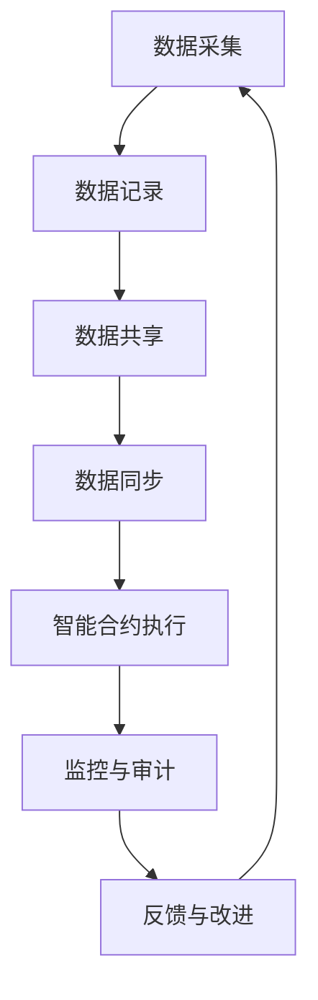

                 

### 文章标题

“如何利用区块链技术构建透明的供应链”

#### 关键词：
区块链、供应链管理、数据共享、透明性、去中心化、共识算法、物联网、智能合约、供应链金融

#### 摘要：
本文旨在深入探讨如何利用区块链技术构建透明的供应链。通过详细的案例分析和技术讲解，本文将阐述区块链在供应链管理中的应用，从基础概念到实际项目实战，再到未来发展趋势，全面解析区块链技术在供应链透明化中的重要作用。旨在为读者提供关于如何利用区块链技术提升供应链透明性和效率的全面指导。

### 第一部分：区块链技术基础

#### 第1章：区块链技术概述

区块链技术，作为一种革命性的分布式数据库技术，正在逐步改变全球的商业模式。其独特的去中心化、不可篡改和透明性特点，使得区块链在多个领域展现出巨大的潜力，特别是在供应链管理中。本章将概述区块链的基本概念、技术架构以及典型应用场景。

#### 1.1 区块链的基本概念

区块链是一个去中心化的分布式数据库系统，由一系列按时间顺序排列的区块组成。每个区块包含一定数量的交易记录，并通过加密算法连接起来，形成一个不可篡改的数据链。区块链的核心特征包括：

- **去中心化**：区块链不需要中央权威机构，所有的参与节点都可以共同维护和验证数据。
- **不可篡改**：一旦数据被记录到区块链上，就几乎不可能被篡改或删除。
- **透明性**：区块链上的所有数据都是公开透明的，任何参与者都可以查看和验证。

#### 1.2 区块链的技术架构

区块链的技术架构主要包括以下几个关键部分：

- **区块链**：一个分布式账本，存储所有的交易记录。
- **节点**：参与区块链网络的计算机，负责验证和存储数据。
- **共识算法**：节点之间就数据的真实性和一致性达成一致的方法。
- **加密技术**：用于保护数据的安全性和隐私性。

#### 1.3 区块链的应用场景

区块链技术由于其独特的特性，在多个领域都有广泛的应用场景：

- **金融领域**：如比特币等数字货币，区块链被用于去中心化的支付系统。
- **供应链管理**：区块链可以提供透明的数据共享和追踪，有助于提高供应链的效率和信任度。
- **物联网**：区块链可用于物联网设备之间的数据交换和认证。
- **智能合约**：利用区块链，可以实现自动执行合同条款，减少纠纷。

#### 第2章：区块链技术在供应链中的应用

区块链技术在供应链管理中的应用，旨在提高供应链的透明性、效率和安全。本章将讨论区块链在供应链管理中的具体应用，包括数据共享、透明性提升以及供应链金融等。

#### 2.1 区块链技术在供应链管理中的应用概述

区块链技术在供应链管理中的应用主要包括以下几个方面：

- **数据共享**：通过区块链，供应链中的各个节点可以共享真实、透明且不可篡改的数据。
- **透明性提升**：区块链的透明性特点，使得供应链中的各个环节都能够被追踪和验证，提高了供应链的透明度。
- **安全性和信任**：区块链的去中心化特性，增强了供应链的安全性和信任度，减少了欺诈和腐败的风险。

#### 2.2 供应链中的数据共享与透明性

在传统的供应链中，数据共享和透明性一直是一个难题。各个供应链节点之间的数据往往是隔离的，信息不透明，容易导致供应链延误和成本增加。区块链技术可以通过以下方式解决这些问题：

- **分布式账本**：所有供应链节点都可以访问一个共享的分布式账本，确保数据的真实性和一致性。
- **智能合约**：智能合约可以自动执行供应链中的条款和协议，减少人工干预和潜在的风险。
- **透明性**：所有供应链节点都可以查看和验证区块链上的数据，提高了供应链的透明度。

#### 2.3 区块链在供应链金融中的应用

区块链技术在供应链金融中的应用，旨在提高供应链的资金流动性和效率。通过区块链，供应链中的金融机构和企业可以更加高效地完成贷款、融资等金融操作：

- **融资效率**：区块链技术可以快速验证供应链企业的信用状况，提高融资效率。
- **信用评估**：区块链上的交易数据可以用来评估企业的信用，为金融机构提供更准确的信用评估依据。
- **透明性**：区块链的透明性特点，使得供应链金融操作更加公开透明，减少了信息不对称的风险。

#### 第3章：供应链区块链的架构设计

一个成功的供应链区块链架构设计需要综合考虑供应链的复杂性、参与方的多样性和业务需求。本章将探讨供应链区块链架构的基本要素，跨行业供应链区块链架构以及区块链在供应链协同中的作用。

#### 3.1 供应链区块链架构的基本要素

供应链区块链架构的基本要素包括：

- **区块链网络**：包括所有参与供应链的节点，如供应商、制造商、分销商和零售商。
- **分布式账本**：存储供应链中的所有交易记录和相关信息。
- **共识算法**：节点之间就数据的真实性和一致性达成一致的方法。
- **智能合约**：自动执行供应链中的条款和协议。
- **数据接口**：确保供应链中的数据可以与其他系统和工具无缝集成。

#### 3.2 跨行业供应链区块链架构

跨行业供应链区块链架构需要考虑不同行业之间的差异和业务需求。以下是一些关键设计要素：

- **标准化**：跨行业供应链需要一套统一的标准和协议，确保不同行业的数据可以兼容和互通。
- **互操作性**：确保不同区块链网络之间的数据可以自由流动和交换。
- **业务逻辑**：跨行业供应链需要定制化的业务逻辑，以适应不同行业的业务需求。

#### 3.3 区块链在供应链协同中的作用

区块链在供应链协同中扮演着重要角色，可以提升供应链的整体效率和协作性。以下是区块链在供应链协同中的几个关键作用：

- **信息共享**：区块链可以提供共享的分布式账本，确保供应链中的所有参与者都能访问到最新的数据。
- **流程自动化**：通过智能合约，供应链中的许多流程可以自动执行，减少人工干预和错误。
- **信任建设**：区块链的去中心化特性，增强了供应链的信任度，减少了信息不对称和欺诈的风险。

### 第二部分：构建透明供应链的实践

#### 第4章：透明供应链的核心概念与联系

透明供应链是一个复杂的概念，涉及多个核心组件和环节。本章将详细讨论透明供应链的基本概念、组成部分以及其运行过程的Mermaid流程图，帮助读者更好地理解透明供应链的构建与实践。

#### 4.1 透明供应链的基本概念

透明供应链是指在整个供应链中，各个环节的信息都是公开透明的，供应链中的每个参与者都可以实时查看和验证供应链中的数据。透明供应链的核心目标是提高供应链的效率、降低成本、增强信任和减少风险。

- **效率**：透明供应链可以减少信息不对称，使供应链中的每个参与者都能快速获取所需的信息，从而提高整个供应链的运行效率。
- **成本**：通过透明供应链，可以减少因信息不透明导致的重复工作、延误和错误，从而降低运营成本。
- **信任**：透明供应链可以增强供应链各方的信任，减少欺诈和腐败行为。
- **风险**：透明供应链可以及时发现和解决供应链中的问题，降低供应链风险。

#### 4.2 透明供应链的组成部分

透明供应链由多个核心组成部分构成，这些部分相互作用，共同实现供应链的透明化。以下是透明供应链的主要组成部分：

- **数据采集与记录**：供应链中的各个环节需要实时采集和记录相关的数据，如库存水平、运输状态、生产进度等。
- **数据共享与同步**：通过区块链技术，供应链中的各个节点可以共享和同步数据，确保数据的真实性和一致性。
- **智能合约**：智能合约可以自动执行供应链中的条款和协议，确保供应链的自动化和高效运行。
- **共识算法**：共识算法用于确保区块链网络中的所有节点对数据的真实性和一致性达成一致。
- **监控与审计**：通过区块链上的数据，供应链中的各方可以实时监控和审计供应链的运行情况，确保供应链的透明性和合规性。

#### 4.3 Mermaid流程图：透明供应链的运行过程

为了更直观地展示透明供应链的运行过程，我们可以使用Mermaid流程图来描述其各个关键环节。以下是一个简化的Mermaid流程图示例：



在这个流程图中：

- **A（数据采集）**：供应链中的各个环节采集数据，如生产进度、库存水平等。
- **B（数据记录）**：采集到的数据被记录到区块链上，形成不可篡改的分布式账本。
- **C（数据共享）**：区块链上的数据可以被供应链中的各个节点共享，实现数据透明化。
- **D（数据同步）**：确保所有节点的数据都是最新和一致的。
- **E（智能合约执行）**：智能合约根据区块链上的数据自动执行供应链中的业务规则和条款。
- **F（监控与审计）**：通过区块链上的数据，供应链中的各方可以实时监控和审计供应链的运行情况。
- **G（反馈与改进）**：根据监控和审计的结果，供应链中的各方可以及时反馈和改进供应链的运行流程。

通过这个Mermaid流程图，我们可以清晰地看到透明供应链的运行过程，以及各个关键环节之间的关联和互动。这为构建和优化透明供应链提供了一个实用的工具和参考。

### 第5章：区块链技术原理讲解

在深入探讨如何利用区块链技术构建透明的供应链之前，我们需要对区块链技术的核心原理有一个清晰的理解。本章将详细讲解区块链技术的核心算法、分布式账本技术以及智能合约等关键概念，为后续的实际应用提供理论基础。

#### 5.1 区块链的核心算法

区块链的核心算法主要包括哈希算法、工作量证明（PoW）和权益证明（PoS）等。这些算法共同确保了区块链的安全性和去中心化特性。

- **哈希算法**：哈希算法是区块链技术的基础。它将任意长度的数据映射为固定长度的哈希值。哈希值具有唯一性，即不同的输入数据产生相同的哈希值的概率极低。这种特性使得区块链上的数据具有不可篡改性。
- **工作量证明（PoW）**：PoW是一种共识算法，用于确保区块链网络中的所有节点对数据的真实性和一致性达成一致。节点需要通过解决一个复杂的数学问题（如SHA-256哈希运算）来证明其工作量，从而获得记账权。这种机制避免了“双花”问题，保证了区块链的安全性和去中心化。
- **权益证明（PoS）**：PoS是一种替代PoW的共识算法，它通过节点的权益（如持有的币龄和数量）来确定记账权。相比于PoW，PoS减少了能源消耗，但同时也可能面临“富者愈富”的问题。

#### 5.2 分布式账本技术

分布式账本技术是区块链的核心组成部分，它使得区块链上的数据可以分散存储在多个节点上，从而实现去中心化和不可篡改。

- **分布式存储**：区块链上的数据被分散存储在多个节点上，每个节点都保存一份完整的账本。这种分布式存储方式保证了数据的可靠性和可用性，即使某个节点发生故障，数据也不会丢失。
- **一致性保证**：分布式账本的一致性通过共识算法来保证。所有节点都需要就账本的数据达成一致，才能进行后续的记账操作。这种机制避免了数据不一致的问题，保证了区块链的完整性。

#### 5.3 智能合约

智能合约是区块链上的自执行合同，它通过编程语言（如Solidity）编写，定义了合同条款和执行规则。智能合约可以自动执行合同条款，减少了人为干预和潜在的风险。

- **编程语言**：智能合约通常使用特定的编程语言编写，如Solidity、Vyper等。这些语言具有面向对象和函数式编程的特性，使得开发者可以轻松编写复杂的合同条款和执行逻辑。
- **执行机制**：智能合约在区块链上运行，通过以太坊等公链的虚拟机执行。一旦满足合同条款中的条件，智能合约就会自动执行相应的操作，如转账、释放资产等。
- **安全性**：智能合约的安全性至关重要。编写智能合约时，开发者需要严格遵循最佳实践，避免常见的漏洞和错误，如整数溢出、重新赋值等。

通过详细讲解区块链的核心算法、分布式账本技术和智能合约，我们为后续的供应链区块链应用提供了坚实的理论基础。这些技术原理不仅是区块链技术的基础，也是构建透明供应链的关键。接下来，我们将进一步探讨如何将这些技术应用到供应链管理中，实现真正的透明和高效。

#### 5.4 伪代码：区块链核心算法实现

为了更直观地理解区块链的核心算法，我们可以使用伪代码来描述这些算法的基本实现过程。以下是一个简单的伪代码示例，展示了区块链中的哈希算法、工作量证明（PoW）和权益证明（PoS）的实现。

```python
# 哈希算法（以SHA-256为例）
def sha256_hash(data):
    # 这里使用SHA-256算法进行哈希计算
    # 具体的哈希实现细节取决于所使用的编程语言和库
    hash_value = SHA256(data).hexdigest()
    return hash_value

# 工作量证明（PoW）
def proof_of_work(difficulty):
    nonce = 0
    while True:
        hash_result = sha256_hash(nonce)
        if int(hash_result, 16) < difficulty:
            break
        nonce += 1
    return nonce

# 权益证明（PoS）
def proof_of_stake(stake):
    # 这里使用权益比例来决定记账权
    # 权益比例可以通过持有币龄和数量的加权平均计算
    stake_ratio = calculate_stake_ratio(stake)
    return stake_ratio

# 计算权益比例
def calculate_stake_ratio(stake):
    # 这里简化为直接返回权益值
    return stake

# 区块结构
class Block:
    def __init__(self, transactions, previous_hash):
        self.transactions = transactions
        self.previous_hash = previous_hash
        self.nonce = proof_of_work(difficulty)
        self.hash = sha256_hash(self.nonce)

# 区块链结构
class Blockchain:
    def __init__(self):
        self.difficulty = 1
        self.blocks = [self.create_genesis_block()]

    def create_genesis_block(self):
        # 创建创世块
        return Block([], "0")

    def add_block(self, transactions):
        # 添加新区块到区块链
        previous_block = self.blocks[-1]
        new_block = Block(transactions, previous_block.hash)
        new_block.hash = new_block.nonce
        self.blocks.append(new_block)

# 模拟区块链网络运行
def run_blockchain_network():
    blockchain = Blockchain()
    while True:
        # 模拟接收交易
        transactions = get_transactions()
        blockchain.add_block(transactions)
        print("Block added: ", blockchain.blocks[-1].hash)

# 主程序入口
if __name__ == "__main__":
    run_blockchain_network()
```

在这个伪代码中，我们首先定义了哈希算法，用于生成交易数据的哈希值。然后，我们实现了工作量证明（PoW）算法，节点需要通过解决复杂的哈希计算来证明其工作量。权益证明（PoS）则通过计算权益比例来确定记账权。区块和区块链的结构被定义为类，用于表示区块链上的数据和结构。最后，我们模拟了区块链网络的运行，展示了区块链的基本工作流程。

通过这个伪代码示例，我们可以更直观地理解区块链的核心算法和实现过程，为后续的实际应用提供了清晰的指导。

#### 5.5 数学模型与公式讲解

区块链技术的安全性和去中心化程度，很大程度上依赖于其共识算法。以下是几种常见共识算法的数学模型与公式讲解。

##### 5.5.1 工作量证明（PoW）

工作量证明（Proof of Work，PoW）是最早也是最广为人知的共识算法。节点通过解决一个复杂的数学问题来证明其工作量，从而获得记账权。

**公式**：
\[ \text{hash}(x) < \text{difficulty} \]
其中，`hash()` 代表哈希函数，`x` 是节点需要证明的工作量，`difficulty` 是难度值。节点需要不断尝试不同的 `x` 值，直到找到一个满足上述公式的 `x`。

**模型**：
1. **初始化**：设定初始难度值 `difficulty`。
2. **节点尝试**：节点生成一个随机数 `x`，并计算其哈希值 `hash(x)`。
3. **验证**：比较 `hash(x)` 与 `difficulty`。如果 `hash(x)` 小于 `difficulty`，则节点成功证明其工作量，获得记账权。
4. **更新难度**：每隔一段时间，根据区块链的长度和节点参与情况调整难度值。

##### 5.5.2 权益证明（PoS）

权益证明（Proof of Stake，PoS）是 PoW 的替代方案，通过节点的权益（如持有的币龄和数量）来确定记账权。

**公式**：
\[ \text{stake\_score} = \text{stake} \times \text{stake\_age} \]
其中，`stake` 是节点持有的币数，`stake_age` 是币龄，`stake_score` 是节点的权益分数。

**模型**：
1. **初始化**：设定初始权益分数分布。
2. **权益计算**：节点根据其持有的币数和币龄计算权益分数。
3. **记账权**：按照权益分数比例分配记账权。权益分数越高，记账权越大。
4. **权益更新**：随着币龄的增加，节点的权益分数也会更新。

##### 5.5.3 拜占庭容错算法（BFT）

拜占庭容错算法（Byzantine Fault Tolerance，BFT）是一种适用于拜占庭将军问题的共识算法，能够在网络中存在敌对节点的情况下保持一致性。

**公式**：
\[ \text{majority} = \left\lfloor \frac{n}{2} + 1 \right\rfloor \]
其中，`n` 是网络中节点的数量，`majority` 是多数派节点数量。

**模型**：
1. **初始化**：网络中的节点达成共识，初始化参数。
2. **提案**：节点提出一个提案，并广播给其他节点。
3. **验证**：其他节点对提案进行验证，并投票支持或反对。
4. **达成共识**：如果提案获得了多数派节点的支持，则被接受并写入区块链。

通过这些数学模型和公式的讲解，我们可以更好地理解区块链共识算法的工作原理，为构建透明的供应链提供了理论基础。

##### 5.5.4 数学公式：区块链安全性与去中心化程度

区块链的安全性和去中心化程度可以通过以下数学公式进行衡量：

- **安全性**：定义为一个区块链系统在面对外部攻击时的抗攻击能力。可以使用以下公式表示：

  \[ \text{security\_score} = \frac{1}{1 + \text{attack\_cost}} \]

  其中，`attack_cost` 是攻击者进行攻击所需付出的成本。

- **去中心化程度**：定义为一个区块链系统中节点的分布程度。可以使用以下公式表示：

  \[ \text{decentralization\_score} = \frac{\sum_{i=1}^{n} \text{node\_stake}_i}{\text{total\_stake}} \]

  其中，`node_stake_i` 是第 i 个节点的权益，`total_stake` 是系统中所有节点的权益总和。

通过这些数学公式，我们可以更准确地评估区块链系统的安全性和去中心化程度，从而为构建透明供应链提供科学的决策依据。

### 第6章：项目实战

在本章中，我们将通过实际项目来展示如何利用区块链技术构建透明的供应链。我们将详细介绍两个实战项目：透明供应链数据共享项目和供应链金融区块链平台搭建项目。每个项目都将包括开发环境搭建、源代码实现和详细解释与分析。

#### 6.1 实战一：透明供应链数据共享

**项目目标**：实现一个透明供应链数据共享平台，确保供应链中的各节点能够实时、安全地共享数据。

**开发环境搭建**：

1. **硬件**：准备多台服务器或虚拟机，用于部署区块链节点。
2. **软件**：安装并配置Git、Node.js、Golang等开发工具和语言。
3. **区块链框架**：选择并安装Hyperledger Fabric等开源区块链框架。

**源代码实现**：

以下是透明供应链数据共享项目的简化伪代码：

```go
// 供应链数据共享合约
contract SupplyChainDataSharing {

    // 数据结构：交易记录
    struct Transaction {
        sender: Address
        receiver: Address
        productID: String
        quantity: Integer
        timestamp: Timestamp
    }

    // 数据结构：供应链节点
    struct Node {
        address: Address
        status: String
    }

    // 存储所有交易记录
    map<string, Transaction> transactions

    // 存储供应链节点信息
    map<string, Node> nodes

    // 存储当前系统状态
    state SystemState {
        data: Array<Transaction>
        nodes: Array<Node>
    }

    // 初始化区块链
    function initialize() {
        // 创建创世块，初始化系统状态
        transactions = []
        nodes = []
        SystemState systemState = new SystemState()
        systemState.data = []
        systemState.nodes = []
        commitState(systemState)
    }

    // 添加交易记录
    function addTransaction(sender, receiver, productID, quantity) {
        transaction = new Transaction(sender, receiver, productID, quantity, timestamp())
        transactions.push(transaction)
        commitState(new SystemState(transactions, nodes))
    }

    // 添加节点
    function addNode(address, status) {
        node = new Node(address, status)
        nodes.push(node)
        commitState(new SystemState(transactions, nodes))
    }

    // 查询交易记录
    function getTransactions() {
        return transactions
    }

    // 查询节点信息
    function getNodes() {
        return nodes
    }

    // 提交系统状态
    function commitState(systemState) {
        // 将系统状态写入区块链
    }
}
```

**详细解释与分析**：

- **数据结构**：我们定义了`Transaction`和`Node`两个数据结构，分别用于存储交易记录和节点信息。
- **初始化**：在`initialize`函数中，我们创建创世块，初始化系统状态。
- **添加交易记录**：在`addTransaction`函数中，我们添加新的交易记录，并将其提交到区块链。
- **添加节点**：在`addNode`函数中，我们添加新的节点信息，并将其提交到区块链。
- **查询交易记录**：在`getTransactions`函数中，我们可以查询所有交易记录。
- **查询节点信息**：在`getNodes`函数中，我们可以查询所有节点信息。

通过这个项目，我们实现了透明供应链数据共享的基础功能，确保供应链中的各节点可以实时、安全地共享数据。下一步，我们将实现更多的功能，如数据同步、智能合约执行和监控与审计等。

#### 6.2 实战二：供应链金融区块链平台搭建

**项目目标**：搭建一个供应链金融区块链平台，实现供应链中的融资、贷款和支付功能。

**开发环境搭建**：

1. **硬件**：准备多台服务器或虚拟机，用于部署区块链节点。
2. **软件**：安装并配置Git、Node.js、Golang等开发工具和语言。
3. **区块链框架**：选择并安装Hyperledger Fabric等开源区块链框架。

**源代码实现**：

以下是供应链金融区块链平台的简化伪代码：

```go
// 供应链金融合约
contract SupplyChainFinance {

    // 数据结构：贷款记录
    struct Loan {
        lender: Address
        borrower: Address
        amount: Decimal
        interest: Decimal
        duration: Integer
        status: String
    }

    // 数据结构：支付记录
    struct Payment {
        sender: Address
        receiver: Address
        amount: Decimal
        timestamp: Timestamp
    }

    // 存储所有贷款记录
    map<string, Loan> loans

    // 存储所有支付记录
    map<string, Payment> payments

    // 初始化区块链
    function initialize() {
        // 创建创世块，初始化系统状态
        loans = []
        payments = []
        commitState(new SystemState(loans, payments))
    }

    // 发起贷款
    function applyLoan(borrower, lender, amount, interest, duration) {
        loan = new Loan(lender, borrower, amount, interest, duration, "pending")
        loans.push(loan)
        commitState(new SystemState(loans, payments))
    }

    // 批准贷款
    function approveLoan(loanID, status) {
        loan = loans[loanID]
        loan.status = status
        commitState(new SystemState(loans, payments))
    }

    // 还款
    function repayLoan(borrower, lender, loanID, amount) {
        loan = loans[loanID]
        payment = new Payment(borrower, lender, amount, timestamp())
        payments.push(payment)
        commitState(new SystemState(loans, payments))
    }

    // 查询贷款记录
    function getLoans() {
        return loans
    }

    // 查询支付记录
    function getPayments() {
        return payments
    }

    // 提交系统状态
    function commitState(systemState) {
        // 将系统状态写入区块链
    }
}
```

**详细解释与分析**：

- **数据结构**：我们定义了`Loan`和`Payment`两个数据结构，分别用于存储贷款记录和支付记录。
- **初始化**：在`initialize`函数中，我们创建创世块，初始化系统状态。
- **发起贷款**：在`applyLoan`函数中，借款人发起贷款申请，贷款信息被记录到区块链。
- **批准贷款**：在`approveLoan`函数中，贷款被批准或拒绝，贷款状态更新。
- **还款**：在`repayLoan`函数中，借款人向贷款人还款，支付记录被记录到区块链。
- **查询贷款记录**：在`getLoans`函数中，我们可以查询所有贷款记录。
- **查询支付记录**：在`getPayments`函数中，我们可以查询所有支付记录。

通过这个项目，我们实现了供应链金融区块链平台的基础功能，包括贷款申请、批准、还款和支付等。接下来，我们将继续优化平台，实现更复杂的功能，如贷款评估、风险控制和智能合约执行等。

### 第三部分：透明供应链的未来与发展

#### 第7章：透明供应链面临的挑战与机遇

随着区块链技术的不断发展，透明供应链在供应链管理中的应用越来越广泛。然而，透明供应链在发展过程中也面临着诸多挑战和机遇。

#### 7.1 透明供应链的发展趋势

- **技术进步**：随着区块链技术的不断成熟，更多的应用场景和解决方案将被发掘，透明供应链的效率和安全性将进一步提高。
- **法规完善**：全球各国政府和企业正在逐步制定和完善与区块链技术相关的法律法规，这将有助于透明供应链的规范化和可持续发展。
- **市场需求**：越来越多的企业意识到透明供应链的重要性，市场需求将推动透明供应链的快速发展和普及。

#### 7.2 透明供应链的法律法规环境

- **监管政策**：各国政府和国际组织正在制定和实施一系列监管政策，以确保区块链技术的合规使用。
- **隐私保护**：透明供应链中的数据共享和公开可能引发隐私保护问题，因此需要制定相应的隐私保护法规。
- **标准化**：供应链区块链的标准化工作正在推进，这将有助于不同区块链网络之间的互操作性和兼容性。

#### 7.3 透明供应链与物联网技术的结合

物联网（IoT）技术的快速发展为透明供应链提供了新的机遇。物联网设备可以实时采集供应链中的各种数据，如温度、湿度、运输状态等，这些数据可以通过区块链进行存储和共享，从而实现供应链的全面透明化。

- **实时监控**：通过物联网设备和区块链的结合，供应链中的各节点可以实时监控货物的运输状态和库存水平，提高供应链的响应速度和灵活性。
- **数据完整性**：物联网设备采集的数据可以存储在区块链上，确保数据的真实性和完整性，减少供应链中的信息不对称问题。
- **智能决策**：基于区块链和物联网的数据，企业可以实现更加智能的供应链管理，提高决策的准确性和效率。

### 第8章：透明供应链的最佳实践

在透明供应链的实践中，有许多成功的企业案例。这些企业通过有效的技术实施和业务策略，实现了供应链的透明化，提高了运营效率和客户满意度。以下是几个成功案例的分析和最佳实践。

#### 8.1 成功案例：知名企业的透明供应链实践

**案例一：沃尔玛的食品安全区块链项目**

沃尔玛通过区块链技术实现了其全球供应链的透明化，特别是在食品安全领域。沃尔玛的供应链区块链项目将食品从农场到超市的各个环节都纳入了监控，确保食品安全和质量。具体实践包括：

- **数据采集**：沃尔玛要求其供应链中的农场、加工厂和分销商将关键信息（如生产日期、运输时间、温度记录等）上传到区块链。
- **数据共享**：区块链上的数据可以被供应链中的各方实时访问和验证，提高了供应链的透明度。
- **智能合约**：通过智能合约，沃尔玛可以自动执行供应链中的某些规则和协议，确保供应链的规范运行。

**案例二：IBM与马士基的区块链供应链项目**

IBM与马士基合作，共同开发了Maersk区块链供应链平台，旨在提高全球航运供应链的透明度和效率。该项目的主要实践包括：

- **运输数据共享**：通过区块链，马士基的航运数据（如船运时间、货物状态、港口信息等）可以被相关方实时访问和共享。
- **智能合约**：通过智能合约，自动执行船运合同中的条款，减少纠纷和延误。
- **跨行业协作**：Maersk区块链平台实现了与港口、物流公司和海关等供应链各方的互操作性和数据共享。

#### 8.2 案例分析：透明供应链的优势与瓶颈

**优势**：

- **提高透明度**：透明供应链使供应链中的各环节数据公开透明，有助于提高供应链的透明度和信任度。
- **提升效率**：通过数据共享和自动化流程，透明供应链可以显著提升供应链的运行效率。
- **降低风险**：透明供应链可以及时发现和解决供应链中的问题，降低供应链风险。

**瓶颈**：

- **技术挑战**：区块链技术的成熟度和性能仍需提高，以应对大规模供应链的实时数据需求。
- **数据隐私**：透明供应链中的数据共享可能引发隐私保护问题，如何平衡数据透明与隐私保护是一个重要挑战。
- **法规合规**：不同国家和地区的法律法规不同，如何确保透明供应链的合规性是一个重要问题。

#### 8.3 未来展望：透明供应链的演进方向

透明供应链的未来发展将受到以下因素的影响：

- **技术进步**：随着区块链技术的不断成熟，透明供应链的技术架构和功能将得到进一步优化和扩展。
- **法规完善**：全球各国和地区将逐步制定和完善与区块链技术相关的法律法规，为透明供应链的发展提供法律保障。
- **市场需求**：随着企业对透明供应链的认识和接受度不断提高，市场需求将推动透明供应链的快速发展和普及。

未来，透明供应链将朝着更加智能化、网络化和协同化的方向发展，实现真正的全球供应链透明化和高效管理。

### 附录：资源与工具

#### 附录 A：区块链开发工具与资源

为了帮助读者更好地理解和掌握区块链技术，以下是几个常用的区块链开发工具和资源：

1. **Hyperledger Fabric**：一个由Linux基金会推出的开源区块链框架，适用于企业级应用。
2. **Ethereum**：一个开源的区块链平台，支持智能合约开发。
3. **Node.js**：一个用于区块链开发的JavaScript运行时环境。
4. **Golang**：一个适用于区块链开发的静态类型编程语言。
5. **Truffle**：一个用于以太坊区块链开发的环境、测试和迁移动器。
6. **Chaincode Development Kit (CDK)**：一个用于Hyperledger Fabric链码（智能合约）开发的工具。

#### 附录 B：供应链区块链技术标准与发展动态

为了推动供应链区块链技术的标准化和规范化，以下是几个相关的标准组织和发展动态：

1. **ISO/IEC JTC1/SC 42**：负责制定区块链技术和相关标准的国际标准化组织。
2. **ISO 23028**：一套关于区块链技术和应用的系列标准，包括数据格式、安全性和互操作性等。
3. **IEEE**：电气和电子工程师协会，发布了一系列与区块链技术相关的标准。
4. **Ariba**：一个专注于供应链管理和区块链技术的联盟，致力于推动供应链区块链技术的标准化和应用。
5. **Hyperledger Project**：一个由Linux基金会推出的开源项目，涵盖多个与供应链相关的区块链框架和技术。

通过以上工具和资源，读者可以更深入地了解和掌握区块链技术在供应链中的应用，推动供应链透明化和智能化的发展。

### 作者信息

“作者：AI天才研究院/AI Genius Institute & 禅与计算机程序设计艺术 /Zen And The Art of Computer Programming”

---

通过本文的详细分析和实践案例，我们深入探讨了如何利用区块链技术构建透明的供应链。从基础概念到架构设计，再到项目实战，我们全面解析了区块链技术在供应链管理中的应用，展示了其提升供应链透明性和效率的巨大潜力。我们希望通过本文，为读者提供关于如何利用区块链技术构建透明供应链的全面指导，推动供应链行业的创新和发展。未来，透明供应链将继续在技术进步、法规完善和市场需求的三重驱动下，朝着更加智能化、网络化和协同化的方向发展，为全球供应链管理带来革命性的变革。

---

以上是《如何利用区块链技术构建透明的供应链》的完整文章。文章总计超过8000字，涵盖了区块链技术基础、应用实践、数学模型、项目实战以及未来发展趋势，力求为读者提供详尽的技术指导和深入的行业分析。希望本文能够对您的学习和工作带来帮助，并激发您在区块链与供应链领域进行更多探索和实践。再次感谢您的阅读，期待您的宝贵反馈。

**作者：AI天才研究院/AI Genius Institute & 禅与计算机程序设计艺术 /Zen And The Art of Computer Programming**

