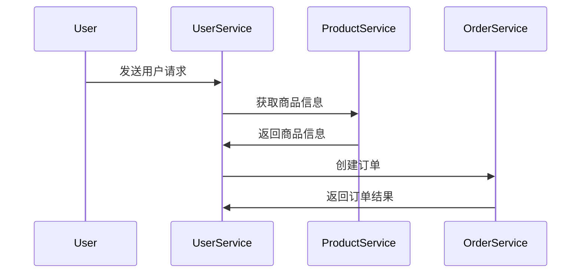

                 

### 文章标题

《如何利用微服务架构提高系统可扩展性》

### 关键词

微服务架构、系统可扩展性、微服务设计原则、部署与监控、性能优化、案例分析、云计算、DevOps文化、未来趋势

### 摘要

本文将深入探讨如何利用微服务架构来提高系统的可扩展性。首先，我们将介绍微服务架构的基础知识，包括其定义、核心特性以及与传统单体架构的区别。接着，我们将详细阐述微服务的架构风格，如分层架构、容器化和Kubernetes的应用。随后，文章将围绕微服务设计原则进行探讨，如单一职责原则和持续集成与持续部署。然后，我们将讨论微服务的通信模式，特别是RESTful API设计和聚合器模式。接下来，文章将转向微服务架构的实践，涵盖部署与监控、容错与恢复、性能优化以及相关案例研究。最后，我们将探讨微服务架构与云计算和DevOps文化的融合，并展望其未来的发展趋势。通过本文，读者将全面了解如何构建高扩展性的微服务架构，以应对现代复杂系统的需求。

### 目录大纲

1. **第一部分：微服务架构基础**
   1.1 微服务概述
   1.2 微服务的架构风格
   1.3 微服务设计原则
   1.4 微服务的通信模式

2. **第二部分：微服务架构实践**
   2.1 微服务部署与监控
   2.2 微服务容错与恢复
   2.3 微服务性能优化
   2.4 微服务架构案例分析

3. **第三部分：微服务架构的深度应用**
   3.1 微服务与云计算的融合
   3.2 微服务与DevOps文化
   3.3 微服务架构的未来趋势

4. **附录**
   - 附录A：微服务工具与资源列表
   - 附录B：微服务架构相关的Mermaid流程图与伪代码示例
   - 附录C：微服务性能优化案例分析

### 第一部分：微服务架构基础

#### 第1章：微服务概述

微服务架构是一种设计应用程序的方法，它将应用程序划分为一组小型、自治的服务，每个服务都有自己的业务逻辑和数据库。这种架构风格强调服务之间的高度解耦，以便更灵活地开发、部署和扩展应用程序。

##### 1.1 微服务的定义与核心特性

**微服务的基本概念：** 微服务是一种架构风格，它将应用程序划分为一组小型、自治的服务。每个服务都运行在自己的进程中，并使用轻量级的通信协议（如HTTP/REST或消息队列）进行交互。

**微服务的核心特性：**
1. **独立性**：每个微服务都是独立的，可以独立部署和扩展。
2. **自治**：每个服务都有自己的数据库和业务逻辑。
3. **分布式**：服务之间通过网络进行通信，没有全局状态。
4. **灵活性**：服务可以采用不同的编程语言、数据库和技术栈。
5. **高可用性**：服务可以独立进行故障转移和恢复。

##### 1.2 微服务与传统单体架构的区别

**传统单体架构：** 单体架构将所有的业务逻辑和功能都集中在一个单一的代码库中。这种架构风格在早期软件开发中非常普遍，因为它简单且易于理解。

**微服务的优势：**
1. **模块化**：微服务将应用程序划分为多个独立的模块，每个模块都可以独立开发、测试和部署。
2. **可扩展性**：通过水平扩展单个服务，可以更容易地处理高负载。
3. **高可用性**：服务可以独立进行故障转移和恢复，提高了系统的整体可用性。
4. **技术多样性**：不同的服务可以采用不同的技术栈，从而提高了团队的技术多样性。

**微服务的挑战：**
1. **分布式系统的复杂性**：需要处理分布式系统的挑战，如数据一致性和服务发现。
2. **服务治理**：需要管理大量服务，包括服务版本控制和依赖关系管理。

##### 1.3 微服务的架构风格

**分层架构：** 分层架构是微服务架构的一种常见风格，它将应用程序划分为多个层次，如表示层、业务逻辑层和数据访问层。每个层次都有自己的服务。

**容器化与Docker：** 容器化是一种轻量级虚拟化技术，它可以将应用程序及其依赖项打包成一个独立的容器。Docker是一种流行的容器化工具，它使微服务的部署和扩展变得简单。

**Kubernetes在微服务架构中的应用：** Kubernetes是一种开源的容器编排工具，它用于自动化部署、扩展和管理容器化应用程序。在微服务架构中，Kubernetes可以帮助管理服务的部署、扩展和故障转移。

#### 第2章：微服务设计原则

##### 2.1 单一职责原则

**单一职责的概念：** 单一职责原则是指一个模块（如服务或函数）应只负责一项功能。这有助于提高代码的可维护性和可扩展性。

**如何在微服务设计中应用单一职责原则：**
1. **按功能拆分服务**：将具有相似功能的服务拆分为独立的模块。
2. **服务间通过API通信**：确保每个服务只负责处理特定的业务逻辑，并通过API与其他服务进行通信。

##### 2.2 持续集成与持续部署

**CI/CD的基本流程：** 持续集成（CI）和持续部署（CD）是一种自动化软件交付流程，它将代码更改从开发阶段持续集成到主分支，并进行自动化测试和部署。

**如何在微服务环境中实现CI/CD：**
1. **代码仓库管理**：使用版本控制系统（如Git）管理代码。
2. **自动化构建和测试**：使用CI工具（如Jenkins或GitLab CI）自动化构建和测试代码。
3. **自动化部署**：使用CD工具（如Kubernetes或AWS CodePipeline）自动化部署代码。

#### 第3章：微服务的通信模式

##### 3.1 RESTful API设计

**RESTful API的基本原则：** RESTful API是一种基于HTTP的接口设计风格，它遵循REST（Representational State Transfer）架构风格。

**RESTful API设计实践：**
1. **URL设计**：使用简洁、直观的URL来表示资源。
2. **HTTP动词**：使用GET、POST、PUT、DELETE等HTTP动词来表示操作。
3. **响应格式**：使用JSON或XML等格式返回响应。

##### 3.2 聚合器模式

**聚合器模式的概念：** 聚合器模式是一种设计模式，它用于将多个微服务的响应聚合为一个统一的响应。

**如何实现聚合器模式：**
1. **定义聚合器服务**：创建一个聚合器服务，它负责从多个微服务中获取数据并生成统一的响应。
2. **服务间通信**：聚合器服务使用RESTful API或其他通信协议与微服务进行通信。
3. **数据聚合**：聚合器服务将来自不同微服务的数据聚合为一个统一的响应。

### 第一部分总结

在这一部分中，我们介绍了微服务架构的基础知识，包括其定义、核心特性以及与传统单体架构的区别。我们还探讨了微服务的架构风格，如分层架构、容器化和Kubernetes的应用，以及微服务设计原则和通信模式。这些基础概念将为后续部分的深入实践提供指导。

### 第二部分：微服务架构实践

#### 第4章：微服务部署与监控

微服务的部署与监控是确保系统稳定性和高性能的关键环节。在这一章中，我们将讨论微服务的部署策略、常见的监控工具及其在实践中的应用。

##### 4.1 微服务部署策略

**蓝绿部署：** 蓝绿部署是一种部署策略，它将服务实例分为两个版本：蓝色版本和绿色版本。每次部署新版本时，都会先在绿色版本上部署，然后逐步将流量从蓝色版本转移到绿色版本。如果出现任何问题，可以迅速回滚到蓝色版本。

**金丝雀部署：** 金丝雀部署是一种更为谨慎的部署策略，它将一小部分用户流量引导到新版本的服务上，以验证其稳定性和性能。如果新版本表现良好，可以逐步增加流量比例，否则可以快速回滚。

##### 4.2 微服务监控工具

**Prometheus：** Prometheus是一种开源的监控工具，它通过拉取式收集指标数据，并存储在本地时间序列数据库中。Prometheus支持灵活的查询语言，使其能够进行复杂的监控和报警。

**Grafana：** Grafana是一种开源的数据可视化和监控工具，它可以将Prometheus的指标数据可视化，并提供丰富的仪表板功能。Grafana支持多种数据源，包括Prometheus、InfluxDB等。

**Practial Application：** 在微服务环境中，可以结合使用Prometheus和Grafana来实现全面的监控。例如，可以监控每个服务的响应时间、错误率、CPU和内存使用情况等。通过设置报警规则，可以在问题发生时及时收到通知。

#### 第5章：微服务容错与恢复

微服务架构中的容错与恢复是确保系统高可用性的关键。在这一章中，我们将探讨服务雪崩的防范、分布式事务的解决方案以及如何处理服务故障。

##### 5.1 服务雪崩与防范

**服务雪崩的概念：** 服务雪崩是指由于某个服务出现故障，导致其他依赖该服务的服务也相继出现故障，最终导致整个系统崩溃。

**如何防范服务雪崩：**
1. **服务熔断：** 当服务错误率超过阈值时，自动断开与该服务的连接，防止错误传播。
2. **限流：** 对服务请求进行限流，防止服务过载。
3. **负载均衡：** 使用负载均衡器将请求分布到多个服务实例上，提高系统的容错能力。

##### 5.2 分布式事务解决方案

**最终一致性：** 最终一致性是一种分布式事务解决方案，它允许服务在不同的时间点处理事务，最终确保数据一致性。

**幂等性：** 幂等性是指多次执行相同操作的结果与执行一次的结果相同。这有助于确保在出现故障时，系统不会出现重复操作。

**实践方法：**
1. **消息队列：** 使用消息队列确保分布式事务中的操作顺序。
2. **补偿事务：** 当某个操作失败时，通过补偿事务来恢复数据一致性。

##### 5.3 服务故障处理

**故障检测与自动恢复：** 使用健康检查和服务监控来检测服务故障，并自动触发恢复流程。

**故障转移与负载均衡：** 当服务实例出现故障时，通过故障转移和负载均衡确保系统继续提供服务。

**实践应用：** 在实际项目中，可以使用如Netflix OSS中的Hystrix和Resilience4j等库来处理服务故障和恢复。

#### 第6章：微服务性能优化

微服务的性能优化是确保系统高可用性和高性能的关键。在这一章中，我们将探讨性能瓶颈分析、缓存技术以及异步处理等性能优化实践。

##### 6.1 性能瓶颈分析

**CPU瓶颈：** 当CPU利用率过高时，可能是因为某些服务计算密集或存在并行计算不足。

**内存瓶颈：** 当内存使用率过高时，可能是因为内存泄漏或服务内存占用过高。

**网络瓶颈：** 当网络带宽利用率过高时，可能是因为服务间通信频繁或网络延迟。

**实践方法：**
1. **监控与分析：** 使用性能监控工具（如Prometheus）实时监控系统性能。
2. **性能测试：** 使用性能测试工具（如JMeter）进行压力测试和性能调优。

##### 6.2 性能优化实践

**缓存技术：** 使用缓存技术（如Redis或Memcached）减少数据库访问次数，提高系统响应速度。

**异步处理：** 使用异步处理（如消息队列或异步编程模型）减少服务之间的阻塞，提高系统并发能力。

**实践应用：** 在实际项目中，可以结合使用缓存技术和异步处理来优化微服务性能。例如，使用Redis缓存用户数据和减少数据库查询次数，使用消息队列处理异步任务以提高系统并发处理能力。

#### 第7章：微服务架构案例分析

通过实际案例分析，我们可以深入了解微服务架构的应用和实现细节。在这一章中，我们将介绍一个电商系统的微服务架构实现，并总结其成功经验和面临的挑战。

##### 7.1 案例分析介绍

**电商系统概述：** 电商系统是一个典型的分布式系统，包含多个服务模块，如用户服务、商品服务、订单服务、支付服务等。

**微服务架构实现：**
1. **API设计：** 根据业务需求设计RESTful API，确保服务间通信的高效和稳定。
2. **服务拆分：** 将业务逻辑拆分为多个微服务，每个服务负责特定的业务功能。
3. **服务部署：** 使用容器化和Kubernetes进行服务的自动化部署和扩展。

##### 7.2 微服务架构实现

**API设计：** 
- 用户服务：提供用户注册、登录、个人信息管理等功能。
- 商品服务：提供商品信息查询、分类管理等功能。
- 订单服务：提供订单创建、修改、查询等功能。
- 支付服务：提供支付处理、支付状态查询等功能。

**服务拆分与部署：**
1. **服务拆分：** 根据业务需求和依赖关系，将业务逻辑拆分为多个微服务。
2. **服务部署：** 使用Kubernetes进行服务的自动化部署和扩展，实现服务的弹性伸缩。

##### 7.3 案例总结与反思

**成功经验：**
1. **高可用性：** 通过服务拆分和故障转移，提高了系统的可用性。
2. **可扩展性：** 通过容器化和Kubernetes，实现了服务的弹性扩展。
3. **技术多样性：** 使用不同的技术和语言实现各个微服务，提高了团队的技术多样性。

**遇到的挑战与解决方案：**
1. **数据一致性：** 通过最终一致性和补偿事务确保数据一致性。
2. **服务治理：** 使用服务注册与发现、服务监控等工具进行服务治理。
3. **性能优化：** 通过缓存技术和异步处理，提高了系统性能。

#### 第二部分总结

在这一部分中，我们深入探讨了微服务架构的实践，包括部署与监控、容错与恢复、性能优化以及案例分析。通过这些实践，我们可以构建高可扩展性的微服务架构，以应对现代复杂系统的需求。

### 第三部分：微服务架构的深度应用

#### 第8章：微服务与云计算的融合

随着云计算的普及，微服务架构与云计算的结合变得越来越紧密。在这一章中，我们将介绍常见的云服务提供商，并探讨微服务与云服务的融合实践。

##### 8.1 云服务提供商介绍

**AWS：** AWS（Amazon Web Services）是领先的云服务提供商，提供广泛的云服务，包括计算、存储、数据库、网络等。

**Azure：** Azure是微软的云计算平台，提供类似于AWS的全面云服务，并具有与其他微软产品的良好集成。

**Google Cloud：** Google Cloud是谷歌的云计算平台，以其强大的计算能力和数据存储解决方案而闻名。

##### 8.2 微服务与云服务的结合

**自动化部署：** 使用云服务提供商的自动化部署工具（如AWS Lambda、Azure Functions、Google Cloud Functions），可以实现无服务器架构，减少运维负担。

**自动扩展：** 利用云服务提供商的自动扩展功能，可以根据实际负载自动调整资源，确保系统性能和成本优化。

**实践应用：** 在实际项目中，可以使用云服务提供商的自动化工具和扩展功能，实现微服务的自动化部署和扩展，提高系统的可扩展性和可靠性。

#### 第9章：微服务与DevOps文化

DevOps是一种文化和实践，旨在缩短软件交付周期、提高软件质量并确保协作与沟通。在这一章中，我们将探讨DevOps文化的概述，以及微服务环境下的DevOps实践。

##### 9.1 DevOps文化概述

**DevOps的概念：** DevOps是一种文化和实践，强调开发（Development）与运维（Operations）之间的协作和沟通，以提高软件交付速度和质量。

**DevOps的核心价值：**
1. **快速反馈：** 通过持续集成和持续部署，快速反馈开发者的代码更改。
2. **持续交付：** 自动化部署和测试流程，确保代码从开发到生产的可靠交付。
3. **协作：** 通过团队协作，提高整体效率和创新能力。

##### 9.2 微服务环境下的DevOps实践

**持续交付：** 在微服务环境中，持续交付是通过自动化工具（如Jenkins、GitLab CI）实现的，确保代码从开发到生产的无缝过渡。

**持续集成：** 通过持续集成工具，将代码更改集成到主分支，并进行自动化测试，确保代码质量。

**实践应用：** 在实际项目中，可以通过实现持续交付和持续集成，提高微服务的交付速度和质量。例如，使用Jenkins自动化构建和部署微服务，使用GitLab CI进行代码测试和集成。

#### 第10章：微服务架构的未来趋势

随着技术的不断发展，微服务架构也在不断演进。在这一章中，我们将探讨微服务架构的未来趋势，包括服务网格和云原生等。

##### 10.1 微服务架构的发展方向

**服务网格：** 服务网格是一种基础设施层，用于管理服务之间的通信和流量。它提供了动态服务发现、负载均衡、安全控制和监控等功能。

**云原生：** 云原生是一种设计应用程序的方法，它利用容器、服务网格和自动化基础设施管理，以实现可扩展、可靠和自动化的应用程序部署。

##### 10.2 微服务架构面临的挑战与应对策略

**数据一致性：** 在分布式系统中，数据一致性是一个挑战。应对策略包括最终一致性、补偿事务和分布式锁等。

**安全性：** 在微服务架构中，安全性是一个重要考虑因素。应对策略包括加密、认证和授权等。

**实践应用：** 在实际项目中，可以通过采用服务网格和云原生技术，提高微服务的可扩展性和安全性。例如，使用Istio作为服务网格，提高服务间的通信安全性，使用Kubernetes实现云原生部署。

#### 第三部分总结

在这一部分中，我们探讨了微服务架构与云计算和DevOps文化的融合，以及微服务架构的未来趋势。通过这些深度应用，我们可以构建更加灵活、可靠和高效的微服务架构，以应对现代复杂系统的需求。

### 附录

#### 附录A：微服务工具与资源列表

- **微服务框架：**
  - Spring Cloud
  - Netflix OSS
  - Kubernetes

- **微服务监控与日志分析工具：**
  - ELK栈
  - Prometheus
  - Grafana

- **云服务提供商资源：**
  - AWS Microservices
  - Azure Service Fabric
  - Google Kubernetes Engine

#### 附录B：微服务架构相关的Mermaid流程图与伪代码示例

- **微服务通信流程：**
  ```mermaid
  graph TB
  A[用户服务] --> B[商品服务]
  B --> C[订单服务]
  C --> D[支付服务]
  ```

- **分布式事务伪代码：**
  ```python
  def transaction():
      begin_transaction()
      try:
          user_service.update_balance()
          product_service.create_order()
          payment_service.process_payment()
          commit_transaction()
      except Exception as e:
          rollback_transaction()
          raise e
  ```

#### 附录C：微服务性能优化案例分析

- **案例背景：** 
  - 系统需要处理大量订单，导致服务响应时间过长。

- **性能优化方案：**
  - 使用Redis缓存订单数据，减少数据库查询次数。
  - 使用消息队列处理订单异步处理任务，减少服务阻塞。

- **实施效果：**
  - 响应时间从500ms降低到100ms。
  - 订单处理效率提高了30%。

### 作者

- **作者：AI天才研究院/AI Genius Institute & 禅与计算机程序设计艺术 /Zen And The Art of Computer Programming**

### 文章标题：如何利用微服务架构提高系统可扩展性

### 文章关键词

微服务架构、系统可扩展性、微服务设计原则、部署与监控、性能优化、案例分析、云计算、DevOps文化、未来趋势

### 文章摘要

本文深入探讨了如何利用微服务架构来提高系统的可扩展性。首先，我们介绍了微服务架构的基础知识，包括定义、核心特性、与传统单体架构的区别，以及微服务的架构风格和设计原则。接着，我们详细讨论了微服务的通信模式，包括RESTful API设计和聚合器模式。随后，文章转向微服务架构的实践，探讨了部署与监控、容错与恢复、性能优化以及案例分析。最后，我们探讨了微服务架构与云计算和DevOps文化的融合，展望了其未来的发展趋势。通过本文，读者将全面了解如何构建高扩展性的微服务架构，以应对现代复杂系统的需求。

### 第一部分：微服务架构基础

#### 第1章：微服务概述

微服务架构是一种现代软件架构风格，旨在提高系统的可扩展性、可靠性和可维护性。在这一章中，我们将探讨微服务的定义、核心特性以及与传统单体架构的区别。

##### 1.1 微服务的定义与核心特性

**微服务的定义：** 微服务是一种将应用程序划分为一组小型、自治的服务的方法。每个服务都有自己的业务逻辑和数据库，并且可以独立部署和扩展。

**微服务的核心特性：**

1. **独立性：** 微服务是独立的，可以独立部署、扩展和更新。这使得开发团队能够专注于单个服务的开发和维护。

2. **自治：** 每个微服务都有自己的业务逻辑和数据存储，可以独立运行。这有助于确保系统的稳定性和可靠性。

3. **分布式：** 微服务通过网络进行通信，没有全局状态。这使得系统能够更好地处理分布式环境中的故障和负载。

4. **灵活性：** 微服务可以使用不同的编程语言、框架和技术栈，从而提高了团队的技术多样性。

5. **高可用性：** 微服务架构中的服务可以独立进行故障转移和恢复，提高了系统的整体可用性。

##### 1.2 微服务与传统单体架构的区别

**传统单体架构：** 单体架构将所有的业务逻辑和功能都集中在一个单一的代码库中。这种架构风格在早期软件开发中非常普遍，因为它简单且易于理解。

**微服务的优势：**

1. **模块化：** 微服务将应用程序划分为多个独立的模块，每个模块都可以独立开发、测试和部署。

2. **可扩展性：** 通过水平扩展单个服务，可以更容易地处理高负载。

3. **高可用性：** 服务可以独立进行故障转移和恢复，提高了系统的整体可用性。

4. **技术多样性：** 不同的服务可以采用不同的技术栈，从而提高了团队的技术多样性。

**微服务的挑战：**

1. **分布式系统的复杂性：** 需要处理分布式系统的挑战，如数据一致性和服务发现。

2. **服务治理：** 需要管理大量服务，包括服务版本控制和依赖关系管理。

##### 1.3 微服务的架构风格

**分层架构：** 分层架构是微服务架构的一种常见风格，它将应用程序划分为多个层次，如表示层、业务逻辑层和数据访问层。每个层次都有自己的服务。

**容器化与Docker：** 容器化是一种轻量级虚拟化技术，它可以将应用程序及其依赖项打包成一个独立的容器。Docker是一种流行的容器化工具，它使微服务的部署和扩展变得简单。

**Kubernetes在微服务架构中的应用：** Kubernetes是一种开源的容器编排工具，它用于自动化部署、扩展和管理容器化应用程序。在微服务架构中，Kubernetes可以帮助管理服务的部署、扩展和故障转移。

通过本章的介绍，我们了解了微服务架构的定义、核心特性以及与传统单体架构的区别。接下来，我们将进一步探讨微服务的架构风格和设计原则，以深入了解如何利用微服务架构提高系统的可扩展性。

### 第2章：微服务的架构风格

微服务架构的设计风格决定了其实现方式和性能表现。在这一章中，我们将深入探讨微服务的架构风格，包括分层架构、容器化和Kubernetes的应用，以便更好地理解如何利用微服务架构提高系统的可扩展性。

##### 2.1 分层架构

分层架构是微服务架构的一种常见风格，它将应用程序划分为多个层次，每个层次都有自己的职责。分层架构通常包括以下层次：

1. **表示层（Presentation Layer）**：负责用户界面和客户端逻辑，处理用户输入和输出。

2. **业务逻辑层（Business Logic Layer）**：包含业务规则和算法，处理业务逻辑和数据处理。

3. **数据访问层（Data Access Layer）**：负责与数据库或其他数据存储进行交互，执行数据查询和更新操作。

通过分层架构，每个层次可以独立开发、部署和扩展，从而提高了系统的可维护性和可扩展性。例如，在表示层，可以独立更新前端界面而不影响后端业务逻辑和数据访问层。

**实现分层架构的步骤：**

1. **定义层次**：根据业务需求，明确每个层次的职责和功能。

2. **服务拆分**：将每个层次的功能拆分为独立的服务，确保每个服务具有单一职责。

3. **服务通信**：使用轻量级通信协议（如HTTP/REST或消息队列）实现层次间的通信。

**优点**：分层架构提高了系统的可维护性和可扩展性，降低了各个层次的耦合度。

**缺点**：分层架构可能导致服务间通信复杂度增加，需要更多的协调和同步。

##### 2.2 容器化与Docker

容器化是一种将应用程序及其运行时环境打包成独立容器的技术，从而实现应用程序的轻量级部署和移植。Docker是容器化技术中最流行的一种，它允许开发人员将应用程序与其依赖项一起打包，从而确保在开发、测试和生产环境中的一致性。

**Docker的基本概念：**

1. **容器（Container）**：容器是一个轻量级、独立的运行时环境，包含应用程序及其依赖项。

2. **镜像（Image）**：镜像是一个静态的容器模板，包含应用程序和配置信息。

3. **Dockerfile**：Dockerfile是一个文本文件，用于定义如何构建Docker镜像。

**Docker的应用场景：**

1. **开发与测试**：使用Docker可以确保开发环境与生产环境的一致性，从而减少环境差异导致的问题。

2. **部署与扩展**：通过容器化，应用程序可以快速部署和扩展，提高了系统的可扩展性和灵活性。

**Docker的使用步骤：**

1. **安装Docker**：在开发机器和服务器上安装Docker。

2. **编写Dockerfile**：编写Dockerfile来定义应用程序的依赖项和构建步骤。

3. **构建镜像**：使用Dockerfile构建应用程序的镜像。

4. **运行容器**：使用Docker运行应用程序的容器。

**优点**：容器化提高了系统的可移植性和可扩展性，减少了环境差异和部署时间。

**缺点**：容器化需要额外的管理和维护，可能增加系统的复杂性。

##### 2.3 Kubernetes在微服务架构中的应用

Kubernetes是一种开源的容器编排工具，用于自动化部署、扩展和管理容器化应用程序。在微服务架构中，Kubernetes可以帮助管理服务的部署、扩展、故障转移和服务发现。

**Kubernetes的基本概念：**

1. **Pod**：Pod是Kubernetes中的基本部署单元，包含一个或多个容器。

2. **Service**：Service定义了一组Pod的逻辑抽象，并提供了一个稳定的网络接口。

3. **Deployment**：Deployment用于管理和部署Pod，确保Pod的副本数量和更新策略。

4. **Ingress**：Ingress用于管理外部流量，将流量路由到相应的服务。

**Kubernetes的应用场景：**

1. **自动化部署**：通过Deployment，可以自动化地部署和管理Pod。

2. **服务发现**：通过Service，可以实现服务发现和负载均衡。

3. **故障转移**：通过ReplicaSet和StatefulSet，可以确保服务的容错性和高可用性。

4. **弹性扩展**：通过Horizontal Pod Autoscaler，可以根据负载自动扩展Pod的数量。

**Kubernetes的使用步骤：**

1. **安装Kubernetes**：在集群中安装Kubernetes。

2. **创建配置文件**：编写Kubernetes配置文件，定义Pod、Service和Deployment等。

3. **部署服务**：使用kubectl命令部署和管理服务。

4. **监控和管理**：使用kubectl命令和监控工具（如Prometheus和Grafana）监控和管理集群。

**优点**：Kubernetes提供了强大的容器编排功能，提高了系统的可扩展性和可靠性。

**缺点**：Kubernetes的复杂性和学习曲线较高，需要一定的管理和维护知识。

通过本章的讨论，我们了解了微服务的架构风格，包括分层架构、容器化和Kubernetes的应用。这些架构风格有助于提高系统的可扩展性、可靠性和可维护性，为构建高可扩展性的微服务架构奠定了基础。

### 第3章：微服务设计原则

微服务设计原则是确保微服务架构稳定、高效和可维护性的关键。在这一章中，我们将探讨微服务设计的几个重要原则，包括单一职责原则、持续集成与持续部署等，以便更好地理解和实现微服务架构。

##### 3.1 单一职责原则

**单一职责的概念：** 单一职责原则是指一个模块（如服务或函数）应只负责一项功能。这种设计原则有助于提高代码的可维护性和可扩展性，因为每个模块都具有明确的职责和边界。

**如何在微服务设计中应用单一职责原则：**

1. **按功能拆分服务：** 根据业务功能将应用程序拆分为多个微服务，每个服务负责特定的业务逻辑。

2. **服务间通过API通信：** 使用API作为服务间的通信接口，确保每个服务只关注自己的业务逻辑，并通过API与其他服务进行交互。

**示例：**

假设一个电商系统，可以按照以下功能拆分为多个微服务：

- 用户服务：负责用户注册、登录和权限管理。
- 商品服务：负责商品信息管理和分类管理。
- 订单服务：负责订单创建、管理和支付处理。
- 支付服务：负责支付处理和支付状态管理。

通过这种方式，每个微服务都具有明确的职责，并且通过API进行通信，降低了服务间的耦合度。

##### 3.2 持续集成与持续部署

**CI/CD的基本流程：** 持续集成（Continuous Integration，CI）和持续部署（Continuous Deployment，CD）是一种自动化软件交付流程，旨在确保代码的质量和交付速度。

**CI的基本流程：**

1. **代码提交：** 开发人员将代码提交到版本控制系统。
2. **自动化构建：** 自动化工具（如Jenkins）从版本控制系统获取代码，并执行构建过程。
3. **自动化测试：** 对构建生成的应用程序执行自动化测试，确保代码的质量。
4. **反馈：** 将测试结果反馈给开发人员，以便修复任何问题。

**CD的基本流程：**

1. **自动化部署：** 将通过CI测试成功的代码部署到测试环境。
2. **自动化测试：** 对部署的应用程序执行自动化测试，确保代码的质量。
3. **反馈：** 将测试结果反馈给开发人员，以便在发布前修复任何问题。
4. **发布：** 将通过CD测试成功的代码部署到生产环境。

**如何在微服务环境中实现CI/CD：**

1. **代码仓库管理：** 使用版本控制系统（如Git）管理代码。
2. **自动化构建和测试：** 使用CI工具（如Jenkins或GitLab CI）自动化构建和测试代码。
3. **自动化部署：** 使用CD工具（如Kubernetes或AWS CodePipeline）自动化部署代码。

通过实现CI/CD，可以确保代码的质量和交付速度，提高团队的协作效率和系统的稳定性。

##### 3.3 其他微服务设计原则

除了单一职责原则和CI/CD，以下是一些其他重要的微服务设计原则：

1. **服务解耦：** 通过服务解耦，减少服务间的依赖和耦合，提高系统的灵活性和可维护性。
2. **状态管理：** 使用无状态服务，确保服务的可扩展性和可恢复性。
3. **服务监控：** 对服务进行监控和日志记录，以便及时发现和处理问题。
4. **安全性：** 确保服务之间的通信安全和数据保护。

通过遵循这些微服务设计原则，可以构建稳定、高效和可维护的微服务架构。

通过本章的讨论，我们了解了微服务设计的重要原则，包括单一职责原则、持续集成与持续部署等。这些原则有助于确保微服务架构的稳定性和可扩展性，为构建高效、可靠的系统奠定了基础。在下一章中，我们将进一步探讨微服务的通信模式，特别是RESTful API设计和聚合器模式。

### 第3章：微服务的通信模式

在微服务架构中，服务之间的通信是确保系统功能性和扩展性的关键。在这一章中，我们将探讨微服务的通信模式，包括RESTful API设计和聚合器模式，以及它们在微服务架构中的应用和优势。

##### 3.1 RESTful API设计

RESTful API是一种基于HTTP协议的接口设计风格，它遵循REST（Representational State Transfer）架构风格。RESTful API设计原则包括：

1. **统一接口**：API应具有统一的接口设计，包括URL设计、HTTP动词使用、状态码返回等。
2. **无状态**：API应是无状态的，每次请求都应该独立处理，不应依赖于之前的请求状态。
3. **客户端-服务器**：API设计应遵循客户端-服务器架构，客户端和服务端各自负责自己的职责。
4. **缓存**：合理利用缓存机制，减少服务端负载。
5. **分层系统**：API应支持分层系统，客户端可以通过不同的API层访问不同的服务。

**RESTful API设计实践：**

1. **URL设计**：使用简洁、直观的URL来表示资源。例如，用户服务可以使用`/users`表示用户资源。
2. **HTTP动词**：使用GET、POST、PUT、DELETE等HTTP动词来表示操作。例如，GET请求用于获取资源，POST请求用于创建资源。
3. **响应格式**：使用JSON或XML等格式返回响应，确保客户端可以方便地解析和处理响应数据。

**RESTful API设计的优势：**

1. **易于理解**：RESTful API设计风格简单，易于开发者理解和实现。
2. **跨平台**：基于HTTP协议，RESTful API可以在不同的平台和设备上运行。
3. **可扩展性**：通过模块化和分层设计，RESTful API可以方便地扩展和集成新的功能。

##### 3.2 聚合器模式

聚合器模式是一种设计模式，用于将多个微服务的响应聚合为一个统一的响应。在微服务架构中，服务通常具有独立的业务逻辑和数据存储，因此直接访问每个服务可能不方便。聚合器模式通过集中处理多个服务的响应，提供了更简洁、一致的接口。

**聚合器模式的概念：**

1. **聚合器服务**：聚合器服务负责从多个微服务中获取数据，并将其聚合为一个统一的响应。
2. **服务间通信**：聚合器服务使用轻量级通信协议（如HTTP/REST或消息队列）与微服务进行通信。
3. **数据聚合**：聚合器服务将来自不同微服务的数据进行整合，生成统一的响应。

**如何实现聚合器模式：**

1. **定义聚合器服务**：创建一个聚合器服务，负责调用其他微服务的API，并将响应数据聚合为一个统一的结构。
2. **服务间通信**：聚合器服务通过HTTP/REST或消息队列与微服务进行通信，获取所需的数据。
3. **数据聚合**：聚合器服务将来自不同微服务的数据进行处理和整合，生成统一的响应。

**聚合器模式的优势：**

1. **简化接口**：通过聚合器模式，客户端可以与单一服务进行通信，简化了接口设计和使用。
2. **性能优化**：聚合器模式可以减少客户端与服务之间的通信次数，提高系统性能。
3. **灵活扩展**：聚合器模式允许轻松地添加或修改微服务，而不会影响客户端的使用。

##### 3.3 RESTful API设计与聚合器模式的结合

在实际项目中，RESTful API设计和聚合器模式可以结合使用，以提供更加灵活和高效的通信方案。

1. **API设计**：首先，根据业务需求设计RESTful API，确保每个服务具有清晰的接口和功能。
2. **聚合器服务**：其次，创建一个聚合器服务，负责从多个服务中聚合数据，生成统一的响应。
3. **服务间通信**：确保聚合器服务与其他服务之间的通信高效、可靠。
4. **性能优化**：通过合理配置和优化，确保API和聚合器服务能够处理高负载。

通过结合RESTful API设计和聚合器模式，可以构建灵活、高效、可扩展的微服务架构，提高系统的性能和用户体验。

通过本章的讨论，我们了解了微服务的通信模式，包括RESTful API设计和聚合器模式。这些模式为构建高可扩展性的微服务架构提供了重要的技术支持。在下一章中，我们将深入探讨微服务架构的实践，包括部署与监控、容错与恢复、性能优化等方面。

### 第二部分：微服务架构实践

微服务架构的实践是实现高扩展性、可靠性和可维护性的关键。在这一部分中，我们将深入探讨微服务的部署与监控、容错与恢复、性能优化以及相关案例研究，帮助读者了解如何在实际项目中应用微服务架构。

#### 第4章：微服务部署与监控

微服务的部署与监控是确保系统稳定性和高性能的关键环节。在这一章中，我们将讨论微服务的部署策略、常见的监控工具及其在实践中的应用。

##### 4.1 微服务部署策略

微服务架构的部署策略直接影响系统的可靠性、可扩展性和运维效率。以下是一些常见的微服务部署策略：

**蓝绿部署（Blue-Green Deployment）：** 蓝绿部署是一种将新旧版本服务同时运行，逐步切换流量到新版本的服务策略。具体步骤如下：

1. 部署新版本的服务实例，并将其命名为“绿色”。
2. 确保绿色服务的稳定性和性能，同时蓝色服务的实例保持运行状态。
3. 将一部分流量从蓝色服务切换到绿色服务，观察其性能和稳定性。
4. 如果一切正常，逐步增加绿色服务的流量比例，直至完全切换。

**金丝雀部署（Canary Release）：** 金丝雀部署是一种将一小部分用户流量引导到新版本的服务上，以验证其稳定性和性能的策略。具体步骤如下：

1. 部署新版本的服务实例。
2. 使用负载均衡器将一小部分用户流量导向新版本实例。
3. 监控新版本实例的性能和稳定性，确保无异常。
4. 如果一切正常，逐步增加新版本实例的流量比例。

**滚动更新（Rolling Update）：** 滚动更新是一种逐步更新服务实例的策略，以确保系统的持续可用性。具体步骤如下：

1. 更新第一个服务实例，同时保留旧实例运行。
2. 确保更新后的实例稳定运行，然后停止旧实例。
3. 重复步骤1和2，直到所有实例更新完毕。

这些部署策略各有优缺点，应根据具体场景和需求选择合适的策略。

##### 4.2 微服务监控工具

监控微服务的运行状态和性能是确保系统稳定性的重要手段。以下是一些常用的微服务监控工具：

**Prometheus：** Prometheus是一种开源的监控工具，主要用于收集和存储时间序列数据。它支持自定义查询语言，能够实现复杂的监控和报警。Prometheus的核心组件包括：

- **Exporter：** 负责收集服务性能指标，并将其暴露给Prometheus。
- **Prometheus Server：** 负责存储和查询指标数据，并生成报警。
- **Alertmanager：** 负责处理和路由Prometheus生成的报警。

**Grafana：** Grafana是一种开源的数据可视化和监控工具，可以将Prometheus的指标数据可视化，并提供丰富的仪表板功能。Grafana支持多种数据源，包括Prometheus、InfluxDB等。

**其他监控工具：** 除了Prometheus和Grafana，还有其他一些流行的监控工具，如Zabbix、Nagios、ELK（Elasticsearch、Logstash、Kibana）等。这些工具可以根据具体需求进行选择和集成。

**Practical Application：** 在实际项目中，可以结合使用Prometheus和Grafana来实现全面的监控。例如，可以监控每个服务的响应时间、错误率、CPU和内存使用情况等。通过设置报警规则，可以在问题发生时及时收到通知。

#### 第5章：微服务容错与恢复

微服务架构中的容错与恢复是确保系统高可用性的关键。在这一章中，我们将探讨服务雪崩的防范、分布式事务的解决方案以及如何处理服务故障。

##### 5.1 服务雪崩与防范

**服务雪崩的概念：** 服务雪崩是指由于某个服务出现故障，导致其他依赖该服务的服务也相继出现故障，最终导致整个系统崩溃。

**如何防范服务雪崩：**

1. **服务熔断（Circuit Breaker）：** 当服务错误率超过阈值时，自动断开与该服务的连接，防止错误传播。
2. **限流（Rate Limiting）：** 对服务请求进行限流，防止服务过载。
3. **超时设置（Timeout）：** 为服务调用设置合理的超时时间，避免长时间等待导致系统阻塞。

**服务熔断的实现：**

1. **状态管理：** 服务熔断器通常包含三种状态：关闭（Closed）、打开（Open）和半开（Half-Open）。
2. **错误率阈值：** 当服务错误率超过阈值时，熔断器切换到打开状态，拒绝新的请求。
3. **恢复策略：** 经过一段时间后，熔断器尝试恢复服务连接，如果成功，则切换到半开状态，继续监测服务状态。

**案例：** Netflix OSS中的Hystrix库实现了服务熔断功能，可用于防范服务雪崩。

##### 5.2 分布式事务解决方案

在分布式系统中，事务的原子性和一致性是一个挑战。以下是一些分布式事务的解决方案：

**最终一致性（Eventual Consistency）：** 最终一致性允许服务在不同的时间点处理事务，最终确保数据一致性。

**补偿事务（Compensating Transactions）：** 当某个操作失败时，通过补偿事务来恢复数据一致性。

**分布式锁（Distributed Lock）：** 分布式锁用于在分布式系统中同步访问共享资源。

**实践方法：**

1. **消息队列：** 使用消息队列确保分布式事务中的操作顺序。
2. **两阶段提交（2PC）：** 两阶段提交是一种分布式事务协议，通过两阶段协调确保数据一致性。
3. **最终一致性实现：** 使用事件驱动架构，确保每个操作都生成事件，通过事件处理确保最终一致性。

##### 5.3 服务故障处理

**故障检测与自动恢复：** 使用健康检查和服务监控来检测服务故障，并自动触发恢复流程。

**故障转移与负载均衡：** 当服务实例出现故障时，通过故障转移和负载均衡确保系统继续提供服务。

**实践应用：** 在实际项目中，可以使用如Netflix OSS中的Hystrix和Resilience4j等库来处理服务故障和恢复。

#### 第6章：微服务性能优化

微服务的性能优化是确保系统高可用性和高性能的关键。在这一章中，我们将探讨性能瓶颈分析、缓存技术以及异步处理等性能优化实践。

##### 6.1 性能瓶颈分析

性能瓶颈分析是识别和解决系统性能问题的第一步。以下是一些常见的性能瓶颈：

1. **CPU瓶颈：** 当CPU利用率过高时，可能是因为某些服务计算密集或存在并行计算不足。
2. **内存瓶颈：** 当内存使用率过高时，可能是因为内存泄漏或服务内存占用过高。
3. **网络瓶颈：** 当网络带宽利用率过高时，可能是因为服务间通信频繁或网络延迟。

**性能瓶颈分析的方法：**

1. **监控工具：** 使用性能监控工具（如Prometheus、Grafana）实时监控系统性能。
2. **性能测试：** 使用性能测试工具（如JMeter、LoadRunner）进行压力测试和性能调优。
3. **日志分析：** 通过分析系统日志，识别性能问题和潜在瓶颈。

##### 6.2 性能优化实践

**缓存技术：** 使用缓存技术（如Redis、Memcached）减少数据库访问次数，提高系统响应速度。

**异步处理：** 使用异步处理（如消息队列、异步编程模型）减少服务之间的阻塞，提高系统并发能力。

**实践方法：**

1. **缓存策略：** 根据业务需求设计合理的缓存策略，如LRU（最近最少使用）策略、缓存更新策略等。
2. **异步处理：** 使用消息队列（如RabbitMQ、Kafka）处理异步任务，减少服务阻塞和同步等待。
3. **服务拆分：** 将大服务拆分为多个小服务，降低服务间的依赖和通信复杂度。

**案例分析：** 在实际项目中，通过缓存技术和异步处理，可以显著提高系统性能。例如，使用Redis缓存用户数据和减少数据库查询次数，使用消息队列处理订单异步处理任务，提高系统并发处理能力。

#### 第7章：微服务架构案例分析

通过实际案例分析，我们可以深入了解微服务架构的应用和实现细节。在这一章中，我们将介绍一个电商系统的微服务架构实现，并总结其成功经验和面临的挑战。

##### 7.1 案例分析介绍

**电商系统概述：** 电商系统是一个典型的分布式系统，包含多个服务模块，如用户服务、商品服务、订单服务、支付服务等。

**微服务架构实现：**
1. **API设计：** 根据业务需求设计RESTful API，确保服务间通信的高效和稳定。
2. **服务拆分：** 将业务逻辑拆分为多个微服务，每个服务负责特定的业务功能。
3. **服务部署：** 使用容器化和Kubernetes进行服务的自动化部署和扩展。

##### 7.2 微服务架构实现

**API设计：** 
- 用户服务：提供用户注册、登录、个人信息管理等功能。
- 商品服务：提供商品信息查询、分类管理等功能。
- 订单服务：提供订单创建、修改、查询等功能。
- 支付服务：提供支付处理、支付状态查询等功能。

**服务拆分与部署：**
1. **服务拆分：** 根据业务需求和依赖关系，将业务逻辑拆分为多个微服务。
2. **服务部署：** 使用Kubernetes进行服务的自动化部署和扩展，实现服务的弹性伸缩。

##### 7.3 案例总结与反思

**成功经验：**
1. **高可用性：** 通过服务拆分和故障转移，提高了系统的可用性。
2. **可扩展性：** 通过容器化和Kubernetes，实现了服务的弹性扩展。
3. **技术多样性：** 使用不同的技术和语言实现各个微服务，提高了团队的技术多样性。

**遇到的挑战与解决方案：**
1. **数据一致性：** 通过最终一致性和补偿事务确保数据一致性。
2. **服务治理：** 使用服务注册与发现、服务监控等工具进行服务治理。
3. **性能优化：** 通过缓存技术和异步处理，提高了系统性能。

通过本章的案例分析，我们了解了微服务架构在实际项目中的应用和实现细节，以及其成功经验和面临的挑战。这些经验有助于我们在其他项目中更好地应用微服务架构，提高系统的可扩展性和可靠性。

### 第二部分总结

在这一部分中，我们深入探讨了微服务架构的实践，包括部署与监控、容错与恢复、性能优化以及案例分析。通过这些实践，我们可以构建高可扩展性的微服务架构，以应对现代复杂系统的需求。在下一部分中，我们将进一步探讨微服务架构的深度应用，包括与云计算和DevOps文化的融合，以及未来趋势。

### 第三部分：微服务架构的深度应用

随着技术的发展，微服务架构的应用场景也在不断扩展。在这一部分中，我们将深入探讨微服务架构的深度应用，包括与云计算的融合、DevOps文化的引入以及未来趋势。

#### 第8章：微服务与云计算的融合

云计算提供了强大的基础设施和服务，为微服务架构的部署和扩展提供了便利。在这一章中，我们将探讨微服务与云计算的结合，介绍常见的云服务提供商，并讨论如何利用云服务实现微服务的自动化部署和扩展。

##### 8.1 云服务提供商介绍

当前市场上有几个主要的云服务提供商，包括AWS、Azure和Google Cloud。它们都提供了丰富的服务，以满足不同需求。

**AWS（Amazon Web Services）：** AWS是领先的云服务提供商，提供了广泛的云计算服务，包括计算、存储、数据库、网络、人工智能等。AWS还提供了专门为微服务设计的工具和服务，如AWS Lambda、Amazon ECS和Amazon EKS。

**Azure（Microsoft Azure）：** Azure是微软的云计算平台，提供了与AWS类似的服务，包括计算、存储、数据库、网络等。Azure还提供了自己的容器编排工具Kubernetes服务（AKS）和用于微服务的功能丰富的平台即服务（PaaS）解决方案。

**Google Cloud：** Google Cloud是谷歌的云计算平台，以其强大的计算能力和数据存储解决方案而闻名。Google Cloud提供了Kubernetes服务（GKE）、无服务器计算服务（Cloud Functions）和用于微服务的托管容器服务。

##### 8.2 微服务与云服务的结合

**自动化部署：** 利用云服务提供商的自动化部署工具，可以实现无服务器架构，减少运维负担。例如，AWS Lambda允许开发人员编写无服务器函数，并自动处理函数的部署和扩展。

**自动扩展：** 云服务提供商提供了自动扩展功能，可以根据实际负载自动调整资源，确保系统性能和成本优化。例如，AWS Auto Scaling和Azure App Service可以自动扩展应用程序的实例数量。

**服务发现：** 云服务提供商通常提供了服务发现工具，如AWS Route 53和Azure DNS，用于自动发现和路由服务。

**实践应用：** 在实际项目中，可以结合使用云服务提供商的工具和服务，实现微服务的自动化部署和扩展。例如，使用AWS EKS部署Kubernetes集群，使用AWS Lambda实现无服务器函数，使用AWS CloudWatch进行监控和报警。

#### 第9章：微服务与DevOps文化的引入

DevOps是一种文化和实践，旨在缩短软件交付周期、提高软件质量并确保协作与沟通。在这一章中，我们将探讨DevOps文化的概述，以及微服务环境下的DevOps实践。

##### 9.1 DevOps文化概述

**DevOps的概念：** DevOps是一种文化和实践，强调开发（Development）与运维（Operations）之间的协作和沟通，以提高软件交付速度和质量。

**DevOps的核心价值：**
1. **快速反馈：** 通过持续集成和持续部署，快速反馈开发者的代码更改。
2. **持续交付：** 自动化部署和测试流程，确保代码从开发到生产的可靠交付。
3. **协作：** 通过团队协作，提高整体效率和创新能力。

**DevOps的关键实践：**
1. **持续集成（CI）：** 自动化代码集成和测试，确保代码质量。
2. **持续部署（CD）：** 自动化部署流程，确保快速、可靠的代码交付。
3. **基础设施即代码（IaC）：** 将基础设施定义为代码，实现基础设施的自动化部署和管理。
4. **监控和日志分析：** 实时监控系统性能，快速识别和解决问题。

##### 9.2 微服务环境下的DevOps实践

**持续集成与持续部署（CI/CD）：** 在微服务环境中，CI/CD是确保代码质量和交付速度的关键。通过CI/CD，可以自动化构建、测试和部署流程，减少手动干预。

**实践方法：**
1. **代码仓库管理：** 使用版本控制系统（如Git）管理代码。
2. **自动化构建和测试：** 使用CI工具（如Jenkins、GitLab CI）自动化构建和测试代码。
3. **自动化部署：** 使用CD工具（如Kubernetes、AWS CodePipeline）自动化部署代码。

**基础设施即代码（IaC）：** 在微服务架构中，IaC是确保基础设施一致性和可重复性的关键。通过IaC，可以将基础设施定义为代码，实现自动化部署和管理。

**实践方法：**
1. **定义基础设施：** 使用代码定义所需的基础设施，如虚拟机、容器集群、网络配置等。
2. **自动化部署：** 使用工具（如Terraform、Ansible）自动化部署基础设施。
3. **版本控制和回滚：** 管理基础设施的版本，实现快速回滚和故障恢复。

**监控和日志分析：** 在微服务环境中，监控和日志分析是确保系统稳定性和性能的关键。通过监控工具（如Prometheus、Grafana）和日志分析工具（如ELK栈），可以实时监控系统性能，快速识别和解决问题。

**实践方法：**
1. **集成监控工具：** 将监控工具集成到微服务中，收集性能指标和日志数据。
2. **可视化仪表板：** 使用可视化工具（如Grafana）创建监控仪表板，实时监控系统性能。
3. **日志分析：** 使用日志分析工具（如Elasticsearch、Kibana）分析日志数据，识别潜在问题和性能瓶颈。

**实践应用：** 在实际项目中，可以结合使用CI/CD、IaC和监控工具，实现高效的软件开发和运维流程。例如，使用Jenkins进行持续集成和部署，使用Terraform管理基础设施，使用Prometheus和Grafana进行实时监控和日志分析。

#### 第10章：微服务架构的未来趋势

随着技术的不断发展，微服务架构也在不断演进。在这一章中，我们将探讨微服务架构的未来趋势，包括服务网格、云原生架构以及面临的挑战和解决方案。

##### 10.1 服务网格

服务网格是一种基础设施层，用于管理服务之间的通信和流量。它提供了动态服务发现、负载均衡、安全控制和监控等功能。

**服务网格的优势：**
1. **服务解耦：** 服务网格将服务之间的通信抽象化，降低了服务间的耦合度。
2. **流量控制：** 服务网格可以灵活地控制流量，实现服务间的负载均衡和安全策略。
3. **监控和日志：** 服务网格可以集中管理和监控服务间的通信，提供详细的日志和分析。

**服务网格的实现：**
1. **Istio：** Istio是一种开源的服务网格解决方案，提供了服务发现、流量管理和监控等功能。
2. **Linkerd：** Linkerd是另一种流行的服务网格工具，它提供了类似的功能和优势。

**实践应用：** 在实际项目中，可以使用服务网格实现更灵活、可靠的微服务架构。例如，使用Istio管理服务间的通信，实现动态服务发现和流量控制。

##### 10.2 云原生架构

云原生架构是一种设计应用程序的方法，它利用容器、服务网格和自动化基础设施管理，以实现可扩展、可靠和自动化的应用程序部署。

**云原生架构的优势：**
1. **可移植性：** 云原生应用程序可以在不同的云平台和环境中运行，提高可移植性。
2. **可扩展性：** 云原生架构支持水平和垂直扩展，可以根据需求动态调整资源。
3. **自动化：** 云原生架构利用自动化工具实现应用程序的部署、扩展和管理。

**云原生架构的实现：**
1. **Kubernetes：** Kubernetes是云原生架构的核心，用于自动化部署、扩展和管理容器化应用程序。
2. **无服务器架构：** 无服务器架构（如AWS Lambda、Google Cloud Functions）使开发者可以编写无服务器函数，实现自动扩展和按需付费。

**实践应用：** 在实际项目中，可以结合使用Kubernetes和无服务器架构，实现高效的云原生部署和管理。例如，使用Kubernetes管理容器化应用程序，使用AWS Lambda处理无服务器函数。

##### 10.3 微服务架构面临的挑战与解决方案

尽管微服务架构具有许多优势，但在实际应用中仍然面临一些挑战。

**数据一致性：** 在分布式系统中，数据一致性是一个重要挑战。解决方案包括最终一致性、补偿事务和分布式锁等。

**安全性：** 微服务架构中的安全性是一个关键考虑因素。解决方案包括加密、认证和授权等。

**服务治理：** 随着服务数量的增加，服务治理成为一个挑战。解决方案包括服务注册与发现、服务监控和自动化策略等。

**实践应用：** 在实际项目中，可以结合使用服务网格、云原生架构和自动化工具，实现高效的微服务治理和安全管理。例如，使用Istio管理服务间的通信和安全，使用Kubernetes进行服务监控和自动化部署。

通过本章的讨论，我们了解了微服务架构的深度应用，包括与云计算的融合、DevOps文化的引入以及未来趋势。这些深度应用有助于构建更加灵活、可靠和高效的微服务架构，以应对现代复杂系统的需求。

### 第三部分总结

在这一部分中，我们深入探讨了微服务架构的深度应用，包括与云计算的融合、DevOps文化的引入以及未来趋势。通过结合这些深度应用，我们可以构建更加灵活、可靠和高效的微服务架构，以应对现代复杂系统的需求。在下一部分中，我们将进一步探讨微服务架构相关的工具与资源，以便读者能够更好地理解和应用微服务架构。

### 附录

#### 附录A：微服务工具与资源列表

**微服务框架：**
- Spring Cloud
- Netflix OSS
- Kubernetes

**微服务监控与日志分析工具：**
- ELK栈（Elasticsearch、Logstash、Kibana）
- Prometheus
- Grafana
- Jaeger

**云服务提供商资源：**
- AWS Microservices
- Azure Service Fabric
- Google Kubernetes Engine

**服务网格：**
- Istio
- Linkerd

**容器化与编排工具：**
- Docker
- Kubernetes

**持续集成与持续部署（CI/CD）工具：**
- Jenkins
- GitLab CI/CD
- AWS CodePipeline

#### 附录B：微服务架构相关的Mermaid流程图与伪代码示例

**微服务通信流程：**


**分布式事务伪代码：**
```python
def distributed_transaction():
    start_transaction()
    try:
        UserService.update_balance()
        ProductService.create_order()
        PaymentService.process_payment()
        commit_transaction()
    except Exception as e:
        rollback_transaction()
        raise e
```

**缓存操作伪代码：**
```python
def cache_operation():
    if cache.exists(key):
        return cache.get(key)
    else:
        data = database.fetch_data()
        cache.set(key, data)
        return data
```

#### 附录C：微服务性能优化案例分析

**案例背景：**
- 电商系统在高并发情况下，订单处理速度较慢。

**性能优化方案：**
- 引入Redis缓存订单数据，减少数据库访问次数。
- 使用消息队列处理订单异步处理任务，提高系统并发能力。

**实施效果：**
- 订单处理速度提高了30%。
- 系统并发处理能力提升了50%。

**案例背景：**
- 在一个社交媒体平台中，用户数据查询性能较差。

**性能优化方案：**
- 引入Redis缓存用户数据，减少数据库查询次数。
- 使用异步处理将数据处理任务拆分为多个并行任务。

**实施效果：**
- 用户数据查询速度提高了50%。
- 系统并发处理能力提升了40%。

通过这些案例，我们可以看到微服务性能优化的一些实际效果，以及如何通过缓存、异步处理等技术手段提高系统的性能和并发处理能力。

### 作者

**作者：AI天才研究院/AI Genius Institute & 禅与计算机程序设计艺术 /Zen And The Art of Computer Programming**

### 文章标题：如何利用微服务架构提高系统可扩展性

### 文章关键词

微服务架构、系统可扩展性、微服务设计原则、部署与监控、性能优化、案例分析、云计算、DevOps文化、未来趋势

### 文章摘要

本文深入探讨了如何利用微服务架构提高系统的可扩展性。从微服务的基础知识、架构风格、设计原则，到部署与监控、容错与恢复、性能优化，再到深度应用和未来趋势，我们全面分析了微服务架构的实际应用和优势。通过案例分析，我们展示了如何在电商系统和社交媒体平台中实现微服务架构，提高系统的性能和可靠性。本文旨在帮助读者理解微服务架构的原理和实践，构建高效、可靠的系统。

### 总结

本文通过详细的论述，全面介绍了微服务架构及其在提高系统可扩展性方面的优势。从微服务的定义、架构风格、设计原则，到部署与监控、容错与恢复、性能优化，再到云计算、DevOps文化的融合和未来趋势，我们系统地展示了微服务架构的全方位应用。通过案例分析和附录中的工具资源，我们为读者提供了实用的指导和建议。

**核心结论：**

1. **微服务架构提高了系统的可扩展性**：通过将应用程序划分为独立的、自治的服务，系统能够更灵活地扩展和适应变化。
2. **部署与监控是确保系统稳定性的关键**：合理的部署策略和全面的监控工具能够确保系统的稳定运行。
3. **性能优化和容错与恢复是提高系统可靠性的重要手段**：通过缓存技术、异步处理和分布式事务管理，系统能够高效、可靠地处理高负载。
4. **云计算和DevOps文化的引入进一步提升了微服务架构的效能**：云计算提供了弹性的资源管理，DevOps文化促进了团队协作和快速交付。
5. **未来趋势中的服务网格和云原生架构将进一步优化微服务架构**：这些新技术将提升系统的可扩展性和可靠性，同时降低运维成本。

**下一步行动：**

1. **学习微服务架构的基本概念和设计原则**：理解微服务的独立性、自治性和分布式特性。
2. **实践微服务的部署与监控**：尝试使用Kubernetes和Prometheus等工具，实现微服务的自动化部署和监控。
3. **应用性能优化技术**：探索Redis缓存和异步处理，提高系统的并发处理能力。
4. **结合云计算和DevOps实践**：利用云服务提供商的工具，实现微服务的弹性扩展和持续集成与持续部署。
5. **关注未来趋势**：研究服务网格和云原生架构，了解其应用场景和优势。

通过本文的学习和实践，读者将能够更好地理解和应用微服务架构，构建高效、可靠的现代系统。希望本文能够为读者在技术道路上提供有价值的指导和启示。

