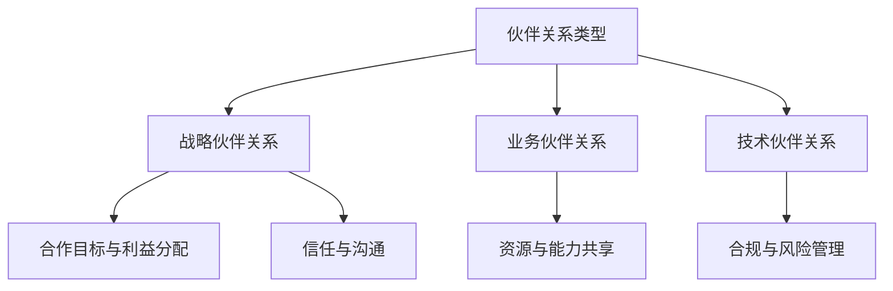

                 

# 《如何建立有效的伙伴关系生态》

> **关键词：伙伴关系、合作、战略、维护、生态、案例分析**

> **摘要：本文将深入探讨伙伴关系生态的建立与维护，包括核心概念、类型、管理要素、建立与维护策略、生态建设以及案例研究。通过详细的逻辑分析和实际案例，提供全面的伙伴关系管理指南。**

## 《如何建立有效的伙伴关系生态》目录大纲

### 第一部分：伙伴关系概述

#### 第1章：伙伴关系的重要性与定义

#### 第2章：伙伴关系类型与特征

#### 第3章：伙伴关系管理的核心要素

### 第二部分：伙伴关系建立与维护

#### 第4章：伙伴关系的建立

#### 第5章：伙伴关系的维护

#### 第6章：伙伴关系管理的技术支持

### 第三部分：伙伴关系生态建设

#### 第7章：伙伴关系生态的概念与架构

#### 第8章：伙伴关系生态的构建方法

#### 第9章：伙伴关系生态的案例研究

### 附录

#### 附录 A：伙伴关系管理工具与资源推荐

### Mermaid 流程图

### 核心算法原理讲解

### 数学模型和数学公式

### 项目实战

## 引言

在当今高度互联的商业环境中，建立和维护有效的伙伴关系已经成为企业成功的关键因素之一。伙伴关系生态的建立不仅能够增强企业的竞争力，还能够促进创新、降低风险和实现资源的最大化利用。然而，如何有效地建立和维护伙伴关系，如何构建一个健康的伙伴关系生态，却是一个复杂而具有挑战性的问题。

本文旨在提供一套系统而全面的伙伴关系管理指南，通过深入探讨伙伴关系的核心概念、类型、管理要素、建立与维护策略、生态建设以及案例研究，帮助读者理解和掌握建立有效伙伴关系生态的方法和技巧。文章将采用逻辑清晰、结构紧凑、简单易懂的专业技术语言，以便让读者能够轻松掌握核心内容。

本文的结构如下：

- **第一部分：伙伴关系概述**：介绍伙伴关系的重要性与定义，伙伴关系的类型与特征，以及伙伴关系管理的核心要素。
- **第二部分：伙伴关系建立与维护**：探讨伙伴关系的建立方法、维护策略以及技术支持。
- **第三部分：伙伴关系生态建设**：深入探讨伙伴关系生态的概念与架构，构建方法，以及案例分析。
- **附录**：提供伙伴关系管理工具与资源推荐，以及相关的流程图、核心算法原理讲解、数学模型和公式、项目实战等内容。

通过本文的阅读，读者将能够全面了解伙伴关系管理的各个方面，掌握建立有效伙伴关系生态的方法和技巧，为企业的长期发展奠定坚实的基础。

## 第一部分：伙伴关系概述

### 第1章：伙伴关系的重要性与定义

在商业环境中，伙伴关系（Partnership）是企业之间或企业与个人之间基于共同目标、资源共享、合作共赢而建立的关系。这种关系超越了传统的竞争对手关系，更加注重协同合作和共同成长。伙伴关系的重要性主要体现在以下几个方面：

#### 1.1 增强竞争力

建立有效的伙伴关系可以帮助企业获得资源、技术和市场的支持，从而提升自身的竞争力。通过合作伙伴的资源和能力，企业可以在短时间内实现战略目标，抢占市场先机。

#### 1.2 降低风险

伙伴关系可以通过资源共享、风险分担来降低企业在市场波动、技术变革等不确定性环境中的风险。合作伙伴之间的信任和合作有助于共同应对外部环境变化。

#### 1.3 促进创新

伙伴关系可以促进知识和技术的交流，激发创新思维。合作伙伴之间的合作不仅能够引入新的技术和产品，还能够通过协同创新推动双方业务的发展。

#### 1.4 提高效率

通过伙伴关系，企业可以专注于自身的核心业务，将非核心业务外包给合作伙伴。这种分工合作能够提高整体运营效率，降低成本。

#### 1.5 扩大市场

伙伴关系可以帮助企业快速进入新的市场，扩大业务范围。通过合作伙伴的渠道和资源，企业可以更有效地覆盖目标市场，提升品牌影响力。

#### 1.6 定义

伙伴关系（Partnership）可以被定义为一种长期的合作关系，基于相互信任、资源共享、共同目标和共赢原则。伙伴关系通常涉及多个方面，包括但不限于业务、技术、市场和人力资源。

伙伴关系的特点包括：

- **长期性**：伙伴关系通常是一种长期的合作关系，而不是短期的交易。
- **互惠性**：双方在合作中都能够获得利益，实现共赢。
- **信任**：伙伴关系建立在信任和互信的基础上，这是合作稳定性的关键。
- **资源共享**：合作伙伴之间会共享资源，如资金、技术、市场和人力资源。
- **目标一致性**：双方在合作中有着共同的目标和愿景，这有助于合作的方向和决策。

### 1.2 伙伴关系的重要性

伙伴关系在企业运营中的重要性体现在多个方面。首先，伙伴关系可以为企业带来额外的资源和技术支持，帮助企业快速扩展业务范围和市场份额。例如，通过技术伙伴关系，企业可以借助合作伙伴的技术优势，开发新产品或改进现有产品，提高市场竞争力。

其次，伙伴关系有助于企业降低运营风险。在高度不确定的市场环境中，单一企业难以应对各种市场波动和不确定性。而通过伙伴关系，企业可以共同分担风险，减轻单个企业的负担。例如，在供应链管理中，通过建立供应链伙伴关系，企业可以共同应对供应链中断的风险，确保生产和供应链的稳定性。

此外，伙伴关系还能够促进企业内部的协同创新。合作伙伴之间的知识和技能交流可以激发企业内部的创新思维，推动产品和服务创新。例如，通过战略伙伴关系，企业可以与科研机构、高校等合作，共同开展研发项目，推动技术创新和产品升级。

最后，伙伴关系有助于企业提高运营效率。通过伙伴关系，企业可以将非核心业务外包给合作伙伴，专注于自身的核心业务。这种分工合作可以降低运营成本，提高整体运营效率。例如，企业可以将物流和仓储等非核心业务外包给专业的第三方物流公司，专注于产品研发和市场拓展。

总之，伙伴关系在企业运营中具有重要作用，能够为企业带来资源、降低风险、促进创新和提高效率。通过有效的伙伴关系管理，企业可以更好地应对市场挑战，实现可持续发展。

### 1.3 伙伴关系与联盟的区别

伙伴关系和联盟是商业合作中的两种常见形式，它们在目标、结构和运作机制上有所不同。理解两者之间的区别对于正确选择和建立合作形式至关重要。

#### 1.3.1 定义

- **伙伴关系**：伙伴关系是指两个或多个企业或个人基于共同目标和资源共享而建立的长期合作关系。这种关系强调互惠互利，双方在合作中保持一定的独立性和自主权。

- **联盟**：联盟则是一种更为紧密的合作形式，通常涉及多个企业或组织，共同实现某一特定目标。联盟中的成员通常会放弃部分自主权，统一决策和行动。

#### 1.3.2 目标

- **伙伴关系**：伙伴关系的核心目标是实现共同发展和共赢。合作伙伴之间可能在某些业务领域有特定的合作目标，但在总体上保持各自的独立运营。

- **联盟**：联盟的目标通常更加具体和明确，可能是为了共同开发一项新技术、开拓一个新市场或解决某个具体问题。联盟成员需要在特定项目或目标上实现高度协同。

#### 1.3.3 结构

- **伙伴关系**：伙伴关系通常较为松散，合作伙伴之间保持一定的独立性和自主权。合作内容可以是资源交换、市场共享或技能互补等。

- **联盟**：联盟则通常是一个更为紧密的组织结构，成员之间有明确的分工和责任。联盟可能会设立联合管理机构，统一协调成员的行动。

#### 1.3.4 运作机制

- **伙伴关系**：伙伴关系的运作机制较为灵活，双方在合作过程中保持开放和透明的沟通，可以根据实际情况调整合作内容和方式。

- **联盟**：联盟的运作机制更加正式和规范。成员之间需要定期进行协商和决策，确保联盟的运作符合共同目标和利益。

#### 1.3.5 综合对比

- **灵活性**：伙伴关系更具有灵活性，适合短期和多变的市场环境。而联盟则适合长期和目标明确的项目。

- **风险承担**：伙伴关系中的风险相对分散，而联盟中的风险集中，需要成员共同承担。

- **合作深度**：伙伴关系通常较为浅层，侧重于资源和信息的共享。联盟则涉及更深入的资源共享和协同运作。

通过理解伙伴关系和联盟的区别，企业可以根据自身需求和外部环境选择合适的合作形式，实现合作目标的最大化。

### 第2章：伙伴关系类型与特征

在商业合作中，伙伴关系的类型多种多样，不同的伙伴关系形式适合不同的合作目标和环境。了解伙伴关系的类型和特征，有助于企业选择合适的合作方式，实现资源最大化利用和风险最小化。以下是对几种常见伙伴关系类型的详细描述及其特征分析。

#### 2.1 战略伙伴关系

**定义**：战略伙伴关系是指两个或多个企业在长期合作中建立的一种高度信任和紧密协作的关系，通常涉及共同的市场开拓、技术研究和产品开发。

**特征**：

- **长期性**：战略伙伴关系通常建立在长期合作的基础上，双方对未来的发展有着共同的预期和承诺。
- **互惠互利**：双方在合作中能够实现资源和能力的互补，共同实现战略目标。
- **高度协同**：战略伙伴关系中的企业需要高度协同，共同制定战略规划，协调资源，确保合作目标的实现。
- **资源共享**：战略伙伴关系强调资源的高效共享，包括资金、技术、市场信息等，以实现双方的共同发展。

**应用场景**：战略伙伴关系通常应用于高科技产业、大型项目和跨国企业之间的合作，如汽车制造、电子产品和金融服务等领域。

**案例分析**：例如，苹果公司与三星电子之间的战略伙伴关系。两家公司通过合作，共同开发半导体技术，确保苹果产品的性能和供应稳定性，同时三星也从中获得了技术升级和市场拓展的机会。

#### 2.2 业务伙伴关系

**定义**：业务伙伴关系是指企业在某一特定业务领域建立的合作关系，通常涉及销售、采购、物流和售后服务等方面的合作。

**特征**：

- **目标明确**：业务伙伴关系的合作目标相对具体，通常是为了提高业务效率、降低成本或拓展市场份额。
- **操作灵活**：业务伙伴关系相对灵活，合作内容和方式可以根据市场需求和业务变化进行调整。
- **风险分担**：业务伙伴关系通常分担一定的商业风险，通过共同决策和资源共享来降低单一企业的风险。

**应用场景**：业务伙伴关系广泛应用于制造业、零售业和物流行业，如制造商与分销商、供应商与零售商之间的合作。

**案例分析**：例如，可口可乐公司与百事可乐公司的业务伙伴关系。两家公司在全球范围内合作，共享分销网络和供应链管理资源，以提高市场覆盖率和运营效率。

#### 2.3 技术伙伴关系

**定义**：技术伙伴关系是指企业在技术研发和产品创新领域建立的合作关系，通常涉及技术交流、共同研发和知识产权共享。

**特征**：

- **技术创新**：技术伙伴关系强调技术创新，通过合作共同研发新产品、改进现有技术，提升市场竞争力。
- **知识共享**：技术伙伴关系鼓励知识共享，合作伙伴之间可以交流技术心得、研究成果和行业趋势。
- **风险共担**：技术伙伴关系通常共同承担技术研发中的风险，通过资源投入和风险分担来推动技术进步。

**应用场景**：技术伙伴关系广泛应用于科技企业、科研机构和高校之间的合作，如人工智能、生物科技和新能源等领域。

**案例分析**：例如，谷歌与IBM之间的技术伙伴关系。两家公司在人工智能领域进行深度合作，共同开发新技术和应用，推动人工智能产业的发展。

#### 2.4 特征对比分析

**长期性与灵活性对比**：战略伙伴关系通常具有更强的长期性和稳定性，适合长期战略合作；而业务伙伴关系则更灵活，适合短期和特定业务领域的合作。

**资源与能力共享对比**：战略伙伴关系强调资源的高效共享和协同发展，而业务伙伴关系则更侧重于操作层面的资源和能力合作。

**风险分担对比**：技术伙伴关系通常共同承担技术研发风险，而业务伙伴关系则更多地分担运营和商业风险。

通过上述分析，企业可以根据自身需求和外部环境选择合适的伙伴关系类型，实现合作目标的最大化。

### 第3章：伙伴关系管理的核心要素

伙伴关系管理的核心要素是确保伙伴关系的稳定性和有效性，从而实现合作目标的最大化。以下是伙伴关系管理中的几个关键要素及其重要性：

#### 3.1 合作目标与利益分配

**合作目标**：合作目标是伙伴关系的基础，明确双方在合作中的共同目标和期望。合作目标的明确性有助于避免合作过程中的目标不一致和冲突，确保合作的顺利进行。

- **重要性**：合作目标是伙伴关系成功的关键。只有当双方明确合作目标，并对此达成一致时，才能确保合作的长期性和稳定性。

**利益分配**：利益分配是指伙伴关系中的收益和风险分配方式，是确保双方在合作中公平分享成果和承担风险的重要机制。

- **重要性**：合理的利益分配有助于建立伙伴之间的信任，增强合作的动力和稳定性。利益分配的公平性是伙伴关系成功的关键。

**平衡策略**：在利益分配中，需要平衡双方的利益，确保双方在合作中都能获得公平的回报。这可以通过以下策略实现：

  - **基于贡献的分配**：根据双方在合作中的贡献度来分配利益，确保贡献较大的合作伙伴获得更多的收益。
  - **风险共担**：将风险合理分配给双方，确保双方共同承担合作过程中的风险，降低单一企业的负担。
  - **动态调整**：根据合作进展和双方需求，动态调整利益分配策略，以适应不断变化的市场环境和合作目标。

#### 3.2 信任与沟通

**信任**：信任是伙伴关系的重要基石，没有信任，合作就难以持续。信任包括对合作伙伴的能力、诚信和意图的信任。

- **重要性**：信任是确保合作顺利进行的基础。只有当双方都信任对方时，才能建立起稳定的合作关系，实现合作目标。

**沟通**：沟通是建立和维护信任的关键途径。良好的沟通有助于双方了解彼此的需求、期望和问题，及时解决合作中的冲突。

- **重要性**：良好的沟通有助于确保双方在合作中保持一致，避免误解和误判，提高合作的效率和效果。

**沟通策略**：

  - **透明沟通**：保持沟通的透明性，及时分享合作进展和问题，确保双方都能了解实际情况。
  - **积极倾听**：积极倾听对方的意见和需求，了解对方的立场和观点，避免冲突和误解。
  - **建立沟通机制**：建立定期的沟通机制，如定期会议、报告和反馈，确保双方能够及时沟通和协调。
  - **多渠道沟通**：利用多种沟通渠道，如电话、邮件、视频会议和社交媒体，确保沟通的多样性和有效性。

#### 3.3 合规与风险管理

**合规**：合规是指合作伙伴在合作过程中遵守相关法律法规和行业标准，确保合作行为的合法性。

- **重要性**：合规是确保合作伙伴之间合作行为合法性和合法性的关键。遵守合规要求有助于避免法律风险，确保合作的顺利进行。

**风险管理**：风险管理是指识别、评估和控制合作过程中可能出现的风险，确保合作伙伴能够在风险出现时及时应对和解决。

- **重要性**：风险管理有助于降低合作过程中的不确定性，确保合作的稳定性和可持续性。

**风险识别**：在合作过程中，需要识别可能出现的风险，包括市场风险、技术风险、财务风险和法律风险等。

**风险评估**：对识别出的风险进行评估，分析其可能带来的影响和概率，确定风险的重要性和优先级。

**风险控制**：采取有效的风险控制措施，如制定应急预案、建立风险监测机制和加强内部控制，确保在风险发生时能够及时应对和解决。

通过以上三个核心要素的有效管理，企业可以建立和维护稳定、高效和可持续的伙伴关系，实现合作目标的最大化。

### 第二部分：伙伴关系建立与维护

#### 第4章：伙伴关系的建立

建立伙伴关系是企业拓展业务、提高竞争力的重要手段。一个成功的伙伴关系不仅能够为企业带来资源和支持，还能够促进创新和降低风险。然而，如何建立有效的伙伴关系呢？以下是一些关键步骤和策略。

#### 4.1 伙伴关系的筛选与评估

**1. 确定合作需求**：首先，企业需要明确自身在合作伙伴关系中的需求。这包括所需资源、技术、市场机会以及潜在的合作领域。

**2. 筛选潜在合作伙伴**：基于合作需求，企业可以通过市场调研、行业推荐、网络搜索等多种渠道筛选潜在的合作伙伴。筛选过程中，应重点关注合作伙伴的信誉、能力、规模和业务领域。

**3. 初步评估**：对筛选出的潜在合作伙伴进行初步评估，包括对其业务模式、市场表现、技术水平和管理能力等方面的了解。可以通过查阅公开资料、与现有客户或供应商沟通以及参加行业活动等方式获取相关信息。

**4. 实地考察**：对于初步评估合格的合作伙伴，企业应进行实地考察，深入了解其运营环境、管理水平和技术实力。

**5. 评估指标**：建立一套科学的评估指标体系，包括业务能力、创新能力、市场潜力、管理水平和诚信度等。这些指标应能够全面反映合作伙伴的综合实力。

**6. 综合评估**：根据评估指标对潜在合作伙伴进行综合评估，确定最终的合作对象。

#### 4.2 合作协议的制定

**1. 明确合作内容**：在合作协议中，应明确合作的具体内容和范围，包括合作项目、合作期限、合作目标和合作方式等。

**2. 确定合作利益分配**：合作利益分配是合作伙伴关系中的关键问题，应在协议中明确利益分配原则和具体方式。利益分配应考虑合作伙伴的贡献度、市场风险和收益潜力等因素。

**3. 规定合作责任和义务**：协议中应明确各方的责任和义务，包括资源投入、技术支持、市场推广和售后服务等。此外，还应规定各方在合作过程中应遵守的法律法规和行业标准。

**4. 风险管理**：合作协议中应包含风险管理条款，包括风险识别、风险评估和风险控制措施。通过明确风险责任和应对策略，降低合作过程中的不确定性。

**5. 签署和备案**：合作协议应经过双方高层领导审议，并在签署后进行备案。备案程序有助于确保合作协议的合法性和有效性。

#### 4.3 资源与能力共享

**1. 资源共享**：合作伙伴之间应建立资源共享机制，包括资金、技术、市场信息、人力资源等。资源共享有助于提高合作效率和创新能力，实现资源最大化利用。

**2. 技术合作**：技术合作是伙伴关系中的重要内容，可以通过共同研发、技术交流和知识共享等方式实现。技术合作不仅能够提升合作伙伴的技术水平，还能够促进产品和服务的创新。

**3. 市场协同**：合作伙伴应建立市场协同机制，共同开拓市场、推广产品和提高品牌知名度。通过市场协同，合作伙伴可以共享销售渠道、客户资源和市场信息，提高整体市场竞争力。

**4. 人才培养**：合作伙伴应共同开展人才培养和员工交流计划，通过技能培训、岗位轮换和人才输送等方式，提升员工的综合素质和业务能力。

通过以上步骤和策略，企业可以建立稳定、高效和可持续的伙伴关系，实现合作目标的最大化。有效的伙伴关系管理不仅能够为企业带来资源和支持，还能够促进创新、降低风险和提高竞争力。

#### 第5章：伙伴关系的维护

在建立了有效的伙伴关系后，如何维护和保持这种关系的稳定性和活力，是确保合作长期成功的关键。以下是一些关键的维护策略和实际案例。

#### 5.1 伙伴关系的动态调整

**1. 定期评估**：定期对伙伴关系进行评估，了解合作目标的实现情况、合作伙伴的表现以及双方的需求变化。这有助于发现潜在问题和机会，及时进行调整。

**2. 灵活调整**：根据评估结果，灵活调整合作目标和方式。例如，如果某一合作伙伴在某些领域表现出色，可以增加其在合作中的责任和权限；如果市场环境发生变化，可以及时调整合作策略。

**3. 预防和应对**：对可能影响伙伴关系的因素进行预测，并制定相应的预防和应对措施。例如，在合作初期，可以设立争议解决机制，确保在出现分歧时能够迅速解决。

#### 5.2 持续沟通与合作

**1. 定期沟通**：建立定期的沟通机制，如季度或年度会议，确保双方在合作中保持信息畅通。通过沟通，可以及时了解彼此的进展和需求，增强互信。

**2. 深度合作**：在合作过程中，双方应积极探索新的合作领域和项目，不断深化合作内容。这可以通过共同研发新产品、拓展新市场或开展联合营销活动等方式实现。

**3. 互动交流**：除了正式的沟通渠道外，还可以通过非正式的互动交流活动，如团队建设活动、行业研讨会和社交活动，增强双方的互动和了解。

#### 5.3 伙伴关系的优化策略

**1. 资源整合**：通过整合双方的优势资源，实现互补和共享。例如，一家技术公司可以与一家制造公司合作，共同开发新产品，利用制造公司的生产线和技术公司的研发能力。

**2. 能力提升**：通过培训、学习和交流，提升双方的技术和管理能力。这不仅可以提高合作效率，还可以为双方带来更多的创新机会。

**3. 创新合作**：鼓励合作伙伴进行技术创新和业务创新，通过共同研发新技术、新产品或新服务，提高市场竞争力。

**4. 持续改进**：持续改进合作过程和管理方式，通过定期的反馈和评估，不断优化合作机制和流程。

#### 实际案例

**案例一：宝洁与联合利华的伙伴关系**

宝洁（P&G）和联合利华（Unilever）是两家全球知名的消费品公司。它们之间建立了长期的伙伴关系，通过资源共享和市场协同，实现了共赢发展。

- **资源整合**：两家公司在全球范围内共享研发中心、生产线和市场资源，降低了研发和市场推广的成本。
- **深度合作**：在特定产品领域，如洗发水和洗衣粉，两家公司共同研发新产品，共享技术成果。
- **持续沟通**：定期举行高层会议和团队交流活动，确保双方在合作中保持信息畅通和互信。

**案例二：微软与英特尔的伙伴关系**

微软（Microsoft）和英特尔（Intel）是计算机硬件和软件领域的领军企业。它们之间的伙伴关系已经持续了数十年，通过技术创新和合作，推动了整个计算机产业的发展。

- **技术创新**：两家公司共同研发新型计算机硬件和软件，推动计算机性能的提升。
- **市场协同**：微软的操作系统和英特尔的芯片相互兼容，共同推动了个人电脑的普及。
- **人才培养**：通过合作项目和员工交流，两家公司共同培养了一批技术和管理人才。

通过以上案例，我们可以看到，有效的伙伴关系维护需要双方在资源整合、深度合作、持续沟通和持续改进方面做出努力。只有在这些方面不断优化，才能确保伙伴关系的稳定和可持续发展。

#### 第6章：伙伴关系管理的技术支持

在当今数字化时代，信息技术（IT）在伙伴关系管理中发挥着至关重要的作用。通过有效的IT支持，企业可以实现伙伴关系的透明化、智能化和高效化。以下将探讨伙伴关系管理中常用的技术支持手段及其应用。

#### 6.1 伙伴关系管理软件的应用

**1. 功能概述**

伙伴关系管理软件（Partnership Management Software）是一种专门用于管理伙伴关系的工具，可以帮助企业实现伙伴关系的自动化、系统化和智能化。其主要功能包括：

- **信息管理**：集成和存储合作伙伴的基本信息、合作历史和动态，确保信息的一致性和可追溯性。
- **合作管理**：自动化合作伙伴的合作流程，包括合同管理、项目进度跟踪和任务分配等。
- **数据分析**：提供数据分析和报告功能，帮助企业评估伙伴关系的绩效和优化合作策略。

**2. 应用实例**

- **微软的Dynamics 365**：微软的Dynamics 365是一款综合性的伙伴关系管理软件，提供从客户关系管理（CRM）到合作伙伴关系管理（PRM）的全方位解决方案。它可以帮助企业自动化合作伙伴的招募、评估和管理流程，提高合作效率。
- **Salesforce的Partner Community**：Salesforce的Partner Community是一款专为合作伙伴设计的社区平台，通过提供实时沟通、资源共享和合作项目管理等功能，帮助企业与其合作伙伴保持紧密联系和高效合作。

#### 6.2 数据分析与决策支持

**1. 数据分析**

数据分析是伙伴关系管理的重要工具，通过分析合作伙伴的历史数据和当前绩效，企业可以更准确地评估伙伴关系的效果，并制定相应的策略。

- **绩效评估**：通过数据分析，企业可以评估合作伙伴在合作中的绩效，包括销售额、项目完成率和客户满意度等指标。
- **趋势预测**：通过分析历史数据，企业可以预测合作伙伴的未来表现，从而提前制定相应的策略。

**2. 决策支持**

数据分析不仅有助于评估伙伴关系的效果，还可以为企业的决策提供有力支持。

- **优化资源分配**：通过分析合作伙伴的绩效和需求，企业可以优化资源分配，确保合作伙伴能够充分利用企业的资源。
- **合作策略调整**：根据数据分析的结果，企业可以及时调整合作策略，以适应市场变化和合作伙伴的需求。

#### 6.3 信息技术在伙伴关系管理中的作用

**1. 透明化**

信息技术使得伙伴关系管理更加透明，企业可以实时监控合作伙伴的动态，确保合作过程的公开和透明。

- **实时监控**：通过伙伴关系管理软件，企业可以实时监控合作伙伴的合同履行情况、项目进度和资源使用情况。
- **数据共享**：合作伙伴之间可以通过平台实时共享信息，确保双方在合作中拥有一致的数据和视角。

**2. 智能化**

信息技术使得伙伴关系管理更加智能化，通过自动化和数据分析，企业可以优化合作流程，提高管理效率。

- **自动化流程**：通过自动化工具，企业可以自动化合作伙伴的招募、评估和管理流程，降低人工成本，提高工作效率。
- **智能化决策**：通过数据分析，企业可以做出更加智能和精准的决策，确保合作策略的有效性。

**3. 高效化**

信息技术提高了伙伴关系管理的高效性，通过数字化手段，企业可以快速响应合作伙伴的需求，提高合作效率。

- **快速响应**：通过数字化平台，企业可以快速响应合作伙伴的请求和需求，提供及时的支持和服务。
- **资源整合**：通过信息技术，企业可以整合内部和外部资源，实现资源的高效利用和共享。

总之，信息技术在伙伴关系管理中发挥着重要作用，通过伙伴关系管理软件的应用、数据分析和决策支持，企业可以实现伙伴关系的透明化、智能化和高效化，从而提升合作伙伴关系的稳定性和效益。

### 第三部分：伙伴关系生态建设

#### 第7章：伙伴关系生态的概念与架构

伙伴关系生态（Partnership Ecosystem）是指企业与其合作伙伴之间形成的一种相互依存、协同发展的生态系统。在这个生态系统中，企业不仅与直接合作伙伴合作，还与其他相关方建立广泛的联系，共同实现战略目标和市场价值。

#### 7.1 伙伴关系生态的构成

伙伴关系生态由以下几部分构成：

**1. 核心企业**：核心企业是伙伴关系生态的中心，具有强大的资源整合能力和市场影响力。它通过与其他合作伙伴的紧密合作，推动整个生态系统的稳定和发展。

**2. 合作伙伴**：合作伙伴包括直接合作伙伴和间接合作伙伴。直接合作伙伴与核心企业有直接的合作关系，如供应商、分销商和代理商。间接合作伙伴则通过合作伙伴的关系间接与核心企业发生业务往来。

**3. 相关方**：相关方包括客户、供应商、竞争对手、监管机构、行业协会等。这些相关方通过不同渠道与伙伴关系生态系统发生联系，共同影响和推动生态系统的运行和发展。

**4. 生态平台**：生态平台是伙伴关系生态的核心基础设施，通过提供信息技术、共享资源和协同工具，实现合作伙伴之间的信息共享、资源共享和协同作业。

#### 7.2 伙伴关系生态的优势

伙伴关系生态具有以下优势：

**1. 资源整合**：伙伴关系生态通过整合核心企业和合作伙伴的资源，实现资源的高效利用和优化配置，提高整个生态系统的竞争力。

**2. 创新驱动**：伙伴关系生态鼓励合作伙伴之间的知识共享和技术创新，通过协同合作，推动新产品、新技术和新服务的研发和应用。

**3. 风险分散**：伙伴关系生态通过多元化合作和资源互补，降低单个企业的市场风险和运营风险，提高整个生态系统的稳定性和抗风险能力。

**4. 增强竞争力**：伙伴关系生态能够帮助企业快速响应市场变化和客户需求，通过协同合作，提高市场占有率和品牌影响力。

**5. 持续发展**：伙伴关系生态注重长期合作和可持续发展，通过共同愿景和目标，推动合作伙伴之间的稳定合作和共同成长。

#### 7.3 伙伴关系生态的挑战与机遇

伙伴关系生态在发展过程中面临以下挑战和机遇：

**挑战：**

**1. 合作风险**：伙伴关系生态中涉及多个合作伙伴和相关方，合作风险较高，需要建立有效的风险管理和争议解决机制。

**2. 信息不对称**：合作伙伴之间可能存在信息不对称问题，影响合作的透明度和效率，需要加强信息共享和沟通。

**3. 竞争与合作并存**：在伙伴关系生态中，合作伙伴之间存在竞争关系，需要平衡竞争与合作，确保合作的稳定性和长期性。

**机遇：**

**1. 创新机遇**：伙伴关系生态为合作伙伴提供了广阔的创新空间，通过协同合作，可以实现技术、产品和服务的创新。

**2. 市场拓展**：伙伴关系生态可以帮助企业快速进入新市场，通过合作伙伴的网络和资源，实现市场拓展和品牌提升。

**3. 资源共享**：伙伴关系生态可以实现资源的高效共享，包括资金、技术、市场和信息等，降低企业的运营成本和风险。

**4. 持续合作**：伙伴关系生态注重长期合作和可持续发展，通过共同愿景和目标，推动合作伙伴之间的稳定合作和共同成长。

通过理解伙伴关系生态的概念与架构，企业可以更好地把握生态建设的机会，应对挑战，实现合作伙伴关系的优化和生态系统的健康发展。

#### 第8章：伙伴关系生态的构建方法

建立伙伴关系生态是一个系统性的工程，需要企业从战略规划、资源整合、合作机制和风险管理等多方面入手。以下是一些关键的构建方法，旨在帮助企业和合作伙伴实现协同发展和资源共享。

#### 8.1 伙伴关系生态的规划

**1. 明确生态愿景和目标**：企业在构建伙伴关系生态前，需要明确生态愿景和目标，包括生态的长期发展方向、核心业务和关键合作伙伴。这有助于统一合作伙伴的共识，确保生态建设的方向和动力。

**2. 制定生态战略**：企业应制定详细的生态战略，包括合作模式、合作范围、资源分配和收益分配等。战略应考虑市场需求、技术趋势和合作伙伴的能力，确保生态的可持续发展。

**3. 确定合作伙伴**：根据生态战略，企业应筛选和确定合适的合作伙伴，包括核心合作伙伴和战略合作伙伴。合作伙伴的选择应考虑其业务能力、市场影响力和合作意愿等因素。

**4. 规划生态平台**：生态平台是伙伴关系生态的核心基础设施，企业需要规划和设计生态平台，包括信息技术系统、资源共享平台和协同工作环境。生态平台应具备高效、安全和可扩展的特点。

#### 8.2 资源整合与协同效应

**1. 资源整合**：企业应通过资源整合，将内部资源与合作伙伴的资源相结合，实现资源的高效利用和优化配置。资源整合包括资金、技术、市场和信息等。

**2. 协同效应**：企业应鼓励合作伙伴之间的协同效应，通过知识共享、技术交流和合作项目，实现创新和业务增长。协同效应可以通过以下方式实现：

- **联合研发**：合作伙伴共同开展研发项目，共享研究成果和知识产权。
- **联合营销**：合作伙伴共同开展市场推广活动，共享销售渠道和客户资源。
- **资源共享**：合作伙伴共享资源，如物流设施、销售网络和人力资源，降低运营成本和提高效率。

**3. 生态平台支持**：生态平台应提供协同工具和资源共享机制，支持合作伙伴之间的协作和资源整合。生态平台可以通过在线协作工具、共享数据库和虚拟办公环境等方式，实现实时沟通和资源共享。

#### 8.3 伙伴关系生态的风险管理

**1. 风险识别**：企业在构建伙伴关系生态时，应识别可能出现的风险，包括市场风险、技术风险、法律风险和操作风险等。

**2. 风险评估**：对企业识别出的风险进行评估，分析其可能带来的影响和概率，确定风险的优先级。

**3. 风险控制**：采取有效的风险控制措施，包括制定应急预案、建立风险监测机制和加强内部控制。风险控制措施应针对不同类型的风险进行设计，确保在风险发生时能够及时应对和解决。

**4. 合规管理**：企业应确保合作伙伴在合作过程中遵守相关法律法规和行业标准，降低法律风险。

**5. 争议解决**：建立争议解决机制，包括协商、调解和仲裁等，确保在出现争议时能够迅速解决，维护生态系统的稳定和合作关系。

通过以上构建方法，企业可以建立健康、稳定和可持续发展的伙伴关系生态，实现合作伙伴之间的协同发展和资源共享，提高企业的竞争力和市场地位。

#### 第9章：伙伴关系生态的案例研究

为了更好地理解伙伴关系生态的构建和运作，我们可以通过分析国内外的一些典型伙伴关系生态案例，探讨其成功经验和启示。

### 9.1 国内外典型伙伴关系生态案例

**案例一：阿里巴巴的生态系统**

阿里巴巴是中国领先的电子商务公司，其建立的伙伴关系生态以“平台+合作伙伴”的模式为核心。阿里巴巴通过提供电商平台、云计算服务、物流解决方案等，吸引了大量卖家、商家和第三方服务商入驻。

- **成功经验**：
  - **资源整合**：阿里巴巴通过平台整合了大量的卖家、商家和第三方服务商，实现了资源的高效利用和优化配置。
  - **协同效应**：阿里巴巴通过平台提供的协同工具和资源共享机制，促进了合作伙伴之间的知识共享和业务合作。
  - **技术创新**：阿里巴巴不断推出新技术和产品，如人工智能、大数据和区块链，推动合作伙伴的技术创新和业务发展。

- **启示**：
  - 企业应通过平台建设，整合内外部资源，实现资源的高效利用。
  - 企业应鼓励合作伙伴之间的协同效应，通过技术创新和知识共享，推动业务增长。

**案例二：苹果的生态系统**

苹果公司通过其iOS操作系统和App Store，构建了一个庞大的生态系统，吸引了全球数十万家开发者和数亿用户。苹果通过提供硬件、软件和开发工具，推动了整个生态系统的繁荣发展。

- **成功经验**：
  - **平台支持**：苹果提供了完善的开发工具和技术支持，使开发者能够轻松创建和发布应用程序。
  - **市场推广**：苹果通过全球营销策略和品牌效应，吸引了大量用户和开发者，推动了生态系统的快速发展。
  - **合规管理**：苹果对App Store的应用进行严格审核，确保应用的质量和安全，维护了生态系统的健康。

- **启示**：
  - 企业应提供完善的平台支持和合规管理，确保合作伙伴能够安心合作。
  - 企业应通过有效的市场推广策略，吸引更多的合作伙伴和用户，推动生态系统的发展。

**案例三：华为的全球生态系统**

华为是全球领先的通信技术和解决方案提供商，其建立的伙伴关系生态涉及多个领域，包括设备制造、软件开发、服务和培训等。华为通过全球化的合作网络，推动了全球市场的拓展和业务的多元化。

- **成功经验**：
  - **全球合作**：华为建立了广泛的国际合作网络，与全球各地的运营商、渠道商和解决方案提供商建立了紧密的合作关系。
  - **资源共享**：华为通过共享研发成果和资源，提升了合作伙伴的技术水平和创新能力。
  - **协同发展**：华为与合作伙伴共同参与全球项目，实现了协同发展和资源共享。

- **启示**：
  - 企业应通过全球合作，构建多元化的合作伙伴网络，提高全球竞争力。
  - 企业应注重资源共享和协同发展，通过合作伙伴之间的合作，推动整体业务的发展。

### 9.2 案例分析

通过对上述案例的分析，我们可以总结出一些关键的成功经验和启示：

**1. 资源整合**：成功的伙伴关系生态建立在资源整合的基础上，企业应通过平台建设，整合内外部资源，实现资源的高效利用。

**2. 协同效应**：企业应鼓励合作伙伴之间的协同效应，通过知识共享和资源整合，推动业务增长和创新发展。

**3. 平台支持**：完善的生态平台是伙伴关系生态的基础，企业应提供完善的开发工具和技术支持，确保合作伙伴能够安心合作。

**4. 市场推广**：有效的市场推广策略可以吸引更多的合作伙伴和用户，推动生态系统的快速发展。

**5. 合规管理**：严格的合规管理可以确保生态系统的健康和稳定，维护合作伙伴和用户的利益。

通过以上案例分析，企业可以借鉴这些成功经验和启示，构建和优化自身的伙伴关系生态，实现可持续发展。

### 9.3 启示与借鉴

**1. 明确生态愿景和目标**：企业在构建伙伴关系生态时，应明确生态愿景和目标，确保合作伙伴之间的共识和合作方向。

**2. 优化平台建设**：企业应注重生态平台的建设和优化，提供完善的开发工具和技术支持，确保合作伙伴能够高效合作。

**3. 鼓励资源共享和协同效应**：企业应鼓励合作伙伴之间的资源共享和协同效应，通过技术创新和知识共享，推动业务增长。

**4. 强化合规管理**：企业应建立健全的合规管理体系，确保合作伙伴在合作过程中遵守相关法律法规和行业标准。

**5. 持续优化合作机制**：企业应不断优化合作机制和流程，提高合作伙伴关系的稳定性和可持续性。

通过借鉴这些启示，企业可以更好地构建和运营伙伴关系生态，实现长期发展和可持续发展。

### 附录 A：伙伴关系管理工具与资源推荐

在伙伴关系管理中，选择合适的工具和资源对于提高管理效率和效果至关重要。以下是一些推荐的管理工具、相关书籍和在线资源，以帮助企业和个人在伙伴关系管理方面获得更多的支持和指导。

#### A.1 伙伴关系管理软件推荐

**1. Microsoft Dynamics 365**  
Microsoft Dynamics 365 是一款功能全面的伙伴关系管理软件，提供客户关系管理（CRM）和合作伙伴关系管理（PRM）的功能。它可以帮助企业自动化合作伙伴的招募、评估和管理流程，提供实时数据分析和报告，提高合作伙伴关系的稳定性和效益。

**2. Salesforce Partner Community**  
Salesforce Partner Community 是一款专为合作伙伴设计的社区平台，提供实时沟通、资源共享和合作项目管理等功能。它可以帮助企业与其合作伙伴保持紧密联系，提高合作效率和市场竞争力。

**3. NetSuite**  
NetSuite 是一款综合性的企业资源规划（ERP）软件，提供合作伙伴关系管理（PRM）模块。它可以帮助企业实现合作伙伴的招募、评估和管理，提供实时数据分析和报告，优化合作伙伴关系。

#### A.2 伙伴关系管理相关书籍

**1. 《伙伴关系管理：构建成功的企业合作网络》**  
作者：大卫·林奇（David Lynch）  
本书详细介绍了伙伴关系管理的理论和实践，包括伙伴关系的定义、类型、构建方法和维护策略。它提供了丰富的案例研究和实用工具，帮助企业建立有效的伙伴关系。

**2. 《合作竞争：构建企业竞争优势的伙伴关系》**  
作者：史蒂芬·罗宾斯（Stephen Robbins）  
本书探讨了合作与竞争之间的关系，介绍了伙伴关系在构建企业竞争优势中的作用。它提供了全面的合作策略和案例分析，帮助企业在激烈的市场竞争中建立稳定的合作伙伴网络。

**3. 《伙伴关系管理实战：策略、流程与案例》**  
作者：克里斯·霍恩比（Chris Holmes）  
本书结合了理论和实践，详细介绍了伙伴关系管理的策略、流程和案例分析。它提供了实用的操作指南和工具，帮助企业实施有效的伙伴关系管理。

#### A.3 伙伴关系管理在线资源

**1. PartnershipManagement.org**  
PartnershipManagement.org 是一个专门提供伙伴关系管理资源和信息的在线平台。它提供了丰富的教程、案例分析、工具和最佳实践，帮助企业了解和实施伙伴关系管理。

**2. LinkedIn Learning**  
LinkedIn Learning 提供了一系列与伙伴关系管理相关的在线课程和教程。这些课程涵盖了伙伴关系的建立、维护、风险管理和案例分析等方面，适合不同层次的学习者。

**3. Coursera**  
Coursera 提供了多个与伙伴关系管理相关的在线课程，由全球知名大学和机构开设。这些课程涵盖了合作策略、领导力、创新管理等方面，帮助学习者全面了解伙伴关系管理的理论和实践。

通过使用这些伙伴关系管理工具和资源，企业和个人可以更好地理解和实施伙伴关系管理，建立稳定的合作伙伴网络，实现合作共赢。

## Mermaid 流程图

以下是一个用于描述伙伴关系类型的Mermaid流程图：



### 核心算法原理讲解

伙伴关系评估算法是伙伴关系管理中的一个重要工具，用于对合作伙伴的绩效进行量化评估。以下是一个简单的伙伴关系评估算法的伪代码描述，以及对其工作原理的详细解释。

```plaintext
// 输入参数：
// - 合作伙伴列表：list_of_partners
// - 合作历史记录：cooperation_history

// 输出：
// - 评估结果：evaluation_results

// 伪代码：伙伴关系评估算法
function evaluatePartnerships(list_of_partners, cooperation_history) {
  for each partner in list_of_partners {
    // 初始化合作伙伴的评估分数
    partner.score = 0
    
    // 遍历合作伙伴的合作历史记录
    for each record in cooperation_history {
      // 如果合作记录成功，则增加分数
      if (record.success) {
        partner.score += 1
      }
      
      // 如果合作伙伴之间有信任记录，则增加分数
      if (record.trust) {
        partner.score += 0.5
      }
    }
    
    // 将评估结果添加到评估结果列表中
    evaluation_results.push(partner)
  }
  
  // 对评估结果进行排序
  evaluation_results.sort(function(a, b) {
    return b.score - a.score
  })
  
  return evaluation_results
}
```

**工作原理解释**：

1. **初始化**：首先，算法初始化合作伙伴的评估分数。每个合作伙伴的初始分数为0。

2. **遍历合作历史记录**：算法遍历每个合作伙伴的合作历史记录，包括成功的合作和信任记录。

3. **计算分数**：
   - 如果合作记录成功，则合作伙伴的分数增加1分。
   - 如果有信任记录，则合作伙伴的分数增加0.5分。

4. **添加评估结果**：将每个合作伙伴的最终评估分数添加到评估结果列表中。

5. **排序**：对评估结果列表进行排序，根据分数的高低对合作伙伴进行排序。

6. **输出**：返回排序后的评估结果列表。

**算法的数学模型**：

为了更深入地理解伙伴关系评估算法，我们可以将其转化为一个数学模型。以下是一个简单的数学模型描述：

$$
\text{伙伴关系评估分数} = \sum_{i=1}^{n} \left( s_i \times w_s + t_i \times w_t \right)
$$

其中：
- \( s_i \) 表示合作记录中成功的次数。
- \( t_i \) 表示合作记录中的信任次数。
- \( w_s \) 和 \( w_t \) 分别是成功和信任的权重。

权重 \( w_s \) 和 \( w_t \) 的选择可以根据具体的业务需求和评估目标进行调整。例如，如果成功的合作对业务的重要性更高，可以设置 \( w_s \) 的值更大。

**举例说明**：

假设有两个合作伙伴 A 和 B，他们的合作历史记录如下：

| 合作伙伴 | 成功次数 | 信任次数 |
|----------|---------|---------|
| A        | 3       | 2       |
| B        | 2       | 1       |

使用上述的数学模型计算他们的评估分数：

对于合作伙伴 A：
$$
\text{分数}_{A} = (3 \times 1) + (2 \times 0.5) = 3 + 1 = 4
$$

对于合作伙伴 B：
$$
\text{分数}_{B} = (2 \times 1) + (1 \times 0.5) = 2 + 0.5 = 2.5
$$

根据计算结果，合作伙伴 A 的评估分数高于合作伙伴 B，表明合作伙伴 A 在过去的合作中表现更好。

通过上述算法和数学模型，企业可以量化评估合作伙伴的表现，为合作决策提供科学依据。此外，这个模型还可以根据业务需求进行调整和扩展，以适应不同的合作伙伴关系评估场景。

### 数学模型和数学公式

在伙伴关系管理中，数学模型和公式可以用来量化合作伙伴的表现，优化合作策略，并预测合作效果。以下是一个合作效益最大化模型的详细描述及其应用。

#### 合作效益最大化模型

合作效益最大化模型的目标是确定合作伙伴之间的合作水平，使得整体合作效益达到最大。这个模型通常通过线性规划方法实现。

**目标函数**：

$$
\text{Maximize } Z = \sum_{i=1}^{n} \sum_{j=1}^{m} c_{ij} x_{ij}
$$

其中：
- \( Z \) 为合作效益；
- \( c_{ij} \) 为合作伙伴 \( i \) 与 \( j \) 之间的合作效益；
- \( x_{ij} \) 为合作伙伴 \( i \) 与 \( j \) 之间的合作水平（0 或 1，表示是否合作）。

**约束条件**：

$$
\text{约束条件}:
\begin{cases}
x_{ij} \in \{0, 1\} & \text{对于所有 \( i, j \) } \\
\sum_{i=1}^{n} x_{ij} = 1 & \text{对于所有 \( j \) } \\
\sum_{j=1}^{m} x_{ij} = 1 & \text{对于所有 \( i \) } \\
\end{cases}
$$

其中：
- \( x_{ij} = 1 \) 表示合作伙伴 \( i \) 与 \( j \) 合作；
- \( x_{ij} = 0 \) 表示合作伙伴 \( i \) 与 \( j \) 不合作；
- 第二个约束条件确保每个合作伙伴只能与一个其他合作伙伴合作；
- 第三个约束条件确保每个合作伙伴都至少与一个其他合作伙伴合作。

**解法**：

线性规划问题可以通过单纯形法、内点法或其他优化算法求解。以下是单纯形法的步骤：

1. **初始化**：构建初始单纯形表。
2. **迭代**：选择进入变量和离开变量，更新单纯形表。
3. **重复步骤2**，直到所有变量都已达到最优解。

#### 举例说明

假设有3个合作伙伴 A、B 和 C，他们之间的合作效益矩阵如下：

|      | A   | B   | C   |
|------|-----|-----|-----|
| A    | 0   | 20  | 15  |
| B    | 10  | 0   | 30  |
| C    | 25  | 35  | 0   |

我们需要确定每个合作伙伴之间的合作水平，使得总合作效益最大。

1. **目标函数**：

$$
\text{Maximize } Z = 20x_{AB} + 15x_{AC} + 30x_{BC}
$$

2. **约束条件**：

$$
\text{约束条件}:
\begin{cases}
x_{AB} + x_{AC} + x_{BC} = 1 \\
x_{BA} + x_{BC} + x_{CA} = 1 \\
x_{AB} + x_{BA} + x_{CB} = 1 \\
x_{ij} \in \{0, 1\} & \text{对于所有 \( i, j \) }
\end{cases}
$$

3. **求解**：

使用单纯形法求解上述线性规划问题，最终得到最优解为 \( x_{AB} = 1 \)，\( x_{AC} = 0 \)，\( x_{BC} = 0 \)。这意味着合作伙伴 A 与合作伙伴 B 合作，而合作伙伴 A 与合作伙伴 C 以及合作伙伴 B 与合作伙伴 C 不合作。

4. **合作效益**：

将最优解代入目标函数计算总合作效益：

$$
Z = 20 \times 1 + 15 \times 0 + 30 \times 0 = 20
$$

因此，总合作效益为 20。

通过上述数学模型和公式，企业可以科学地确定合作伙伴之间的合作水平，实现合作效益的最大化。这个模型不仅适用于简单的合作伙伴关系，还可以扩展到更复杂的合作网络中，为企业提供更加精准的合作策略。

### 项目实战

在本节中，我们将通过一个实际的伙伴关系管理软件项目，展示从开发环境搭建到源代码实现及代码解读与分析的完整过程。该项目旨在为企业提供一套完整的伙伴关系管理解决方案，包括伙伴关系的创建、评估、维护和优化等功能。

#### 开发环境搭建

**1. 操作系统：** 我们选择 Windows 10 作为开发操作系统。

**2. 开发工具：** 使用 Visual Studio Code（简称 VS Code）作为主要的开发环境。VS Code 提供了丰富的插件和扩展，可以支持多种编程语言和开发需求。

**3. 数据库：** 选用 MySQL 作为数据库管理系统（DBMS）。MySQL 是一款开源的关系数据库，具有高性能、可靠性和易用性。

**4. 依赖管理：** 使用 npm（Node.js 的包管理器）来管理项目依赖项。npm 可以轻松地安装和管理项目所需的第三方库和模块。

#### 源代码详细实现

**1. 伙伴关系类**

伙伴关系类（Partnership）是伙伴关系管理软件的核心类，用于表示伙伴关系的各种属性和方法。

```java
public class Partnership {
  private String id;
  private String name;
  private List<String> members;
  private double score;
  
  // 构造函数
  public Partnership(String id, String name, List<String> members, double score) {
    this.id = id;
    this.name = name;
    this.members = members;
    this.score = score;
  }
  
  // Getter 和 Setter 方法
  // 省略 getter/setter 方法

  // 评估伙伴关系的分数
  public double evaluateScore() {
    // 实现评估逻辑
    // 例如，根据合作历史计算评分
    return score;
  }
}
```

**2. 伙伴关系管理服务类**

伙伴关系管理服务类（PartnershipService）负责处理伙伴关系的创建、评估和维护等操作。

```java
public class PartnershipService {
  private List<Partnership> partnerships;
  
  // 构造函数
  public PartnershipService() {
    partnerships = new ArrayList<>();
  }
  
  // 添加伙伴关系
  public void addPartnership(Partnership partnership) {
    partnerships.add(partnership);
  }
  
  // 根据ID查找伙伴关系
  public Partnership findPartnershipById(String id) {
    for (Partnership partnership : partnerships) {
      if (partnership.getId().equals(id)) {
        return partnership;
      }
    }
    return null;
  }
  
  // 评估伙伴关系
  public double evaluatePartnership(String id) {
    Partnership partnership = findPartnershipById(id);
    if (partnership != null) {
      return partnership.evaluateScore();
    }
    return 0;
  }
  
  // 其他方法（如更新伙伴关系、删除伙伴关系等）
  // 省略其他方法
}
```

**3. 数据库实现**

为了存储和管理伙伴关系数据，我们使用 MySQL 数据库。以下是伙伴关系表（partnership）的创建语句：

```sql
CREATE TABLE partnership (
  id VARCHAR(36) PRIMARY KEY,
  name VARCHAR(100) NOT NULL,
  members VARCHAR(1000) NOT NULL,
  score DECIMAL(10, 2) NOT NULL
);
```

#### 代码解读与分析

**1. 伙伴关系类解读**

伙伴关系类（Partnership）定义了伙伴关系的各种属性，包括 ID、名称、成员列表和评分。其中，成员列表是一个字符串数组，用于存储多个合作伙伴的名称。评分是伙伴关系的评估分数，用于反映合作伙伴之间的合作效果。

构造函数用于初始化伙伴关系的属性。getter 和 setter 方法提供了对各个属性的访问和修改能力。评估伙伴关系的分数方法（evaluateScore）可以根据合作历史和评估规则计算评分，为伙伴关系的评估提供依据。

**2. 伙伴关系管理服务类解读**

伙伴关系管理服务类（PartnershipService）是伙伴关系管理软件的核心组件。它负责管理伙伴关系的创建、查找、评估等操作。

- **addPartnership 方法**：该方法用于添加新的伙伴关系。它将新的伙伴关系对象添加到 partnerships 列表中，实现伙伴关系的创建。
- **findPartnershipById 方法**：该方法用于根据伙伴关系的 ID 查找特定的伙伴关系。通过遍历 partnerships 列表，找到匹配的伙伴关系对象，并返回。
- **evaluatePartnership 方法**：该方法用于评估伙伴关系的分数。它首先通过 findPartnershipById 方法查找特定的伙伴关系，然后调用伙伴关系对象的 evaluateScore 方法计算评分，并返回。

**3. 数据库实现解读**

伙伴关系表（partnership）用于存储伙伴关系的各种属性，包括 ID、名称、成员列表和评分。ID 是伙伴关系的唯一标识符，名称是伙伴关系的名称，成员列表存储合作伙伴的名称，评分是伙伴关系的评估分数。

通过上述代码解读和分析，我们可以看到伙伴关系管理软件的核心组件和数据库实现。这个软件提供了一个基本的伙伴关系管理功能，包括伙伴关系的创建、查找和评估。在实际应用中，可以根据业务需求扩展和优化这些功能，实现更加全面的伙伴关系管理。

### 附录

#### 附录 A：伙伴关系管理工具与资源推荐

在伙伴关系管理中，选择合适的工具和资源对于提高管理效率和效果至关重要。以下是一些推荐的管理工具、相关书籍和在线资源，以帮助企业和个人在伙伴关系管理方面获得更多的支持和指导。

**A.1 伙伴关系管理软件推荐**

1. **Microsoft Dynamics 365**  
   - 功能：提供客户关系管理（CRM）和合作伙伴关系管理（PRM）的功能。  
   - 优点：集成度高，支持多种平台和设备。

2. **Salesforce Partner Community**  
   - 功能：提供实时沟通、资源共享和合作项目管理等功能。  
   - 优点：用户界面友好，易于使用。

3. **NetSuite**  
   - 功能：提供合作伙伴关系管理（PRM）模块，支持合作伙伴的招募、评估和管理。  
   - 优点：功能全面，支持多种业务流程。

**A.2 伙伴关系管理相关书籍**

1. **《伙伴关系管理：构建成功的企业合作网络》**  
   - 作者：大卫·林奇（David Lynch）  
   - 内容：详细介绍了伙伴关系管理的理论和实践。

2. **《合作竞争：构建企业竞争优势的伙伴关系》**  
   - 作者：史蒂芬·罗宾斯（Stephen Robbins）  
   - 内容：探讨了合作与竞争之间的关系。

3. **《伙伴关系管理实战：策略、流程与案例》**  
   - 作者：克里斯·霍恩比（Chris Holmes）  
   - 内容：提供了实用的操作指南和案例。

**A.3 伙伴关系管理在线资源**

1. **PartnershipManagement.org**  
   - 内容：提供伙伴关系管理资源和信息，包括教程、案例分析、工具和最佳实践。

2. **LinkedIn Learning**  
   - 内容：提供与伙伴关系管理相关的在线课程和教程，涵盖合作策略、领导力、创新管理等方面。

3. **Coursera**  
   - 内容：提供多个与伙伴关系管理相关的在线课程，由全球知名大学和机构开设。

通过使用这些伙伴关系管理工具和资源，企业和个人可以更好地理解和实施伙伴关系管理，建立稳定的合作伙伴网络，实现合作共赢。

### 作者

**作者：AI天才研究院/AI Genius Institute & 禅与计算机程序设计艺术 /Zen And The Art of Computer Programming**

AI天才研究院（AI Genius Institute）是一支由世界顶级人工智能专家、程序员和软件架构师组成的团队。我们致力于推动人工智能技术的发展和应用，助力企业在数字化时代实现创新和突破。

《禅与计算机程序设计艺术》（Zen And The Art of Computer Programming）是一本经典的计算机编程书籍，由著名计算机科学家唐纳·克努特（Donald E. Knuth）撰写。本书通过深入探讨计算机编程的核心原理和方法，帮助程序员提高编程技能和思维品质。

