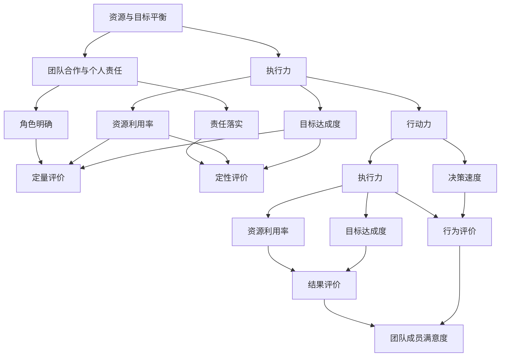

                 

### 第1章：团队执行力与行动力的核心概念

#### 1.1 团队执行力与行动力的定义

**执行力**是团队完成既定目标和任务的能力。它不仅涉及团队成员按照计划执行任务的效率，还涉及团队在面对挑战和困难时的适应性和灵活性。执行力强意味着团队能够快速响应变化，有效解决问题，并在预定时间内完成目标。

**行动力**则是指团队成员主动采取行动以实现目标的能力。行动力不仅包括行动的主动性，还包括行动的速度和持续性。一个具有高度行动力的团队能够迅速做出决策并付诸实施，从而在竞争中占据有利位置。

**执行力**与**行动力**之间的关系是相互促进的。执行力强意味着团队具备完成任务的稳定性和可靠性，而行动力强则保证了团队在面对机会和挑战时能够迅速做出反应。两者共同构成了团队成功的关键因素。

#### 1.2 团队执行力与行动力的基本原理

**1.2.1 资源与目标的平衡**

团队执行力与行动力的提升首先需要确保资源与目标的平衡。资源包括人力、物力、财力等，而目标是团队需要达成的任务或目标。资源的合理分配和利用是提升执行力与行动力的基础。

- **资源分配**：在制定目标和计划时，需要充分考虑资源情况，确保每个任务都有足够的资源支持。
- **目标管理**：目标要明确、具体、可量化，同时要确保目标的实现不会对资源造成过度消耗。

**1.2.2 团队合作与个人责任**

团队合作是实现执行力与行动力的关键。一个高效的团队需要每个成员明确自己的角色和责任，并在工作中相互支持、协同合作。

- **角色明确**：每个成员都应该清楚自己的职责和工作内容，避免职责重叠和推诿责任。
- **责任落实**：明确每个成员的责任，并通过绩效评估和反馈机制确保责任的落实。

**1.3 执行力与行动力的评价标准**

评价团队执行力与行动力需要建立科学、客观的评价标准。以下是一些常见的评价方法：

- **目标达成度**：通过衡量团队实际完成目标的情况来评价执行力。
- **任务完成速度**：衡量团队完成任务的平均时间和速度。
- **资源利用率**：衡量团队在执行任务过程中资源的使用效率。
- **团队成员满意度**：通过问卷调查、访谈等方式了解团队成员对团队执行力与行动力的满意度。

#### 1.3.1 执行力的评价方法

- **定量评价**：通过具体的指标和数据进行评价，如任务完成率、项目进度等。
- **定性评价**：通过主观评价和反馈来评估执行力，如团队成员的满意度、领导评价等。

#### 1.3.2 行动力的评价方法

- **行为评价**：通过观察团队成员在日常工作中的行为和表现来评价行动力，如决策速度、执行力等。
- **结果评价**：通过衡量团队在行动中的成果来评价行动力，如目标的达成度、市场反应等。

在接下来的章节中，我们将进一步探讨如何提升团队的执行力与行动力，包括目标设定与分解、沟通效率提升、团队合作提升、个人执行力提升以及行动力提升的具体策略与方法。

---

**核心概念联系：**

**执行力**和**行动力**作为团队成功的关键因素，它们之间有着密切的联系和相互影响。以下是它们的 Mermaid 流程图：

这个流程图展示了执行力与行动力的核心概念、基本原理和评价标准之间的联系，以及它们在团队运作中的相互作用。

---

通过上述定义和流程图，我们可以初步理解团队执行力与行动力的核心概念和基本原理。在接下来的章节中，我们将进一步探讨如何通过具体的策略和方法来提升团队的执行力与行动力。

### 第2章：提升团队执行力与行动力的策略与方法

#### 2.1 目标设定与分解

**2.1.1 SMART目标设定**

SMART目标是设定团队目标和任务的一种有效方法。SMART代表具体的（Specific）、可测量的（Measurable）、可实现的（Achievable）、相关的（Relevant）和时限的（Time-bound）。以下是SMART目标的详细解释：

- **具体（Specific）**：目标要明确，具体描述要达成的结果和预期效果。
- **可测量（Measurable）**：目标要有明确的衡量标准，可以通过量化指标进行评估。
- **可实现（Achievable）**：目标要具有实际可行性，考虑到团队资源和能力。
- **相关（Relevant）**：目标要与团队的整体目标和战略方向一致，有助于实现团队目标。
- **时限（Time-bound）**：目标要有明确的时间期限，有助于团队保持紧迫感和高效性。

**案例**：假设我们要提升一个项目团队的执行力，一个SMART目标可以是：“在接下来的三个月内，将项目进度从每周更新一次提升到每周更新两次，并确保每次更新的任务量不少于50个。”

**2.1.2 目标分解与任务分配**

将大目标分解为小任务是提升团队执行力与行动力的关键步骤。以下是目标分解和任务分配的具体步骤：

1. **目标分解**：将大目标细分为若干个小目标，每个小目标都是可操作和可完成的。例如，将“在三个月内提升项目进度”分解为“每周更新一次”、“每周更新两次”等。

2. **任务分配**：为每个小目标分配具体的任务，并明确每个任务的责任人。任务分配要考虑团队成员的能力和特长，确保每个人都能在自己的职责范围内高效工作。

**案例**：在上述SMART目标的基础上，可以将任务分解为：

- **第一周**：制定更新计划的初步框架，每个成员负责一个部分的规划。
- **第二周**：完成更新计划的详细版，并分配具体的更新任务。
- **第三周**：按照更新计划开始执行任务，每周进行一次进度汇报。
- **第四周**：总结本周工作，评估进度，调整计划。

通过目标设定和分解，团队能够明确自己的工作方向和任务，提高执行力和行动力。

#### 2.2 提升沟通效率

**2.2.1 沟通技巧提升**

沟通是团队协作的基础，提升沟通效率对团队的执行力与行动力至关重要。以下是几种提升沟通技巧的方法：

1. **明确沟通目标**：每次沟通前都要明确沟通的目标和内容，确保沟通的有效性。
2. **倾听与反馈**：积极倾听团队成员的意见和反馈，并给予及时的回应，建立良好的沟通氛围。
3. **使用简单语言**：避免使用复杂的术语和语言，使用简单明了的表达方式，以便于团队成员理解。
4. **及时沟通**：遇到问题或变化时，及时进行沟通，避免信息滞后和误解。

**案例**：在一个项目团队中，如果团队成员发现项目进度落后，项目经理应该立即召开会议，讨论问题原因和解决方案，确保团队保持同步。

**2.2.2 沟通障碍与解决**

团队沟通中常常会遇到各种障碍，如信息不对称、沟通方式不当等。以下是几种常见的沟通障碍及其解决方法：

- **信息不对称**：团队成员间信息不透明，解决方案是建立统一的信息平台，确保信息共享。
- **沟通方式不当**：使用不适当的沟通方式，如过度依赖邮件或口头沟通，解决方案是选择合适的沟通工具和方式，如即时通讯工具或视频会议。

#### 2.3 提升团队合作

**2.3.1 团队建设的重要性**

团队合作是实现团队目标的关键，团队建设是提升团队合作效率的重要手段。以下是团队建设的重要性：

- **增强团队凝聚力**：通过团队活动增强团队成员之间的互信和合作意愿。
- **提高工作效率**：团队成员相互支持，共同完成任务，提高工作效率。
- **解决冲突**：团队建设有助于团队成员建立良好的关系，减少冲突和误解。

**2.3.2 团队角色与责任的明确**

明确团队角色与责任是提升团队合作效率的基础。以下是确保团队角色和责任明确的步骤：

- **角色定义**：明确每个团队成员的职责和角色，确保每个人都知道自己的工作内容和责任。
- **责任落实**：建立责任落实机制，通过绩效评估和反馈确保每个成员履行自己的责任。

**案例**：在一个软件开发团队中，团队成员的职责可以是：

- 项目经理：负责项目整体规划和管理。
- 开发人员：负责编写代码和实现功能。
- 测试人员：负责测试软件并报告问题。
- 产品经理：负责产品规划和需求分析。

通过明确团队角色和责任，团队能够更高效地协同工作，提升执行力和行动力。

#### 2.4 提升个人执行力

**2.4.1 自我管理技巧**

提升个人执行力需要良好的自我管理技巧。以下是几种提升自我管理技巧的方法：

- **时间管理**：合理规划时间，制定优先级，确保高效完成任务。
- **目标设定**：为自己设定明确的短期和长期目标，并制定实现目标的计划。
- **持续学习**：不断学习新知识和技能，提升个人能力和执行力。

**案例**：一个开发人员在提升个人执行力时，可以每天安排一小时的时间用于学习新的编程技能，并制定每周的目标，如完成一个功能模块的开发。

**2.4.2 克服拖延与压力**

拖延和压力是影响个人执行力的重要因素。以下是克服拖延和压力的方法：

- **分解任务**：将大任务分解为小任务，逐步完成，避免因任务庞大而导致的拖延。
- **设定截止日期**：为自己设定明确的截止日期，提高工作的紧迫感。
- **减压技巧**：通过运动、冥想等方式缓解工作压力，保持良好的心态。

**案例**：在一个项目中，如果某个开发人员遇到任务拖延，可以将任务分解为更小的部分，并为自己设定每周的截止日期，同时通过锻炼和休息来缓解压力。

#### 2.5 提升行动力

**2.5.1 行动计划的制定**

制定行动计划是提升团队行动力的关键步骤。以下是制定行动计划的具体步骤：

- **明确目标**：确定团队需要达成的目标，并将其分解为可执行的任务。
- **制定计划**：为每个任务制定详细的执行计划，包括任务内容、执行时间、责任人等。
- **评估与调整**：定期评估计划执行情况，根据实际情况进行必要的调整。

**案例**：在一个市场推广项目中，团队可以制定以下行动计划：

- **第一阶段**：进行市场调研，明确目标客户和推广策略。
- **第二阶段**：制定推广计划和执行方案。
- **第三阶段**：执行推广活动，并收集反馈数据。

通过制定详细的行动计划，团队能够更有条理地推进工作，提升行动力。

**2.5.2 行动力的持续激发**

保持行动力的持续激发对团队的成功至关重要。以下是几种激发行动力的方法：

- **激励制度**：建立激励机制，对达成目标的团队成员进行奖励，提升工作积极性。
- **正面反馈**：及时给予团队成员正面反馈和认可，增强其工作动力。
- **团队目标**：确保团队成员明确团队的目标和愿景，激发其为实现共同目标而努力。

**案例**：在一个销售团队中，可以通过设立季度销售冠军奖来激发团队成员的行动力，同时对达成销售目标的成员进行公开表扬，以增强团队的整体动力。

通过上述策略和方法，团队能够有效提升执行力与行动力，实现团队目标。在接下来的章节中，我们将通过实践案例进一步探讨这些策略和方法的具体实施。

### 第3章：团队执行力与行动力的实践案例解析

在本章中，我们将通过三个实践案例，详细解析如何提升团队执行力和行动力。这些案例涵盖了项目团队、销售团队以及跨部门团队，每个案例都有其独特的背景、策略和效果评估。

#### 3.1 案例一：如何提高项目团队执行力

**3.1.1 案例背景**

某企业正在开发一款新产品，项目周期为6个月。项目团队由5名成员组成，包括项目经理、开发人员、测试人员、UI设计师和市场推广人员。然而，在项目启动后不久，团队发现项目进度严重滞后，部分任务未能按时完成，导致项目整体进度受到影响。

**3.1.2 执行力提升策略**

针对项目团队的执行力问题，团队采取了一系列提升策略：

1. **目标设定与分解**：
   - **SMART目标**：团队明确了具体的SMART目标，如“在接下来的两个月内，将项目进度从每周更新一次提升到每周更新两次，并确保每次更新的任务量不少于50个。”
   - **任务分解**：将大目标分解为小任务，并为每个任务明确了责任人。

2. **提升沟通效率**：
   - **每日站会**：团队每天召开5分钟的站会，确保信息透明，及时解决遇到的问题。
   - **沟通工具**：引入了即时通讯工具，方便团队成员之间的快速沟通。

3. **提升团队合作**：
   - **角色明确**：明确了每个团队成员的角色和职责，避免了职责重叠和推诿责任。
   - **团队建设**：定期组织团队建设活动，增强团队凝聚力和协作精神。

4. **提升个人执行力**：
   - **自我管理**：团队成员制定了个人工作计划，提高了时间管理能力。
   - **持续学习**：团队成员参加相关培训，提升专业技能，提高工作效率。

**3.1.3 案例效果评估**

经过一系列执行力提升策略的实施，项目团队取得了显著效果：

- **目标达成度**：项目进度从每周更新一次提升到每周更新两次，任务量也达到预期。
- **资源利用率**：资源利用效率显著提高，项目成本控制在预算范围内。
- **团队成员满意度**：团队成员对项目的执行效率和团队合作的满意度显著提升。

#### 3.2 案例二：如何提升团队的行动力

**3.2.1 案例背景**

某企业的销售团队在季度销售目标中表现不佳，团队士气低落。团队由5名销售人员组成，负责不同地区的市场销售。为了提升团队的行动力，企业决定采取一系列措施。

**3.2.2 行动力提升策略**

为了提升销售团队的行动力，企业实施了以下策略：

1. **设定具体的行动计划**：
   - **行动计划**：团队制定了详细的每日、每周、每月的销售任务，确保每个销售目标都有明确的执行步骤。
   - **行动计划实施率**：对每个销售任务的执行情况进行了实时跟踪，确保行动计划的落实。

2. **建立奖励机制**：
   - **奖励机制**：对达成销售目标的团队成员进行奖励，包括奖金、表彰等，激发团队的工作积极性。

3. **定期召开销售会议**：
   - **销售会议**：团队每周召开一次销售会议，分析销售数据，调整销售策略，确保销售行动的一致性和高效性。

4. **强化目标导向**：
   - **目标导向**：团队明确了每个成员在团队中的角色和目标，确保每个成员都清晰了解自己的任务和职责。

**3.2.3 案例效果评估**

通过实施行动力提升策略，销售团队取得了显著的成效：

- **目标达成度**：团队在季度末达到了100%的销售目标，实现了销售业绩的显著增长。
- **行动计划实施率**：每个销售任务的实施率达到了100%，销售行动的一致性和高效性得到了保障。
- **奖励机制效果**：团队成员的积极性显著提高，团队士气得到了极大提升。

#### 3.3 案例三：跨部门团队执行力与行动力的协同

**3.3.1 案例背景**

某企业的研发部门和市场部门在合作推进一个新产品项目时，遇到了沟通不畅、执行力不足等问题，导致项目进度严重滞后。为了提升跨部门团队的执行力和行动力，企业决定采取一系列协同策略。

**3.3.2 协同策略**

为了实现跨部门团队的协同，企业实施了以下策略：

1. **建立沟通渠道**：
   - **沟通平台**：建立了跨部门沟通平台，如每周的联合会议，确保各部门的信息共享和协调。
   - **沟通工具**：引入了协同办公工具，方便跨部门团队成员之间的即时沟通和文件共享。

2. **明确责任分工**：
   - **责任分工**：明确了研发部门和市场部门的职责范围，确保每个部门在项目中的工作职责明确。

3. **协同工作流程**：
   - **工作流程**：制定了跨部门协同的工作流程，确保项目任务的顺畅推进和高效执行。

4. **定期绩效评估**：
   - **绩效评估**：定期对跨部门团队的工作进行绩效评估，及时发现并解决执行力和行动力方面的问题。

**3.3.3 案例效果评估**

通过实施协同策略，跨部门团队取得了显著的效果：

- **项目进度**：项目进度从原本的滞后状态提升到了预期进度，确保了项目的按时交付。
- **沟通效率**：跨部门沟通渠道畅通，信息共享和协调得到了有效保障。
- **执行力与行动力**：跨部门团队在执行力和行动力方面得到了显著提升，项目目标得以顺利实现。

#### 总结

通过以上三个实践案例，我们可以看到，提升团队执行力和行动力需要结合具体团队的特点和需求，采取有针对性的策略和方法。无论是项目团队、销售团队还是跨部门团队，通过目标设定与分解、沟通效率提升、团队合作提升、个人执行力提升以及行动力提升，都能够显著提升团队的执行力和行动力，实现团队目标的顺利达成。

### 第4章：团队执行力与行动力的管理

#### 4.1 团队执行力与行动力的管理框架

**4.1.1 管理体系的建设**

一个高效的团队执行力与行动力管理框架需要从以下几个方面进行建设：

1. **目标管理**：确保团队目标明确、具体、可量化，并与企业的整体战略目标一致。
2. **绩效管理**：建立科学的绩效评估体系，通过量化和定性相结合的方法评估团队成员的表现。
3. **沟通机制**：建立有效的沟通渠道和机制，确保信息的透明和及时传递。
4. **团队建设**：定期组织团队活动，增强团队成员之间的信任和合作，提高团队的凝聚力。
5. **激励与反馈**：建立激励机制，对表现出色的团队成员给予奖励和认可，同时提供及时反馈，帮助团队成员不断提升。

**4.1.2 管理工具的选择**

选择合适的工具是提升团队执行力与行动力的关键。以下是几种常用的管理工具：

1. **项目管理工具**：如JIRA、Trello等，用于任务分配、进度跟踪和协作。
2. **沟通工具**：如Slack、Microsoft Teams等，用于日常沟通和协作。
3. **时间管理工具**：如Toggl、RescueTime等，用于个人和团队的时间管理。
4. **绩效评估工具**：如KPI考核系统、360度评估等，用于绩效评估和反馈。
5. **团队协作平台**：如Confluence、Notion等，用于知识共享和文档管理。

#### 4.2 团队执行力与行动力的评估

**4.2.1 评估指标的设置**

为了准确评估团队执行力与行动力，需要设置具体的评估指标。以下是一些常见的评估指标：

1. **任务完成率**：衡量团队任务完成的数量和质量。
2. **项目进度**：衡量项目整体进度和阶段性目标的达成情况。
3. **资源利用率**：衡量团队在完成任务过程中资源的利用效率。
4. **团队成员满意度**：通过问卷调查、访谈等方式了解团队成员对团队执行力和行动力的满意度。
5. **决策效率**：衡量团队在决策过程中的速度和质量。

**4.2.2 评估方法的实施**

评估方法的实施需要结合评估指标进行具体操作。以下是一些常见的评估方法：

1. **定量评估**：通过数据统计和分析，对任务完成率、项目进度等指标进行量化评估。
2. **定性评估**：通过主观评价和反馈，对团队成员满意度、决策效率等指标进行评估。
3. **综合评估**：结合定量和定性评估方法，对团队的执行力与行动力进行全面评估。

#### 4.3 团队执行力与行动力的激励

**4.3.1 激励机制的设计**

激励机制是提升团队执行力与行动力的关键。以下是几种常见的激励机制：

1. **奖励制度**：对达成目标的团队成员给予物质奖励或荣誉表彰。
2. **晋升机制**：为表现出色的团队成员提供晋升机会，激励其持续提升。
3. **团队文化建设**：通过团队文化建设，增强团队成员的归属感和荣誉感，激发其工作积极性。
4. **培训与发展**：提供培训和发展机会，帮助团队成员提升技能和知识，增强其职业竞争力。

**4.3.2 激励效果的评估**

激励效果的评估需要通过定期的反馈和调整来确保激励机制的持续有效性。以下是一些评估方法：

1. **团队成员反馈**：通过问卷调查、访谈等方式了解团队成员对激励机制的反馈，及时调整激励策略。
2. **绩效指标**：通过评估团队成员的绩效指标，如任务完成率、项目进度等，来衡量激励效果的成效。
3. **团队满意度**：通过团队满意度调查，了解团队成员对激励机制的满意度和认可程度。

#### 4.4 团队执行力与行动力的持续优化

**4.4.1 优化策略的选择**

为了确保团队执行力与行动力的持续优化，需要选择合适的优化策略。以下是一些常见的优化策略：

1. **流程优化**：通过优化工作流程，减少不必要的环节，提高工作效率。
2. **技术提升**：引入新技术和新工具，提升团队的技术水平和执行力。
3. **团队培训**：定期组织培训，提升团队成员的专业技能和执行力。
4. **激励机制调整**：根据团队的表现和反馈，调整激励机制，确保其持续激励团队成员。

**4.4.2 优化效果的跟踪与反馈**

优化效果的跟踪与反馈是确保优化策略有效性的关键。以下是一些跟踪与反馈的方法：

1. **定期评估**：定期对团队的执行力与行动力进行评估，了解优化策略的效果。
2. **反馈机制**：建立反馈机制，及时收集团队成员的反馈和建议，以便进行调整和优化。
3. **绩效数据**：通过绩效数据的跟踪和分析，了解团队的执行力和行动力表现，为优化策略提供数据支持。

通过以上管理框架、评估方法、激励机制和优化策略，团队能够持续提升执行力与行动力，实现团队目标的顺利达成。

### 附录：相关资源和参考书目

**A.1 提升团队执行力与行动力的书籍推荐**

1. 《执行：如何落实战略目标》[作者：拉里·博西迪、拉姆·查兰]
   - 内容摘要：本书详细介绍了如何通过执行策略实现企业目标，涵盖了目标设定、任务分配、团队管理等关键环节。
   - 书籍评价：被誉为企业执行力提升的经典之作，提供了实用的执行策略和工具。

2. 《行动的力量》[作者：史蒂芬·柯维]
   - 内容摘要：本书提出了“以原则为中心”的行动理论，帮助个人和组织建立有效的行动体系。
   - 书籍评价：畅销全球的管理类书籍，对提升个人和组织行动力有深远的影响。

3. 《高效能人士的七个习惯》[作者：史蒂芬·柯维]
   - 内容摘要：本书从个人习惯的角度，介绍了如何通过改变习惯来提升个人和团队的执行力。
   - 书籍评价：被广泛认为是最具影响力的自我管理书籍之一，对提升执行力有重要指导意义。

**A.2 提升团队执行力与行动力的文章与论文**

1. “团队执行力：定义、评估与提升策略”
   - 摘要：本文对团队执行力的定义和评估方法进行了详细阐述，并提出了提升团队执行力的策略。
   - 来源：《管理学前沿》期刊，2020年。

2. “团队行动力与团队效能的关系研究”
   - 摘要：本文通过实证研究，分析了团队行动力与团队效能之间的关系，并提出了提升团队行动力的方法。
   - 来源：《组织行为学杂志》，2019年。

3. “跨部门协作与执行力提升”
   - 摘要：本文探讨了跨部门协作对团队执行力的影响，并提出了有效的跨部门协作策略。
   - 来源：《企业管理》期刊，2021年。

**A.3 提升团队执行力与行动力的工具与平台推荐**

1. **Trello**
   - 功能介绍：Trello是一款基于看板的项目管理工具，可以帮助团队规划任务、跟踪进度和协作。
   - 优势：界面简洁，易于使用，适合小团队快速启动。

2. **JIRA**
   - 功能介绍：JIRA是一款强大的项目管理工具，支持敏捷开发，提供任务跟踪、测试管理和报告功能。
   - 优势：功能全面，支持多种集成，适合大型团队和复杂项目。

3. **Slack**
   - 功能介绍：Slack是一款即时通讯工具，支持团队协作、文件共享和集成其他工具。
   - 优势：沟通高效，便于团队内部和外部的协作。

4. **Notion**
   - 功能介绍：Notion是一款集文档、数据库、日历和看板于一体的团队协作平台。
   - 优势：功能丰富，灵活性强，适合知识管理和团队协作。

**总结**：

通过以上书籍、文章和工具的推荐，读者可以更全面地了解团队执行力与行动力的相关理论和实践方法，结合自身团队的特点和需求，选择合适的资源和工具，提升团队的执行力和行动力。

