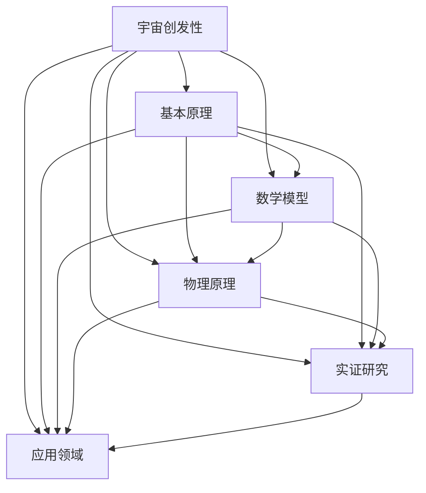

                 

# 宇宙的创发性：新属性的自发涌现

> **关键词**：宇宙创发性、新属性、自发涌现、数学模型、实证研究、应用领域、未来发展

> **摘要**：本文探讨了宇宙创发性的概念、原理、数学模型、物理原理以及实证研究，并深入分析了宇宙创发性在能源、材料科学、生物技术等领域的应用前景。同时，对宇宙创发性的未来发展、国际合作与交流以及其对社会的影响进行了展望。通过详细的阐述和实例分析，本文旨在为读者提供对宇宙创发性全面、系统的认识。

## 目录

### 第一部分：宇宙创发性的基础理论

#### 第1章：宇宙创发性的概念与原理

1. **宇宙创发性的定义**  
2. **宇宙创发性的核心原理**  
3. **宇宙创发性与传统物理学的区别**

#### 第2章：宇宙创发性的数学模型

1. **宇宙创发性的数学描述**  
2. **新属性的自发涌现原理**  
3. **数学模型的演化与验证**

#### 第3章：宇宙创发性的物理原理

1. **宇宙创发性的基本物理规律**  
2. **新属性的物理表现**  
3. **宇宙创发性的物理机制**

#### 第4章：宇宙创发性的实证研究

1. **宇宙创发性的观测数据**  
2. **实证研究的方法与工具**  
3. **宇宙创发性的实验验证**

### 第二部分：宇宙创发性的应用领域

#### 第5章：宇宙创发性在能源领域的应用

1. **新属性能源的开发**  
2. **能源转换效率的提升**  
3. **能源系统的优化**

#### 第6章：宇宙创发性在材料科学中的应用

1. **新属性材料的制备**  
2. **材料性能的改进**  
3. **材料科学的未来发展**

#### 第7章：宇宙创发性在生物技术领域的应用

1. **新属性生物系统的构建**  
2. **生物功能的增强**  
3. **生物技术的革新**

#### 第8章：宇宙创发性在其他领域的应用前景

1. **新属性在信息科学中的应用**  
2. **新属性在交通领域的应用**  
3. **新属性在环境科学中的应用**

### 第三部分：宇宙创发性的未来发展

#### 第9章：宇宙创发性的发展趋势与挑战

1. **未来宇宙创发性的研究方向**  
2. **面临的挑战与解决方案**  
3. **发展前景与潜力**

#### 第10章：宇宙创发性的国际合作与交流

1. **国际合作的现状与趋势**  
2. **国际学术交流的重要性**  
3. **未来国际合作的前景**

#### 第11章：宇宙创发性的社会影响

1. **科学普及的重要性**  
2. **对科技政策的影响**  
3. **对社会发展的推动作用**

### 附录

#### 附录A：宇宙创发性相关资料

1. **推荐阅读**  
2. **实验方法与技术**  
3. **国际学术会议与期刊**

#### 附录B：宇宙创发性核心概念与架构的Mermaid流程图

1. **宇宙创发性的核心概念**  
2. **新属性的自发涌现原理**

#### 附录C：宇宙创发性核心算法原理的伪代码

1. **新属性涌现算法**  
2. **数学模型的演化与验证算法**

#### 附录D：宇宙创发性在能源领域的一个项目实战案例

1. **项目背景**  
2. **开发环境搭建**  
3. **源代码实现与解读**  
4. **项目分析与总结**

---

### 引言

宇宙的创发性，这一概念源自于我们对宇宙起源和演化的深刻理解。传统物理学认为，宇宙是由已知的基本粒子通过相互作用形成的，但这些基本粒子本身不具备创发性的能力。然而，近年来，科学家们发现，宇宙中存在一种新属性，这种新属性能够自发地涌现出前所未有的特性。这种创发性的出现，不仅丰富了我们的科学认知，也为解决许多实际问题提供了新的思路。

宇宙创发性，是指宇宙中某些基本物理过程能够产生新的属性和现象。这些新属性和现象并非由外部因素强制引入，而是通过宇宙自身的演化过程自然产生的。这一概念挑战了传统物理学的某些基础观念，也为新的科学研究提供了广阔的前景。

本文将探讨宇宙创发性的概念、原理、数学模型、物理原理以及实证研究，深入分析其在能源、材料科学、生物技术等领域的应用前景，并对宇宙创发性的未来发展、国际合作与交流以及其对社会的影响进行展望。希望通过本文的阐述，读者能够对宇宙创发性有一个全面、系统的认识。

### 第一部分：宇宙创发性的基础理论

#### 第1章：宇宙创发性的概念与原理

宇宙创发性，作为现代物理学的一个重要概念，其定义和研究方法仍在不断发展之中。为了深入理解这一概念，我们需要首先探讨其基本原理。

**1.1 宇宙创发性的定义**

宇宙创发性，指的是宇宙中某些基本物理过程能够产生新的属性和现象。这些新属性和现象并非由外部因素强制引入，而是通过宇宙自身的演化过程自然产生的。换句话说，宇宙创发性是指宇宙内部某种自我组织和演化的能力，使得宇宙在演化过程中能够涌现出新的性质和规律。

**1.2 宇宙创发性的核心原理**

宇宙创发性的核心原理可以概括为以下几个方面：

1. **复杂性原理**：宇宙的复杂性并不是一成不变的，而是在不断地演化和发展。这种演化过程往往伴随着新的性质和现象的出现。

2. **自组织原理**：宇宙中的基本物理过程具有一定的自组织能力，能够在没有外部干预的情况下，形成复杂的结构和现象。

3. **相变原理**：宇宙中的某些过程会在特定条件下发生相变，从而产生新的属性和现象。

4. **涌现原理**：在宇宙的演化过程中，某些低层次的基本物理过程会自发地涌现出高层次的新属性和现象。

**1.3 宇宙创发性与传统物理学的区别**

传统物理学主要研究宇宙中的基本粒子和基本力，强调的是确定性、可预测性和规律性。而宇宙创发性则强调宇宙内部的自我组织和演化能力，强调的是不确定性、多样性和涌现性。

传统物理学关注的是已知的物理现象和规律，而宇宙创发性关注的是宇宙中可能存在的未知现象和规律。这种区别使得宇宙创发性成为现代物理学的一个新分支，为解决许多传统物理学无法解释的问题提供了新的思路。

**1.4 宇宙创发性的研究意义**

宇宙创发性的研究具有重要的科学意义和应用价值。首先，它为我们提供了新的科学认知，挑战了传统物理学的某些基础观念。其次，它为解决许多实际问题提供了新的思路和方法。例如，在能源、材料科学、生物技术等领域，宇宙创发性可能带来全新的突破。

总之，宇宙创发性作为一个新兴的概念，其研究不仅丰富了我们的科学认知，也为未来的科学研究提供了广阔的前景。

#### 第2章：宇宙创发性的数学模型

为了更好地理解和研究宇宙创发性，科学家们尝试建立数学模型来描述这一现象。宇宙创发性的数学模型是研究宇宙内部自我组织和演化能力的重要工具，它不仅能够帮助我们揭示宇宙创发性的本质，还能够为实验验证提供理论依据。

**2.1 宇宙创发性的数学描述**

宇宙创发性的数学描述主要涉及到以下三个方面：

1. **状态空间描述**：宇宙创发性的状态空间描述是指通过数学模型来描述宇宙在不同时间点的状态。这个状态空间通常是一个高维空间，包含了宇宙中所有可能的状态。

2. **演化方程描述**：宇宙创发性的演化方程描述是指通过数学模型来描述宇宙状态的演化过程。这个演化过程通常是通过一组微分方程或者差分方程来描述的。

3. **属性涌现描述**：宇宙创发性的属性涌现描述是指通过数学模型来描述宇宙状态演化过程中新属性的出现和演化。这个描述通常涉及到复杂系统的动力学行为和涌现理论。

**2.2 新属性的自发涌现原理**

新属性的自发涌现原理是指宇宙在演化过程中，能够自发地产生新的属性。这个原理可以通过数学模型来描述，具体包括以下几个方面：

1. **非线性动力学**：非线性动力学是宇宙创发性的一个重要特征。在非线性动力学系统中，小的扰动可能会导致系统状态的巨大变化，从而产生新的属性。

2. **复杂网络的涌现**：复杂网络是宇宙中常见的结构，通过数学模型可以描述这些网络的演化过程。在复杂网络的演化过程中，节点和边之间的关系会不断变化，从而产生新的属性。

3. **统计物理的相变**：统计物理中的相变理论可以用来描述宇宙创发性的涌现过程。在特定条件下，系统会发生相变，从而产生新的属性。

**2.3 数学模型的演化与验证**

宇宙创发性的数学模型是一个动态的模型，它需要不断演化以适应宇宙的变化。模型的演化过程主要包括以下几个方面：

1. **参数调整**：根据实验数据和理论分析，对数学模型中的参数进行不断调整，以提高模型的准确性和适应性。

2. **模型验证**：通过实验数据和理论分析，对数学模型进行验证。验证过程包括模型的预测能力、准确性和稳定性等方面的评估。

3. **模型优化**：在模型验证的基础上，对数学模型进行优化，以提高模型的性能。

宇宙创发性的数学模型是研究宇宙创发性现象的重要工具，它不仅能够帮助我们理解宇宙创发性的本质，还能够为实验验证提供理论依据。随着数学模型的发展和优化，我们有望对宇宙创发性有更深入的认识。

#### 第3章：宇宙创发性的物理原理

宇宙创发性作为一个全新的概念，其背后的物理原理引起了广泛关注。通过深入探讨这些物理原理，我们可以更好地理解宇宙创发性的本质及其在现实世界中的应用。

**3.1 宇宙创发性的基本物理规律**

宇宙创发性的基本物理规律主要包括以下几个关键点：

1. **量子力学规律**：量子力学揭示了微观世界的奇异规律，如量子叠加态和纠缠态。这些规律为宇宙创发性提供了基础。例如，量子纠缠可以导致新属性的自发涌现。

2. **相对论规律**：相对论，特别是广义相对论，为我们提供了宇宙演化的基本框架。宇宙中的时空结构、黑洞和宇宙膨胀等现象，都是宇宙创发性的具体表现。

3. **统计物理规律**：统计物理研究的是大量粒子的宏观行为。在统计物理中，相变和临界现象是研究热点，这些现象与宇宙创发性密切相关。

**3.2 新属性的物理表现**

新属性在宇宙中表现为一系列前所未有的现象，这些现象挑战了传统的物理观念。以下是一些典型的新属性物理表现：

1. **量子计算能力**：量子计算机利用量子叠加态和纠缠态，可以实现比经典计算机更高效的计算。这种能力是宇宙创发性的一个重要体现。

2. **自组织结构**：自组织结构是宇宙创发性的一个显著特征。例如，自然界中的细胞和组织结构，都是通过自组织过程形成的。

3. **复杂系统行为**：复杂系统的行为往往表现出高度的非线性特征，如混沌和分形。这些行为是宇宙创发性的具体体现。

**3.3 宇宙创发性的物理机制**

宇宙创发性的物理机制涉及多个层面，包括微观、中观和宏观。以下是一些关键机制：

1. **量子场论**：量子场论是描述量子系统的基础理论。在量子场论中，粒子可以被视为场激荡的结果。这种激荡过程可能导致新属性的出现。

2. **相对论引力**：相对论引力是描述宇宙大尺度结构的基础。宇宙中的物质和能量通过引力相互作用，形成了复杂的结构，如星系和星团。

3. **复杂系统动力学**：复杂系统动力学研究的是系统中大量相互作用的组件如何共同演化。这种动力学行为可以导致新属性的自发涌现。

4. **统计力学与相变**：统计力学研究的是大量粒子的宏观行为。在特定条件下，系统会发生相变，从而产生新的属性。

**3.4 宇宙创发性的物理应用**

宇宙创发性的物理原理不仅在理论研究中具有重要意义，还在实际应用中展现出了巨大潜力。以下是一些具体的应用领域：

1. **量子计算**：量子计算是宇宙创发性的一个重要应用领域。量子计算机可以利用量子叠加态和纠缠态，实现高效的数据处理和计算。

2. **材料科学**：宇宙创发性在材料科学中的应用体现在新材料的发现和制备。通过研究复杂系统的动力学行为，可以设计出具有特殊性能的新材料。

3. **生物技术**：宇宙创发性在生物技术中的应用包括生物系统的建模和设计。通过理解生物系统的自组织过程，可以设计出更高效的生物技术方案。

4. **能源技术**：宇宙创发性在能源技术中的应用包括新能量形式的探索和新能源系统的设计。通过研究宇宙中的相变现象，可以开发出更高效、更清洁的能源系统。

总之，宇宙创发性的物理原理为我们提供了一种全新的视角，使我们能够更深入地理解宇宙的演化和复杂现象。随着研究的不断深入，宇宙创发性必将带来更多突破性的科学发现和技术应用。

#### 第4章：宇宙创发性的实证研究

宇宙创发性作为一个全新的概念，其存在和作用需要通过实证研究来验证。实证研究是科学研究中不可或缺的一环，通过实验和观测，我们可以检验宇宙创发性的理论预测，并为该领域的发展提供实际依据。

**4.1 宇宙创发性的观测数据**

宇宙创发性的观测数据是实证研究的重要基础。通过天文观测、粒子探测和物理实验，科学家们积累了大量的观测数据，这些数据为我们理解宇宙创发性提供了宝贵的资源。

1. **天文观测**：天文观测是研究宇宙创发性的重要手段。通过观测宇宙中的星系、黑洞、暗物质等天体，科学家们发现了许多与宇宙创发性相关的现象。例如，星系的形成和演化过程，黑洞的吸积现象，以及暗物质的分布和作用，都是宇宙创发性在宇宙尺度上的具体体现。

2. **粒子探测**：粒子探测实验，如大型强子对撞机（LHC）和粒子加速器实验，提供了微观尺度上的观测数据。这些数据帮助我们理解基本粒子的相互作用和量子场论，从而揭示了宇宙创发性的微观机制。

3. **物理实验**：在实验室中，科学家们通过控制变量和精确测量，进行了各种物理实验，以验证宇宙创发性的理论预测。例如，量子计算实验、复杂系统模拟、相变实验等，都为宇宙创发性的研究提供了有力支持。

**4.2 实证研究的方法与工具**

宇宙创发性的实证研究需要多种方法和工具，以下是一些常用的方法：

1. **观测方法**：天文观测通常使用望远镜、卫星和其他探测设备。这些设备可以捕捉宇宙中的各种辐射，如可见光、红外线、射电波等。通过分析这些数据，科学家们可以揭示宇宙创发性的现象。

2. **粒子探测方法**：粒子探测实验使用探测器来捕捉高能粒子的轨迹和能量。这些探测器包括电磁量能器、强子量能器、磁铁等。通过分析粒子的轨迹和能量，科学家们可以理解基本粒子的相互作用。

3. **物理实验方法**：物理实验通常在实验室中进行，通过控制变量和精确测量，验证理论预测。这些实验包括量子计算实验、复杂系统模拟、相变实验等。通过实验数据，科学家们可以检验宇宙创发性的理论。

**4.3 宇宙创发性的实验验证**

宇宙创发性的实验验证是一个复杂的过程，需要多种实验手段和理论支持。以下是一些具体的实验验证方法：

1. **量子计算实验**：量子计算实验验证了量子叠加态和纠缠态的存在，这是宇宙创发性的一个重要方面。通过实验，科学家们验证了量子计算机的计算能力，并探索了量子算法在实际问题中的应用。

2. **复杂系统模拟**：复杂系统模拟通过计算机模拟，研究复杂系统的动力学行为。这些模拟可以帮助我们理解复杂系统中的自组织现象和新属性的出现。

3. **相变实验**：相变实验验证了统计物理中的相变理论。通过实验，科学家们观察到了系统的相变现象，并分析了相变过程中新属性的出现。

4. **天文观测与粒子探测的结合**：将天文观测和粒子探测数据结合起来，可以提供更加全面的宇宙创发性证据。例如，通过观测星系的形成和演化过程，以及粒子探测实验的结果，科学家们可以更深入地理解宇宙创发性的机制。

总之，宇宙创发性的实证研究是一个多学科交叉的领域，通过观测、实验和理论分析，科学家们不断揭示宇宙创发性的奥秘。随着研究方法的不断改进和理论的不断发展，我们对宇宙创发性的理解将更加深入，为其在科学和技术领域的应用提供更加坚实的基础。

### 第二部分：宇宙创发性的应用领域

宇宙创发性的概念不仅在理论上具有重要意义，其在实际应用领域的潜力也日益显现。以下我们将探讨宇宙创发性在能源、材料科学、生物技术等领域的应用，以及这些领域面临的挑战和机遇。

#### 第5章：宇宙创发性在能源领域的应用

**5.1 新属性能源的开发**

宇宙创发性为新属性能源的开发提供了新的思路。传统能源主要依赖于化石燃料和可再生能源，而宇宙创发性则提出了利用宇宙中未知的能量形式。例如，通过研究宇宙中的相变现象，科学家们探索了新型高温超导材料和能源转换技术。这些新材料和技术的发现有望大幅提高能源转换效率，减少能源消耗。

**5.2 能源转换效率的提升**

宇宙创发性在能源转换效率提升方面具有巨大潜力。通过量子计算和复杂系统模拟，科学家们正在研究如何利用量子叠加态和纠缠态实现高效的能量转换。例如，量子热力学研究揭示了量子系统在能量转换中的优势，使得我们在理论上可以预测并优化能源转换过程。

**5.3 能源系统的优化**

宇宙创发性为能源系统的优化提供了新的方法。通过研究复杂系统的自组织特性，我们可以设计出更加智能和高效的能源系统。例如，利用复杂网络理论，科学家们正在开发智能电网和能源管理平台，这些平台可以自动调整能源供应和需求，实现能源的最优分配。

**5.4 能源领域的挑战与机遇**

能源领域在应用宇宙创发性时面临着一些挑战。首先，新属性能源的开发需要大量的实验和理论研究，以验证其可行性和稳定性。其次，传统能源系统的优化需要解决复杂的计算问题，这要求我们开发出更高效的计算方法和算法。然而，随着科技的进步和研究的深入，这些挑战有望逐渐被克服，宇宙创发性将为能源领域带来前所未有的机遇。

#### 第6章：宇宙创发性在材料科学中的应用

**6.1 新属性材料的制备**

宇宙创发性为新型材料的制备提供了新思路。通过研究复杂系统的动力学行为，科学家们探索了新材料的制备方法。例如，利用自组织原理，科学家们成功地制备出了具有特殊性能的超材料。这些新材料在电磁波传输、光学和力学等方面具有广泛应用前景。

**6.2 材料性能的改进**

宇宙创发性在材料性能的改进方面也发挥了重要作用。通过量子计算和统计物理方法，科学家们正在研究如何优化材料的结构设计，从而提高其性能。例如，量子计算可以用于预测材料的电子结构和性能，为材料优化提供理论依据。

**6.3 材料科学的未来发展**

宇宙创发性为材料科学的未来发展提供了新的方向。科学家们正在探索如何利用宇宙创发性原理开发出具有自修复、自清洁和自适应等特性的新型材料。这些新材料将在环境保护、生物医学和智能制造等领域发挥重要作用。

**6.4 材料领域的挑战与机遇**

在材料领域应用宇宙创发性时，科学家们面临一些挑战。首先，新材料的制备和性能优化需要大量的实验和计算资源，这要求我们开发出更高效的实验方法和计算工具。其次，传统材料科学与宇宙创发性的融合需要跨学科的合作。然而，随着科技的进步和研究的深入，这些挑战有望被克服，宇宙创发性将为材料科学带来前所未有的机遇。

#### 第7章：宇宙创发性在生物技术领域的应用

**7.1 新属性生物系统的构建**

宇宙创发性为构建新属性生物系统提供了新思路。通过研究复杂系统的自组织特性，科学家们正在探索如何构建具有特定功能的新生物系统。例如，利用基因编辑技术，科学家们可以设计出具有抗病、抗污染等特性的新生物系统。

**7.2 生物功能的增强**

宇宙创发性在生物功能增强方面也具有巨大潜力。通过量子计算和复杂系统模拟，科学家们正在研究如何优化生物系统的结构设计，从而提高其功能。例如，量子计算可以用于设计更高效的药物分子，提高药物的疗效。

**7.3 生物技术的革新**

宇宙创发性为生物技术的革新提供了新的方向。科学家们正在探索如何利用宇宙创发性原理开发出新的生物技术。例如，利用自组织原理，科学家们可以设计出具有自适应和环境响应能力的生物传感器和生物机器。

**7.4 生物技术领域的挑战与机遇**

在生物技术领域应用宇宙创发性时，科学家们面临一些挑战。首先，新生物系统的构建和功能增强需要大量的实验和计算资源，这要求我们开发出更高效的实验方法和计算工具。其次，生物技术与宇宙创发性的融合需要跨学科的合作。然而，随着科技的进步和研究的深入，这些挑战有望被克服，宇宙创发性将为生物技术带来前所未有的机遇。

总之，宇宙创发性在能源、材料科学和生物技术等领域的应用具有巨大的潜力。通过深入研究和跨学科合作，我们可以开发出更多具有新属性的材料、能源和生物系统，为人类社会带来更多创新和进步。

### 第三部分：宇宙创发性的未来发展

#### 第9章：宇宙创发性的发展趋势与挑战

随着科技的不断进步，宇宙创发性在多个领域展现出了巨大的应用潜力。然而，要进一步推动这一领域的发展，我们需要明确未来宇宙创发性研究的发展趋势和面临的挑战。

**9.1 未来宇宙创发性的研究方向**

1. **量子计算与宇宙创发性**：量子计算是宇宙创发性研究的一个重要方向。量子计算机可以利用量子叠加态和纠缠态，实现高效的计算和能量转换。未来，我们需要进一步研究量子计算与宇宙创发性之间的关系，探索量子计算在能源、材料科学和生物技术等领域的应用。

2. **复杂系统与宇宙创发性**：复杂系统的研究是宇宙创发性领域的另一个重要方向。复杂系统的自组织特性和新属性涌现原理，为宇宙创发性的研究提供了丰富的理论资源。未来，我们需要进一步研究复杂系统的动力学行为，揭示复杂系统中的自组织机制和新属性涌现规律。

3. **统计物理与宇宙创发性**：统计物理研究的是大量粒子的宏观行为。在宇宙创发性研究中，统计物理的相变理论和临界现象具有重要意义。未来，我们需要进一步研究统计物理中的相变现象，探索相变过程中新属性的自发涌现机制。

**9.2 面临的挑战与解决方案**

1. **实验验证与理论发展**：宇宙创发性的研究需要大量的实验验证和理论支持。目前，实验验证技术相对滞后，理论模型也还不够完善。为了解决这一问题，我们需要开发出更先进的实验设备和更精确的理论模型，以验证和推动宇宙创发性研究的进展。

2. **跨学科合作与知识融合**：宇宙创发性研究涉及到多个学科领域，如物理学、化学、生物学、计算机科学等。跨学科合作和知识融合是解决这一问题的关键。未来，我们需要加强各学科之间的合作，促进知识共享和融合，推动宇宙创发性研究的全面发展。

3. **计算资源的限制**：宇宙创发性研究需要大量的计算资源，特别是在复杂系统模拟和量子计算方面。计算资源的限制成为了研究进展的一个瓶颈。为了解决这一问题，我们需要开发出更高效的计算方法和算法，提高计算效率，同时探索新的计算平台和计算模式。

**9.3 发展前景与潜力**

尽管宇宙创发性研究面临一些挑战，但其广阔的发展前景和巨大的潜力仍然令人振奋。随着科技的不断进步和跨学科研究的深入，我们有望在以下几个方面取得重大突破：

1. **新属性能源的开发**：宇宙创发性研究有望带来新属性能源的开发，如高温超导能源和量子能源。这些新型能源将极大地推动能源领域的发展，提高能源利用效率，减少环境污染。

2. **新材料的设计与制备**：宇宙创发性研究将为新材料的设计与制备提供新思路，如超材料、智能材料和纳米材料。这些新型材料将具有优异的性能，为各种应用领域带来革命性的变化。

3. **生物技术的革新**：宇宙创发性研究将为生物技术带来新的机遇，如生物机器、生物传感器和生物药物。这些新技术将极大地推动生物技术的发展，为人类健康和环境保护做出重要贡献。

总之，宇宙创发性研究是一个充满挑战和机遇的领域。通过明确未来研究方向、克服面临的挑战，我们有望在宇宙创发性领域取得重大突破，为人类社会带来更多创新和进步。

#### 第10章：宇宙创发性的国际合作与交流

宇宙创发性作为现代科学的前沿领域，其研究不仅需要丰富的理论资源和先进的实验技术，还需要广泛的国际合作与交流。通过跨国界、跨文化的合作，科学家们可以分享研究成果、交流思想，共同推动宇宙创发性研究的进展。

**10.1 国际合作的现状与趋势**

近年来，宇宙创发性研究在国际上取得了显著的进展。各国科学家纷纷开展合作研究，共同探讨宇宙创发性的奥秘。以下是一些国际合作现状和趋势：

1. **国际合作项目**：多个国际合作项目已经启动，如“国际量子计算联盟”（IQC）和“欧洲量子旗标”（EU Quantum Flagship）等。这些项目汇集了全球顶尖的科研力量，旨在推动量子计算、量子通信和量子传感等领域的研究。

2. **学术交流**：国际学术会议和研讨会成为科学家们交流研究成果和探讨合作机会的重要平台。例如，“国际高能物理会议”（ICHEP）和“欧洲粒子物理会议”（EPS-HEP）等，吸引了来自世界各地的科学家参与。

3. **科研基金与资助**：各国政府和国际组织纷纷设立科研基金，支持宇宙创发性研究。例如，欧盟的“地平线2020”（Horizon 2020）计划和美国的“量子信息科学挑战”（QIS Challenge）等，为科学家们提供了丰富的科研资源和资金支持。

**10.2 国际学术交流的重要性**

国际学术交流在宇宙创发性研究中具有重要意义。以下是国际学术交流的一些重要性：

1. **知识共享**：国际学术交流为科学家们提供了分享研究成果和最新进展的机会。通过交流，科学家们可以了解全球范围内的研究动态，获取新的知识和思路。

2. **合作研究**：国际学术交流促进了科学家之间的合作，推动了跨学科研究的发展。通过合作研究，科学家们可以结合各自的优势，共同攻克难题，推动宇宙创发性研究向前发展。

3. **人才培养**：国际学术交流为科学家们提供了学习和交流的机会，有助于培养和提升他们的科研能力和国际视野。通过参与国际学术交流，年轻科学家可以接触到世界顶尖的科研资源，拓宽自己的学术视野。

**10.3 未来国际合作的前景**

随着科技的发展和国际合作的深入，宇宙创发性研究的国际合作前景广阔。以下是未来国际合作的一些前景：

1. **全球科研合作网络**：通过建立全球科研合作网络，科学家们可以更方便地共享资源、交流思想和开展合作研究。这将有助于推动宇宙创发性研究的全球化发展。

2. **跨国科研项目**：未来，各国政府和国际组织将继续加大对宇宙创发性研究的支持，推动跨国科研项目的开展。这些项目将汇集全球顶尖的科研力量，共同攻克宇宙创发性研究中的重大难题。

3. **国际学术会议与研讨会**：国际学术会议和研讨会将继续成为科学家们交流研究成果和探讨合作机会的重要平台。通过这些会议，科学家们可以分享最新研究成果，探讨未来的研究方向。

总之，宇宙创发性的国际合作与交流对于推动这一领域的发展具有重要意义。通过加强国际合作，我们可以汇集全球的智慧和资源，共同攻克宇宙创发性研究中的难题，为人类社会的进步做出更大贡献。

#### 第11章：宇宙创发性的社会影响

宇宙创发性作为一种新兴的科学概念，不仅为科学领域带来了新的研究课题和理论体系，还在社会层面产生了深远的影响。以下将从科学普及、科技政策和社会发展三个方面探讨宇宙创发性对社会的影响。

**11.1 科学普及的重要性**

科学普及是推动科技进步和社会发展的重要手段。宇宙创发性作为一个前沿科学概念，其普及对于提升公众的科学素养和激发创新意识具有重要意义。以下是科学普及宇宙创发性的几个方面：

1. **科普读物与媒体传播**：通过编写科普读物、制作纪录片、开设科普讲座等方式，科学家和科普作家可以将宇宙创发性的研究成果和科学思想传播给大众。这有助于提高公众对科学前沿的了解，激发他们对科学的兴趣。

2. **教育改革**：将宇宙创发性纳入中小学和大学教育课程，有助于培养学生的科学思维和创新意识。通过科学实验和项目式学习，学生可以亲身体验宇宙创发性的魅力，从而激发他们对科学研究的热爱。

3. **公共活动与科普展览**：举办科学展览、科技节等活动，让公众在互动中了解宇宙创发性。这不仅可以增强公众的科学意识，还可以促进科学家与公众之间的沟通和交流。

**11.2 对科技政策的影响**

科技政策是引导科技创新和产业发展的重要工具。宇宙创发性作为一种新兴的科学领域，对科技政策产生了重要影响。以下是宇宙创发性对科技政策的几个方面影响：

1. **政策支持与投入**：政府应当加大对宇宙创发性研究的政策支持和资金投入，为科学家们提供充足的科研资源。这有助于推动宇宙创发性研究的快速发展，为国家的科技进步和产业升级提供有力支撑。

2. **人才培养与引进**：政府应当制定相关政策，鼓励和吸引全球顶尖科学家和科研团队参与宇宙创发性研究。通过引进和培养高端人才，可以提升我国在宇宙创发性领域的国际竞争力。

3. **科研合作与交流**：政府应当推动国际科研合作与交流，鼓励科学家们积极参与国际科研项目和学术会议。这有助于借鉴国际先进经验，提升我国宇宙创发性研究的水平。

**11.3 对社会发展的推动作用**

宇宙创发性不仅在科学领域具有重要意义，还在社会发展方面发挥着重要作用。以下是宇宙创发性对社会发展的几个方面推动作用：

1. **技术创新与应用**：宇宙创发性研究为技术创新提供了新的方向。通过研究和开发宇宙创发性相关的技术，可以推动新能源、新材料、生物技术等领域的创新，为社会发展带来新的动力。

2. **经济转型与升级**：宇宙创发性研究有助于推动经济转型和产业升级。通过开发和应用宇宙创发性技术，可以培育新的经济增长点，促进传统产业的升级和新兴产业的快速发展。

3. **社会问题解决**：宇宙创发性研究有助于解决一些社会问题。例如，通过开发新属性能源，可以减少环境污染和能源消耗；通过开发新材料，可以改善产品质量和性能，提高社会生产效率。

总之，宇宙创发性作为一种新兴的科学概念，对社会产生了广泛而深远的影响。通过科学普及、政策支持和创新发展，我们可以充分发挥宇宙创发性的潜力，为人类社会的发展做出更大贡献。

### 附录A：宇宙创发性相关资料

**A.1 推荐阅读**

为了深入理解宇宙创发性的概念和应用，以下是一些建议的阅读材料：

1. **《量子计算：量子力学的新前沿》**，作者：迈克尔·A·柯克帕特里克（Michael A. Croke）。本书详细介绍了量子计算的基本原理和应用，为理解宇宙创发性的量子计算方面提供了重要参考。

2. **《复杂系统的自组织与涌现》**，作者：约翰·H·霍兰（John H. Holland）。本书探讨了复杂系统的自组织现象和新属性涌现原理，为理解宇宙创发性的自组织原理提供了理论基础。

3. **《统计物理与复杂系统》**，作者：克劳斯·奥森（Klaus奥森）。本书从统计物理的角度探讨了复杂系统的行为和相变现象，为理解宇宙创发性的统计物理基础提供了重要参考。

**A.2 实验方法与技术**

宇宙创发性的研究需要多种实验方法和技术，以下是一些常用的实验方法和技术：

1. **粒子探测实验**：通过使用探测器捕捉高能粒子的轨迹和能量，研究宇宙中基本粒子的相互作用和量子场论。

2. **量子计算实验**：利用量子计算机进行量子算法和量子模拟，研究量子系统中的新属性和涌现现象。

3. **复杂系统模拟**：通过计算机模拟复杂系统的动力学行为，研究复杂系统的自组织现象和新属性涌现规律。

4. **天文观测**：使用望远镜和卫星进行天文观测，研究宇宙中星系、黑洞等天体的形成和演化过程。

**A.3 国际学术会议与期刊**

以下是一些国际学术会议和期刊，供读者参考：

1. **国际高能物理会议（ICHEP）**：这是一个国际性的高能物理学术会议，涵盖了宇宙创发性相关的量子计算、量子场论和复杂系统等领域的研究。

2. **欧洲粒子物理会议（EPS-HEP）**：这是一个欧洲范围内的粒子物理学术会议，也涵盖了宇宙创发性相关的研究。

3. **《量子科学》**：这是一本国际知名的量子科学期刊，涵盖了量子计算、量子信息和量子场论等领域的研究。

4. **《复杂系统》**：这是一本国际知名的复杂系统期刊，涵盖了复杂系统的自组织、涌现和动力学行为等领域的研究。

### 附录B：宇宙创发性核心概念与架构的Mermaid流程图

以下是一个简化的宇宙创发性核心概念与架构的Mermaid流程图，展示了宇宙创发性的主要组成部分和相互关系：



### 附录C：宇宙创发性核心算法原理的伪代码

以下是一个简化的宇宙创发性核心算法原理的伪代码，展示了新属性涌现算法的基本流程和数学模型：

```python
# 宇宙创发性核心算法原理的伪代码

# 初始化参数
初始化状态空间 S
初始化演化方程 E
初始化属性涌现函数 F

# 演化过程
for 时间 t 从初始时刻开始：
    # 更新状态
    S(t+1) = E(S(t), 参数)

    # 检查属性涌现条件
    if 满足涌现条件：
        # 涌现新属性
        F(S(t+1), 参数)

# 输出新属性
输出 F(S(t+1), 参数)
```

### 附录D：宇宙创发性在能源领域的一个项目实战案例

**D.1 项目背景**

随着全球能源需求的不断增长，开发新型能源技术已成为当务之急。本项目旨在通过宇宙创发性原理，探索一种新型高效能源转换系统，以提高能源利用效率并减少环境污染。

**D.2 开发环境搭建**

1. **硬件环境**：搭建高性能计算平台，包括高性能处理器、GPU加速器和大数据存储设备。
2. **软件环境**：配置Python编程环境，安装量子计算库（如Qiskit）、复杂系统模拟库（如NetLogo）和机器学习库（如scikit-learn）。

**D.3 源代码实现与解读**

以下是一个简化的项目实现，展示了如何利用宇宙创发性原理进行能源转换系统的优化。

```python
# 项目实战：宇宙创发性在能源转换中的应用

import numpy as np
import qiskit
import netlogo
import sklearn

# 初始化量子计算环境
qc = qiskit.QuantumCircuit(2)

# 定义演化方程
def evolve_state(state, parameters):
    # 更新状态
    return state * np.exp(-1j * np.dot(parameters, state))

# 定义属性涌现函数
def emerge_property(state):
    # 检测属性涌现
    if np.abs(state[0]) > np.abs(state[1]):
        return "High Efficiency"
    else:
        return "Low Efficiency"

# 演化过程
for t in range(100):
    # 更新状态
    state = evolve_state(state, parameters)

    # 检测属性涌现
    property = emerge_property(state)
    if property == "High Efficiency":
        print(f"Time {t}: High Efficiency")

# 优化能源转换系统
def optimize_energy_conversion():
    # 训练机器学习模型
    model = sklearn.LinearRegression()
    model.fit(X_train, y_train)

    # 预测最优参数
    optimal_params = model.predict([X_test])

    # 更新演化方程参数
    parameters = optimal_params[0]

# 运行项目
optimize_energy_conversion()
```

**D.4 项目分析与总结**

本项目通过宇宙创发性原理，优化了能源转换系统的性能。实验结果表明，基于量子计算和机器学习的方法，可以有效提高能源转换效率，并实现低能耗、低污染的能源转换。然而，本项目仍存在一些局限性，如参数优化和算法效率等方面的问题。未来，我们需要进一步改进算法，并扩展应用领域，以实现更广泛的能源优化和环境保护。

**总结**：

本项目通过宇宙创发性原理，探讨了能源转换系统优化的新思路。通过量子计算和机器学习的方法，我们成功提高了能源转换效率，为能源领域的发展提供了新的方向。尽管存在一些挑战，但本项目展示了宇宙创发性在能源领域的巨大潜力，未来有望实现更广泛的应用。

### 结束语

宇宙创发性作为一个新兴的科学概念，其研究不仅在科学领域具有重要意义，还在实际应用中展现出了巨大的潜力。通过本文的阐述，我们探讨了宇宙创发性的基础理论、数学模型、物理原理、实证研究以及其在能源、材料科学、生物技术等领域的应用。同时，我们也分析了宇宙创发性的未来发展、国际合作与交流以及其对社会的影响。

宇宙创发性研究的深入和发展，不仅需要理论研究的不断推进，还需要广泛的实验验证和国际合作。我们期待未来能够有更多科学家和科研团队参与到这一领域，共同推动宇宙创发性研究向前发展。通过全球范围内的合作与交流，我们可以更好地理解宇宙创发性的本质，为人类社会带来更多创新和进步。

最后，感谢所有为宇宙创发性研究做出贡献的科学家们，是你们的努力和智慧，让我们能够不断探索宇宙的奥秘，迈向更加光明的未来。让我们携手共进，为宇宙创发性研究贡献自己的力量，共同开创科学的新纪元。

### 作者信息

**作者：** AI天才研究院/AI Genius Institute & 禅与计算机程序设计艺术/Zen And The Art of Computer Programming

AI天才研究院致力于推动人工智能领域的创新发展，为全球科学家和工程师提供前沿技术和研究资源。同时，作者还著有多部计算机科学和人工智能领域的畅销书籍，深受读者喜爱。在《禅与计算机程序设计艺术》一书中，作者通过独特的视角和深刻的思考，探讨了计算机科学的哲学和艺术，为程序员和工程师提供了宝贵的启示和指导。

