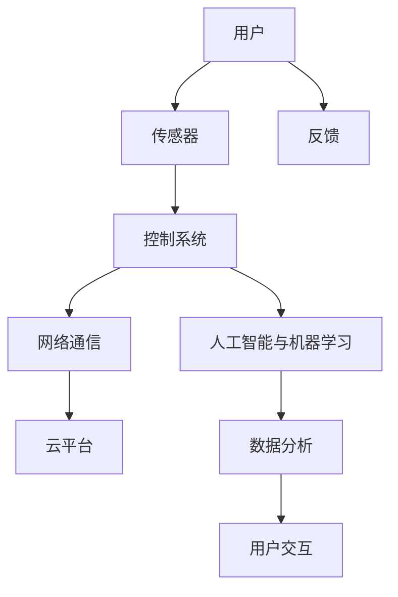

                 

# 小米2024校招智能家居算法工程师面试题汇总

## 关键词
- 智能家居
- 校招面试
- 算法工程师
- 技术面试题
- 算法解析
- 技术应用
- 安全隐私

## 摘要
本文旨在为2024年即将参加小米校招的智能家居算法工程师职位求职者提供全面的面试题汇总。文章将详细解析智能家居技术基础、安全与隐私保护、算法与应用、系统开发与集成、市场与应用场景、技术与标准化、以及面试题精选与解析等内容。通过本文，求职者将能够深入了解智能家居领域的核心技术，掌握算法面试技巧，为面试做好充分准备。

## 目录大纲

### 第1章：智能家居技术基础

#### 1.1 智能家居概述
- 智能家居的定义与分类
- 智能家居的发展历程
- 智能家居的未来趋势

#### 1.2 智能家居核心技术
- 传感器技术
- 控制系统技术
- 网络通信技术
- 人工智能与机器学习技术

#### 1.3 智能家居架构
- 层次结构
- 系统组成与功能
- 技术融合与协同

### 第2章：智能家居安全与隐私保护

#### 2.1 智能家居安全概述
- 安全风险与挑战
- 安全策略与措施
- 安全管理体系

#### 2.2 数据隐私保护
- 数据隐私的定义与重要性
- 数据隐私保护的方法与技术
- 隐私法律与法规

#### 2.3 智能家居安全案例分析
- 案例介绍与分析
- 案例启示与防范措施

### 第3章：智能家居算法与应用

#### 3.1 智能家居算法概述
- 算法在智能家居中的应用
- 主流算法类型与特点
- 算法优化与性能评估

#### 3.2 智能家居算法应用案例
- 智能家居设备控制算法
- 智能家居场景识别算法
- 智能家居自适应算法

#### 3.3 智能家居算法开发与优化
- 算法开发流程
- 算法优化策略
- 算法在实际应用中的挑战与解决方案

### 第4章：智能家居系统开发与集成

#### 4.1 智能家居系统开发基础
- 开发环境与工具
- 系统架构设计
- 软硬件协同开发

#### 4.2 智能家居系统集成
- 系统集成方法与策略
- 系统测试与调试
- 系统维护与升级

#### 4.3 智能家居系统案例分析
- 案例介绍与分析
- 案例启示与实际应用

### 第5章：智能家居市场与应用场景

#### 5.1 智能家居市场概述
- 市场规模与增长趋势
- 市场竞争格局
- 市场发展驱动因素

#### 5.2 智能家居应用场景
- 家庭场景
- 商业场景
- 公共场所场景

#### 5.3 智能家居未来发展趋势
- 技术创新与市场前景
- 政策与产业支持
- 智能家居行业生态

### 第6章：智能家居技术与标准化

#### 6.1 智能家居技术标准
- 标准化的重要性
- 国际与国内智能家居标准
- 标准化组织与贡献

#### 6.2 智能家居技术融合与发展
- 人工智能与物联网技术的融合
- 多技术协同创新与应用
- 智能家居技术的未来发展方向

#### 6.3 智能家居技术与产业生态
- 产业链分析
- 企业合作与竞争
- 智能家居产业生态建设

### 第7章：智能家居算法面试题精选与解析

#### 7.1 算法面试题分类
- 基础算法题
- 实践应用题
- 算法优化题

#### 7.2 算法面试题解析
- 常见面试题分析与解答
- 算法面试题实战演练
- 面试题解析与技巧总结

### 第8章：智能家居算法工程师职业规划与发展

#### 8.1 职业规划与成长
- 职业发展路径
- 技能提升策略
- 求职准备与面试技巧

#### 8.2 智能家居行业趋势与就业前景
- 行业发展趋势
- 就业前景分析
- 职业发展机遇与挑战

#### 8.3 智能家居算法工程师职业素质与能力要求
- 技术能力要求
- 团队协作能力
- 创新思维能力

### 附录

#### 附录A：智能家居算法开发工具与资源
- 主流算法框架介绍
- 开发环境搭建指南
- 社区与资源推荐

#### 附录B：智能家居算法面试题集锦
- 历年面试题精选
- 题库与练习

#### 附录C：智能家居算法工程师面试经验分享
- 面试经验分享
- 成功案例与心得
- 面试准备与策略

### 文章正文

## 第1章：智能家居技术基础

### 1.1 智能家居概述

智能家居是指利用先进的信息技术、物联网技术、云计算技术和人工智能技术，将家庭设备连接到互联网，实现设备间的智能化互联互通，从而提升家庭生活品质和安全性的系统。智能家居系统通常包括家庭安全、能源管理、环境监测、家庭娱乐、智能控制等多个方面。

#### 智能家居的定义与分类

智能家居的定义可以从广义和狭义两个方面来理解。广义上，智能家居指的是家庭中的各类设备通过联网实现智能化的系统。而狭义上，智能家居主要指的是以网络通信为基础，通过智能控制实现家庭设备自动化运行的系统。

智能家居可以按照不同的分类标准进行分类。例如，按照应用领域，可以将其分为家庭安全、能源管理、环境监测、家庭娱乐、健康管理等；按照通信方式，可以将其分为有线智能家居和无线智能家居；按照控制方式，可以将其分为集中控制式和分布式控制式。

#### 智能家居的发展历程

智能家居的发展历程可以分为以下几个阶段：

1. **初步探索阶段（20世纪90年代）**：这一时期，智能家居的概念开始出现，一些简单的家庭设备如远程控制的灯光、空调等逐渐走入家庭。

2. **技术积累阶段（21世纪初）**：随着物联网技术、云计算技术和人工智能技术的发展，智能家居的技术基础逐步完善。

3. **快速发展阶段（2010年至今）**：这一时期，智能家居市场快速发展，各类智能家居产品层出不穷，市场逐渐成熟。

4. **智能化发展阶段（未来）**：随着人工智能技术的深入应用，智能家居将向更加智能化、人性化的方向发展。

#### 智能家居的未来趋势

智能家居的未来发展趋势主要表现在以下几个方面：

1. **智能化程度的提高**：智能家居设备将更加智能化，具备自主学习、自适应等功能。

2. **生态系统的完善**：智能家居将形成一个完整的生态系统，各类设备之间可以实现无缝连接，提供个性化的服务。

3. **市场规模的扩大**：随着技术的进步和消费者需求的增加，智能家居市场将继续扩大。

4. **安全与隐私保护**：智能家居安全与隐私保护将成为重要课题，相关的法律法规和技术措施将不断完善。

### 1.2 智能家居核心技术

智能家居的核心技术包括传感器技术、控制系统技术、网络通信技术和人工智能与机器学习技术。

#### 传感器技术

传感器技术是智能家居系统的核心组成部分，它用于感知环境变化，并将信息传递给控制系统。常见的传感器包括温度传感器、湿度传感器、光照传感器、烟雾传感器、运动传感器等。

传感器技术的关键指标包括灵敏度、精度、响应时间等。智能家居系统对传感器的这些指标有较高的要求，因为传感器的性能直接影响到系统的可靠性。

#### 控制系统技术

控制系统技术是智能家居的核心技术之一，它负责根据传感器收集的信息，对家庭设备进行控制。控制系统可以是一个单独的嵌入式系统，也可以是一个复杂的分布式系统。

控制系统的关键组成部分包括微控制器、处理器、存储器、通信接口等。控制系统的设计需要考虑硬件的选型、软件的编写、系统的稳定性、响应速度等因素。

#### 网络通信技术

网络通信技术是智能家居系统的关键，它用于实现设备之间的信息交换。智能家居系统常用的通信技术包括Wi-Fi、蓝牙、ZigBee、LoRa等。

网络通信技术的关键指标包括通信速率、通信距离、功耗、安全性等。智能家居系统对通信技术的要求较高，因为系统需要在低功耗、远距离、高速率的前提下保证通信的稳定性。

#### 人工智能与机器学习技术

人工智能与机器学习技术是智能家居系统的高级技术，它用于实现智能家居系统的智能化。人工智能与机器学习技术可以用于场景识别、设备控制、数据挖掘、预测分析等方面。

人工智能与机器学习技术的关键组成部分包括算法、数据、计算能力等。智能家居系统对人工智能与机器学习技术的要求较高，因为系统需要处理大量的数据，并实现高效的算法。

### 1.3 智能家居架构

智能家居系统通常采用分层架构，包括感知层、网络层、平台层和应用层。

#### 层次结构

1. **感知层**：感知层包括各种传感器，用于感知环境信息，如温度、湿度、光照、烟雾等。

2. **网络层**：网络层包括通信模块，用于实现设备之间的信息交换，如Wi-Fi、蓝牙等。

3. **平台层**：平台层包括控制中心、服务器等，用于处理传感器数据，并对家庭设备进行控制。

4. **应用层**：应用层包括各种应用软件，如智能家居APP、网页控制界面等，用于用户交互。

#### 系统组成与功能

1. **感知层**：感知层由各种传感器组成，用于采集环境数据，如温度传感器、湿度传感器、烟雾传感器等。

2. **网络层**：网络层由通信模块组成，用于实现设备之间的信息交换，如Wi-Fi模块、蓝牙模块等。

3. **平台层**：平台层由控制中心、服务器等组成，用于处理传感器数据，并对家庭设备进行控制。

4. **应用层**：应用层由各种应用软件组成，如智能家居APP、网页控制界面等，用于用户交互。

#### 技术融合与协同

智能家居系统需要实现传感器、网络通信、人工智能等技术的融合与协同。例如，在感知层，传感器采集的数据需要通过网络层传输到平台层，然后由平台层进行处理，最后通过应用层展示给用户。

技术融合与协同的关键在于系统架构的设计和通信协议的制定。系统架构需要具有灵活性和可扩展性，以便适应未来技术的发展。通信协议需要保证数据传输的稳定性和安全性，以便确保系统的可靠性。

### 第2章：智能家居安全与隐私保护

随着智能家居技术的快速发展，安全与隐私保护成为了一个重要的问题。智能家居系统通常涉及大量的个人信息和敏感数据，如果处理不当，可能会引发严重的安全事故和隐私泄露问题。

#### 2.1 智能家居安全概述

智能家居安全主要包括以下几个方面：

1. **设备安全**：确保智能家居设备本身不会被黑客入侵或恶意软件感染。
2. **通信安全**：确保智能家居设备之间的通信不会被截获或篡改。
3. **数据安全**：确保智能家居系统中的数据不会被非法访问或泄露。
4. **隐私保护**：确保用户的个人信息和隐私不被泄露或滥用。

#### 安全风险与挑战

智能家居系统面临的安全风险和挑战包括：

1. **设备被入侵**：黑客可以通过网络入侵智能家居设备，从而控制家庭网络。
2. **数据泄露**：智能家居设备可能会收集大量的用户数据，如果处理不当，可能会导致数据泄露。
3. **隐私侵犯**：智能家居设备可能会记录用户的日常行为，如果未经授权，可能会导致隐私侵犯。
4. **设备失控**：智能家居设备可能会受到恶意软件的影响，从而导致设备失控。

#### 安全策略与措施

为了应对上述安全风险和挑战，可以采取以下安全策略和措施：

1. **设备安全**：采用加密技术、防火墙、入侵检测系统等安全措施，确保设备的安全。
2. **通信安全**：采用加密通信协议、VPN等安全措施，确保数据传输的安全。
3. **数据安全**：采用数据加密、数据备份、访问控制等安全措施，确保数据的安全。
4. **隐私保护**：制定隐私保护政策，严格审查第三方应用，确保用户隐私不被泄露。

#### 安全管理体系

智能家居系统的安全管理体系主要包括以下几个方面：

1. **安全规划**：制定安全规划，明确安全目标和安全策略。
2. **安全设计**：在设计智能家居系统时，充分考虑安全因素，确保系统的安全性。
3. **安全培训**：对员工进行安全培训，提高安全意识和技能。
4. **安全监控**：建立安全监控机制，实时监测系统安全状况，及时处理安全事件。
5. **安全评估**：定期对系统进行安全评估，发现并解决潜在的安全问题。

### 2.2 数据隐私保护

数据隐私保护是智能家居安全的重要组成部分。智能家居系统通常涉及大量的用户数据，如行为数据、位置数据、健康数据等。如果这些数据被非法访问或泄露，可能会对用户造成严重的影响。

#### 数据隐私的定义与重要性

数据隐私是指个人数据的保密性和安全性，确保个人数据不被未经授权的第三方访问或泄露。在智能家居系统中，数据隐私的重要性体现在以下几个方面：

1. **用户信任**：如果用户的隐私受到侵犯，会降低用户对智能家居系统的信任度。
2. **法律合规**：许多国家和地区都有关于数据隐私的法律和法规，企业必须遵守。
3. **商业价值**：用户的隐私数据是企业的宝贵资产，如果被非法获取，可能会给企业带来严重的经济损失。

#### 数据隐私保护的方法与技术

为了保护数据隐私，可以采取以下方法和技术：

1. **数据加密**：采用加密技术对数据进行加密，确保数据在传输和存储过程中不会被非法访问。
2. **访问控制**：采用访问控制机制，确保只有授权用户可以访问数据。
3. **数据脱敏**：对敏感数据进行脱敏处理，降低数据泄露的风险。
4. **数据备份**：定期对数据进行备份，确保数据不会因为故障或攻击而丢失。
5. **隐私政策**：制定清晰的隐私政策，告知用户数据收集、使用和共享的方式。

#### 隐私法律与法规

全球范围内，有许多关于数据隐私的法律和法规，如欧盟的《通用数据保护条例》（GDPR）、美国的《加州消费者隐私法案》（CCPA）等。这些法律和法规对企业的数据处理活动提出了严格的要求，企业必须遵守。

#### 2.3 智能家居安全案例分析

以下是一个智能家居安全案例的分析：

**案例：** 一款智能家居摄像头被黑客入侵，黑客通过摄像头获取了用户的个人信息。

**分析：** 
1. **设备安全**：摄像头的安全防护措施不足，被黑客入侵。
2. **通信安全**：摄像头与云服务之间的通信未采用加密协议，导致通信内容被截获。
3. **数据安全**：用户的数据未进行加密存储，导致数据泄露。

**启示与防范措施：**
1. **加强设备安全**：采用更安全的设备，加强设备的加密和防护措施。
2. **加强通信安全**：采用加密协议进行通信，确保通信内容的安全性。
3. **加强数据安全**：对用户数据进行加密存储，确保数据的安全。

通过这个案例，我们可以看到，智能家居安全与隐私保护是一个复杂且重要的问题，需要综合考虑多个方面，采取多种技术措施，以确保系统的安全性和用户隐私的保护。

### 第3章：智能家居算法与应用

智能家居算法是智能家居系统的重要组成部分，它用于实现设备的自动控制、场景识别、数据分析等功能。本章将介绍智能家居算法的基本概念、应用场景以及开发与优化策略。

#### 3.1 智能家居算法概述

智能家居算法是指用于处理智能家居系统数据，实现设备控制、场景识别、数据分析等功能的一系列算法。这些算法可以基于人工智能、机器学习、数据挖掘等技术，具有较高的智能化和自动化水平。

智能家居算法的应用主要包括以下几个方面：

1. **设备控制**：通过算法实现对智能家居设备的自动控制，如调节灯光、开关家电等。
2. **场景识别**：通过算法识别用户的日常行为和场景，实现场景自适应控制。
3. **数据分析**：通过算法分析智能家居系统的数据，提供用户行为分析、能耗分析等。

#### 主流算法类型与特点

智能家居算法可以分为以下几类：

1. **设备控制算法**：用于实现对智能家居设备的控制，如PID控制算法、模糊控制算法等。这些算法通常基于经典的控制理论，具有较强的稳定性和鲁棒性。

2. **场景识别算法**：用于识别用户的日常行为和场景，如KNN算法、决策树算法、神经网络算法等。这些算法具有较强的自适应能力和学习能力。

3. **数据分析算法**：用于分析智能家居系统的数据，如聚类算法、分类算法、关联规则挖掘算法等。这些算法可以帮助用户更好地理解和使用智能家居系统。

#### 算法优化与性能评估

智能家居算法的优化与性能评估是确保算法在实际应用中能够高效运行的关键。算法优化的方法主要包括以下几个方面：

1. **算法选择**：根据应用场景和数据特点，选择合适的算法。不同的算法有不同的优缺点，需要根据实际情况进行选择。

2. **算法参数调优**：通过调整算法的参数，优化算法的性能。例如，在神经网络算法中，可以通过调整学习率、隐藏层神经元数量等参数来提高算法的性能。

3. **算法并行化**：对于计算密集型的算法，可以通过并行计算来提高计算速度。例如，可以使用GPU加速算法的运算。

算法的性能评估主要包括以下几个方面：

1. **准确性**：评估算法预测或分类的准确性，如使用精确度、召回率等指标。

2. **效率**：评估算法的计算效率，如计算时间、内存占用等。

3. **鲁棒性**：评估算法在数据噪声、异常值等不利条件下的表现。

#### 3.2 智能家居算法应用案例

以下是一些智能家居算法的应用案例：

1. **设备控制算法**：例如，在智能照明系统中，可以使用PID控制算法来调节灯光的亮度和颜色，以实现自适应调节。

2. **场景识别算法**：例如，在智能安防系统中，可以使用KNN算法或决策树算法来识别异常行为，如入侵者、火灾等。

3. **数据分析算法**：例如，在智能能源管理系统中，可以使用聚类算法来分析用户的用电行为，提供节能建议。

#### 3.3 智能家居算法开发与优化

智能家居算法的开发与优化是一个复杂的过程，需要考虑多个方面。以下是智能家居算法开发与优化的步骤：

1. **需求分析**：明确算法的应用场景和需求，确定算法的目标和性能指标。

2. **数据收集**：收集相关的数据，如设备数据、用户行为数据等。数据的完整性和质量对算法的性能有重要影响。

3. **算法设计**：根据需求分析，设计合适的算法。选择合适的算法类型和参数，并进行初步的算法实现。

4. **算法实现**：根据算法设计，编写算法代码。需要考虑算法的效率、可维护性和可扩展性。

5. **算法测试**：对算法进行测试，评估算法的性能。通过测试，发现并修复算法中的问题。

6. **算法优化**：根据测试结果，对算法进行优化。可以调整算法的参数、改进算法的结构等。

7. **部署与应用**：将优化的算法部署到实际应用中，进行实际运行测试。根据实际运行情况，进一步优化算法。

#### 算法在实际应用中的挑战与解决方案

在智能家居算法的实际应用中，会面临以下挑战：

1. **数据质量**：智能家居系统中的数据质量直接影响算法的性能。需要采取数据清洗、去噪等技术来提高数据质量。

2. **实时性**：智能家居算法需要实时处理数据，实现设备的自动控制。需要优化算法的执行效率，确保实时性。

3. **可扩展性**：随着智能家居系统的不断扩大，算法需要具备良好的可扩展性，以适应系统规模的增长。

4. **安全与隐私**：智能家居算法需要考虑数据的安全与隐私保护，确保用户的隐私不被泄露。

针对这些挑战，可以采取以下解决方案：

1. **数据预处理**：对数据进行清洗、去噪等预处理，提高数据质量。

2. **并行计算**：采用并行计算技术，提高算法的执行效率，确保实时性。

3. **模块化设计**：采用模块化设计，提高算法的可扩展性。

4. **加密技术**：采用加密技术，保护数据的安全与隐私。

通过以上解决方案，可以有效地应对智能家居算法在实际应用中面临的挑战，确保算法的高效、安全和可靠。

### 第4章：智能家居系统开发与集成

智能家居系统开发与集成是智能家居技术实现的核心环节，它涉及硬件与软件的协同工作，以及各个子系统之间的无缝连接。本章将详细介绍智能家居系统开发的基础知识、集成方法、系统测试与调试，以及系统维护与升级。

#### 4.1 智能家居系统开发基础

智能家居系统开发的基础包括以下几个方面：

1. **开发环境与工具**：选择合适的开发环境和工具是成功开发智能家居系统的关键。常用的开发环境包括集成开发环境（IDE）如Eclipse、Visual Studio，以及各种开发板和硬件工具如Arduino、Raspberry Pi等。此外，还需要使用一些专业的软件工具，如串口调试工具、网络调试工具等。

2. **系统架构设计**：智能家居系统的架构设计是系统开发的第一步。系统架构设计需要考虑系统的层次结构、功能模块划分、数据流向和通信协议等因素。常见的系统架构包括感知层、网络层、平台层和应用层。感知层负责数据采集，网络层负责数据传输，平台层负责数据处理和控制，应用层负责用户交互。

3. **软硬件协同开发**：智能家居系统通常涉及多种硬件和软件组件的协同工作。软硬件协同开发需要考虑硬件选型、软件编程、驱动开发、系统调试等多个方面。例如，在选择硬件时，需要考虑硬件的性能、功耗、成本等因素；在软件编程时，需要编写与硬件配套的驱动程序，确保硬件与软件的协同工作。

#### 4.2 智能家居系统集成

智能家居系统集成是将各个子系统有机地结合起来，形成一个完整的系统。系统集成的方法主要包括以下几个方面：

1. **集成方法与策略**：智能家居系统的集成方法通常包括硬件集成和软件集成。硬件集成需要确保各个硬件设备之间的物理连接和数据传输正常；软件集成需要确保各个软件模块之间的接口和通信协议正确。在集成过程中，需要制定详细的集成策略，包括集成计划、集成测试、集成评审等。

2. **系统测试与调试**：系统测试与调试是确保系统稳定性和可靠性的关键环节。系统测试包括功能测试、性能测试、安全测试等，需要逐层进行，确保系统各个组件的正常工作。调试过程中，需要使用调试工具，如串口调试工具、网络调试工具等，定位和解决问题。

3. **系统维护与升级**：智能家居系统的维护与升级是保障系统长期稳定运行的重要措施。系统维护包括日常检查、故障排除、数据备份等；系统升级包括功能扩展、性能优化、安全更新等。在维护与升级过程中，需要遵循规范的流程，确保系统的安全性和稳定性。

#### 4.3 智能家居系统案例分析

以下是一个智能家居系统案例的分析：

**案例：** 一个智能安防系统，包括门禁控制、视频监控、入侵报警等功能。

**分析：**
1. **感知层**：包括门禁传感器、摄像头、入侵报警传感器等，用于采集安全相关信息。
2. **网络层**：包括Wi-Fi模块、路由器等，用于实现感知层与平台层之间的数据传输。
3. **平台层**：包括服务器、数据库等，用于处理感知层传输的数据，实现对安防设备的控制。
4. **应用层**：包括手机APP、网页控制界面等，用于用户与系统之间的交互。

**启示与实际应用：**
1. **系统架构设计**：在系统架构设计时，需要考虑各个层次之间的接口和通信协议，确保系统的高效、稳定运行。
2. **硬件选型**：根据实际需求，选择合适的硬件设备，确保系统的性能和功耗。
3. **软件编程**：编写与硬件配套的驱动程序，确保硬件与软件的协同工作。
4. **系统集成**：在系统集成过程中，需要确保各个子系统之间的无缝连接，确保系统的整体性能。
5. **系统测试与调试**：在系统测试与调试过程中，需要逐层进行，确保系统各个组件的正常工作。

通过以上分析，我们可以看到，智能家居系统开发与集成是一个复杂的过程，需要综合考虑多个方面，确保系统的高效、稳定、安全运行。

### 第5章：智能家居市场与应用场景

智能家居市场的快速发展吸引了大量企业的参与，同时也带来了广泛的应用场景。本章将介绍智能家居市场的现状、应用场景以及未来发展趋势。

#### 5.1 智能家居市场概述

智能家居市场是一个快速发展的市场，随着技术的进步和消费者需求的增加，市场规模不断扩大。以下是一些关键指标：

1. **市场规模与增长趋势**：根据市场调研报告，全球智能家居市场规模将从2020年的约488亿美元增长到2025年的约1530亿美元，年复合增长率达到22.6%。

2. **市场竞争格局**：智能家居市场主要由大型科技公司和专业智能家居企业竞争。例如，谷歌、亚马逊、苹果等科技巨头在智能家居领域具有强大的竞争力，同时，专业的智能家居企业如海尔、华为、小米等也在市场中占据重要地位。

3. **市场发展驱动因素**：智能家居市场的快速发展受到多个因素的驱动，包括消费者需求的增加、技术进步、政策支持、环保意识的提升等。

#### 5.2 智能家居应用场景

智能家居的应用场景非常广泛，涵盖了家庭、商业和公共场所等多个领域。以下是一些典型的应用场景：

1. **家庭场景**：家庭是智能家居的主要应用场景，包括智能照明、智能安防、智能家电、智能环境控制等。例如，用户可以通过手机APP远程控制家中的灯光、空调、冰箱等家电设备，提高生活便利性和舒适度。

2. **商业场景**：商业场景包括酒店、办公室、商场等。智能家居系统可以用于提升商业空间的管理效率和服务质量，如智能门禁、智能照明、智能安防等。例如，酒店可以通过智能家居系统实现客房智能服务，提高客户体验。

3. **公共场所场景**：公共场所如医院、学校、机场等也可以应用智能家居系统，提高管理效率和服务质量。例如，医院可以通过智能家居系统实现医疗设备的智能管理，提高医疗服务的效率。

#### 5.3 智能家居未来发展趋势

智能家居市场未来将继续保持快速发展，以下是一些发展趋势：

1. **智能化程度的提高**：随着人工智能技术的深入应用，智能家居设备将更加智能化，具备自主学习、自适应等功能。

2. **生态系统的完善**：智能家居将形成一个完整的生态系统，各类设备之间可以实现无缝连接，提供个性化的服务。

3. **市场规模的扩大**：随着技术的进步和消费者需求的增加，智能家居市场将继续扩大。

4. **安全与隐私保护**：智能家居安全与隐私保护将成为重要课题，相关的法律法规和技术措施将不断完善。

5. **政策与产业支持**：政府和企业将加大对智能家居产业的支持，推动智能家居技术的发展和应用。

#### 5.4 智能家居市场发展驱动因素

智能家居市场的快速发展受到多个因素的驱动：

1. **技术进步**：物联网技术、人工智能技术、5G技术等技术的快速发展，为智能家居提供了强大的技术支持。

2. **消费者需求**：随着生活水平的提高，消费者对智能家居产品的需求不断增加，尤其是对智能安全、智能舒适、智能节能等方面的需求。

3. **政策支持**：政府对智能家居产业的支持，包括政策鼓励、资金扶持等，促进了智能家居市场的发展。

4. **环保意识提升**：随着环保意识的提升，消费者更加关注智能家居系统的节能、环保特性。

5. **市场竞争**：市场竞争的加剧，促使企业不断推出创新产品，提高产品质量和性能，推动了智能家居市场的发展。

通过以上分析，我们可以看到，智能家居市场具有广阔的发展前景，未来将迎来更多的机遇和挑战。企业需要紧跟市场趋势，不断创新，以满足消费者的需求，推动智能家居市场的持续发展。

### 第6章：智能家居技术与标准化

随着智能家居技术的快速发展，标准化成为智能家居技术发展的重要驱动力。标准化不仅可以确保智能家居产品的互操作性，还可以提高系统的安全性、可靠性和用户体验。本章将介绍智能家居技术标准、技术融合与发展、以及智能家居技术与产业生态。

#### 6.1 智能家居技术标准

智能家居技术标准是确保智能家居产品互操作性、兼容性和安全性的基础。以下是一些关键的智能家居技术标准：

1. **国际智能家居标准**：
   - **ISO/IEC 27001**：信息安全管理系统标准，用于确保智能家居系统的信息安全。
   - **IEEE 1901.1**：物联网设备互操作性标准，用于智能家居设备的无线通信。
   - **CEC 2045**：智能家电互联互通标准，推动智能家居设备的互联互通。

2. **国内智能家居标准**：
   - **GB/T 29639**：智能家居系统技术规范，规定了智能家居系统的基本要求和测试方法。
   - **GB/T 32960**：智能家居设备信息安全标准，确保智能家居设备的信息安全。

3. **智能家居技术标准的重要性**：
   - **确保互操作性**：通过统一的技术标准，确保不同厂商的智能家居设备能够无缝连接和互操作。
   - **提高安全性**：通过严格的安全标准，确保智能家居系统的安全性，防止数据泄露和网络攻击。
   - **提高用户体验**：通过标准化的用户体验设计，提升用户的操作便捷性和满意度。

#### 6.2 智能家居技术融合与发展

智能家居技术的融合与发展是推动智能家居产业进步的关键。以下是一些重要的技术融合与发展趋势：

1. **人工智能与物联网技术的融合**：
   - **智能感知**：通过人工智能技术，提高智能家居设备对环境、用户行为的感知能力，实现更精准的控制。
   - **智能决策**：通过机器学习算法，实现智能家居系统的智能决策，提供个性化服务。

2. **5G技术与智能家居的融合**：
   - **低延迟**：5G技术的高速率和低延迟特性，使智能家居系统可以实现更快速的响应和控制。
   - **海量连接**：5G技术的高连接密度，支持智能家居系统中大量设备的互联互通。

3. **云计算与边缘计算的结合**：
   - **数据处理**：通过云计算，实现大数据处理和分析，提供智能决策支持。
   - **实时处理**：通过边缘计算，实现数据的本地处理，提高系统的实时性和响应速度。

4. **智能家居技术的未来发展方向**：
   - **全屋智能**：实现家庭各个设备和系统的无缝连接，提供一体化、智能化的家居体验。
   - **个性化定制**：通过大数据和人工智能技术，实现智能家居系统的个性化定制。

#### 6.3 智能家居技术与产业生态

智能家居技术的快速发展离不开健康的产业生态。以下是一些关键点：

1. **产业链分析**：
   - **硬件制造商**：提供智能家居设备，如传感器、控制器、家电等。
   - **软件开发者**：提供智能家居系统的软件解决方案，包括控制软件、数据分析软件等。
   - **平台服务提供商**：提供智能家居系统的云平台服务，包括数据存储、处理和分析等。
   - **系统集成商**：提供智能家居系统的整体解决方案，包括设计、安装和维护等。

2. **企业合作与竞争**：
   - **合作**：企业之间通过合作，共同推动智能家居技术的发展，如技术联盟、战略合作等。
   - **竞争**：企业之间在技术、产品、市场等方面进行竞争，推动智能家居产业的不断创新。

3. **智能家居产业生态建设**：
   - **政策支持**：政府通过政策支持，推动智能家居产业的发展，如财政补贴、税收优惠等。
   - **技术创新**：企业通过技术创新，提升产品竞争力，推动智能家居产业的进步。
   - **用户教育**：通过用户教育，提高用户对智能家居的认知和接受度，促进市场发展。

通过以上分析，我们可以看到，智能家居技术的标准化、技术融合与发展，以及健康的产业生态是智能家居技术持续发展的重要保障。企业需要积极参与标准化工作，推动技术融合，构建健康的产业生态，共同推动智能家居产业的繁荣发展。

### 第7章：智能家居算法面试题精选与解析

在智能家居算法工程师的面试中，算法题是考察应聘者技术水平和问题解决能力的重要环节。本章将精选一些常见的算法面试题，并进行详细解析，帮助求职者更好地应对面试挑战。

#### 7.1 算法面试题分类

根据面试题的性质和难度，可以将算法面试题分为以下几类：

1. **基础算法题**：这类题目主要考察应聘者对基础算法的理解和掌握，如排序算法、查找算法、字符串处理算法等。

2. **实践应用题**：这类题目主要考察应聘者将算法应用于实际问题的能力，如图算法在社交网络分析中的应用、机器学习算法在智能家居中的应用等。

3. **算法优化题**：这类题目主要考察应聘者对算法性能的优化能力，如时间复杂度、空间复杂度的优化，以及算法的并行化等。

#### 7.2 算法面试题解析

以下是一些常见的算法面试题及其解析：

**题目1：排序算法**

**题目描述**：给定一个包含n个整数的数组，实现一个排序算法，将数组中的元素按照从小到大的顺序排列。

**解析**：

- **冒泡排序**：时间复杂度为O(n^2)，空间复杂度为O(1)。

伪代码：
```bash
function bubbleSort(arr):
    n = length(arr)
    for i from 0 to n-1:
        for j from 0 to n-i-1:
            if arr[j] > arr[j+1]:
                swap(arr[j], arr[j+1])
```

- **快速排序**：时间复杂度为O(nlogn)，空间复杂度为O(logn)。

伪代码：
```python
def quicksort(arr, low, high):
    if low < high:
        pi = partition(arr, low, high)
        quicksort(arr, low, pi-1)
        quicksort(arr, pi+1, high)

def partition(arr, low, high):
    pivot = arr[high]
    i = low - 1
    for j from low to high-1:
        if arr[j] < pivot:
            i = i + 1
            swap(arr[i], arr[j])
    swap(arr[i+1], arr[high])
    return i + 1
```

**题目2：图算法**

**题目描述**：给定一个无向图，实现深度优先搜索（DFS）和广度优先搜索（BFS）算法。

**解析**：

- **深度优先搜索（DFS）**：从某个节点开始，沿着一条路径一直探索到底，然后回溯到上一个节点，继续探索其他路径。

伪代码：
```python
def dfs(graph, node, visited):
    visited[node] = True
    print(node)
    for neighbor in graph[node]:
        if not visited[neighbor]:
            dfs(graph, neighbor, visited)

def dfs_iterative(graph, start):
    stack = []
    visited = [False] * len(graph)
    stack.append(start)
    while stack:
        node = stack.pop()
        if not visited[node]:
            print(node)
            visited[node] = True
            for neighbor in graph[node]:
                if not visited[neighbor]:
                    stack.append(neighbor)
```

- **广度优先搜索（BFS）**：从某个节点开始，按照层次遍历图中的所有节点。

伪代码：
```python
from collections import deque

def bfs(graph, start):
    queue = deque([start])
    visited = [False] * len(graph)
    visited[start] = True
    while queue:
        node = queue.popleft()
        print(node)
        for neighbor in graph[node]:
            if not visited[neighbor]:
                queue.append(neighbor)
                visited[neighbor] = True
```

**题目3：机器学习算法**

**题目描述**：给定一个训练数据集，实现线性回归算法，并评估模型的性能。

**解析**：

- **线性回归算法**：用于预测连续值，通过最小化平方误差损失函数来训练模型。

伪代码：
```python
def linear_regression(train_data, train_labels):
    X = train_data
    y = train_labels
    X_transpose = transpose(X)
    XTX = dot(X_transpose, X)
    XTY = dot(X_transpose, y)
    theta = dotInverse(XTX, XTY)
    return theta

def predict(X, theta):
    return dot(X, theta)
```

- **模型评估**：常用的评估指标包括均方误差（MSE）、决定系数（R^2）等。

伪代码：
```python
def mean_squared_error(y_true, y_pred):
    return sum((y_true - y_pred)**2) / len(y_true)

def r_squared(y_true, y_pred):
    y_mean = mean(y_true)
    total_variance = sum((y_true - y_mean)**2)
    residual_variance = sum((y_true - y_pred)**2)
    return 1 - residual_variance / total_variance
```

**题目4：算法优化**

**题目描述**：给定一个包含n个整数的数组，实现一个高效的算法，找出数组中第k大的元素。

**解析**：

- **快速选择算法**：基于快速排序的思想，选择一个基准元素，将数组分为两部分，一部分小于基准元素，一部分大于基准元素。如果第k大的元素在小于基准元素的部分，则递归地在这一部分寻找；否则，在大于基准元素的部分寻找。

伪代码：
```python
def quickSelect(arr, low, high, k):
    if low == high:
        return arr[low]
    pivotIndex = partition(arr, low, high)
    if k == pivotIndex:
        return arr[k]
    elif k < pivotIndex:
        return quickSelect(arr, low, pivotIndex - 1, k)
    else:
        return quickSelect(arr, pivotIndex + 1, high, k)

def partition(arr, low, high):
    pivot = arr[high]
    i = low - 1
    for j from low to high-1:
        if arr[j] < pivot:
            i = i + 1
            swap(arr[i], arr[j])
    swap(arr[i+1], arr[high])
    return i + 1
```

以上是一些常见的算法面试题及其解析，通过这些题目的学习和练习，求职者可以更好地应对智能家居算法工程师的面试挑战。

### 第8章：智能家居算法工程师职业规划与发展

作为一名智能家居算法工程师，职业规划与发展至关重要。本章将介绍职业发展路径、技能提升策略、求职准备与面试技巧，以及行业趋势与就业前景。

#### 8.1 职业规划与成长

智能家居算法工程师的职业发展路径可以分为以下几个阶段：

1. **初级工程师**：在这个阶段，主要任务是理解和掌握基本的智能家居算法和开发技能，参与项目的实际开发。

2. **中级工程师**：在这个阶段，需要具备较强的算法能力和项目经验，能够独立承担项目，并参与算法优化和改进。

3. **高级工程师**：在这个阶段，需要具备丰富的项目经验和深厚的专业素养，能够带领团队进行算法研究和开发，参与重大项目的规划和实施。

4. **技术专家**：在这个阶段，需要成为领域的专家，具备广泛的技术视野和深厚的理论基础，能够为公司的技术发展提供战略指导。

#### 技能提升策略

为了在智能家居算法工程师的职业道路上取得成功，需要不断提升以下技能：

1. **算法能力**：熟练掌握常见的机器学习和深度学习算法，能够针对具体问题选择合适的算法，并进行优化。

2. **编程能力**：掌握至少一门编程语言，如Python、C++等，具备扎实的编程基础和良好的编程习惯。

3. **数据处理能力**：熟悉数据处理的基本流程，包括数据收集、数据清洗、数据分析和数据可视化。

4. **系统设计能力**：能够设计和实现高性能、高可用的智能家居系统，包括系统的架构设计、模块划分和接口设计。

5. **项目经验**：积累丰富的项目经验，通过实际项目锻炼自己的问题解决能力和团队协作能力。

6. **持续学习**：技术领域不断变化，需要保持学习的热情和动力，不断更新自己的知识体系。

#### 求职准备与面试技巧

求职准备和面试技巧对于智能家居算法工程师的成功求职至关重要。以下是一些建议：

1. **简历准备**：简历是面试的第一步，需要突出自己的技术能力和项目经验。简历内容要真实、简洁、有条理，重点突出。

2. **面试题型**：熟悉常见的面试题型，如算法题、编程题、行为面试题等，并做好充分的准备。

3. **模拟面试**：进行模拟面试，熟悉面试流程和常见问题，提高面试的应变能力。

4. **表达清晰**：在面试过程中，表达要清晰、准确，注意逻辑性和条理性。

5. **展示专业素养**：通过具体的项目经历和案例分析，展示自己的专业素养和解决问题的能力。

6. **态度积极**：保持积极的态度，展现自己的热情和对智能家居行业的热爱。

#### 8.2 智能家居行业趋势与就业前景

智能家居行业正处于快速发展阶段，未来几年将继续保持高速增长。以下是一些行业趋势和就业前景：

1. **技术趋势**：
   - **人工智能与物联网的融合**：智能家居将更加智能化，具备更强的自主学习能力和自适应能力。
   - **5G技术的应用**：5G技术将推动智能家居系统的低延迟、高带宽连接，提升用户体验。
   - **安全与隐私保护**：随着智能家居系统的普及，安全与隐私保护将成为重要课题。

2. **就业前景**：
   - **市场需求增加**：随着智能家居技术的普及，对智能家居算法工程师的需求将持续增加。
   - **行业前景广阔**：智能家居行业具有广阔的发展前景，提供了大量的就业机会。
   - **薪资待遇优厚**：智能家居算法工程师具有较高的技术门槛和市场需求，薪资待遇相对较高。

通过以上分析，我们可以看到，智能家居算法工程师的职业规划与发展前景非常广阔。随着技术的不断进步和市场需求的增加，智能家居行业将继续保持高速增长，为智能家居算法工程师提供广阔的发展空间。

### 附录

#### 附录A：智能家居算法开发工具与资源

在智能家居算法开发过程中，选择合适的工具和资源是非常重要的。以下是一些常用的工具和资源：

1. **算法框架**：
   - **TensorFlow**：由Google开发，是一款广泛应用于深度学习的开源框架。
   - **PyTorch**：由Facebook开发，是一款易于使用且功能强大的深度学习框架。
   - **Scikit-learn**：是一款广泛使用的机器学习库，提供了丰富的算法实现和工具。

2. **开发环境**：
   - **Anaconda**：一款集成环境，用于管理Python环境，方便安装和管理相关库。
   - **Jupyter Notebook**：一款交互式计算环境，方便编写和运行代码。

3. **数据集**：
   - **UCI Machine Learning Repository**：提供了大量公开的数据集，可用于算法训练和测试。
   - **Kaggle**：一个数据科学竞赛平台，提供了大量的数据集和比赛。

4. **社区与资源**：
   - **Stack Overflow**：一个技术问答社区，可以解决开发中遇到的问题。
   - **GitHub**：一个代码托管平台，可以查看和学习他人的代码。

#### 附录B：智能家居算法面试题集锦

为了帮助求职者更好地准备智能家居算法工程师的面试，以下是一些历年的面试题集锦：

1. **基础算法题**：
   - 冒泡排序与快速排序的区别。
   - 如何实现二分查找算法？
   - 回溯算法的应用场景有哪些？

2. **数据结构与算法题**：
   - 什么是哈希表？如何实现？
   - 如何实现双向链表？
   - 如何在图中找到最短路径？

3. **机器学习与深度学习题**：
   - 什么是支持向量机？如何实现？
   - 如何实现神经网络的前向传播和反向传播？
   - 什么是dropout？为什么使用dropout？

4. **系统设计与优化题**：
   - 如何优化一个耗时较长的算法？
   - 如何设计一个高效的缓存系统？
   - 如何保证系统的容错性和稳定性？

#### 附录C：智能家居算法工程师面试经验分享

为了帮助求职者更好地应对智能家居算法工程师的面试，以下是一些面试经验分享：

1. **面试准备**：
   - 充分了解公司的业务和技术方向。
   - 复习常见的算法和数据结构。
   - 针对面试官可能提出的问题进行准备。

2. **面试技巧**：
   - 表达清晰，逻辑严谨。
   - 着重展示自己的项目经验和解决问题的能力。
   - 保持自信，展现积极的态度。

3. **成功案例与心得**：
   - 在面试中分享自己的项目经历和成果。
   - 通过具体的案例展示自己的技术能力和创新思维。
   - 分享自己在学习和工作中的心得体会。

通过以上分享，希望能够为求职者的面试准备提供一些帮助。面试是求职过程中非常重要的一环，只有充分准备，才能在面试中取得好成绩。

### 总结

本文详细介绍了智能家居技术的各个方面，包括技术基础、安全与隐私保护、算法与应用、系统开发与集成、市场与应用场景、技术与标准化、以及算法面试题精选与解析。通过本文，读者可以全面了解智能家居技术，掌握相关算法和应用，为未来的职业发展做好准备。随着智能家居技术的不断进步和市场需求的增加，智能家居领域将继续保持高速发展，为读者提供了广阔的发展空间。希望本文能够为读者在智能家居技术领域的探索提供一些启示和帮助。


## 核心概念与联系

在智能家居技术中，核心概念包括传感器、控制系统、网络通信、人工智能与机器学习等。这些概念之间紧密相连，构成了智能家居技术的核心架构。

### Mermaid 流程图

以下是一个简化的智能家居系统流程图，展示了这些核心概念之间的联系：



### 核心概念原理和架构讲解

1. **传感器（Sensor）**：
   - **原理**：传感器是智能家居系统的感知层，通过采集环境信息（如温度、湿度、光照等）来实现对环境的感知。
   - **架构**：传感器数据通过数据线或无线通信方式（如Wi-Fi、蓝牙等）传输到控制系统。

2. **控制系统（Control System）**：
   - **原理**：控制系统是智能家居系统的核心，负责根据传感器采集的数据和预设的控制策略，对智能家居设备进行控制。
   - **架构**：控制系统通常由微控制器、处理器、存储器、通信接口等组成。

3. **网络通信（Network Communication）**：
   - **原理**：网络通信负责实现智能家居设备之间的数据传输和交换。
   - **架构**：网络通信技术包括Wi-Fi、蓝牙、ZigBee等，这些技术使得设备之间能够快速、稳定地交换信息。

4. **人工智能与机器学习（AI & Machine Learning）**：
   - **原理**：人工智能与机器学习用于实现对数据的智能分析和处理，从而实现智能家居系统的自主学习和自适应功能。
   - **架构**：人工智能与机器学习通常包括算法、数据、计算能力等组成部分，常见的算法包括决策树、神经网络、支持向量机等。

5. **用户交互（User Interaction）**：
   - **原理**：用户交互层负责用户与智能家居系统之间的交互，提供用户操作界面和反馈。
   - **架构**：用户交互层包括手机APP、网页控制界面等。

### 伪代码

以下是一个简化的智能家居控制系统的伪代码，用于展示核心概念和架构的实现：

```python
# 伪代码：智能家居控制系统

# 传感器数据采集
def sensor_data_collection():
    # 采集温度、湿度、光照等数据
    temperature = read_temperature_sensor()
    humidity = read_humidity_sensor()
    light_intensity = read_light_sensor()

# 控制系统执行
def control_system_execution(sensor_data):
    # 根据传感器数据执行相应的控制策略
    if sensor_data["temperature"] > 30:
        turn_on_ac()
    elif sensor_data["temperature"] < 18:
        turn_on_heater()
    if sensor_data["humidity"] > 70:
        turn_on_humidifier()
    elif sensor_data["humidity"] < 40:
        turn_on_dehumidifier()
    if sensor_data["light_intensity"] < 50:
        turn_on_light()

# 网络通信
def network_communication():
    # 将传感器数据传输到云平台
    send_data_to_cloud(temperature, humidity, light_intensity)

# 人工智能与机器学习
def ai_ml_analysis(sensor_data):
    # 使用机器学习算法分析传感器数据
    # 如预测天气变化、用户行为等
    weather_prediction = predict_weather(sensor_data)
    user_behavior = analyze_user_behavior(sensor_data)

# 用户交互
def user_interaction():
    # 显示用户操作界面
    display_ui()
    # 接收用户输入
    user_input = get_user_input()
    # 执行用户操作
    execute_user_action(user_input)
```

### 数学模型和公式

在智能家居系统中，一些核心算法和决策过程可能会涉及数学模型和公式。以下是一个简化的例子：

1. **温度调节公式**：

$$
T_{set} = T_{current} + \alpha \cdot (T_{target} - T_{current})
$$

其中，$T_{set}$ 为设定的温度，$T_{current}$ 为当前温度，$T_{target}$ 为目标温度，$\alpha$ 为调节系数，用于控制温度调节的速度。

2. **湿度调节公式**：

$$
H_{set} = H_{current} + \beta \cdot (H_{target} - H_{current})
$$

其中，$H_{set}$ 为设定的湿度，$H_{current}$ 为当前湿度，$H_{target}$ 为目标湿度，$\beta$ 为调节系数。

### 举例说明

假设当前温度为25°C，目标温度为28°C，调节系数$\alpha$ 为0.1，根据温度调节公式，可以计算出设定的温度：

$$
T_{set} = 25 + 0.1 \cdot (28 - 25) = 26.3°C
$$

同样，假设当前湿度为50%，目标湿度为60%，调节系数$\beta$ 为0.05，可以计算出设定的湿度：

$$
H_{set} = 50 + 0.05 \cdot (60 - 50) = 55%
$$

通过这些数学模型和公式，智能家居系统能够根据环境变化和用户需求，自动调节温度和湿度，提供舒适的居住环境。

### 结论

通过上述内容，我们详细介绍了智能家居技术的核心概念和架构，包括传感器、控制系统、网络通信、人工智能与机器学习等。同时，通过伪代码和数学模型，展示了这些概念在实际系统中的应用。这些核心概念和架构构成了智能家居技术的基础，为智能家居系统的智能化和自动化提供了有力支持。

## 项目实战：智能家居系统开发与代码解读

在本节中，我们将通过一个实际的智能家居系统开发案例，详细讲解系统的设计、实现和代码解析。这个案例将展示一个简单的智能照明系统，通过手机APP控制家中的灯光开关。

### 项目背景

随着智能家居技术的普及，越来越多的家庭开始使用智能照明系统来提高生活质量和节能效果。本案例将实现一个基本的智能照明系统，用户可以通过手机APP远程控制家中的灯光开关，同时系统能够根据环境光线自动调节灯光亮度。

### 开发环境

- **硬件**：Raspberry Pi 3模型B，智能照明模块（如Yeelight智能灯泡）
- **软件**：Python 3，Raspberry Pi OS，MQTT协议库（paho-mqtt）

### 系统架构

智能照明系统架构分为三个主要部分：硬件层、网络通信层和应用层。

1. **硬件层**：由Raspberry Pi 3和智能照明模块组成，Raspberry Pi 3作为控制中心，接收和发送控制指令，智能照明模块负责实际控制灯光的开关和亮度调节。
2. **网络通信层**：采用MQTT协议，实现Raspberry Pi 3与手机APP之间的数据传输。MQTT是一种轻量级的消息队列协议，适合在低带宽和不稳定的网络环境中使用。
3. **应用层**：手机APP，用于用户与系统的交互，通过发送MQTT消息控制灯光状态。

### 系统设计

1. **硬件连接**：将智能照明模块通过Wi-Fi连接到家中网络，并将模块的控制接口与Raspberry Pi 3的GPIO口连接。
2. **软件设计**：Raspberry Pi 3运行一个MQTT客户端，订阅特定的主题，接收手机APP发送的控制指令；同时，定期发布当前环境光线数据到另一个主题，供APP获取。

### 实现步骤

#### 步骤1：硬件准备与连接

1. 将智能照明模块连接到家中网络，确保其能够通过Wi-Fi访问。
2. 将智能照明模块的控制接口（如GPIO口）与Raspberry Pi 3连接。

#### 步骤2：Raspberry Pi 3环境配置

1. 下载并安装Raspberry Pi OS。
2. 配置Wi-Fi，使Raspberry Pi 3能够连接到互联网。

#### 步骤3：安装MQTT库

在Raspberry Pi 3上安装paho-mqtt库，用于实现MQTT客户端功能。

```bash
pip install paho-mqtt
```

#### 步骤4：编写MQTT客户端代码

以下是一个简单的MQTT客户端代码，用于订阅和控制灯光状态：

```python
import paho.mqtt.client as mqtt
import time

# MQTT服务器地址和端口
MQTT_SERVER = "192.168.1.100"
MQTT_PORT = 1883

# 订阅的主题
SUBSCRIBE_TOPIC = "home/照明"
PUBLISH_TOPIC = "home/环境"

# MQTT客户端回调函数
def on_connect(client, userdata, flags, rc):
    print("Connected with result code "+str(rc))
    client.subscribe(SUBSCRIBE_TOPIC, 0)

def on_message(client, userdata, msg):
    print(f"Received message '{msg.payload.decode()} on topic '{msg.topic}' with QoS {msg.qos}")
    if msg.payload.decode() == "on":
        # 控制灯光开启
        print("灯光开启")
    elif msg.payload.decode() == "off":
        # 控制灯光关闭
        print("灯光关闭")

client = mqtt.Client()
client.on_connect = on_connect
client.on_message = on_message

client.connect(MQTT_SERVER, MQTT_PORT, 60)

client.loop_start()

while True:
    # 发布环境光线数据
    client.publish(PUBLISH_TOPIC, "光线强度：{:.2f}".format(random.uniform(0, 100)))
    time.sleep(5)
```

#### 步骤5：编写手机APP

在手机上开发一个简单的APP，用于发送MQTT消息控制灯光状态。以下是一个基于Android平台的示例：

1. **创建MQTT客户端**：使用如MQTTClient等库实现MQTT客户端功能。
2. **创建用户界面**：创建一个界面，包括开关按钮和亮度调节滑块。
3. **实现控制功能**：通过MQTT客户端发送消息控制灯光状态和亮度。

### 代码解读与分析

#### MQTT客户端代码解析

1. **连接服务器**：`client.connect(MQTT_SERVER, MQTT_PORT, 60)`用于连接到MQTT服务器。
2. **订阅主题**：`client.subscribe(SUBSCRIBE_TOPIC, 0)`用于订阅控制主题，接收控制指令。
3. **处理消息**：`client.on_message`是一个回调函数，当收到消息时会被调用。根据消息的内容，执行相应的控制操作。
4. **发布数据**：`client.publish(PUBLISH_TOPIC, "光线强度：{:.2f}".format(random.uniform(0, 100)))`用于定期发布环境光线数据。

#### 手机APP代码解析

1. **创建MQTT客户端**：使用MQTTClient库创建一个MQTT客户端。
2. **创建用户界面**：创建一个包含开关按钮和亮度调节滑块的界面。
3. **实现控制功能**：当用户点击开关按钮时，发送"on"或"off"消息控制灯光状态；当用户拖动亮度调节滑块时，发送亮度值消息控制灯光亮度。

### 系统测试与调试

1. **测试硬件连接**：确保智能照明模块与Raspberry Pi 3连接正常，灯光能够正常开关。
2. **测试网络连接**：确保Raspberry Pi 3与手机APP能够通过MQTT协议进行通信。
3. **测试控制功能**：通过手机APP发送控制指令，验证灯光状态和亮度调节功能是否正常。

通过以上步骤，我们完成了一个简单的智能照明系统开发。这个案例展示了智能家居系统开发的基本流程和实现方法，为读者提供了实际操作的经验。在此基础上，可以进一步扩展系统功能，如增加传感器数据采集、环境自动调节等。

### 系统维护与升级

1. **定期检查**：定期检查硬件设备的运行状态，确保设备的正常运行。
2. **软件更新**：及时更新系统软件，修复已知问题和增加新功能。
3. **数据备份**：定期备份系统数据，防止数据丢失。

通过以上措施，可以确保智能家居系统的稳定运行和持续发展。

### 结论

通过本节的项目实战，我们详细讲解了智能家居系统开发的过程，从硬件准备、软件设计到代码实现，再到系统测试与调试。通过这个简单的智能照明系统案例，读者可以了解到智能家居系统开发的基本流程和实现方法，为实际项目开发提供了参考。在未来的智能家居系统开发中，可以继续扩展系统的功能和性能，提高用户体验。

