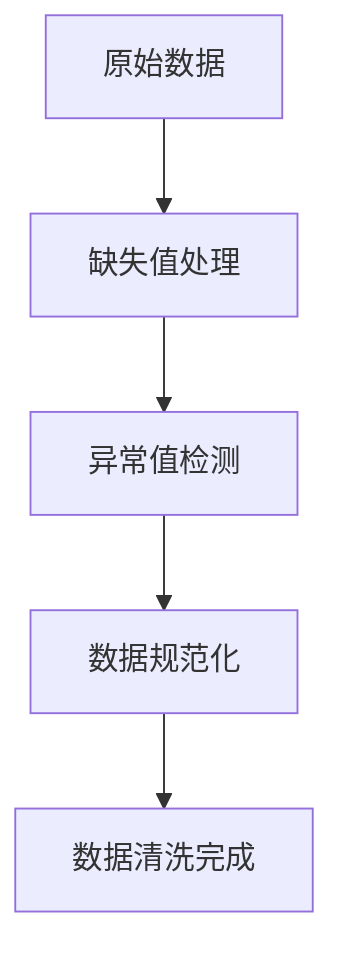
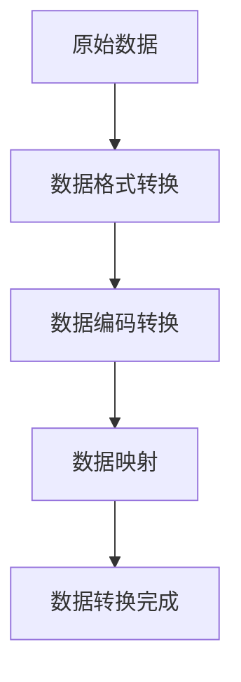
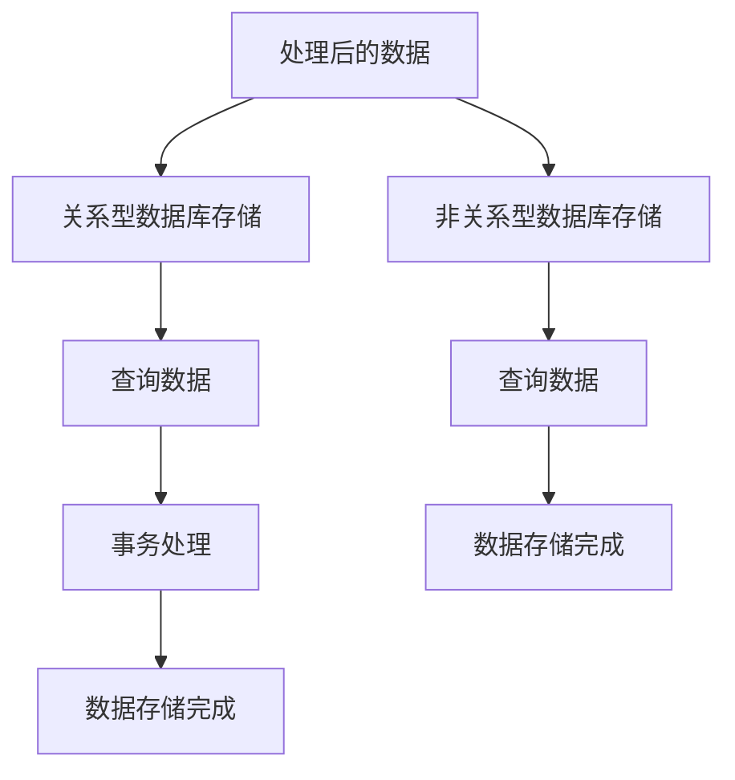
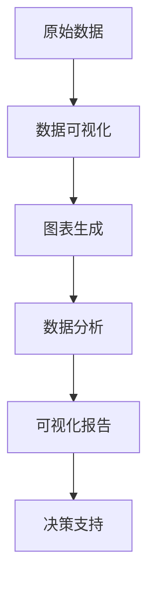
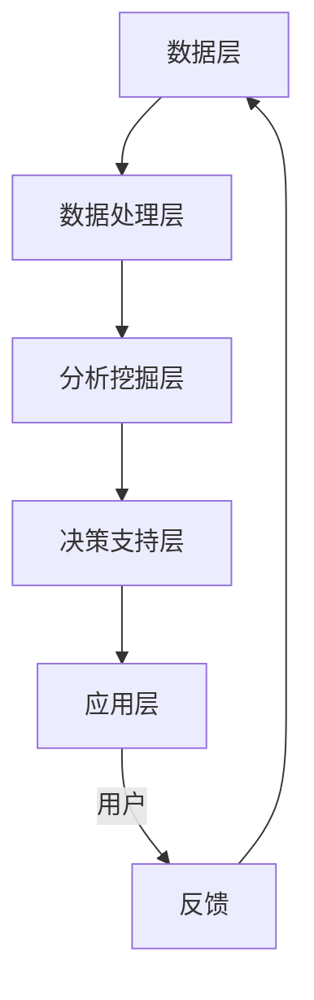

                 

### 概述

#### 1.1 智能金融的定义

智能金融是指利用人工智能技术，如机器学习、深度学习、自然语言处理等，对金融领域中的各种数据进行分析、挖掘、预测和决策，从而提升金融服务的效率、质量和安全性的过程。在智能金融中，人工智能技术不仅用于自动化和优化传统的金融业务，还用于创新金融服务模式和产品设计。

#### 1.2 工具使用机制的定义

工具使用机制是指在智能金融系统中，为了实现特定功能或目标，采用的一系列工具和方法，包括数据处理工具、分析与挖掘工具、决策支持工具等。这些工具和方法共同作用，形成一个完整的智能金融解决方案。

#### 1.3 工具使用机制的重要性

工具使用机制在智能金融系统中起着至关重要的作用。它不仅决定了数据处理的效率和质量，也决定了分析和挖掘的深度和广度，最终影响了决策支持的有效性。合理选择和使用工具，是智能金融系统成功的关键之一。

#### 1.4 智能金融系统的特点

智能金融系统具有以下几个特点：

- **自动化：** 通过人工智能技术，实现金融业务的自动化处理，减少人工干预。
- **智能化：** 利用大数据和机器学习技术，提供个性化的金融产品和服务。
- **实时性：** 通过实时数据处理和分析，提供及时的风险预警和决策支持。
- **可扩展性：** 能够根据业务需求，灵活扩展功能模块和数据规模。

#### 1.5 工具使用机制的应用场景

工具使用机制在智能金融系统中广泛应用于以下场景：

- **智能投顾：** 利用数据分析工具和机器学习算法，为用户提供个性化的投资建议。
- **风险管理：** 利用风险评估工具和决策支持工具，监测和预测金融风险，制定风险控制策略。
- **金融科技创新：** 利用大数据分析和深度学习技术，推动金融科技创新，设计新型金融产品。
- **智能客服：** 利用自然语言处理技术，为用户提供智能化的客户服务。

### 总结

智能金融系统的应用推动了金融行业的数字化转型，提高了金融服务的质量和效率。工具使用机制作为智能金融系统的重要组成部分，其合理设计和应用至关重要。接下来，我们将详细探讨智能金融系统中常用的工具分类、使用机制的设计与实现，以及实际应用案例。

<|user|>### 目录大纲

- **第1章 绪论**
  - **1.1 智能金融系统的背景与发展**
    - 1.1.1 智能金融的定义
    - 1.1.2 智能金融的发展历程
    - 1.1.3 智能金融的应用场景
  - **1.2 工具使用机制的概念与意义**
    - 1.2.1 工具使用机制的定义
    - 1.2.2 工具使用机制在智能金融系统中的重要性
  - **1.3 书籍结构安排**
    - 1.3.1 主要内容概述
    - 1.3.2 各章节关联关系分析

- **第2章 智能金融系统中的工具分类与选择**
  - **2.1 数据处理工具**
    - **2.1.1 数据预处理工具**
      - 2.1.1.1 数据清洗工具
      - 2.1.1.2 数据转换工具
    - **2.1.2 数据存储工具**
      - 2.1.2.1 关系型数据库
      - 2.1.2.2 非关系型数据库
  - **2.2 分析与挖掘工具**
    - **2.2.1 数据分析工具**
      - 2.2.1.1 数据可视化工具
      - 2.2.1.2 统计分析工具
    - **2.2.2 数据挖掘工具**
      - 2.2.2.1 机器学习算法
      - 2.2.2.2 深度学习算法
  - **2.3 决策支持工具**
    - **2.3.1 决策树算法**
      - 2.3.1.1 决策树构建
      - 2.3.1.2 决策树剪枝
    - **2.3.2 风险评估工具**
      - 2.3.2.1 风险度量模型
      - 2.3.2.2 风险决策模型

- **第3章 工具使用机制的设计与实现**
  - **3.1 工具使用机制概述**
    - 3.1.1 工具使用机制的定义
    - 3.1.2 工具使用机制的目标
    - 3.1.3 工具使用机制的组成部分
  - **3.2 数据处理工具使用机制**
    - **3.2.1 数据预处理流程**
      - 3.2.1.1 数据清洗流程
      - 3.2.1.2 数据转换流程
    - **3.2.2 数据存储流程**
      - 3.2.2.1 关系型数据库存储
      - 3.2.2.2 非关系型数据库存储
    - **3.2.3 数据处理工具的优化与改进**
  - **3.3 分析与挖掘工具使用机制**
    - **3.3.1 数据分析流程**
      - 3.3.1.1 数据收集
      - 3.3.1.2 数据预处理
      - 3.3.1.3 数据分析结果展示
    - **3.3.2 数据挖掘流程**
      - 3.3.2.1 数据收集
      - 3.3.2.2 数据预处理
      - 3.3.2.3 特征工程
      - 3.3.2.4 模型训练
      - 3.3.2.5 模型评估
    - **3.3.3 分析与挖掘工具的优化与改进**
  - **3.4 决策支持工具使用机制**
    - **3.4.1 决策树算法应用**
      - 3.4.1.1 决策树构建
      - 3.4.1.2 决策树剪枝
    - **3.4.2 风险评估工具应用**
      - 3.4.2.1 风险度量模型
      - 3.4.2.2 风险决策模型
    - **3.4.3 决策支持工具的优化与改进**

- **第4章 工具使用机制在智能金融系统中的应用实践**
  - **4.1 工具使用机制在实际项目中的应用**
    - 4.1.1 智能投顾项目
    - 4.1.2 风险管理项目
  - **4.2 工具使用机制在金融科技平台中的应用**
    - 4.2.1 金融科技平台架构概述
    - 4.2.2 数据处理工具在平台中的应用
    - 4.2.3 分析与挖掘工具在平台中的应用
    - 4.2.4 决策支持工具在平台中的应用

- **第5章 工具使用机制的优化与改进**
  - **5.1 工具使用机制的优化目标**
  - **5.2 数据处理工具的优化与改进**
    - 5.2.1 数据预处理工具的优化与改进
    - 5.2.2 数据存储工具的优化与改进
  - **5.3 分析与挖掘工具的优化与改进**
    - 5.3.1 数据分析工具的优化与改进
    - 5.3.2 数据挖掘工具的优化与改进
  - **5.4 决策支持工具的优化与改进**

- **第6章 工具使用机制的案例研究与经验总结**
  - **6.1 工具使用机制案例研究**
    - 6.1.1 智能投顾案例分析
    - 6.1.2 风险管理案例分析
  - **6.2 经验总结与反思**
    - 6.2.1 工具使用机制经验总结
    - 6.2.2 挑战与改进方向

- **第7章 未来发展趋势与展望**
  - **7.1 工具使用机制的发展趋势**
  - **7.2 智能金融系统的发展趋势**
  - **7.3 工具使用机制在智能金融系统中的应用前景**

- **附录**
  - **附录 A 工具使用机制相关资源**
    - 附件 A.1 数据处理工具资源
    - 附件 A.2 分析与挖掘工具资源
    - 附件 A.3 决策支持工具资源
    - 附件 A.4 开发环境搭建指南

通过上述目录大纲，我们将对智能金融系统中的工具使用机制进行深入剖析，旨在为读者提供全面的技术指导和实践参考。

### 第1章 绪论

#### 1.1 智能金融系统的背景与发展

智能金融系统是金融科技（FinTech）领域的一个重要分支，它利用先进的技术手段，如大数据、云计算、人工智能等，对金融业务进行革新和优化。智能金融的兴起，源于金融行业对效率、成本控制和用户体验不断提升的需求。

**1.1.1 智能金融的定义**

智能金融是指通过集成人工智能、大数据、云计算等先进技术，实现金融业务自动化、智能化和高效化的一种金融服务模式。具体来说，智能金融包括以下几个方面：

1. **自动化处理**：利用自动化技术，如机器人流程自动化（RPA），实现金融业务的自动化处理，减少人工干预，提高业务效率。
2. **数据驱动决策**：通过大数据分析技术，对金融数据进行分析和挖掘，为决策提供数据支持，优化决策过程。
3. **个性化服务**：利用人工智能技术，如机器学习、自然语言处理，为用户提供个性化的金融服务和产品推荐。
4. **风险管理**：通过风险分析和预测模型，实时监测和评估金融风险，提供风险预警和应对策略。

**1.1.2 智能金融的发展历程**

智能金融的发展可以分为以下几个阶段：

1. **萌芽期（2010年前）**：这一阶段主要是互联网技术的普及，金融业务开始实现线上化和电子化。
2. **快速发展期（2010-2015年）**：大数据、云计算和人工智能等新兴技术开始应用于金融领域，智能金融业务逐渐兴起。
3. **成熟期（2015年至今）**：智能金融系统不断成熟和优化，其在金融行业的应用范围和深度不断扩大，推动了金融科技的快速发展。

**1.1.3 智能金融的应用场景**

智能金融的应用场景非常广泛，包括但不限于以下几方面：

1. **智能投顾**：利用机器学习算法，为投资者提供个性化的投资建议，降低投资风险，提高投资回报。
2. **智能风险管理**：通过大数据分析和预测模型，实时监控和评估金融风险，提供风险预警和应对措施。
3. **智能支付**：利用区块链技术和人工智能，实现快速、安全和高效的支付服务。
4. **智能客服**：通过自然语言处理技术，为用户提供24小时智能客服，提高客户满意度。
5. **信用评估**：利用大数据和机器学习技术，对个人或企业的信用进行评估，为金融机构提供信用决策支持。

#### 1.2 工具使用机制的概念与意义

**1.2.1 工具使用机制的定义**

工具使用机制是指在智能金融系统中，为了实现特定功能或目标，采用的一系列工具和方法。这些工具和方法包括数据处理工具、分析与挖掘工具、决策支持工具等。工具使用机制的设计和实现，是智能金融系统能够高效运作的关键。

**1.2.2 工具使用机制在智能金融系统中的重要性**

工具使用机制在智能金融系统中具有以下几个方面的意义：

1. **提高数据处理效率**：通过合理选择和使用数据处理工具，可以显著提高数据处理的效率和准确性。
2. **增强数据分析深度**：通过分析与挖掘工具，可以深入挖掘数据中的潜在价值和规律，为决策提供有力支持。
3. **提升决策支持能力**：通过决策支持工具，可以根据分析结果，制定合理的决策策略，降低金融风险，提高业务效益。

#### 1.3 书籍结构安排

**1.3.1 主要内容概述**

本书的主要内容包括以下几个方面：

1. **智能金融系统背景与发展**：介绍智能金融的定义、发展历程和应用场景。
2. **工具使用机制的概念与意义**：阐述工具使用机制的定义、重要性及其在智能金融系统中的应用。
3. **工具分类与选择**：详细讨论数据处理工具、分析与挖掘工具、决策支持工具的分类与选择。
4. **工具使用机制的设计与实现**：介绍数据处理、分析挖掘、决策支持工具的使用机制及其优化方法。
5. **工具使用机制的实际应用**：通过案例研究和实践经验，展示工具使用机制在智能金融系统中的应用效果。
6. **工具使用机制的优化与改进**：探讨工具使用机制的优化目标、方法和未来发展趋势。

**1.3.2 各章节关联关系分析**

各章节之间的关联关系如下：

- **第1章** 作为绪论，为后续章节奠定了理论基础，介绍了智能金融系统和工具使用机制的基本概念。
- **第2章** 和 **第3章** 分别介绍了工具的分类与选择以及工具使用机制的设计与实现，是本书的核心内容。
- **第4章** 和 **第5章** 通过实际应用案例和优化方法，展示了工具使用机制的具体应用效果和改进方向。
- **第6章** 和 **第7章** 对工具使用机制进行了总结和展望，为读者提供了更深入的思考。

通过上述章节的安排，本书旨在系统地阐述智能金融系统中的工具使用机制，帮助读者理解和掌握相关技术，为金融科技的发展提供有力支持。

### 第1章 绪论

#### 1.1 智能金融系统的背景与发展

智能金融系统是金融科技（FinTech）领域的一个重要分支，它利用先进的技术手段，如大数据、云计算、人工智能等，对金融业务进行革新和优化。智能金融的兴起，源于金融行业对效率、成本控制和用户体验不断提升的需求。

**1.1.1 智能金融的定义**

智能金融是指通过集成人工智能、大数据、云计算等先进技术，实现金融业务自动化、智能化和高效化的一种金融服务模式。具体来说，智能金融包括以下几个方面：

1. **自动化处理**：利用自动化技术，如机器人流程自动化（RPA），实现金融业务的自动化处理，减少人工干预，提高业务效率。
2. **数据驱动决策**：通过大数据分析技术，对金融数据进行分析和挖掘，为决策提供数据支持，优化决策过程。
3. **个性化服务**：利用人工智能技术，如机器学习、自然语言处理，为用户提供个性化的金融服务和产品推荐。
4. **风险管理**：通过风险分析和预测模型，实时监测和评估金融风险，提供风险预警和应对策略。

**1.1.2 智能金融的发展历程**

智能金融的发展可以分为以下几个阶段：

1. **萌芽期（2010年前）**：这一阶段主要是互联网技术的普及，金融业务开始实现线上化和电子化。
2. **快速发展期（2010-2015年）**：大数据、云计算和人工智能等新兴技术开始应用于金融领域，智能金融业务逐渐兴起。
3. **成熟期（2015年至今）**：智能金融系统不断成熟和优化，其在金融行业的应用范围和深度不断扩大，推动了金融科技的快速发展。

**1.1.3 智能金融的应用场景**

智能金融的应用场景非常广泛，包括但不限于以下几方面：

1. **智能投顾**：利用机器学习算法，为投资者提供个性化的投资建议，降低投资风险，提高投资回报。
2. **智能风险管理**：通过大数据分析和预测模型，实时监控和评估金融风险，提供风险预警和应对措施。
3. **智能支付**：利用区块链技术和人工智能，实现快速、安全和高效的支付服务。
4. **智能客服**：通过自然语言处理技术，为用户提供24小时智能客服，提高客户满意度。
5. **信用评估**：利用大数据和机器学习技术，对个人或企业的信用进行评估，为金融机构提供信用决策支持。

#### 1.2 工具使用机制的概念与意义

**1.2.1 工具使用机制的定义**

工具使用机制是指在智能金融系统中，为了实现特定功能或目标，采用的一系列工具和方法。这些工具和方法包括数据处理工具、分析与挖掘工具、决策支持工具等。工具使用机制的设计和实现，是智能金融系统能够高效运作的关键。

**1.2.2 工具使用机制在智能金融系统中的重要性**

工具使用机制在智能金融系统中具有以下几个方面的意义：

1. **提高数据处理效率**：通过合理选择和使用数据处理工具，可以显著提高数据处理的效率和准确性。
2. **增强数据分析深度**：通过分析与挖掘工具，可以深入挖掘数据中的潜在价值和规律，为决策提供有力支持。
3. **提升决策支持能力**：通过决策支持工具，可以根据分析结果，制定合理的决策策略，降低金融风险，提高业务效益。

#### 1.3 书籍结构安排

**1.3.1 主要内容概述**

本书的主要内容包括以下几个方面：

1. **智能金融系统背景与发展**：介绍智能金融的定义、发展历程和应用场景。
2. **工具使用机制的概念与意义**：阐述工具使用机制的定义、重要性及其在智能金融系统中的应用。
3. **工具分类与选择**：详细讨论数据处理工具、分析与挖掘工具、决策支持工具的分类与选择。
4. **工具使用机制的设计与实现**：介绍数据处理、分析挖掘、决策支持工具的使用机制及其优化方法。
5. **工具使用机制的实际应用**：通过案例研究和实践经验，展示工具使用机制在智能金融系统中的应用效果。
6. **工具使用机制的优化与改进**：探讨工具使用机制的优化目标、方法和未来发展趋势。

**1.3.2 各章节关联关系分析**

各章节之间的关联关系如下：

- **第1章** 作为绪论，为后续章节奠定了理论基础，介绍了智能金融系统和工具使用机制的基本概念。
- **第2章** 和 **第3章** 分别介绍了工具的分类与选择以及工具使用机制的设计与实现，是本书的核心内容。
- **第4章** 和 **第5章** 通过实际应用案例和优化方法，展示了工具使用机制的具体应用效果和改进方向。
- **第6章** 和 **第7章** 对工具使用机制进行了总结和展望，为读者提供了更深入的思考。

通过上述章节的安排，本书旨在系统地阐述智能金融系统中的工具使用机制，帮助读者理解和掌握相关技术，为金融科技的发展提供有力支持。

### 第2章 智能金融系统中的工具分类与选择

#### 2.1 数据处理工具

数据处理工具在智能金融系统中起着至关重要的作用，它们负责对金融数据进行收集、清洗、转换和存储。这些工具的性能和效率直接影响到整个智能金融系统的运行效果。

##### **2.1.1 数据预处理工具**

数据预处理是数据处理工具中的关键步骤，它包括数据清洗、数据转换和数据集成等操作。数据清洗工具主要用于处理数据中的缺失值、异常值和数据重复等问题，确保数据的质量。数据转换工具则用于将数据从一种格式转换为另一种格式，以便于后续处理。

**2.1.1.1 数据清洗工具**

数据清洗工具包括以下几种常见类型：

- **缺失值处理**：通过填充缺失值或删除缺失数据行来处理缺失值问题。
- **异常值检测**：使用统计学方法或机器学习算法来识别并处理异常值。
- **数据规范化**：通过缩放或标准化数据，使其符合特定的范围或分布。

**Mermaid 流程图：**


**伪代码示例：**
```python
def data_cleaning(data):
    data = handle_missing_values(data)
    data = handle_outliers(data)
    data = normalize_data(data)
    return data
```

**2.1.1.2 数据转换工具**

数据转换工具主要包括以下几种：

- **数据格式转换**：将数据从一种格式（如CSV、JSON）转换为另一种格式。
- **数据编码转换**：将数据从一种编码方式（如ASCII、UTF-8）转换为另一种编码方式。
- **数据映射**：将数据中的字段映射到数据库表或数据仓库中。

**Mermaid 流程图：**


**伪代码示例：**
```python
def data_conversion(data, target_format, encoding):
    data = convert_format(data, target_format)
    data = convert_encoding(data, encoding)
    data = map_fields(data)
    return data
```

##### **2.1.2 数据存储工具**

数据存储工具负责将处理后的金融数据存储到数据库中，以便于后续的数据分析和挖掘。根据数据的特点和需求，可以选择不同的数据存储工具。

**2.1.2.1 关系型数据库**

关系型数据库（RDBMS）是传统的数据存储解决方案，它适用于存储结构化数据。常见的RDBMS包括MySQL、PostgreSQL、Oracle等。

- **优势**：查询速度快，事务处理能力强，支持复杂的SQL查询。
- **劣势**：扩展性较差，不适合存储大量非结构化数据。

**2.1.2.2 非关系型数据库**

非关系型数据库（NoSQL）适用于存储非结构化或半结构化数据。常见的NoSQL数据库包括MongoDB、Cassandra、Redis等。

- **优势**：高扩展性，易于水平扩展，支持大数据存储。
- **劣势**：查询功能较弱，不支持复杂的SQL查询。

**Mermaid 流程图：**


**伪代码示例：**
```python
def store_data_to_rdbms(data, database):
    database.connect()
    database.insert(data)
    database.commit()
    database.close()

def store_data_to_nosql(data, database):
    database.connect()
    database.insert(data)
    database.commit()
    database.close()
```

#### 2.2 分析与挖掘工具

分析与挖掘工具用于对金融数据进行深入分析和挖掘，以提取有用的信息、发现潜在的规律和模式，为决策提供支持。

##### **2.2.1 数据分析工具**

数据分析工具可以帮助用户从大量数据中提取有价值的信息，并可视化地展示分析结果。这些工具通常包括：

- **数据可视化工具**：如Tableau、Power BI等，用于将数据转换为图表、图形等可视化形式，便于用户理解和分析。
- **统计分析工具**：如R、Python的pandas库等，用于进行描述性统计、推断性统计和假设检验等。

**2.2.1.1 数据可视化工具**

数据可视化工具的主要功能包括：

- **数据探索**：通过交互式图表，帮助用户探索数据中的趋势、异常和相关性。
- **报告生成**：将可视化分析结果生成报告，便于分享和演示。

**Mermaid 流程图：**


**伪代码示例：**
```python
def data_visualization(data):
    chart = generate_chart(data)
    report = generate_report(chart)
    return report
```

**2.2.1.2 统计分析工具**

统计分析工具的主要功能包括：

- **描述性统计**：计算数据的均值、中位数、标准差等统计量。
- **推断性统计**：进行假设检验、置信区间估计等。

**伪代码示例：**
```python
def statistical_analysis(data):
    summary = calculate_summary_stats(data)
    hypothesis_test = perform_hypothesis_test(data)
    return summary, hypothesis_test
```

##### **2.2.2 数据挖掘工具**

数据挖掘工具用于从大量数据中自动发现潜在的规律和模式。这些工具通常包括：

- **机器学习算法**：如分类、回归、聚类等，用于构建预测模型和分类模型。
- **深度学习算法**：如卷积神经网络（CNN）、循环神经网络（RNN）等，用于处理复杂的非线性数据。

**2.2.2.1 机器学习算法**

机器学习算法的主要功能包括：

- **特征工程**：选择和构造有用的特征，用于训练模型。
- **模型训练**：使用训练数据训练模型，并调整模型参数。
- **模型评估**：评估模型的性能，并进行模型选择和优化。

**伪代码示例：**
```python
def machine_learning(data, target_variable):
    features = feature_engineering(data)
    model = train_model(features, target_variable)
    evaluation = evaluate_model(model, features, target_variable)
    return model, evaluation
```

**2.2.2.2 深度学习算法**

深度学习算法的主要功能包括：

- **前向传播**：计算输入数据通过神经网络的输出。
- **反向传播**：通过梯度下降算法更新网络权重。
- **模型训练**：使用训练数据训练神经网络，并优化网络结构。

**伪代码示例：**
```python
def deep_learning(data, target_variable):
    model = train_model(data, target_variable)
    evaluation = evaluate_model(model, data, target_variable)
    return model, evaluation
```

#### 2.3 决策支持工具

决策支持工具用于根据数据分析结果，制定相应的决策策略，为金融系统的运营提供支持。

##### **2.3.1 决策树算法**

决策树算法是一种常用的分类和回归模型，它通过一系列的决策规则将数据划分为不同的类别或区域。

**2.3.1.1 决策树构建**

决策树构建的过程主要包括：

- **特征选择**：选择最优特征作为决策节点。
- **信息增益**：计算每个特征的信息增益，用于选择最佳划分特征。
- **递归划分**：对每个子集进行递归划分，直到满足终止条件。

**伪代码示例：**
```python
def build_decision_tree(data, target_variable):
    selected_feature = select_best_feature(data, target_variable)
    gain = calculate_information_gain(data, selected_feature, target_variable)
    branch = create_branch(data, selected_feature, gain)
    left_data, right_data = split_data(data, selected_feature, gain)
    if meet_end_condition(left_data, right_data):
        return branch
    else:
        left_tree = build_decision_tree(left_data, target_variable)
        right_tree = build_decision_tree(right_data, target_variable)
        branch['left'] = left_tree
        branch['right'] = right_tree
        return branch
```

**2.3.1.2 决策树剪枝**

决策树剪枝是为了防止过拟合，通过剪掉不必要的分支来简化决策树结构。

**伪代码示例：**
```python
def prune_decision_tree(tree, threshold):
    if meet_pruning_condition(tree, threshold):
        tree = remove_branches(tree)
        if 'left' in tree:
            prune_decision_tree(tree['left'], threshold)
        if 'right' in tree:
            prune_decision_tree(tree['right'], threshold)
    return tree
```

##### **2.3.2 风险评估工具**

风险评估工具用于评估金融系统的风险水平，并提供相应的风险控制策略。

**2.3.2.1 风险度量模型**

风险度量模型用于计算风险值，常见的模型包括VaR（Value at Risk）和CVaR（Conditional Value at Risk）。

**伪代码示例：**
```python
def calculate_risk(risk_event, model):
    risk_measurement = model.measure_risk(risk_event)
    risk_value = calculate_risk_value(risk_measurement)
    return risk_value
```

**2.3.2.2 风险决策模型**

风险决策模型用于根据风险值，制定相应的风险控制策略。

**伪代码示例：**
```python
def risk_decision(model, risk_values):
    decision_strategy = model.calculate_decision_strategy(risk_values)
    decision_result = apply_decision_strategy(decision_strategy)
    return decision_result
```

通过上述对数据处理工具、分析与挖掘工具和决策支持工具的详细分类和选择，我们可以更好地理解和应用这些工具，为智能金融系统的构建和优化提供有力支持。

### 第3章 工具使用机制的设计与实现

#### 3.1 工具使用机制概述

**3.1.1 工具使用机制的定义**

工具使用机制是指为了实现特定功能或目标，在智能金融系统中采用的一系列工具和方法的组合。这些工具和方法可以是数据处理工具、分析与挖掘工具、决策支持工具等，通过合理地配置和使用这些工具，可以构建一个高效的智能金融系统。

**3.1.2 工具使用机制的目标**

工具使用机制的目标主要包括：

1. **提高数据处理效率**：通过优化数据处理流程，减少数据处理的时间和资源消耗。
2. **增强数据分析深度**：通过引入先进的分析和挖掘工具，深入挖掘数据中的潜在价值和规律。
3. **提升决策支持能力**：通过提供准确、及时的决策支持工具，帮助决策者做出更加明智的决策。

**3.1.3 工具使用机制的组成部分**

工具使用机制主要包括以下几个部分：

1. **数据处理工具**：用于对金融数据的基本处理，包括数据清洗、转换和存储。
2. **分析与挖掘工具**：用于对金融数据进行分析和挖掘，以提取有价值的信息和模式。
3. **决策支持工具**：用于根据分析结果，提供决策支持，包括风险分析和预测、决策策略制定等。

#### 3.2 数据处理工具使用机制

**3.2.1 数据预处理流程**

数据预处理是数据处理工具使用机制的第一步，主要包括数据清洗、数据转换和数据集成。数据预处理的主要目标是确保数据的质量和一致性，为后续的数据分析和挖掘提供可靠的数据基础。

**3.2.1.1 数据清洗流程**

数据清洗流程包括以下几个步骤：

1. **缺失值处理**：使用适当的算法，如平均值填充、中值填充或删除缺失值，处理数据中的缺失值。
2. **异常值处理**：使用统计学方法或机器学习算法，检测并处理数据中的异常值。
3. **数据标准化**：通过缩放或标准化数据，使其符合特定的范围或分布，以便于后续分析。

**伪代码示例：**
```python
def data_cleaning(data):
    data = handle_missing_values(data)
    data = handle_outliers(data)
    data = normalize_data(data)
    return data
```

**3.2.1.2 数据转换流程**

数据转换流程包括以下几个步骤：

1. **数据格式转换**：将数据从一种格式（如CSV、JSON）转换为另一种格式。
2. **数据编码转换**：将数据从一种编码方式（如ASCII、UTF-8）转换为另一种编码方式。
3. **数据映射**：将数据中的字段映射到数据库表或数据仓库中。

**伪代码示例：**
```python
def data_conversion(data, target_format, encoding):
    data = convert_format(data, target_format)
    data = convert_encoding(data, encoding)
    data = map_fields(data)
    return data
```

**3.2.2 数据存储流程**

数据存储流程是将处理后的数据存储到数据库中，以便于后续的数据分析和挖掘。根据数据的特点和需求，可以选择不同的数据存储工具，如关系型数据库（RDBMS）或非关系型数据库（NoSQL）。

**3.2.2.1 关系型数据库存储**

关系型数据库存储包括以下几个步骤：

1. **数据库连接**：建立与关系型数据库的连接。
2. **数据插入**：将处理后的数据插入到数据库表中。
3. **事务处理**：确保数据插入操作的一致性和可靠性。

**伪代码示例：**
```python
def store_data_to_rdbms(data, database):
    database.connect()
    database.insert(data)
    database.commit()
    database.close()
```

**3.2.2.2 非关系型数据库存储**

非关系型数据库存储包括以下几个步骤：

1. **数据库连接**：建立与非关系型数据库的连接。
2. **数据插入**：将处理后的数据插入到数据库中。
3. **事务处理**：确保数据插入操作的一致性和可靠性。

**伪代码示例：**
```python
def store_data_to_nosql(data, database):
    database.connect()
    database.insert(data)
    database.commit()
    database.close()
```

**3.2.3 数据处理工具的优化与改进**

数据处理工具的优化与改进主要包括以下几个方面：

1. **性能优化**：通过引入并行处理、分布式存储等技术，提高数据处理速度。
2. **成本优化**：通过选择合适的存储方案、优化数据结构等，降低数据处理成本。
3. **安全性优化**：通过引入数据加密、访问控制等技术，提高数据安全性。

**伪代码示例：**
```python
def optimize_data_processing_tool(tool):
    tool = optimize_performance(tool)
    tool = optimize_cost(tool)
    tool = enhance_security(tool)
    return tool
```

#### 3.3 分析与挖掘工具使用机制

**3.3.1 数据分析流程**

数据分析流程包括以下几个步骤：

1. **数据收集**：从各种数据源收集需要分析的数据。
2. **数据预处理**：对收集到的数据进行清洗、转换和存储。
3. **数据分析方法**：选择合适的数据分析方法，如描述性统计、推断性统计、数据可视化等。
4. **数据分析结果展示**：将分析结果以图表、报告等形式展示给用户。

**伪代码示例：**
```python
def data_analysis(data):
    data = preprocess_data(data)
    analysis = analyze_data(data)
    display_results(analysis)
```

**3.3.2 数据挖掘流程**

数据挖掘流程包括以下几个步骤：

1. **数据收集**：从各种数据源收集需要挖掘的数据。
2. **数据预处理**：对收集到的数据进行清洗、转换和存储。
3. **特征工程**：选择和构造有用的特征，用于训练模型。
4. **模型训练**：使用训练数据训练机器学习模型。
5. **模型评估**：评估模型的性能，并进行模型选择和优化。
6. **模型部署**：将训练好的模型部署到生产环境中。

**伪代码示例：**
```python
def data_mining(data, target_variable):
    data = preprocess_data(data)
    features = feature_engineering(data)
    model = train_model(features, target_variable)
    evaluation = evaluate_model(model, features, target_variable)
    deploy_model(model)
```

**3.3.3 分析与挖掘工具的优化与改进**

分析与挖掘工具的优化与改进主要包括以下几个方面：

1. **性能优化**：通过引入分布式计算、并行处理等技术，提高分析和挖掘速度。
2. **算法优化**：通过选择和优化机器学习算法，提高模型性能。
3. **安全性优化**：通过引入数据加密、访问控制等技术，提高数据安全性。

**伪代码示例：**
```python
def optimize_analytics_mining_tool(tool):
    tool = optimize_performance(tool)
    tool = optimize_algorithm(tool)
    tool = enhance_security(tool)
    return tool
```

#### 3.4 决策支持工具使用机制

**3.4.1 决策树算法应用**

决策树算法是一种常用的分类和回归模型，其应用主要包括：

1. **决策树构建**：通过递归划分数据集，构建决策树模型。
2. **决策树剪枝**：通过剪掉不必要的分支，防止过拟合，提高模型泛化能力。

**伪代码示例：**
```python
def build_decision_tree(data, target_variable):
    selected_feature = select_best_feature(data, target_variable)
    gain = calculate_information_gain(data, selected_feature, target_variable)
    branch = create_branch(data, selected_feature, gain)
    left_data, right_data = split_data(data, selected_feature, gain)
    if meet_end_condition(left_data, right_data):
        return branch
    else:
        left_tree = build_decision_tree(left_data, target_variable)
        right_tree = build_decision_tree(right_data, target_variable)
        branch['left'] = left_tree
        branch['right'] = right_tree
        return branch

def prune_decision_tree(tree, threshold):
    if meet_pruning_condition(tree, threshold):
        tree = remove_branches(tree)
        if 'left' in tree:
            prune_decision_tree(tree['left'], threshold)
        if 'right' in tree:
            prune_decision_tree(tree['right'], threshold)
    return tree
```

**3.4.2 风险评估工具应用**

风险评估工具用于评估金融系统的风险水平，并提供相应的风险控制策略。其应用主要包括：

1. **风险度量模型**：计算风险值，如VaR（Value at Risk）和CVaR（Conditional Value at Risk）。
2. **风险决策模型**：根据风险值，制定相应的风险控制策略。

**伪代码示例：**
```python
def calculate_risk(risk_event, model):
    risk_measurement = model.measure_risk(risk_event)
    risk_value = calculate_risk_value(risk_measurement)
    return risk_value

def risk_decision(model, risk_values):
    decision_strategy = model.calculate_decision_strategy(risk_values)
    decision_result = apply_decision_strategy(decision_strategy)
    return decision_result
```

**3.4.3 决策支持工具的优化与改进**

决策支持工具的优化与改进主要包括以下几个方面：

1. **性能优化**：通过引入并行处理、分布式计算等技术，提高决策支持工具的运行速度。
2. **算法优化**：通过选择和优化决策算法，提高决策支持的准确性和可靠性。
3. **安全性优化**：通过引入数据加密、访问控制等技术，提高决策支持工具的数据安全性。

**伪代码示例：**
```python
def optimize_decision_support_tool(tool):
    tool = optimize_performance(tool)
    tool = optimize_algorithm(tool)
    tool = enhance_security(tool)
    return tool
```

通过以上对数据处理工具、分析与挖掘工具和决策支持工具使用机制的详细阐述，我们可以更好地理解如何在智能金融系统中有效地应用这些工具，实现数据处理、分析和决策的自动化和智能化。

### 第4章 工具使用机制在智能金融系统中的应用实践

#### 4.1 工具使用机制在实际项目中的应用

工具使用机制在智能金融系统的实际应用中，通过一系列的项目案例得到了充分验证。以下我们将详细介绍智能投顾和风险管理项目中工具使用机制的具体应用。

**4.1.1 智能投顾项目**

智能投顾项目旨在利用大数据分析和机器学习算法，为投资者提供个性化的投资建议。以下是该项目中工具使用机制的具体应用：

**步骤1：数据收集与预处理**

- 数据收集：项目团队从多个数据源（如交易所、财经新闻、社交媒体等）收集投资者行为数据、市场行情数据、宏观经济数据等。
- 数据预处理：使用数据处理工具对数据进行清洗，处理缺失值、异常值，并进行数据格式转换，确保数据的质量和一致性。

**伪代码示例：**
```python
def data_collection():
    data = collect_data_from_multiple_sources()
    return data

def data_preprocessing(data):
    data = clean_missing_values(data)
    data = handle_outliers(data)
    data = convert_data_format(data)
    return data
```

**步骤2：数据分析与挖掘**

- 数据分析：利用数据分析工具，对投资者行为和市场行情数据进行分析，提取关键特征和趋势。
- 数据挖掘：使用数据挖掘工具，如机器学习算法，建立投资策略模型，对投资者行为和市场变化进行预测。

**伪代码示例：**
```python
def data_analysis(data):
    analysis_results = analyze_investor_behavior(data)
    return analysis_results

def data_mining(data, target_variable):
    features = feature_engineering(data)
    model = train_model(features, target_variable)
    evaluation = evaluate_model(model, features, target_variable)
    return model, evaluation
```

**步骤3：决策支持**

- 决策树算法：构建决策树模型，根据分析结果为投资者提供个性化的投资建议。
- 风险评估工具：评估投资策略的风险水平，为投资者提供风险控制建议。

**伪代码示例：**
```python
def build_decision_tree(data, target_variable):
    tree = build_decision_tree(data, target_variable)
    pruned_tree = prune_decision_tree(tree)
    return pruned_tree

def risk_assessment(risk_model, data):
    risk_values = calculate_risk_values(risk_model, data)
    decision_result = risk_decision(risk_model, risk_values)
    return decision_result
```

**步骤4：结果展示与反馈**

- 结果展示：通过可视化工具，将投资建议和风险控制策略以图表和报告的形式展示给投资者。
- 用户反馈：收集投资者对投资建议和风险控制策略的反馈，优化工具使用机制。

**伪代码示例：**
```python
def display_results(analysis_results):
    visualization = generate_visualization(analysis_results)
    report = generate_report(visualization)
    return report

def collect_feedback(data):
    feedback = get_user_feedback(data)
    return feedback
```

**4.1.2 风险管理项目**

风险管理项目旨在通过大数据分析和风险评估工具，实时监控和预测金融风险，为金融机构提供风险预警和应对策略。以下是该项目中工具使用机制的具体应用：

**步骤1：数据收集与预处理**

- 数据收集：项目团队从交易所、监管机构、市场研究机构等收集金融交易数据、市场行情数据、宏观经济数据等。
- 数据预处理：使用数据处理工具对数据进行清洗、转换和存储，确保数据的质量和一致性。

**伪代码示例：**
```python
def data_collection():
    data = collect_data_from_multiple_sources()
    return data

def data_preprocessing(data):
    data = clean_missing_values(data)
    data = handle_outliers(data)
    data = convert_data_format(data)
    return data
```

**步骤2：数据分析与挖掘**

- 数据分析：利用数据分析工具，对金融交易数据和市场行情数据进行分析，提取关键特征和趋势。
- 数据挖掘：使用数据挖掘工具，如机器学习算法，建立风险预测模型，预测市场风险和金融风险。

**伪代码示例：**
```python
def data_analysis(data):
    analysis_results = analyze_financial_data(data)
    return analysis_results

def data_mining(data, target_variable):
    features = feature_engineering(data)
    model = train_model(features, target_variable)
    evaluation = evaluate_model(model, features, target_variable)
    return model, evaluation
```

**步骤3：风险评估**

- 风险度量模型：计算金融交易数据的风险度量表，评估市场风险和金融风险。
- 风险决策模型：根据风险度量表，制定相应的风险控制策略，为金融机构提供风险预警和应对策略。

**伪代码示例：**
```python
def calculate_risk(risk_event, model):
    risk_measurement = model.measure_risk(risk_event)
    risk_value = calculate_risk_value(risk_measurement)
    return risk_value

def risk_decision(model, risk_values):
    decision_strategy = model.calculate_decision_strategy(risk_values)
    decision_result = apply_decision_strategy(decision_strategy)
    return decision_result
```

**步骤4：结果展示与反馈**

- 结果展示：通过可视化工具，将风险预测结果和风险控制策略以图表和报告的形式展示给金融机构管理层。
- 用户反馈：收集金融机构管理层对风险预测结果和风险控制策略的反馈，优化工具使用机制。

**伪代码示例：**
```python
def display_results(analysis_results):
    visualization = generate_visualization(analysis_results)
    report = generate_report(visualization)
    return report

def collect_feedback(data):
    feedback = get_user_feedback(data)
    return feedback
```

通过智能投顾和风险管理项目的具体应用案例，我们可以看到工具使用机制在智能金融系统中的重要作用。合理选择和使用工具，可以有效提升金融系统的数据处理效率、分析深度和决策支持能力，从而实现金融服务的智能化和高效化。

### 第4章 工具使用机制在智能金融系统中的应用实践

#### 4.2 工具使用机制在金融科技平台中的应用

金融科技平台是智能金融系统的重要组成部分，它通过集成各种工具和机制，为用户提供全面的金融服务。以下将详细介绍金融科技平台架构、数据处理工具、分析与挖掘工具、决策支持工具在平台中的应用，以及具体的实现方法。

#### 4.2.1 金融科技平台架构概述

金融科技平台的架构设计需要考虑可扩展性、安全性和高可用性。一个典型的金融科技平台架构包括以下几个层次：

1. **数据层**：负责数据的收集、存储和管理工作。数据源包括内部数据库、外部数据接口、API等。
2. **数据处理层**：负责对数据进行清洗、转换和存储，确保数据质量。
3. **分析挖掘层**：负责对数据进行深度分析和挖掘，提取有价值的信息和模式。
4. **决策支持层**：根据分析结果，提供决策支持，包括风险分析、投资策略、个性化推荐等。
5. **应用层**：提供用户接口，实现与用户的交互。

**Mermaid 流程图：**


#### 4.2.2 数据处理工具在平台中的应用

数据处理工具在金融科技平台中扮演着至关重要的角色，它们负责对海量金融数据进行高效处理，保证数据质量。

**数据预处理工具**

数据预处理工具主要包括数据清洗、数据转换和数据集成。以下是一个数据清洗流程的伪代码示例：

```python
def data_cleaning(data):
    # 处理缺失值
    data = handle_missing_values(data)
    # 处理异常值
    data = handle_outliers(data)
    # 数据格式转换
    data = convert_data_format(data)
    return data
```

**数据存储工具**

金融科技平台通常需要处理结构化和非结构化数据，因此选择合适的数据存储工具至关重要。关系型数据库（如MySQL）适用于存储结构化数据，而非关系型数据库（如MongoDB）适用于存储非结构化数据。

**伪代码示例：**
```python
def store_data_to_rdbms(data, database):
    database.connect()
    database.insert(data)
    database.commit()
    database.close()

def store_data_to_nosql(data, database):
    database.connect()
    database.insert(data)
    database.commit()
    database.close()
```

#### 4.2.3 分析与挖掘工具在平台中的应用

分析与挖掘工具用于从海量金融数据中提取有价值的信息和模式，为决策支持提供依据。

**数据分析工具**

数据分析工具包括数据可视化工具和统计分析工具。数据可视化工具（如Tableau、Power BI）可以帮助用户直观地了解数据特征和趋势，统计分析工具（如Python的Pandas库、R语言）则用于进行描述性统计和推断性统计。

**伪代码示例：**
```python
def data_visualization(data):
    chart = generate_chart(data)
    report = generate_report(chart)
    return report

def statistical_analysis(data):
    summary = calculate_summary_stats(data)
    hypothesis_test = perform_hypothesis_test(data)
    return summary, hypothesis_test
```

**数据挖掘工具**

数据挖掘工具包括机器学习算法和深度学习算法。机器学习算法（如分类、回归、聚类等）用于建立预测模型和分类模型，深度学习算法（如卷积神经网络、循环神经网络等）则用于处理复杂的非线性数据。

**伪代码示例：**
```python
def machine_learning(data, target_variable):
    features = feature_engineering(data)
    model = train_model(features, target_variable)
    evaluation = evaluate_model(model, features, target_variable)
    return model, evaluation

def deep_learning(data, target_variable):
    model = train_model(data, target_variable)
    evaluation = evaluate_model(model, data, target_variable)
    return model, evaluation
```

#### 4.2.4 决策支持工具在平台中的应用

决策支持工具用于根据分析结果，制定相应的决策策略，为金融系统的运营提供支持。

**决策树算法**

决策树算法是一种常用的分类和回归模型，它通过一系列的决策规则将数据划分为不同的类别或区域。

**伪代码示例：**
```python
def build_decision_tree(data, target_variable):
    selected_feature = select_best_feature(data, target_variable)
    gain = calculate_information_gain(data, selected_feature, target_variable)
    branch = create_branch(data, selected_feature, gain)
    left_data, right_data = split_data(data, selected_feature, gain)
    if meet_end_condition(left_data, right_data):
        return branch
    else:
        left_tree = build_decision_tree(left_data, target_variable)
        right_tree = build_decision_tree(right_data, target_variable)
        branch['left'] = left_tree
        branch['right'] = right_tree
        return branch

def prune_decision_tree(tree, threshold):
    if meet_pruning_condition(tree, threshold):
        tree = remove_branches(tree)
        if 'left' in tree:
            prune_decision_tree(tree['left'], threshold)
        if 'right' in tree:
            prune_decision_tree(tree['right'], threshold)
    return tree
```

**风险评估工具**

风险评估工具用于评估金融系统的风险水平，并提供相应的风险控制策略。常见的风险评估模型包括VaR（Value at Risk）和CVaR（Conditional Value at Risk）。

**伪代码示例：**
```python
def calculate_risk(risk_event, model):
    risk_measurement = model.measure_risk(risk_event)
    risk_value = calculate_risk_value(risk_measurement)
    return risk_value

def risk_decision(model, risk_values):
    decision_strategy = model.calculate_decision_strategy(risk_values)
    decision_result = apply_decision_strategy(decision_strategy)
    return decision_result
```

#### 4.2.5 实现方法

金融科技平台的实现方法主要包括以下几个方面：

1. **系统设计**：根据业务需求和平台架构，设计系统的整体架构和模块划分。
2. **技术选型**：选择合适的数据库、开发框架和中间件，确保系统的性能和稳定性。
3. **开发与集成**：开发各个模块的功能，并确保模块之间的高效集成。
4. **测试与部署**：进行系统测试，确保系统功能和性能符合要求，并进行部署。

**伪代码示例：**
```python
def system_design():
    # 设计系统架构和模块划分
    pass

def technology_selection():
    # 选择数据库、开发框架和中间件
    pass

def development_and_integration():
    # 开发模块功能和集成
    pass

def testing_and_deployment():
    # 系统测试和部署
    pass
```

通过以上对金融科技平台架构、数据处理工具、分析与挖掘工具、决策支持工具的详细阐述，我们可以看到工具使用机制在智能金融系统中的关键作用。合理设计和应用这些工具，可以显著提升金融服务的质量和效率，推动金融行业的数字化转型。

### 第5章 工具使用机制的优化与改进

#### 5.1 工具使用机制的优化目标

在智能金融系统中，工具使用机制的优化目标主要包括以下三个方面：

1. **性能优化**：提高数据处理、分析和挖掘工具的运行速度，减少响应时间，提升系统整体性能。
2. **成本优化**：通过优化数据存储和计算资源的使用，降低系统的运行成本。
3. **安全性优化**：增强数据安全性，防止数据泄露和非法访问，保障金融系统的稳定运行。

#### 5.2 数据处理工具的优化与改进

**5.2.1 数据预处理工具的优化与改进**

数据预处理工具的优化主要集中在以下方面：

- **并行处理**：引入并行计算技术，如MapReduce、Spark等，提高数据清洗和转换的效率。
- **分布式存储**：采用分布式存储方案，如Hadoop、HDFS等，提高数据存储和访问速度。
- **自动化处理**：使用自动化脚本或工具，减少人工干预，降低数据处理错误率。

**伪代码示例：**
```python
def optimize_data_preprocessing(tool):
    tool = enable_parallel_processing(tool)
    tool = use_distributed_storage(tool)
    tool = automate_data_handling(tool)
    return tool
```

**5.2.2 数据存储工具的优化与改进**

数据

