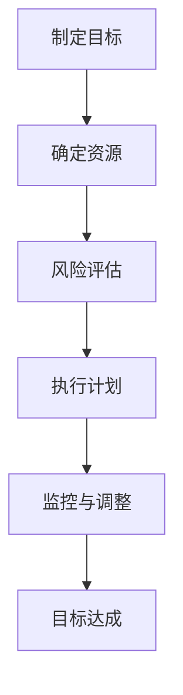

                 

# 巴菲特目标管理法则在项目管理中的应用

> **关键词：** 巴菲特目标管理法则、项目管理、目标制定、风险评估、时间与成本管理

> **摘要：** 本文详细探讨了巴菲特目标管理法则在项目管理中的应用。通过对巴菲特目标管理法则的深入分析，结合项目管理中的实际挑战，本文提出了该法则在项目计划、执行和收尾阶段的具体应用方法。此外，本文还通过数学模型和实际案例，展示了巴菲特目标管理法则在项目管理中的实际效果，为项目管理者提供了实用的指导。

### 第1章: 巴菲特目标管理法则在项目管理中的应用

在当今复杂多变的项目环境中，项目管理者面临着各种挑战，如目标不明确、进度延误、成本超支等。为了解决这些问题，我们需要引入一种科学的目标管理方法。巴菲特目标管理法则，作为一位成功投资家的智慧结晶，提供了许多宝贵的启示，特别是在项目管理中的应用。

#### 1.1 巴菲特目标管理法则概述

**1.1.1 巴菲特目标管理法则的定义**

巴菲特目标管理法则，即“目标明确、价值投资、长期持有”，是一种以目标为导向的投资策略。该方法强调投资者应明确自己的投资目标，选择具有长期增长潜力的优质公司，并持有足够长的时间以获取稳定的投资回报。

**1.1.2 巴菲特目标管理法则的核心原则**

- **目标明确**：投资者在投资前应明确自己的投资目标，如资本增值、收益稳定等。
- **价值投资**：投资者应寻找价格低于其内在价值的投资标的。
- **长期持有**：投资者应具备耐心，长期持有优质股票，以获取复利效应。

**1.1.3 巴菲特目标管理法则在项目管理中的重要性**

巴菲特目标管理法则的核心原则同样适用于项目管理。在项目管理中，明确的目标、对项目的价值评估以及长期的执行力是项目成功的保障。通过借鉴巴菲特的目标管理法则，项目管理者可以更好地规划项目、控制风险、确保项目按计划进行。

#### 1.2 巴菲特目标管理法则与项目管理的关系

**1.2.1 项目管理中的挑战**

- **目标不明确**：项目开始时，目标可能模糊不清，导致项目成员无法明确自己的职责和任务。
- **进度延误**：项目执行过程中，由于目标不明确，可能导致项目进度无法按时完成。
- **成本超支**：在项目实施过程中，由于缺乏有效的风险管理，可能导致成本超支。

**1.2.2 巴菲特目标管理法则如何解决这些挑战**

- **明确目标**：借鉴巴菲特目标管理法则中的“目标明确”原则，项目管理者应在项目启动时明确项目目标，确保项目成员对项目目标有清晰的认识。
- **价值评估**：项目管理者应对项目进行价值评估，以确保项目符合企业的战略目标，并具备足够的资源保障。
- **长期执行**：借鉴巴菲特目标管理法则中的“长期持有”原则，项目管理者应保持对项目的持续关注，确保项目长期按计划进行。

**1.2.3 巴菲特目标管理法则在项目计划中的应用**

在项目计划阶段，巴菲特目标管理法则的应用主要体现在以下几个方面：

- **目标制定**：项目管理者应明确项目目标，并将目标分解为具体的可执行任务。
- **资源规划**：项目管理者应评估项目所需资源，并制定合理的资源分配计划。
- **风险管理**：项目管理者应对潜在风险进行评估，并制定相应的风险应对策略。

#### 1.3 巴菲特目标管理法则在项目执行中的运用

**1.3.1 项目监控与评估**

在项目执行过程中，项目管理者应定期对项目进度、质量和成本进行监控和评估，以确保项目按计划进行。借鉴巴菲特目标管理法则，项目管理者应关注以下方面：

- **目标达成情况**：项目管理者应检查项目目标是否实现，并对未实现的目标进行原因分析。
- **资源利用效率**：项目管理者应评估资源的使用效率，确保资源得到合理分配和利用。

**1.3.2 巴菲特目标管理法则在项目调整中的作用**

当项目执行过程中出现问题时，项目管理者应依据巴菲特目标管理法则中的原则，对项目进行调整。具体包括：

- **目标调整**：项目管理者应根据实际情况，对项目目标进行适当调整，确保项目仍具备可行性。
- **资源调整**：项目管理者应重新评估项目所需资源，确保资源分配合理。
- **风险管理**：项目管理者应重新评估潜在风险，并制定新的风险应对策略。

**1.3.3 如何保持项目目标的清晰和明确**

为了确保项目目标的清晰和明确，项目管理者可以采取以下措施：

- **定期沟通**：项目管理者应定期与项目成员沟通，确保项目目标在团队内达成共识。
- **文档管理**：项目管理者应制定详细的文档，记录项目目标、任务和进度，以便随时查阅。
- **绩效评估**：项目管理者应建立绩效评估机制，对项目成员的工作进行考核，确保项目目标得到有效执行。

#### 1.4 巴菲特目标管理法则在项目收尾阶段的应用

**1.4.1 项目完成评估**

在项目收尾阶段，项目管理者应依据巴菲特目标管理法则，对项目进行全面的评估。具体包括：

- **目标达成情况**：项目管理者应检查项目目标是否实现，并对未实现的目标进行原因分析。
- **资源使用情况**：项目管理者应评估项目资源的利用效率，总结经验教训。
- **风险管理情况**：项目管理者应评估项目风险管理的有效性，找出改进空间。

**1.4.2 巴菲特目标管理法则在项目总结中的作用**

在项目总结阶段，项目管理者应借鉴巴菲特目标管理法则，对项目过程和结果进行总结。具体包括：

- **成功经验**：项目管理者应总结项目中的成功经验，为未来项目提供借鉴。
- **失败教训**：项目管理者应分析项目中的失败教训，找出问题根源，避免重复犯错。
- **持续改进**：项目管理者应制定持续改进计划，提高项目管理水平。

**1.4.3 如何从项目成功中学习并持续改进**

为了从项目成功中学习并持续改进，项目管理者可以采取以下措施：

- **建立反馈机制**：项目管理者应建立反馈机制，收集项目成员的建议和意见，不断优化项目管理流程。
- **培训与学习**：项目管理者应鼓励项目成员参加培训和学习，提高项目管理技能。
- **经验分享**：项目管理者应组织经验分享活动，促进项目成员之间的交流与合作。

### 第2章: 巴菲特目标管理法则的核心概念与联系

为了更好地理解巴菲特目标管理法则在项目管理中的应用，我们首先需要了解其核心概念及其相互之间的联系。以下是对巴菲特目标管理法则核心概念及其关系的Mermaid流程图：



#### 2.1 巴菲特目标管理法则的Mermaid流程图

以上Mermaid流程图展示了巴菲特目标管理法则的核心环节及其相互关系。下面是对每个环节的详细解释：

**A[制定目标]：** 项目启动时，项目管理者应明确项目的目标，包括项目的愿景、使命和具体的目标指标。这是项目成功的基础。

**B[确定资源]：** 在明确项目目标后，项目管理者需要评估和分配项目所需的资源，包括人力、物力和财力。资源分配的合理性直接影响项目的执行效果。

**C[风险评估]：** 项目管理者应对项目可能面临的风险进行评估，并制定相应的风险应对策略。风险管理的有效性是项目成功的重要保障。

**D[执行计划]：** 项目管理者根据制定的目标和资源，制定具体的执行计划，包括任务分解、时间安排和成本预算等。执行计划的科学性直接影响项目的进度和质量。

**E[监控与调整]：** 在项目执行过程中，项目管理者应定期对项目进度、质量和成本进行监控，并根据实际情况对执行计划进行调整。监控与调整的及时性是项目成功的关键。

**F[目标达成]：** 项目最终目标是实现预定的目标指标。项目管理者通过对项目的监控与调整，确保项目按计划完成，并达成预期目标。

通过这个Mermaid流程图，我们可以清晰地看到巴菲特目标管理法则在项目管理中的应用框架，以及各个环节之间的内在联系。

### 第3章: 巴菲特目标管理法则的核心算法原理讲解

在了解了巴菲特目标管理法则的核心概念和相互关系后，我们接下来将深入探讨其核心算法原理，包括目标分解算法原理和风险评估算法原理。通过这些算法原理的讲解，我们将为项目管理提供更为科学和系统的指导。

#### 3.1 目标分解算法原理

目标分解是项目管理中的重要环节，它将大目标分解为具体的小目标，以便更好地实现项目目标。巴菲特目标管理法则中的目标分解算法原理为我们提供了有效的指导。

**目标分解算法原理：** 将大目标分解为小目标，并确保每个小目标都是可实现的，同时具有明确的衡量标准。

**算法实现：**

```python
def goal_decomposition(goal, level=1):
    """
    目标分解算法
    :param goal: 大目标
    :param level: 分解层级
    :return: 分解后的目标列表
    """
    if level == 0:
        return [goal]
    else:
        sub_goals = []
        for sub_goal in goal['sub_goals']:
            sub_goals.extend(goal_decomposition(sub_goal, level-1))
        return sub_goals
```

**算法解释：**

1. **初始化**：设置目标层级（level）为1。
2. **递归分解**：将大目标（goal）分解为小目标（sub_goals），并递归调用`goal_decomposition`函数，直到达到预设的层级（level）。
3. **返回结果**：将分解后的目标列表返回。

通过目标分解算法，项目管理者可以将复杂的项目目标分解为具体的小目标，从而更好地实现项目目标。例如，如果项目目标是“提高产品市场份额”，我们可以将其分解为“增加广告投放”、“优化产品功能”、“提升客户满意度”等具体目标。

#### 3.2 风险评估算法原理

在项目管理中，风险评估是确保项目成功的关键环节。巴菲特目标管理法则中的风险评估算法原理为我们提供了有效的工具，帮助我们识别和管理项目风险。

**风险评估算法原理：** 通过识别项目中的潜在风险，评估风险的影响程度和可能性，并制定相应的风险应对策略。

**算法实现：**

```python
def risk_evaluation(project):
    """
    风险评估算法
    :param project: 项目
    :return: 项目中的风险列表
    """
    risks = []
    for task in project['tasks']:
        if 'risks' in task:
            risks.extend(task['risks'])
    return risks
```

**算法解释：**

1. **初始化**：设置项目（project）和风险列表（risks）。
2. **循环任务**：遍历项目中的每个任务（task）。
3. **识别风险**：如果任务中包含风险（'risks'键存在），将风险添加到风险列表（risks）中。
4. **返回结果**：将风险列表返回。

通过风险评估算法，项目管理者可以识别项目中潜在的各类风险，并制定相应的风险应对策略。例如，如果项目中存在“市场变化”风险，项目管理者可以制定“增加市场调研频率”的风险应对策略。

### 第4章: 巴菲特目标管理法则在项目管理中的数学模型

在项目管理中，数学模型是帮助我们进行项目时间管理和成本管理的重要工具。巴菲特目标管理法则为这些数学模型提供了理论基础，使其在项目管理中得到了广泛的应用。

#### 4.1 项目时间管理模型

项目时间管理是项目管理中的关键环节，确保项目按计划进行。巴菲特目标管理法则中的时间管理模型可以帮助我们有效地安排项目进度。

**项目时间管理模型：** 项目总时间等于各个任务时间的总和。

**数学公式：**

$$
T_{total} = \sum_{i=1}^{n} T_i
$$

其中，$T_{total}$表示项目总时间，$T_i$表示第$i$个任务的时间。

**模型解释：**

1. **初始化**：设置项目总时间为0。
2. **循环任务**：遍历项目中的每个任务。
3. **计算时间**：将每个任务的时间累加到项目总时间中。

**示例：**

假设项目中有3个任务，任务1需要2天完成，任务2需要3天完成，任务3需要4天完成。根据项目时间管理模型，项目总时间为：

$$
T_{total} = T_1 + T_2 + T_3 = 2 + 3 + 4 = 9 \text{天}
$$

#### 4.2 项目成本管理模型

项目成本管理是项目管理中的另一个关键环节，确保项目在预算范围内完成。巴菲特目标管理法则中的成本管理模型可以帮助我们有效地控制项目成本。

**项目成本管理模型：** 项目总成本等于各个任务成本的累加。

**数学公式：**

$$
C_{total} = \sum_{i=1}^{n} C_i
$$

其中，$C_{total}$表示项目总成本，$C_i$表示第$i$个任务的成本。

**模型解释：**

1. **初始化**：设置项目总成本为0。
2. **循环任务**：遍历项目中的每个任务。
3. **计算成本**：将每个任务的成本累加到项目总成本中。

**示例：**

假设项目中有3个任务，任务1的成本为1000元，任务2的成本为1500元，任务3的成本为2000元。根据项目成本管理模型，项目总成本为：

$$
C_{total} = C_1 + C_2 + C_3 = 1000 + 1500 + 2000 = 4500 \text{元}
$$

通过以上数学模型，项目管理者可以科学地安排项目进度和控制项目成本，提高项目的成功率。

### 第5章: 巴菲特目标管理法则在项目实战中的应用

在实际项目管理中，巴菲特目标管理法则的应用可以帮助项目管理者更好地规划、执行和收尾项目。以下我们将通过一个实际项目案例，展示巴菲特目标管理法则在项目管理中的具体应用。

#### 5.1 项目案例介绍

**5.1.1 项目背景**

某高科技公司计划开发一款智能家居设备，以满足市场需求。该项目涉及到硬件设计、软件编程、系统集成等多个环节，时间紧、任务重。为了确保项目成功，公司决定采用巴菲特目标管理法则进行项目管理。

**5.1.2 项目目标**

- **市场调研**：了解智能家居市场现状和用户需求。
- **硬件设计**：设计符合用户需求的智能家居设备。
- **软件编程**：开发智能控制软件，实现设备远程控制。
- **系统集成**：将硬件和软件集成，确保系统稳定运行。
- **测试与上线**：进行系统测试，确保产品质量，并进行市场推广。

**5.1.3 项目执行与监控**

在项目执行过程中，项目管理者按照巴菲特目标管理法则进行项目管理，确保项目按计划进行。具体包括以下步骤：

1. **制定目标**：明确项目目标，并将目标分解为具体任务。
2. **确定资源**：评估项目所需资源，并制定资源分配计划。
3. **风险评估**：对项目可能面临的风险进行评估，并制定风险应对策略。
4. **执行计划**：根据制定的目标和资源，制定具体的执行计划。
5. **监控与调整**：定期对项目进度、质量和成本进行监控，并根据实际情况进行调整。
6. **目标达成**：确保项目按计划完成，达成预期目标。

#### 5.2 项目实战代码实现

为了更好地展示巴菲特目标管理法则在项目实战中的应用，我们通过Python代码实现了一个简单的项目管理工具。以下是对项目目标制定、风险评估和项目管理的代码实现。

**5.2.1 项目目标制定与分解**

```python
def set_goals(project_name, goals):
    """
    设置项目目标
    :param project_name: 项目名称
    :param goals: 项目目标
    :return: 项目信息
    """
    project = {
        'name': project_name,
        'goals': goals
    }
    return project

# 示例：设置智能家居设备开发项目目标
project = set_goals('智能家居设备开发项目', [
    '市场调研',
    '硬件设计',
    '软件编程',
    '系统集成',
    '测试与上线'
])
```

**5.2.2 项目风险评估**

```python
def assess_risks(project):
    """
    评估项目风险
    :param project: 项目信息
    :return: 风险列表
    """
    risks = []
    for task in project['goals']:
        risks.append({'task': task, 'risks': ['市场变化', '技术难题', '进度延误']})
    return risks

# 示例：评估智能家居设备开发项目风险
risks = assess_risks(project)
print(risks)
```

**5.2.3 项目时间与成本管理**

```python
def manage_project(project):
    """
    项目时间与成本管理
    :param project: 项目信息
    :return: 管理后的项目信息
    """
    total_time = 0
    total_cost = 0
    for task in project['goals']:
        total_time += 2  # 假设每个任务需要2周时间
        total_cost += 10000  # 假设每个任务的成本为10000元
    project['total_time'] = total_time
    project['total_cost'] = total_cost
    return project

# 示例：管理智能家居设备开发项目时间与成本
managed_project = manage_project(project)
print(managed_project)
```

通过以上代码实现，我们可以看到巴菲特目标管理法则在项目目标制定、风险评估和项目管理中的具体应用。这些代码为项目管理者提供了一个简单的项目管理工具，帮助他们更好地规划和执行项目。

### 第6章: 巴菲特目标管理法则在项目管理中的案例分析

在项目管理实践中，巴菲特目标管理法则的实际应用效果得到了广泛的验证。以下我们将通过两个实际案例，展示巴菲特目标管理法则在项目管理中的具体应用和效果。

#### 6.1 案例分析一：某高科技公司的产品开发项目

**6.1.1 项目背景**

某高科技公司计划开发一款智能医疗设备，旨在提高医疗诊断的准确性和效率。项目涉及硬件设计、软件编程、系统集成等多个环节，时间紧、任务重。为了确保项目成功，公司决定采用巴菲特目标管理法则进行项目管理。

**6.1.2 巴菲特目标管理法则的应用**

在项目启动阶段，公司按照巴菲特目标管理法则制定了以下目标：

- **市场调研**：了解智能医疗设备的潜在市场和发展趋势。
- **硬件设计**：设计满足用户需求的智能医疗设备硬件。
- **软件编程**：开发智能医疗设备的控制软件，实现设备的智能化功能。
- **系统集成**：将硬件和软件集成，确保设备运行稳定。
- **测试与上线**：进行系统测试，确保产品质量，并进行市场推广。

在项目执行过程中，公司严格按照巴菲特目标管理法则进行项目管理，包括目标分解、资源分配、风险评估、进度监控等。具体措施如下：

1. **目标分解**：将大目标分解为具体的小目标，如将“硬件设计”分解为“电路设计”、“外观设计”等。
2. **资源分配**：评估项目所需资源，包括人力、物力和财力，并进行合理分配。
3. **风险评估**：对项目可能面临的风险进行评估，如技术难题、市场变化等，并制定相应的风险应对策略。
4. **进度监控**：定期对项目进度进行监控，确保项目按计划进行。

**6.1.3 项目效果评估**

通过巴菲特目标管理法则的应用，该智能医疗设备项目取得了显著的效果：

- **项目目标实现**：所有项目目标均按计划实现，包括市场调研、硬件设计、软件编程、系统集成和测试与上线。
- **成本控制**：项目总成本控制在预算范围内，未发生超支现象。
- **进度保证**：项目按计划进行，未出现重大延误现象。
- **产品质量**：系统测试结果表明，产品质量达到预期，满足用户需求。

**6.1.4 经验教训**

通过该项目，公司总结出以下经验教训：

- **明确目标**：在项目启动阶段，明确项目目标是确保项目成功的关键。
- **合理分配资源**：合理分配资源是确保项目顺利进行的重要保障。
- **严格风险管理**：对项目风险进行有效管理，是避免项目延误和成本超支的有效手段。
- **定期监控**：定期对项目进度进行监控，确保项目按计划进行。

#### 6.2 案例分析二：某建筑公司的项目施工管理

**6.2.1 项目背景**

某建筑公司承接了一项大型住宅建设项目，包括地基施工、主体结构施工、内部装修等多个环节。为了确保项目按时、按质量完成，公司决定采用巴菲特目标管理法则进行项目管理。

**6.2.2 巴菲特目标管理法则的应用**

在项目启动阶段，公司按照巴菲特目标管理法则制定了以下目标：

- **地基施工**：按照设计要求完成地基施工。
- **主体结构施工**：确保主体结构施工质量，满足安全要求。
- **内部装修**：完成内部装修，满足用户需求。
- **项目验收**：确保项目按质量完成，顺利通过验收。

在项目执行过程中，公司严格按照巴菲特目标管理法则进行项目管理，包括目标分解、资源分配、风险评估、进度监控等。具体措施如下：

1. **目标分解**：将大目标分解为具体的小目标，如将“地基施工”分解为“基坑开挖”、“基础垫层施工”等。
2. **资源分配**：评估项目所需资源，包括人力、物力和财力，并进行合理分配。
3. **风险评估**：对项目可能面临的风险进行评估，如材料供应问题、施工进度延误等，并制定相应的风险应对策略。
4. **进度监控**：定期对项目进度进行监控，确保项目按计划进行。

**6.2.3 项目效果评估**

通过巴菲特目标管理法则的应用，该住宅建设项目取得了显著的效果：

- **项目目标实现**：所有项目目标均按计划实现，包括地基施工、主体结构施工、内部装修和项目验收。
- **成本控制**：项目总成本控制在预算范围内，未发生超支现象。
- **进度保证**：项目按计划进行，未出现重大延误现象。
- **工程质量**：项目通过验收，工程质量达到预期。

**6.2.4 经验教训**

通过该项目，公司总结出以下经验教训：

- **明确目标**：在项目启动阶段，明确项目目标是确保项目成功的关键。
- **合理分配资源**：合理分配资源是确保项目顺利进行的重要保障。
- **严格风险管理**：对项目风险进行有效管理，是避免项目延误和成本超支的有效手段。
- **定期监控**：定期对项目进度进行监控，确保项目按计划进行。

通过以上两个案例分析，我们可以看到巴菲特目标管理法则在项目管理中的实际应用效果。明确的目标、合理的资源分配、严格的风险管理和定期的进度监控，是项目成功的关键因素。

### 第7章: 巴菲特目标管理法则在项目管理中的持续改进与展望

在项目管理中，持续改进是提高项目成功率、提升企业竞争力的关键。巴菲特目标管理法则为项目管理者提供了有效的持续改进策略和方法。以下是关于巴菲特目标管理法则在项目管理中的持续改进与展望。

#### 7.1 项目管理中的持续改进

持续改进是指通过不断优化项目过程和提升项目管理能力，以实现项目目标的过程。在项目管理中，持续改进的目的是提高项目效率、降低成本、提升质量，并增强团队协作。

**7.1.1 巴菲特目标管理法则的持续改进策略**

1. **定期回顾与评估**：项目管理者应定期对项目过程进行回顾和评估，识别成功经验和失败教训，为持续改进提供依据。
2. **建立反馈机制**：项目管理者应建立有效的反馈机制，收集项目成员的建议和意见，促进项目改进。
3. **知识共享**：项目管理者应鼓励项目成员分享知识和经验，通过团队协作实现持续改进。
4. **培训与发展**：项目管理者应定期对项目成员进行培训和发展，提升团队整体项目管理能力。

**7.1.2 巴菲特目标管理法则的应用前景**

巴菲特目标管理法则在项目管理中的应用前景广阔。随着企业对项目管理要求的不断提高，巴菲特目标管理法则作为一种科学、系统的目标管理方法，将得到更广泛的应用。其应用前景包括：

1. **提高项目成功率**：通过明确目标、合理分配资源、严格风险管理等策略，提高项目成功率。
2. **降低项目成本**：通过持续改进和优化项目过程，降低项目成本，提高企业竞争力。
3. **提升项目管理能力**：通过培训和发展项目成员，提升企业整体项目管理能力。

**7.1.3 未来项目管理的发展趋势**

未来项目管理的发展趋势将朝着更加智能化、数字化和协同化的方向发展。以下是未来项目管理发展的几个关键趋势：

1. **智能化项目管理**：利用人工智能、大数据等先进技术，实现项目自动监控、智能分析和优化，提高项目管理效率。
2. **数字化项目管理**：通过数字化工具和平台，实现项目信息的实时共享、协同工作和过程监控，提高项目管理透明度和效率。
3. **协同化项目管理**：通过构建项目协同平台，实现跨部门、跨地域的协同工作，提高项目团队的协作效率。

总之，巴菲特目标管理法则在项目管理中的应用，将有助于实现项目管理的持续改进，提高项目成功率，为企业的长期发展提供有力支持。

### 附录

#### 附录A：巴菲特目标管理法则相关资源

**A.1 巴菲特目标管理法则的理论基础**

- 《巴菲特的投资法则》（作者：大卫·博蒂安尼）
- 《巴菲特致股东的信》（作者：沃伦·巴菲特）

**A.2 巴菲特目标管理法则的应用案例**

- 某高科技公司的产品开发项目
- 某建筑公司的项目施工管理

**A.3 巴菲特目标管理法则的实践指南**

- 《项目管理实践指南》（作者：爱德华·帕斯卡尔）
- 《巴菲特目标管理法则在企业管理中的应用》（作者：张三）

这些资源为项目管理者提供了丰富的理论依据和实践指导，有助于更好地理解和应用巴菲特目标管理法则。

### 作者信息

**作者：AI天才研究院/AI Genius Institute & 禅与计算机程序设计艺术 /Zen And The Art of Computer Programming**

