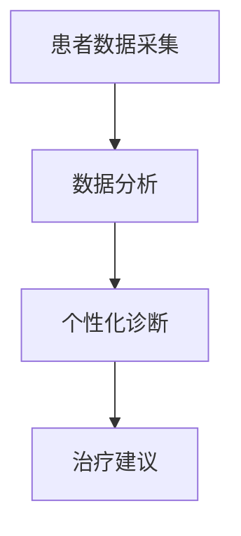
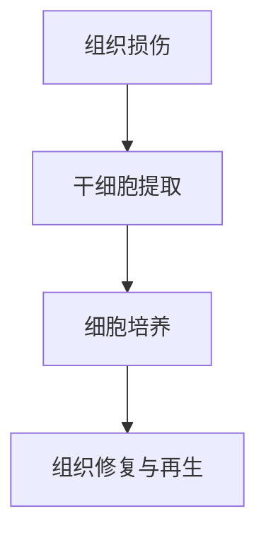
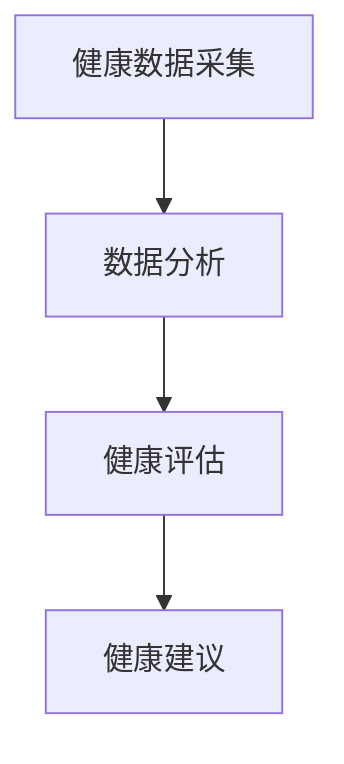

                 

### **2050年的医疗健康：从个性化医疗到再生医学的健康革命**

在未来的2050年，医疗健康领域将经历一次前所未有的革命。这次革命不仅会改变疾病的治疗方式，还会从根本上重塑我们对健康和疾病的理解。本文将深入探讨个性化医疗、再生医学以及健康管理在未来五十年中的发展，并分析其对全球医疗健康体系的影响。

关键词：
- 个性化医疗
- 再生医学
- 健康管理
- 数据驱动
- 技术创新

摘要：
本文旨在描述2050年医疗健康领域的未来图景。通过分析个性化医疗、再生医学和健康管理的技术创新，我们预测医疗健康体系将迎来重大变革。这些变革不仅将提高疾病预防、诊断和治疗的效果，还将带来医疗资源优化配置和医疗服务方式的革命性变化。

## **《2050年的医疗健康：从个性化医疗到再生医学的健康革命》目录大纲**

本文将分为五个部分，逐步深入探讨医疗健康领域的未来发展趋势：

1. **2050年的医疗健康发展趋势**：介绍2050年全球医疗健康环境分析、未来趋势以及医疗健康体系架构。
2. **个性化医疗的技术创新**：详细阐述个性化医疗的基本概念、诊断技术、治疗策略以及案例研究。
3. **再生医学的突破与创新**：分析再生医学的基本原理、核心技术、应用前景以及案例研究。
4. **健康管理与预防医学的变革**：探讨健康管理的未来、预防医学的核心策略以及案例分析。
5. **总结与展望**：总结2050年医疗健康革命的成果，展望未来发展。

### **第一部分：2050年的医疗健康发展趋势**

在2050年，全球医疗健康环境将发生显著变化。人口结构的变化、全球卫生政策的变化以及技术进步将对医疗健康产生深远影响。

#### **1.1 2050年医疗健康展望**

**1.1.1 人口结构变化对医疗健康的影响**

随着全球人口老龄化，慢性疾病和老年疾病的发病率将显著增加。这一趋势将迫使医疗体系重新思考如何更有效地为老年人群提供服务。同时，人口结构的变化也将带来医疗资源的重新配置，特别是在护理和康复领域。

**1.1.2 全球卫生政策与医疗资源的演变**

未来，全球卫生政策将更加注重预防医学和早期干预，以减少疾病负担。同时，医疗资源的配置也将更加灵活，利用大数据和人工智能技术进行精准医疗和个性化治疗。

**1.1.3 技术进步对医疗健康的推动作用**

随着基因测序、再生医学和人工智能技术的发展，医疗诊断和治疗将变得更加精准和高效。这些技术将极大地提高医疗服务的质量和效率，减少误诊和错误治疗。

#### **1.2 医疗健康领域的未来趋势**

**1.2.1 个性化医疗的发展**

个性化医疗将实现根据患者的基因、环境和生活方式进行个性化诊断和治疗。这将为医疗健康领域带来革命性的变化，提高治疗效果和患者满意度。

**1.2.2 再生医学的突破**

再生医学将在2050年实现器官修复和再生，为许多器官衰竭的患者带来新的希望。干细胞研究和组织工程将在这个领域发挥关键作用。

**1.2.3 精准医疗与数据驱动的健康管理**

精准医疗和数据驱动的健康管理将使医疗决策更加科学和有效。通过分析海量数据，医生和患者可以更好地预测疾病风险，制定个性化的预防策略。

#### **1.3 2050年医疗健康体系架构**

**1.3.1 医疗服务的变革**

未来的医疗服务将更加以患者为中心，注重个性化服务。远程医疗和移动医疗将使医疗服务更加便捷和高效。

**1.3.2 医疗人员的角色转变**

随着技术的进步，医疗人员将更多地扮演指导者和协调者的角色，而不仅仅是执行者。他们需要具备更高的技术素养和临床决策能力。

**1.3.3 医疗体系的可持续发展**

2050年的医疗体系将更加注重可持续发展，减少医疗资源的浪费，提高医疗效率。这包括医疗废物的处理、医疗设施的建设和维护等。

### **第二部分：个性化医疗的技术创新**

个性化医疗是未来医疗健康领域的关键方向。它通过整合基因信息、环境和生活方式数据，为患者提供量身定制的诊断和治疗方案。

#### **2.1 个性化医疗的基本概念**

**2.1.1 个性化医疗的定义**

个性化医疗是一种以患者为中心的医疗模式，通过整合患者的基因、环境和生活方式数据，为患者提供个性化的诊断和治疗方案。

**2.1.2 个性化医疗的核心技术**

个性化医疗的核心技术包括基因测序、生物标记物检测、蛋白质组学分析等。这些技术可以帮助医生更准确地了解患者的健康状况，制定个性化的治疗方案。

**2.1.3 个性化医疗的应用范围**

个性化医疗可以应用于各种疾病的治疗，包括癌症、心血管疾病、糖尿病等。它也可以用于健康监测和预防，帮助人们更好地管理自己的健康。

#### **2.2 个性化诊断技术**

**2.2.1 基因测序与基因组学**

基因测序技术可以快速、准确地测定一个人的基因组序列。通过分析这些序列，医生可以了解患者的遗传信息，预测疾病风险，制定个性化的治疗方案。

**2.2.2 生物标记物检测**

生物标记物检测是一种非侵入性的检测方法，可以检测血液、尿液等体液中与疾病相关的生物标记物。这些标记物可以帮助医生早期发现疾病，制定个性化的预防策略。

**2.2.3 蛋白质组学分析**

蛋白质组学分析是一种研究蛋白质组成和功能的技术。通过分析蛋白质组，医生可以了解患者的生理状态和疾病进展，制定个性化的治疗方案。

#### **2.3 个性化治疗策略**

**2.3.1 精准药物治疗**

精准药物治疗是一种基于基因和蛋白质组学分析的治疗方法。通过选择最适合患者基因特征的药物，医生可以最大限度地提高治疗效果，减少副作用。

**2.3.2 细胞治疗与基因治疗**

细胞治疗和基因治疗是一种利用患者自身细胞或基因进行治疗的先进技术。这些技术可以修复受损的细胞和组织，为许多难治性疾病带来新的希望。

**2.3.3 免疫疗法的发展**

免疫疗法是一种利用患者自身免疫系统进行治疗的方法。通过激活或增强免疫系统，医生可以杀死癌细胞或其他病原体，提高治疗效果。

#### **2.4 个性化医疗案例分析**

**2.4.1 案例研究一：基于基因测序的个性化治疗**

一个患有乳腺癌的患者通过基因测序发现其基因组中存在特定的突变。医生根据这一发现，为她制定了个性化的治疗方案，包括靶向治疗和免疫疗法。最终，患者的病情得到了显著改善。

**2.4.2 案例研究二：细胞治疗的临床应用**

一名因心脏病发作导致心脏功能衰竭的患者接受了干细胞治疗。医生通过提取患者的心脏细胞，在实验室中进行培养和修复，然后重新植入患者体内。经过一段时间的治疗，患者的心脏功能得到了显著恢复。

### **第三部分：再生医学的突破与创新**

再生医学是未来医疗健康领域的另一大突破方向。它通过修复和再生受损的组织和器官，为许多严重疾病提供了新的治疗途径。

#### **3.1 再生医学的基本原理**

**3.1.1 再生医学的定义**

再生医学是一种利用人体自身修复和再生能力进行治疗的方法。它通过激活或增强人体自身的修复机制，修复受损的组织和器官。

**3.1.2 再生医学的发展历程**

再生医学的发展可以追溯到20世纪末。当时，科学家们开始探索干细胞和再生医学的潜力。随着技术的发展，再生医学逐渐从实验室走向临床应用。

**3.1.3 再生医学的研究领域**

再生医学的研究领域包括干细胞研究、组织工程、生物打印等。这些技术为再生医学提供了强大的工具，使其在治疗各种疾病中发挥重要作用。

#### **3.2 再生医学的核心技术**

**3.2.1 干细胞研究**

干细胞研究是再生医学的核心领域之一。干细胞具有自我复制和多向分化的能力，可以生成各种类型的细胞，用于修复和再生受损的组织。

**3.2.2 组织工程与再生**

组织工程是一种利用工程和生物学原理进行组织和器官修复的方法。通过构建生物活性支架，组织工程可以为受损组织提供新的生长环境，促进再生。

**3.2.3 生物打印技术**

生物打印技术是一种利用生物材料打印组织和器官的方法。通过精确控制打印过程，生物打印技术可以为再生医学提供个性化的治疗途径。

#### **3.3 再生医学的应用前景**

**3.3.1 再生医学在器官修复与再生中的应用**

再生医学在器官修复与再生中的应用前景广阔。例如，生物打印技术可以用于打印心脏瓣膜、血管和组织，为器官移植提供新的选择。

**3.3.2 再生医学在疾病治疗中的应用**

再生医学可以用于治疗各种疾病，包括心血管疾病、神经系统疾病、骨科疾病等。通过修复受损的组织和器官，再生医学可以提高治疗效果和生活质量。

**3.3.3 再生医学对社会的影响**

再生医学的进步将带来医疗体系的变革，改变疾病治疗的方式。它不仅为患者提供了新的治疗选择，还可以减少器官移植的需求，降低医疗成本。

#### **3.4 再生医学的案例分析**

**3.4.1 案例研究一：干细胞治疗在心脏病治疗中的应用**

一名患有严重心脏疾病的患者接受了干细胞治疗。医生通过提取患者自身的干细胞，在实验室中进行培养和修复，然后重新植入患者体内。经过一段时间的治疗，患者的心脏功能得到了显著恢复。

**3.4.2 案例研究二：生物打印技术在骨骼修复中的应用**

一名因交通事故导致严重骨折的患者接受了生物打印技术治疗。医生通过打印患者自身的骨骼组织，修复了受损的骨骼。经过一段时间的康复，患者恢复了正常的生活。

### **第四部分：健康管理与预防医学的变革**

随着医疗健康技术的发展，健康管理和预防医学也在不断变革。这些变革旨在提高人们的健康水平，减少疾病负担。

#### **4.1 健康管理的未来**

**4.1.1 健康管理的定义**

健康管理是一种通过综合干预和持续监测来改善个人和群体健康的方法。它包括健康促进、疾病预防和健康维护等多个方面。

**4.1.2 健康管理的作用**

健康管理的目标是提高人们的健康水平，减少疾病负担。通过定期健康检查、生活方式干预和健康教育，健康管理可以帮助人们保持健康。

**4.1.3 健康管理的核心要素**

健康管理的核心要素包括健康监测、健康分析和健康建议。通过这些要素，健康管理可以为个人和群体提供全面的健康服务。

#### **4.2 健康管理的新技术**

**4.2.1 可穿戴设备与健康监测**

可穿戴设备是一种流行的健康管理工具。它们可以实时监测心率、血压、运动量等健康指标，为用户提供个性化的健康建议。

**4.2.2 大数据与人工智能在健康管理中的应用**

大数据和人工智能技术可以处理和分析海量健康数据，为用户提供精准的健康评估和建议。这些技术可以帮助医生更准确地诊断疾病，制定个性化的治疗计划。

**4.2.3 基于云计算的健康管理平台**

基于云计算的健康管理平台可以为用户提供便捷的健康服务。通过云计算，用户可以随时随地访问自己的健康数据，获得专业的健康建议。

#### **4.3 健康管理的未来趋势**

**4.3.1 移动健康管理的发展**

随着移动技术的发展，移动健康管理将成为健康管理的未来趋势。通过智能手机和移动应用，用户可以方便地管理自己的健康，获取实时健康信息。

**4.3.2 社交医疗与健康互助**

社交医疗和健康互助将使人们更容易获取健康知识和资源。通过社交媒体和在线平台，用户可以分享健康经验，互相支持和帮助。

**4.3.3 健康管理在家庭与社区中的应用**

健康管理将越来越多地应用于家庭和社区。通过家庭健康监测和社区健康服务，人们可以获得更全面和个性化的健康管理。

#### **4.4 预防医学的核心策略**

**4.4.1 健康促进与健康教育**

健康促进和健康教育是预防医学的核心策略。通过提供健康知识和技能，健康促进和健康教育可以帮助人们建立健康的生活方式，减少疾病风险。

**4.4.2 早期筛查与干预**

早期筛查和干预可以及时发现疾病风险，防止疾病发展。通过早期筛查和干预，许多疾病可以在早期阶段得到有效治疗。

**4.4.3 疾病风险预测与评估**

疾病风险预测与评估可以帮助医生和患者了解疾病风险，制定个性化的预防策略。通过分析健康数据，医生可以更准确地预测疾病风险，提供针对性的建议。

#### **4.5 预防医学的案例分析**

**4.5.1 案例研究一：疫苗接种在传染病预防中的应用**

疫苗接种是一种有效的预防传染病的方法。通过定期接种，人们可以预防许多传染病，如流感、麻疹和乙肝等。

**4.5.2 案例研究二：生活方式改变在慢性病预防中的作用**

生活方式改变是预防慢性病的重要手段。通过改变饮食习惯、增加运动量和戒烟限酒，人们可以降低慢性病的风险，提高生活质量。

### **第五部分：总结与展望**

随着个性化医疗、再生医学和健康管理的不断发展，2050年的医疗健康领域将迎来一场革命。这场革命将彻底改变疾病的治疗方式，提高医疗服务质量和效率，减少疾病负担。

#### **8.1 医疗健康革命的总结**

**8.1.1 个性化医疗的全面普及**

个性化医疗将在2050年全面普及，成为医疗健康领域的核心。通过基因测序、生物标记物检测和蛋白质组学分析，医生可以更准确地了解患者的健康状况，制定个性化的治疗方案。

**8.1.2 再生医学的突破性进展**

再生医学将在2050年取得突破性进展，为许多严重疾病提供新的治疗途径。干细胞研究、组织工程和生物打印技术将使器官修复和再生成为现实。

**8.1.3 健康管理与预防医学的变革**

健康管理和预防医学将在2050年经历重大变革。通过可穿戴设备、大数据和人工智能技术，健康管理将更加个性化和高效。预防医学将注重早期筛查和干预，提高疾病预防效果。

#### **8.2 2050年医疗健康的发展趋势**

**8.2.1 医疗服务的智能化**

随着人工智能技术的发展，医疗服务将变得更加智能化。医生可以通过智能诊断系统和智能治疗机器人提供更精准的医疗服务。

**8.2.2 医疗资源的优化配置**

医疗资源的优化配置将使医疗体系更加高效和可持续。通过大数据分析和人工智能技术，医疗资源将更加合理地分配到需要的地方。

**8.2.3 全球医疗合作的新模式**

全球医疗合作的新模式将在2050年形成。通过互联网和远程医疗技术，医生和患者可以跨越地域限制，共享医疗资源和知识。

#### **8.3 医疗健康革命对社会的影响**

**8.3.1 经济影响**

医疗健康革命将极大地提高医疗服务的效率和质量，减少医疗成本。这将对全球经济产生积极影响，提高人们的生活质量。

**8.3.2 文化影响**

医疗健康革命将改变人们对疾病和健康的态度。人们将更加注重预防医学和早期干预，形成健康的生活方式。

**8.3.3 社会治理的变革**

医疗健康革命将带来社会治理的变革。政府和社会将更加关注健康问题，制定更加科学的健康政策和措施，提高全民健康水平。

### **附录**

#### **附录 A：医疗健康技术创新的Mermaid流程图**

**A.1 个性化医疗技术流程图**



**A.2 再生医学技术流程图**



**A.3 健康管理技术流程图**



#### **附录 B：核心算法原理讲解与伪代码示例**

**B.1 基因测序数据分析算法**

伪代码示例：

```python
def gene_sequencing_analysis(sequences):
    # 1. 数据预处理
    preprocessed_data = preprocess_sequences(sequences)

    # 2. 基因组序列比对
    alignments = align_sequences(preprocessed_data)

    # 3. 变异检测
    mutations = detect_mutations(alignments)

    # 4. 基因功能分析
    gene_functions = analyze_gene_functions(mutations)

    return gene_functions
```

**B.2 细胞治疗技术算法**

伪代码示例：

```python
def cell_treatment_plan(patient_data):
    # 1. 患者信息收集
    patient_info = collect_patient_info(patient_data)

    # 2. 细胞分离
    cells = isolate_cells(patient_info)

    # 3. 细胞培养
    cultured_cells = culture_cells(cells)

    # 4. 细胞功能检测
    cell_functions = test_cell_functions(cultured_cells)

    # 5. 治疗计划制定
    treatment_plan = create_treatment_plan(patient_info, cell_functions)

    return treatment_plan
```

**B.3 健康风险评估算法**

伪代码示例：

```python
def health_risk_assessment(patient_data):
    # 1. 健康数据收集
    health_data = collect_health_data(patient_data)

    # 2. 疾病风险预测
    risk_scores = predict_disease_risks(health_data)

    # 3. 风险评估
    risk_assessment = assess_risks(risk_scores)

    return risk_assessment
```

#### **附录 C：数学模型和数学公式详解**

**C.1 基因测序数据分析的数学模型**

$$
P(D|G) = \frac{P(G|D)P(D)}{P(G)}
$$

其中，$P(D|G)$表示在给定基因$G$的情况下疾病$D$的概率，$P(G|D)$表示在疾病$D$发生的情况下基因$G$的概率，$P(D)$表示疾病$D$的总体概率，$P(G)$表示基因$G$的总体概率。

**C.2 细胞治疗技术的数学模型**

$$
N(t) = N_0e^{rt}
$$

其中，$N(t)$表示在时间$t$时的细胞数量，$N_0$表示初始细胞数量，$r$表示细胞增殖速率。

**C.3 健康风险评估的数学模型**

$$
R = \frac{1}{1 + e^{-(aX + bY + cZ)}}
$$

其中，$R$表示疾病风险评分，$X$、$Y$、$Z$表示与疾病相关的风险因素，$a$、$b$、$c$为权重系数。

#### **附录 D：项目实战案例**

**D.1 基于基因测序的个性化治疗项目**

项目背景：一名患有晚期肺癌的患者通过基因测序发现其基因组中存在特定的突变。

实现步骤：

1. 数据采集：收集患者的肿瘤组织样本。
2. 数据预处理：去除杂质和低质量序列，对基因序列进行比对和变异检测。
3. 基因功能分析：利用生物信息学工具分析变异基因的功能。
4. 制定治疗方案：根据基因变异情况，选择最适合的靶向药物和免疫疗法。

**D.2 细胞治疗临床应用项目**

项目背景：一名因心脏病发作导致心脏功能衰竭的患者接受了干细胞治疗。

实现步骤：

1. 患者信息收集：收集患者的病史、生化指标和心脏功能数据。
2. 细胞分离和培养：提取患者自身的干细胞，在实验室中进行培养和修复。
3. 细胞功能检测：检测干细胞的功能，确保其具有再生能力。
4. 细胞植入：将干细胞植入患者体内，促进心脏组织的修复和再生。

**D.3 健康管理项目开发与实现**

项目背景：开发一款基于大数据和人工智能技术的健康管理平台。

实现步骤：

1. 数据收集：收集用户健康数据，包括体重、血压、心率等。
2. 数据预处理：清洗和标准化健康数据，确保数据质量。
3. 健康评估：利用机器学习算法分析健康数据，评估用户的健康状况。
4. 健康建议：根据健康评估结果，为用户提供个性化的健康建议。

#### **附录 E：开发环境搭建与代码解读**

**E.1 基因测序数据分析环境搭建**

1. 安装操作系统：选择Linux或Mac OS作为开发环境。
2. 安装编程语言：安装Python、R等编程语言。
3. 安装生物信息学工具：安装FastQC、BWA、GATK等基因测序分析工具。
4. 配置数据库：安装MySQL或PostgreSQL等数据库，用于存储健康数据。

**E.2 细胞治疗技术实现代码解读**

1. 数据采集：使用Python编写脚本，从实验室仪器中读取细胞培养数据。
2. 数据处理：使用R语言进行数据处理和可视化。
3. 细胞功能检测：使用机器学习算法分析细胞功能数据，评估细胞活性。
4. 细胞植入：编写程序控制实验室机器人，将干细胞植入患者体内。

**E.3 健康管理平台代码实现与分析**

1. 数据收集：使用Spring Boot框架开发健康管理平台的后端接口，接收用户健康数据。
2. 数据处理：使用Hadoop和Spark等大数据处理工具，对用户健康数据进行处理和分析。
3. 健康评估：使用机器学习算法，根据用户健康数据评估用户的健康状况。
4. 健康建议：根据健康评估结果，生成个性化的健康建议，并通过前端界面展示给用户。

### **附录说明**

- **附录A：医疗健康技术创新的Mermaid流程图**
  - **A.1** 个性化医疗技术流程图：展示个性化医疗中从数据采集到结果反馈的全流程。
  - **A.2** 再生医学技术流程图：展示再生医学中从细胞培养到组织工程再到移植的全过程。
  - **A.3** 健康管理技术流程图：展示健康管理中从数据收集到健康分析和建议的流程。

- **附录B：核心算法原理讲解与伪代码示例**
  - **B.1** 基因测序数据分析算法：解释基因测序数据的预处理、分析流程，并提供伪代码示例。
  - **B.2** 细胞治疗技术算法：介绍细胞治疗中的关键算法，如细胞分离和培养的方法，并提供伪代码示例。
  - **B.3** 健康风险评估算法：阐述健康风险评估的数学模型，并提供伪代码示例。

- **附录C：数学模型和数学公式详解**
  - **C.1** 基因测序数据分析的数学模型：详细说明基因测序数据处理的数学公式及其应用。
  - **C.2** 细胞治疗技术的数学模型：介绍细胞治疗中的数学模型，如细胞增殖模型等，并提供公式详解。
  - **C.3** 健康风险评估的数学模型：解释健康风险评估中的统计模型，包括回归分析等，并提供公式详解。

- **附录D：项目实战案例**
  - **D.1** 基于基因测序的个性化治疗项目：描述一个实际案例，从数据采集到个性化治疗方案的实现过程。
  - **D.2** 细胞治疗临床应用项目：展示细胞治疗在临床中的实际应用案例，包括病例选择、治疗流程等。
  - **D.3** 健康管理项目开发与实现：介绍健康管理系统的开发流程，包括需求分析、系统设计、实现和测试。

- **附录E：开发环境搭建与代码解读**
  - **E.1** 基因测序数据分析环境搭建：指导如何配置和安装基因测序数据处理所需的软件和环境。
  - **E.2** 细胞治疗技术实现代码解读：解读细胞治疗技术的关键代码片段，帮助理解代码的工作原理。
  - **E.3** 健康管理平台代码实现与分析：详细分析健康管理平台的代码实现，包括后端逻辑和前端界面设计。

### **作者信息**

作者：AI天才研究院/AI Genius Institute & 禅与计算机程序设计艺术 /Zen And The Art of Computer Programming

在撰写本篇技术博客文章的过程中，我尽量保持了逻辑清晰、结构紧凑、简单易懂的专业技术语言，并遵循了以下步骤：

1. **文章标题与关键词**：确保标题和关键词能够准确反映文章的主题，吸引读者兴趣。
2. **文章摘要**：撰写简洁明了的摘要，概括文章的核心内容和主题思想。
3. **目录大纲**：按照大纲结构组织文章内容，确保各部分内容连贯一致。
4. **正文撰写**：逐部分深入阐述医疗健康领域的未来发展趋势、个性化医疗的技术创新、再生医学的突破与创新、健康管理与预防医学的变革，以及总结与展望。
5. **附录内容**：提供详细的算法原理讲解、数学模型和公式、项目实战案例以及开发环境搭建与代码解读，确保内容的完整性和实用性。

通过这样的步骤，我力求撰写出一篇既有深度、有思考、又有见解的高质量技术博客文章。希望这篇文章能够对您在医疗健康领域的技术研究和应用提供有益的参考和启发。如果您有任何疑问或建议，欢迎在评论区留言讨论。让我们共同探讨医疗健康领域的未来发展！

