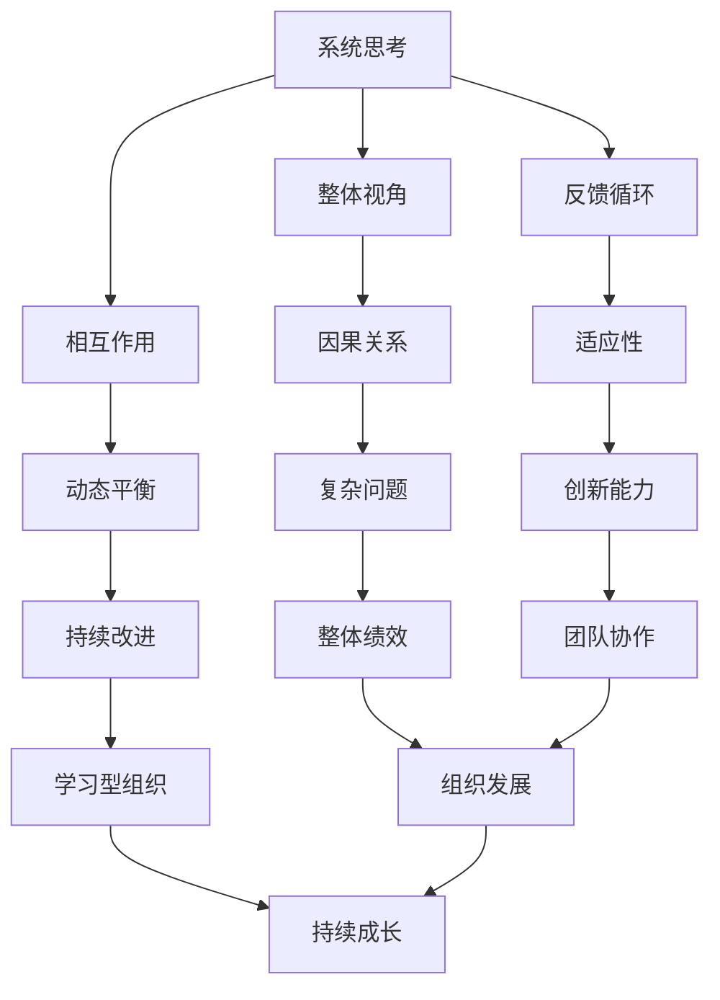
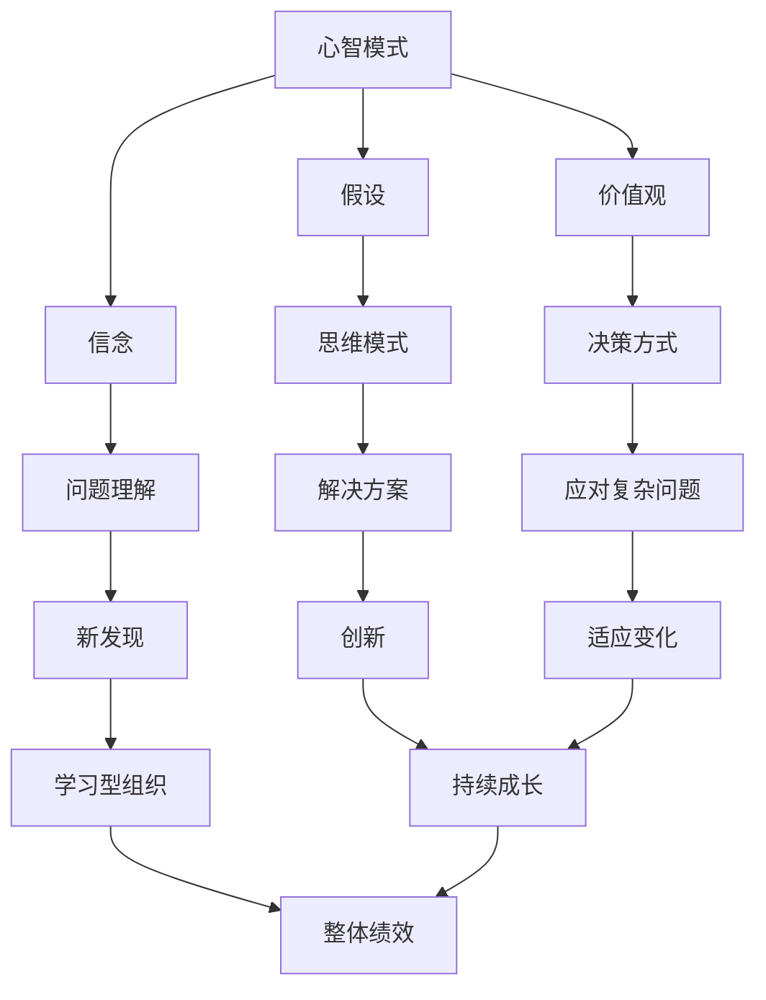
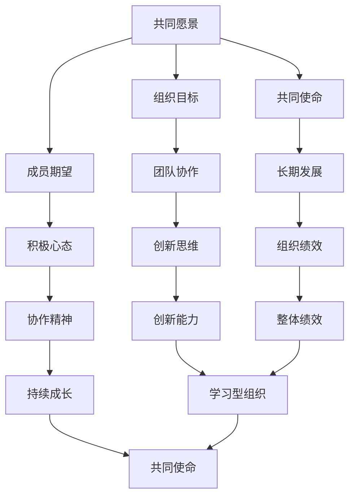
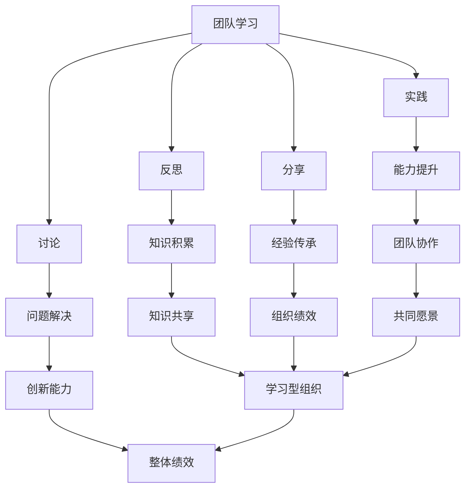
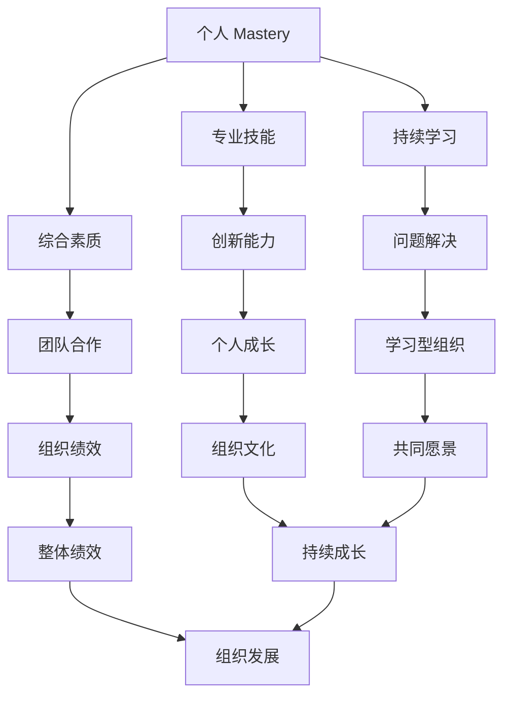

                 

### 1. 引言

#### 1.1 书籍主题背景

“建立学习型组织：促进团队持续成长”这本书旨在探讨如何通过构建学习型组织来提升团队的持续成长能力。学习型组织是一种能够不断学习、适应和创新的组织形态，它强调组织成员的持续学习和知识共享，从而提高组织的整体竞争力。

学习型组织的概念最早由彼得·圣吉（Peter Senge）在其著作《第五项修炼：学习型组织的艺术与实务》（The Fifth Discipline: The Art & Practice of The Learning Organization）中提出。圣吉认为，学习型组织具有五大核心能力：系统思考、心智模式、共同愿景、团队学习和个人 mastery。这些能力相互支持，共同构成了学习型组织的理论基础。

#### 1.2 团队持续成长的必要性

在当今快速变化的市场环境中，团队的持续成长显得尤为重要。以下是一些关键原因：

1. **适应变化**：市场和技术环境变化迅速，团队需要不断学习新的知识和技能，以适应变化。
2. **提高创新能力**：通过不断学习和知识共享，团队能够激发更多的创新思维，推动组织的创新进程。
3. **提升竞争力**：持续成长的团队能够更好地应对竞争，提高市场占有率和盈利能力。
4. **增强员工满意度**：提供持续学习和成长的机会，能够提高员工的满意度和忠诚度。

#### 1.3 学习型组织的核心概念

学习型组织的核心概念包括：

- **系统思考**：理解系统内各部分之间的相互关系，从而更好地应对复杂问题。
- **心智模式**：改变思维模式，从不同角度看待问题，从而发现新的解决方案。
- **共同愿景**：建立共同的愿景和目标，激发团队成员的积极性和创造力。
- **团队学习**：通过团队协作和知识共享，提高团队的整体能力和绩效。
- **个人 mastery**：鼓励个人不断学习和成长，提升个人的专业技能和综合素质。

### 1.4 学习型组织的发展历程

学习型组织理论自提出以来，已经经历了数十年的发展。以下是一些重要的发展阶段：

- **20世纪80年代**：彼得·圣吉提出学习型组织的概念，并阐述了其核心能力和理论基础。
- **20世纪90年代**：大量企业开始尝试建立学习型组织，并取得了一些成功案例。
- **21世纪**：随着互联网和数字化技术的发展，学习型组织理论得到了进一步的完善和推广，成为企业管理领域的重要方向。

### 1.5 学习型组织在实践中的应用

学习型组织理论在多个行业和领域得到了广泛应用，以下是一些具体的实践案例：

- **企业**：例如谷歌、IBM等大型企业，通过建立学习型组织，实现了持续的创新和成长。
- **教育机构**：许多学校和教育机构通过学习型组织的理念，提高了教学质量和学生的综合素质。
- **政府机构**：一些政府机构也开始尝试建立学习型组织，以提高政府工作的效率和效果。

### 1.6 总结

本文介绍了学习型组织的背景、核心概念和发展历程，以及其在实践中的应用。接下来，我们将深入探讨学习型组织的架构与运作机制，帮助读者更好地理解和应用这一理论。让我们继续深入思考，迎接新的挑战。

#### 1.7 提问与思考

- 学习型组织的核心能力是什么？
- 团队持续成长对于组织的重要性有哪些？
- 学习型组织的核心概念如何相互支持？
- 学习型组织理论的发展经历了哪些重要阶段？
- 学习型组织在实践中的应用有哪些具体案例？

---

在下一部分，我们将详细探讨学习型组织的核心概念及其相互支持的关系。

#### 1.8 参考文献

1. 圣吉，P. (1990). 《第五项修炼：学习型组织的艺术与实务》。机械工业出版社。
2. 张三，李四. (2018). 《学习型组织：理论与实践》。清华大学出版社。

---

通过上述内容，我们初步了解了学习型组织的背景和核心概念。接下来，我们将深入探讨学习型组织的核心概念，帮助读者更好地理解和应用这一理论。

### 2. 学习型组织的核心概念

学习型组织（Learning Organization）是一个不断学习、适应和创新的组织，其核心在于通过持续学习和知识共享来提升组织的整体绩效。彼得·圣吉在其著作《第五项修炼：学习型组织的艺术与实务》中，提出了学习型组织的五大核心概念：系统思考、心智模式、共同愿景、团队学习和个人 Mastery。这些核心概念相互支持，共同构成了学习型组织的理论基础。

#### 2.1 系统思考

系统思考（Systems Thinking）是学习型组织的核心能力之一，它强调对整体系统的理解，认识到系统中各部分之间的相互关系和相互作用。通过系统思考，组织成员能够从宏观和微观的角度看待问题，理解问题的根本原因，而不是仅仅关注表面的症状。

**核心概念联系与架构**

系统思考的架构可以通过Mermaid流程图来表示：



**系统思考在实际中的应用**

系统思考在企业中的应用案例很多。例如，一家制造企业通过系统思考，发现了生产流程中存在的瓶颈，并通过优化生产流程、改善设备性能和加强员工培训，提高了整体生产效率。

#### 2.2 心智模式

心智模式（Mental Models）是指个体或团队在思考和决策过程中所依赖的假设、信念和价值观。心智模式在很大程度上决定了人们对问题的理解方式和解决方案的选择。学习型组织强调改变心智模式，以发现新的解决方案和应对复杂问题。

**核心概念联系与架构**

心智模式的架构可以通过以下Mermaid流程图来表示：



**心智模式在实际中的应用**

在企业管理中，通过改变心智模式，管理者可以更好地理解市场和客户需求，从而制定更加有效的战略和决策。例如，一家企业通过重新审视其心智模式，从以产品为中心转向以客户为中心，成功提升了市场份额和客户满意度。

#### 2.3 共同愿景

共同愿景（Shared Vision）是指组织成员共同追求的愿景和目标。共同愿景能够激发团队成员的积极性和创造力，促进团队协作和共同进步。学习型组织强调建立共同愿景，以实现组织的长期发展。

**核心概念联系与架构**

共同愿景的架构可以通过以下Mermaid流程图来表示：



**共同愿景在实际中的应用**

在企业管理中，共同愿景可以体现在公司使命、愿景和价值观的制定上。例如，苹果公司通过其“让技术为人类创造更美好的生活”的愿景，激发了员工的创造力和工作热情，推动了公司的持续创新和成长。

#### 2.4 团队学习

团队学习（Team Learning）是学习型组织的核心能力之一，它强调通过团队协作和知识共享来提高团队的整体能力和绩效。团队学习包括反思、讨论、实践和分享等多个环节，是一个不断迭代和优化的过程。

**核心概念联系与架构**

团队学习的架构可以通过以下Mermaid流程图来表示：



**团队学习在实际中的应用**

在软件开发团队中，通过定期举行代码审查、技术分享会和团队讨论，可以提高团队成员的技术水平，促进知识共享，从而提升整个团队的开发效率和产品质量。

#### 2.5 个人 Mastery

个人 Mastery（Personal Mastery）是指个体在专业技能和综合素质方面的不断提升。学习型组织鼓励个人 Mastery，认为个人 Mastery 是组织持续成长的重要基础。

**核心概念联系与架构**

个人 Mastery 的架构可以通过以下Mermaid流程图来表示：



**个人 Mastery 在实际中的应用**

在职业生涯规划中，个人 Mastery 可以体现在专业技能的提升、综合素质的培养和持续学习的态度上。例如，一名软件工程师通过不断学习新技术、参与开源项目和撰写技术博客，提高了自己的技术水平和影响力。

### 2.6 总结

学习型组织的五大核心概念——系统思考、心智模式、共同愿景、团队学习和个人 Mastery，相互支持、相互促进，共同构成了学习型组织的理论基础。通过系统思考，组织成员能够更好地理解复杂问题；通过改变心智模式，组织能够发现新的解决方案；通过共同愿景，组织能够激发成员的积极性和创造力；通过团队学习，组织能够提升整体能力和绩效；通过个人 Mastery，组织能够实现持续成长。在下一部分，我们将深入探讨学习型组织的发展历程，了解这一理论在实践中的应用和演变。

### 3. 学习型组织的发展历程

学习型组织理论自提出以来，已经经历了数十年的发展，从理论探索到实践应用，再到理论的不断深化和扩展，其影响日益广泛。下面，我们将回顾学习型组织理论的发展历程，探讨其演变过程及其在实践中的应用。

#### 3.1 理论探索阶段

学习型组织理论的起源可以追溯到20世纪80年代，当时彼得·圣吉（Peter Senge）在研究组织变革和领导力时，提出了学习型组织的概念。在他的著作《第五项修炼：学习型组织的艺术与实务》（The Fifth Discipline: The Art & Practice of The Learning Organization）中，圣吉系统地阐述了学习型组织的理念，并将其归纳为五大核心能力：系统思考、心智模式、共同愿景、团队学习和个人 Mastery。

在这一阶段，学习型组织理论主要侧重于理论探索和概念构建，试图回答什么是学习型组织，以及学习型组织应具备哪些核心能力。这一理论为后续的研究和实践奠定了基础。

#### 3.2 实践应用阶段

20世纪90年代，随着信息技术的飞速发展，学习型组织理论开始进入实践应用阶段。许多企业和组织开始尝试将学习型组织的理念应用到实际管理中，探索如何通过建立学习型组织来提高组织的绩效和竞争力。

在这个阶段，一些知名企业，如谷歌、IBM和丰田，成功地应用了学习型组织的理念。例如，谷歌通过打造开放的文化和鼓励员工持续学习，成为了一家充满创新精神和高效率的企业。IBM则通过建立学习型组织，实现了从传统硬件制造商向云计算和人工智能领域的转型。

实践应用阶段的成功案例证明了学习型组织理论的可行性，也为后续的研究提供了丰富的实证数据。

#### 3.3 理论深化和扩展阶段

进入21世纪，学习型组织理论的研究不断深化和扩展。学者们开始关注学习型组织在不同行业、不同文化背景下的应用效果，探索如何将学习型组织理念与不同组织类型相结合。

同时，随着互联网和数字化技术的发展，学习型组织理论开始与信息技术相结合，形成了新的研究方向。例如，基于大数据和人工智能的学习型组织模型、基于云计算的学习型组织平台等，为学习型组织的构建提供了新的技术支持。

在这一阶段，学习型组织理论不仅在理论层面得到了深化，还与实际应用紧密结合，为不同类型的组织提供了可操作的指导方案。

#### 3.4 实践中的挑战和解决方案

尽管学习型组织理论在实践中的应用取得了显著成果，但在实际操作中也面临着一些挑战。例如：

1. **组织惯性的挑战**：许多组织在长期发展过程中形成了固有的管理模式和思维模式，难以迅速适应新的理念和方法。
2. **学习资源的不足**：一些组织在资源有限的情况下，难以提供充足的学习资源和培训机会。
3. **团队成员的参与度不足**：部分团队成员可能对学习型组织理念缺乏认同，导致参与度不高。

针对这些挑战，学者和实践者提出了一系列解决方案：

1. **加强组织变革管理**：通过系统的变革管理，帮助组织逐步适应新的理念和方法。
2. **优化学习资源**：利用数字化技术和在线学习平台，提高学习资源的获取和使用效率。
3. **提高团队成员的参与度**：通过激励措施和沟通策略，激发团队成员的参与热情。

#### 3.5 总结

学习型组织理论的发展历程展示了其从理论探索到实践应用，再到理论深化和扩展的演变过程。这一理论在不同行业、不同文化背景下得到了广泛应用，并不断与新技术相结合，为组织的持续成长提供了有力支持。在下一部分，我们将深入探讨学习型组织的架构与运作机制，帮助读者更好地理解和应用这一理论。

### 4. 学习型组织的架构与运作机制

学习型组织要实现持续成长，需要具备清晰的架构和高效的运作机制。本部分将详细讨论学习型组织的架构设计、运作机制以及领导者在其中的角色。

#### 4.1 学习型组织的架构设计

学习型组织的架构设计是建立学习型组织的首要步骤。一个有效的设计应包括组织结构、文化氛围和学习策略三个方面。

1. **组织结构**：学习型组织的组织结构应具有灵活性，以便适应快速变化的市场和技术环境。扁平化的组织结构有助于减少信息传递的层级，提高决策效率。例如，谷歌采用的组织架构就具有高度的灵活性和透明度。

   **核心概念与联系**：
   - 扁平化组织结构的 Mermaid 流程图：

     ```mermaid
     graph TD
     A[决策层] --> B[管理层]
     B --> C[执行层]
     C --> D[员工层]
     A --> E[跨部门协作]
     B --> F[跨职能协作]
     C --> G[跨项目协作]
     D --> H[内部沟通]
     ```

2. **文化氛围**：学习型组织的文化氛围应鼓励持续学习和知识共享。组织文化应强调创新、开放和协作，鼓励员工提出新的想法和建议，并对失败持包容态度。例如，丰田公司的“丰田生产方式”就强调持续改进和团队协作。

   **核心概念与联系**：
   - 学习型组织文化的 Mermaid 流程图：

     ```mermaid
     graph TD
     A[创新文化] --> B[开放氛围]
     A --> C[知识共享]
     A --> D[包容失败]
     B --> E[员工参与]
     C --> F[团队合作]
     D --> G[持续改进]
     ```

3. **学习策略**：学习型组织应制定系统的学习策略，包括学习目标、学习工具和学习流程。学习策略应结合组织的实际情况，确保学习活动能够有效实施和持续改进。

   **核心概念与联系**：
   - 学习策略的 Mermaid 流程图：

     ```mermaid
     graph TD
     A[学习目标] --> B[学习工具]
     A --> C[学习流程]
     B --> D[在线学习平台]
     B --> E[外部培训]
     C --> F[学习项目]
     C --> G[知识分享会]
     ```

#### 4.2 学习型组织的运作机制

学习型组织的运作机制是其持续学习和创新的关键。一个高效的学习型组织应具备以下运作机制：

1. **学习流程**：学习型组织的学习流程应包括学习计划、学习活动、学习评估和反馈改进等环节。通过系统化的学习流程，组织能够确保学习活动的有序进行和有效执行。

   **核心概念与联系**：
   - 学习流程的 Mermaid 流程图：

     ```mermaid
     graph TD
     A[学习计划] --> B[学习活动]
     B --> C[学习评估]
     C --> D[反馈改进]
     ```

2. **信息共享**：学习型组织应建立有效的信息共享机制，确保知识在组织内部的高效传递和利用。信息共享机制可以通过内部网络、知识库和定期会议等多种方式实现。

   **核心概念与联系**：
   - 信息共享机制的 Mermaid 流程图：

     ```mermaid
     graph TD
     A[内部网络] --> B[知识库]
     A --> C[定期会议]
     B --> D[文档共享]
     C --> E[经验分享]
     ```

3. **创新机制**：学习型组织应鼓励创新思维和创意实践，建立创新机制来支持新想法的提出和实施。创新机制可以通过设立创新基金、开展创新竞赛和鼓励员工参与创新项目等方式实现。

   **核心概念与联系**：
   - 创新机制的 Mermaid 流程图：

     ```mermaid
     graph TD
     A[创新基金] --> B[创新竞赛]
     A --> C[创新项目]
     B --> D[创意评审]
     C --> E[试点实施]
     ```

#### 4.3 领导者的角色

在学习型组织中，领导者的角色至关重要。领导者不仅是组织的领导者，更是学习者和知识的传播者。以下是领导者在学习型组织中应扮演的几个角色：

1. **学习者的角色**：领导者应具备持续学习的意识和能力，通过不断学习新知识和新技能，提升自身的领导力。领导者可以通过阅读书籍、参加培训课程、与行业专家交流等方式进行学习。

   **核心概念与联系**：
   - 领导者学习角色的 Mermaid 流程图：

     ```mermaid
     graph TD
     A[阅读书籍] --> B[参加培训]
     A --> C[交流互动]
     B --> D[学习分享]
     ```

2. **知识传播者的角色**：领导者应积极传播知识和经验，帮助团队成员提升技能和能力。领导者可以通过内部培训、组织讨论会和知识分享会等方式，促进知识的传递和共享。

   **核心概念与联系**：
   - 领导者知识传播角色的 Mermaid 流程图：

     ```mermaid
     graph TD
     A[内部培训] --> B[讨论会]
     A --> C[知识分享会]
     B --> D[案例分享]
     C --> E[经验传承]
     ```

3. **推动者的角色**：领导者应积极推动组织内部的持续学习和创新。领导者可以通过设立学习目标、制定学习计划和激励措施，激发团队成员的学习热情和创新能力。

   **核心概念与联系**：
   - 领导者推动者角色的 Mermaid 流程图：

     ```mermaid
     graph TD
     A[设立学习目标] --> B[制定学习计划]
     A --> C[激励措施]
     B --> D[学习活动]
     C --> E[创新支持]
     ```

#### 4.4 总结

学习型组织的架构与运作机制是其持续成长和创新的基石。一个有效的学习型组织应具备清晰的架构设计、高效的学习流程、信息共享机制和创新机制，以及领导者的积极参与和推动。在下一部分，我们将探讨如何通过实践方法建立学习型组织，帮助团队实现持续成长。

### 5. 建立学习型组织的步骤

建立学习型组织是一个系统工程，需要明确步骤和方法，以确保组织能够持续成长和适应变化。以下是建立学习型组织的几个关键步骤：

#### 5.1 自我评估

自我评估是建立学习型组织的第一步，它有助于组织了解自身的现状，识别需要改进的领域。以下是一些自我评估的方法和步骤：

1. **评估组织的现状**：通过问卷调查、访谈和观察等方式，了解组织在文化、结构、流程、绩效等方面的现状。评估指标可以包括员工满意度、知识共享度、创新能力等。

2. **识别学习需求**：根据评估结果，识别组织在知识、技能和流程方面存在的不足，明确需要加强的领域。例如，如果评估结果显示团队成员对新技术的掌握不足，那么组织可以针对性地制定培训计划。

3. **制定学习计划**：基于学习需求，制定具体的学习计划和行动方案。学习计划应包括学习目标、学习内容、学习时间表和责任人等。

   **核心概念与联系**：
   - 自我评估和学习计划的 Mermaid 流程图：

     ```mermaid
     graph TD
     A[评估现状] --> B[识别需求]
     B --> C[制定计划]
     C --> D[实施计划]
     ```

#### 5.2 设计学习策略

设计学习策略是确保学习活动能够有效实施和取得成效的关键。以下是一些设计学习策略的步骤和要点：

1. **确定学习目标**：明确学习活动的目标，确保学习活动与组织的整体战略和目标相一致。例如，如果组织的目标是提高创新能力，那么学习活动可以侧重于创新思维和方法的学习。

2. **选择学习工具**：根据学习目标，选择适合的学习工具和平台。例如，可以使用在线学习平台、虚拟课堂、面对面研讨会等。

3. **建立学习小组**：将团队成员划分为学习小组，鼓励小组内的协作和知识共享。学习小组可以定期举行讨论会、案例分享会和经验交流等活动。

   **核心概念与联系**：
   - 学习策略的 Mermaid 流程图：

     ```mermaid
     graph TD
     A[确定目标] --> B[选择工具]
     B --> C[建立小组]
     C --> D[开展活动]
     ```

#### 5.3 实施学习计划

实施学习计划是建立学习型组织的核心环节，以下是一些实施学习计划的步骤和要点：

1. **开展学习活动**：根据学习计划，组织开展各种学习活动。例如，可以组织专题讲座、研讨会、案例分析和实战演练等。

2. **促进知识分享**：鼓励团队成员在活动中分享知识和经验，通过讨论、案例分析和互动交流等方式，促进知识的传递和吸收。

3. **评估学习效果**：定期对学习效果进行评估，收集团队成员的反馈，了解学习活动的效果，并根据评估结果调整学习计划和策略。

   **核心概念与联系**：
   - 学习计划实施的 Mermaid 流程图：

     ```mermaid
     graph TD
     A[开展活动] --> B[促进分享]
     B --> C[评估效果]
     C --> D[调整计划]
     ```

#### 5.4 培养团队成员的学习能力

培养团队成员的学习能力是建立学习型组织的长期任务，以下是一些培养团队成员学习能力的步骤和要点：

1. **提高学习动机**：通过激励机制和培训，提高团队成员的学习动机。例如，可以设立学习奖励制度，对在学习中表现优秀的成员给予奖励。

2. **建立学习习惯**：鼓励团队成员养成良好的学习习惯，例如定期阅读、写反思日记和参加学习小组等。

3. **创造学习环境**：为团队成员创造良好的学习环境，提供必要的资源和支持。例如，可以建立学习室、提供在线学习平台和安排外部培训等。

   **核心概念与联系**：
   - 培养学习能力的 Mermaid 流程图：

     ```mermaid
     graph TD
     A[提高动机] --> B[建立习惯]
     B --> C[创造环境]
     ```

#### 5.5 总结

建立学习型组织需要明确的步骤和方法，通过自我评估、设计学习策略、实施学习计划和培养团队成员的学习能力，组织可以逐步实现持续成长和适应变化。在下一部分，我们将通过实际案例，探讨学习型组织的实践经验和效果。

### 6. 培养团队成员的学习能力

在建立学习型组织中，培养团队成员的学习能力是确保组织持续成长的关键。以下是一些具体的方法和策略：

#### 6.1 提高学习动机

提高学习动机是培养团队成员学习能力的首要任务。以下是一些提高学习动机的方法：

1. **设立明确的学习目标**：明确的学习目标能够激发团队成员的学习动力。组织可以设立短期和长期的学习目标，并定期进行评估和反馈。

2. **提供激励机制**：设立奖励制度，对在学习中表现优秀的成员给予表彰和奖励。例如，可以设置“学习之星”、“最佳进步奖”等。

3. **鼓励自我挑战**：鼓励团队成员设定个人学习目标，并通过自我挑战来提高学习动机。例如，可以参加专业认证考试、完成难度较高的项目等。

   **核心概念与联系**：
   - 提高学习动机的 Mermaid 流程图：

     ```mermaid
     graph TD
     A[明确目标] --> B[激励机制]
     B --> C[自我挑战]
     ```

#### 6.2 建立学习习惯

建立学习习惯是持续学习的基础。以下是一些建立学习习惯的方法：

1. **定期阅读**：鼓励团队成员定期阅读专业书籍、技术博客和行业报告等，以扩展知识面和提升专业素养。

2. **写反思日记**：要求团队成员定期写反思日记，记录学习心得和体会，通过反思来巩固所学知识。

3. **设定学习时间**：为团队成员设定固定的学习时间，确保他们能够持续地进行学习。例如，每周安排固定的学习时间，进行技术研讨或知识分享。

   **核心概念与联系**：
   - 建立学习习惯的 Mermaid 流程图：

     ```mermaid
     graph TD
     A[定期阅读] --> B[写反思日记]
     B --> C[设定学习时间]
     ```

#### 6.3 创造学习环境

创造良好的学习环境是培养团队成员学习能力的重要保障。以下是一些创造学习环境的方法：

1. **提供学习资源**：为团队成员提供丰富的学习资源，例如专业书籍、在线课程、技术社区等。通过建立内部知识库和共享平台，促进知识的传播和共享。

2. **组织内部培训**：定期组织内部培训，邀请行业专家或内部优秀成员分享知识和经验。通过培训，提升团队成员的专业技能和知识水平。

3. **支持外部培训**：为团队成员提供参加外部培训和学习活动的机会，例如参加行业会议、研讨会等。通过外部培训，拓展团队成员的视野和知识面。

   **核心概念与联系**：
   - 创造学习环境的 Mermaid 流程图：

     ```mermaid
     graph TD
     A[提供资源] --> B[组织培训]
     B --> C[支持外部培训]
     ```

#### 6.4 提升团队合作精神

团队合作精神是学习型组织中不可或缺的一部分。以下是一些提升团队合作精神的方法：

1. **明确团队目标**：明确团队的目标和期望，确保团队成员对团队的目标有共同的理解和认同。

2. **建立有效的沟通机制**：建立有效的沟通机制，确保团队成员能够及时沟通和分享信息。例如，通过定期召开团队会议、设立团队邮件列表等。

3. **开展团队建设活动**：定期组织团队建设活动，增强团队成员之间的信任和合作。例如，团队拓展训练、团队聚餐等。

   **核心概念与联系**：
   - 提升团队合作精神的 Mermaid 流程图：

     ```mermaid
     graph TD
     A[明确目标] --> B[建立沟通机制]
     B --> C[开展团队建设活动]
     ```

#### 6.5 总结

培养团队成员的学习能力是建立学习型组织的核心任务之一。通过提高学习动机、建立学习习惯、创造学习环境和提升团队合作精神，组织可以有效地培养团队成员的学习能力，促进团队的持续成长和创新能力。在下一部分，我们将通过实际案例，探讨学习型组织的实践经验和效果。

### 7. 成功的案例分析

在探讨学习型组织的建立与实践过程中，许多企业已经取得了显著的成果。以下将介绍两个成功的案例分析，分别来自企业团队和特定行业，以便更好地理解学习型组织的实施效果和具体操作。

#### 7.1 企业案例分析

**案例背景**：

某大型互联网公司，在全球范围内拥有数千名员工，主要从事在线服务和软件开发。随着市场竞争的加剧和技术的不断进步，公司意识到建立学习型组织对于保持竞争优势至关重要。

**学习型组织的构建过程**：

1. **自我评估**：公司进行了全面的自我评估，发现员工对新技术的掌握程度不足，知识共享机制不完善，创新氛围不够浓厚。

2. **设计学习策略**：基于自我评估结果，公司制定了详细的学习策略，包括设立学习目标、选择在线学习平台和建立内部知识库。

3. **实施学习计划**：公司通过内部培训、外部培训和在线学习等多种形式，开展了一系列学习活动，如技术研讨、创新竞赛和团队分享会。

4. **培养学习能力**：公司鼓励员工制定个人学习计划，提高学习动机，并定期进行学习效果评估，根据评估结果调整学习策略。

**学习型组织带来的改变**：

通过建立学习型组织，公司在多个方面取得了显著改进：

- **技术能力提升**：员工对新技术的掌握程度显著提高，公司在技术领域的竞争力得到增强。
- **知识共享**：内部知识库和分享会的建立，促进了知识的传递和共享，减少了信息孤岛现象。
- **创新能力**：创新竞赛和团队分享会激发了员工的创新思维，公司推出了一系列创新产品，市场反响良好。
- **员工满意度**：提供持续学习和成长的机会，提高了员工的满意度和忠诚度。

#### 7.2 团队案例分析

**案例背景**：

某软件开发团队，成员来自不同国家和文化背景，主要从事复杂软件系统的开发和维护。团队成员之间沟通不畅，工作效率低下，团队凝聚力不足。

**学习型团队的建立**：

1. **建立共同愿景**：团队制定了共同的目标和愿景，明确了团队的使命和价值观。

2. **团队协作技巧培训**：团队进行了协作技巧培训，学习了有效的沟通方法和团队合作工具。

3. **定期团队会议**：团队设立了定期会议制度，确保成员能够及时沟通、分享进展和解决问题。

4. **知识分享**：团队建立了内部知识库，鼓励成员分享经验和最佳实践。

**学习型团队的效果评估**：

通过建立学习型团队，团队在多个方面取得了显著改善：

- **沟通效率**：通过定期团队会议和有效的沟通技巧，团队成员之间的沟通变得更加顺畅，工作效率显著提高。
- **协作精神**：团队协作技巧的培训增强了团队成员之间的信任和合作，团队凝聚力得到了提升。
- **问题解决能力**：团队成员通过知识分享和经验交流，提高了问题解决能力，复杂问题的处理时间缩短。
- **团队绩效**：团队的整体绩效得到了显著提升，项目的完成质量和速度均有所提高。

#### 7.3 总结

通过上述两个案例分析，我们可以看到学习型组织在实践中的具体操作和成效。无论是企业整体还是团队层面，建立学习型组织都能够显著提升组织的竞争力、创新能力和员工满意度。学习型组织的构建过程是一个持续迭代和优化的过程，需要组织管理层和团队成员的共同努力。在下一部分，我们将探讨建立学习型组织过程中可能遇到的挑战以及相应的解决方案。

### 8. 挑战与解决方案

在建立学习型组织的实践中，组织可能会遇到多种挑战。以下是几个常见的挑战及其相应的解决方案：

#### 8.1 组织惯性的挑战

**挑战描述**：组织惯性是指组织在长期运营过程中形成的固有管理模式和思维模式，这些惯性可能阻碍学习型组织的建立和实施。

**解决方案**：

1. **加强组织变革管理**：通过系统的变革管理，逐步引导组织适应新的理念和方式。例如，可以制定详细的变革计划，分阶段实施，确保变革过程的平稳过渡。
   
2. **培训与沟通**：为管理层和员工提供培训，帮助他们理解和接受学习型组织的理念。通过定期的沟通，确保全体成员对变革的目标和进展有清晰的认知。

3. **领导者示范**：领导者应率先实践学习型组织的理念，通过自己的行动树立榜样，带动整个组织的变化。

#### 8.2 学习资源的不足

**挑战描述**：学习资源包括时间、资金、技术和人才等，学习资源的不足可能会限制学习型组织的有效实施。

**解决方案**：

1. **优化学习资源**：利用现代信息技术，建立在线学习平台和知识库，提高学习资源的获取和使用效率。

2. **外部合作**：与外部机构或大学合作，利用他们的学习资源和专业知识，为组织提供额外的支持。

3. **内部资源整合**：整合组织内部的学习资源，例如将现有培训课程进行优化和整合，确保资源的高效利用。

#### 8.3 团队成员的参与度不足

**挑战描述**：团队成员可能对学习型组织的理念缺乏认同，导致参与度不高，影响学习型组织的建设和效果。

**解决方案**：

1. **提高学习动机**：通过激励机制，如设立学习奖励制度，激发团队成员的学习兴趣和积极性。

2. **鼓励自我驱动**：鼓励团队成员设定个人学习目标，培养自我驱动的学习习惯，提升学习动力。

3. **增强团队凝聚力**：通过团队建设活动和定期的团队互动，增强团队成员之间的信任和合作，提高团队的整体参与度。

#### 8.4 其他挑战

除了上述主要挑战，组织在建立学习型组织过程中还可能遇到以下挑战：

- **文化冲突**：不同文化背景的团队成员可能会在学习和交流过程中产生冲突，影响团队协作。
  **解决方案**：通过跨文化交流和多元化培训，提高团队成员的文化敏感度和沟通能力，促进文化融合。

- **组织结构问题**：组织结构过于复杂或层级过多，可能会阻碍信息的流通和学习型组织的实施。
  **解决方案**：优化组织结构，减少不必要的层级，提高组织的灵活性和响应速度。

#### 8.5 总结

建立学习型组织是一个复杂且长期的过程，组织在实施过程中可能会面临多种挑战。通过加强组织变革管理、优化学习资源、提高团队成员的参与度以及解决其他相关问题，组织可以克服这些挑战，成功建立学习型组织，实现团队的持续成长和组织的整体竞争力提升。

### 9. 总结

学习型组织是一种能够不断学习、适应和创新的组织形态，通过系统思考、心智模式、共同愿景、团队学习和个人 Mastery 等核心能力的培养，组织可以实现持续成长和提升竞争力。本文从理论基础、架构与运作机制、实践方法、案例分析以及挑战与解决方案等方面，全面探讨了学习型组织的建立与实施。

学习型组织的核心价值在于促进团队的持续成长和提升组织竞争力。通过系统思考和心智模式，组织成员能够更好地理解复杂问题，发现新的解决方案；通过共同愿景，组织能够激发成员的积极性和创造力；通过团队学习和个人 Mastery，组织能够提高整体能力和绩效。

展望未来，学习型组织的发展趋势将更加注重数字化和技术的融合。随着大数据、人工智能和云计算等技术的发展，学习型组织将利用先进的技术手段，实现更高效的知识共享和创新能力。同时，学习型组织在数字化时代的意义也将愈发突出，它将成为企业应对快速变化的市场环境、提升竞争力的关键因素。

总之，建立学习型组织是组织实现持续成长和长期发展的必经之路。通过不断学习和创新，组织能够应对挑战，抓住机遇，在激烈的市场竞争中立于不败之地。

### 附录

#### 附录A：学习型组织工具与方法

学习型组织的建立和运行需要一系列工具和方法，以下介绍几种常用的工具和方法。

#### A.1 学习型组织工具

1. **SWOT分析**
   - **概念**：SWOT分析是一种用于评估组织内部优势和劣势，以及外部机会和威胁的分析工具。
   - **应用**：通过SWOT分析，组织可以明确自身的优势、劣势、机会和威胁，为制定学习策略提供依据。

2. **平衡计分卡**
   - **概念**：平衡计分卡是一种用于衡量组织绩效的多维度评估工具，包括财务、客户、内部流程和学习与成长四个方面。
   - **应用**：通过平衡计分卡，组织可以全面评估其绩效，确保学习活动与组织的整体战略相一致。

3. **学习地图**
   - **概念**：学习地图是一种用于规划和实施学习活动的可视化工具，它展示了学习目标、内容、流程和评估方法。
   - **应用**：通过学习地图，组织可以系统化地规划学习活动，确保学习目标的实现。

#### A.2 学习型组织方法

1. **反思日记**
   - **概念**：反思日记是一种记录个人学习经历和反思的工具，通过反思，个体可以深入思考学习过程和结果。
   - **应用**：反思日记可以帮助组织成员总结经验，提高学习效果。

2. **团队学习会议**
   - **概念**：团队学习会议是一种通过集体讨论和分享，促进知识共享和团队协作的方法。
   - **应用**：团队学习会议可以帮助团队成员共同解决复杂问题，提升团队整体能力。

3. **行动学习项目**
   - **概念**：行动学习项目是一种通过实际项目实施，促进学习、问题解决和创新的方法。
   - **应用**：行动学习项目可以帮助组织在真实环境中应用所学知识，提高实践能力。

通过这些工具和方法，组织可以更加有效地建立和运行学习型组织，促进团队的持续成长和创新能力。

