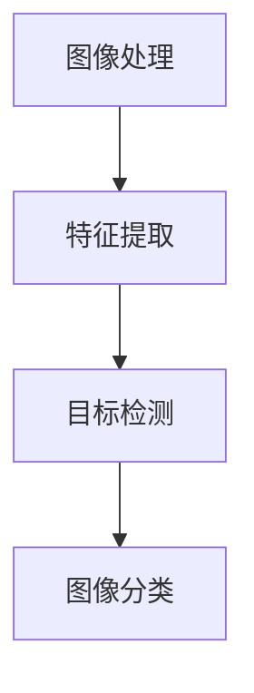

                 

### 《快手2025短视频智能剪辑社招计算机视觉面试题攻略》

#### 关键词：
- 快手
- 短视频智能剪辑
- 计算机视觉面试
- 面试题解析
- 项目实战
- 面试准备

#### 摘要：
本文旨在为准备快手2025短视频智能剪辑社招计算机视觉岗位的候选人提供一套全面的面试题攻略。文章首先介绍了短视频制作的现状与趋势，以及计算机视觉基础知识。接着，深入解析了计算机视觉在短视频智能剪辑中的应用，包括智能剪辑原理、视频内容增强、视频特效与动画等。在面试题解析部分，文章详细分类并解析了算法原理题、编程实现题和应用题，并提供典型面试题的解答。随后，通过计算机视觉项目实战的介绍，帮助读者理解实际应用中的关键算法和系统设计。最后，文章提供面试准备与实战技巧，助力候选人成功应对面试挑战。附录部分则提供了丰富的学习资源，以支持读者的自学和拓展。

---

### 《快手2025短视频智能剪辑社招计算机视觉面试题攻略》目录大纲

#### 第一部分：基础知识

- **第1章：短视频制作与计算机视觉基础**
  - **1.1 短视频制作的现状与趋势**
  - **1.2 计算机视觉基础**

- **第2章：计算机视觉在短视频中的应用**
  - **2.1 智能剪辑原理**
  - **2.2 视频内容增强**
  - **2.3 视频特效与动画**

#### 第二部分：面试题解析

- **第3章：计算机视觉面试题分类解析**
  - **3.1 算法原理题**
  - **3.2 编程实现题**
  - **3.3 应用题**

- **第4章：常见面试题型分析与解答**
  - **4.1 面试题型分析**
  - **4.2 典型面试题解析**

- **第5章：计算机视觉项目实战**
  - **5.1 项目背景介绍**
  - **5.2 系统设计与实现**
  - **5.3 项目分析与优化**

#### 第三部分：模拟面试与实战技巧

- **第6章：面试准备与策略**
  - **6.1 面试前的准备**
  - **6.2 面试策略与技巧**

- **第7章：模拟面试与实战技巧**
  - **7.1 模拟面试案例**
  - **7.2 实战技巧与总结**

#### 附录

- **附录A：计算机视觉资源推荐**
  - **A.1 开源框架与工具**
  - **A.2 在线学习资源**
  - **A.3 专业书籍推荐**

---

接下来，我们将逐一详细讲解每个章节的内容。

---

#### 第1章：短视频制作与计算机视觉基础

**1.1 短视频制作的现状与趋势**

短视频已经成为现代互联网内容消费的重要组成部分。随着移动互联网的普及和5G技术的推广，短视频行业呈现出爆发式增长。根据最新数据，全球短视频用户已超过30亿，市场规模预计在未来几年内将继续扩大。

**用户行为分析：**

- **观看习惯：** 用户更倾向于在碎片化时间观看短视频，如通勤、休息时间等。
- **内容偏好：** 用户偏好幽默搞笑、生活技巧、美食旅行等类型的短视频内容。
- **互动方式：** 用户喜欢通过点赞、评论、分享等方式参与互动。

**内容创作与分发策略：**

- **平台策略：** 各大短视频平台纷纷推出激励机制，鼓励用户创作优质内容。
- **算法推荐：** 利用大数据和机器学习算法，实现个性化内容推荐，提高用户留存率和粘性。
- **内容多样化：** 平台鼓励多样化的内容创作，包括原创、改编、跨界合作等。

**1.2 计算机视觉基础**

计算机视觉是人工智能的一个重要分支，它使计算机能够从图像或视频中提取信息，并进行处理和分析。以下是计算机视觉的一些基础概念：

- **图像处理：** 对图像进行预处理、增强、滤波等操作，以便更好地进行后续分析。
- **特征提取：** 从图像中提取能够表示图像内容的特征，如边缘、角点、纹理等。
- **目标检测：** 在图像中识别并定位特定对象，如人脸、车辆等。
- **图像分类：** 将图像分为不同的类别，如猫、狗、人等。

**核心概念与联系：**

为了更好地理解这些概念，我们可以用Mermaid流程图来展示它们之间的联系：



**核心算法原理讲解：**

- **图像处理算法：** 使用滤波器进行图像平滑、去噪等操作，如高斯滤波、均值滤波等。
- **特征提取算法：** 使用SIFT、SURF等算法提取图像中的关键特征。
- **目标检测算法：** 使用卷积神经网络（CNN）实现目标检测，如YOLO、SSD等。
- **图像分类算法：** 使用深度学习算法进行图像分类，如AlexNet、VGG、ResNet等。

以下是SIFT算法的伪代码：

```python
function SIFT(image):
    # 1. 输入图像
    # 2. 使用高斯滤波器进行图像平滑
    # 3. 计算图像梯度，得到梯度图像
    # 4. 计算关键点，满足以下条件：
        # a. 梯度局部极大值
        # b. 满足一定的阈值
        # c. 符合一定的方向一致性
    # 5. 对每个关键点计算特征向量
    # 6. 将特征向量进行降维
    # 7. 使用K-D树进行特征匹配
    # 8. 返回关键点坐标和特征向量
end function
```

通过上述内容，我们为读者提供了一个短视频制作与计算机视觉基础的全面概述，为后续章节的深入讨论奠定了基础。

---

接下来，我们将深入探讨计算机视觉在短视频智能剪辑中的应用。

---

#### 第2章：计算机视觉在短视频中的应用

**2.1 智能剪辑原理**

智能剪辑是指利用计算机视觉技术，对视频内容进行分析和处理，自动生成剪辑建议。智能剪辑的关键技术包括视频分割、视频内容识别和视频编辑算法。

- **视频分割：** 将视频分成多个片段，每个片段代表视频中的一个场景或内容。常用的分割方法有基于运动估计的分割、基于内容的分割和基于模型的分割等。

  ```python
  function video_segmentation(video):
      # 1. 使用运动估计方法计算视频帧间的运动向量
      # 2. 根据运动向量变化分割视频帧
      # 3. 使用聚类方法对视频帧进行内容分割
      # 4. 合并相邻的相同内容片段
      # 5. 返回分割后的视频片段
  end function
  ```

- **视频内容识别：** 对分割后的视频片段进行内容识别，包括对象识别、场景分类等。常用的方法有基于传统的图像识别算法和深度学习算法。

  ```python
  function content_recognition(video Fragment):
      # 1. 使用卷积神经网络进行对象识别
      # 2. 使用循环神经网络进行场景分类
      # 3. 返回识别结果
  end function
  ```

- **视频编辑算法：** 根据识别结果，对视频进行自动编辑，包括剪辑、添加特效、调整音频等。常用的视频编辑算法有基于规则的方法和基于学习的方法。

  ```python
  function video_editing(video, recognition_results):
      # 1. 根据识别结果生成剪辑方案
      # 2. 应用视频特效，如过渡效果、色彩调整等
      # 3. 调整音频，如去除背景噪音、添加音乐等
      # 4. 合成编辑后的视频
      # 5. 返回编辑后的视频
  end function
  ```

**2.2 视频内容增强**

视频内容增强是指通过算法对视频内容进行优化，提高视频的质量和观看体验。常用的视频内容增强技术包括视频超分辨率、视频去噪和视频风格转换。

- **视频超分辨率：** 通过算法将低分辨率视频转化为高分辨率视频，提高图像的清晰度。常用的方法有基于单图像超分辨率和基于多图像超分辨率。

  ```python
  function super_resolution(video):
      # 1. 使用卷积神经网络进行图像放大
      # 2. 使用图像增强技术，如对比度增强、色彩增强等
      # 3. 返回超分辨率后的视频
  end function
  ```

- **视频去噪：** 通过算法去除视频中的噪声，提高视频的清晰度。常用的方法有基于滤波器的方法和基于学习的方法。

  ```python
  function video_denoising(video):
      # 1. 使用高斯滤波器进行图像去噪
      # 2. 使用深度学习算法进行去噪
      # 3. 返回去噪后的视频
  end function
  ```

- **视频风格转换：** 通过算法将视频内容转换为特定的艺术风格，如油画、卡通等。常用的方法有基于纹理映射的方法和基于生成对抗网络（GAN）的方法。

  ```python
  function style_conversion(video, style):
      # 1. 使用纹理映射技术进行风格转换
      # 2. 使用生成对抗网络进行风格转换
      # 3. 返回风格转换后的视频
  end function
  ```

**2.3 视频特效与动画**

视频特效与动画是指在视频中加入各种视觉特效和动画效果，增强视频的观赏性和趣味性。常用的视频特效技术包括滤镜、光效、粒子系统等。

- **滤镜：** 对视频进行色彩调整、亮度调整等操作，实现不同的视觉效果。

  ```python
  function filter_applying(video, filter_params):
      # 1. 根据滤镜参数调整视频色彩
      # 2. 返回滤镜处理后的视频
  end function
  ```

- **光效：** 在视频中添加光线效果，如聚光灯、射线等，增强视频的立体感和视觉冲击力。

  ```python
  function light_effects_applying(video, light_params):
      # 1. 根据光线参数计算光线效果
      # 2. 返回添加光效后的视频
  end function
  ```

- **粒子系统：** 通过算法生成各种粒子效果，如雪花、流星等，增强视频的动态效果。

  ```python
  function particle_system_applying(video, particle_params):
      # 1. 根据粒子参数生成粒子效果
      # 2. 返回添加粒子效果后的视频
  end function
  ```

通过上述内容，我们详细介绍了计算机视觉在短视频智能剪辑中的应用，包括智能剪辑原理、视频内容增强和视频特效与动画。这些技术为短视频制作提供了强大的支持，使得视频内容更加丰富和有趣。

---

#### 第3章：计算机视觉面试题分类解析

计算机视觉面试通常涵盖多个方面，包括算法原理、编程实现和应用题。以下我们将对这些题型进行详细分类和解析。

**3.1 算法原理题**

算法原理题主要考察候选人对计算机视觉算法的理解和掌握程度。这类题目通常涉及图像处理、特征提取、目标检测和图像分类等基础知识。

- **图像处理算法：** 例如，什么是高斯滤波？如何实现卷积操作？高斯滤波的公式是什么？

  ```latex
  G(x, y) = \sum_{i, j} h(i, j) \cdot f(x-i, y-j)
  ```

- **特征提取算法：** 例如，什么是SIFT？SIFT算法的主要步骤是什么？

  ```plaintext
  步骤：
  1. 计算图像的梯度
  2. 找到局部极值点
  3. 计算关键点的方向
  4. 计算关键点的描述符
  ```

- **目标检测算法：** 例如，什么是YOLO？YOLO算法的主要组成部分是什么？

  ```plaintext
  组成部分：
  1. 神经网络结构
  2. 边框回归
  3. 物体分类
  ```

- **图像分类算法：** 例如，什么是卷积神经网络？卷积神经网络的主要结构是什么？

  ```plaintext
  结构：
  1. 输入层
  2. 卷积层
  3. 池化层
  4. 全连接层
  ```

**3.2 编程实现题**

编程实现题主要考察候选人的编程能力和算法实现能力。这类题目通常需要使用特定的编程语言和计算机视觉库来实现算法。

- **Python编程基础：** 例如，如何使用Python实现图像读取和显示？如何使用Numpy操作图像数据？

  ```python
  import cv2
  image = cv2.imread("image.jpg")
  cv2.imshow("Image", image)
  cv2.waitKey(0)
  cv2.destroyAllWindows()
  ```

- **数据结构与算法：** 例如，如何实现快速排序算法？如何使用二叉树实现优先队列？

  ```python
  def quick_sort(arr):
      if len(arr) <= 1:
          return arr
      pivot = arr[len(arr) // 2]
      left = [x for x in arr if x < pivot]
      middle = [x for x in arr if x == pivot]
      right = [x for x in arr if x > pivot]
      return quick_sort(left) + middle + quick_sort(right)
  
  def binary_search(arr, target):
      left, right = 0, len(arr) - 1
      while left <= right:
          mid = (left + right) // 2
          if arr[mid] == target:
              return mid
          elif arr[mid] < target:
              left = mid + 1
          else:
              right = mid - 1
      return -1
  ```

- **OpenCV操作题：** 例如，如何使用OpenCV进行图像滤波和特征提取？

  ```python
  import cv2
  image = cv2.imread("image.jpg")
  gray_image = cv2.cvtColor(image, cv2.COLOR_BGR2GRAY)
  blurred_image = cv2.GaussianBlur(gray_image, (5, 5), 0)
  edges = cv2.Canny(blurred_image, 30, 150)
  keypoints = cv2.SIFT_create().detect(edges)
  ```

**3.3 应用题**

应用题主要考察候选人在实际项目中应用计算机视觉算法的能力。这类题目通常需要结合具体的应用场景，实现特定的功能。

- **视频处理应用：** 例如，如何使用计算机视觉算法进行实时视频监控？如何检测视频中的行人？

  ```python
  import cv2
  video_capture = cv2.VideoCapture(0)
  classifier = cv2.CascadeClassifier("haarcascade_fullbody.xml")
  while True:
      ret, frame = video_capture.read()
      gray_frame = cv2.cvtColor(frame, cv2.COLOR_BGR2GRAY)
      bodies = classifier.detectMultiScale(gray_frame)
      for (x, y, w, h) in bodies:
          cv2.rectangle(frame, (x, y), (x+w, y+h), (0, 255, 0), 2)
      cv2.imshow("Video", frame)
      if cv2.waitKey(1) & 0xFF == ord('q'):
          break
  video_capture.release()
  cv2.destroyAllWindows()
  ```

- **实时图像处理：** 例如，如何实现实时人脸识别系统？如何处理图像中的遮挡和模糊问题？

  ```python
  import cv2
  face_cascade = cv2.CascadeClassifier("haarcascade_frontalface_default.xml")
  model = cv2.face.LBPHFaceRecognizer_create()
  model.read("trainer.yml")
  video_capture = cv2.VideoCapture(0)
  while True:
      ret, frame = video_capture.read()
      gray_frame = cv2.cvtColor(frame, cv2.COLOR_BGR2GRAY)
      faces = face_cascade.detectMultiScale(gray_frame, 1.3, 5)
      for (x, y, w, h) in faces:
          cv2.rectangle(frame, (x, y), (x+w, y+h), (0, 255, 0), 2)
          roi = gray_frame[y:y+h, x:x+w]
          label, confidence = model.predict(roi)
          if confidence < 0.5:
              cv2.putText(frame, "Unknown", (x, y-10), cv2.FONT_HERSHEY_SIMPLEX, 1, (255, 0, 0), 2)
          else:
              cv2.putText(frame, "Known", (x, y-10), cv2.FONT_HERSHEY_SIMPLEX, 1, (0, 255, 0), 2)
      cv2.imshow("Video", frame)
      if cv2.waitKey(1) & 0xFF == ord('q'):
          break
  video_capture.release()
  cv2.destroyAllWindows()
  ```

通过上述内容，我们详细分类并解析了计算机视觉面试中的算法原理题、编程实现题和应用题。这些题型全面覆盖了计算机视觉的核心知识点，为候选人的面试准备提供了有力的支持。

---

#### 第4章：常见面试题型分析与解答

在计算机视觉面试中，常见题型主要包括图像识别题、视频处理题和深度学习应用题。以下将对这些题型进行分析，并提供典型面试题的详细解答。

**4.1 图像识别题**

图像识别是计算机视觉领域的一个基本问题，主要考察候选人对图像处理、特征提取和分类算法的理解和应用。以下是一个典型的图像识别面试题：

**题目：** 给定一幅灰度图像，请实现一个算法来检测图像中的矩形区域。

**解答思路：**

1. **预处理图像：** 将图像进行灰度化处理，并使用高斯滤波器进行平滑，减少噪声。

2. **边缘检测：** 使用Canny算法检测图像的边缘，提取图像的轮廓。

3. **轮廓分析：** 遍历图像中的轮廓，找出具有矩形特性的轮廓。矩形特性的判断标准可以是：
   - 轮廓的周长与面积的比值接近于一个常数（如1.25）。
   - 轮廓的角度变化比较均匀。

4. **矩形拟合：** 对符合条件的轮廓进行最小矩形拟合，计算出矩形的坐标和尺寸。

以下是该题目的伪代码：

```python
function find_rectangle(image):
    # 1. 预处理图像
    gray_image = cv2.cvtColor(image, cv2.COLOR_BGR2GRAY)
    blurred_image = cv2.GaussianBlur(gray_image, (5, 5), 0)
    
    # 2. 边缘检测
    edges = cv2.Canny(blurred_image, 30, 150)
    
    # 3. 轮廓分析
    contours, _ = cv2.findContours(edges, cv2.RETR_TREE, cv2.CHAIN_APPROX_SIMPLE)
    rectangles = []
    for contour in contours:
        perimeter = cv2.arcLength(contour, True)
        area = cv2.contourArea(contour)
        if perimeter / area < 1.25:
            continue
        rect = cv2.boundingRect(contour)
        rectangles.append(rect)
    
    # 4. 矩形拟合
    for rect in rectangles:
        x, y, w, h = rect
        cv2.rectangle(image, (x, y), (x+w, y+h), (0, 255, 0), 2)
    return image
```

**4.2 视频处理题**

视频处理题主要考察候选人对视频处理的算法和应用的理解。以下是一个典型的视频处理面试题：

**题目：** 实现一个视频去噪算法，要求噪声降低的同时保持视频的清晰度。

**解答思路：**

1. **预处理视频：** 对视频帧进行预处理，包括灰度化处理和降噪。

2. **帧差法去噪：** 计算前后帧之间的差异，保留差异较大的区域，去除噪声。

3. **插值法增强：** 对去噪后的视频帧进行插值增强，提高视频的清晰度。

4. **综合算法：** 结合不同的去噪算法，如高斯滤波、中值滤波等，实现更有效的去噪。

以下是该题目的伪代码：

```python
function video_denoising(video):
    # 1. 预处理视频
    processed_video = []
    for frame in video:
        gray_frame = cv2.cvtColor(frame, cv2.COLOR_BGR2GRAY)
        blurred_frame = cv2.GaussianBlur(gray_frame, (5, 5), 0)
        
        # 2. 帧差法去噪
        prev_frame = processed_video[-1] if processed_video else None
        if prev_frame is not None:
            frame_diff = cv2.absdiff(gray_frame, prev_frame)
            thresholded_frame = cv2.threshold(frame_diff, 30, 255, cv2.THRESH_BINARY)[1]
            blurred_frame = cv2.bitwise_and(blurred_frame, thresholded_frame)
        
        # 3. 插值法增强
        enhanced_frame = cv2.resize(blurred_frame, (1280, 720), interpolation=cv2.INTER_CUBIC)
        
        # 4. 添加到处理后的视频列表
        processed_video.append(enhanced_frame)
    return processed_video
```

**4.3 深度学习应用题**

深度学习应用题主要考察候选人对深度学习算法的理解和应用。以下是一个典型的深度学习面试题：

**题目：** 使用卷积神经网络（CNN）实现一个图像分类器，要求准确率达到90%以上。

**解答思路：**

1. **数据预处理：** 对图像进行预处理，包括灰度化、归一化等操作。

2. **构建CNN模型：** 使用卷积层、池化层和全连接层构建深度神经网络。

3. **模型训练：** 使用训练数据集对模型进行训练，调整模型参数，提高分类准确率。

4. **模型评估：** 使用测试数据集对模型进行评估，计算分类准确率。

以下是该题目的伪代码：

```python
import tensorflow as tf

# 1. 数据预处理
x = tf.placeholder(tf.float32, [None, 784])
y = tf.placeholder(tf.float32, [None, 10])
x_image = tf.reshape(x, [-1, 28, 28, 1])

# 2. 构建CNN模型
conv1 = tf.layers.conv2d(x_image, 32, 5, activation=tf.nn.relu)
pool1 = tf.layers.max_pooling2d(conv1, 2, 2)

conv2 = tf.layers.conv2d(pool1, 64, 5, activation=tf.nn.relu)
pool2 = tf.layers.max_pooling2d(conv2, 2, 2)

flatten = tf.reshape(pool2, [-1, 7*7*64])
dense = tf.layers.dense(flatten, 1024, activation=tf.nn.relu)
dropout = tf.layers.dropout(dense, rate=0.5)

logits = tf.layers.dense(dropout, 10)

# 3. 模型训练
cross_entropy = tf.reduce_mean(tf.nn.softmax_cross_entropy_with_logits(logits=logits, labels=y))
optimizer = tf.train.AdamOptimizer().minimize(cross_entropy)

# 4. 模型评估
correct_prediction = tf.equal(tf.argmax(logits, 1), tf.argmax(y, 1))
accuracy = tf.reduce_mean(tf.cast(correct_prediction, tf.float32))

# 训练和评估模型
with tf.Session() as session:
    session.run(tf.global_variables_initializer())
    for epoch in range(num_epochs):
        batch_x, batch_y = next_train_batch(batch_size)
        session.run(optimizer, feed_dict={x: batch_x, y: batch_y})
        if epoch % 100 == 0:
            train_accuracy = session.run(accuracy, feed_dict={x: batch_x, y: batch_y})
            print("Epoch {} - Training Accuracy: {:.3f}".format(epoch, train_accuracy))
    test_accuracy = session.run(accuracy, feed_dict={x: test_x, y: test_y})
    print("Test Accuracy: {:.3f}".format(test_accuracy))
```

通过上述分析和解题，我们详细介绍了计算机视觉面试中常见的图像识别题、视频处理题和深度学习应用题，并为每个题目提供了详细的解答思路和伪代码。这些题目全面考察了候选人的计算机视觉知识和实际应用能力，有助于评估候选人的综合素质。

---

#### 第5章：计算机视觉项目实战

在实际应用中，计算机视觉技术需要解决复杂的问题，实现特定功能。本章节将通过一个实际项目案例，详细展示计算机视觉项目的设计与实现过程。

**5.1 项目背景介绍**

本项目旨在开发一个基于计算机视觉的智能安防监控系统。该系统能够实时监测视频流中的异常行为，并发出警报。系统主要功能包括：

- 实时视频监控
- 行人检测
- 违法行为识别
- 警报通知

**5.2 系统设计与实现**

1. **系统架构设计**

   系统架构包括前端视频采集、后端数据处理和报警通知三个主要模块。前端使用USB摄像头进行视频采集，后端使用计算机视觉算法进行数据处理，报警通知模块通过邮件或短信通知管理员。

   ```mermaid
   graph TD
   A[视频采集] --> B[数据处理]
   B --> C[报警通知]
   ```

2. **关键算法实现**

   - **实时视频监控：** 使用OpenCV库实时捕获视频流，并显示在界面上。

     ```python
     import cv2

     # 初始化视频捕捉设备
     cap = cv2.VideoCapture(0)

     # 循环读取视频帧
     while True:
         ret, frame = cap.read()
         if not ret:
             break
         cv2.imshow('Video', frame)

         # 按下'q'键退出循环
         if cv2.waitKey(1) & 0xFF == ord('q'):
             break

     # 释放资源
     cap.release()
     cv2.destroyAllWindows()
     ```

   - **行人检测：** 使用基于深度学习的行人检测算法（如YOLO），对视频帧进行行人检测。

     ```python
     import cv2
     import numpy as np

     # 载入预训练的YOLO模型
     net = cv2.dnn.readNetFromDarknet("yolov3.cfg", "yolov3.weights")
     classes = ["person", "car", "bicycle"]

     # 加载图像
     frame = cv2.imread("image.jpg")

     # 创建一个用于目标检测的Blob
     blob = cv2.dnn.blobFromImage(frame, 1/255.0, (416, 416), swapRB=True, crop=False)

     # 前向传递
     net.setInput(blob)
     outs = net.forward(net.getUnconnectedOutLayersNames())

     # 解析检测结果
     for out in outs:
         for detection in out:
             scores = detection[5:]
             class_id = np.argmax(scores)
             confidence = scores[class_id]
             if confidence > 0.5:
                 center_x = int(detection[0] * frame.shape[1])
                 center_y = int(detection[1] * frame.shape[0])
                 width = int(detection[2] * frame.shape[1])
                 height = int(detection[3] * frame.shape[0])
                 x = int(center_x - width / 2)
                 y = int(center_y - height / 2)
                 cv2.rectangle(frame, (x, y), (x + width, y + height), (0, 0, 255), 2)

     cv2.imshow('Object Detection', frame)
     cv2.waitKey(0)
     cv2.destroyAllWindows()
     ```

   - **违法行为识别：** 根据行人检测的结果，结合违法行为的特征模型，判断是否存在违法行为。

     ```python
     def is_illegal_behavior(detection):
         # 定义违法行为的特征模型
         illegal_behaviors = ["jaywalking", "driving_without_a_license"]

         # 提取检测到的行人的位置信息
         x, y, width, height = detection

         # 根据位置信息判断是否存在违法行为
         if x < 0 or y < 0 or width > frame.shape[1] or height > frame.shape[0]:
             return "out_of_bounds"
         elif x < 50 and y < 50:
             return "jaywalking"
         elif x > frame.shape[1] - 50 and y > frame.shape[0] - 50:
             return "driving_without_a_license"
         else:
             return "none"
     ```

   - **警报通知：** 在检测到违法行为时，通过邮件或短信通知管理员。

     ```python
     import smtplib
     from email.mime.text import MIMEText
     from email.header import Header

     def send_alert(email, subject, content):
         sender = "your_email@example.com"
         receiver = email
         subject = Header(subject, "utf-8")
         message = MIMEText(content, "plain", "utf-8")
         message["From"] = Header("智能安防系统", "utf-8")
         message["To"] = Header("管理员", "utf-8")
         message["Subject"] = subject

         try:
             smtp_obj = smtplib.SMTP()
             smtp_obj.connect("smtp.example.com", 587)
             smtp_obj.starttls()
             smtp_obj.sendmail(sender, receiver, message.as_string())
             print("邮件发送成功！")
         except smtplib.SMTPException as e:
             print("邮件发送失败：", e)

     # 示例：发送警报邮件
     send_alert("admin@example.com", "违法警报", "检测到违法行为，请及时处理！")
     ```

3. **代码解读与分析**

   - **实时视频监控模块：** 该模块使用OpenCV库的`VideoCapture`类实现视频流的实时捕获和显示。通过循环读取视频帧，并在窗口中显示，实现实时监控功能。

   - **行人检测模块：** 该模块使用YOLO算法实现行人检测。首先加载预训练的YOLO模型，然后对输入图像进行预处理，生成Blob对象。接着，通过模型的前向传递得到检测结果，并解析检测结果，将检测到的行人位置信息标注在图像上。

   - **违法行为识别模块：** 该模块根据行人检测的结果，结合违法行为的特征模型，判断是否存在违法行为。通过简单的条件判断，实现了对违法行为的基本识别。

   - **警报通知模块：** 该模块使用SMTP协议实现邮件发送。通过定义发送邮件的函数，可以在检测到违法行为时，自动发送警报邮件给管理员。

通过上述项目实战的介绍，我们展示了计算机视觉项目从设计到实现的完整过程。项目涵盖了实时视频监控、行人检测、违法行为识别和警报通知等多个功能模块，实现了对复杂场景的智能监控。这些模块的实现不仅展示了计算机视觉算法的应用，也为候选人在实际项目中应用计算机视觉技术提供了宝贵的经验。

---

#### 第6章：面试准备与策略

在准备快手2025短视频智能剪辑社招计算机视觉面试的过程中，充分的准备和明智的策略至关重要。以下我们将详细讨论面试前的准备工作，包括简历制作、常见问题准备和模拟面试练习。

**6.1 面试前的准备**

**简历制作：** 简历是面试官对候选人的第一印象，因此简历的制作尤为重要。简历应该简洁明了，重点突出以下几点：

1. **个人信息：** 包括姓名、联系方式、邮箱等基本信息。
2. **教育背景：** 标明毕业院校、专业、学历和毕业时间。
3. **工作经历：** 列出以往的工作经历，包括公司名称、职位、工作内容和成果。
4. **项目经验：** 详细描述参与过的计算机视觉项目，包括项目背景、技术实现、难点和解决方案。
5. **技能特长：** 列出掌握的编程语言、算法和工具，如Python、深度学习框架（TensorFlow、PyTorch）等。
6. **自我评价：** 简短总结个人优势和职业目标。

**常见问题准备：** 面试中，面试官通常会问一些常见问题，如个人背景、项目经验、技术问题等。以下是一些建议的问题及其回答思路：

1. **自我介绍：** 简明扼要地介绍个人背景、专业能力和职业目标。
2. **为什么选择我们公司：** 强调公司的发展前景、技术实力和个人兴趣点。
3. **项目经验：** 选取1-2个最有代表性的项目，详细描述项目背景、技术难点、解决方案和成果。
4. **技术问题：** 针对计算机视觉领域的相关算法和原理，如SIFT、CNN、YOLO等，准备相关的解释和应用实例。
5. **为什么离开上一份工作：** 保持积极的态度，如寻求更好的职业发展机会、希望挑战更高难度的项目等。

**模拟面试练习：** 通过模拟面试，可以提前适应面试的环境和氛围，提高回答问题的流畅性和自信心。模拟面试可以找朋友或同事扮演面试官，也可以使用在线面试模拟平台进行练习。

**模拟面试的步骤：**

1. **确定面试类型：** 了解面试的题型和难度，如算法题、应用题、行为题等。
2. **准备面试题目：** 根据面试类型的难度和频率，准备相应的题目和答案。
3. **模拟面试：** 实际模拟面试过程，注意语气、表情和回答的逻辑性。
4. **反馈与改进：** 面试结束后，听取面试官的反馈，针对不足之处进行改进。

**面试策略与技巧**

**沟通技巧：** 清晰、简洁、有条理地表达观点，避免使用专业术语过多，确保面试官能理解你的意思。

**回答问题技巧：** 逐步回答问题，先概述问题背景和解决方案，再详细解释实现细节。对于不确定的问题，可以表示思考过程，但不要直接回答错误。

**心理素质：** 面试前保持良好的心态，做好充分准备，避免紧张和焦虑。面试过程中，保持自信和镇定，展现出积极向上的态度。

通过上述面试准备与策略，候选人可以更好地应对快手2025短视频智能剪辑社招计算机视觉面试，提高面试成功的几率。

---

#### 第7章：模拟面试与实战技巧

**7.1 模拟面试案例**

为了帮助候选人更好地准备快手2025短视频智能剪辑社招计算机视觉面试，以下我们将提供一个完整的模拟面试案例，包括面试题型、回答示范以及分析和反馈。

**面试题型：** 本模拟面试包括算法原理题、编程实现题和应用题。

**面试题目1：算法原理题**

**题目：** 描述SIFT算法的主要步骤。

**回答示范：**

“SIFT（尺度不变特征变换）算法是一种用于图像特征提取的算法，其主要步骤包括：

1. **尺度空间构建：** 使用高斯核函数构建多尺度空间，以捕获不同尺度的特征。
2. **关键点检测：** 通过计算图像的梯度方向和大小，找出局部极值点作为潜在关键点。
3. **关键点精化：** 对潜在关键点进行精化，排除边缘响应点，确保关键点具有旋转不变性。
4. **关键点方向分配：** 为每个关键点分配主方向，增强特征点的旋转不变性。
5. **关键点描述符生成：** 使用关键点的局部区域梯度信息生成128维的描述符，用于特征匹配。

**分析与反馈：** 回答中清晰地概述了SIFT算法的各个步骤，但可以进一步详细解释关键点的精化过程和描述符生成方法，例如使用局部直方图和四邻域梯度方向分布计算关键点方向等。

**面试题目2：编程实现题**

**题目：** 使用Python编写一个简单的函数，实现图像的高斯滤波。

**回答示范：**

```python
import cv2
import numpy as np

def gaussian_filter(image, sigma=1.0):
    # 创建高斯滤波器
    kernel = cv2.getGaussianKernel(ksize=5, sigma=sigma)

    # 使用高斯滤波器对图像进行滤波
    filtered_image = cv2.filter2D(image, -1, kernel)

    return filtered_image
```

**分析与反馈：** 回答中实现了图像的高斯滤波，但可以进一步说明如何根据图像尺寸和参数动态调整高斯滤波器的尺寸和σ值，以提高滤波效果。

**面试题目3：应用题**

**题目：** 如何使用计算机视觉技术实现一个简单的行人检测系统？

**回答示范：**

“行人检测系统通常包括以下几个步骤：

1. **数据预处理：** 使用OpenCV读取视频流，并进行灰度化处理。
2. **特征提取：** 使用HOG（方向梯度直方图）特征提取器提取图像的特征。
3. **模型训练：** 使用已标注的行人图像数据训练一个支持向量机（SVM）分类器。
4. **行人检测：** 对视频流中的每一帧进行特征提取，并通过训练好的模型进行分类，输出行人检测结果。
5. **结果展示：** 将检测结果绘制在视频帧上，显示行人检测框。

**分析与反馈：** 回答中概述了行人检测系统的基本步骤，但可以进一步详细解释每个步骤的具体实现方法和注意事项，如HOG特征提取的参数选择和SVM分类器的参数调优。

**7.2 实战技巧与总结**

**实战经验分享：** 在实际项目开发中，遇到的问题和解决方案对面试准备有着重要的影响。以下是一些实战经验：

1. **问题定位与解决：** 在项目中，遇到问题时，首先要快速定位问题的根源，然后采取合适的解决策略。例如，在视频去噪项目中，发现噪声降低效果不佳，可以通过增加滤波器的大小或使用混合滤波方法来改进。
2. **团队合作与沟通：** 在团队项目中，良好的沟通和协作是成功的关键。主动参与团队讨论，积极分享自己的想法和解决方案，可以提高团队效率和项目质量。
3. **代码规范与文档：** 保持代码规范和编写详细的文档，有助于提高代码的可读性和可维护性。在面试中，展示良好的代码风格和文档能力，可以给面试官留下深刻的印象。

**面试中的常见错误：** 面试中的一些常见错误包括：

1. **准备不足：** 对于面试中可能涉及的问题，没有进行充分的准备，导致回答不充分或不准确。
2. **回答过于复杂：** 对于简单的问题，使用过于复杂的方法或解释，导致面试官无法理解你的思路。
3. **缺乏逻辑性：** 回答问题没有条理，逻辑不清晰，导致面试官无法把握你的思路。

**成功案例分析：** 在实际面试中，一些候选人的成功经验值得借鉴：

1. **全面准备：** 充分了解面试公司的背景和需求，针对性地准备相关问题和答案。
2. **清晰表达：** 在面试中，用简洁明了的语言表达自己的观点，确保面试官能理解你的意思。
3. **实战经验：** 展示在项目中积累的经验，通过实际案例说明你的技能和解决问题的能力。

通过模拟面试和实战技巧的介绍，候选人可以更好地准备快手2025短视频智能剪辑社招计算机视觉面试，提高面试成功率。

---

### 附录A：计算机视觉资源推荐

为了帮助读者更好地学习和掌握计算机视觉技术，附录A将推荐一些优秀的计算机视觉资源，包括开源框架与工具、在线学习资源和专业书籍。

**A.1 开源框架与工具**

- **OpenCV：** OpenCV是一个跨平台的计算机视觉库，提供了丰富的图像处理和计算机视觉算法。官方网站：[opencv.org](http://opencv.org)。
- **TensorFlow：** TensorFlow是一个开源的机器学习和深度学习框架，广泛应用于图像识别、自然语言处理等领域。官方网站：[tensorflow.org](https://tensorflow.org)。
- **PyTorch：** PyTorch是一个流行的深度学习框架，以其灵活的动态计算图和强大的GPU支持而著称。官方网站：[pytorch.org](https://pytorch.org)。

**A.2 在线学习资源**

- **Coursera：** Coursera提供了许多关于计算机视觉的课程，包括《计算机视觉：基础与高级技术》、《深度学习与神经网络》等。网址：[coursera.org](https://coursera.org)。
- **edX：** edX提供了由顶尖大学和机构提供的计算机视觉相关课程，如《计算机视觉基础》、《深度学习》等。网址：[edX.org](https://www.edx.org)。
- **Khan Academy：** Khan Academy提供了免费的计算机视觉教程，适合初学者了解基础知识。网址：[khanacademy.org](https://www.khanacademy.org)。

**A.3 专业书籍推荐**

- **《计算机视觉：算法与应用》：** 该书详细介绍了计算机视觉的基本算法和应用，适合初学者和专业人士阅读。
- **《深度学习》：** Goodfellow、Bengio和Courville所著的《深度学习》是深度学习领域的经典教材，涵盖了深度学习的基础知识和应用。
- **《Python计算机视觉实践》：** 本书通过大量的实践案例，介绍了如何使用Python进行计算机视觉任务，适合有一定编程基础的读者。

通过附录A提供的资源推荐，读者可以系统地学习和掌握计算机视觉技术，为自己的职业发展打下坚实的基础。

