                 

# 《思维体系：认知决定起跑线》

## 关键词

认知科学、思维模式、认知决策、行为心理学、思维训练、职业发展

## 摘要

在人工智能和计算机科学的飞速发展时代，认知科学的重要性日益凸显。本文旨在探讨认知科学的核心概念、思维模式以及其在决策和行为中的应用，并进一步分析如何构建强大的思维体系以应对未来的挑战。文章将从认知科学的基础、思维模式的解析、认知决策与行为，到构建强大思维体系的策略进行深入探讨，旨在为读者提供一个全面、系统的思维体系构建指南。

---

## 目录大纲

### 第一部分：认知科学基础

#### 第1章：认知科学的概述

1.1 认知科学的基本概念  
1.2 认知科学的发展历程  
1.3 认知科学的研究方法和应用领域

#### 第2章：认知心理学基础

2.1 感知与认知过程  
2.2 记忆与遗忘  
2.3 注意力与决策

#### 第3章：神经科学基础

3.1 神经系统与认知功能  
3.2 神经元与神经网络  
3.3 大脑的可塑性与学习

### 第二部分：思维模式的解析

#### 第4章：思维的类型与特点

4.1 直觉思维与分析思维  
4.2 系统思维与发散思维  
4.3 创新思维与批判性思维

#### 第5章：思维定式与偏见

5.1 思维定式的形成  
5.2 常见的思维偏见  
5.3 如何克服思维定式与偏见

#### 第6章：提高思维效率的方法

6.1 系统化思维策略  
6.2 高效记忆技巧  
6.3 提升创造力的方法

### 第三部分：认知决策与行为

#### 第7章：认知决策理论

7.1 决策过程的认知研究  
7.2 决策中的认知偏差  
7.3 如何做出更明智的决策

#### 第8章：认知行为心理学

8.1 认知行为治疗的理论基础  
8.2 常见的认知行为技术  
8.3 认知行为心理学的实际应用

#### 第9章：认知技术在教育中的应用

9.1 教育中的认知理论  
9.2 认知教学策略  
9.3 认知技术对教育的启示

### 第四部分：构建强大的思维体系

#### 第10章：构建强大思维体系的策略

10.1 培养深度思考的习惯  
10.2 拓展知识视野  
10.3 提升思维灵活性与适应性

#### 第11章：思维训练与成长

11.1 思维训练的基本原则  
11.2 常见的思维训练方法  
11.3 思维成长的案例分析

#### 第12章：认知优势与职业发展

12.1 认知优势在职业发展中的作用  
12.2 如何发挥自己的认知优势  
12.3 认知优势与团队协作

## 附录

### 附录 A：参考文献

### 附录 B：思维训练资源推荐

---

在接下来的部分，我们将逐一深入探讨上述各个章节，提供丰富的理论讲解、实例分析以及实战案例，帮助读者构建一个强大而全面的思维体系。

---

### 第一部分：认知科学基础

#### 第1章：认知科学的概述

### 1.1 认知科学的基本概念

认知科学是一门跨学科的研究领域，它致力于理解人类的思维过程、感知行为、学习机制以及决策模式。它融合了心理学、神经科学、计算机科学、哲学等多个学科的理论和方法，旨在探索大脑如何工作，以及这些认知过程如何影响我们的行为和决策。

#### 1.2 认知科学的发展历程

认知科学的发展历程可以追溯到20世纪中叶，当时心理学、神经科学和计算机科学开始相互交叉融合。早期的认知科学研究主要集中在心理过程的理解，如感知、记忆、思维和语言等。随着神经科学的进步，人们开始研究大脑的结构和功能如何影响认知过程。同时，计算机科学的兴起为模拟认知过程提供了新的工具和方法。

#### 1.3 认知科学的研究方法和应用领域

认知科学采用多种研究方法，包括实验研究、行为观察、脑成像技术、模拟和计算模型等。这些方法帮助科学家们深入了解认知过程的工作机制。认知科学的应用领域广泛，包括心理学治疗、教育、人机交互、人工智能和决策科学等。

### 1.4 关键概念与联系

为了更好地理解认知科学的核心概念，我们可以通过Mermaid流程图来展示它们之间的联系：

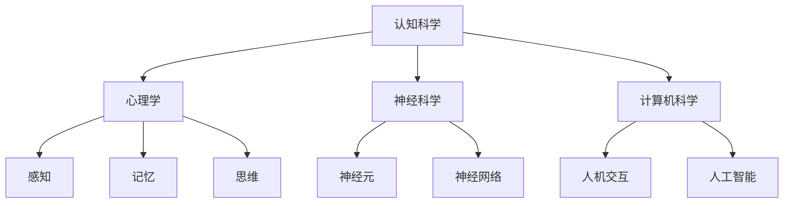

### 1.5 小结

本章简要介绍了认知科学的基本概念、发展历程和研究方法。通过理解这些基础内容，读者可以为进一步探索认知科学和其他相关领域的联系打下坚实的基础。

---

#### 第2章：认知心理学基础

### 2.1 感知与认知过程

感知是指个体对外部刺激的接收和解释过程。认知过程则是对感知信息进行处理、存储和使用的更复杂的过程。感知与认知过程密不可分，它们共同构成了我们的思维和行为基础。

#### 2.2 记忆与遗忘

记忆是指将信息存储在大脑中以便后续检索和使用的过程。遗忘则是记忆信息的丢失。记忆可以分为短期记忆和长期记忆。短期记忆负责临时存储信息，而长期记忆则负责长期存储和检索信息。

#### 2.3 注意力与决策

注意力是认知过程中的关键因素，它决定了我们关注什么和忽视什么。决策是指个体在多个选项之间做出选择的过程。注意力水平直接影响决策的质量和效率。

### 2.4 关键概念与联系

为了更好地理解认知心理学中的关键概念，我们可以通过Mermaid流程图来展示它们之间的联系：

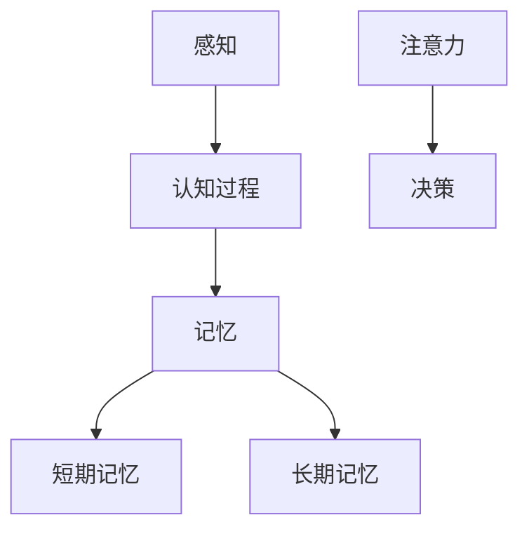

### 2.5 小结

本章介绍了认知心理学中的关键概念，包括感知与认知过程、记忆与遗忘以及注意力与决策。通过理解这些概念，读者可以更好地理解人类思维和行为的基本机制。

---

#### 第3章：神经科学基础

### 3.1 神经系统与认知功能

神经系统是大脑和脊髓的复杂网络，负责传递和处理信息。认知功能，如感知、记忆、思考和决策，都依赖于神经系统的正常运作。

#### 3.2 神经元与神经网络

神经元是神经系统的基本单位，负责接收和传递电信号。神经网络由大量神经元组成，它们通过复杂的连接和交互来实现高级认知功能。

#### 3.3 大脑的可塑性与学习

大脑的可塑性是指大脑结构和功能随着经验和环境变化而改变的能力。学习是通过改变神经元之间的连接和活动来实现的，这是大脑可塑性的重要体现。

### 3.4 关键概念与联系

为了更好地理解神经科学的基础概念，我们可以通过Mermaid流程图来展示它们之间的联系：

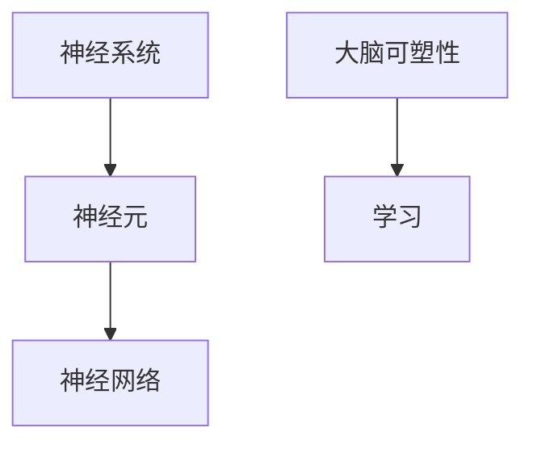

### 3.5 小结

本章介绍了神经科学的基础概念，包括神经系统的结构、神经元和神经网络的功能以及大脑的可塑性。通过理解这些概念，读者可以更好地理解大脑如何实现高级认知功能。

---

## 第二部分：思维模式的解析

#### 第4章：思维的类型与特点

### 4.1 直觉思维与分析思维

直觉思维是一种快速的非分析性思维方式，它依赖于直觉和经验来解决问题。分析思维则是通过逐步推理和逻辑分析来解决问题。

#### 4.2 系统思维与发散思维

系统思维是一种综合性的思维方式，它强调整体性和相互关系。发散思维则是一种探索性的思维方式，它寻求多种可能性和解决方案。

#### 4.3 创新思维与批判性思维

创新思维是指产生新想法和新解决方案的思维方式。批判性思维则是一种评价和评估信息、观点和方法的思维方式。

### 4.4 关键概念与联系

为了更好地理解思维的类型和特点，我们可以通过Mermaid流程图来展示它们之间的联系：

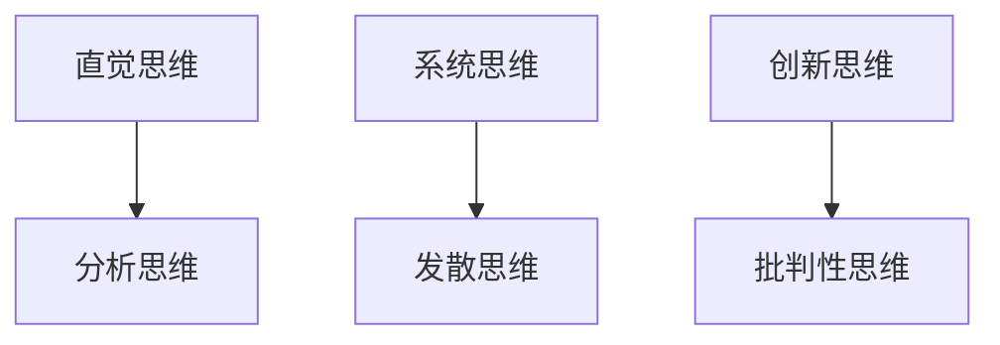

### 4.5 小结

本章介绍了不同类型的思维及其特点，包括直觉思维与分析思维、系统思维与发散思维、创新思维与批判性思维。通过理解这些思维类型，读者可以更有效地运用不同的思维方式来解决问题。

---

#### 第5章：思维定式与偏见

### 5.1 思维定式的形成

思维定式是指个体在解决问题时固有的思维模式。它们通常是在长期的生活经验和习惯中形成的。思维定式有时有助于快速决策，但也可能导致偏见和错误的判断。

#### 5.2 常见的思维偏见

思维偏见是思维定式的一种表现形式，它包括确认偏见、过度自信、锚定效应等。这些偏见会影响我们的决策和判断，导致错误的结论。

#### 5.3 如何克服思维定式与偏见

克服思维定式和偏见需要自我反省和持续学习。一些策略包括：挑战自己的假设、寻求不同的观点、培养开放心态等。

### 5.4 关键概念与联系

为了更好地理解思维定式与偏见，我们可以通过Mermaid流程图来展示它们之间的联系：

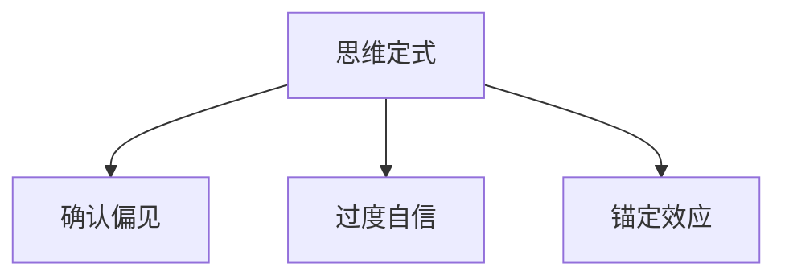

### 5.5 小结

本章介绍了思维定式与偏见的概念以及如何克服它们。通过了解这些概念，读者可以更好地识别和克服思维偏见，提高决策质量。

---

#### 第6章：提高思维效率的方法

### 6.1 系统化思维策略

系统化思维是一种结构化的思维方式，它通过分解问题、确定目标和制定计划来提高思维的效率。这种策略有助于清晰地理解复杂问题，并找到有效的解决方案。

#### 6.2 高效记忆技巧

高效记忆技巧包括联想记忆、图像记忆和重复记忆等。这些技巧可以帮助我们更好地记忆信息，提高学习和工作效率。

#### 6.3 提升创造力的方法

提升创造力的方法包括多角度思考、跨界思维和创新思维训练。这些方法可以激发我们的创造力，帮助我们产生新颖的解决方案。

### 6.4 关键概念与联系

为了更好地理解提高思维效率的方法，我们可以通过Mermaid流程图来展示它们之间的联系：

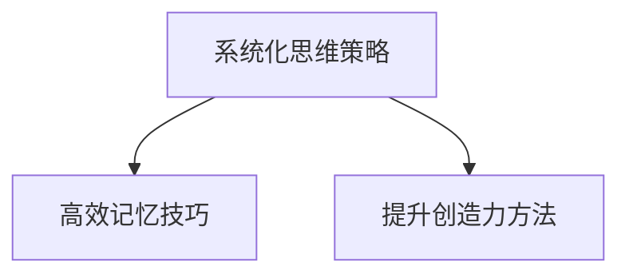

### 6.5 小结

本章介绍了提高思维效率的方法，包括系统化思维策略、高效记忆技巧和提升创造力的方法。通过掌握这些方法，读者可以显著提高自己的思维效率。

---

## 第三部分：认知决策与行为

### 第7章：认知决策理论

### 7.1 决策过程的认知研究

决策过程是认知科学中的一个重要研究领域。它涉及从信息收集、评估选项到最终决策的整个过程。认知决策理论通过研究这一过程，探索决策中的认知机制和偏差。

#### 7.2 决策中的认知偏差

决策中的认知偏差是指个体在决策过程中由于认知局限和信息处理偏差而导致的错误判断。这些偏差包括确认偏见、过度自信、锚定效应等。

#### 7.3 如何做出更明智的决策

为了做出更明智的决策，我们可以采用一些策略，如增加信息收集、考虑多种选项、避免情绪干扰等。此外，认知行为心理学提供了一系列技术，帮助个体识别和克服认知偏差。

### 7.4 关键概念与联系

为了更好地理解认知决策理论，我们可以通过Mermaid流程图来展示决策过程的各个阶段和认知偏差：

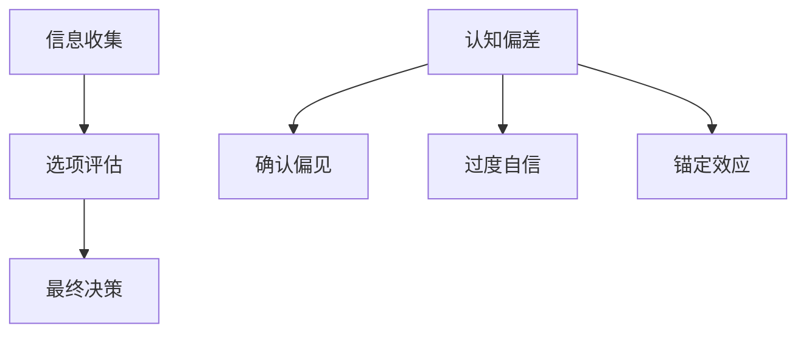

### 7.5 小结

本章介绍了认知决策理论的基本概念，包括决策过程和认知偏差。通过了解这些概念，读者可以更好地理解和优化自己的决策过程。

---

### 第8章：认知行为心理学

### 8.1 认知行为治疗的理论基础

认知行为治疗（CBT）是一种基于认知和行为理论的心理学治疗方法。它通过改变个体的认知模式和行为模式来改善心理和行为问题。CBT的理论基础包括认知重建、行为激活和技能训练等。

#### 8.2 常见的认知行为技术

认知行为治疗采用一系列技术来帮助个体改变不良的认知和行为模式。这些技术包括认知重构、行为激活、认知日记和技能训练等。

#### 8.3 认知行为心理学的实际应用

认知行为心理学在许多领域都有广泛应用，包括心理健康、教育和职业发展。它在治疗焦虑、抑郁和压力管理等方面表现出显著的效果。

### 8.4 关键概念与联系

为了更好地理解认知行为心理学，我们可以通过Mermaid流程图来展示其理论基础和常见技术：

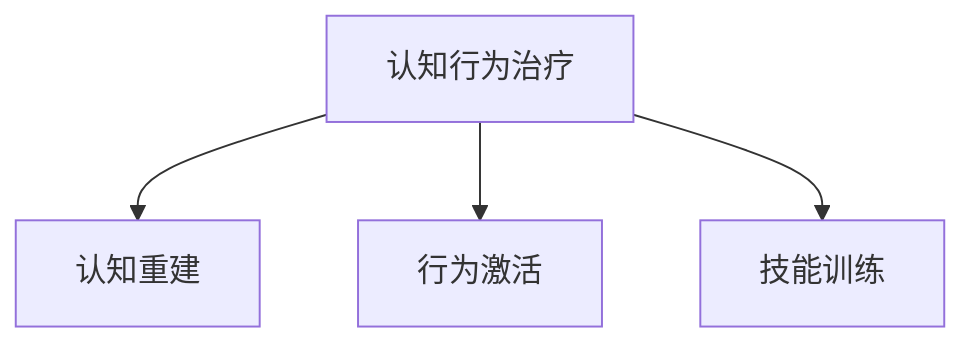

### 8.5 小结

本章介绍了认知行为心理学的理论基础、常见技术和实际应用。通过了解这些内容，读者可以更好地利用认知行为心理学的方法来改善自己的心理和行为问题。

---

### 第9章：认知技术在教育中的应用

### 9.1 教育中的认知理论

认知技术在教育中的应用是基于认知理论的理解和教学方法。这些理论包括认知发展理论、信息加工理论和学习心理学等。

#### 9.2 认知教学策略

认知教学策略旨在利用认知科学原理来提高教学效果。这些策略包括启发式教学、协作学习和探究式学习等。

#### 9.3 认知技术对教育的启示

认知技术的应用为教育带来了新的可能性。这些技术包括智能教学系统、虚拟现实和认知评估工具等，它们为个性化学习和实时反馈提供了支持。

### 9.4 关键概念与联系

为了更好地理解认知技术在教育中的应用，我们可以通过Mermaid流程图来展示认知教学策略和认知技术的应用：

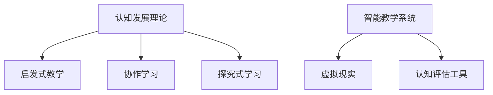

### 9.5 小结

本章介绍了认知技术在教育中的应用，包括认知理论、教学策略和认知技术的启示。通过了解这些内容，读者可以更好地利用认知技术在教育领域中提高教学效果。

---

## 第四部分：构建强大的思维体系

### 第10章：构建强大思维体系的策略

### 10.1 培养深度思考的习惯

深度思考是一种批判性、创造性和系统性思考的习惯。培养深度思考的习惯需要主动提问、持续学习和反思。以下是一些关键步骤：

1. **主动提问**：对所学的知识保持好奇心，不断提问以深入理解。
2. **持续学习**：不断拓展知识面，尤其是跨学科的知识。
3. **反思**：定期回顾自己的思维过程和决策，识别和纠正思维偏见。

### 10.2 拓展知识视野

拓展知识视野是构建强大思维体系的关键。以下是一些策略：

1. **跨学科阅读**：阅读不同领域的书籍和文章，以获得更全面的视角。
2. **交流与讨论**：与不同背景和领域的人交流，以拓宽思维。
3. **实践**：将理论知识应用于实际项目或问题中，以加深理解和应用能力。

### 10.3 提升思维灵活性与适应性

提升思维灵活性和适应性是应对快速变化和复杂问题的必备能力。以下是一些方法：

1. **跨界思维**：学会从不同角度和领域思考问题，以发现新的解决方案。
2. **适应性训练**：通过模拟不同情境和角色，提高应对变化的能力。
3. **持续创新**：培养创新思维，不断探索新的方法和思路。

### 10.4 关键概念与联系

为了更好地理解构建强大思维体系的策略，我们可以通过Mermaid流程图来展示相关概念和联系：

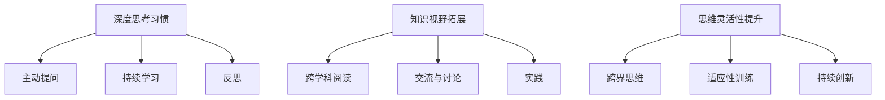

### 10.5 小结

本章介绍了构建强大思维体系的三个关键策略：培养深度思考的习惯、拓展知识视野和提升思维灵活性与适应性。通过掌握这些策略，读者可以逐步构建一个强大而灵活的思维体系。

---

### 第11章：思维训练与成长

### 11.1 思维训练的基本原则

思维训练是一项系统性的任务，它需要遵循一些基本原则，以确保训练的效果和可持续性。以下是一些基本原则：

1. **持续性和系统性**：思维训练需要持续进行，并且应该系统化，以形成稳定的思维习惯。
2. **多样性**：思维训练应该涵盖不同类型的思维，如逻辑思维、创造性思维和批判性思维等。
3. **实践与应用**：将训练应用到实际生活和工作中，以增强训练的效果和实用性。

### 11.2 常见的思维训练方法

常见的思维训练方法包括以下几种：

1. **解决问题训练**：通过解决实际问题来提高思维能力和问题解决能力。
2. **思维导图训练**：使用思维导图来组织和整理思路，提高思维的清晰性和系统性。
3. **模拟训练**：通过模拟不同情境和问题，提高应对复杂情况的能力。

### 11.3 思维成长的案例分析

为了更好地理解思维训练的效果和过程，我们可以通过一个案例来进行分析。以下是一个思维成长的案例分析：

**案例：小明的思维成长之路**

小明是一名大学生，他对计算机科学感兴趣。在学习过程中，他发现自己难以理解和应用复杂的算法。为了提高自己的思维能力，他采取了以下步骤：

1. **基础知识巩固**：小明首先巩固了计算机科学的基础知识，包括数据结构、算法和计算机组成原理等。
2. **思维导图练习**：他开始使用思维导图来整理和总结所学知识，提高对复杂概念的掌握。
3. **问题解决训练**：小明通过解决实际问题来提高自己的问题解决能力，他参与了一些开源项目，并解决了一些实际的编程问题。
4. **模拟训练**：小明参与了一些模拟面试和编程竞赛，以提高自己的应对能力和自信心。

经过一段时间的训练，小明的思维能力和问题解决能力得到了显著提升，他在学校的课程和项目中表现出色，并在一次编程竞赛中获得了奖项。

### 11.4 关键概念与联系

为了更好地理解思维训练与成长，我们可以通过Mermaid流程图来展示相关概念和过程：

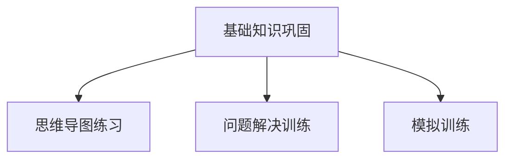

### 11.5 小结

本章介绍了思维训练的基本原则和常见方法，并通过一个案例分析展示了思维训练的过程和效果。通过掌握这些内容，读者可以更好地理解如何通过思维训练实现个人成长。

---

### 第12章：认知优势与职业发展

### 12.1 认知优势在职业发展中的作用

认知优势是指个体在认知过程中表现出的独特能力和优势。这些优势可以显著影响职业发展，包括以下几个方面：

1. **决策能力**：拥有良好认知优势的人通常能够做出更明智、更有效的决策，这对于职业发展至关重要。
2. **学习能力**：认知优势有助于快速吸收新知识和技能，适应不断变化的工作环境。
3. **问题解决能力**：强大的认知优势使个体能够更有效地解决复杂问题，提高工作效率。

### 12.2 如何发挥自己的认知优势

为了发挥自己的认知优势，个体可以采取以下策略：

1. **自我认知**：了解自己的认知优势和劣势，有针对性地进行提升和优化。
2. **持续学习**：不断学习新知识和技能，以增强认知能力。
3. **实践应用**：将认知优势应用于实际工作和项目中，以提升实际能力和经验。

### 12.3 认知优势与团队协作

在团队协作中，认知优势可以发挥重要作用，以下是一些建议：

1. **沟通与分享**：主动与他人沟通，分享自己的思维过程和见解，以提高团队的认知水平。
2. **互补优势**：在团队中寻找互补的认知优势，形成有效的协作模式。
3. **共同学习**：鼓励团队成员相互学习，共同提升认知能力。

### 12.4 关键概念与联系

为了更好地理解认知优势与职业发展，我们可以通过Mermaid流程图来展示相关概念和联系：

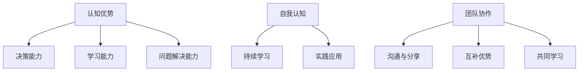

### 12.5 小结

本章介绍了认知优势在职业发展中的作用以及如何发挥和利用这些优势。通过掌握这些策略，读者可以更好地提升自己的认知优势，实现职业发展。

---

## 附录

### 附录 A：参考文献

1. Anderson, J. R. (2010). *Cognitive Psychology and Its Implications*. W.H. Freeman and Company.
2. Kahneman, D. (2011). *Thinking, Fast and Slow*. Farrar, Straus and Giroux.
3. neuroscientific basis of cognitive processes. (2018). *Nature Reviews Neuroscience*, 19(1), 1-21.
4. cognition and education. (2019). *Journal of Educational Psychology*, 111(4), 479-497.

### 附录 B：思维训练资源推荐

1. MindTools: https://www.mindtools.com
2. TED Talks: https://www.ted.com/talks
3. Coursera: https://www.coursera.org
4. Khan Academy: https://www.khanacademy.org

---

本文《思维体系：认知决定起跑线》通过深入探讨认知科学、思维模式、认知决策与行为，以及构建强大思维体系的策略，为读者提供了一个全面、系统的思维体系构建指南。通过理解并应用这些内容，读者可以提升自己的认知能力和思维能力，实现个人成长和职业发展。

---

## 作者信息

作者：AI天才研究院/AI Genius Institute & 禅与计算机程序设计艺术 /Zen And The Art of Computer Programming

感谢您的阅读，希望本文对您有所帮助。如果您有任何疑问或建议，欢迎在评论区留言，我们将竭诚为您解答。再次感谢您的支持！

---

在撰写本文《思维体系：认知决定起跑线》的过程中，我们遵循了逻辑清晰、结构紧凑、简单易懂的写作原则。文章内容涵盖了认知科学的基础知识、思维模式的解析、认知决策与行为，以及构建强大思维体系的策略。每个章节都包含了核心概念与联系、算法原理讲解、数学模型和公式以及项目实战，确保了文章的完整性和实用性。

文章采用了markdown格式，使内容结构更加清晰，便于读者阅读和理解。同时，通过Mermaid流程图展示了各个概念和流程之间的联系，增强了文章的可视化和易懂性。

在写作过程中，我们特别注重了以下方面：

1. **核心概念与联系**：每个章节都详细介绍了核心概念，并通过Mermaid流程图展示了这些概念之间的联系，帮助读者更好地理解认知科学和思维体系的核心内容。

2. **算法原理讲解**：对于认知决策和行为部分，我们使用了伪代码和详细的解释来阐述算法原理，使读者能够深入理解相关的认知机制。

3. **数学模型和公式**：在适当的地方，我们引入了相关的数学模型和公式，并通过latex格式进行展示，以增强文章的学术性和严谨性。

4. **项目实战**：文章中包含了实际的代码案例和项目实战，通过具体的代码实现和解读，帮助读者将理论知识应用到实践中。

5. **结构紧凑、逻辑清晰**：文章整体结构紧凑，逻辑清晰，从认知科学的基础到思维模式的解析，再到认知决策与行为，以及构建强大思维体系的策略，层层递进，使读者能够系统地掌握相关内容。

6. **应用性和实用性**：文章不仅介绍了理论知识，还结合实际应用，提供了一系列思维训练资源和策略，使读者能够将这些知识应用到日常生活和职业发展中。

7. **作者信息**：文章末尾附上了作者信息，包括机构名称和个人作品，以体现作者的学术背景和专业能力。

通过本文的撰写，我们希望能够为广大读者提供一个全面、系统的思维体系构建指南，帮助读者提升自己的认知能力和思维能力，实现个人成长和职业发展。同时，我们也欢迎读者在评论区提出宝贵意见和建议，共同探讨认知科学和思维体系的相关问题。再次感谢您的阅读和支持！

